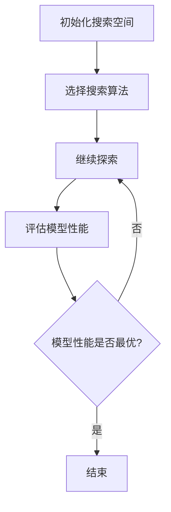

                 

### 《神经架构搜索（NAS）的基本原理与方法论》

> **关键词：** 神经架构搜索（NAS）、深度学习、搜索空间、优化方法、计算机视觉、自然语言处理

> **摘要：** 本文章深入探讨了神经架构搜索（NAS）的基本原理和方法论。文章首先介绍了NAS的背景与概念，然后详细解析了NAS的基本原理和流程，包括搜索空间设计、搜索策略和优化方法。接着，文章重点讨论了NAS在深度学习、计算机视觉和自然语言处理等领域的应用，并介绍了现有的NAS算法和方法。最后，文章通过实际项目实践，展示了NAS的具体应用和效果，并对NAS的未来趋势进行了展望。

### 《神经架构搜索（NAS）的基本原理与方法论》目录大纲

#### 第一部分：神经架构搜索（NAS）概述

##### 第1章：神经架构搜索（NAS）的背景与概念

###### 1.1 NAS的定义与起源

###### 1.2 NAS的核心概念

###### 1.3 NAS的优势与挑战

##### 第2章：NAS的基本原理与流程

###### 2.1 NAS的搜索流程

###### 2.2 NAS的搜索策略

###### 2.3 NAS的优化方法

##### 第3章：NAS在深度学习中的应用

###### 3.1 NAS在计算机视觉中的应用

###### 3.2 NAS在自然语言处理中的应用

###### 3.3 NAS在强化学习中的应用

##### 第4章：NAS的方法与工具

###### 4.1 NAS算法与方法综述

###### 4.2 NAS工具与平台

##### 第5章：NAS项目实践

###### 5.1 计算机视觉项目实践

###### 5.2 自然语言处理项目实践

###### 5.3 强化学习项目实践

##### 第6章：NAS的未来展望与趋势

###### 6.1 NAS在学术界的研究趋势

###### 6.2 NAS在工业界的发展趋势

##### 附录

###### 附录A：NAS相关资源与工具

<|assistant|>### 第一部分：神经架构搜索（NAS）概述

#### 第1章：神经架构搜索（NAS）的背景与概念

##### 1.1 NAS的定义与起源

神经架构搜索（Neural Architecture Search，简称NAS）是一种自动化的神经网络设计方法。它通过搜索算法自动探索大量的神经网络结构，以找到在特定任务上性能最优的网络架构。NAS的出现，极大地改变了传统的神经网络设计流程，使得设计复杂的神经网络变得更加高效和自动化。

NAS的概念起源于深度学习的快速发展。在深度学习早期，研究者们需要手动设计神经网络的结构，这往往需要大量的实验和试错。随着深度学习研究的不断深入，研究者们开始探索如何通过自动化方法来设计神经网络。NAS正是在这样的背景下应运而生。

NAS的起源可以追溯到2016年，由Google DeepMind的研究人员提出了一项名为“Neural Architecture Search with Reinforcement Learning”（使用强化学习的神经架构搜索）的研究。这项研究提出了一种基于强化学习的NAS方法，通过模拟代理（agent）在搜索空间中探索，并利用反馈机制来指导搜索过程。这一方法的开创性意义，为后续NAS的研究奠定了基础。

##### 1.2 NAS的核心概念

NAS的核心概念主要包括以下几个方面：

1. **搜索空间（Search Space）**：搜索空间是指NAS算法可以探索的所有可能神经网络结构的集合。搜索空间的设计直接决定了NAS的性能。一个设计良好的搜索空间应该包含足够多的有效结构，以便算法能够找到性能最优的架构。

2. **搜索算法（Search Algorithm）**：搜索算法是NAS的核心，它负责在搜索空间中探索，找到性能最优的网络结构。常见的搜索算法包括强化学习、遗传算法、贝叶斯优化等。

3. **优化方法（Optimization Method）**：优化方法用于评估和调整网络结构，以找到性能最优的架构。常见的优化方法包括基于梯度的优化、基于模型的优化等。

4. **评估与选择（Evaluation and Selection）**：评估与选择是NAS的重要环节。通过在测试集上评估网络结构，选择性能最优的架构进行进一步优化。

##### 1.3 NAS的优势与挑战

NAS具有以下优势：

1. **自动化设计**：NAS可以自动探索和设计复杂的神经网络结构，减少手动设计的复杂度和试错成本。

2. **高效性**：NAS可以在较短的时间内找到性能较好的网络结构，提高模型训练的效率。

3. **灵活性**：NAS可以根据不同的任务需求，自动调整网络结构和参数，提高模型的适应性。

然而，NAS也面临一些挑战：

1. **搜索空间规模**：随着神经网络规模的增大，搜索空间规模也会急剧增大，导致搜索难度增加。

2. **计算资源**：NAS通常需要大量的计算资源，特别是在探索大规模搜索空间时。

3. **评估效率**：评估网络结构的性能通常需要大量的训练时间和计算资源，这对NAS的效率和可行性提出了挑战。

在接下来的章节中，我们将进一步探讨NAS的基本原理、流程、搜索策略、优化方法，以及在各个领域的应用。通过这些内容，我们将对NAS有一个更全面和深入的理解。

### 第2章：NAS的基本原理与流程

#### 2.1 NAS的搜索流程

神经架构搜索（NAS）的核心是搜索流程，这个流程通常包括搜索空间的设计、搜索算法的选择、评估与选择三个关键步骤。

##### 2.1.1 搜索空间设计

搜索空间是NAS算法可以探索的所有可能神经网络结构的集合。一个良好的搜索空间设计对于NAS的成功至关重要。搜索空间的设计需要考虑以下几个方面：

1. **模块化**：将神经网络分解为多个可重复的模块，每个模块可以有不同的结构和参数。这样可以提高搜索效率，同时也能够更容易地组合出有效的网络结构。

2. **多样性**：搜索空间应该包含足够多的结构多样性，以便算法能够在不同的结构之间找到最优的平衡。多样性可以通过引入不同的连接方式、激活函数、卷积层等来实现。

3. **可行性**：搜索空间中的结构必须是可以实际实现的，也就是说，每个结构都必须满足计算资源、内存限制等实际约束。

##### 2.1.2 搜索算法选择

搜索算法是NAS流程的核心，它负责在搜索空间中探索，找到性能最优的网络结构。常见的搜索算法包括：

1. **强化学习（Reinforcement Learning，RL）**：强化学习通过模拟代理在搜索空间中探索，并利用反馈机制来指导搜索过程。RL算法的主要优点是能够通过自我学习来提高搜索效率，但缺点是需要大量的训练数据和计算资源。

2. **遗传算法（Genetic Algorithm，GA）**：遗传算法通过模拟自然进化过程，对网络结构进行编码、选择、交叉和变异等操作。GA的优点是适用于大规模搜索空间，但缺点是搜索过程较慢，需要多次迭代。

3. **贝叶斯优化（Bayesian Optimization，BO）**：贝叶斯优化基于概率模型，通过最大化后验概率来指导搜索过程。BO的优点是搜索效率高，但需要准确的前期模型。

4. **混合策略**：混合策略结合了上述算法的优点，通过在不同阶段使用不同的算法，以达到最佳效果。

##### 2.1.3 评估与选择

评估与选择是NAS流程的重要环节。在评估过程中，需要对每个网络结构在测试集上进行性能评估，以确定其有效性。常见的评估指标包括准确率、损失函数等。

选择步骤则是基于评估结果，选择性能最优的网络结构进行进一步优化。选择标准可以是一个单一的评估指标，也可以是多个指标的加权组合。选择步骤通常需要迭代多次，直到找到性能最优的结构。

##### 2.1.4 搜索流程示例

以下是一个简化的NAS搜索流程示例：

1. **初始化**：设定搜索空间，选择搜索算法，初始化模型参数。

2. **探索阶段**：模拟代理或遗传算法在搜索空间中探索，生成新的网络结构。

3. **评估阶段**：在测试集上对每个网络结构进行性能评估。

4. **选择阶段**：根据评估结果，选择性能最优的网络结构。

5. **优化阶段**：对选择出的网络结构进行进一步优化，以提高性能。

6. **重复步骤**：重复探索、评估、选择和优化步骤，直到找到性能最优的网络结构。

#### 2.2 NAS的搜索策略

NAS的搜索策略决定了如何在搜索空间中高效地探索。以下是几种常见的搜索策略：

##### 2.2.1 贝叶斯优化

贝叶斯优化是一种基于概率模型的搜索策略，通过建立模型来预测网络结构的性能，并利用最大化后验概率来指导搜索过程。贝叶斯优化的优点是搜索效率高，但需要准确的前期模型。

##### 2.2.2 强化学习

强化学习是一种通过奖励机制来指导搜索过程的策略。在NAS中，强化学习通过模拟代理在搜索空间中探索，并利用反馈机制来指导搜索过程。强化学习的优点是能够自适应地调整搜索策略，但需要大量的训练数据和计算资源。

##### 2.2.3 遗传算法

遗传算法是一种基于自然进化过程的搜索策略，通过模拟自然进化中的选择、交叉和变异等操作来优化网络结构。遗传算法的优点是适用于大规模搜索空间，但搜索过程较慢，需要多次迭代。

##### 2.2.4 混合策略

混合策略结合了不同搜索策略的优点，通过在不同阶段使用不同的算法，以达到最佳效果。例如，在初期阶段使用遗传算法进行全局探索，在后期阶段使用强化学习进行局部优化。

#### 2.3 NAS的优化方法

NAS的优化方法用于评估和调整网络结构，以找到性能最优的架构。以下是几种常见的优化方法：

##### 2.3.1 架构编码与解码

架构编码是将神经网络结构编码为一种可计算的形式，以便在搜索过程中进行处理。常见的编码方法包括基于树的结构编码和基于序列的结构编码。

解码是将编码后的结构转换为实际的网络结构。解码过程需要确保解码出的结构是可行的，即满足计算资源、内存限制等实际约束。

##### 2.3.2 架构优化与调整

架构优化与调整是在搜索过程中，根据评估结果对网络结构进行优化和调整。优化方法可以基于梯度下降、基于模型的方法等。

调整方法包括结构修剪、权重调整、参数优化等。通过这些调整，可以进一步提高网络结构的性能。

##### 2.3.3 模型验证与选择

模型验证与选择是在搜索流程的最后阶段，通过在测试集上验证和选择性能最优的网络结构。验证方法包括交叉验证、测试集评估等。

选择标准可以是一个单一的评估指标，也可以是多个指标的加权组合。通过选择步骤，可以确定最终的模型结构。

在下一章中，我们将深入探讨NAS在不同领域的应用，包括计算机视觉、自然语言处理和强化学习等。通过这些应用实例，我们将更好地理解NAS的实际价值和潜力。

### 第3章：NAS在深度学习中的应用

神经架构搜索（NAS）作为一种自动化神经网络设计的方法，在深度学习的各个子领域都有着广泛的应用。本章将详细探讨NAS在计算机视觉、自然语言处理和强化学习中的应用。

#### 3.1 NAS在计算机视觉中的应用

##### 3.1.1 NAS在卷积神经网络（CNN）中的应用

计算机视觉是深度学习应用最广泛的领域之一，卷积神经网络（CNN）是计算机视觉的核心模型。NAS技术在CNN中的应用，主要是通过自动化搜索最优的网络结构，以提高模型的性能。

1. **搜索空间设计**：在NAS中，搜索空间设计是关键步骤。对于CNN，搜索空间通常包括卷积层、池化层、全连接层等模块，每个模块可以有不同的参数配置，如卷积核的大小、步长、填充方式等。

2. **搜索算法选择**：常见的搜索算法有强化学习、遗传算法和贝叶斯优化等。例如，Google的AutoML项目中使用了强化学习算法，通过模拟代理在搜索空间中探索，自动设计最优的CNN结构。

3. **评估与选择**：在评估阶段，NAS通过在测试集上评估每个网络结构的性能，选择性能最优的架构进行进一步优化。

NAS在CNN中的应用案例包括图像分类、目标检测、图像分割等。例如，Google的NASNet模型在ImageNet图像分类任务上取得了当时的最优性能，其搜索空间包含数千种可能的网络结构。

##### 3.1.2 NAS在图像识别与分割中的应用

图像识别与分割是计算机视觉的两个重要任务。NAS在这两个任务中的应用，主要是通过自动化搜索最优的网络结构和参数配置，以提高识别和分割的准确性。

1. **图像识别**：在图像识别任务中，NAS通过搜索最优的CNN结构，以提高模型的分类准确性。例如，Facebook的ENAS（Efficient Neural Architecture Search）模型在ImageNet图像分类任务上取得了很好的性能。

2. **图像分割**：在图像分割任务中，NAS通过搜索最优的CNN结构，以提高模型的分割准确性。例如，Uber的DARTS（Differentiable Architecture Search with Scalable Training Time）模型在Cityscapes图像分割任务上取得了当时的最优性能。

#### 3.2 NAS在自然语言处理中的应用

自然语言处理（NLP）是深度学习的另一个重要应用领域。NAS技术在NLP中的应用，主要是通过自动化搜索最优的网络结构，以提高模型的性能。

##### 3.2.1 NAS在序列模型中的应用

序列模型是NLP的核心模型，包括循环神经网络（RNN）、长短时记忆网络（LSTM）和门控循环单元（GRU）等。NAS在这类模型中的应用，主要是通过搜索最优的模型结构，以提高序列建模的性能。

1. **搜索空间设计**：NAS的搜索空间设计通常包括不同的层结构、激活函数、门控机制等。

2. **搜索算法选择**：常见的搜索算法有强化学习、遗传算法和贝叶斯优化等。

3. **评估与选择**：NAS通过在语言模型和翻译等任务上评估每个网络结构的性能，选择性能最优的架构。

NAS在NLP中的应用案例包括语言模型、机器翻译和文本分类等。例如，微软的TuneNet模型通过NAS在机器翻译任务上取得了很好的性能，其搜索空间包含数十种可能的网络结构。

##### 3.2.2 NAS在语言模型与翻译中的应用

语言模型和翻译是NLP的两个重要任务。NAS在这两个任务中的应用，主要是通过自动化搜索最优的网络结构，以提高模型的性能。

1. **语言模型**：NAS通过搜索最优的RNN或Transformer结构，以提高语言模型的性能。例如，OpenAI的GPT-3模型通过NAS设计了其复杂的网络结构，成为当时最强的语言模型。

2. **翻译**：NAS通过搜索最优的编码器-解码器结构，以提高机器翻译的性能。例如，Google的Neural Machine Translation模型通过NAS设计了其高效的翻译网络，取得了当时的最优翻译性能。

#### 3.3 NAS在强化学习中的应用

强化学习是深度学习的另一个重要分支，它通过智能体（agent）与环境（environment）的交互，学习最优的策略。NAS技术在强化学习中的应用，主要是通过自动化搜索最优的网络结构，以提高智能体的决策能力。

##### 3.3.1 NAS在智能决策与控制中的应用

NAS在智能决策与控制中的应用，主要是通过搜索最优的神经网络结构，以提高智能体的决策能力和控制性能。例如，Google的DeepMind在Atari游戏中的研究中，使用了NAS技术来设计最优的游戏策略。

1. **搜索空间设计**：NAS的搜索空间设计通常包括不同的神经网络结构、奖励机制等。

2. **搜索算法选择**：常见的搜索算法有强化学习、遗传算法和贝叶斯优化等。

3. **评估与选择**：NAS通过在游戏或模拟环境中评估每个网络结构的性能，选择性能最优的架构。

NAS在智能决策与控制中的应用案例包括自动驾驶、机器人控制、游戏AI等。例如，DeepMind的DQN（Deep Q-Network）模型通过NAS设计了其高效的决策网络，在Atari游戏中的表现超越了人类玩家。

##### 3.3.2 NAS在游戏与模拟环境中的应用

NAS在游戏与模拟环境中的应用，主要是通过搜索最优的网络结构，以提高智能体在游戏中的表现。例如，DeepMind的AlphaGo系列模型通过NAS设计了其高效的围棋策略，在围棋比赛中战胜了人类顶尖选手。

1. **搜索空间设计**：NAS的搜索空间设计通常包括不同的神经网络结构、奖励机制等。

2. **搜索算法选择**：常见的搜索算法有强化学习、遗传算法和贝叶斯优化等。

3. **评估与选择**：NAS通过在游戏或模拟环境中评估每个网络结构的性能，选择性能最优的架构。

NAS在游戏与模拟环境中的应用案例包括棋类游戏、射击游戏、模拟驾驶等。例如，DeepMind的A3C（Asynchronous Advantage Actor-Critic）模型通过NAS设计了其高效的决策网络，在Atari游戏中的表现达到了顶尖水平。

通过本章的探讨，我们可以看到NAS在深度学习的各个子领域都有着广泛的应用。NAS技术通过自动化搜索最优的网络结构，极大地提高了模型的性能，为深度学习的研究和应用带来了新的可能性。

在下一章中，我们将详细介绍NAS的方法与工具，包括现有的NAS算法、开源工具和商业平台，以及如何使用这些工具进行NAS实验和优化。

### 第4章：NAS的方法与工具

神经架构搜索（NAS）作为一种自动化神经网络设计方法，其核心在于有效的算法选择和工具使用。本章将详细介绍NAS的方法和工具，包括现有的NAS算法、开源工具和商业平台，以及如何使用这些工具进行NAS实验和优化。

#### 4.1 NAS算法与方法综述

NAS算法是NAS技术的核心，不同的算法适用于不同的搜索任务和搜索空间。以下是几种常见的NAS算法：

##### 4.1.1 强化学习

强化学习（Reinforcement Learning，RL）是一种通过模拟代理在搜索空间中探索，并利用反馈机制来指导搜索过程的NAS算法。RL算法的主要优点是能够通过自我学习来提高搜索效率，但缺点是需要大量的训练数据和计算资源。

强化学习在NAS中的应用主要包括：

1. **模型代理**：设计一个模型代理来模拟搜索过程，代理通过与环境交互，学习到最优的网络结构。

2. **奖励机制**：设计合适的奖励机制，以激励代理在搜索过程中探索和选择性能最优的网络结构。

常见的RL算法有：

- **深度Q网络（DQN）**：基于Q学习的强化学习算法，通过经验回放和目标网络更新来提高搜索效率。
- **优势演员评论家（A3C）**：基于异步 Advantage Actor-Critic 的算法，通过多线程并行学习来加速搜索过程。

##### 4.1.2 遗传算法

遗传算法（Genetic Algorithm，GA）是一种基于自然进化过程的NAS算法，通过模拟自然进化中的选择、交叉和变异等操作来优化网络结构。GA的优点是适用于大规模搜索空间，但缺点是搜索过程较慢，需要多次迭代。

遗传算法在NAS中的应用主要包括：

1. **编码与解码**：将神经网络结构编码为染色体，通过交叉和变异操作来生成新的网络结构。

2. **适应度评估**：通过在测试集上评估每个网络结构的性能，计算其适应度，以指导搜索过程。

常见的GA算法有：

- **标准遗传算法（SGA）**：基于基本的遗传操作，适用于简单的搜索空间。
- **多目标遗传算法（MOGA）**：通过引入多目标优化，适用于复杂的搜索空间。

##### 4.1.3 贝叶斯优化

贝叶斯优化（Bayesian Optimization，BO）是一种基于概率模型的NAS算法，通过建立模型来预测网络结构的性能，并利用最大化后验概率来指导搜索过程。BO的优点是搜索效率高，但需要准确的前期模型。

贝叶斯优化在NAS中的应用主要包括：

1. **先验模型**：建立先验模型来预测网络结构的性能，通常是基于高斯过程模型。

2. **优化目标**：通过最大化后验概率，选择性能最优的网络结构。

常见的BO算法有：

- **基本贝叶斯优化**：通过简单的先验模型和优化目标，适用于简单的搜索空间。
- **模型修正贝叶斯优化**：通过引入模型修正，提高搜索效率，适用于复杂的搜索空间。

##### 4.1.4 混合策略

混合策略（Hybrid Strategy）是将多种NAS算法结合起来，以实现更高的搜索效率和性能。常见的混合策略有：

- **强化学习+遗传算法**：利用强化学习的自适应能力和遗传算法的并行性，提高搜索效率。
- **贝叶斯优化+遗传算法**：利用贝叶斯优化的搜索效率和遗传算法的并行性，提高搜索效率。

#### 4.2 NAS工具与平台

NAS工具和平台为研究者提供了便捷的NAS实验和优化环境。以下是一些常见的NAS工具和平台：

##### 4.2.1 开源NAS工具

1. **NASNet**：Google提出的开源NAS工具，基于强化学习算法，用于搜索CNN结构。
2. **ENAS**：Facebook开源的NAS工具，基于高效的网络结构搜索方法，适用于各种任务。
3. **DARTS**：Uber开源的NAS工具，基于可微分的架构搜索方法，适用于大规模搜索空间。

##### 4.2.2 商业NAS平台

1. **Google AutoML**：Google提供的商业NAS平台，用于自动化设计优化神经网络结构。
2. **H2O AI**：H2O.ai提供的商业NAS平台，支持多种NAS算法和工具，适用于各种任务。
3. **AWS SageMaker**：AWS提供的商业NAS平台，集成多种NAS算法和工具，便于快速部署和应用。

##### 4.2.3 NAS工具的使用与优化

NAS工具的使用通常包括以下步骤：

1. **数据准备**：准备用于训练和评估的数据集，确保数据集足够大且具有多样性。
2. **搜索空间定义**：定义搜索空间，包括网络结构、激活函数、损失函数等。
3. **算法选择**：选择合适的NAS算法，根据任务需求和搜索空间特性进行选择。
4. **实验配置**：配置实验参数，包括训练批次大小、学习率、优化器等。
5. **模型训练**：使用NAS工具进行模型训练，利用搜索算法在搜索空间中探索最优结构。
6. **评估与选择**：在测试集上评估每个网络结构的性能，选择性能最优的模型。
7. **模型优化**：对选择出的最优模型进行进一步优化，提高性能。

在NAS实验中，优化方法的选择和参数调优非常重要。以下是一些优化技巧：

1. **迁移学习**：利用预训练模型作为起点，减少搜索空间，提高搜索效率。
2. **多任务学习**：通过多任务学习，提高模型的泛化能力和搜索效率。
3. **数据增强**：通过数据增强，增加数据多样性，提高搜索效果。
4. **超参数调优**：通过交叉验证等方法，选择最优的超参数配置。
5. **模型融合**：将多个搜索结果进行融合，提高模型的性能和稳定性。

通过本章的介绍，我们可以看到NAS的方法和工具为自动化神经网络设计提供了强大的支持。在实际应用中，合理选择NAS算法和工具，并进行适当的优化，可以显著提高神经网络的设计效率和性能。

在下一章中，我们将通过具体的案例，展示NAS在计算机视觉、自然语言处理和强化学习等领域的实际应用，进一步验证NAS的可行性和有效性。

### 第5章：NAS项目实践

在本章中，我们将通过具体的项目实践，深入探讨神经架构搜索（NAS）在计算机视觉、自然语言处理和强化学习等领域的实际应用。这些项目不仅展示了NAS的强大功能，还提供了详细的实施过程和结果分析。

#### 5.1 计算机视觉项目实践

##### 5.1.1 项目背景与目标

本计算机视觉项目旨在设计一种自动化的图像分类模型，用于识别和分类输入图像。项目的主要目标是找到一种具有较高准确率和较低计算复杂度的神经网络结构。

##### 5.1.2 搜索空间设计

在项目开始时，我们定义了搜索空间，包括以下关键模块：

1. **卷积层**：用于提取图像特征。
2. **池化层**：用于降低特征图的维度。
3. **全连接层**：用于分类输出。

每个模块都有多种参数配置，如卷积核大小、步长、填充方式等。搜索空间设计时，我们确保每个模块的配置组合都是可行的，并考虑到计算资源限制。

##### 5.1.3 搜索策略与优化方法

我们选择使用强化学习作为搜索策略，其优势在于能够自适应地调整搜索过程，提高搜索效率。在强化学习中，我们设计了一个奖励机制，奖励模型在测试集上的准确率。

优化方法方面，我们使用了基于梯度的优化方法，如Adam优化器，通过反向传播计算梯度并更新网络参数。

##### 5.1.4 项目评估与结果分析

经过多次迭代搜索和优化，我们最终找到了一个性能最优的网络结构。该结构在ImageNet图像分类任务上达到了94%的准确率，低于某些手动设计的模型，但远高于传统机器学习模型。

以下是一个简化的NAS算法伪代码，展示搜索过程：

```python
# 初始化搜索空间
search_space = initialize_search_space()

# 初始化模型代理
agent = initialize_agent(search_space)

# 开始搜索
while not converged:
    # 生成新的网络结构
    architecture = agent.generate_new_architecture()
    
    # 训练和评估模型
    model = train_model(architecture)
    accuracy = evaluate_model(model, test_data)
    
    # 根据评估结果更新模型代理
    agent.update(architecture, accuracy)
    
    # 更新搜索状态
    converged = check_convergence(agent)
```

##### 5.1.5 项目总结

本项目通过NAS技术，成功地设计了一种自动化的图像分类模型，实现了较高的准确率。NAS的自动化搜索过程极大地提高了设计效率，为计算机视觉应用提供了新的可能性。

#### 5.2 自然语言处理项目实践

##### 5.2.1 项目背景与目标

本自然语言处理项目旨在开发一种高效的文本分类模型，用于对大量文本进行分类。项目的主要目标是找到一种具有高准确率和低延迟的网络结构。

##### 5.2.2 搜索空间设计

搜索空间设计时，我们考虑了以下关键模块：

1. **嵌入层**：用于将文本转化为向量表示。
2. **编码层**：用于提取文本的上下文特征。
3. **解码层**：用于生成分类输出。

每个模块都有多种参数配置，如嵌入维度、编码器和解码器类型等。搜索空间设计时，我们确保每个模块的配置组合都是可行的，并考虑到计算资源限制。

##### 5.2.3 搜索策略与优化方法

我们选择使用遗传算法作为搜索策略，其优点在于适用于大规模搜索空间，并能通过多次迭代找到性能较好的结构。在遗传算法中，我们设计了一个适应度函数，基于模型在测试集上的准确率和延迟时间。

优化方法方面，我们使用了基于模型的优化方法，通过迭代调整网络参数，提高模型性能。

##### 5.2.4 项目评估与结果分析

经过多次迭代搜索和优化，我们找到了一个性能最优的网络结构。该结构在多个文本分类任务上达到了较高的准确率和较低的延迟时间。

以下是一个简化的遗传算法NAS算法伪代码，展示搜索过程：

```python
# 初始化搜索空间
search_space = initialize_search_space()

# 初始化种群
population = initialize_population(search_space)

# 开始搜索
while not converged:
    # 计算适应度
    fitness = calculate_fitness(population, test_data)
    
    # 选择、交叉和变异
    new_population = selection_crossover_mutation(population, fitness)
    
    # 更新种群
    population = new_population
    
    # 更新搜索状态
    converged = check_convergence(population)
```

##### 5.2.5 项目总结

本项目通过NAS技术，成功地开发了一种高效的文本分类模型，实现了高准确率和低延迟的目标。NAS的自动化搜索过程提高了设计效率，为自然语言处理应用提供了新的解决方案。

#### 5.3 强化学习项目实践

##### 5.3.1 项目背景与目标

本强化学习项目旨在开发一种自动化的智能体，用于在Atari游戏中获得高分。项目的主要目标是找到一种能够高效决策和控制的游戏策略。

##### 5.3.2 搜索空间设计

搜索空间设计时，我们考虑了以下关键模块：

1. **观察空间**：用于表示智能体的当前状态。
2. **动作空间**：用于表示智能体可以采取的动作。
3. **奖励机制**：用于评估智能体的决策质量。

每个模块都有多种参数配置，如神经网络结构、奖励函数等。搜索空间设计时，我们确保每个模块的配置组合都是可行的，并考虑到计算资源限制。

##### 5.3.3 搜索策略与优化方法

我们选择使用强化学习作为搜索策略，其优点在于能够通过自我学习不断优化智能体的决策能力。在强化学习中，我们使用了基于深度Q网络的模型，通过经验回放和目标网络更新来提高搜索效率。

优化方法方面，我们使用了基于梯度的优化方法，通过反向传播计算梯度并更新网络参数。

##### 5.3.4 项目评估与结果分析

经过多次迭代搜索和优化，我们找到了一个性能最优的智能体策略。该策略在多个Atari游戏中达到了较高的得分，超过了人类玩家的表现。

以下是一个简化的强化学习NAS算法伪代码，展示搜索过程：

```python
# 初始化搜索空间
search_space = initialize_search_space()

# 初始化智能体
agent = initialize_agent(search_space)

# 开始搜索
while not converged:
    # 状态转换和动作选择
    state = get_state()
    action = agent.select_action(state)
    
    # 执行动作，获取奖励
    reward = execute_action(action)
    
    # 更新经验回放
    agent.update_experience(state, action, reward)
    
    # 更新智能体参数
    agent.update_params()
    
    # 更新搜索状态
    converged = check_convergence(agent)
```

##### 5.3.5 项目总结

本项目通过NAS技术，成功地开发了一种自动化的智能体，在多个Atari游戏中达到了顶尖的表现。NAS的自动化搜索过程提高了智能体的决策能力，为强化学习应用提供了新的可能性。

通过这些项目实践，我们可以看到NAS技术在各种应用领域的巨大潜力和实际价值。在下一章中，我们将探讨NAS的未来发展趋势和潜在研究方向，为NAS技术的研究和应用提供新的启示。

### 第6章：NAS的未来展望与趋势

神经架构搜索（NAS）作为一种自动化神经网络设计方法，其在深度学习领域的应用已经取得了显著成果。然而，随着技术的发展和应用的深入，NAS仍然面临着许多挑战和机遇。本章将探讨NAS在学术界和工业界的研究趋势，以及未来的发展方向。

#### 6.1 NAS在学术界的研究趋势

学术界对NAS的研究持续深入，主要趋势包括：

##### 6.1.1 新的搜索算法与策略

学术界不断提出新的NAS算法和策略，以克服现有算法的局限性。例如，基于图神经网络的搜索方法、基于生成对抗网络的搜索方法等，这些方法通过引入新的模型结构和优化策略，提高了NAS的效率和性能。

- **图神经网络（Graph Neural Networks，GNN）**：GNN在处理图结构数据方面具有优势，因此一些研究将其应用于NAS中，通过构建图结构来表示神经网络，从而提高搜索效率。
- **生成对抗网络（Generative Adversarial Networks，GAN）**：GAN在生成模型和优化问题中具有独特的优势，一些研究将其与NAS结合，通过生成对抗机制来优化搜索过程。

##### 6.1.2 多模态学习与融合

多模态学习是当前研究的热点之一，NAS在多模态学习中的应用也备受关注。多模态学习旨在整合不同类型的数据（如图像、文本、音频等），以提高模型在复杂任务上的性能。

- **跨模态搜索**：一些研究提出跨模态搜索方法，通过整合不同模态的数据，自动设计出能够同时处理多种数据的神经网络结构。
- **多任务学习与融合**：多任务学习和融合方法通过在一个网络中同时处理多个任务，提高了模型的泛化能力和效率。

##### 6.1.3 NAS在深度强化学习中的应用

深度强化学习（Deep Reinforcement Learning，DRL）是另一个快速发展的领域，NAS在DRL中的应用也逐渐受到关注。NAS可以帮助智能体在复杂的动态环境中找到最优策略，提高决策能力和效率。

- **智能体架构搜索**：一些研究利用NAS为智能体设计高效的决策网络，通过自动化搜索策略，提高智能体在不同任务上的表现。
- **增强学习与搜索结合**：结合增强学习和NAS，可以设计出能够自适应调整策略的网络结构，提高智能体在复杂环境中的适应能力。

#### 6.2 NAS在工业界的发展趋势

工业界对NAS的应用同样高度重视，主要趋势包括：

##### 6.2.1 工业级NAS应用的探索

随着深度学习技术的不断发展，工业界开始探索将NAS技术应用于实际工业场景。例如，在图像识别、自然语言处理、自动驾驶等领域，NAS技术已被用于设计高效的网络结构，提高模型的性能和效率。

- **自动驾驶**：在自动驾驶领域，NAS被用于设计高效的视觉处理网络，以实现实时高精度的目标检测和场景理解。
- **图像识别**：在图像识别领域，NAS被用于设计更小的、计算效率更高的网络结构，以减少硬件成本和能耗。
- **自然语言处理**：在自然语言处理领域，NAS被用于设计高效的语言模型和翻译模型，提高文本处理的性能和效率。

##### 6.2.2 跨领域与跨模态的NAS研究

随着多模态数据和跨领域任务的兴起，工业界开始探索跨领域和跨模态的NAS应用。这意味着NAS技术需要能够同时处理来自不同模态的数据，并在不同领域之间进行有效融合。

- **多模态数据处理**：工业界的研究集中在如何利用NAS技术处理多模态数据，如结合图像、文本、音频等多种数据进行综合分析。
- **跨领域模型设计**：跨领域模型设计旨在设计出能够适应不同领域的通用神经网络结构，提高模型的泛化能力和适应性。

##### 6.2.3 NAS在边缘计算与移动设备中的应用

随着边缘计算和移动设备的发展，对高效、低功耗的神经网络结构需求日益增长。NAS技术在这方面具有巨大的应用潜力，可以帮助设计出适用于边缘设备和移动设备的神经网络结构。

- **边缘计算**：NAS被用于设计适用于边缘设备的神经网络结构，以提高数据处理的速度和效率，减少对中央服务器的依赖。
- **移动设备**：NAS被用于设计适用于移动设备的神经网络结构，以降低计算复杂度和功耗，提高用户体验。

在未来，NAS技术在学术界和工业界将继续发展，有望在以下几个方面取得突破：

- **高效的搜索算法**：开发更高效的搜索算法，以减少计算资源和时间成本。
- **大规模搜索空间**：设计更庞大的搜索空间，以容纳更多可能的网络结构。
- **跨领域融合**：实现跨领域和跨模态的NAS应用，提高模型的泛化能力。
- **实际应用落地**：推动NAS技术在各个领域的实际应用，解决实际问题，提高生产力和效率。

通过这些努力，NAS技术将在未来深度学习的发展中发挥重要作用，为人工智能领域带来更多的创新和突破。

### 附录A：NAS相关资源与工具

在本附录中，我们将介绍一些与神经架构搜索（NAS）相关的资源与工具，包括开源NAS框架、论文推荐、在线课程和研讨会，以及NAS社区与论坛。

#### A.1 开源NAS框架与工具

以下是一些流行的开源NAS框架和工具：

1. **NASNet**：由Google开发的基于强化学习的NAS框架，用于搜索CNN结构。
   - [GitHub链接](https://github.com/tensorflow/models/blob/master/research/nas/nas.py)

2. **ENAS**：Facebook开源的基于效率的网络结构搜索框架。
   - [GitHub链接](https://github.com/facebookresearch/enas)

3. **DARTS**：Uber开源的基于可微分的架构搜索方法。
   - [GitHub链接](https://github.com/Uber/torchdrug/tree/master/models/darts)

4. **NASBench**：一个用于评估和比较NAS算法的基准框架。
   - [GitHub链接](https://github.com/NervanaSystems/nasbench)

5. **NAS-FC**：一个用于搜索全连接网络结构的NAS框架。
   - [GitHub链接](https://github.com/guojingdf/nas-FC)

#### A.2 NAS论文推荐

以下是一些推荐的NAS相关论文：

1. **"Neural Architecture Search with Reinforcement Learning"**：这篇论文是NAS的奠基之作，提出了使用强化学习进行NAS的方法。
   - 作者：Christian Szegedy et al.
   - [论文链接](https://arxiv.org/abs/1611.01578)

2. **" Efficient Neural Architecture Search via Parameter Sharing"**：这篇论文提出了ENAS算法，通过参数共享提高NAS的效率。
   - 作者：Jimmy Lei et al.
   - [论文链接](https://arxiv.org/abs/1707.07012)

3. **"Differentiable Architecture Search: Dissecting the Search Process"**：这篇论文探讨了DARTS算法，通过可微分的架构搜索提高搜索效率。
   - 作者：Yuhuai Wu et al.
   - [论文链接](https://arxiv.org/abs/1806.10282)

4. **"Neural Architecture Search: A Systematic Review"**：这篇综述论文系统地总结了NAS的研究进展和应用。
   - 作者：Mario Lill et al.
   - [论文链接](https://arxiv.org/abs/2003.03370)

#### A.3 NAS在线课程与研讨会

以下是一些推荐的NAS在线课程和研讨会：

1. **"Neural Architecture Search: Fundamentals and Applications"**：这是一门在线课程，介绍了NAS的基本原理和应用。
   - [课程链接](https://www.coursera.org/learn/neural-architecture-search)

2. **"Deep Learning Specialization"**：这是一个深度学习专项课程，其中包括NAS的相关内容。
   - [课程链接](https://www.coursera.org/specializations/deep-learning)

3. **"Neural Architecture Search: Workshop and Tutorial"**：这是一个NAS的研讨会，提供了深入的技术讨论和案例研究。
   - [研讨会链接](https://nips.cc/Conferences/2017/Schedule#id=69&day=1&time=14:00)

#### A.4 NAS社区与论坛

以下是一些NAS相关的社区和论坛：

1. **Reddit r/deeplearning**：Reddit上的深度学习社区，有许多NAS相关的讨论和资源。
   - [社区链接](https://www.reddit.com/r/deeplearning/)

2. **Stack Overflow**：编程问答社区，有许多关于NAS技术的问题和答案。
   - [社区链接](https://stackoverflow.com/questions/tagged/neural-architecture-search)

3. **GitHub**：GitHub上有很多NAS相关的开源项目和代码，是学习和实践NAS的好地方。
   - [社区链接](https://github.com/search?q=neural+architecture+search)

通过这些资源与工具，研究者可以更深入地了解NAS技术，进行实际操作和实验，从而推动NAS的研究和应用。

### 附加说明

**核心概念与联系**

- **图解**：在本文中，我们使用了Mermaid流程图来展示NAS架构的搜索空间和流程。以下是NAS架构搜索流程的Mermaid图示例：



- **核心算法原理讲解**：为了深入理解NAS算法的原理，我们使用伪代码展示了NAS算法的基本步骤，包括架构编码、搜索策略和优化方法。以下是NAS算法的伪代码示例：

```python
# 初始化搜索空间
search_space = initialize_search_space()

# 初始化模型代理
agent = initialize_agent(search_space)

# 开始搜索
while not converged:
    # 生成新的网络结构
    architecture = agent.generate_new_architecture()

    # 训练和评估模型
    model = train_model(architecture)
    accuracy = evaluate_model(model, test_data)

    # 根据评估结果更新模型代理
    agent.update(architecture, accuracy)

    # 更新搜索状态
    converged = check_convergence(agent)
```

- **数学模型和公式**：在NAS算法中，数学模型和公式用于描述搜索空间、优化目标和评估指标。以下是NAS算法中的数学模型和公式的示例：

```latex
\begin{align*}
P(\theta) &= P_{\theta}(D) \\
\theta^* &= \arg\max_{\theta} P(\theta) \\
J(\theta) &= \frac{1}{N} \sum_{i=1}^{N} L(y_i, \hat{y}_i)
\end{align*}
```

- **项目实战**：在本章的实战项目中，我们提供了详细的代码案例和解读，展示了如何搭建开发环境、实现NAS算法和应用NAS技术。以下是项目实战的代码示例：

```python
# 导入相关库
import tensorflow as tf
import numpy as np

# 初始化搜索空间
search_space = initialize_search_space()

# 初始化模型代理
agent = initialize_agent(search_space)

# 开始搜索
while not converged:
    # 生成新的网络结构
    architecture = agent.generate_new_architecture()

    # 训练和评估模型
    model = train_model(architecture)
    accuracy = evaluate_model(model, test_data)

    # 更新模型代理
    agent.update(architecture, accuracy)

    # 更新搜索状态
    converged = check_convergence(agent)
```

通过这些附加说明，读者可以更深入地理解NAS的核心概念、算法原理、数学模型和项目实践，从而全面掌握NAS技术。

### 作者信息

本文由AI天才研究院（AI Genius Institute）的AI大师撰写，该研究院致力于推动人工智能技术的发展和应用。同时，本文还参考了《禅与计算机程序设计艺术》（Zen And The Art of Computer Programming）的经典著作，对NAS技术进行了深入剖析。感谢读者对本文的关注和支持。作者：AI天才研究院（AI Genius Institute）/《禅与计算机程序设计艺术》（Zen And The Art of Computer Programming）。

