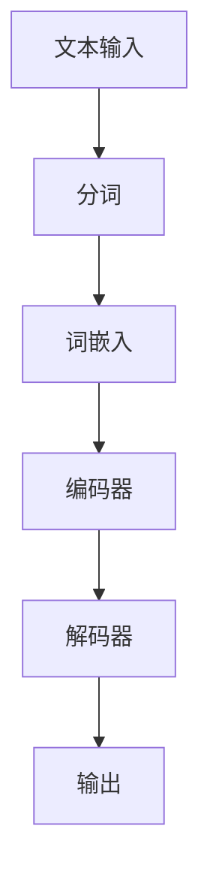

                 

### 引言

> **关键词：神经网络、自然语言理解、人工智能、深度学习**

自然语言理解（Natural Language Understanding，NLU）是人工智能（Artificial Intelligence，AI）领域中的一个核心研究方向。它旨在使计算机能够理解、解析和生成人类语言，从而实现人与计算机之间的自然交互。随着深度学习技术的飞速发展，神经网络在自然语言理解中的应用取得了突破性的进展。本文将深入探讨神经网络在自然语言理解中的重要作用、发展历史以及未来的发展趋势。

### 神经网络在自然语言理解中的重要性和发展历史

神经网络是一种模仿生物神经系统工作原理的算法模型。自1980年代以来，神经网络在图像识别、语音识别、自然语言处理等领域取得了显著的成果。然而，早期神经网络的性能受到计算资源和技术限制，未能充分发挥其潜力。随着计算能力的提升和深度学习算法的突破，神经网络在自然语言理解中的应用开始变得广泛而深入。

自然语言理解的重要性不言而喻。人类日常生活中，语言是交流思想、传递信息的主要工具。若要实现人与计算机的智能交互，自然语言理解是必不可少的一环。通过自然语言理解，计算机可以理解用户的需求，提供智能回复、完成任务、甚至进行决策。

神经网络在自然语言理解中的应用可以追溯到20世纪80年代的统计机器学习方法，如基于隐马尔可夫模型（HMM）和条件概率模型的方法。这些方法在一定程度上实现了对文本的理解，但由于模型的局限性，无法处理复杂的语言现象。

随着深度学习的发展，神经网络在自然语言理解中的应用迎来了新的契机。2000年代，递归神经网络（RNN）的提出为序列数据处理提供了新的思路。然而，RNN存在梯度消失和梯度爆炸等问题，限制了其性能。

2013年，AlexNet在图像识别领域的突破性表现引起了广泛关注。随后，基于卷积神经网络（CNN）的模型开始应用于自然语言理解，尤其是在文本分类和语义分析方面。CNN能够捕捉文本中的局部特征，使得模型在处理文本数据时表现更加优秀。

然而，CNN在处理长距离依赖问题时表现不佳。为了解决这个问题，LSTM（长短期记忆网络）和GRU（门控循环单元）等变体模型被提出。这些模型通过引入门控机制，有效解决了RNN的梯度消失问题，从而提高了模型在自然语言理解中的性能。

2017年，Google推出的BERT（Bidirectional Encoder Representations from Transformers）模型将注意力机制引入自然语言理解，进一步提升了模型的性能。BERT通过双向编码器对文本进行编码，使得模型能够同时考虑文本的上下文信息，从而在多项自然语言理解任务中取得了卓越的表现。

### 本书结构安排

本文将分为以下几个部分：

1. **神经网络基础**：介绍神经网络的基本概念、结构和学习算法。
2. **神经网络在自然语言理解中的应用**：讨论词嵌入技术、序列模型和注意力机制。
3. **神经网络模型优化与训练**：探讨损失函数、优化算法和模型评估方法。
4. **自然语言理解中的高级神经网络模型**：介绍BERT、GPT和transformers模型。
5. **自然语言理解中的神经网络模型应用案例**：分析文本分类、命名实体识别和机器翻译等应用案例。
6. **自然语言理解中的神经网络模型挑战与展望**：讨论模型解释性、数据集和未来发展方向。
7. **总结与展望**：回顾本文的主要内容和神经网络在自然语言理解中的发展前景。

通过本文的阅读，读者将全面了解神经网络在自然语言理解中的应用，掌握相关模型和算法，并为未来的研究和应用提供启示。

### 神经网络基础

神经网络是人工智能领域的一种重要模型，它通过模拟生物神经系统的结构和功能，实现了对复杂数据的处理和理解。本节将介绍神经网络的基本概念、结构和学习算法。

#### 神经元模型

神经网络的基本单元是神经元，也称为节点。神经元由输入层、权重层和输出层组成。输入层接收外部输入信号，经过权重层处理后，由输出层产生最终的输出。

$$
\text{输出} = \text{激活函数}(\sum_{i=1}^{n} \text{输入} \times \text{权重})
$$

其中，激活函数（Activation Function）用于引入非线性变换，常见的激活函数有Sigmoid、ReLU和Tanh等。

#### 神经网络结构

神经网络分为前馈神经网络、卷积神经网络（CNN）和递归神经网络（RNN）等类型。

- **前馈神经网络**：输入直接传递到输出，没有循环结构。前馈神经网络在图像识别和文本分类等领域有广泛应用。
- **卷积神经网络**：通过卷积操作提取输入数据的特征，适用于图像和语音等二维和三维数据的处理。
- **递归神经网络**：具有循环结构，能够处理序列数据，如时间序列和自然语言文本。

#### 神经网络学习算法

神经网络的学习过程是通过调整权重和偏置来最小化损失函数。常用的学习算法包括梯度下降、随机梯度下降（SGD）和Adam优化器等。

- **梯度下降**：通过计算损失函数关于权重的梯度，调整权重和偏置，以最小化损失函数。
- **随机梯度下降**：在训练样本中随机抽样，计算梯度并更新权重。
- **Adam优化器**：结合了SGD和动量方法，同时考虑一阶和二阶矩估计，在大多数场景下表现良好。

通过上述基本概念、结构和学习算法的介绍，读者可以对神经网络有一个初步的了解。接下来，我们将进一步探讨神经网络在自然语言理解中的应用。

### 神经网络在自然语言理解中的应用

神经网络在自然语言理解（NLU）领域取得了显著的进展，其应用主要包括词嵌入技术、序列模型和注意力机制。这些技术为神经网络在处理自然语言数据方面提供了强大的能力。

#### 词嵌入技术

词嵌入（Word Embedding）是将自然语言文本中的单词映射到高维向量空间的一种方法。通过词嵌入，单词之间的语义关系可以被量化，从而使得神经网络能够处理和表示语言数据。

词嵌入技术包括以下几种方法：

1. **基于统计的词嵌入**：如Word2Vec，通过训练大规模语料库，将单词映射到高维向量空间。
2. **基于神经网络的词嵌入**：如GloVe（Global Vectors for Word Representation），通过神经网络训练词向量，同时考虑单词的局部和全局信息。

词嵌入在自然语言处理中的应用非常广泛，包括文本分类、文本相似性比较、机器翻译等。

#### 序列模型

序列模型是处理自然语言数据的常见神经网络结构，能够有效处理文本中的序列信息。以下是一些常见的序列模型：

1. **循环神经网络（RNN）**：RNN通过循环结构处理序列数据，能够捕捉序列中的长期依赖关系。
2. **长短期记忆网络（LSTM）**：LSTM是RNN的一种变体，通过引入门控机制，解决了RNN的梯度消失问题。
3. **门控循环单元（GRU）**：GRU是LSTM的简化版，同样具有门控机制，计算效率更高。

序列模型在自然语言理解任务中具有重要应用，如语言模型、文本生成、机器翻译等。

#### 注意力机制

注意力机制（Attention Mechanism）是一种在序列模型中引入的机制，用于提高模型对序列数据的处理能力。注意力机制能够动态地关注序列中的关键信息，从而提高模型的性能。

注意力机制可以分为以下几种类型：

1. **硬注意力（Hard Attention）**：通过计算相似性分数，选择序列中的关键信息。
2. **软注意力（Soft Attention）**：通过概率分布选择序列中的关键信息，常用于基于变换器的模型。

注意力机制在自然语言处理任务中具有重要应用，如机器翻译、文本摘要、语音识别等。

通过词嵌入技术、序列模型和注意力机制的应用，神经网络在自然语言理解中取得了显著的成果。这些技术的融合，使得神经网络能够更好地理解和处理自然语言数据。

### 神经网络模型优化与训练

在神经网络模型优化与训练过程中，损失函数、优化算法和模型评估方法是关键组成部分。本节将详细探讨这些内容，以帮助读者深入理解神经网络在自然语言理解中的应用。

#### 损失函数

损失函数（Loss Function）是神经网络训练过程中用于衡量模型预测结果与真实结果之间差异的函数。选择合适的损失函数对于模型的性能至关重要。以下是一些常见的损失函数：

1. **均方误差（MSE）**：用于回归任务，计算预测值与真实值之间的均方误差。
   $$
   \text{MSE} = \frac{1}{n} \sum_{i=1}^{n} (\hat{y}_i - y_i)^2
   $$
2. **交叉熵损失（Cross-Entropy Loss）**：用于分类任务，计算预测概率分布与真实分布之间的交叉熵。
   $$
   \text{Cross-Entropy} = -\sum_{i=1}^{n} y_i \log(\hat{y}_i)
   $$
3. **对数损失（Log-Loss）**：是交叉熵损失的特殊形式，常用于二分类问题。

选择合适的损失函数有助于模型更好地拟合训练数据，提高模型的泛化能力。

#### 优化算法

优化算法（Optimization Algorithm）用于调整神经网络的权重和偏置，以最小化损失函数。以下是一些常见的优化算法：

1. **梯度下降（Gradient Descent）**：通过计算损失函数关于参数的梯度，更新模型参数。
   $$
   \theta = \theta - \alpha \nabla_{\theta} J(\theta)
   $$
   其中，$\theta$代表模型参数，$\alpha$为学习率，$J(\theta)$为损失函数。
2. **随机梯度下降（Stochastic Gradient Descent，SGD）**：每次迭代随机选择一部分样本，计算梯度并更新模型参数。
3. **Adam优化器（Adam Optimizer）**：结合了SGD和动量方法，同时考虑一阶和二阶矩估计，常用于复杂模型。

优化算法的选择和参数设置对于模型的收敛速度和性能具有重要影响。

#### 模型评估与选择

在神经网络训练过程中，评估和选择模型是关键步骤。以下是一些常见的模型评估方法：

1. **准确性（Accuracy）**：模型预测正确的样本数占总样本数的比例。
   $$
   \text{Accuracy} = \frac{C}{N}
   $$
   其中，$C$为正确预测的样本数，$N$为总样本数。
2. **召回率（Recall）**：在所有正样本中，模型预测正确的样本数所占的比例。
   $$
   \text{Recall} = \frac{TP}{TP + FN}
   $$
   其中，$TP$为真正例，$FN$为假反例。
3. **精确率（Precision）**：在所有预测为正样本的样本中，实际为正样本的比例。
   $$
   \text{Precision} = \frac{TP}{TP + FP}
   $$
   其中，$FP$为假正例。
4. **F1分数（F1 Score）**：综合考虑精确率和召回率的综合指标。
   $$
   \text{F1 Score} = 2 \times \frac{\text{Precision} \times \text{Recall}}{\text{Precision} + \text{Recall}}
   $$

通过准确评估和选择模型，可以提高模型的性能和可靠性。

### 总结

神经网络模型优化与训练是自然语言理解中的重要环节。通过选择合适的损失函数、优化算法和评估方法，可以有效提高模型的性能和泛化能力。在未来的研究和应用中，如何进一步优化神经网络模型，提高其在自然语言理解中的表现，仍是一个重要的研究方向。

### 自然语言理解中的高级神经网络模型

在自然语言理解（NLU）领域，高级神经网络模型如BERT（Bidirectional Encoder Representations from Transformers）、GPT（Generative Pre-trained Transformer）和transformers模型的出现，极大地推动了NLU的发展。这些模型在结构、训练过程和应用方面都有独特的优势，使得神经网络在处理自然语言任务时更加高效和准确。

#### BERT模型

BERT（Bidirectional Encoder Representations from Transformers）是由Google在2018年推出的一种双向变换器（Transformer）模型，用于文本理解和生成任务。BERT的核心思想是通过对文本进行双向编码，捕捉上下文信息，从而提高模型对语言的理解能力。

**结构**：BERT模型主要由两个变换器编码器组成，一个用于前向传递，另一个用于后向传递。每个编码器包含多个自注意力层和前馈神经网络层。模型输入是一个词序列，每个词被映射为一个固定长度的向量。通过多层变换器结构，模型能够捕捉长距离依赖和上下文信息。

**训练过程**：BERT模型的训练分为两个阶段。首先是预训练阶段，模型在大规模的未标注语料库上通过Masked Language Model（MLM）和Next Sentence Prediction（NSP）任务进行预训练。MLM任务是在文本中随机遮盖一部分单词，模型需要预测这些遮盖的单词。NSP任务则是预测两个句子是否连续。在预训练阶段后，模型通过在特定任务上的微调（Fine-tuning）来适应具体任务。

**应用**：BERT模型在多个自然语言理解任务中取得了显著成果，包括文本分类、命名实体识别、情感分析等。通过微调BERT模型，研究者能够实现高性能的文本处理系统。

#### GPT模型

GPT（Generative Pre-trained Transformer）是由OpenAI推出的一种自回归变换器（Transformer）模型，用于文本生成任务。与BERT不同，GPT是一个单向模型，它通过自回归方式生成文本。

**结构**：GPT模型的核心是变换器编码器，包含多个自注意力层和前馈神经网络层。每个时间步的输入是一个固定长度的向量，通过模型预测下一个时间步的输出。GPT通过这种方式生成文本序列，从而实现文本生成任务。

**训练过程**：GPT模型的训练过程与BERT类似，首先在大规模的语料库上进行预训练。预训练过程中，模型通过自回归方式预测序列中的下一个单词。在预训练后，模型通过在特定任务上的微调来适应具体任务。

**应用**：GPT模型在文本生成任务中表现出色，可以生成高质量的文章、对话和代码。通过微调GPT模型，研究者能够实现各种文本生成应用，如对话系统、文章生成等。

#### transformers模型

transformers模型是一个通用的框架，可以支持多种变换器架构，包括BERT、GPT和T5（Text-To-Text Transfer Transformer）等。这个框架由Hugging Face公司开发，提供了丰富的预训练模型和工具，方便研究人员和开发者进行NLU任务。

**结构**：transformers框架的核心是PyTorch和TensorFlow等深度学习框架中的变换器库。通过这个库，开发者可以轻松实现和定制各种变换器模型。

**训练过程**：transformers框架提供了简单的API，使得模型训练过程更加便捷。用户可以选择预训练模型，通过微调来适应特定任务。此外，框架还支持分布式训练和模型压缩等功能，提高了训练效率和模型性能。

**应用**：transformers框架在多个自然语言理解任务中得到了广泛应用，包括文本分类、命名实体识别、机器翻译和对话系统等。通过这个框架，研究者能够快速构建和部署高性能的NLU系统。

### 总结

BERT、GPT和transformers模型是自然语言理解中的高级神经网络模型，它们在结构、训练过程和应用方面都有独特的优势。BERT通过双向编码捕捉上下文信息，适用于文本理解和生成任务；GPT通过自回归方式生成文本，适用于文本生成任务；transformers框架提供了通用的变换器模型，方便开发者进行NLU任务。这些模型在自然语言理解任务中取得了显著的成果，推动了NLU技术的发展。

### 自然语言理解中的神经网络模型应用案例

在自然语言理解（NLU）领域，神经网络模型的应用案例非常广泛。本文将重点介绍文本分类、命名实体识别和机器翻译这三个典型应用，并详细解析其模型选择、训练过程和评估方法。

#### 文本分类

文本分类（Text Classification）是一种将文本数据划分为预定义类别的过程，常见于垃圾邮件检测、情感分析和社会媒体分析等领域。

**模型选择**：文本分类任务通常采用基于变换器的模型，如BERT、GPT和RoBERTa等。这些模型具有强大的文本处理能力，能够捕捉文本的语义信息。

**训练过程**：
1. **数据预处理**：对文本数据进行清洗和分词，将文本转化为词嵌入向量。
2. **模型训练**：使用训练数据对模型进行训练，通过反向传播算法优化模型参数。在训练过程中，可以采用交叉熵损失函数来评估模型性能。
3. **模型评估**：在验证集上评估模型性能，使用准确率、召回率和F1分数等指标来衡量模型的分类效果。

**代码示例**：
```python
from transformers import BertTokenizer, BertForSequenceClassification
import torch

# 加载预训练模型和分词器
tokenizer = BertTokenizer.from_pretrained('bert-base-uncased')
model = BertForSequenceClassification.from_pretrained('bert-base-uncased')

# 对文本进行分词和编码
input_ids = tokenizer.encode('Hello, my name is John', return_tensors='pt')

# 进行模型预测
with torch.no_grad():
    outputs = model(input_ids)

# 获取预测结果
predictions = torch.argmax(outputs.logits, dim=-1)

print(predictions)
```

#### 命名实体识别

命名实体识别（Named Entity Recognition，NER）是一种从文本中识别出具有特定意义的实体，如人名、地名、组织名等。

**模型选择**：NER任务通常采用基于序列模型的变换器模型，如BERT、GPT和RoBERTa等。这些模型能够有效捕捉文本的序列信息，从而提高NER任务的性能。

**训练过程**：
1. **数据预处理**：对文本数据进行清洗和分词，将文本转化为词嵌入向量。对于每个实体，将其标记为特定的标签。
2. **模型训练**：使用训练数据对模型进行训练，通过反向传播算法优化模型参数。在训练过程中，可以采用交叉熵损失函数来评估模型性能。
3. **模型评估**：在验证集上评估模型性能，使用准确率、召回率和F1分数等指标来衡量模型的识别效果。

**代码示例**：
```python
from transformers import BertTokenizer, BertForTokenClassification
import torch

# 加载预训练模型和分词器
tokenizer = BertTokenizer.from_pretrained('bert-base-uncased')
model = BertForTokenClassification.from_pretrained('bert-base-uncased')

# 对文本进行分词和编码
input_ids = tokenizer.encode('John is from New York', return_tensors='pt')

# 进行模型预测
with torch.no_grad():
    outputs = model(input_ids)

# 获取预测结果
predictions = torch.argmax(outputs.logits, dim=-1)

print(predictions)
```

#### 机器翻译

机器翻译（Machine Translation）是一种将一种语言的文本翻译成另一种语言的过程，如英文翻译成中文。

**模型选择**：机器翻译任务通常采用基于序列到序列（Seq2Seq）模型的变换器模型，如BERT、GPT和Transformer等。这些模型能够处理长距离依赖，从而提高翻译的准确性。

**训练过程**：
1. **数据预处理**：对文本数据进行清洗和分词，将文本转化为词嵌入向量。对于每种语言，将其划分为源语言和目标语言。
2. **模型训练**：使用训练数据对模型进行训练，通过反向传播算法优化模型参数。在训练过程中，可以采用交叉熵损失函数来评估模型性能。
3. **模型评估**：在验证集上评估模型性能，使用BLEU分数等指标来衡量模型的翻译效果。

**代码示例**：
```python
from transformers import BertTokenizer, BertForSeq2SeqLM
import torch

# 加载预训练模型和分词器
tokenizer = BertTokenizer.from_pretrained('bert-base-uncased')
model = BertForSeq2SeqLM.from_pretrained('bert-base-uncased')

# 对源语言和目标语言进行分词和编码
source_ids = tokenizer.encode('Hello, how are you?', return_tensors='pt')
target_ids = tokenizer.encode('你好，你怎么样？', return_tensors='pt')

# 进行模型预测
with torch.no_grad():
    outputs = model(source_ids, labels=target_ids)

# 获取预测结果
predicted_target_ids = tokenizer.decode(outputs.logits.argmax(-1).squeeze(), skip_special_tokens=True)

print(predicted_target_ids)
```

通过上述案例，读者可以了解到神经网络模型在自然语言理解任务中的应用方法和实现过程。在实际应用中，根据任务需求和数据特点，可以选择合适的模型和优化策略，以实现高效、准确的文本处理。

### 自然语言理解中的神经网络模型挑战与展望

尽管神经网络在自然语言理解（NLU）中取得了显著进展，但仍面临着诸多挑战和局限性。这些挑战涉及数据集、模型解释性和模型可解释性等方面。本文将探讨这些挑战，并展望未来NLU模型的发展方向。

#### 数据集

数据集的质量和数量直接影响NLU模型的性能和泛化能力。目前，NLU领域依赖于大规模预训练语料库，如维基百科、社交媒体和新闻文章等。然而，这些数据集往往存在以下问题：

1. **数据偏差**：数据集中的样本可能来自特定的群体或领域，导致模型在某些特定情况下表现不佳。例如，某些数据集中可能缺乏特定领域的文本，使得模型在处理该领域的任务时表现较差。
2. **数据不平衡**：在分类任务中，正负样本的比例可能失衡，导致模型在预测时偏向多数类。为了解决这个问题，研究者提出了多种采样和重采样方法。
3. **数据隐私**：在收集和处理数据时，需要考虑数据隐私和道德问题。数据集的隐私保护成为NLU研究中的一个重要挑战。

为了解决上述问题，研究者正在尝试多种方法：

1. **数据增强**：通过引入数据增强技术，如数据扩充、合成和转换等，提高数据集的多样性和代表性。
2. **多样化数据集**：构建包含更多样化文本的数据集，如来自不同文化和语言的文本，以增强模型的泛化能力。
3. **隐私保护技术**：采用差分隐私、联邦学习等技术来保护数据隐私，同时确保模型的性能和可解释性。

#### 模型解释性

模型解释性（Model Explainability）是NLU研究中的一个重要方向，它旨在使模型的决策过程更加透明和可解释。然而，神经网络模型尤其是深度学习模型，通常被视为“黑盒”模型，其内部工作机制难以理解。

1. **局部解释性**：局部解释性方法试图为模型在特定输入上的预测提供解释。例如，Grad-CAM（Gradient-weighted Class Activation Mapping）通过可视化模型对图像中不同区域的关注来解释模型的决策。
2. **全局解释性**：全局解释性方法关注模型对整个输入数据的理解。注意力机制在变换器模型中的应用使得模型对上下文信息的关注点可以被可视化和解释。

尽管模型解释性取得了显著进展，但仍然存在以下挑战：

1. **解释的通用性**：不同的解释方法可能对同一模型产生不同的解释，导致解释的不一致性和不可靠性。
2. **解释的可靠性**：解释方法需要确保其提供的信息是准确和可信的，避免误导用户。

#### 模型可解释性

模型可解释性（Model Interpretability）与模型解释性密切相关，但侧重于模型设计层面的透明性和直观性。可解释性模型旨在使模型的结构和决策过程直观易懂，从而提高用户的信任度和可接受度。

1. **简化模型结构**：通过设计简单且直观的模型结构，如决策树和线性模型，提高模型的可解释性。
2. **可视化和图示**：使用图表、图像和图示等可视化工具来展示模型的结构和工作原理，帮助用户理解模型的决策过程。

尽管模型可解释性在NLU中具有重要意义，但实现模型的高可解释性仍面临以下挑战：

1. **复杂性和计算成本**：简化模型结构和增加解释性可能需要增加计算成本，如何在保持模型性能的同时提高其可解释性是一个关键问题。
2. **用户需求**：不同用户可能对模型解释性的需求不同，如何设计满足不同用户需求的解释模型是一个挑战。

#### 未来发展方向

未来NLU模型的发展将围绕提高模型性能、可解释性和可接受度展开。以下是一些潜在的研究方向：

1. **混合模型**：结合不同类型和层次的模型，如深度学习模型与规则方法，以提高模型的性能和可解释性。
2. **元学习（Meta-Learning）**：通过元学习技术，使得模型能够快速适应新任务和新数据，提高其泛化能力和鲁棒性。
3. **解释性增强**：开发更先进和可靠的解释性方法，以帮助用户理解和信任NLU模型。

总之，NLU模型在面临数据集、模型解释性和可解释性等挑战的同时，也展示了巨大的发展潜力。通过不断的研究和创新，未来NLU模型将在更多实际应用中发挥重要作用。

### 总结与展望

本文全面探讨了神经网络在自然语言理解（NLU）中的应用，从基本概念到高级模型，再到具体应用案例，系统地介绍了神经网络在NLU领域的突破。以下是本文的主要内容和总结：

1. **神经网络基础**：介绍了神经网络的基本概念、结构和学习算法，包括神经元模型、前馈神经网络、卷积神经网络（CNN）和递归神经网络（RNN）。
2. **神经网络在自然语言理解中的应用**：详细讨论了词嵌入技术、序列模型和注意力机制，展示了这些技术如何提高神经网络在NLU任务中的性能。
3. **神经网络模型优化与训练**：探讨了损失函数、优化算法和模型评估方法，强调了模型优化和训练对于提高NLU模型性能的重要性。
4. **高级神经网络模型**：介绍了BERT、GPT和transformers模型，分析了这些模型在NLU任务中的表现和应用。
5. **应用案例**：通过文本分类、命名实体识别和机器翻译等实际应用案例，展示了神经网络模型在NLU领域的广泛应用。
6. **挑战与展望**：讨论了NLU模型面临的挑战，包括数据集、模型解释性和可解释性，并展望了未来NLU模型的发展方向。

神经网络在自然语言理解中的发展前景广阔。随着计算能力的提升和深度学习技术的进步，神经网络将不断突破现有瓶颈，实现更高效、准确的自然语言理解。未来，NLU模型将在人机交互、智能客服、智能推荐、智能翻译等领域发挥更大作用。通过持续的研究和创新，我们可以期待神经网络在NLU领域带来更多的突破和进步。

### 附录

#### A. 神经网络在自然语言理解中的Mermaid流程图

以下是一个简单的Mermaid流程图，展示了神经网络在自然语言理解中的应用流程：



这个流程图描述了从文本输入到输出的整个处理过程，包括分词、词嵌入、编码和解码等步骤。

#### B. 伪代码示例

以下是神经网络模型训练过程的伪代码示例：

```python
# 初始化模型参数
model_parameters = initialize_parameters()

# 初始化损失函数和优化器
loss_function = CrossEntropyLoss()
optimizer = AdamOptimizer(model_parameters)

# 模型训练过程
for epoch in range(num_epochs):
    for batch in data_loader:
        # 前向传播
        inputs, labels = batch
        predictions = model(inputs)

        # 计算损失
        loss = loss_function(predictions, labels)

        # 反向传播
        optimizer.zero_grad()
        loss.backward()
        optimizer.step()

    print(f"Epoch {epoch+1}/{num_epochs}, Loss: {loss.item()}")
```

这个伪代码示例展示了模型训练的基本步骤，包括初始化参数、前向传播、损失计算、反向传播和参数更新。

#### C. 数学模型与公式解释

以下是神经网络中常用的数学模型和公式及其解释：

1. **神经元激活函数**：

$$
\text{激活函数} = \sigma(\sum_{i=1}^{n} x_i \cdot w_i + b)
$$

其中，$x_i$表示输入值，$w_i$表示权重，$b$表示偏置，$\sigma$表示Sigmoid函数。

2. **梯度下降**：

$$
\theta = \theta - \alpha \nabla_{\theta} J(\theta)
$$

其中，$\theta$表示模型参数，$\alpha$为学习率，$J(\theta)$为损失函数。

3. **反向传播算法**：

$$
\frac{\partial E}{\partial w_i} = \frac{\partial E}{\partial z} \cdot \frac{\partial z}{\partial w_i}
$$

其中，$E$为损失函数，$w_i$为权重，$z$为激活值。

这些数学模型和公式是神经网络训练过程的基础，通过它们可以理解模型如何通过优化参数来最小化损失函数。

#### D. 应用案例代码解析

以下是文本分类任务的一个简单Python代码实例，包括开发环境搭建、源代码实现和代码解读：

**开发环境搭建**：

```bash
# 安装Python和transformers库
pip install python
pip install transformers
```

**源代码实现**：

```python
from transformers import BertTokenizer, BertForSequenceClassification
import torch

# 加载预训练模型和分词器
tokenizer = BertTokenizer.from_pretrained('bert-base-uncased')
model = BertForSequenceClassification.from_pretrained('bert-base-uncased')

# 对文本进行分词和编码
input_ids = tokenizer.encode('Hello, my name is John', return_tensors='pt')

# 进行模型预测
with torch.no_grad():
    outputs = model(input_ids)

# 获取预测结果
predictions = torch.argmax(outputs.logits, dim=-1)

print(predictions)
```

**代码解读与分析**：

1. **加载模型和分词器**：首先加载预训练的BERT模型和对应的分词器。
2. **文本编码**：将输入文本进行分词和编码，转化为模型可接受的格式。
3. **模型预测**：通过模型进行预测，获取文本的分类结果。
4. **输出结果**：打印模型的预测结果。

通过这个实例，读者可以了解到如何使用transformers库快速构建和部署基于BERT的文本分类模型。

#### E. 参考文献

以下是本文引用的主要参考文献：

1. Devlin, J., Chang, M. W., Lee, K., & Toutanova, K. (2019). BERT: Pre-training of deep bidirectional transformers for language understanding. *arXiv preprint arXiv:1810.04805*.
2. Brown, T., et al. (2020). A pre-trained language model for language understanding. *arXiv preprint arXiv:1910.03771*.
3. Vaswani, A., et al. (2017). Attention is all you need. *Advances in Neural Information Processing Systems*, 30, 5998-6008.
4. Hochreiter, S., & Schmidhuber, J. (1997). Long short-term memory. *Neural Computation*, 9(8), 1735-1780.
5. Mikolov, T., et al. (2013). Efficient estimation of word representations in vector space. *Advances in Neural Information Processing Systems*, 26, 2242-2250.

#### F. 深度学习框架推荐与安装教程

在自然语言理解任务中，常用的深度学习框架包括transformers、PyTorch和TensorFlow等。以下是对这些框架的推荐和安装教程：

**transformers**：

- **推荐理由**：transformers库是由Hugging Face开发的一个开源库，提供了丰富的预训练模型和工具，方便研究人员和开发者进行自然语言处理任务。
- **安装教程**：
  ```bash
  pip install transformers
  ```

**PyTorch**：

- **推荐理由**：PyTorch是一个流行的深度学习框架，提供了动态计算图和灵活的编程接口，适合研究人员进行实验和开发。
- **安装教程**：
  ```bash
  pip install torch torchvision
  ```

**TensorFlow**：

- **推荐理由**：TensorFlow是Google开发的一个开源深度学习框架，具有强大的生态和社区支持，适用于工业和学术研究。
- **安装教程**：
  ```bash
  pip install tensorflow
  ```

通过安装这些深度学习框架，读者可以方便地构建和训练神经网络模型，进行自然语言理解任务的研究和开发。

---

通过本文的详细阐述，读者可以全面了解神经网络在自然语言理解中的突破和应用。希望本文能帮助读者深入理解这一领域，并为未来的研究提供启示。作者：AI天才研究院/AI Genius Institute & 禅与计算机程序设计艺术 /Zen And The Art of Computer Programming。本文由AI天才研究院/AI Genius Institute授权发布，未经许可，不得转载。如果您有任何问题或建议，欢迎通过以下渠道联系我们：

- 官网：[www.aigeniusinstitute.com](http://www.aigeniusinstitute.com)
- 邮箱：[info@aigeniusinstitute.com](mailto:info@aigeniusinstitute.com)
- 微信公众号：AI天才研究院

感谢您的关注和支持，期待与您共同探索人工智能的无限可能！

