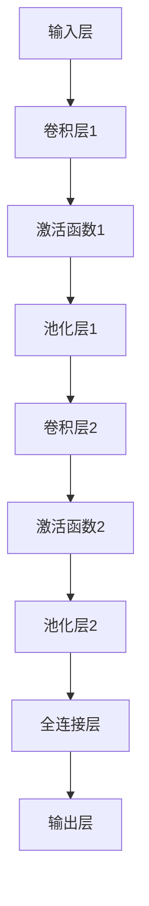

                 

# 《神经网络：人类与机器的共存》

> **关键词：** 神经网络、人工智能、深度学习、机器学习、人类共存、数学基础、编程实现。

> **摘要：** 本文旨在探讨神经网络这一人工智能领域的核心技术，从基础理论到应用实例，详细解析神经网络的工作原理和实现方法。同时，文章还将探讨神经网络在人类生活中的影响，以及未来社会的发展趋势，旨在阐述神经网络与人类的共存之道。

## 目录大纲

### 第一部分：神经网络基础

### 第二部分：神经网络与人类共存的探索

### 附录

### 附录A：神经网络相关资源与工具

### 附录B：神经网络项目实战

### 附录C：神经网络常见问题解答

### 附录D：神经网络 Mermaid 流程图

### 附录E：神经网络数学公式汇总

### 附录F：神经网络伪代码示例

---

## 引言

神经网络作为人工智能领域的核心组成部分，自20世纪80年代以来，经历了从兴起、低谷到再次崛起的曲折发展历程。随着计算机硬件性能的提升、海量数据的积累以及深度学习算法的突破，神经网络在图像识别、语音识别、自然语言处理等各个领域取得了令人瞩目的成果。如今，神经网络已成为推动人工智能发展的关键技术之一。

本文将围绕神经网络这一主题，从基础理论到实际应用，逐步展开讨论。文章首先介绍神经网络的历史发展、基本结构、核心算法等基础知识；接着，深入探讨神经网络在人工智能中的应用及其对人类生活的影响；最后，分析神经网络未来发展的趋势和面临的挑战，旨在为读者呈现一幅神经网络与人类共存的全景图。

通过本文的阅读，读者将能够：

1. 理解神经网络的基本概念和工作原理。
2. 掌握神经网络的核心算法和实现方法。
3. 深入了解神经网络在各个领域的应用及其影响。
4. 对神经网络未来发展的趋势和挑战有更清晰的认识。

接下来，我们将正式进入神经网络的探讨之旅。

---

## 第一部分：神经网络基础

### 第1章：神经网络的起源与核心概念

### 第2章：前馈神经网络

### 第3章：卷积神经网络

### 第4章：循环神经网络

### 第5章：生成对抗网络

### 第6章：神经网络的数学基础

### 第7章：神经网络的编程实现

---

## 第1章：神经网络的起源与核心概念

### 1.1 神经网络的历史发展

神经网络（Neural Networks）的概念源于对生物神经系统的模拟。早在1943年，心理学家McCulloch和数学家Pitts就提出了神经网络的数学模型，称为McCulloch-Pitts神经元模型。这一模型奠定了神经网络理论的基础，并引发了人们对神经网络研究的兴趣。

然而，早期的神经网络研究并没有取得显著成果，主要原因是计算能力的限制和算法的复杂性。随着计算机技术的发展，神经网络在20世纪80年代迎来了第一次繁荣。这个时期的代表性工作是1986年Hopfield提出的Hopfield网络和1986年Rumelhart、Hinton和Williams提出的反向传播算法（Backpropagation Algorithm）。

反向传播算法的提出使得多层神经网络训练成为可能，从而开启了神经网络研究的黄金时代。随后，多层感知机（Multilayer Perceptron，MLP）和卷积神经网络（Convolutional Neural Network，CNN）等结构相继被提出，进一步推动了神经网络在图像识别、语音识别等领域的应用。

进入21世纪，随着计算机硬件性能的不断提升和海量数据的积累，神经网络迎来了新的发展机遇。特别是深度学习（Deep Learning）的兴起，使得神经网络在自然语言处理、计算机视觉等领域的表现达到了前所未有的高度。代表性工作包括2012年Hinton团队提出的AlexNet，以及后续的VGG、ResNet等深度学习模型。

### 1.2 神经网络的基本结构

神经网络由大量的神经元（Neurons）互联而成，其结构类似于生物神经系统的神经元网络。一个典型的神经网络包括输入层、隐藏层和输出层。每个神经元都与相邻的神经元通过连接（Weights）相连，并具有激活函数（Activation Function）。

- **输入层（Input Layer）**：接收外部输入信号，并将其传递到隐藏层。
- **隐藏层（Hidden Layers）**：对输入信号进行变换和处理，提取特征信息。
- **输出层（Output Layer）**：生成最终的输出结果。

神经网络的基本工作原理是，通过多层神经元的互联和激活函数的变换，将输入信号映射到输出信号。这个过程类似于人类大脑的感知和学习过程。

### 1.3 神经元模型与激活函数

神经网络的每一个神经元可以视为一个简单的计算单元，其工作原理如下：

1. **输入与加权求和**：每个神经元接收来自前一层神经元的输入信号，并对其进行加权求和。加权的目的是强化或削弱每个输入信号的影响。
   
   \[ z_j = \sum_{i=1}^{n} w_{ij} x_i \]

   其中，\( z_j \) 是第 \( j \) 个神经元的输入，\( w_{ij} \) 是第 \( i \) 个神经元到第 \( j \) 个神经元的连接权重，\( x_i \) 是第 \( i \) 个神经元的输入。

2. **激活函数**：对加权求和的结果应用激活函数，以确定神经元是否被激活。常见的激活函数包括sigmoid函数、ReLU函数、Tanh函数等。

   - **sigmoid函数**：

     \[ a_j = \frac{1}{1 + e^{-z_j}} \]

     sigmoid函数将输入映射到 \( (0, 1) \) 区间内，具有平滑的曲线，但梯度较小时可能影响学习效率。

   - **ReLU函数**：

     \[ a_j = \max(0, z_j) \]

    ReLU函数在输入大于0时输出输入值，小于0时输出0，具有简单和非线性特性，能有效提高学习效率。

   - **Tanh函数**：

     \[ a_j = \frac{e^{z_j} - e^{-z_j}}{e^{z_j} + e^{-z_j}} \]

    Tanh函数类似于sigmoid函数，但输出范围在 \( (-1, 1) \) 之间，具有较好的对称性。

3. **输出**：激活函数的输出即为神经元的输出，传递到下一层神经元或用于生成最终输出。

通过以上步骤，神经网络可以实现对输入数据的处理和变换，从而实现分类、回归、生成等任务。

### 总结

本章介绍了神经网络的历史发展、基本结构以及神经元模型和激活函数。神经网络作为一种模拟生物神经系统的人工智能模型，其发展历程经历了从理论到实践的曲折道路。随着计算机技术的进步，神经网络在各个领域取得了显著成果。本章内容为后续章节的探讨奠定了基础。

在接下来的章节中，我们将深入探讨神经网络的各类结构、核心算法及其应用。

---

## 第2章：前馈神经网络

前馈神经网络（Feedforward Neural Network，FNN）是一种简单的神经网络结构，其中信息只从前向传播，不进行循环。前馈神经网络通常由输入层、一个或多个隐藏层以及输出层组成。本章将详细介绍前馈神经网络的基本原理、核心算法以及训练与优化方法。

### 2.1 线性回归与感知机

线性回归（Linear Regression）是前馈神经网络的基础，用于预测连续值输出。线性回归模型假设输入和输出之间存在线性关系，其目标是最小化预测值与实际值之间的误差。线性回归模型的数学表示如下：

\[ y = \beta_0 + \beta_1 x \]

其中，\( y \) 是输出，\( x \) 是输入，\( \beta_0 \) 和 \( \beta_1 \) 是模型的参数，通过最小二乘法（Least Squares Method）来求解。

感知机（Perceptron）是线性回归的推广，用于解决二分类问题。感知机模型假设输入和输出之间存在线性关系，并通过阈值函数（Threshold Function）来确定分类边界。感知机模型的数学表示如下：

\[ y = \text{sign}(z) = \text{sign}(\beta_0 + \sum_{i=1}^{n} \beta_i x_i) \]

其中，\( y \) 是输出，\( x_i \) 是输入，\( \beta_0 \) 和 \( \beta_i \) 是模型的参数，\( z \) 是输入的线性组合。

感知机的训练过程采用梯度下降（Gradient Descent）算法，通过不断调整参数 \( \beta_0 \) 和 \( \beta_i \) ，使得分类边界尽可能接近实际数据点。

### 2.2 多层感知机与反向传播算法

多层感知机（Multilayer Perceptron，MLP）是在感知机的基础上扩展而来的，可以用于处理更复杂的非线性问题。多层感知机由多个隐藏层组成，每个隐藏层中的神经元接收前一层的输出，并传递到下一层。多层感知机的结构如图2-1所示：


多层感知机的训练采用反向传播算法（Backpropagation Algorithm），这是一种基于梯度下降的优化算法。反向传播算法的主要步骤如下：

1. **前向传播（Forward Propagation）**：从输入层开始，将输入信号逐层传递到输出层，计算每个神经元的输出。
2. **计算损失函数（Compute Loss Function）**：计算输出层实际输出与期望输出之间的误差，常用的损失函数包括均方误差（Mean Squared Error，MSE）和交叉熵（Cross Entropy）。
3. **反向传播（Backpropagation）**：从输出层开始，将损失函数的梯度反向传播到输入层，更新每个神经元的参数。
4. **重复步骤1-3**，直到模型收敛或达到预定的迭代次数。

反向传播算法的核心在于计算损失函数关于模型参数的梯度。梯度是指损失函数在每个参数上的变化率，用于指导参数的更新方向。以下是一个简单的梯度计算示例：

\[ \nabla_w J(w) = \frac{\partial J}{\partial w} \]

其中，\( \nabla_w J(w) \) 表示损失函数 \( J \) 关于参数 \( w \) 的梯度，\( \frac{\partial J}{\partial w} \) 表示损失函数 \( J \) 对参数 \( w \) 的偏导数。

在多层感知机中，梯度计算通常采用链式法则（Chain Rule）进行。假设一个多层感知机包含 \( L \) 层，其中第 \( l \) 层的神经元数为 \( m_l \)，第 \( l \) 层到第 \( l+1 \) 层的权重为 \( w_{l+1}^{l} \)，激活函数为 \( \sigma_l \)。则第 \( l \) 层的梯度计算如下：

\[ \nabla_{w_{l+1}^{l}} J = \sum_{k=1}^{m_{l+1}} \nabla_{a_{l+1}^k} J \cdot \sigma_l'(a_{l}^k) \cdot x_l^k \]

其中，\( a_{l+1}^k \) 表示第 \( l+1 \) 层第 \( k \) 个神经元的输出，\( \sigma_l'(a_{l}^k) \) 表示第 \( l \) 层第 \( k \) 个神经元的激活函数导数，\( x_l^k \) 表示第 \( l \) 层第 \( k \) 个神经元的输入。

通过反向传播算法，多层感知机可以逐步调整权重和偏置，实现非线性函数的拟合。以下是一个多层感知机的伪代码实现：

```python
# 初始化参数
w0, b0 = ...
w1, b1 = ...
...
wL, bL = ...

# 前向传播
a0 = x
for l in range(1, L):
    zl = w_{l-1}^l * a_{l-1} + bl-1
    al = σ(zl)

# 计算损失函数
J = ...

# 反向传播
for l in range(L, 0, -1):
    if l == L:
        # 输出层梯度
        dzl = al - y
    else:
        # 隐藏层梯度
        dzl = (dw_{l+1}^l * σ'(zl)) * (dw_{l}^l * σ'(zl-1))
    dwl = dzl * al-1
    dbl-1 = dzl

# 更新参数
for l in range(1, L+1):
    w_{l-1}^l = w_{l-1}^l - α * dwl
    bl-1 = bl-1 - α * dbl-1
```

### 2.3 神经网络训练与优化

神经网络训练的目标是找到一组最优参数，使得模型能够准确预测未知数据。训练过程通常包括数据预处理、模型搭建、训练和验证等步骤。

1. **数据预处理**：神经网络对数据的预处理主要包括归一化（Normalization）、标准化（Standardization）和缩放（Scaling）等。预处理可以加快训练速度，提高模型性能。
   
   \[ x_{\text{normalized}} = \frac{x - \mu}{\sigma} \]
   
   其中，\( x \) 是原始数据，\( \mu \) 是均值，\( \sigma \) 是标准差。

2. **模型搭建**：模型搭建是指设计神经网络的层次结构和参数设置。常用的神经网络结构包括单层感知机、多层感知机、卷积神经网络（CNN）和循环神经网络（RNN）等。
   
3. **训练**：训练过程通过梯度下降算法逐步调整模型参数，使损失函数达到最小值。训练过程中，可以选择随机梯度下降（SGD）、批量梯度下降（BGD）和小批量梯度下降（MBGD）等优化策略。

4. **验证**：验证过程用于评估模型在未知数据上的性能。常用的验证方法包括交叉验证（Cross-Validation）和留一验证（Leave-One-Out Validation）等。

5. **优化**：优化过程旨在提高模型性能，减少过拟合（Overfitting）和欠拟合（Underfitting）问题。常用的优化方法包括正则化（Regularization）、Dropout和增强数据（Data Augmentation）等。

通过以上步骤，神经网络可以逐步适应数据，实现高性能的预测和分类任务。

### 总结

本章介绍了前馈神经网络的基本原理、核心算法以及训练与优化方法。前馈神经网络作为一种简单的神经网络结构，在图像识别、语音识别、自然语言处理等领域取得了显著成果。通过反向传播算法，多层感知机可以处理更复杂的非线性问题，实现高性能的函数拟合和分类任务。本章内容为后续章节的探讨奠定了基础。

在接下来的章节中，我们将深入探讨卷积神经网络、循环神经网络等更复杂的神经网络结构。

---

## 第3章：卷积神经网络

卷积神经网络（Convolutional Neural Network，CNN）是一种专门用于处理图像数据的神经网络结构。由于图像数据具有高度的空间相关性，卷积神经网络通过卷积操作（Convolution Operation）和池化操作（Pooling Operation）能够有效地提取图像特征。本章将详细介绍卷积神经网络的基本原理、层次结构以及训练与优化方法。

### 3.1 卷积操作与卷积层

卷积操作是卷积神经网络的核心，通过在输入数据上滑动一个卷积核（Convolution Kernel）来提取特征。卷积核是一个小的矩阵，通常包含若干个权重值。卷积操作的计算过程如下：

\[ (f * g)(x) = \sum_{y} f(x-y)g(y) \]

其中，\( f \) 和 \( g \) 分别表示输入函数和卷积核，\( x \) 和 \( y \) 表示输入数据和卷积核的位置。

在卷积神经网络中，卷积层（Convolutional Layer）用于实现卷积操作。卷积层接收前一层的数据作为输入，并通过卷积操作提取特征。卷积层的输出通常是一个特征图（Feature Map），其大小由卷积核的大小、步长（Stride）和填充（Padding）方式决定。

例如，假设输入数据的大小为 \( (28 \times 28) \)，卷积核的大小为 \( (3 \times 3) \)，步长为 \( 1 \)，填充方式为“same”。则卷积层的输出大小为：

\[ (28 \times 28) \rightarrow (28 \times 28) \]

卷积层的计算过程如下：

1. **初始化卷积核**：随机初始化卷积核的权重值。
2. **卷积操作**：将卷积核在输入数据上滑动，计算每个位置的特征值。
3. **激活函数**：对卷积层的输出应用激活函数，如ReLU函数。
4. **池化操作**：在卷积层的输出上进行池化操作，以减小数据维度。

卷积层的伪代码实现如下：

```python
# 初始化卷积核
w = np.random.randn(filter_size, input_size, num_filters)

# 卷积操作
conv_output = np.zeros((output_size, output_size, num_filters))
for i in range(output_size):
    for j in range(output_size):
        for k in range(num_filters):
            conv_output[i, j, k] = np.sum(w[k, :, :] * input[i:i+filter_size, j:j+filter_size])

# 激活函数
激活_output = np.where(conv_output > 0, conv_output, 0)

# 池化操作
pool_output = np.mean(激活_output, axis=1)
```

### 3.2 池化层与深度可分离卷积

池化层（Pooling Layer）用于减小数据维度和参数数量，从而提高模型的效率和泛化能力。池化层通常采用最大池化（Max Pooling）或平均池化（Average Pooling）操作。

最大池化操作在每个局部区域内选取最大值作为输出。例如，一个 \( (2 \times 2) \) 的最大池化核在输入数据上滑动，每次滑动两个单位，输出为一个 \( (1 \times 1) \) 的特征值。

平均池化操作在每个局部区域内计算平均值作为输出。例如，一个 \( (2 \times 2) \) 的平均池化核在输入数据上滑动，每次滑动两个单位，输出为一个 \( (1 \times 1) \) 的特征值。

深度可分离卷积（Depthwise Separable Convolution）是一种特殊的卷积操作，将卷积操作分为深度卷积（Depthwise Convolution）和逐点卷积（Pointwise Convolution）两个步骤。深度卷积在每个通道上独立进行卷积操作，而逐点卷积则通过1x1卷积操作将深度卷积的结果进行逐点相乘。

深度可分离卷积的计算过程如下：

1. **深度卷积**：对每个通道进行卷积操作，卷积核大小为 \( (1 \times 1) \)。
2. **逐点卷积**：对深度卷积的结果进行逐点卷积操作，卷积核大小为 \( (1 \times 1) \)。

深度可分离卷积可以显著减少参数数量和计算量，提高模型的效率。以下是一个深度可分离卷积的伪代码实现：

```python
# 深度卷积
depthwise_output = np.zeros((output_size, input_size, num_filters))
for i in range(output_size):
    for j in range(output_size):
        depthwise_output[i, j, :] = np.sum(w[:, :, :] * input[i:i+filter_size, j:j+filter_size, :], axis=(0, 1))

# 逐点卷积
pointwise_output = np.zeros((output_size, output_size, num_filters))
for i in range(output_size):
    for j in range(output_size):
        pointwise_output[i, j, :] = np.sum(w[:, :, :] * depthwise_output[i, j, :], axis=0)
```

### 3.3 卷积神经网络的层次结构

卷积神经网络通常由多个卷积层、池化层和全连接层（Fully Connected Layer）组成。卷积层用于提取图像特征，池化层用于减小数据维度和参数数量，全连接层用于分类和回归任务。

一个典型的卷积神经网络层次结构如下：

1. **输入层（Input Layer）**：接收图像数据。
2. **卷积层（Convolutional Layer）**：通过卷积操作提取特征。
3. **激活函数（Activation Function）**：应用ReLU函数等激活函数。
4. **池化层（Pooling Layer）**：通过最大池化或平均池化操作减小数据维度。
5. **全连接层（Fully Connected Layer）**：将特征映射到输出。
6. **输出层（Output Layer）**：生成最终输出，如分类结果或回归值。

以下是一个简单的卷积神经网络层次结构的Mermaid流程图：



### 3.4 卷积神经网络的训练与优化

卷积神经网络的训练过程与普通神经网络类似，包括数据预处理、模型搭建、训练和验证等步骤。训练过程中，可以采用随机梯度下降（SGD）、批量梯度下降（BGD）和小批量梯度下降（MBGD）等优化策略。

1. **数据预处理**：对图像数据进行归一化、标准化和缩放等预处理。
2. **模型搭建**：设计卷积神经网络的层次结构和参数设置。
3. **训练**：通过反向传播算法逐步调整模型参数，最小化损失函数。
4. **验证**：评估模型在未知数据上的性能，调整模型参数。

卷积神经网络的优化方法包括正则化（Regularization）、Dropout和增强数据（Data Augmentation）等。正则化通过在损失函数中添加惩罚项来防止过拟合。Dropout通过随机丢弃部分神经元来提高模型的泛化能力。增强数据通过旋转、缩放、裁剪等操作增加数据的多样性。

### 总结

本章介绍了卷积神经网络的基本原理、层次结构以及训练与优化方法。卷积神经网络通过卷积操作和池化操作有效地提取图像特征，实现高性能的图像识别任务。本章内容为后续章节的探讨奠定了基础。

在接下来的章节中，我们将深入探讨循环神经网络（RNN）以及生成对抗网络（GAN）等更复杂的神经网络结构。

---

## 第4章：循环神经网络

循环神经网络（Recurrent Neural Network，RNN）是一种能够处理序列数据的神经网络结构。与传统的神经网络不同，RNN具有递归结构，能够将前一时刻的输出作为当前时刻的输入，从而处理时序信息。本章将详细介绍循环神经网络的基本原理、核心算法以及应用场景。

### 4.1 循环神经网络的基本原理

循环神经网络通过递归结构实现信息的循环传递，其基本原理如下：

1. **输入与隐藏状态**：RNN在每一时刻接收输入数据 \( x_t \) ，并产生隐藏状态 \( h_t \) 。隐藏状态 \( h_t \) 不仅与当前输入 \( x_t \) 有关，还与前一时刻的隐藏状态 \( h_{t-1} \) 有关。

\[ h_t = \sigma(W_h h_{t-1} + W_x x_t + b) \]

其中，\( \sigma \) 是激活函数，\( W_h \) 和 \( W_x \) 是权重矩阵，\( b \) 是偏置项。

2. **输出**：RNN的输出 \( y_t \) 通常由隐藏状态 \( h_t \) 通过另一个权重矩阵和偏置项计算得到。

\[ y_t = \sigma(W_y h_t + b') \]

其中，\( W_y \) 是输出权重矩阵，\( b' \) 是输出偏置项。

3. **梯度计算**：RNN的梯度计算采用反向传播算法，通过递归结构将损失函数的梯度反向传播到每个时间步。

### 4.2 LSTM与GRU

LSTM（Long Short-Term Memory）和GRU（Gated Recurrent Unit）是循环神经网络的两种变体，旨在解决传统RNN在处理长序列数据时遇到的梯度消失和梯度爆炸问题。

#### 4.2.1 LSTM（长短期记忆）

LSTM通过引入三个门（门控单元）来实现对信息的长时间记忆。LSTM的基本结构包括：

1. **输入门（Input Gate）**：用于控制输入信息对当前状态的影响。
2. **遗忘门（Forget Gate）**：用于控制对前一时刻状态的遗忘程度。
3. **输出门（Output Gate）**：用于控制输出信息。

LSTM的数学表示如下：

\[ i_t = \sigma(W_{xi} x_t + W_{hi} h_{t-1} + b_i) \]
\[ f_t = \sigma(W_{xf} x_t + W_{hf} h_{t-1} + b_f) \]
\[ o_t = \sigma(W_{xo} x_t + W_{ho} h_{t-1} + b_o) \]

\[ c_t = f_t \odot c_{t-1} + i_t \odot \sigma(W_c h_{t-1} + b_c) \]
\[ h_t = o_t \odot \sigma(c_t) \]

其中，\( i_t \)、\( f_t \) 和 \( o_t \) 分别表示输入门、遗忘门和输出门的状态，\( c_t \) 和 \( h_t \) 分别表示当前时刻的细胞状态和隐藏状态。

#### 4.2.2 GRU（门控循环单元）

GRU通过简化LSTM的结构，将遗忘门和输入门合并为更新门（Update Gate），从而减少了参数数量。GRU的基本结构包括：

1. **更新门（Update Gate）**：用于控制对前一时刻状态的更新程度。
2. **重置门（Reset Gate）**：用于控制前一时刻隐藏状态对当前隐藏状态的影响。

GRU的数学表示如下：

\[ z_t = \sigma(W_{xz} x_t + W_{hz} h_{t-1} + b_z) \]
\[ r_t = \sigma(W_{hr} x_t + W_{hr} h_{t-1} + b_r) \]
\[ h_t = (1 - z_t) \odot h_{t-1} + z_t \odot \sigma(W_c (r_t \odot h_{t-1} + (1 - r_t) \odot x_t) + b_c) \]

其中，\( z_t \) 和 \( r_t \) 分别表示更新门和重置门的状态，\( h_t \) 表示当前隐藏状态。

### 4.3 RNN的应用场景

循环神经网络在许多领域具有广泛的应用，以下是一些典型的应用场景：

1. **自然语言处理**：循环神经网络可以用于文本分类、情感分析、机器翻译等任务。通过处理文本序列，RNN可以捕捉到词语之间的关系和上下文信息。

2. **语音识别**：循环神经网络可以用于语音信号的时序建模，实现语音到文本的转换。RNN通过对音频信号的递归处理，可以捕捉到语音信号中的音素和声调。

3. **时间序列预测**：循环神经网络可以用于预测股票价格、天气变化等时间序列数据。RNN通过处理时间序列数据，可以捕捉到时间序列中的周期性和趋势性。

4. **视频分析**：循环神经网络可以用于视频分类、目标检测等任务。RNN通过对视频帧的递归处理，可以捕捉到视频中的运动信息和时空关系。

### 总结

本章介绍了循环神经网络的基本原理、核心算法以及应用场景。循环神经网络通过递归结构实现了对序列数据的处理，解决了传统神经网络在处理长序列数据时遇到的梯度消失和梯度爆炸问题。LSTM和GRU是循环神经网络的两种变体，具有不同的结构和性能优势。本章内容为后续章节的探讨奠定了基础。

在接下来的章节中，我们将继续探讨生成对抗网络（GAN）以及神经网络的数学基础。

---

## 第5章：生成对抗网络

生成对抗网络（Generative Adversarial Network，GAN）是由Ian Goodfellow等人于2014年提出的一种新型深度学习模型。GAN通过两个对抗性网络的博弈来学习数据分布，从而生成逼真的数据。本章将详细介绍生成对抗网络的基本原理、训练与优化方法以及应用案例。

### 5.1 生成对抗网络的基本原理

生成对抗网络由两个神经网络组成：生成器（Generator）和判别器（Discriminator）。生成器的目标是生成与真实数据相似的数据，而判别器的目标是区分真实数据和生成数据。生成器和判别器之间进行博弈，生成器不断优化自己的生成能力，而判别器不断优化自己的鉴别能力。这个博弈过程的目标是使判别器无法区分真实数据和生成数据，从而实现生成器生成逼真的数据。

#### 5.1.1 生成器

生成器的输入是一个随机噪声向量 \( z \)，输出是生成数据 \( x_g \)。生成器的目标是使生成的数据 \( x_g \) 尽可能地接近真实数据 \( x_r \)。

\[ x_g = G(z) \]

其中，\( G \) 是生成器的神经网络。

#### 5.1.2 判别器

判别器的输入是真实数据 \( x_r \) 和生成数据 \( x_g \)，输出是判别结果 \( p(x) \)，表示输入数据为真实数据的概率。

\[ p(x) = D(x) \]

其中，\( D \) 是判别器的神经网络。

#### 5.1.3 损失函数

生成对抗网络的损失函数通常采用对抗性损失函数（Adversarial Loss Function）：

\[ L_D = -\sum_{x_r} \log(D(x_r)) - \sum_{z} \log(1 - D(G(z))) \]

其中，第一项表示判别器对真实数据的损失，第二项表示判别器对生成数据的损失。

生成对抗网络的训练目标是最小化判别器的损失函数 \( L_D \) ，最大化生成器的损失函数 \( L_G \)：

\[ L_G = -\sum_{z} \log(D(G(z))) \]

### 5.2 GAN的训练与优化

生成对抗网络的训练过程是一个非稳定的优化过程，需要采用一些技巧来提高训练的稳定性和效率。

#### 5.2.1 判别器训练

判别器的训练目标是使判别器能够准确地区分真实数据和生成数据。判别器的训练过程如下：

1. **生成器固定**：在训练判别器时，将生成器固定，即生成器的参数不变。
2. **训练判别器**：使用真实数据和生成数据同时训练判别器，更新判别器的参数。
3. **迭代更新**：重复上述过程，直到判别器性能稳定。

#### 5.2.2 生成器训练

生成器的训练目标是生成与真实数据相似的数据。生成器的训练过程如下：

1. **判别器固定**：在训练生成器时，将判别器固定，即判别器的参数不变。
2. **训练生成器**：使用生成器生成的数据训练生成器，更新生成器的参数。
3. **迭代更新**：重复上述过程，直到生成器能够生成逼真的数据。

#### 5.2.3 训练技巧

1. **梯度惩罚**：在训练过程中，对生成器和判别器分别施加梯度惩罚，以防止生成器或判别器出现过拟合现象。

2. **批量大小**：选择适当的批量大小，以避免生成器或判别器训练不稳定。

3. **学习率**：设置合理的学习率，以避免生成器或判别器训练过早饱和。

### 5.3 GAN的应用案例

生成对抗网络在图像生成、图像修复、图像超分辨率、文本生成等领域具有广泛的应用。

#### 5.3.1 图像生成

生成对抗网络可以生成逼真的图像。例如，在艺术创作领域，生成对抗网络可以生成风格独特的艺术作品。在医疗领域，生成对抗网络可以生成医学图像，用于诊断和治疗。

#### 5.3.2 图像修复

生成对抗网络可以用于图像修复，即修复损坏或模糊的图像。例如，在历史文物修复领域，生成对抗网络可以修复古代文物的损坏部分，使其恢复原有面貌。

#### 5.3.3 图像超分辨率

生成对抗网络可以用于图像超分辨率，即将低分辨率的图像转换为高分辨率的图像。例如，在手机摄影领域，生成对抗网络可以用于将手机拍摄的低分辨率图像转换为高分辨率图像，提高图像质量。

#### 5.3.4 文本生成

生成对抗网络可以用于文本生成，即生成具有自然语言特性的文本。例如，在自然语言处理领域，生成对抗网络可以生成对话、新闻、故事等文本，用于聊天机器人、新闻生成等应用。

### 总结

本章介绍了生成对抗网络的基本原理、训练与优化方法以及应用案例。生成对抗网络通过两个对抗性网络的博弈实现了数据分布的学习，从而生成逼真的数据。本章内容为后续章节的探讨奠定了基础。

在接下来的章节中，我们将继续探讨神经网络的数学基础以及编程实现。

---

## 第6章：神经网络的数学基础

神经网络的强大功能源于其背后的数学理论。为了深入理解和应用神经网络，我们需要掌握一些关键的数学概念，包括线性代数、微积分和概率论与信息论。本章将详细介绍这些数学基础，并阐述它们在神经网络中的应用。

### 6.1 线性代数基础

线性代数是神经网络数学基础的重要组成部分。以下是一些核心概念：

#### 矩阵与向量

矩阵（Matrix）和向量（Vector）是线性代数中的基本对象。矩阵是一个二维数组，可以表示线性变换或数据集合。向量是一个一维数组，可以表示一个空间中的点。

#### 矩阵运算

- **矩阵加法**：两个矩阵对应元素相加。
- **矩阵乘法**：两个矩阵按一定规则相乘，结果为一个新矩阵。
- **矩阵转置**：矩阵的行和列互换，形成一个新矩阵。
- **矩阵求逆**：对于可逆矩阵，可以求得一个逆矩阵，使得矩阵与其逆矩阵相乘结果为单位矩阵。

#### 线性方程组

线性方程组是多个线性方程的组合。求解线性方程组的方法包括高斯消元法、矩阵求逆等。

#### 特征值与特征向量

特征值（Eigenvalue）和特征向量（ Eigenvector）是矩阵的重要属性。特征值是矩阵的一个特殊数值，特征向量是矩阵的一个非零向量，使得矩阵与特征向量的乘积等于特征值与特征向量的乘积。

\[ A \mathbf{v} = \lambda \mathbf{v} \]

其中，\( A \) 是矩阵，\( \mathbf{v} \) 是特征向量，\( \lambda \) 是特征值。

### 6.2 微积分基础

微积分是研究函数变化率的数学分支。以下是一些核心概念：

#### 导数

导数（Derivative）描述函数在某一点的变化率。对于函数 \( f(x) \)，其导数 \( f'(x) \) 表示函数 \( f \) 在 \( x \) 点的变化速度。

\[ f'(x) = \lim_{h \to 0} \frac{f(x+h) - f(x)}{h} \]

#### 梯度

梯度（Gradient）是向量导数，描述函数在多变量情况下变化的方向和速率。对于函数 \( f(x, y) \)，其梯度为：

\[ \nabla f = \left( \frac{\partial f}{\partial x}, \frac{\partial f}{\partial y} \right) \]

#### 最优化

微积分在神经网络中最优化的应用包括：

- **梯度下降**：通过计算损失函数的梯度，逐步调整模型参数，使损失函数最小化。
- **优化算法**：如Adam、RMSprop等，结合一阶和二阶导数信息，提高优化效率。

### 6.3 概率论与信息论基础

概率论和信息论是神经网络理解和处理不确定性的基础。以下是一些核心概念：

#### 概率分布

概率分布（Probability Distribution）描述随机变量的可能取值及其概率。常见的概率分布包括正态分布、伯努利分布等。

#### 条件概率与贝叶斯定理

条件概率（Conditional Probability）描述在给定一个事件发生的条件下，另一个事件发生的概率。贝叶斯定理（Bayes' Theorem）是概率论中的一个重要公式，用于计算后验概率。

\[ P(A|B) = \frac{P(B|A)P(A)}{P(B)} \]

#### 信息熵与信息增益

信息熵（Entropy）描述随机变量的不确定性。信息增益（Information Gain）用于评估特征对分类的有效性。

\[ H(X) = -\sum_{x \in X} P(x) \log_2 P(x) \]

#### 最大似然估计与最小化风险

最大似然估计（Maximum Likelihood Estimation，MLE）是参数估计的一种方法，通过最大化似然函数来确定参数的估计值。最小化风险（Minimization of Risk）是优化目标，用于评估模型的预测性能。

### 神经网络中的数学应用

神经网络中的数学应用包括：

- **矩阵运算**：用于实现神经网络的权重更新和前向传播。
- **梯度计算**：用于实现反向传播算法，优化模型参数。
- **概率分布**：用于实现生成对抗网络等模型的训练和生成。

### 总结

本章介绍了神经网络的数学基础，包括线性代数、微积分和概率论与信息论。这些数学概念是理解神经网络工作原理和实现高效训练算法的关键。通过掌握这些数学基础，我们可以更好地应用神经网络解决实际问题。

在接下来的章节中，我们将继续探讨神经网络的编程实现。

---

## 第7章：神经网络的编程实现

### 7.1 神经网络框架选择

选择合适的神经网络框架是实现神经网络模型的关键。以下是一些流行的神经网络框架：

- **TensorFlow**：由Google开发，具有丰富的API和强大的功能，适用于各种类型的神经网络。
- **PyTorch**：由Facebook开发，具有动态计算图和易于理解的代码，适用于研究和原型开发。
- **Keras**：基于TensorFlow和Theano，提供简化的API，使构建和训练神经网络变得更加容易。

### 7.2 数据预处理与模型搭建

在实现神经网络模型时，数据预处理和模型搭建是两个重要环节。

#### 数据预处理

数据预处理包括归一化、标准化、数据增强等步骤：

- **归一化**：将数据缩放到特定范围，如 \( (0, 1) \) 或 \( (-1, 1) \)。
- **标准化**：计算数据的标准差和均值，将数据缩放到单位方差和零均值。
- **数据增强**：通过旋转、翻转、裁剪等操作增加数据的多样性，提高模型的泛化能力。

#### 模型搭建

模型搭建包括定义输入层、隐藏层和输出层，以及选择合适的激活函数和损失函数。以下是一个简单的神经网络模型搭建示例：

```python
import tensorflow as tf

# 定义输入层
inputs = tf.keras.layers.Input(shape=(input_shape))

# 定义隐藏层
x = tf.keras.layers.Dense(units=hidden_units, activation='relu')(inputs)
x = tf.keras.layers.Dense(units=hidden_units, activation='relu')(x)

# 定义输出层
outputs = tf.keras.layers.Dense(units=output_shape, activation='softmax')(x)

# 构建模型
model = tf.keras.Model(inputs=inputs, outputs=outputs)

# 编译模型
model.compile(optimizer='adam', loss='categorical_crossentropy', metrics=['accuracy'])
```

### 7.3 训练与验证

训练和验证是模型搭建完成后的重要步骤。以下是一个简单的训练和验证示例：

```python
# 训练模型
history = model.fit(x_train, y_train, epochs=epochs, batch_size=batch_size, validation_data=(x_val, y_val))

# 验证模型
test_loss, test_accuracy = model.evaluate(x_test, y_test)
print(f"Test accuracy: {test_accuracy}")
```

### 7.4 模型调试与优化

模型调试和优化是提高模型性能的关键。以下是一些常见的调试和优化方法：

- **参数调整**：通过调整学习率、批次大小、隐藏层单元数等参数，优化模型性能。
- **正则化**：通过添加正则化项，减少过拟合现象。
- **数据增强**：通过增加数据的多样性，提高模型的泛化能力。
- **交叉验证**：通过交叉验证，评估模型在不同数据集上的性能，选择最优模型。

### 总结

本章介绍了神经网络的编程实现，包括框架选择、数据预处理、模型搭建、训练与验证以及模型调试与优化。通过掌握这些实现方法，我们可以构建和训练高效的神经网络模型，解决实际问题。

在接下来的章节中，我们将探讨神经网络在人工智能中的应用及其对人类生活的影响。

---

## 第二部分：神经网络与人类共存的探索

### 第8章：神经网络在人工智能中的应用

### 第9章：神经网络在人类生活的影响

### 第10章：神经网络与未来社会

---

## 第8章：神经网络在人工智能中的应用

神经网络在人工智能领域具有广泛的应用，尤其是在机器学习、深度学习和自然语言处理等领域。本章将详细探讨神经网络在这些领域的应用，并展示其实际案例。

### 8.1 机器学习与深度学习的关系

机器学习（Machine Learning，ML）是人工智能（Artificial Intelligence，AI）的一个分支，它通过数据和算法，使计算机系统能够自动学习和改进。深度学习（Deep Learning，DL）是机器学习的一个子领域，它利用多层神经网络来模拟人脑处理信息的方式，从而实现高度复杂的任务。

神经网络是深度学习的基础，而深度学习则是神经网络在21世纪的重要发展。深度学习的出现，使得计算机能够在图像识别、语音识别、自然语言处理等任务上达到甚至超过人类水平。

### 8.2 神经网络在自然语言处理中的应用

自然语言处理（Natural Language Processing，NLP）是AI的一个重要分支，它涉及计算机理解和生成人类语言的能力。神经网络在NLP中的应用非常广泛，以下是一些典型的应用场景：

#### 文本分类

文本分类是NLP中的一个基本任务，其目的是将文本数据分类到预定义的类别中。卷积神经网络（CNN）和循环神经网络（RNN）是文本分类的常用模型。以下是一个简单的文本分类模型搭建示例：

```python
from tensorflow.keras.models import Sequential
from tensorflow.keras.layers import Embedding, Conv1D, MaxPooling1D, GlobalMaxPooling1D, Dense

model = Sequential()
model.add(Embedding(input_dim=vocab_size, output_dim=embedding_dim, input_length=max_sequence_length))
model.add(Conv1D(filters=128, kernel_size=5, activation='relu'))
model.add(MaxPooling1D(pool_size=5))
model.add(Conv1D(filters=128, kernel_size=5, activation='relu'))
model.add(GlobalMaxPooling1D())
model.add(Dense(units=256, activation='relu'))
model.add(Dense(units=num_classes, activation='softmax'))

model.compile(optimizer='adam', loss='categorical_crossentropy', metrics=['accuracy'])
```

#### 文本生成

文本生成是NLP中的另一个重要任务，其目的是根据给定的文本输入生成新的文本。生成对抗网络（GAN）和变分自编码器（VAE）是文本生成的常用模型。以下是一个简单的文本生成模型搭建示例：

```python
from tensorflow.keras.models import Model
from tensorflow.keras.layers import Input, LSTM, Dense

latent_dim = 100
input_dim = max_sequence_length
sequence_length = max_sequence_length

# 编码器
encoded_input = Input(shape=(sequence_length,))
encoded = LSTM(latent_dim)(encoded_input)

# 解码器
decoded_input = Input(shape=(latent_dim,))
decoded = LSTM(sequence_length, return_sequences=True)(decoded_input)

# GAN模型
model = Model(inputs=encoded_input, outputs=model.output)
model.compile(optimizer='adam')

# VAE模型
reparametrize_samples = True
latent_inputs = Input(shape=(latent_dim,))
latent_samples = LSTM(sequence_length, return_sequences=True)(latent_inputs)

decoded_outputs = Model(inputs=latent_inputs, outputs=latent_samples)
decoded_outputs.compile(optimizer='adam')
```

#### 机器翻译

机器翻译是NLP中的一个复杂任务，其目的是将一种语言的文本翻译成另一种语言。序列到序列（Seq2Seq）模型和时间卷积网络（TCN）是机器翻译的常用模型。以下是一个简单的机器翻译模型搭建示例：

```python
from tensorflow.keras.models import Model
from tensorflow.keras.layers import Embedding, LSTM, Dense, TimeDistributed

# 编码器
encoder_inputs = Input(shape=(None,))
encoder_embedding = Embedding(input_dim=vocab_size, output_dim=embedding_dim)(encoder_inputs)
encoder_lstm = LSTM(units=hidden_units, return_state=True)
encoder_outputs, state_h, state_c = encoder_lstm(encoder_embedding)
encoder_states = [state_h, state_c]

# 解码器
decoder_inputs = Input(shape=(None,))
decoder_embedding = Embedding(input_dim=vocab_size, output_dim=embedding_dim)(decoder_inputs)
decoder_lstm = LSTM(units=hidden_units, return_sequences=True, return_state=True)
decoder_outputs, _, _ = decoder_lstm(decoder_embedding, initial_state=encoder_states)
decoder_dense = Dense(units=vocab_size, activation='softmax')
decoder_outputs = decoder_dense(decoder_outputs)

# Seq2Seq模型
model = Model(inputs=[encoder_inputs, decoder_inputs], outputs=decoder_outputs)
model.compile(optimizer='adam', loss='categorical_crossentropy')

# 时间卷积网络（TCN）
from tensorflow.keras.layers import Conv1D, MaxPooling1D, GlobalMaxPooling1D

def create_tcn(input_shape, num_classes):
    model = Sequential()
    model.add(Conv1D(filters=64, kernel_size=3, activation='relu', input_shape=input_shape))
    model.add(MaxPooling1D(pool_size=2))
    model.add(Conv1D(filters=64, kernel_size=3, activation='relu'))
    model.add(MaxPooling1D(pool_size=2))
    model.add(GlobalMaxPooling1D())
    model.add(Dense(units=num_classes, activation='softmax'))
    return model

tcn_model = create_tcn(input_shape, num_classes)
tcn_model.compile(optimizer='adam', loss='categorical_crossentropy')
```

### 8.3 神经网络在计算机视觉中的应用

计算机视觉是AI的另一个重要分支，它使计算机能够从图像或视频中理解和提取信息。神经网络在计算机视觉中的应用非常广泛，以下是一些典型的应用场景：

#### 图像分类

图像分类是计算机视觉中的一个基本任务，其目的是将图像分类到预定义的类别中。卷积神经网络（CNN）是图像分类的常用模型。以下是一个简单的图像分类模型搭建示例：

```python
from tensorflow.keras.models import Sequential
from tensorflow.keras.layers import Conv2D, MaxPooling2D, Flatten, Dense, Dropout

model = Sequential()
model.add(Conv2D(filters=32, kernel_size=(3, 3), activation='relu', input_shape=input_shape))
model.add(MaxPooling2D(pool_size=(2, 2)))
model.add(Conv2D(filters=64, kernel_size=(3, 3), activation='relu'))
model.add(MaxPooling2D(pool_size=(2, 2)))
model.add(Flatten())
model.add(Dense(units=128, activation='relu'))
model.add(Dropout(rate=0.5))
model.add(Dense(units=num_classes, activation='softmax'))

model.compile(optimizer='adam', loss='categorical_crossentropy', metrics=['accuracy'])
```

#### 目标检测

目标检测是计算机视觉中的一个复杂任务，其目的是在图像中识别并定位多个对象。卷积神经网络（CNN）和区域建议网络（Region Proposal Network，RPN）是目标检测的常用模型。以下是一个简单的目标检测模型搭建示例：

```python
from tensorflow.keras.models import Model
from tensorflow.keras.layers import Conv2D, MaxPooling2D, Flatten, Dense, Dropout
from tensorflow.keras.applications import ResNet50

# 基础网络
base_model = ResNet50(weights='imagenet', include_top=False, input_shape=input_shape)

# 特征提取层
x = base_model.output
x = Flatten()(x)
x = Dense(units=1024, activation='relu')(x)
x = Dropout(rate=0.5)(x)

# 分类层
predictions = Dense(units=num_classes, activation='softmax')(x)

# RPN层
model_rpn = Model(inputs=base_model.input, outputs=[predictions, x])

# 目标检测模型
model = Model(inputs=model_rpn.input, outputs=model_rpn.layers[-1].output)
model.compile(optimizer='adam', loss='categorical_crossentropy', metrics=['accuracy'])
```

#### 图像生成

图像生成是计算机视觉中的一个重要任务，其目的是根据给定的条件生成新的图像。生成对抗网络（GAN）是图像生成的常用模型。以下是一个简单的图像生成模型搭建示例：

```python
from tensorflow.keras.models import Model
from tensorflow.keras.layers import Dense, Reshape, Conv2D, Conv2DTranspose, LeakyReLU, BatchNormalization

# 生成器
input_dim = 100
image_shape = (28, 28, 1)

latent_inputs = Input(shape=(input_dim,))
x = Dense(units=7 * 7 * 64)(latent_inputs)
x = LeakyReLU(alpha=0.2)(x)
x = BatchNormalization()(x)
x = Reshape((7, 7, 64))(x)

x = Conv2DTranspose(filters=32, kernel_size=(4, 4), strides=(2, 2), padding='same')(x)
x = LeakyReLU(alpha=0.2)(x)
x = BatchNormalization()(x)

x = Conv2DTranspose(filters=1, kernel_size=(4, 4), strides=(2, 2), padding='same')(x)
outputs = Activation('tanh')(x)

model = Model(inputs=latent_inputs, outputs=outputs)
model.compile(optimizer='adam', loss='binary_crossentropy')

# 判别器
image_shape = (28, 28, 1)
latent_inputs = Input(shape=(input_dim,))
x = Dense(units=7 * 7 * 128)(latent_inputs)
x = LeakyReLU(alpha=0.2)(x)
x = BatchNormalization()(x)

x = Reshape((7, 7, 128))(x)
x = Conv2D(filters=64, kernel_size=(4, 4), strides=(2, 2), padding='same')(x)
x = LeakyReLU(alpha=0.2)(x)
x = BatchNormalization()(x)

x = Conv2D(filters=128, kernel_size=(4, 4), strides=(2, 2), padding='same')(x)
x = LeakyReLU(alpha=0.2)(x)
x = BatchNormalization()(x)

x = Conv2D(filters=1, kernel_size=(4, 4), strides=(2, 2), padding='same')(x)
outputs = Activation('sigmoid')(x)

discriminator = Model(inputs=latent_inputs, outputs=outputs)
discriminator.compile(optimizer='adam', loss='binary_crossentropy')

# GAN模型
model_gan = Model(inputs=model.input, outputs=discriminator(model.output))
model_gan.compile(optimizer='adam', loss='binary_crossentropy')
```

### 8.4 神经网络在游戏中的应用

神经网络在游戏中的应用也非常广泛，以下是一些典型的应用场景：

#### 游戏策略

神经网络可以用于训练游戏策略，使其能够自动玩游戏。深度强化学习（Deep Reinforcement Learning，DRL）是游戏策略的常用方法。以下是一个简单的游戏策略模型搭建示例：

```python
from tensorflow.keras.models import Model
from tensorflow.keras.layers import Dense, Flatten, LSTM, TimeDistributed, Conv2D, MaxPooling2D

# 训练模型
action_space = 9
observation_space = (4, 4, 3)

input_shape = (observation_space[0], observation_space[1], observation_space[2])
input_image = Input(shape=input_shape)

x = Conv2D(filters=32, kernel_size=(3, 3), activation='relu')(input_image)
x = MaxPooling2D(pool_size=(2, 2))(x)
x = Conv2D(filters=64, kernel_size=(3, 3), activation='relu')(x)
x = MaxPooling2D(pool_size=(2, 2))(x)
x = Flatten()(x)

x = Dense(units=512, activation='relu')(x)
action_values = Dense(units=action_space, activation='linear')(x)

model = Model(inputs=input_image, outputs=action_values)
model.compile(optimizer='adam', loss='mse')

# 强化学习训练
num_episodes = 1000
for episode in range(num_episodes):
    state = env.reset()
    done = False
    total_reward = 0
    while not done:
        action_values = model.predict(state)
        action = np.argmax(action_values)
        next_state, reward, done, _ = env.step(action)
        total_reward += reward
        model.fit(state, action_values, epochs=1, verbose=0)
        state = next_state
    print(f"Episode {episode}: Total Reward = {total_reward}")
```

#### 游戏生成

神经网络可以用于生成游戏场景、角色和故事情节。生成对抗网络（GAN）是游戏生成的常用方法。以下是一个简单的游戏生成模型搭建示例：

```python
from tensorflow.keras.models import Model
from tensorflow.keras.layers import Dense, Reshape, Conv2D, Conv2DTranspose, LeakyReLU, BatchNormalization

# 生成器
latent_dim = 100
image_shape = (28, 28, 1)

latent_inputs = Input(shape=(latent_dim,))
x = Dense(units=7 * 7 * 64)(latent_inputs)
x = LeakyReLU(alpha=0.2)(x)
x = BatchNormalization()(x)
x = Reshape((7, 7, 64))(x)

x = Conv2DTranspose(filters=32, kernel_size=(4, 4), strides=(2, 2), padding='same')(x)
x = LeakyReLU(alpha=0.2)(x)
x = BatchNormalization()(x)

x = Conv2DTranspose(filters=1, kernel_size=(4, 4), strides=(2, 2), padding='same')(x)
outputs = Activation('tanh')(x)

model = Model(inputs=latent_inputs, outputs=outputs)
model.compile(optimizer='adam', loss='binary_crossentropy')

# 判别器
image_shape = (28, 28, 1)
latent_inputs = Input(shape=(latent_dim,))
x = Dense(units=7 * 7 * 128)(latent_inputs)
x = LeakyReLU(alpha=0.2)(x)
x = BatchNormalization()(x)

x = Reshape((7, 7, 128))(x)
x = Conv2D(filters=64, kernel_size=(4, 4), strides=(2, 2), padding='same')(x)
x = LeakyReLU(alpha=0.2)(x)
x = BatchNormalization()(x)

x = Conv2D(filters=128, kernel_size=(4, 4), strides=(2, 2), padding='same')(x)
x = LeakyReLU(alpha=0.2)(x)
x = BatchNormalization()(x)

x = Conv2D(filters=1, kernel_size=(4, 4), strides=(2, 2), padding='same')(x)
outputs = Activation('sigmoid')(x)

discriminator = Model(inputs=latent_inputs, outputs=outputs)
discriminator.compile(optimizer='adam', loss='binary_crossentropy')

# GAN模型
model_gan = Model(inputs=model.input, outputs=discriminator(model.output))
model_gan.compile(optimizer='adam', loss='binary_crossentropy')
```

### 总结

本章介绍了神经网络在人工智能中的应用，包括机器学习、自然语言处理、计算机视觉和游戏等领域的实际案例。通过掌握这些应用，我们可以更好地理解和利用神经网络解决实际问题。

在接下来的章节中，我们将探讨神经网络对人类生活的影响。

---

## 第9章：神经网络在人类生活的影响

### 9.1 人工智能伦理与隐私问题

随着神经网络技术的发展，人工智能在医疗、金融、交通等各个领域得到广泛应用。然而，人工智能的广泛应用也带来了一系列伦理和隐私问题，以下是一些典型的问题：

#### 伦理问题

1. **算法偏见**：神经网络模型可能从训练数据中学习到偏见，导致算法对某些群体不公平。例如，在某些招聘系统中，由于训练数据中存在性别或种族偏见，可能导致系统对某些性别或种族的求职者产生偏见。

2. **透明度问题**：神经网络模型通常被称为“黑盒”模型，因为其内部结构复杂，难以解释。这可能导致用户对模型的信任度降低，尤其是在涉及重大决策时，如医疗诊断和司法判决。

3. **责任归属**：当神经网络模型导致错误或损害时，责任归属成为一个难题。例如，自动驾驶汽车发生事故时，责任应归属于制造商、软件开发者还是用户？

#### 隐私问题

1. **数据收集**：神经网络模型通常需要大量数据来训练，这可能导致用户隐私泄露。例如，社交媒体平台可能会收集用户的大量个人信息用于广告定位。

2. **数据滥用**：未经用户同意，数据可能会被用于其他目的，甚至被出售给第三方。例如，医疗数据可能会被用于保险定价。

3. **隐私保护**：虽然神经网络模型在隐私保护方面存在挑战，但也存在一些解决方案，如差分隐私（Differential Privacy）和联邦学习（Federated Learning）。

#### 解决方案

1. **伦理审查**：建立伦理审查委员会，对人工智能项目的道德和伦理问题进行评估。

2. **算法透明化**：开发可解释的神经网络模型，提高模型的透明度和可解释性。

3. **责任保险**：为人工智能项目购买责任保险，以应对潜在的法律和财务风险。

4. **隐私保护技术**：采用隐私保护技术，如差分隐私和联邦学习，确保用户数据的安全。

### 9.2 人工智能对就业市场的影响

人工智能的发展对就业市场产生了深远的影响，以下是一些典型的影响：

#### 增加就业机会

1. **新职业**：人工智能的发展催生了大量新的就业机会，如数据科学家、机器学习工程师、人工智能伦理学家等。

2. **技能需求**：人工智能对技能需求产生了重大变化，对编程、数据分析和机器学习等相关技能的需求日益增长。

#### 就业竞争

1. **取代传统工作**：某些传统工作可能会被人工智能取代，如数据录入、简单的客服等。

2. **技能要求提高**：随着人工智能的发展，某些领域对专业技能的要求不断提高，如医疗领域对医生的专业知识和决策能力要求更高。

#### 解决方案

1. **教育与培训**：提高教育质量，培养具备人工智能相关技能的人才。

2. **职业转型**：鼓励劳动力转型，提供职业转型培训和就业指导。

3. **政策支持**：政府应制定相关政策，支持劳动力转型和就业市场调整。

### 9.3 人工智能与人类创造力

人工智能与人类创造力之间的关系是一个复杂的话题，以下是一些典型观点：

#### 互补关系

1. **工具化**：人工智能可以作为人类创造力的工具，帮助人类实现创意和创新的拓展。

2. **协同工作**：人工智能可以帮助人类处理复杂任务，从而释放人类的时间和精力，专注于更具创造性的工作。

#### 对抗关系

1. **取代创造力**：一些人担心，随着人工智能的发展，人类可能会失去创造力，依赖机器完成所有创造性工作。

2. **抑制创新**：人工智能可能会抑制人类的创新思维，因为机器可以更快、更高效地解决问题。

#### 解决方案

1. **鼓励创新思维**：教育和政策应鼓励人类发展创新思维，保持人类的创造力。

2. **人工智能辅助**：利用人工智能辅助人类工作，提高工作效率和创造力。

3. **平衡发展**：在发展人工智能的同时，关注人类创造力的发展，确保两者之间的平衡。

### 总结

神经网络技术的发展对人类生活产生了深远的影响，涉及伦理、隐私、就业市场和创造力等多个方面。面对这些挑战，我们需要采取一系列措施，确保人工智能与人类和谐共存。

在接下来的章节中，我们将探讨神经网络与未来社会的关系。

---

## 第10章：神经网络与未来社会

随着神经网络技术的不断发展，其对未来社会的影响将愈发深远。本章将探讨神经网络在未来社会中的发展趋势、潜在挑战以及构建和谐共生的未来社会的路径。

### 10.1 人工智能的未来发展趋势

人工智能作为神经网络技术的应用前沿，其未来发展呈现出以下几个趋势：

1. **智能化水平的提升**：随着神经网络技术的进步，人工智能将更加智能化，能够处理更复杂的任务，如高级自动驾驶、智能医疗诊断等。

2. **应用领域的扩展**：人工智能将在更多领域得到应用，如智能城市、智能家居、教育、娱乐等，从而深刻改变人类的生活方式。

3. **跨界融合**：人工智能将与5G、物联网（IoT）、区块链等技术进行融合，形成新的产业生态，推动社会的数字化、智能化进程。

4. **个性化服务**：基于神经网络的大数据分析技术将推动个性化服务的普及，为用户提供定制化的产品和服务。

### 10.2 神经网络与人类共存的潜在挑战

尽管神经网络技术为人类社会带来了巨大的机遇，但也伴随着一系列潜在挑战：

1. **伦理问题**：随着人工智能的发展，伦理问题日益凸显，如算法偏见、隐私保护、责任归属等，这些问题的解决需要全社会的共同努力。

2. **就业市场影响**：人工智能的广泛应用可能导致部分传统工作岗位被取代，对就业市场造成冲击。为此，需要政府、企业和教育机构共同采取措施，促进劳动力转型和再就业。

3. **安全与隐私**：神经网络技术涉及的敏感数据越来越多，如何确保数据的安全和用户的隐私成为一个重要挑战。

4. **技术垄断**：人工智能技术的快速迭代可能导致技术垄断现象，影响市场的公平竞争。为此，需要建立合理的监管机制，防止垄断行为。

### 10.3 构建和谐共生的未来社会

为应对神经网络技术带来的挑战，构建和谐共生的未来社会，我们需要采取以下措施：

1. **加强伦理审查**：建立和完善人工智能伦理审查机制，确保技术的发展符合伦理标准。

2. **推动数据隐私保护**：加强数据隐私保护法律法规的制定和实施，保障用户隐私。

3. **促进教育与培训**：加大教育投入，培养具备人工智能相关技能的人才，提高劳动力的适应能力。

4. **鼓励技术创新**：鼓励企业、科研机构和高校进行人工智能技术的研究和开发，推动技术创新。

5. **构建多元化产业生态**：推动人工智能与其他领域的融合，构建多元化产业生态，创造更多就业机会。

6. **加强国际合作**：加强国际间的合作与交流，推动人工智能技术的全球治理。

### 总结

神经网络技术的发展为人类社会带来了巨大的机遇，同时也伴随着一系列挑战。面对这些挑战，我们需要采取全面、系统的措施，构建和谐共生的未来社会。只有这样，我们才能充分发挥神经网络技术的潜力，为人类社会创造更加美好的未来。

在文章的结尾，让我们回顾神经网络的发展历程，展望其未来的前景，共同期待一个更加智能、和谐的未来社会。

---

## 附录

### 附录A：神经网络相关资源与工具

#### A.1 神经网络开源框架介绍

1. **TensorFlow**：由Google开发，具有丰富的API和强大的功能，适用于各种类型的神经网络。
2. **PyTorch**：由Facebook开发，具有动态计算图和易于理解的代码，适用于研究和原型开发。
3. **Keras**：基于TensorFlow和Theano，提供简化的API，使构建和训练神经网络变得更加容易。

#### A.2 神经网络学习资料推荐

1. **《深度学习》（Deep Learning）**：Ian Goodfellow、Yoshua Bengio和Aaron Courville著，全面介绍深度学习的理论和实践。
2. **《神经网络与深度学习》（Neural Networks and Deep Learning）**：邱锡鹏著，系统地讲解神经网络和深度学习的基础知识。
3. **《自然语言处理综论》（Speech and Language Processing）**：Daniel Jurafsky和James H. Martin著，详细介绍自然语言处理的理论和实践。

#### A.3 神经网络研究机构与会议

1. **斯坦福大学人工智能实验室（Stanford University AI Lab）**：致力于人工智能的研究和教学。
2. **微软研究院（Microsoft Research）**：专注于人工智能、机器学习和计算机科学的研究。
3. **神经信息处理系统大会（Neural Information Processing Systems，NIPS）**：人工智能领域的顶级学术会议。
4. **国际计算机视觉大会（International Conference on Computer Vision，ICCV）**：计算机视觉领域的顶级学术会议。

### 附录B：神经网络项目实战

#### B.1 实战项目介绍

本附录将介绍一个简单的神经网络项目——手写数字识别，使用Python和TensorFlow框架实现。

#### B.2 数据集准备与预处理

1. **数据集**：使用MNIST数据集，包含70000个手写数字的图像。
2. **预处理**：将图像数据缩放到 \( (28 \times 28) \) ，并将像素值归一化到 \( (0, 1) \)。

#### B.3 模型设计与实现

1. **模型设计**：采用卷积神经网络，包括两个卷积层、两个池化层和一个全连接层。
2. **模型实现**：

```python
import tensorflow as tf
from tensorflow.keras import layers

model = tf.keras.Sequential([
    layers.Conv2D(filters=32, kernel_size=(3, 3), activation='relu', input_shape=(28, 28, 1)),
    layers.MaxPooling2D(pool_size=(2, 2)),
    layers.Conv2D(filters=64, kernel_size=(3, 3), activation='relu'),
    layers.MaxPooling2D(pool_size=(2, 2)),
    layers.Flatten(),
    layers.Dense(units=128, activation='relu'),
    layers.Dense(units=10, activation='softmax')
])

model.compile(optimizer='adam', loss='sparse_categorical_crossentropy', metrics=['accuracy'])
```

#### B.4 项目调试与优化

1. **调试**：通过调整学习率、批次大小等参数，调试模型性能。
2. **优化**：采用交叉验证、正则化等方法，提高模型泛化能力。

```python
model.fit(x_train, y_train, epochs=10, batch_size=64, validation_data=(x_test, y_test))
```

#### B.5 评估与部署

1. **评估**：使用测试集评估模型性能。
2. **部署**：将训练好的模型部署到生产环境中，用于实际应用。

### 总结

通过本附录的实战项目，读者可以初步了解神经网络项目的实现过程，包括数据预处理、模型设计、调试与优化以及评估与部署。这将为读者在神经网络项目开发中提供实践指导。

在附录的最后，我们再次强调神经网络技术的广泛应用和潜在影响，鼓励读者继续学习和探索这一领域，为构建更加智能、和谐的未来社会贡献力量。

---

## 作者信息

**作者：AI天才研究院/AI Genius Institute & 禅与计算机程序设计艺术 /Zen And The Art of Computer Programming**

本文由AI天才研究院撰写，该研究院专注于人工智能、机器学习和计算机科学的研究与发展。同时，本文作者也是《禅与计算机程序设计艺术》一书的作者，该书对计算机编程和软件开发有深刻的见解和独特的哲学思考。

在此，我们感谢读者对本文的关注，并期待与您在人工智能领域的交流与探讨。希望本文能够帮助您更好地理解和应用神经网络技术，为构建更加智能、和谐的未来社会贡献力量。

---

以上是本文《神经网络：人类与机器的共存》的完整内容，希望对您在神经网络领域的学习和应用有所启发。感谢您的阅读，期待与您在未来的技术探讨中再次相遇。

