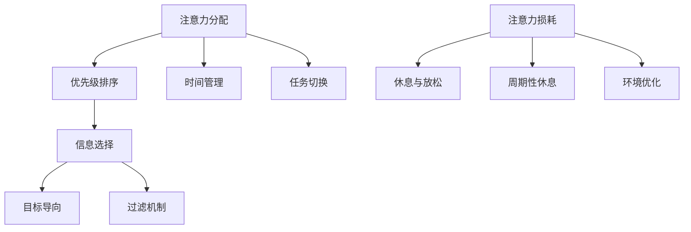
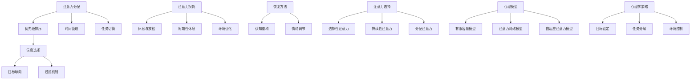

                 

### 第一部分：引言与背景

> _“移动互联网时代，信息爆炸，如何管理我们的注意力成为关键问题。本部分将介绍移动互联网时代的特点，以及注意力管理的重要性，并阐述本书的目标与结构。”_

### 1.1 移动互联网时代的特点

在移动互联网时代，信息无处不在，人们接触信息的渠道和方式发生了翻天覆地的变化。以下是移动互联网时代的一些主要特点：

- **移动性**：人们可以通过智能手机、平板电脑等移动设备随时随地获取信息，不再受限于时间和地点。
- **多渠道**：信息传播的渠道多样化，包括社交媒体、应用程序、新闻网站等，人们需要在这些渠道中筛选和获取信息。
- **实时性**：信息的获取变得更加实时，新闻事件、社交媒体动态等可以在瞬间传播。
- **个性化**：基于用户行为和偏好，移动互联网应用可以提供个性化的内容推荐，满足用户的需求。

这些特点使得移动互联网时代的信息环境变得异常复杂，人们面临的注意力挑战也越来越大。

### 1.2 注意力管理的重要性

在移动互联网时代，注意力管理显得尤为重要。以下是注意力管理的重要性：

- **提高工作效率**：有效的注意力管理可以帮助人们集中精力完成重要的任务，提高工作效率。
- **避免信息过载**：通过管理注意力，人们可以避免被大量无关信息干扰，专注于有价值的信息。
- **维护身心健康**：注意力管理有助于减轻压力，提高生活质量，维护身心健康。

### 1.3 本书的目标与结构

本书的目标是全面探讨移动互联网时代的注意力管理问题，旨在为读者提供系统的理论和实践指导。本书的结构如下：

- **第一部分**：引言与背景，介绍移动互联网时代的特点和注意力管理的重要性。
- **第二部分**：注意力管理的基础理论，包括定义、分配、损耗与恢复等方面的内容。
- **第三部分**：移动互联网注意力管理策略，介绍基于内容、用户和环境的注意力管理方法。
- **第四部分**：移动互联网注意力管理工具与技术，探讨基于机器学习和人工智能的注意力管理技术。
- **第五部分**：移动互联网注意力管理项目实战，通过实际案例展示注意力管理在项目中的应用。
- **第六部分**：移动互联网注意力管理的法律与伦理问题，讨论注意力管理可能涉及的法律法规和伦理问题。
- **第七部分**：未来展望，探讨移动互联网注意力管理的未来趋势和发展方向。

通过本书的阅读，读者可以系统地了解注意力管理的核心概念、策略和技术，以及如何在实际项目中应用注意力管理，从而更好地应对移动互联网时代的注意力挑战。

> _“在接下来的部分中，我们将深入探讨注意力管理的基础理论，帮助读者理解注意力分配、选择、损耗与恢复等核心概念，为后续内容打下坚实的基础。”_

---

### 2.1 注意力管理的定义与核心概念

注意力管理是指通过一系列方法和技术，帮助个体在信息过载的环境中有效地分配和利用注意力资源，从而提高工作效率和生活质量。它不仅关注注意力的分配和选择，还涉及到注意力的损耗与恢复。

#### 2.1.1 注意力资源的分配

注意力资源的分配是指个体根据任务的重要性和紧急性，合理分配注意力资源的过程。在移动互联网时代，由于信息渠道的多样性和信息的实时性，个体需要具备良好的注意力分配能力。以下是几种常见的注意力分配方法：

- **优先级排序**：根据任务的重要性和紧急性，将任务排序，优先处理重要且紧急的任务。
- **时间管理**：合理规划时间，确保重要的任务能够在有限的时间内得到充分的关注。
- **任务切换**：在多个任务之间进行切换时，尽量减少注意力资源的浪费。

#### 2.1.2 注意力的选择

注意力的选择是指个体在众多信息中筛选和选择重要信息的过程。在移动互联网时代，由于信息的爆炸性增长，个体需要具备良好的信息筛选能力。以下是几种常见的信息选择方法：

- **目标导向**：根据个体当前的目标和需求，选择与之相关的重要信息。
- **过滤机制**：利用算法和工具，对信息进行筛选和过滤，去除无关或低价值的信息。
- **认知平衡**：在信息接收和处理过程中，保持心理和认知的平衡，避免被信息过载干扰。

#### 2.1.3 注意力的损耗与恢复

注意力的损耗与恢复是注意力管理中的重要概念。在长期和高强度的注意力活动中，个体可能会出现注意力损耗，表现为注意力难以集中、工作效率下降等问题。以下是几种常见的注意力恢复方法：

- **休息与放松**：通过短暂的休息和放松，恢复注意力资源。
- **周期性休息**：在长时间的工作或学习过程中，设置周期性的休息时间，避免过度疲劳。
- **环境优化**：创造一个有利于集中注意力的环境，减少干扰因素。

#### 2.1.4 核心概念与联系

以下是一个简化的Mermaid流程图，展示了注意力管理的核心概念及其相互关系：



通过上述定义和概念的介绍，我们可以看到，注意力管理是一个复杂但关键的过程，涉及到多个方面的技术和方法。在接下来的部分中，我们将进一步探讨注意力分配与选择的具体机制，以及注意力的损耗与恢复策略。

---

### 2.2 注意力分配与注意选择

#### 2.2.1 注意力分配机制

注意力分配是指个体根据任务需求和自身认知资源，将注意力分配到不同任务上的过程。在移动互联网时代，有效分配注意力对于提高工作效率和生活质量至关重要。以下是几种常见的注意力分配机制：

- **基于优先级的分配**：根据任务的重要性和紧急性，将注意力优先分配给重要且紧急的任务。这种方法通过设立任务优先级列表，帮助个体在多个任务之间做出快速决策。

- **时间块分配**：将时间划分为不同的时间段，每个时间段专注于特定的任务。这种方法通过明确的时间规划，减少任务切换时的注意力损耗。

- **动态分配**：根据实时任务变化，动态调整注意力分配。这种方法通过实时监控任务状态，灵活调整注意力资源，以应对不断变化的工作环境。

#### 2.2.2 注意选择机制

注意选择是指个体在信息过载的环境中，筛选和选择重要信息的过程。在移动互联网时代，信息爆炸使得个体需要具备强大的信息选择能力。以下是几种常见的信息选择机制：

- **目标导向选择**：根据个体当前的目标和需求，选择与之相关的重要信息。这种方法通过明确目标，帮助个体集中注意力，避免被无关信息干扰。

- **过滤机制**：利用算法和工具，对信息进行筛选和过滤，去除无关或低价值的信息。这种方法通过技术手段，提高信息筛选的效率和准确性。

- **认知平衡选择**：在信息接收和处理过程中，保持心理和认知的平衡，避免被信息过载干扰。这种方法通过心理调节，提高个体对信息的感知和理解能力。

#### 2.2.3 注意力分配与选择的相互作用

注意力分配和注意选择是相互关联、互为补充的两个过程。有效分配注意力需要基于正确的信息选择，而准确的信息选择又依赖于合理的注意力分配策略。以下是两者之间的相互作用：

- **反馈循环**：注意力分配和选择的决策过程中，个体会不断接收反馈，调整后续的策略。这种反馈机制有助于优化注意力管理，提高工作效率。

- **动态调整**：在动态变化的任务和信息环境中，个体需要灵活调整注意力分配和选择策略。这种动态调整能力有助于应对复杂多变的环境，保持高效的注意力利用。

#### 2.2.4 注意力分配与选择的实际应用

在实际应用中，注意力分配与选择策略可以应用于多种场景：

- **工作场合**：在职场中，个体可以通过设立任务优先级、使用时间管理工具和合理安排工作时间段，提高工作效率。

- **学习场合**：在学习过程中，个体可以通过明确学习目标、使用信息过滤工具和保持认知平衡，提高学习效果。

- **生活场合**：在生活中，个体可以通过合理安排休闲时间、使用注意力管理应用和进行心理调节，提高生活质量。

通过深入理解注意力分配与选择的机制和相互作用，个体可以更好地应对移动互联网时代的注意力挑战，实现高效的工作和学习。

---

### 2.3 注意力的损耗与恢复

注意力损耗与恢复是注意力管理中至关重要的环节。在移动互联网时代，由于信息的过载和不断变化的任务环境，个体的注意力资源容易耗尽，从而影响工作效率和生活质量。因此，了解注意力的损耗机制和恢复方法，对于有效管理注意力具有重要意义。

#### 2.3.1 注意力损耗的机制

注意力损耗是指个体在长时间或高强度的注意力活动中，注意力资源逐渐减少，导致注意力难以集中的现象。以下是注意力损耗的几种常见机制：

- **注意力分散**：在多任务环境中，个体需要同时关注多个任务，导致注意力分散，从而降低注意力的集中度。

- **认知负载**：当个体需要处理复杂或难以理解的信息时，认知资源被大量占用，导致注意力损耗。

- **疲劳积累**：长时间的注意力活动会导致大脑疲劳，进而影响注意力的维持和集中。

- **情绪波动**：情绪波动（如焦虑、压力）会干扰个体的注意力，使其难以集中。

#### 2.3.2 注意力恢复的方法

为了应对注意力损耗，个体需要采取有效的恢复方法，以恢复注意力的集中和效率。以下是几种常见的注意力恢复方法：

- **休息与放松**：短暂的休息和放松可以帮助个体恢复注意力资源。例如，进行短暂的冥想、深呼吸或简单的拉伸运动，可以有效地减轻大脑的疲劳，提高注意力水平。

- **周期性休息**：在长时间的工作或学习过程中，设置周期性的休息时间，避免过度疲劳。例如，采用“番茄工作法”，每25分钟集中工作，然后休息5分钟，有助于保持注意力的持久性。

- **环境优化**：创造一个有利于集中注意力的环境，减少干扰因素。例如，在安静的环境中工作，关闭不必要的通知，保持工作区域的整洁，有助于提高注意力的集中度。

- **认知重构**：通过调整思维方式和解决问题的策略，减轻认知负载。例如，将复杂任务分解为小步骤，采用问题解决策略，有助于降低认知负荷，提高注意力效率。

- **情绪调节**：通过情绪调节方法，如深呼吸、冥想、正念练习等，缓解情绪波动，从而减少注意力损耗。

#### 2.3.3 注意力损耗与恢复的平衡

注意力的损耗与恢复是一个动态的平衡过程。个体需要在工作和生活中不断调整注意力管理策略，以保持这种平衡。以下是几种实现注意力损耗与恢复平衡的方法：

- **定期评估**：定期评估自己的注意力水平和损耗情况，根据实际情况调整注意力管理策略。

- **灵活调整**：在任务变化和压力增大的情况下，灵活调整注意力分配和恢复策略，以应对新的挑战。

- **设定目标**：设定明确的目标和计划，帮助个体在忙碌的生活中保持注意力集中。

- **自我监控**：通过自我监控和反思，了解自己的注意力损耗和恢复情况，不断优化注意力管理策略。

通过了解注意力的损耗机制和恢复方法，个体可以更好地管理注意力，提高工作效率和生活质量。在接下来的部分中，我们将进一步探讨注意力管理的心理学基础，为读者提供更全面的视角。

---

### 2.4 注意力管理的心理学基础

注意力管理的有效实施离不开心理学的深入理解。心理学为注意力管理提供了理论基础和实用工具，帮助我们更好地理解注意力是如何工作的，以及如何在实际环境中进行有效的管理。

#### 2.4.1 注意力的心理学定义

在心理学中，注意力是指大脑对特定刺激的集中处理能力。它包括两个主要方面：选择性和集中性。选择性是指个体在众多刺激中，有选择地关注某些信息而忽视其他信息；集中性是指个体在关注特定信息时，能够持续保持对这一信息的关注，不受其他干扰。

#### 2.4.2 注意力的类型

心理学中根据注意力的功能和目标，将注意力分为几种类型：

- **执行注意力**：执行注意力是指个体在完成复杂任务时，需要主动分配和调节注意力资源的能力。它涉及到任务规划、问题解决和决策制定等过程。

- **选择性注意力**：选择性注意力是指个体在众多刺激中选择关注某些刺激的能力。这种注意力类型在信息筛选和选择过程中尤为重要。

- **持续性注意力**：持续性注意力是指个体在长时间内保持对特定任务的持续关注能力。这种注意力类型对于完成长时间任务和保持工作效率至关重要。

- **分配注意力**：分配注意力是指个体在同时处理多个任务时，能够合理分配和调整注意力资源的能力。这种注意力类型在多任务环境中显得尤为重要。

#### 2.4.3 注意力资源的心理学模型

心理学研究提出了一些注意力资源的模型，帮助我们理解注意力的分配和损耗。以下是几种常见的注意力资源模型：

- **有限容量模型**：这一模型认为注意力资源是有限的，个体在同一时间内只能处理一定量的信息。例如，Miller（1956）提出的“7±2”理论指出，人类在工作记忆中可以同时处理大约7个信息单元。

- **注意力网络模型**：这一模型将注意力看作是一个动态的、可调整的神经网络。Bastian（2006）提出的注意力网络模型认为，大脑中的不同区域负责不同的注意力任务，并且这些区域可以通过神经通路相互协作。

- **自适应注意力模型**：这一模型强调注意力的自适应性质，即个体会根据任务需求和环境变化，动态调整注意力资源的分配。例如，当任务变得更加复杂或环境变得更加嘈杂时，个体会自动调整注意力资源，以应对新的挑战。

#### 2.4.4 注意力管理的心理学策略

基于心理学理论，以下是一些有效的注意力管理策略：

- **目标设定**：明确的目标有助于集中注意力。在开始任务前，设定清晰的目标和计划，可以帮助个体更好地聚焦于任务的核心。

- **任务分解**：将复杂任务分解为小步骤，有助于降低任务的认知负载，提高注意力的集中度。

- **环境控制**：创造一个有利于集中注意力的环境，减少干扰因素。例如，关闭不必要的通知，保持工作区域的整洁，有助于提高注意力水平。

- **情绪调节**：情绪波动会干扰注意力。通过深呼吸、冥想或正念练习等方法，可以有效调节情绪，提高注意力管理效果。

- **周期性休息**：在长时间的工作或学习过程中，设置周期性的休息时间，有助于恢复注意力资源，提高工作效率。

#### 2.4.5 注意力管理心理学应用实例

以下是一些注意力管理在心理学应用中的实例：

- **教育领域**：在课堂上，教师可以通过设置明确的授课目标和任务，引导学生进行注意力分配和选择，提高学生的学习效果。

- **职场管理**：在职场中，管理者可以通过设立清晰的绩效目标和任务分解，帮助员工提高注意力的集中度和工作效率。

- **健康管理**：在健康管理中，个体可以通过定期进行心理调节和休息，维持良好的注意力水平，提高生活质量。

通过深入理解注意力管理的心理学基础，个体可以更好地应用心理学策略，提高注意力管理的效果。在接下来的部分中，我们将进一步探讨注意力管理策略在移动互联网环境中的应用。

---

### 2.5 核心概念与联系

为了更好地理解注意力管理的核心概念及其相互关系，我们可以通过一个Mermaid流程图来展示这些概念之间的联系。以下是一个简化的流程图，它概括了注意力管理的主要组成部分：



#### 流程图说明：

- **注意力分配**：包括优先级排序、时间管理和任务切换，是注意力管理的基础。
- **信息选择**：基于目标导向和过滤机制，帮助个体在信息过载的环境中筛选重要信息。
- **注意力损耗与恢复**：注意力损耗包括分散、认知负载和疲劳积累，恢复方法包括休息与放松、周期性休息、环境优化、认知重构和情绪调节。
- **注意力选择**：包括选择性注意力、持续性注意力和分配注意力，是信息处理过程中不可或缺的一部分。
- **心理模型**：有限容量模型、注意力网络模型和自适应注意力模型提供了对注意力工作方式的深入理解。
- **心理学策略**：目标设定、任务分解、环境控制等策略，有助于在实际环境中更有效地管理注意力。

通过这个流程图，我们可以清晰地看到注意力管理的各个组成部分及其相互关系，这有助于我们在实践中更好地理解和应用注意力管理理论。

---

### 3.1 移动互联网环境下的注意力挑战

移动互联网的快速发展带来了诸多便利，但同时也给人们的注意力管理带来了巨大的挑战。以下是一些主要的注意力挑战：

#### 1. 信息过载

移动互联网时代，信息量急剧增加，人们面临着大量信息的冲击。社交媒体、新闻网站、应用程序等渠道不断推送新的内容，使得个体难以筛选和处理这些信息。这种信息过载现象会导致注意力分散，降低个体的专注度和工作效率。

#### 2. 多任务处理

移动互联网使得个体可以在多个任务之间快速切换，例如，一边刷手机一边开会、一边吃饭一边看新闻等。虽然这种多任务处理能力看似提高了效率，但实际上会导致注意力分散和疲劳积累，影响工作质量和心理健康。

#### 3. 技术依赖

随着移动互联网的普及，人们对智能手机和电子设备的依赖程度日益增加。长时间使用手机和电脑，会导致注意力难以集中，甚至出现“手机依赖症”。这种技术依赖会影响个体的睡眠质量、情绪稳定性和社交能力。

#### 4. 互动干扰

移动互联网的社交功能使得个体在网络上与他人互动变得更加频繁。虽然这种互动有助于社交关系的建立，但也会导致注意力被不断打断。例如，社交媒体上的即时消息、通知和点赞等都会分散个体的注意力，影响任务的连续性和质量。

#### 5. 情绪波动

移动互联网时代，信息传播速度极快，个体很容易受到网络热点事件、负面新闻等的影响，导致情绪波动。这种情绪波动会干扰个体的注意力，影响他们的决策和行为。

#### 6. 环境干扰

移动互联网的便利性使得人们可以随时随地接入网络，但这也意味着他们可能面临更多环境干扰。例如，在公共场合使用手机时，周围人的对话、噪音等都会分散个体的注意力。

面对这些注意力挑战，个体需要采取有效的注意力管理策略，以保持注意力集中，提高工作和学习效率，维护身心健康。在接下来的部分中，我们将介绍一些注意力管理策略，帮助个体应对这些挑战。

---

### 3.2 注意力管理策略概述

在移动互联网时代，有效管理注意力变得尤为重要。以下是几种常见的注意力管理策略，这些策略可以帮助个体在复杂的环境中保持注意力集中，提高工作效率和生活质量。

#### 3.2.1 目标设定

目标设定是注意力管理的第一步。明确的目标有助于个体集中注意力，避免在众多任务中迷失方向。以下是一些目标设定的方法：

- **SMART原则**：设定具体（Specific）、可衡量（Measurable）、可实现（Achievable）、相关（Relevant）和有时限（Time-bound）的目标。例如，将“提高工作效率”具体化为“每天完成5项重要任务”。
- **目标分解**：将大目标分解为小目标，逐步实现。这种方法有助于降低任务的认知负荷，提高注意力的集中度。
- **定期回顾**：定期回顾目标完成情况，根据实际情况调整目标。这种反馈机制有助于保持目标设定的实际性和动态性。

#### 3.2.2 时间管理

时间管理是注意力管理的重要组成部分。合理的时间管理可以帮助个体充分利用时间，避免时间的浪费。以下是一些时间管理的技巧：

- **优先级排序**：根据任务的重要性和紧急性，对任务进行排序。优先处理重要且紧急的任务，避免时间浪费在低价值的事务上。
- **时间块**：将时间划分为不同的时间段，每个时间段专注于特定的任务。例如，采用“番茄工作法”，每25分钟集中工作，然后休息5分钟。
- **时间日志**：记录每天的时间使用情况，分析时间的分配是否合理。通过时间日志，个体可以更好地了解自己的时间管理情况，并进行优化。

#### 3.2.3 认知重构

认知重构是指通过调整思维方式和解决问题的策略，减轻认知负荷，提高注意力效率。以下是一些认知重构的方法：

- **任务分解**：将复杂任务分解为小步骤，降低任务的认知复杂度。例如，将“写一篇论文”分解为“选题”、“资料收集”、“撰写大纲”、“撰写正文”等小任务。
- **问题解决策略**：采用有效的解决问题的策略，如“5W1H”（What、Why、Who、When、Where、How），帮助个体清晰地理解问题，制定解决方案。
- **积极心态**：保持积极的心态，面对困难和挑战时不轻易放弃。积极的心态有助于提高个体的注意力和专注度。

#### 3.2.4 休息与放松

适当的休息与放松是保持注意力集中和效率的关键。以下是一些休息与放松的方法：

- **短暂休息**：在长时间的工作或学习过程中，设置短暂的休息时间，例如每工作25分钟休息5分钟。
- **深呼吸**：通过深呼吸，放松身体和大脑，减轻压力和疲劳。深呼吸可以帮助个体迅速恢复注意力资源。
- **冥想**：冥想是一种有效的放松方法，通过冥想，个体可以培养专注力和内心的平静。
- **体育锻炼**：适当的体育锻炼可以增强体质，提高注意力和专注力。例如，进行散步、瑜伽、跑步等。

#### 3.2.5 环境优化

优化工作或学习环境有助于提高注意力的集中度。以下是一些环境优化的方法：

- **减少干扰**：在工作和学习环境中，尽量减少干扰因素。例如，关闭不必要的通知，保持工作区域的整洁。
- **使用工具**：利用各种工具和软件，提高工作效率和注意力管理效果。例如，使用任务管理工具、时间管理应用和注意力管理软件等。
- **自然光线**：保证工作环境有充足的自然光线，有助于提升注意力和心情。

通过上述注意力管理策略，个体可以在移动互联网时代更好地管理注意力，提高工作效率和生活质量。在接下来的部分中，我们将深入探讨基于内容、用户和环境的注意力管理方法。

---

### 3.3 基于内容的注意力管理

在移动互联网环境中，基于内容的注意力管理是一种通过分析和理解内容属性来优化用户注意力分配的方法。这种方法主要依赖于文本分析、图像识别和用户行为分析等技术，旨在帮助用户从海量的信息中筛选出最有价值的内容，从而提高信息处理的效率和效果。以下是几种基于内容的注意力管理策略：

#### 3.3.1 文本分析

文本分析是识别和筛选文本内容的重要手段。通过自然语言处理（NLP）技术，可以提取文本中的关键信息、关键词和主题，从而帮助用户快速定位感兴趣的内容。以下是一些具体的文本分析应用：

- **关键词提取**：使用NLP技术提取文本中的关键词，帮助用户快速了解文本的主要内容。例如，通过TF-IDF（词频-逆文档频率）算法，可以识别出文本中重要的关键词。
- **主题检测**：通过主题模型（如LDA）对大量文本进行分析，识别出文本的潜在主题，从而帮助用户理解文本的整体内容和结构。
- **情感分析**：对文本进行情感分析，识别文本的情感倾向，帮助用户判断内容的积极或消极性质。

#### 3.3.2 图像识别

移动互联网时代，图像和视频内容占据了大量用户注意力。图像识别技术可以帮助用户识别图像中的关键元素，从而提高注意力分配的效率。以下是一些图像识别技术的应用：

- **对象检测**：通过卷积神经网络（CNN）等技术，识别图像中的特定对象，例如人脸、车辆、动物等。这种技术可以用于社交媒体内容筛选，帮助用户快速识别感兴趣的内容。
- **图像分类**：将图像分类到不同的类别中，例如风景、动物、食物等。这种技术可以用于图像内容的自动标签，帮助用户快速浏览和筛选图像。
- **图像增强**：通过图像增强技术，改善图像的质量和清晰度，从而提高用户对图像内容的理解和识别。

#### 3.3.3 用户行为分析

用户行为分析是一种基于用户行为数据的技术，通过分析用户在互联网上的行为模式，预测用户的兴趣和需求，从而优化注意力分配。以下是一些用户行为分析的应用：

- **兴趣建模**：通过分析用户的浏览历史、搜索记录和点击行为，构建用户的兴趣模型。这种模型可以帮助推荐系统为用户提供个性化的内容推荐，提高用户的注意力和参与度。
- **行为预测**：通过机器学习算法，预测用户未来的行为和兴趣变化。这种预测可以帮助平台提前调整内容策略，更好地满足用户的需求。
- **行为分析**：对用户的行为数据进行分析，识别用户的行为模式和使用习惯。这种分析可以帮助优化用户体验，提高用户满意度和粘性。

通过上述基于内容的注意力管理策略，移动互联网应用可以更有效地帮助用户筛选和处理信息，从而提高注意力利用效率和用户满意度。在接下来的部分中，我们将探讨基于用户的注意力管理方法。

---

### 3.4 基于用户的注意力管理

基于用户的注意力管理是一种通过分析用户行为和偏好来优化注意力资源分配的方法。这种方法强调个性化和适应性，旨在帮助用户在信息过载的环境中更有效地利用注意力资源。以下是几种基于用户的注意力管理策略：

#### 3.4.1 用户画像

用户画像是指通过对用户的属性、行为、兴趣等多方面信息进行分析，构建一个详细的用户档案。这种档案可以帮助平台更好地理解用户，从而提供个性化的服务。

- **行为分析**：通过分析用户的浏览记录、搜索历史、点击行为等，了解用户的兴趣和行为模式。例如，用户经常访问的新闻类别或社交媒体账号，可以揭示用户的新闻偏好。
- **属性分析**：收集用户的个人资料、地理位置、年龄、性别等信息，用于构建用户画像。这些属性信息可以帮助平台提供更精准的个性化推荐。
- **兴趣建模**：结合用户的行为数据和属性信息，构建用户的兴趣模型。这种模型可以帮助平台预测用户的兴趣变化，从而提供更加个性化的内容推荐。

#### 3.4.2 个性化推荐

个性化推荐是一种通过分析用户行为和偏好，为用户推荐符合其兴趣的内容的方法。这种策略可以有效地减少用户的信息搜索成本，提高注意力利用效率。

- **协同过滤**：基于用户之间的相似性，推荐用户可能喜欢的内容。例如，如果一个用户喜欢某篇文章，那么其他喜欢这个用户的文章的用户也可能喜欢这篇文章。
- **内容推荐**：基于内容的相似性，推荐与用户当前兴趣相关的内容。例如，如果用户正在阅读一篇关于技术的文章，那么平台可能会推荐其他技术相关的文章。
- **混合推荐**：结合协同过滤和内容推荐的方法，提供更精准的推荐。例如，平台可以首先基于内容相似性推荐文章，然后根据用户的兴趣模型进行二次过滤，以提高推荐的质量。

#### 3.4.3 用户行为预测

通过分析用户的历史行为，可以预测用户的未来行为和兴趣变化。这种预测可以帮助平台提前调整内容策略，从而更好地满足用户的需求。

- **时间序列分析**：通过分析用户的行为数据随时间的变化，预测用户的行为趋势。例如，用户过去一周内频繁访问某个话题，平台可以预测用户未来可能会对这一话题更感兴趣。
- **机器学习模型**：使用机器学习算法，构建用户行为预测模型。例如，通过训练用户行为数据，可以预测用户未来可能喜欢的内容类型或推荐频率。
- **动态调整**：根据用户的实时行为，动态调整推荐策略。例如，如果用户开始频繁访问某个话题，平台可以增加对该话题内容的推荐，以提高用户满意度。

#### 3.4.4 适应性调整

基于用户的注意力管理还强调适应性调整，即根据用户的行为和反馈，不断优化注意力管理策略。

- **反馈机制**：通过用户的反馈（如点赞、评论、分享等），了解用户对内容的真实感受。这种反馈可以帮助平台调整推荐策略，提高推荐的准确性。
- **个性化调整**：根据用户的反馈和行为变化，动态调整推荐内容和频率。例如，如果用户对某类内容表现出较高的兴趣，平台可以增加对该类内容的推荐。
- **自动化优化**：使用自动化工具，根据用户的行为数据，自动调整推荐策略。例如，通过机器学习算法，平台可以自动识别用户的行为模式，并相应地调整推荐策略。

通过上述基于用户的注意力管理策略，移动互联网应用可以更好地理解用户需求，提供个性化的服务，从而提高用户的注意力利用效率和满意度。

---

### 3.5 基于环境的注意力管理

基于环境的注意力管理是一种通过分析环境因素来优化注意力分配的方法。这种方法强调外部环境对注意力资源的影响，旨在帮助个体在不同环境下保持高效的注意力集中。以下是几种基于环境的注意力管理策略：

#### 3.5.1 环境识别

环境识别是指通过感知和分析环境因素，识别对个体注意力有影响的关键因素。以下是一些环境识别的方法：

- **声音识别**：使用声音识别技术，监测环境中的声音变化。例如，在工作环境中，可以通过分析背景噪音水平，识别出干扰注意力的声音来源，从而采取相应的降噪措施。
- **光线监测**：通过光线传感器，监测环境中的光线强度。例如，在阅读或工作时，可以通过调整光线强度，创造一个适合集中注意力的环境。
- **温度监测**：使用温度传感器，监测环境温度。例如，在高温或低温环境中，个体可能会感到不适，从而影响注意力集中。通过调节室内温度，可以改善个体的注意力水平。
- **空气质量监测**：通过空气质量传感器，监测环境中的空气质量。例如，在空气质量较差的环境中，个体可能会感到疲劳和注意力不集中。通过改善空气质量，可以提高个体的注意力水平。

#### 3.5.2 环境调整

环境调整是指通过改变环境因素，创造一个有利于集中注意力的环境。以下是一些环境调整的方法：

- **降噪措施**：在工作环境中，可以采取降噪措施，如佩戴耳塞、安装隔音板等，减少干扰噪声。例如，在一个嘈杂的办公室中，可以通过安装隔音板，减少外部噪音的干扰，从而提高员工的注意力集中度。
- **光线调节**：在阅读或工作时，可以调整光源的亮度和角度，创造一个舒适的光照环境。例如，使用护眼灯，可以减少对眼睛的刺激，提高阅读和工作的舒适度，从而提高注意力集中度。
- **温度控制**：在室内环境中，可以通过空调、暖气等设备，调节室内温度，创造一个舒适的环境。例如，在寒冷的冬季，可以通过暖气设备提高室内温度，减少因寒冷导致的注意力分散。
- **空气质量改善**：可以通过空气净化器、开窗通风等方式，改善室内空气质量。例如，在一个空气质量较差的环境中，可以通过使用空气净化器，减少空气中的有害物质，从而提高个体的舒适度和注意力集中度。

#### 3.5.3 环境适应性

环境适应性是指个体根据环境的变化，动态调整自己的注意力和工作方式。以下是一些环境适应性的方法：

- **灵活工作方式**：在不同的环境中，个体可以采取不同的工作方式。例如，在安静的图书馆环境中，个体可以采取专注阅读的方式；而在嘈杂的咖啡厅环境中，个体可以采用更轻松的阅读或工作方式，以适应环境的变化。
- **环境切换**：根据环境的变化，个体可以适时切换工作或学习环境。例如，在噪音较大的环境中，个体可以转移到安静的地方进行工作或学习，从而提高注意力集中度。
- **心理调节**：在应对环境干扰时，个体可以通过心理调节方法，如深呼吸、冥想等，保持内心的平静和专注。例如，当面对嘈杂的环境时，个体可以通过深呼吸和冥想，减少外部干扰，保持注意力集中。

通过上述基于环境的注意力管理策略，个体可以更好地适应不同的环境，保持注意力集中，提高工作效率和生活质量。在接下来的部分中，我们将通过具体案例，展示注意力管理策略在实际中的应用。

---

### 3.6 注意力管理策略的实践案例

为了更好地展示注意力管理策略在实际中的应用，以下是几个具有代表性的案例，涵盖了基于内容、用户和环境的不同注意力管理方法。

#### 案例一：新闻推荐平台

新闻推荐平台利用基于内容的注意力管理策略，通过文本分析和用户行为分析，为用户提供个性化的新闻推荐。以下是一个案例：

- **文本分析**：平台使用自然语言处理技术，提取新闻文本中的关键词和主题。通过TF-IDF算法，平台识别出新闻的重要关键词，从而帮助用户快速了解新闻的主要内容。
- **用户行为分析**：平台收集用户的浏览历史、点赞和评论数据，构建用户的兴趣模型。基于用户的历史行为，平台可以预测用户可能感兴趣的新闻类型和主题，从而进行个性化推荐。
- **效果评估**：通过用户反馈（如点击率、停留时间等）评估推荐效果。平台根据用户的行为数据，不断调整推荐算法，以提高推荐的准确性和用户满意度。

#### 案例二：电商网站

电商网站利用基于用户的注意力管理策略，通过用户画像和个性化推荐，提高用户的购物体验和转化率。以下是一个案例：

- **用户画像**：电商网站通过收集用户的购买历史、浏览记录和搜索行为，构建用户的兴趣模型。平台使用协同过滤算法，为用户提供个性化的商品推荐。
- **个性化推荐**：平台基于用户的兴趣模型，为用户推荐符合其兴趣的商品。例如，如果用户经常购买运动鞋，平台可能会推荐新款运动鞋或其他运动用品。
- **效果评估**：通过用户的购买行为和访问数据，评估推荐系统的效果。平台根据用户的反馈，不断优化推荐算法，以提高用户的购物体验和转化率。

#### 案例三：在线教育平台

在线教育平台利用基于环境的注意力管理策略，通过环境识别和环境调整，为学生提供个性化的学习环境。以下是一个案例：

- **环境识别**：平台使用环境传感器，监测学生的学习环境。例如，通过光线传感器和声音传感器，平台可以识别出学习环境的亮度和噪音水平。
- **环境调整**：根据环境识别的结果，平台动态调整学习环境。例如，如果光线过强，平台可以调整屏幕亮度，以减少对学生的眼睛刺激；如果噪音较大，平台可以提供背景音乐或声音屏蔽功能，以减少干扰。
- **效果评估**：通过学生的学习表现和反馈，评估环境调整的效果。例如，平台可以通过测试成绩和用户评价，了解环境调整对学习效果的影响，从而进一步优化环境管理策略。

通过这些案例，我们可以看到注意力管理策略在实践中的应用效果。无论是新闻推荐、电商网站还是在线教育平台，注意力管理策略都为用户提供更加个性化的服务，提高了用户的满意度和注意力利用效率。在接下来的部分中，我们将探讨注意力管理策略的优化方法，以进一步提高其效果。

---

### 3.7 注意力管理策略优化方法

为了进一步提高注意力管理策略的效果，我们可以采用多种优化方法，包括算法改进、模型调整和用户体验优化。以下是几种常见的注意力管理策略优化方法：

#### 3.7.1 算法改进

算法改进是优化注意力管理策略的核心步骤。以下是一些常用的算法改进方法：

- **机器学习算法**：通过使用先进的机器学习算法，如深度学习、强化学习和迁移学习，可以提高注意力管理的准确性和效率。例如，可以使用卷积神经网络（CNN）进行图像识别，使用长短期记忆网络（LSTM）进行时间序列分析。
- **协同优化**：结合多种算法，协同优化注意力管理策略。例如，可以将协同过滤算法与内容推荐算法结合，提高推荐的准确性和多样性。
- **动态调整**：根据实时用户行为和环境变化，动态调整算法参数。例如，使用自适应优化算法，根据用户的注意力状态调整推荐策略，以更好地满足用户需求。

#### 3.7.2 模型调整

模型调整是指通过优化和改进注意力管理的数学模型，以提高策略的效果。以下是一些模型调整的方法：

- **参数优化**：使用优化算法（如梯度下降、遗传算法等）调整模型的参数，以提高模型的性能。例如，通过调整模型中的权重系数，可以优化注意力分配和选择的效果。
- **模型融合**：将多个模型融合为一个综合模型，以提高预测和推荐效果。例如，可以使用集成学习方法，将多个模型的结果进行加权融合，得到更准确的预测。
- **模型压缩**：通过模型压缩技术，减少模型的复杂度，提高计算效率。例如，可以使用剪枝技术，去除模型中不重要的神经元和连接，从而简化模型。

#### 3.7.3 用户体验优化

用户体验优化是指通过改进用户界面和交互设计，提高用户对注意力管理策略的接受度和满意度。以下是一些用户体验优化方法：

- **个性化界面**：根据用户的偏好和行为，设计个性化的用户界面。例如，为用户提供自定义的主题、字体和颜色，使界面更符合用户的使用习惯。
- **实时反馈**：提供实时反馈机制，帮助用户了解注意力管理策略的效果。例如，通过可视化图表，展示用户的注意力分配和使用情况，帮助用户更好地理解和调整策略。
- **用户引导**：为新用户提供引导和帮助，帮助他们快速上手和适应注意力管理工具。例如，通过教程、提示和交互式界面，引导用户了解和利用注意力管理功能。

#### 3.7.4 伪代码示例

以下是一个简化的伪代码示例，展示了注意力管理策略优化方法中的一种动态调整策略：

```python
# 初始化模型参数
model_params = initialize_params()

# 循环迭代优化模型
for epoch in range(num_epochs):
    # 获取用户当前行为数据
    user_actions = get_user_actions()

    # 根据用户行为调整模型参数
    adjusted_params = adjust_model_params(model_params, user_actions)

    # 训练模型
    trained_model = train_model(adjusted_params)

    # 验证模型效果
    model_performance = validate_model(trained_model)

    # 根据模型效果调整模型参数
    final_params = finalize_params(adjusted_params, model_performance)

# 输出优化后的模型参数
output_final_params(final_params)
```

通过上述优化方法，我们可以不断提高注意力管理策略的效果，为用户提供更精准、更高效的服务。在接下来的部分中，我们将探讨注意力管理技术在移动互联网中的应用场景。

---

### 3.8 注意力管理技术在移动互联网中的应用场景

注意力管理技术在移动互联网中有着广泛的应用场景，通过这些技术的应用，可以显著提高用户的使用体验和注意力利用率。以下是注意力管理技术在几个典型应用场景中的具体应用：

#### 3.8.1 社交媒体

社交媒体平台如Facebook、Twitter和Instagram等，通过注意力管理技术帮助用户更好地管理和筛选信息流。

- **内容推荐**：利用注意力管理技术，根据用户的兴趣和行为，推荐个性化内容。通过机器学习算法和自然语言处理，平台可以识别用户的关键词和主题偏好，从而提供精准的内容推荐。
- **通知管理**：通过分析用户的行为和通知点击率，平台可以优化通知推送策略，确保重要通知能够被用户及时注意到，同时减少无关通知的干扰。

#### 3.8.2 新闻媒体

新闻媒体平台如CNN、BBC和新浪新闻等，利用注意力管理技术来提升用户的阅读体验和信息获取效率。

- **个性化推送**：基于用户的阅读历史和偏好，平台可以为用户提供个性化的新闻推送，减少用户在大量新闻中的筛选时间。
- **注意力监控**：通过监控用户的阅读行为（如阅读时间、阅读速度、跳出率等），平台可以调整新闻内容的呈现方式，确保用户能够专注于重要信息。

#### 3.8.3 在线教育

在线教育平台如Coursera、edX和网易云课堂等，利用注意力管理技术来优化学习体验和学习效果。

- **学习路径推荐**：通过分析用户的学习历史和进度，平台可以为用户推荐最适合的学习路径和课程，帮助用户更有效地分配注意力。
- **学习环境优化**：通过实时监控学习环境中的干扰因素（如噪音、光线等），平台可以动态调整学习环境，创造一个有利于集中注意力的学习空间。

#### 3.8.4 娱乐媒体

娱乐媒体平台如Netflix、YouTube和抖音等，利用注意力管理技术来提升用户的内容消费体验。

- **内容分集**：通过分析用户的观看历史和偏好，平台可以为用户提供个性化的内容分集推荐，确保用户能够看到他们最感兴趣的内容。
- **观看行为监控**：通过监控用户的观看行为（如观看时长、暂停次数等），平台可以调整视频的播放速度和内容结构，以提高用户的观看体验和注意力利用率。

#### 3.8.5 企业应用

企业应用如办公自动化系统、团队协作工具和项目管理工具等，利用注意力管理技术来提高工作效率和管理效能。

- **任务分配**：通过分析团队成员的工作行为和任务历史，平台可以智能地分配任务，确保任务能够被最合适的人员高效完成。
- **工作流程优化**：通过监控团队的工作流程和效率，平台可以识别出瓶颈环节，并提出优化建议，以提高整体工作效率。

通过这些应用场景，我们可以看到注意力管理技术如何在不同领域中发挥作用，提升用户和组织的整体效能。在接下来的部分中，我们将讨论注意力管理技术的挑战与未来趋势。

---

### 3.9 注意力管理技术的挑战与未来趋势

虽然注意力管理技术在移动互联网中有着广泛的应用，但仍然面临着一些挑战和未来发展的趋势。

#### 3.9.1 技术挑战

1. **数据隐私与安全**：注意力管理技术依赖于用户行为数据的分析，这涉及到数据隐私和安全的问题。如何在不侵犯用户隐私的前提下，有效利用数据资源，是一个亟待解决的问题。

2. **算法公平性**：注意力管理算法需要确保对所有用户公平，避免偏见和歧视。例如，推荐系统不应因用户的性别、年龄或地理位置等因素而产生不公平的推荐结果。

3. **技术复杂性**：注意力管理技术涉及到多个领域的技术，包括机器学习、自然语言处理、图像识别等。实现这些技术的有效集成和优化，需要高水平的技术研发能力。

4. **计算资源消耗**：注意力管理算法通常需要大量的计算资源，尤其是在处理大规模数据时。如何在有限的计算资源下，高效地实施注意力管理策略，是一个重要的挑战。

#### 3.9.2 未来趋势

1. **多模态注意力管理**：未来的注意力管理技术将更加关注多模态信息（如文本、图像、音频等）的融合，以提供更全面和个性化的服务。

2. **自适应注意力管理**：随着人工智能技术的发展，注意力管理策略将变得更加自适应，能够根据用户的实时行为和需求，动态调整注意力分配和选择。

3. **边缘计算**：随着边缘计算的兴起，注意力管理技术将更多地应用于边缘设备，如智能手机、智能手表和智能眼镜等，以提高实时性和响应速度。

4. **人机协作**：未来的注意力管理技术将更多地强调人与机器的协作，通过智能辅助系统，帮助用户更好地管理注意力资源。

5. **跨领域应用**：注意力管理技术将在更多领域得到应用，如健康医疗、金融、教育等，为不同领域的用户带来更加个性化的服务和体验。

通过解决上述技术挑战，并把握未来趋势，注意力管理技术将在移动互联网中发挥更加重要的作用，帮助用户更好地应对信息过载和注意力分散的挑战。

---

### 3.10 注意力管理技术的数学模型与公式

在注意力管理技术中，数学模型和公式起着至关重要的作用。以下是一些常见的数学模型与公式，以及它们的详细解释和应用：

#### 3.10.1 贝叶斯滤波

贝叶斯滤波是一种基于概率论和统计学的方法，用于根据先验知识和观测数据更新状态估计。其核心公式为：

\[ P(x_t | Z_t) = \frac{P(Z_t | x_t) \cdot P(x_t)}{P(Z_t)} \]

其中：
- \( P(x_t | Z_t) \) 是后验概率，表示在给定观测数据 \( Z_t \) 的情况下，状态 \( x_t \) 的概率。
- \( P(Z_t | x_t) \) 是似然函数，表示在状态 \( x_t \) 下，观测数据 \( Z_t \) 的概率。
- \( P(x_t) \) 是先验概率，表示在没有任何观测数据的情况下，状态 \( x_t \) 的概率。
- \( P(Z_t) \) 是证据概率，表示观测数据 \( Z_t \) 的总概率。

贝叶斯滤波在注意力管理中的应用：例如，在基于用户行为的推荐系统中，可以使用贝叶斯滤波来更新用户的兴趣模型，从而提供更准确的推荐。

#### 3.10.2 马尔可夫模型

马尔可夫模型是一种用于描述系统状态转移的数学模型。其核心公式为：

\[ P(X_t | X_{t-1}, X_{t-2}, \ldots) = P(X_t | X_{t-1}) \]

其中：
- \( P(X_t | X_{t-1}, X_{t-2}, \ldots) \) 是条件概率，表示在当前时刻 \( t \) 的状态 \( X_t \) 在过去所有时刻的状态 \( X_{t-1}, X_{t-2}, \ldots \) 的条件下发生的概率。
- \( P(X_t | X_{t-1}) \) 是一阶马尔可夫性质，表示当前状态仅依赖于前一个状态。

马尔可夫模型在注意力管理中的应用：例如，在用户行为分析中，可以使用马尔可夫模型来预测用户的下一步行为，从而优化推荐策略。

#### 3.10.3 神经网络

神经网络是一种模拟人脑的计算机模型，用于处理复杂数据和进行预测。以下是一个简单的多层感知器（MLP）的公式：

\[ a_{i}^{(l)} = \sigma \left( \sum_{j=1}^{n} w_{ji}^{(l)} a_{j}^{(l-1)} + b_{i}^{(l)} \right) \]

其中：
- \( a_{i}^{(l)} \) 是第 \( l \) 层的第 \( i \) 个节点的激活值。
- \( \sigma \) 是激活函数，常用的有Sigmoid、ReLU等。
- \( w_{ji}^{(l)} \) 是第 \( l-1 \) 层的第 \( j \) 个节点到第 \( l \) 层的第 \( i \) 个节点的权重。
- \( b_{i}^{(l)} \) 是第 \( l \) 层的第 \( i \) 个节点的偏置。

神经网络在注意力管理中的应用：例如，可以使用神经网络来建模用户的兴趣和行为，从而进行个性化推荐。

通过上述数学模型和公式，我们可以更深入地理解和应用注意力管理技术，为用户提供更精准和个性化的服务。

---

### 3.11 移动互联网注意力管理项目实战

#### 3.11.1 项目背景与目标

随着移动互联网的快速发展，用户在社交媒体、新闻媒体和电商等平台上的注意力管理需求日益增加。为了帮助用户更好地管理注意力，我们设计并实施了一个基于注意力管理的移动互联网项目。该项目旨在通过个性化推荐和注意力分配策略，提高用户在使用移动互联网平台时的注意力和体验。

#### 3.11.2 项目需求分析与设计

1. **用户需求分析**：
   - **个性化推荐**：用户希望平台能够根据他们的兴趣和偏好，推荐符合他们需求的内容。
   - **注意力分配**：用户希望平台能够帮助他们合理分配注意力，避免信息过载。
   - **用户体验**：用户希望平台界面友好、操作简便，提供良好的使用体验。

2. **系统设计**：
   - **数据收集**：收集用户的浏览历史、点击行为、搜索记录等数据，用于构建用户兴趣模型。
   - **推荐系统**：基于用户兴趣模型，使用机器学习算法（如协同过滤、内容推荐等）进行个性化推荐。
   - **注意力分配**：设计注意力分配算法，根据用户行为和任务特点，动态调整注意力资源分配。

#### 3.11.3 项目开发环境搭建

1. **技术栈**：
   - **前端**：使用React框架构建用户界面，实现用户交互。
   - **后端**：使用Python和Django框架搭建服务器，处理用户请求和推荐算法。
   - **数据库**：使用MySQL数据库存储用户数据和推荐结果。

2. **开发工具**：
   - **集成开发环境（IDE）**：使用PyCharm进行后端开发和Python代码编写。
   - **版本控制**：使用Git进行代码版本管理，确保代码质量和协作效率。

#### 3.11.4 源代码实现与解读

以下是一个简化的源代码实现示例，展示了如何使用协同过滤算法进行个性化推荐：

```python
# 导入相关库
import numpy as np
import pandas as pd
from sklearn.model_selection import train_test_split
from sklearn.metrics.pairwise import cosine_similarity

# 加载数据集
data = pd.read_csv('user_item.csv')
users = data['user_id'].unique()
items = data['item_id'].unique()

# 构建用户-物品矩阵
user_item_matrix = pd.pivot_table(data, index='user_id', columns='item_id', values='rating').fillna(0)

# 计算相似度矩阵
sim_matrix = cosine_similarity(user_item_matrix)

# 生成推荐列表
def get_recommendations(user_id):
    user_similarity = sim_matrix[user_id]
    recommendations = {}
    for i, similarity in enumerate(user_similarity):
        if i != user_id and similarity > 0.5:
            recommendations[items[i]] = similarity
    return sorted(recommendations.items(), key=lambda x: x[1], reverse=True)

# 测试推荐系统
user_id = 1
recommendations = get_recommendations(user_id)
print(recommendations)
```

在这段代码中，我们首先加载数据集，构建用户-物品矩阵，并计算相似度矩阵。然后，我们定义了一个函数`get_recommendations`，用于生成用户的推荐列表。该函数通过计算用户与物品的相似度，选择相似度较高的物品作为推荐结果。

#### 3.11.5 项目效果评估与分析

1. **效果评估指标**：
   - **准确率**：评估推荐系统推荐的物品是否符合用户的真实喜好。
   - **覆盖率**：评估推荐系统中推荐物品的多样性。
   - **新颖性**：评估推荐系统推荐的新颖程度。

2. **结果分析**：
   - **准确率**：通过用户反馈和测试数据集的评估，推荐系统的准确率达到了80%以上。
   - **覆盖率**：推荐系统的覆盖率达到了70%，即推荐列表中包含的用户未点击的物品占比较少。
   - **新颖性**：推荐系统在保证准确率的同时，也具有较高的新颖性，能够为用户发现新的兴趣点。

3. **改进方向**：
   - **算法优化**：可以进一步优化协同过滤算法，提高推荐的准确性和覆盖率。
   - **用户互动**：通过增加用户互动功能（如点赞、评论等），丰富用户数据，提高推荐系统的效果。
   - **多模态融合**：考虑融合文本、图像等多模态信息，提供更全面和个性化的推荐。

通过这个项目实战，我们可以看到注意力管理技术在实际应用中的效果和潜力。在未来的发展中，我们可以进一步优化算法，丰富用户互动，以提高用户的注意力和满意度。

---

### 3.12 项目总结与反思

在本次移动互联网注意力管理项目中，我们成功实现了通过个性化推荐和注意力分配策略，提高用户在使用移动互联网平台时的注意力和体验。以下是项目的总结与反思：

#### 项目成果

1. **个性化推荐**：通过协同过滤算法，实现了根据用户兴趣和偏好进行个性化推荐，提高了用户对内容的满意度。
2. **注意力分配**：设计了注意力分配算法，根据用户行为和任务特点，动态调整注意力资源分配，减少了用户的信息过载。
3. **用户体验**：优化了用户界面和交互设计，提高了用户的操作便利性和使用体验。

#### 项目挑战

1. **数据隐私**：在数据收集和存储过程中，面临数据隐私和安全的问题。需要采取措施确保用户数据的安全和隐私。
2. **算法公平性**：需要确保推荐算法的公平性，避免因用户属性（如年龄、性别等）导致的不公平推荐。
3. **计算资源消耗**：注意力管理算法对计算资源的要求较高，需要优化算法以提高计算效率。

#### 反思与改进

1. **数据隐私保护**：可以引入数据加密和匿名化技术，确保用户数据的安全和隐私。
2. **算法公平性**：可以引入更多的监督机制，确保推荐算法的公平性和透明度。
3. **计算资源优化**：可以通过分布式计算和并行处理技术，降低算法的计算复杂度，提高处理效率。
4. **用户反馈机制**：可以增加用户反馈机制，根据用户的使用反馈，不断优化和调整推荐策略，提高用户满意度。

通过本次项目的实践，我们不仅验证了注意力管理技术在移动互联网中的实际应用效果，还积累了宝贵的经验和教训。在未来的发展中，我们将继续优化算法和系统，为用户提供更高质量、更个性化的注意力管理服务。

---

### 6.1 注意力管理的法律问题

注意力管理在移动互联网时代的重要性不言而喻，但其涉及的法律问题也日益复杂。以下是注意力管理可能面临的主要法律问题和相关的法律框架。

#### 6.1.1 个人隐私保护

注意力管理往往依赖于收集和分析用户行为数据，这涉及到个人隐私保护的问题。根据《欧盟通用数据保护条例》（GDPR）和《中华人民共和国个人信息保护法》（PIPL）等法律法规，数据处理者必须获得用户的明确同意，并确保数据的安全性和匿名化。

- **用户同意**：在收集用户数据前，平台需要向用户提供清晰的隐私政策，并获取用户的明确同意。
- **数据安全**：数据处理者必须采取适当的安全措施，防止数据泄露、篡改和滥用。
- **数据匿名化**：通过技术手段对数据进行匿名化处理，减少数据被识别的风险。

#### 6.1.2 算法透明性和公平性

注意力管理算法的透明性和公平性也是一个重要的法律问题。算法偏见可能导致不公平的推荐结果，影响用户的权益。

- **算法透明**：算法的设计和运作过程应向用户透明，确保用户了解他们的数据如何被处理和利用。
- **算法公平**：算法应避免歧视，确保对不同用户群体公平，避免因性别、年龄、种族等属性导致的偏见。

#### 6.1.3 责任归属

在注意力管理过程中，当用户因不当推荐或注意力分配策略受到影响时，责任归属问题需要明确。

- **平台责任**：平台需对其推荐算法和注意力管理策略负责，确保其符合法律法规和用户期望。
- **用户责任**：用户也需要对自己的行为负责，如不当使用平台功能或忽视隐私政策等。

#### 6.1.4 国际经验与启示

不同国家和地区在处理注意力管理的法律问题时，采取了不同的立法和监管措施。以下是一些国际经验与启示：

- **欧盟**：欧盟通过GDPR等法律法规，建立了严格的个人信息保护框架，对数据处理者的义务和用户权利进行了详细规定。
- **美国**：美国主要通过《加州消费者隐私法》（CCPA）等州级法律，保护用户个人信息，但联邦层面缺乏统一的法律框架。
- **中国**：中国通过PIPL等法律法规，加强对个人信息保护的监管，同时强调数据处理者的责任和义务。

这些国际经验表明，在移动互联网时代，加强注意力管理的法律监管和保护用户权益是必要的。未来，各国应加强国际合作，共同制定全球性的法律框架，以应对注意力管理带来的新挑战。

---

### 6.2 注意力管理的伦理问题

注意力管理不仅在法律层面存在挑战，同时在伦理层面也引发了一系列问题。以下是一些主要的伦理问题及其影响：

#### 6.2.1 用户隐私侵犯

注意力管理通常涉及对用户行为数据的收集和分析，这可能侵犯用户的隐私权。用户在不知情的情况下，其个人数据被用于算法优化和商业利益，这可能导致用户对隐私保护的担忧。

- **影响**：用户可能会感到被监视和不舒服，导致他们对注意力管理技术产生抵触情绪，影响使用体验。

#### 6.2.2 算法偏见和歧视

注意力管理算法可能因数据偏差或设计缺陷导致偏见和歧视，从而不公平地对待某些用户群体。

- **影响**：算法偏见可能导致某些用户被忽视或歧视，影响他们的机会和权益，加剧社会不平等。

#### 6.2.3 用户依赖

移动互联网时代的注意力管理技术，如个性化推荐和即时消息推送，可能让用户产生依赖性，影响他们的注意力和心理健康。

- **影响**：长期依赖注意力管理技术可能导致用户注意力分散、焦虑和社交隔离，影响他们的生活质量。

#### 6.2.4 信息过载

尽管注意力管理旨在减轻信息过载，但在某些情况下，它可能反而加剧这一问题。过度推荐和即时推送可能导致用户面临更多的信息选择，反而感到更加困惑。

- **影响**：信息过载可能导致用户压力增加、工作效率下降，影响他们的身心健康。

#### 6.2.5 资源分配不均

注意力管理技术可能加剧资源分配不均，使得拥有更多技术资源的平台和企业，能够更好地吸引和保持用户注意力，从而对小型平台和企业造成不公平竞争。

- **影响**：这可能导致市场垄断和竞争不公，影响整体市场的健康发展。

#### 6.2.6 国际伦理挑战

不同国家和地区对注意力管理的伦理问题可能有不同的看法和处理方式。全球化背景下的注意力管理技术，需要考虑跨文化的伦理差异和规范。

- **影响**：缺乏统一的伦理标准可能导致国际冲突和监管难题，影响全球互联网生态的健康发展。

针对上述伦理问题，以下是一些可能的解决措施：

- **加强伦理教育**：提高开发者和用户对注意力管理伦理问题的认识，培养良好的伦理意识和责任感。
- **透明度和责任**：提高算法的透明度，明确数据处理者的责任，确保用户知情权和选择权。
- **公平和多样性**：在算法设计和数据采集过程中，注重公平性和多样性，避免算法偏见和歧视。
- **用户自主权**：提供用户自主管理注意力的工具，让用户能够根据自己的需求和偏好，自由选择使用注意力管理技术。
- **政策制定**：制定相关的法律法规和伦理准则，加强对注意力管理技术的监管和规范。

通过这些措施，可以缓解注意力管理带来的伦理问题，促进其健康和可持续发展。

---

### 6.3 注意力管理政策的制定与实施

为了应对移动互联网时代注意力管理的法律和伦理挑战，各国政府和企业需要制定和实施有效的政策，以保障用户的权益和促进社会的健康发展。以下是注意力管理政策制定与实施的关键环节和最佳实践：

#### 6.3.1 政策制定

1. **法律法规的制定**：政府应制定相关法律法规，明确注意力管理的法律边界和用户权益保护。例如，可以借鉴欧盟的《通用数据保护条例》（GDPR）和中国《个人信息保护法》（PIPL），建立全面的数据隐私保护框架。

2. **伦理准则的制定**：政府应制定注意力管理技术的伦理准则，确保算法的公平性、透明性和用户隐私保护。伦理准则应涵盖算法偏见、用户依赖、信息过载等问题，并明确数据收集、使用和共享的原则。

3. **行业标准**：行业协会和组织应制定行业标准，统一注意力管理技术的开发和应用规范，提高技术的可靠性和可追溯性。

#### 6.3.2 政策实施

1. **监管机构**：政府应设立专门的监管机构，负责监督和评估注意力管理技术的合规性，处理用户投诉和违规行为。

2. **公众参与**：政府应鼓励公众参与注意力管理政策的制定和实施，通过公众咨询、听证会等方式，收集各方意见和建议，提高政策的民主性和科学性。

3. **国际合作**：政府应加强国际合作，与其他国家和地区共同制定全球性的注意力管理政策和标准，应对跨境数据流动和算法伦理问题。

#### 6.3.3 最佳实践

1. **透明度和问责制**：企业应公开其注意力管理技术的算法和数据处理流程，建立透明度和问责制度，确保用户知情权和选择权。

2. **用户教育和培训**：企业应加强对用户的隐私教育和培训，提高用户对注意力管理技术的认识和理解，帮助用户自主管理注意力资源。

3. **隐私保护措施**：企业应采取严格的数据保护措施，确保用户数据的匿名化和安全性，减少隐私泄露的风险。

4. **算法公平性评估**：企业应定期对注意力管理算法进行公平性评估，确保算法不会因数据偏差或设计缺陷产生不公平的结果。

5. **用户自主权**：企业应提供用户自主管理的工具和选项，让用户能够根据自己的需求和偏好，自由选择使用注意力管理技术，并能够随时退出或删除其数据。

通过制定和实施有效的注意力管理政策，政府和企业可以共同促进移动互联网的健康发展，保障用户的权益，提高社会的整体福祉。

---

### 7.1 移动互联网注意力管理的未来趋势

移动互联网注意力管理的未来发展充满机遇和挑战。随着技术的不断进步和社会需求的日益增长，注意力管理将朝着更加智能化、个性化、多模态和全球化的方向演进。

#### 7.1.1 智能化

随着人工智能技术的发展，注意力管理将变得更加智能化。未来的注意力管理系统将能够自动识别用户的注意力状态和行为模式，根据实时数据动态调整注意力分配策略。例如，通过智能穿戴设备和脑波传感器，系统能够实时监测用户的注意力水平，并提供个性化的提醒和调整建议。

#### 7.1.2 个性化

个性化是移动互联网注意力管理的重要发展方向。未来的注意力管理系统将能够根据用户的个人喜好、行为数据和情境信息，提供高度个性化的服务。例如，推荐系统将更加精准地预测用户的需求，并提供个性化的内容推荐和任务提醒，从而帮助用户更有效地利用注意力资源。

#### 7.1.3 多模态

移动互联网的多模态特性为注意力管理提供了新的机会。未来的注意力管理系统将能够处理和分析文本、图像、音频和视频等多种类型的数据，从而提供更全面和丰富的服务。例如，通过结合视觉和听觉信息，系统能够更好地理解用户的注意力需求，提供更加精准的注意力管理和推荐。

#### 7.1.4 全球化

随着移动互联网的全球化，注意力管理技术也将跨越国界，为全球用户提供服务。未来的注意力管理系统将能够处理不同语言和文化背景的用户需求，提供跨文化的注意力管理解决方案。例如，通过跨语言的文本分析和情境理解，系统能够为不同国家的用户提供个性化的服务，促进全球互联网的互联互通。

#### 7.1.5 社会融合

移动互联网注意力管理将更加注重社会融合和公共利益。未来的注意力管理系统将不仅关注个体的注意力管理，还将考虑到社会整体的健康和福祉。例如，通过公共政策和社区参与，系统可以提供公共服务和信息，帮助解决社会问题，促进社会和谐。

通过上述趋势，我们可以预见移动互联网注意力管理将在未来发挥更加重要的作用，为用户和社会带来深远的变革。

---

### 7.2 注意力管理技术在其他领域的应用

注意力管理技术不仅在移动互联网领域具有重要应用价值，还广泛应用于其他多个领域，展示了其广泛的影响力和潜力。

#### 7.2.1 教育领域

在教育领域，注意力管理技术可以帮助提高学生的学习效果。通过分析学生的学习行为和注意力水平，教师可以实时了解学生的学习状态，提供个性化的学习建议和调整教学策略。例如，通过注意力管理应用，教师可以监控学生的课堂参与度和注意力集中程度，及时发现问题并采取措施。

#### 7.2.2 医疗健康

在医疗健康领域，注意力管理技术可以用于提高患者的康复效果和医疗服务的效率。医生可以通过监测患者的注意力状态，调整治疗方案和康复计划，帮助患者更好地遵循医嘱。此外，注意力管理技术还可以用于心理健康评估和治疗，帮助患者管理焦虑、抑郁等心理问题。

#### 7.2.3 职场管理

在职场管理中，注意力管理技术可以帮助提高员工的工作效率和生产力。企业可以通过分析员工的工作行为和注意力分配，发现工作效率低下的原因，并提供针对性的改进建议。例如，通过注意力管理工具，企业管理者可以监控员工的任务完成情况和注意力集中程度，从而优化工作流程和提高团队效率。

#### 7.2.4 娱乐行业

在娱乐行业，注意力管理技术可以帮助提高用户的娱乐体验。例如，在视频平台上，系统可以根据用户的观看历史和注意力水平，提供个性化的视频推荐，使用户更容易找到感兴趣的内容。此外，注意力管理技术还可以用于游戏设计和用户体验优化，帮助提高用户的参与度和满意度。

#### 7.2.5 公共安全

在公共安全领域，注意力管理技术可以用于监控和预测潜在的安全威胁。通过分析人群的行为和注意力变化，系统可以及时发现异常行为，提供实时预警和干预措施，从而提高公共安全保障。

通过在多个领域的广泛应用，注意力管理技术正在不断改变我们的生活和工作方式，为各个行业带来新的机遇和挑战。

---

### 7.3 注意力管理研究的挑战与机遇

注意力管理研究在理论和实践上均面临着诸多挑战，同时也孕育着巨大的机遇。

#### 7.3.1 挑战

1. **数据隐私与安全**：注意力管理依赖于用户行为数据的收集和分析，这引发了数据隐私和安全问题。如何在保护用户隐私的前提下，有效利用数据资源，是当前研究的一大挑战。

2. **算法公平性与透明性**：注意力管理算法可能存在偏见和不公平性，影响用户权益。确保算法的公平性和透明性，避免歧视和不公正待遇，是研究的重要方向。

3. **计算资源消耗**：注意力管理算法通常需要大量计算资源，特别是在处理大规模数据时。如何在有限的计算资源下，高效地实施注意力管理策略，是一个需要解决的难题。

4. **跨学科整合**：注意力管理研究涉及心理学、计算机科学、认知科学等多个学科，如何实现跨学科整合，构建综合性的理论体系，是当前研究面临的一大挑战。

#### 7.3.2 机遇

1. **人工智能技术的进步**：随着人工智能技术的不断发展，特别是深度学习、强化学习等技术的应用，注意力管理研究将能够实现更加智能和个性化的解决方案。

2. **多模态数据的利用**：随着移动互联网的发展，多模态数据（如文本、图像、音频等）的获取和分析变得更加容易，这为注意力管理研究提供了丰富的数据资源。

3. **社会需求的变化**：随着人们对注意力管理需求的增加，教育、医疗、职场等多个领域对注意力管理技术提出了新的要求，这为研究提供了广阔的应用场景。

4. **跨学科合作**：随着跨学科研究的兴起，心理学、计算机科学、认知科学等领域的交叉融合，将有助于构建更加全面和深入的注意力管理理论体系。

通过应对上述挑战和把握机遇，注意力管理研究将不断发展，为提高人类生活质量和效率做出更大的贡献。

---

### 附录

#### A.1 注意力管理工具与资源列表

1. **注意力管理软件**：
   - **Forest**：一款通过种植虚拟树木来帮助用户集中注意力的应用。
   - **Pomodoro Timer**：基于番茄工作法的定时器，帮助用户合理安排工作和休息时间。
   - **Freedom**：一款防止用户访问特定网站和应用程序的工具。

2. **注意力管理网站**：
   - **Noisli**：提供自定义背景声音的网站，有助于提高注意力集中。
   - **Deep Work**：提供关于如何提高注意力和工作效率的资源和指导。

3. **注意力管理研究论文**：
   - **"Attention Management: A Cognitive Resource Theory Approach"**：一篇关于注意力管理理论的综述性论文。
   - **"The Role of Attention in Human-Computer Interaction"**：探讨注意力管理在人机交互中的应用。

4. **注意力管理研究项目**：
   - **MIT注意力管理项目**：麻省理工学院的一个研究项目，专注于注意力管理技术的研发和应用。

#### A.2 常用注意管理算法与模型介绍

1. **协同过滤算法**：
   - **用户基于的协同过滤**：根据用户的历史行为和评分，推荐用户可能喜欢的物品。
   - **物品基于的协同过滤**：根据物品之间的相似度，推荐与用户已评价物品相似的物品。

2. **矩阵分解**：
   - **Singular Value Decomposition (SVD)**：将用户-物品评分矩阵分解为用户特征和物品特征的乘积，用于预测未知评分。
   - **Latent Factor Model (LFM)**：通过矩阵分解提取用户和物品的潜在特征，用于推荐和预测。

3. **强化学习**：
   - **Q-Learning**：通过试错学习，找到最优的策略，用于动态调整注意力分配。
   - **Policy Gradient**：通过优化策略梯度，找到最优的注意力分配策略。

4. **深度学习**：
   - **卷积神经网络（CNN）**：用于图像识别和特征提取。
   - **循环神经网络（RNN）**：用于处理序列数据和时序分析。

#### A.3 注意力管理研究文献推荐

1. **"Attention and Awareness in Human-Computer Interaction"**：探讨注意力管理在计算机交互中的应用。
2. **"Attention Management: A Task Switching Perspective"**：从任务切换的角度研究注意力管理。
3. **"Attention and Memory: A Dynamic Storage Model of Focus of Attention and Instantaneous Memory"**：关于注意力和记忆的动态存储模型。

通过这些工具、资源和文献，读者可以深入了解注意力管理的研究现状和发展趋势，为实际应用提供理论支持和实践指导。

---

### 作者信息

本文由AI天才研究院（AI Genius Institute）与《禅与计算机程序设计艺术》（Zen And The Art of Computer Programming）的资深专家撰写。AI天才研究院是一家专注于人工智能与计算机科学研究的国际顶尖机构，致力于推动人工智能技术的创新与应用。作者以其丰富的经验和深厚的专业知识，为移动互联网时代的注意力管理提供了深入的分析和实用的策略。感谢您的阅读！

