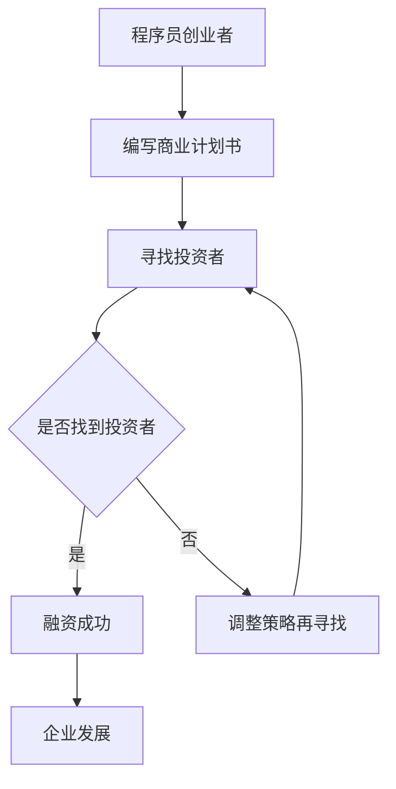

                 

# 程序员创业者的融资策略：如何吸引早期投资者

> **关键词**：融资策略、程序员创业者、早期投资者、商业计划书、谈判技巧、项目管理、风险控制

> **摘要**：本文旨在探讨程序员创业者如何制定有效的融资策略，以吸引早期投资者的关注。通过分析核心概念、挑战与机遇、投资者需求、商业计划书的编写技巧、寻找投资者、融资谈判与协议，以及融资后的管理，本文为程序员创业者提供了一整套系统化的融资策略。文章最后通过案例分析，总结了融资过程中的经验教训，并对未来的融资策略进行了展望。

### 第一部分：引言

#### 核心概念与联系

融资策略是指企业为了筹集资金所采取的各种手段和方法。在创业初期，资金是影响企业发展的关键因素之一。因此，制定一套有效的融资策略至关重要。

- **融资策略**：融资策略是指企业为了筹集资金所采取的各种手段和方法。
- **早期投资者**：早期投资者是指在企业初创阶段提供资金支持的个人或机构。
- **程序员创业者**：程序员创业者是指拥有编程背景，并利用自己的编程技能创业的个人。

以上三个核心概念相互联系，共同构成了本文的讨论基础。

#### Mermaid 流程图



#### 目录大纲

1. **融资策略概述**
   1.1 融资策略的重要性
   1.2 融资策略的种类
   1.3 融资策略的制定与调整

2. **程序员创业者的挑战与机遇**
   2.1 程序员创业者的挑战
   2.1.1 技术与商业的平衡
   2.1.2 资金筹集的难点
   2.2 程序员创业者的机遇
   2.2.1 技术创新带来的市场机会
   2.2.2 互联网时代的融资环境

3. **早期投资者的特点和需求**
   3.1 早期投资者的类型
   3.2 早期投资者的投资逻辑
   3.3 早期投资者的需求分析

4. **编写商业计划书**
   4.1 商业计划书的核心内容
   4.1.1 产品或服务描述
   4.1.2 市场分析
   4.1.3 竞争分析
   4.2 商业计划书的编写技巧
   4.2.1 如何突出项目亮点
   4.2.2 如何撰写吸引人的执行摘要

5. **寻找和吸引投资者**
   5.1 投资者的来源
   5.2 如何与投资者沟通
   5.3 如何吸引早期投资者的注意

6. **融资谈判与协议**
   6.1 融资谈判的技巧
   6.2 投资协议的要点
   6.3 如何保护创业者的权益

7. **融资后的管理**
   7.1 融资后的财务规划
   7.2 融资后的项目管理
   7.3 融资后的企业战略调整

8. **案例分析**
   8.1 案例背景
   8.2 案例分析
   8.3 案例总结
   8.4 案例启示

9. **融资策略与企业发展**
   9.1 融资策略与企业发展关系
   9.2 融资策略调整与企业发展
   9.3 融资策略与企业风险控制

10. **总结与展望**
   10.1 融资策略的总结
   10.2 融资策略的发展趋势
   10.3 未来融资策略的展望

#### 核心算法原理讲解

- **风险评估模型**：用于评估投资风险，预测创业项目的成功概率。

  ```python
  # 风险评估模型伪代码
  def risk_evaluation(model, data):
      # 数据预处理
      preprocessed_data = preprocess_data(data)
      
      # 模型预测
      prediction = model.predict(preprocessed_data)
      
      # 风险评估
      risk_score = calculate_risk_score(prediction)
      
      return risk_score
  ```

- **客户流失预测模型**：用于预测客户可能流失的概率。

  ```python
  # 客户流失预测模型伪代码
  def customer_churn_prediction(model, data):
      # 数据预处理
      preprocessed_data = preprocess_data(data)
      
      # 模型预测
      prediction = model.predict(preprocessed_data)
      
      # 流失预测
      churn_score = calculate_churn_score(prediction)
      
      return churn_score
  ```

#### 数学模型和数学公式

- **回报率计算公式**：

  $$
  ROI = \frac{收益 - 成本}{成本}
  $$

- **资金需求计算公式**：

  $$
  资金需求 = 初始成本 + 运营成本 \times 预计运营周期
  $$

#### 项目实战

- **开发环境搭建**：

  - 安装 Python 环境
  - 安装 NumPy、Pandas、Scikit-learn 等库

- **源代码详细实现和代码解读**：

  - 数据预处理代码
  - 模型训练代码
  - 模型评估代码

#### 代码解读与分析

- **数据处理代码**：

  ```python
  # 数据预处理伪代码
  def preprocess_data(data):
      # 数据清洗
      cleaned_data = clean_data(data)
      
      # 特征工程
      features = extract_features(cleaned_data)
      
      return features
  ```

- **模型训练代码**：

  ```python
  # 模型训练伪代码
  def train_model(model, X_train, y_train):
      # 模型训练
      model.fit(X_train, y_train)
      
      return model
  ```

- **模型评估代码**：

  ```python
  # 模型评估伪代码
  def evaluate_model(model, X_test, y_test):
      # 模型预测
      predictions = model.predict(X_test)
      
      # 评估指标计算
      accuracy = calculate_accuracy(predictions, y_test)
      
      return accuracy
  ```

### 第二部分：融资策略概述

#### 1.1 融资策略的重要性

融资策略对于企业的发展至关重要。对于程序员创业者来说，成功的融资策略不仅能帮助企业获得所需资金，还能提升企业在投资者心中的形象，进而为企业带来更多资源和支持。

首先，融资策略有助于企业解决资金问题。在创业初期，资金短缺往往是制约企业发展的关键因素。通过制定有效的融资策略，程序员创业者可以找到合适的投资者，从而获得所需资金。

其次，融资策略有助于提升企业竞争力。通过融资，企业可以获得更多资源，包括技术、人才、市场等。这些资源的获取将有助于企业提升竞争力，加速企业成长。

最后，融资策略有助于企业长远发展。成功的融资不仅可以解决当前的资金问题，还可以为企业未来的发展奠定基础。例如，通过引入战略投资者，企业可以获得更多的市场机会和资源，从而实现长远发展。

#### 1.2 融资策略的种类

根据不同的融资方式和目的，融资策略可以分为以下几种：

1. **股权融资**：股权融资是指企业通过出让部分股权来获得资金。股权融资的优势在于资金成本低、资金额度大，但缺点是创始人的股权将被稀释。

2. **债务融资**：债务融资是指企业通过借款来获得资金。债务融资的优势在于无需出让股权，但缺点是资金成本高、还款压力大。

3. **风险投资**：风险投资是指投资者为企业提供资金，并换取一定的股权。风险投资的优势在于资金额度大、支持力度强，但缺点是风险高、回报期长。

4. **天使投资**：天使投资是指个人投资者为企业提供资金。天使投资的优势在于资金来源多样、灵活性高，但缺点是资金额度相对较小。

5. **政府资助**：政府资助是指政府为企业提供的资金支持。政府资助的优势在于资金成本较低、政策支持力度大，但缺点是申请难度较大、资金额度有限。

#### 1.3 融资策略的制定与调整

制定融资策略需要考虑以下几个方面：

1. **企业现状**：企业现状包括企业的盈利状况、发展阶段、团队规模等。根据企业现状，可以确定适合的融资方式和资金额度。

2. **市场需求**：市场需求包括产品的市场前景、竞争态势等。了解市场需求有助于企业确定融资的目标和方向。

3. **投资者特点**：投资者特点包括投资者的投资偏好、风险承受能力等。了解投资者特点有助于企业找到合适的投资者。

4. **融资成本**：融资成本包括股权融资的成本、债务融资的成本等。合理的融资成本有助于企业降低融资风险。

在制定融资策略的过程中，企业需要根据市场环境和自身情况不断调整策略。例如，在融资过程中，如果遇到投资者不认可，企业可以调整商业计划书、优化团队结构等，以提高投资者的兴趣。

总之，制定一套有效的融资策略对于程序员创业者来说至关重要。通过了解融资策略的重要性、种类以及制定与调整的方法，程序员创业者可以更好地应对融资挑战，实现企业快速发展。

### 第三部分：程序员创业者的挑战与机遇

#### 2.1 程序员创业者的挑战

作为程序员创业者，面临诸多挑战，这些挑战往往涉及到技术、商业、资金等多个方面。

##### 2.1.1 技术与商业的平衡

程序员创业者往往具有较强的技术背景，但可能缺乏商业运营的经验。如何在技术实现与商业目标之间找到平衡点，是程序员创业者面临的一个重要挑战。

- **技术实现**：技术实现是程序员创业者的强项，但单纯的技术创新并不足以保证商业成功。程序员创业者需要关注市场需求，将技术优势转化为商业价值。

- **商业运营**：商业运营涉及到市场定位、产品定价、营销策略等方面。程序员创业者需要不断学习和调整，以适应市场的变化。

##### 2.1.2 资金筹集的难点

资金筹集是程序员创业者面临的一大难题。由于初创企业的风险较高，投资者往往持谨慎态度。

- **信用记录**：初创企业往往缺乏良好的信用记录，这给融资带来了一定的困难。

- **投资评估**：投资者需要对创业项目进行评估，以判断其潜在价值。程序员创业者需要提供充分的数据和证据，以证明项目的可行性。

- **融资渠道**：传统的融资渠道如银行贷款可能门槛较高，而股权融资和风险投资则需要创业者具备一定的市场前景和团队实力。

##### 2.1.3 团队建设

团队建设是程序员创业者面临的另一个挑战。一个高效的团队不仅需要具备技术能力，还需要具备商业敏锐度和执行力。

- **技能多样性**：团队成员需要具备多种技能，包括技术、市场、运营等，以支持企业的全面发展。

- **团队合作**：团队成员之间需要建立良好的沟通和协作机制，以确保企业目标的实现。

#### 2.2 程序员创业者的机遇

尽管程序员创业者面临诸多挑战，但同时也存在着诸多机遇。

##### 2.2.1 技术创新带来的市场机会

随着科技的快速发展，程序员创业者可以利用新技术创造新的市场机会。

- **人工智能**：人工智能技术的广泛应用为程序员创业者提供了广阔的市场空间。例如，智能客服、智能推荐系统等。

- **区块链**：区块链技术的兴起为程序员创业者带来了新的商业模式。例如，数字货币、去中心化应用等。

- **物联网**：物联网技术的快速发展为程序员创业者提供了新的应用场景。例如，智能家居、智能交通等。

##### 2.2.2 互联网时代的融资环境

互联网时代的融资环境为程序员创业者提供了更多的融资渠道和机会。

- **众筹平台**：众筹平台如Kickstarter、Indiegogo等为程序员创业者提供了融资和推广的机会。

- **股权众筹**：股权众筹平台如天使汇、人人投等为程序员创业者提供了直接面向投资者的机会。

- **风险投资**：互联网时代的风险投资机构更加关注技术创新和市场需求，为程序员创业者提供了更多的融资机会。

##### 2.2.3 政策支持

政府对创新创业的支持也为程序员创业者带来了机遇。

- **创业补贴**：政府为创业者提供创业补贴，降低了创业者的资金压力。

- **税收优惠**：政府为创业者提供税收优惠，减轻了企业的负担。

- **创新创业基地**：政府设立的创新创业基地为创业者提供了良好的办公环境和政策支持。

总之，程序员创业者面临着诸多挑战，但同时也拥有广阔的机遇。通过不断创新、优化团队建设、充分利用融资渠道和政策支持，程序员创业者可以克服困难，实现企业快速发展。

### 第四部分：早期投资者的特点和需求

#### 3.1 早期投资者的类型

早期投资者主要包括以下几类：

##### 3.1.1 风险投资机构

风险投资机构是早期投资者中的主力军。他们专注于为初创企业提供资金支持，以换取企业的部分股权。风险投资机构的特点如下：

- **投资规模**：风险投资机构通常拥有较大的资金规模，可以为企业提供大额投资。
- **投资领域**：风险投资机构关注新技术、新模式等具有高成长性的领域。
- **投资阶段**：风险投资机构通常投资于初创期和成长期的企业。

##### 3.1.2 天使投资者

天使投资者通常是个体投资者，他们愿意在初创期为企业提供资金支持。天使投资者的特点如下：

- **投资规模**：天使投资者的投资规模相对较小，但通常具有较高的投资热情。
- **投资领域**：天使投资者关注具有创新性、市场前景广阔的领域。
- **投资阶段**：天使投资者通常投资于初创期和种子期的企业。

##### 3.1.3 政府资助机构

政府资助机构通过提供补贴、贷款、税收优惠等政策支持，为初创企业的发展提供支持。政府资助机构的特点如下：

- **投资规模**：政府资助机构提供的资金规模相对较小，但政策支持力度大。
- **投资领域**：政府资助机构关注国家战略新兴产业和区域经济重点发展领域。
- **投资阶段**：政府资助机构通常投资于初创期和成长期的企业。

#### 3.2 早期投资者的投资逻辑

早期投资者的投资逻辑主要包括以下几个方面：

##### 3.2.1 风险与回报的平衡

早期投资者在投资时，会充分考虑风险与回报的平衡。他们关注企业的成长潜力，以及对市场机会的把握。因此，投资者会通过多种方式来降低投资风险，如分散投资、风险控制等。

##### 3.2.2 技术创新与市场需求的结合

早期投资者注重技术创新与市场需求的结合。他们希望通过投资，支持企业实现技术创新，并在市场上获得竞争优势。因此，投资者会关注企业的技术实力、产品市场前景等。

##### 3.2.3 团队实力与管理能力

早期投资者非常重视创业团队的实力和管理能力。他们希望投资的企业拥有高素质的团队，以实现企业的快速发展。因此，投资者会通过考察团队背景、管理经验等，来判断团队是否具备管理企业发展的能力。

#### 3.3 早期投资者的需求分析

早期投资者的需求主要包括以下几个方面：

##### 3.3.1 市场前景

投资者希望企业拥有广阔的市场前景。这包括市场潜力、市场增长速度等。投资者希望企业能够在未来实现快速增长，从而带来更高的回报。

##### 3.3.2 技术创新

投资者关注企业的技术创新能力。技术创新是企业在市场竞争中取得优势的关键。因此，投资者希望企业能够在技术领域有突破性进展。

##### 3.3.1 团队实力

投资者重视企业的团队实力和管理能力。他们希望企业拥有经验丰富、专业化的团队，以推动企业的快速发展。同时，投资者也希望企业能够建立有效的管理制度，确保企业的稳定运营。

##### 3.3.3 成本控制

投资者关注企业的成本控制能力。良好的成本控制能力有助于企业降低运营成本，提高盈利能力。因此，投资者会要求企业在成本控制方面具备一定的能力。

##### 3.3.4 持续性增长

投资者希望企业能够实现持续性的增长。这包括企业的业务模式、市场策略、产品研发等。投资者希望企业能够在未来实现稳定、可持续的增长。

通过了解早期投资者的类型、投资逻辑和需求，程序员创业者可以更好地把握投资机会，制定针对性的融资策略，从而提高融资成功的概率。

### 第五部分：编写商业计划书

商业计划书是程序员创业者在寻求融资过程中必不可少的文档。它不仅展示了企业的愿景、使命和目标，还详细阐述了企业的产品或服务、市场分析、竞争情况、财务预测等关键信息。编写一份高质量的商业计划书，有助于吸引早期投资者的关注，提高融资成功率。

#### 4.1 商业计划书的核心内容

商业计划书的核心内容包括以下五个方面：

##### 4.1.1 产品或服务描述

这一部分需要详细阐述企业的产品或服务，包括产品或服务的特点、功能、优势等。程序员创业者需要从用户需求出发，说明产品或服务如何解决用户的问题，提升用户体验。

- **产品或服务特点**：例如，产品是否具有创新性、独特性，是否能够满足用户需求。
- **产品或服务功能**：列举产品或服务的主要功能，说明这些功能如何为用户带来价值。
- **产品或服务优势**：分析产品或服务在市场中的竞争优势，例如技术优势、市场优势等。

##### 4.1.2 市场分析

市场分析是商业计划书的重要组成部分。这一部分需要详细分析目标市场的规模、增长速度、市场趋势等。

- **市场规模**：估算目标市场的总体规模，说明市场容量有多大。
- **市场增长速度**：分析目标市场的年复合增长率，说明市场发展速度有多快。
- **市场趋势**：探讨目标市场的发展趋势，说明市场未来的发展方向。

##### 4.1.3 竞争分析

竞争分析需要详细分析目标市场中的主要竞争对手，包括他们的产品或服务、市场份额、竞争优势等。

- **竞争对手产品或服务**：列举主要竞争对手的产品或服务，分析他们的优势和劣势。
- **市场份额**：分析主要竞争对手在市场中的市场份额，说明竞争对手的市占率。
- **竞争优势**：探讨企业相对于竞争对手的竞争优势，例如技术优势、品牌优势等。

##### 4.1.4 营销策略

营销策略部分需要详细阐述企业的营销计划和策略，包括产品定价、推广渠道、销售策略等。

- **产品定价**：说明产品或服务的定价策略，解释定价依据和目标客户群体。
- **推广渠道**：列举企业计划使用的推广渠道，如社交媒体、线下活动等。
- **销售策略**：说明企业的销售策略，包括销售目标、销售方式、销售团队等。

##### 4.1.5 财务预测

财务预测部分需要详细预测企业的财务状况，包括收入、成本、利润等。

- **收入预测**：根据市场需求和销售策略，预测企业的未来收入。
- **成本预测**：预测企业的运营成本，包括人力成本、物料成本等。
- **利润预测**：预测企业的净利润，说明企业未来的盈利能力。

#### 4.2 商业计划书的编写技巧

编写商业计划书需要注意以下几点：

##### 4.2.1 如何突出项目亮点

在商业计划书中，程序员创业者需要突出项目的亮点，以吸引投资者的注意力。

- **技术创新**：如果项目具有技术创新，需要详细阐述技术创新的优势和应用场景。
- **市场前景**：如果项目市场前景广阔，需要详细分析市场需求和增长趋势。
- **团队实力**：如果团队拥有丰富的经验和专业知识，需要详细介绍团队成员的背景和贡献。

##### 4.2.2 如何撰写吸引人的执行摘要

执行摘要位于商业计划书的开头，是投资者首先阅读的部分。因此，撰写吸引人的执行摘要至关重要。

- **明确目标**：在执行摘要中，需要明确企业的目标和发展方向。
- **突出亮点**：简要介绍项目的亮点，激发投资者的兴趣。
- **简洁明了**：执行摘要需要简洁明了，避免使用复杂的术语和数据。

##### 4.2.3 如何撰写有说服力的市场分析

市场分析部分需要具有说服力，以证明项目的可行性和市场前景。

- **数据支持**：使用可靠的数据来支持分析结论，增强说服力。
- **图表展示**：通过图表展示市场趋势和竞争态势，使分析更加直观。
- **逻辑清晰**：分析过程需要逻辑清晰，避免逻辑混乱或漏洞。

#### 4.3 商业计划书案例分析

以下是一个商业计划书案例：

**项目名称**：智能健康监测系统

**产品或服务描述**：
智能健康监测系统是一款集健康数据监测、分析和预警于一体的产品。该产品通过智能手机应用和可穿戴设备，实时监测用户的健康数据，包括心率、血压、睡眠质量等。智能健康监测系统利用人工智能技术对用户健康数据进行深度分析，提供个性化的健康建议和预警服务。

**市场分析**：
目前，全球健康监测市场正在快速增长。根据市场研究报告，全球健康监测设备市场规模将在未来五年内实现翻倍增长。我国健康监测市场同样具有巨大的潜力，随着人们健康意识的提高，对健康监测设备的需求将持续增长。

**竞争分析**：
当前市场上有众多健康监测设备品牌，如华为、小米等。然而，智能健康监测系统在数据分析、个性化健康建议等方面具有明显优势。通过大数据和人工智能技术，智能健康监测系统能够提供更加精准的健康监测和预警服务。

**营销策略**：
智能健康监测系统将采用线上线下结合的营销策略。在线上，我们将通过社交媒体、健康论坛等渠道进行推广；在线下，我们将与医疗机构、健身房等合作，举办健康讲座和体验活动，提高品牌知名度。

**财务预测**：
预计第一年销售收入为 1000 万元，毛利率为 60%；第二年销售收入为 3000 万元，毛利率为 70%。在稳定的市场环境下，智能健康监测系统有望在三年内实现盈利。

通过上述案例，我们可以看到，编写商业计划书需要从多个方面进行详细阐述，包括产品或服务、市场分析、竞争分析、营销策略和财务预测等。程序员创业者需要充分利用商业计划书，展示项目的亮点和市场前景，以吸引早期投资者的关注。

### 第六部分：寻找和吸引投资者

#### 5.1 投资者的来源

程序员创业者需要通过各种渠道寻找潜在的投资者。以下是一些常见的投资者来源：

##### 5.1.1 风险投资机构

风险投资机构是早期投资者的重要来源。创业者可以通过以下途径联系风险投资机构：

- **投资机构官方网站**：许多风险投资机构会在官方网站上公布联系方式和投资领域。
- **投资机构合作伙伴**：创业者可以通过创业孵化器、行业会议等途径，了解风险投资机构的合作伙伴，从而获取联系方式。
- **投资机构推荐**：创业者可以通过现有投资人或合作伙伴的推荐，联系到合适的风险投资机构。

##### 5.1.2 天使投资者

天使投资者通常是个体投资者，创业者可以通过以下途径寻找天使投资者：

- **创业社区**：创业者可以加入各类创业社区，如创业论坛、创业沙龙等，结识天使投资者。
- **行业会议**：创业者可以参加行业会议和研讨会，与天使投资者面对面交流。
- **天使投资平台**：创业者可以通过天使投资平台，如天使汇、人人投等，发布融资需求，吸引天使投资者的关注。

##### 5.1.3 政府资助机构

政府资助机构也是创业者寻求融资的重要渠道。以下是一些常见的政府资助机构：

- **科技创新基金**：创业者可以通过科技创新基金申请资金支持。
- **产业投资基金**：创业者可以通过产业投资基金申请投资。
- **创业孵化器**：创业孵化器通常提供资金支持、办公空间等资源，创业者可以通过创业孵化器获取资金支持。

#### 5.2 如何与投资者沟通

与投资者沟通是融资过程中的重要环节。以下是一些建议，帮助程序员创业者与投资者建立良好的沟通：

##### 5.2.1 准备充分的资料

在与投资者沟通之前，程序员创业者需要准备充分的资料，包括商业计划书、财务报表、产品原型等。这些资料可以帮助投资者更好地了解企业的基本情况和发展前景。

##### 5.2.2 明确沟通目标

在与投资者沟通时，程序员创业者需要明确沟通目标，即向投资者传达企业的发展计划、融资需求、回报预期等关键信息。明确的目标有助于提高沟通效率。

##### 5.2.3 突出项目亮点

在沟通中，程序员创业者需要突出项目的亮点，包括技术创新、市场前景、团队实力等。通过展示项目的亮点，可以吸引投资者的兴趣。

##### 5.2.4 充分了解投资者需求

了解投资者的需求是有效沟通的关键。程序员创业者需要通过调查和交流，了解投资者关注的问题、投资偏好等，从而有针对性地回答投资者的问题。

##### 5.2.5 保持诚信和透明

诚信和透明是建立投资者信任的基础。程序员创业者需要坦诚地回答投资者的问题，如实披露企业的财务状况、发展风险等。

#### 5.3 如何吸引早期投资者的注意

程序员创业者需要采取一系列策略，以吸引早期投资者的注意。以下是一些建议：

##### 5.3.1 创新性产品

创新性产品是吸引投资者的重要因素。程序员创业者需要研发具有独特性和市场前景的产品，以吸引投资者的关注。

##### 5.3.2 优秀的团队

优秀的团队是投资者关注的另一个重要方面。程序员创业者需要组建一支具备技术实力、管理能力和创新精神的团队，以增加投资者的信心。

##### 5.3.3 明确的市场前景

明确的市场前景是投资者考虑投资的重要因素。程序员创业者需要通过市场调研，明确产品的市场前景和发展潜力，以吸引投资者的关注。

##### 5.3.4 充分的准备

充分的准备是吸引投资者的重要因素。程序员创业者需要在融资过程中做好充分的准备，包括商业计划书、财务报表、产品原型等，以展示企业的整体实力。

##### 5.3.5 持续的沟通

持续的沟通是建立投资者关系的关键。程序员创业者需要与投资者保持密切沟通，及时反馈项目进展，以增加投资者的信任和信心。

通过以上策略，程序员创业者可以有效地吸引早期投资者的注意，提高融资成功率。

### 第七部分：融资谈判与协议

#### 6.1 融资谈判的技巧

融资谈判是程序员创业者与投资者之间的重要环节。以下是一些建议，帮助程序员创业者提高融资谈判的成功率：

##### 6.1.1 熟悉谈判流程

在谈判前，程序员创业者需要熟悉谈判流程，包括准备阶段、谈判阶段、协议签署阶段等。了解谈判流程有助于程序员创业者有针对性地准备谈判策略。

##### 6.1.2 明确谈判目标

在谈判前，程序员创业者需要明确谈判目标，包括融资额度、股权比例、投资条款等。明确的目标有助于提高谈判的效率和成功率。

##### 6.1.3 了解投资者需求

了解投资者需求是谈判成功的关键。程序员创业者需要通过调查和交流，了解投资者关注的问题、投资偏好等，从而有针对性地调整谈判策略。

##### 6.1.4 善于沟通和协调

在谈判过程中，程序员创业者需要善于沟通和协调，以解决双方之间的分歧。通过有效的沟通，程序员创业者可以增进与投资者的互信，提高谈判成功率。

##### 6.1.5 谈判策略灵活

在谈判过程中，程序员创业者需要根据实际情况灵活调整谈判策略。例如，在遇到重大分歧时，可以尝试采取妥协策略，以达成双方都能接受的协议。

##### 6.1.6 重视合同细节

在谈判过程中，程序员创业者需要重视合同细节，确保合同条款明确、公正、合法。在签署协议前，程序员创业者应该认真审查合同条款，确保自身权益得到保障。

#### 6.2 投资协议的要点

投资协议是融资谈判的结果，是程序员创业者与投资者之间的法律文件。以下是一些投资协议的要点：

##### 6.2.1 融资额度

融资额度是投资协议的核心内容之一。协议中应明确融资额度、融资方式（如股权融资、债务融资等）和融资时间表。

##### 6.2.2 股权分配

股权分配是投资协议的关键内容。协议中应明确创业者与投资者的股权比例，以及股权分配的具体条款，如优先股、普通股等。

##### 6.2.3 投资条款

投资条款包括投资期限、投资退出方式、投资收益分配等。协议中应明确投资条款，以保障投资者和创业者的权益。

##### 6.2.4 风险控制

风险控制是投资协议的重要组成部分。协议中应明确投资者和创业者的风险控制措施，如风险预警、风险应对等。

##### 6.2.5 保密条款

保密条款是投资协议的重要条款之一。协议中应明确投资者和创业者的保密责任，以及保密范围和保密期限。

##### 6.2.6 违约责任

违约责任是投资协议的重要内容。协议中应明确投资者和创业者的违约责任，以及违约的赔偿方式。

##### 6.2.7 法律适用和争议解决

投资协议应明确法律适用和争议解决方式。通常情况下，投资协议适用投资双方所在地的法律，并约定争议解决方式，如诉讼、仲裁等。

#### 6.3 如何保护创业者的权益

在融资谈判和协议签署过程中，创业者需要采取措施保护自身权益。以下是一些建议：

##### 6.3.1 咨询专业律师

在谈判和协议签署过程中，创业者可以咨询专业律师，了解投资协议的条款和法律风险，确保自身权益得到保障。

##### 6.3.2 了解投资条款

创业者需要认真阅读和理解投资协议的条款，特别是股权分配、投资退出方式、风险控制等关键条款，确保自身权益不受损害。

##### 6.3.3 争取优先权利

创业者可以争取优先权利，如优先购买权、优先分红权等，以保障自身的利益。

##### 6.3.4 明确保密义务

在协议中明确投资者的保密义务，防止投资者泄露企业的商业秘密。

##### 6.3.5 约束投资者行为

协议中可以约定投资者在一定时间内不得从事与创业者竞争的业务，以防止投资者侵害创业者的利益。

通过以上措施，创业者可以在融资过程中有效保护自身权益，确保企业的稳定发展。

### 第八部分：融资后的管理

融资成功后，程序员创业者需要合理管理和使用资金，以确保企业的可持续发展。以下是融资后的几个关键管理方面：

#### 7.1 融资后的财务规划

融资成功后，创业者需要制定详细的财务规划，确保资金的有效使用。

- **预算管理**：根据企业的经营计划和项目需求，制定详细的预算，包括收入预算、成本预算、支出预算等。
- **资金分配**：明确资金的使用方向，如研发投入、市场推广、团队建设等。
- **财务监控**：建立财务监控体系，定期审查财务状况，确保资金使用的合理性和有效性。

#### 7.2 融资后的项目管理

融资成功后，创业者需要加强对项目的管理，确保项目按照计划顺利进行。

- **项目进度监控**：定期跟踪项目进度，确保项目按计划完成。
- **风险管理**：识别项目风险，制定相应的风险应对措施。
- **团队协作**：加强团队协作，确保项目团队成员之间的沟通和协调。

#### 7.3 融资后的企业战略调整

融资成功后，创业者需要根据资金情况和市场环境，调整企业战略。

- **市场定位**：根据市场需求和竞争态势，调整企业的市场定位，提高市场占有率。
- **产品优化**：根据用户反馈和市场需求，优化产品功能和用户体验。
- **团队建设**：根据企业战略，优化团队结构，提升团队素质和执行力。

#### 7.4 融资后的运营管理

融资成功后，创业者需要优化企业的运营管理，提高企业的运营效率。

- **流程优化**：梳理和优化企业的业务流程，提高工作效率。
- **成本控制**：加强成本控制，降低运营成本，提高盈利能力。
- **服务质量**：提升服务质量，提高用户满意度，增强用户粘性。

#### 7.5 融资后的团队管理

融资成功后，创业者需要加强对团队的管理，确保团队的稳定和高效。

- **激励机制**：建立合理的激励机制，激发员工的积极性和创造力。
- **人才培养**：提供培训和成长机会，提升员工的技能和素质。
- **团队文化**：营造积极向上的团队文化，增强团队的凝聚力和执行力。

通过以上管理措施，程序员创业者可以有效地利用融资资金，推动企业的快速发展，实现企业的长期目标。

### 第九部分：案例分析

#### 9.1 案例背景

本案例以某程序员创业者创办的智能健康监测系统为例，探讨其在融资过程中的挑战、解决方案及经验教训。

**项目简介**：智能健康监测系统是一款集健康数据监测、分析和预警于一体的产品。该产品通过智能手机应用和可穿戴设备，实时监测用户的心率、血压、睡眠质量等健康数据，利用人工智能技术提供个性化的健康建议和预警服务。

**创业背景**：创业者小王是一名资深程序员，曾在多家知名互联网公司工作。在多年的工作经验中，他发现健康监测市场潜力巨大，但现有产品存在许多不足。于是，小王决定利用自己的技术优势，创办一家专注于智能健康监测系统的公司。

**融资需求**：在创办初期，小王面临资金短缺的问题。为了实现产品研发和市场推广，他计划通过融资筹集500万元资金。

#### 9.2 案例分析

##### 9.2.1 融资过程中的挑战

1. **市场前景不确定**：由于智能健康监测系统处于初创阶段，市场前景尚不明确，投资者对项目的风险和回报持观望态度。

2. **技术验证不足**：虽然小王具备较强的技术背景，但智能健康监测系统的技术验证尚不充分，投资者对产品的稳定性、可靠性存在疑虑。

3. **团队建设不完善**：小王在团队建设方面存在不足，缺乏经验丰富的市场运营人才，导致投资者对团队的执行力产生担忧。

##### 9.2.2 解决方案

1. **市场调研**：小王通过市场调研，收集了大量关于健康监测市场的数据，包括市场规模、增长速度、竞争态势等。这些数据为投资者提供了有力的市场前景依据。

2. **技术验证**：小王邀请了多家医疗机构进行产品测试，验证了智能健康监测系统的稳定性和可靠性。此外，他还通过公开比赛、技术交流等方式，展示产品的技术优势。

3. **团队建设**：小王积极招募市场运营人才，组建了一支具备丰富经验的团队。他通过内部培训和外部合作，提升了团队成员的专业能力和执行力。

##### 9.2.3 经验教训

1. **充分准备**：在融资过程中，小王充分准备了市场调研报告、产品测试结果、团队介绍等资料，以展示项目的优势和潜力。

2. **透明沟通**：小王与投资者保持了透明沟通，如实披露了企业的财务状况、发展计划、风险控制措施等，增强了投资者的信任。

3. **持续改进**：在融资成功后，小王不断优化产品功能、提升服务质量，以满足市场需求，保持了企业的核心竞争力。

#### 9.3 案例总结

通过本案例，我们可以总结出以下几点经验教训：

1. **充分准备**：在融资过程中，程序员创业者需要充分准备相关资料，包括市场调研、技术验证、团队介绍等，以展示项目的潜力和优势。

2. **透明沟通**：与投资者保持透明沟通，如实披露企业的财务状况、发展计划、风险控制措施等，增强投资者的信任。

3. **持续改进**：融资成功后，程序员创业者需要持续优化产品功能、提升服务质量，以满足市场需求，保持企业的核心竞争力。

通过以上经验教训，程序员创业者可以更好地应对融资挑战，实现企业的快速发展。

#### 9.4 案例启示

本案例为其他程序员创业者提供了以下启示：

1. **技术创新**：在市场竞争激烈的环境下，技术创新是赢得市场的关键。程序员创业者应专注于技术研发，提升产品的技术含量和用户体验。

2. **团队建设**：一个高效的团队是创业者成功的关键。程序员创业者需要注重团队建设，招募经验丰富的人才，提升团队的执行力和创新能力。

3. **市场定位**：明确的市场定位有助于创业者把握市场机遇。程序员创业者应充分了解市场需求，制定合适的市场策略，提升企业的市场竞争力。

4. **持续学习**：创业过程中，程序员创业者需要不断学习和调整，以适应市场的变化。通过参加培训、行业会议等方式，创业者可以不断提升自己的专业能力和市场洞察力。

通过以上启示，其他程序员创业者可以借鉴本案例的经验，制定适合自己的融资策略，实现企业的快速发展。

### 第十部分：融资策略与企业发展

#### 10.1 融资策略与企业发展关系

融资策略对企业发展具有深远的影响。合理的融资策略不仅可以为企业提供所需的资金支持，还可以优化企业的发展路径，提升企业的核心竞争力。

首先，融资策略有助于企业解决资金问题。在创业初期，资金短缺往往是制约企业发展的关键因素。通过制定有效的融资策略，程序员创业者可以找到合适的投资者，从而获得所需资金。资金的到位将有助于企业进行技术研发、市场拓展、团队建设等，推动企业快速发展。

其次，融资策略有助于企业优化资源配置。通过融资，企业可以获得更多的资源，包括技术、人才、市场等。这些资源的获取将有助于企业提升竞争力，加速企业成长。同时，合理的融资策略可以降低企业的财务成本，提高资金使用效率。

最后，融资策略有助于企业建立良好的信誉和形象。成功的融资不仅可以解决当前的资金问题，还可以为企业未来的发展奠定基础。例如，通过引入战略投资者，企业可以获得更多的市场机会和资源，从而实现长远发展。

#### 10.2 融资策略调整与企业发展

在企业发展过程中，融资策略需要根据市场环境和内部情况进行适时调整。以下是一些建议：

1. **根据发展阶段调整融资策略**：企业在不同发展阶段面临的需求和挑战不同，因此融资策略也需要相应调整。在初创期，企业可以侧重于股权融资，吸引天使投资者和风险投资机构的关注；在成长期，企业可以尝试债务融资，降低融资成本；在成熟期，企业可以引入战略投资者，实现资本增值。

2. **根据市场环境调整融资策略**：市场环境的变化会影响投资者的投资意愿。在市场繁荣期，企业可以抓住机遇，加大融资力度；在市场低迷期，企业应谨慎融资，避免资金链断裂。

3. **根据内部情况调整融资策略**：企业的内部情况，如财务状况、团队实力、项目进展等，也会影响融资策略。例如，如果企业财务状况良好，项目进展顺利，可以适当提高融资额度；如果企业面临财务压力，项目进展缓慢，需要优化团队结构，降低融资成本。

#### 10.3 融资策略与企业风险控制

融资策略对企业风险控制具有重要作用。以下是一些建议，帮助程序员创业者有效控制融资风险：

1. **风险评估与预警**：在制定融资策略时，程序员创业者需要进行全面的风险评估，识别潜在风险，并建立预警机制。通过定期监测和评估，可以及时发现风险，采取相应的应对措施。

2. **多元化融资渠道**：为了降低融资风险，程序员创业者应多元化融资渠道，避免过度依赖单一融资方式。通过引入不同类型的投资者，可以分散风险，提高融资成功率。

3. **合理控制融资规模**：在融资过程中，程序员创业者需要合理控制融资规模，避免过度融资。过度融资可能导致企业负债过高，增加经营风险。

4. **完善风险控制机制**：程序员创业者应建立完善的风险控制机制，包括风险管理组织、风险控制流程、风险控制措施等。通过建立风险控制体系，可以有效地降低融资风险。

总之，融资策略对企业发展具有重要影响。通过制定合理的融资策略、调整融资策略、控制融资风险，程序员创业者可以更好地应对融资挑战，实现企业的可持续发展。

### 第十一部分：总结与展望

#### 10.1 融资策略的总结

本文通过详细分析程序员创业者的融资策略，总结了以下关键点：

1. **融资策略的重要性**：融资策略是程序员创业者成功的关键，它能够帮助创业者解决资金问题，优化资源配置，提升企业竞争力。

2. **融资策略的种类**：包括股权融资、债务融资、风险投资、天使投资和政府资助等。不同的融资策略适用于不同阶段和类型的企业。

3. **制定与调整融资策略**：创业者需要根据企业现状、市场需求和投资者特点制定融资策略，并适时进行调整。

4. **核心概念与联系**：融资策略、早期投资者、程序员创业者等核心概念相互联系，共同构成了创业融资的基础。

5. **商业计划书**：商业计划书是融资成功的关键文档，需要详细阐述产品或服务、市场分析、竞争情况、财务预测等核心内容。

6. **谈判与协议**：融资谈判和协议签署是融资成功的重要环节，创业者需要掌握谈判技巧，关注合同细节，保护自身权益。

7. **融资后的管理**：创业者需要合理管理和使用融资资金，优化项目管理，调整企业战略，确保企业的可持续发展。

#### 10.2 融资策略的发展趋势

随着科技和市场的不断变化，融资策略也在不断演进。以下是一些融资策略的发展趋势：

1. **数字化转型**：数字化转型已成为企业发展的关键趋势，融资策略也将更加注重数字化技术的应用，如区块链、人工智能等。

2. **绿色金融**：随着环境问题的日益突出，绿色金融将成为融资策略的重要方向。创业者可以通过绿色金融获得更多的资金支持。

3. **全球化融资**：全球市场的开放和互联网技术的发展，使得融资策略更加全球化。创业者可以通过跨国融资，扩大企业的国际影响力。

4. **投资者多样性**：投资者群体的多样化，如机构投资者、个人投资者、社群投资者等，为创业者提供了更多的融资选择。

5. **政策支持**：各国政府不断推出支持创新创业的政策，如税收优惠、资金补贴等，为创业者提供了有力的支持。

#### 10.3 未来融资策略的展望

未来，融资策略将在以下方面实现创新和优化：

1. **智能融资**：通过人工智能和大数据技术，实现融资决策的智能化，提高融资效率和准确性。

2. **绿色融资**：随着可持续发展的需求增加，绿色融资将成为主流，创业者可以通过绿色融资实现环境和社会责任。

3. **金融科技**：金融科技的发展将推动融资方式的创新，如数字货币、智能合约等，提高融资透明度和安全性。

4. **社区融资**：社区融资将成为一种新兴的融资方式，通过社区的力量，实现资金的聚合和共享。

5. **灵活融资**：灵活融资策略将更加注重资金的灵活使用和快速调整，以适应市场的快速变化。

通过以上展望，我们可以看到，未来的融资策略将更加智能化、绿色化、多元化，为程序员创业者提供更多的融资选择和支持。创业者需要紧跟市场趋势，不断创新和优化融资策略，以实现企业的可持续发展。

