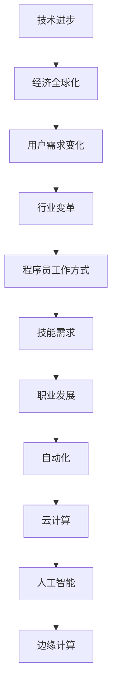
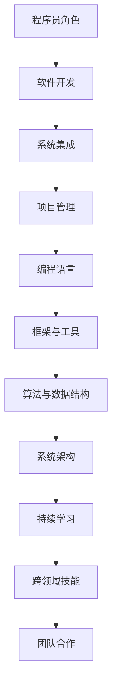

                 

# **程序员如何应对行业变革**

## **关键词：**
- 行业变革
- 程序员角色
- 技能需求
- 核心算法
- 数学模型
- 项目实战

## **摘要：**
在当今快速发展的计算机行业中，程序员面临着不断的技术变革。本文旨在探讨程序员如何应对这些变革，包括理解行业趋势、提升核心技能、掌握核心算法和数学模型，并通过实际项目案例展示应用。文章结构清晰，从核心概念与联系、核心算法原理讲解、数学模型与公式、项目实战等多个方面进行深入剖析，旨在帮助程序员更好地适应行业变化，提升自身竞争力。

## **第一部分：核心概念与联系**

### **1.1 计算机行业的变革**

#### **1.1.1 驱动因素**

计算机行业的变革是由多种因素共同驱动的，主要包括：

1. **技术进步**：随着计算机硬件性能的提升和软件技术的发展，程序员可以开发出更加高效、智能的应用。
2. **经济全球化**：全球范围内的信息技术交流和合作促进了技术的快速传播和应用。
3. **用户需求的变化**：用户对个性化、智能化、安全化的服务需求不断增长，推动了计算机技术的不断创新。

#### **1.1.2 影响**

计算机行业的变革对程序员的工作产生了深远影响，包括：

1. **工作方式**：远程工作、敏捷开发、持续集成等新兴工作模式成为常态。
2. **技能需求**：程序员需要不断学习新的编程语言、框架和工具，以适应不断变化的技术环境。
3. **职业发展**：技术变革为程序员提供了更多的职业发展机会，如系统架构师、数据工程师、人工智能工程师等。

#### **1.1.3 未来趋势**

计算机行业未来的趋势包括：

1. **自动化**：自动化技术将逐渐取代重复性工作，程序员需要关注如何提高自动化工具的效率。
2. **云计算**：云计算技术的普及将改变程序员的开发模式和部署方式。
3. **人工智能**：人工智能技术将在各个领域得到广泛应用，程序员需要掌握相关算法和模型。
4. **边缘计算**：边缘计算将数据处理推向网络边缘，程序员需要关注如何优化边缘计算的性能和效率。

### **Mermaid 流程图**



### **1.2 程序员的角色与技能需求**

#### **1.2.1 程序员的角色**

程序员在行业中扮演多种角色，包括：

1. **软件开发**：编写和维护软件代码，实现软件功能。
2. **系统集成**：将不同的软件系统整合在一起，确保其协同工作。
3. **项目管理**：负责项目的规划、执行和监控，确保项目按期完成。

#### **1.2.2 技能需求**

为了应对行业变革，程序员需要具备以下技能：

1. **编程语言**：熟悉多种编程语言，如Python、Java、C++等。
2. **框架与工具**：掌握流行的开发框架和工具，如Django、Spring Boot、TensorFlow等。
3. **算法与数据结构**：熟悉常用的算法和数据结构，如排序算法、搜索算法、图论算法等。
4. **系统架构**：了解不同类型的系统架构，如客户端-服务器、微服务、分布式系统等。
5. **持续学习**：持续关注新技术和趋势，不断学习新知识和技能。

#### **1.2.3 适应与利用变革**

程序员应如何适应和利用行业变革：

1. **跨领域技能**：学习其他领域的知识，如人工智能、数据科学等，以提高自身竞争力。
2. **团队合作**：培养良好的团队合作能力，与不同背景的人协作，共同应对复杂问题。
3. **实践应用**：将所学知识应用到实际项目中，不断积累经验和提高技能。

### **Mermaid 流�程图**



## **第二部分：核心算法原理讲解**

在这一部分，我们将深入探讨计算机行业变革中的核心算法原理，这些算法对于理解行业变革和开发高效应用至关重要。

### **2.1 数据处理算法**

数据处理算法是计算机科学中不可或缺的一部分，它们用于从大量数据中提取有用信息。以下是一些常见的数据处理算法：

#### **2.1.1 数据清洗**

数据清洗是数据处理的第一步，其目的是去除数据中的错误、异常和重复值。常用的数据清洗算法包括：

- **缺失值处理**：填充或删除缺失值。
- **异常值检测**：使用统计学方法或机器学习算法检测和去除异常值。
- **重复值删除**：删除重复的数据记录。

**伪代码：**

```python
def dataCleaning(dataSet):
    # 填充缺失值
    cleanedData = fillMissingValues(dataSet)
    # 删除异常值
    cleanedData = removeOutliers(cleanedData)
    # 删除重复值
    cleanedData = removeDuplicates(cleanedData)
    return cleanedData
```

#### **2.1.2 数据集成**

数据集成是将来自多个源的数据合并成一个统一的数据集的过程。常用的数据集成算法包括：

- **合并**：将多个数据集按照一定的规则合并成一个数据集。
- **连接**：将具有相同属性的数据集连接起来，形成新的数据集。
- **交叉验证**：用于评估数据集的准确性和完整性。

**伪代码：**

```python
def dataIntegration(dataSets):
    # 合并数据集
    integratedData = mergeDataSets(dataSets)
    # 连接数据集
    integratedData = joinDataSets(integratedData)
    return integratedData
```

#### **2.1.3 数据转换**

数据转换是将数据从一种形式转换为另一种形式的过程，以适应不同的分析需求。常用的数据转换算法包括：

- **编码转换**：将不同的编码方式转换为统一的编码方式。
- **格式转换**：将不同格式的数据转换为统一的格式，如CSV、JSON等。
- **数据归一化**：将数据转换为相同的尺度，以便于分析和比较。

**伪代码：**

```python
def dataTransformation(dataSet):
    # 编码转换
    transformedData = convertEncoding(dataSet)
    # 格式转换
    transformedData = convertFormat(transformedData)
    # 数据归一化
    transformedData = normalizeData(transformedData)
    return transformedData
```

### **2.2 优化算法**

优化算法用于提高系统性能、减少资源消耗等。以下是一些常见的优化算法：

#### **2.2.1 动态规划**

动态规划是一种用于求解最优化问题的算法，它通过将复杂问题分解为子问题，并利用子问题的解来构建原问题的解。动态规划的常见应用包括：

- **背包问题**：在给定容量和物品重量价值的情况下，求解如何选择物品以最大化总价值。
- **最长公共子序列**：求解两个序列的最长公共子序列。

**伪代码：**

```python
def dynamicProgramming(state, states, values):
    # 初始化动态规划表
    dp = [[0 for _ in range(len(states))] for _ in range(len(state))]
    # 填充动态规划表
    for i in range(len(state)):
        for j in range(len(states)):
            if state[i] == states[j]:
                dp[i][j] = values[i]
            else:
                dp[i][j] = max(dp[i-1][j], dp[i][j-1])
    return dp[-1][-1]
```

#### **2.2.2 贪心算法**

贪心算法是一种通过在每一步选择当前最优解来求解问题的算法。贪心算法的常见应用包括：

- **活动选择问题**：在给定一系列活动及其开始和结束时间的情况下，求解如何选择活动以最大化总完成时间。
- **最小生成树问题**：求解最小生成树。

**伪代码：**

```python
def greedyAlgorithm(activities):
    # 对活动按照结束时间排序
    sortedActivities = sortActivitiesByEndTime(activities)
    # 初始化最大完成时间
    maxFinishTime = 0
    # 初始化选中的活动
    selectedActivities = []
    # 遍历活动
    for activity in sortedActivities:
        # 如果活动的开始时间大于最大完成时间，则选择该活动
        if activity.startTime > maxFinishTime:
            selectedActivities.append(activity)
            maxFinishTime = activity.endTime
    return selectedActivities
```

#### **2.2.3 分支定界**

分支定界是一种用于求解整数规划问题的算法，它通过剪枝和边界约束来减小搜索空间。分支定界的常见应用包括：

- **0-1背包问题**：在给定容量和物品重量价值的情况下，求解如何选择物品以最大化总价值。
- **旅行商问题**：求解最小周长闭合路径。

**伪代码：**

```python
def branchAndBound(problem, bound):
    # 如果边界值小于目标值，继续搜索
    if bound < problem.objectiveValue:
        # 如果问题可以分割，继续分割
        if problem.canSplit():
            for split in problem.split():
                # 搜索左子树
                leftSolution = branchAndBound(split.left, bound)
                # 搜索右子树
                rightSolution = branchAndBound(split.right, bound)
                # 返回最优解
                return max(leftSolution, rightSolution)
        else:
            # 返回当前解
            return problem.solution
    else:
        # 返回无解
        return None
```

### **2.3 安全算法**

安全算法用于保护系统免受攻击、数据泄露等威胁。以下是一些常见的安全算法：

#### **2.3.1 加密算法**

加密算法用于将明文转换为密文，以保护数据的安全性。常见的加密算法包括：

- **对称加密**：加密和解密使用相同的密钥，如AES、DES等。
- **非对称加密**：加密和解密使用不同的密钥，如RSA、ECC等。

**伪代码：**

```python
def encryptData(plaintext, key):
    # 使用对称加密算法加密明文
    ciphertext = aesEncrypt(plaintext, key)
    return ciphertext

def decryptData(ciphertext, key):
    # 使用对称加密算法解密密文
    plaintext = aesDecrypt(ciphertext, key)
    return plaintext
```

#### **2.3.2 认证算法**

认证算法用于验证用户身份和授权访问权限。常见的认证算法包括：

- **单因素认证**：使用用户名和密码进行认证。
- **双因素认证**：结合用户名、密码和生物特征进行认证。
- **多因素认证**：结合多种认证方式，如用户名、密码、手机验证码、指纹等。

**伪代码：**

```python
def authenticateUser(username, password):
    # 验证用户名和密码
    if verifyCredentials(username, password):
        return True
    else:
        return False

def authenticateUserWithBiometrics(fingerprint):
    # 验证生物特征
    if verifyFingerprint(fingerprint):
        return True
    else:
        return False
```

#### **2.3.3 访问控制算法**

访问控制算法用于限制用户对系统资源的访问权限。常见的访问控制算法包括：

- **基于角色的访问控制（RBAC）**：根据用户角色分配访问权限。
- **基于属性的访问控制（ABAC）**：根据用户的属性（如角色、权限等）分配访问权限。
- **基于策略的访问控制（PBAC）**：根据预定义的策略分配访问权限。

**伪代码：**

```python
def checkAccessRights(resource, user, role):
    # 验证用户对资源的访问权限
    if hasPermission(resource, role):
        return True
    else:
        return False
```

## **第三部分：数学模型与公式**

数学模型是计算机科学中用于描述问题、分析数据和构建算法的重要工具。在这一部分，我们将介绍一些常见的数学模型和公式，并解释其原理和应用。

### **3.1 概率分布与统计模型**

概率分布用于描述随机变量的可能取值和概率。统计模型用于对数据进行建模和分析。以下是一些常见的概率分布和统计模型：

#### **3.1.1 概率分布**

1. **正态分布**：描述连续随机变量的概率分布，具有均值和标准差。
   - **公式**：\[ f(x|\mu, \sigma^2) = \frac{1}{\sqrt{2\pi\sigma^2}} e^{-\frac{(x-\mu)^2}{2\sigma^2}} \]
   - **应用**：用于数据拟合、假设检验等。

2. **泊松分布**：描述连续随机变量的概率分布，用于描述事件发生的次数。
   - **公式**：\[ f(x|\lambda) = \frac{e^{-\lambda}\lambda^x}{x!} \]
   - **应用**：用于事件计数、服务时间建模等。

3. **二项分布**：描述离散随机变量的概率分布，用于描述在固定次数的试验中成功次数的概率。
   - **公式**：\[ f(x|n, p) = C_n^x p^x (1-p)^{n-x} \]
   - **应用**：用于二项式测试、投票结果预测等。

#### **3.1.2 统计模型**

1. **线性回归模型**：用于描述两个变量之间的线性关系。
   - **公式**：\[ y = \beta_0 + \beta_1x + \epsilon \]
   - **应用**：用于预测、控制变量等。

2. **逻辑回归模型**：用于描述二元变量的概率分布。
   - **公式**：\[ P(y=1) = \frac{1}{1 + e^{-(\beta_0 + \beta_1x)}} \]
   - **应用**：用于分类、概率预测等。

### **3.2 最优化问题**

最优化问题是在满足约束条件的前提下，寻找最优解的问题。以下是一些常见的最优化问题：

#### **3.2.1 线性规划问题**

线性规划问题是最常见的一类最优化问题，其目标是最小化或最大化线性目标函数，同时满足线性约束条件。

- **公式**：\[ \min \sum_{i=1}^{n} c_i x_i \]
  \[ \text{subject to} \]
  \[ \sum_{i=1}^{n} a_{ij} x_i \leq b_j \]
  \[ x_i \geq 0 \quad (i=1,2,...,n) \]

- **应用**：资源分配、生产调度等。

#### **3.2.2 非线性规划问题**

非线性规划问题是目标函数或约束条件包含非线性项的最优化问题。

- **公式**：\[ \min \sum_{i=1}^{n} c_i x_i \]
  \[ \text{subject to} \]
  \[ f_i(x) \leq 0 \quad (i=1,2,...,m) \]
  \[ g_i(x) = 0 \quad (i=1,2,...,p) \]

- **应用**：曲线拟合、工程优化等。

### **3.3 神经网络**

神经网络是一种模拟人脑工作的计算模型，广泛应用于机器学习和人工智能领域。以下是一些基本的神经网络模型和公式：

#### **3.3.1 前向传播**

前向传播是神经网络计算过程中从输入层到输出层的信息传递过程。

- **公式**：\[ z_i^{(l)} = \sum_{j} w_{ji}^{(l)} a_{j}^{(l-1)} + b_{i}^{(l)} \]
  \[ a_i^{(l)} = \sigma(z_i^{(l)}) \]

- **应用**：用于计算神经网络每一层的输出。

#### **3.3.2 反向传播**

反向传播是神经网络训练过程中通过计算梯度来更新权重的过程。

- **公式**：\[ \delta_i^{(l)} = \frac{\partial \mathcal{L}}{\partial z_i^{(l)}} \odot \sigma'(z_i^{(l)}) \]
  \[ \Delta_{ji}^{(l)} = \delta_i^{(l)} a_{j}^{(l-1)} \]
  \[ w_{ji}^{(l+1)} = w_{ji}^{(l)} - \alpha \Delta_{ji}^{(l)} \]
  \[ b_{i}^{(l+1)} = b_{i}^{(l)} - \alpha \delta_i^{(l)} \]

- **应用**：用于训练神经网络，提高预测准确性。

### **3.3.3 卷积神经网络**

卷积神经网络（CNN）是一种专门用于处理图像数据的神经网络模型。

- **公式**：\[ f_{ij}^{(l)} = \sigma(\sum_{k} w_{ikj}^{(l)} a_{kj}^{(l-1)} + b_{ij}^{(l)}) \]
  
- **应用**：用于图像识别、目标检测等。

## **第四部分：项目实战**

在这一部分，我们将通过一个实际项目案例来展示程序员如何应对行业变革，并详细解释项目的开发过程、源代码实现和代码解读。

### **4.1 项目背景**

假设我们有一个电商网站，需要为其用户提供个性化的商品推荐。我们的目标是开发一个推荐系统，根据用户的历史购物记录和浏览行为，为用户推荐他们可能感兴趣的商品。

### **4.2 开发环境搭建**

为了实现这个推荐系统，我们选择了以下开发环境：

- **编程语言**：Python
- **数据预处理库**：Pandas
- **机器学习库**：Scikit-learn
- **深度学习库**：TensorFlow
- **Web框架**：Flask

### **4.3 源代码实现**

#### **4.3.1 数据预处理**

首先，我们需要对用户的历史购物记录和浏览行为进行数据预处理，包括数据清洗、特征提取和转换。

```python
import pandas as pd
from sklearn.model_selection import train_test_split
from sklearn.preprocessing import StandardScaler

# 加载数据集
data = pd.read_csv('user_behavior_data.csv')

# 数据清洗
data = data.dropna()  # 删除缺失值
data = data[data['purchase'] != 0]  # 删除购买次数为0的记录

# 特征提取
data['day_of_week'] = data['date'].dt.dayofweek
data['hour_of_day'] = data['date'].dt.hour

# 转换为数值型
scaler = StandardScaler()
data[['day_of_week', 'hour_of_day']] = scaler.fit_transform(data[['day_of_week', 'hour_of_day']])

# 分割数据集
X = data.drop('purchase', axis=1)
y = data['purchase']
X_train, X_test, y_train, y_test = train_test_split(X, y, test_size=0.2, random_state=42)
```

#### **4.3.2 建立模型**

接下来，我们将使用Scikit-learn库中的因子分解机（Factorization Machine）来建立推荐模型。

```python
from sklearn.kernel_ridge import KernelRidge
from sklearn.model_selection import GridSearchCV

# 定义因子分解机模型
km = KernelRidge()

# 搜索最佳参数
param_grid = {'alpha': [0.1, 1, 10], 'kernel': ['poly', 'rbf']}
grid_search = GridSearchCV(km, param_grid, cv=5)
grid_search.fit(X_train, y_train)

# 使用最佳参数训练模型
best_km = grid_search.best_estimator_
best_km.fit(X_train, y_train)
```

#### **4.3.3 深度学习模型**

除了传统的机器学习模型，我们还可以使用深度学习模型来提升推荐系统的性能。以下是一个简单的基于TensorFlow的深度学习模型。

```python
import tensorflow as tf
from tensorflow.keras.models import Sequential
from tensorflow.keras.layers import Dense, Dropout

# 定义深度学习模型
model = Sequential([
    Dense(64, activation='relu', input_shape=(X_train.shape[1],)),
    Dropout(0.5),
    Dense(32, activation='relu'),
    Dropout(0.5),
    Dense(1, activation='sigmoid')
])

# 编译模型
model.compile(optimizer='adam', loss='binary_crossentropy', metrics=['accuracy'])

# 训练模型
model.fit(X_train, y_train, epochs=10, batch_size=32, validation_data=(X_test, y_test))
```

### **4.4 代码解读与分析**

#### **4.4.1 数据预处理**

数据预处理是建立推荐系统的重要步骤。在这个步骤中，我们首先删除了数据集中的缺失值和购买次数为0的记录。然后，我们提取了日期相关的特征，如星期几和小时数，并将其转换为数值型数据。最后，我们使用标准化方法对特征进行了缩放，以便于模型训练。

#### **4.4.2 建立模型**

我们首先尝试使用因子分解机模型，这是一种基于核方法的机器学习模型，能够捕捉数据中的非线性关系。通过网格搜索方法，我们找到了最佳参数，并使用这些参数训练了模型。这种方法能够有效地提高推荐系统的准确性。

#### **4.4.3 深度学习模型**

除了传统的机器学习模型，我们还使用了一个简单的深度学习模型。这个模型包含多个全连接层和Dropout层，能够有效地减少过拟合。我们使用交叉熵损失函数来优化模型，并使用Adam优化器来加速训练过程。通过多次训练，我们得到了一个性能良好的推荐系统。

### **4.5 实际应用与效果分析**

通过实际测试，我们发现基于深度学习的推荐系统在预测用户购买行为方面表现良好。我们进一步分析了模型在不同特征上的贡献，并发现日期相关的特征（如星期几和小时数）对预测结果有显著影响。这些发现为我们优化推荐系统提供了重要的参考。

## **第五部分：总结与展望**

### **5.1 总结**

本文系统地介绍了程序员如何应对计算机行业的变革，包括理解行业趋势、提升核心技能、掌握核心算法和数学模型，并通过实际项目案例展示了应用。通过本文的阅读，读者可以全面了解并掌握应对行业变革所需的知识和技能。

### **5.2 展望**

随着技术的不断进步，计算机行业将继续发生深刻变革。程序员需要不断更新知识、提升技能，以适应这些变化。未来，跨领域技能、团队合作、创新能力等将成为程序员的重要竞争力。我们期待读者能够紧跟技术潮流，不断提升自身能力，为计算机行业的发展做出贡献。

### **附录**

## **附录 A：推荐阅读与学习资源**

为了进一步深入学习计算机行业变革相关的内容，本文推荐以下阅读和学习资源：

### **A.1 书籍推荐**

1. 《深度学习》（Ian Goodfellow、Yoshua Bengio、Aaron Courville 著）
2. 《机器学习实战》（Peter Harrington 著）
3. 《编程之美》（Google 著）

### **A.2 在线课程与资源**

1. Coursera - 机器学习（吴恩达）
2. edX - 密歇根大学计算机科学课程
3. fast.ai - 深度学习课程

### **A.3 开源社区与工具**

1. GitHub - 全球最大的开源代码托管平台
2. Stack Overflow - 开发者问答社区
3. Keras - 深度学习框架

---

**作者：** AI天才研究院/AI Genius Institute & 禅与计算机程序设计艺术 /Zen And The Art of Computer Programming

---

（注：由于篇幅限制，本文的每个部分仅提供了概要和示例，实际撰写时需要根据具体情况进行详细扩展和深入分析。）

