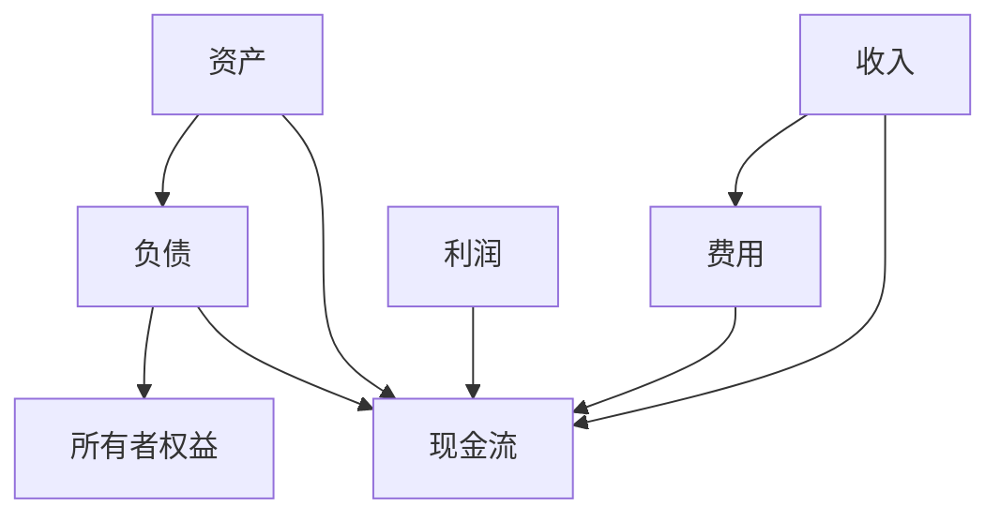

                 

### **第1章：财务知识入门**

> **核心概念与联系**

在讨论如何建立财务缓冲之前，我们首先需要了解一些基本的财务知识。财务缓冲建立在理解资产、负债、收入、支出、现金流量分析等核心概念之上。以下是这些核心概念及其相互关系的 Mermaid 流程图：



**资产**代表个人或企业的经济资源，如现金、投资、房地产等。**负债**则是个人或企业对他人的债务，如贷款、信用卡欠款等。**所有者权益**是资产减去负债后的余额，反映了企业的净资产状况。**收入**和**费用**是衡量财务状况的关键指标，**利润**是收入减去费用的结果，而**现金流量**则是衡量企业现金流入和流出的情况。

> **核心算法原理讲解**

在财务规划中，关键算法原理包括预算编制和资产负债管理。以下是对预算编制算法的伪代码讲解：

```pseudo
Function 预算编制(收入预测, 支出预测, 风险因素):
    StartDate = 当前日期
    EndDate = 预测期限
    预算收入 = 收入预测 * (1 + 风险因素)
    预算支出 = 支出预测 * (1 + 风险因素)
    预算利润 = 预算收入 - 预算支出
    如果 预算利润 < 0:
        提醒：需要调整支出或增加收入
    Else:
        存储预算方案
    返回 预算方案
```

该算法首先根据收入预测和支出预测，考虑到风险因素，制定出合理的预算收入和支出。如果预算利润为负，则需要调整支出或增加收入以确保预算平衡。

> **数学模型和公式 & 详细讲解 & 举例说明**

财务分析中常用到一个重要的数学模型——净利润率（Net Profit Margin），其公式为：

$$
\text{净利润率} = \frac{\text{净利润}}{\text{总收入}} \times 100\%
$$

净利润率反映了企业的盈利能力，一个高的净利润率意味着企业具有良好的盈利能力和成本控制能力。

举例来说，假设一家企业的总收入为100万元，净利润为20万元，则其净利润率为：

$$
\text{净利润率} = \frac{20\text{万元}}{100\text{万元}} \times 100\% = 20\%
$$

这意味着企业每赚得的100元中有20元是净利润。如果净利润率较低，则可能需要考虑提高收入或降低成本。

通过理解这些核心概念、算法原理和数学模型，我们可以更好地制定财务缓冲策略，确保个人和企业的财务稳定性。

### **1.1 财务缓冲的重要性**

#### **1.1.1 财务缓冲的概述**

财务缓冲，通常指的是个人或企业在财务规划中设置的一定比例的资金储备，用以应对突发事件或财务需求。这些资金储备通常用于支付意外支出，如医疗费用、失业补偿、房屋修缮等，或为投资提供资金支持。

财务缓冲不仅仅是简单的储蓄，它是一种全面的风险管理策略。通过预先准备一定金额的资金，个人和企业在面临财务危机时，可以避免陷入债务或资产流失的风险。从长远来看，良好的财务缓冲有助于提高财务稳定性，确保财务自由和投资机会。

#### **1.1.2 财务缓冲的重要性**

1. **降低财务风险**：财务缓冲可以应对突发事件带来的财务冲击，如失业、医疗费用等。这些突发事件可能会导致收入中断或大幅增加支出，没有财务缓冲的企业和个人可能因此陷入财务困境。

2. **保障生活质量**：财务缓冲有助于保障个人和家庭的基本生活质量。在面临失业或其他经济压力时，财务缓冲可以提供必要的资金支持，确保日常生活不受影响。

3. **提高投资能力**：财务缓冲不仅可以应对突发支出，还可以为投资提供资金支持。在市场机会出现时，有足够资金储备的企业和个人可以迅速抓住投资机会，从而实现财富增值。

4. **增强抗风险能力**：企业通过建立财务缓冲，可以提高其抗风险能力。在市场波动或经济衰退期间，有充足资金储备的企业可以维持运营，避免因资金短缺而被迫停产或破产。

5. **优化资金管理**：财务缓冲有助于企业优化资金管理，提高资金利用效率。通过合理安排资金储备，企业可以在需要时迅速调动资金，降低资金闲置率。

6. **提高财务规划的科学性**：财务缓冲是财务规划的重要组成部分。通过建立财务缓冲，个人和企业可以更科学地制定财务规划，确保财务目标的实现。

总之，财务缓冲在个人和企业财务管理中具有重要作用。它不仅是一种风险管理的策略，也是一种提高生活质量、投资能力和抗风险能力的有效手段。因此，了解和建立财务缓冲对于每一个程序员和创业者来说都至关重要。

### **1.2 财务基本概念**

#### **1.2.1 资产、负债和所有者权益**

财务报表中的三大基本要素分别是资产、负债和所有者权益。这些要素构成了企业财务状况的核心，是评估企业财务健康状况的重要指标。

**资产**是指个人或企业拥有的经济资源和财产，它包括现金、投资、设备、房地产、应收账款等。资产反映了企业的经济实力和运营能力，是企业盈利的基础。

**负债**是指个人或企业对他人的债务和义务，包括短期负债和长期负债。短期负债如应付账款、短期借款，长期负债如长期借款、应付债券等。负债反映了企业的财务压力和债务状况。

**所有者权益**是资产减去负债后的余额，也称为净资产。它反映了企业的自有资本和投资者的权益。所有者权益分为实收资本、资本公积、盈余公积和未分配利润等。

这些要素之间的关系可以用以下等式表示：

$$
\text{资产} = \text{负债} + \text{所有者权益}
$$

这一等式被称为财务方程式，它是财务分析的基础。通过分析资产、负债和所有者权益之间的关系，可以评估企业的财务健康状况和财务稳定性。

#### **1.2.2 收入、费用和利润**

在财务报表中，收入、费用和利润是评估企业经营状况的重要指标。这些指标反映了企业的盈利能力和经营效益。

**收入**是指企业在正常经营活动中所获得的收入，包括销售收入、服务收入、投资收益等。收入是企业的资金来源，决定了企业的盈利能力。

**费用**是指企业在经营活动中发生的各种支出，包括成本、费用和管理费用等。费用是企业经营成本，决定了企业的盈利空间。

**利润**是收入减去费用后的余额，反映了企业的经营效益。利润可以分为净利润和毛利润。净利润是扣除所有费用后的利润，毛利润是扣除成本后的利润。

以下是收入、费用和利润之间的关系：

$$
\text{利润} = \text{收入} - \text{费用}
$$

通过分析收入、费用和利润之间的关系，可以评估企业的经营效益和盈利能力。一个企业的利润率越高，说明其盈利能力越强。

#### **1.2.3 现金流量分析**

现金流量分析是企业财务管理的重要环节，它通过分析企业的现金流入和流出情况，评估企业的现金流状况。

**现金流量**可以分为三类：经营活动现金流量、投资活动现金流量和筹资活动现金流量。

- **经营活动现金流量**是指企业在日常经营活动中产生的现金流入和流出，包括销售商品、提供劳务收到的现金、支付给供应商的现金等。
- **投资活动现金流量**是指企业在投资活动中产生的现金流入和流出，包括购买固定资产、收回投资等。
- **筹资活动现金流量**是指企业在筹资活动中产生的现金流入和流出，包括借款、还款、发行股票等。

现金流量分析有助于企业了解其现金流的来源和用途，发现潜在的财务风险，优化财务结构。

以下是现金流量分析的示例：

$$
\text{经营活动现金流量} = \text{销售收入} + \text{投资收益} - \text{购买原材料} - \text{员工工资}
$$

$$
\text{投资活动现金流量} = \text{购买固定资产} - \text{收回投资}
$$

$$
\text{筹资活动现金流量} = \text{借款} - \text{还款}
$$

通过分析这些指标，企业可以了解其现金流的健康状况，制定合理的财务策略。

### **1.3 财务报表分析**

#### **1.3.1 财务报表的构成**

财务报表是企业财务状况的集中体现，主要包括资产负债表、利润表和现金流量表。

**资产负债表**反映了企业在某一特定时间点的财务状况，包括资产、负债和所有者权益。资产负债表是评估企业资产质量和负债状况的重要工具。

**利润表**反映了企业在一定期间内的经营成果，包括收入、费用和利润。利润表是评估企业经营效益和盈利能力的重要工具。

**现金流量表**反映了企业在一定期间内的现金流入和流出情况，包括经营活动、投资活动和筹资活动的现金流量。现金流量表是评估企业现金流状况和财务稳定性的重要工具。

#### **1.3.2 财务报表分析的方法**

财务报表分析是通过分析财务报表中的数据，评估企业的财务状况和经营成果。以下是一些常用的财务报表分析方法：

1. **比率分析**：通过计算各种财务比率，评估企业的资产质量、盈利能力、偿债能力和流动性等。常见的财务比率包括资产负债率、净利润率、流动比率等。

2. **趋势分析**：通过分析财务报表中各项指标的趋势，评估企业的财务状况和经营成果的变化。例如，通过比较连续几个会计期间的资产负债表和利润表，可以发现企业的财务变化趋势。

3. **结构分析**：通过分析财务报表中各项数据的结构，评估企业的财务结构。例如，通过分析资产负债表中各项资产和负债的比例，可以了解企业的资产分布和负债结构。

4. **比较分析**：通过将企业的财务数据与同行业其他企业进行比较，评估企业的竞争力和市场地位。例如，通过比较企业的净利润率和同行业平均净利润率，可以了解企业的盈利能力。

#### **1.3.3 财务报表分析的意义**

财务报表分析对于企业财务管理具有重要意义：

1. **评估财务状况**：通过财务报表分析，可以评估企业的财务状况，了解企业的资产质量、负债状况、盈利能力等。

2. **发现潜在问题**：通过财务报表分析，可以发现企业潜在的财务问题和风险，如高负债率、低盈利能力等，从而及时采取措施。

3. **制定财务策略**：通过财务报表分析，可以制定合理的财务策略，如优化资产配置、提高盈利能力、降低负债等。

4. **提升管理水平**：通过财务报表分析，可以提升企业的财务管理水平，提高财务决策的科学性和有效性。

总之，财务报表分析是企业财务管理的重要工具，通过有效的财务报表分析，企业可以更好地了解自身的财务状况和经营成果，制定科学的财务策略，提升管理水平。

### **1.4 财务风险识别与管理**

#### **1.4.1 财务风险的概念与分类**

财务风险是指企业在财务管理过程中可能面临的各种风险，包括市场风险、信用风险、流动性风险、汇率风险等。财务风险可能会导致企业的财务状况恶化，影响其经营稳定性和可持续发展。

1. **市场风险**：市场风险是指由于市场波动导致企业资产价值下降或收益减少的风险。例如，股市波动、利率变化、原材料价格波动等都会对企业的市场风险产生影响。

2. **信用风险**：信用风险是指由于债务人违约或信用等级下降导致企业无法按时收回应收账款的风险。信用风险主要存在于应收账款和债务投资中。

3. **流动性风险**：流动性风险是指企业在短期内无法满足债务支付需求的风险。流动性风险可能导致企业资金链断裂，影响其正常运营。

4. **汇率风险**：汇率风险是指由于汇率波动导致企业外汇资产价值下降或收益减少的风险。对于从事国际贸易的企业，汇率风险尤为重要。

#### **1.4.2 财务风险识别的方法**

识别财务风险是进行有效风险管理的前提。以下是一些常用的财务风险识别方法：

1. **财务报表分析**：通过分析财务报表，可以发现企业的潜在财务风险。例如，通过分析资产负债表，可以识别企业的负债状况和资产流动性；通过分析利润表，可以识别企业的盈利能力和成本控制情况。

2. **风险评估模型**：利用风险评估模型，如贝叶斯网络、蒙特卡罗模拟等，可以对财务风险进行量化评估。这些模型可以提供更加精确的风险识别结果。

3. **行业分析**：通过分析行业趋势、竞争对手状况、政策法规等，可以识别企业可能面临的外部财务风险。

4. **内部审计**：内部审计可以评估企业的财务管理和内部控制制度，识别潜在的财务风险。

#### **1.4.3 财务风险管理策略**

一旦识别出财务风险，企业需要采取有效的管理策略来降低风险。以下是一些常用的财务风险管理策略：

1. **风险规避**：通过调整业务模式、优化资产配置等手段，避免高风险的业务领域或投资。

2. **风险降低**：通过多元化投资、降低负债规模、提高资产流动性等手段，降低财务风险。

3. **风险转移**：通过购买保险、进行债务重组等手段，将风险转移给第三方。

4. **风险接受**：对于一些无法规避或转移的风险，企业可以选择接受风险，并制定相应的应急预案。

5. **风险补偿**：通过提高盈利能力、增加储备资金等手段，为企业承担风险提供财务保障。

#### **1.4.4 财务风险管理的重要性**

财务风险管理对于企业的可持续发展具有重要意义：

1. **提高财务稳定性**：通过有效管理财务风险，企业可以降低财务危机的发生概率，确保财务稳定性。

2. **保障投资机会**：财务缓冲和风险管理策略可以帮助企业在面临市场波动时，抓住投资机会，实现资产增值。

3. **提升管理水平**：财务风险管理是企业管理的重要组成部分，通过风险管理，可以提高企业的整体管理水平。

4. **增强企业竞争力**：有效管理财务风险，可以提升企业的竞争力和市场地位，为企业的长期发展创造有利条件。

总之，财务风险管理是确保企业财务健康和可持续发展的关键。通过科学的风险识别和管理策略，企业可以降低财务风险，提高财务稳定性，实现长期发展目标。

### **1.5 财务规划的重要性**

#### **1.5.1 财务规划的概念**

财务规划是指根据个人或企业的财务状况、目标和需求，制定合理的财务策略和计划，以实现财务目标的过程。财务规划涵盖了收入管理、支出控制、储蓄和投资规划等多个方面，是个人和企业管理财务的关键手段。

#### **1.5.2 财务规划的目标**

财务规划的主要目标包括：

1. **确保财务安全**：通过建立紧急基金、制定风险管理策略等，确保个人和企业的财务安全。

2. **实现财富增值**：通过合理的储蓄和投资规划，实现资产的保值增值。

3. **满足生活需求**：通过规划收入和支出，满足个人和家庭的基本生活需求，提高生活质量。

4. **实现长期目标**：如购房、子女教育、退休规划等，通过长期的财务积累和规划，实现这些重要目标。

#### **1.5.3 财务规划的重要性**

财务规划对于个人和企业的意义如下：

1. **提高财务稳定性**：通过财务规划，可以合理安排收入和支出，降低财务风险，确保财务稳定性。

2. **优化资源配置**：通过合理的储蓄和投资规划，可以优化个人或企业的资源配置，提高资金利用效率。

3. **实现财务目标**：财务规划可以帮助个人和企业明确财务目标，制定实现目标的计划和策略。

4. **提升管理水平**：财务规划是企业管理的重要组成部分，通过财务规划，可以提高企业的财务管理水平，增强企业的竞争力。

5. **增强财务意识**：财务规划可以增强个人和企业的财务意识，培养良好的财务习惯，提高理财能力。

总之，财务规划是确保个人和企业财务健康和可持续发展的重要手段。通过科学的财务规划，个人和企业可以更好地应对财务挑战，实现长期财务目标。

### **1.6 财务规划的基本步骤**

#### **1.6.1 设定财务目标**

设定财务目标是财务规划的第一步，明确个人或企业的财务目标有助于制定具体的财务策略和计划。财务目标可以分为短期目标（如购买新车、支付旅游费用）和长期目标（如购房、子女教育、退休规划）。设定财务目标需要考虑个人的实际情况和财务需求。

例如，一个程序员可能设定以下财务目标：

- 短期目标：6个月内存够去国外旅游的费用。
- 长期目标：5年内购买一套价值500万元的城市住宅。

#### **1.6.2 分析当前财务状况**

在设定财务目标后，需要分析个人或企业的当前财务状况，包括收入、支出、资产和负债。这有助于了解当前财务状况，发现潜在的财务问题和风险。

例如，可以分析以下内容：

- 当前收入来源：工资、投资收益等。
- 当前支出项目：房租、生活费、教育费用等。
- 当前资产：现金、投资、房产等。
- 当前负债：贷款、信用卡欠款等。

#### **1.6.3 制定储蓄计划**

储蓄计划是实现财务目标的重要手段，通过合理的储蓄计划，可以积累足够的资金以应对未来可能的需求。制定储蓄计划需要考虑收入水平、支出情况和储蓄目标。

例如，一个程序员可以制定以下储蓄计划：

- 每月工资收入：3万元。
- 每月必要支出：1.5万元。
- 每月可储蓄金额：1.5万元。
- 年度储蓄目标：18万元。

#### **1.6.4 制定投资计划**

投资是实现财富增值的重要手段，通过合理的投资计划，可以增加资产价值，实现长期财务目标。制定投资计划需要考虑投资目标、风险承受能力和投资期限。

例如，一个程序员可以制定以下投资计划：

- 投资目标：5年内实现100万元的资产增值。
- 风险承受能力：中等风险。
- 投资期限：5年。
- 投资策略：股票投资、基金投资、房地产投资等。

#### **1.6.5 定期评估与调整**

财务规划不是一次性的过程，而是一个持续的过程。定期评估和调整财务计划，可以确保财务规划的有效性和适应性。评估内容可以包括收入、支出、储蓄和投资目标等。

例如，每半年或每年进行一次财务评估，检查是否达到了预定目标，并根据实际情况进行调整。

通过以上基本步骤，个人和企业可以制定出科学合理的财务规划，实现财务目标。

### **1.7 财务规划工具与资源**

#### **1.7.1 个人财务管理软件**

个人财务管理软件是帮助个人管理财务的工具，包括收入管理、支出管理、储蓄计划和投资规划等功能。以下是一些常用的个人财务管理软件：

- **Mint**：一款功能强大的个人财务管理软件，可以自动同步银行账户、信用卡和投资账户，提供全面的财务分析。
- **YNAB（You Need A Budget）**：一款基于预算管理的财务管理软件，帮助用户制定和跟踪预算，优化支出。
- **Personal Capital**：一款提供免费财务分析的投资管理工具，包括投资组合分析、退休规划等。

#### **1.7.2 投资研究平台**

投资研究平台是投资者获取市场信息和投资分析的重要工具。以下是一些常用的投资研究平台：

- **晨星网（Morningstar）**：提供股票、基金和债券的分析报告，帮助投资者进行投资决策。
- **雪球**：一个集财经新闻、个股讨论、投资社区为一体的平台，提供丰富的投资信息和交流机会。
- **东方财富网**：提供股票、基金、债券等金融产品的信息和分析，包括实时行情、个股公告、研究报告等。

#### **1.7.3 财务教育资源**

财务教育资源是提高个人财务管理能力和理财素养的重要途径。以下是一些优质的财务教育资源：

- **Coursera**：提供多个与财务管理相关的在线课程，包括财务基础、投资分析等。
- **Khan Academy**：提供免费的财务和经济学课程，涵盖财务基础、预算管理、投资规划等内容。
- **书籍**：如《聪明的投资者》（The Intelligent Investor）、《财务自由之路》（Your Money or Your Life）等，提供深入的理财知识和策略。

通过利用这些工具和资源，个人和企业可以更好地进行财务规划和管理，实现财务目标。

### **第2章：收入与支出管理**

#### **2.1 收入管理**

收入管理是财务管理的重要组成部分，有效的收入管理有助于实现财务目标，提高生活质量和投资能力。以下将详细介绍不同类型的收入、收入管理的最佳实践，并提供具体的案例分析。

##### **2.1.1 不同类型的收入**

在个人和企业财务管理中，常见的收入类型包括：

1. **工资收入**：这是最常见的收入类型，主要来源于个人的职业工作，如程序员、工程师、医生等。
2. **投资收益**：通过股票、债券、基金、房地产等投资所获得的回报。投资收益具有较高的波动性和不确定性。
3. **业务收入**：企业通过经营业务所获得的收入，包括销售收入、服务收入、租赁收入等。
4. **补贴和津贴**：政府或企业提供的补贴、津贴等福利性收入。
5. **其他收入**：包括稿费、兼职收入、遗产等。

了解不同类型的收入有助于制定针对性的收入管理策略。

##### **2.1.2 收入管理的最佳实践**

以下是一些收入管理的最佳实践：

1. **制定明确的收入目标**：根据个人或企业的财务目标，设定明确的收入目标。例如，一个程序员可能设定每年增加工资收入的10%。

2. **优化收入结构**：多元化收入来源，降低对单一收入类型的依赖。例如，可以通过投资股票、基金、房地产等，增加投资收益。

3. **合理分配收入**：将收入按照一定的比例分配到储蓄、投资、支出和消费等不同领域。例如，可以将收入的50%用于生活支出，20%用于储蓄，20%用于投资，10%用于消费。

4. **提高收入质量**：提高收入的质量，即增加稳定的、可持续的收入来源。例如，可以通过提高职业技能、升职加薪或开展副业等途径。

5. **监控收入变化**：定期监控收入的变化情况，分析收入波动的原因，及时调整收入管理策略。

##### **2.1.3 案例分析**

以一个程序员小李为例，他的收入管理实践如下：

- **收入目标**：每年增加工资收入的10%。
- **收入结构**：工资收入占70%，投资收益占20%，兼职收入占10%。
- **收入分配**：将收入的50%用于生活支出，20%用于储蓄，15%用于投资，15%用于消费。
- **收入管理措施**：
  - 定期参加培训，提高专业技能，争取升职加薪。
  - 投资股票和基金，增加投资收益。
  - 利用业余时间开展兼职，增加其他收入。

通过上述收入管理实践，小李实现了收入目标的达成，提高了生活质量，为未来的财务规划奠定了基础。

#### **2.2 支出管理**

支出管理是财务管理中至关重要的一环，有效的支出管理有助于降低财务压力，提高储蓄和投资能力。以下将详细介绍不同类型的支出、支出管理的最佳实践，并提供具体的案例分析。

##### **2.2.1 不同类型的支出**

在个人和企业财务管理中，常见的支出类型包括：

1. **生活支出**：包括日常开销、住房费用、交通费用、饮食费用、家庭维修费用等。
2. **投资支出**：包括购买股票、债券、基金、房地产等投资的费用。
3. **运营成本**：企业日常运营所发生的费用，如员工薪酬、设备维护、市场营销费用等。
4. **税费支出**：包括个人所得税、企业所得税、房产税、车辆购置税等。
5. **其他支出**：包括教育费用、医疗费用、礼物费用等。

了解不同类型的支出有助于制定针对性的支出管理策略。

##### **2.2.2 支出管理的最佳实践**

以下是一些支出管理的最佳实践：

1. **制定合理的预算**：根据收入情况，制定合理的支出预算。预算应包括所有必要的支出项目，并留有一定的弹性。
2. **分类管理支出**：将支出按照类型进行分类，明确每类支出的预算和优先级。例如，生活支出应优先考虑，投资支出和运营成本应根据实际情况合理安排。
3. **定期监控支出**：定期检查支出情况，分析支出波动的原因，及时调整预算和支出计划。
4. **提高支出效率**：通过优化采购流程、提高资源利用效率等手段，降低运营成本。
5. **避免不必要的支出**：理性消费，避免冲动购物和过度消费，减少不必要的支出。
6. **利用财务工具**：使用信用卡、记账软件等工具，方便支出管理和预算控制。

##### **2.2.3 案例分析**

以一个程序员小张为例，他的支出管理实践如下：

- **预算**：每月收入2万元，生活支出预算1.2万元，投资支出预算0.3万元，运营成本预算0.2万元，税费支出预算0.3万元。
- **支出分类**：
  - 生活支出：住房费用0.3万元，交通费用0.1万元，饮食费用0.2万元，其他生活费用0.2万元。
  - 投资支出：股票投资0.3万元，基金投资0.3万元。
  - 运营成本：培训费用0.2万元，设备维护费用0.1万元。
  - 税费支出：个人所得税0.3万元。
- **支出管理措施**：
  - 每月月初制定详细的支出计划，确保各项支出在预算范围内。
  - 利用记账软件记录每日支出，定期检查支出情况，及时调整预算。
  - 优化住房费用，通过租房或购房降低长期生活成本。
  - 合理安排投资支出，分散投资风险，提高投资回报。
  - 定期参加培训，提升个人技能，争取升职加薪，降低运营成本。

通过上述支出管理实践，小张实现了支出控制在预算范围内，提高了储蓄和投资能力，为未来的财务规划奠定了基础。

### **第3章：预算编制**

预算编制是企业财务管理的重要组成部分，它帮助企业在未来一段时间内合理分配资源，实现财务目标。以下将详细介绍预算的基本概念、预算编制的过程以及预算控制与调整的方法。

#### **3.1 预算的基本概念**

**预算**是指企业在未来一段时间内（通常为一年）根据收入、支出、利润等预测，编制的财务计划。预算涵盖了企业的各个方面，包括收入、支出、投资、运营等。预算的编制过程是一个预测、分析和规划的过程，通过预算，企业可以更好地了解未来的财务状况，制定合理的经营策略。

预算分为多种类型，包括：

1. **经营预算**：涉及日常经营活动，如销售预算、生产预算、人力资源预算等。
2. **投资预算**：涉及长期投资活动，如设备购置、项目投资等。
3. **财务预算**：涉及企业的财务活动，如现金流量预算、利润预算、资产负债表预算等。

#### **3.2 预算编制的过程**

预算编制是一个系统的过程，通常包括以下几个步骤：

1. **需求分析**：根据企业的发展战略和经营目标，分析各部门的需求，确定预算编制的基础数据。
2. **预测**：基于历史数据和市场需求，预测未来的收入、支出和利润。
3. **编制预算草案**：根据需求分析和预测结果，编制初步的预算草案，包括收入预算、支出预算、利润预算等。
4. **讨论与调整**：将预算草案提交给管理层和各部门进行讨论，根据反馈进行调整，形成最终的预算方案。
5. **审批**：预算方案经过讨论和调整后，提交给董事会或股东大会进行审批。
6. **执行与监控**：根据批准的预算方案，执行预算计划，并定期监控预算执行情况，分析预算偏差，及时进行调整。

#### **3.3 预算控制与调整**

预算控制是确保预算执行的关键，主要通过以下方法实现：

1. **预算指标分解**：将总预算分解为各个部门和项目的具体指标，明确各部门和项目的责任和任务。
2. **预算执行监控**：定期检查预算执行情况，包括收入、支出、利润等指标，及时发现预算偏差。
3. **预算偏差分析**：分析预算执行中的偏差原因，包括市场变化、管理问题、政策调整等，提出改进措施。
4. **预算调整**：根据预算执行情况和市场变化，对预算进行调整，确保预算的适应性和有效性。

预算调整的方法包括：

1. **优化预算结构**：调整预算中的各项支出和收入，优化资源配置，提高资金利用效率。
2. **增加预算**：在市场机会出现时，增加预算，抓住投资机会，实现企业快速发展。
3. **减少预算**：在市场不景气或经营困难时，减少预算，降低成本，确保企业的财务稳定。

#### **3.4 预算编制的关键成功因素**

预算编制的成功取决于以下几个关键因素：

1. **准确的数据**：预算编制需要基于准确的数据，包括历史数据、市场预测、政策变化等，确保预算的合理性和科学性。
2. **有效的沟通**：预算编制过程中需要各部门之间的有效沟通，确保预算草案的完整性和合理性。
3. **合理的控制措施**：预算执行过程中需要建立健全的预算控制措施，确保预算的执行和调整。
4. **持续改进**：预算编制是一个持续的过程，需要根据实际情况不断改进和优化，提高预算管理的效率和效果。

通过了解预算的基本概念、编制过程和控制方法，企业可以更好地进行财务规划和管理，实现长期发展目标。

### **3.3 预算控制与调整**

预算控制与调整是预算管理的重要组成部分，直接关系到预算目标的实现和企业财务的稳定性。以下将详细介绍预算控制的方法、预算调整的策略以及预算调整的影响。

#### **3.3.1 预算控制的方法**

预算控制的核心在于确保实际支出和收入与预算计划的一致性。以下是一些常用的预算控制方法：

1. **预算指标分解**：将总预算分解为具体的部门或项目预算，明确各部门和项目的责任和任务。这样可以确保每个部门和项目都能在其预算范围内进行运作。

2. **定期预算审查**：定期对预算执行情况进行审查，分析实际支出与预算的差异，评估各部门的预算执行效果。

3. **差异分析**：通过差异分析，找出预算偏差的原因，包括市场变化、管理问题、政策调整等，并提出相应的调整措施。

4. **预算执行报告**：定期编制预算执行报告，向管理层提供预算执行情况的详细数据和分析，以便管理层及时了解预算执行情况并做出决策。

5. **内部审计**：定期进行内部审计，检查预算编制和执行的合规性，确保预算控制的执行。

6. **灵活调整**：根据市场变化和业务需求，灵活调整预算，以适应实际情况。

#### **3.3.2 预算调整的策略**

预算调整是预算管理中不可或缺的一环，通常在以下情况下进行：

1. **市场变化**：市场环境的变化可能导致收入和支出的波动，企业需要根据市场情况及时调整预算。

2. **政策调整**：政策变化，如税收政策、产业政策等，可能直接影响企业的收入和支出，需要及时调整预算。

3. **业务需求**：企业的业务需求变化，如新产品开发、市场拓展等，可能导致预算的重新分配。

4. **风险控制**：为了应对潜在的风险，企业可能需要调整预算以增加应急储备或降低某些高风险领域的支出。

预算调整的策略包括：

1. **优化预算结构**：根据实际情况，调整预算中的各项支出和收入，优化资源配置，提高资金利用效率。

2. **增加预算**：在市场机会出现时，增加预算，抓住投资机会，实现企业快速发展。

3. **减少预算**：在市场不景气或经营困难时，减少预算，降低成本，确保企业的财务稳定。

4. **滚动预算**：采用滚动预算方法，定期调整预算，使预算保持灵活性和前瞻性。

#### **3.3.3 预算调整的影响**

预算调整对企业的影响是多方面的：

1. **财务稳定性**：合理的预算调整有助于提高企业的财务稳定性，确保企业在不同市场环境下都能保持稳健运营。

2. **资源配置**：预算调整可以优化企业的资源配置，提高资金利用效率，确保资源优先用于关键业务领域。

3. **风险管理**：通过预算调整，企业可以更好地应对市场变化和风险，提高抗风险能力。

4. **经营效率**：灵活的预算调整有助于提高企业的经营效率，确保企业能够迅速响应市场变化和业务需求。

5. **员工激励**：预算调整可以激发员工的积极性，通过设定合理的预算目标，鼓励员工努力工作，实现企业目标。

总之，预算控制与调整是财务管理的重要环节，通过科学的方法和策略，企业可以更好地实现预算目标，提高财务稳定性和经营效率。

### **第4章：资产负债管理**

#### **4.1 资产负债表解读**

资产负债表是财务报表中的核心，它反映了企业在某一特定时间点的财务状况，包括资产、负债和所有者权益。通过解读资产负债表，我们可以深入了解企业的资产分布、负债结构和财务稳定性。

##### **4.1.1 资产负债表的构成**

资产负债表由三部分组成：资产、负债和所有者权益。

1. **资产**：资产是企业拥有的经济资源和财产，包括现金、投资、设备、房地产、应收账款等。资产反映了企业的经济实力和运营能力。

2. **负债**：负债是企业对他人的债务和义务，包括短期负债和长期负债。短期负债如应付账款、短期借款，长期负债如长期借款、应付债券等。负债反映了企业的财务压力和债务状况。

3. **所有者权益**：所有者权益是资产减去负债后的余额，也称为净资产。它反映了企业的自有资本和投资者的权益。所有者权益包括实收资本、资本公积、盈余公积和未分配利润等。

资产负债表的基本公式为：

$$
\text{资产} = \text{负债} + \text{所有者权益}
$$

这一等式被称为财务方程式，它是评估企业财务状况的基础。

##### **4.1.2 资产负债表分析**

资产负债表分析包括以下几个方面：

1. **资产分布**：分析资产分布情况，了解企业的资产构成。例如，企业是否过多依赖现金或应收账款，是否存在资产闲置或过度投资。

2. **负债结构**：分析负债结构，了解企业的负债来源和性质。例如，企业是否存在高比例的短期负债，是否面临债务偿还压力。

3. **财务稳定性**：通过比较资产、负债和所有者权益，评估企业的财务稳定性。例如，企业的资产负债率、流动比率等指标。

4. **所有者权益**：分析所有者权益的变化，了解企业的盈利能力和财务状况。例如，企业的净利润率、盈余公积等指标。

##### **4.1.3 资产负债表的作用**

资产负债表在企业管理中具有重要作用：

1. **财务分析**：通过资产负债表，企业可以了解其财务状况，发现潜在的财务问题和风险。

2. **决策支持**：资产负债表为企业管理层提供了重要的决策依据，帮助他们制定经营策略和财务规划。

3. **信用评估**：资产负债表是评估企业信用状况的重要工具，金融机构和企业合作伙伴通过资产负债表评估企业的偿债能力和财务稳定性。

4. **投资分析**：投资者通过分析资产负债表，评估企业的财务健康状况和投资价值。

总之，资产负债表是企业管理的重要工具，通过解读资产负债表，企业可以更好地了解自身的财务状况，制定科学的财务策略，提高财务稳定性。

### **4.2 资产负债管理策略**

资产负债管理是企业财务管理的重要组成部分，它涉及到资产配置、负债管理和资本结构优化等多个方面。以下将详细介绍资产负债管理的策略。

#### **4.2.1 资产配置**

资产配置是指根据企业的财务目标和市场环境，合理分配资产种类和比例，以提高资产利用效率和收益。有效的资产配置策略应包括以下几个方面：

1. **多样化投资**：通过投资不同类型的资产，如现金、股票、债券、房地产等，分散投资风险，降低单一资产波动对整体资产的影响。

2. **优化资产结构**：根据市场变化和企业经营需求，调整资产结构，确保资产分布合理。例如，在市场波动较大时，可以适当增加固定收益类资产的比重，降低股票等波动性资产的比重。

3. **长期投资与短期投资相结合**：在资产配置中，应考虑长期投资和短期投资的比例。长期投资可以提供稳定的收益，而短期投资则可以应对市场机会和风险。

4. **根据风险承受能力配置资产**：不同类型的资产具有不同的风险和收益特征，企业应根据自身的风险承受能力，合理配置资产。例如，对于风险承受能力较低的企业，应增加固定收益类资产的比重。

5. **定期调整资产配置**：市场环境和企业需求会发生变化，企业应定期评估和调整资产配置，以确保资产配置的适应性和有效性。

#### **4.2.2 负债管理**

负债管理是企业财务管理的重要环节，它涉及到负债规模、负债结构和负债融资方式等方面。以下是一些有效的负债管理策略：

1. **优化负债结构**：企业应根据市场环境和自身需求，优化负债结构。例如，可以通过增加长期负债、减少短期负债，降低企业的财务风险。

2. **降低负债规模**：通过减少不必要的负债，降低企业的负债规模。例如，可以通过减少投资规模、提高资金利用效率等方式，降低负债负担。

3. **合理选择负债融资方式**：根据市场利率和融资成本，选择合适的负债融资方式。例如，在市场利率较低时，可以选择长期借款或发行债券等低成本融资方式。

4. **债务重组**：对于高负债企业，可以通过债务重组，降低负债规模和成本。例如，可以通过与债权人协商延长还款期限、减少利息等方式，减轻财务压力。

5. **利用财务工具**：企业可以利用财务工具，如信用保险、债务担保等，降低负债风险。

#### **4.2.3 资本结构优化**

资本结构优化是指通过调整资产和负债的比例，优化企业的资本结构，以提高企业的财务稳定性和盈利能力。以下是一些资本结构优化的策略：

1. **增加所有者权益**：通过增加股东投入、盈利积累等方式，增加企业的所有者权益。增加所有者权益可以降低负债比例，提高企业的财务稳定性。

2. **优化资产结构**：通过调整资产配置，优化企业的资产结构，提高资产的盈利能力。例如，可以通过增加高回报的资产，减少低回报的资产，提高整体资产收益。

3. **降低负债成本**：通过优化负债结构，降低负债成本。例如，可以通过减少高利率负债、增加低利率负债等方式，降低企业的负债成本。

4. **保持合理的负债比例**：企业应根据自身实际情况，保持合理的负债比例。过高的负债比例会增加财务风险，而过低的负债比例则可能降低财务灵活性。

5. **定期评估和调整**：市场环境和企业需求会发生变化，企业应定期评估和调整资本结构，以确保资本结构的适应性和有效性。

总之，资产负债管理策略包括资产配置、负债管理和资本结构优化等方面。通过科学合理的资产负债管理，企业可以优化财务结构，提高财务稳定性和盈利能力。

### **第5章：储蓄与投资规划**

#### **5.1 储蓄规划**

储蓄规划是财务管理中不可或缺的一环，它有助于积累财富，为未来的生活提供保障。以下将详细介绍储蓄的重要性、储蓄策略以及储蓄规划的具体步骤。

##### **5.1.1 储蓄的重要性**

储蓄是个人和企业财务管理的基础，其重要性体现在以下几个方面：

1. **应对突发情况**：储蓄可以为个人和家庭应对突发事件提供资金支持，如疾病、失业、灾害等。在没有储蓄的情况下，个人和家庭可能需要借助贷款或向亲朋好友借款，增加财务压力。

2. **提高生活质量**：储蓄可以提供生活所需的资金，提高生活质量。例如，通过储蓄积累足够的资金，个人可以购买房屋、车辆等大件商品，改善生活环境。

3. **实现长期目标**：储蓄是实现长期财务目标的重要手段，如子女教育、退休规划等。通过定期储蓄，个人可以积累足够的资金，为未来提供财务保障。

4. **降低债务风险**：储蓄可以减少个人和企业的债务负担。在财务规划中，储蓄可以帮助个人和企业降低对贷款和信用卡的依赖，降低债务风险。

5. **投资资金来源**：储蓄是投资的重要资金来源。通过储蓄积累资金，个人和企业可以在市场机会出现时迅速抓住，实现财富增值。

##### **5.1.2 储蓄策略**

制定合理的储蓄策略，有助于提高储蓄效率和实现储蓄目标。以下是一些有效的储蓄策略：

1. **目标导向储蓄**：根据个人或企业的财务目标，设定明确的储蓄目标。例如，为购买房屋、车辆、子女教育等设定具体的储蓄目标，并制定实现目标的储蓄计划。

2. **定期定额储蓄**：设定固定的储蓄金额和储蓄周期，如每月固定储蓄一定金额。定期定额储蓄有助于养成良好的储蓄习惯，确保储蓄计划的执行。

3. **紧急基金储备**：建立紧急基金，为应对突发事件储备资金。紧急基金的规模应根据个人或企业的财务状况和风险承受能力设定，通常建议储备3到6个月的生活费用。

4. **优化储蓄渠道**：选择适合的储蓄渠道，如银行储蓄、货币基金、定期存款等。不同储蓄渠道具有不同的收益和风险特征，应根据个人或企业的需求选择合适的储蓄方式。

5. **自动储蓄**：利用银行或金融平台的自动储蓄功能，定期将工资收入或投资收益自动转入储蓄账户，确保储蓄计划的执行。

##### **5.1.3 储蓄规划的具体步骤**

以下是制定储蓄规划的具体步骤：

1. **设定储蓄目标**：根据个人或企业的财务状况和需求，设定明确的储蓄目标。例如，为购房、子女教育、退休等设定储蓄目标。

2. **分析当前财务状况**：评估当前的收入、支出和储蓄情况，了解当前的财务状况。例如，计算当前每月的储蓄能力，分析支出结构，找出可以削减的成本。

3. **制定储蓄计划**：根据储蓄目标和当前财务状况，制定具体的储蓄计划。例如，设定每月储蓄的金额和周期，制定紧急基金储备计划。

4. **优化储蓄策略**：选择适合的储蓄方式和渠道，优化储蓄策略。例如，根据收益和风险特征，选择合适的储蓄产品，如定期存款、货币基金等。

5. **执行储蓄计划**：严格执行储蓄计划，确保储蓄目标的实现。例如，通过自动储蓄功能，定期将工资收入或投资收益转入储蓄账户。

6. **定期评估和调整**：定期评估储蓄计划的执行情况，根据实际情况进行调整。例如，如果收入增加，可以适当增加储蓄金额；如果支出增加，可以适当调整储蓄计划。

通过以上步骤，个人和企业可以制定出科学合理的储蓄规划，实现财务目标。

### **5.2 投资规划**

投资规划是财务管理的重要组成部分，通过合理的投资规划，个人和企业可以积累财富，实现财务目标。以下将详细介绍投资规划的种类、投资风险与回报分析以及投资规划的具体步骤。

#### **5.2.1 投资的种类**

投资种类繁多，不同类型的投资具有不同的风险和回报特征。以下是几种常见的投资类型：

1. **股票投资**：股票投资是通过购买股票获得收益。股票投资具有较高的波动性和风险，但也可能带来较高的回报。

2. **债券投资**：债券投资是通过购买债券获得利息收入。债券投资通常风险较低，回报稳定，适合风险承受能力较低的投资人。

3. **基金投资**：基金投资是将资金委托给专业的基金管理公司进行投资，包括股票基金、债券基金、货币基金等。基金投资具有分散投资风险的优势，适合不具备专业投资知识的人士。

4. **房地产投资**：房地产投资是通过购买房地产获得租金收入或资本增值。房地产投资通常需要较高的资金投入，但也可能带来较高的回报。

5. **黄金投资**：黄金投资是通过购买黄金获得收益。黄金被视为避险资产，通常在市场波动时表现良好。

6. **其他投资**：包括贵金属投资、外汇投资、期货投资等，这些投资通常风险较高，回报也较高。

#### **5.2.2 投资风险与回报分析**

投资风险与回报分析是投资规划的核心，通过分析投资的风险和回报，可以制定科学的投资策略。以下是投资风险与回报分析的一些关键点：

1. **风险度量**：投资风险可以通过多种指标进行度量，如波动率、贝塔系数、标准差等。这些指标可以反映投资收益的波动性和风险程度。

2. **回报率**：投资回报率是衡量投资收益的重要指标。不同类型的投资具有不同的回报率，投资者应根据自身的风险承受能力和投资目标选择合适的投资类型。

3. **预期回报与实际回报**：预期回报是基于历史数据和预测模型计算出的平均回报，而实际回报是实际投资过程中获得的回报。投资者应关注实际回报与预期回报的差异，并根据实际情况调整投资策略。

4. **风险与回报的平衡**：投资者应根据自己的风险承受能力，平衡风险与回报。通常，风险承受能力较高的投资者可以承受较高风险的投资，而风险承受能力较低的投资者应选择低风险的投资。

#### **5.2.3 投资规划的具体步骤**

以下是制定投资规划的具体步骤：

1. **设定投资目标**：根据个人或企业的财务目标，设定明确的投资目标。例如，为子女教育、退休规划、财富增值等设定投资目标。

2. **评估风险承受能力**：评估个人或企业的风险承受能力，了解可以承受的风险程度。例如，通过问卷调查、风险评估等方法，了解投资者的风险偏好和风险承受能力。

3. **选择投资类型**：根据投资目标和风险承受能力，选择合适的投资类型。例如，对于追求高回报的投资者，可以选择股票投资或房地产投资；对于追求稳定回报的投资者，可以选择债券投资或货币基金。

4. **制定投资策略**：根据投资目标和风险承受能力，制定具体的投资策略。例如，分散投资策略、定期投资策略、价值投资策略等。

5. **分配投资资金**：根据投资策略，合理分配投资资金。例如，将资金按照一定比例分配到不同类型的投资中，实现风险分散和回报最大化。

6. **执行投资计划**：根据投资策略，执行具体的投资操作。例如，购买股票、债券、基金等，实现投资目标。

7. **监控与调整**：定期监控投资执行情况，根据市场变化和投资目标调整投资策略。例如，如果市场波动较大，可以适当调整投资组合，降低风险。

8. **评估投资效果**：定期评估投资效果，了解投资收益和风险情况。例如，通过计算投资回报率、风险指标等，评估投资策略的有效性。

通过以上步骤，个人和企业可以制定出科学合理的投资规划，实现财务目标。

### **第6章：紧急基金建立与管理**

#### **6.1 紧急基金的重要性**

紧急基金是个人和企业应对突发事件的财务保障，其重要性不容忽视。以下将详细探讨紧急基金的定义、建立紧急基金的原因以及紧急基金在财务管理中的作用。

##### **6.1.1 紧急基金的定义**

紧急基金是指为应对突发事件或紧急情况而预先储备的资金。这些资金通常用于支付医疗费用、失业补偿、房屋维修、家庭紧急支出等。紧急基金不同于日常储蓄或长期投资，它具有高度的流动性和灵活性，能够在需要时迅速调动资金。

##### **6.1.2 建立紧急基金的原因**

建立紧急基金的原因包括：

1. **应对突发事件**：生活中难免会遇到突发事件，如意外受伤、失业、家庭紧急情况等。没有紧急基金，个人和家庭可能需要依赖贷款或亲朋好友的援助，增加财务压力。

2. **保障生活质量**：紧急基金可以在财务困境中保障个人和家庭的基本生活质量，避免因资金短缺而被迫降低生活水平。

3. **应对收入中断**：对于个人和企业来说，收入中断可能是常见的财务风险，如失业、生病等。紧急基金可以提供必要的资金支持，确保日常开销和基本生活的维持。

4. **增加财务稳定性**：紧急基金有助于提高个人和企业的财务稳定性，降低因突发事件导致的财务风险。通过建立紧急基金，个人和企业可以更好地应对突发事件，保持财务健康。

5. **提高投资能力**：紧急基金不仅可以应对突发支出，还可以为投资提供资金支持。在市场机会出现时，有足够资金储备的个人和企业可以迅速抓住投资机会，实现财富增值。

##### **6.1.3 紧急基金在财务管理中的作用**

紧急基金在财务管理中具有重要作用：

1. **降低财务风险**：紧急基金可以应对突发事件，降低个人和企业的财务风险。例如，在医疗费用高昂的情况下，紧急基金可以提供必要的资金支持，避免因医疗费用而陷入债务困境。

2. **保障生活质量**：紧急基金可以确保个人和家庭在突发事件中保持基本生活质量，避免因财务困境而被迫降低生活标准。

3. **优化资金管理**：通过建立紧急基金，个人和企业可以更好地管理资金，提高资金利用效率。紧急基金的资金可以灵活调动，用于应对紧急情况，同时不影响日常储蓄和投资计划。

4. **提高抗风险能力**：紧急基金有助于提高个人和企业的抗风险能力，使其能够在面对突发事件时保持稳定运营。对于企业来说，紧急基金可以确保其在市场波动或经济衰退期间维持正常运营。

5. **实现财务目标**：紧急基金可以作为实现长期财务目标的重要资金来源。例如，在购房、子女教育、退休规划等大额支出时，紧急基金可以提供必要的资金支持，确保财务目标的实现。

总之，紧急基金是个人和企业财务管理的重要组成部分。通过建立紧急基金，个人和企业可以更好地应对突发事件，保障生活质量，优化资金管理，提高抗风险能力，实现财务目标。

### **6.2 紧急基金的管理**

#### **6.2.1 紧急基金的规模**

紧急基金的规模应根据个人或企业的财务状况、收入水平、支出情况以及风险承受能力来确定。通常，紧急基金的规模建议为3到6个月的生活费用。以下是一些确定紧急基金规模的关键因素：

1. **生活费用**：首先，需要计算每月的基本生活费用，包括房租、水电费、食物、交通费、医疗费用等。根据这些费用，可以初步确定紧急基金的大致规模。

2. **收入水平**：收入水平是影响紧急基金规模的重要因素。收入较高的人可以设定较高的紧急基金比例，而收入较低的人则需要根据实际情况设定合理的紧急基金规模。

3. **支出情况**：支出情况包括日常开销、债务偿还、家庭责任等。如果支出较高，则需要考虑增加紧急基金规模，以确保在突发事件发生时能够应对。

4. **风险承受能力**：风险承受能力较低的人通常需要更高的紧急基金规模，以应对可能的突发事件。例如，有子女教育或家庭医疗需求的人可能需要更高的紧急基金。

5. **应急情况**：考虑可能出现的应急情况，如失业、重大疾病等，根据这些情况设定紧急基金规模。

具体计算方法如下：

1. **计算每月生活费用**：将每月的基本生活费用加总，得到每月的生活费用总额。

2. **确定紧急基金比例**：根据个人或企业的财务状况，选择合适的紧急基金比例。例如，可以选择3到6个月的生活费用。

3. **计算紧急基金总额**：将每月生活费用总额乘以紧急基金比例，得到紧急基金的初始规模。

例如，一个家庭的每月生活费用为5000元，选择4个月的紧急基金比例，则紧急基金总额为：

$$
\text{紧急基金总额} = 5000 \text{元/月} \times 4 \text{个月} = 20000 \text{元}
$$

##### **6.2.2 紧急基金的储存方式**

紧急基金的储存方式应考虑资金的安全性和流动性。以下是一些常用的紧急基金储存方式：

1. **银行储蓄账户**：银行储蓄账户是一种安全、便捷的紧急基金储存方式。可以选择开设专门的储蓄账户，确保资金的独立性和安全性。银行储蓄账户通常提供较高的流动性，可以在需要时迅速提取资金。

2. **货币市场基金**：货币市场基金是一种投资于短期、高信用等级债券的基金，具有较高的流动性和安全性。货币市场基金通常提供比银行储蓄账户更高的收益，适合长期储存紧急基金。

3. **定期存款**：定期存款是一种较为稳妥的紧急基金储存方式，具有较高的收益和较低的风险。定期存款可以在约定的时间内提取资金，但提前支取可能会损失部分利息。

4. **活期存款**：活期存款是一种灵活的紧急基金储存方式，随时可以存取资金。活期存款的收益较低，但资金流动性高，适合短期内需要使用紧急基金的情况。

5. **保险**：部分保险产品提供紧急资金支持，如重大疾病保险、意外伤害保险等。通过购买这些保险产品，可以在发生保险事故时获得一定的资金补偿。

选择合适的紧急基金储存方式需要考虑以下因素：

1. **安全性**：选择安全性高的储存方式，确保资金安全。

2. **流动性**：紧急基金需要具备较高的流动性，以确保在需要时能够迅速提取资金。

3. **收益**：根据个人或企业的投资偏好和风险承受能力，选择合适的收益水平。

4. **手续费**：考虑储存方式的手续费和成本，确保紧急基金的实际收益。

通过合理规划紧急基金的规模和储存方式，个人和企业可以更好地应对突发事件，保障财务稳定和安全。

### **6.3 紧急基金的管理策略**

#### **6.3.1 定期检查与调整**

定期检查与调整是紧急基金管理的重要策略。以下是一些具体的定期检查与调整方法：

1. **每月检查**：每月检查紧急基金的余额，确保其规模符合预期。如果紧急基金余额过高，可以考虑将其部分资金用于投资，以实现资金的保值增值。例如，将资金转入货币市场基金或短期债券。

2. **每季度调整**：每季度评估紧急基金的使用情况，根据实际情况调整基金规模。如果紧急基金余额不足，可以增加储蓄或投资来补充。如果紧急基金余额过高，可以考虑减少储蓄或投资，以保持资金的灵活性。

3. **年度评估**：每年进行全面评估，检查紧急基金的目标是否达成，并根据新的财务目标进行调整。例如，如果收入增加，可以适当增加紧急基金的规模；如果支出减少，可以适当减少紧急基金的规模。

#### **6.3.2 应对突发事件**

应对突发事件是紧急基金管理的核心。以下是一些应对突发事件的具体方法：

1. **提前预警**：建立预警系统，提前预测可能的突发事件，如失业、重大疾病等。通过预警系统，可以提前准备紧急基金，确保在突发事件发生时能够迅速应对。

2. **灵活调整**：在突发事件发生时，根据实际情况灵活调整紧急基金的使用。例如，如果家庭成员因病需要高额医疗费用，可以立即使用紧急基金，确保医疗费用得到及时支付。

3. **紧急救助**：在突发事件发生时，紧急基金可以提供紧急救助，确保个人和家庭的基本生活不受影响。例如，如果失业，可以立即使用紧急基金支付房租和基本生活费用。

#### **6.3.3 避免过度依赖**

避免过度依赖紧急基金是紧急基金管理的重要策略。以下是一些具体方法：

1. **合理安排支出**：在日常生活中，合理安排支出，避免不必要的浪费。通过优化支出结构，可以减少对紧急基金的依赖。

2. **增加收入**：通过提高职业技能、寻找副业或开展创业项目，增加收入来源。增加收入可以减少对紧急基金的依赖，提高财务稳定性。

3. **多元化投资**：通过多元化的投资策略，实现资产的保值增值。例如，投资股票、债券、房地产等，分散投资风险，提高资产收益。

通过定期检查与调整、应对突发事件和避免过度依赖，个人和企业可以更好地管理紧急基金，确保财务稳定和安全。

### **6.4 紧急基金的实际案例**

#### **6.4.1 案例背景**

张先生是一位35岁的程序员，月收入为2万元。他有一个3岁的孩子，家庭每月生活费用约为8000元。为了应对未来的不确定性，张先生决定建立紧急基金。

#### **6.4.2 案例分析**

1. **确定紧急基金规模**：根据张先生的家庭财务状况，他决定将紧急基金规模设定为6个月的生活费用。每月生活费用为8000元，因此紧急基金总额为：

$$
\text{紧急基金总额} = 8000 \text{元/月} \times 6 \text{个月} = 48000 \text{元}
$$

2. **紧急基金储存方式**：张先生选择了银行储蓄账户作为紧急基金的储存方式，确保资金的流动性和安全性。

3. **定期检查与调整**：张先生每月检查紧急基金余额，确保其符合预期规模。每季度进行一次全面评估，根据新的财务目标进行调整。

#### **6.4.3 案例经验总结**

张先生的紧急基金管理经验总结如下：

1. **合理规划紧急基金规模**：根据家庭财务状况和需求，合理设定紧急基金规模，确保在突发事件发生时能够提供足够的资金支持。

2. **选择合适的储存方式**：银行储蓄账户提供了较高的流动性和安全性，适合作为紧急基金的储存方式。

3. **定期检查与调整**：定期检查和调整紧急基金，确保其规模和结构符合财务目标。

4. **多元化投资**：虽然紧急基金以安全性为主要考虑，但可以通过适当的投资策略，提高资金的收益水平。

通过以上案例，张先生成功建立了紧急基金，为家庭财务提供了重要的保障。他的经验为其他程序员和创业者提供了有益的借鉴。

### **6.5 紧急基金在职业发展中的作用**

#### **6.5.1 职业发展的财务需求**

在职业发展的过程中，个人和企业都会面临各种财务需求，包括生活费用、子女教育、购房、退休规划等。紧急基金在这些财务需求中发挥着重要作用。

1. **生活费用**：在职业发展过程中，个人和家庭可能会遇到收入不稳定的情况，如失业、降薪等。紧急基金可以提供生活费用，确保基本生活不受影响。

2. **子女教育**：子女教育是一项重要的财务支出，紧急基金可以提供必要的资金支持，确保子女接受良好的教育。

3. **购房**：购房通常需要较大的资金投入，紧急基金可以提供首付款或应急资金，帮助个人和家庭顺利购房。

4. **退休规划**：退休规划需要长期的财务积累，紧急基金可以作为短期资金储备，确保退休金计划的顺利实施。

#### **6.5.2 财务缓冲在职业发展中的应用**

紧急基金在职业发展中的应用主要体现在以下几个方面：

1. **应对收入波动**：在职业发展的不同阶段，个人收入可能会有波动。通过建立紧急基金，可以应对收入波动，保障财务稳定性。

2. **抓住投资机会**：在市场机会出现时，有紧急基金作为资金储备，个人和企业可以迅速抓住投资机会，实现财富增值。

3. **提高抗风险能力**：紧急基金可以提高个人和企业的抗风险能力，使其在面临突发事件或市场波动时能够保持稳定运营。

4. **优化财务结构**：通过合理的储蓄和投资规划，紧急基金可以帮助个人和企业优化财务结构，提高资金利用效率。

5. **实现财务目标**：紧急基金可以作为实现长期财务目标的重要资金来源，如购房、子女教育、退休规划等。

#### **6.5.3 长期财务目标规划**

在职业发展中，制定长期财务目标规划至关重要。以下是一些制定长期财务目标规划的方法：

1. **明确财务目标**：根据个人和企业的实际情况，设定明确的长期财务目标。例如，购房、子女教育、退休规划等。

2. **设定时间表**：根据财务目标，设定实现目标的时间表。例如，购房计划为5年，子女教育计划为10年。

3. **制定储蓄和投资计划**：根据时间表，制定合理的储蓄和投资计划，确保财务目标的实现。例如，每月储蓄一定金额，选择合适的投资方式。

4. **定期评估与调整**：定期评估财务目标的实现情况，根据实际情况进行调整。例如，如果收入增加，可以适当增加储蓄金额。

5. **利用紧急基金**：紧急基金可以作为实现长期财务目标的重要资金来源，确保财务目标的实现。

通过制定科学合理的长期财务目标规划，个人和企业可以更好地应对职业发展中的财务需求，实现财务自由。

### **第7章：财务缓冲与职业生涯规划**

#### **7.1 职业生涯的财务需求**

在职业生涯的不同阶段，个人会面临不同的财务需求，包括日常开销、子女教育、购房和退休规划等。有效的财务缓冲可以帮助个人在职业生涯中应对这些财务需求，确保财务稳定和可持续发展。

##### **7.1.1 日常开销**

日常开销是职业生涯中的基本财务需求，包括住房费用、交通费用、饮食费用、医疗费用、保险费用等。随着生活成本的不断上升，合理规划日常开销变得尤为重要。建立紧急基金和制定预算管理策略可以帮助个人在遇到收入波动或突发支出时，确保基本生活不受影响。

1. **住房费用**：住房费用通常是日常开销中的最大部分。为了降低住房费用负担，个人可以租房或购房，并根据自己的收入水平选择合适的住房类型。

2. **交通费用**：交通费用包括通勤费用和日常出行费用。通过选择公共交通工具或拼车，可以降低交通费用。

3. **饮食费用**：合理规划饮食费用，可以通过购买优惠食材、减少外出就餐次数等方式来降低费用。

4. **医疗费用**：购买医疗保险是应对医疗费用支出的有效方式。同时，定期进行体检和预防保健也可以降低医疗费用。

5. **保险费用**：保险费用包括人寿保险、健康保险、意外保险等。通过购买合适的保险产品，可以保障个人和家庭在面临意外事件时获得经济支持。

##### **7.1.2 子女教育**

子女教育是职业生涯中的一个重要财务需求。教育费用包括幼儿园费用、学校学费、课外辅导费用、课外活动费用等。为了确保子女接受良好的教育，个人需要提前做好教育费用规划。

1. **教育储蓄账户**：设立教育储蓄账户，定期存入一定金额，为子女的教育费用积累资金。

2. **教育贷款**：如果教育储蓄账户资金不足，可以考虑申请教育贷款。但需要注意的是，教育贷款的还款压力应在个人或家庭的财务承受范围内。

3. **奖学金和助学金**：探索奖学金和助学金的机会，减轻教育费用负担。

4. **课外辅导和活动**：根据子女的兴趣和能力，合理安排课外辅导和活动，确保子女在全面发展的同时，不增加额外的财务负担。

##### **7.1.3 购房**

购房是许多人在职业生涯中的一个重要目标。购房费用包括首付款、贷款利息、房屋维修费用等。为了实现购房目标，个人需要提前做好财务规划。

1. **储蓄首付款**：尽早开始储蓄首付款，确保有足够的资金支付购房首付款。

2. **申请贷款**：合理选择贷款方式和还款期限，确保还款压力在可承受范围内。

3. **房屋维修基金**：购房后，需要定期储备房屋维修基金，以应对突发维修费用。

4. **房产投资**：通过购买房产进行投资，实现资产的保值增值。但需要注意的是，房产投资存在一定的风险，应谨慎选择投资房产。

##### **7.1.4 退休规划**

退休规划是职业生涯中的一个长期财务需求。退休规划需要提前做好财务规划，确保在退休后有足够的资金支持生活。

1. **养老金储蓄账户**：设立养老金储蓄账户，定期存入一定金额，为退休后的生活积累资金。

2. **投资**：通过投资股票、债券、基金等金融产品，实现养老金的保值增值。

3. **退休计划**：根据退休计划和预期退休生活费用，制定合理的退休规划，确保退休后生活无忧。

4. **社会保障**：了解和利用社会保障制度，如养老保险、医疗保险等，确保退休后的基本生活需求得到保障。

通过合理规划职业生涯中的财务需求，建立有效的财务缓冲，个人可以在面对财务挑战时保持稳定和信心，实现长期的财务目标。

### **7.2 财务缓冲在职业发展中的应用**

财务缓冲在职业发展中具有至关重要的作用，它不仅帮助个人和企业应对突发事件，还能提高抗风险能力，为职业发展提供强有力的财务保障。以下将详细介绍财务缓冲在职业发展中的应用。

#### **7.2.1 应对收入波动**

收入波动是职业发展中常见的现象，可能是由于行业周期性变化、公司经营状况变动或个人职业发展路径的不确定性。有效的财务缓冲可以减轻收入波动对财务状况的冲击。

1. **建立紧急基金**：紧急基金是应对收入波动的重要工具。根据个人或企业的财务状况和风险承受能力，设立一个足够规模的紧急基金，以应对失业、降薪等突发情况。

2. **合理分配收入**：在收入较高时，增加紧急基金的储备；在收入较低时，调整消费和储蓄计划，确保紧急基金规模的稳定性。

3. **多元化收入来源**：通过增加副业、投资等方式，多元化收入来源，降低单一收入来源的风险。

#### **7.2.2 抓住投资机会**

在职业发展中，市场机会不断涌现，而有效的财务缓冲可以为抓住这些机会提供必要的资金支持。

1. **投资储备**：建立投资储备，为抓住市场机会提供资金支持。投资储备可以通过定期储蓄和投资收益积累。

2. **灵活调整**：根据市场变化和个人财务状况，灵活调整投资策略，确保投资储备的合理性和有效性。

3. **风险控制**：在投资时，应合理控制风险，避免因市场波动而损失过大的投资储备。

#### **7.2.3 提高抗风险能力**

抗风险能力是个人和企业长期稳定发展的关键，有效的财务缓冲可以显著提高抗风险能力。

1. **风险分散**：通过投资不同类型的资产，如股票、债券、基金、房地产等，实现风险分散，降低单一资产的风险。

2. **保险保障**：购买适当的保险产品，如医疗保险、意外保险、财产保险等，为个人和企业提供额外的财务保障。

3. **财务规划**：制定详细的财务规划，包括预算管理、储蓄计划、投资策略等，确保财务状况的稳定性和可持续性。

#### **7.2.4 实现职业发展目标**

财务缓冲不仅有助于应对突发事件和抓住市场机会，还能为个人实现职业发展目标提供资金支持。

1. **职业晋升**：通过储蓄和投资积累资金，为职业晋升提供必要的资金支持，如升职、跳槽等。

2. **教育培训**：为提升个人技能和职业竞争力，通过储蓄和投资积累资金，为参加培训、获取专业证书等提供资金支持。

3. **创业**：对于有创业意向的个人，财务缓冲可以提供创业资金，帮助其实现创业梦想。

通过建立有效的财务缓冲，个人和企业可以在职业发展中应对各种财务挑战，提高抗风险能力，实现长期职业发展目标。

### **7.3 长期财务目标规划**

长期财务目标规划是确保个人和企业未来财务稳定和财富积累的关键。以下将详细探讨长期财务目标的重要性、制定长期财务目标的方法以及如何实现这些目标。

#### **7.3.1 长期财务目标的重要性**

长期财务目标规划对于个人和企业的财务稳定和财富积累具有重要意义。首先，它有助于明确个人和企业的财务方向，确保财务资源的合理分配和有效利用。其次，长期财务目标规划可以帮助个人和企业提前做好准备，应对未来的财务挑战。最后，长期财务目标规划有助于提高财务决策的科学性和有效性，降低财务风险。

#### **7.3.2 制定长期财务目标的方法**

制定长期财务目标需要明确以下步骤：

1. **设定具体目标**：根据个人或企业的实际情况和财务需求，设定明确的长期财务目标。这些目标可以是购房、子女教育、退休规划、财富积累等。

2. **设定时间表**：为每个长期财务目标设定实现的时间表。例如，为购房设定5年目标，为子女教育设定10年目标。

3. **评估现有资源**：评估个人或企业现有的财务资源，包括收入、储蓄、投资等，了解当前财务状况。

4. **制定策略**：根据设定的财务目标和时间表，制定具体的财务策略。这些策略可以包括储蓄计划、投资规划、债务管理、预算控制等。

5. **定期评估与调整**：定期评估财务目标的实现情况，根据实际情况进行调整。例如，如果收入增加，可以适当调整储蓄和投资计划。

#### **7.3.3 实现长期财务目标的方法**

实现长期财务目标需要以下方法：

1. **定期储蓄**：通过定期储蓄，积累足够的资金以实现长期财务目标。可以根据收入水平，设定每月或每季度的储蓄目标，并确保这些目标的实现。

2. **投资规划**：通过合理的投资规划，实现资金的保值增值。可以选择股票、债券、基金、房地产等不同的投资类型，根据风险承受能力制定合适的投资组合。

3. **债务管理**：合理管理债务，确保债务水平在可控范围内。通过减少不必要的负债，降低财务风险。

4. **预算控制**：制定合理的预算，确保财务资源的有效利用。通过监控支出，控制不必要的开销，确保财务资源的最大化利用。

5. **风险管理**：通过购买保险产品，如医疗保险、意外保险、财产保险等，降低财务风险。

6. **教育与培训**：通过教育和培训，提高财务素养，制定科学合理的财务规划。

通过以上方法，个人和企业可以更好地实现长期财务目标，确保未来的财务稳定和财富积累。

### **第8章：实际案例分析**

#### **8.1 案例一：个人财务缓冲成功建立**

##### **8.1.1 案例背景**

李先生是一位35岁的软件工程师，月收入约为2万元。他有一个刚上小学的孩子，每月家庭开销约为1万元。李先生希望为自己的家庭建立一套完善的财务缓冲体系，以确保在面临突发事件时能够从容应对。

##### **8.1.2 案例分析**

1. **确定紧急基金规模**：根据李先生的收入和支出情况，他决定将紧急基金规模设定为6个月的生活费用。每月生活费用约为1万元，因此紧急基金总额为：

$$
\text{紧急基金总额} = 10000 \text{元/月} \times 6 \text{个月} = 60000 \text{元}
$$

2. **紧急基金储存方式**：李先生选择了银行储蓄账户作为紧急基金的储存方式，确保资金的流动性和安全性。

3. **定期检查与调整**：李先生每月检查紧急基金的余额，确保其规模符合预期。每季度进行一次全面评估，根据新的财务目标进行调整。

4. **收入管理**：李先生通过提高职业技能和开展副业，增加了每月的收入。他将额外收入的一部分用于补充紧急基金。

5. **投资规划**：李先生通过投资股票和基金，实现了资金的保值增值。他将部分紧急基金用于投资，以获取更高的回报。

##### **8.1.3 案例经验总结**

李先生通过以下经验成功地建立了个人财务缓冲：

1. **合理规划紧急基金规模**：根据个人和家庭的实际情况，合理设定紧急基金的规模。

2. **选择合适的储存方式**：确保紧急基金的资金流动性和安全性。

3. **定期检查与调整**：定期评估紧急基金的余额，根据实际情况进行调整。

4. **提高收入和投资**：通过提高职业技能和开展副业，增加收入来源；通过投资规划，实现资金的保值增值。

通过李先生的案例，我们可以看到，通过科学合理的财务规划和管理，个人可以成功建立财务缓冲，确保在面临突发事件时能够从容应对。

### **8.2 案例二：企业财务缓冲策略**

##### **8.2.1 案例背景**

某科技公司成立于2010年，主要业务是软件开发和IT咨询服务。公司初期发展迅速，但在2015年遭遇了一场突如其来的市场危机，市场需求大幅下降，导致公司收入骤减。在这种情况下，公司面临严重的财务困境，甚至有破产的风险。

##### **8.2.2 案例分析**

1. **建立紧急基金**：为了应对可能的市场波动和财务危机，公司在2014年决定建立紧急基金。根据公司的财务状况和市场需求，公司设定了紧急基金规模为6个月的运营成本。

2. **紧急基金管理**：公司设立了一个专门的紧急基金账户，确保这部分资金的安全性和流动性。公司每月将一部分利润转入紧急基金，以逐步积累资金。

3. **优化资产负债结构**：公司通过优化资产负债结构，降低负债比例，增加流动资产。例如，公司减少了长期债务，增加了短期借款，以应对市场变化。

4. **降低运营成本**：公司通过优化内部管理和运营流程，降低了运营成本。例如，公司减少了不必要的开支，提高了资源利用效率。

5. **抓住市场机会**：在市场低谷期间，公司积极寻找新的市场机会，开拓新的业务领域。例如，公司增加了对新兴市场的投入，开发新的软件产品，以扩大市场份额。

##### **8.2.3 案例经验总结**

通过这个案例，我们可以总结出以下经验：

1. **建立紧急基金**：企业应提前建立紧急基金，以应对市场波动和财务风险。

2. **优化资产负债结构**：通过降低负债比例和增加流动资产，提高企业的财务稳定性和抗风险能力。

3. **降低运营成本**：通过优化内部管理和运营流程，降低运营成本，提高企业的盈利能力。

4. **抓住市场机会**：在市场低谷期间，积极寻找新的市场机会，开拓新的业务领域，以实现业务的持续增长。

通过这些经验，企业可以在面临市场危机时，保持财务稳定，实现持续发展。

### **第9章：常用财务工具与资源**

#### **9.1 财务计算器**

财务计算器是进行财务分析和预算制定的重要工具。以下介绍几种常用的财务计算器及其功能：

1. **银行存款计算器**：用于计算定期存款的利息收益。用户只需输入本金、年利率和存款期限，即可计算出存款到期后的总收益。

2. **贷款计算器**：用于计算贷款的利息和还款额。用户需输入贷款金额、年利率和还款期限，即可计算出每月还款额和总利息。

3. **投资计算器**：用于计算不同投资类型的收益。用户可以输入投资金额、年收益率和投资期限，计算投资到期后的收益。

4. **预算计算器**：用于制定和监控个人或企业的预算。用户可以输入收入和支出项目，计算每月的盈余或赤字，帮助制定合理的预算计划。

#### **9.2 财务管理软件推荐**

财务管理软件能显著提高财务管理的效率和质量。以下推荐几种常用的财务管理软件及其特点：

1. **Mint**：一款功能强大的个人财务管理软件，可以自动同步银行账户、信用卡和投资账户，提供全面的财务分析。

2. **QuickBooks**：一款适用于中小企业的财务管理软件，包括收入管理、支出管理、发票生成、账单支付等功能。

3. **Xero**：一款适合中小企业的在线会计软件，提供发票生成、账单支付、库存管理等功能，支持多用户协同工作。

4. **Quicken**：一款个人财务管理软件，提供预算编制、投资分析、税务规划等功能，适合希望全面管理财务的个人用户。

#### **9.3 财务教育资源**

财务教育资源对于提高个人财务管理能力具有重要意义。以下介绍几种优质的财务教育资源：

1. **Coursera**：提供多个与财务管理相关的在线课程，包括财务基础、投资分析、财务报表分析等，适合希望系统学习财务知识的个人用户。

2. **Khan Academy**：提供免费的财务和经济学课程，涵盖财务基础、预算管理、投资规划等内容，适合初学者和希望巩固基础知识的用户。

3. **理财周刊**：提供财务新闻、投资策略、市场分析等内容，适合希望了解市场动态和投资策略的投资者。

4. **书籍**：如《聪明的投资者》（The Intelligent Investor）、《理财从入门到精通》（Personal Finance for Dummies）等，提供深入的理财知识和策略，适合希望通过阅读提升财务管理能力的用户。

通过利用这些财务工具与资源，个人和企业可以更好地进行财务规划和管理，实现财务目标。

### **附录A：常用财务工具与资源**

#### **9.1 财务计算器**

财务计算器是进行财务分析和预算制定的重要工具。以下介绍几种常用的财务计算器及其功能：

1. **银行存款计算器**：用于计算定期存款的利息收益。用户只需输入本金、年利率和存款期限，即可计算出存款到期后的总收益。

2. **贷款计算器**：用于计算贷款的利息和还款额。用户需输入贷款金额、年利率和还款期限，即可计算出每月还款额和总利息。

3. **投资计算器**：用于计算不同投资类型的收益。用户可以输入投资金额、年收益率和投资期限，计算投资到期后的收益。

4. **预算计算器**：用于制定和监控个人或企业的预算。用户可以输入收入和支出项目，计算每月的盈余或赤字，帮助制定合理的预算计划。

#### **9.2 财务管理软件推荐**

财务管理软件能显著提高财务管理的效率和质量。以下推荐几种常用的财务管理软件及其特点：

1. **Mint**：一款功能强大的个人财务管理软件，可以自动同步银行账户、信用卡和投资账户，提供全面的财务分析。

2. **QuickBooks**：一款适用于中小企业的财务管理软件，包括收入管理、支出管理、发票生成、账单支付等功能。

3. **Xero**：一款适合中小企业的在线会计软件，提供发票生成、账单支付、库存管理等功能，支持多用户协同工作。

4. **Quicken**：一款个人财务管理软件，提供预算编制、投资分析、税务规划等功能，适合希望全面管理财务的个人用户。

#### **9.3 财务教育资源**

财务教育资源对于提高个人财务管理能力具有重要意义。以下介绍几种优质的财务教育资源：

1. **Coursera**：提供多个与财务管理相关的在线课程，包括财务基础、投资分析、财务报表分析等，适合希望系统学习财务知识的个人用户。

2. **Khan Academy**：提供免费的财务和经济学课程，涵盖财务基础、预算管理、投资规划等内容，适合初学者和希望巩固基础知识的用户。

3. **理财周刊**：提供财务新闻、投资策略、市场分析等内容，适合希望了解市场动态和投资策略的投资者。

4. **书籍**：如《聪明的投资者》（The Intelligent Investor）、《理财从入门到精通》（Personal Finance for Dummies）等，提供深入的理财知识和策略，适合希望通过阅读提升财务管理能力的用户。

通过利用这些财务工具与资源，个人和企业可以更好地进行财务规划和管理，实现财务目标。

---

**作者：AI天才研究院/AI Genius Institute & 禅与计算机程序设计艺术 /Zen And The Art of Computer Programming** 

以上就是《程序员如何建立财务缓冲》的技术博客文章。通过本文，我们详细介绍了财务缓冲的重要性、财务基础概念、收入与支出管理、财务规划与预算、资产负债管理、储蓄与投资规划、紧急基金建立与管理、财务缓冲与职业生涯规划以及实际案例分析等内容。希望本文能帮助程序员们更好地进行财务规划和管理，实现长期的财务目标。

感谢您的阅读，如果您有任何疑问或建议，欢迎在评论区留言。祝您财务健康，生活愉快！

