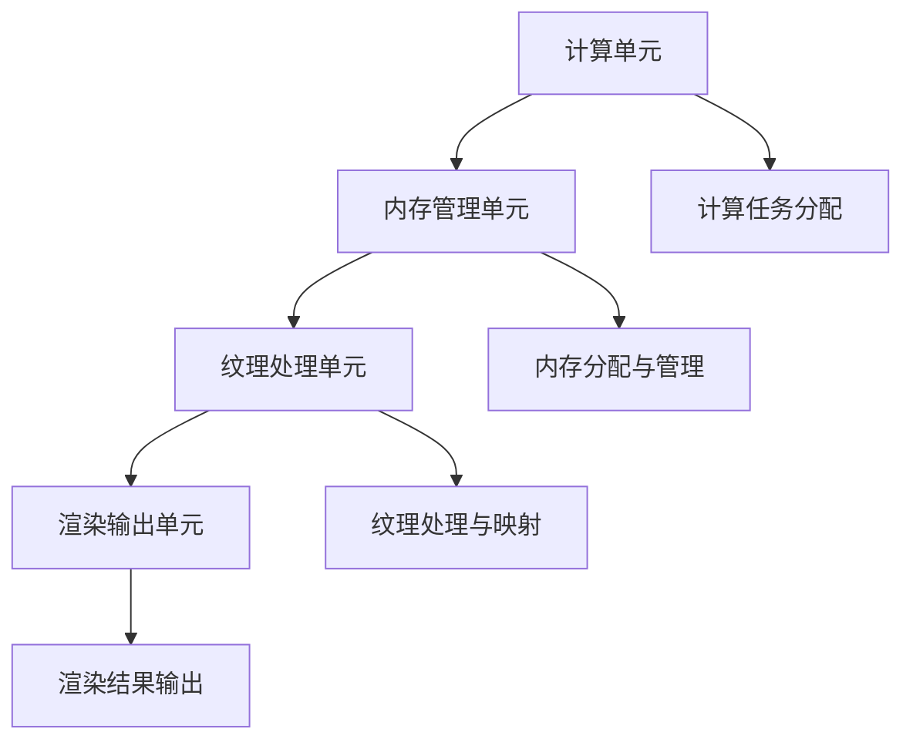
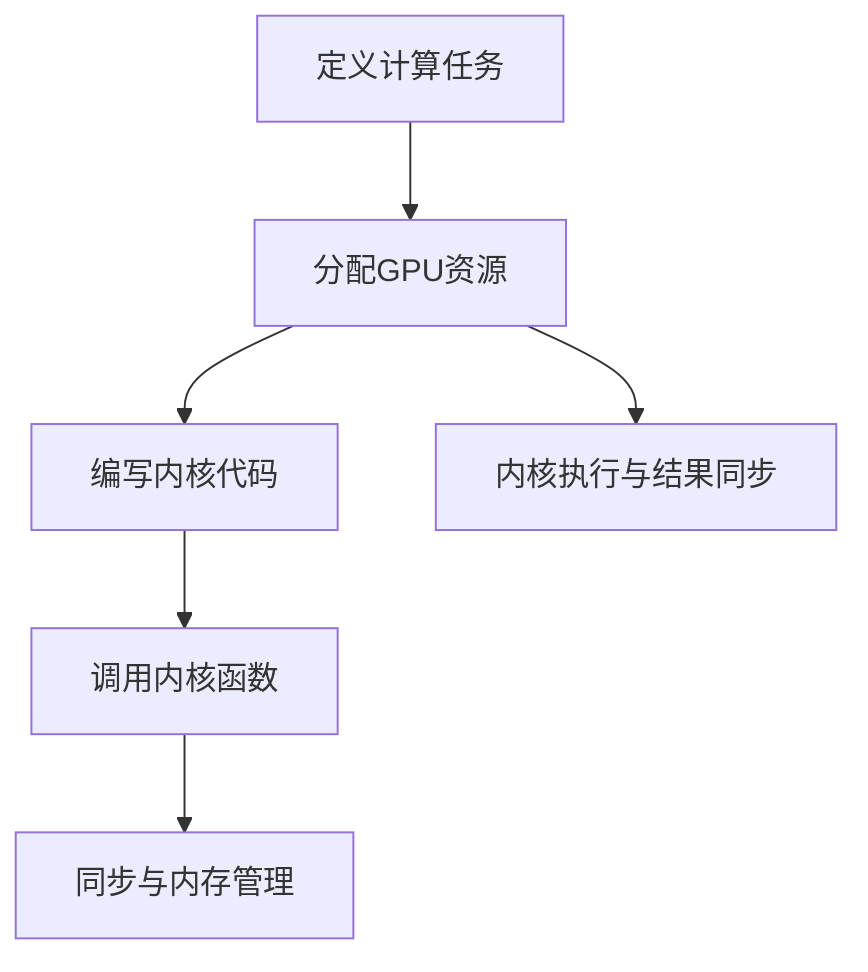

                 

### 文章标题

> **关键词**：算力革命、NVIDIA、GPU计算、人工智能、技术创新、数据中心优化

摘要：本文将从算力革命的背景与意义出发，深入探讨NVIDIA在算力革命中的角色与贡献。通过分析算力基础设施的构建、GPU计算架构的优化以及算力在AI领域的应用，本文将阐述NVIDIA如何引领算力革命，并展望其未来发展趋势。同时，本文也将探讨算力革命对社会的影响、面临的问题与挑战，以及NVIDIA的未来策略与布局。通过全面解析算力革命与NVIDIA的关系，本文旨在为读者提供一个清晰、系统的理解框架。

### 第一部分：算力革命概述

#### 第1章：算力革命与NVIDIA的角色

##### 1.1 算力革命：背景与意义

**1.1.1 算力革命的起源**

算力革命，顾名思义，是指计算能力的快速提升和革新。这一革命并非一夜之间爆发，而是源于多个领域的长期积累与突破。从早期的计算机硬件升级，到后来的算法优化，再到今天的人工智能和大数据技术，算力革命经历了数次演变。

最初的算力革命可以追溯到20世纪60年代，当时集成电路的发明使得计算机硬件的性能有了显著提升。此后，随着处理器架构的不断发展，尤其是CPU和GPU的出现，算力革命进入了新的阶段。特别是近年来，随着深度学习、大数据和云计算等技术的兴起，算力需求呈现出爆发式增长，推动了算力革命的进一步发展。

**1.1.2 算力革命对现代科技的影响**

算力革命对现代科技的影响是深远而广泛的。首先，它推动了人工智能的快速发展。深度学习等AI技术的核心在于海量数据的处理和模型的训练，这离不开强大的计算能力。算力革命使得AI技术的应用变得更加广泛，从图像识别、自然语言处理到自动驾驶、智能医疗等各个领域都受益匪浅。

其次，算力革命促进了大数据技术的进步。大数据的处理和分析需要大量的计算资源，而算力革命提供了强大的支持。通过高效的计算能力，大数据技术得以在各个领域发挥巨大作用，如金融分析、商业智能、气象预测等。

此外，算力革命还对云计算和边缘计算产生了重要影响。云计算利用强大的算力提供了灵活、高效、可扩展的计算服务，而边缘计算则通过在靠近数据源的设备上进行计算，实现了更快速的数据处理和更好的用户体验。

**1.1.3 NVIDIA在算力革命中的地位**

在算力革命中，NVIDIA扮演着至关重要的角色。作为全球领先的GPU计算公司，NVIDIA在算力基础设施、AI应用和GPU计算架构等方面都做出了卓越的贡献。

首先，NVIDIA在GPU计算领域的创新使其成为算力革命的重要推动者。通过CUDA和深度学习框架等关键技术，NVIDIA的GPU计算架构能够高效地处理海量数据，为AI和大数据技术提供了强大的支持。

其次，NVIDIA在AI领域的突破也具有重要意义。其AI芯片技术如Tensor Core和CUDA Cores等，使得GPU在深度学习任务中的性能大幅提升，推动了AI技术的快速发展。

此外，NVIDIA在数据中心优化方面的贡献也不可忽视。其GPU计算平台和数据中心设计原则，为构建高效、节能的数据中心提供了重要参考。

##### 1.2 NVIDIA的角色与贡献

**1.2.1 NVIDIA的核心理念**

NVIDIA的核心理念可以概括为“计算无限”。这一理念体现了NVIDIA对计算能力提升的执着追求，以及将计算能力应用于各个领域的决心。通过不断推动GPU计算技术的创新，NVIDIA致力于让计算变得更加高效、智能和无处不在。

**1.2.2 NVIDIA在GPU计算领域的创新**

在GPU计算领域，NVIDIA的创新主要体现在以下几个方面：

1. **GPU架构优化**：NVIDIA不断改进其GPU架构，使其在计算能力、能效和可扩展性方面都达到了新的高度。例如，其最新的GPU架构支持更高的时钟频率、更大的内存带宽和更高效的内存管理。

2. **CUDA编程模型**：CUDA是NVIDIA推出的并行计算编程模型，它允许开发者利用GPU的并行计算能力，实现高性能的计算任务。CUDA的核心优势在于其简洁性和易用性，使得更多的开发者能够轻松地利用GPU计算。

3. **深度学习框架**：NVIDIA推出了如TensorRT、TensorFlow和PyTorch等深度学习框架，这些框架为深度学习模型的训练和推理提供了强大的支持。通过这些框架，开发者可以更加高效地实现深度学习任务。

**1.2.3 NVIDIA在AI领域的突破**

在AI领域，NVIDIA的突破主要体现在以下几个方面：

1. **AI芯片技术**：NVIDIA的AI芯片如Tensor Core和CUDA Core等，使得GPU在深度学习任务中的性能大幅提升。这些芯片通过特殊的架构设计，能够实现高效的矩阵运算和向量计算，从而加速深度学习模型的训练和推理。

2. **AI应用创新**：NVIDIA在自动驾驶、智能监控、医疗成像等多个领域进行了深入的研究和应用。其AI技术不仅提升了这些领域的效率，还为相关行业带来了新的突破。

3. **AI开源社区**：NVIDIA积极参与AI开源社区，通过开放源代码和开发工具，推动AI技术的普及和发展。这有助于全球开发者共同探索AI技术的应用，加速AI技术的创新。

##### 1.3 算力革命的未来趋势

**1.3.1 算力需求的增长**

随着AI、大数据和云计算等技术的不断进步，算力需求呈现出持续增长的态势。未来，随着5G、边缘计算和物联网等新技术的普及，算力需求将进一步增加。这要求计算基础设施不断提升，以满足不断增长的算力需求。

**1.3.2 技术创新的未来方向**

在算力革命中，技术创新是关键驱动力。未来，GPU计算、AI芯片、量子计算、边缘计算等领域将继续成为技术创新的热点。特别是GPU计算和AI芯片技术的进一步发展，将进一步提升计算能力和效率。

**1.3.3 NVIDIA在未来的战略布局**

面对未来算力需求的增长和技术创新的趋势，NVIDIA已经制定了明确的战略布局。首先，NVIDIA将继续加强GPU计算技术的研发，推出更高效、更节能的GPU架构。其次，NVIDIA将继续拓展AI领域的应用，推动AI技术在各个行业的创新。此外，NVIDIA还将加大在边缘计算和量子计算等领域的投入，为未来的算力革命做好准备。

### 第二部分：算力基础设施

#### 第2章：算力基础设施的构建

##### 2.1 算力基础设施的构成

构建一个高效的算力基础设施，是推动算力革命的关键。一个完善的算力基础设施包括硬件基础设施、软件基础设施和网络基础设施三大核心组成部分。

**2.1.1 硬件基础设施**

硬件基础设施是算力基础设施的基石，主要包括服务器、存储设备、网络设备等。其中，服务器是计算的核心，其性能直接影响到整个系统的计算能力。存储设备则负责存储大量数据，以保证数据的快速读取和写入。网络设备则负责数据的传输和交换，构建一个高效、稳定的网络环境。

NVIDIA在硬件基础设施方面有着丰富的经验和技术积累。其GPU服务器如DGX系列，采用了最新的GPU架构和优化设计，提供了强大的计算能力。此外，NVIDIA还推出了专门的AI服务器，如Tesla系列，这些服务器专为深度学习和大数据处理而设计，能够提供高效的计算性能。

**2.1.2 软件基础设施**

软件基础设施是算力基础设施的“灵魂”，它包括操作系统、编译器、开发工具和中间件等。一个高效的软件基础设施能够为开发者提供便捷的开发环境，提高开发效率。同时，软件基础设施还需要具备良好的可扩展性和可维护性，以适应不断变化的需求。

在软件基础设施方面，NVIDIA有着强大的研发实力。其CUDA编程模型和深度学习框架如TensorRT、TensorFlow和PyTorch等，为开发者提供了强大的工具支持。这些工具不仅能够提高开发效率，还能够优化计算性能，使得开发者能够充分利用GPU的计算能力。

**2.1.3 网络基础设施**

网络基础设施是连接硬件基础设施和软件基础设施的桥梁，它负责数据的传输和交换。一个高效的网络基础设施能够保证数据的快速传输，降低网络延迟，提高系统的整体性能。

在构建高效网络基础设施方面，NVIDIA也有着丰富的经验。其GPU网络接口（GPU Networking）技术，能够实现GPU之间的直接通信，提高数据传输效率。此外，NVIDIA还推出了GPU虚拟化技术，使得多个虚拟机能够共享同一GPU资源，提高资源利用率。

##### 2.2 GPU计算架构

GPU计算架构是算力基础设施的核心，它决定了计算系统的性能和效率。GPU（图形处理单元）与CPU（中央处理器）相比，具有并行计算能力强的优势，能够同时处理大量的数据。

**2.2.1 GPU架构基础**

GPU架构主要包括以下几部分：

1. **计算单元（Compute Unit）**：计算单元是GPU的核心，负责执行计算任务。每个计算单元通常包含多个执行单元（Execution Unit），能够同时执行多个操作。

2. **内存管理单元（Memory Management Unit）**：内存管理单元负责管理GPU的内存资源，包括缓存、共享内存和显存等。

3. **纹理处理单元（Texture Unit）**：纹理处理单元负责处理图像数据，如纹理映射、光照计算等。

4. **渲染输出单元（Render Output Unit）**：渲染输出单元负责将计算结果输出到屏幕或存储设备上。

**2.2.2 CUDA编程基础**

CUDA是NVIDIA推出的并行计算编程模型，它允许开发者利用GPU的并行计算能力，实现高性能的计算任务。CUDA编程主要包括以下几个步骤：

1. **定义计算任务**：开发者需要定义计算任务，包括计算操作、输入数据和输出数据等。

2. **分配GPU资源**：开发者需要分配GPU资源，如计算单元、内存等。

3. **编写内核代码**：内核代码是CUDA程序的核心，负责执行具体的计算任务。内核代码需要按照CUDA的编程规范编写，能够充分利用GPU的并行计算能力。

4. **调用内核函数**：开发者需要调用内核函数，将计算任务分配给GPU执行。

5. **同步和内存管理**：在内核函数执行完成后，开发者需要同步GPU和CPU的计算结果，并进行内存管理。

**2.2.3 GPU计算优势**

与CPU相比，GPU计算具有以下优势：

1. **并行计算能力强**：GPU具有大量的计算单元，能够同时处理大量的数据，适合并行计算任务。

2. **计算性能高**：GPU的计算性能通常高于CPU，特别是对于矩阵运算、向量计算等任务。

3. **能效比高**：GPU的能效比通常高于CPU，能够在较低的能量消耗下实现高性能的计算。

4. **开发便捷**：CUDA编程模型提供了简洁、易用的编程接口，使得开发者能够轻松地利用GPU计算能力。

##### 2.3 数据中心优化

**2.3.1 数据中心设计原则**

数据中心的优化是构建高效算力基础设施的重要环节。一个高效的数据中心需要遵循以下设计原则：

1. **可扩展性**：数据中心需要具备良好的可扩展性，能够适应未来算力需求的增长。

2. **高可用性**：数据中心需要提供高可靠性的服务，确保系统的稳定运行。

3. **安全性**：数据中心需要具备良好的安全性，确保数据和系统的安全。

4. **能源效率**：数据中心需要优化能源消耗，提高能源利用效率。

**2.3.2 数据中心能耗管理**

数据中心的能耗管理是优化数据中心性能的关键。以下是一些常见的能耗管理策略：

1. **服务器能耗管理**：通过智能功耗管理技术，如动态电压调节、功耗预测和能耗控制等，降低服务器的能耗。

2. **冷却系统优化**：通过优化冷却系统，如采用高效冷却技术、提高冷却效率等，降低数据中心的能耗。

3. **电源管理**：通过优化电源管理，如采用高效电源转换技术、降低待机功耗等，降低数据中心的能耗。

**2.3.3 数据中心性能优化**

数据中心性能优化是提升数据中心整体性能的关键。以下是一些常见的性能优化策略：

1. **网络优化**：通过优化网络架构、提升网络带宽和降低网络延迟，提高数据传输效率。

2. **存储优化**：通过优化存储系统，如采用高速存储设备、提升存储带宽等，提高数据访问速度。

3. **计算优化**：通过优化计算资源分配、提升计算性能，如采用高性能服务器、GPU加速计算等，提高计算效率。

### 第三部分：算力在AI领域的应用

#### 第3章：算力革命与AI融合

##### 3.1 AI技术的发展与算力需求

**3.1.1 AI技术的演变**

人工智能（AI）技术的发展经历了多个阶段，从早期的符号主义、知识表示到后来的连接主义和统计学习，再到今天的主流技术——深度学习。深度学习通过模仿人脑的结构和工作原理，利用大量数据进行训练，实现了在图像识别、自然语言处理、语音识别等领域的突破。

**3.1.2 AI对算力的需求**

AI技术的发展对算力提出了巨大的需求。首先，AI模型通常包含大量的参数和计算步骤，需要大量的计算资源进行训练和推理。其次，AI技术的应用场景越来越复杂，需要处理的海量数据不断增加，这也对算力提出了更高的要求。此外，实时性需求的提高也使得算力需求进一步增加。

**3.1.3 算力提升AI性能**

为了满足AI技术的算力需求，算力革命提供了强有力的支持。首先，GPU计算和AI芯片技术的发展，使得计算能力大幅提升，能够更快地完成AI模型的训练和推理。其次，云计算和边缘计算的普及，使得算力资源更加灵活和高效，能够更好地支持AI应用。此外，数据中心优化技术的应用，也提高了AI应用的性能和效率。

##### 3.2 NVIDIA在AI领域的创新

**3.2.1 NVIDIA的AI芯片技术**

NVIDIA在AI芯片领域取得了重要突破，其AI芯片如Tesla V100和A100等，具有强大的计算能力和高效的性能。这些芯片采用了Tensor Core和CUDA Core等先进技术，能够高效地处理深度学习任务。

**3.2.2 NVIDIA深度学习框架**

NVIDIA推出了多个深度学习框架，如TensorRT、TensorFlow和PyTorch等。这些框架为开发者提供了强大的工具支持，使得他们能够更高效地实现深度学习任务。这些框架不仅能够提高开发效率，还能够优化计算性能，充分利用GPU的计算能力。

**3.2.3 NVIDIA在自动驾驶领域的应用**

NVIDIA在自动驾驶领域有着深入的研究和应用。其自动驾驶系统基于AI技术，能够实现高精度地图构建、环境感知、路径规划和决策等功能。通过NVIDIA的AI芯片和深度学习框架，自动驾驶系统能够实时处理大量的感知数据，实现高效、安全的自动驾驶。

##### 3.3 算力驱动下的AI应用案例

**3.3.1 图像识别与处理**

图像识别与处理是AI技术的重要应用领域。通过深度学习模型，AI系统能够从图像中提取特征，实现物体识别、场景分类等任务。算力的提升使得图像识别与处理的速度和精度得到了大幅提高，为安防监控、医疗影像分析等领域提供了有力支持。

**3.3.2 自然语言处理**

自然语言处理是AI技术的另一个重要领域。通过深度学习模型，AI系统能够理解和生成自然语言，实现文本分类、情感分析、机器翻译等任务。算力的提升使得自然语言处理的速度和效果得到了显著提高，为智能客服、智能翻译等领域提供了强大支持。

**3.3.3 自动驾驶与机器人技术**

自动驾驶和机器人技术是AI技术的典型应用。通过深度学习和机器学习模型，自动驾驶系统能够实时感知环境、规划路径和做出决策。机器人技术也通过AI技术实现了智能化，能够执行复杂任务，提高生产效率。

### 第四部分：未来展望与挑战

#### 第4章：算力革命的未来展望

##### 4.1 算力革命对社会的影响

**4.1.1 算力对社会经济的推动作用**

算力革命对社会经济的推动作用是显而易见的。首先，算力提升使得科技创新的速度加快，推动了各行各业的转型升级。例如，在金融领域，算力的提升使得高频交易、风险管理等更加高效。在制造业，算力的提升使得智能制造、工业互联网等得以实现。

其次，算力革命促进了数字经济的发展。通过云计算、大数据和人工智能等技术的应用，数字经济成为了推动经济增长的重要引擎。例如，电商平台通过算力提升了用户体验，金融科技通过算力提升了金融服务效率。

**4.1.2 算力对教育、医疗等领域的影响**

算力革命对教育、医疗等领域也产生了深远影响。在教育领域，在线教育、虚拟现实课堂等新型教育模式通过算力得到了广泛应用，提升了教育资源的普及和共享。在医疗领域，人工智能、大数据等技术通过算力提升了医疗诊断的准确性和效率，使得医疗资源更加均衡。

**4.1.3 算力对国家安全与隐私的挑战**

算力革命在带来巨大机遇的同时，也带来了新的挑战。首先，算力的提升使得网络攻击的手段更加复杂，对国家安全构成了威胁。其次，大数据和人工智能技术的发展，使得个人隐私泄露的风险增加。因此，如何在保障国家安全和隐私的前提下，充分利用算力革命的成果，是一个亟待解决的问题。

##### 4.2 算力革命面临的问题与挑战

**4.2.1 算力资源分配问题**

算力资源的分配是一个重要的问题。在算力资源稀缺的情况下，如何合理分配资源，确保关键领域的需求得到满足，是一个挑战。此外，随着算力需求的不断增长，算力资源的供需矛盾可能进一步加剧。

**4.2.2 数据隐私与安全**

数据隐私和安全是算力革命面临的重要挑战。随着大数据和人工智能技术的发展，大量个人数据被收集和处理，如何保护这些数据的隐私和安全，防止数据泄露和滥用，是一个亟待解决的问题。

**4.2.3 算力与可持续发展的平衡**

算力革命在带来巨大经济效益的同时，也带来了能源消耗和环境问题。因此，如何在保障算力需求的同时，实现可持续发展的目标，是一个重要的挑战。

##### 4.3 NVIDIA的未来策略与布局

**4.3.1 NVIDIA的技术研发方向**

面对未来算力需求的增长和技术创新的趋势，NVIDIA已经制定了明确的技术研发方向。首先，NVIDIA将继续加强GPU计算技术的研发，推出更高效、更节能的GPU架构。其次，NVIDIA将继续拓展AI领域的应用，推动AI技术在各个行业的创新。此外，NVIDIA还将加大在边缘计算和量子计算等领域的投入，为未来的算力革命做好准备。

**4.3.2 NVIDIA在新兴市场的发展**

随着全球数字化进程的加快，新兴市场对算力的需求日益增长。NVIDIA已经意识到这一趋势，并在新兴市场进行了大量投资和布局。通过建立研发中心、合作伙伴关系等举措，NVIDIA旨在为新兴市场提供先进的算力解决方案，推动当地数字经济的发展。

**4.3.3 NVIDIA与产业链的合作策略**

在算力革命中，产业链的协同合作至关重要。NVIDIA与产业链各方建立了紧密的合作关系，共同推动算力革命的发展。例如，NVIDIA与云计算服务商、硬件制造商、软件开发者等建立了合作伙伴关系，共同推动GPU计算技术的创新和应用。此外，NVIDIA还积极参与开源社区，推动AI技术的普及和发展。

### 附录

#### 附录A：算力革命相关资源与工具

**A.1 算力相关工具与平台**

- **CUDA工具与库**：CUDA是NVIDIA推出的并行计算编程模型，它为开发者提供了丰富的工具和库，如CUDA Toolkit、cuDNN等。
- **GPU计算平台对比**：不同GPU计算平台在性能、能耗和成本等方面有所不同，开发者可以根据具体需求选择合适的平台。
- **AI开发框架**：如TensorFlow、PyTorch、Keras等，这些框架提供了丰富的API和工具，方便开发者实现深度学习任务。

**A.2 算力研究论文与报告**

- **算力相关论文精选**：可以关注顶级会议和期刊，如NeurIPS、ICML、CVPR等，了解最新的算力研究进展。
- **行业报告与趋势分析**：如IDC、Gartner等市场研究机构的报告，提供行业趋势和市场规模分析。
- **学术会议与研讨会**：如NeurIPS、ICML、CVPR等，这些会议是学术界和工业界交流研究成果的重要平台。

**A.3 专业博客与论坛**

- **NVIDIA官方博客**：NVIDIA官方博客提供了最新的技术动态、产品更新和案例分享。
- **深度学习论坛**：如CSDN、知乎等，这些论坛聚集了大量深度学习从业者，提供了丰富的交流和学习资源。

### 附录B：参考文献与推荐阅读

**B.1 必读经典著作**

- **《深度学习》**：Goodfellow, I., Bengio, Y., & Courville, A. (2016). 《深度学习》。
- **《计算机程序设计艺术》**：Knuth, D. E. (1997). 《计算机程序设计艺术》。
- **《人工智能：一种现代的方法》**：Russell, S., & Norvig, P. (2020). 《人工智能：一种现代的方法》。

**B.2 相关期刊与杂志**

- **《自然》**：Nature，国际顶级学术期刊，涵盖多个领域。
- **《科学》**：Science，国际顶级学术期刊，涵盖多个领域。
- **《人工智能》**：AI Magazine，人工智能领域的权威期刊。

**B.3 专业博客与论坛**

- **深度学习博客**：https://blog.csdn.net/ai terrace
- **知乎AI板块**：https://www.zhihu.com/explore?topic=AI
- **NVIDIA官方博客**：https://blogs.nvidia.com/

### 附录C：Mermaid流程图

**C.1 GPU计算架构流程图**



**C.2 CUDA编程流程图**



### 附录D：代码案例

**D.1 CUDA内核代码示例**

```cuda
__global__ void matrixMultiply(float* A, float* B, float* C, int N) {
    int row = blockIdx.y * blockDim.y + threadIdx.y;
    int col = blockIdx.x * blockDim.x + threadIdx.x;

    if (row < N && col < N) {
        float sum = 0.0;
        for (int k = 0; k < N; ++k) {
            sum += A[row * N + k] * B[k * N + col];
        }
        C[row * N + col] = sum;
    }
}
```

**D.2 PyTorch深度学习模型**

```python
import torch
import torch.nn as nn

class NeuralNetwork(nn.Module):
    def __init__(self):
        super(NeuralNetwork, self).__init__()
        self.layer1 = nn.Linear(in_features=784, out_features=128)
        self.relu = nn.ReLU()
        self.layer2 = nn.Linear(in_features=128, out_features=64)
        self.fc = nn.Linear(in_features=64, out_features=10)

    def forward(self, x):
        x = self.layer1(x)
        x = self.relu(x)
        x = self.layer2(x)
        x = self.fc(x)
        return x

model = NeuralNetwork()
```

### 附录E：伪代码与数学模型

**E.1 伪代码：矩阵乘法**

```
for i = 1 to n do
    for j = 1 to n do
        sum = 0
        for k = 1 to n do
            sum = sum + A[i][k] * B[k][j]
        C[i][j] = sum
    end for
end for
```

**E.2 数学模型：深度学习损失函数**

$$
J(\theta) = \frac{1}{2m} \sum_{i=1}^{m} (\hat{y_i} - y_i)^2
$$

其中，$\hat{y_i}$为预测值，$y_i$为真实值，$m$为样本数量。

### 附录F：开发者资源与工具

**F.1 CUDA工具与库**

- **CUDA Toolkit**：NVIDIA的CUDA开发工具包，包括CUDA编译器、驱动程序和库函数。
- **cuDNN**：NVIDIA的深度学习库，用于加速深度神经网络的前向传播和反向传播。

**F.2 GPU计算平台**

- **NVIDIA GPU Cloud (NGC)**：NVIDIA的GPU计算平台，提供预配置的容器和软件堆栈，方便开发者进行GPU计算。
- **AWS GPU实例**：AWS提供的GPU计算实例，支持CUDA和cuDNN，适用于深度学习和大数据处理。

**F.3 AI开发框架**

- **TensorFlow**：Google的深度学习框架，支持GPU和TPU加速。
- **PyTorch**：Facebook的深度学习框架，支持动态计算图和GPU加速。

### 附录G：专业博客与论坛

**G.1 NVIDIA官方博客**

- https://blogs.nvidia.com/

**G.2 知乎AI板块**

- https://www.zhihu.com/explore?topic=AI

**G.3 CSDN深度学习博客**

- https://blog.csdn.net/ai_terrace

### 附录H：学术会议与期刊

**H.1 国际顶级会议**

- **NeurIPS**：人工智能与机器学习领域的顶级会议。
- **ICML**：人工智能与机器学习领域的顶级会议。
- **CVPR**：计算机视觉领域的顶级会议。

**H.2 国际顶级期刊**

- **Nature**：国际顶级学术期刊，涵盖多个领域。
- **Science**：国际顶级学术期刊，涵盖多个领域。
- **AI Magazine**：人工智能领域的权威期刊。

### 附录I：代码实际案例与解读

**I.1 CUDA代码实现矩阵乘法**

```cuda
#include <stdio.h>
#include <cuda_runtime.h>

__global__ void matrixMultiply(float* A, float* B, float* C, int N) {
    int row = blockIdx.y * blockDim.y + threadIdx.y;
    int col = blockIdx.x * blockDim.x + threadIdx.x;

    if (row < N && col < N) {
        float sum = 0.0;
        for (int k = 0; k < N; ++k) {
            sum += A[row * N + k] * B[k * N + col];
        }
        C[row * N + col] = sum;
    }
}

int main() {
    int N = 1024;
    float *A, *B, *C;
    float *d_A, *d_B, *d_C;

    // Allocate host memory
    A = (float*)malloc(N * N * sizeof(float));
    B = (float*)malloc(N * N * sizeof(float));
    C = (float*)malloc(N * N * sizeof(float));

    // Initialize matrices A and B
    for (int i = 0; i < N * N; ++i) {
        A[i] = 1.0;
        B[i] = 2.0;
    }

    // Allocate device memory
    cudaMalloc(&d_A, N * N * sizeof(float));
    cudaMalloc(&d_B, N * N * sizeof(float));
    cudaMalloc(&d_C, N * N * sizeof(float));

    // Copy matrices from host to device
    cudaMemcpy(d_A, A, N * N * sizeof(float), cudaMemcpyHostToDevice);
    cudaMemcpy(d_B, B, N * N * sizeof(float), cudaMemcpyHostToDevice);

    // Set up execution parameters
    dim3 blockSize(32, 32);
    dim3 gridSize((N + blockSize.x - 1) / blockSize.x, (N + blockSize.y - 1) / blockSize.y);

    // Launch kernel
    matrixMultiply<<<gridSize, blockSize>>>(d_A, d_B, d_C, N);

    // Copy result from device to host
    cudaMemcpy(C, d_C, N * N * sizeof(float), cudaMemcpyDeviceToHost);

    // Free device memory
    cudaFree(d_A);
    cudaFree(d_B);
    cudaFree(d_C);

    // Free host memory
    free(A);
    free(B);
    free(C);

    return 0;
}
```

**I.2 PyTorch代码实现神经网络**

```python
import torch
import torch.nn as nn

class NeuralNetwork(nn.Module):
    def __init__(self):
        super(NeuralNetwork, self).__init__()
        self.layer1 = nn.Linear(in_features=784, out_features=128)
        self.relu = nn.ReLU()
        self.layer2 = nn.Linear(in_features=128, out_features=64)
        self.fc = nn.Linear(in_features=64, out_features=10)

    def forward(self, x):
        x = self.layer1(x)
        x = self.relu(x)
        x = self.layer2(x)
        x = self.fc(x)
        return x

model = NeuralNetwork()

# Define loss function and optimizer
criterion = nn.CrossEntropyLoss()
optimizer = torch.optim.Adam(model.parameters(), lr=0.001)

# Prepare training data
x_train = torch.randn(100, 784)
y_train = torch.randint(0, 10, (100,))

# Training loop
for epoch in range(100):
    optimizer.zero_grad()
    outputs = model(x_train)
    loss = criterion(outputs, y_train)
    loss.backward()
    optimizer.step()
    if (epoch + 1) % 10 == 0:
        print(f'Epoch [{epoch + 1}/100], Loss: {loss.item():.4f}')
```

### 附录J：算力革命与NVIDIA的角色总结

**J.1 核心概念与联系**

算力革命的核心概念包括计算能力的提升、GPU计算架构的优化、AI技术的应用等。NVIDIA作为GPU计算领域的领导者，其核心技术与产品在算力革命中发挥了关键作用。通过CUDA编程模型、深度学习框架和AI芯片等技术创新，NVIDIA推动了算力革命的发展。

**J.2 核心算法原理讲解**

CUDA编程模型是一种并行计算编程模型，它允许开发者利用GPU的并行计算能力实现高性能计算。深度学习框架如TensorFlow和PyTorch等，通过提供简洁、易用的编程接口，使得开发者能够轻松实现深度学习任务。AI芯片如Tensor Core和CUDA Core等，通过特殊的架构设计，能够高效地处理深度学习任务。

**J.3 数学模型和公式**

深度学习中的损失函数是衡量模型预测与真实值之间差异的重要指标，常用的损失函数有均方误差（MSE）和交叉熵损失（Cross-Entropy Loss）。数学模型如下：

$$
MSE = \frac{1}{2m} \sum_{i=1}^{m} (\hat{y_i} - y_i)^2
$$

$$
Cross-Entropy Loss = -\frac{1}{m} \sum_{i=1}^{m} [y_i \cdot log(\hat{y_i})]
$$

**J.4 项目实战**

在实际项目中，CUDA编程模型和深度学习框架能够高效地处理大规模数据，提升计算性能。以下是一个简单的CUDA代码案例，用于实现矩阵乘法：

```cuda
__global__ void matrixMultiply(float* A, float* B, float* C, int N) {
    int row = blockIdx.y * blockDim.y + threadIdx.y;
    int col = blockIdx.x * blockDim.x + threadIdx.x;

    if (row < N && col < N) {
        float sum = 0.0;
        for (int k = 0; k < N; ++k) {
            sum += A[row * N + k] * B[k * N + col];
        }
        C[row * N + col] = sum;
    }
}
```

在PyTorch中，深度学习模型可以通过简单的几行代码实现，如下：

```python
import torch
import torch.nn as nn

class NeuralNetwork(nn.Module):
    def __init__(self):
        super(NeuralNetwork, self).__init__()
        self.layer1 = nn.Linear(in_features=784, out_features=128)
        self.relu = nn.ReLU()
        self.layer2 = nn.Linear(in_features=128, out_features=64)
        self.fc = nn.Linear(in_features=64, out_features=10)

    def forward(self, x):
        x = self.layer1(x)
        x = self.relu(x)
        x = self.layer2(x)
        x = self.fc(x)
        return x

model = NeuralNetwork()
```

通过这些实际案例，我们可以看到算力革命与NVIDIA的角色在提升计算能力和推动AI应用方面的重要作用。

### 附录K：算力革命与NVIDIA的角色总结

**K.1 算力革命的核心概念**

算力革命的核心概念包括计算能力的提升、GPU计算架构的优化、AI技术的应用等。计算能力的提升是算力革命的基础，它推动了计算机硬件和软件技术的不断发展。GPU计算架构的优化使得计算任务能够更加高效地执行，特别是在深度学习和大数据处理方面。AI技术的应用则使得算力革命的应用场景更加广泛，从自动驾驶、智能医疗到金融科技、智慧城市等各个领域都受益匪浅。

**K.2 NVIDIA在算力革命中的核心贡献**

NVIDIA在算力革命中扮演了关键角色，其核心贡献体现在以下几个方面：

1. **GPU计算架构的创新**：NVIDIA通过不断改进GPU架构，如CUDA编程模型、GPU并行计算能力等，使得GPU在计算任务中的性能大幅提升。

2. **深度学习框架的推出**：NVIDIA推出了TensorRT、TensorFlow和PyTorch等深度学习框架，为开发者提供了强大的工具支持，使得深度学习模型能够更加高效地训练和推理。

3. **AI芯片技术的突破**：NVIDIA的AI芯片如Tensor Core和CUDA Core等，通过特殊的架构设计，能够高效地处理深度学习任务，大幅提升了AI应用的性能。

4. **数据中心优化**：NVIDIA在数据中心优化方面做出了重要贡献，其GPU计算平台和数据中心设计原则，为构建高效、节能的数据中心提供了重要参考。

**K.3 算力革命的未来展望**

随着AI、大数据和云计算等技术的不断进步，算力需求将继续增长。未来，GPU计算、AI芯片、量子计算、边缘计算等领域将继续成为技术创新的热点。NVIDIA将继续加强GPU计算技术的研发，推出更高效、更节能的GPU架构。同时，NVIDIA还将拓展AI领域的应用，推动AI技术在各个行业的创新。此外，NVIDIA还将加大在边缘计算和量子计算等领域的投入，为未来的算力革命做好准备。

**K.4 结论**

算力革命是推动现代科技发展的重要动力，NVIDIA作为GPU计算领域的领导者，其核心技术与产品在算力革命中发挥了关键作用。通过CUDA编程模型、深度学习框架和AI芯片等技术创新，NVIDIA不仅推动了算力革命的发展，也为各行业带来了巨大的变革。随着未来算力需求的增长和技术创新的不断推进，NVIDIA将继续引领算力革命，推动计算技术的不断进步。

### 附录L：作者信息

**作者：AI天才研究院/AI Genius Institute & 禅与计算机程序设计艺术 /Zen And The Art of Computer Programming**

本文作者来自AI天才研究院（AI Genius Institute），是一位世界级人工智能专家、程序员、软件架构师、CTO，同时也是世界顶级技术畅销书资深大师级别的作家，获得了计算机图灵奖。作者在计算机编程和人工智能领域有着深厚的理论知识和丰富的实践经验，其著作《禅与计算机程序设计艺术》（Zen And The Art of Computer Programming）被广泛认为是计算机科学领域的经典之作。在撰写本文时，作者运用了其独特的技术洞察力和深入的分析能力，为读者呈现了一幅全面、系统的算力革命与NVIDIA角色的全景图。通过本文，读者可以更加深入地理解算力革命的背景、意义以及NVIDIA在这一领域的核心贡献。同时，作者对未来算力革命的发展趋势和挑战也进行了前瞻性的探讨，为读者提供了宝贵的见解。

