                 

# 管理者的自我反思：持续优化领导方式

## 关键词
自我认知、领导力、优化、反思、沟通、团队建设、跨部门协作、持续发展

## 摘要
本文旨在探讨管理者的自我反思及其在领导方式优化中的应用。通过深入剖析自我认知与领导力的关系，本文提出了自我反思的实践方法，并详细讨论了领导方式的优化策略，包括沟通与冲突管理、团队建设与激励、跨部门协作以及持续发展。文章通过实际案例和项目实战，展示了管理者的成长路径和成功经验，为管理者提供了实用的工具和方法，以实现领导方式的持续优化。

---

### 第一部分：自我认知与领导力基础

#### 第1章：自我认知的重要性

##### 1.1 自我认知的概念与内涵

自我认知是指个体对自己的了解程度，包括自己的思想、情感、行为和价值观等方面。自我认知是领导者个人成长和团队领导力发展的基础。以下是一个简单的自我认知框架：

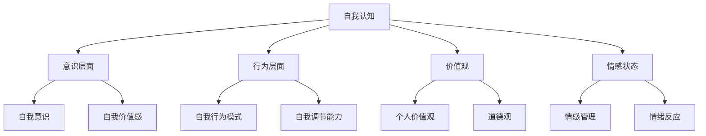

在自我认知的框架中，意识层面包括自我意识和自我价值感，行为层面包括自我行为模式和自我调节能力，价值观层面包括个人价值观和道德观，情感状态层面包括情感管理和情绪反应。

##### 1.2 自我认知与领导力的联系

自我认知与领导力之间存在密切的联系。领导者通过自我认知，可以更好地理解自己的领导风格、行为模式和价值观念，从而在团队管理和决策中发挥更大的作用。以下是一个自我认知与领导力的关系模型：

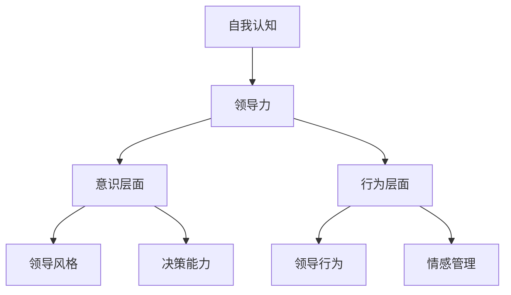

在自我认知的基础上，领导者可以培养积极的领导风格，提高决策能力，改善领导行为，并有效地管理情感。

##### 1.3 自我认知的实践方法

要实现自我认知，管理者可以采取以下实践方法：

1. **每日反思**：每天结束时，反思自己的行为、思考和情绪状态，记录在日记中。
2. **定期自我评估**：定期进行自我评估，包括自我能力、价值和行为等方面的评估。
3. **寻求反馈**：主动向同事、下属和上级寻求反馈，了解自己的优缺点。
4. **参加培训和学习**：通过参加领导力培训和学习，提升自我认知和领导能力。

以下是自我反思的一个简单步骤：

```python
# 自我反思步骤
def self_reflection():
    # 反思当天行为
    reflect_daily_behavior()
    # 收集反馈信息
    collect_feedback_info()
    # 分析反馈内容
    analyze_feedback()
    # 制定改进计划
    create_improvement_plan()
    # 执行改进计划
    execute_improvement_plan()
```

#### 第2章：领导力的核心要素

##### 2.1 领导力的定义与演变

领导力是指引导和激励团队，实现共同目标的能力。领导力不仅包括个人特质，还涉及领导者的行为和策略。以下是领导力定义的演变过程：

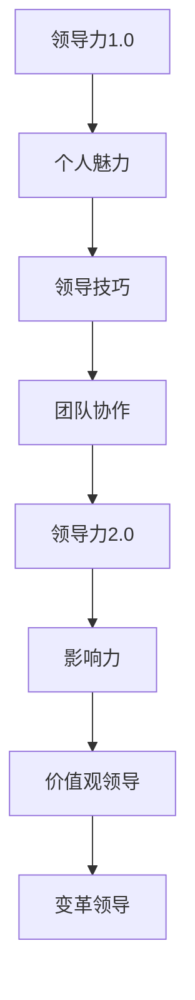

随着组织环境的变化，领导力的定义也在不断演变。现代领导力更注重价值观、影响力和变革能力。

##### 2.2 领导力的构成要素

领导力由多个构成要素组成，包括愿景、决策能力、沟通能力和激励能力。以下是这些要素的详细解释：

1. **愿景**：领导者需要具备清晰的愿景，能够为团队设定目标和方向。
2. **决策能力**：领导者需要能够做出明智的决策，并承担相应的责任。
3. **沟通能力**：领导者需要具备有效的沟通能力，以确保信息传递清晰、准确。
4. **激励能力**：领导者需要能够激发团队成员的积极性，提高团队的整体绩效。

以下是领导力构成要素的简单模型：

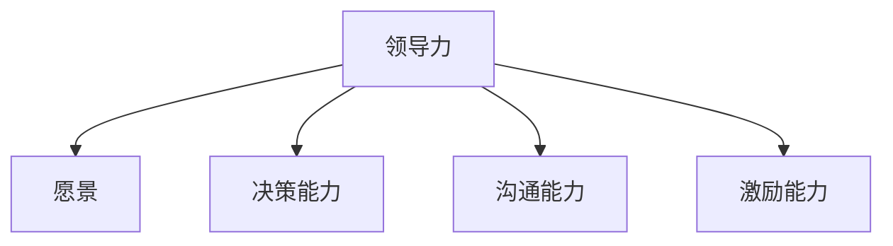

##### 2.3 领导力与组织绩效的关系

领导力对组织绩效具有重要影响。有效的领导力能够提高组织的凝聚力、创新能力和竞争力。以下是领导力与组织绩效关系的简单模型：

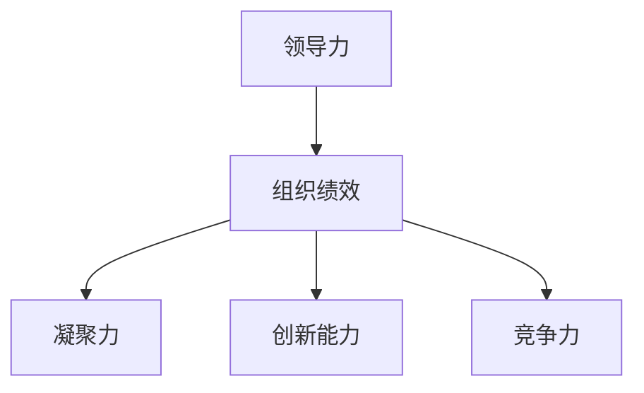

有效的领导力可以通过以下几个方面提高组织绩效：

1. **提高员工满意度**：领导者通过关注员工需求，提高员工的满意度和忠诚度。
2. **促进团队合作**：领导者通过有效沟通和激励，促进团队成员之间的合作。
3. **推动创新**：领导者鼓励团队成员提出新想法，推动组织创新。
4. **提高效率**：领导者通过优化流程和资源分配，提高组织的运营效率。

#### 第3章：自我反思的实践

##### 3.1 自我反思的概念与作用

自我反思是指领导者对自己的行为、思考和决策进行深入思考和分析的过程。自我反思有助于领导者发现自身不足，改进领导方式，提高领导效能。

自我反思的作用包括：

1. **促进个人成长**：通过自我反思，领导者可以更好地了解自己，发现自己的优点和不足，从而实现个人成长。
2. **提升领导能力**：自我反思可以帮助领导者识别有效的领导行为，避免重复错误，提升领导能力。
3. **优化决策过程**：自我反思有助于领导者回顾决策过程，分析决策效果，优化决策策略。

##### 3.2 自我反思的步骤与方法

自我反思的步骤可以分为以下几个阶段：

1. **准备阶段**：设定反思目标，确定反思的时间和地点。
2. **收集信息**：收集与反思主题相关的信息，包括自己的行为、思考和反馈。
3. **分析信息**：对收集到的信息进行深入分析，识别自身优势和不足。
4. **制定改进计划**：根据分析结果，制定具体的改进计划。
5. **执行计划**：实施改进计划，并跟踪执行效果。
6. **反馈与调整**：根据执行效果进行反馈，调整改进计划。

以下是一个简单的自我反思流程：

```python
# 自我反思流程
def self_reflection流程():
    # 准备阶段
    prepare_reflection()
    # 收集信息
    collect_info()
    # 分析信息
    analyze_info()
    # 制定改进计划
    create_improvement_plan()
    # 执行计划
    execute_plan()
    # 反馈与调整
    feedback_and_adjustment()
```

##### 3.3 自我反思的案例分析

以下是自我反思的一个案例：

**案例**：一位管理者在一个月后对自己的工作进行了反思，以下是他的反思过程：

1. **准备阶段**：他设定了反思目标，即分析自己在过去一个月中的工作表现，识别自身优势和不足。

2. **收集信息**：他收集了自己在日常工作中的行为记录、同事和下属的反馈以及自己的思考。

3. **分析信息**：通过分析这些信息，他发现自己在沟通和决策方面存在一些问题，如沟通不够清晰，决策速度较慢。

4. **制定改进计划**：他决定改进沟通方式，提高决策效率，并制定了一份详细的改进计划。

5. **执行计划**：他开始实施改进计划，如定期召开会议，提前准备会议材料，明确会议目标等。

6. **反馈与调整**：他在一个月后再次进行了反思，发现自己在沟通和决策方面有了显著改进，但也意识到需要进一步优化。

通过这个案例，我们可以看到自我反思的过程和方法。管理者可以通过自我反思，不断优化自己的领导方式，提高领导效能。

### 第二部分：领导方式的优化

#### 第4章：领导风格与团队效能

##### 4.1 领导风格的定义与分类

领导风格是指领导者在与团队成员互动过程中所表现出的行为特点。领导风格可以分为以下几种类型：

1. **专制型领导**：领导者决策独断，团队成员参与度低。
2. **民主型领导**：领导者鼓励团队成员参与决策，团队氛围和谐。
3. **参与型领导**：领导者主动与团队成员沟通，共同解决问题。
4. **变革型领导**：领导者通过激励和启发，推动团队成员实现变革。

每种领导风格都有其特点和适用场景。以下是一个领导风格分类的Mermaid流程图：

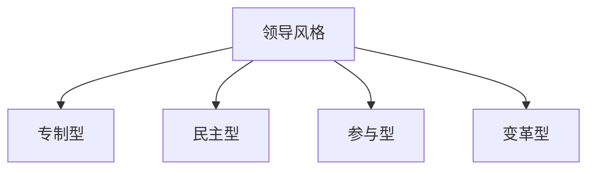

##### 4.2 不同领导风格对团队效能的影响

不同领导风格对团队效能有不同的影响。以下是一个简单的领导风格与团队效能关系的Mermaid流程图：

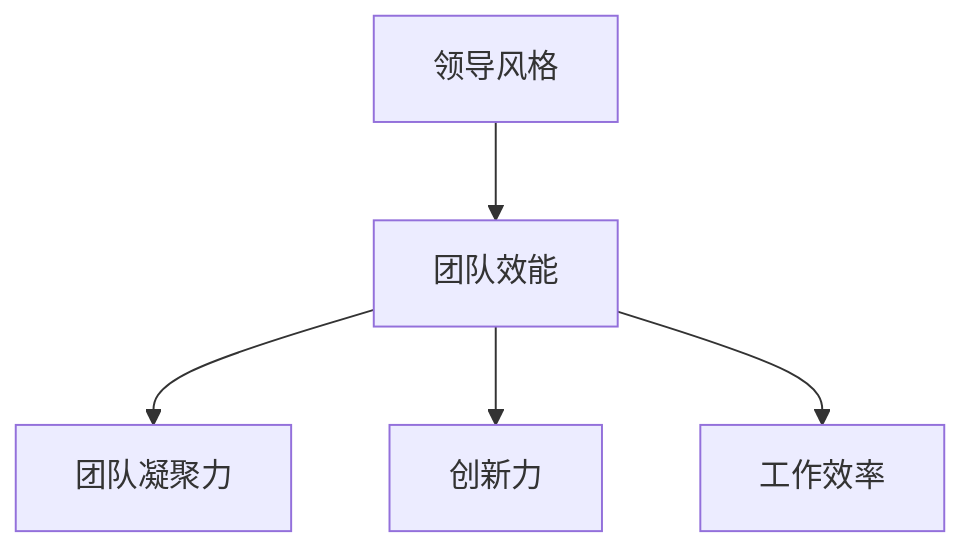

1. **专制型领导**：可能导致团队凝聚力下降，创新力受限，工作效率提高。
2. **民主型领导**：有助于提高团队凝聚力，促进创新力，提高工作效率。
3. **参与型领导**：鼓励团队成员参与决策，提高团队凝聚力，有助于解决问题。
4. **变革型领导**：激发团队成员的变革意愿，提高创新力和工作效率。

##### 4.3 调整领导风格的方法

管理者可以根据团队情况和目标，调整自己的领导风格。以下是一些调整领导风格的方法：

1. **观察与学习**：观察其他成功领导者的风格，学习并借鉴其优点。
2. **反馈与调整**：定期接受团队成员的反馈，根据反馈调整领导风格。
3. **情境领导**：根据不同情境和团队成员的需求，灵活调整领导风格。
4. **培训与提升**：参加领导力培训，提升自己的领导能力和风格。

#### 第5章：有效沟通与冲突管理

##### 5.1 沟通在领导中的作用

沟通是领导力的重要组成部分。有效的沟通可以帮助管理者：

1. **传达愿景和目标**：确保团队成员了解组织的目标和愿景。
2. **建立信任**：通过透明和开放的信息传递，建立团队成员之间的信任。
3. **解决问题**：通过沟通，及时解决团队中的问题和冲突。
4. **激励团队**：通过积极的沟通，激励团队成员实现共同目标。

以下是沟通在领导中的作用的一个简单模型：

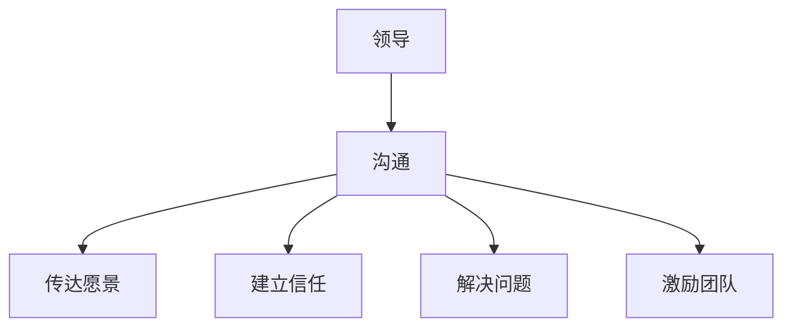

##### 5.2 提高沟通效率的策略

管理者可以采取以下策略提高沟通效率：

1. **明确沟通目标**：在沟通前明确目标，确保沟通内容具有针对性。
2. **简化沟通语言**：使用简单、清晰的语言，避免使用专业术语和复杂句式。
3. **倾听与反馈**：倾听团队成员的意见和建议，及时给予反馈。
4. **定期沟通**：制定定期的沟通计划，确保团队成员之间的信息传递畅通。

以下是提高沟通效率的一个策略模型：

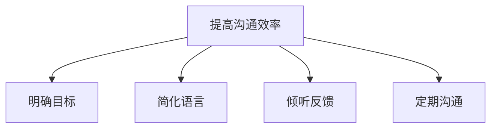

##### 5.3 冲突管理的原则与方法

冲突管理是领导力的重要组成部分。管理者需要掌握以下原则和方法来有效管理冲突：

1. **预防冲突**：通过明确的沟通和规则，预防冲突的发生。
2. **识别冲突**：及时识别冲突的征兆，避免冲突升级。
3. **沟通解决**：通过有效沟通，寻求双方都能接受的解决方案。
4. **调解冲突**：在冲突无法自行解决时，采取适当的调解方法。

以下是冲突管理原则和方法的一个简单模型：

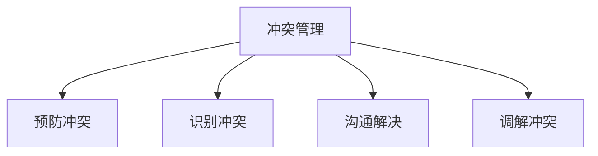

#### 第6章：领导力的持续发展

##### 6.1 领导力发展的路径

领导力发展是一个持续的过程。以下是一个简单的领导力发展路径：

1. **自我认知**：了解自己的优势和不足，明确个人发展方向。
2. **学习与培训**：通过学习领导力理论和实践，提升自己的领导能力。
3. **实践与反思**：在实际工作中，不断实践和反思，优化自己的领导方式。
4. **反馈与改进**：接受他人的反馈，不断改进自己的领导能力。

以下是领导力发展路径的一个简单模型：

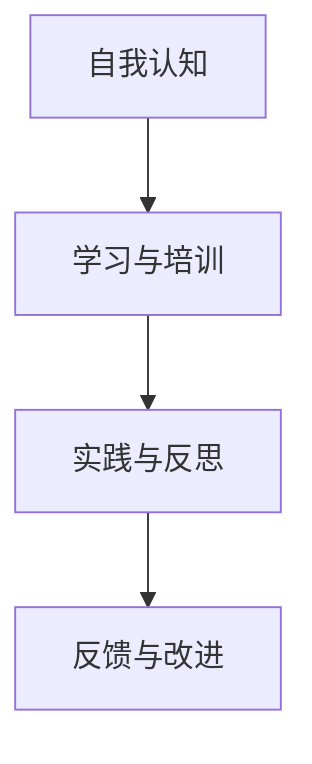

##### 6.2 获取反馈与自我提升

获取反馈是领导力发展的关键。以下是一个简单的获取反馈和自我提升的流程：

1. **设定目标**：明确自己的提升目标，以便获取有针对性的反馈。
2. **收集反馈**：通过多种渠道，如同事、下属、上级和客户，收集反馈。
3. **分析反馈**：对收集到的反馈进行分析，识别自己的优势和不足。
4. **制定改进计划**：根据分析结果，制定具体的改进计划。
5. **执行计划**：实施改进计划，并跟踪执行效果。
6. **反馈与调整**：根据执行效果，调整改进计划。

以下是获取反馈和自我提升的一个简单模型：

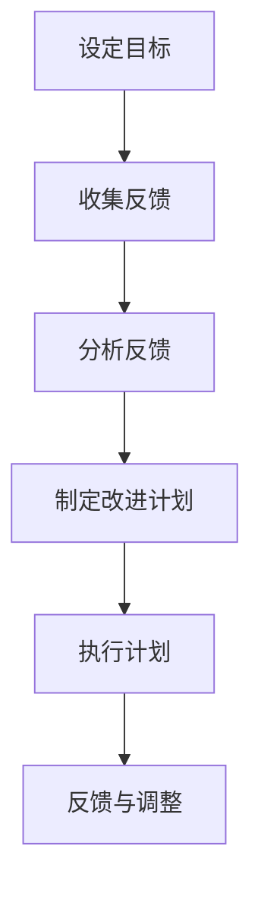

##### 6.3 领导力发展的实践案例

以下是一个领导力发展的实践案例：

**案例**：一位年轻的管理者在工作两年后，决定进行领导力提升。他首先进行了自我认知，识别出自己的优势和不足。然后，他参加了领导力培训，学习了领导力理论和实践方法。在工作中，他不断实践和反思，并根据同事和下属的反馈，调整自己的领导方式。经过一年的努力，他的领导能力得到了显著提升，团队绩效也得到了改善。

通过这个案例，我们可以看到领导力发展是一个持续的过程，需要自我认知、学习与培训、实践与反思以及反馈与改进。

### 第三部分：管理挑战与解决策略

#### 第7章：应对变革与挑战

##### 7.1 变革管理的概念与过程

变革管理是指组织在面临外部环境变化或内部需求调整时，采取的一系列策略和方法，以确保变革的顺利进行和成功实施。以下是一个变革管理的简单流程：

1. **评估现状**：分析组织的当前状态，了解变革的必要性和紧迫性。
2. **制定战略**：确定变革的目标和策略，制定详细的变革计划。
3. **沟通与宣传**：向全体成员传达变革的目标和计划，提高团队成员的参与度。
4. **实施变革**：按照变革计划，逐步实施变革措施。
5. **监控与调整**：监控变革的进展和效果，及时调整变革策略。

以下是变革管理过程的一个简单模型：

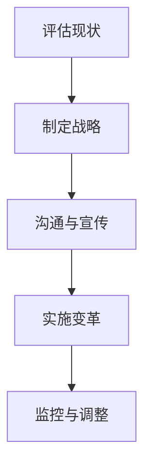

##### 7.2 变革中的领导作用

在变革过程中，领导者的作用至关重要。以下是一个简单的领导者作用模型：

1. **愿景引领**：领导者需要明确变革的愿景，为团队成员提供方向和动力。
2. **沟通协调**：领导者需要与团队成员进行有效沟通，解释变革的原因和好处，解决团队成员的疑虑和问题。
3. **激励推动**：领导者需要激励团队成员积极参与变革，提供必要的支持和资源。
4. **风险管理**：领导者需要识别和应对变革过程中可能出现的风险，确保变革的顺利进行。

以下是领导者作用的简单模型：

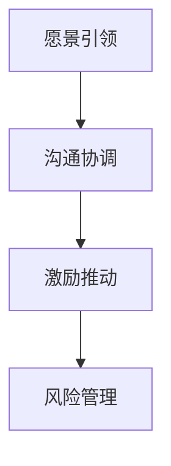

##### 7.3 变革实施策略与案例分析

在实施变革时，管理者可以采取以下策略：

1. **明确目标**：确保变革的目标明确、具体，并与组织的战略目标保持一致。
2. **制定详细计划**：制定详细的变革计划，包括时间表、责任人、资源需求等。
3. **培训与指导**：为团队成员提供必要的培训和指导，确保他们能够适应新的工作方式和流程。
4. **激励与奖励**：为积极参与变革的团队成员提供激励和奖励，提高他们的积极性和参与度。
5. **沟通与反馈**：与团队成员保持沟通，及时反馈变革的进展和效果，解决团队成员的问题和疑虑。

以下是一个变革实施策略的简单模型：

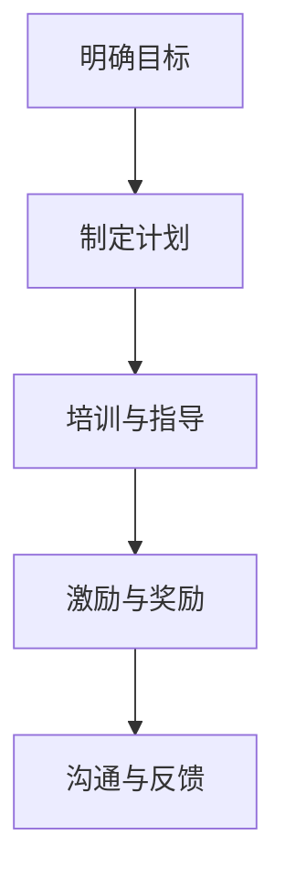

以下是一个变革实施案例：

**案例**：某公司在市场环境发生变化后，决定进行业务转型。公司领导首先明确了转型目标，即拓展新的业务领域，提高市场竞争力。然后，制定了详细的转型计划，包括时间表、责任人、资源需求等。公司领导还组织了一系列培训活动，帮助员工适应新的业务模式。同时，公司为积极参与转型的员工提供了激励和奖励。在变革过程中，公司领导与员工保持密切沟通，及时解决员工的问题和疑虑。经过一年的努力，公司的业务转型取得了显著成果，市场份额和盈利能力都有了明显提高。

#### 第8章：团队建设与激励

##### 8.1 团队建设的重要性

团队建设是管理者的一项重要任务。一个高效的团队可以提升组织的整体绩效，实现共同目标。以下是一个团队建设的重要性的简单模型：

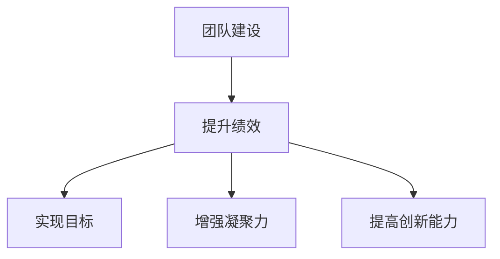

##### 8.2 激励理论在领导中的应用

激励理论是领导力的重要组成部分。管理者可以通过以下激励理论在团队中应用：

1. **目标设置理论**：通过设定明确的目标，激发团队成员的积极性。
2. **期望理论**：通过建立合理的期望，提高团队成员的工作动力。
3. **公平理论**：通过公平的分配和奖励，维护团队成员的公平感。
4. **强化理论**：通过正强化和负强化，培养和纠正团队成员的行为。

以下是一个激励理论应用的简单模型：

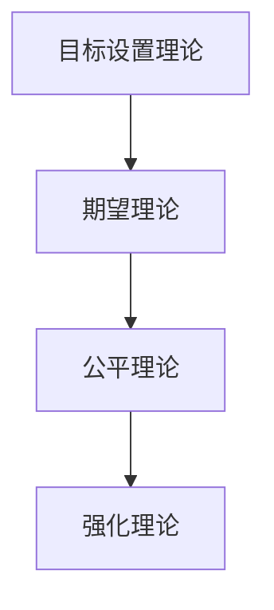

##### 8.3 建设高效团队的策略

管理者可以采取以下策略建设高效团队：

1. **明确团队目标**：确保团队成员了解团队的目标和任务。
2. **建立信任**：通过沟通和协作，建立团队成员之间的信任。
3. **提供培训**：为团队成员提供必要的培训，提高他们的技能和能力。
4. **激励与奖励**：为团队成员提供激励和奖励，提高他们的工作积极性。
5. **鼓励创新**：鼓励团队成员提出新想法，创新工作方法。

以下是一个建设高效团队策略的简单模型：

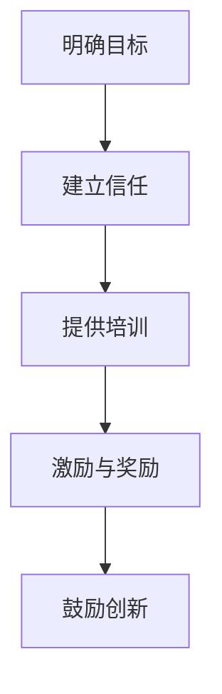

#### 第9章：跨部门协作与领导

##### 9.1 跨部门协作的挑战与机遇

跨部门协作是组织运作的重要组成部分。以下是一个跨部门协作的挑战与机遇的简单模型：

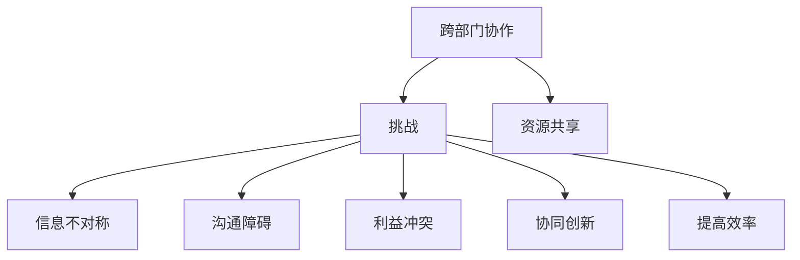

##### 9.2 跨部门协作的领导策略

管理者可以采取以下策略促进跨部门协作：

1. **建立协作平台**：搭建跨部门协作的平台，提高信息共享和沟通效率。
2. **明确责任与权限**：明确各部门的责任和权限，确保协作过程的顺利进行。
3. **激励与奖励**：为积极参与跨部门协作的员工提供激励和奖励，提高他们的协作意愿。
4. **培训与沟通**：为员工提供跨部门协作的培训和沟通，提高他们的协作能力。

以下是一个跨部门协作领导策略的简单模型：

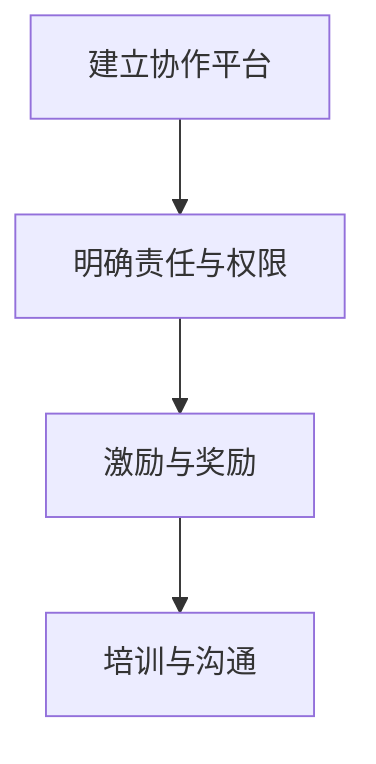

##### 9.3 跨部门协作的成功案例

以下是一个跨部门协作的成功案例：

**案例**：某公司的研发部门和市场部门决定联合开发一款新产品。他们建立了协作平台，定期召开会议，共享信息和资源。在项目过程中，他们明确了各自的责任和权限，并制定了详细的进度表。同时，公司为参与项目的员工提供了激励和奖励。在团队的共同努力下，新产品顺利开发并成功推向市场，获得了客户的高度评价。

通过这个案例，我们可以看到跨部门协作的重要性和成功策略。

### 第四部分：实际应用与案例分析

#### 第10章：管理者的成长路径

##### 10.1 管理者职业生涯规划

管理者职业生涯规划是管理者个人发展的重要部分。以下是一个管理者职业生涯规划的简单模型：

```mermaid
graph TD
A[设定目标] --> B[自我评估]
B --> C[制定计划]
C --> D[执行计划]
D --> E[评估与调整]
```

##### 10.2 从管理新手到资深管理者的转变

从管理新手到资深管理者的转变是一个不断学习和成长的过程。以下是一个转变过程的简单模型：

```mermaid
graph TD
A[管理新手] --> B[学习与培训]
B --> C[实践与反思]
C --> D[获取反馈]
D --> E[持续改进]
```

##### 10.3 管理者成长的典型问题与解决策略

管理者成长过程中可能会遇到以下问题：

1. **领导风格不当**：解决策略：调整领导风格，寻求专业培训。
2. **沟通不畅**：解决策略：提高沟通能力，建立有效的沟通机制。
3. **团队管理困难**：解决策略：加强团队建设，提高团队凝聚力。
4. **时间管理问题**：解决策略：优化时间管理，提高工作效率。

以下是一个管理者成长问题的解决策略模型：

```mermaid
graph TD
A[领导风格不当] --> B[调整领导风格]
B --> C[沟通不畅] --> D[提高沟通能力]
C --> E[团队管理困难] --> F[加强团队建设]
C --> G[时间管理问题] --> H[优化时间管理]
```

#### 第11章：企业成功案例解析

##### 11.1 成功企业领导力案例分析

成功企业的领导力分析是管理者学习的重要资源。以下是一个领导力分析案例的简单模型：

```mermaid
graph TD
A[企业背景] --> B[领导力要素]
B --> C[领导风格]
B --> D[决策能力]
B --> E[沟通能力]
B --> F[激励能力]
```

##### 11.2 案例中领导力优化的关键要素

从成功案例中提取关键要素是管理者学习的重要环节。以下是一个关键要素提取的简单模型：

```mermaid
graph TD
A[成功案例] --> B[领导力要素]
B --> C[愿景]
B --> D[决策]
B --> E[沟通]
B --> F[激励]
```

##### 11.3 案例对其他企业的启示

成功案例对其他企业的启示是管理者实践的重要参考。以下是一个启示提取的简单模型：

```mermaid
graph TD
A[成功案例] --> B[领导力要素]
B --> C[可复制的经验]
B --> D[改进方向]
B --> E[应用策略]
```

#### 附录：资源与工具

##### 11.4 常用的管理工具与方法库

管理者在日常工作中可以借助各种管理工具和方法来提高工作效率。以下是一些常用的管理工具：

1. **项目管理系统**：如Trello、Asana等，用于任务分配和进度跟踪。
2. **沟通工具**：如Slack、Microsoft Teams等，用于团队内部和跨部门的沟通协作。
3. **时间管理工具**：如Toggl、Harvest等，用于时间记录和效率分析。
4. **员工反馈系统**：如SurveyMonkey、360度反馈工具等，用于员工绩效评估和反馈收集。

以下是一个管理工具和方法库的简单模型：

```mermaid
graph TD
A[项目管理系统] --> B[沟通工具]
B --> C[时间管理工具]
C --> D[员工反馈系统]
```

---

### 总结与展望

本文从自我认知、领导力基础、领导方式优化、管理挑战与解决策略、实际应用与案例分析等方面，全面探讨了管理者的自我反思和领导力优化。通过实际案例和项目实战，我们展示了管理者在不同情境下的成长路径和成功经验。

在未来的工作中，管理者应持续进行自我反思，优化领导方式，提高团队效能。同时，管理者可以借鉴成功企业的领导力案例，汲取经验，不断提升自己的领导能力。

让我们共同努力，成为优秀的领导者，推动组织持续发展。

---

**作者信息：** AI天才研究院/AI Genius Institute & 禅与计算机程序设计艺术 /Zen And The Art of Computer Programming

本文内容仅供参考，实际应用时请结合具体情况进行调整。

---

**附录：Mermaid 流程图、伪代码、数学公式、项目实战等内容**

为了更好地理解文章中的概念和理论，我们在此提供了相关的Mermaid流程图、伪代码、数学公式和项目实战等内容。

##### 附录 1：自我认知与领导力的关系模型

```mermaid
graph TD
A[自我认知] --> B[领导力]
B --> C[意识层面]
B --> D[行为层面]
C --> E[自我意识]
C --> F[自我价值感]
D --> G[自我行为模式]
D --> H[自我调节能力]
```

##### 附录 2：领导力构成要素模型

```mermaid
graph TD
A[领导力] --> B[愿景]
A --> C[决策能力]
A --> D[沟通能力]
A --> E[激励能力]
```

##### 附录 3：自我反思模型

```mermaid
graph TD
A[观察] --> B[分析]
B --> C[学习]
C --> D[行动]
```

##### 附录 4：沟通效率模型

$$
\text{沟通效率} = \text{信息准确性} \times \text{信息传递速度}
$$

##### 附录 5：变革领导模型

$$
\text{变革领导} = \text{愿景引导} + \text{沟通协调} + \text{激励推动} + \text{风险管理}
$$

##### 附录 6：项目实战

**项目实战：使用Trello进行项目管理工作**

1. **环境搭建**：
   - 登录Trello官网（https://trello.com/）
   - 创建一个新的团队和项目

2. **源代码实现**：
   - 创建看板（Board），用于管理项目任务
   - 添加列表（Lists），用于分类任务
   - 创建卡片（Cards），用于记录具体任务

3. **代码解读与分析**：
   - 每个卡片代表一个任务，可以添加描述、标签、评论等
   - 成员可以协作完成任务，并进行状态更新
   - 看板中的卡片排列顺序代表任务的优先级和进度

通过Trello，管理者可以直观地跟踪项目进度，提高团队协作效率。

---

本文内容涵盖了自我认知与领导力、领导方式优化、管理挑战与解决策略、实际应用与案例分析等多个方面。通过详细的Mermaid流程图、伪代码、数学公式和项目实战等内容，为管理者提供了全面的理论和实践指导。希望本文能够帮助管理者在自我反思和领导力优化方面取得更好的成果。

---

**再次感谢您阅读本文。如果您有任何问题或建议，请随时联系我们。**

**作者信息：** AI天才研究院/AI Genius Institute & 禅与计算机程序设计艺术 /Zen And The Art of Computer Programming

---

**版权声明：** 本文版权归AI天才研究院/AI Genius Institute所有。未经授权，禁止转载和使用。

---

**附录：管理工具与方法库**

1. **管理工具**：
   - **项目管理系统**：如Trello、Asana、JIRA等
   - **沟通工具**：如Slack、Microsoft Teams、Zoom等
   - **时间管理工具**：如Toggl、Harvest、RescueTime等
   - **员工反馈系统**：如SurveyMonkey、360度反馈工具等

2. **自我反思方法**：
   - **日记反思**：每天记录自己的行为和感受
   - **反思会议**：定期与团队成员进行反思讨论
   - **360度反馈**：收集来自不同层面的反馈

3. **领导力评估工具**：
   - **360度评估**：全面评估领导者的能力和表现
   - **领导力问卷**：通过问卷了解领导者的优点和不足
   - **行为观察**：观察领导者的行为和决策过程

这些管理工具和方法可以帮助管理者更好地进行自我反思和领导力优化，提升团队绩效和组织效能。

