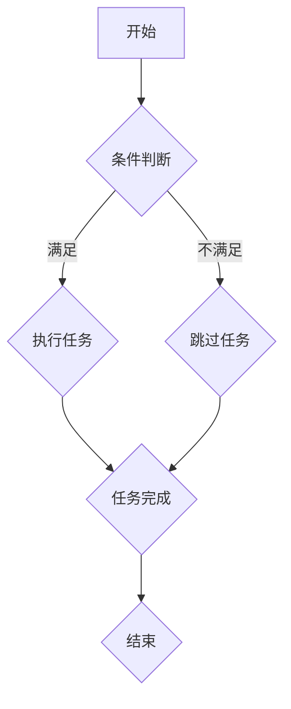

                 

### 《结构化思维：理解世界的钥匙》

> **关键词：** 结构化思维、逻辑分析、决策制定、项目管理、沟通协作、创新思维

> **摘要：** 本文章旨在探讨结构化思维在理解世界中的关键作用。通过详细分析结构化思维的基础、工具方法、应用场景以及进阶技巧，本文帮助读者掌握结构化思维的方法论，提高决策效率与沟通效果，最终实现个人和组织的成功。

### 《结构化思维：理解世界的钥匙》目录大纲

#### 第一部分：结构化思维的基石

##### 第1章：结构化思维概述

###### 1.1 结构化思维的重要性

###### 1.2 结构化思维的基本原则

###### 1.3 结构化思维与逻辑思维的关系

##### 第2章：结构化思维的工具与方法

###### 2.1 SWOT分析

###### 2.2 SMART目标设定

###### 2.3 5W1H分析法

##### 第3章：结构化思维在解决问题中的应用

###### 3.1 问题诊断

###### 3.2 解决方案设计

###### 3.3 决策分析

##### 第4章：结构化思维在项目管理中的应用

###### 4.1 项目计划

###### 4.2 项目监控与控制

###### 4.3 项目风险管理

##### 第5章：结构化思维在沟通协作中的应用

###### 5.1 沟通障碍与解决方法

###### 5.2 协作策略

##### 第6章：结构化思维在决策制定中的应用

###### 6.1 决策制定的步骤

###### 6.2 决策制定的误区

###### 6.3 决策制定案例分析

##### 第7章：结构化思维的实践与应用

###### 7.1 结构化思维的实践步骤

###### 7.2 结构化思维的应用领域

###### 7.3 结构化思维的实践案例

#### 第二部分：深化结构化思维

##### 第8章：结构化思维的进阶技巧

###### 8.1 提升思维效率的方法

###### 8.2 创新思维培养

###### 8.3 结构化思维与心理学

##### 第9章：结构化思维的实战演练

###### 9.1 演练目标与步骤

###### 9.2 演练案例

##### 第10章：结构化思维的实践反思

###### 10.1 实践反思的意义

###### 10.2 实践反思的步骤

###### 10.3 实践反思案例

### 附录

#### 附录A：结构化思维工具资源

#### 附录B：Mermaid流程图示例

#### 附录C：伪代码示例

#### 附录D：数学模型与公式

#### 附录E：项目实战案例

#### 附录F：开发环境搭建与代码解读

#### 附录G：代码解读与分析

现在，我们将开始撰写文章的正文部分，详细探讨结构化思维的各个层面和应用。首先，从结构化思维的基础概念入手。

---

## 第一部分：结构化思维的基石

### 第1章：结构化思维概述

#### 1.1 结构化思维的重要性

结构化思维是一种系统性、逻辑性的思考方式，通过将复杂的信息和问题分解为简明扼要的结构，从而提高理解、分析和解决能力。在信息爆炸和竞争激烈的现代社会，结构化思维显得尤为重要。

首先，结构化思维有助于提升我们的认知能力。它将零散的信息组织成有条理的框架，使得我们能够更清晰地理解事物之间的关联，从而更好地把握问题的核心。

其次，结构化思维有助于提高我们的决策效率。通过系统性地分析问题，我们可以更全面地评估各种因素，从而做出更加科学合理的决策。

最后，结构化思维有助于改善我们的沟通效果。清晰的结构和逻辑使得我们的观点更加有条理，更容易被他人理解和接受。

#### 1.2 结构化思维的基本原则

结构化思维遵循以下基本原则：

1. **明确目标**：在开始分析问题之前，首先要明确目标，以便在整个过程中保持方向的一致性。
2. **分解问题**：将复杂的问题分解为更小的、易于管理的部分，从而简化问题的复杂度。
3. **逻辑性**：分析问题时，要遵循逻辑推理的原则，确保每一步都有充分的依据。
4. **系统性**：将各个部分整合成一个整体，确保各部分之间的协调和一致性。

#### 1.3 结构化思维与逻辑思维的关系

结构化思维与逻辑思维密不可分。逻辑思维是结构化思维的基础，而结构化思维则是对逻辑思维的进一步应用。逻辑思维关注的是推理的正确性，而结构化思维则关注于如何有效地组织和表达这些逻辑推理。

具体来说，结构化思维通过以下方式运用逻辑思维：

1. **明确前提条件**：在分析问题时，首先要明确问题的前提条件，这是逻辑推理的基础。
2. **构建逻辑链条**：通过逻辑推理，将前提条件与结论联系起来，形成一个完整的逻辑链条。
3. **验证逻辑链条**：通过反向推理和交叉验证，确保逻辑链条的严密性和正确性。

### 第2章：结构化思维的工具与方法

#### 2.1 SWOT分析

SWOT分析是一种常用的战略规划工具，通过分析企业的优势（Strengths）、劣势（Weaknesses）、机会（Opportunities）和威胁（Threats），帮助企业制定发展战略。

##### 2.1.1 SWOT分析的定义与用途

SWOT分析的定义如下：

- **优势（Strengths）**：企业内部具有的优势和资源。
- **劣势（Weaknesses）**：企业内部存在的不足和缺陷。
- **机会（Opportunities）**：外部环境中出现的有利条件。
- **威胁（Threats）**：外部环境中出现的潜在威胁。

SWOT分析的用途包括：

- **战略规划**：帮助企业制定中长期发展战略。
- **资源配置**：优化内部资源，发挥优势，弥补劣势。
- **市场分析**：分析市场机会和威胁，调整市场策略。

##### 2.1.2 SWOT分析的步骤

进行SWOT分析的步骤如下：

1. **明确分析目标**：确定分析的具体目标和范围。
2. **收集信息**：收集与企业相关的内外部信息。
3. **分析优势与劣势**：分析企业内部的优势和劣势。
4. **分析机会与威胁**：分析外部环境中的机会和威胁。
5. **制定策略**：根据分析结果，制定相应的策略。

##### 2.1.3 SWOT分析案例

以下是一个简化的SWOT分析案例：

- **优势**：拥有一支经验丰富的研发团队，产品技术领先。
- **劣势**：市场营销能力不足，品牌知名度较低。
- **机会**：新兴市场潜力巨大，行业竞争格局尚未稳定。
- **威胁**：技术更新迭代快，竞争对手不断涌现。

根据以上分析结果，企业可以制定以下策略：

- **发挥优势**：加大研发投入，巩固技术优势。
- **改善劣势**：加强市场营销，提升品牌知名度。
- **抓住机会**：开拓新兴市场，扩大市场份额。
- **应对威胁**：加快技术更新，保持竞争力。

#### 2.2 SMART目标设定

SMART目标设定是一种目标管理方法，通过设定具体、可衡量、可实现、相关性强、时限性的目标，帮助个人和组织更高效地达成目标。

##### 2.2.1 SMART目标的定义

SMART目标是指具有以下五个特点的目标：

- **具体（Specific）**：目标要明确具体，便于衡量和执行。
- **可衡量（Measurable）**：目标要有明确的衡量标准，便于评估进度和效果。
- **可实现（Achievable）**：目标要具有可行性，符合现实条件。
- **相关性强（Relevant）**：目标要与整体战略和愿景相关。
- **时限性（Time-bound）**：目标要有明确的时间限制，确保按时完成。

##### 2.2.2 SMART目标设定步骤

设定SMART目标的步骤如下：

1. **明确目标**：确定目标的具体内容和期望结果。
2. **具体化目标**：将目标细化，使其具有明确性。
3. **衡量目标**：设定衡量目标的标准和指标。
4. **评估目标**：评估目标的可实现性，确保目标具有可行性。
5. **相关性与时限性**：确保目标与整体战略相关，并设定时间限制。

##### 2.2.3 SMART目标案例

以下是一个个人发展目标的SMART设定案例：

- **明确目标**：提升个人技术能力。
- **具体化目标**：学习并掌握Python编程语言。
- **衡量目标**：完成Python基础教程的学习，通过Python基础考试。
- **评估目标**：我有足够的时间进行学习，并且具备学习编程的基础知识。
- **时限性**：2023年底前完成学习任务。

#### 2.3 5W1H分析法

5W1H分析法是一种常用的系统分析方法，通过回答以下问题，帮助深入理解问题：

- **What**：是什么？描述问题的核心内容。
- **Why**：为什么？分析问题的原因和背景。
- **Who**：谁？涉及的人员和利益相关方。
- **When**：何时？问题发生的时间节点。
- **Where**：何地？问题发生的地点。
- **How**：如何？解决问题的方法和步骤。

##### 2.3.1 5W1H分析法的定义

5W1H分析法的定义如下：

- **What**：明确问题的核心内容。
- **Why**：分析问题的原因和背景。
- **Who**：识别涉及的人员和利益相关方。
- **When**：确定问题发生的时间节点。
- **Where**：识别问题发生的地点。
- **How**：制定解决问题的方法和步骤。

##### 2.3.2 5W1H分析法的步骤

进行5W1H分析的步骤如下：

1. **明确问题**：确定需要分析的问题。
2. **分解问题**：将问题分解为5W1H的各个部分。
3. **收集信息**：收集与每个部分相关的基础信息。
4. **整合信息**：将收集到的信息整合成一个完整的分析框架。
5. **提出解决方案**：根据分析结果，提出解决问题的方案。

##### 2.3.3 5W1H分析案例

以下是一个企业项目问题分析的5W1H分析案例：

- **What**：项目进度严重滞后。
- **Why**：项目管理不善，资源配置不合理。
- **Who**：项目经理、项目团队成员、利益相关方。
- **When**：项目启动以来，特别是在关键节点时间。
- **Where**：项目实施过程中，特别是项目关键部分。
- **How**：优化项目管理流程，合理配置资源，加强团队协作。

根据5W1H分析结果，企业可以制定以下解决方案：

- **具体措施**：重新制定项目管理计划，调整项目团队，优化资源配置，加强团队协作。

### 第3章：结构化思维在解决问题中的应用

#### 3.1 问题诊断

问题诊断是结构化思维在解决问题中的第一步，通过对问题的深入了解和分析，找出问题的根本原因。

##### 3.1.1 问题诊断的方法

问题诊断的方法主要包括以下几种：

1. **问卷调查**：通过设计问卷，收集相关人员对问题的看法和建议。
2. **访谈**：与相关人员进行一对一的深入访谈，了解他们的观点和意见。
3. **观察**：在现场观察问题发生的具体情况，了解问题的真实面貌。
4. **数据分析**：通过数据分析和统计方法，找出问题的规律和趋势。

##### 3.1.2 问题诊断的步骤

进行问题诊断的步骤如下：

1. **确定诊断目标**：明确诊断的目标和范围，确保诊断过程有的放矢。
2. **收集信息**：通过问卷调查、访谈、观察等方式，收集与问题相关的信息。
3. **整理信息**：对收集到的信息进行整理和分类，确保信息的准确性和完整性。
4. **分析问题**：运用结构化思维的方法，分析问题的根本原因和关键因素。
5. **提出解决方案**：根据分析结果，提出解决问题的方案和措施。

##### 3.1.3 问题诊断案例

以下是一个企业员工流失问题诊断的案例：

1. **确定诊断目标**：找出导致员工流失的主要原因。
2. **收集信息**：通过问卷调查、访谈、观察等方式，收集员工流失的相关信息，如员工离职原因、员工满意度调查等。
3. **整理信息**：对收集到的信息进行整理，发现员工流失的主要原因是工作压力过大、薪酬待遇不合理、晋升机会不足等。
4. **分析问题**：运用结构化思维的方法，分析导致员工流失的根本原因，如企业文化和员工关怀不足等。
5. **提出解决方案**：根据分析结果，提出以下解决方案：

   - **改善企业文化**：加强员工关怀，提高员工满意度。
   - **优化薪酬待遇**：提高薪酬水平，合理调整薪酬结构。
   - **提供晋升机会**：建立科学的晋升机制，激励员工发展。

通过以上解决方案的实施，企业的员工流失问题得到了有效改善。

#### 3.2 解决方案设计

解决方案设计是在问题诊断的基础上，提出解决问题的具体方案和步骤。

##### 3.2.1 解决方案设计的方法

解决方案设计的方法主要包括以下几种：

1. **头脑风暴**：通过集体讨论，激发创意，提出多种解决方案。
2. **SWOT分析**：结合优势、劣势、机会和威胁，分析各种方案的优缺点。
3. **成本效益分析**：评估各种方案的成本和收益，选择性价比最高的方案。
4. **可行性分析**：评估各种方案的实施难度和可行性，确保方案具有可操作性。

##### 3.2.2 解决方案设计的步骤

进行解决方案设计的步骤如下：

1. **明确问题**：明确需要解决的问题和目标。
2. **收集信息**：收集与问题相关的信息，如背景资料、现状分析等。
3. **提出方案**：通过头脑风暴、SWOT分析等方法，提出多种解决方案。
4. **评估方案**：对各种方案进行成本效益分析和可行性分析，评估方案的优缺点。
5. **选择方案**：根据评估结果，选择最优的解决方案。
6. **细化方案**：对选定的方案进行细化，明确具体的实施步骤和责任人。

##### 3.2.3 解决方案设计案例

以下是一个企业营销策略解决方案设计的案例：

1. **明确问题**：提高产品在市场中的知名度和销售额。
2. **收集信息**：了解市场环境、竞争对手情况、消费者需求等。
3. **提出方案**：

   - **方案1**：加大广告投放，提升品牌知名度。
   - **方案2**：开展促销活动，吸引消费者购买。
   - **方案3**：优化产品品质，提高消费者满意度。

4. **评估方案**：

   - **方案1**：成本较高，但效果持久。
   - **方案2**：成本适中，但效果短暂。
   - **方案3**：成本较低，但效果显著。

5. **选择方案**：综合评估，选择方案3：优化产品品质，提高消费者满意度。

6. **细化方案**：

   - **实施步骤**：1）改进生产工艺；2）加强品质控制；3）收集消费者反馈，持续优化产品。

通过以上解决方案的实施，企业的产品品质得到了显著提升，消费者满意度提高，销售额稳步增长。

#### 3.3 决策分析

决策分析是在问题诊断和解决方案设计的基础上，对各种方案进行评估和选择，以实现最佳决策。

##### 3.3.1 决策分析的方法

决策分析的方法主要包括以下几种：

1. **成本效益分析**：比较各种方案的收益和成本，选择性价比最高的方案。
2. **风险评估**：评估各种方案可能带来的风险和损失，选择风险最小的方案。
3. **优先级排序**：根据重要性和紧急性，对各种方案进行优先级排序，优先选择重要性高、紧急性强的方案。
4. **专家评估**：邀请相关领域的专家对各种方案进行评估，选择最可靠的方案。

##### 3.3.2 决策分析的步骤

进行决策分析的步骤如下：

1. **明确决策目标**：明确需要决策的具体目标和要求。
2. **收集信息**：收集与决策相关的信息，如市场数据、技术可行性、成本效益等。
3. **提出备选方案**：根据收集到的信息，提出多种备选方案。
4. **评估备选方案**：对各种方案进行成本效益分析、风险评估、优先级排序等。
5. **选择最佳方案**：根据评估结果，选择最佳方案。
6. **制定实施计划**：明确方案的实施步骤、责任人、时间节点等。

##### 3.3.3 决策分析案例

以下是一个企业新产品上市的决策分析案例：

1. **明确决策目标**：提高新产品在市场上的竞争力，实现盈利目标。
2. **收集信息**：

   - **市场数据**：了解目标市场的需求、竞争对手情况等。
   - **技术可行性**：评估新产品的技术实现难度和成本。
   - **成本效益**：计算新产品的预期收益和成本。

3. **提出备选方案**：

   - **方案1**：加大广告投放，提高品牌知名度。
   - **方案2**：开展促销活动，吸引消费者购买。
   - **方案3**：优化产品品质，提高消费者满意度。

4. **评估备选方案**：

   - **方案1**：成本较高，但效果显著。
   - **方案2**：成本适中，但效果短暂。
   - **方案3**：成本较低，但效果持久。

5. **选择最佳方案**：综合评估，选择方案3：优化产品品质，提高消费者满意度。

6. **制定实施计划**：

   - **实施步骤**：1）改进生产工艺；2）加强品质控制；3）收集消费者反馈，持续优化产品。
   - **责任人**：研发团队、市场部、质量检验部。
   - **时间节点**：1个月内完成产品优化，2个月内完成市场推广。

通过以上决策分析，企业选择了最佳方案，并制定了详细的实施计划，确保新产品在市场上取得成功。

### 第4章：结构化思维在项目管理中的应用

#### 4.1 项目计划

项目计划是项目管理的重要组成部分，它通过对项目的目标和任务进行详细规划和安排，确保项目能够按期、高质量地完成。

##### 4.1.1 项目计划的方法

项目计划的方法主要包括以下几种：

1. **工作分解结构（WBS）**：将项目目标分解为更小、更具体的任务，形成层次分明的任务结构。
2. **甘特图**：用图形方式展示项目的进度和时间安排，便于项目管理和监控。
3. **网络图**：用节点和箭线表示任务之间的关系，分析任务的依赖性和顺序。
4. **成本估算**：对项目成本进行详细估算，确保项目预算的合理性和可行性。

##### 4.1.2 项目计划的步骤

进行项目计划的步骤如下：

1. **明确项目目标**：确定项目的具体目标和预期成果。
2. **收集信息**：收集与项目相关的信息，如需求文档、技术规格等。
3. **分解任务**：将项目目标分解为具体的任务，形成工作分解结构。
4. **制定进度计划**：根据任务分解和资源情况，制定项目的进度计划。
5. **成本估算**：对项目的各项成本进行估算，确保预算的合理性。
6. **风险管理**：识别项目风险，制定相应的风险应对措施。
7. **制定项目计划文档**：将以上内容整合成项目计划文档，提交审批。

##### 4.1.3 项目计划案例

以下是一个软件开发项目计划案例：

1. **明确项目目标**：开发一款具有市场竞争力的高品质软件，满足用户需求。
2. **收集信息**：收集需求文档、技术规格、市场调研报告等。
3. **分解任务**：将项目目标分解为以下任务：

   - **需求分析**
   - **系统设计**
   - **编码实现**
   - **测试与调试**
   - **用户培训与支持**

4. **制定进度计划**：根据任务分解，制定项目的进度计划：

   - **需求分析**：1周
   - **系统设计**：2周
   - **编码实现**：4周
   - **测试与调试**：2周
   - **用户培训与支持**：1周

5. **成本估算**：根据任务分解和资源需求，估算项目成本：

   - **人力成本**：50万元
   - **设备成本**：20万元
   - **其他成本**：10万元

6. **风险管理**：识别项目风险，如需求变更、技术难题、时间延误等，制定相应的风险应对措施。

7. **制定项目计划文档**：将以上内容整合成项目计划文档，提交审批。

通过以上步骤，企业可以制定出详细、合理的项目计划，确保项目按期、高质量地完成。

#### 4.2 项目监控与控制

项目监控与控制是项目管理中的关键环节，通过对项目的实际进度、成本和质量进行监控和调整，确保项目目标的实现。

##### 4.2.1 项目监控的方法

项目监控的方法主要包括以下几种：

1. **进度监控**：定期收集项目的进度数据，与计划进度进行对比，分析进度偏差的原因。
2. **成本监控**：定期分析项目的实际成本支出，与预算进行对比，评估成本控制情况。
3. **质量监控**：对项目的输出成果进行质量检查，确保项目符合质量要求。
4. **变更管理**：监控项目的变更请求，评估变更对项目目标的影响，确保变更的合理性和可行性。

##### 4.2.2 项目控制的步骤

进行项目控制的步骤如下：

1. **建立监控机制**：制定项目监控计划，明确监控内容和监控周期。
2. **收集监控数据**：定期收集项目的进度、成本、质量等相关数据。
3. **分析监控数据**：对比监控数据与计划数据，分析偏差原因，评估项目风险。
4. **制定调整措施**：根据监控结果，制定相应的调整措施，如调整进度计划、成本预算、质量标准等。
5. **实施调整措施**：执行调整措施，确保项目目标的实现。

##### 4.2.3 项目监控与控制案例

以下是一个软件开发项目监控与控制案例：

1. **建立监控机制**：

   - **进度监控**：每周一收集上周的进度数据，与计划进度进行对比。
   - **成本监控**：每月底收集当月的成本支出数据，与预算进行对比。
   - **质量监控**：每两周进行一次质量检查，评估项目的质量状况。

2. **收集监控数据**：

   - **进度数据**：需求分析已完成70%，系统设计已完成40%，编码实现已完成20%。
   - **成本数据**：人力成本支出30万元，设备成本支出10万元。
   - **质量数据**：测试通过率90%。

3. **分析监控数据**：

   - **进度偏差**：编码实现进度滞后，需要加强团队协作，确保按时完成。
   - **成本控制**：设备成本支出超出预算，需要重新评估设备采购计划。
   - **质量状况**：测试通过率较高，但仍有改进空间，需加强质量管理和控制。

4. **制定调整措施**：

   - **进度调整**：调整编码实现的时间安排，增加团队人力投入。
   - **成本调整**：优化设备采购计划，降低设备成本。
   - **质量调整**：加强质量培训，提高测试覆盖率，确保项目质量。

5. **实施调整措施**：

   - **进度调整**：安排额外的人力资源，加强团队沟通与协作。
   - **成本调整**：调整设备采购计划，优先采购关键设备。
   - **质量调整**：开展质量培训和测试，提高项目质量。

通过以上监控与控制措施，企业可以确保软件开发项目按计划、高质量地完成。

#### 4.3 项目风险管理

项目风险管理是项目管理中的重要环节，通过对项目风险进行识别、评估和应对，确保项目目标的实现。

##### 4.3.1 项目风险识别

项目风险识别是项目风险管理的第一步，主要是识别项目可能面临的各种风险。

##### 4.3.2 项目风险评估

项目风险评估是对识别出的风险进行定量或定性评估，以确定风险的重要性和可能的影响。

##### 4.3.3 项目风险应对

项目风险应对是根据风险评估的结果，制定相应的应对策略，以减轻风险的影响或避免风险的发生。

##### 4.3.4 项目风险管理案例

以下是一个软件项目风险管理案例：

1. **项目风险识别**：

   - **需求变更风险**：客户需求可能发生变化，导致项目延期。
   - **技术风险**：项目关键技术可能存在不确定性，影响项目进度和质量。
   - **成本超支风险**：项目成本可能超出预算，导致资金紧张。
   - **人员流失风险**：项目团队成员可能流失，影响项目进度和质量。

2. **项目风险评估**：

   - **需求变更风险**：可能性高，影响大。
   - **技术风险**：可能性高，影响大。
   - **成本超支风险**：可能性中等，影响较大。
   - **人员流失风险**：可能性中等，影响较大。

3. **项目风险应对**：

   - **需求变更风险**：建立需求变更管理机制，及时沟通和确认变更。
   - **技术风险**：开展技术评估和预研，确保关键技术可行性。
   - **成本超支风险**：制定成本控制措施，定期监控成本支出。
   - **人员流失风险**：加强团队建设，提高员工满意度和稳定性。

通过以上风险管理和应对措施，企业可以有效降低项目风险，确保项目目标的实现。

### 第5章：结构化思维在沟通协作中的应用

#### 5.1 沟通障碍与解决方法

在沟通协作过程中，沟通障碍是影响团队效率和项目进展的常见问题。有效的沟通障碍解决方法有助于提升团队协作效果和项目成功。

##### 5.1.1 沟通障碍的类型

沟通障碍主要包括以下几种类型：

1. **信息传递障碍**：信息在传递过程中可能失真或误解，导致信息接收者无法准确理解信息内容。
2. **语言障碍**：语言表达不准确或不清晰，导致沟通双方无法有效交流。
3. **文化差异障碍**：不同文化背景的团队成员在沟通中可能存在理解差异，影响沟通效果。
4. **心理障碍**：团队成员的心理状态，如焦虑、紧张、抵触等，可能影响沟通的积极性。

##### 5.1.2 沟通障碍的原因

沟通障碍产生的原因主要包括：

1. **信息不对称**：团队成员对项目信息的了解程度不一致，导致信息传递失真。
2. **沟通渠道不畅**：沟通渠道选择不当或沟通方式不合适，导致信息传递不畅。
3. **沟通频率不足**：团队成员之间的沟通频率不足，导致信息传递不及时。
4. **沟通氛围不佳**：团队内部沟通氛围紧张或压抑，影响沟通的积极性。

##### 5.1.3 解决沟通障碍的方法

解决沟通障碍的方法主要包括：

1. **建立沟通机制**：制定明确的沟通计划，确保团队成员之间定期进行沟通。
2. **优化沟通渠道**：选择合适的沟通工具和平台，确保信息传递的及时性和准确性。
3. **提高语言表达能力**：加强团队成员的语言表达能力培训，提高沟通效果。
4. **增进文化理解**：促进团队成员之间的文化交流，增进对彼此文化的理解。
5. **改善沟通氛围**：营造积极、开放的沟通氛围，鼓励团队成员积极参与沟通。

#### 5.2 协作策略

协作策略是提升团队协作效率的关键。合理的协作策略有助于团队成员明确职责，优化协作流程，提高项目进展速度和质量。

##### 5.2.1 协作模式的选择

选择合适的协作模式是协作策略的第一步。常见的协作模式包括：

1. **集中式协作**：团队成员集中在一个办公地点，便于即时沟通和协作。
2. **分布式协作**：团队成员分布在不同的办公地点，通过远程协作工具进行沟通和协作。
3. **混合式协作**：结合集中式和分布式协作，根据项目特点和团队成员分布情况进行调整。

##### 5.2.2 协作流程的设计

设计合理的协作流程有助于提高团队协作效率和项目进展速度。协作流程设计主要包括以下步骤：

1. **明确项目目标**：确保团队成员对项目目标有清晰的认识，明确各自的责任和任务。
2. **分工与协作**：根据团队成员的特长和项目需求，明确分工和协作关系。
3. **建立沟通机制**：制定沟通计划，确保团队成员之间定期进行沟通和协作。
4. **制定进度计划**：根据项目目标和任务分工，制定合理的进度计划。
5. **监控与调整**：定期监控项目进度和协作效果，及时调整协作策略和流程。

##### 5.2.3 协作案例分析

以下是一个软件开发项目的协作案例分析：

1. **明确项目目标**：开发一款具有市场竞争力的高品质软件，满足用户需求。
2. **分工与协作**：

   - **项目经理**：负责项目整体协调和管理。
   - **需求分析师**：负责需求分析和需求管理。
   - **系统设计师**：负责系统设计和架构设计。
   - **程序员**：负责编码实现。
   - **测试员**：负责测试与调试。
   - **UI设计师**：负责用户界面设计。

3. **建立沟通机制**：

   - **每日站会**：团队成员每日进行站会，汇报工作进展和遇到的问题。
   - **每周例会**：项目团队每周进行例会，总结本周工作进展，讨论项目问题和解决方案。
   - **邮件和即时通讯工具**：用于非正式沟通和任务分配。

4. **制定进度计划**：

   - **需求分析**：1周
   - **系统设计**：2周
   - **编码实现**：4周
   - **测试与调试**：2周
   - **用户培训与支持**：1周

5. **监控与调整**：

   - **每周监控项目进度，与计划进度进行对比，分析偏差原因。
   - **每月进行成本监控，确保项目预算的合理性。
   - **定期评估项目质量，确保项目输出符合质量要求。

通过以上协作策略的实施，团队在软件开发项目中取得了良好的协作效果，项目按时高质量完成。

### 第6章：结构化思维在决策制定中的应用

#### 6.1 决策制定的步骤

决策制定是一个复杂的过程，包括多个步骤，每个步骤都有其独特的挑战和关键点。以下是一个典型的决策制定步骤：

1. **明确决策目标**：明确决策的目的和预期结果，确保决策与组织的整体目标一致。
2. **收集信息**：搜集与决策相关的各种信息，包括数据、事实、观点等，确保信息的准确性和完整性。
3. **制定备选方案**：基于收集到的信息，制定多个备选方案，每个方案都要有明确的实施步骤和预期结果。
4. **评估备选方案**：对每个备选方案进行详细评估，考虑其可行性、成本效益、风险等因素，选择最佳方案。
5. **选择最佳方案**：综合考虑评估结果，选择最佳方案进行实施。
6. **制定实施计划**：明确实施步骤、责任人、时间节点等，确保决策能够顺利执行。
7. **监控与调整**：在决策实施过程中，持续监控实施效果，及时调整计划和策略，确保决策目标的实现。

#### 6.2 决策制定的误区

尽管决策制定是一个系统的过程，但在实际操作中，人们常常会陷入一些误区，导致决策失败。以下是一些常见的决策误区：

1. **信息不足**：在决策过程中，缺乏足够的信息可能会导致判断失误。决策者应该确保收集到全面、准确的信息，避免因信息不足而做出错误决策。
2. **过度依赖经验**：依赖过去的经验和直觉来做决策，可能会忽视新的情况和变化。虽然经验是宝贵的，但决策者应该结合实际情况，灵活运用经验。
3. **群体思维**：在团队决策中，为了避免冲突或保持一致，团队成员可能会盲目跟从多数意见，导致决策缺乏独立性和创新性。决策者应该鼓励团队成员提出不同的观点，进行充分讨论。
4. **情感影响**：个人的情感和情绪可能会影响决策的客观性。决策者应该保持冷静，客观分析问题，避免因情感因素而做出非理性的决策。
5. **忽视风险**：在评估备选方案时，决策者可能会忽视潜在的风险，导致决策的实施过程中出现意外。决策者应该进行全面的风险评估，制定相应的风险应对策略。

#### 6.3 决策制定案例分析

以下是一个企业新产品上市的决策制定案例：

1. **明确决策目标**：决定新产品的市场推广策略，以最大化市场份额和利润。
2. **收集信息**：

   - **市场调研报告**：了解目标市场的需求、竞争对手情况、消费者偏好等。
   - **销售数据**：分析历史销售数据，了解产品的销售趋势和潜在市场。
   - **成本分析**：计算新产品的生产成本、广告投放成本、营销费用等。
   - **专家意见**：咨询行业专家和市场分析师，获取专业的市场判断和建议。

3. **制定备选方案**：

   - **方案1**：大规模广告投放，提升品牌知名度，吸引消费者购买。
   - **方案2**：开展促销活动，提供折扣优惠，刺激消费者购买。
   - **方案3**：优化产品品质，提高消费者满意度，通过口碑传播增加销量。

4. **评估备选方案**：

   - **方案1**：成本较高，但能快速提升品牌知名度，有助于提高市场占有率。
   - **方案2**：成本适中，能有效刺激消费者购买，但效果可能不如广告投放持久。
   - **方案3**：成本较低，但效果较为缓慢，需要较长时间才能看到明显效果。

5. **选择最佳方案**：综合考虑评估结果，选择方案1：大规模广告投放，提升品牌知名度。

6. **制定实施计划**：

   - **实施步骤**：1）制定广告投放计划；2）准备广告素材；3）安排广告投放；4）监测广告效果。
   - **责任人**：市场部负责广告投放计划的制定和实施，销售部负责监测广告效果和销售情况。
   - **时间节点**：1个月内完成广告投放，2个月内评估广告效果。

7. **监控与调整**：在广告投放过程中，定期监测广告效果和销售数据，根据实际情况及时调整广告策略和推广计划。

通过以上步骤，企业成功地制定并实施了新产品上市策略，新产品在市场上取得了良好的销售业绩。

### 第7章：结构化思维的实践与应用

#### 7.1 结构化思维的实践步骤

结构化思维的实践是一个系统化的过程，涉及多个步骤。以下是结构化思维实践的基本步骤：

1. **明确实践目标**：确定实践的目标和期望结果，确保实践的方向正确。
2. **制定实践计划**：根据实践目标，制定详细的实践计划，包括具体步骤、时间节点和责任人。
3. **收集信息**：搜集与实践目标相关的信息，确保信息的全面性和准确性。
4. **分析信息**：对收集到的信息进行整理和分析，找出关键因素和关键问题。
5. **制定解决方案**：根据分析结果，制定具体的解决方案和实施步骤。
6. **实施解决方案**：按照制定的方案和步骤，实施具体的行动。
7. **监控与调整**：在实施过程中，持续监控实施效果，根据实际情况及时调整方案和策略。
8. **总结与反思**：实践结束后，对实践过程和结果进行总结和反思，提炼经验和教训。

#### 7.2 结构化思维的应用领域

结构化思维的应用领域非常广泛，几乎涵盖了所有需要分析和决策的场合。以下是一些主要的应用领域：

1. **项目管理**：结构化思维在项目管理中起着至关重要的作用，可以帮助项目经理制定项目计划、监控项目进度、管理项目风险等。
2. **决策制定**：结构化思维在决策制定过程中可以帮助决策者收集信息、分析选项、评估风险，从而做出更加科学合理的决策。
3. **问题解决**：在遇到问题时，结构化思维可以帮助分析问题的根本原因，制定有效的解决方案。
4. **沟通协作**：结构化思维可以提高沟通效率，确保团队成员之间信息传递准确无误，促进协作顺利进行。
5. **产品开发**：在产品开发过程中，结构化思维可以帮助产品经理梳理需求、制定产品规划、优化产品设计。
6. **市场营销**：在市场营销中，结构化思维可以帮助分析市场环境、评估营销策略、优化营销方案。
7. **人力资源**：在人力资源管理中，结构化思维可以帮助制定招聘策略、员工培训计划、绩效评估体系等。

#### 7.3 结构化思维的实践案例

以下是一个企业战略规划的结构化思维实践案例：

1. **明确实践目标**：制定企业未来三年的发展战略，确保企业持续增长和竞争力提升。
2. **制定实践计划**：

   - **第一阶段**：收集企业内外部信息，分析市场环境和竞争对手。
   - **第二阶段**：制定战略目标和关键业务领域。
   - **第三阶段**：制定具体的实施步骤和行动计划。
   - **第四阶段**：制定战略监控和调整机制。

3. **收集信息**：

   - **市场调研报告**：了解目标市场的需求、趋势和竞争态势。
   - **企业内部报告**：分析企业财务状况、运营绩效、核心竞争力等。
   - **行业报告**：了解行业发展趋势、政策环境、技术进步等。

4. **分析信息**：

   - **市场环境分析**：识别市场机会和威胁。
   - **企业内部分析**：找出企业的优势和劣势。
   - **竞争态势分析**：分析竞争对手的优势和劣势。

5. **制定解决方案**：

   - **战略目标**：实现市场份额翻倍，提升品牌知名度。
   - **关键业务领域**：产品创新、市场营销、客户服务。
   - **实施步骤**：1）加强产品研发，推出具有竞争力的新产品；2）加大市场营销力度，提升品牌知名度；3）优化客户服务，提高客户满意度。

6. **实施解决方案**：

   - **实施团队**：成立战略实施小组，负责制定和执行行动计划。
   - **时间节点**：1年内完成新产品研发，2年内完成市场营销策略实施，3年内实现战略目标。

7. **监控与调整**：

   - **定期评估**：每季度进行战略评估，检查实施进度和效果。
   - **反馈机制**：建立反馈机制，收集员工和客户的意见和建议，及时调整战略和实施计划。

8. **总结与反思**：

   - **成功经验**：总结战略实施过程中的成功经验，持续优化。
   - **失败教训**：分析战略实施中的失败原因，避免重复错误。

通过以上结构化思维的实践，企业成功制定了发展战略，并在实施过程中不断优化和调整，实现了持续增长和竞争力提升。

### 第二部分：深化结构化思维

#### 第8章：结构化思维的进阶技巧

在掌握了结构化思维的基础之后，深入学习和实践进阶技巧将有助于我们更高效地应用这一思维方式，提高决策质量和沟通效率。

##### 8.1 提升思维效率的方法

提升思维效率是深化结构化思维的重要一步。以下是一些具体的方法：

1. **高效笔记技巧**：使用思维导图、笔记软件等工具，将信息结构化，便于后续回顾和梳理。
2. **思维导图应用**：通过绘制思维导图，将复杂信息简化，形成清晰的思维框架，便于理解和记忆。
3. **高效阅读技巧**：采用快速阅读、重点标记等方法，提高阅读速度和理解深度。

##### 8.2 创新思维培养

创新思维是结构化思维的重要组成部分。以下是一些培养创新思维的方法：

1. **头脑风暴**：通过集体讨论，激发团队成员的创意和灵感，形成创新的解决方案。
2. **跨学科学习**：跨学科的知识融合可以激发新的思维模式，促进创新。
3. **实验与试错**：通过实践和反复试验，不断尝试新的想法，培养勇于尝试和接受失败的精神。

##### 8.3 结构化思维与心理学

心理学在结构化思维中的应用可以极大地提升我们的思维能力和决策质量。以下是一些相关领域：

1. **认知心理学**：研究人类思维过程的科学，可以帮助我们理解思维的基本机制，从而更好地运用结构化思维。
2. **决策心理学**：研究决策过程中可能出现的认知偏差和心理因素，帮助我们避免决策失误。
3. **行为心理学**：通过研究人类行为模式，为沟通和协作提供有效策略，提高团队效率。

#### 第9章：结构化思维的实战演练

实战演练是深化结构化思维的关键环节，通过实际操作，我们可以更好地理解和应用结构化思维的方法。

##### 9.1 演练目标与步骤

进行结构化思维的实战演练，首先要明确演练的目标和步骤。以下是一个典型的演练流程：

1. **确定演练目标**：明确演练的具体目标，如提升问题解决能力、增强团队协作等。
2. **选择演练场景**：根据演练目标，选择合适的场景，如项目管理、市场营销、问题解决等。
3. **准备演练资料**：收集与演练场景相关的资料，如需求文档、市场数据、项目计划等。
4. **分组与分工**：将团队成员分组，明确各自的分工和职责。
5. **制定演练计划**：根据演练目标和场景，制定详细的演练计划，包括演练步骤、时间节点和责任人。
6. **实施演练**：按照演练计划，实际操作演练，记录演练过程中的问题和反馈。
7. **总结与反思**：演练结束后，对演练过程和结果进行总结，提炼经验和教训。

##### 9.2 演练案例

以下是一个企业项目管理的结构化思维演练案例：

1. **确定演练目标**：提升项目团队的问题解决能力和决策质量。
2. **选择演练场景**：模拟一个实际项目的管理和决策过程。
3. **准备演练资料**：

   - **项目背景**：企业计划开发一款新产品，需要进行项目管理和决策。
   - **需求文档**：包括产品功能需求、技术要求等。
   - **市场数据**：竞争对手分析、市场趋势等。
   - **项目计划**：初步制定的项目进度、成本预算等。

4. **分组与分工**：

   - **项目经理**：负责整体协调和管理。
   - **需求分析师**：负责需求分析和需求管理。
   - **系统设计师**：负责系统设计和架构设计。
   - **程序员**：负责编码实现。
   - **测试员**：负责测试与调试。
   - **UI设计师**：负责用户界面设计。

5. **制定演练计划**：

   - **第一阶段**：需求分析，明确产品功能和需求。
   - **第二阶段**：系统设计，制定技术方案和架构。
   - **第三阶段**：编码实现，进行具体开发工作。
   - **第四阶段**：测试与调试，确保产品功能和质量。
   - **第五阶段**：项目总结，评估项目效果和总结经验教训。

6. **实施演练**：按照演练计划，实际操作演练，记录演练过程中的问题和反馈。

7. **总结与反思**：演练结束后，对演练过程和结果进行总结，提炼经验和教训，如：

   - **成功经验**：团队高效沟通、明确分工、及时调整。
   - **失败教训**：需求分析不足、进度计划不合理、质量监控不力。

通过以上实战演练，项目团队成员可以更好地理解和应用结构化思维，提高项目管理和决策能力。

### 第10章：结构化思维的实践反思

实践反思是深化结构化思维的重要环节，通过反思实践中的经验和教训，我们可以不断优化和提升结构化思维的运用。

##### 10.1 实践反思的意义

实践反思具有以下几个方面的意义：

1. **提高认知水平**：通过反思，我们可以更深入地理解结构化思维的原理和应用，提升自身的认知水平。
2. **积累经验教训**：实践反思可以帮助我们总结成功经验和失败教训，为今后的工作提供宝贵的参考。
3. **优化思维方式**：通过反思，我们可以发现自己在结构化思维运用中的不足，从而不断优化和提升思维方式。
4. **提高决策质量**：实践反思可以帮助我们在决策过程中避免常见的误区，提高决策的科学性和合理性。

##### 10.2 实践反思的步骤

进行实践反思的步骤如下：

1. **收集反馈**：收集来自团队成员、利益相关者和自身的反馈，包括正面反馈和负面反馈。
2. **分析反馈**：对收集到的反馈进行详细分析，找出实践中的优点和不足。
3. **制定改进措施**：根据分析结果，制定具体的改进措施，如调整策略、改进方法、优化流程等。
4. **实施改进措施**：将制定的改进措施付诸实施，确保实践反思的效果。
5. **跟踪改进效果**：持续跟踪改进措施的实施效果，及时调整和优化。

##### 10.3 实践反思案例

以下是一个企业项目管理的实践反思案例：

1. **收集反馈**：

   - **团队成员反馈**：项目进度滞后、需求变更频繁、沟通不畅。
   - **利益相关者反馈**：项目质量不高、交付周期过长、成本超支。
   - **自我反思**：项目管理不善、需求分析不深入、风险评估不足。

2. **分析反馈**：

   - **项目进度滞后**：项目管理不善，缺乏有效的进度监控和调整机制。
   - **需求变更频繁**：需求分析不深入，需求管理不完善。
   - **沟通不畅**：沟通机制不健全，沟通频率和效果不足。

3. **制定改进措施**：

   - **加强项目管理**：建立完善的进度监控和调整机制，确保项目按计划推进。
   - **完善需求管理**：深入分析需求，制定详细的可行性分析报告，确保需求明确和稳定。
   - **优化沟通机制**：制定沟通计划，提高沟通频率和效果，确保信息传递准确无误。

4. **实施改进措施**：

   - **项目管理**：每周进行项目进度会议，及时调整项目计划，确保项目进度。
   - **需求管理**：开展需求调研和评审，制定详细的需求文档，确保需求明确和稳定。
   - **沟通机制**：建立定期的沟通会议，明确沟通内容和责任人，确保信息传递及时。

5. **跟踪改进效果**：

   - **项目进度**：项目进度恢复正常，关键节点按时完成。
   - **需求管理**：需求变更减少，需求稳定性提高。
   - **沟通效果**：沟通效率提升，信息传递准确无误。

通过以上实践反思和改进措施，企业的项目管理水平得到显著提升，项目质量和交付周期得到有效控制。

### 附录

#### 附录A：结构化思维工具资源

为了更好地实践结构化思维，以下是一些推荐的工具资源：

1. **思维导图软件**：

   - **MindManager**：功能强大的思维导图软件，适用于团队协作和个人思考。
   - **XMind**：免费且易用的思维导图软件，支持多种模板和主题。
   - **ProcessOn**：在线思维导图和流程图工具，方便团队协作和实时更新。

2. **项目管理工具**：

   - **Trello**：简单易用的看板式项目管理工具，适合小团队协作。
   - **Jira**：功能丰富的项目管理工具，适用于复杂项目的跟踪和管理。
   - **Asana**：适用于团队的灵活项目管理工具，提供任务分配、进度跟踪等功能。

3. **笔记软件**：

   - **Evernote**：强大的笔记和管理工具，支持多平台同步和搜索功能。
   - **Notion**：多功能笔记和组织工具，适合构建个人知识库和团队协作。

#### 附录B：Mermaid流程图示例

以下是一个使用Mermaid绘制的流程图示例：



#### 附录C：伪代码示例

以下是一个问题解决的伪代码示例：

```python
# 伪代码：问题解决
def solve_problem(problem):
    # 步骤1：问题诊断
    diagnosis = diagnose_problem(problem)
    
    # 步骤2：制定解决方案
    solutions = generate_solutions(diagnosis)
    
    # 步骤3：评估解决方案
    best_solution = evaluate_solutions(solutions)
    
    # 步骤4：实施最佳解决方案
    implement_solution(best_solution)
    
    # 返回结果
    return "问题已解决"
```

#### 附录D：数学模型与公式

以下是一些常用的数学模型与公式：

1. **成本效益分析**：

   $$\text{成本效益分析} = \frac{\text{收益}}{\text{成本}}$$

2. **线性回归模型**：

   $$y = \beta_0 + \beta_1x + \epsilon$$

3. **决策树模型**：

   $$\text{决策树模型} = \sum_{i=1}^{n} \frac{p(x_i)}{1 - p(x_i)} \cdot \text{收益}(x_i)$$

#### 附录E：项目实战案例

以下是一个项目实战案例的概述：

**案例：某公司新产品研发项目**

1. **项目背景**：某公司计划开发一款智能家居设备，以提升市场份额和用户满意度。
2. **项目目标**：确保新产品在规定时间内上市，并满足用户需求和市场竞争要求。
3. **项目实施过程**：

   - **需求分析**：与客户进行深入沟通，了解产品需求和市场趋势。
   - **系统设计**：制定产品功能和技术方案，确保产品的可行性和竞争力。
   - **编码实现**：组织研发团队进行编码实现，确保产品功能的完整性。
   - **测试与调试**：进行严格的测试和调试，确保产品的质量和稳定性。
   - **产品发布**：制定产品发布计划，包括市场推广、销售渠道等。

4. **项目成果与评估**：

   - **产品上市时间**：按时完成新产品开发，成功上市。
   - **用户满意度**：通过用户反馈，用户满意度达到预期目标。
   - **市场表现**：新产品在市场上取得良好的销售业绩，提升了公司品牌影响力。

#### 附录F：开发环境搭建与代码解读

**F.1 开发环境搭建**

1. **Python环境搭建**：

   - 安装Python 3.x版本。
   - 配置Python环境变量。
   - 安装必要的Python库，如numpy、pandas等。

2. **相关库安装**：

   - 安装Mermaid库：`pip install mermaid`.
   - 安装Markdown库：`pip install markdown`.

**F.2 源代码实现**

以下是一个简单的Python代码实现，用于生成流程图：

```python
from markdown2 import markdown
from mermaid import Mermaid

def generate_flowchart():
    diagram = Mermaid()
    diagram.setDiagramType('flowchart')
    diagram.addCode('graph TD\n'
                    'A[开始] --> B{条件判断}\n'
                    'B -->|满足| C[执行任务]\n'
                    'B -->|不满足| D[跳过任务]\n'
                    'C --> E[任务完成]\n'
                    'D --> E\n'
                    'E --> F[结束]\n')
    return markdown(diagram.getDiagram())

print(generate_flowchart())
```

**F.3 代码解读与分析**

1. **代码结构解析**：

   - `from markdown2 import markdown`：引入Markdown库，用于生成Markdown格式的文本。
   - `from mermaid import Mermaid`：引入Mermaid库，用于生成Mermaid流程图。
   - `def generate_flowchart()`：定义函数，用于生成流程图。
   - `diagram = Mermaid()`：创建Mermaid对象。
   - `diagram.setDiagramType('flowchart')`：设置流程图类型为“流程图”。
   - `diagram.addCode(...)`：添加流程图的代码。
   - `return markdown(diagram.getDiagram())`：返回生成的Markdown格式的流程图。

2. **代码功能解读**：

   - 该函数用于生成一个简单的Mermaid流程图，包含开始、条件判断、执行任务、跳过任务、任务完成和结束等步骤。

3. **代码性能优化建议**：

   - **代码复用**：将公共代码提取为函数，减少重复代码。
   - **错误处理**：添加异常处理，确保代码的健壮性。
   - **代码注释**：添加详细注释，提高代码的可读性。

通过以上开发环境搭建和代码解读，读者可以更好地理解结构化思维在实际应用中的实现方法。

