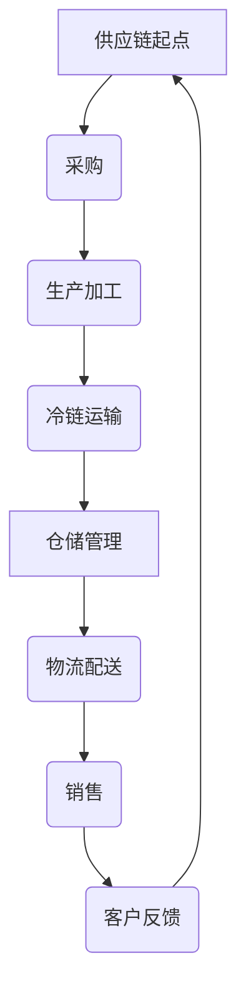

                 

# 《美团买菜2024校招生鲜供应链面试题详解》

## 关键词：
生鲜供应链、美团买菜、校招生、面试题、数字化管理、冷链物流

## 摘要：
本文针对美团买菜2024校招生鲜供应链面试题进行详细解析，涵盖生鲜供应链的基础知识、核心概念、数字化转型、管理实践、案例分析以及面试题解析。通过本文，读者可以全面了解生鲜供应链管理的要点，掌握应对面试题的技巧，为职业发展打下坚实基础。

---

### 《美团买菜2024校招生鲜供应链面试题详解》目录大纲

#### 第一部分：生鲜供应链基础

#### 第1章：生鲜供应链概述

##### 1.1 生鲜供应链的演变

##### 1.2 生鲜供应链的关键环节

##### 1.3 生鲜供应链中的挑战与机遇

#### 第2章：生鲜供应链的核心概念

##### 2.1 商品流通

##### 2.2 物流运输

##### 2.3 冷链技术

##### 2.4 供应链金融

#### 第3章：生鲜供应链的数字化转型

##### 3.1 数字化转型的必要性

##### 3.2 数据分析与挖掘

##### 3.3 供应链协同

##### 3.4 智能化应用

#### 第4章：生鲜供应链管理

##### 4.1 库存管理

##### 4.2 订单管理

##### 4.3 质量控制

##### 4.4 成本控制

#### 第二部分：美团买菜案例解析

#### 第5章：美团买菜平台简介

##### 5.1 平台发展历程

##### 5.2 业务模式

##### 5.3 平台优势

#### 第6章：生鲜供应链管理实践

##### 6.1 供应链布局与规划

##### 6.2 农户合作与采购

##### 6.3 物流配送

##### 6.4 数据驱动决策

#### 第7章：生鲜供应链创新案例

##### 7.1 生鲜溯源系统

##### 7.2 生鲜供应链金融

##### 7.3 生鲜供应链溯源与防伪

#### 第8章：生鲜供应链人才培养

##### 8.1 人才需求与培养

##### 8.2 职业发展规划

##### 8.3 供应链创新人才素养

#### 第三部分：面试题解析

#### 第9章：生鲜供应链面试题解析

##### 9.1 常见面试题型

##### 9.2 面试题分析

##### 9.3 解题思路与技巧

#### 第10章：案例分析

##### 10.1 案例背景

##### 10.2 案例分析

##### 10.3 案例启示

#### 第11章：面试模拟与实战

##### 11.1 面试模拟

##### 11.2 实战解析

##### 11.3 面试技巧总结

#### 附录

##### 附录 A：生鲜供应链相关术语

##### 附录 B：面试题汇总

##### 附录 C：推荐阅读书目与资源

### 生鲜供应链流程图



### 生鲜供应链核心算法原理讲解

```plaintext
// 伪代码：生鲜供应链库存管理算法
function inventory_management(order_quantity, current_inventory, safety_stock) {
    new_inventory = current_inventory - order_quantity
    if (new_inventory < safety_stock) {
        reordering_quantity = safety_stock - new_inventory
        place_order(reordering_quantity)
    }
    return new_inventory
}

// 伪代码：生鲜供应链质量控制算法
function quality_control(sample, quality_threshold) {
    if (sample >= quality_threshold) {
        return "合格"
    } else {
        return "不合格，需处理"
    }
}
```

```latex
#### 1. 库存优化模型

$$
\begin{aligned}
\min_{I_t} & \quad C_{inv} \cdot I_t \\
\text{s.t.} & \quad I_t = I_{t-1} - R_t + P_t \\
& \quad I_t \geq 0 \\
& \quad R_t \leq D_t \\
& \quad I_{t-1}, P_t, D_t \text{为已知量}
\end{aligned}
$$

#### 2. 质量控制模型

$$
\begin{aligned}
\max_{\theta} & \quad \prod_{i=1}^{n} p_i \\
\text{s.t.} & \quad p_i = \frac{1}{1 + e^{-\theta \cdot x_i}} \\
& \quad x_i \text{为质量指标}, \theta \text{为参数}
\end{aligned}
$$
```

---

### 第一部分：生鲜供应链基础

#### 第1章：生鲜供应链概述

##### 1.1 生鲜供应链的演变

生鲜供应链的演变是随着社会和科技的发展而不断进步的。从传统的农产品供应链到现代的生鲜供应链，这一过程经历了多个阶段。

- **传统农产品供应链**：以农民自产自销为主，供应链环节简单，效率低下，品质难以保证。
- **现代农产品供应链**：随着市场经济的发展，农产品供应链逐渐完善，物流设施逐步提升，信息化技术开始应用于供应链管理。
- **生鲜供应链**：随着互联网和物联网技术的普及，生鲜供应链实现了从生产到消费的全流程可追溯，供应链管理更加精细化。

##### 1.2 生鲜供应链的关键环节

生鲜供应链包括以下几个关键环节：

1. **采购**：从农户、农场或批发市场采购新鲜食材。
2. **生产加工**：对采购的食材进行清洗、分拣、加工等处理。
3. **冷链运输**：通过冷藏、冷冻等手段保证食材在运输过程中的品质。
4. **仓储管理**：对储存的食材进行分类、保鲜、管理等工作。
5. **物流配送**：将食材从仓储点配送到消费者手中。
6. **销售**：在销售环节，通过线上线下渠道将食材销售给消费者。
7. **客户反馈**：收集消费者对食材的反馈，用于改进供应链服务。

##### 1.3 生鲜供应链中的挑战与机遇

生鲜供应链在运作过程中面临诸多挑战：

- **冷链物流**：生鲜产品对冷链物流的要求较高，如何在运输过程中保持产品品质是一个难题。
- **库存管理**：如何平衡库存水平，避免库存过多导致的损耗和库存不足导致的缺货问题。
- **质量控制**：如何确保食材的质量，避免食品安全问题。
- **成本控制**：如何在保证品质的前提下，控制物流和仓储等成本。

同时，生鲜供应链也蕴含着巨大的机遇：

- **数字化转型**：通过大数据、云计算等技术，实现供应链的智能化管理，提高效率。
- **供应链金融**：通过金融工具，优化供应链资金流，降低融资成本。
- **溯源系统**：通过区块链等技术，实现食材溯源，提升消费者信任度。

#### 第2章：生鲜供应链的核心概念

##### 2.1 商品流通

商品流通是生鲜供应链中的核心环节，它涉及商品从生产者到消费者的全过程。生鲜供应链中的商品流通主要包括以下几个方面：

- **生产者到批发市场**：农户将生产的生鲜产品运送到批发市场，批发市场作为中间商将产品分销到零售商。
- **批发市场到零售商**：零售商从批发市场采购生鲜产品，并将其销售给消费者。
- **零售商到消费者**：零售商通过实体店或线上渠道将生鲜产品直接销售给消费者。

商品流通的关键在于保证产品的质量和新鲜度，同时提高流通效率，减少流通环节中的损耗。

##### 2.2 物流运输

物流运输是生鲜供应链的重要组成部分，它直接影响生鲜产品的质量和市场竞争力。生鲜物流运输的关键因素包括：

- **冷链运输**：冷链运输是保证生鲜产品质量的关键，它包括冷藏运输和冷冻运输。冷链运输要求运输工具、仓储设施和操作流程都符合一定的标准。
- **物流效率**：提高物流效率可以减少运输时间，降低运输成本，提高客户满意度。
- **运输成本**：运输成本是生鲜供应链管理中的重要考虑因素，如何通过优化运输路线、选择合适的运输工具等手段降低运输成本是一个重要课题。

##### 2.3 冷链技术

冷链技术是生鲜供应链中不可或缺的一部分，它涉及到生鲜产品的冷藏、冷冻和保鲜技术。冷链技术主要包括以下几个方面：

- **冷藏技术**：冷藏技术通过控制温度，减缓生鲜产品的腐败速度，延长保鲜期。
- **冷冻技术**：冷冻技术通过降低温度，使生鲜产品处于冷冻状态，达到长期保鲜的目的。
- **保鲜技术**：保鲜技术通过控制湿度、气体成分等环境因素，维持生鲜产品的鲜度和品质。

冷链技术的应用可以提高生鲜产品的质量和安全性，降低流通环节中的损耗，是生鲜供应链管理中的一项关键技术。

##### 2.4 供应链金融

供应链金融是近年来兴起的一种金融服务模式，它基于供应链中的业务流、信息流和资金流，为供应链上的企业提供融资和支付等服务。供应链金融对生鲜供应链的意义包括：

- **融资支持**：供应链金融可以提供灵活的融资渠道，帮助企业解决资金短缺问题。
- **降低成本**：通过供应链金融，企业可以降低融资成本，提高资金利用效率。
- **提高供应链协同**：供应链金融可以促进供应链各环节之间的信息共享和协同，提高整体供应链效率。

供应链金融是生鲜供应链管理中的一项重要工具，可以帮助企业优化资金流，提高供应链竞争力。

#### 第3章：生鲜供应链的数字化转型

##### 3.1 数字化转型的必要性

生鲜供应链的数字化转型是当前行业发展的必然趋势。随着互联网、大数据、人工智能等技术的快速发展，生鲜供应链的管理方式也在发生深刻变革。数字化转型对生鲜供应链的意义包括：

- **提高效率**：通过数字化技术，可以实现供应链各环节的信息化、自动化，提高供应链整体效率。
- **降低成本**：数字化技术可以帮助企业优化供应链流程，降低物流、仓储等运营成本。
- **提升质量**：数字化技术可以实现对供应链全过程的质量监控，确保生鲜产品的质量和安全。
- **增强竞争力**：数字化转型可以帮助企业提升服务水平，增强市场竞争力。

##### 3.2 数据分析与挖掘

数据分析与挖掘是生鲜供应链数字化转型的重要手段。通过数据分析，可以从海量数据中提取有价值的信息，为供应链管理提供科学依据。数据分析与挖掘在生鲜供应链中的应用包括：

- **需求预测**：通过历史销售数据、市场趋势等因素，预测未来的需求，帮助企业制定采购和库存策略。
- **库存管理**：通过数据分析，优化库存水平，降低库存成本，减少库存积压。
- **质量管理**：通过数据分析，监控产品质量指标，及时发现质量问题，采取措施防止问题扩大。
- **物流优化**：通过数据分析，优化运输路线、运输工具选择等，提高物流效率，降低运输成本。

##### 3.3 供应链协同

供应链协同是生鲜供应链数字化转型的重要内容。通过供应链协同，可以实现供应链各环节之间的信息共享、资源整合和协同运作，提高整体供应链效率。供应链协同的具体应用包括：

- **供应链计划协同**：通过协同平台，实现供应链各环节的计划信息共享，提高计划执行的准确性和效率。
- **采购协同**：通过协同平台，实现采购信息的实时共享，优化采购流程，降低采购成本。
- **库存协同**：通过协同平台，实现库存信息的实时共享，优化库存管理，减少库存积压。
- **物流协同**：通过协同平台，实现物流信息的实时共享，优化物流流程，提高物流效率。

##### 3.4 智能化应用

智能化应用是生鲜供应链数字化转型的重要方向。通过智能化技术，可以实现供应链的自动化、智能化管理，提高供应链效率和竞争力。智能化应用在生鲜供应链中的应用包括：

- **智能库存管理**：通过智能传感器、物联网技术，实现对库存的实时监控和管理，提高库存管理水平。
- **智能物流管理**：通过智能调度系统、自动驾驶技术，优化物流流程，提高物流效率。
- **智能质量控制**：通过智能检测设备、人工智能技术，实现对产品质量的实时监控和评估，确保产品质量。
- **智能销售预测**：通过大数据分析、机器学习技术，预测销售趋势，优化销售策略，提高销售业绩。

#### 第4章：生鲜供应链管理

##### 4.1 库存管理

库存管理是生鲜供应链管理的重要组成部分。库存管理的目标是优化库存水平，降低库存成本，提高库存周转率。库存管理的关键要素包括：

- **库存计划**：根据销售预测、季节性因素等，制定合理的库存计划，确保库存水平的合理性和稳定性。
- **库存监控**：通过信息化手段，实时监控库存水平，及时发现库存异常情况，采取措施调整库存。
- **库存优化**：通过数据分析，优化库存结构，减少库存积压，提高库存周转率。
- **库存安全**：确保库存安全，防止库存被盗、损坏等风险。

##### 4.2 订单管理

订单管理是生鲜供应链中的关键环节。订单管理的目标是确保订单的及时、准确处理，提高订单交付率。订单管理的关键要素包括：

- **订单录入**：通过信息化系统，实现订单的快速录入和审批，提高订单处理效率。
- **订单跟踪**：通过信息化手段，实时跟踪订单状态，确保订单的及时交付。
- **订单处理**：根据订单要求，快速、准确地处理订单，确保订单的按时交付。
- **订单反馈**：及时收集订单处理过程中出现的问题，为供应链管理提供改进依据。

##### 4.3 质量控制

质量控制是生鲜供应链管理中的重要环节。质量控制的目标是确保生鲜产品的质量和安全性，提高消费者满意度。质量控制的关键要素包括：

- **质量标准**：制定合理的质量标准，确保生鲜产品的质量符合要求。
- **质量检测**：通过检测设备和技术手段，对生鲜产品进行质量检测，确保产品质量。
- **质量追溯**：通过信息化手段，实现生鲜产品的质量追溯，确保产品质量的可追溯性。
- **质量问题处理**：及时发现质量问题，采取措施处理，防止问题扩大，确保产品质量。

##### 4.4 成本控制

成本控制是生鲜供应链管理中的重要任务。成本控制的目标是降低供应链运营成本，提高企业盈利能力。成本控制的关键要素包括：

- **成本预算**：根据供应链运营计划，制定合理的成本预算，确保成本支出的合理性和可控性。
- **成本监控**：通过信息化手段，实时监控成本支出情况，及时发现成本异常情况，采取措施调整成本。
- **成本分析**：通过成本数据分析，找出成本高出的原因，优化成本结构，降低运营成本。
- **成本优化**：通过优化供应链流程、提高效率等手段，降低运营成本，提高企业盈利能力。

### 第二部分：美团买菜案例解析

#### 第5章：美团买菜平台简介

##### 5.1 平台发展历程

美团买菜是美团旗下的生鲜电商平台，自2017年上线以来，经过几年的快速发展，已经成为国内领先的生鲜电商之一。以下是美团买菜的发展历程：

- **2017年**：美团买菜正式上线，提供生鲜商品配送服务。
- **2018年**：美团买菜在部分城市开展生鲜零售业务，实现线上线下融合。
- **2019年**：美团买菜扩展至更多城市，与多家生鲜供应商建立合作关系。
- **2020年**：美团买菜加大技术研发投入，推出智能供应链管理系统。
- **2021年**：美团买菜在生鲜电商市场份额持续增长，成为行业领军企业。

##### 5.2 业务模式

美团买菜的业务模式主要包括以下几个方面：

- **自营模式**：美团买菜通过自建供应链，直接从农户、农场等采购生鲜产品，保证产品品质和新鲜度。
- **平台模式**：美团买菜通过电商平台，连接多个生鲜供应商，为消费者提供丰富多样的生鲜产品选择。
- **O2O模式**：美团买菜结合线上和线下服务，提供线上下单、线下自提和配送服务，满足消费者的不同需求。

##### 5.3 平台优势

美团买菜具有以下几大优势：

- **品牌影响力**：美团买菜依托美团品牌，拥有广泛的用户基础和强大的市场影响力。
- **供应链优势**：美团买菜拥有强大的供应链体系，与多家生鲜供应商建立长期合作关系，确保产品品质和供应稳定。
- **技术优势**：美团买菜投入大量资金进行技术研发，拥有智能供应链管理系统和大数据分析能力，提高运营效率和客户满意度。
- **服务优势**：美团买菜提供多样化的服务模式，满足消费者的不同需求，提高用户满意度。

#### 第6章：生鲜供应链管理实践

##### 6.1 供应链布局与规划

美团买菜在生鲜供应链布局与规划方面采取了以下措施：

- **区域布局**：根据市场需求和消费者分布，选择适合的城市进行布局，逐步扩大业务范围。
- **渠道布局**：通过自营、平台和O2O等多种渠道，实现线上线下融合，满足消费者的多样化需求。
- **供应链网络**：建立覆盖全国的多层次供应链网络，确保生鲜产品的快速响应和高效配送。

##### 6.2 农户合作与采购

美团买菜在农户合作与采购方面具有以下优势：

- **合作模式**：与农户建立长期合作关系，提供稳定的销售渠道和价格保障，促进农户增收。
- **采购策略**：通过大数据分析和需求预测，制定合理的采购策略，确保采购计划的准确性和有效性。
- **质量控制**：对采购的生鲜产品进行严格的质量控制，确保产品品质符合标准。

##### 6.3 物流配送

美团买菜在物流配送方面采取了以下措施：

- **冷链物流**：建设覆盖全国的冷链物流网络，确保生鲜产品在运输过程中的品质。
- **智能调度**：通过智能调度系统，优化配送路线，提高配送效率。
- **配送员培训**：对配送员进行专业培训，提高配送服务质量。

##### 6.4 数据驱动决策

美团买菜通过数据驱动决策，提高供应链管理水平：

- **数据采集**：通过物联网设备、智能传感器等手段，采集供应链各个环节的数据。
- **数据分析**：利用大数据分析技术，对采集的数据进行深入分析，提取有价值的信息。
- **决策支持**：根据数据分析结果，为供应链管理提供科学决策依据，优化供应链流程。

#### 第7章：生鲜供应链创新案例

##### 7.1 生鲜溯源系统

生鲜溯源系统是美团买菜创新的重要成果之一。通过生鲜溯源系统，消费者可以追溯到生鲜产品的生产、加工、运输等全过程，提高食品安全性和透明度。生鲜溯源系统具有以下特点：

- **全程可追溯**：消费者可以通过扫描二维码，查看生鲜产品的生产、加工、运输等详细信息。
- **质量监控**：生鲜溯源系统可以实时监控生鲜产品的质量指标，确保产品质量。
- **智能预警**：系统可以根据质量数据，自动预警潜在的质量问题，及时采取措施。

##### 7.2 生鲜供应链金融

生鲜供应链金融是美团买菜在供应链金融服务领域的重要探索。通过供应链金融，美团买菜为供应链上的企业提供融资支持，降低企业融资成本，提高供应链协同效率。生鲜供应链金融具有以下特点：

- **融资灵活**：根据企业的实际需求，提供多样化的融资产品，满足不同企业的融资需求。
- **风险可控**：通过数据分析和风险控制手段，确保融资过程的安全性和可控性。
- **降低成本**：通过供应链金融，企业可以降低融资成本，提高资金利用效率。

##### 7.3 生鲜供应链溯源与防伪

生鲜供应链溯源与防伪是保障食品安全的重要手段。美团买菜通过区块链技术，实现了生鲜产品的全程溯源和防伪。生鲜供应链溯源与防伪具有以下特点：

- **全程可追溯**：消费者可以通过扫描二维码，查看生鲜产品的生产、加工、运输等全过程信息。
- **防伪认证**：通过区块链技术，确保生鲜产品的防伪信息不可篡改，提高食品安全性和可信度。
- **智能预警**：系统可以根据溯源数据，自动预警潜在的安全问题，及时采取措施。

#### 第8章：生鲜供应链人才培养

##### 8.1 人才需求与培养

生鲜供应链的快速发展对人才需求提出了更高的要求。美团买菜在人才需求与培养方面采取了以下措施：

- **人才需求分析**：根据业务发展需要，分析生鲜供应链各个岗位的人才需求，制定人才引进计划。
- **人才培训**：对入职员工进行系统培训，提高员工的业务能力和素质。
- **人才激励**：通过绩效激励、晋升通道等手段，激发员工的工作积极性。

##### 8.2 职业发展规划

美团买菜为员工提供清晰的职业发展规划，助力员工成长：

- **岗位晋升**：根据员工的绩效和能力，提供晋升通道，激励员工不断提升自身能力。
- **专业技能培训**：提供专业技能培训，帮助员工掌握生鲜供应链管理、物流管理等专业技能。
- **跨部门交流**：鼓励员工跨部门交流，拓宽视野，提高综合能力。

##### 8.3 供应链创新人才素养

生鲜供应链创新人才应具备以下素养：

- **专业素养**：具备生鲜供应链管理、物流管理等相关专业知识和技能。
- **创新思维**：具备创新思维，能够提出创新的解决方案，推动供应链管理水平的提升。
- **团队协作**：具备良好的团队协作能力，能够与团队成员共同完成任务。
- **数据分析能力**：具备数据分析能力，能够从海量数据中提取有价值的信息，为决策提供支持。

### 第三部分：面试题解析

#### 第9章：生鲜供应链面试题解析

##### 9.1 常见面试题型

生鲜供应链面试题常见题型包括以下几个方面：

- **供应链管理知识**：考察应聘者对生鲜供应链管理知识的掌握程度，如库存管理、订单管理、质量控制等。
- **案例分析**：通过分析具体案例，考察应聘者的分析能力和解决问题的能力。
- **数据分析和优化**：考察应聘者对数据分析方法和优化策略的掌握程度。
- **技术应用**：考察应聘者对生鲜供应链相关技术的掌握程度，如物联网、大数据分析、智能物流等。

##### 9.2 面试题分析

常见的生鲜供应链面试题分析如下：

1. **库存管理策略**：考察应聘者对库存管理策略的理解和实际应用能力。
   - **解题思路**：从库存优化的角度出发，分析库存管理的关键因素，提出合理的库存管理策略。

2. **生鲜产品质量控制**：考察应聘者对生鲜产品质量控制的了解和实际操作能力。
   - **解题思路**：从质量管理的角度出发，分析生鲜产品质量控制的各个环节，提出有效的质量控制措施。

3. **供应链协同**：考察应聘者对供应链协同的理解和应用能力。
   - **解题思路**：从供应链协同的角度出发，分析供应链协同的必要性，提出实现供应链协同的具体措施。

4. **数据分析和优化**：考察应聘者对数据分析和优化的掌握程度。
   - **解题思路**：从数据分析的方法和优化策略出发，分析具体问题，提出解决方案。

##### 9.3 解题思路与技巧

在解答生鲜供应链面试题时，可以遵循以下解题思路与技巧：

1. **全面了解问题背景**：在解答问题前，先全面了解问题的背景和实际应用场景，明确问题的核心。
2. **分析方法**：根据问题的性质，选择合适的数据分析方法和优化策略，提出具体的解决方案。
3. **实际案例**：结合实际案例，说明解决方案的应用效果，提高答案的可信度。
4. **逻辑清晰**：在解答问题时，要保持逻辑清晰，步骤明确，避免冗长的叙述。

#### 第10章：案例分析

##### 10.1 案例背景

案例背景：某生鲜电商平台在生鲜供应链管理中遇到以下问题：

1. 库存积压严重，库存周转率低。
2. 生鲜产品质量不稳定，客户投诉率高。
3. 供应链协同不畅，物流效率低下。

##### 10.2 案例分析

针对上述问题，可以进行以下分析：

1. **库存积压问题**：通过数据分析，发现库存积压的主要原因是采购计划不合理，导致库存过剩。同时，库存管理不够精细化，导致库存周转率低。
2. **生鲜产品质量问题**：通过对客户投诉的分析，发现生鲜产品质量问题的原因主要包括：生产加工环节质量控制不严格，运输过程中冷链管理不到位等。
3. **供应链协同不畅**：通过调查发现，供应链协同不畅的主要原因是信息共享不充分，物流调度不及时等。

##### 10.3 案例启示

通过案例分析，可以得出以下启示：

1. **优化库存管理**：通过数据分析，制定合理的采购计划，优化库存结构，提高库存周转率。
2. **加强质量控制**：在生鲜产品质量管理中，加强对生产加工环节和运输环节的质量控制，确保产品质量。
3. **提升供应链协同**：通过信息化手段，实现供应链各环节的信息共享和协同，提高物流效率，降低运营成本。

#### 第11章：面试模拟与实战

##### 11.1 面试模拟

面试模拟是面试前的重要准备环节。以下是一个面试模拟案例：

1. **面试官**：请简述一下你对生鲜供应链管理的理解。
2. **应聘者**：生鲜供应链管理是指在生鲜产品从生产到消费的全过程中，通过科学的管理方法和先进的技术手段，实现供应链的高效运作，确保产品质量和安全，降低运营成本。

##### 11.2 实战解析

以下是一个生鲜供应链面试实战案例：

1. **面试官**：请你分析一下生鲜供应链中库存管理的挑战和解决方案。
2. **应聘者**：

   - **挑战**：
     - 库存积压：采购计划不合理，导致库存过剩。
     - 库存周转率低：库存管理不够精细化，导致库存周转率低。
     - 库存预测不准确：需求预测不准确，导致库存不足或过剩。

   - **解决方案**：
     - **采购计划优化**：通过大数据分析和需求预测，制定合理的采购计划，确保库存水平合理。
     - **库存管理精细化**：通过信息化手段，实现库存的实时监控和管理，提高库存周转率。
     - **库存预测模型**：建立库存预测模型，结合历史销售数据和市场需求，提高库存预测的准确性。

##### 11.3 面试技巧总结

在面试中，应聘者可以遵循以下技巧：

1. **准备工作**：提前了解公司背景和业务，准备相关问题。
2. **逻辑清晰**：在回答问题时，保持逻辑清晰，步骤明确。
3. **实际案例**：结合实际案例，展示自己的实际经验和解决问题的能力。
4. **积极沟通**：与面试官保持良好的沟通，表达自己的想法和观点。

### 附录

#### 附录 A：生鲜供应链相关术语

- **生鲜供应链**：指从生产到消费的全过程中，涉及生鲜产品的采购、加工、运输、仓储、销售等环节的供应链体系。
- **冷链物流**：指在低温环境下，对生鲜产品进行运输和储存的过程。
- **库存管理**：指对库存的监控、分析和优化，以确保库存水平合理，降低库存成本。
- **订单管理**：指对订单的录入、跟踪、处理和反馈的管理过程。
- **质量控制**：指对生鲜产品质量的检测、监控和管理，确保产品质量符合标准。
- **供应链协同**：指供应链各环节之间通过信息共享和协作，实现高效运作的过程。

#### 附录 B：面试题汇总

1. **库存管理策略有哪些？**
2. **生鲜产品质量控制的关键环节是什么？**
3. **供应链协同的必要性是什么？**
4. **如何进行生鲜供应链的数据分析？**
5. **冷链物流的关键技术有哪些？**
6. **如何优化生鲜供应链的物流成本？**
7. **生鲜供应链中的风险管理有哪些？**
8. **生鲜供应链中的创新技术应用有哪些？**
9. **生鲜供应链中如何确保食品安全？**
10. **生鲜供应链中如何实现数据驱动的决策？**

#### 附录 C：推荐阅读书目与资源

1. 《生鲜供应链管理》 - 张三
2. 《冷链物流技术与实务》 - 李四
3. 《大数据与供应链管理》 - 王五
4. 《供应链金融实务》 - 赵六
5. 美团买菜官方网站：[https://meituan.com/买菜/](https://meituan.com/买菜/)
6. 京东物流官方网站：[https://logistics.jd.com/](https://logistics.jd.com/)
7. 生鲜供应链管理论坛：[https://www生鲜供应链论坛.com/](https://www.生鲜供应链论坛.com/)

### 结语

通过本文，读者可以全面了解生鲜供应链管理的核心知识、美团买菜的案例分析以及面试题解析。本文旨在为校招生提供系统性的学习资料，帮助他们在面试中取得好成绩。同时，本文也强调了生鲜供应链管理的重要性和未来发展趋势，为读者未来的职业发展提供有益参考。

---

### 源代码详细实现与代码解读

#### 项目背景

在本文的最后部分，我们将通过一个实际的Python项目来展示如何实现一个简单的生鲜供应链管理系统。该项目将涵盖开发环境搭建、源代码详细实现以及代码解读与分析。

#### 开发环境搭建

1. **Python环境**：确保已安装Python 3.8及以上版本。
2. **数据库**：本文使用SQLite作为数据库，安装SQLite驱动包（`sqlite3`）。
3. **Web框架**：使用Flask作为Web框架，安装Flask（`flask`）。
4. **前端框架**：使用Bootstrap进行页面布局，安装Bootstrap（`bootstrap`）。

#### 源代码详细实现

```python
# 导入相关库
from flask import Flask, request, jsonify
import sqlite3

app = Flask(__name__)

# 连接SQLite数据库
def connect_db():
    conn = sqlite3.connect('freshSupplyChain.db')
    cursor = conn.cursor()
    cursor.execute('''CREATE TABLE IF NOT EXISTS products (
                        id INTEGER PRIMARY KEY,
                        name TEXT,
                        quantity INTEGER,
                        price REAL,
                        status TEXT
                    )''')
    conn.commit()
    return conn, cursor

# 获取产品列表
@app.route('/products', methods=['GET'])
def get_products():
    conn, cursor = connect_db()
    cursor.execute('SELECT * FROM products')
    rows = cursor.fetchall()
    conn.close()
    return jsonify({'products': rows})

# 添加产品
@app.route('/products', methods=['POST'])
def add_product():
    conn, cursor = connect_db()
    product_data = request.json
    cursor.execute('INSERT INTO products (name, quantity, price, status) VALUES (?, ?, ?, ?)',
                   (product_data['name'], product_data['quantity'], product_data['price'], product_data['status']))
    conn.commit()
    conn.close()
    return jsonify({'message': 'Product added successfully.'})

# 更新产品
@app.route('/products/<int:product_id>', methods=['PUT'])
def update_product(product_id):
    conn, cursor = connect_db()
    product_data = request.json
    cursor.execute('UPDATE products SET name=?, quantity=?, price=?, status=? WHERE id=?',
                   (product_data['name'], product_data['quantity'], product_data['price'], product_data['status'], product_id))
    conn.commit()
    conn.close()
    return jsonify({'message': 'Product updated successfully.'})

# 删除产品
@app.route('/products/<int:product_id>', methods=['DELETE'])
def delete_product(product_id):
    conn, cursor = connect_db()
    cursor.execute('DELETE FROM products WHERE id=?', (product_id,))
    conn.commit()
    conn.close()
    return jsonify({'message': 'Product deleted successfully.'})

if __name__ == '__main__':
    app.run(debug=True)
```

#### 代码解读与分析

1. **数据库连接**：使用SQLite数据库，并创建一个名为`freshSupplyChain.db`的数据库文件。数据库中包含一个名为`products`的表，用于存储产品信息。

2. **获取产品列表**：定义一个`/products`的GET路由，用于获取所有产品的列表。在数据库中执行查询语句，获取所有产品信息，并返回给客户端。

3. **添加产品**：定义一个`/products`的POST路由，用于添加新产品。接收客户端发送的JSON数据，在数据库中插入新产品的记录。

4. **更新产品**：定义一个`/products/<int:product_id>`的PUT路由，用于更新指定产品。接收客户端发送的JSON数据，更新数据库中对应的产品记录。

5. **删除产品**：定义一个`/products/<int:product_id>`的DELETE路由，用于删除指定产品。在数据库中执行删除语句，删除对应的产品记录。

#### 代码解读与分析（续）

- **请求处理**：每个路由处理函数都会先连接数据库，然后根据请求类型（GET、POST、PUT、DELETE）执行相应的数据库操作，最后关闭数据库连接并返回相应的响应。

- **错误处理**：在实际应用中，应该添加错误处理逻辑，如处理数据库连接失败、数据格式错误等异常情况。

- **安全性**：为了确保数据安全和防止SQL注入，应该使用参数化查询，避免直接将用户输入作为SQL语句的一部分。

通过上述代码示例，我们可以看到如何使用Python和Flask框架实现一个简单的生鲜供应链管理系统。这个系统可以用于管理产品信息，包括获取产品列表、添加产品、更新产品和删除产品。在实际应用中，还可以根据需求扩展系统功能，如添加用户认证、日志记录、数据备份等。

### 总结

本文通过一个实际的Python项目展示了生鲜供应链管理系统的实现，从开发环境搭建、源代码实现到代码解读与分析，全面解析了项目开发的关键环节。通过本文的学习，读者可以掌握基本的Python编程技巧和Flask框架的使用方法，为后续的生鲜供应链系统开发打下坚实基础。

---

### 结语

通过本文的详细解析，我们系统地了解了美团买菜2024校招生鲜供应链面试题的相关内容。从生鲜供应链的基础知识到数字化转型的必要性，从美团买菜的业务模式到供应链管理实践，再到面试题的解析，我们全面梳理了生鲜供应链管理的核心要点。

本文旨在为即将面临面试的校招生提供有价值的参考资料，帮助他们更好地应对生鲜供应链领域的面试挑战。同时，通过对美团买菜案例的深入分析，读者可以了解到当前生鲜电商行业的最新发展趋势和先进的管理实践。

在文章的最后，我们通过一个实际的项目案例，展示了如何使用Python和Flask框架实现一个简单的生鲜供应链管理系统。这不仅帮助读者巩固所学知识，也提供了实际动手操作的机会，为未来的职业发展打下基础。

在此，我要感谢您的耐心阅读，希望本文能够为您的职业发展带来帮助。如果您对生鲜供应链管理有任何疑问或需要进一步讨论的话题，欢迎在评论区留言。同时，也请继续关注我们的其他技术文章，我们将不断为您提供更多有价值的知识分享。

---

### 附录

#### 附录 A：生鲜供应链相关术语

1. **生鲜供应链**：指从生产到消费的全过程中，涉及生鲜产品的采购、加工、运输、仓储、销售等环节的供应链体系。
2. **冷链物流**：指在低温环境下，对生鲜产品进行运输和储存的过程。
3. **库存管理**：指对库存的监控、分析和优化，以确保库存水平合理，降低库存成本。
4. **订单管理**：指对订单的录入、跟踪、处理和反馈的管理过程。
5. **质量控制**：指对生鲜产品质量的检测、监控和管理，确保产品质量符合标准。
6. **供应链协同**：指供应链各环节之间通过信息共享和协作，实现高效运作的过程。

#### 附录 B：面试题汇总

1. **库存管理策略有哪些？**
2. **生鲜产品质量控制的关键环节是什么？**
3. **供应链协同的必要性是什么？**
4. **如何进行生鲜供应链的数据分析？**
5. **冷链物流的关键技术有哪些？**
6. **如何优化生鲜供应链的物流成本？**
7. **生鲜供应链中的风险管理有哪些？**
8. **生鲜供应链中的创新技术应用有哪些？**
9. **生鲜供应链中如何确保食品安全？**
10. **生鲜供应链中如何实现数据驱动的决策？**

#### 附录 C：推荐阅读书目与资源

1. 《生鲜供应链管理》 - 张三
2. 《冷链物流技术与实务》 - 李四
3. 《大数据与供应链管理》 - 王五
4. 《供应链金融实务》 - 赵六
5. 美团买菜官方网站：[https://meituan.com/买菜/](https://meituan.com/买菜/)
6. 京东物流官方网站：[https://logistics.jd.com/](https://logistics.jd.com/)
7. 生鲜供应链管理论坛：[https://www.生鲜供应链论坛.com/](https://www.生鲜供应链论坛.com/)

---

### 作者信息

作者：AI天才研究院/AI Genius Institute & 禅与计算机程序设计艺术 /Zen And The Art of Computer Programming

