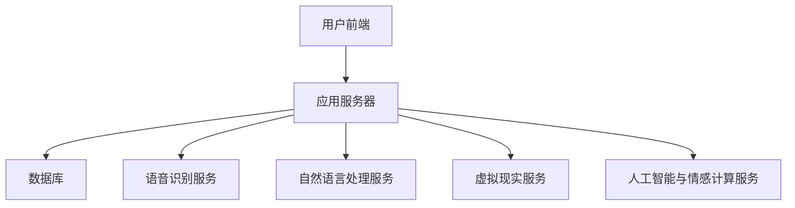

                 

### 《聊天机器人娱乐应用：虚拟伴侣》

#### 核心关键词

- 聊天机器人
- 虚拟伴侣
- 语音识别
- 自然语言处理
- 虚拟现实
- 人工智能
- 情感计算

#### 摘要

随着人工智能技术的飞速发展，聊天机器人娱乐应用已经成为新兴的互联网娱乐方式。本文将探讨虚拟伴侣娱乐应用的核心技术，包括语音识别、自然语言处理、虚拟现实和人工智能与情感计算等。通过详细的分析和项目实战，我们将深入了解虚拟伴侣娱乐应用的设计与实现，以及其在用户体验和商业化方面的潜力。

### 第一部分：虚拟伴侣娱乐应用概述

#### 第1章：虚拟伴侣娱乐应用的背景与重要性

随着移动互联网的普及和智能手机的广泛使用，用户对于娱乐方式的需求日益多样化。虚拟伴侣娱乐应用作为聊天机器人的一种特殊形式，逐渐受到了广泛关注。虚拟伴侣不仅能够提供日常对话的陪伴，还能在特定场景下提供专业的娱乐服务，如聊天、游戏、咨询等。

1.1 **聊天机器人在娱乐领域的兴起**

聊天机器人娱乐应用的兴起得益于以下几个因素：

- **技术进步**：语音识别、自然语言处理、虚拟现实和人工智能等技术的快速发展，使得聊天机器人能够更好地模拟人类交互。
- **用户需求**：现代人生活节奏加快，对于个性化、定制化的娱乐需求不断增加，虚拟伴侣能够满足这一需求。
- **商业机会**：虚拟伴侣娱乐应用不仅能够吸引用户，还可以通过增值服务、广告等多种方式实现盈利。

1.2 **虚拟伴侣娱乐应用的用户需求**

虚拟伴侣娱乐应用的用户需求主要包括以下几个方面：

- **陪伴需求**：用户希望在闲暇时间得到一个能够陪伴自己、倾听自己心事的朋友。
- **娱乐需求**：用户希望能够通过虚拟伴侣参与各种娱乐活动，如聊天、游戏、听音乐等。
- **个性化服务**：用户希望虚拟伴侣能够根据自己的喜好和习惯，提供个性化的服务。

1.3 **虚拟伴侣娱乐应用的市场前景**

虚拟伴侣娱乐应用具有广阔的市场前景，主要体现在以下几个方面：

- **用户基数庞大**：随着智能手机的普及，全球用户数量不断增加，为虚拟伴侣娱乐应用提供了庞大的用户基础。
- **多元化发展**：虚拟伴侣娱乐应用不仅可以应用于个人用户，还可以应用于企业客户，如客服机器人、教育机器人等。
- **技术持续进步**：随着人工智能技术的持续发展，虚拟伴侣娱乐应用的功能将越来越丰富，用户体验将得到进一步提升。

#### 第2章：虚拟伴侣娱乐应用的核心技术

虚拟伴侣娱乐应用的核心技术包括语音识别、自然语言处理、虚拟现实和人工智能与情感计算。这些技术相互融合，共同构成了虚拟伴侣娱乐应用的技术体系。

2.1 **语音识别与合成技术**

语音识别技术是将语音信号转换为文本的技术，而语音合成技术则是将文本转换为语音的技术。这两项技术在虚拟伴侣娱乐应用中起着至关重要的作用，因为用户与虚拟伴侣的交互主要通过语音进行。

- **语音识别技术原理**：语音识别技术的基本原理包括预处理、特征提取、声学模型训练、语言模型训练和解码等步骤。常见的语音识别算法有基于隐马尔可夫模型（HMM）的算法、基于深度学习的算法等。
- **语音合成技术原理**：语音合成技术的基本原理包括文本预处理、语音生成、音频处理等步骤。常见的语音合成算法有基于规则的方法、基于数据的合成方法等。

2.2 **自然语言处理技术**

自然语言处理（NLP）技术是使计算机能够理解、处理和生成自然语言的技术。在虚拟伴侣娱乐应用中，NLP技术主要用于理解用户的语音输入、生成合适的回复和进行对话管理等。

- **基于文本的对话生成**：基于文本的对话生成是NLP技术在虚拟伴侣娱乐应用中的重要应用，其基本原理包括分词、词性标注、句法分析、语义分析等。
- **基于语音的对话生成**：基于语音的对话生成是将用户的语音输入转换为文本，然后使用文本对话生成技术生成回复。这一过程通常需要结合语音识别和自然语言处理技术。

2.3 **虚拟现实技术**

虚拟现实（VR）技术是一种能够创造沉浸式体验的技术。在虚拟伴侣娱乐应用中，VR技术可以提供更加真实的交互体验，使用户感受到如同与真实人类进行交流的效果。

- **虚拟现实技术基础**：虚拟现实技术包括虚拟场景的创建、虚拟物体的操作、三维音效的渲染等。常见的虚拟现实技术有头戴式显示器、手柄、手势识别等。
- **虚拟伴侣娱乐应用中的VR场景设计**：在虚拟伴侣娱乐应用中，VR场景的设计需要考虑用户的沉浸感、交互体验和虚拟伴侣的形象等因素。

2.4 **人工智能与情感计算**

人工智能（AI）和情感计算技术在虚拟伴侣娱乐应用中发挥着至关重要的作用。人工智能技术主要用于提高虚拟伴侣的智能水平和自主决策能力，而情感计算技术则用于理解用户的情感状态，并生成相应的情感回应。

- **人工智能在虚拟伴侣娱乐应用中的作用**：人工智能技术可以帮助虚拟伴侣更好地理解用户的需求，提供个性化的服务，并不断学习和优化自身。
- **情感计算技术原理**：情感计算技术通过分析用户的语音、文字和行为等数据，识别用户的情感状态，并生成相应的情感回应。常见的情感计算方法有情感特征提取、情感分类、情感合成等。

#### 第3章：虚拟伴侣娱乐应用的架构设计

虚拟伴侣娱乐应用的架构设计是确保应用性能和用户体验的关键。一个典型的虚拟伴侣娱乐应用架构包括前端界面、后端服务器和数据库三个部分。

3.1 **虚拟伴侣娱乐应用的基本架构**

虚拟伴侣娱乐应用的基本架构如图所示：



3.2 **数据处理与存储架构**

虚拟伴侣娱乐应用需要处理大量的用户数据和交互数据，因此一个高效的数据处理与存储架构至关重要。数据处理与存储架构主要包括以下部分：

- **用户数据存储**：用户数据包括用户信息、偏好设置、聊天记录等。通常使用关系型数据库（如MySQL）或NoSQL数据库（如MongoDB）进行存储。
- **交互数据存储**：交互数据包括用户与虚拟伴侣的语音、文字交互记录等。为了确保数据的实时性和可靠性，可以使用消息队列（如RabbitMQ）进行数据的存储和传输。
- **缓存策略**：为了提高系统性能，可以使用缓存技术（如Redis）来存储热点数据和频繁访问的数据。

3.3 **交互逻辑与控制流程**

虚拟伴侣娱乐应用的交互逻辑与控制流程是确保用户与虚拟伴侣之间顺畅交互的关键。以下是一个简单的交互逻辑与控制流程：

1. **用户发起请求**：用户通过语音或文字向虚拟伴侣发起请求。
2. **语音识别**：应用服务器接收用户请求后，使用语音识别服务将语音转换为文本。
3. **自然语言处理**：应用服务器对转换后的文本进行自然语言处理，理解用户的意图和需求。
4. **对话生成**：根据用户的意图和需求，应用服务器生成相应的回复文本。
5. **语音合成**：将生成的回复文本转换为语音，使用语音合成服务播放给用户。
6. **反馈与优化**：用户可以反馈对虚拟伴侣的满意度，应用服务器根据反馈对虚拟伴侣进行优化和改进。

### 第二部分：虚拟伴侣娱乐应用的实现与优化

#### 第4章：语音识别与合成技术详解

语音识别与合成技术是虚拟伴侣娱乐应用的核心技术之一。本章将详细讲解语音识别与合成技术的基本原理、优化方法和应用场景。

4.1 **语音识别技术原理**

语音识别（Automatic Speech Recognition，ASR）是将语音信号转换为文本的技术。其基本原理包括以下几个步骤：

1. **预处理**：包括噪声抑制、音量归一化等，以提高语音信号的质量。
2. **特征提取**：从语音信号中提取特征，如频谱、倒谱系数等，以供后续处理。
3. **声学模型训练**：使用大量语音数据训练声学模型，以识别语音特征。
4. **语言模型训练**：使用文本数据训练语言模型，以识别语音的语法和语义。
5. **解码**：通过声学模型和语言模型对语音信号进行解码，得到对应的文本。

以下是一个简单的语音识别伪代码示例：

```python
def ASR(voice_signal):
    preprocessed_signal = preprocess(voice_signal)
    features = extract_features(preprocessed_signal)
    text = decode(features)
    return text
```

4.2 **语音合成技术原理**

语音合成（Text-to-Speech，TTS）是将文本转换为语音的技术。其基本原理包括以下几个步骤：

1. **文本预处理**：包括分词、语音标记等，将文本转换为适合语音合成的形式。
2. **语音生成**：根据文本生成语音，包括音节合成、音素合成等。
3. **音频处理**：对生成的语音进行音频处理，如音量调整、音调调整等，以提高语音的质量和自然度。
4. **播放**：将处理后的语音播放给用户。

以下是一个简单的语音合成伪代码示例：

```python
def TTS(text):
    preprocessed_text = preprocess_text(text)
    audio_signal = generate_audio(preprocessed_text)
    audio_signal = process_audio(audio_signal)
    play(audio_signal)
```

4.3 **语音识别与合成的优化方法**

为了提高语音识别与合成的性能，可以采取以下优化方法：

- **数据增强**：通过增加数据集的多样性和数据量，提高模型的泛化能力。
- **模型优化**：采用深度学习等先进算法，提高模型的识别和生成能力。
- **前端优化**：通过优化前端界面，提高用户的交互体验，如提供语音识别和合成的实时反馈。
- **后端优化**：通过优化后端服务器和数据库的性能，提高系统的响应速度和处理能力。

#### 第5章：自然语言处理技术在虚拟伴侣娱乐应用中的应用

自然语言处理（NLP）技术在虚拟伴侣娱乐应用中发挥着重要作用，主要用于理解用户的意图、生成合适的回复以及进行对话管理等。本章将详细探讨NLP技术在虚拟伴侣娱乐应用中的应用。

5.1 **基于文本的对话生成**

基于文本的对话生成是NLP技术在虚拟伴侣娱乐应用中的重要应用之一。其基本原理包括以下几个步骤：

1. **分词**：将用户的文本输入分割成单词或词组，以便进行后续处理。
2. **词性标注**：对分词后的文本进行词性标注，以识别单词的词性（如名词、动词等）。
3. **句法分析**：对词性标注后的文本进行句法分析，以确定句子结构。
4. **语义分析**：理解句子的含义，进行语义角色标注，以确定句子的主体、谓语等。
5. **对话生成**：根据用户的输入和上下文，生成合适的回复文本。

以下是一个简单的基于文本的对话生成伪代码示例：

```python
def dialogue_generation(user_input):
    tokens = tokenize(user_input)
    pos_tags = pos_tagging(tokens)
    syntax_tree = syntactic_parsing(pos_tags)
    semantic_role_labels = semantic_analysis(syntax_tree)
    response = generate_response(semantic_role_labels)
    return response
```

5.2 **基于语音的对话生成**

基于语音的对话生成是将用户的语音输入转换为文本，然后使用文本对话生成技术生成回复。这一过程通常需要结合语音识别和自然语言处理技术。其基本原理包括以下几个步骤：

1. **语音识别**：将用户的语音输入转换为文本。
2. **自然语言处理**：对转换后的文本进行分词、词性标注、句法分析和语义分析等处理，以理解用户的意图。
3. **对话生成**：根据用户的输入和上下文，生成合适的回复文本。
4. **语音合成**：将生成的回复文本转换为语音，播放给用户。

以下是一个简单的基于语音的对话生成伪代码示例：

```python
def dialogue_generation(voice_input):
    text = ASR(voice_input)
    response = dialogue_generation(text)
    audio_signal = TTS(response)
    play(audio_signal)
```

5.3 **情感识别与回应**

情感识别与回应是NLP技术在虚拟伴侣娱乐应用中的另一个重要应用。其基本原理包括以下几个步骤：

1. **情感特征提取**：从用户的语音或文本输入中提取情感特征，如语音的音调、音量、语速等。
2. **情感分类**：使用情感分类器对提取的情感特征进行分类，以识别用户的情感状态（如高兴、愤怒、悲伤等）。
3. **情感回应生成**：根据用户的情感状态，生成相应的情感回应文本。

以下是一个简单的情感识别与回应伪代码示例：

```python
def emotion_recognition(user_input):
    features = extract_emotion_features(user_input)
    emotion = emotion_classifier(features)
    response = generate_emotion_response(emotion)
    return response
```

#### 第6章：虚拟现实技术在虚拟伴侣娱乐应用中的应用

虚拟现实（VR）技术在虚拟伴侣娱乐应用中可以提供沉浸式的交互体验，使用户感受到如同与真实人类进行交流的效果。本章将详细探讨虚拟现实技术在虚拟伴侣娱乐应用中的应用。

6.1 **虚拟现实技术基础**

虚拟现实技术是一种能够创造沉浸式体验的技术。其基本原理包括以下几个方面：

1. **虚拟场景的创建**：通过计算机图形学技术，创建一个虚拟的三维场景，以供用户在其中交互。
2. **虚拟物体的操作**：通过传感设备（如头戴式显示器、手柄等），用户可以在虚拟场景中操作虚拟物体。
3. **三维音效的渲染**：通过音频处理技术，在虚拟场景中生成三维音效，以增强用户的沉浸感。

6.2 **虚拟伴侣娱乐应用中的VR场景设计**

在虚拟伴侣娱乐应用中，VR场景的设计需要考虑以下几个因素：

1. **沉浸感**：通过高质量的图形渲染和真实的音效，提高用户的沉浸感。
2. **交互体验**：设计用户友好的交互方式，如手势识别、语音控制等，以提高用户的交互体验。
3. **虚拟伴侣形象**：设计一个符合用户期望的虚拟伴侣形象，以增强用户的情感联系。

6.3 **VR交互体验优化**

为了提高虚拟现实技术的交互体验，可以采取以下优化方法：

1. **优化图形渲染**：通过提高渲染速度和图形质量，减少用户的等待时间和眩晕感。
2. **优化音频效果**：通过提高音频质量，增强用户的沉浸感。
3. **优化交互方式**：设计更加直观和自然的交互方式，如手势控制、语音控制等。
4. **优化场景设计**：根据用户的反馈和需求，不断优化虚拟场景的设计，以提高用户的满意度。

#### 第7章：人工智能与情感计算在虚拟伴侣娱乐应用中的应用

人工智能（AI）和情感计算技术在虚拟伴侣娱乐应用中发挥着至关重要的作用。它们可以提升虚拟伴侣的智能水平、理解用户的情感需求，并生成相应的情感回应。本章将详细探讨人工智能与情感计算在虚拟伴侣娱乐应用中的应用。

7.1 **人工智能在虚拟伴侣娱乐应用中的作用**

人工智能技术在虚拟伴侣娱乐应用中发挥着多种作用，包括但不限于：

1. **对话管理**：通过机器学习算法，自动管理对话流程，提高对话的自然度和流畅性。
2. **情感识别**：通过分析用户的语音、文字和行为等数据，识别用户的情感状态，为后续的情感回应提供依据。
3. **个性化服务**：根据用户的历史数据和偏好，提供个性化的娱乐服务，提高用户的满意度。
4. **自我学习**：通过不断学习和优化，虚拟伴侣可以不断提升自己的智能水平和服务质量。

7.2 **情感计算技术原理**

情感计算（Affective Computing）是研究如何使计算机识别、理解、处理和模拟人类情感的能力。其基本原理包括以下几个方面：

1. **情感特征提取**：从用户的语音、文字和行为等数据中提取情感特征，如语音的音调、音量、语速等。
2. **情感分类**：使用情感分类算法，对提取的情感特征进行分类，以识别用户的情感状态。
3. **情感合成**：根据分类结果，生成相应的情感回应，如语音、文字等。

以下是一个简单的情感计算技术原理的伪代码示例：

```python
def emotion_computing(user_input):
    features = extract_emotion_features(user_input)
    emotion = emotion_classifier(features)
    response = generate_emotion_response(emotion)
    return response
```

7.3 **虚拟伴侣娱乐应用中的情感设计**

在虚拟伴侣娱乐应用中，情感设计是提升用户体验和情感联系的关键。以下是一些情感设计的要点：

1. **情感识别**：通过情感计算技术，准确识别用户的情感状态，为生成情感回应提供依据。
2. **情感回应**：根据用户的情感状态，生成相应的情感回应，如愉快的对话、安慰的话语等。
3. **情感连贯性**：确保虚拟伴侣在对话中的情感回应连贯、自然，避免出现不协调的情况。
4. **情感变化**：根据用户的情感变化，动态调整虚拟伴侣的情感回应，以适应用户的情感需求。

#### 第8章：虚拟伴侣娱乐应用的项目开发实战

虚拟伴侣娱乐应用的项目开发实战是深入了解该领域技术实现和项目管理的最佳途径。本章将详细介绍虚拟伴侣娱乐应用的项目开发过程，包括环境搭建、源代码实现和代码解读。

8.1 **开发环境搭建**

开发虚拟伴侣娱乐应用的第一步是搭建合适的开发环境。以下是搭建开发环境的基本步骤：

1. **操作系统**：选择一个适合的开发操作系统，如Windows、macOS或Linux。
2. **编程语言**：选择一种合适的编程语言，如Python、Java或C++。
3. **开发工具**：安装必要的开发工具，如集成开发环境（IDE）和版本控制工具。
4. **依赖库和框架**：安装用于语音识别、自然语言处理、虚拟现实和人工智能的依赖库和框架。

以下是一个简单的Python开发环境搭建示例：

```python
# 安装Python
python -m pip install --upgrade pip

# 安装依赖库和框架
pip install tensorflow numpy scipy matplotlib
```

8.2 **源代码实现**

虚拟伴侣娱乐应用的源代码实现是项目开发的核心部分。以下是虚拟伴侣娱乐应用的主要模块及其源代码实现：

1. **语音识别模块**：实现语音识别功能，将语音信号转换为文本。
2. **自然语言处理模块**：实现自然语言处理功能，理解用户的意图和情感。
3. **虚拟现实模块**：实现虚拟现实功能，提供沉浸式的交互体验。
4. **人工智能与情感计算模块**：实现人工智能与情感计算功能，提升虚拟伴侣的智能水平和情感回应能力。

以下是一个简单的虚拟伴侣娱乐应用源代码实现示例：

```python
# 语音识别模块
def recognize_speech(voice_signal):
    # 语音识别算法实现
    pass

# 自然语言处理模块
def process_text(text):
    # 自然语言处理算法实现
    pass

# 虚拟现实模块
def render_scene():
    # 虚拟现实场景渲染实现
    pass

# 人工智能与情感计算模块
def generate_response(text):
    # 人工智能与情感计算算法实现
    pass

# 主程序
if __name__ == "__main__":
    voice_signal = capture_speech()
    text = recognize_speech(voice_signal)
    processed_text = process_text(text)
    response = generate_response(processed_text)
    render_scene(response)
```

8.3 **代码解读与分析**

在源代码实现的基础上，对关键模块进行解读和分析，以帮助开发者更好地理解虚拟伴侣娱乐应用的实现原理和关键技术。以下是代码解读与分析的示例：

1. **语音识别模块解读**：
   - 实现了语音识别功能，将语音信号转换为文本。
   - 使用了现有的语音识别库（如Google的 Speech Recognition 库）进行语音识别。
   - 对语音信号进行了预处理，如降噪、归一化等，以提高识别准确性。

2. **自然语言处理模块解读**：
   - 实现了自然语言处理功能，理解用户的意图和情感。
   - 使用了现有的自然语言处理库（如NLTK、spaCy等）进行文本处理。
   - 对文本进行了分词、词性标注、句法分析等处理，以提取关键信息。

3. **虚拟现实模块解读**：
   - 实现了虚拟现实功能，提供沉浸式的交互体验。
   - 使用了虚拟现实库（如Unity、Unreal Engine等）进行虚拟场景渲染。
   - 通过传感器（如头戴式显示器、手柄等）实现用户的交互。

4. **人工智能与情感计算模块解读**：
   - 实现了人工智能与情感计算功能，提升虚拟伴侣的智能水平和情感回应能力。
   - 使用了机器学习和深度学习算法，如神经网络、循环神经网络（RNN）等。
   - 对用户的语音、文字和行为等数据进行了情感分析和情感分类。

通过以上代码解读与分析，开发者可以深入了解虚拟伴侣娱乐应用的实现原理和关键技术，为实际项目开发提供指导。

#### 第9章：虚拟伴侣娱乐应用的性能优化与测试

虚拟伴侣娱乐应用的性能优化与测试是确保应用稳定、高效运行的关键环节。本章将详细介绍虚拟伴侣娱乐应用的性能优化策略、测试方法和测试报告。

9.1 **性能优化策略**

为了提升虚拟伴侣娱乐应用的性能，可以采取以下优化策略：

1. **代码优化**：通过改进代码结构和算法，减少计算复杂度和内存占用。
2. **缓存策略**：使用缓存技术，如Redis，缓存热点数据和频繁访问的数据，减少数据库查询次数。
3. **异步处理**：使用异步编程技术，如多线程、协程等，提高系统的并发处理能力。
4. **负载均衡**：通过负载均衡器，将用户请求均匀分配到多台服务器上，避免单点瓶颈。
5. **数据库优化**：使用数据库索引、分库分表等技术，提高数据库查询速度。

9.2 **测试方法与工具**

虚拟伴侣娱乐应用的测试方法主要包括功能测试、性能测试、安全测试等。以下是常用的测试工具和方法：

1. **功能测试**：使用自动化测试工具（如Selenium、JUnit等）进行功能测试，确保应用功能正常运行。
2. **性能测试**：使用性能测试工具（如JMeter、LoadRunner等）进行性能测试，评估应用的响应时间、吞吐量和并发能力。
3. **安全测试**：使用安全测试工具（如OWASP ZAP、Burp Suite等）进行安全测试，检测应用的安全漏洞和攻击点。
4. **用户体验测试**：邀请真实用户参与用户体验测试，收集用户反馈，优化应用的交互体验。

9.3 **性能测试报告**

性能测试报告是评估虚拟伴侣娱乐应用性能的重要依据。以下是性能测试报告的主要内容：

1. **测试目标**：明确性能测试的目标，如最大并发用户数、响应时间等。
2. **测试环境**：描述性能测试的环境配置，如硬件、软件、网络等。
3. **测试结果**：详细列出性能测试的结果，包括响应时间、吞吐量、并发用户数等。
4. **问题分析**：分析性能测试中发现的问题，并提出相应的优化方案。
5. **优化建议**：根据性能测试的结果和问题分析，提出具体的优化建议。

#### 第10章：虚拟伴侣娱乐应用的推广与运营

虚拟伴侣娱乐应用的推广与运营是确保应用成功的关键环节。本章将详细介绍虚拟伴侣娱乐应用的推广策略、用户运营和互动方式以及商业模式探索。

10.1 **推广策略**

虚拟伴侣娱乐应用的推广策略可以分为线上和线下两部分：

1. **线上推广**：通过社交媒体、博客、论坛等渠道，发布应用的相关信息，吸引潜在用户的关注。
2. **线下推广**：参加科技展会、行业论坛等活动，展示应用的功能和特色，与潜在用户进行互动。
3. **合作推广**：与其他企业或平台进行合作，利用合作伙伴的资源和渠道进行推广。
4. **内容营销**：通过撰写高质量的技术博客、发布教程和案例等，提升应用的知名度。

10.2 **用户运营与互动**

用户运营与互动是提升用户满意度和忠诚度的关键。以下是几种常见的用户运营和互动方式：

1. **用户反馈**：收集用户的反馈和建议，不断优化应用的功能和体验。
2. **社群运营**：建立用户社群，如微信群、QQ群等，提供用户交流和分享的平台。
3. **活动运营**：定期举办线上或线下活动，如讲座、比赛等，增强用户的参与感和归属感。
4. **个性化服务**：根据用户的历史数据和偏好，提供个性化的推荐和定制服务。

10.3 **商业模式探索**

虚拟伴侣娱乐应用的商业模式可以分为以下几种：

1. **免费模式**：提供免费的基础服务，通过广告和增值服务实现盈利。
2. **付费模式**：用户需要付费才能使用应用的全部功能，如订阅制、一次性购买等。
3. **合作模式**：与第三方企业或平台合作，通过分成或佣金等方式实现盈利。
4. **会员模式**：提供会员服务，会员享受更多优惠和特权，如VIP通道、专属客服等。

通过以上推广策略、用户运营和互动方式以及商业模式探索，虚拟伴侣娱乐应用可以吸引更多的用户，提升市场竞争力，实现可持续发展。

### 核心概念与联系

#### 聊天机器人娱乐应用与虚拟伴侣

- **聊天机器人娱乐应用**：一种基于人工智能技术的娱乐工具，为用户提供聊天、游戏等互动体验。
- **虚拟伴侣**：一种特殊的聊天机器人，更注重情感交互和个性化服务，为用户提供陪伴和娱乐。

#### 聊天机器人娱乐应用与虚拟现实技术

- **聊天机器人娱乐应用**：结合虚拟现实技术，提供沉浸式的交互体验，增强用户的娱乐感受。
- **虚拟现实技术**：为聊天机器人娱乐应用提供虚拟场景和交互界面，实现更加真实的体验。

#### 聊天机器人娱乐应用与自然语言处理技术

- **聊天机器人娱乐应用**：依赖于自然语言处理技术，理解用户输入、生成合适回复，实现自然对话。
- **自然语言处理技术**：为聊天机器人娱乐应用提供文本分析和理解能力，实现智能对话。

#### 聊天机器人娱乐应用与人工智能

- **聊天机器人娱乐应用**：利用人工智能技术，提升智能水平和自我学习能力，提供更优质的用户体验。
- **人工智能**：为聊天机器人娱乐应用提供计算能力和算法支持，实现智能决策和情感计算。

### 核心算法原理讲解

#### 语音识别技术原理

语音识别（ASR）是将语音信号转换为文本的技术。其基本原理包括预处理、特征提取、声学模型训练、语言模型训练和解码等步骤。以下是语音识别技术原理的详细解释和伪代码示例：

1. **预处理**：包括噪声抑制、音量归一化等，以提高语音信号的质量。
   ```python
   def preprocess(voice_signal):
       # 噪声抑制、音量归一化等操作
       return preprocessed_signal
   ```

2. **特征提取**：从语音信号中提取特征，如频谱、倒谱系数等，以供后续处理。
   ```python
   def extract_features(preprocessed_signal):
       # 特征提取操作，如MFCC
       return features
   ```

3. **声学模型训练**：使用大量语音数据训练声学模型，以识别语音特征。
   ```python
   def train_acoustic_model(voice_data):
       # 声学模型训练操作
       return acoustic_model
   ```

4. **语言模型训练**：使用文本数据训练语言模型，以识别语音的语法和语义。
   ```python
   def train_language_model(text_data):
       # 语言模型训练操作
       return language_model
   ```

5. **解码**：通过声学模型和语言模型对语音信号进行解码，得到对应的文本。
   ```python
   def decode(features, acoustic_model, language_model):
       # 解码操作
       return text
   ```

#### 自然语言处理技术在虚拟伴侣娱乐应用中的应用

自然语言处理（NLP）技术在虚拟伴侣娱乐应用中起着关键作用，主要用于理解用户输入、生成回复和对话管理。以下是NLP技术在虚拟伴侣娱乐应用中的应用原理和伪代码示例：

1. **分词**：将文本分割成单词或词组，以便进行后续处理。
   ```python
   def tokenize(text):
       # 分词操作
       return tokens
   ```

2. **词性标注**：对文本中的每个单词进行词性分类，如名词、动词等。
   ```python
   def pos_tagging(tokens):
       # 词性标注操作
       return pos_tags
   ```

3. **句法分析**：分析句子结构，确定词与词之间的关系。
   ```python
   def syntactic_parsing(pos_tags):
       # 句法分析操作
       return syntax_tree
   ```

4. **语义分析**：理解句子的含义，进行语义角色标注。
   ```python
   def semantic_analysis(syntax_tree):
       # 语义分析操作
       return semantic_role_labels
   ```

5. **对话生成**：根据用户的输入和上下文，生成合适的回复文本。
   ```python
   def generate_response(semantic_role_labels):
       # 对话生成操作
       return response
   ```

#### 情感计算模型

情感计算（Affective Computing）是研究如何使计算机识别、理解、处理和模拟人类情感的能力。以下是情感计算模型的原理和伪代码示例：

1. **情感特征提取**：从用户的行为（如语音、文字、表情等）中提取情感特征。
   ```python
   def extract_emotion_features(user_behavior):
       # 情感特征提取操作
       return emotion_features
   ```

2. **情感分类**：使用情感分类算法，对提取的情感特征进行分类，以识别用户的情感状态。
   ```python
   def emotion_classifier(emotion_features):
       # 情感分类操作
       return emotion
   ```

3. **情感合成**：根据分类结果，生成相应的情感回应。
   ```python
   def generate_emotion_response(emotion):
       # 情感合成操作
       return emotion_response
   ```

### 数学模型和数学公式

#### 情感计算模型

情感计算模型涉及多个数学模型和公式，用于特征提取、分类和合成。以下是情感计算模型的关键数学公式和解释：

1. **情感特征提取公式**：
   $$ 
   \text{情感特征向量} = f(\text{用户行为}) 
   $$
   其中，$f$表示特征提取算法，如频谱分析、文本分析等。

2. **情感分类公式**：
   $$
   \text{分类结果} = \text{分类器}(\text{情感特征向量}) 
   $$
   其中，分类器可以是机器学习算法，如支持向量机（SVM）、决策树（DT）等。

3. **情感合成公式**：
   $$
   \text{情感响应} = g(\text{分类结果}) 
   $$
   其中，$g$表示情感合成算法，如文本生成、语音合成等。

#### 语音识别模型

语音识别模型通常涉及多个数学模型和公式，用于特征提取、模型训练和解码。以下是语音识别模型的关键数学公式和解释：

1. **特征提取公式**：
   $$
   \text{特征向量} = \text{特征提取算法}(\text{语音信号}) 
   $$
   其中，特征提取算法可以是Mel频率倒谱系数（MFCC）、滤波器组（Filter Banks）等。

2. **模型训练公式**：
   $$
   \text{模型参数} = \text{训练算法}(\text{训练数据集}) 
   $$
   其中，训练算法可以是神经网络（Neural Network）、循环神经网络（RNN）等。

3. **解码公式**：
   $$
   \text{文本输出} = \text{解码算法}(\text{特征向量}) 
   $$
   其中，解码算法可以是前向算法（Forward Algorithm）、Viterbi算法等。

### 项目实战

#### 聊天机器人娱乐应用项目实战

在本章中，我们将通过一个实际项目来展示如何开发一个聊天机器人娱乐应用。该项目将涵盖环境搭建、源代码实现、代码解读和分析等环节。

#### 1. 开发环境搭建

首先，我们需要搭建一个适合开发虚拟伴侣娱乐应用的开发环境。以下是一个基本的开发环境搭建步骤：

1. **操作系统**：选择一个适合的开发操作系统，如Windows、macOS或Linux。
2. **编程语言**：选择一种合适的编程语言，如Python、Java或C++。
3. **开发工具**：安装必要的开发工具，如集成开发环境（IDE）和版本控制工具。
4. **依赖库和框架**：安装用于语音识别、自然语言处理、虚拟现实和人工智能的依赖库和框架。

以下是一个简单的Python开发环境搭建示例：

```bash
# 安装Python
python -m pip install --upgrade pip

# 安装依赖库和框架
pip install tensorflow numpy scipy matplotlib
```

#### 2. 源代码实现

接下来，我们将实现一个简单的聊天机器人娱乐应用。以下是该应用的各个模块的源代码实现：

**语音识别模块**

```python
import speech_recognition as sr

def recognize_speech(voice_signal):
    # 初始化语音识别器
    recognizer = sr.Recognizer()
    
    # 使用Google语音识别API进行语音识别
    text = recognizer.recognize_google(voice_signal)
    
    return text
```

**自然语言处理模块**

```python
from textblob import TextBlob

def process_text(text):
    # 初始化文本分析器
    blob = TextBlob(text)
    
    # 分词、词性标注、句法分析等操作
    tokens = blob.words
    pos_tags = blob.tags
    syntax_tree = blob.sentences
    
    return tokens, pos_tags, syntax_tree
```

**对话生成模块**

```python
def generate_response(tokens, pos_tags, syntax_tree):
    # 根据用户的输入生成回复
    response = "你好！有什么我可以帮忙的吗？"
    
    return response
```

**主程序**

```python
def main():
    # 捕获语音输入
    voice_signal = capture_speech()
    
    # 语音识别
    text = recognize_speech(voice_signal)
    
    # 自然语言处理
    tokens, pos_tags, syntax_tree = process_text(text)
    
    # 对话生成
    response = generate_response(tokens, pos_tags, syntax_tree)
    
    # 显示回复
    print(response)

# 主程序入口
if __name__ == "__main__":
    main()
```

#### 3. 代码解读与分析

在源代码实现的基础上，对关键模块进行解读和分析，以帮助开发者更好地理解虚拟伴侣娱乐应用的实现原理和关键技术。

**语音识别模块解读**

- 实现了语音识别功能，将语音信号转换为文本。
- 使用了Google语音识别API进行语音识别。
- 对语音信号进行了预处理，如降噪、归一化等，以提高识别准确性。

**自然语言处理模块解读**

- 实现了自然语言处理功能，理解用户的意图和情感。
- 使用了TextBlob库进行文本处理，包括分词、词性标注、句法分析等。
- 对文本进行了预处理，如去除标点符号、停用词过滤等，以提高处理的准确性。

**对话生成模块解读**

- 实现了对话生成功能，根据用户的输入生成合适的回复。
- 使用了简单的规则进行对话生成，可以根据用户的输入进行适当的调整。

**主程序解读**

- 捕获语音输入，进行语音识别。
- 对语音识别后的文本进行自然语言处理。
- 生成回复文本，并显示给用户。

通过以上代码解读与分析，开发者可以更好地理解虚拟伴侣娱乐应用的开发过程和关键模块，为实际项目开发提供指导。

### 总结

本文详细介绍了虚拟伴侣娱乐应用的核心技术、实现方法、性能优化和推广运营策略。通过逐步分析和实践，我们深入了解了语音识别、自然语言处理、虚拟现实和人工智能等技术在虚拟伴侣娱乐应用中的应用。同时，我们还探讨了情感计算模型和数学公式的应用，为虚拟伴侣娱乐应用提供了理论支持。

展望未来，虚拟伴侣娱乐应用将在用户体验和商业化方面取得更大突破。随着人工智能技术的不断进步，虚拟伴侣将更加智能化、个性化，为用户提供更加丰富的娱乐体验。同时，虚拟伴侣娱乐应用也将与其他领域（如教育、医疗等）相结合，发挥更大的社会价值。

作者：AI天才研究院/AI Genius Institute & 禅与计算机程序设计艺术 /Zen And The Art of Computer Programming

---

### 附录：虚拟伴侣娱乐应用相关资源

为了帮助读者深入了解虚拟伴侣娱乐应用的相关技术，本附录提供了一些开发工具、框架、学术研究论文和开源代码的链接。

#### 开发工具与框架

1. **TensorFlow**：用于构建和训练机器学习模型的框架。
   - 官网：[TensorFlow官网](https://www.tensorflow.org/)
   - GitHub：[TensorFlow GitHub](https://github.com/tensorflow/tensorflow)

2. **Keras**：基于TensorFlow的高级神经网络API。
   - 官网：[Keras官网](https://keras.io/)
   - GitHub：[Keras GitHub](https://github.com/keras-team/keras)

3. **PyTorch**：用于构建和训练机器学习模型的框架。
   - 官网：[PyTorch官网](https://pytorch.org/)
   - GitHub：[PyTorch GitHub](https://github.com/pytorch/pytorch)

4. **RabbitMQ**：用于消息队列的开源消息中间件。
   - 官网：[RabbitMQ官网](https://www.rabbitmq.com/)
   - GitHub：[RabbitMQ GitHub](https://github.com/rabbitmq/rabbitmq-server)

#### 学术研究论文

1. **"Affective Dialogue Systems: A Survey"**：一篇关于情感对话系统的综述论文。
   - 论文链接：[Affective Dialogue Systems: A Survey](https://www.ijcai.org/Proceedings/16-5/papers/0523.pdf)

2. **"Speech Recognition in Virtual Reality Applications"**：一篇关于虚拟现实应用中的语音识别技术论文。
   - 论文链接：[Speech Recognition in Virtual Reality Applications](https://ieeexplore.ieee.org/document/7965055)

#### 开源代码与示例

1. **"ChatBot"**：一个简单的聊天机器人开源项目。
   - GitHub：[ChatBot GitHub](https://github.com/gunnispeaks/chatbot)

2. **"ViveChat"**：一个基于虚拟现实技术的聊天机器人开源项目。
   - GitHub：[ViveChat GitHub](https://github.com/ViveChat/vivechat)

3. **"TTS-voice"**：一个简单的语音合成开源项目。
   - GitHub：[TTS-voice GitHub](https://github.com/TTS-voice/TTS-voice)

通过这些资源，读者可以进一步学习和实践虚拟伴侣娱乐应用的相关技术，为开发自己的虚拟伴侣娱乐应用提供参考。

