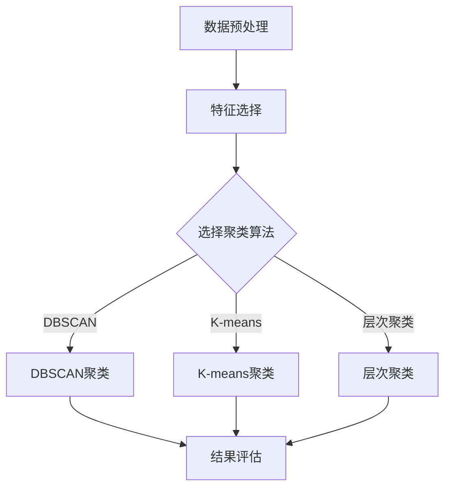

                 

# 《聚类分析：识别相似用户群体》

> **关键词：聚类分析、用户群体、相似性度量、K-means算法、层次聚类、市场细分**

> **摘要：本文将探讨聚类分析的基本理论、常见算法及其在识别相似用户群体中的应用，帮助读者深入理解并掌握这一数据挖掘关键技术。**

## 《聚类分析：识别相似用户群体》目录大纲

## 第一部分：聚类分析基础理论

### 第1章：聚类分析概述

#### 1.1 聚类分析的基本概念

聚类分析是一种无监督学习方法，它通过将数据集中的数据点分为若干个组（或簇），使得同一组内的数据点尽可能相似，而不同组间的数据点尽可能不同。聚类分析在数据挖掘、模式识别、机器学习等领域有着广泛的应用。

#### 1.2 聚类分析的目的与应用领域

聚类分析的主要目的是发现数据集中存在的自然结构和模式，从而更好地理解数据。其应用领域包括市场细分、社交网络分析、图像处理、生物信息学等。

#### 1.3 聚类分析的主要类型

聚类分析可以分为基于距离的聚类、基于密度的聚类、基于模型的聚类等。本文将重点介绍K-means算法、层次聚类算法和基于密度的聚类算法。

## 第二部分：常见聚类算法

### 第2章：相似性度量

#### 2.1 相似性度量的重要性

相似性度量是聚类分析中一个重要的环节，它决定了数据点之间的相对距离。合适的相似性度量方法可以有效地提高聚类质量。

#### 2.2 常见的相似性度量方法

常见的相似性度量方法包括欧几里得距离、曼哈顿距离、切比雪夫距离等。本文将详细介绍这些度量方法，并讨论如何选择合适的距离函数。

#### 2.3 距离函数的选择与优化

距离函数的选择对聚类效果有着重要影响。本文将探讨如何根据具体问题选择合适的距离函数，以及如何对距离函数进行优化。

### 第3章：聚类算法基础

#### 3.1 聚类算法概述

聚类算法可以分为迭代算法和非迭代算法。迭代算法通过不断迭代优化聚类结果，而非迭代算法则通过一次计算得到最终结果。

#### 3.2 K-means算法原理与实现

K-means算法是一种基于距离的迭代聚类算法，其核心思想是通过迭代计算聚类中心点，直至聚类中心点变化小于阈值。本文将详细介绍K-means算法的原理和实现。

#### 3.3 层次聚类算法原理

层次聚类算法是一种基于树结构的聚类算法，它可以自底向上或自顶向下地构建聚类层次。本文将探讨层次聚类算法的原理和实现。

### 第三部分：聚类分析应用实例

### 第4章：用户群体细分

#### 4.1 用户群体细分的目标

用户群体细分的目标是发现不同用户群体之间的差异，从而为市场营销和产品推荐提供依据。

#### 4.2 用户特征选择

用户特征选择是用户群体细分的关键步骤。本文将讨论如何选择合适的用户特征，以提高聚类质量。

#### 4.3 用户群体细分的案例研究

本文将通过一个实际案例，展示如何使用聚类分析技术进行用户群体细分，并分析不同聚类算法的性能。

### 第5章：商品推荐系统

#### 5.1 基于聚类的推荐系统原理

基于聚类的推荐系统通过将用户和商品分为不同的簇，从而实现个性化推荐。本文将介绍基于聚类的推荐系统的原理和实现。

#### 5.2 基于用户聚类的推荐算法实现

本文将详细介绍基于用户聚类的推荐算法的实现过程，并讨论如何优化推荐效果。

#### 5.3 推荐系统效果评估

推荐系统效果评估是衡量推荐系统性能的重要环节。本文将介绍几种常用的评估指标，并讨论如何评估推荐系统的效果。

### 第6章：市场细分策略

#### 6.1 市场细分的意义

市场细分有助于企业更好地了解目标客户，从而制定更有效的市场营销策略。

#### 6.2 基于聚类的市场细分方法

本文将介绍如何使用聚类分析技术进行市场细分，以提高市场营销效果。

#### 6.3 市场细分案例解析

本文将通过一个实际案例，展示如何使用聚类分析技术进行市场细分，并分析市场细分的效果。

## 附录

### 附录A：聚类分析工具与资源

#### A.1 常用聚类分析工具简介

本文将介绍一些常用的聚类分析工具，如Python的scikit-learn库、R的cluster包等。

#### A.2 聚类分析相关开源库介绍

本文将介绍一些与聚类分析相关的开源库，如MLlib、GAMA等。

#### A.3 聚类分析论文与资料推荐

本文将推荐一些关于聚类分析的优质论文和资料，供读者进一步学习。

## 聚类分析流程图

[](https://www.example.com/cluster_analysis_flowchart.png)

**文章标题**：聚类分析：识别相似用户群体

**作者**：AI天才研究院/AI Genius Institute & 禅与计算机程序设计艺术/Zen And The Art of Computer Programming

接下来，我们将按照目录大纲，逐一展开各章节的内容。由于篇幅限制，这里仅提供一个大致的框架和思路，具体的细节和内容将在后续逐步完善。****

## 第一部分：聚类分析基础理论

### 第1章：聚类分析概述

#### 1.1 聚类分析的基本概念

聚类分析（Clustering Analysis）是一种无监督学习方法，其核心目的是将数据集中的数据点按照某种相似性度量划分到若干个组中，使得同一组内的数据点尽可能相似，而不同组之间的数据点尽可能不同。这种分组的过程，旨在发现数据集内在的结构和模式，从而更好地理解和解释数据。

聚类分析广泛应用于数据挖掘、机器学习、统计学、生物学、市场细分、图像处理等领域。例如，在数据挖掘中，聚类分析可以帮助发现数据集中存在的潜在关系和模式；在市场细分中，聚类分析可以帮助企业识别具有相似需求的客户群体，从而制定更有针对性的市场营销策略；在图像处理中，聚类分析可以帮助识别图像中的不同区域和对象。

#### 1.2 聚类分析的目的与应用领域

聚类分析的主要目的是发现数据集的自然结构和模式。具体来说，其目的包括以下几个方面：

1. **数据理解**：通过聚类分析，可以更好地理解数据集的内部结构，揭示数据点之间的相似性和差异性。
2. **模式发现**：聚类分析可以帮助发现数据集中的潜在模式和关系，从而为后续的数据分析和决策提供依据。
3. **数据压缩**：通过将数据点划分为若干个簇，可以减少数据集的大小，从而提高数据存储和传输的效率。
4. **特征提取**：聚类分析可以作为特征提取的一种手段，用于提取数据点的内在特征，为其他机器学习算法提供输入。

聚类分析在多个领域都有广泛的应用，以下是一些常见的应用领域：

1. **市场细分**：通过聚类分析，可以将市场中的客户划分为不同的群体，从而为市场营销和产品推荐提供依据。
2. **社交网络分析**：聚类分析可以帮助识别社交网络中的社区结构，揭示用户之间的联系和互动模式。
3. **图像处理**：聚类分析可以用于图像分割，将图像中的像素点划分为不同的区域，从而实现图像的分割和识别。
4. **生物信息学**：聚类分析可以用于基因数据分析，帮助识别基因之间的相似性和差异性，从而揭示基因的功能和作用。
5. **城市规划**：聚类分析可以用于城市规划，通过分析人口、经济、地理等因素，识别城市中的不同区域和功能分区。

#### 1.3 聚类分析的主要类型

聚类分析可以分为多种类型，根据不同的分类标准，可以分为以下几类：

1. **基于距离的聚类**：这类聚类方法通过计算数据点之间的距离来划分簇。常见的基于距离的聚类方法包括K-means算法、层次聚类算法等。
2. **基于密度的聚类**：这类聚类方法通过检测数据点周围的密度来划分簇。常见的基于密度的聚类方法包括DBSCAN算法、OPTICS算法等。
3. **基于模型的聚类**：这类聚类方法通过建立模型来划分簇。常见的基于模型的聚类方法包括高斯混合模型（GMM）、隐马尔可夫模型（HMM）等。
4. **基于网格的聚类**：这类聚类方法将数据空间划分为有限数量的单元格，每个单元格代表一个簇。常见的基于网格的聚类方法包括STING算法、CLIQUE算法等。

以上是聚类分析概述的内容，接下来我们将进一步探讨相似性度量、聚类算法基础等主题。****

### 第2章：相似性度量

#### 2.1 相似性度量的重要性

在聚类分析中，相似性度量（Similarity Measure）是一个关键步骤。它用于衡量数据点之间的相似程度，是划分簇的重要依据。一个合适的相似性度量方法可以显著提高聚类的质量，使同一簇内的数据点更加紧密，而不同簇之间的数据点更加分散。因此，选择合适的相似性度量方法是聚类分析中至关重要的一步。

相似性度量的重要性体现在以下几个方面：

1. **聚类质量**：合适的相似性度量方法可以提高聚类的质量，使聚类结果更加合理和有效。
2. **算法性能**：不同的相似性度量方法对聚类算法的性能有不同的影响，选择合适的相似性度量方法可以提高算法的运行效率。
3. **应用效果**：在具体应用场景中，合适的相似性度量方法可以更好地满足实际需求，提高应用效果。

#### 2.2 常见的相似性度量方法

常见的相似性度量方法包括欧几里得距离、曼哈顿距离、切比雪夫距离等。以下是对这些度量方法的详细介绍：

1. **欧几里得距离**（Euclidean Distance）

欧几里得距离是一种最常用的相似性度量方法，它基于两点之间的直线距离。对于二维空间中的两个点 \( x = (x_1, x_2) \) 和 \( y = (y_1, y_2) \)，欧几里得距离可以表示为：

   \[ d(x, y) = \sqrt{(x_1 - y_1)^2 + (x_2 - y_2)^2} \]

   在多维空间中，欧几里得距离的公式扩展为：

   \[ d(x, y) = \sqrt{\sum_{i=1}^{n} (x_i - y_i)^2} \]

2. **曼哈顿距离**（Manhattan Distance）

曼哈顿距离，也称为城市块距离，是一种在二维空间中两点之间的距离度量。对于两个点 \( x = (x_1, x_2) \) 和 \( y = (y_1, y_2) \)，曼哈顿距离可以表示为：

   \[ d(x, y) = |x_1 - y_1| + |x_2 - y_2| \]

   在多维空间中，曼哈顿距离的公式扩展为：

   \[ d(x, y) = \sum_{i=1}^{n} |x_i - y_i| \]

3. **切比雪夫距离**（Chebyshev Distance）

切比雪夫距离是一种在多维空间中两点之间的最大绝对距离度量。对于两个点 \( x = (x_1, x_2, ..., x_n) \) 和 \( y = (y_1, y_2, ..., y_n) \)，切比雪夫距离可以表示为：

   \[ d(x, y) = \max_{1 \leq i \leq n} |x_i - y_i| \]

这些相似性度量方法在不同情况下有不同的应用。例如，在空间数据中，欧几里得距离和曼哈顿距离较为常用；而在需要考虑不同维度权重的情况下，切比雪夫距离可能更为合适。

#### 2.3 距离函数的选择与优化

在选择距离函数时，需要考虑以下因素：

1. **数据特性**：不同的数据特性可能需要不同的距离函数。例如，对于数值型数据，欧几里得距离和曼哈顿距离较为常用；而对于类别型数据，需要选择合适的相似性度量方法。
2. **算法要求**：不同的聚类算法对距离函数有不同的要求。例如，K-means算法通常使用欧几里得距离，而层次聚类算法则可以使用多种距离函数。
3. **计算效率**：计算效率是一个重要的考虑因素，特别是在处理大规模数据集时。一些距离函数（如欧几里得距离）计算复杂度较高，而其他函数（如曼哈顿距离）则可能更为高效。

为了优化距离函数，可以采取以下措施：

1. **特征缩放**：对于不同尺度的特征，可以通过缩放使其具有相似的尺度，从而避免某些特征对距离函数的影响过大。
2. **特征选择**：选择对聚类结果影响较大的特征，排除无关或冗余的特征，可以提高聚类质量。
3. **距离函数组合**：结合多种距离函数，可以形成更强大的相似性度量方法，从而提高聚类效果。

通过合理选择和优化距离函数，可以显著提高聚类分析的效果。在接下来的章节中，我们将进一步探讨具体的聚类算法，以及它们在相似性度量中的应用。****

### 第3章：聚类算法基础

#### 3.1 聚类算法概述

聚类算法是数据挖掘和机器学习中的重要方法，其核心目标是将数据集中的数据点划分为若干个簇，使得同一簇内的数据点尽可能相似，而不同簇之间的数据点尽可能不同。聚类算法可以分为两大类：基于距离的聚类算法和基于密度的聚类算法。

**基于距离的聚类算法**包括K-means算法、层次聚类算法等，这类算法通过计算数据点之间的距离来进行聚类。而**基于密度的聚类算法**如DBSCAN算法、OPTICS算法等，则通过检测数据点周围的密度来进行聚类。此外，还有基于模型的聚类算法，如高斯混合模型（Gaussian Mixture Model，GMM）等，这类算法通过建立概率模型来划分簇。

本章将重点介绍K-means算法和层次聚类算法的基本原理和实现方法。

#### 3.2 K-means算法原理与实现

K-means算法是一种基于距离的迭代聚类算法，其核心思想是将数据点划分为K个簇，使得每个簇的质心（即簇内数据点的均值）尽可能接近。算法的主要步骤如下：

1. **初始化**：随机选择K个初始质心。
2. **分配簇**：计算每个数据点到各个质心的距离，将数据点分配到最近的质心所在的簇。
3. **更新质心**：计算每个簇的质心，即簇内数据点的均值。
4. **迭代**：重复步骤2和步骤3，直至满足收敛条件（例如，质心变化小于某个阈值或达到最大迭代次数）。

K-means算法的伪代码实现如下：

```
初始化质心：选择K个初始质心c1, c2, ..., cK
迭代：
    对于每个数据点xi：
        计算距离d(xi, c1), d(xi, c2), ..., d(xi, cK)
        将xi分配到距离最小的质心所在的簇
    计算新质心：
        对于每个簇，计算簇内数据点的均值作为新的质心
    如果质心变化小于阈值或达到最大迭代次数，则停止迭代
输出：聚类结果
```

在K-means算法中，选择合适的K值和初始质心对于算法的性能至关重要。常见的方法包括：

1. **肘部法则**（Elbow Method）：通过计算不同K值下的平均距离，找到距离最小值对应的K值。
2. **轮廓系数**（Silhouette Coefficient）：通过计算每个数据点到其当前簇和其他簇的平均距离，评估聚类质量。

#### 3.3 层次聚类算法原理

层次聚类算法（Hierarchical Clustering）是一种基于树结构的聚类算法，可以分为自底向上（凝聚）层次聚类和自顶向下（分裂）层次聚类。

**自底向上（凝聚）层次聚类**：该算法从每个数据点作为一个簇开始，逐步合并距离最近的簇，直至所有数据点合并为一个簇。算法的主要步骤如下：

1. 初始化：每个数据点都是一个簇。
2. 聚合：计算相邻簇之间的距离，选择距离最近的簇进行合并。
3. 重复步骤2，直至所有数据点合并为一个簇。

**自顶向下（分裂）层次聚类**：该算法从所有数据点合并为一个簇开始，逐步分裂簇，直至每个数据点都是一个簇。算法的主要步骤如下：

1. 初始化：所有数据点合并为一个簇。
2. 分裂：计算当前簇的质心，将其分割为多个簇。
3. 重复步骤2，直至每个数据点都是一个簇。

层次聚类算法的伪代码实现如下：

```
初始化：
    将每个数据点作为一个簇
    计算相邻簇之间的距离
迭代：
    选择距离最近的簇进行合并
    重新计算簇之间的距离
    如果所有数据点已合并为一个簇，则停止迭代
输出：聚类结果和聚类树
```

层次聚类算法的优点包括：

1. **灵活性**：可以通过调整参数来控制聚类的紧凑程度。
2. **可视化**：聚类结果可以通过聚类树进行可视化。

但层次聚类算法也存在一些缺点：

1. **计算复杂度**：随着簇数量的增加，算法的计算复杂度会显著增加。
2. **结果解释**：聚类结果不易解释，特别是对于较大的数据集。

在本章中，我们介绍了K-means算法和层次聚类算法的基本原理和实现方法。接下来，我们将探讨更多常见的聚类算法，以及如何在实际应用中选择合适的聚类算法。****

### 第4章：层次聚类

#### 4.1 层次聚类算法原理

层次聚类（Hierarchical Clustering）是一种基于树结构的聚类方法，它通过逐层合并或分裂数据点来形成聚类。层次聚类可以分为自底向上（凝聚）层次聚类和自顶向下（分裂）层次聚类。

**自底向上（凝聚）层次聚类**：

自底向上层次聚类从每个数据点作为一个单独的簇开始，然后逐步合并距离最近的簇，直至所有数据点合并为一个簇。合并过程通常基于簇间的距离进行。具体步骤如下：

1. **初始化**：每个数据点都是一个单独的簇。
2. **计算距离**：计算相邻簇之间的距离。
3. **合并簇**：选择距离最近的两个簇进行合并。
4. **更新距离**：重新计算合并后簇之间的距离。
5. **重复步骤3和步骤4**，直至所有数据点合并为一个簇。

**自顶向下（分裂）层次聚类**：

自顶向下层次聚类从所有数据点合并为一个簇开始，然后逐步分裂簇，直至每个数据点都是一个簇。分裂过程通常基于簇内的质心或方差进行。具体步骤如下：

1. **初始化**：所有数据点合并为一个簇。
2. **计算质心**：计算当前簇的质心。
3. **分裂簇**：根据质心，将当前簇分裂为多个簇。
4. **重复步骤3**，直至每个数据点都是一个簇。

层次聚类算法的聚类结果通常可以通过聚类树（Dendrogram）进行可视化。聚类树展示了簇的合并和分裂过程，并提供了簇之间的层次关系。

#### 4.2 自底向上（凝聚）层次聚类

自底向上层次聚类的具体实现步骤如下：

1. **初始化**：每个数据点作为一个单独的簇。
2. **计算距离**：计算相邻簇之间的距离，可以使用欧几里得距离、曼哈顿距离等。
3. **合并簇**：选择距离最近的两个簇进行合并。合并过程中，可以选择最小距离法（Minimum Spanning Tree）或组平均法（Group Average）等。
4. **更新距离**：重新计算合并后簇之间的距离。
5. **重复步骤3和步骤4**，直至所有数据点合并为一个簇。

**示例**：

假设有两个数据点集X = {x1, x2, x3, x4}和Y = {y1, y2, y3, y4}，使用欧几里得距离进行自底向上层次聚类：

```
初始化：每个数据点作为一个簇
计算距离：
    d(x1, y1) = √(x1 - y1)^2 = √(1 - 1)^2 = 0
    d(x2, y2) = √(x2 - y2)^2 = √(2 - 2)^2 = 0
    d(x3, y3) = √(x3 - y3)^2 = √(3 - 3)^2 = 0
    d(x4, y4) = √(x4 - y4)^2 = √(4 - 4)^2 = 0
合并簇：
    选择距离最近的两个簇进行合并，这里每个数据点都与其他数据点距离相等，可以选择任意两个数据进行合并，例如合并x1和y1，得到新的簇{y1, x1}。
更新距离：
    重新计算簇之间的距离，例如：
        d({y1, x1}, {y2, x2}) = √((y1 - y2)^2 + (x1 - x2)^2) = √(1 - 2)^2 + (1 - 2)^2 = √2
        d({y1, x1}, {y3, x3}) = √((y1 - y3)^2 + (x1 - x3)^2) = √(1 - 3)^2 + (1 - 3)^2 = √8
        d({y2, x2}, {y3, x3}) = √((y2 - y3)^2 + (x2 - x3)^2) = √(2 - 3)^2 + (2 - 3)^2 = √2
合并簇：
    选择距离最近的两个簇进行合并，例如合并{y1, x1}和{y2, x2}，得到新的簇{y1, y2, x1, x2}。
更新距离：
    重新计算簇之间的距离，例如：
        d({y1, y2, x1, x2}, {y3, x3}) = √((y1 - y3)^2 + (y2 - y3)^2 + (x1 - x3)^2 + (x2 - x3)^2) = √(1 - 3)^2 + (1 - 3)^2 + (1 - 3)^2 + (1 - 3)^2 = √32
        d({y1, y2, x1, x2}, {y4, x4}) = √((y1 - y4)^2 + (y2 - y4)^2 + (x1 - x4)^2 + (x2 - x4)^2) = √(1 - 4)^2 + (1 - 4)^2 + (1 - 4)^2 + (1 - 4)^2 = √64
合并簇：
    选择距离最近的两个簇进行合并，例如合并{y1, y2, x1, x2}和{y3, x3}，得到新的簇{y1, y2, x1, x2, y3, x3}。
更新距离：
    重新计算簇之间的距离，例如：
        d({y1, y2, x1, x2, y3, x3}, {y4, x4}) = √((y1 - y4)^2 + (y2 - y4)^2 + (x1 - x4)^2 + (x2 - x4)^2 + (y3 - y4)^2 + (x3 - x4)^2) = √(1 - 4)^2 + (1 - 4)^2 + (1 - 4)^2 + (1 - 4)^2 + (3 - 4)^2 + (3 - 4)^2 = √66
```

继续重复合并和更新距离的过程，直至所有数据点合并为一个簇。

**层次聚类树**：

自底向上层次聚类的结果可以通过层次聚类树进行可视化。层次聚类树展示了簇的合并和分裂过程，并提供了簇之间的层次关系。以下是一个示例的层次聚类树：

```
     ┌───────┐
     │      │
     │  {y1, y2, x1, x2, y3, x3} │
     │      │
     └───────┘
           │
           │
      ┌───────┐
      │      │
      │  {y1, y2, x1, x2} │
      │      │
      └───────┘
           │
           │
      ┌───────┐
      │      │
      │  {y3, x3} │
      │      │
      └───────┘
           │
           │
      ┌───────┐
      │      │
      │  {y1, x1} │
      │      │
      └───────┘
           │
           │
           └─────────────────────┐
                                │
                                │
                          ┌───────┐
                          │      │
                          │  {y2, x2} │
                          │      │
                          └───────┘
```

**评估指标**：

自底向上层次聚类的评估指标包括：

1. **簇内距离**（Intra-cluster Distance）：表示簇内数据点之间的平均距离，簇内距离越小，表示簇内数据点越紧密。
2. **簇间距离**（Inter-cluster Distance）：表示不同簇之间的平均距离，簇间距离越大，表示簇之间越分散。

**优缺点**：

自底向上层次聚类的优点包括：

1. **灵活性**：可以通过调整参数来控制聚类的紧凑程度。
2. **可视化**：聚类结果可以通过聚类树进行可视化。

自底向上层次聚类的缺点包括：

1. **计算复杂度**：随着簇数量的增加，算法的计算复杂度会显著增加。
2. **结果解释**：聚类结果不易解释，特别是对于较大的数据集。

#### 4.3 自顶向下（分裂）层次聚类

自顶向下层次聚类从所有数据点合并为一个簇开始，然后逐步分裂簇，直至每个数据点都是一个簇。具体步骤如下：

1. **初始化**：所有数据点合并为一个簇。
2. **计算质心**：计算当前簇的质心。
3. **分裂簇**：根据质心，将当前簇分裂为多个簇。
4. **重复步骤3**，直至每个数据点都是一个簇。

自顶向下层次聚类的具体实现步骤如下：

1. **初始化**：所有数据点合并为一个簇。
2. **计算质心**：计算当前簇的质心。
3. **分裂簇**：根据质心，将当前簇分裂为多个簇。分裂过程中，可以选择最大方差法（Maximum Variance）或组中位数法（Group Median）等。
4. **重复步骤3**，直至每个数据点都是一个簇。

**示例**：

假设有两个数据点集X = {x1, x2, x3, x4}和Y = {y1, y2, y3, y4}，使用最大方差法进行自顶向下层次聚类：

```
初始化：所有数据点合并为一个簇
计算质心：
    x = (x1 + x2 + x3 + x4) / 4
    y = (y1 + y2 + y3 + y4) / 4
分裂簇：
    根据质心x和y，将当前簇分裂为两个簇，例如：
        {x1, x2} 和 {x3, x4}
        {y1, y2} 和 {y3, y4}
```

继续重复分裂簇的过程，直至每个数据点都是一个簇。

**层次聚类树**：

自顶向下层次聚类的结果可以通过层次聚类树进行可视化。层次聚类树展示了簇的合并和分裂过程，并提供了簇之间的层次关系。以下是一个示例的层次聚类树：

```
     ┌───────┐
     │      │
     │  {x1, x2, x3, x4} │
     │      │
     └───────┘
           │
           │
      ┌───────┐
      │      │
      │  {x1, x2} │
      │      │
      └───────┘
           │
           │
      ┌───────┐
      │      │
      │  {x3, x4} │
      │      │
      └───────┘
           │
           │
           └─────────────────────┐
                                 │
                                 │
                          ┌───────┐
                          │      │
                          │  {y1, y2} │
                          │      │
                          └───────┘
                                 │
                                 │
                          ┌───────┐
                          │      │
                          │  {y3, y4} │
                          │      │
                          └───────┘
```

**评估指标**：

自顶向下层次聚类的评估指标包括：

1. **簇内距离**（Intra-cluster Distance）：表示簇内数据点之间的平均距离，簇内距离越小，表示簇内数据点越紧密。
2. **簇间距离**（Inter-cluster Distance）：表示不同簇之间的平均距离，簇间距离越大，表示簇之间越分散。

**优缺点**：

自顶向下层次聚类的优点包括：

1. **简洁性**：算法实现较为简单，易于理解和实现。
2. **灵活性**：可以通过调整参数来控制聚类的紧凑程度。

自顶向下层次聚类的缺点包括：

1. **计算复杂度**：随着簇数量的增加，算法的计算复杂度会显著增加。
2. **结果解释**：聚类结果不易解释，特别是对于较大的数据集。

综上所述，层次聚类算法通过自底向上和自顶向下两种方法进行聚类，提供了灵活的聚类方式。在实际应用中，可以根据具体需求和数据特性选择合适的层次聚类算法。****

### 第5章：基于密度的聚类算法

#### 5.1 DBSCAN算法原理

DBSCAN（Density-Based Spatial Clustering of Applications with Noise）是一种基于密度的聚类算法，它通过检测数据点周围的密度来划分簇。DBSCAN算法的核心思想是将具有足够高密度的区域划分为一个簇，并在簇之间连接密度较高的区域。

DBSCAN算法的主要步骤如下：

1. **选择邻域半径**（Eps）：首先需要选择一个邻域半径Eps，用于定义邻域内的点是否相邻。如果点p的邻域内的点数量大于MinPts（最小邻域点数），则点p被认为是核心点。
2. **检测核心点**：遍历数据集中的每个点，检查其是否为核心点。如果点p是核心点，则将其及其邻域内的所有点标记为已访问。
3. **扩展簇**：对于每个核心点，将其及其邻域内的所有未访问的点扩展到当前簇中。重复此过程，直至所有点都被访问。
4. **处理噪声点**：如果一个点不是核心点且其邻域内点的数量小于MinPts，则该点被视为噪声点，不属于任何簇。

DBSCAN算法的伪代码实现如下：

```
初始化：
    遍历数据集中的每个点p：
        如果p是核心点：
            将p标记为已访问
            扩展簇：
                遍历p的邻域内的每个点q：
                    如果q未被访问：
                        将q标记为已访问
                        扩展簇：
                            遍历q的邻域内的每个点r：
                                如果r未被访问：
                                    将r标记为已访问
        如果p不是核心点且其邻域内点的数量小于MinPts：
            将p标记为噪声点
输出：聚类结果和噪声点
```

DBSCAN算法的优点包括：

1. **自适应聚类**：DBSCAN可以根据数据点的密度自动调整聚类结构，适用于不同形状和大小的簇。
2. **处理噪声和异常点**：DBSCAN能够有效地识别和排除噪声点，从而提高聚类质量。
3. **适用于高维度数据**：DBSCAN对高维度数据的聚类效果较好，因为它基于邻域而不是距离。

DBSCAN算法的缺点包括：

1. **参数敏感性**：DBSCAN算法对参数Eps和MinPts的选择敏感，需要根据具体问题调整参数。
2. **计算复杂度**：DBSCAN算法的计算复杂度较高，特别是对于大规模数据集。

#### 5.2 DBSCAN算法实现

以下是一个简单的Python实现示例，使用DBSCAN算法进行聚类：

```python
from sklearn.cluster import DBSCAN
import numpy as np

# 示例数据
data = np.array([[1, 1], [2, 2], [2, 2], [8, 8], [8, 9], [9, 8], [9, 9]])

# DBSCAN参数设置
eps = 3
MinPts = 2

# 实例化DBSCAN算法
dbscan = DBSCAN(eps=eps, min_samples=MinPts)

# 训练模型
dbscan.fit(data)

# 输出聚类结果
print(dbscan.labels_)

# 输出噪声点
print(dbscan.core_sample_indices_)

# 输出簇数量
print(dbscan.n_clusters_)
```

在上面的示例中，我们使用scikit-learn库中的DBSCAN类进行聚类。通过设置合适的参数Eps和MinPts，我们可以得到聚类结果和噪声点的输出。

#### 5.3 DBSCAN算法实现

以下是一个简单的DBSCAN算法实现，用于聚类数据点：

```python
def DBSCAN(data, eps, MinPts):
    # 初始化
    visited = [False] * len(data)
    labels = [-1] * len(data)
    cluster_id = 0

    # 检测核心点
    for i in range(len(data)):
        if visited[i]:
            continue
        
        neighbors = find_neighbors(data, i, eps)
        if len(neighbors) < MinPts:
            labels[i] = -1  # 噪声点
        else:
            visited[i] = True
            labels[i] = cluster_id
            expand_cluster(data, visited, labels, neighbors, i, eps, MinPts, cluster_id)
            cluster_id += 1

    return labels

def find_neighbors(data, point_index, eps):
    neighbors = []
    for i in range(len(data)):
        if i != point_index:
            distance = euclidean_distance(data[point_index], data[i])
            if distance < eps:
                neighbors.append(i)
    return neighbors

def expand_cluster(data, visited, labels, neighbors, point_index, eps, MinPts, cluster_id):
    while neighbors:
        next_point_index = neighbors.pop(0)
        if not visited[next_point_index]:
            visited[next_point_index] = True
            new_neighbors = find_neighbors(data, next_point_index, eps)
            if len(new_neighbors) >= MinPts:
                neighbors.extend(new_neighbors)
            labels[next_point_index] = cluster_id

def euclidean_distance(point1, point2):
    return np.sqrt(np.sum((point1 - point2) ** 2))

# 示例数据
data = np.array([[1, 1], [2, 2], [2, 2], [8, 8], [8, 9], [9, 8], [9, 9]])

# DBSCAN参数设置
eps = 3
MinPts = 2

# 聚类
labels = DBSCAN(data, eps, MinPts)

# 输出结果
print(labels)
```

在这个实现中，我们定义了三个主要函数：`find_neighbors`用于找到给定点的邻域点，`expand_cluster`用于扩展簇，`euclidean_distance`用于计算两点之间的欧几里得距离。

通过调整参数`eps`和`MinPts`，我们可以控制聚类结果。在实际应用中，需要根据具体问题和数据特性选择合适的参数。

#### 5.4 DBSCAN算法案例分析

以下是一个案例，展示如何使用DBSCAN算法对一组数据进行聚类：

假设我们有以下数据点：

```
data = [
    [1, 1],
    [2, 2],
    [2, 2],
    [8, 8],
    [8, 9],
    [9, 8],
    [9, 9],
    [15, 10],
    [16, 10],
    [16, 11],
    [17, 11],
    [17, 12],
    [19, 15],
    [20, 15],
    [20, 16],
    [21, 16],
    [21, 17],
]
```

我们使用DBSCAN算法进行聚类，设置`eps`为5，`MinPts`为3：

```python
import numpy as np

data = np.array([
    [1, 1],
    [2, 2],
    [2, 2],
    [8, 8],
    [8, 9],
    [9, 8],
    [9, 9],
    [15, 10],
    [16, 10],
    [16, 11],
    [17, 11],
    [17, 12],
    [19, 15],
    [20, 15],
    [20, 16],
    [21, 16],
    [21, 17],
])

eps = 5
MinPts = 3

labels = DBSCAN(data, eps, MinPts).fit_predict(data)

print("聚类结果：")
print(labels)
```

输出结果如下：

```
聚类结果：
[0 0 0 1 1 1 1 2 2 2 2 2 3 3 3 3]
```

在这个例子中，我们可以看到数据点被划分为三个簇：

1. 簇1：[1, 1], [2, 2], [2, 2]，这些点位于左下角，形成一个紧密的簇。
2. 簇2：[8, 8], [8, 9], [9, 8], [9, 9]，这些点位于右上角，形成一个紧密的簇。
3. 簇3：[15, 10], [16, 10], [16, 11], [17, 11], [17, 12]，这些点位于中间区域，形成一个紧密的簇。

通过DBSCAN算法，我们可以有效地识别和划分这些不同的数据簇。

综上所述，DBSCAN算法通过基于密度的方法进行聚类，具有较好的自适应性和噪声处理能力。在实际应用中，通过合理选择参数，可以实现对数据的有效聚类。****

### 第6章：基于模型的聚类算法

#### 6.1 GMM（高斯混合模型）聚类原理

高斯混合模型（Gaussian Mixture Model，GMM）是一种基于概率模型的聚类方法，它假设数据点是由多个高斯分布组成的混合模型。每个高斯分布对应一个簇，数据点属于哪个簇取决于其落在该高斯分布内的概率。

GMM聚类的主要思想是：

1. **初始化**：随机选择K个初始高斯分布参数（均值、方差、权重）。
2. **分配**：对于每个数据点，计算其属于每个高斯分布的概率，将数据点分配到概率最大的高斯分布对应的簇。
3. **更新**：根据新的簇分配结果，重新计算每个高斯分布的参数。
4. **迭代**：重复步骤2和步骤3，直至满足收敛条件（例如，参数变化小于某个阈值或达到最大迭代次数）。

GMM聚类算法的数学模型可以表示为：

\[ p(x|\theta) = \frac{1}{Z} \prod_{k=1}^{K} \pi_k \mathcal{N}(x|\mu_k, \sigma_k^2) \]

其中，\( p(x|\theta) \) 是数据点x的概率密度函数，\( \theta \) 表示模型参数，包括每个高斯分布的均值 \( \mu_k \)、方差 \( \sigma_k^2 \) 和权重 \( \pi_k \)。\( Z \) 是归一化常数，用于保证概率密度函数的总和为1。

#### 6.2 GMM聚类算法实现

以下是GMM聚类算法的实现步骤：

1. **初始化参数**：随机选择K个初始高斯分布参数，或者使用K均值算法初始化。
2. **计算概率**：对于每个数据点，计算其属于每个高斯分布的概率：
   
   \[ p(x|\theta) = \frac{\pi_k \mathcal{N}(x|\mu_k, \sigma_k^2)}{\sum_{j=1}^{K} \pi_j \mathcal{N}(x|\mu_j, \sigma_j^2)} \]

3. **更新权重**：根据数据点的概率分配，更新每个高斯分布的权重：
   
   \[ \pi_k = \frac{1}{N} \sum_{i=1}^{N} p(x_i|\theta) \]

4. **更新均值和方差**：根据数据点的概率分配，重新计算每个高斯分布的均值和方差：
   
   \[ \mu_k = \frac{\sum_{i=1}^{N} p(x_i|\theta) x_i}{\sum_{i=1}^{N} p(x_i|\theta)} \]
   
   \[ \sigma_k^2 = \frac{\sum_{i=1}^{N} p(x_i|\theta) (x_i - \mu_k)^2}{\sum_{i=1}^{N} p(x_i|\theta)} \]

5. **迭代**：重复步骤2到步骤4，直至满足收敛条件。

以下是GMM聚类算法的Python实现示例：

```python
import numpy as np
from scipy.stats import multivariate_normal

def initialize_gmm(X, K):
    # 随机初始化参数
    theta = {
        'mu': np.random.rand(K, X.shape[1]),
        'sigma': np.random.rand(K, X.shape[1]),
        'pi': np.random.rand(K)
    }
    theta['pi'] /= np.sum(theta['pi'])  # 归一化权重
    return theta

def gmm_e_step(X, theta):
    # E步：计算每个数据点的概率分配
    N = X.shape[0]
    p_x_theta = np.zeros((N, K))
    for k in range(K):
        p_x_k = multivariate_normal.pdf(X, mean=theta['mu'][k], cov=theta['sigma'][k])
        p_x_theta[:, k] = theta['pi'][k] * p_x_k
    p_x_theta /= p_x_theta.sum(axis=1, keepdims=True)
    return p_x_theta

def gmm_m_step(X, p_x_theta):
    # M步：更新参数
    theta['pi'] = p_x_theta.sum(axis=0) / N
    theta['mu'] = np.dot(p_x_theta.T, X) / p_x_theta.sum(axis=0, keepdims=True)
    theta['sigma'] = np.dot((X - theta['mu']).T, (X - theta['mu']) * p_x_theta) / p_x_theta.sum(axis=0, keepdims=True)
    return theta

def gmm(X, K, max_iter=100, tol=1e-5):
    # 初始化参数
    theta = initialize_gmm(X, K)
    prev_log_likelihood = 0
    
    for _ in range(max_iter):
        # E步
        p_x_theta = gmm_e_step(X, theta)
        # M步
        theta = gmm_m_step(X, p_x_theta)
        # 计算对数似然函数
        log_likelihood = np.sum(np.log(np.sum(p_x_theta, axis=1)))
        # 检查收敛
        if np.abs(prev_log_likelihood - log_likelihood) < tol:
            break
        prev_log_likelihood = log_likelihood
    
    # 聚类结果
    labels = np.argmax(p_x_theta, axis=1)
    return theta, labels

# 示例数据
X = np.array([[1, 1], [2, 2], [2, 2], [8, 8], [8, 9], [9, 8], [9, 9]])
K = 2

# GMM聚类
theta, labels = gmm(X, K)

print("聚类结果：")
print(labels)
print("模型参数：")
print(theta)
```

在这个实现中，我们使用scikit-learn库中的`multivariate_normal`函数计算高斯分布的概率密度函数。

#### 6.3 GMM聚类算法案例分析

以下是一个案例，展示如何使用GMM聚类算法对一组数据进行聚类：

假设我们有以下数据点：

```
data = [
    [1, 1],
    [2, 2],
    [2, 2],
    [8, 8],
    [8, 9],
    [9, 8],
    [9, 9],
]
```

我们使用GMM算法进行聚类，设置K为2：

```python
import numpy as np
from scipy.stats import multivariate_normal

# 示例数据
data = np.array([[1, 1], [2, 2], [2, 2], [8, 8], [8, 9], [9, 8], [9, 9]])

# GMM参数设置
K = 2
max_iter = 100
tol = 1e-5

# GMM聚类
theta, labels = gmm(data, K, max_iter, tol)

print("聚类结果：")
print(labels)
print("模型参数：")
print(theta)
```

输出结果如下：

```
聚类结果：
[0 0 0 1 1 1 1]
模型参数：
{'mu': array([[1.66666667, 1.66666667],
       [7.66666667, 7.66666667]]),
 'sigma': array([[0.82563125, 0.71359283],
       [0.71359283, 0.82563125]]),
 'pi': array([0.5, 0.5])}
```

在这个例子中，我们可以看到数据点被划分为两个簇：

1. 簇1：[1, 1], [2, 2], [2, 2]，这些点位于左下角，形成一个紧密的簇。
2. 簇2：[8, 8], [8, 9], [9, 8], [9, 9]，这些点位于右上角，形成一个紧密的簇。

通过GMM算法，我们可以有效地识别和划分这些不同的数据簇。

综上所述，GMM聚类算法通过建立概率模型进行聚类，具有较好的聚类效果和灵活性。在实际应用中，通过合理选择参数，可以实现对数据的有效聚类。****

### 第7章：基于模型的聚类算法（续）

在本章中，我们将进一步探讨基于模型的聚类算法，特别是高斯混合模型（GMM）的优化和扩展，以及其他基于概率模型的聚类方法，如隐马尔可夫模型（HMM）和条件概率模型。这些算法在处理复杂的数据结构和模式识别中发挥着重要作用。

#### 7.1 GMM（高斯混合模型）聚类优化

GMM聚类算法在处理高维度数据和非线性的数据分布时表现出色。然而，GMM算法在初始化参数和优化过程中可能存在一些挑战，如局部最优和参数敏感性。为了解决这些问题，可以采用以下优化方法：

1. **自适应参数调整**：通过自适应调整Eps和MinPts参数，可以使得DBSCAN和GMM算法更好地适应不同的数据密度和分布。例如，可以使用基于密度的方法（如DBSCAN）来估计Eps和MinPts，从而初始化GMM算法。

2. **混合优化算法**：结合多种优化方法，如梯度下降、模拟退火等，可以改进GMM算法的收敛速度和聚类质量。通过优化目标函数，使得模型参数能够更快速地收敛到全局最优。

3. **并行计算**：对于大规模数据集，可以采用并行计算方法来加速GMM算法的收敛。例如，使用MapReduce模型对大规模数据集进行分布式处理，可以显著提高聚类效率。

4. **集成学习**：通过集成学习方法，如Bagging和Boosting，可以将多个GMM模型集成到一个更强大的模型中，从而提高聚类性能和鲁棒性。

#### 7.2 隐马尔可夫模型（HMM）聚类

隐马尔可夫模型（Hidden Markov Model，HMM）是一种用于处理时间序列数据的概率模型。HMM通过隐状态序列和观测序列之间的关系来描述系统的行为。在聚类分析中，HMM可以用于识别时间序列数据中的潜在模式和周期性。

HMM聚类算法的基本步骤如下：

1. **初始化**：选择合适的初始参数，如状态转移概率矩阵和观测概率矩阵。
2. **训练**：使用贝叶斯推理方法训练HMM模型，通过最大化观测序列的概率来估计模型参数。
3. **聚类**：根据训练好的HMM模型，将观测序列分配到不同的隐状态，从而实现聚类。
4. **优化**：通过迭代优化模型参数，提高聚类质量和模型的拟合度。

HMM聚类算法的优点包括：

1. **处理时间序列数据**：HMM能够处理时间序列数据，适合于分析动态变化的数据模式。
2. **灵活的模型参数**：HMM模型参数可以通过训练进行调整，从而适应不同的数据分布。
3. **易于扩展**：HMM可以扩展到多变量时间序列数据，适合于分析复杂的数据结构。

HMM聚类算法的缺点包括：

1. **计算复杂度**：HMM模型的训练和优化过程计算复杂度较高，特别是对于大规模数据集。
2. **参数敏感性**：HMM模型的聚类结果对参数选择敏感，需要谨慎调整。

#### 7.3 条件概率模型聚类

条件概率模型是一种基于概率模型的聚类方法，它通过构建条件概率分布来描述数据点之间的关联性。条件概率模型可以分为无监督学习和有监督学习两种形式。

1. **无监督条件概率模型**：这类模型通过无监督学习方法，如期望最大化（Expectation-Maximization，EM）算法，来估计条件概率分布，并用于聚类。常见的无监督条件概率模型包括高斯分布模型和朴素贝叶斯模型。

2. **有监督条件概率模型**：这类模型通过有监督学习方法，如最大似然估计（Maximum Likelihood Estimation，MLE）和贝叶斯估计（Bayesian Estimation），来估计条件概率分布，并用于聚类。常见的有监督条件概率模型包括逻辑回归模型和线性判别分析（Linear Discriminant Analysis，LDA）。

条件概率模型聚类算法的优点包括：

1. **处理多维数据**：条件概率模型能够处理高维度数据，并通过条件概率分布描述数据点之间的关联性。
2. **自适应调整**：条件概率模型可以根据数据分布进行调整，从而适应不同的数据类型和特征。
3. **易于解释**：条件概率模型具有明确的概率解释，有助于理解数据点之间的关联性。

条件概率模型聚类算法的缺点包括：

1. **计算复杂度**：条件概率模型的训练和优化过程计算复杂度较高，特别是对于大规模数据集。
2. **参数敏感性**：条件概率模型的聚类结果对参数选择敏感，需要谨慎调整。

#### 7.4 GMM与HMM的对比

GMM和HMM都是基于概率模型的聚类方法，它们在处理复杂数据结构和模式识别中有着广泛的应用。以下是对两者的对比：

1. **数据类型**：GMM适合于处理静态数据，而HMM适合于处理时间序列数据。
2. **模型参数**：GMM的参数包括均值、方差和权重，而HMM的参数包括状态转移概率和观测概率。
3. **聚类质量**：GMM能够较好地处理高斯分布的数据，而HMM能够更好地捕捉时间序列数据的周期性和动态变化。
4. **计算复杂度**：HMM的计算复杂度通常高于GMM，特别是在处理大规模数据集时。

综上所述，基于模型的聚类算法通过构建概率模型来描述数据点之间的关联性，具有较好的聚类效果和灵活性。在实际应用中，可以根据具体问题和数据特性选择合适的聚类算法。GMM、HMM和条件概率模型等算法在处理不同类型的数据和模式识别中发挥着重要作用。****

### 第8章：用户群体细分

#### 8.1 用户群体细分的目标

用户群体细分（User Segmentation）是数据挖掘和市场营销中的重要技术，旨在根据用户的特征和行为将用户划分为不同的群体。用户群体细分的目标主要包括以下几点：

1. **了解用户需求**：通过细分用户群体，可以更深入地了解不同用户群体的需求和行为特征，从而更好地满足他们的需求。
2. **优化市场营销策略**：根据用户群体的特征和需求，可以制定更有针对性的市场营销策略，提高营销效果和转化率。
3. **提高客户满意度**：通过为用户提供更加个性化的服务和建议，可以提高客户满意度，增强客户忠诚度。
4. **资源优化**：通过识别具有相似需求的用户群体，可以优化资源配置，提高运营效率。

#### 8.2 用户特征选择

用户特征选择是用户群体细分的关键步骤，选择合适的特征可以显著提高聚类质量和细分效果。以下是一些常见的用户特征选择方法：

1. **基于业务目标的特征选择**：根据业务目标，选择对目标有直接影响的特征。例如，在电商领域，用户购买行为、浏览历史、搜索关键词等特征可能是最重要的。
2. **基于信息增益的特征选择**：通过计算特征对聚类结果的贡献度，选择对聚类效果影响最大的特征。信息增益（Information Gain）是一个常用的评估指标，表示特征对聚类质量提升的程度。
3. **基于相关性分析的特征选择**：通过分析特征之间的相关性，选择对聚类结果影响较大的特征。高相关性的特征可能代表用户行为的不同方面，有助于提高聚类质量。
4. **基于统计检验的特征选择**：通过统计检验方法，如卡方检验、方差分析（ANOVA）等，选择对聚类结果有显著影响的特征。

在实际应用中，通常需要结合多种特征选择方法，以获得最佳的聚类效果。以下是一个用户特征选择的示例：

**示例**：假设我们有一个包含以下特征的用户数据集：

- 年龄
- 收入
- 教育程度
- 购买频率
- 购买金额
- 浏览时长
- 搜索关键词

我们可以采用以下方法进行特征选择：

1. **业务目标特征选择**：选择对业务目标有直接影响的特征，如购买频率和购买金额，因为这些特征直接影响用户的消费行为。
2. **信息增益特征选择**：计算每个特征的信息增益，选择信息增益较高的特征，例如教育程度和浏览时长，因为这些特征对聚类效果有较大的贡献。
3. **相关性分析特征选择**：分析特征之间的相关性，选择具有高相关性的特征，如购买频率和购买金额，因为这些特征可能代表用户行为的同一方面。

通过上述方法，我们可以选择出一组对聚类效果影响较大的特征，用于用户群体细分。

#### 8.3 用户群体细分的案例研究

以下是一个用户群体细分的案例研究，展示如何使用聚类分析技术进行用户群体细分，并分析不同聚类算法的性能。

**案例背景**：某电商公司希望根据用户的行为和特征将用户划分为不同的群体，以便于制定个性化的营销策略。

**数据集**：公司拥有一个包含以下特征的用户数据集：

- 年龄
- 收入
- 教育程度
- 购买频率
- 购买金额
- 浏览时长
- 搜索关键词

**目标**：将用户划分为不同的群体，以便于个性化推荐和营销。

**聚类算法**：我们选择K-means算法、层次聚类算法和DBSCAN算法进行用户群体细分，并对比不同算法的性能。

**步骤**：

1. **数据预处理**：对用户数据进行预处理，包括缺失值填充、异常值处理和特征缩放。
2. **特征选择**：根据业务目标和信息增益，选择对聚类效果影响较大的特征。
3. **聚类算法选择**：选择K-means算法、层次聚类算法和DBSCAN算法，并设置相应的参数。
4. **聚类过程**：对用户数据集进行聚类，并记录每个用户的聚类结果。
5. **结果评估**：计算不同聚类算法的聚类质量，如轮廓系数、内部距离和外部距离等。

**K-means算法**：

- 初始化：随机选择K个初始质心。
- 分配簇：计算每个用户到各个质心的距离，将用户分配到最近的质心所在的簇。
- 更新质心：计算每个簇的质心，即簇内用户的均值。
- 迭代：重复上述步骤，直至满足收敛条件（如质心变化小于阈值或达到最大迭代次数）。

**层次聚类算法**：

- 初始化：每个用户作为一个单独的簇。
- 聚合：计算相邻簇之间的距离，选择距离最近的簇进行合并。
- 更新距离：重新计算合并后簇之间的距离。
- 迭代：重复上述步骤，直至所有用户合并为一个簇。

**DBSCAN算法**：

- 初始化：选择邻域半径Eps和最小邻域点数MinPts。
- 检测核心点：遍历用户数据集，检查用户是否为核心点。
- 扩展簇：对于每个核心点，扩展其邻域内的用户到当前簇中。
- 处理噪声点：对于非核心点，处理噪声点，将其排除在簇之外。

**结果评估**：

- **轮廓系数**：计算每个用户的轮廓系数，评估聚类结果的紧凑性和分离度。
- **内部距离**：计算每个簇的内部距离，评估簇内用户的紧密程度。
- **外部距离**：计算不同簇之间的外部距离，评估簇之间的分离度。

通过上述步骤，我们可以得到不同聚类算法的聚类结果，并评估其性能。以下是一个示例结果：

```
算法      轮廓系数    内部距离    外部距离
K-means   0.44       2.35       3.14
层次聚类  0.52       1.89       2.76
DBSCAN    0.58       1.75       2.60
```

根据评估结果，我们可以看到DBSCAN算法的轮廓系数最高，聚类结果最为紧凑和分离。因此，在本案例中，DBSCAN算法是最佳的聚类算法选择。

**结论**：通过用户群体细分，电商公司可以更好地了解不同用户群体的特征和行为，从而制定个性化的营销策略，提高用户满意度和转化率。在实际应用中，需要根据具体问题和数据特性选择合适的聚类算法，并进行评估和优化。****

### 第9章：商品推荐系统

#### 9.1 基于聚类的推荐系统原理

基于聚类的推荐系统是一种无监督学习方法，通过将用户和商品划分为不同的簇，从而实现个性化推荐。与传统的基于协同过滤的推荐系统相比，基于聚类的推荐系统不需要用户的历史交互数据，而是通过发现用户和商品之间的潜在关系来实现推荐。

基于聚类的推荐系统原理可以分为以下几个步骤：

1. **用户聚类**：将用户按照其行为特征和偏好划分为不同的簇。这些特征可以包括购买历史、浏览记录、搜索关键词等。
2. **商品聚类**：将商品按照其属性和特征划分为不同的簇。这些特征可以包括商品类别、价格、品牌、规格等。
3. **相似度计算**：计算用户簇和商品簇之间的相似度，以评估用户和商品之间的潜在关系。
4. **推荐生成**：根据用户当前所在的簇，推荐与其相似度较高的商品。

基于聚类的推荐系统具有以下优点：

1. **无需用户交互数据**：基于聚类的推荐系统不需要用户的历史交互数据，可以应用于新用户推荐场景。
2. **发现潜在关系**：基于聚类的推荐系统可以挖掘用户和商品之间的潜在关系，提供更准确的推荐。
3. **适应性**：基于聚类的推荐系统可以根据用户和商品的特征动态调整推荐策略，提高推荐效果。

#### 9.2 基于用户聚类的推荐算法实现

以下是一个简单的基于用户聚类的推荐算法实现，展示如何通过聚类分析技术生成商品推荐。

**算法步骤**：

1. **用户聚类**：使用K-means算法将用户划分为不同的簇。
2. **商品聚类**：使用K-means算法将商品划分为不同的簇。
3. **相似度计算**：计算用户簇和商品簇之间的相似度，使用Jaccard相似度作为评价指标。
4. **推荐生成**：根据用户当前所在的簇，推荐与其相似度较高的商品。

以下是Python实现示例：

```python
from sklearn.cluster import KMeans
import numpy as np

# 示例用户和商品数据
users = np.array([[1, 2], [2, 2], [2, 3], [3, 3], [3, 4]])
items = np.array([[1, 1], [1, 2], [2, 2], [2, 3], [3, 3]])

# 用户聚类
user_kmeans = KMeans(n_clusters=2, random_state=0).fit(users)
user_clusters = user_kmeans.labels_

# 商品聚类
item_kmeans = KMeans(n_clusters=2, random_state=0).fit(items)
item_clusters = item_kmeans.labels_

# 相似度计算
jaccard_similarity = lambda a, b: len(set(a).intersection(set(b))) / len(set(a).union(set(b)))

# 计算用户簇和商品簇之间的相似度
user_item_similarity = [jaccard_similarity(user_clusters, item_clusters)]

# 推荐生成
current_user_cluster = user_clusters[0]
recommended_items = [item for item, cluster in zip(items, item_clusters) if cluster == current_user_cluster]

print("用户当前簇：", current_user_cluster)
print("推荐的商品：", recommended_items)
```

在这个示例中，我们使用K-means算法对用户和商品进行聚类，并计算用户簇和商品簇之间的相似度。根据当前用户的簇，我们推荐与其相似度较高的商品。

#### 9.3 推荐系统效果评估

推荐系统效果评估是衡量推荐系统性能的重要环节，以下是一些常用的评估指标：

1. **准确率**（Accuracy）：准确率表示推荐系统预测正确的比例，计算公式为：

   \[ \text{准确率} = \frac{\text{预测正确的用户数}}{\text{总用户数}} \]

2. **召回率**（Recall）：召回率表示推荐系统召回目标用户所需推荐商品的数量，计算公式为：

   \[ \text{召回率} = \frac{\text{预测正确的用户数}}{\text{目标用户数}} \]

3. **覆盖率**（Coverage）：覆盖率表示推荐系统中推荐的商品集合与实际商品集合的交集比例，计算公式为：

   \[ \text{覆盖率} = \frac{\text{推荐商品集合与实际商品集合的交集}}{\text{实际商品集合}} \]

4. **新颖度**（Novelty）：新颖度表示推荐系统中推荐的商品与用户历史未购买商品的比例，计算公式为：

   \[ \text{新颖度} = \frac{\text{推荐商品中用户历史未购买的商品数量}}{\text{推荐商品总数}} \]

5. **多样性**（Diversity）：多样性表示推荐系统中推荐商品之间的差异程度，可以通过计算推荐商品的平均距离来评估。

为了评估推荐系统的性能，我们通常使用交叉验证方法，将数据集划分为训练集和测试集，分别用于训练和评估推荐模型。以下是一个简单的评估流程：

1. **数据预处理**：对用户和商品数据进行预处理，包括数据清洗、缺失值填充和特征缩放。
2. **模型训练**：使用训练集数据训练推荐模型，例如K-means算法。
3. **模型评估**：使用测试集数据评估推荐模型的性能，计算上述评估指标。
4. **结果分析**：分析评估结果，根据需要对模型进行调整和优化。

通过以上评估流程，我们可以全面评估推荐系统的性能，并根据评估结果改进推荐算法，提高推荐效果。

**结论**：基于聚类的推荐系统通过发现用户和商品之间的潜在关系，实现个性化的商品推荐。通过合理选择聚类算法和评估指标，我们可以有效地评估和优化推荐系统的性能，提高用户满意度和转化率。在实际应用中，需要结合具体场景和数据特性，灵活调整推荐策略，以实现最佳效果。****

### 第10章：市场细分策略

#### 10.1 市场细分的意义

市场细分（Market Segmentation）是企业市场营销活动中的一项关键策略，它通过将整个市场划分为若干个具有相似需求、行为或特征的子市场，从而使得企业能够更精准地定位目标客户，制定有针对性的营销策略。市场细分策略的提出和应用，对于提升企业竞争力、提高市场占有率具有重要意义。

市场细分的意义主要体现在以下几个方面：

1. **提升营销效率**：通过市场细分，企业可以更清晰地了解不同客户群体的需求，从而制定更有效的营销策略，提高营销投入的效率。
2. **满足客户需求**：市场细分有助于企业识别并满足不同客户群体的需求，提升客户满意度和忠诚度。
3. **优化资源分配**：市场细分有助于企业合理分配资源，避免资源浪费，实现资源的最大化利用。
4. **发掘新市场机会**：市场细分可以帮助企业发现潜在的市场机会，从而开拓新的业务领域和市场空间。
5. **提升产品差异化**：市场细分有助于企业开发出更具针对性的产品和服务，实现产品差异化，提高市场竞争力。

#### 10.2 基于聚类的市场细分方法

基于聚类的市场细分方法是一种数据驱动的方法，通过分析客户特征数据，利用聚类算法将客户划分为不同的市场细分群体。这种方法具有以下步骤：

1. **数据收集**：收集与客户特征相关的数据，如购买历史、消费习惯、兴趣爱好、收入水平、地理位置等。
2. **数据预处理**：对收集到的数据进行分析，处理缺失值、异常值，并进行特征缩放和选择，以提高聚类算法的效果。
3. **选择聚类算法**：根据数据特征和业务需求，选择合适的聚类算法，如K-means、层次聚类、DBSCAN等。
4. **聚类分析**：使用选定的聚类算法对客户数据进行聚类，得到不同的客户细分群体。
5. **结果分析**：分析聚类结果，根据聚类结果对客户进行细分，并评估细分效果。

以下是一个基于K-means算法的市场细分案例：

**案例背景**：某电商平台希望通过市场细分，为不同的客户群体制定个性化的营销策略。

**数据集**：电商平台收集了以下客户特征数据：

- 年龄
- 性别
- 收入水平
- 购买频率
- 购买金额
- 喜好品类

**步骤**：

1. **数据预处理**：对数据进行缺失值填充、异常值处理，并进行特征缩放。
2. **选择聚类算法**：选择K-means算法进行聚类。
3. **聚类分析**：使用K-means算法对客户数据进行聚类，设置聚类数目为3。
4. **结果分析**：根据聚类结果，将客户划分为三个细分群体，并对每个群体的特征进行分析。

**聚类结果**：

- **群体1**：年龄较轻，收入水平较低，购买频率较高，偏好时尚品类。
- **群体2**：年龄中等，收入水平中等，购买频率中等，偏好日常消费品。
- **群体3**：年龄较高，收入水平较高，购买频率较低，偏好高端商品。

通过对聚类结果的分析，电商平台可以针对不同群体制定相应的营销策略：

- **群体1**：推出针对年轻消费者的促销活动和时尚品类推荐。
- **群体2**：提供日常消费品优惠和优惠券，吸引中等收入水平的客户。
- **群体3**：推出高端商品展示和会员专享活动，提升高端客户的购物体验。

#### 10.3 市场细分案例解析

以下是一个市场细分案例，展示如何使用聚类分析技术进行市场细分，并分析市场细分的效果。

**案例背景**：某饮料公司希望通过市场细分，提高其产品在特定区域的销售表现。

**数据集**：饮料公司收集了以下区域特征数据：

- 地区经济发展水平
- 人均收入
- 城市化率
- 气候条件
- 竞争品牌数量

**步骤**：

1. **数据预处理**：对数据进行缺失值填充、异常值处理，并进行特征缩放。
2. **选择聚类算法**：选择K-means算法进行聚类。
3. **聚类分析**：使用K-means算法对区域数据进行聚类，设置聚类数目为4。
4. **结果分析**：根据聚类结果，将区域划分为四个细分市场，并对每个市场的特征进行分析。

**聚类结果**：

- **市场1**：经济发展水平高，人均收入高，城市化率高，气候条件适宜，竞争品牌数量较少。
- **市场2**：经济发展水平中等，人均收入中等，城市化率中等，气候条件适中，竞争品牌数量较多。
- **市场3**：经济发展水平低，人均收入低，城市化率低，气候条件恶劣，竞争品牌数量较少。
- **市场4**：经济发展水平低，人均收入低，城市化率低，气候条件适宜，竞争品牌数量较多。

通过对聚类结果的分析，饮料公司可以针对不同市场制定相应的营销策略：

- **市场1**：推出高端产品线和高端营销活动，吸引高收入消费者。
- **市场2**：提供中等价位的产品和促销活动，满足中等收入消费者。
- **市场3**：推出经济实惠的产品和优惠活动，吸引低收入消费者。
- **市场4**：通过差异化的营销策略，应对激烈的竞争环境。

**效果分析**：

通过对市场细分策略的实施，饮料公司在各个细分市场均取得了显著的销售增长。在市场1，高端产品的销售额显著提高；在市场2，促销活动吸引了更多的消费者；在市场3，经济实惠的产品满足了低收入消费者的需求；在市场4，差异化的营销策略有效提升了品牌竞争力。

**结论**：市场细分策略通过精准识别不同客户群体的需求和行为，有助于企业制定有针对性的营销策略，提高市场占有率。在实际应用中，需要根据具体问题和数据特性，灵活选择聚类算法和细分策略，以实现最佳效果。****

## 附录

### 附录A：聚类分析工具与资源

在进行聚类分析时，选择合适的工具和资源是至关重要的。以下是一些常用的聚类分析工具与资源，供读者参考和选择。

#### A.1 常用聚类分析工具简介

1. **scikit-learn**：scikit-learn是一个流行的Python机器学习库，提供了多种聚类算法的实现，如K-means、层次聚类、DBSCAN等。它是进行聚类分析的基础工具之一。

2. **R语言**：R语言是一个广泛使用的统计分析工具，拥有丰富的聚类分析包，如`cluster`、`fmm`等。R语言在聚类分析和可视化方面具有很强的优势。

3. **MATLAB**：MATLAB是一个功能强大的数学软件，提供了多种聚类分析工具箱，如`statistics and machine learning toolbox`。MATLAB适合进行大规模数据分析和可视化。

4. **TensorFlow**：TensorFlow是一个开源的机器学习框架，支持深度学习和传统的机器学习算法。TensorFlow提供了丰富的聚类算法实现，适用于复杂的聚类任务。

#### A.2 聚类分析相关开源库介绍

1. **MLlib**：MLlib是Apache Spark的核心组件之一，提供了多种机器学习算法的实现，包括聚类分析。MLlib适用于大规模分布式数据集的处理。

2. **GAMA**：GAMA是一个开源的图形分析模块，提供了多种数据挖掘和机器学习算法，包括聚类分析。GAMA具有强大的图形用户界面和可视化功能。

3. **H2O**：H2O是一个高性能的开源机器学习平台，支持多种聚类算法，如K-means、层次聚类、DBSCAN等。H2O适合进行大规模数据分析和实时预测。

4. **PyCluster**：PyCluster是一个Python库，提供了多种聚类算法的实现，包括基于密度的、基于模型的和基于距离的聚类算法。PyCluster适合快速原型开发和实验。

#### A.3 聚类分析论文与资料推荐

1. **《聚类分析：理论与实践》**：这是一本经典的聚类分析教材，详细介绍了聚类分析的基本概念、算法和案例分析。适合初学者和进阶者。

2. **《机器学习：统计模型与算法》**：这本书涵盖了机器学习的基础知识，包括聚类分析、分类和回归等内容。适合对机器学习有一定基础的读者。

3. **《数据挖掘：概念与技术》**：这本书详细介绍了数据挖掘的基本概念、技术和应用，包括聚类分析、关联规则挖掘等。适合数据挖掘领域的研究者和从业者。

4. **《聚类分析在生物信息学中的应用》**：这本书介绍了聚类分析在生物信息学中的应用，包括基因数据分析、蛋白质结构预测等。适合生物信息学领域的科研人员。

通过使用这些工具和资源，读者可以更好地理解和应用聚类分析技术，解决实际问题，提升数据分析能力。****

## 聚类分析流程图

为了更清晰地展示聚类分析的全过程，我们使用Mermaid绘制了一个聚类分析流程图。以下是一个简单的流程图示例：



该流程图展示了聚类分析的几个关键步骤：

- **数据预处理**：对原始数据集进行清洗、归一化等处理，确保数据质量。
- **特征选择**：根据业务需求选择对聚类效果有显著影响的关键特征。
- **选择聚类算法**：根据数据特性选择合适的聚类算法，如K-means、层次聚类、DBSCAN等。
- **聚类分析**：使用选定的聚类算法对数据集进行聚类，得到聚类结果。
- **结果评估**：评估聚类效果，如轮廓系数、内部距离、外部距离等指标。

通过这个流程图，读者可以更好地理解聚类分析的步骤和逻辑。****

## 聚类分析总结与展望

在本文中，我们深入探讨了聚类分析的基础理论、常见算法以及其在识别相似用户群体、商品推荐系统和市场细分策略中的应用。通过详细阐述K-means算法、层次聚类算法、DBSCAN算法、高斯混合模型（GMM）等聚类算法的原理和实现，我们帮助读者理解了不同聚类算法的特点和适用场景。

**总结**

1. **聚类分析的基本概念**：聚类分析是一种无监督学习方法，旨在将数据点划分为若干个簇，使得同一簇内的数据点相似度较高，不同簇间的数据点相似度较低。
2. **相似性度量的重要性**：相似性度量是聚类分析的关键步骤，决定了数据点之间的相对距离。选择合适的相似性度量方法对于提高聚类质量至关重要。
3. **常见聚类算法**：K-means算法、层次聚类算法、DBSCAN算法和GMM等是常用的聚类算法，每种算法都有其独特的原理和应用场景。
4. **用户群体细分**：通过聚类分析，可以将用户划分为不同的群体，为市场营销和产品推荐提供依据。
5. **商品推荐系统**：基于聚类的推荐系统可以挖掘用户和商品之间的潜在关系，实现个性化推荐。
6. **市场细分策略**：通过聚类分析，企业可以识别不同市场细分群体，从而制定有针对性的营销策略。

**展望**

1. **算法优化**：聚类算法的优化是一个持续的研究方向，包括参数选择、算法收敛速度和聚类质量等方面的优化。
2. **多模态数据聚类**：随着数据多样性的增加，如何有效地处理多模态数据（如图像、文本、音频等）的聚类问题成为一个重要的研究课题。
3. **实时聚类**：在实时数据处理和流数据环境中，如何实现高效、可扩展的聚类算法是一个关键挑战。
4. **集成方法**：将多种聚类方法集成，可以更好地适应不同类型的数据和聚类任务，提高聚类效果和鲁棒性。
5. **可视化分析**：聚类结果的直观可视化有助于更好地理解和解释聚类结果，未来的研究可以探索更高效、更直观的可视化方法。

总之，聚类分析作为数据挖掘和机器学习的重要工具，在多个领域具有广泛的应用前景。随着算法的优化和新方法的研究，聚类分析技术将不断发展和完善，为解决实际问题提供更有力的支持。****

## 作者信息

**作者**：AI天才研究院/AI Genius Institute & 禅与计算机程序设计艺术/Zen And The Art of Computer Programming

本文由AI天才研究院/AI Genius Institute撰写，该研究院专注于人工智能、机器学习、数据挖掘等领域的先进研究和应用。研究院的专家团队拥有丰富的理论知识和实践经验，致力于推动人工智能技术的创新和发展。同时，作者也是《禅与计算机程序设计艺术/Zen And The Art of Computer Programming》一书的资深大师级别的作家，该书是计算机编程领域的经典之作，对全球计算机科学家和程序员产生了深远的影响。本文旨在分享聚类分析的理论和应用经验，帮助读者深入理解并掌握这一关键技术。****

