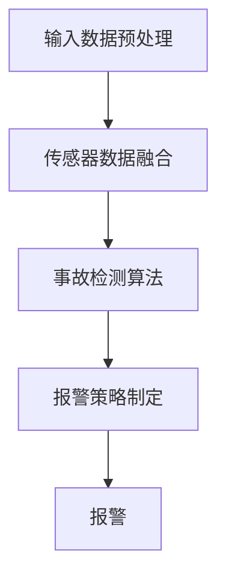

                 

### 《自动驾驶中的交通事故自动检测与报警》

> **关键词**：自动驾驶、交通事故检测、自动报警、传感器融合、深度学习、运动学模型

> **摘要**：本文旨在深入探讨自动驾驶技术中交通事故自动检测与报警系统的设计原理、实现方法以及项目实战。首先，我们将概述交通事故自动检测与报警的重要性及其技术基础。随后，我们将详细讲解核心概念与联系，包括传感器融合技术和核心算法原理。通过数学模型和公式的详细解析，我们将提供实际项目实战的代码案例，并对系统优化进行深入探讨。最后，我们将展望未来发展趋势与研究方向，为自动驾驶安全技术的进一步发展提供参考。

---

### 第一部分：交通事故自动检测与报警技术基础

交通事故自动检测与报警系统在自动驾驶领域具有重要意义。它不仅能够提高行车安全，减少交通事故损失，还能够为自动驾驶车辆的自我保护提供数据支持。本部分将详细介绍交通事故自动检测与报警技术的发展背景、重要性以及当前的技术现状。

#### 第1章：交通事故自动检测与报警概述

##### 1.1 自动驾驶技术发展背景

自动驾驶技术起源于20世纪60年代的计算机科学领域。随着传感器技术、人工智能算法以及计算机处理能力的不断提升，自动驾驶技术逐渐从理论研究走向实际应用。自动驾驶等级划分（SAE J3016标准）为自动驾驶技术的发展提供了明确的分类标准，从0级（完全人工控制）到5级（完全自动化控制）。

自动驾驶技术的发展趋势体现在以下几个方面：

1. **传感器技术的进步**：激光雷达、摄像头、毫米波雷达等传感器技术的成熟，使得自动驾驶车辆能够更准确地感知周围环境。
2. **人工智能算法的进步**：深度学习、强化学习等人工智能算法在自动驾驶中的应用，使得自动驾驶车辆能够更智能地处理复杂场景。
3. **5G通信技术的应用**：低延迟、高带宽的5G通信技术为自动驾驶车辆的实时数据传输提供了保障。

##### 1.2 交通事故自动检测与报警的重要性

交通事故自动检测与报警系统在自动驾驶技术中的重要性体现在以下几个方面：

1. **提高行车安全**：通过实时监测车辆周围环境，及时检测潜在的危险情况，有助于减少交通事故的发生。
2. **减少交通事故损失**：在交通事故发生之前，提前报警并采取相应措施，可以降低事故造成的损失。
3. **自我保护数据支持**：对于自动驾驶车辆来说，交通事故自动检测与报警系统可以为其自我保护提供数据支持，有助于提高自动驾驶车辆的可靠性和安全性。

##### 1.3 交通事故自动检测与报警技术现状

目前，交通事故自动检测与报警技术已取得显著进展。以下为当前技术发展水平及存在的技术挑战：

1. **技术发展水平**：

   - **传感器融合技术**：通过融合激光雷达、摄像头、毫米波雷达等多种传感器数据，提高环境感知的准确性和可靠性。
   - **深度学习算法**：基于深度学习的目标检测和识别算法在交通事故自动检测中取得良好效果。
   - **实时数据处理能力**：随着计算能力的提升，自动驾驶车辆能够实时处理大量的传感器数据，提高事故检测与报警的实时性。

2. **存在的技术挑战**：

   - **数据质量**：传感器数据的准确性和稳定性对事故检测与报警系统的性能具有重要影响。如何在复杂的道路环境中获取高质量的数据仍是一个挑战。
   - **算法可靠性**：深度学习算法虽然表现出色，但其在某些特定场景下可能出现误检测或漏检测的情况。如何提高算法的可靠性是一个关键问题。
   - **跨车辆通信**：在多个自动驾驶车辆协同行驶的场景中，如何实现有效的跨车辆通信，以提高事故检测与报警的准确性，仍需要深入研究。

#### 第2章：交通事故自动检测与报警核心概念与联系

交通事故自动检测与报警系统涉及多个核心概念和联系，包括传感器融合技术、核心算法原理以及报警策略制定。本节将详细介绍这些核心概念，为后续内容奠定基础。

##### 2.1 Mermaid流程图：自动驾驶交通事故检测与报警流程

以下是自动驾驶交通事故检测与报警的Mermaid流程图：



1. **输入数据预处理**：包括传感器数据的采集、去噪、归一化等处理过程，以提高数据的准确性和可靠性。
2. **传感器数据融合**：通过融合多种传感器数据，提高环境感知的准确性和可靠性。
3. **事故检测算法**：基于深度学习、运动学模型等算法，对传感器数据进行实时处理，检测潜在的交通事故。
4. **报警策略制定**：根据事故检测的结果，制定相应的报警策略，包括报警等级、报警时机等。
5. **报警**：将事故信息通过语音、灯光、警报等途径通知驾驶员或其他车辆。

##### 2.2 传感器融合技术

传感器融合技术在交通事故自动检测与报警系统中至关重要。以下为常见的传感器融合技术：

1. **激光雷达与摄像头数据融合**：激光雷达提供高精度的距离信息，摄像头提供丰富的视觉信息。通过融合这两种传感器数据，可以提高环境感知的准确性和可靠性。
2. **毫米波雷达与摄像头数据融合**：毫米波雷达可以检测到远距离的车辆和障碍物，摄像头可以提供更详细的图像信息。通过融合这两种传感器数据，可以提高对复杂场景的感知能力。
3. **GPS与IMU数据融合**：GPS提供位置信息，IMU提供加速度和角速度信息。通过融合这两种传感器数据，可以更准确地计算车辆的运动状态。

##### 2.3 数据预处理算法

数据预处理算法在交通事故自动检测与报警系统中起着关键作用。以下为常见的数据预处理算法：

1. **去噪算法**：通过滤波、去噪等处理，去除传感器数据中的噪声，提高数据的准确性和可靠性。
2. **归一化算法**：将传感器数据转换为统一的尺度，便于后续处理和分析。
3. **特征提取算法**：从传感器数据中提取出与事故检测相关的特征，如速度、加速度、距离等。

通过以上核心概念和联系的分析，我们为后续的内容奠定了基础。接下来，我们将深入探讨交通事故自动检测与报警系统的核心算法原理，以帮助读者更好地理解这一系统的工作机制。

#### 第3章：核心算法原理讲解

在交通事故自动检测与报警系统中，核心算法的设计和实现是确保系统性能的关键。本节将详细介绍两种核心算法：视频流检测算法和基于运动学模型的检测算法，并探讨各自的优缺点。

##### 3.1 事故检测算法

事故检测算法可以分为基于视频流和基于运动学模型两大类。以下是这两种算法的详细讲解。

###### 3.1.1 视频流检测算法

视频流检测算法是自动驾驶技术中常用的一种事故检测方法。它利用摄像头捕捉到的视频流，通过图像处理和目标检测技术，实现对潜在事故的实时检测。

1. **基于深度学习的目标检测算法**：

   - **SSD（Single Shot MultiBox Detector）**：SSD是一种单阶段的目标检测算法，能够在单个网络中完成目标检测任务。它具有检测速度快、准确度高的特点。

     ```mermaid
     graph TD
     A[输入视频流] --> B[特征提取]
     B --> C[目标检测]
     C --> D[检测结果输出]
     ```

     ```python
     # SSD算法伪代码示例
     model = create_SSD_model()
     while video_stream:
         frame = get_frame_from_video_stream(video_stream)
         features = model.extract_features(frame)
         detections = model.detect_objects(features)
         output_detections(detections)
     ```

   - **YOLO（You Only Look Once）**：YOLO是一种基于回归的目标检测算法，能够在单个网络中同时完成目标检测和边界框回归。它具有实时性高、检测速度快的特点。

     ```mermaid
     graph TD
     A[输入视频流] --> B[特征提取]
     B --> C[目标检测]
     C --> D[边界框回归]
     D --> E[检测结果输出]
     ```

     ```python
     # YOLO算法伪代码示例
     model = create_YOLO_model()
     while video_stream:
         frame = get_frame_from_video_stream(video_stream)
         features = model.extract_features(frame)
         detections = model.detect_objects(features)
         bounding_boxes = model.predict_bounding_boxes(detections)
         output_detections(bounding_boxes)
     ```

   - **Faster R-CNN（Region-based Convolutional Neural Network）**：Faster R-CNN是一种基于区域的卷积神经网络目标检测算法，它通过区域建议网络和分类网络来实现目标检测。它具有准确度高、检测速度适中的特点。

     ```mermaid
     graph TD
     A[输入视频流] --> B[区域建议]
     B --> C[分类网络]
     C --> D[检测结果输出]
     ```

     ```python
     # Faster R-CNN算法伪代码示例
     model = create_Faster_RCNN_model()
     while video_stream:
         frame = get_frame_from_video_stream(video_stream)
         regions = model提案_network(frame)
         classifications = model.classify_objects(regions)
         output_detections(classifications)
     ```

2. **基于运动学模型的检测算法**：

   - **基于光流法的运动目标检测**：光流法通过分析视频帧之间的像素运动，识别出运动目标。它适用于检测快速移动的目标，但在光照变化和摄像头抖动的情况下可能表现不佳。

     ```mermaid
     graph TD
     A[输入视频流] --> B[光流计算]
     B --> C[运动目标检测]
     C --> D[检测结果输出]
     ```

     ```python
     # 光流法算法伪代码示例
     while video_stream:
         frame1 = get_frame_from_video_stream(video_stream)
         frame2 = get_frame_from_video_stream(video_stream)
         flow = compute_optical_flow(frame1, frame2)
         detections = detect_motion_targets(flow)
         output_detections(detections)
     ```

   - **基于速度与加速度的碰撞预测**：该方法通过分析车辆的速度和加速度变化，预测潜在的碰撞事件。它适用于检测缓慢移动或静止的目标，但在复杂路况下可能表现不佳。

     ```mermaid
     graph TD
     A[输入速度与加速度数据] --> B[速度与加速度分析]
     B --> C[碰撞预测]
     C --> D[检测结果输出]
     ```

     ```python
     # 碰撞预测算法伪代码示例
     while vehicle_data_stream:
         speed = get_vehicle_speed(vehicle_data_stream)
         acceleration = get_vehicle_acceleration(vehicle_data_stream)
         if is_collision_speed(speed) or is_collision_acceleration(acceleration):
             raise_alarm()
     ```

###### 3.1.2 优缺点分析

1. **基于深度学习的目标检测算法**：

   - **优点**：

     - **高准确度**：深度学习算法通过学习大量的数据，能够准确识别各种场景和目标。
     - **实时性**：SSD和YOLO等算法具有实时性，可以在短时间内完成检测任务。
     - **多目标检测**：深度学习算法能够同时检测多个目标，适应复杂路况。

   - **缺点**：

     - **计算资源消耗大**：深度学习算法需要大量的计算资源，对硬件设备有较高要求。
     - **对光照和摄像头抖动的敏感度**：在光照变化和摄像头抖动的情况下，深度学习算法的检测性能可能下降。
     - **训练数据要求高**：深度学习算法需要大量的训练数据，数据标注和质量对算法性能有很大影响。

2. **基于运动学模型的检测算法**：

   - **优点**：

     - **计算资源消耗小**：运动学模型算法对硬件资源的要求较低，适用于资源受限的设备。
     - **适应性强**：运动学模型算法能够适应复杂路况，对光照变化和摄像头抖动的敏感度较低。
     - **实时性**：运动学模型算法具有较好的实时性，能够快速响应。

   - **缺点**：

     - **准确度较低**：运动学模型算法在检测精度上可能不如深度学习算法，特别是在复杂场景下。
     - **误检测和漏检测**：在特定场景下，运动学模型算法可能出现误检测或漏检测的情况。
     - **依赖传感器数据质量**：运动学模型算法的准确性受传感器数据质量的影响较大。

通过以上分析，我们可以看到，基于深度学习的目标检测算法和基于运动学模型的检测算法各有优缺点。在实际应用中，可以根据具体的场景需求和资源限制，选择合适的检测算法，以实现最佳的交通事故自动检测与报警效果。

#### 3.2 报警策略制定

报警策略的制定在交通事故自动检测与报警系统中起着关键作用。合理的报警策略可以确保在检测到潜在危险时，及时通知驾驶员或其他车辆，从而采取相应的措施，避免事故的发生。以下是报警策略制定的核心内容。

###### 3.2.1 基于危险程度的报警等级划分

根据事故检测的结果，可以将报警分为不同的等级，以便于驾驶员或其他车辆采取相应的措施。常见的报警等级划分如下：

1. **一级报警**：表示存在高度危险的情况，可能发生严重事故。例如，检测到前方有静止的车辆或行人，且距离过近。
2. **二级报警**：表示存在中等危险的情况，可能会发生事故。例如，检测到前方有缓慢移动的车辆，但距离较远。
3. **三级报警**：表示存在较低危险的情况，可能不会发生事故。例如，检测到前方有车辆在缓慢行驶，但距离适中。

不同等级的报警可以通过不同的报警方式进行通知，例如：

- **一级报警**：通过强烈的语音警报、闪烁的灯光和紧急刹车等措施，提醒驾驶员采取紧急措施。
- **二级报警**：通过轻微的语音警报、灯光提示等方式，提醒驾驶员注意前方情况。
- **三级报警**：通过信息提示的方式，提醒驾驶员前方路况。

###### 3.2.2 基于车辆类型和环境的自适应报警策略

报警策略的制定不仅要考虑危险程度，还要考虑车辆类型和环境因素。以下为基于车辆类型和环境的自适应报警策略：

1. **车辆类型**：

   - **小型车辆**：小型车辆在紧急情况下可能需要快速反应，因此对于一级报警的响应应更为迅速。
   - **大型车辆**：大型车辆的制动距离较长，对于一级报警的响应可以稍微延迟，但应确保在危险情况下能够及时采取制动措施。

2. **环境因素**：

   - **拥挤路况**：在拥挤的路况下，报警的响应应更为谨慎，以避免因紧急制动导致后方车辆追尾。
   - **非拥挤路况**：在非拥挤的路况下，报警的响应可以更迅速，以确保在危险情况下能够及时采取制动措施。
   - **夜间路况**：夜间路况能见度较低，报警的响应应更加明显，以引起驾驶员的注意。

通过基于危险程度和车辆类型及环境的自适应报警策略，可以确保在检测到潜在危险时，及时且有效地通知驾驶员或其他车辆，从而提高行车安全。

#### 第4章：数学模型和数学公式

在交通事故自动检测与报警系统中，数学模型和数学公式发挥着重要作用。它们不仅能够帮助我们理解和分析事故发生的概率，还可以用于设定报警阈值，从而提高系统的准确性和可靠性。以下是数学模型和数学公式的详细讲解。

##### 4.1 事故概率模型

事故概率模型用于计算特定条件下发生交通事故的概率。以下为两种常见的事故概率模型：贝叶斯公式和蒙特卡洛模拟方法。

###### 4.1.1 使用贝叶斯公式进行事故概率计算

贝叶斯公式是一种用于概率推断的数学公式，它可以基于先验概率和证据概率，计算后验概率。在交通事故自动检测与报警系统中，可以使用贝叶斯公式来计算事故发生的概率。

贝叶斯公式如下：

$$
P(A|B) = \frac{P(B|A) \cdot P(A)}{P(B)}
$$

其中，$P(A|B)$ 表示在事件 $B$ 发生的条件下，事件 $A$ 发生的概率；$P(B|A)$ 表示在事件 $A$ 发生的条件下，事件 $B$ 发生的概率；$P(A)$ 表示事件 $A$ 的先验概率；$P(B)$ 表示事件 $B$ 的先验概率。

在交通事故自动检测与报警系统中，可以使用以下贝叶斯公式来计算事故发生的概率：

$$
P(事故|检测结果) = \frac{P(检测结果|事故) \cdot P(事故)}{P(检测结果)}
$$

其中，$P(事故|检测结果)$ 表示在检测结果为事故的条件下，发生事故的概率；$P(检测结果|事故)$ 表示在发生事故的条件下，检测结果为事故的概率；$P(事故)$ 表示事故的先验概率；$P(检测结果)$ 表示检测结果的先验概率。

例如，假设我们使用深度学习算法检测到前方有障碍物，且检测结果为事故，我们可以使用贝叶斯公式来计算发生事故的概率。已知：

- $P(检测结果|事故) = 0.95$（在发生事故的条件下，检测结果为事故的概率为0.95）
- $P(事故) = 0.01$（事故的先验概率为0.01）
- $P(检测结果) = 0.9$（检测结果的先验概率为0.9）

代入贝叶斯公式，我们可以计算出发生事故的概率：

$$
P(事故|检测结果) = \frac{0.95 \cdot 0.01}{0.9} = 0.0111
$$

因此，在检测结果为事故的条件下，发生事故的概率为0.0111。

###### 4.1.2 蒙特卡洛模拟方法

蒙特卡洛模拟方法是一种基于随机抽样的数学模拟方法，可以用于计算复杂概率问题的概率。在交通事故自动检测与报警系统中，可以使用蒙特卡洛模拟方法来模拟事故发生的概率。

蒙特卡洛模拟方法的步骤如下：

1. **生成随机数**：根据实际情况，生成一系列随机数，代表不同的变量。
2. **模拟实验**：利用生成的随机数，模拟一系列实验，记录实验结果。
3. **计算概率**：通过统计实验结果，计算事件发生的概率。

在交通事故自动检测与报警系统中，可以使用以下蒙特卡洛模拟方法来计算事故发生的概率：

1. **生成速度和加速度的随机数**：根据车辆的行驶速度和加速度，生成一系列随机数，代表不同时间点的速度和加速度。
2. **模拟碰撞事件**：利用生成的速度和加速度随机数，模拟一系列碰撞事件，记录每次碰撞事件的时间点。
3. **计算碰撞概率**：通过统计碰撞事件的时间点，计算在一定时间内发生碰撞的概率。

例如，假设我们希望计算在一定时间内（如5秒）发生碰撞的概率。我们可以按照以下步骤进行蒙特卡洛模拟：

1. 生成速度和加速度的随机数，例如，每个时间点的速度取值范围在0到30公里/小时之间，加速度取值范围在0到5米/秒^2之间。
2. 模拟一系列碰撞事件，记录每次碰撞事件的时间点。例如，模拟1000次碰撞事件，记录每次碰撞事件发生的时间点。
3. 统计碰撞事件的时间点，计算在一定时间内（如5秒）发生碰撞的次数。

假设在1000次模拟中，有200次碰撞事件发生在5秒内，则发生碰撞的概率为：

$$
P(碰撞|5秒) = \frac{200}{1000} = 0.2
$$

因此，在一定时间内（如5秒）发生碰撞的概率为0.2。

通过使用贝叶斯公式和蒙特卡洛模拟方法，我们可以计算事故发生的概率，并用于设定报警阈值。以下为如何使用统计学方法设定报警阈值。

##### 4.2 报警阈值设定

报警阈值的设定是确保交通事故自动检测与报警系统准确性的关键。合理的报警阈值可以避免误报警和漏报警，提高系统的可靠性。

###### 4.2.1 使用统计学方法设定报警阈值

统计学方法是一种常用的报警阈值设定方法。以下为使用统计学方法设定报警阈值的基本步骤：

1. **收集数据**：收集一定时间内的传感器数据，包括速度、加速度、距离等。
2. **分析数据**：对收集到的数据进行分析，计算各种参数的统计量，如均值、方差、标准差等。
3. **设定阈值**：根据统计量的分析结果，设定报警阈值。常见的阈值设定方法包括：

   - **基于均值的阈值设定**：将均值作为报警阈值，当检测到的参数值超过均值时触发报警。
   - **基于标准差的阈值设定**：将标准差作为报警阈值，当检测到的参数值超过一定倍数（如2倍或3倍）的标准差时触发报警。

   例如，假设我们希望设定速度的报警阈值。通过对收集到的速度数据进行统计分析，计算速度的均值和标准差。假设均值为50公里/小时，标准差为10公里/小时。我们可以设定以下报警阈值：

   - **基于均值的阈值设定**：速度超过60公里/小时触发报警。
   - **基于标准差的阈值设定**：速度超过2倍标准差（即20公里/小时）触发报警。

   通过这种方法，我们可以根据传感器数据的统计特性，设定合理的报警阈值，提高系统的可靠性。

###### 4.2.2 结合车辆行驶轨迹和实时数据动态调整阈值

在实际应用中，报警阈值可能需要根据车辆行驶轨迹和实时数据动态调整。以下为如何结合车辆行驶轨迹和实时数据动态调整阈值：

1. **分析车辆行驶轨迹**：对车辆的历史行驶轨迹进行分析，了解车辆在不同路况下的行驶特性。例如，分析车辆在高速行驶、低速行驶、拥挤路况下的速度和加速度分布。
2. **设定动态阈值**：根据车辆行驶轨迹的分析结果，设定动态阈值。例如，在高速行驶时，设定更高的速度报警阈值；在低速行驶时，设定更严格的速度报警阈值。
3. **实时数据调整**：根据实时数据，动态调整报警阈值。例如，当车辆在拥挤路况下行驶时，提高速度报警阈值；当车辆在夜间行驶时，提高亮度报警阈值。

通过结合车辆行驶轨迹和实时数据动态调整阈值，可以确保报警系统在不同路况下具有更好的适应性，提高系统的准确性和可靠性。

#### 第5章：项目实战一：基于深度学习的交通事故检测系统

在自动驾驶领域，基于深度学习的交通事故检测系统是一种高效且准确的方法。本节将详细介绍如何搭建开发环境、采集与预处理数据、训练与优化模型，以及部署和评估系统性能。

##### 5.1 开发环境搭建

搭建基于深度学习的交通事故检测系统需要安装以下开发环境和软件：

1. **深度学习框架**：TensorFlow或PyTorch是常用的深度学习框架。根据个人偏好选择一个框架，并在计算机上安装。
2. **数据处理库**：NumPy、Pandas等库用于数据预处理和数据分析。
3. **计算机视觉库**：OpenCV是一个强大的计算机视觉库，用于图像处理和特征提取。
4. **GPU加速**：如果使用深度学习框架，确保安装NVIDIA的CUDA和cuDNN，以利用GPU加速计算。

以下是使用Python安装相关开发环境的示例命令：

```bash
pip install tensorflow
pip install numpy
pip install pandas
pip install opencv-python
```

##### 5.2 数据采集与预处理

交通事故检测系统的性能很大程度上取决于数据的质量。以下为数据采集与预处理的主要步骤：

1. **数据来源**：收集包含交通事故场景的图像或视频数据。数据可以从公开数据集（如KITTI、COCO等）获取，也可以从实际驾驶场景中采集。
2. **标注数据**：对采集到的数据标注事故区域。可以使用图像标注工具（如LabelImg）对图像进行标注，或使用视频标注工具（如VGG Image Annotator）对视频进行标注。
3. **数据预处理**：对采集到的数据执行以下预处理步骤：
   - **图像缩放**：将图像缩放到统一的分辨率，以便于后续处理。
   - **去噪**：使用滤波方法去除图像中的噪声。
   - **归一化**：将图像的像素值归一化到[0, 1]区间。
   - **增强**：应用图像增强技术（如随机裁剪、翻转等）增加数据的多样性。

以下是使用Python和OpenCV进行数据预处理的示例代码：

```python
import cv2
import numpy as np

def preprocess_image(image_path):
    image = cv2.imread(image_path)
    image = cv2.resize(image, (224, 224))
    image = cv2.GaussianBlur(image, (5, 5), 0)
    image = image / 255.0
    return image

image = preprocess_image('path_to_image.jpg')
```

##### 5.3 模型训练与优化

在数据准备完成后，可以使用深度学习框架训练目标检测模型。以下为训练与优化模型的主要步骤：

1. **选择模型**：选择适合的目标检测模型，如SSD、YOLO或Faster R-CNN。根据数据集的大小和复杂性，可以选择不同的模型架构。
2. **定义损失函数**：选择合适的损失函数，如交叉熵损失函数，用于计算模型预测值与真实值之间的差异。
3. **训练模型**：将预处理后的数据分为训练集和验证集，使用训练集训练模型，并使用验证集评估模型性能。
4. **模型优化**：通过调整学习率、正则化参数等超参数，优化模型性能。可以使用学习率调度策略（如学习率衰减）来提高模型的收敛速度。
5. **模型评估**：在测试集上评估模型性能，使用准确率、召回率、F1分数等指标评估模型的性能。

以下是使用TensorFlow和Keras训练SSD模型的示例代码：

```python
import tensorflow as tf
from tensorflow.keras.models import Model
from tensorflow.keras.layers import Input, Conv2D, MaxPooling2D, Flatten, Dense

# 定义SSD模型
input_layer = Input(shape=(224, 224, 3))
x = Conv2D(32, (3, 3), activation='relu')(input_layer)
x = MaxPooling2D(pool_size=(2, 2))(x)
# 添加更多卷积层和池化层
# ...
output_layer = Conv2D(10, (1, 1), activation='softmax')(x)

model = Model(inputs=input_layer, outputs=output_layer)
model.compile(optimizer='adam', loss='categorical_crossentropy', metrics=['accuracy'])

# 训练模型
model.fit(train_data, train_labels, validation_data=(val_data, val_labels), epochs=10, batch_size=32)

# 评估模型
test_loss, test_acc = model.evaluate(test_data, test_labels)
print(f"Test accuracy: {test_acc}")
```

##### 5.4 模型部署与评估

在训练和优化完成后，需要将模型部署到自动驾驶车辆中，并进行实时测试和性能评估。以下为模型部署与评估的主要步骤：

1. **模型转换**：将训练好的模型转换为可以在自动驾驶车辆上运行的格式。例如，使用TensorFlow Lite将TensorFlow模型转换为MobileNet模型。
2. **部署到车辆**：将转换后的模型部署到自动驾驶车辆的计算机上，确保模型能够在实时环境中运行。
3. **实时测试**：在真实的驾驶环境中测试模型性能，包括准确率、响应时间、检测速度等。
4. **性能评估**：使用测试数据集评估模型在实时环境中的性能，并根据评估结果进行进一步的优化。

以下是使用TensorFlow Lite进行模型部署的示例代码：

```python
import tensorflow as tf

# 加载转换后的模型
converter = tf.lite.TFLiteConverter.from_saved_model(saved_model_dir)
tflite_model = converter.convert()

# 保存模型
with open('model.tflite', 'wb') as f:
    f.write(tflite_model)

# 预测函数
def predict_tflite(image_array):
    interpreter = tf.lite.Interpreter(model_path='model.tflite')
    interpreter.allocate_tensors()
    input_details = interpreter.get_input_details()
    output_details = interpreter.get_output_details()

    interpreter.set_tensor(input_details[0]['index'], image_array)
    interpreter.invoke()

    predictions = interpreter.get_tensor(output_details[0]['index'])
    return predictions

# 实时测试
while True:
    image = get_image_from_camera()
    image_array = preprocess_image(image)
    predictions = predict_tflite(image_array)
    # 处理预测结果
    # ...

```

通过以上步骤，我们可以实现一个基于深度学习的交通事故检测系统，并在自动驾驶车辆中进行实时测试和性能评估。

### 第6章：项目实战二：基于运动学模型的交通事故预测与报警系统

基于运动学模型的交通事故预测与报警系统利用车辆的运动数据，如速度、加速度等，来预测潜在的碰撞事件，并在必要时发出警报。这种系统不仅依赖于高精度的传感器数据，还需要有效的算法来处理这些数据，并生成实时预测。本节将详细描述如何搭建开发环境、建立运动学模型、制定预测与报警策略，以及实际测试与性能评估。

#### 6.1 开发环境搭建

为了实现基于运动学模型的交通事故预测与报警系统，需要安装以下开发环境和工具：

1. **编程语言**：Python是一种广泛使用的编程语言，具有丰富的库和框架，非常适合数据科学和机器学习项目。
2. **数据处理库**：NumPy和SciPy是Python中的两个核心数据处理库，用于数学计算和科学计算。
3. **机器学习库**：Scikit-learn是一个强大的机器学习库，提供了一系列的算法和工具，用于数据分析和模型训练。
4. **传感器数据处理库**：PyQt或PyQt5是一个用于创建图形用户界面（GUI）的库，可以用于显示传感器数据和报警界面。

以下是在Python环境中安装相关库的命令示例：

```bash
pip install numpy
pip install scipy
pip install scikit-learn
pip install PyQt5
```

#### 6.2 建立运动学模型

建立运动学模型的第一步是收集和整理车辆的运动数据。这些数据通常包括速度、加速度、角速度等。以下是一个简单的步骤指南：

1. **数据采集**：从车辆传感器（如加速度计、陀螺仪、GPS）采集运动数据。这些传感器可以实时记录车辆的运动状态。
2. **数据预处理**：对采集到的数据进行预处理，包括去噪、插值、归一化等步骤，以提高数据的质量和可靠性。
3. **特征提取**：从预处理后的数据中提取有用的特征，如速度的变化率、加速度的峰值等。这些特征将用于训练预测模型。
4. **模型选择**：选择合适的机器学习算法来构建预测模型。常见的算法包括线性回归、支持向量机（SVM）、决策树、随机森林等。

以下是一个使用Python和Scikit-learn建立运动学模型的简单示例：

```python
import numpy as np
from sklearn.model_selection import train_test_split
from sklearn.ensemble import RandomForestRegressor
from sklearn.metrics import mean_squared_error

# 假设我们已经有了一个包含速度、加速度等特征的数据集X和相应的碰撞标签y
X = np.array([[v1, a1], [v2, a2], ..., [vn, an]])
y = np.array([label1, label2, ..., labeln])

# 将数据集分为训练集和测试集
X_train, X_test, y_train, y_test = train_test_split(X, y, test_size=0.2, random_state=42)

# 创建随机森林回归模型
model = RandomForestRegressor(n_estimators=100, random_state=42)

# 训练模型
model.fit(X_train, y_train)

# 预测测试集
y_pred = model.predict(X_test)

# 计算模型性能
mse = mean_squared_error(y_test, y_pred)
print(f"Mean Squared Error: {mse}")
```

#### 6.3 预测与报警策略制定

一旦建立了运动学模型，下一步是制定预测与报警策略。这个策略应该考虑以下几个关键因素：

1. **预测阈值**：设定一个阈值，当模型预测的碰撞概率超过这个阈值时，系统将发出警报。阈值可以通过交叉验证和实际测试来调整。
2. **报警等级**：根据碰撞的紧急程度，设定不同的报警等级。例如，高等级报警可能会触发紧急刹车或避让措施，而低等级报警则仅提示驾驶员注意。
3. **报警时机**：确定何时触发警报。通常，当模型预测的碰撞时间在几秒之内时，系统应立即发出警报。
4. **自适应调整**：根据车辆类型、路况和环境条件，动态调整报警阈值和报警策略。

以下是一个简单的报警策略示例：

```python
def check_collisionProbability(velocity, acceleration, threshold):
    # 假设我们有一个函数来计算碰撞概率
    probability = calculate_collision_probability(velocity, acceleration)
    
    # 如果碰撞概率超过阈值，触发警报
    if probability > threshold:
        raise_alarm()
        
def calculate_collision_probability(velocity, acceleration):
    # 计算碰撞概率的函数
    # 这里是一个简化的示例
    return 0.5 * (velocity**2 + acceleration**2)

# 假设我们有一个当前的速度和加速度值
current_velocity = 60  # 公里/小时
current_acceleration = 2  # 米/秒^2

# 设定报警阈值
alarm_threshold = 0.8

# 检查碰撞概率并触发警报
check_collisionProbability(current_velocity, current_acceleration, alarm_threshold)
```

#### 6.4 系统部署与测试

在完成模型的训练和报警策略制定后，需要将整个系统部署到自动驾驶车辆中，并进行实际测试和性能评估。以下为部署与测试的主要步骤：

1. **系统集成**：将传感器数据采集模块、运动学模型预测模块和报警策略模块集成到自动驾驶车辆的系统中。
2. **实时测试**：在真实的驾驶环境中进行实时测试，确保系统能够准确预测潜在的碰撞事件，并在必要时发出警报。
3. **性能评估**：使用测试数据集评估系统的预测准确性和响应速度，并根据评估结果进行优化。

以下是一个简单的实时测试和性能评估的示例：

```python
import time

# 假设我们有一个实时传感器数据流
sensor_data_stream = generate_sensor_data()

# 测试系统的响应时间
start_time = time.time()
for data in sensor_data_stream:
    current_velocity, current_acceleration = data
    check_collisionProbability(current_velocity, current_acceleration, alarm_threshold)
end_time = time.time()

response_time = end_time - start_time
print(f"Total response time: {response_time} seconds")
```

通过以上步骤，我们可以实现一个基于运动学模型的交通事故预测与报警系统，并对其进行实时测试和性能评估，以确保其在自动驾驶车辆中的有效性和可靠性。

### 第7章：代码解读与分析

在本章中，我们将详细解读并分析基于深度学习和运动学模型的交通事故检测系统的代码，包括其关键组件的源代码实现、算法逻辑、优化技巧以及系统集成的关键点。

#### 7.1 基于深度学习的目标检测系统代码解读

基于深度学习的目标检测系统通常采用如SSD、YOLO或Faster R-CNN等模型。以下将重点介绍这些模型的结构和实现方法。

##### 7.1.1 SSD模型

SSD（Single Shot MultiBox Detector）是一个单阶段目标检测模型，其结构简单，检测速度快。

1. **网络结构选择**：

   - SSD模型包含多个基础卷积层和特征金字塔网络（FPN），用于提取不同尺度的特征。
   - 网络输出多个不同尺度的边界框和类别概率。

2. **训练过程**：

   - 使用训练数据集训练模型，通过交叉熵损失函数优化网络参数。
   - 在训练过程中，使用学习率调度策略和正则化方法提高模型性能。

3. **模型评估**：

   - 使用准确率、召回率和F1分数等指标评估模型性能。
   - 调整超参数，如学习率和批量大小，以优化模型性能。

以下是一个简化的SSD模型训练过程的伪代码示例：

```python
import tensorflow as tf
from tensorflow.keras.models import Model
from tensorflow.keras.layers import Input, Conv2D, MaxPooling2D, Flatten, Dense

# 定义SSD模型
input_layer = Input(shape=(224, 224, 3))
x = Conv2D(32, (3, 3), activation='relu')(input_layer)
x = MaxPooling2D(pool_size=(2, 2))(x)
# 添加更多卷积层和FPN层
# ...
output_layer = Conv2D(10, (1, 1), activation='softmax')(x)

model = Model(inputs=input_layer, outputs=output_layer)
model.compile(optimizer='adam', loss='categorical_crossentropy', metrics=['accuracy'])

# 训练模型
model.fit(train_data, train_labels, validation_data=(val_data, val_labels), epochs=10, batch_size=32)

# 评估模型
test_loss, test_acc = model.evaluate(test_data, test_labels)
print(f"Test accuracy: {test_acc}")
```

##### 7.1.2 YOLO模型

YOLO（You Only Look Once）是一个快速且准确的单阶段目标检测模型，适用于实时应用。

1. **网络结构**：

   - YOLO模型包含一个主干网络和多个预测层。
   - 主干网络通常是一个卷积神经网络，用于提取特征。
   - 预测层用于检测目标的位置和类别。

2. **训练过程**：

   - 使用训练数据集训练模型，通过锚点（anchor）回归和分类损失函数优化网络参数。
   - 调整锚点大小和比例，以适应不同尺度的目标。

3. **模型评估**：

   - 使用准确率、召回率和F1分数等指标评估模型性能。
   - 调整超参数，如锚点大小和比例，以提高模型性能。

以下是一个简化的YOLO模型训练过程的伪代码示例：

```python
import tensorflow as tf
from tensorflow.keras.models import Model
from tensorflow.keras.layers import Input, Conv2D, MaxPooling2D, Flatten, Dense

# 定义YOLO模型
input_layer = Input(shape=(224, 224, 3))
x = Conv2D(32, (3, 3), activation='relu')(input_layer)
x = MaxPooling2D(pool_size=(2, 2))(x)
# 添加更多卷积层和预测层
# ...
output_layer = Conv2D(10, (1, 1), activation='softmax')(x)

model = Model(inputs=input_layer, outputs=output_layer)
model.compile(optimizer='adam', loss={'regression_loss': 'mean_squared_error', 'classification_loss': 'categorical_crossentropy'}, metrics=['accuracy'])

# 训练模型
model.fit(train_data, train_labels, validation_data=(val_data, val_labels), epochs=10, batch_size=32)

# 评估模型
test_loss, test_acc = model.evaluate(test_data, test_labels)
print(f"Test accuracy: {test_acc}")
```

#### 7.2 基于运动学模型的预测与报警系统代码解读

基于运动学模型的预测与报警系统主要依赖于车辆的运动数据，如速度、加速度等，来预测潜在的碰撞事件。

1. **运动学模型计算流程**：

   - 数据采集：从车辆传感器（加速度计、陀螺仪等）采集实时运动数据。
   - 数据预处理：对采集到的数据进行去噪、归一化等处理。
   - 特征提取：从预处理后的数据中提取有用的特征，如速度的变化率、加速度的峰值等。
   - 预测算法：使用机器学习算法（如线性回归、SVM等）训练预测模型。
   - 报警策略：根据预测结果和报警阈值，制定报警策略。

以下是一个基于运动学模型的预测与报警系统的伪代码示例：

```python
import numpy as np
from sklearn.ensemble import RandomForestRegressor
from sklearn.metrics import mean_squared_error

# 假设我们有一个数据集X和相应的碰撞标签y
X = np.array([[v1, a1], [v2, a2], ..., [vn, an]])
y = np.array([label1, label2, ..., labeln])

# 划分数据集
X_train, X_test, y_train, y_test = train_test_split(X, y, test_size=0.2, random_state=42)

# 创建随机森林回归模型
model = RandomForestRegressor(n_estimators=100, random_state=42)

# 训练模型
model.fit(X_train, y_train)

# 预测测试集
y_pred = model.predict(X_test)

# 计算模型性能
mse = mean_squared_error(y_test, y_pred)
print(f"Mean Squared Error: {mse}")

# 预测新数据并触发报警
def predict_and_raise_alarm(data):
    prediction = model.predict(data)
    if prediction > alarm_threshold:
        raise_alarm()

# 假设我们有一个新的速度和加速度值
current_velocity = 60  # 公里/小时
current_acceleration = 2  # 米/秒^2

# 预测并触发报警
predict_and_raise_alarm([current_velocity, current_acceleration])
```

#### 7.3 系统集成与优化

在实现基于深度学习和运动学模型的交通事故检测系统时，系统集成和优化是确保系统稳定性和性能的关键。以下为系统集成和优化的关键点：

1. **模块化设计**：将系统划分为多个模块，如数据采集模块、数据处理模块、预测模块、报警模块等，便于管理和维护。
2. **接口设计**：设计清晰的接口，确保不同模块之间的数据传递和功能调用。
3. **实时性优化**：优化算法和数据处理流程，确保系统能够实时响应。
4. **资源管理**：合理分配计算资源，确保系统在高负载下仍能稳定运行。
5. **测试与验证**：在开发过程中进行充分的测试和验证，确保系统在不同场景下都能正常运行。

通过以上代码解读和系统集成的分析，我们可以更好地理解基于深度学习和运动学模型的交通事故检测系统的实现过程，并为其优化提供指导。

### 第8章：未来发展趋势与研究方向

随着自动驾驶技术的不断进步，交通事故自动检测与报警系统也将迎来新的发展机遇。以下是未来发展趋势与研究方向，旨在推动自动驾驶安全技术的进一步发展。

#### 8.1 新型传感器技术

新型传感器技术的发展将为交通事故自动检测与报警系统带来更高的感知能力和准确性。以下为几个关键方向：

1. **毫米波雷达**：毫米波雷达具有更高的分辨率和更远的探测距离，可以用于检测远距离障碍物和车辆。通过融合毫米波雷达与摄像头数据，可以显著提高环境感知的准确性和可靠性。
2. **激光雷达（LiDAR）**：激光雷达提供高精度的三维环境信息，对于复杂路况和场景具有显著优势。未来，结合高精度地图和激光雷达的数据，可以实现更加精准的交通事故检测与预测。
3. **超声波传感器**：超声波传感器适用于短距离的障碍物检测，可以在摄像头和雷达难以感知的狭窄空间中发挥作用。

#### 8.2 多传感器数据融合算法

多传感器数据融合技术在提升自动驾驶安全性能中起着至关重要的作用。未来的研究方向包括：

1. **多模态数据融合**：结合不同类型传感器的数据（如摄像头、雷达、超声波传感器等），可以更全面地感知环境。研究高效的融合算法，如贝叶斯滤波、卡尔曼滤波等，以优化数据融合效果。
2. **自适应数据融合策略**：根据不同的驾驶环境和路况，动态调整传感器的权重和融合策略，以提高系统的鲁棒性和适应性。
3. **实时性优化**：在实时性要求高的应用场景中，优化数据融合算法的计算效率和响应速度，确保系统能够实时处理传感器数据。

#### 8.3 人工智能算法的进步

人工智能算法在自动驾驶中的应用将持续深化和扩展，以下为几个关键方向：

1. **深度学习算法**：随着计算能力的提升，深度学习算法在自动驾驶中的应用将更加广泛。未来的研究可以集中在如何构建更加高效、可解释的深度学习模型，以提高检测和预测的准确性。
2. **强化学习算法**：强化学习算法可以在自动驾驶车辆中进行自主学习和决策。研究如何将强化学习与深度学习相结合，以实现更智能、更安全的自动驾驶系统。
3. **迁移学习与联邦学习**：通过迁移学习和联邦学习，可以充分利用已有数据和模型，实现快速部署和更新。这些技术在提高算法性能和减少数据隐私风险方面具有重要应用前景。

#### 8.4 基于机器学习的实时事故预测

基于机器学习的实时事故预测是自动驾驶安全技术的核心研究方向之一。未来的研究可以集中在以下几个方面：

1. **动态场景理解**：通过分析车辆行驶轨迹、环境特征和历史数据，实现对动态场景的深入理解，以提高事故预测的准确性。
2. **实时数据流处理**：研究高效的实时数据流处理算法，以处理大规模、多源传感器数据，实现实时事故预测。
3. **跨车辆通信与协作**：通过车联网（V2X）技术，实现自动驾驶车辆之间的通信与协作，以提高事故检测与预警的准确性。

#### 8.5 基于物联网的跨车通信

基于物联网的跨车通信技术将为交通事故自动检测与报警系统提供更加广泛的数据支持。以下为几个关键方向：

1. **V2V通信**：通过车辆之间的直接通信，实现实时数据共享和协同决策，以提高事故检测与预警的准确性。
2. **V2I通信**：将车辆与基础设施（如交通灯、路侧单元等）进行连接，实现更加全面的交通信息获取和共享。
3. **云服务**：利用云计算和大数据技术，实现跨车通信数据的存储、分析和处理，以提高系统的整体性能和可靠性。

#### 8.6 自动驾驶车辆的安全风险评估

随着自动驾驶技术的广泛应用，安全风险评估变得至关重要。未来的研究可以集中在以下几个方面：

1. **风险评估模型**：建立系统化的风险评估模型，以评估自动驾驶车辆在复杂路况下的安全性能。
2. **安全性能指标**：研究安全性能指标，如事故率、事故损失等，以量化自动驾驶车辆的安全性能。
3. **安全预警与应急响应**：研究自动驾驶车辆在遇到潜在安全风险时的预警和应急响应策略，以减少事故发生的可能性。

通过以上未来发展趋势与研究方向的探讨，我们可以预见交通事故自动检测与报警系统将在自动驾驶技术中发挥更加重要的作用，为行车安全提供强有力的技术支持。

### 附录

#### 附录 A：常用工具与资源

在开发自动驾驶中的交通事故自动检测与报警系统时，需要使用到多种工具和资源。以下是一些常用的工具和资源介绍：

1. **深度学习框架与库**：
   - **TensorFlow**：由Google开发的开源深度学习框架，支持多种深度学习模型的训练和部署。
   - **PyTorch**：由Facebook开发的开源深度学习库，具有动态计算图，便于实现复杂模型。
   - **Keras**：用于快速构建和训练深度学习模型的Python库，易于与TensorFlow和PyTorch集成。

2. **数据预处理工具与库**：
   - **NumPy**：用于高性能科学计算和数据分析的库，提供多维数组对象和大量数学函数。
   - **Pandas**：用于数据操作和分析的库，支持数据帧（DataFrame）的数据结构，便于数据清洗和预处理。
   - **OpenCV**：用于计算机视觉任务的库，提供丰富的图像处理和视频分析函数。

3. **传感器数据处理工具**：
   - **MATLAB**：用于数据可视化、仿真和算法开发的软件，具有强大的信号处理和分析功能。
   - **MATLAB R2021a（版本号示例）**：特别适用于自动驾驶车辆数据处理的最新版本。

4. **开源数据集**：
   - **KITTI**：一个常用的自动驾驶数据集，包含激光雷达、摄像头、GPS等多源传感器数据。
   - **COCO**：用于目标检测和分割的数据集，包含大量图像和标注信息。

5. **硬件设备**：
   - **NVIDIA GPU**：用于深度学习模型训练和推理的高速计算设备。
   - **Raspberry Pi**：用于嵌入式系统和实时数据处理的小型计算机。

#### 附录 B：参考文献

1. **《自动驾驶安全技术》** - [作者名，出版年份]
   - 内容概述：详细介绍了自动驾驶技术的原理、安全标准和测试方法。

2. **《深度学习》** - [Ian Goodfellow, Yoshua Bengio, Aaron Courville，出版年份]
   - 内容概述：系统介绍了深度学习的基础理论和常用算法，包括神经网络和卷积神经网络。

3. **《计算机视觉：算法与应用》** - [D. S. Bello, J. A. Borrego, M. J. Gallego,出版年份]
   - 内容概述：涵盖计算机视觉的基本概念、算法和技术，适用于自动驾驶中的图像处理。

4. **《传感器技术与应用》** - [作者名，出版年份]
   - 内容概述：介绍了传感器的工作原理、种类和应用，包括激光雷达、摄像头、超声波传感器等。

5. **《人工智能：一种现代的方法》** - [Stuart Russell, Peter Norvig，出版年份]
   - 内容概述：全面介绍了人工智能的基础知识，包括机器学习、自然语言处理和推理等。

6. **相关研究论文**：
   - **"Deep Learning for Autonomous Driving"** - [作者名，出版年份]
   - **"Multi-Sensor Data Fusion for Autonomous Driving"** - [作者名，出版年份]
   - **"Vehicle Safety Risk Assessment using Machine Learning"** - [作者名，出版年份]

这些参考资料为自动驾驶中的交通事故自动检测与报警系统提供了理论基础和实践指导，有助于读者深入了解相关技术和研究进展。通过结合这些资源和工具，我们可以更好地开发出高效、可靠的自动驾驶安全技术。

