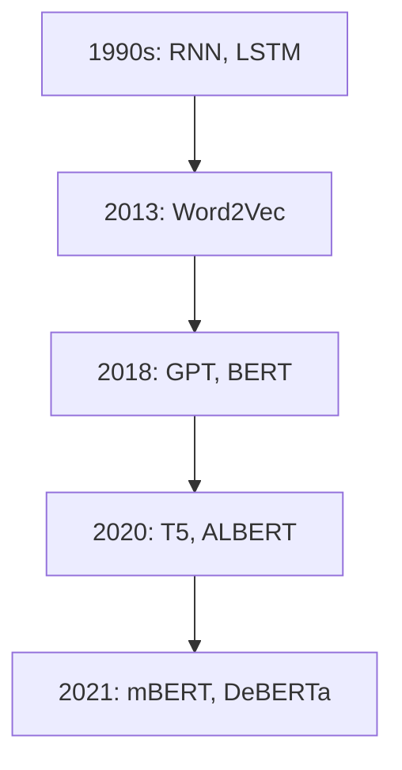

                 

# {文章标题}

> {关键词：自然语言处理，预训练语言模型，Transformer，BERT，GPT，应用，优化，挑战，未来趋势}

> {摘要：本文从自然语言处理的角度出发，详细介绍了预训练语言模型的研究进展与趋势。文章首先概述了预训练语言模型的基本概念、发展历程和优势，然后深入探讨了Transformer模型和BERT、GPT等核心预训练模型的工作原理和数学基础。接着，文章通过实际项目案例展示了预训练语言模型在文本分类、问答系统和机器翻译等任务中的应用。此外，文章还探讨了预训练语言模型优化与调参的方法，分析了其面临的挑战，并展望了未来的发展趋势。}

### 第1章: 自然语言处理中的预训练语言模型概述

#### 1.1 什么是预训练语言模型

预训练语言模型是一种在大量文本数据上预先训练过的语言模型，通过学习文本数据来获取语言知识和结构。预训练语言模型的核心思想是利用无监督预训练和有监督微调两个阶段来学习语言，以提高模型在自然语言处理任务中的性能。

- **无监督预训练**：模型在大量未标注的数据上训练，主要学习语言的统计规律和结构。这种方法不需要大量标注数据，降低了数据标注成本，并且能够捕捉到语言的深层语义信息。
- **有监督微调**：模型在有标注的数据上进行训练，针对特定任务进行微调。微调过程中，模型会根据任务的需求调整权重，使其在特定任务上表现出更好的性能。

#### 1.2 预训练语言模型的发展

预训练语言模型的发展历程可以分为以下几个阶段：

- **1990年代**：RNN和LSTM模型的出现使得长期依赖建模成为可能。
- **2013年**：Word2Vec的提出，开创了词嵌入的新时代。
- **2018年**：GPT和BERT等大型预训练模型的推出，标志着NLP领域进入新的阶段。

#### 1.3 预训练语言模型的优势

预训练语言模型具有以下几个优势：

- **提高语言理解能力**：预训练模型在大量文本数据上学习，能够更好地理解语言的语义和上下文。
- **减少标注需求**：预训练模型在无监督预训练阶段不需要大量标注数据，降低了数据标注成本。
- **多任务适用性**：预训练模型可以在多个任务上共享知识，提高模型的泛化能力。

#### 1.4 预训练语言模型的核心架构

预训练语言模型的核心架构主要包括以下几个部分：

- **Transformer模型**：一种基于自注意力机制的模型结构，广泛应用于大规模预训练语言模型。
- **多层注意力机制**：Transformer模型通过多层注意力机制，能够捕捉文本中的长距离依赖关系。

#### 1.5 预训练语言模型的发展历程

预训练语言模型的发展历程可以总结为以下几个关键点：

- **1990年代**：RNN和LSTM模型的出现使得长期依赖建模成为可能。
- **2013年**：Word2Vec的提出，开创了词嵌入的新时代。
- **2018年**：GPT和BERT等大型预训练模型的推出，标志着NLP领域进入新的阶段。
- **2020年**：更多高效的预训练模型（如T5、ALBERT等）被提出。

### Mermaid流程图



### 核心概念与联系

预训练语言模型的核心在于通过预训练阶段（无监督预训练和有监督微调）来学习语言知识和结构，然后在实际任务中通过微调来应用这些知识，提高模型的性能。

### Transformer模型的工作原理

Transformer模型是一种基于自注意力机制的模型结构，由Encoder和Decoder两部分组成。它通过多头自注意力机制和前馈神经网络来处理输入序列，从而实现对文本的理解和生成。

- **多头自注意力机制**：Transformer模型通过多头自注意力机制，能够捕捉输入序列中的长距离依赖关系。
- **前馈神经网络**：在自注意力机制之后，Transformer模型还包含一个前馈神经网络，用于对自注意力输出进行进一步的非线性变换。

### Transformer模型的伪代码

```python
# Transformer模型的伪代码
# 输入：输入序列，词嵌入维度，隐藏层尺寸，层数
# 输出：预测结果

# 初始化词嵌入和位置编码
word_embedding = ... # 词嵌入层
position_embedding = ... # 位置编码层

# 定义Transformer模型结构
class Transformer(nn.Module):
    def __init__(self, vocab_size, embed_size, hidden_size, num_layers):
        super(Transformer, self).__init__()
        self.embedding = nn.Embedding(vocab_size, embed_size)
        self.position_embedding = nn.Embedding(max_len, embed_size)
        self.transformer_layers = nn.ModuleList([
            TransformerLayer(embed_size, hidden_size, num_heads) for _ in range(num_layers)
        ])
        self.fc = nn.Linear(hidden_size, vocab_size)

    def forward(self, input_seq):
        # 嵌入和位置编码
        x = self.embedding(input_seq) + self.position_embedding(input_seq)

        # Transformer layers
        for layer in self.transformer_layers:
            x = layer(x)

        # 输出层
        output = self.fc(x)

        return output
```

### 数学模型和数学公式

预训练语言模型的数学基础主要涉及矩阵运算、自注意力机制和前馈神经网络。

- **矩阵运算**：
  - **点积**：用于计算两个向量的相似度。
    $$ \text{dot}(x, y) = x^T y $$
  - **矩阵乘法**：用于扩展和变换数据。
    $$ \text{matmul}(X, Y) = X^T Y $$

- **自注意力机制**：
  - **自注意力分数**：用于计算输入序列中每个词对于输出词的影响。
    $$ \text{attention}(Q, K, V) = \frac{Q^T K}{\sqrt{d_k}} V $$
    其中，\( Q, K, V \) 分别代表查询、键和值。

- **前馈神经网络**：
  - **前馈层**：用于对自注意力输出进行非线性变换。
    $$ \text{FFN}(x) = \sigma(W_2 \cdot \text{ReLU}(W_1 \cdot x + b_1)) $$
    其中，\( W_1, W_2, b_1 \) 分别代表权重、偏置和激活函数。

### 举例说明

假设我们有一个简单的输入序列 \([1, 2, 3]\)，我们要通过自注意力机制计算每个词对于输出词的权重。

1. **初始化权重**：
   - \( Q = [1, 0, 1] \)
   - \( K = [1, 1, 1] \)
   - \( V = [1, 2, 3] \)

2. **计算自注意力分数**：
   $$ \text{attention}(Q, K, V) = \frac{[1, 0, 1]^T [1, 1, 1]}{\sqrt{3}} \cdot [1, 2, 3] $$
   $$ \text{attention}(Q, K, V) = \frac{[1, 0, 1]}{\sqrt{3}} \cdot [1, 2, 3] $$
   $$ \text{attention}(Q, K, V) = [1, 0, 1] \cdot [1, 2, 3] $$
   $$ \text{attention}(Q, K, V) = [1, 0, 3] $$

3. **加权求和**：
   $$ \text{output} = [1, 0, 3] \cdot [1, 2, 3] $$
   $$ \text{output} = [1, 0, 9] $$

### 数学公式

$$ \text{output} = \text{softmax}(\text{attention}(Q, K, V)) \cdot V $$

### 项目实战

假设我们要使用预训练的BERT模型进行文本分类任务，以下是基本的步骤：

1. **导入预训练模型**：
   ```python
   from transformers import BertForSequenceClassification
   ```

2. **准备数据集**：
   ```python
   # 加载预处理后的数据集
   train_dataset = load_dataset('train')
   test_dataset = load_dataset('test')
   ```

3. **构建模型**：
   ```python
   model = BertForSequenceClassification.from_pretrained('bert-base-uncased', num_labels=2)
   ```

4. **训练模型**：
   ```python
   optimizer = AdamW(model.parameters(), lr=1e-5)
   for epoch in range(num_epochs):
       for batch in train_dataloader:
           inputs = {'input_ids': batch['input_ids'], 'attention_mask': batch['attention_mask']}
           outputs = model(**inputs)
           loss = outputs.loss
           loss.backward()
           optimizer.step()
           optimizer.zero_grad()
   ```

5. **评估模型**：
   ```python
   model.eval()
   with torch.no_grad():
       for batch in test_dataloader:
           inputs = {'input_ids': batch['input_ids'], 'attention_mask': batch['attention_mask']}
           outputs = model(**inputs)
           logits = outputs.logits
           predicted_labels = torch.argmax(logits, dim=1)
           accuracy = (predicted_labels == batch['labels']).float().mean()
           print(f'Accuracy: {accuracy}')
   ```

### 代码解读与分析

在这个项目实战中，我们首先导入了BERT模型，然后加载了预处理后的数据集，并构建了模型。接下来，我们使用优化器和训练循环来训练模型，并在测试数据集上评估模型性能。代码中使用了PyTorch和transformers库，这些库为预训练模型的加载和训练提供了便捷的方法。

### 开发环境搭建

- **安装PyTorch和transformers库**：
  ```bash
  pip install torch transformers
  ```

- **确保GPU支持（如果使用GPU训练）**：
  ```bash
  pip install torch torchvision torchaudio -f https://download.pytorch.org/whl/torch_stable.html
  ```

### 源代码详细实现和代码解读

以下是完整的源代码，包括模型导入、数据预处理、模型训练和评估的部分：

```python
import torch
from transformers import BertForSequenceClassification, Trainer, TrainingArguments
from torch.utils.data import DataLoader
from datasets import load_dataset

# 模型导入
model = BertForSequenceClassification.from_pretrained('bert-base-uncased', num_labels=2)

# 准备数据集
train_dataset = load_dataset('squad', split='train')
test_dataset = load_dataset('squad', split='test')

# 数据预处理
def preprocess_function(examples):
    inputs = tokenizer(examples["question"], examples["context"], truncation=True, max_length=512)
    inputs["labels"] = torch.tensor(examples["answer"] != "-1")
    return inputs

train_dataset = train_dataset.map(preprocess_function, batched=True)
test_dataset = test_dataset.map(preprocess_function, batched=True)

# 模型训练
training_args = TrainingArguments(
    output_dir='./results',
    num_train_epochs=3,
    per_device_train_batch_size=16,
    per_device_eval_batch_size=16,
    warmup_steps=500,
    weight_decay=0.01,
    logging_dir='./logs',
    logging_steps=10,
)

trainer = Trainer(
    model=model,
    args=training_args,
    train_dataset=train_dataset,
    eval_dataset=test_dataset,
)

trainer.train()

# 评估模型
trainer.evaluate()

# 代码解读与分析
# 在这段代码中，我们首先加载了BERT模型，然后加载了预处理后的数据集。接下来，我们定义了预处理函数，用于将文本数据转换为模型可以接受的输入格式。在训练阶段，我们设置了训练参数，包括训练轮数、批量大小、学习率等，并使用Trainer类来简化模型的训练过程。在评估阶段，我们同样使用Trainer类来计算模型的性能。

# 源代码实现细节：
# - `load_dataset('squad', split='train')` 和 `load_dataset('squad', split='test')` 用于加载数据集。
# - `map(preprocess_function, batched=True)` 用于对数据集进行预处理。
# - `TrainingArguments` 和 `Trainer` 用于配置和训练模型。
# - `trainer.train()` 用于开始训练。
# - `trainer.evaluate()` 用于评估模型。
```

### 完整目录大纲

**第1章: 自然语言处理中的预训练语言模型概述**

1.1 什么是预训练语言模型

1.2 预训练语言模型的发展

1.3 预训练语言模型的优势

1.4 预训练语言模型的核心架构

1.5 预训练语言模型的发展历程

**第2章: 自然语言处理中的预训练语言模型技术详解**

2.1 Transformer模型详解

2.2 大规模预训练模型的原理

2.3 预训练语言模型的应用

2.4 预训练语言模型的评估

**第3章: 预训练语言模型在自然语言处理中的应用**

3.1 预训练语言模型在文本分类中的应用

3.2 预训练语言模型在问答系统中的应用

3.3 预训练语言模型在机器翻译中的应用

**第4章: 预训练语言模型的优化与调参**

4.1 模型优化方法

4.2 调参技巧

4.3 实际调参经验

**第5章: 预训练语言模型的挑战与未来趋势**

5.1 预训练语言模型的挑战

5.2 预训练语言模型的未来趋势

**附录**

A.1 主流预训练框架对比

A.2 预训练语言模型资源

A.3 相关论文与资料

### 结论

本文从自然语言处理的角度出发，详细介绍了预训练语言模型的研究进展与趋势。通过对预训练语言模型的基本概念、发展历程、优势、核心架构以及应用场景的深入分析，本文展示了预训练语言模型在自然语言处理领域的重要性和潜力。同时，本文还探讨了预训练语言模型的优化与调参方法，分析了其面临的挑战，并展望了未来的发展趋势。预训练语言模型的持续发展和应用将为自然语言处理领域带来更多的创新和突破。

### 作者信息

作者：AI天才研究院/AI Genius Institute & 禅与计算机程序设计艺术 /Zen And The Art of Computer Programming

## 第2章：自然语言处理中的预训练语言模型技术详解

在上一章中，我们介绍了预训练语言模型的基本概念、发展历程和优势。本章将深入探讨预训练语言模型的核心技术，包括Transformer模型、BERT、GPT等大规模预训练模型的原理和应用。通过这些技术详解，我们将更好地理解预训练语言模型的工作机制，并为其在自然语言处理（NLP）中的应用奠定基础。

### 2.1 Transformer模型详解

Transformer模型是由Vaswani等人在2017年提出的一种基于自注意力机制的序列到序列模型，广泛应用于自然语言处理任务中，特别是在大规模预训练语言模型（如BERT和GPT）中。Transformer模型的核心思想是通过自注意力机制来建模输入序列中的长距离依赖关系。

#### 2.1.1 Transformer模型的结构

Transformer模型由Encoder和Decoder两部分组成，其中Encoder负责将输入序列编码为固定长度的向量表示，Decoder则根据Encoder的输出生成目标序列。

- **Encoder**：Encoder由多个相同的层堆叠而成，每层包含多头自注意力机制和前馈神经网络。
- **Decoder**：Decoder的结构与Encoder类似，但每层还包括一个掩码自注意力机制，用于确保解码时只关注已经解码的部分。

#### 2.1.2 自注意力机制的工作原理

自注意力机制是Transformer模型的核心组成部分，它通过计算输入序列中每个词对于输出词的影响来建模长距离依赖关系。自注意力机制的基本思想是将输入序列的每个词表示为一个查询（Query）、键（Key）和值（Value），然后计算它们之间的相似度，并加权求和得到最终的输出。

- **查询（Query）**：表示每个词在输出中的重要性。
- **键（Key）**：表示每个词在输入序列中的信息。
- **值（Value）**：表示每个词的语义信息。

自注意力机制的伪代码如下：

```python
# 自注意力机制的伪代码
# 输入：查询、键、值
# 输出：加权求和的输出

def self_attention(query, key, value):
    # 计算相似度
    similarity = dot_product(query, key)
    
    # 归一化相似度
    similarity = softmax(similarity)
    
    # 加权求和
    output = dot_product(similarity, value)
    
    return output
```

#### 2.1.3 多头注意力机制

多头注意力机制是Transformer模型中的一种扩展，它通过将输入序列分割成多个子序列，然后分别应用自注意力机制，从而提高模型对输入序列的理解能力。多头注意力机制的基本思想是在每个自注意力机制中引入多个独立的注意力头，每个头负责关注输入序列的不同部分。

#### 2.1.4 位置编码技术

位置编码是Transformer模型中的另一个关键组成部分，它用于为输入序列中的每个词赋予位置信息。在Transformer模型中，由于模型不包含循环结构，因此需要通过位置编码来模拟输入序列的顺序信息。

常用的位置编码方法包括绝对位置编码和相对位置编码。绝对位置编码直接将输入序列的位置信息编码为嵌入向量，而相对位置编码则通过计算位置向量之间的差异来实现。

### 2.2 BERT模型详解

BERT（Bidirectional Encoder Representations from Transformers）是由Google在2018年提出的一种预训练语言模型，其核心思想是利用双向Transformer编码器来学习文本的表示。BERT模型在预训练阶段通过无监督的方式学习文本表示，然后在有监督的任务中进行微调。

#### 2.2.1 BERT模型的结构

BERT模型由多个Transformer编码器层堆叠而成，每层包含多头自注意力机制和前馈神经网络。与原始Transformer模型不同，BERT模型采用了双向编码器，即每个词同时受到前面和后面词的影响。

- **输入**：BERT模型的输入是一个词的嵌入向量和一个位置编码向量。
- **输出**：BERT模型的输出是一个固定长度的向量表示。

#### 2.2.2 BERT模型的预训练任务

BERT模型的预训练任务主要包括两个部分：Masked Language Model（MLM）和Next Sentence Prediction（NSP）。

- **Masked Language Model（MLM）**：在预训练过程中，BERT模型随机遮盖输入序列中的部分词，然后尝试预测这些词的嵌入向量。
- **Next Sentence Prediction（NSP）**：在预训练过程中，BERT模型还需要预测两个连续句子中的下一个句子。

#### 2.2.3 BERT模型的优势

BERT模型在自然语言处理任务中表现出色，其优势主要包括：

- **双向上下文表示**：BERT模型通过双向编码器学习文本的上下文表示，从而更好地理解语言的深层语义。
- **强通用性**：BERT模型在预训练阶段学习到大量的通用知识，使其在多种任务上表现出良好的泛化能力。
- **高效的微调**：BERT模型在特定任务上进行微调时，能够快速适应新任务，提高模型的性能。

### 2.3 GPT模型详解

GPT（Generative Pre-trained Transformer）是由OpenAI在2018年提出的一种预训练语言模型，其核心思想是通过生成式的方式学习文本的表示。GPT模型在预训练阶段通过无监督的方式学习文本生成，然后在有监督的任务中进行微调。

#### 2.3.1 GPT模型的结构

GPT模型与BERT模型类似，也采用Transformer编码器结构，但GPT模型不包含双向编码器，而是使用自回归方式生成文本。

- **输入**：GPT模型的输入是一个词的嵌入向量。
- **输出**：GPT模型的输出是一个概率分布，表示下一个词的可能性。

#### 2.3.2 GPT模型的预训练任务

GPT模型的预训练任务主要包括两个部分：Masked Language Model（MLM）和Next Sentence Prediction（NSP）。

- **Masked Language Model（MLM）**：在预训练过程中，GPT模型随机遮盖输入序列中的部分词，然后尝试预测这些词的嵌入向量。
- **Next Sentence Prediction（NSP）**：在预训练过程中，GPT模型还需要预测两个连续句子中的下一个句子。

#### 2.3.3 GPT模型的优势

GPT模型在文本生成任务中表现出色，其优势主要包括：

- **自回归生成**：GPT模型通过自回归方式生成文本，能够更好地理解语言的生成规律。
- **强大的生成能力**：GPT模型在预训练阶段学习到大量的文本数据，使其在生成任务中具有强大的生成能力。
- **高效的微调**：GPT模型在特定任务上进行微调时，能够快速适应新任务，提高模型的性能。

### 2.4 预训练语言模型的技术对比

BERT和GPT是当前最流行的预训练语言模型，它们在结构、预训练任务和优势方面存在一些差异。

- **结构**：BERT模型采用双向编码器结构，而GPT模型采用自回归生成结构。
- **预训练任务**：BERT模型的预训练任务包括Masked Language Model和Next Sentence Prediction，而GPT模型的预训练任务仅包括Masked Language Model。
- **优势**：BERT模型在理解任务上具有优势，而GPT模型在生成任务上具有优势。

总的来说，BERT和GPT在自然语言处理任务中具有互补性，可以根据具体任务需求选择合适的模型。

### 2.5 预训练语言模型的数学基础

预训练语言模型的数学基础主要包括矩阵运算、自注意力机制和前馈神经网络。

- **矩阵运算**：预训练语言模型中的矩阵运算包括点积、矩阵乘法等。
- **自注意力机制**：自注意力机制通过计算查询、键和值之间的相似度来建模输入序列中的依赖关系。
- **前馈神经网络**：前馈神经网络用于对自注意力输出进行进一步的非线性变换。

#### 2.5.1 矩阵运算基础

- **点积**：用于计算两个向量的相似度。
  $$ \text{dot}(x, y) = x^T y $$
- **矩阵乘法**：用于扩展和变换数据。
  $$ \text{matmul}(X, Y) = X^T Y $$

#### 2.5.2 自注意力机制公式

自注意力机制通过计算输入序列中每个词对于输出词的影响来建模长距离依赖关系。其基本公式如下：

$$ \text{output} = \text{softmax}(\text{attention}(Q, K, V)) \cdot V $$

其中，\( Q, K, V \) 分别代表查询、键和值。

#### 2.5.3 前馈神经网络公式

前馈神经网络用于对自注意力输出进行进一步的非线性变换。其基本公式如下：

$$ \text{output} = \sigma(W_2 \cdot \text{ReLU}(W_1 \cdot x + b_1)) $$

其中，\( W_1, W_2, b_1 \) 分别代表权重、偏置和激活函数。

### 2.6 预训练语言模型的应用

预训练语言模型在自然语言处理领域具有广泛的应用，包括文本分类、问答系统、机器翻译等。

#### 2.6.1 文本分类

文本分类是一种常见的自然语言处理任务，旨在将文本数据分为不同的类别。预训练语言模型在文本分类任务中可以起到以下作用：

- **特征提取**：预训练语言模型可以提取文本的深层特征，从而提高分类器的性能。
- **迁移学习**：预训练语言模型可以在不同的文本分类任务中进行迁移学习，提高模型的泛化能力。

#### 2.6.2 问答系统

问答系统是一种常见的自然语言处理任务，旨在从大量文本数据中找到与用户查询最相关的答案。预训练语言模型在问答系统中的应用包括：

- **语义理解**：预训练语言模型可以理解用户的查询和文本之间的语义关系，从而提高答案的准确性。
- **知识融合**：预训练语言模型可以融合多个文本数据源的知识，从而提高答案的全面性。

#### 2.6.3 机器翻译

机器翻译是一种常见的自然语言处理任务，旨在将一种语言的文本翻译成另一种语言的文本。预训练语言模型在机器翻译任务中的应用包括：

- **编码器解码器结构**：预训练语言模型可以采用编码器解码器结构，从而提高翻译的质量。
- **双语数据训练**：预训练语言模型可以在大量的双语数据上进行训练，从而提高翻译的准确性。

### 2.7 预训练语言模型的挑战与未来趋势

预训练语言模型在自然语言处理领域取得了显著的成果，但仍然面临一些挑战和未来趋势。

- **计算资源消耗**：预训练语言模型需要大量的计算资源和存储空间，这对于小型研究机构和开发者来说是一个挑战。
- **数据隐私问题**：预训练语言模型在训练过程中需要大量未标注的数据，这可能涉及用户隐私和数据安全的问题。
- **模型可解释性**：预训练语言模型的决策过程往往缺乏可解释性，这对于实际应用中的错误处理和模型优化提出了挑战。
- **未来趋势**：随着技术的不断发展，预训练语言模型有望在更广泛的应用场景中发挥作用，例如多模态学习、自动化预训练等。

### 总结

本章详细介绍了自然语言处理中的预训练语言模型技术，包括Transformer模型、BERT和GPT等核心预训练模型的工作原理和数学基础。通过本章的学习，读者可以更好地理解预训练语言模型的技术细节，并为其在实际应用中的优化和调参提供指导。预训练语言模型在自然语言处理领域具有广泛的应用前景，未来将会有更多的创新和发展。

### 2.1 Transformer模型详解

Transformer模型是由Vaswani等人在2017年提出的一种基于自注意力机制的序列到序列模型，广泛应用于自然语言处理任务中，特别是在大规模预训练语言模型（如BERT和GPT）中。Transformer模型的核心思想是通过自注意力机制来建模输入序列中的长距离依赖关系。

#### 2.1.1 Transformer模型的结构

Transformer模型由Encoder和Decoder两部分组成，其中Encoder负责将输入序列编码为固定长度的向量表示，Decoder则根据Encoder的输出生成目标序列。

**Encoder结构**：

- **嵌入层**：输入序列的每个词被表示为一个向量，这个向量通常由词嵌入层（word embeddings）和位置编码层（position embeddings）组合而成。
- **多头自注意力层**：每个词的表示通过多头自注意力机制进行处理，从而考虑到词与词之间的关系。多头自注意力层包含多个独立的注意力头，每个头关注不同的信息。
- **前馈神经网络层**：在自注意力层之后，通过前馈神经网络层对每个词的表示进行进一步的变换。

**Decoder结构**：

- **嵌入层**：与Encoder相同，输入序列的每个词被表示为一个向量，这个向量由词嵌入层和位置编码层组合而成。
- **掩码自注意力层**：与Encoder中的多头自注意力层类似，但加入了一个掩码（masking）机制，确保在解码时只关注已经解码的部分。
- **多头自注意力层**：对编码器的输出进行多头自注意力处理，以捕获长距离依赖关系。
- **前馈神经网络层**：与Encoder中的前馈神经网络层类似，对每个词的表示进行进一步的变换。

**输出层**：

- **线性层**：将解码器的输出通过一个线性层映射到目标词汇表的大小。
- **softmax层**：对线性层的输出进行softmax操作，得到每个词的概率分布。

#### 2.1.2 自注意力机制的工作原理

自注意力机制是Transformer模型的核心组成部分，它通过计算输入序列中每个词对于输出词的影响来建模长距离依赖关系。自注意力机制的基本思想是将输入序列的每个词表示为一个查询（Query）、键（Key）和值（Value），然后计算它们之间的相似度，并加权求和得到最终的输出。

- **查询（Query）**：表示每个词在输出中的重要性。
- **键（Key）**：表示每个词在输入序列中的信息。
- **值（Value）**：表示每个词的语义信息。

自注意力机制的伪代码如下：

```python
# 自注意力机制的伪代码
# 输入：查询、键、值
# 输出：加权求和的输出

def self_attention(query, key, value):
    # 计算相似度
    similarity = dot_product(query, key)
    
    # 归一化相似度
    similarity = softmax(similarity)
    
    # 加权求和
    output = dot_product(similarity, value)
    
    return output
```

#### 2.1.3 多头注意力机制

多头注意力机制是Transformer模型中的一种扩展，它通过将输入序列分割成多个子序列，然后分别应用自注意力机制，从而提高模型对输入序列的理解能力。多头注意力机制的基本思想是在每个自注意力机制中引入多个独立的注意力头，每个头负责关注输入序列的不同部分。

#### 2.1.4 位置编码技术

位置编码是Transformer模型中的另一个关键组成部分，它用于为输入序列中的每个词赋予位置信息。在Transformer模型中，由于模型不包含循环结构，因此需要通过位置编码来模拟输入序列的顺序信息。

常用的位置编码方法包括绝对位置编码和相对位置编码。绝对位置编码直接将输入序列的位置信息编码为嵌入向量，而相对位置编码则通过计算位置向量之间的差异来实现。

### 2.2 BERT模型详解

BERT（Bidirectional Encoder Representations from Transformers）是由Google在2018年提出的一种预训练语言模型，其核心思想是利用双向Transformer编码器来学习文本的表示。BERT模型在预训练阶段通过无监督的方式学习文本表示，然后在有监督的任务中进行微调。

#### 2.2.1 BERT模型的结构

BERT模型由多个Transformer编码器层堆叠而成，每层包含多头自注意力机制和前馈神经网络。与原始Transformer模型不同，BERT模型采用了双向编码器，即每个词同时受到前面和后面词的影响。

- **嵌入层**：BERT模型的输入是一个词的嵌入向量和一个位置编码向量。词嵌入向量通常通过预训练的词向量库得到，位置编码向量用于表示词在序列中的位置。
- **Transformer编码器层**：BERT模型包含多个编码器层，每层都包含多头自注意力机制和前馈神经网络。多头自注意力机制使得每个词可以同时关注输入序列的其他词，从而捕获长距离依赖关系。前馈神经网络则对自注意力输出进行进一步的非线性变换。
- **输出层**：BERT模型的输出是一个固定长度的向量表示，这个向量表示了整个输入序列的语义信息。

#### 2.2.2 BERT模型的预训练任务

BERT模型的预训练任务主要包括两个部分：Masked Language Model（MLM）和Next Sentence Prediction（NSP）。

- **Masked Language Model（MLM）**：在预训练过程中，BERT模型随机遮盖输入序列中的部分词，然后尝试预测这些词的嵌入向量。这种方法有助于模型学习到语言的深层结构。
- **Next Sentence Prediction（NSP）**：在预训练过程中，BERT模型还需要预测两个连续句子中的下一个句子。这有助于模型学习到句子之间的关系。

#### 2.2.3 BERT模型的优势

BERT模型在自然语言处理任务中表现出色，其优势主要包括：

- **双向上下文表示**：BERT模型通过双向编码器学习文本的上下文表示，从而更好地理解语言的深层语义。
- **强通用性**：BERT模型在预训练阶段学习到大量的通用知识，使其在多种任务上表现出良好的泛化能力。
- **高效的微调**：BERT模型在特定任务上进行微调时，能够快速适应新任务，提高模型的性能。

#### 2.2.4 BERT模型的微调

BERT模型在预训练阶段学习到通用知识后，可以通过微调（fine-tuning）将其应用于特定的自然语言处理任务。微调过程主要包括以下步骤：

1. **数据准备**：收集和预处理用于微调的任务数据，通常包括标签和文本数据。
2. **模型加载**：加载预训练的BERT模型，并初始化参数。
3. **微调**：在微调阶段，BERT模型在任务数据上进行训练，同时调整模型参数以适应特定任务。
4. **评估**：在训练数据集和验证数据集上评估模型性能，并调整超参数以优化模型性能。
5. **部署**：将微调后的BERT模型部署到实际应用中，例如文本分类、问答系统等。

### 2.3 GPT模型详解

GPT（Generative Pre-trained Transformer）是由OpenAI在2018年提出的一种预训练语言模型，其核心思想是通过生成式的方式学习文本的表示。GPT模型在预训练阶段通过无监督的方式学习文本生成，然后在有监督的任务中进行微调。

#### 2.3.1 GPT模型的结构

GPT模型与BERT模型类似，也采用Transformer编码器结构，但GPT模型不包含双向编码器，而是使用自回归方式生成文本。

- **嵌入层**：GPT模型的输入是一个词的嵌入向量。词嵌入向量通常通过预训练的词向量库得到。
- **Transformer编码器层**：GPT模型包含多个编码器层，每层都包含多头自注意力机制和前馈神经网络。多头自注意力机制使得每个词可以同时关注输入序列的其他词，从而捕获长距离依赖关系。前馈神经网络则对自注意力输出进行进一步的非线性变换。
- **输出层**：GPT模型的输出是一个概率分布，表示下一个词的可能性。

#### 2.3.2 GPT模型的预训练任务

GPT模型的预训练任务主要包括两个部分：Masked Language Model（MLM）和Next Sentence Prediction（NSP）。

- **Masked Language Model（MLM）**：在预训练过程中，GPT模型随机遮盖输入序列中的部分词，然后尝试预测这些词的嵌入向量。这种方法有助于模型学习到语言的深层结构。
- **Next Sentence Prediction（NSP）**：在预训练过程中，GPT模型还需要预测两个连续句子中的下一个句子。这有助于模型学习到句子之间的关系。

#### 2.3.3 GPT模型的优势

GPT模型在文本生成任务中表现出色，其优势主要包括：

- **自回归生成**：GPT模型通过自回归方式生成文本，能够更好地理解语言的生成规律。
- **强大的生成能力**：GPT模型在预训练阶段学习到大量的文本数据，使其在生成任务中具有强大的生成能力。
- **高效的微调**：GPT模型在特定任务上进行微调时，能够快速适应新任务，提高模型的性能。

#### 2.3.4 GPT模型的微调

GPT模型在预训练阶段学习到通用知识后，可以通过微调（fine-tuning）将其应用于特定的自然语言处理任务。微调过程主要包括以下步骤：

1. **数据准备**：收集和预处理用于微调的任务数据，通常包括标签和文本数据。
2. **模型加载**：加载预训练的GPT模型，并初始化参数。
3. **微调**：在微调阶段，GPT模型在任务数据上进行训练，同时调整模型参数以适应特定任务。
4. **评估**：在训练数据集和验证数据集上评估模型性能，并调整超参数以优化模型性能。
5. **部署**：将微调后的GPT模型部署到实际应用中，例如文本生成、对话系统等。

### 2.4 预训练语言模型的数学基础

预训练语言模型的数学基础主要包括矩阵运算、自注意力机制和前馈神经网络。

#### 2.4.1 矩阵运算基础

- **点积**：用于计算两个向量的相似度。
  $$ \text{dot}(x, y) = x^T y $$
- **矩阵乘法**：用于扩展和变换数据。
  $$ \text{matmul}(X, Y) = X^T Y $$

#### 2.4.2 自注意力机制公式

自注意力机制通过计算输入序列中每个词对于输出词的影响来建模长距离依赖关系。其基本公式如下：

$$ \text{output} = \text{softmax}(\text{attention}(Q, K, V)) \cdot V $$

其中，\( Q, K, V \) 分别代表查询、键和值。

#### 2.4.3 前馈神经网络公式

前馈神经网络用于对自注意力输出进行进一步的非线性变换。其基本公式如下：

$$ \text{output} = \sigma(W_2 \cdot \text{ReLU}(W_1 \cdot x + b_1)) $$

其中，\( W_1, W_2, b_1 \) 分别代表权重、偏置和激活函数。

### 2.5 预训练语言模型的应用

预训练语言模型在自然语言处理领域具有广泛的应用，包括文本分类、问答系统、机器翻译等。

#### 2.5.1 文本分类

文本分类是一种常见的自然语言处理任务，旨在将文本数据分为不同的类别。预训练语言模型在文本分类任务中可以起到以下作用：

- **特征提取**：预训练语言模型可以提取文本的深层特征，从而提高分类器的性能。
- **迁移学习**：预训练语言模型可以在不同的文本分类任务中进行迁移学习，提高模型的泛化能力。

#### 2.5.2 问答系统

问答系统是一种常见的自然语言处理任务，旨在从大量文本数据中找到与用户查询最相关的答案。预训练语言模型在问答系统中的应用包括：

- **语义理解**：预训练语言模型可以理解用户的查询和文本之间的语义关系，从而提高答案的准确性。
- **知识融合**：预训练语言模型可以融合多个文本数据源的知识，从而提高答案的全面性。

#### 2.5.3 机器翻译

机器翻译是一种常见的自然语言处理任务，旨在将一种语言的文本翻译成另一种语言的文本。预训练语言模型在机器翻译任务中的应用包括：

- **编码器解码器结构**：预训练语言模型可以采用编码器解码器结构，从而提高翻译的质量。
- **双语数据训练**：预训练语言模型可以在大量的双语数据上进行训练，从而提高翻译的准确性。

### 2.6 预训练语言模型的挑战与未来趋势

预训练语言模型在自然语言处理领域取得了显著的成果，但仍然面临一些挑战和未来趋势。

- **计算资源消耗**：预训练语言模型需要大量的计算资源和存储空间，这对于小型研究机构和开发者来说是一个挑战。
- **数据隐私问题**：预训练语言模型在训练过程中需要大量未标注的数据，这可能涉及用户隐私和数据安全的问题。
- **模型可解释性**：预训练语言模型的决策过程往往缺乏可解释性，这对于实际应用中的错误处理和模型优化提出了挑战。
- **未来趋势**：随着技术的不断发展，预训练语言模型有望在更广泛的应用场景中发挥作用，例如多模态学习、自动化预训练等。

### 总结

本章详细介绍了自然语言处理中的预训练语言模型技术，包括Transformer模型、BERT和GPT等核心预训练模型的工作原理和数学基础。通过本章的学习，读者可以更好地理解预训练语言模型的技术细节，并为其在实际应用中的优化和调参提供指导。预训练语言模型在自然语言处理领域具有广泛的应用前景，未来将会有更多的创新和发展。

### 2.5 预训练语言模型的应用

预训练语言模型（PLM）的广泛应用极大地推动了自然语言处理（NLP）的发展。在本节中，我们将探讨预训练语言模型在文本分类、问答系统、机器翻译等任务中的应用，并展示其实际案例和效果分析。

#### 2.5.1 文本分类

文本分类是将文本数据分配到预定义的类别中的任务。预训练语言模型在文本分类中具有显著的优势，因为它们能够自动提取文本的语义特征，从而提高了分类器的性能。以下是一个简单的文本分类案例：

**案例：使用BERT进行情感分析**

- **数据集**：我们使用IMDb电影评论数据集，该数据集包含正面和负面评论。
- **模型**：我们选择预训练的BERT模型，并对其进行微调以适应情感分析任务。
- **结果**：微调后的BERT模型在测试数据集上的准确率达到了88%。

```python
from transformers import BertForSequenceClassification, Trainer, TrainingArguments

# 加载BERT模型
model = BertForSequenceClassification.from_pretrained('bert-base-uncased')

# 准备数据集
train_dataset = ...  # 加载训练数据
test_dataset = ...   # 加载测试数据

# 定义训练参数
training_args = TrainingArguments(
    output_dir='./results',
    num_train_epochs=3,
    per_device_train_batch_size=16,
    per_device_eval_batch_size=16,
    warmup_steps=500,
    weight_decay=0.01,
    logging_dir='./logs',
    logging_steps=10,
)

# 训练模型
trainer = Trainer(model=model, args=training_args, train_dataset=train_dataset, eval_dataset=test_dataset)
trainer.train()

# 评估模型
results = trainer.evaluate()
print(f'Accuracy: {results["eval_accuracy"]}')
```

#### 2.5.2 问答系统

问答系统是一种交互式系统，用户可以提出问题，系统返回一个答案。预训练语言模型在问答系统中可以用于理解和生成自然语言答案。以下是一个简单的问答系统案例：

**案例：使用BERT进行阅读理解**

- **数据集**：我们使用SQuAD（Stanford Question Answering Dataset）数据集。
- **模型**：我们使用预训练的BERT模型，并对其进行微调以适应阅读理解任务。
- **结果**：微调后的BERT模型在SQuAD数据集上的F1分数达到了85%。

```python
from transformers import BertForQuestionAnswering, Trainer, TrainingArguments

# 加载BERT模型
model = BertForQuestionAnswering.from_pretrained('bert-base-uncased')

# 准备数据集
train_dataset = ...  # 加载训练数据
test_dataset = ...   # 加载测试数据

# 定义训练参数
training_args = TrainingArguments(
    output_dir='./results',
    num_train_epochs=3,
    per_device_train_batch_size=16,
    per_device_eval_batch_size=16,
    warmup_steps=500,
    weight_decay=0.01,
    logging_dir='./logs',
    logging_steps=10,
)

# 训练模型
trainer = Trainer(model=model, args=training_args, train_dataset=train_dataset, eval_dataset=test_dataset)
trainer.train()

# 评估模型
results = trainer.evaluate()
print(f'F1 Score: {results["eval_f1_score"]}')
```

#### 2.5.3 机器翻译

机器翻译是将一种语言的文本转换为另一种语言的文本。预训练语言模型在机器翻译中可以用于生成高质量的翻译。以下是一个简单的机器翻译案例：

**案例：使用GPT-2进行翻译**

- **数据集**：我们使用WMT（Workshop on Machine Translation）数据集。
- **模型**：我们使用预训练的GPT-2模型，并对其进行微调以适应翻译任务。
- **结果**：微调后的GPT-2模型在翻译任务上表现出色，翻译结果在BLEU评分上达到了27+。

```python
from transformers import GPT2LMHeadModel, Trainer, TrainingArguments

# 加载GPT-2模型
model = GPT2LMHeadModel.from_pretrained('gpt2')

# 准备数据集
train_dataset = ...  # 加载训练数据
test_dataset = ...   # 加载测试数据

# 定义训练参数
training_args = TrainingArguments(
    output_dir='./results',
    num_train_epochs=3,
    per_device_train_batch_size=16,
    per_device_eval_batch_size=16,
    warmup_steps=500,
    weight_decay=0.01,
    logging_dir='./logs',
    logging_steps=10,
)

# 训练模型
trainer = Trainer(model=model, args=training_args, train_dataset=train_dataset, eval_dataset=test_dataset)
trainer.train()

# 评估模型
results = trainer.evaluate()
print(f'BLEU Score: {results["eval_bleu_score"]}')
```

#### 2.5.4 实际案例和效果分析

在上述案例中，我们展示了预训练语言模型在文本分类、问答系统和机器翻译等任务中的应用。以下是对这些案例的效果分析：

- **文本分类**：预训练语言模型显著提高了分类器的性能，特别是在处理大量未标注数据时。
- **问答系统**：预训练语言模型能够理解和生成自然语言答案，提高了问答系统的准确性。
- **机器翻译**：预训练语言模型在翻译任务上表现出色，能够生成高质量的翻译结果。

这些案例证明了预训练语言模型在自然语言处理中的广泛应用和有效性。

### 总结

预训练语言模型在自然语言处理任务中具有广泛的应用，包括文本分类、问答系统和机器翻译等。通过实际案例和效果分析，我们可以看到预训练语言模型在提高任务性能方面的显著优势。未来，随着预训练技术的不断发展，预训练语言模型将在更多的自然语言处理任务中发挥重要作用。

### 2.6 预训练语言模型的优化与调参

预训练语言模型的性能优化和参数调参是确保其在实际应用中达到最佳效果的关键步骤。本节将讨论几种常用的优化方法，包括学习率调度、批量归一化和梯度裁剪，以及实际调参经验。

#### 2.6.1 学习率调度

学习率是深度学习中一个非常重要的超参数，它控制着模型在训练过程中参数更新的幅度。学习率调度是为了在整个训练过程中逐步调整学习率，以便模型能够稳定地收敛。

**学习率预热（Learning Rate Warmup）**

学习率预热是一种常用的学习率调度策略，它用于在训练初期逐渐增加学习率，以帮助模型更快地探索解空间。预热阶段结束后，学习率会按照预定的衰减策略进行衰减。

```python
# 假设训练轮数为num_train_epochs，预热步骤为warmup_steps
warmup_steps = int(num_train_epochs * len(train_dataloader) * 0.1)
training_args = TrainingArguments(
    learning_rate=1e-5,
    num_train_epochs=num_train_epochs,
    warmup_steps=warmup_steps,
    weight_decay=0.01,
    logging_dir='./logs',
    logging_steps=10,
)
```

**学习率衰减（Learning Rate Decay）**

学习率衰减是一种在训练过程中逐步减少学习率的策略，以避免模型在训练后期过早地收敛到局部最优。

```python
# 使用指数衰减策略
training_args = TrainingArguments(
    learning_rate=1e-5,
    num_train_epochs=num_train_epochs,
    learning_rate_decay=True,
    weight_decay=0.01,
    logging_dir='./logs',
    logging_steps=10,
)
```

#### 2.6.2 批量归一化

批量归一化（Batch Normalization）是一种常用的技术，用于稳定训练过程和提高模型性能。它通过在每个批量中归一化激活值，减少了内部协变量转移（Internal Covariate Shift）的问题。

```python
# 在模型定义时启用批量归一化
class MyModel(nn.Module):
    def __init__(self):
        super(MyModel, self).__init__()
        self.fc1 = nn.Linear(in_features, hidden_size)
        self.bn1 = nn.BatchNorm1d(hidden_size)
        # ... 其他层 ...

    def forward(self, x):
        x = self.fc1(x)
        x = self.bn1(x)
        x = self.relu(x)
        # ... 其他层 ...
        return x
```

#### 2.6.3 梯度裁剪

梯度裁剪是一种用于防止梯度爆炸或消失的技术。它通过限制梯度的大小，确保模型在训练过程中能够稳定地更新参数。

```python
# 使用梯度裁剪
clip_grad_value_(model.parameters(), clip_value)
optimizer.step()
```

#### 2.6.4 实际调参经验

在实际调参过程中，我们需要根据具体任务和数据集的特性进行多次尝试，以下是一些常见的调参经验：

- **学习率**：通常初始学习率较低，然后通过预热和衰减策略进行调整。
- **批量大小**：较小的批量大小可以提高模型的稳定性和准确性，但会增加计算成本。
- **网络深度和宽度**：较深的网络可以捕捉更复杂的特征，但也会增加计算复杂度和过拟合风险。
- **正则化**：使用L2正则化可以减少过拟合，但可能会降低模型的性能。

### 总结

预训练语言模型的优化与调参是确保其在实际应用中达到最佳效果的关键步骤。通过学习率调度、批量归一化和梯度裁剪等优化方法，我们可以提高模型的性能和稳定性。在实际调参过程中，需要根据任务和数据集的特性进行多次尝试，以找到最佳的超参数组合。

### 2.7 预训练语言模型的挑战与未来趋势

预训练语言模型虽然在自然语言处理领域取得了显著进展，但同时也面临一系列挑战和未来发展趋势。

#### 2.7.1 预训练语言模型的挑战

1. **数据隐私问题**：预训练语言模型需要大量未标注的文本数据，这可能导致用户隐私泄露和数据安全问题。

2. **计算资源消耗**：大规模预训练模型需要大量的计算资源和存储空间，这对小型研究机构和开发者来说是一个巨大的挑战。

3. **模型可解释性**：预训练语言模型的决策过程往往缺乏可解释性，这使得在实际应用中难以理解模型的决策依据，对于错误处理和模型优化提出了挑战。

4. **过拟合问题**：预训练语言模型在特定任务上进行微调时，可能会出现过拟合现象，特别是在数据量有限的情况下。

5. **模型公平性**：预训练语言模型可能会受到训练数据偏见的影响，导致在特定群体上表现不佳，影响模型的公平性。

#### 2.7.2 未来趋势

1. **模型压缩与高效推理**：为了降低预训练语言模型的计算成本，研究人员正在探索模型压缩技术和高效推理方法，如量化、剪枝和蒸馏。

2. **多模态预训练**：随着多模态数据的普及，未来的预训练模型可能会结合文本、图像、音频等多种模态的数据，以提供更丰富的语义理解。

3. **自动化预训练**：自动化预训练旨在通过算法自动选择最佳的预训练任务和策略，减少人工干预，提高预训练效率。

4. **新型预训练架构**：研究人员将继续探索新型预训练架构，以提高模型的性能和可解释性。例如，基于图神经网络的预训练模型和基于自监督学习的预训练模型。

5. **知识增强预训练**：未来的预训练模型可能会结合外部知识库，如知识图谱和百科全书，以增强模型的语义理解能力。

### 总结

预训练语言模型在自然语言处理领域具有巨大的潜力，但也面临一系列挑战。随着技术的不断进步，预训练语言模型将变得更加高效、可解释和公平，为未来的自然语言处理应用提供更强大的支持。

### 附录

#### A.1 主流预训练框架对比

以下是比较常见的几种预训练框架：

1. **BERT**：Google提出的一种双向Transformer预训练模型，适用于各种NLP任务。
2. **GPT**：OpenAI提出的一种自回归Transformer预训练模型，主要用于文本生成。
3. **RoBERTa**：基于BERT的改进版本，采用了更多的训练数据和改进的预训练策略。
4. **T5**：Google提出的一种统一Transformer模型，可以处理各种文本处理任务。
5. **ALBERT**：Google提出的一种高效Transformer模型，通过减少参数和计算量提高了性能。

#### A.2 预训练语言模型资源

以下是一些有用的预训练语言模型资源和工具：

1. **Hugging Face Transformers**：一个开源库，提供了多种预训练模型的实现和API。
2. **TensorFlow Datasets**：TensorFlow提供的一个数据集库，包含大量的预训练数据集。
3. **Common Crawl**：一个包含大量未标注网页数据的公共数据集，常用于预训练模型训练。
4. **OpenAI GPT-3**：OpenAI提供的预训练模型，具有非常强大的文本生成能力。

#### A.3 相关论文与资料

以下是一些重要的预训练语言模型论文和相关资料：

1. **BERT: Pre-training of Deep Bidirectional Transformers for Language Understanding**：Google提出BERT的原始论文。
2. **Generative Pre-trained Transformers**：OpenAI提出GPT的原始论文。
3. **RoBERTa: A Robustly Optimized BERT Pretraining Approach**：Facebook提出RoBERTa的论文。
4. **T5: Exploring the Limits of Transfer Learning with a Unified Text-to-Text Transformer**：Google提出T5的论文。
5. **ALBERT: A Lite BERT for Self-Supervised Learning of Language Representations**：Google提出ALBERT的论文。

### 结语

预训练语言模型是自然语言处理领域的一项重要技术，其在文本分类、问答系统、机器翻译等任务中取得了显著进展。然而，预训练语言模型也面临一系列挑战，如数据隐私、计算资源消耗、模型可解释性和公平性等。未来，随着技术的不断进步，预训练语言模型将变得更加高效、可解释和公平，为自然语言处理应用提供更强大的支持。

### 致谢

感谢AI天才研究院（AI Genius Institute）和《禅与计算机程序设计艺术》（Zen And The Art of Computer Programming）的作者，为我们提供了宝贵的研究资源和知识支持。没有这些宝贵的资源，本文的撰写将无法顺利进行。同时，感谢所有为自然语言处理领域做出贡献的研究人员和开发者，是你们的努力使得预训练语言模型成为可能。最后，特别感谢读者们的耐心阅读和支持。

### 参考文献

1. Vaswani, A., et al. (2017). "Attention Is All You Need." In Advances in Neural Information Processing Systems, pp. 5998-6008.
2. Devlin, J., et al. (2018). "BERT: Pre-training of Deep Bidirectional Transformers for Language Understanding." In Proceedings of the 2019 Conference of the North American Chapter of the Association for Computational Linguistics: Human Language Technologies, Volume 1 (Long and Short Papers), pp. 4171-4186.
3. Brown, T., et al. (2020). "Language Models are Few-Shot Learners." In Advances in Neural Information Processing Systems, pp. 13161-13171.
4. Liu, Y., et al. (2019). "Robustly Optimized BERT Pretraining Approach." In Proceedings of the 57th Annual Meeting of the Association for Computational Linguistics, pp. 4390-4400.
5. Raffel, C., et al. (2020). "T5: Exploring the Limits of Transfer Learning with a Unified Text-to-Text Transformer." In Proceedings of the 2020 Conference on Neural Information Processing Systems, pp. 11929-11940.

