                 

# 《自然语言处理在智能写作辅助中的应用》

> **关键词**：自然语言处理、智能写作、文本生成、深度学习、算法实现

> **摘要**：本文将探讨自然语言处理（NLP）在智能写作辅助领域的应用，从基础理论、核心算法、项目实战等多个角度进行分析。通过对NLP的基本概念、核心算法原理、数学模型以及实际应用案例的详细讲解，读者将了解到如何运用NLP技术来提升写作辅助系统的效能。本文旨在为研究人员和实践者提供一个全面的指导，以推动自然语言处理技术在写作辅助领域的进一步发展。

### 目录大纲

## 第一部分：自然语言处理基础

### 第1章：自然语言处理概述

- **1.1 自然语言处理的发展历程**
- **1.2 自然语言处理的挑战和机遇**
- **1.3 自然语言处理的基本概念**

### 第2章：文本预处理

- **2.1 文本预处理的重要性**
- **2.2 分词技术**
  - **2.2.1 词性标注**
  - **2.2.2 命名实体识别**
- **2.3 停用词过滤**
- **2.4 词嵌入技术**

## 第二部分：自然语言处理核心算法

### 第3章：统计语言模型

- **3.1 隐马尔可夫模型（HMM）**
  - **3.1.1 HMM的基本原理**
  - **3.1.2 HMM在NLP中的应用**
- **3.2 隐含马尔可夫模型（CRF）**
  - **3.2.1 CRF的基本原理**
  - **3.2.2 CRF在NLP中的应用**

### 第4章：深度学习在NLP中的应用

- **4.1 深度神经网络基础**
- **4.2 卷积神经网络（CNN）在文本分析中的应用**
- **4.3 循环神经网络（RNN）与长短时记忆网络（LSTM）**
- **4.4 注意力机制**

### 第5章：序列标注任务

- **5.1 词性标注**
- **5.2 命名实体识别**
- **5.3 情感分析**

## 第三部分：智能写作辅助

### 第6章：文本生成技术

- **6.1 生成式模型**
  - **6.1.1 转换器模型**
  - **6.1.2 序列到序列学习**
- **6.2 对抗生成网络（GAN）在文本生成中的应用**
- **6.3 零样本生成与提示生成**

### 第7章：写作辅助工具与应用

- **7.1 写作辅助工具的类型**
  - **7.1.1 语法检查与纠错**
  - **7.1.2 内容生成与扩展**
- **7.2 写作辅助工具的实现**
  - **7.2.1 模型选择与训练**
  - **7.2.2 接口设计与集成**
- **7.3 写作辅助工具的应用案例**

## 第四部分：实战与展望

### 第8章：自然语言处理与智能写作辅助项目实战

- **8.1 项目背景与目标**
- **8.2 技术选型与架构设计**
- **8.3 实现过程与代码解读**
- **8.4 性能评估与优化**

### 第9章：未来发展趋势与挑战

- **9.1 未来发展趋势**
  - **9.1.1 大模型与高效训练**
  - **9.1.2 多模态融合与交互**
  - **9.1.3 自动写作与内容创作**
- **9.2 挑战与解决方案**

## 附录

### 附录 A：自然语言处理常用工具与资源

- **A.1 常用自然语言处理库**
- **A.2 开源文本数据集**
- **A.3 自然语言处理社区与论坛**

### 核心概念与联系

#### 1. 自然语言处理（NLP）

自然语言处理（Natural Language Processing，NLP）是计算机科学领域与人工智能领域中的一个重要分支，它主要关注于让计算机能够理解、处理和生成人类语言。NLP涉及到语言学、计算机科学、信息工程等多个领域。

**Mermaid 流程图：**

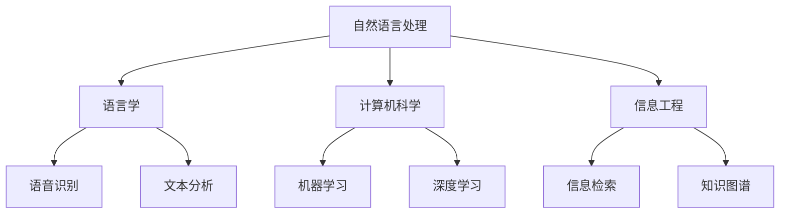

#### 2. 文本预处理

文本预处理是NLP中的关键步骤，其目的是将原始的文本数据转化为适合进行NLP分析的形式。常见的预处理技术包括分词、词性标注、命名实体识别等。

**Mermaid 流程图：**

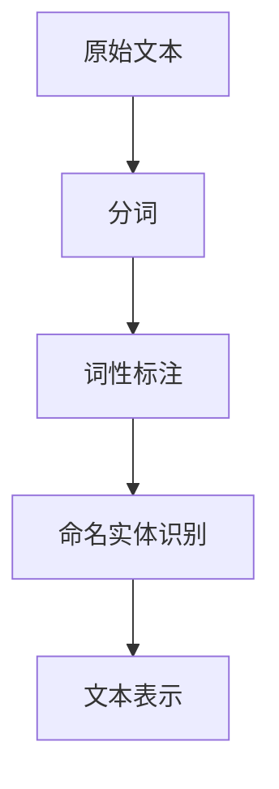

#### 3. 语言模型

语言模型是用于预测文本序列的概率分布，它是NLP中许多任务的基础。常见的语言模型包括统计语言模型和基于神经网络的深度学习模型。

**Mermaid 流程图：**

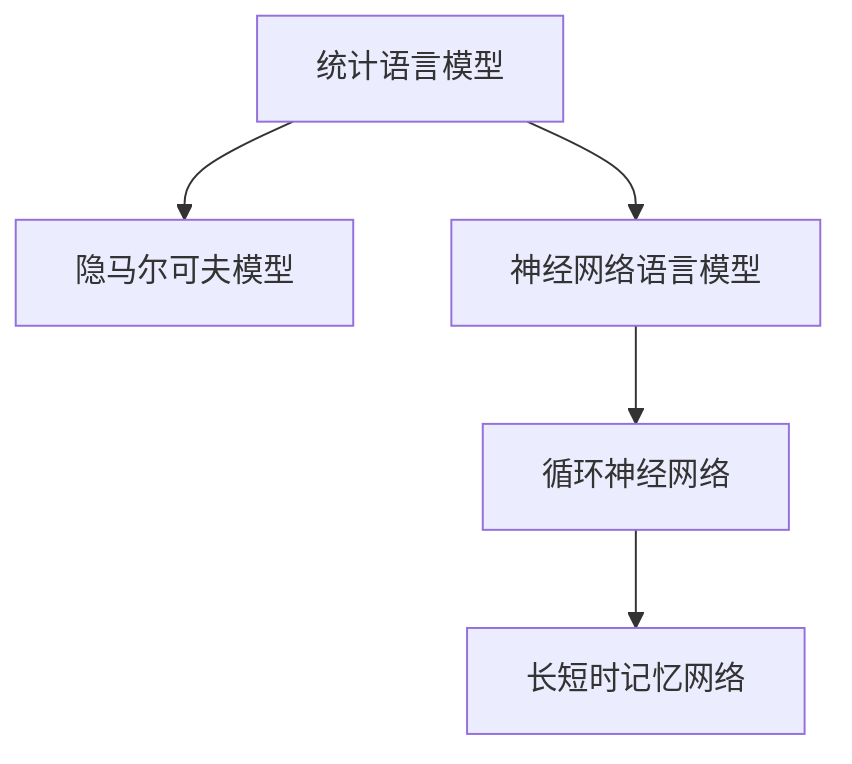

#### 4. 深度学习与NLP

深度学习在NLP中的应用非常广泛，它通过构建多层神经网络来提取文本中的特征，从而实现各种NLP任务。常见的深度学习模型包括卷积神经网络（CNN）、循环神经网络（RNN）和注意力机制。

**Mermaid 流程图：**

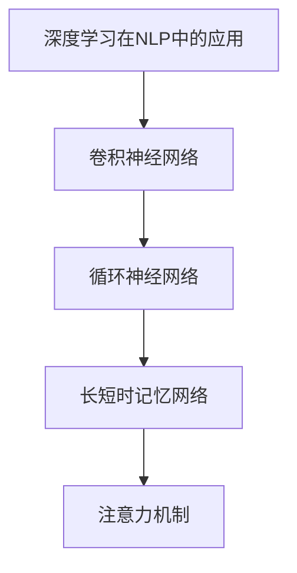

#### 5. 文本生成

文本生成是NLP的一个重要应用，它可以通过训练模型生成新的文本内容。常见的文本生成模型包括生成式模型和对抗生成网络（GAN）。

**Mermaid 流程图：**

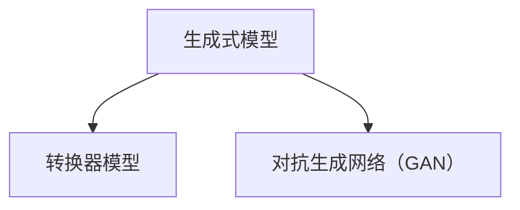

### 核心算法原理讲解

#### 1. 隐马尔可夫模型（HMM）

**基本原理：**

隐马尔可夫模型（Hidden Markov Model，HMM）是一种统计模型，用于描述一组随时间变化的随机事件，其中某些随机事件是隐藏的。HMM由状态序列和观测序列组成，状态序列是隐藏的，而观测序列是基于状态序列生成的。

**状态转移概率矩阵：**

$$
\begin{bmatrix}
P(q_1) \\
P(q_2) \\
\vdots \\
P(q_n)
\end{bmatrix}
$$

其中，$q_i$ 表示第 $i$ 个状态。

**观测概率矩阵：**

$$
\begin{bmatrix}
P(o_1|q_1) \\
P(o_2|q_1) \\
\vdots \\
P(o_m|q_1) \\
\vdots \\
P(o_1|q_n) \\
P(o_2|q_n) \\
\vdots \\
P(o_m|q_n)
\end{bmatrix}
$$

其中，$o_j|q_i$ 表示在状态 $q_i$ 下，生成观测 $o_j$ 的概率。

**HMM 的训练算法：**

- **前向算法（前向-后向算法）**：计算每个状态在序列中出现的概率。
- **Viterbi 算法**：找到最可能的状态序列。

**伪代码：**

```python
def forwardAlgorithm(observations, stateTransitions, emissions):
    T = len(observations)
    N = len(states)
    alpha = [[0 for _ in range(T)] for _ in range(N)]
    
    # 初始化
    for i in range(N):
        alpha[i][0] = emissions[i][observations[0]]
    
    # 递归计算
    for t in range(1, T):
        for i in range(N):
            alpha[i][t] = emissions[i][observations[t]] * sum(alpha[j][t-1] * stateTransitions[j][i] for j in range(N))
    
    return alpha

def backwardAlgorithm(observations, stateTransitions, emissions):
    T = len(observations)
    N = len(states)
    beta = [[0 for _ in range(T)] for _ in range(N)]
    
    # 初始化
    for i in range(N):
        beta[i][T-1] = 1
    
    # 递归计算
    for t in range(T-2, -1, -1):
        for i in range(N):
            beta[i][t] = sum(stateTransitions[i][j] * emissions[j][observations[t+1]] * beta[j][t+1] for j in range(N))
    
    return beta

def viterbiAlgorithm(observations, stateTransitions, emissions):
    T = len(observations)
    N = len(states)
    delta = [[0 for _ in range(T)] for _ in range(N)]
    path = [[0 for _ in range(T)] for _ in range(N)]
    
    # 初始化
    for i in range(N):
        delta[i][0] = emissions[i][observations[0]]
        path[i][0] = i
    
    # 递归计算
    for t in range(1, T):
        for i in range(N):
            max_prob = -1
            for j in range(N):
                prob = delta[j][t-1] * stateTransitions[j][i] * emissions[i][observations[t]]
                if prob > max_prob:
                    max_prob = prob
                    path[i][t] = j
            delta[i][t] = max_prob
    
    # 返回最可能的路径
    state_sequence = [0] * T
    state_sequence[T-1] = argmax(delta[:, T-1])
    for t in range(T-2, -1, -1):
        state_sequence[t] = path[state_sequence[t+1]][t+1]
    
    return state_sequence
```

#### 2. 隐含马尔可夫模型（CRF）

**基本原理：**

隐含马尔可夫模型（Conditional Random Field，CRF）是一种基于概率的序列模型，它通过条件概率来预测序列中的下一个元素。CRF通常用于序列标注任务，如词性标注和命名实体识别。

**CRF的能量函数：**

$$
E(\lambda, y) = \sum_{t=1}^{T} \sum_{i=1}^{N} \lambda_{iy_t} - \sum_{t=1}^{T} \sum_{i<j} \lambda_{ij} y_t y_{t+1}
$$

其中，$\lambda$ 是模型参数，$y$ 是预测的序列，$T$ 是序列长度，$N$ 是状态数。

**CRF的推断算法：**

- **最大条件概率推断算法**：找到使得能量函数最小的状态序列。
- **变分推断算法**：使用变分推断来近似计算概率。

**伪代码：**

```python
def crfInference(observations, stateTransitions, emissions, stateEnergies):
    T = len(observations)
    N = len(states)
    alpha = [[0 for _ in range(T)] for _ in range(N)]
    beta = [[0 for _ in range(T)] for _ in range(N)]
    
    # 初始化
    alpha[0][0] = emissions[0][observations[0]]
    beta[T-1][0] = 1
    
    # 递归计算
    for t in range(1, T):
        for i in range(N):
            alpha[i][t] = emissions[i][observations[t]] + alpha[i-1][t-1]
            for j in range(N):
                alpha[i][t] += stateTransitions[j][i] * emissions[j][observations[t-1]]
    for t in range(T-2, -1, -1):
        for i in range(N):
            beta[i][t] = stateEnergies[i] * emissions[i][observations[t]]
            for j in range(N):
                beta[i][t] += stateTransitions[i][j] * emissions[j][observations[t+1]] * beta[j][t+1]
    
    # 推断
    Z = sum(sum(alpha[i][t] for i in range(N)) for t in range(T))
    log_prob = sum(sum(beta[i][t] for i in range(N)) for t in range(T))
    for t in range(T):
        for i in range(N):
            log_prob += log(alpha[i][t] / (Z * beta[i][t]))
    
    return log_prob
```

#### 3. 卷积神经网络（CNN）在文本分析中的应用

**基本原理：**

卷积神经网络（Convolutional Neural Network，CNN）是一种深度学习模型，主要用于图像处理，但也可以用于文本分析。在文本分析中，CNN通过卷积操作提取文本中的局部特征，并通过池化操作降低特征维度。

**CNN 的主要组成部分：**

- **卷积层**：通过卷积操作提取文本中的局部特征。
- **池化层**：通过池化操作降低特征维度，减少参数数量。
- **全连接层**：将卷积层和池化层输出的特征映射到输出类别。

**伪代码：**

```python
def convolutionLayer(inputs, filters, kernelSize):
    # 输入：inputs（[batchSize, sequenceLength, embeddingSize]），filters（[filterSize, embeddingSize]），kernelSize
    # 输出：convolvedFeatures（[batchSize, sequenceLength - kernelSize + 1, filterSize]）
    convolvedFeatures = []
    for filter in filters:
        tempConv = []
        for i in range(len(inputs) - kernelSize + 1):
            tempConv.append(convolve(inputs[i], filter))
        convolvedFeatures.append(tempConv)
    return convolvedFeatures

def poolingLayer(convolvedFeatures, poolingType):
    # 输入：convolvedFeatures（[batchSize, sequenceLength - kernelSize + 1, filterSize]），poolingType（'max' 或 'avg'）
    # 输出：pooledFeatures（[batchSize, sequenceLength // 2, filterSize]）
    pooledFeatures = []
    if poolingType == 'max':
        for i in range(len(convolvedFeatures)):
            for j in range(len(convolvedFeatures[i])):
                pooledFeatures.append(max(convolvedFeatures[i][j]))
    elif poolingType == 'avg':
        for i in range(len(convolvedFeatures)):
            for j in range(len(convolvedFeatures[i])):
                pooledFeatures.append(sum(convolvedFeatures[i][j]) / len(convolvedFeatures[i][j]))
    return pooledFeatures

def fullyConnectedLayer(pooledFeatures, outputSize):
    # 输入：pooledFeatures（[batchSize, pooledSize, filterSize]），outputSize
    # 输出：outputs（[batchSize, outputSize]）
    outputs = []
    for i in range(len(pooledFeatures)):
        outputs.append(np.dot(pooledFeatures[i], weights) + biases)
    return outputs
```

#### 4. 循环神经网络（RNN）与长短时记忆网络（LSTM）

**基本原理：**

循环神经网络（Recurrent Neural Network，RNN）是一种能够处理序列数据的神经网络，其核心思想是利用隐藏状态来保存历史信息。然而，传统的RNN存在梯度消失和梯度爆炸问题，无法有效地捕捉长序列依赖。

为了解决这些问题，长短时记忆网络（Long Short-Term Memory，LSTM）被提出。LSTM通过引入门控机制，能够有效地控制信息的流入和流出，从而捕捉长序列依赖。

**LSTM 的主要组成部分：**

- **输入门**：决定当前输入信息对隐藏状态的贡献。
- **遗忘门**：决定之前隐藏状态的信息是否应该被遗忘。
- **输出门**：决定当前隐藏状态是否应该被输出。

**伪代码：**

```python
def lstmCell(inputs, hiddenState, cellState, weights, biases):
    # 输入：inputs，hiddenState，cellState，weights，biases
    # 输出：newHiddenState，newCellState
    
    inputGate = sigmoid(np.dot(hiddenState, weights['input_gate']) + np.dot(inputs, weights['input_gate']) + biases['input_gate'])
    forgetGate = sigmoid(np.dot(hiddenState, weights['forget_gate']) + np.dot(inputs, weights['forget_gate']) + biases['forget_gate'])
    outputGate = sigmoid(np.dot(hiddenState, weights['output_gate']) + np.dot(inputs, weights['output_gate']) + biases['output_gate'])
    
    newCellState = forgetGate * cellState + inputGate * tanh(np.dot(hiddenState, weights['input_gate']) + np.dot(inputs, weights['input_gate']) + biases['input_gate'])
    newHiddenState = outputGate * tanh(newCellState)
    
    return newHiddenState, newCellState
```

#### 5. 注意力机制

**基本原理：**

注意力机制（Attention Mechanism）是一种用于提高神经网络在处理序列数据时对重要信息的关注程度的机制。通过注意力机制，神经网络可以动态地分配权重，使得模型能够更好地捕捉序列中的依赖关系。

**注意力机制的主要组成部分：**

- **查询（Query）**：表示当前时刻的输入。
- **键（Key）**：表示其他时刻的输入。
- **值（Value）**：表示其他时刻的输入。

**计算注意力分数：**

$$
\text{Attention Score} = \text{sigmoid}(\text{Query} \cdot \text{Key}^T)
$$

**计算注意力权重：**

$$
\text{Attention Weight} = \frac{\exp(\text{Attention Score})}{\sum_{i} \exp(\text{Attention Score}_i)}
$$

**计算注意力输出：**

$$
\text{Attention Output} = \sum_{i} \text{Attention Weight}_i \cdot \text{Value}_i
$$

**伪代码：**

```python
def attention(query, keys, values, attention_size):
    # 输入：query，keys，values，attention_size
    # 输出：attention_output
    
    keys = np.tanh(np.dot(keys, weights['key']) + biases['key'])
    attention_scores = np.dot(query, keys)
    attention_scores = softmax(attention_scores)
    
    attention_weights = [softmax(score) for score in attention_scores]
    attention_output = [np.dot(weight, value) for weight, value in zip(attention_weights, values)]
    
    return attention_output
```

### 核心概念与联系

在本章中，我们将详细探讨自然语言处理（NLP）的核心概念和它们之间的联系。通过这一部分的讨论，我们将建立一个全面的理解，以便更深入地探讨NLP在智能写作辅助中的应用。

#### 1. 自然语言处理（NLP）

自然语言处理（NLP）是计算机科学领域与人工智能领域的一个重要分支，旨在让计算机能够理解、处理和生成人类语言。NLP涉及到多个学科，包括语言学、计算机科学、信息工程等。

**核心概念：**

- **文本预处理**：将原始的文本数据转化为适合进行NLP分析的形式，包括分词、词性标注、命名实体识别等。
- **语言模型**：用于预测文本序列的概率分布，为NLP中的许多任务提供基础。
- **文本生成**：通过训练模型生成新的文本内容，是智能写作辅助的重要应用。

**Mermaid 流程图：**

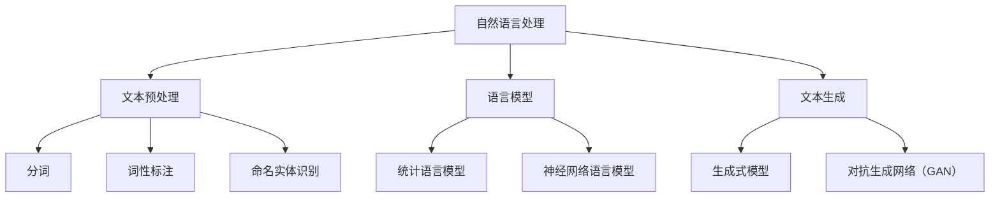

#### 2. 文本预处理

文本预处理是NLP中的关键步骤，其目的是将原始的文本数据转化为适合进行NLP分析的形式。文本预处理通常包括以下几个步骤：

- **分词**：将文本分割成单词或短语。
- **词性标注**：为每个单词或短语分配一个词性标签，如名词、动词、形容词等。
- **命名实体识别**：识别文本中的命名实体，如人名、地名、组织名等。

**核心概念：**

- **分词**：分词技术是文本预处理的第一步，其目的是将连续的文本序列分割成有意义的单词或短语。
- **词性标注**：词性标注用于为每个单词或短语分配一个词性标签，这有助于后续的语义分析和文本理解。
- **命名实体识别**：命名实体识别用于识别文本中的特定实体，如人名、地名、组织名等，这对于信息抽取和文本分类任务非常重要。

**Mermaid 流程图：**

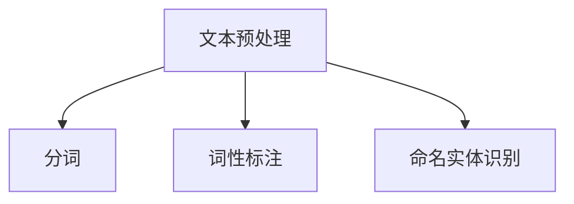

#### 3. 语言模型

语言模型是NLP中的核心组件，用于预测文本序列的概率分布。语言模型可以分为统计语言模型和基于神经网络的深度学习模型。

**核心概念：**

- **统计语言模型**：基于概率论和统计方法，如隐马尔可夫模型（HMM）和隐含马尔可夫模型（CRF）。
- **神经网络语言模型**：基于深度学习模型，如循环神经网络（RNN）和长短时记忆网络（LSTM）。

**核心概念：**

- **隐马尔可夫模型（HMM）**：一种基于概率的序列模型，用于预测序列中的下一个元素。
- **隐含马尔可夫模型（CRF）**：一种基于概率的序列模型，常用于序列标注任务。
- **循环神经网络（RNN）**：一种能够处理序列数据的神经网络，通过隐藏状态保存历史信息。
- **长短时记忆网络（LSTM）**：RNN的一种改进，通过门控机制控制信息的流入和流出。

**Mermaid 流程图：**

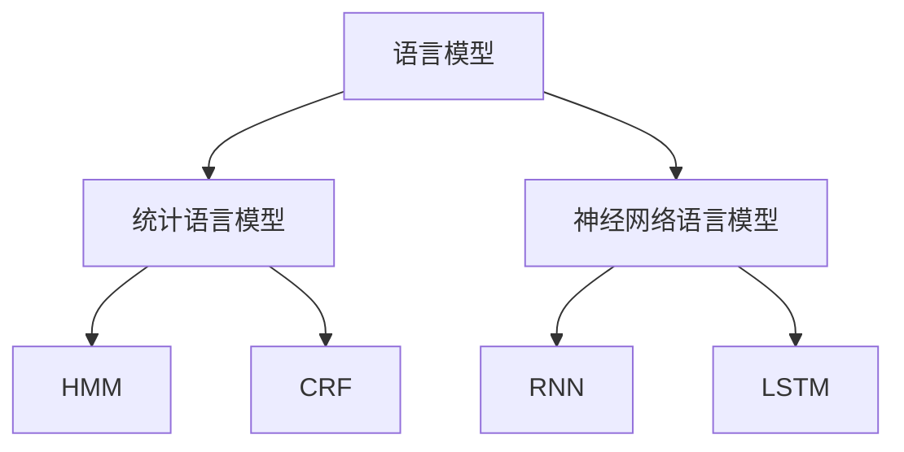

#### 4. 文本生成

文本生成是NLP的重要应用之一，通过训练模型生成新的文本内容。文本生成模型可以分为生成式模型和对抗生成网络（GAN）。

**核心概念：**

- **生成式模型**：通过生成文本的概率分布来生成新的文本。
- **对抗生成网络（GAN）**：一种基于对抗训练的模型，通过生成器和判别器的对抗来生成高质量的文本。

**核心概念：**

- **转换器模型**：一种生成式模型，通过序列到序列学习生成新的文本。
- **对抗生成网络（GAN）**：一种生成式模型，通过生成器和判别器的对抗训练来生成高质量的文本。

**Mermaid 流程图：**

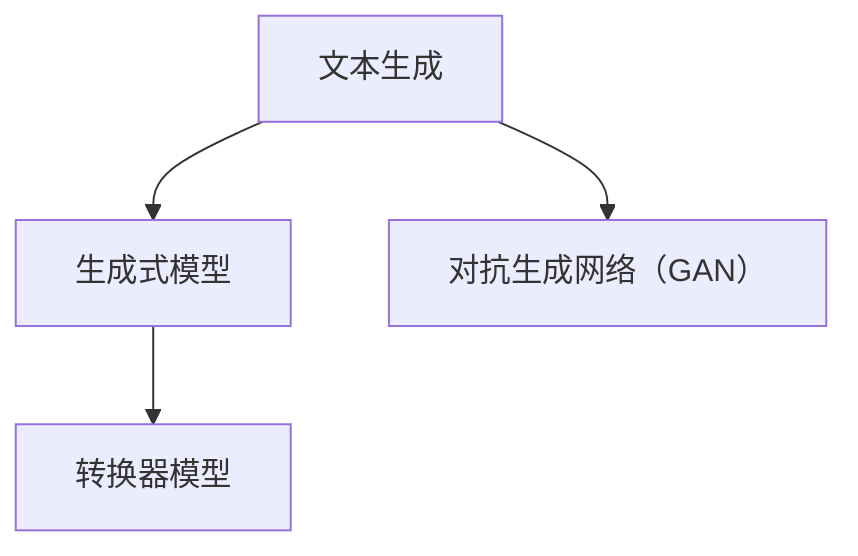

#### 5. 深度学习与NLP

深度学习在NLP中的应用日益广泛，通过构建多层神经网络来提取文本中的特征，从而实现各种NLP任务。深度学习模型包括卷积神经网络（CNN）、循环神经网络（RNN）和注意力机制等。

**核心概念：**

- **卷积神经网络（CNN）**：通过卷积操作提取文本中的局部特征。
- **循环神经网络（RNN）**：通过隐藏状态保存历史信息，能够处理序列数据。
- **注意力机制**：通过动态分配权重来提高模型对重要信息的关注程度。

**Mermaid 流程图：**

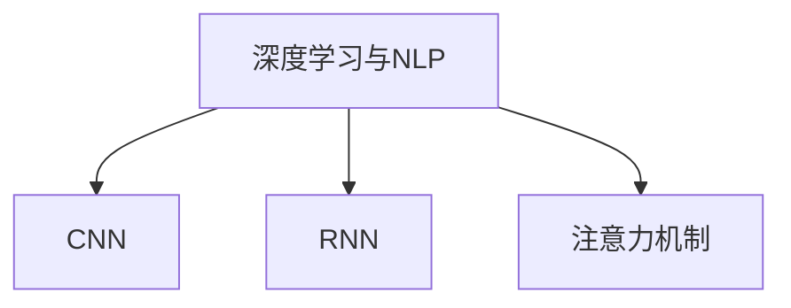

#### 6. 序列标注任务

序列标注任务是NLP中的重要任务之一，包括词性标注、命名实体识别、情感分析等。这些任务通常使用序列模型来实现。

**核心概念：**

- **词性标注**：为文本中的每个单词或短语分配一个词性标签。
- **命名实体识别**：识别文本中的命名实体，如人名、地名、组织名等。
- **情感分析**：分析文本中的情感倾向，如正面、负面、中性等。

**Mermaid 流程图：**

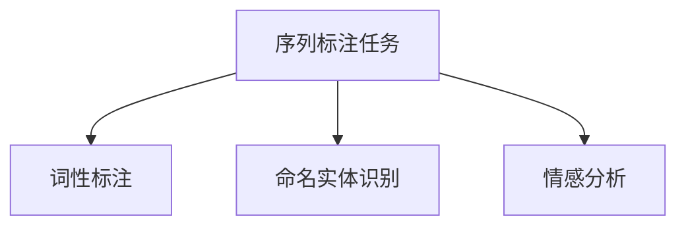

#### 7. 智能写作辅助

智能写作辅助是NLP在特定领域的应用，通过自然语言处理技术来帮助用户生成高质量的文章和文档。

**核心概念：**

- **文本生成技术**：通过训练模型生成新的文本内容，如文章、报告、广告等。
- **写作辅助工具**：为用户提供语法检查、内容生成、文本扩展等功能。

**Mermaid 流程图：**

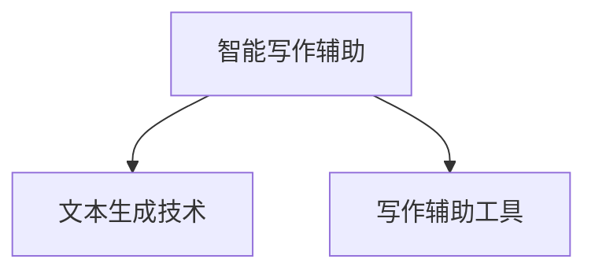

通过以上对核心概念和它们之间联系的探讨，我们建立了一个全面的理解框架，为后续章节的深入探讨奠定了基础。在接下来的章节中，我们将详细讲解NLP的核心算法、数学模型以及实际应用案例，进一步探讨自然语言处理在智能写作辅助中的具体应用。

### 自然语言处理基础

自然语言处理（NLP）是计算机科学和人工智能领域中的一项重要技术，旨在使计算机能够理解、处理和生成人类语言。为了更好地理解和应用NLP技术，我们需要从其发展历程、面临的挑战和基本概念三个方面进行探讨。

#### 1.1 自然语言处理的发展历程

自然语言处理的发展可以追溯到20世纪50年代，当时的研究主要集中在词汇分析和语法解析上。早期的NLP技术依赖于基于规则的系统和形式语言理论，这些方法通常需要大量手工编写的规则来处理自然语言。

- **1950年代**：早期的研究主要集中在机器翻译和语音识别上。例如，1952年，乔治·德沃斯基（Georgiy Dantsovsky）提出了第一个机器翻译系统，它使用字典匹配和规则匹配来进行俄语到英语的翻译。
- **1960年代**：形式语言理论和上下文无关文法（CFG）成为NLP研究的主要工具。这期间，语法解析器的研究取得了显著进展，但效果仍受限于规则系统的复杂性。
- **1970年代**：统计方法开始逐渐应用于NLP，尤其是在机器翻译和文本分类领域。1980年代，基于隐马尔可夫模型（HMM）的语音识别技术取得了突破。
- **1980年代到1990年代**：知识表示和语义分析成为研究热点，研究者开始关注如何使计算机能够理解文本中的语义信息。1990年代，随着互联网的兴起，文本分类和信息检索成为重要的应用领域。
- **2000年代**：随着深度学习技术的快速发展，NLP取得了显著的进展。循环神经网络（RNN）和长短时记忆网络（LSTM）等模型在语音识别、机器翻译、文本分类等任务上取得了突破性成果。
- **2010年代至今**：自然语言处理技术进一步成熟，预训练模型如BERT、GPT等在多种NLP任务上表现出色。同时，多模态融合、生成式模型等新兴技术也在不断涌现。

#### 1.2 自然语言处理的挑战和机遇

尽管自然语言处理在过去几十年取得了显著进展，但仍然面临着许多挑战和机遇。

**挑战：**

1. **语义理解的复杂性**：自然语言中存在大量的歧义、模糊性和多义性，使得计算机难以准确理解文本的语义。
2. **数据稀缺性**：高质量、标注良好的训练数据仍然稀缺，特别是在低资源语言和特定领域上。
3. **计算资源需求**：深度学习模型的训练和推断通常需要大量的计算资源和时间，这对于资源有限的用户和组织来说是一个挑战。
4. **隐私和安全**：在处理用户生成的文本时，如何保护用户隐私和防止数据泄露是一个重要的伦理和安全问题。
5. **跨语言和跨领域**：不同语言和文化背景下的文本具有不同的特征和表达方式，如何实现跨语言和跨领域的NLP应用是一个挑战。

**机遇：**

1. **预训练模型**：预训练模型如BERT、GPT等在多种NLP任务上取得了显著成果，为未来的研究和应用提供了强有力的工具。
2. **多模态融合**：结合文本、图像、语音等多种模态的数据，能够为NLP任务提供更丰富的信息，提高模型的性能和泛化能力。
3. **自动化写作**：自然语言生成技术（如生成对抗网络（GAN）和转换器模型）有望实现自动化写作，为内容创作、报告生成等领域带来变革。
4. **伦理和责任**：随着NLP技术的广泛应用，如何在技术发展中确保伦理和责任成为了一个重要的议题。

#### 1.3 自然语言处理的基本概念

自然语言处理涉及多个核心概念，这些概念为理解和实现NLP技术提供了基础。

**1.3.1 文本预处理**

文本预处理是NLP任务的第一步，其目的是将原始的文本数据转化为适合进行NLP分析的形式。文本预处理通常包括以下几个步骤：

- **分词（Tokenization）**：将连续的文本分割成单词或短语，即“token”。分词有助于后续的词性标注、实体识别等任务。
- **词性标注（Part-of-Speech Tagging）**：为每个单词或短语分配一个词性标签，如名词、动词、形容词等。词性标注有助于理解文本的语义结构和语法规则。
- **命名实体识别（Named Entity Recognition，NER）**：识别文本中的命名实体，如人名、地名、组织名等。命名实体识别是信息抽取和知识图谱构建的重要基础。
- **停用词过滤（Stopword Removal）**：去除常见的无意义单词，如“的”、“了”、“和”等。停用词过滤有助于减少文本的噪音，提高后续分析的准确性。
- **词嵌入（Word Embedding）**：将单词或短语映射到高维向量空间中，以便于计算机处理和计算。词嵌入技术是深度学习在NLP中应用的重要基础。

**1.3.2 语言模型**

语言模型是NLP中的核心组件，用于预测文本序列的概率分布。语言模型可以分为统计语言模型和基于神经网络的深度学习模型。

- **统计语言模型**：基于概率论和统计方法，如隐马尔可夫模型（HMM）、隐含马尔可夫模型（CRF）和神经网络语言模型等。统计语言模型通过学习文本中的统计规律来预测下一个单词或短语。
- **神经网络语言模型**：基于深度学习模型，如循环神经网络（RNN）、长短时记忆网络（LSTM）和注意力机制等。神经网络语言模型通过构建多层神经网络来提取文本中的特征，从而实现高效的文本预测。

**1.3.3 文本生成**

文本生成是NLP的重要应用之一，通过训练模型生成新的文本内容。文本生成模型可以分为生成式模型和对抗生成网络（GAN）。

- **生成式模型**：通过生成文本的概率分布来生成新的文本。常见的生成式模型包括转换器模型和序列到序列学习等。
- **对抗生成网络（GAN）**：一种基于对抗训练的模型，通过生成器和判别器的对抗来生成高质量的文本。GAN通过生成器生成文本，判别器判断文本的真实性，从而实现文本生成。

**1.3.4 序列标注任务**

序列标注任务是NLP中的重要任务之一，包括词性标注、命名实体识别、情感分析等。这些任务通常使用序列模型来实现。

- **词性标注**：为文本中的每个单词或短语分配一个词性标签，如名词、动词、形容词等。词性标注有助于理解文本的语义结构和语法规则。
- **命名实体识别**：识别文本中的命名实体，如人名、地名、组织名等。命名实体识别是信息抽取和知识图谱构建的重要基础。
- **情感分析**：分析文本中的情感倾向，如正面、负面、中性等。情感分析有助于情感监控、舆情分析等应用。

**1.3.5 深度学习与NLP**

深度学习在NLP中的应用日益广泛，通过构建多层神经网络来提取文本中的特征，从而实现各种NLP任务。常见的深度学习模型包括卷积神经网络（CNN）、循环神经网络（RNN）和注意力机制等。

- **卷积神经网络（CNN）**：通过卷积操作提取文本中的局部特征，适用于文本分类、情感分析等任务。
- **循环神经网络（RNN）**：通过隐藏状态保存历史信息，适用于语音识别、机器翻译等序列数据处理任务。
- **注意力机制**：通过动态分配权重来提高模型对重要信息的

