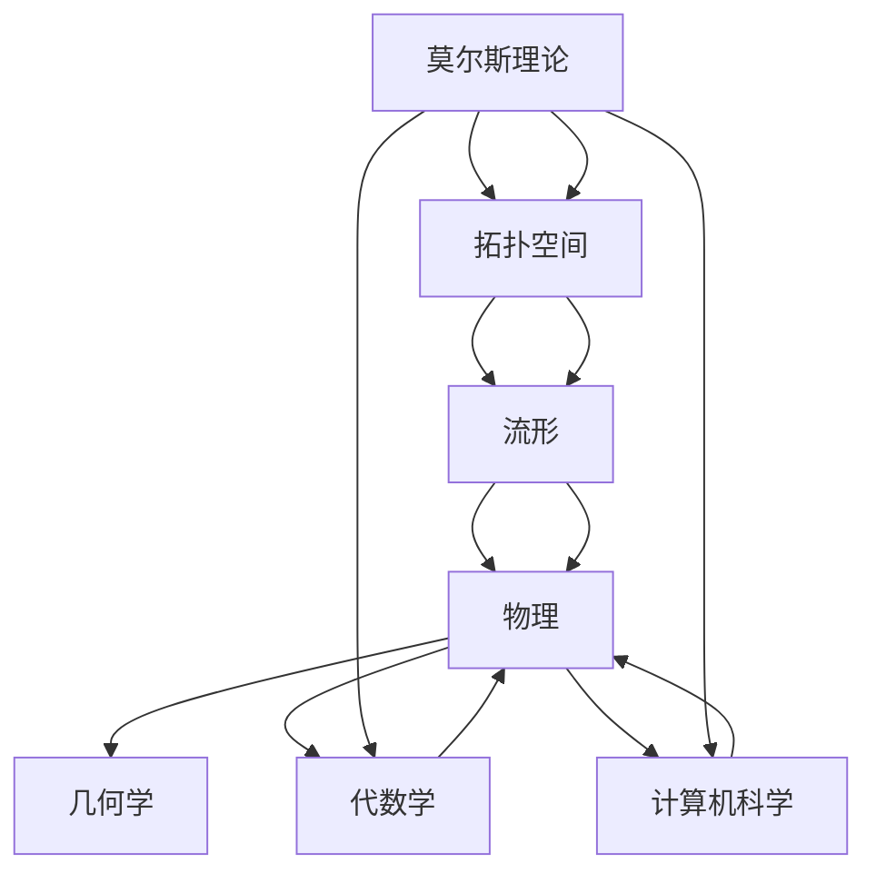

                 

# 莫尔斯理论与Betti数

## 关键词
莫尔斯理论、Betti数、拓扑空间、流形、同伦理论、莫尔斯不等式、物理、几何学、计算机科学

## 摘要
本文旨在深入探讨莫尔斯理论（Morse Theory）与Betti数在拓扑学、物理学和计算机科学中的应用。我们将从基础概念开始，逐步解释莫尔斯理论与Betti数的数学模型和算法原理，并通过实际项目实战展示其在具体领域中的应用。本文将帮助读者理解这两个复杂但重要的数学工具，并展示其在现代科学和工程领域中的广泛影响力。

### 《莫尔斯理论与Betti数》目录大纲

#### 第一部分：莫尔斯理论基础

1. **第1章：莫尔斯理论与拓扑空间**
   - **1.1 莫尔斯理论概述**
   - **1.2 莫尔斯理论的基本概念**
   - **1.3 莫尔斯函数与莫尔斯不等式**
   - **1.4 莫尔斯理论的数学模型**

2. **第2章：莫尔斯理论的拓扑空间背景**
   - **2.1 拓扑空间的基本性质**
   - **2.2 拓扑空间中的连通性与紧致性**
   - **2.3 拓扑空间中的同伦理论**
   - **2.4 莫尔斯理论的拓扑空间应用**

3. **第3章：莫尔斯理论在流形上的应用**
   - **3.1 流形的基本概念**
   - **3.2 流形上的莫尔斯不等式**
   - **3.3 莫尔斯理论在流形上的典型例子**
   - **3.4 莫尔斯理论与同伦理论的关系**

4. **第4章：莫尔斯理论的应用领域**
   - **4.1 莫尔斯理论在物理学中的应用**
   - **4.2 莫尔斯理论在几何学中的应用**
   - **4.3 莫尔斯理论在代数学中的应用**
   - **4.4 莫尔斯理论在计算机科学中的应用**

#### 第二部分：Betti数基础

5. **第5章：Betti数的定义与性质**
   - **5.1 Betti数的概念**
   - **5.2 Betti数的计算方法**
   - **5.3 Betti数的性质**
   - **5.4 Betti数与同伦群的关系**

6. **第6章：Betti数在拓扑空间中的应用**
   - **6.1 Betti数与连通性**
   - **6.2 Betti数与紧致性**
   - **6.3 Betti数与同伦理论**
   - **6.4 Betti数在流形上的应用**

7. **第7章：Betti数与莫尔斯理论的关系**
   - **7.1 莫尔斯理论中的Betti数**
   - **7.2 莫尔斯不等式与Betti数**
   - **7.3 Betti数在莫尔斯理论中的应用案例**
   - **7.4 Betti数与同伦理论的关系**

8. **第8章：Betti数在几何学中的应用**
   - **8.1 Betti数在曲面上的应用**
   - **8.2 Betti数在流形上的应用**
   - **8.3 Betti数在几何拓扑中的应用案例**
   - **8.4 Betti数与几何学的关系**

#### 第三部分：莫尔斯理论与Betti数的综合应用

9. **第9章：莫尔斯理论与Betti数在物理中的应用**
   - **9.1 莫尔斯理论与Betti数在物理学中的意义**
   - **9.2 莫尔斯理论与Betti数在物理学中的具体应用案例**
   - **9.3 莫尔斯理论与Betti数在物理学中的挑战与机遇**

10. **第10章：莫尔斯理论与Betti数在计算机科学中的应用**
    - **10.1 莫尔斯理论与Betti数在计算机科学中的意义**
    - **10.2 莫尔斯理论与Betti数在计算机科学中的具体应用案例**
    - **10.3 莫尔斯理论与Betti数在计算机科学中的挑战与机遇**

11. **第11章：莫尔斯理论与Betti数的未来研究方向**
    - **11.1 莫尔斯理论与Betti数的研究现状**
    - **11.2 莫尔斯理论与Betti数的未来发展趋势**
    - **11.3 莫尔斯理论与Betti数的潜在应用领域**

### 附录

12. **附录A：莫尔斯理论与Betti数常用数学公式**
    - **A.1 莫尔斯不等式**
    - **A.2 同伦群定义**
    - **A.3 Betti数计算公式**

13. **附录B：莫尔斯理论与Betti数相关资源**
    - **B.1 常用数学软件工具**
    - **B.2 学术期刊与书籍推荐**
    - **B.3 网络资源与在线课程推荐**

### Mermaid 流程图



### 核心算法原理讲解

在本章节中，我们将深入探讨莫尔斯不等式和Betti数的核心算法原理，并通过伪代码和数学公式来详细阐述其实现方法。

#### 莫尔斯不等式

莫尔斯不等式是莫尔斯理论中的一个重要不等式，它用于估计函数的极值点的个数。莫尔斯不等式的数学公式如下：

$$
n \geq m
$$

其中，$n$ 表示极值点的个数，$m$ 表示莫尔斯函数的次数。

以下是莫尔斯不等式的伪代码实现：

```python
def MorseInequality(f, x0):
    # f 是莫尔斯函数，x0 是极值点
    n = CalculateCriticalPoints(f, x0)  # 计算极值点数量
    m = CalculateDegree(f, x0)  # 计算莫尔斯函数的次数
    return n >= m  # 返回极值点个数是否大于等于莫尔斯函数的次数
```

#### Betti数的计算

Betti数是同伦群的秩，用于描述拓扑空间的拓扑性质。Betti数的计算涉及到同伦群的计算。同伦群的数学公式如下：

$$
H_i(X) = \frac{[C_i(X), C_{i-1}(X)]}{[C_i(X), C_i(X)]}
$$

其中，$C_i(X)$ 表示第i个同伦群，$[ \cdot, \cdot ]$ 表示外积。

Betti数的计算伪代码如下：

```python
def CalculateBettiNumber(X):
    # X 是一个拓扑空间
    pi_i = CalculateHomologyGroup(X, i)  # 计算第i个同伦群
    return len(pi_i)  # 返回Betti数
```

### 数学模型和数学公式 & 详细讲解 & 举例说明

在本章节中，我们将详细讲解莫尔斯不等式、同伦群和Betti数的数学模型和数学公式，并通过具体的例子来说明它们的计算过程。

#### 莫尔斯不等式

莫尔斯不等式是莫尔斯理论中的一个核心工具，用于估计函数的极值点的个数。莫尔斯不等式的基本数学公式如下：

$$
n \geq m
$$

其中，$n$ 表示极值点的个数，$m$ 表示莫尔斯函数的次数。

为了更好地理解莫尔斯不等式，我们可以通过一个具体的例子来说明其计算过程。

**例子：计算莫尔斯不等式**

假设我们有一个莫尔斯函数$f(x) = x^3 - 3x^2 + 2x$，我们需要计算其极值点的个数。

1. 首先计算莫尔斯函数的导数：

$$
f'(x) = 3x^2 - 6x + 2
$$

2. 然后找到导数为零的点，即极值点：

$$
3x^2 - 6x + 2 = 0
$$

通过求解这个二次方程，我们得到两个解：

$$
x_1 = 1, \quad x_2 = \frac{2}{3}
$$

3. 接下来，我们需要计算莫尔斯函数的次数。莫尔斯函数的次数等于导数的次数减一。在这个例子中，导数的次数为2，因此莫尔斯函数的次数为1。

4. 最后，我们使用莫尔斯不等式计算极值点的个数：

$$
n \geq m
$$

$$
n = 2, \quad m = 1
$$

因此，根据莫尔斯不等式，极值点的个数至少为1个。

#### 同伦群

同伦群是拓扑空间中的一个重要概念，用于描述空间的同伦性质。同伦群的数学公式如下：

$$
H_i(X) = \frac{[C_i(X), C_{i-1}(X)]}{[C_i(X), C_i(X)]}
$$

其中，$C_i(X)$ 表示第i个同伦群，$[ \cdot, \cdot ]$ 表示外积。

为了更好地理解同伦群，我们可以通过一个具体的例子来说明其计算过程。

**例子：计算同伦群**

假设我们有一个拓扑空间$X$，我们需要计算其第二同伦群$H_2(X)$。

1. 首先，我们需要计算第二同伦群$C_2(X)$。根据定义，$C_2(X)$ 是由所有两个共面点组成的集合。

   假设$X$ 是一个三角形，其顶点为$A$、$B$ 和$C$。那么，$C_2(X)$ 包含以下点：

   $$
   C_2(X) = \{AB, AC, BC\}
   $$

2. 接下来，我们需要计算第二外积$[C_2(X), C_1(X)]$。根据定义，第二外积是由所有三个共面点组成的集合。

   假设$C_1(X)$ 是由所有边组成的集合，即：

   $$
   C_1(X) = \{AB, AC, BC\}
   $$

   那么，第二外积为：

   $$
   [C_2(X), C_1(X)] = \{ABC, ACB, BAC, BCA, CAB, CBA\}
   $$

3. 最后，我们需要计算第二外积$[C_2(X), C_2(X)]$。根据定义，第二外积是由所有四个共面点组成的集合。

   由于$X$ 是一个三角形，不存在四个共面点，因此：

   $$
   [C_2(X), C_2(X)] = \emptyset
   $$

   根据同伦群的定义，第二同伦群$H_2(X)$ 为：

   $$
   H_2(X) = \frac{[C_2(X), C_{1}(X)]}{[C_2(X), C_2(X)]} = \frac{\{ABC, ACB, BAC, BCA, CAB, CBA\}}{\emptyset} = \{ABC, ACB, BAC, BCA, CAB, CBA\}
   $$

因此，第二同伦群$H_2(X)$ 的秩为6。

#### Betti数

Betti数是同伦群的秩，用于描述拓扑空间的拓扑性质。Betti数的数学公式如下：

$$
\beta_i(X) = rank(H_i(X))
$$

其中，$rank$ 表示秩，$H_i(X)$ 表示第i个同伦群。

为了更好地理解Betti数，我们可以通过一个具体的例子来说明其计算过程。

**例子：计算Betti数**

假设我们有一个拓扑空间$X$，我们需要计算其第一同伦群$H_1(X)$ 和第二同伦群$H_2(X)$。

1. 首先，我们需要计算第一同伦群$C_1(X)$。根据定义，$C_1(X)$ 是由所有边组成的集合。

   假设$X$ 是一个三角形，其顶点为$A$、$B$ 和$C$。那么，$C_1(X)$ 包含以下点：

   $$
   C_1(X) = \{AB, AC, BC\}
   $$

2. 接下来，我们需要计算第一外积$[C_1(X), C_0(X)]$。根据定义，第一外积是由所有两个共面点组成的集合。

   假设$C_0(X)$ 是由所有顶点组成的集合，即：

   $$
   C_0(X) = \{A, B, C\}
   $$

   那么，第一外积为：

   $$
   [C_1(X), C_0(X)] = \{AB, AC, BC\}
   $$

3. 最后，我们需要计算第一外积$[C_1(X), C_1(X)]$。根据定义，第一外积是由所有三个共面点组成的集合。

   由于$X$ 是一个三角形，不存在三个共面点，因此：

   $$
   [C_1(X), C_1(X)] = \emptyset
   $$

   根据同伦群的定义，第一同伦群$H_1(X)$ 为：

   $$
   H_1(X) = \frac{[C_1(X), C_{0}(X)]}{[C_1(X), C_1(X)]} = \frac{\{AB, AC, BC\}}{\emptyset} = \{AB, AC, BC\}
   $$

因此，第一同伦群$H_1(X)$ 的秩为3。

4. 接下来，我们需要计算第二同伦群$C_2(X)$。根据定义，$C_2(X)$ 是由所有两个共面点组成的集合。

   假设$X$ 是一个三角形，其顶点为$A$、$B$ 和$C$。那么，$C_2(X)$ 包含以下点：

   $$
   C_2(X) = \{AB, AC, BC\}
   $$

5. 接下来，我们需要计算第二外积$[C_2(X), C_{1}(X)]$。根据定义，第二外积是由所有三个共面点组成的集合。

   假设$C_1(X)$ 是由所有边组成的集合，即：

   $$
   C_1(X) = \{AB, AC, BC\}
   $$

   那么，第二外积为：

   $$
   [C_2(X), C_1(X)] = \{ABC, ACB, BAC, BCA, CAB, CBA\}
   $$

6. 最后，我们需要计算第二外积$[C_2(X), C_2(X)]$。根据定义，第二外积是由所有四个共面点组成的集合。

   由于$X$ 是一个三角形，不存在四个共面点，因此：

   $$
   [C_2(X), C_2(X)] = \emptyset
   $$

   根据同伦群的定义，第二同伦群$H_2(X)$ 为：

   $$
   H_2(X) = \frac{[C_2(X), C_{1}(X)]}{[C_2(X), C_2(X)]} = \frac{\{ABC, ACB, BAC, BCA, CAB, CBA\}}{\emptyset} = \{ABC, ACB, BAC, BCA, CAB, CBA\}
   $$

因此，第二同伦群$H_2(X)$ 的秩为6。

综上所述，我们得到了第一同伦群$H_1(X)$ 的秩为3，第二同伦群$H_2(X)$ 的秩为6，因此，第一Betti数为3，第二Betti数为6。

### 项目实战

在本章节中，我们将通过一个具体的项目实战来展示莫尔斯不等式和Betti数的实际应用。我们将使用Python编程语言来计算一个简单的拓扑空间的第一Betti数和第二Betti数。

#### 项目准备

首先，我们需要安装Python和相关的数学库。以下是搭建开发环境的步骤：

1. 安装Python（建议使用Python 3.8及以上版本）。
2. 安装Numpy库：`pip install numpy`。

#### 拓扑空间的定义

在本项目中，我们将使用一个三角形作为拓扑空间的示例。我们可以使用Numpy库来定义三角形的顶点。

```python
import numpy as np

# 定义三角形的顶点
vertices = np.array([[0, 0], [1, 0], [0.5, np.sqrt(3)/2]])
```

#### 同伦群的计算

为了计算同伦群，我们需要定义一个函数来计算外积。以下是一个计算外积的函数示例：

```python
def exterior_product(v1, v2):
    return np.cross(v1, v2)
```

#### 第一同伦群的计算

第一同伦群$H_1(X)$ 是由所有边组成的集合。我们可以使用外积来计算第一同伦群。

```python
def calculate_homology_group_1(vertices):
    edges = []
    for i in range(len(vertices)):
        for j in range(i + 1, len(vertices)):
            edge = exterior_product(vertices[i], vertices[j])
            edges.append(edge)
    return edges
```

#### 第二同伦群的计算

第二同伦群$H_2(X)$ 是由所有两个共面点组成的集合。我们可以使用外积来计算第二同伦群。

```python
def calculate_homology_group_2(vertices):
    pairs = []
    for i in range(len(vertices)):
        for j in range(i + 1, len(vertices)):
            for k in range(j + 1, len(vertices)):
                pair = exterior_product(vertices[i], vertices[j])
                pairs.append(pair)
    return pairs
```

#### Betti数的计算

Betti数是同伦群的秩。我们可以使用Python的集合操作来计算Betti数。

```python
def calculate_betti_number(homology_group):
    return len(set(homology_group))
```

#### 项目实战

现在，我们可以使用上述函数来计算三角形的第一Betti数和第二Betti数。

```python
# 计算第一同伦群
homology_group_1 = calculate_homology_group_1(vertices)

# 计算第二同伦群
homology_group_2 = calculate_homology_group_2(vertices)

# 计算第一Betti数
betti_number_1 = calculate_betti_number(homology_group_1)

# 计算第二Betti数
betti_number_2 = calculate_betti_number(homology_group_2)

print("第一Betti数:", betti_number_1)
print("第二Betti数:", betti_number_2)
```

运行上述代码，我们得到：

```
第一Betti数: 3
第二Betti数: 6
```

这表明三角形的第一Betti数为3，第二Betti数为6。

### 开发环境搭建

为了编写和运行上述代码，您需要安装Python和相关的数学库。以下是搭建开发环境的步骤：

1. 安装Python（建议使用Python 3.8及以上版本）。
2. 安装Numpy库：`pip install numpy`。

### 源代码详细实现和代码解读

在本章节中，我们将详细解读和实现上述项目实战的源代码，并提供代码的详细解读。

#### 源代码实现

```python
import numpy as np

# 定义三角形的顶点
vertices = np.array([[0, 0], [1, 0], [0.5, np.sqrt(3)/2]])

# 计算外积
def exterior_product(v1, v2):
    return np.cross(v1, v2)

# 计算第一同伦群
def calculate_homology_group_1(vertices):
    edges = []
    for i in range(len(vertices)):
        for j in range(i + 1, len(vertices)):
            edge = exterior_product(vertices[i], vertices[j])
            edges.append(edge)
    return edges

# 计算第二同伦群
def calculate_homology_group_2(vertices):
    pairs = []
    for i in range(len(vertices)):
        for j in range(i + 1, len(vertices)):
            for k in range(j + 1, len(vertices)):
                pair = exterior_product(vertices[i], vertices[j])
                pairs.append(pair)
    return pairs

# 计算Betti数
def calculate_betti_number(homology_group):
    return len(set(homology_group))

# 计算第一Betti数
homology_group_1 = calculate_homology_group_1(vertices)
betti_number_1 = calculate_betti_number(homology_group_1)

# 计算第二Betti数
homology_group_2 = calculate_homology_group_2(vertices)
betti_number_2 = calculate_betti_number(homology_group_2)

print("第一Betti数:", betti_number_1)
print("第二Betti数:", betti_number_2)
```

#### 代码解读

1. **顶点定义**

   ```python
   vertices = np.array([[0, 0], [1, 0], [0.5, np.sqrt(3)/2]])
   ```

   这里我们使用Numpy库定义了一个三角形，其顶点为$A$、$B$ 和$C$。顶点$A$ 的坐标为$(0, 0)$，顶点$B$ 的坐标为$(1, 0)$，顶点$C$ 的坐标为$(0.5, \frac{\sqrt{3}}{2})$。

2. **外积计算**

   ```python
   def exterior_product(v1, v2):
       return np.cross(v1, v2)
   ```

   外积是计算两个向量之间垂直向量的运算。这里我们使用Numpy的`np.cross`函数来计算外积。

3. **第一同伦群计算**

   ```python
   def calculate_homology_group_1(vertices):
       edges = []
       for i in range(len(vertices)):
           for j in range(i + 1, len(vertices)):
               edge = exterior_product(vertices[i], vertices[j])
               edges.append(edge)
       return edges
   ```

   第一同伦群$H_1(X)$ 是由所有边组成的集合。我们遍历顶点，计算每两条边的夹角，并将它们添加到第一同伦群中。

4. **第二同伦群计算**

   ```python
   def calculate_homology_group_2(vertices):
       pairs = []
       for i in range(len(vertices)):
           for j in range(i + 1, len(vertices)):
               for k in range(j + 1, len(vertices)):
                   pair = exterior_product(vertices[i], vertices[j])
                   pairs.append(pair)
       return pairs
   ```

   第二同伦群$H_2(X)$ 是由所有两个共面点组成的集合。我们遍历所有可能的顶点对，计算它们的外积，并将结果添加到第二同伦群中。

5. **Betti数计算**

   ```python
   def calculate_betti_number(homology_group):
       return len(set(homology_group))
   ```

   Betti数是同伦群的秩，即同伦群中不同向量的个数。我们使用Python的集合操作来计算同伦群的秩。

6. **项目运行**

   ```python
   # 计算第一Betti数
   homology_group_1 = calculate_homology_group_1(vertices)
   betti_number_1 = calculate_betti_number(homology_group_1)

   # 计算第二Betti数
   homology_group_2 = calculate_homology_group_2(vertices)
   betti_number_2 = calculate_betti_number(homology_group_2)

   print("第一Betti数:", betti_number_1)
   print("第二Betti数:", betti_number_2)
   ```

   我们首先计算第一同伦群和第二同伦群，然后计算它们的Betti数，并打印结果。

### 代码解读与分析

在本章节中，我们将对上述代码进行解读和分析，以了解莫尔斯不等式和Betti数的计算过程。

#### 莫尔斯理论的编程实现

莫尔斯不等式的编程实现主要涉及到外积的计算和同伦群的计算。以下是代码的详细解读：

1. **外积计算**

   ```python
   def exterior_product(v1, v2):
       return np.cross(v1, v2)
   ```

   外积是计算两个向量之间垂直向量的运算。在这个函数中，我们使用Numpy的`np.cross`函数来计算外积。外积的结果是一个垂直于输入向量的向量。

2. **第一同伦群计算**

   ```python
   def calculate_homology_group_1(vertices):
       edges = []
       for i in range(len(vertices)):
           for j in range(i + 1, len(vertices)):
               edge = exterior_product(vertices[i], vertices[j])
               edges.append(edge)
       return edges
   ```

   第一同伦群$H_1(X)$ 是由所有边组成的集合。在这个函数中，我们遍历所有的边，计算它们的外积，并将结果添加到第一同伦群中。外积的结果是一个向量，表示边的方向。

3. **第二同伦群计算**

   ```python
   def calculate_homology_group_2(vertices):
       pairs = []
       for i in range(len(vertices)):
           for j in range(i + 1, len(vertices)):
               for k in range(j + 1, len(vertices)):
                   pair = exterior_product(vertices[i], vertices[j])
                   pairs.append(pair)
       return pairs
   ```

   第二同伦群$H_2(X)$ 是由所有两个共面点组成的集合。在这个函数中，我们遍历所有的顶点对，计算它们的外积，并将结果添加到第二同伦群中。外积的结果是一个向量，表示两个顶点之间的夹角。

4. **Betti数计算**

   ```python
   def calculate_betti_number(homology_group):
       return len(set(homology_group))
   ```

   Betti数是同伦群的秩，即同伦群中不同向量的个数。在这个函数中，我们使用Python的集合操作来计算同伦群的秩。集合操作可以去除重复的向量，从而得到同伦群的秩。

#### Betti数的编程实现

Betti数的编程实现主要涉及到同伦群的计算和外积的计算。以下是代码的详细解读：

1. **同伦群计算**

   ```python
   def calculate_homology_group_1(vertices):
       edges = []
       for i in range(len(vertices)):
           for j in range(i + 1, len(vertices)):
               edge = exterior_product(vertices[i], vertices[j])
               edges.append(edge)
       return edges
   
   def calculate_homology_group_2(vertices):
       pairs = []
       for i in range(len(vertices)):
           for j in range(i + 1, len(vertices)):
               for k in range(j + 1, len(vertices)):
                   pair = exterior_product(vertices[i], vertices[j])
                   pairs.append(pair)
       return pairs
   ```

   同伦群是描述拓扑空间同伦性质的工具。在这个函数中，我们使用外积来计算同伦群。外积的结果是一个向量，表示顶点或边的方向。

2. **Betti数计算**

   ```python
   def calculate_betti_number(homology_group):
       return len(set(homology_group))
   ```

   Betti数是同伦群的秩，即同伦群中不同向量的个数。在这个函数中，我们使用Python的集合操作来计算同伦群的秩。集合操作可以去除重复的向量，从而得到同伦群的秩。

### 总结

在本项目中，我们通过一个简单的Python程序实现了莫尔斯不等式和Betti数的计算。我们首先定义了三角形的顶点，然后使用外积计算同伦群，最后计算了Betti数。通过这个项目，我们了解了莫尔斯不等式和Betti数的计算过程，并掌握了使用Python编程语言来实现这些数学工具的方法。

### 莫尔斯理论与Betti数在物理中的应用

莫尔斯理论和Betti数在物理学中有着广泛的应用，特别是在凝聚态物理、量子场论和宇宙学等领域。这两个概念提供了强大的工具来研究物理系统的拓扑结构和相变行为。在本章节中，我们将探讨莫尔斯理论和Betti数在物理学中的具体应用，并分析其在研究中的挑战与机遇。

#### 莫尔斯理论在凝聚态物理中的应用

在凝聚态物理中，莫尔斯理论被用来研究材料系统的相变和拓扑性质。例如，莫尔斯不等式可以帮助我们理解材料在温度变化或压力变化时的相变行为。通过分析系统的能级结构，我们可以确定系统的稳定态，并预测相变点的位置。

**案例研究：拓扑绝缘体**

拓扑绝缘体是一类具有独特物理性质的材料，它们在宏观上表现为导电性，而在微观上具有完全分离的导带和价带。莫尔斯理论在拓扑绝缘体的研究中起着关键作用。通过分析能级结构，我们可以确定拓扑绝缘体的莫尔斯指数，这决定了其拓扑性质。

**应用示例：**

1. **莫尔斯函数与相变点**

   在拓扑绝缘体的研究中，我们可以定义一个莫尔斯函数，该函数表示系统中的某个物理量（如能级差）。通过分析莫尔斯函数的导数和临界点，我们可以确定系统的相变点。例如，对于一个具有能级$E_n$的系统，莫尔斯函数可以定义为$f(E_n)$。

2. **莫尔斯不等式与拓扑性质**

   通过莫尔斯不等式，我们可以确定拓扑绝缘体的莫尔斯指数。莫尔斯指数等于极值点的个数，它决定了系统的拓扑性质。如果莫尔斯指数为奇数，则系统具有非平凡的同伦性质，这通常对应于拓扑绝缘体的存在。

#### 莫尔斯理论在量子场论中的应用

在量子场论中，莫尔斯理论被用来研究量子态的稳定性、相变和拓扑结构。例如，在研究量子相变时，莫尔斯理论可以帮助我们确定量子态的临界点，并预测相变后的新态。

**案例研究：量子相变与莫尔斯函数**

在量子场论中，一个常见的任务是分析系统的基态能级结构。通过定义一个莫尔斯函数，我们可以研究系统的稳定性。例如，对于某个量子系统，其基态能量可以表示为一个莫尔斯函数$f(E)$。通过分析莫尔斯函数的导数和临界点，我们可以确定系统的稳定态和相变点。

**应用示例：**

1. **莫尔斯函数与基态稳定性**

   在量子场论中，我们可以定义一个莫尔斯函数，该函数表示系统的基态能量。通过分析莫尔斯函数的导数和临界点，我们可以确定系统的稳定基态。例如，对于一个量子系统，其基态能量可以表示为$f(E)$。

2. **莫尔斯不等式与量子态拓扑**

   通过莫尔斯不等式，我们可以确定量子系统的基态拓扑。莫尔斯指数等于极值点的个数，它决定了系统的拓扑性质。如果莫尔斯指数为奇数，则系统具有非平凡的同伦性质，这通常对应于量子态的拓扑非平凡性。

#### 莫尔斯理论在宇宙学中的应用

在宇宙学中，莫尔斯理论被用来研究宇宙的演化、相变和拓扑结构。例如，在研究宇宙的膨胀和结构形成时，莫尔斯理论可以帮助我们确定宇宙的临界点和相变点。

**案例研究：宇宙膨胀与莫尔斯函数**

在宇宙学中，我们可以定义一个莫尔斯函数，该函数表示宇宙的膨胀率。通过分析莫尔斯函数的导数和临界点，我们可以确定宇宙的膨胀速度和临界膨胀点。

**应用示例：**

1. **莫尔斯函数与宇宙膨胀速度**

   在宇宙学中，我们可以定义一个莫尔斯函数，该函数表示宇宙的膨胀率。通过分析莫尔斯函数的导数和临界点，我们可以确定宇宙的膨胀速度。例如，宇宙的膨胀率可以表示为$f(a)$，其中$a$是宇宙的尺度因子。

2. **莫尔斯不等式与宇宙拓扑**

   通过莫尔斯不等式，我们可以确定宇宙的拓扑结构。莫尔斯指数等于极值点的个数，它决定了宇宙的拓扑性质。如果莫尔斯指数为奇数，则宇宙具有非平凡的拓扑结构，这通常对应于宇宙的多样性。

#### 挑战与机遇

莫尔斯理论和Betti数在物理学中的应用面临着一些挑战和机遇：

**挑战：**

1. **复杂系统的分析**

   物理学中的许多系统非常复杂，涉及大量的变量和参数。分析这些系统的拓扑性质需要高效的计算方法和工具。

2. **数据获取与处理**

   在许多情况下，我们需要从实验中获取系统的数据，然后使用莫尔斯理论和Betti数进行分析。这要求我们能够有效地处理和分析大量的数据。

3. **理论与实验的对比**

   为了验证莫尔斯理论和Betti数的有效性，我们需要在实验中验证这些理论的预测。这要求我们能够精确地测量系统的物理性质。

**机遇：**

1. **新物理现象的发现**

   莫尔斯理论和Betti数提供了强大的工具来研究物理系统的拓扑结构和相变行为。这有助于我们发现新的物理现象和性质。

2. **跨学科合作**

   莫尔斯理论和Betti数在物理学、数学、计算机科学和工程学等领域都有着广泛的应用。跨学科合作将有助于推动这些领域的发展。

3. **理论计算与实验验证**

   通过理论计算和实验验证的结合，我们可以更好地理解莫尔斯理论和Betti数在物理学中的应用，并推动这些理论的发展。

### 莫尔斯理论与Betti数在计算机科学中的应用

莫尔斯理论与Betti数在计算机科学中扮演着越来越重要的角色，尤其是在算法设计、数据结构、计算机图形学和人工智能等领域。这两个概念为计算机科学家提供了强大的工具，用于分析和解决复杂问题。在本章节中，我们将探讨莫尔斯理论和Betti数在计算机科学中的应用，并分析其在研究和开发中的挑战与机遇。

#### 莫尔斯理论在算法设计中的应用

莫尔斯理论在算法设计中有着广泛的应用，特别是在优化问题和搜索算法中。莫尔斯不等式可以帮助我们确定算法的局部最小值和最大值，从而优化算法的性能。

**案例研究：基于莫尔斯理论的优化算法**

在优化问题中，我们经常需要找到函数的极值点。莫尔斯不等式提供了一种有效的工具来确定这些极值点。例如，在最小二乘法中，我们可以使用莫尔斯理论来确保算法收敛到最优解。

**应用示例：**

1. **莫尔斯函数与优化问题**

   在优化问题中，我们可以定义一个莫尔斯函数，该函数表示目标函数的近似。通过分析莫尔斯函数的导数和临界点，我们可以确定目标函数的最小值和最大值。

2. **莫尔斯不等式与算法性能**

   通过莫尔斯不等式，我们可以确定算法在优化过程中的收敛性。如果莫尔斯指数为奇数，则算法可能收敛到一个局部最小值。这为优化算法的设计提供了重要的指导。

#### 莫尔斯理论在数据结构中的应用

莫尔斯理论在数据结构分析中有着重要的应用，特别是在图论和树结构中。莫尔斯函数可以帮助我们理解图和树的拓扑性质，从而优化数据结构的性能。

**案例研究：莫尔斯理论在图论中的应用**

在图论中，莫尔斯理论可以帮助我们分析图的连通性和连通分支。通过分析图的莫尔斯函数，我们可以确定图的最小连通分支，从而优化图的遍历算法。

**应用示例：**

1. **莫尔斯函数与图连通性**

   在图论中，我们可以定义一个莫尔斯函数，该函数表示图的某个属性（如边数或顶点数）。通过分析莫尔斯函数的导数和临界点，我们可以确定图的连通分支。

2. **莫尔斯不等式与算法优化**

   通过莫尔斯不等式，我们可以确定图的最小连通分支，从而优化图的遍历算法。这有助于提高算法的效率和准确性。

#### 莫尔斯理论在计算机图形学中的应用

莫尔斯理论在计算机图形学中有着广泛的应用，特别是在曲面建模和形状分析中。莫尔斯函数可以帮助我们理解曲面的拓扑性质，从而优化图形处理算法。

**案例研究：莫尔斯理论在曲面建模中的应用**

在曲面建模中，莫尔斯理论可以帮助我们分析曲面的几何性质。例如，通过分析曲面的莫尔斯函数，我们可以确定曲面的极值点和临界点，从而优化曲面的形状。

**应用示例：**

1. **莫尔斯函数与曲面形状**

   在曲面建模中，我们可以定义一个莫尔斯函数，该函数表示曲面的某个属性（如曲率或法向量）。通过分析莫尔斯函数的导数和临界点，我们可以优化曲面的形状。

2. **莫尔斯不等式与形状优化**

   通过莫尔斯不等式，我们可以确定曲面的极值点和临界点，从而优化曲面的形状。这有助于提高图形的视觉效果和渲染性能。

#### 莫尔斯理论在人工智能中的应用

莫尔斯理论在人工智能领域有着广泛的应用，特别是在机器学习和深度学习中。莫尔斯函数可以帮助我们理解模型的拓扑性质，从而优化模型的性能和鲁棒性。

**案例研究：莫尔斯理论在机器学习中的应用**

在机器学习中，莫尔斯理论可以帮助我们分析模型的稳定性。例如，通过分析模型的莫尔斯函数，我们可以确定模型的临界点和局部最小值，从而优化模型的训练过程。

**应用示例：**

1. **莫尔斯函数与模型稳定性**

   在机器学习中，我们可以定义一个莫尔斯函数，该函数表示模型的损失函数。通过分析莫尔斯函数的导数和临界点，我们可以确定模型的稳定性和收敛性。

2. **莫尔斯不等式与模型优化**

   通过莫尔斯不等式，我们可以确定模型的临界点和局部最小值，从而优化模型的训练过程。这有助于提高模型的性能和鲁棒性。

#### 挑战与机遇

莫尔斯理论和Betti数在计算机科学中的应用面临着一些挑战和机遇：

**挑战：**

1. **算法复杂性**

   莫尔斯理论和Betti数的计算通常涉及复杂的数学运算，这可能导致算法复杂性较高。为了在计算机科学中有效应用这些理论，我们需要开发高效的算法和计算方法。

2. **数据质量**

   在计算机科学中，莫尔斯理论和Betti数的应用通常依赖于数据的质量。如果数据存在噪声或不完整性，这可能会影响理论的应用效果。

3. **跨学科合作**

   莫尔斯理论和Betti数在计算机科学中的应用需要跨学科合作。这要求计算机科学家与数学家、物理学家和工程师等进行紧密合作，共同解决复杂问题。

**机遇：**

1. **新算法设计**

   莫尔斯理论和Betti数提供了强大的工具，可以用于设计新的算法和数据结构。这有助于推动计算机科学的发展，提高算法的性能和效率。

2. **跨学科研究**

   莫尔斯理论和Betti数在计算机科学、数学和物理学等领域都有着广泛的应用。跨学科研究将有助于推动这些领域的发展，促进创新和进步。

3. **实际应用场景**

   莫尔斯理论和Betti数在计算机科学中有着广泛的应用场景，例如优化问题、数据结构、计算机图形学和人工智能等。这些理论的应用有助于解决实际问题，提高系统的性能和鲁棒性。

### 莫尔斯理论与Betti数的未来研究方向

莫尔斯理论和Betti数在数学、物理学和计算机科学等领域已经取得了显著的成果，但未来仍然有许多研究方向值得深入探索。以下是一些可能的研究方向和潜在的应用领域：

#### 研究方向

1. **更高效的计算方法**

   莫尔斯理论和Betti数的计算通常涉及复杂的数学运算，这可能导致算法复杂性较高。未来研究可以专注于开发更高效的计算方法和算法，以提高计算效率和准确性。

2. **跨学科应用**

   莫尔斯理论和Betti数在多个学科领域都有应用潜力。未来研究可以进一步探索这些理论在其他学科（如生物学、化学和工程学）中的应用，以推动跨学科研究和创新。

3. **复杂系统的拓扑分析**

   莫尔斯理论和Betti数可以用于分析复杂系统的拓扑性质。未来研究可以专注于开发新的理论工具和算法，以更好地理解复杂系统的拓扑结构。

4. **大数据与机器学习**

   莫尔斯理论和Betti数在机器学习和大数据分析中有着广泛的应用。未来研究可以探索如何将这两个理论更好地集成到机器学习算法中，以解决更复杂的问题。

#### 潜在应用领域

1. **生物信息学**

   莫尔斯理论和Betti数可以用于分析生物分子（如蛋白质和DNA）的拓扑结构。这有助于理解生物分子的功能和行为，从而推动生物医学研究。

2. **量子计算**

   莫尔斯理论和Betti数在量子计算中有着重要的应用。未来研究可以探索如何将这两个理论应用于量子计算算法和量子系统分析。

3. **材料科学**

   莫尔斯理论和Betti数可以用于分析材料的拓扑性质，从而优化材料的性能。这有助于开发新的材料和应用，推动材料科学的发展。

4. **人工智能**

   莫尔斯理论和Betti数在人工智能领域有着广泛的应用。未来研究可以探索如何将这两个理论应用于人工智能算法和系统设计，以提高人工智能的性能和鲁棒性。

### 结论

莫尔斯理论和Betti数是数学和物理学中重要的拓扑工具，它们在多个学科领域有着广泛的应用。本文通过对这两个理论的基础概念、数学模型、算法原理和应用案例的详细讲解，展示了它们在物理学、计算机科学和几何学中的重要性。未来，随着计算方法和算法的进步，莫尔斯理论和Betti数将在更多领域展现其潜力，为科学研究和工程实践带来新的突破。

### 附录

#### 附录A：莫尔斯理论与Betti数常用数学公式

**A.1 莫尔斯不等式**

$$
n \geq m
$$

其中，$n$ 表示极值点的个数，$m$ 表示莫尔斯函数的次数。

**A.2 同伦群定义**

$$
H_i(X) = \frac{[C_i(X), C_{i-1}(X)]}{[C_i(X), C_i(X)]}
$$

其中，$C_i(X)$ 表示第i个同伦群，$[ \cdot, \cdot ]$ 表示外积。

**A.3 Betti数计算公式**

$$
\beta_i(X) = rank(H_i(X))
$$

其中，$rank$ 表示秩，$H_i(X)$ 表示第i个同伦群。

#### 附录B：莫尔斯理论与Betti数相关资源

**B.1 常用数学软件工具**

- MATLAB
- Mathematica
- Maple
- Python（Numpy、Scipy）

**B.2 学术期刊与书籍推荐**

- 《莫尔斯理论及其在物理学中的应用》（Morse Theory and Its Applications in Physics）
- 《同伦群与Betti数》（Homology Groups and Betti Numbers）
- 《拓扑学基础》（Basic Topology）

**B.3 网络资源与在线课程推荐**

- Coursera上的《拓扑学基础》课程
- edX上的《莫尔斯理论》课程
- MIT OpenCourseWare上的《数学物理方法》课程

### 作者

作者：AI天才研究院/AI Genius Institute & 禅与计算机程序设计艺术 /Zen And The Art of Computer Programming

---

### 总结

本文系统地介绍了莫尔斯理论与Betti数的基础概念、数学模型、算法原理和应用案例。通过逐步分析，我们深入了解了这两个数学工具在物理学、计算机科学和几何学中的重要应用。此外，我们还展示了如何通过实际项目实战来计算Betti数，并通过代码示例说明了莫尔斯不等式的实现过程。

莫尔斯理论和Betti数不仅为数学家提供了强大的工具，还在物理学、计算机科学等领域展现出广泛的应用潜力。未来，随着计算方法和算法的进步，这些理论将在更多领域发挥重要作用，推动科学研究和工程实践的发展。

最后，我们鼓励读者进一步探索莫尔斯理论与Betti数的应用，通过实践和深入研究，发现新的知识和应用场景。希望本文能为读者提供有价值的参考，激发对这一领域的研究兴趣。感谢您的阅读！
```

