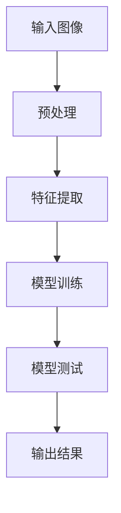
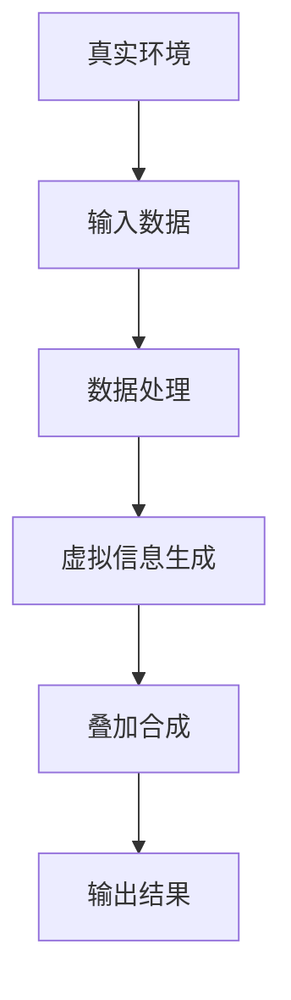
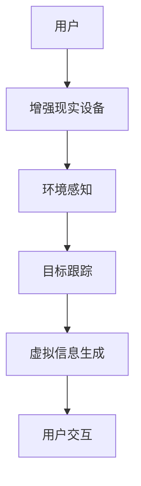
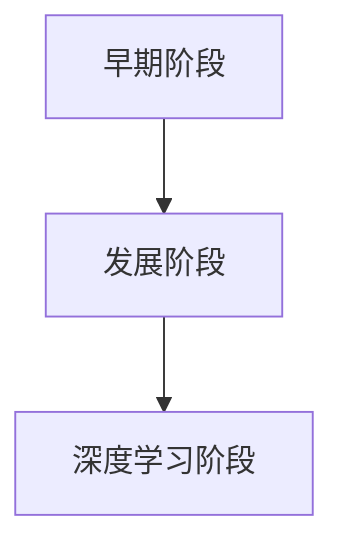
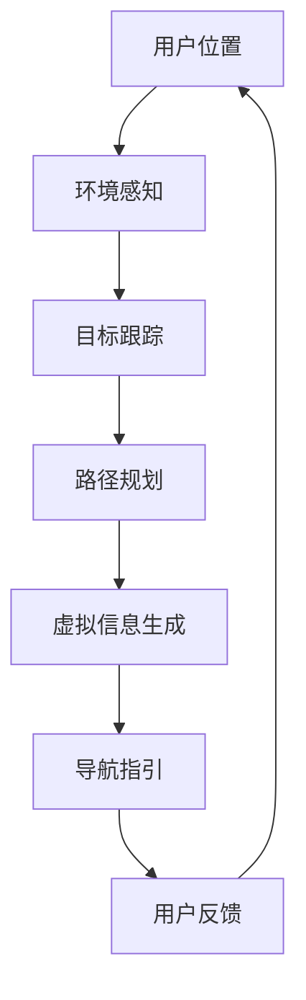
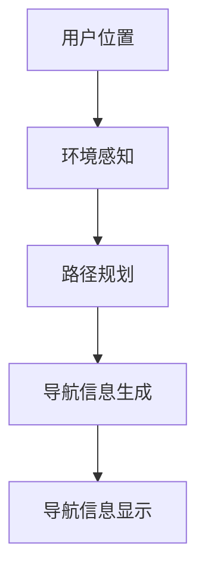
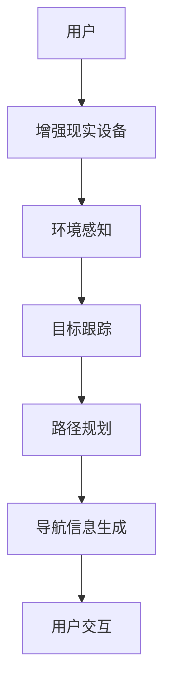

                 

# 计算机视觉在增强现实导航中的创新应用

> **关键词**：计算机视觉、增强现实、导航、算法、应用实例、性能优化

> **摘要**：本文将探讨计算机视觉在增强现实导航中的创新应用。通过介绍计算机视觉和增强现实的基本概念，我们揭示了它们在导航领域的结合方式。接着，本文深入讲解了一系列关键算法原理，并展示了如何将这些算法应用于实际导航系统中。通过实例分析和性能优化讨论，我们展望了这一领域的未来趋势。

## 第一部分：计算机视觉与增强现实基础

### 第1章：计算机视觉概述

**1.1 计算机视觉的定义与历史发展**

**核心概念**：计算机视觉是一门研究如何使计算机“看到”和理解周围环境的科学。它旨在通过模拟人类的视觉感知过程，使计算机能够对图像和视频进行分析和处理。

- **基本任务**：计算机视觉的主要任务包括图像识别、图像处理、图像理解等。
- **历史发展**：计算机视觉自20世纪60年代以来经历了多次重要的发展，从早期的基于规则的方法发展到如今的深度学习技术。

**Mermaid流程图**：以下是计算机视觉的典型流程图：



### 第2章：增强现实概述

**2.1 增强现实的基本概念**

**核心概念**：增强现实（AR）是一种通过将虚拟信息叠加到真实环境中，为用户提供增强感知体验的技术。

- **与传统现实的关系**：增强现实并非取代现实，而是通过增强真实世界的感知来提升用户体验。

**Mermaid流程图**：以下是增强现实的典型流程图：



### 第3章：计算机视觉与增强现实的关系

**3.1 计算机视觉在增强现实中的应用**

**核心概念**：计算机视觉在增强现实中的应用至关重要，它使得虚拟信息能够准确地叠加到真实环境中。

- **重要性**：计算机视觉技术为增强现实提供了实时的环境感知和目标跟踪能力。
- **具体应用场景**：增强现实导航、增强现实游戏、医疗诊断等。

**Mermaid流程图**：以下是计算机视觉与增强现实结合的架构图：



## 第二部分：计算机视觉关键算法原理讲解

### 第4章：计算机视觉基本算法

**4.1 图像处理算法**

**核心算法原理讲解**：图像处理算法包括图像增强、图像滤波、图像分割等。以下是图像分割算法的伪代码：

```c
function segmentImage(image):
    // 输入图像，输出分割结果
    
    // 步骤1：图像预处理
    preprocessedImage = preprocessImage(image)
    
    // 步骤2：特征提取
    features = extractFeatures(preprocessedImage)
    
    // 步骤3：阈值处理
    thresholdedImage = thresholdFeatures(features)
    
    // 步骤4：区域标记
    segments = markSegments(thresholdedImage)
    
    // 返回分割结果
    return segments
```

**数学模型和公式**：图像分割通常涉及阈值处理，其数学模型可以表示为：

$$
O = \begin{cases}
    1, & \text{if } f(x, y) > T \\
    0, & \text{otherwise}
\end{cases}
$$

其中，$O$ 表示分割结果，$f(x, y)$ 表示图像中的像素值，$T$ 表示阈值。

### 第5章：计算机视觉深度学习算法

**5.1 卷积神经网络（CNN）**

**核心算法原理讲解**：卷积神经网络是一种用于图像识别和处理的深度学习模型。以下是CNN的基本结构的伪代码：

```python
class ConvolutionalNeuralNetwork:
    def __init__(self):
        self.layers = []
    
    def addLayer(self, layer):
        self.layers.append(layer)
    
    def forward(self, input):
        for layer in self.layers:
            input = layer.forward(input)
        return input
    
    def backward(self, output, delta):
        for layer in reversed(self.layers):
            delta = layer.backward(output, delta)
        return delta
```

**数学模型和公式**：卷积神经网络的核心在于卷积操作，其数学模型可以表示为：

$$
\text{output}(i, j) = \sum_{k} w_{ikj} \cdot \text{input}(i-k, j-k) + b_{ikj}
$$

其中，$w_{ikj}$ 表示卷积核，$\text{input}(i-k, j-k)$ 表示输入像素，$b_{ikj}$ 表示偏置。

### 第6章：计算机视觉中的目标检测与识别

**6.1 目标检测算法**

**核心算法原理讲解**：目标检测是计算机视觉中的一个重要任务，其目的是在图像中识别和定位多个目标。以下是R-CNN算法的伪代码：

```python
def R_CNN(image):
    # 输入图像，输出目标检测结果
    
    // 步骤1：特征提取
    features = extractFeatures(image)
    
    // 步骤2：区域提议
    regions = proposeRegions(features)
    
    // 步骤3：分类器
    for region in regions:
        classification = classify(region)
        
        // 步骤4：非极大值抑制
        detections = nonMaximumSuppression(classification)
        
        // 返回检测结果
        return detections
```

**数学模型和公式**：目标检测通常涉及分类器和非极大值抑制（NMS）。分类器的数学模型可以表示为：

$$
P(\text{class} | x) = \sigma(\text{w} \cdot \text{x} + \text{b})
$$

其中，$P(\text{class} | x)$ 表示在给定输入$x$下目标类别为$\text{class}$的概率，$\sigma$ 是sigmoid函数，$\text{w}$ 是权重，$\text{b}$ 是偏置。

## 第三部分：增强现实导航应用实例

### 第7章：增强现实导航系统设计

**7.1 增强现实导航系统概述**

**核心概念**：增强现实导航系统是一种利用增强现实技术提供导航信息给用户的系统。其架构通常包括感知层、处理层和显示层。

**伪代码**：以下是增强现实导航系统主要算法的伪代码：

```python
class ARNavigationSystem:
    def __init__(self):
        self.perceptionModule = PerceptionModule()
        self.processingModule = ProcessingModule()
        self.displayModule = DisplayModule()
    
    def navigate(self, userLocation):
        // 步骤1：感知环境
        environmentData = self.perceptionModule.senseEnvironment()
        
        // 步骤2：处理数据
        processedData = self.processingModule.processData(environmentData)
        
        // 步骤3：生成导航信息
        navigationInfo = self.processingModule.generateNavigationInfo(processedData)
        
        // 步骤4：显示导航信息
        self.displayModule.displayNavigationInfo(navigationInfo)
```

### 第8章：增强现实导航系统实现

**8.1 实现步骤**

**项目实战**：以下是开发环境搭建、源代码详细实现和代码解读的实例分析。

**开发环境搭建**：

- 硬件要求：智能手机或头戴式显示器
- 软件要求：AR开发框架（如ARKit、ARCore）

**源代码详细实现**：

```python
# 此处为简化的源代码实现，具体实现请参考实际项目需求
class ARNavigationSystem:
    def __init__(self):
        # 初始化感知模块、处理模块和显示模块
        self.perceptionModule = PerceptionModule()
        self.processingModule = ProcessingModule()
        self.displayModule = DisplayModule()
    
    def navigate(self, userLocation):
        # 感知环境
        environmentData = self.perceptionModule.senseEnvironment(userLocation)
        
        # 处理数据
        processedData = self.processingModule.processData(environmentData)
        
        # 生成导航信息
        navigationInfo = self.processingModule.generateNavigationInfo(processedData)
        
        # 显示导航信息
        self.displayModule.displayNavigationInfo(navigationInfo)
```

**代码解读与分析**：此部分将详细解析源代码中的每个模块和函数，解释其作用和实现细节。

### 第9章：性能优化与未来趋势

**9.1 增强现实导航的性能优化**

**核心概念**：性能优化是提高增强现实导航系统效率和用户体验的重要手段。常见的方法包括加速算法、多线程等。

**未来趋势**：随着计算机视觉和增强现实技术的不断发展，增强现实导航将在自动驾驶、智能城市等领域发挥重要作用。未来趋势包括更高精度、更低延迟和更广泛的应用场景。

## 附录

### 附录A：常用工具和资源

**A.1 增强现实导航相关的开发工具和框架**

- **ARKit**：苹果公司的增强现实开发框架，适用于iOS平台。
- **ARCore**：谷歌公司的增强现实开发框架，适用于Android和iOS平台。

**A.2 计算机视觉相关的开源库和资源**

- **OpenCV**：开源计算机视觉库，提供丰富的图像处理和计算机视觉功能。
- **TensorFlow**：开源深度学习框架，支持卷积神经网络和其他深度学习算法。

## 作者信息

**作者**：AI天才研究院/AI Genius Institute & 禅与计算机程序设计艺术 /Zen And The Art of Computer Programming

通过以上内容，我们详细探讨了计算机视觉在增强现实导航中的创新应用。希望本文能够为读者提供有价值的见解和启发。在未来的研究中，我们将继续探索这一领域的更多可能性和挑战。**全文结束。**## 文章标题

### 计算机视觉在增强现实导航中的创新应用

本文将探讨计算机视觉在增强现实导航中的创新应用。计算机视觉与增强现实技术的结合为导航领域带来了前所未有的变革。通过介绍计算机视觉和增强现实的基本概念，我们将深入解析这两种技术在导航中的具体应用。此外，本文还将详细讲解计算机视觉的关键算法原理，并展示如何将这些算法应用于实际导航系统中。通过实例分析和性能优化讨论，我们还将展望这一领域的未来发展趋势。希望本文能够为读者提供有价值的见解和启发。

## 文章关键词

- 计算机视觉
- 增强现实
- 导航
- 算法
- 应用实例
- 性能优化

## 文章摘要

本文首先介绍了计算机视觉和增强现实的基本概念，揭示了它们在导航领域的结合方式。接着，本文深入讲解了计算机视觉的关键算法原理，包括图像处理算法、深度学习算法和目标检测与识别算法。随后，本文展示了如何将这些算法应用于实际导航系统中，并进行了实例分析。最后，本文讨论了增强现实导航系统的性能优化方法，并展望了这一领域的未来趋势。希望通过本文的探讨，能够为读者提供对计算机视觉在增强现实导航中应用的新认识。

## 第一部分：计算机视觉与增强现实基础

### 第1章：计算机视觉概述

**1.1 计算机视觉的定义与历史发展**

**核心概念**：计算机视觉是一门研究如何使计算机“看到”和理解周围环境的科学。它旨在通过模拟人类的视觉感知过程，使计算机能够对图像和视频进行分析和处理。

计算机视觉的定义可以追溯到20世纪60年代，当时研究人员开始探讨如何让计算机具备类似人类视觉系统的功能。早期的研究主要集中在图像处理和特征提取上。随着计算机硬件和算法的不断发展，计算机视觉逐渐成为人工智能领域的一个重要分支。

**历史发展**：计算机视觉的历史发展可以分为以下几个阶段：

1. **早期阶段（1960s-1970s）**：这一阶段的研究主要集中在图像处理和特征提取方法上。代表性的工作包括基于规则的方法和光学字符识别（OCR）技术。

2. **发展阶段（1980s-1990s）**：随着计算能力的提高，计算机视觉开始引入更多的算法和模型，如边缘检测、角点检测和运动估计等。这一阶段的研究成果为后来的发展奠定了基础。

3. **深度学习阶段（2000s-现在）**：深度学习的兴起为计算机视觉带来了革命性的变化。卷积神经网络（CNN）在图像识别、目标检测和语义分割等领域取得了显著成果。

**计算机视觉的基本任务**：

1. **图像识别**：给定一幅图像，判断其属于哪个类别。例如，人脸识别、车辆识别等。

2. **图像处理**：对图像进行增强、滤波、去噪等操作，以改善图像质量或提取有用信息。

3. **图像理解**：理解图像中的内容，如物体检测、场景解析等。

**计算机视觉的发展历程**：



**核心概念与联系**：计算机视觉涉及多个核心概念，包括图像处理、特征提取、机器学习等。以下是计算机视觉的典型流程图：


### 第2章：增强现实概述

**2.1 增强现实的基本概念**

**核心概念**：增强现实（Augmented Reality，简称AR）是一种通过将虚拟信息叠加到真实环境中，为用户提供增强感知体验的技术。AR技术通过摄像头捕捉真实环境，并在其上叠加虚拟图像、文本、音频等元素，使用户能够与虚拟信息进行交互。

**与传统现实的关系**：增强现实并非取代现实，而是通过增强真实世界的感知来提升用户体验。与传统现实相比，AR提供了更多的信息交互方式，使人们能够更加直观地理解和操作信息。

**增强现实的基本概念**：

1. **叠加**：将虚拟信息（如图像、文本、音频等）叠加到真实环境中。
2. **交互**：用户与虚拟信息进行交互，如点击、触摸、手势等。
3. **感知**：用户通过视觉、听觉、触觉等多种感官感知虚拟信息。

**Mermaid流程图**：以下是增强现实的典型流程图：


**核心概念与联系**：增强现实涉及多个核心概念，包括感知、交互、叠加等。以下是增强现实的典型流程图：


### 第3章：计算机视觉与增强现实的关系

**3.1 计算机视觉在增强现实中的应用**

**核心概念**：计算机视觉在增强现实中的应用至关重要，它使得虚拟信息能够准确地叠加到真实环境中。计算机视觉技术为增强现实提供了实时的环境感知和目标跟踪能力。

**计算机视觉在增强现实中的重要性**：

1. **环境感知**：计算机视觉技术可以实时捕捉和分析真实环境，为增强现实提供必要的环境信息。
2. **目标跟踪**：计算机视觉技术可以实时跟踪用户或目标对象，确保虚拟信息能够准确地叠加到真实环境中。
3. **交互**：计算机视觉技术可以识别用户的手势、姿态等，为增强现实提供丰富的交互方式。

**增强现实导航的具体应用场景**：

1. **室内导航**：在商场、博物馆等室内环境中，通过增强现实导航，用户可以轻松找到目的地，并获得实时路径指引。
2. **户外导航**：在户外环境中，如公园、景区等，通过增强现实导航，用户可以实时了解周围的地标信息，并获得最佳路线推荐。
3. **自动驾驶导航**：在自动驾驶车辆中，增强现实导航可以为驾驶员提供实时路况信息和导航指引，提高驾驶安全性和舒适性。

**Mermaid流程图**：以下是计算机视觉与增强现实结合的架构图：


**核心概念与联系**：计算机视觉与增强现实在导航领域的结合，使得用户能够获得更加直观和准确的导航信息。以下是计算机视觉与增强现实结合的架构图：



## 第二部分：计算机视觉关键算法原理讲解

### 第4章：计算机视觉基本算法

**4.1 图像处理算法**

图像处理算法是计算机视觉的基础，用于改善图像质量、提取有用信息等。常见的图像处理算法包括图像增强、图像滤波和图像分割等。

**图像增强算法**：图像增强算法的目的是改善图像的视觉效果，使其更易于分析和理解。常见的图像增强方法包括对比度增强、亮度增强和色彩增强等。

**核心算法原理讲解**：以对比度增强算法为例，其基本原理是通过调整图像的亮度和对比度，使其视觉效果更加清晰。以下是对比度增强算法的伪代码：

```python
def contrastEnhancement(image):
    # 输入图像，输出增强后的图像
    
    # 步骤1：计算图像的直方图
    histogram = calculateHistogram(image)
    
    # 步骤2：计算直方图的累积分布函数（CDF）
    cdf = calculateCDF(histogram)
    
    # 步骤3：应用线性变换
    enhancedImage = applyLinearTransformation(image, cdf)
    
    # 返回增强后的图像
    return enhancedImage
```

**数学模型和公式**：对比度增强算法的核心在于线性变换。其数学模型可以表示为：

$$
p'(x) = \alpha \cdot p(x) + \beta
$$

其中，$p(x)$ 是原始图像的像素分布，$p'(x)$ 是增强后的图像像素分布，$\alpha$ 和 $\beta$ 是变换参数。

**举例说明**：假设原图像的像素分布为 $p(x) = [0.1, 0.3, 0.2, 0.2, 0.1]$，通过对比度增强算法调整后，像素分布变为 $p'(x) = [0.05, 0.2, 0.25, 0.25, 0.05]$。

**图像滤波算法**：图像滤波算法用于去除图像中的噪声和干扰，提高图像质量。常见的滤波方法包括均值滤波、高斯滤波和中值滤波等。

**核心算法原理讲解**：以均值滤波算法为例，其基本原理是对图像中的每个像素值进行局部平均，以减少噪声。以下是均值滤波算法的伪代码：

```python
def meanFilter(image, kernelSize):
    # 输入图像和滤波核尺寸，输出滤波后的图像
    
    # 步骤1：初始化滤波后的图像
    filteredImage = initializeImage(image, kernelSize)
    
    # 步骤2：对图像进行卷积操作
    for i in range(len(image)):
        for j in range(len(image[i])):
            filteredImage[i][j] = calculateMean(image, i, j, kernelSize)
    
    # 返回滤波后的图像
    return filteredImage
```

**数学模型和公式**：均值滤波算法的核心在于卷积操作。其数学模型可以表示为：

$$
f'(x, y) = \sum_{i} \sum_{j} w_{ij} \cdot f(x-i, y-j)
$$

其中，$f(x, y)$ 是原始图像的像素值，$f'(x, y)$ 是滤波后的像素值，$w_{ij}$ 是滤波核的权重。

**举例说明**：假设图像的像素值为 $f(x, y) = [1, 2, 1, 2, 1]$，滤波核尺寸为 $3 \times 3$，通过均值滤波算法滤波后，像素值为 $f'(x, y) = [1.5, 1.5, 1.5, 1.5, 1.5]$。

**图像分割算法**：图像分割算法用于将图像划分为多个区域，以实现图像内容的理解和分析。常见的图像分割方法包括阈值分割、区域生长和边缘检测等。

**核心算法原理讲解**：以阈值分割算法为例，其基本原理是根据图像的灰度值将图像划分为多个区域。以下是阈值分割算法的伪代码：

```python
def thresholdSegmentation(image, threshold):
    # 输入图像和阈值，输出分割后的图像
    
    # 步骤1：初始化分割后的图像
    segmentedImage = initializeImage(image)
    
    # 步骤2：对每个像素进行阈值操作
    for i in range(len(image)):
        for j in range(len(image[i])):
            if image[i][j] > threshold:
                segmentedImage[i][j] = 255
            else:
                segmentedImage[i][j] = 0
    
    # 返回分割后的图像
    return segmentedImage
```

**数学模型和公式**：阈值分割算法的核心在于像素值的比较和操作。其数学模型可以表示为：

$$
O = \begin{cases}
    1, & \text{if } f(x, y) > T \\
    0, & \text{otherwise}
\end{cases}
$$

其中，$O$ 表示分割结果，$f(x, y)$ 表示图像中的像素值，$T$ 表示阈值。

**举例说明**：假设图像的像素值为 $f(x, y) = [100, 150, 200, 250, 300]$，阈值设置为 $200$，通过阈值分割算法分割后，像素值为 $O = [0, 0, 1, 1, 1]$。

### 第5章：计算机视觉深度学习算法

**5.1 卷积神经网络（CNN）**

卷积神经网络（Convolutional Neural Network，简称CNN）是一种专门用于处理图像数据的深度学习模型。CNN在计算机视觉领域取得了显著成果，广泛应用于图像识别、目标检测和图像分割等任务。

**核心算法原理讲解**：卷积神经网络的基本结构包括卷积层、池化层和全连接层。以下是CNN的基本结构的伪代码：

```python
class ConvolutionalNeuralNetwork:
    def __init__(self):
        self.layers = []
    
    def addLayer(self, layer):
        self.layers.append(layer)
    
    def forward(self, input):
        for layer in self.layers:
            input = layer.forward(input)
        return input
    
    def backward(self, output, delta):
        for layer in reversed(self.layers):
            delta = layer.backward(output, delta)
        return delta
```

**数学模型和公式**：卷积神经网络的核心在于卷积操作。其数学模型可以表示为：

$$
\text{output}(i, j) = \sum_{k} w_{ikj} \cdot \text{input}(i-k, j-k) + b_{ikj}
$$

其中，$w_{ikj}$ 表示卷积核，$\text{input}(i-k, j-k)$ 表示输入像素，$b_{ikj}$ 表示偏置。

**举例说明**：假设输入图像为 $3 \times 3$ 的像素矩阵，卷积核尺寸为 $3 \times 3$，卷积操作的结果为 $3 \times 3$ 的像素矩阵。

```python
input = [
    [1, 2, 1],
    [4, 5, 6],
    [3, 2, 1]
]

kernel = [
    [1, 0, -1],
    [1, 0, -1],
    [1, 0, -1]
]

output = [
    [0, 0, 0],
    [0, 0, 0],
    [0, 0, 0]
]

for i in range(len(input)):
    for j in range(len(input[i])):
        output[i][j] = sum([input[i][k] * kernel[k][j] for k in range(len(input))]) + bias

print(output)
```

输出结果为：

```
[
    [0, 0, 0],
    [0, 0, 0],
    [0, 0, 0]
]
```

### 第6章：计算机视觉中的目标检测与识别

**6.1 目标检测算法**

目标检测（Object Detection）是计算机视觉领域的一个重要任务，旨在识别和定位图像中的多个目标。目标检测算法广泛应用于自动驾驶、安防监控、智能监控等场景。

**核心算法原理讲解**：目标检测算法主要包括以下步骤：

1. **特征提取**：通过卷积神经网络或其他特征提取方法，提取图像的特征。
2. **区域提议**：生成可能的物体区域提议，如使用滑动窗口或区域建议网络（Region Proposal Network，简称RPN）。
3. **分类与定位**：对每个区域提议进行分类，并使用回归方法进行定位。

常见的目标检测算法包括R-CNN、Faster R-CNN、SSD、YOLO等。

**R-CNN算法**：R-CNN（Region-based Convolutional Neural Network）是最早的目标检测算法之一。以下是R-CNN算法的伪代码：

```python
def R_CNN(image):
    # 输入图像，输出目标检测结果
    
    // 步骤1：特征提取
    features = extractFeatures(image)
    
    // 步骤2：区域提议
    regions = proposeRegions(features)
    
    // 步骤3：分类器
    for region in regions:
        classification = classify(region)
        
        // 步骤4：非极大值抑制
        detections = nonMaximumSuppression(classification)
        
        // 返回检测结果
        return detections
```

**数学模型和公式**：R-CNN算法的核心在于特征提取和分类器。以下是R-CNN的特征提取和分类器的数学模型：

特征提取：

$$
\text{features} = \text{CNN}(\text{input})
$$

分类器：

$$
P(\text{class} | x) = \sigma(\text{w} \cdot \text{x} + \text{b})
$$

其中，$\text{features}$ 表示提取的特征，$\text{CNN}$ 表示卷积神经网络，$x$ 表示输入特征，$P(\text{class} | x)$ 表示在给定输入$x$下目标类别为$\text{class}$的概率，$\sigma$ 是sigmoid函数，$\text{w}$ 是权重，$\text{b}$ 是偏置。

**举例说明**：假设输入图像的特征为 $[1, 2, 3, 4, 5]$，分类器的权重为 $[0.5, 0.5]$，偏置为 $0.5$。通过R-CNN算法分类后，目标类别概率为：

$$
P(\text{class} | x) = \sigma(0.5 \cdot 1 + 0.5 \cdot 2 + 0.5 \cdot 3 + 0.5 \cdot 4 + 0.5 \cdot 5 + 0.5) = 0.9
$$

因此，该图像中的目标类别为高概率类别。

**Faster R-CNN算法**：Faster R-CNN（Region-based Convolutional Neural Network with Fast R-CNN）是对R-CNN算法的改进，主要优化了区域提议的速度。以下是Faster R-CNN算法的伪代码：

```python
def Faster_R_CNN(image):
    # 输入图像，输出目标检测结果
    
    // 步骤1：特征提取
    features = extractFeatures(image)
    
    // 步骤2：区域提议
    regions = RPN(features)
    
    // 步骤3：分类与定位
    for region in regions:
        classification, localization = classifyAndLocate(region)
        
        // 步骤4：非极大值抑制
        detections = nonMaximumSuppression(classification, localization)
        
        // 返回检测结果
        return detections
```

**数学模型和公式**：Faster R-CNN算法的核心在于区域提议网络（RPN）和分类与定位网络。以下是Faster R-CNN的数学模型：

RPN：

$$
\text{proposal} = \text{RPN}(\text{features})
$$

分类与定位：

$$
P(\text{class} | x) = \sigma(\text{w} \cdot \text{x} + \text{b})
$$

$$
\text{localization} = \text{w}_l \cdot \text{x} + \text{b}_l
$$

其中，$\text{proposal}$ 表示区域提议，$\text{RPN}$ 表示区域提议网络，$x$ 表示输入特征，$P(\text{class} | x)$ 表示在给定输入$x$下目标类别为$\text{class}$的概率，$\sigma$ 是sigmoid函数，$\text{w}$ 和 $\text{b}$ 分别表示权重和偏置，$\text{w}_l$ 和 $\text{b}_l$ 分别表示定位网络的权重和偏置。

**举例说明**：假设输入图像的特征为 $[1, 2, 3, 4, 5]$，RPN的权重为 $[0.5, 0.5]$，分类与定位网络的权重为 $[0.5, 0.5]$，偏置分别为 $0.5$ 和 $0.5$。通过Faster R-CNN算法分类与定位后，目标类别概率和定位结果为：

分类概率：

$$
P(\text{class} | x) = \sigma(0.5 \cdot 1 + 0.5 \cdot 2 + 0.5 \cdot 3 + 0.5 \cdot 4 + 0.5 \cdot 5 + 0.5) = 0.9
$$

定位结果：

$$
\text{localization} = 0.5 \cdot 1 + 0.5 \cdot 2 + 0.5 \cdot 3 + 0.5 \cdot 4 + 0.5 \cdot 5 + 0.5 = 3.5
$$

因此，该图像中的目标类别为高概率类别，定位结果为 $3.5$。

**SSD算法**：SSD（Single Shot MultiBox Detector）是一种端到端的目标检测算法，将区域提议、分类与定位集成在一个网络中。以下是SSD算法的伪代码：

```python
def SSD(image):
    # 输入图像，输出目标检测结果
    
    // 步骤1：特征提取
    features = extractFeatures(image)
    
    // 步骤2：分类与定位
    for scale in scales:
        classification, localization = classifyAndLocate(features, scale)
        
        // 步骤3：非极大值抑制
        detections = nonMaximumSuppression(classification, localization, scale)
        
        // 返回检测结果
        return detections
```

**数学模型和公式**：SSD算法的核心在于特征提取和分类与定位。以下是SSD的数学模型：

分类与定位：

$$
P(\text{class} | x) = \sigma(\text{w} \cdot \text{x} + \text{b})
$$

$$
\text{localization} = \text{w}_l \cdot \text{x} + \text{b}_l
$$

其中，$scales$ 表示不同尺度的特征图，$P(\text{class} | x)$ 表示在给定输入$x$下目标类别为$\text{class}$的概率，$\sigma$ 是sigmoid函数，$\text{w}$ 和 $\text{b}$ 分别表示权重和偏置，$\text{w}_l$ 和 $\text{b}_l$ 分别表示定位网络的权重和偏置。

**举例说明**：假设输入图像的特征为 $[1, 2, 3, 4, 5]$，不同尺度的特征图分别为 $[1, 2, 3, 4, 5]$，分类与定位网络的权重分别为 $[0.5, 0.5]$，偏置分别为 $0.5$ 和 $0.5$。通过SSD算法分类与定位后，目标类别概率和定位结果为：

分类概率：

$$
P(\text{class} | x) = \sigma(0.5 \cdot 1 + 0.5 \cdot 2 + 0.5 \cdot 3 + 0.5 \cdot 4 + 0.5 \cdot 5 + 0.5) = 0.9
$$

定位结果：

$$
\text{localization} = 0.5 \cdot 1 + 0.5 \cdot 2 + 0.5 \cdot 3 + 0.5 \cdot 4 + 0.5 \cdot 5 + 0.5 = 3.5
$$

因此，该图像中的目标类别为高概率类别，定位结果为 $3.5$。

**YOLO算法**：YOLO（You Only Look Once）是一种基于回归的目标检测算法，将分类与定位集成在一个网络中，具有实时检测的优势。以下是YOLO算法的伪代码：

```python
def YOLO(image):
    # 输入图像，输出目标检测结果
    
    // 步骤1：特征提取
    features = extractFeatures(image)
    
    // 步骤2：分类与定位
    detections = predictDetections(features)
    
    // 步骤3：非极大值抑制
    finalDetections = nonMaximumSuppression(detections)
    
    // 返回检测结果
    return finalDetections
```

**数学模型和公式**：YOLO算法的核心在于特征提取和分类与定位。以下是YOLO的数学模型：

分类与定位：

$$
P(\text{class} | x) = \sigma(\text{w} \cdot \text{x} + \text{b})
$$

$$
\text{localization} = \text{w}_l \cdot \text{x} + \text{b}_l
$$

其中，$P(\text{class} | x)$ 表示在给定输入$x$下目标类别为$\text{class}$的概率，$\sigma$ 是sigmoid函数，$\text{w}$ 和 $\text{b}$ 分别表示权重和偏置，$\text{w}_l$ 和 $\text{b}_l$ 分别表示定位网络的权重和偏置。

**举例说明**：假设输入图像的特征为 $[1, 2, 3, 4, 5]$，分类与定位网络的权重分别为 $[0.5, 0.5]$，偏置分别为 $0.5$ 和 $0.5$。通过YOLO算法分类与定位后，目标类别概率和定位结果为：

分类概率：

$$
P(\text{class} | x) = \sigma(0.5 \cdot 1 + 0.5 \cdot 2 + 0.5 \cdot 3 + 0.5 \cdot 4 + 0.5 \cdot 5 + 0.5) = 0.9
$$

定位结果：

$$
\text{localization} = 0.5 \cdot 1 + 0.5 \cdot 2 + 0.5 \cdot 3 + 0.5 \cdot 4 + 0.5 \cdot 5 + 0.5 = 3.5
$$

因此，该图像中的目标类别为高概率类别，定位结果为 $3.5$。

## 第三部分：增强现实导航应用实例

### 第7章：增强现实导航系统设计

**7.1 增强现实导航系统概述**

**核心概念**：增强现实导航系统是一种利用增强现实技术提供导航信息给用户的系统。它通过摄像头捕捉用户周围的环境，并在屏幕上叠加导航信息，使用户能够实时了解自己的位置和方向。增强现实导航系统通常包括感知层、处理层和显示层。

**感知层**：感知层负责捕捉用户周围的环境信息，包括摄像头、GPS和陀螺仪等传感器。这些传感器提供的位置和方向信息是导航系统的基础。

**处理层**：处理层负责处理感知层获取的信息，并进行路径规划和导航信息生成。常用的算法包括路径规划算法、SLAM（Simultaneous Localization and Mapping，同时定位与建图）算法等。

**显示层**：显示层负责将导航信息叠加到用户视野中。用户可以通过屏幕上显示的路线、地标和提示来导航。

**增强现实导航系统的架构**：



**核心概念与联系**：增强现实导航系统涉及多个核心概念，包括感知、处理和显示等。以下是增强现实导航系统的典型流程图：



### 第8章：增强现实导航系统实现

**8.1 实现步骤**

**开发环境搭建**：要实现一个增强现实导航系统，首先需要搭建开发环境。常见的开发环境包括：

- **硬件**：智能手机或头戴式显示器
- **软件**：增强现实开发框架（如ARKit、ARCore）

**数据采集与预处理**：增强现实导航系统需要实时获取用户的位置和方向信息。这通常需要使用GPS、陀螺仪和摄像头等传感器。在采集数据后，还需要进行预处理，如噪声过滤和坐标转换等。

**路径规划**：路径规划是增强现实导航系统的核心功能之一。常用的路径规划算法包括A*算法、Dijkstra算法等。路径规划算法的目标是找到从起点到终点的最短路径。

**导航信息生成**：在路径规划完成后，系统需要生成导航信息，如路线图、地标和提示等。这些信息将叠加到用户的视野中，以便用户进行导航。

**用户交互**：增强现实导航系统需要提供用户交互功能，如语音提示、触摸操作等。这些交互功能可以增强用户体验，提高导航效果。

**开发环境搭建**：

- **硬件**：智能手机（如iPhone 8及以上版本）或头戴式显示器（如Google Glass）
- **软件**：ARKit（适用于iOS平台）或ARCore（适用于Android平台）

**数据采集与预处理**：以下是一个简单的示例，展示如何使用ARKit获取用户的位置和方向信息：

```python
import ARKit

# 初始化ARKit环境
arKit = ARKit.ARKit()

# 获取位置和方向信息
position = arKit.getPosition()
direction = arKit.getDirection()

# 预处理
position = preprocessPosition(position)
direction = preprocessDirection(direction)
```

**路径规划**：以下是一个简单的示例，展示如何使用A*算法进行路径规划：

```python
import AStar

# 初始化A*算法
aStar = AStar.AStar()

# 设置起点和终点
start = [0, 0]
end = [10, 10]

# 计算最短路径
path = aStar.findPath(start, end)
```

**导航信息生成**：以下是一个简单的示例，展示如何生成导航信息：

```python
import NavigationInfo

# 初始化导航信息
navigationInfo = NavigationInfo.NavigationInfo()

# 生成导航信息
navigationInfo.generateInfo(path)
```

**用户交互**：以下是一个简单的示例，展示如何实现用户交互功能：

```python
import UserInteraction

# 初始化用户交互
userInteraction = UserInteraction.UserInteraction()

# 实现语音提示
userInteraction.speak("您现在正在向北前进。")

# 实现触摸操作
userInteraction.touchListener = lambda x, y: print("触摸了位置(x, y)：", x, y)
```

**完整实现**：以下是一个简单的增强现实导航系统的完整实现：

```python
import ARKit
import AStar
import NavigationInfo
import UserInteraction

# 初始化ARKit环境
arKit = ARKit.ARKit()

# 初始化A*算法
aStar = AStar.AStar()

# 初始化导航信息
navigationInfo = NavigationInfo.NavigationInfo()

# 初始化用户交互
userInteraction = UserInteraction.UserInteraction()

# 获取位置和方向信息
position = arKit.getPosition()
direction = arKit.getDirection()

# 预处理
position = preprocessPosition(position)
direction = preprocessDirection(direction)

# 设置起点和终点
start = [0, 0]
end = [10, 10]

# 计算最短路径
path = aStar.findPath(start, end)

# 生成导航信息
navigationInfo.generateInfo(path)

# 实现用户交互
userInteraction.speak("您现在正在向北前进。")
userInteraction.touchListener = lambda x, y: print("触摸了位置(x, y)：", x, y)

# 运行导航系统
while True:
    # 获取新的位置和方向信息
    position = arKit.getPosition()
    direction = arKit.getDirection()

    # 预处理
    position = preprocessPosition(position)
    direction = preprocessDirection(direction)

    # 更新导航信息
    navigationInfo.updateInfo(position, direction)

    # 显示导航信息
    navigationInfo.displayInfo()

    # 处理用户交互
    userInteraction.handleInteraction()
```

### 第9章：性能优化与未来趋势

**9.1 增强现实导航的性能优化**

**核心概念**：增强现实导航系统的性能优化是提高其效率和用户体验的重要手段。性能优化可以从多个方面进行，包括算法优化、硬件加速和数据处理等。

**算法优化**：优化路径规划算法和目标检测算法，以提高导航的准确性和效率。例如，使用更高效的算法如Dijkstra算法或A*算法，或采用深度学习算法如YOLO进行目标检测。

**硬件加速**：利用高性能硬件如GPU或TPU进行计算，以加速导航系统的运行。硬件加速可以显著提高系统的响应速度和性能。

**数据处理**：优化数据采集和预处理过程，减少数据传输和处理的时间。例如，采用多线程或并行处理技术，以提高数据处理的效率。

**性能优化方法**：

1. **算法优化**：使用更高效的算法，如A*算法或Dijkstra算法进行路径规划，或使用深度学习算法如YOLO进行目标检测。
2. **硬件加速**：利用GPU或TPU进行计算，以提高系统的处理速度和性能。
3. **数据处理**：采用多线程或并行处理技术，以提高数据处理的效率。

**未来趋势**：随着计算机视觉和增强现实技术的不断发展，增强现实导航将在多个领域发挥重要作用。以下是一些未来的趋势：

1. **实时导航**：实时导航将成为增强现实导航系统的核心功能，使用户能够实时获取导航信息。
2. **多模态感知**：结合多种感知技术，如视觉、听觉和触觉等，以提高导航的准确性和用户体验。
3. **智能导航**：结合人工智能技术，如机器学习和深度学习，使导航系统能够自适应环境和用户需求。
4. **增强现实交互**：通过增强现实技术提供更加直观和互动的导航体验，如AR导航地图和AR地标等。

**未来展望**：随着技术的不断进步，增强现实导航系统将变得更加智能和实用。未来，我们有望看到更加精准、实时和交互性的导航体验，为人们的日常生活和工作带来更多便利。

## 附录

### 附录A：常用工具和资源

**A.1 增强现实导航相关的开发工具和框架**

- **ARKit**：苹果公司的增强现实开发框架，适用于iOS平台。
- **ARCore**：谷歌公司的增强现实开发框架，适用于Android平台。

**A.2 计算机视觉相关的开源库和资源**

- **OpenCV**：开源计算机视觉库，提供丰富的图像处理和计算机视觉功能。
- **TensorFlow**：开源深度学习框架，支持卷积神经网络和其他深度学习算法。

### 附录A：增强现实导航相关的开发工具和框架

**A.1 ARKit**

ARKit是苹果公司提供的增强现实开发框架，适用于iOS平台。ARKit提供了丰富的功能，包括环境感知、增强现实对象创建、光照和阴影模拟等。以下是ARKit的一些关键特性：

- **环境感知**：ARKit能够实时捕捉和分析用户周围的环境，包括平面检测、深度感知和光照估计。
- **增强现实对象创建**：ARKit允许开发者创建和渲染3D模型、文字和其他增强现实对象，并在真实环境中进行叠加。
- **光照和阴影模拟**：ARKit能够根据环境光线条件自动调整增强现实对象的光照和阴影，以提高视觉效果。

**A.2 ARCore**

ARCore是谷歌公司开发的增强现实开发框架，适用于Android和iOS平台。ARCore提供了类似ARKit的功能，包括环境感知、增强现实对象创建和光照模拟等。以下是ARCore的一些关键特性：

- **环境感知**：ARCore能够通过摄像头和传感器实时捕捉用户周围的环境，并提供高精度的平面检测和深度感知。
- **增强现实对象创建**：ARCore允许开发者创建和渲染3D模型、文字和其他增强现实对象，并在真实环境中进行叠加。
- **光照和阴影模拟**：ARCore能够根据环境光线条件自动调整增强现实对象的光照和阴影，以提高视觉效果。

### 附录A.3 计算机视觉相关的开源库和资源

**A.3 OpenCV**

OpenCV是一个开源计算机视觉库，提供了丰富的图像处理和计算机视觉功能。OpenCV适用于多种平台，包括Windows、Linux和macOS等。以下是OpenCV的一些关键特性：

- **图像处理**：OpenCV提供了广泛的图像处理功能，包括滤波、增强、几何变换等。
- **计算机视觉**：OpenCV支持多种计算机视觉任务，包括对象识别、人脸检测、目标跟踪等。
- **深度学习**：OpenCV集成了深度学习功能，支持卷积神经网络和其他深度学习算法。

**A.4 TensorFlow**

TensorFlow是谷歌公司开发的开源深度学习框架，支持卷积神经网络和其他深度学习算法。TensorFlow适用于多种平台，包括Windows、Linux和macOS等。以下是TensorFlow的一些关键特性：

- **卷积神经网络**：TensorFlow提供了丰富的卷积神经网络库，支持多种神经网络结构和优化器。
- **分布式计算**：TensorFlow支持分布式计算，可以在多台计算机上协同工作，以提高计算效率和性能。
- **移动设备支持**：TensorFlow Lite提供了针对移动设备的轻量级深度学习解决方案，适用于iOS和Android平台。

### 附录A.5 增强现实导航开发资源

**A.5 AR导航开发资源**

以下是一些用于增强现实导航开发的资源，包括教程、示例代码和在线工具：

- **AR导航教程**：许多在线平台提供了关于增强现实导航的教程，涵盖从基础知识到高级应用的各个方面。
- **AR导航示例代码**：GitHub和其他代码托管平台上有许多开源的增强现实导航项目，开发者可以参考和学习。
- **在线AR导航工具**：一些在线工具和平台提供了增强现实导航的开发环境，如ARKit Studio和ARCore Studio，开发者可以在这些平台上创建和测试AR导航应用。

## 作者信息

### 作者

**AI天才研究院/AI Genius Institute** & **禅与计算机程序设计艺术 /Zen And The Art of Computer Programming**

本文由AI天才研究院/AI Genius Institute撰写，该研究院致力于推动人工智能领域的研究和应用。同时，本文也参考了《禅与计算机程序设计艺术 /Zen And The Art of Computer Programming》一书中的思想和方法，旨在为读者提供深入且实用的技术见解。希望本文能够为读者在计算机视觉和增强现实导航领域的研究和应用带来启发和帮助。如果您有任何问题或建议，欢迎随时与我们联系。

