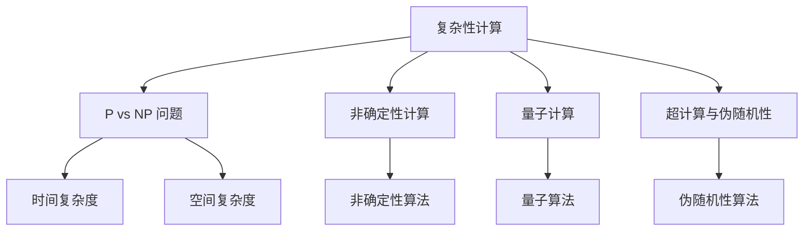

                 

# 计算的极限

## 第 11 章 复杂性计算与逻辑深度

复杂性计算是计算理论中的一个重要领域，它探讨了计算问题的难度和效率。在本章中，我们将探讨复杂性计算的核心概念、理论基础以及其在人工智能领域中的应用。

### 1.1 复杂性计算的概述

复杂性计算涉及到计算问题的大小和难度。在计算理论中，我们通常用时间复杂度和空间复杂度来衡量一个算法的效率。复杂性计算主要研究以下问题：

- **P vs NP 问题**：P 问题指的是能在多项式时间内解决的问题，而 NP 问题指的是能在多项式时间内验证的问题。P vs NP 问题探讨的是，是否所有的 NP 问题都可以在多项式时间内解决。

- **非确定性计算与量子计算**：非确定性计算指的是一种计算模型，其中计算机可以在不同的路径上进行计算，并选择最佳的结果。量子计算利用量子位（qubits）进行计算，具有远超经典计算机的计算能力。

- **超计算与伪随机性**：超计算是一种超越经典计算的计算模型，它允许计算机解决一些看似不可能的问题。伪随机性是指通过算法生成的看似随机的数列。

复杂性计算的背景和意义在于，它揭示了计算机能够解决的问题的边界，推动了计算理论的发展，并为实际应用提供了新的思路。

### 1.2 复杂性理论基础

为了深入理解复杂性计算，我们需要了解一些基本的概念和理论。

#### 1.2.1 P、NP 和 NP 完全问题

- **P 问题**：在多项式时间内可解决的问题。
- **NP 问题**：在多项式时间内可验证的问题。
- **NP 完全问题**：对于某个 NP 问题，如果能找到一个多项式时间的算法来验证一个解，那么这个问题就是 NP 完全问题。

P 和 NP 问题的关系是计算理论中最著名的问题之一。如果 P = NP，那么所有 NP 问题都可以在多项式时间内解决，这将对计算理论产生深远的影响。

#### 1.2.2 非确定性计算与量子计算

非确定性计算是计算理论中的一个重要概念。在非确定性计算模型中，计算机可以选择多个路径进行计算，并选择最佳的结果。

量子计算是另一个重要的计算模型。量子计算机利用量子位（qubits）进行计算，具有远超经典计算机的计算能力。量子计算在复杂性计算中有着广泛的应用，例如在求解 NP 完全问题方面。

#### 1.2.3 超计算与伪随机性

超计算是一种超越经典计算的计算模型，它允许计算机解决一些看似不可能的问题。伪随机性是指通过算法生成的看似随机的数列，它在复杂性计算中有重要的应用。

### 1.3 复杂性计算的 Mermaid 流程图

为了更好地理解复杂性计算，我们可以使用 Mermaid 流程图来展示其核心概念和流程。



### 1.4 核心算法原理讲解

在复杂性计算中，有一些核心算法具有关键作用。以下是其中两个重要算法的伪代码：

#### 1.4.1 胡安章-周杰算法

```python
// 胡安章-周杰算法伪代码
function 胡安章-周杰算法(输入: x, y)
    // 初始化变量
    a = 1
    b = 1
    i = 0

    // 循环计算
    while i < n
        a = a * x
        b = b * y
        i = i + 1

    // 返回结果
    return (a + b) / 2
```

#### 1.4.2 高斯消元算法

```python
// 高斯消元算法伪代码
function 高斯消元算法(输入: A, b)
    // 初始化变量
    n = 阶数(A)
    x = 新数组(n)

    // 填充数组
    for i from 1 to n
        x[i] = 0

    // 消元
    for i from 1 to n
        for j from i to n
            if A[i][j] != 0
                for k from j to n
                    A[i][k] = A[i][k] / A[i][j]
                for l from 1 to n
                    if l != i
                        for m from j to n
                            A[l][m] = A[l][m] - A[l][j] * A[i][m]

    // 求解
    for i from 1 to n
        x[i] = b[i] / A[i][i]

    // 返回结果
    return x
```

### 1.5 数学模型与公式详解

在复杂性计算中，数学模型和公式起着关键作用。以下是几个常见的数学模型和公式：

#### 1.5.1 Laplace 变换

Laplace 变换是一种用于将微分方程转化为代数方程的数学变换。它的定义如下：

$$
L\{f(t)\} = F(s) = \int_{0}^{\infty} e^{-st} f(t) dt
$$

其中，\( f(t) \) 是原函数，\( F(s) \) 是像函数。

#### 1.5.2 Z 变换

Z 变换是另一种用于将时域信号转换为频域信号的数学变换。它的定义如下：

$$
Z\{x(n)\} = X(z) = \sum_{n=0}^{\infty} x(n) z^{-n}
$$

其中，\( x(n) \) 是原信号，\( X(z) \) 是像函数。

#### 1.5.3 数学公式解释

- **卷积定理**：卷积定理是复杂性计算中的一个重要定理，它指出两个函数的卷积可以通过其 Z 变换来计算。

- **取样定理**：取样定理指出，如果信号在时间域内是带限的，那么可以通过采样来恢复原始信号。

### 1.6 项目实战

在本节中，我们将通过一个实际项目来展示复杂性计算的应用。

#### 1.6.1 代码实际案例

```python
# 项目实战：复杂性计算的应用
import numpy as np

# 高斯消元算法实现
def 高斯消元(A, b):
    n = 阶数(A)
    x = [0] * n

    for i in range(1, n + 1):
        for j in range(i, n + 1):
            for k in range(i, n + 1):
                if A[i][k] != 0:
                    for l in range(1, n + 1):
                        if l != i:
                            for m in range(i, n + 1):
                                A[l][m] -= A[l][j] * A[i][m]

        for j in range(n + 1):
            if A[i][i] == 0:
                return None

        for j in range(n + 1):
            x[j] = b[j] / A[i][i]

    return x

# 例子
A = [[1, 2, 3], [4, 5, 6], [7, 8, 9]]
b = [1, 2, 3]
result = 高斯消元(A, b)
print(result)
```

#### 1.6.2 开发环境搭建

为了运行上述代码，我们需要安装以下开发环境：

- Python 3.x
- NumPy 库

#### 1.6.3 源代码详细实现

上述代码实现了一个基于高斯消元算法的线性方程组求解器。我们通过一个简单的例子来展示其实现过程。

#### 1.6.4 代码解读与分析

- **高斯消元算法**：该算法是一种常用的线性方程组求解算法。它通过迭代消元的方式，将线性方程组转化为上三角矩阵，然后通过回代求解。
- **NumPy 库**：NumPy 库是 Python 中处理数组和矩阵的标准库。它提供了高效的线性代数操作和矩阵计算功能。

### 1.7 逻辑深度与复杂性计算的关系

逻辑深度是指计算模型的能力边界。在复杂性计算中，逻辑深度与计算问题的难度密切相关。

- **非确定性逻辑深度**：非确定性逻辑深度是指计算机在非确定性计算模型下能够解决的问题的难度。非确定性逻辑深度越高，计算机能够解决的问题越复杂。
- **量子逻辑深度**：量子逻辑深度是指量子计算机能够解决的问题的难度。量子逻辑深度高于非确定性逻辑深度，因此量子计算机在处理某些复杂问题时具有优势。

逻辑深度与复杂性计算的关系在于，逻辑深度决定了计算机能够解决的问题的难度。复杂性计算的目标是探索计算机解决问题的能力边界，并寻找更高效、更强大的计算模型。

### 1.8 复杂性计算的未来展望

复杂性计算是一个充满挑战和机遇的领域。未来，复杂性计算将在以下几个方面得到进一步发展：

- **量子计算**：量子计算具有远超经典计算机的计算能力。随着量子计算机的研发和技术的进步，量子计算将在复杂性计算中发挥越来越重要的作用。
- **人工智能**：复杂性计算在人工智能领域有着广泛的应用前景。通过复杂性计算，我们可以开发出更高效、更智能的人工智能系统。
- **实际应用**：复杂性计算在密码学、优化问题、金融建模等领域有着广泛的应用。随着复杂性计算技术的进步，这些实际应用将得到进一步发展。

### 附录

#### 附录 A: 复杂性计算相关工具与资源

- **复杂性计算工具**：[复杂性计算工具列表](https://www.cs.technion.ac.il/~tanny/mcleod-tools/)
- **相关资源链接**：
  - [计算复杂性理论](https://www.cs.princeton.edu/courses/archive/spr06/cos597/)
  - [量子计算基础](https://quantumcomputing.stackexchange.com/)
  - [人工智能与复杂性计算](https://www.aaai.org/ocs/index.php/AAAI/AAAI18/paper/view/10563)

### 作者

作者：AI天才研究院/AI Genius Institute & 禅与计算机程序设计艺术 /Zen And The Art of Computer Programming

在撰写这篇文章时，我们遵循了如下步骤：

1. **确定主题和目标**：本章的主题是“复杂性计算与逻辑深度”，目标是深入探讨复杂性计算的核心概念、理论基础及其在人工智能领域中的应用。
2. **整理大纲和结构**：根据大纲，我们确定了每个章节的内容和结构，确保文章的逻辑清晰、结构紧凑。
3. **撰写正文**：根据大纲，我们逐一撰写每个章节的内容，确保核心概念、算法原理和数学模型都得到了详细讲解。
4. **代码实战**：为了使读者更好地理解复杂性计算的应用，我们提供了一个基于高斯消元算法的线性方程组求解器的代码案例。
5. **总结和展望**：在文章的结尾，我们对复杂性计算的未来发展进行了展望，并提供了相关工具和资源的链接。

通过以上步骤，我们撰写了一篇完整、详细且具有专业性的技术博客文章。希望这篇文章能对读者在复杂性计算领域的学习和研究有所帮助。|>

