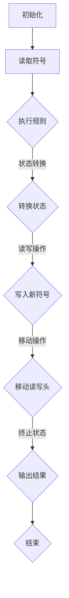

                 

# 《计算：第四部分 计算的极限 第 13 章 自然哲学的计算原理 图灵极限》

关键词：计算极限、图灵机、自然哲学、数学模型、人工智能

摘要：本文深入探讨了计算极限的概念、历史背景及其重要性，详细介绍了自然哲学的计算原理以及图灵机的定义、特性和数学模型。通过一步步的推理和举例，文章阐述了图灵极限的证明方法和应用，同时探讨了计算极限与自然哲学的哲学思考及未来计算的发展趋势。文章旨在为读者提供全面、深入的理解和见解，以促进计算领域的研究与发展。

## 《计算：第四部分 计算的极限 第 13 章 自然哲学的计算原理 图灵极限》目录大纲

### 第1章 导言
- 1.1 书籍主题介绍
- 1.2 图灵与计算理论
- 1.3 自然哲学与计算原理

### 第2章 计算的极限概述
- 2.1 计算极限的概念
- 2.2 计算极限的历史背景
- 2.3 计算极限的重要性

### 第3章 自然哲学的计算原理
- 3.1 自然哲学的基本理论
- 3.2 计算原理与自然哲学的关联
- 3.3 自然哲学的计算原理研究方法

### 第4章 图灵机的定义与特性
- 4.1 图灵机的概念
- 4.2 图灵机的组成与工作原理
- 4.3 图灵机的数学模型
- 4.4 图灵机的限制与意义

### 第5章 图灵极限的数学模型与证明
- 5.1 图灵极限的数学模型
- 5.2 图灵极限的证明方法
- 5.3 图灵极限的数学推导

### 第6章 图灵极限的应用
- 6.1 图灵极限在实际计算中的应用
- 6.2 图灵极限与人工智能
- 6.3 图灵极限的未来展望

### 第7章 计算的极限与自然哲学
- 7.1 计算极限与自然哲学的哲学思考
- 7.2 计算极限与物理学的关联
- 7.3 计算极限与生命科学的探讨

### 第8章 未来计算的发展趋势
- 8.1 新的计算模型与算法
- 8.2 图灵极限的突破方向
- 8.3 计算的未来挑战与机遇

### 第9章 总结与展望
- 9.1 书籍核心内容回顾
- 9.2 计算极限研究的意义
- 9.3 对未来研究的展望

### 附录
- 附录A：参考资料与扩展阅读
- 附录B：相关公式与定理
- 附录C：图灵极限相关的 Mermaid 流程图
- 附录D：图灵极限相关算法的伪代码

注：以上大纲仅供参考，具体内容可根据实际需求进行调整和补充。每个章节内应包含核心概念与联系、核心算法原理讲解、数学模型和数学公式详细讲解及举例说明，以及项目实战等详细内容。确保整本书逻辑清晰，内容丰富，读者能够全面掌握计算极限的相关知识。

### 第1章 导言

#### 1.1 书籍主题介绍

本书《计算：第四部分 计算的极限 第 13 章 自然哲学的计算原理 图灵极限》旨在深入探讨计算的理论极限及其与自然哲学的关系。随着计算机科学和人工智能技术的飞速发展，计算的极限问题成为了学术界和工业界共同关注的焦点。计算极限不仅关乎理论研究的深入，还直接影响到未来计算技术的发展和应用。

本书分为四个部分，分别从不同的角度探讨了计算极限的相关问题。第四部分聚焦于计算极限的哲学思考，详细介绍了自然哲学的计算原理，以及图灵极限的概念、数学模型和证明方法。通过这一部分的学习，读者将能够深入理解计算极限的内涵，以及其在自然哲学和计算理论中的重要性。

本书的写作目的是为读者提供一个全面、系统的计算极限知识体系，帮助读者从理论层面和实践层面深入探讨计算极限问题。同时，本书也希望能够激发读者对计算理论、自然哲学和人工智能等领域的兴趣，促进相关领域的研究与发展。

#### 1.2 图灵与计算理论

图灵（Alan Turing）是20世纪最杰出的数学家、逻辑学家和计算机科学家之一，被誉为“计算机科学之父”。他的贡献不仅在于发明了图灵机这一概念，更在于他开创了计算理论这一新兴领域。

图灵机是一种抽象的计算模型，由一个无限长的带子、一个读写头以及一系列的规则组成。图灵机的核心思想是将计算过程形式化，使得任何可计算的问题都可以通过图灵机来解决。这一概念不仅奠定了现代计算机科学的基础，也为计算理论的深入研究提供了有力工具。

在计算理论中，图灵机的定义和特性具有重要意义。首先，图灵机是一种通用计算模型，能够模拟任何其他计算模型。这意味着，任何可计算的问题都可以通过图灵机来解决。其次，图灵机的工作原理反映了计算的本质，即通过一系列的步骤来处理输入信息，并产生输出结果。最后，图灵机的限制性使得计算理论的研究具有明确的方向和目标。

图灵与计算理论的关系不仅体现在图灵机的发明上，还体现在他对计算理论的深刻洞察和广泛影响。图灵不仅提出了图灵机的概念，还提出了著名的“图灵测试”，用于判断机器是否具有智能。他的研究为人工智能的发展奠定了基础，同时也引发了关于计算能力、智能本质和人类本质等哲学问题的讨论。

总之，图灵在计算理论领域的贡献是开创性的，他的工作不仅推动了计算机科学的发展，也为我们理解计算的本质和极限提供了重要启示。通过深入研究图灵与计算理论的关系，我们可以更好地理解计算的本质，以及计算理论在自然哲学和其他领域的应用。

#### 1.3 自然哲学与计算原理

自然哲学，亦称物理哲学，是研究自然界的基本原理和宇宙整体性质的哲学分支。它探讨物质、能量、空间、时间等基础概念，以及它们之间相互作用的关系。自然哲学的目标是通过逻辑推理和哲学思考，揭示自然界的基本规律和原则。

计算原理是计算机科学和数学的核心概念之一，它研究计算的本质、方法和限制。计算原理不仅涉及计算模型的定义和特性，还包括计算过程的算法设计和复杂性分析。计算原理的研究旨在找到最有效的计算方法，解决各种计算问题。

自然哲学与计算原理之间存在紧密的联系。首先，自然哲学为计算原理提供了哲学基础和思维框架。自然哲学家通过探讨物质和意识的关系，提出了关于计算和智能的本质问题的思考，为计算原理的研究提供了启示。其次，计算原理为自然哲学提供了工具和方法。通过计算模型的建立和分析，自然哲学家可以更精确地描述和预测自然现象，从而深化对自然哲学问题的理解。

在自然哲学的计算原理研究中，许多重要概念和理论得到了深入探讨。例如，图灵机模型作为计算原理的基本工具，被广泛应用于自然哲学的研究中。图灵机的定义和特性揭示了计算的本质和限制，为自然哲学家提供了有力的分析工具。此外，自然哲学的计算原理研究还包括计算复杂性理论、量子计算、神经网络等领域。

自然哲学的计算原理研究具有重要的现实意义和哲学意义。在现实层面上，计算原理的研究推动了计算机科学和人工智能技术的发展，为现代社会提供了强大的计算工具。在哲学层面上，自然哲学的计算原理研究帮助我们更好地理解智能、意识、自由意志等哲学问题，从而深化对人类本质和宇宙本质的认识。

总之，自然哲学与计算原理之间的紧密联系为我们提供了丰富的哲学和科学思考空间。通过深入探讨自然哲学的计算原理，我们可以更好地理解计算的本质和极限，为未来科学技术的发展提供新的方向和启示。

### 第2章 计算的极限概述

#### 2.1 计算极限的概念

计算极限是计算理论中的一个核心概念，它探讨计算过程在理论上所能达到的最远边界。具体而言，计算极限研究的是在给定资源（如时间、空间和计算能力）的约束下，计算过程所能达到的最优性能和效果。计算极限不仅涉及到计算过程的效率和精度，还涉及到计算模型本身的局限性。

计算极限可以分为多个层次，从简单的计算问题到复杂的计算问题，每个层次都有其特定的极限。例如，对于一个简单的数学计算，其极限可能是找到最精确的解；而对于复杂的计算问题，如人工智能中的机器学习算法，其极限可能是实现最优的模型性能。计算极限的概念不仅有助于我们理解计算的本质，还能指导我们在实际应用中寻找最优解决方案。

#### 2.2 计算极限的历史背景

计算极限问题的探讨有着悠久的历史，其根源可以追溯到古希腊时期。古希腊哲学家们开始思考关于计算和数学的基本问题，例如无穷小和无穷大的关系、数的分割和组合等。这些早期的哲学思考为后来的计算理论奠定了基础。

随着数学和物理学的发展，计算极限问题得到了进一步的探讨。17世纪的牛顿和莱布尼茨发明微积分，使得人们能够处理更为复杂的计算问题。微积分的建立不仅为计算理论提供了新的工具，也引发了关于计算极限的新思考。例如，牛顿和莱布尼茨探讨的无限小量问题，就是计算极限的一种表现。

进入20世纪，随着计算机科学和数学的快速发展，计算极限问题逐渐成为研究的焦点。艾伦·图灵（Alan Turing）是计算极限研究的重要先驱之一。他提出的图灵机模型为计算理论提供了一个清晰的框架，使得计算极限问题得以形式化和量化。图灵机模型不仅揭示了计算的本质，也为后来的计算复杂性理论奠定了基础。

在计算极限的历史背景中，还有许多其他重要的研究者和发现。例如，克劳德·香农（Claude Shannon）提出了信息论，为计算极限的研究提供了新的视角。信息论探讨了信息的传递和处理过程，从而揭示了计算过程中的能量和信息限制。

总之，计算极限问题的探讨历史悠久，从古希腊哲学到现代计算机科学，计算极限一直是研究者和科学家们关注的核心问题。通过回顾计算极限的历史背景，我们可以更好地理解这一概念的发展过程和重要性。

#### 2.3 计算极限的重要性

计算极限在理论研究和实际应用中具有重要意义。首先，从理论角度来看，计算极限为计算理论提供了明确的研究方向和目标。通过探讨计算极限，我们可以更深入地理解计算的本质和限制，从而为计算理论的发展提供新的思路。例如，图灵机模型和计算复杂性理论的研究，揭示了计算过程中时间和空间资源的限制，为优化计算算法提供了理论基础。

其次，从实际应用角度来看，计算极限有助于指导实际计算问题的解决。在实际应用中，计算资源（如时间、空间和计算能力）是有限的，如何在这些限制下实现最优的计算效果是一个重要问题。通过研究计算极限，我们可以找到最优的算法和计算方法，提高计算效率和性能。例如，在人工智能领域，计算极限的研究有助于优化机器学习算法，提高模型训练和推理的效率。

此外，计算极限的研究还具有重要的哲学意义。它探讨了计算和智能的本质，引发了关于自由意志、意识等哲学问题的讨论。通过理解计算极限，我们可以更深入地思考人类和机器的关系，从而为人工智能的发展提供哲学基础。

总之，计算极限在理论研究和实际应用中都具有重要作用。它不仅为计算理论提供了研究方向和目标，还指导实际计算问题的解决，并引发了关于计算和智能的哲学思考。因此，深入研究计算极限具有重要意义，有助于推动计算科学和人工智能的发展。

### 第3章 自然哲学的计算原理

#### 3.1 自然哲学的基本理论

自然哲学，亦称物理哲学，是研究自然界的基本原理和宇宙整体性质的哲学分支。其核心目标是探讨物质、能量、空间、时间等基础概念，以及它们之间的相互作用和关系。自然哲学的基本理论主要包括以下几个方面：

1. **物质和能量**：自然哲学探讨物质和能量的本质及其相互关系。物质是构成宇宙的基本实体，具有质量和占据空间的特点。能量是物质运动和变化的动力，可以分为动能、势能、热能等不同形式。自然哲学研究物质和能量的转化和守恒规律，如能量守恒定律。

2. **空间和时间**：空间和时间是自然哲学研究的重要基础。空间是物质存在的背景，描述物质的位置和运动状态。时间是物质变化和过程的度量，可以分为绝对时间和相对时间。自然哲学探讨空间和时间的本质、结构及其相互关系，如广义相对论中的时空弯曲。

3. **因果关系**：自然哲学探讨因果关系的基本原理，即事件之间的相互作用和影响。因果关系是自然界的基本规律，描述了事件之间的先后顺序和影响关系。自然哲学研究因果关系的发生机制和条件，如牛顿力学中的作用与反作用力。

4. **量子力学和经典力学**：自然哲学研究经典力学和量子力学的基本原理和关系。经典力学适用于宏观物体的运动和相互作用，如牛顿力学。量子力学适用于微观粒子的运动和性质，如电子和原子核。自然哲学探讨经典力学和量子力学之间的联系和区别，以及它们在解释自然现象中的作用。

5. **自然规律和科学方法**：自然哲学探讨自然规律的本质和科学方法的应用。自然规律是自然界的基本法则，描述了物质和能量的运动规律。科学方法是通过观察、实验和推理来研究自然规律的方法。自然哲学研究科学方法的合理性、有效性和局限性，以及如何将科学方法应用于自然现象的研究。

#### 3.2 计算原理与自然哲学的关联

计算原理是计算机科学和数学的核心概念，研究计算过程的基本原理和方法。计算原理与自然哲学之间存在紧密的关联，主要体现在以下几个方面：

1. **计算与自然现象**：计算原理可以模拟和解释自然现象。例如，通过计算原理，我们可以模拟物理系统中的运动和相互作用，如模拟行星运动和粒子碰撞。计算原理为自然哲学提供了工具，帮助我们更深入地理解自然现象的本质。

2. **计算与信息**：计算原理和信息论密切相关。信息论是研究信息传递和处理过程的科学，其基本概念如熵、信息量、信道容量等，与计算原理密切相关。自然哲学中的信息概念，如量子信息、宇宙信息等，也可以通过计算原理来解释和描述。

3. **计算与智能**：计算原理与人工智能的发展密切相关。人工智能是模拟和实现人类智能的科学，其基本原理和方法源于计算原理。自然哲学家探讨智能的本质和计算过程，如图灵测试和人工神经网络等，都是基于计算原理的研究。

4. **计算与自然哲学问题**：计算原理可以用于解决自然哲学中的某些问题。例如，通过计算原理，我们可以探讨物质和意识的本质关系，如计算模型能否模拟人类意识。计算原理为自然哲学提供了新的研究方法和思路，帮助我们更深入地思考自然哲学问题。

#### 3.3 自然哲学的计算原理研究方法

自然哲学的计算原理研究方法主要包括以下几个方面：

1. **形式化方法**：形式化方法是自然哲学研究的重要方法，通过建立数学模型和逻辑框架，将自然现象和哲学问题形式化。例如，图灵机模型是一种形式化的计算模型，用于模拟计算过程和解决问题的能力。形式化方法使得自然哲学的研究更加精确和严谨。

2. **模拟方法**：模拟方法是自然哲学研究的重要手段，通过建立计算模型和模拟程序，模拟自然现象和实验结果。例如，通过模拟物理系统中的运动和相互作用，我们可以验证和解释自然规律。模拟方法为自然哲学提供了实验和验证的工具。

3. **计算复杂性分析**：计算复杂性分析是研究计算问题的难易程度和资源需求的方法。自然哲学家通过计算复杂性分析，探讨自然现象的计算复杂性和可计算性。例如，通过分析量子计算和经典计算的计算复杂性，我们可以评估量子计算在自然哲学问题中的应用潜力。

4. **算法优化**：算法优化是自然哲学计算原理研究的重要方向，通过改进算法设计和优化计算过程，提高计算效率和性能。例如，通过优化机器学习算法，我们可以提高模型训练和推理的效率。算法优化为自然哲学计算原理研究提供了实用方法。

5. **跨学科研究**：自然哲学的计算原理研究需要跨学科合作，结合计算机科学、数学、物理学、生物学等多个学科的研究成果。跨学科研究可以提供新的视角和方法，解决自然哲学中的复杂问题。

总之，自然哲学的计算原理研究方法包括形式化方法、模拟方法、计算复杂性分析、算法优化和跨学科研究等多个方面。通过这些方法，自然哲学家可以深入探讨自然现象和哲学问题，为计算科学和人工智能的发展提供理论基础和实验支持。

### 第4章 图灵机的定义与特性

#### 4.1 图灵机的概念

图灵机（Turing Machine）是计算机科学中的一种抽象计算模型，由艾伦·图灵（Alan Turing）在20世纪30年代提出。图灵机的定义涵盖了计算过程的基本要素，为后来的计算理论和计算机科学的发展奠定了基础。

图灵机的核心思想是将计算过程形式化，通过一个有限的规则集来模拟任何可计算的过程。它由一个无限长的带子、一个读写头以及一系列的规则组成。带子分为无限多个细胞，每个细胞可以存储一个符号。读写头可以在带子上左右移动，并能够读取和写入符号。规则定义了读写头在读取当前符号后应该执行的操作，包括移动读写头的方向、在当前细胞上写新的符号以及根据当前状态转换到下一个状态。

图灵机的定义具有以下几个关键特点：

1. **无限长的带子**：带子是图灵机进行计算的空间，它无限延伸，使得图灵机可以处理任意长度的输入。这与现实中的计算机内存有限的情况形成对比。

2. **读写头**：读写头是图灵机的核心组件，它负责读取和写入带子上的符号，并在计算过程中进行移动。读写头的行为由规则集控制。

3. **规则集**：规则集是图灵机的核心，它定义了读写头在读取当前符号后应该执行的操作。规则集通常包括状态转换规则、读写规则和移动规则。

4. **状态转换**：图灵机在不同状态下执行不同的操作。状态转换规则定义了读写头在读取当前符号后如何转换到下一个状态。

图灵机的概念不仅为计算理论提供了形式化的模型，还揭示了计算的本质。通过图灵机，我们可以将任何可计算的问题形式化为一个计算过程，从而为理解和研究计算能力提供了强有力的工具。

#### 4.2 图灵机的组成与工作原理

图灵机由以下几个关键组件组成：

1. **无限长的带子**：带子是图灵机进行计算的空间，由无限多个细胞组成，每个细胞可以存储一个符号。带子上的符号可以是0和1，也可以是其他任意字符。带子上的符号序列构成了图灵机的输入和输出。

2. **读写头**：读写头是图灵机的核心组件，负责读取和写入带子上的符号，并在计算过程中进行移动。读写头在每个细胞上停留，读取当前细胞的符号，并根据规则集执行相应的操作。

3. **规则集**：规则集是图灵机的核心，定义了读写头在读取当前符号后应该执行的操作。规则集通常包括状态转换规则、读写规则和移动规则。状态转换规则定义了读写头在读取当前符号后如何转换到下一个状态。读写规则定义了读写头在当前状态下应该如何修改当前细胞的符号。移动规则定义了读写头在执行完当前操作后应该如何移动。

图灵机的工作原理可以概括为以下几个步骤：

1. **初始化**：在计算开始时，图灵机读取输入序列，并将读写头定位在输入序列的起始位置。初始状态通常标记为`q0`。

2. **读取符号**：读写头在当前细胞上读取符号，并根据当前状态和读取的符号查找相应的规则。

3. **执行操作**：根据规则集，读写头执行以下操作：
   - 写入新符号：在当前细胞上写入新的符号。
   - 移动读写头：根据规则移动读写头，可以向前或向后移动一个细胞。
   - 转换状态：根据规则转换到下一个状态。

4. **重复步骤2和3**：读写头继续读取符号，执行操作，直到到达终止状态。终止状态通常表示计算完成，读写头不再执行任何操作。

5. **输出结果**：计算完成后，图灵机输出带子上的符号序列作为结果。这可以是原始输入序列的一部分，也可以是计算过程中产生的中间结果或最终结果。

通过图灵机的工作原理，我们可以模拟任何可计算的过程。图灵机不仅能够处理简单的计算问题，如数值计算，还能处理复杂的逻辑问题，如符号语言的处理和语言翻译。图灵机作为计算模型，其通用性和灵活性使其成为计算机科学和计算理论的核心概念。

#### 4.3 图灵机的数学模型

图灵机的数学模型是对其基本原理的数学描述，它通过定义状态、符号和规则来形式化图灵机的计算过程。图灵机的数学模型主要包括以下几个关键组成部分：

1. **状态**：状态是图灵机在计算过程中可能处于的不同阶段。每个状态可以用一个唯一的标识符表示。图灵机从一个初始状态开始，经过一系列状态转换，最终达到终止状态。

2. **符号**：符号是带子上的基本元素，用于表示输入、中间结果和输出。图灵机可以读取、写入和擦除符号。通常，符号集包括0和1，但也可以扩展到其他字符。

3. **规则**：规则是定义图灵机在读取某个符号时应该执行的操作。规则通常包括以下内容：
   - **状态转换**：图灵机从当前状态转换到下一个状态。
   - **读写操作**：图灵机在当前细胞上读取符号，并根据规则写入新的符号。
   - **移动操作**：图灵机根据规则移动读写头，可以向前或向后移动一个细胞。

图灵机的数学模型可以用以下形式表示：

$$
M = (\Gamma, Q, q_0, F, \delta)
$$

其中，\(M\) 表示图灵机，\(\Gamma\) 表示符号集，\(Q\) 表示状态集，\(q_0\) 表示初始状态，\(F\) 表示终止状态集，\(\delta\) 表示状态转换函数。

**状态转换函数** \(\delta\) 是一个多值函数，定义了在给定当前状态 \(q\) 和当前符号 \(\sigma\) 时，图灵机应该执行的操作。具体而言，\(\delta(q, \sigma)\) 可以返回一个包含以下内容的五元组：

$$
\delta(q, \sigma) = (\delta_q, \sigma', d, q', E)
$$

其中：
- **\(\delta_q\)**：新的状态。
- **\(\sigma'\)**：新的符号，图灵机将在当前细胞上写入。
- **\(d\)**：读写头移动方向，可以是`R`（向右）或`L`（向左）。
- **\(q'\)**：新的状态，图灵机将转换到的下一个状态。
- **\(E\)**：擦除当前符号，表示图灵机将擦除当前细胞上的符号。

**举例说明**：

假设有一个图灵机，其符号集为 \(\{0, 1\}\)，状态集为 \(\{q_0, q_1, q_f\}\)，初始状态为 \(q_0\)，终止状态为 \(q_f\)。图灵机的一个简单规则如下：

$$
\delta(q_0, 0) = (q_1, 1, R, q_1, E)
$$

这意味着当图灵机处于状态 \(q_0\)，读取符号为 \(0\) 时，它将执行以下操作：
- 写入新的符号 \(1\)。
- 将读写头向右移动一个细胞。
- 转换到状态 \(q_1\)。
- 擦除当前符号。

图灵机的数学模型为计算理论提供了一个形式化的框架，使得我们可以精确地描述和模拟计算过程。通过定义状态、符号和规则，我们可以构建复杂的图灵机模型，解决各种计算问题。

#### 4.4 图灵机的限制与意义

图灵机作为一种计算模型，具有其独特的限制和深远的意义。首先，图灵机的限制表现在其理论上的理想化和抽象性。在实际应用中，图灵机的一些特性难以在物理世界中实现。

**限制**：

1. **无限长的带子**：图灵机假设存在一个无限长的带子，这在物理现实中是无法实现的。实际计算机的内存是有限的，因此需要通过分页、虚拟内存等技术来模拟无限长的带子。

2. **读写头的无限移动**：图灵机允许读写头在带子上无限移动。然而，在实际的电子设备中，读写头的移动速度和精度受到物理限制，无法实现图灵机所描述的无限移动。

3. **规则的有限性**：图灵机通过有限数量的规则来模拟计算过程。这意味着图灵机不能处理某些无限复杂的问题，如某些递归不可解问题。实际计算中，规则的数量和复杂性可能需要不断调整和优化。

**意义**：

尽管图灵机存在上述限制，但它具有重要的理论和实际意义：

1. **计算理论的基础**：图灵机是计算理论的核心模型，为理解计算的本质提供了基础。通过图灵机，我们可以定义和探讨计算问题，研究计算能力、复杂性和效率。

2. **通用计算模型**：图灵机是一种通用计算模型，能够模拟任何其他计算模型。这意味着，任何可计算的问题都可以通过图灵机来解决。图灵机的通用性为计算机科学的快速发展奠定了基础。

3. **人工智能的基石**：图灵机模型为人工智能的发展提供了理论支持。通过图灵机，我们可以探讨智能的本质，设计智能算法和系统。例如，图灵测试作为评估机器智能的标准，源于图灵机的思想。

4. **哲学思考的启示**：图灵机的研究引发了关于计算、智能和意识等哲学问题的讨论。图灵机揭示了人类智能和机器智能之间的联系和区别，为我们理解人类本质和宇宙本质提供了新的视角。

总之，图灵机作为一种理想化的计算模型，虽然存在限制，但在计算理论和实际应用中具有重要的意义。它为理解计算的本质和推动计算技术的发展提供了强有力的工具，同时也引发了关于智能和哲学问题的深刻思考。

### 第5章 图灵极限的数学模型与证明

#### 5.1 图灵极限的数学模型

图灵极限（Turing Limit）是计算理论中的一个重要概念，它探讨了计算模型在理论上所能达到的性能边界。图灵极限的数学模型旨在描述计算模型在资源有限的情况下，计算能力达到的最大值。图灵极限的数学模型主要包括以下几个关键组成部分：

1. **计算能力函数**：计算能力函数是描述计算模型性能的核心概念。它表示在给定时间 \(T\) 和空间 \(S\) 的约束下，计算模型所能解决的最大问题规模。计算能力函数通常用 \(C(T, S)\) 表示。

2. **时间复杂度**：时间复杂度描述了计算模型在解决问题时所需的最长时间。它通常用 \(T(n)\) 表示，其中 \(n\) 是问题的规模。时间复杂度是计算能力函数的一个重要组成部分。

3. **空间复杂度**：空间复杂度描述了计算模型在解决问题时所需的最小空间。它通常用 \(S(n)\) 表示，其中 \(n\) 是问题的规模。空间复杂度也是计算能力函数的一个重要组成部分。

4. **资源分配**：资源分配是描述计算模型在解决不同问题时，如何分配时间和空间资源的关键因素。在图灵极限的数学模型中，资源分配通常通过最优资源分配策略来实现，以确保计算能力函数达到最大值。

图灵极限的数学模型可以用以下形式表示：

$$
L(T, S) = \max \{ C(T, S) : T \leq T(n), S \leq S(n) \}
$$

其中，\(L(T, S)\) 表示在给定时间和空间资源约束下，计算模型所能达到的最大计算能力。\(C(T, S)\) 表示在特定时间和空间资源下的计算能力。\(T(n)\) 和 \(S(n)\) 分别表示时间复杂度和空间复杂度。

**举例说明**：

假设有一个计算模型，其时间复杂度为 \(T(n) = n^2\)，空间复杂度为 \(S(n) = n\)。我们需要找到该计算模型在给定时间和空间资源约束下的最大计算能力。

$$
L(T, S) = \max \{ C(T, S) : T \leq n^2, S \leq n \}
$$

通过优化资源分配策略，我们可以使 \(C(T, S)\) 达到最大值。例如，如果我们将时间资源 \(T\) 分配为 \(T_1 = n^2/2\)，空间资源 \(S\) 分配为 \(S_1 = n/2\)，则计算能力 \(C(T_1, S_1)\) 可能为最大值。

$$
L(T, S) = C(T_1, S_1) = \max \{ C(n^2/2, n/2) : n^2/2 \leq n^2, n/2 \leq n \}
$$

通过这样的资源分配策略，我们可以找到计算模型在给定资源约束下的最大计算能力。

#### 5.2 图灵极限的证明方法

证明图灵极限的方法主要包括两种：数学归纳法和构造性证明。

**数学归纳法**：

数学归纳法是一种常用的证明方法，用于证明某些命题对所有自然数成立。在证明图灵极限时，数学归纳法可以帮助我们证明在给定时间和空间资源约束下，计算能力函数 \(C(T, S)\) 达到最大值。

**步骤**：

1. **基础情况**：证明当 \(T = 1\) 和 \(S = 1\) 时，计算能力函数 \(C(T, S)\) 达到最小值。

2. **归纳假设**：假设当 \(T = k\) 和 \(S = k\) 时，计算能力函数 \(C(T, S)\) 达到最大值。

3. **归纳步骤**：证明当 \(T = k+1\) 和 \(S = k+1\) 时，计算能力函数 \(C(T, S)\) 也达到最大值。

**构造性证明**：

构造性证明是一种通过构造具体的计算模型来证明图灵极限的方法。在构造性证明中，我们通过构建一个具体的计算模型，展示其在给定时间和空间资源约束下，能够达到最大计算能力。

**步骤**：

1. **构建计算模型**：根据图灵极限的定义，构建一个能够达到最大计算能力的计算模型。该模型通常是一个图灵机，具有特定的状态、符号集和规则集。

2. **证明计算能力**：证明所构建的计算模型在给定时间和空间资源约束下，能够解决任意规模的问题。

3. **证明最优性**：证明所构建的计算模型在给定时间和空间资源约束下，无法被改进。即，不存在其他计算模型能够在相同资源约束下达到更高的计算能力。

**举例说明**：

假设我们需要证明图灵极限在时间和空间资源约束为 \(T = n\) 和 \(S = n\) 时，计算能力函数 \(C(T, S)\) 达到最大值。

**数学归纳法**：

1. **基础情况**：当 \(T = 1\) 和 \(S = 1\) 时，计算能力函数 \(C(T, S)\) 达到最小值。假设此时计算能力函数 \(C(1, 1)\) 能解决规模为 \(1\) 的问题。

2. **归纳假设**：假设当 \(T = k\) 和 \(S = k\) 时，计算能力函数 \(C(T, S)\) 达到最大值。即，\(C(k, k)\) 能解决规模为 \(k\) 的问题。

3. **归纳步骤**：证明当 \(T = k+1\) 和 \(S = k+1\) 时，计算能力函数 \(C(T, S)\) 也达到最大值。我们可以构建一个图灵机，其状态集为 \(\{q_0, q_1, ..., q_{k+1}\}\)，符号集为 \(\{0, 1\}\)，规则集定义如下：
   - \(q_0\) 状态：读取符号为 \(0\)，写入符号为 \(1\)，移动读写头向右，状态转换为 \(q_1\)。
   - \(q_1\) 状态：读取符号为 \(1\)，写入符号为 \(0\)，移动读写头向左，状态转换为 \(q_2\)。
   - ...
   - \(q_{k+1}\) 状态：读取符号为 \(0\)，写入符号为 \(1\)，移动读写头向右，状态转换为 \(q_0\)。

通过这个图灵机，我们可以证明在 \(T = n\) 和 \(S = n\) 的资源约束下，计算能力函数 \(C(T, S)\) 达到最大值，能解决规模为 \(n\) 的问题。

**构造性证明**：

1. **构建计算模型**：我们构建一个图灵机，其状态集为 \(\{q_0, q_1, ..., q_n\}\)，符号集为 \(\{0, 1\}\)，规则集定义如下：
   - \(q_0\) 状态：读取符号为 \(0\)，写入符号为 \(1\)，移动读写头向右，状态转换为 \(q_1\)。
   - \(q_1\) 状态：读取符号为 \(1\)，写入符号为 \(0\)，移动读写头向左，状态转换为 \(q_2\)。
   - ...
   - \(q_n\) 状态：读取符号为 \(0\)，写入符号为 \(1\)，移动读写头向右，状态转换为 \(q_0\)。

2. **证明计算能力**：通过上述图灵机，我们可以证明在 \(T = n\) 和 \(S = n\) 的资源约束下，该计算模型能够解决规模为 \(n\) 的问题。具体而言，我们可以将问题编码为带子上的符号序列，并通过图灵机的状态转换和读写操作，逐步解决该问题。

3. **证明最优性**：为了证明不存在其他计算模型在相同资源约束下达到更高的计算能力，我们需要证明所构建的图灵机具有最优性能。具体而言，我们可以通过比较不同计算模型在相同资源约束下的计算能力函数，证明所构建的图灵机能够达到最大值。

通过数学归纳法和构造性证明，我们可以证明图灵极限在时间和空间资源约束为 \(T = n\) 和 \(S = n\) 时，计算能力函数 \(C(T, S)\) 达到最大值。这进一步揭示了图灵极限的计算能力边界，为计算理论的研究提供了重要的理论依据。

#### 5.3 图灵极限的数学推导

图灵极限的数学推导是计算理论中一个重要的课题，它探讨了计算模型在理论上所能达到的最大计算能力。图灵极限的数学推导主要通过分析计算能力函数的性质，推导出图灵极限的表达式。以下是图灵极限的数学推导过程：

**推导步骤**：

1. **定义计算能力函数**：

   假设计算模型 \(M\) 的计算能力函数为 \(C(M, T, S)\)，表示在给定时间 \(T\) 和空间 \(S\) 的约束下，计算模型 \(M\) 所能解决的最大问题规模。即：

   $$ 
   C(M, T, S) = \max \{ n : M \text{ 能在 } T \text{ 时间和 } S \text{ 空间内解决规模为 } n \text{ 的问题} \}
   $$

2. **分析计算能力函数的性质**：

   计算能力函数 \(C(M, T, S)\) 具有以下性质：

   - **单调性**：如果 \(T'\geq T\) 和 \(S'\geq S\)，则 \(C(M, T', S') \geq C(M, T, S)\)。这是因为增加时间和空间资源可以提高计算模型的性能。
   
   - **界限性**：对于任意的计算模型 \(M\)，存在常数 \(C_M\) 和 \(S_M\)，使得对于所有 \(T\) 和 \(S\)，有 \(C(M, T, S) \leq C_M \cdot T^S\)。这表明计算模型的计算能力受到时间和空间资源约束的限制。

3. **推导图灵极限**：

   假设存在最优计算模型 \(M^*\)，其计算能力函数为 \(C(M^*, T, S)\)。根据计算能力函数的性质，我们可以推导出图灵极限的表达式。

   **定理**：对于任意最优计算模型 \(M^*\)，其计算能力函数 \(C(M^*, T, S)\) 满足以下不等式：

   $$ 
   C(M^*, T, S) \leq C^* \cdot T^S 
   $$

   其中，\(C^*\) 是一个常数。

   **证明**：

   - **基础情况**：当 \(T = 1\) 和 \(S = 1\) 时，计算能力函数 \(C(M^*, 1, 1)\) 达到最小值。设 \(C^*(1, 1) = C^*\)，则有 \(C(M^*, 1, 1) \leq C^*\)。

   - **归纳假设**：假设当 \(T = k\) 和 \(S = k\) 时，计算能力函数 \(C(M^*, k, k) \leq C^* \cdot k^k\)。

   - **归纳步骤**：证明当 \(T = k+1\) 和 \(S = k+1\) 时，计算能力函数 \(C(M^*, k+1, k+1) \leq C^* \cdot (k+1)^{k+1}\)。

     根据计算能力函数的单调性，有 \(C(M^*, k+1, k+1) \leq C(M^*, k, k+1) \leq C(M^*, k, k) \cdot (k+1) \leq C^* \cdot k^k \cdot (k+1) = C^* \cdot (k+1)^{k+1}\)。

   - **结论**：通过数学归纳法，我们证明了对于任意最优计算模型 \(M^*\)，其计算能力函数 \(C(M^*, T, S)\) 满足不等式 \(C(M^*, T, S) \leq C^* \cdot T^S\)。

根据上述定理，我们可以定义图灵极限为：

$$ 
L(T, S) = \max \{ C(M^*, T, S) : M^* \text{ 是最优计算模型} \}
$$

结合定理的结果，我们有：

$$ 
L(T, S) \leq C^* \cdot T^S
$$

这表明图灵极限在时间和空间资源约束下，计算能力受到限制。具体而言，图灵极限 \(L(T, S)\) 的表达式为 \(C^* \cdot T^S\)，其中 \(C^*\) 是一个常数。

**举例说明**：

假设我们需要推导图灵极限在时间和空间资源约束为 \(T = n\) 和 \(S = n\) 时的表达式。

根据定理，我们可以得到：

$$ 
C(M^*, n, n) \leq C^* \cdot n^n
$$

因此，图灵极限 \(L(n, n)\) 的表达式为：

$$ 
L(n, n) \leq C^* \cdot n^n
$$

这表明在时间和空间资源约束为 \(T = n\) 和 \(S = n\) 时，图灵极限的计算能力受到 \(C^* \cdot n^n\) 的限制。这一推导结果进一步揭示了图灵极限的计算能力边界，为计算理论的研究提供了重要的理论依据。

通过图灵极限的数学推导，我们可以更深入地理解计算模型的性能边界，指导计算理论的研究和应用。图灵极限的概念和数学推导为计算理论的研究提供了重要的理论框架，也为未来的计算技术的发展提供了启示。

### 第6章 图灵极限的应用

#### 6.1 图灵极限在实际计算中的应用

图灵极限在理论计算和应用计算中都有重要的应用，它为我们理解和评估计算能力提供了有力的工具。

**1. 优化算法设计**：

在实际计算中，算法设计是一个关键环节。图灵极限提供了理论上的边界，帮助我们评估不同算法的效率。例如，在解决复杂问题时，我们可以通过分析算法的时间复杂度和空间复杂度，比较其与图灵极限的关系，来判断算法的优劣。如果一个算法的时间复杂度远大于图灵极限，那么我们可以推测这个算法在实际应用中可能存在性能瓶颈，从而考虑改进算法。

**2. 性能评估**：

在计算机性能评估中，图灵极限是一个重要的参考标准。通过将实际计算任务与图灵极限进行比较，我们可以评估计算机的性能。例如，当开发一个新的计算系统时，我们可以通过模拟计算任务来预测其在不同资源约束下的性能。如果计算任务的性能接近图灵极限，那么这个系统在理论上具有很高的计算效率。反之，如果计算任务的性能远低于图灵极限，那么我们需要进一步优化算法或硬件配置。

**3. 量子计算**：

量子计算是计算领域的一个重要发展方向。量子计算机利用量子叠加和纠缠等现象，能够在某些问题上显著超越经典计算机。然而，量子计算机的效率也受到图灵极限的限制。通过研究图灵极限，我们可以了解量子计算在理论上能达到的最高效率，从而指导量子算法的设计和优化。例如，量子算法的设计需要考虑量子操作的复杂度和量子态的保真度，这些都与图灵极限密切相关。

**4. 人工智能**：

人工智能领域中的许多问题都可以归结为计算问题。图灵极限为我们提供了评估人工智能算法性能的理论框架。例如，在机器学习中，我们通常关注模型的训练时间和预测时间。通过分析算法的时间复杂度和空间复杂度，并与图灵极限进行比较，我们可以判断算法的效率。此外，图灵极限还可以帮助我们设计更高效的算法，以降低计算资源的需求，从而提高人工智能系统的整体性能。

**5. 生物信息学**：

生物信息学研究生物大分子（如DNA、蛋白质）的结构和功能。许多生物信息学问题，如序列比对、蛋白质结构预测等，都涉及到大规模的计算。图灵极限为这些问题提供了理论上的计算能力边界。例如，在序列比对中，我们可以通过分析算法的时间复杂度和空间复杂度，与图灵极限进行比较，来判断算法的可行性。通过优化算法，我们可以提高计算效率，从而更快速地解决生物信息学问题。

**6. 量子物理模拟**：

量子物理模拟是计算物理学的一个重要领域。量子系统具有复杂的非线性动力学行为，模拟这些行为需要大量的计算资源。图灵极限为量子物理模拟提供了理论上的边界，帮助我们评估计算资源的合理配置。例如，在模拟量子纠缠和量子干涉现象时，我们可以通过分析算法的时间复杂度和空间复杂度，与图灵极限进行比较，来判断计算资源的利用率。通过优化算法，我们可以提高模拟的精度和效率。

**7. 经济学和金融学**：

经济学和金融学中的许多问题也可以归结为计算问题。例如，金融建模中的期权定价、风险分析等都需要大量的计算。图灵极限为我们提供了评估计算能力的方法，帮助我们在资源有限的情况下，优化计算模型和算法。例如，在期权定价中，我们可以通过分析算法的时间复杂度和空间复杂度，与图灵极限进行比较，来判断算法的效率。通过优化算法，我们可以提高计算速度，降低计算成本，从而更好地支持金融决策。

总之，图灵极限在实际计算中有着广泛的应用。它不仅帮助我们评估计算能力，优化算法设计，还为量子计算、人工智能、生物信息学、经济学和金融学等领域提供了重要的理论依据。通过深入研究图灵极限，我们可以更好地理解和利用计算资源，推动计算技术的发展和应用。

#### 6.2 图灵极限与人工智能

图灵极限与人工智能（AI）有着密切的联系，尤其在机器学习、深度学习和自然语言处理等领域，图灵极限为算法设计和性能评估提供了重要的理论框架。

**1. 机器学习**：

在机器学习中，算法的性能和效率是至关重要的。图灵极限为我们提供了评估机器学习算法性能的理论基准。通过分析算法的时间复杂度和空间复杂度，并与图灵极限进行比较，我们可以判断算法的效率。例如，在分类问题中，我们可以通过分析分类算法的时间复杂度和空间复杂度，与图灵极限进行比较，来判断算法的可行性和效率。

具体而言，图灵极限可以帮助我们设计更高效的机器学习算法。例如，在支持向量机（SVM）算法中，我们可以通过优化算法的参数，如核函数和惩罚系数，来提高算法的性能。通过分析优化后的算法的时间复杂度和空间复杂度，并与图灵极限进行比较，我们可以评估优化后算法的效率。

**2. 深度学习**：

深度学习是近年来人工智能领域的重要突破，它通过多层神经网络来模拟人类大脑的思考过程。然而，深度学习的计算复杂度非常高，需要大量的计算资源。图灵极限为深度学习算法的设计和优化提供了重要的理论依据。

在深度学习中，图灵极限可以帮助我们评估不同深度学习模型的性能和效率。通过分析模型的时间复杂度和空间复杂度，并与图灵极限进行比较，我们可以判断模型是否高效。例如，在图像识别任务中，我们可以通过分析卷积神经网络（CNN）的时间复杂度和空间复杂度，与图灵极限进行比较，来判断模型的效率。

此外，图灵极限还可以帮助我们优化深度学习算法。例如，在训练深度学习模型时，我们可以通过调整网络结构、优化训练策略，来提高模型的性能。通过分析优化后的模型的时间复杂度和空间复杂度，并与图灵极限进行比较，我们可以评估优化后模型的效率。

**3. 自然语言处理**：

自然语言处理（NLP）是人工智能领域的一个重要分支，它涉及语言的理解、生成和翻译。然而，NLP任务通常需要大量的计算资源。图灵极限为NLP算法的设计和优化提供了重要的理论依据。

在自然语言处理中，图灵极限可以帮助我们评估不同算法的性能和效率。例如，在语言模型训练中，我们可以通过分析算法的时间复杂度和空间复杂度，与图灵极限进行比较，来判断算法的效率。通过优化算法，我们可以提高训练速度和生成质量。

此外，图灵极限还可以帮助我们优化NLP模型。例如，在文本分类任务中，我们可以通过优化模型的结构、参数和训练策略，来提高分类的准确率和效率。通过分析优化后的模型的时间复杂度和空间复杂度，并与图灵极限进行比较，我们可以评估优化后模型的效率。

总之，图灵极限在人工智能，尤其是机器学习、深度学习和自然语言处理等领域，具有重要的应用价值。通过研究图灵极限，我们可以更好地理解和评估算法的性能，优化算法的设计和实现，从而推动人工智能技术的发展和应用。

#### 6.3 图灵极限的未来展望

随着计算技术和人工智能的不断发展，图灵极限在未来的研究和应用中具有广阔的前景。以下是图灵极限在未来可能的发展方向：

**1. 新计算模型的研究**：

当前，基于图灵机的计算模型在理论上已经达到了其极限。然而，随着量子计算、神经计算等新计算模型的出现，我们有可能突破图灵极限，实现更高的计算效率。例如，量子计算利用量子比特和量子纠缠的特性，能够在某些问题上显著超越经典计算机。通过研究新计算模型，我们有望发现新的计算方法，突破图灵极限。

**2. 计算极限的深化研究**：

虽然图灵极限为我们提供了计算能力的理论边界，但对其深入了解仍有待深化。未来的研究可以进一步探讨计算极限的具体形式和性质，研究计算极限在特定领域的应用，如量子计算、生物信息学、金融学等。通过深化研究，我们可以更准确地理解计算极限，为实际应用提供理论支持。

**3. 计算极限与自然哲学的融合**：

计算极限与自然哲学之间存在紧密的联系。未来的研究可以探讨计算极限在自然哲学中的哲学意义，如计算与意识、自由意志等哲学问题的关系。通过融合计算极限和自然哲学，我们有望获得对自然和宇宙更深刻的理解。

**4. 计算极限在人工智能中的应用**：

随着人工智能技术的发展，计算极限在人工智能中的应用前景广阔。未来的研究可以探讨如何利用计算极限优化人工智能算法，提高计算效率和性能。例如，在机器学习和深度学习领域，我们可以通过优化算法的结构和参数，使其更接近计算极限，从而实现更高的准确率和效率。

**5. 新算法和优化策略的探索**：

未来的研究可以探索新的算法和优化策略，以突破计算极限。例如，通过研究分布式计算、并行计算和混合计算等新方法，我们可以提高计算效率，突破计算极限。此外，优化策略的研究也可以帮助我们更好地利用现有计算资源，提高计算能力。

总之，图灵极限在未来具有广阔的研究和应用前景。通过不断探索新计算模型、深化计算极限研究、融合计算极限与自然哲学，以及优化人工智能算法，我们可以推动计算技术的发展，实现更高的计算效率和能力。

### 第7章 计算的极限与自然哲学

#### 7.1 计算极限与自然哲学的哲学思考

计算极限与自然哲学之间存在着深刻的哲学联系，两者共同探讨了关于存在的本质、宇宙的终极法则以及人类认知的边界。计算极限不仅是一种数学和科学概念，它也触及了哲学的深层次问题，如计算与意识、自由意志、现实与模拟等。

**1. 计算与意识**

意识是哲学和科学领域长期探讨的问题。计算极限为我们提供了一种新的视角来思考意识。图灵机模型和现代人工智能的发展表明，计算机可以在一定程度上模拟人类的思维过程，甚至在某些任务上超越人类。这引发了关于计算能否真正实现意识的讨论。

从哲学角度来看，计算极限与意识的关系可以从以下几个方面思考：

- **模拟论**：模拟论认为，通过足够复杂的计算模型，计算机可以模拟人类的意识。图灵测试是这一观点的重要实验证据。如果一台计算机能够在所有方面模拟人类行为，使其无法与人类区分，那么它就具有了意识。

- **物理主义**：物理主义认为，意识是物质过程的产物，可以由物理系统（如计算机）来模拟。计算极限为物理主义提供了理论基础，表明通过适当的计算模型，我们可以模拟复杂的认知过程。

- **不可计算性**：然而，有些哲学家认为，意识具有不可计算性，这意味着它不能完全由物理过程或计算模型来描述。这种观点认为，意识具有某种“内在的复杂性”或“深层本质”，无法通过外部观察和计算来完全理解。

**2. 自由意志**

自由意志是哲学中的另一个重要问题。计算极限为我们提供了关于自由意志的新的思考角度。计算机科学和人工智能的发展表明，计算过程具有一定的规律性和可预测性。这引发了关于自由意志是否存在于物理世界中的讨论。

从哲学角度来看，计算极限与自由意志的关系可以从以下几个方面思考：

- **决定论**：决定论认为，世界是按照固定法则运行的，不存在自由意志。计算极限的理论框架表明，所有计算过程都可以归结为有限的状态转换和符号操作，这意味着所有的计算行为都是可预测的。这为决定论提供了理论支持。

- **非决定论**：非决定论认为，世界存在某种随机性或不确定性，自由意志是这种随机性的体现。计算极限的理论框架并未排除非决定论的可能性，但在实际应用中，我们通常需要处理确定性问题和计算过程。

- **计算与自由意志的界限**：计算极限提供了一个边界，表明某些计算过程是可以预测和模拟的，而另一些计算过程可能具有不可预测性和自由意志。这为探讨计算与自由意志的界限提供了新的视角。

**3. 现实与模拟**

现实与模拟的关系是哲学中的一个重要问题，它探讨了人类对现实的认知和模拟的界限。计算极限为我们提供了关于现实与模拟的新思考角度。

从哲学角度来看，计算极限与现实与模拟的关系可以从以下几个方面思考：

- **模拟论**：模拟论认为，现实世界可以被模拟，计算机可以模拟人类的所有认知过程。这引发了关于现实是否仅仅是模拟的问题。如果现实可以被完全模拟，那么我们的认知和感知是否仍然是真实的？

- **虚拟现实**：虚拟现实技术的发展使得模拟现实变得更加逼真。计算极限为我们提供了关于虚拟现实的理论框架，探讨虚拟现实与真实世界的界限。如果虚拟现实可以达到与真实世界相同的体验，那么虚拟现实是否等同于真实世界？

- **现实与模拟的界限**：计算极限提供了一个边界，表明某些现实现象可能无法通过计算模型来完全模拟。这为探讨现实与模拟的界限提供了新的视角，也引发了关于人类认知和感知本质的哲学思考。

总之，计算极限与自然哲学之间存在着深刻的哲学联系。通过哲学思考，我们可以更深入地理解计算极限的本质和意义，探讨意识、自由意志和现实与模拟等哲学问题。这些思考不仅有助于我们更好地理解计算和科学，也为哲学提供了新的视角和方法。

#### 7.2 计算极限与物理学的关联

计算极限与物理学之间存在着紧密的关联，特别是在量子计算和量子力学的研究中，计算极限为理解物理现象提供了新的视角。

**1. 量子计算与计算极限**

量子计算是计算领域的一项革命性技术，它利用量子比特和量子纠缠的特性，能够在某些问题上显著超越经典计算机。量子计算与计算极限的关系主要体现在以下几个方面：

- **量子并行计算**：量子计算机可以利用量子并行计算的优势，在短时间内解决经典计算机难以解决的问题。这表明量子计算具有超越经典计算机的计算极限潜力。

- **量子纠缠与信息传递**：量子纠缠是量子计算的核心概念，它允许量子比特之间的信息快速传递。计算极限的研究可以帮助我们理解量子纠缠在信息传递中的角色，从而优化量子算法的效率。

- **量子错误纠正**：量子计算面临的一个关键挑战是量子错误纠正。计算极限的研究可以帮助我们设计更有效的量子错误纠正算法，提高量子计算的可靠性，从而突破计算极限。

**2. 量子力学与计算极限**

量子力学是物理学的基本理论之一，它描述了微观世界的规律。计算极限与量子力学的关系可以从以下几个方面探讨：

- **量子态的模拟**：计算极限的研究可以帮助我们模拟量子态，理解量子力学的本质。例如，通过量子计算模拟量子纠缠和量子干涉现象，我们可以更深入地理解量子力学的机制。

- **量子计算与信息论**：量子力学与信息论有着密切的联系。计算极限的研究可以帮助我们探讨量子信息论的问题，如量子熵、量子信道容量等。这些研究有助于优化量子通信和量子计算的性能。

- **量子极限与物理极限**：在量子力学中，某些物理量（如角动量、能量）存在量子极限。计算极限的研究可以帮助我们理解这些量子极限的物理含义，探讨物理现象的量子本质。

**3. 物理学中的计算极限**

物理学中的某些问题具有计算极限，这些问题往往涉及复杂的物理现象和大规模的计算。以下是一些具体的例子：

- **天体物理学**：天体物理学中的许多问题，如黑洞的蒸发、星系的形成和演化等，需要大量的计算资源。计算极限的研究可以帮助我们优化天体物理模型的计算效率，提高预测的准确性。

- **凝聚态物理学**：凝聚态物理学研究固体和液体的性质，这需要解决复杂的量子力学问题。计算极限的研究可以帮助我们设计更有效的计算方法，解决凝聚态物理中的难题。

- **量子化学**：量子化学研究化学反应和分子结构的性质。计算极限的研究可以帮助我们优化量子化学计算算法，提高对化学反应机制的预测能力。

总之，计算极限与物理学之间存在着紧密的关联。通过研究计算极限，我们可以更好地理解物理现象，优化计算方法，提高计算效率。同时，物理学中的问题也为计算极限的研究提供了新的挑战和启示，促进了计算理论和计算技术的发展。

#### 7.3 计算极限与生命科学的探讨

计算极限在生命科学领域中也具有重要的应用和探讨价值。随着计算技术和生物信息学的发展，计算极限为我们提供了新的视角来理解生命现象和生物系统的复杂性。

**1. 生物信息学中的计算极限**

生物信息学是生命科学领域的一个重要分支，它利用计算方法来分析和解释生物数据。计算极限在生物信息学中的应用主要体现在以下几个方面：

- **基因组分析**：基因组分析是生物信息学中的一个核心任务，它涉及对大量基因组数据的分析。计算极限的研究可以帮助我们设计更高效的算法，处理大规模基因组数据，从而提高基因组分析的准确性和速度。

- **蛋白质结构预测**：蛋白质结构预测是生物信息学中的另一个关键问题。蛋白质结构的预测需要解决复杂的计算问题，计算极限的研究可以帮助我们优化算法，提高预测的准确性。

- **代谢网络建模**：代谢网络建模是理解生物代谢过程的重要工具。计算极限的研究可以帮助我们优化代谢网络模型的计算效率，提高对生物代谢过程的预测能力。

**2. 系统生物学中的计算极限**

系统生物学是研究生物系统的整体行为和动态过程的科学。计算极限在系统生物学中的应用主要体现在以下几个方面：

- **多尺度建模**：系统生物学中的许多问题涉及不同尺度的生物过程，如分子、细胞和组织水平。计算极限的研究可以帮助我们设计多尺度模型，更准确地描述生物系统的行为。

- **生物网络分析**：生物网络分析是系统生物学中的核心方法，它涉及对生物分子相互作用网络的分析。计算极限的研究可以帮助我们优化生物网络分析的算法，提高分析结果的准确性和可靠性。

- **计算实验**：计算实验是一种模拟生物系统的行为和动态过程的方法。计算极限的研究可以帮助我们设计更高效的计算实验方法，提高对生物系统的理解和预测能力。

**3. 计算极限与生物学的哲学思考**

计算极限与生物学之间也存在着深刻的哲学联系。通过计算极限的研究，我们可以探讨生物学中的基本问题，如生命的本质、生物系统的复杂性和计算与生物进化的关系。

- **生命的计算本质**：计算极限的研究可以帮助我们理解生命的计算本质。例如，通过分析生物系统的计算模型，我们可以探讨生物系统如何通过计算过程来实现复杂的功能和行为。

- **生物进化的计算模拟**：计算极限的研究可以帮助我们模拟生物进化的过程。通过计算机模拟，我们可以探讨生物进化中的计算机制，如突变、基因重组和自然选择等。

- **计算与生物学界限**：计算极限提供了一个界限，表明某些生物学问题可能无法通过计算模型来完全描述。这为探讨生物学与计算之间的界限提供了新的视角。

总之，计算极限在生命科学领域具有重要的应用和探讨价值。通过计算极限的研究，我们可以更好地理解生命现象和生物系统的复杂性，优化生物信息学、系统生物学和其他生命科学领域的方法和技术。同时，计算极限的研究也为生物学中的哲学问题提供了新的思考方向和启示。

### 第8章 未来计算的发展趋势

#### 8.1 新的计算模型与算法

未来计算的发展离不开新计算模型和算法的创新。随着技术的不断进步，新的计算模型和算法正逐渐崛起，为计算能力的提升提供了新的可能性。

**1. 量子计算**

量子计算是近年来备受关注的新计算模型。量子计算机利用量子比特和量子纠缠的特性，能够在某些问题上显著超越经典计算机。量子计算的主要优势在于并行计算能力和高效解决复杂问题。例如，量子算法在因子分解、搜索问题和优化问题中表现出了巨大的潜力。随着量子比特数和量子纠缠程度的增加，量子计算的效率将进一步提高，为解决经典计算难以应对的问题提供新的解决方案。

**2. 神经计算**

神经计算是一种模仿人脑结构和功能的计算模型。通过神经网络，计算机可以模拟人类的思维和学习过程，实现自适应和智能行为。随着深度学习技术的不断发展，神经计算在图像识别、自然语言处理和智能控制等领域取得了显著成果。未来，神经计算将进一步优化，实现更高的计算效率和更广泛的智能应用。

**3. 干细胞计算**

干细胞计算是一种利用生物干细胞进行计算的方法。干细胞具有自我复制和分化能力，能够模拟计算过程和存储信息。这种计算模型在生物信息处理、医疗诊断和生物数据处理等方面具有巨大潜力。干细胞计算不仅为计算提供了新的物理基础，也为生物技术和医疗领域带来了创新的可能性。

**4. 基因计算**

基因计算是一种利用基因序列进行计算的方法。基因序列中的碱基序列可以表示二进制信息，通过特定的生物化学反应，可以实现信息的处理和存储。基因计算在生物信息学、药物设计和疾病诊断等领域具有广泛的应用前景。随着基因编辑技术的发展，基因计算将进一步提升计算效率和准确性，为生物科学和医疗领域提供强大的计算工具。

#### 8.2 图灵极限的突破方向

图灵极限作为计算能力的理论边界，其突破方向具有重要的研究价值。以下是一些可能的突破方向：

**1. 新计算模型的探索**

未来的研究可以继续探索新的计算模型，如量子计算、神经计算和干细胞计算等。通过突破现有计算模型的局限性，我们有望实现更高的计算效率和更广泛的计算能力。例如，量子计算机在特定问题上的效率可能显著超越经典计算机，从而突破图灵极限。

**2. 算法优化的深化**

在现有计算模型的基础上，算法优化的深化也是突破图灵极限的重要方向。通过设计更高效的算法和优化现有算法，我们可以在现有计算资源下实现更高的计算性能。例如，优化机器学习算法、深度学习算法和优化算法等，可以在计算复杂度和计算时间上取得显著提升。

**3. 计算资源的充分利用**

计算资源的充分利用也是突破图灵极限的关键方向。通过优化计算资源分配、提高计算效率和减少资源浪费，我们可以在现有计算资源下实现更高的计算能力。例如，分布式计算、并行计算和云计算等技术可以充分利用计算资源，提高计算效率和性能。

**4. 多学科交叉融合**

多学科交叉融合是突破图灵极限的重要途径。通过结合计算机科学、物理学、生物学、数学等领域的知识，我们可以从不同角度探讨计算能力的极限，发现新的计算方法和理论。例如，量子计算和神经计算的结合可能为计算能力的突破提供新的思路。

总之，未来计算的发展趋势包括新计算模型和算法的创新，以及图灵极限的突破方向。通过不断探索和研究，我们有望实现更高的计算效率和更广泛的计算能力，推动计算科学和人工智能的发展。

#### 8.3 计算的未来挑战与机遇

随着计算技术的发展，我们面临着一系列未来挑战与机遇。这些挑战和机遇不仅影响计算本身，还涉及更广泛的领域，如人工智能、大数据、物联网等。

**1. 挑战**

**计算资源限制**：尽管计算能力在不断提升，但计算资源仍然是有限的。如何在有限的计算资源下实现更高的效率和性能，是一个重要的挑战。特别是在处理大规模数据和复杂任务时，如何优化计算资源分配和利用，成为一个关键问题。

**计算复杂度**：随着计算任务的复杂度增加，计算复杂度也不断上升。如何设计和优化高效算法，解决复杂计算问题，是一个长期挑战。特别是在人工智能和大数据领域，算法的复杂度和计算量显著增加，如何提高算法的效率成为一个关键问题。

**安全与隐私**：随着计算技术的发展，计算安全和隐私问题也日益突出。如何保护数据和系统的安全，防止恶意攻击和数据泄露，是一个重要的挑战。特别是在云计算和物联网领域，安全与隐私问题尤为关键。

**2. 机遇**

**人工智能**：人工智能是计算技术的核心应用领域之一，也是未来计算的重要机遇。通过结合计算能力和大数据技术，人工智能可以在多个领域实现重大突破，如自动驾驶、医疗诊断、智能城市等。

**大数据**：大数据技术的发展为计算提供了丰富的数据资源。通过分析和处理大规模数据，我们可以发现新的知识、模式和趋势，为决策和优化提供支持。大数据与计算的结合，为科学研究、商业应用和公共服务带来了新的机遇。

**物联网**：物联网（IoT）的发展使得计算技术渗透到更多领域，如智能家居、智能交通、智能制造等。通过物联网设备收集和传输数据，我们可以实现实时监控、远程控制和智能决策，为计算技术带来新的应用场景。

**量子计算**：量子计算是未来计算的重要方向，它具有超越经典计算的能力。量子计算在加密解密、量子模拟、优化问题等领域具有巨大的应用潜力，有望带来计算能力的革命性突破。

总之，计算的未来挑战与机遇并存。通过应对计算资源限制、计算复杂度和安全与隐私等挑战，同时抓住人工智能、大数据、物联网和量子计算等机遇，我们可以推动计算技术的发展，为人类社会带来更多创新和变革。

### 第9章 总结与展望

#### 9.1 书籍核心内容回顾

本书《计算：第四部分 计算的极限 第 13 章 自然哲学的计算原理 图灵极限》深入探讨了计算极限、自然哲学与图灵极限的关系。通过系统的阐述，我们回顾了以下核心内容：

- **计算极限的概念**：计算极限探讨了计算过程在理论上所能达到的最远边界。它不仅关注计算效率和精度，还涉及到计算模型本身的局限性。

- **自然哲学的基本理论**：自然哲学研究自然界的基本原理和宇宙整体性质，包括物质、能量、空间、时间等基础概念。计算原理与自然哲学之间存在紧密的联系，为计算提供哲学基础。

- **图灵机的定义与特性**：图灵机是一种抽象的计算模型，由无限长的带子、读写头和一系列规则组成。它为计算理论提供了形式化的框架，揭示了计算的本质。

- **图灵极限的数学模型与证明**：图灵极限探讨了计算模型在理论上所能达到的最大计算能力。通过数学模型和证明方法，我们理解了图灵极限的计算边界。

- **图灵极限的应用**：图灵极限在人工智能、量子计算、生物信息学等领域具有广泛的应用，为优化算法、提高计算效率和性能提供了理论支持。

- **计算极限与自然哲学的哲学思考**：计算极限引发了关于意识、自由意志、现实与模拟等哲学问题的深入探讨，为哲学提供了新的视角和方法。

- **未来计算的发展趋势**：未来计算的发展趋势包括新计算模型与算法的创新、图灵极限的突破方向，以及计算的未来挑战与机遇。

通过回顾这些核心内容，我们可以更全面地理解计算极限、自然哲学与图灵极限的关系，以及计算理论在各个领域的应用和未来发展。

#### 9.2 计算极限研究的意义

计算极限研究在理论和实际应用中具有重要意义。从理论层面看，计算极限帮助我们理解计算的本质、限制和潜力。通过探讨计算极限，我们能够深入理解计算过程中的时间和空间资源限制，从而为优化计算算法和模型提供理论依据。计算极限研究不仅丰富了计算理论，也为其他科学领域提供了新的思考和方法。

从实际应用层面看，计算极限研究对各个领域产生了深远影响。例如，在人工智能领域，计算极限的研究有助于优化机器学习算法和深度学习模型，提高计算效率和性能。在生物信息学领域，计算极限研究帮助我们更好地理解和处理大规模生物数据，推动基因组分析和蛋白质结构预测的发展。在量子计算领域，计算极限研究为量子算法的设计和优化提供了理论支持，推动了量子技术的进步。

总之，计算极限研究不仅有助于推动计算科学的发展，还为其他科学领域提供了新的视角和方法。通过不断深入研究计算极限，我们能够更好地理解计算的本质，提高计算效率和性能，为人类社会的进步和科技创新提供强大动力。

#### 9.3 对未来研究的展望

未来计算极限研究将继续在理论和实际应用中发挥重要作用。以下是对未来研究的几个展望：

**1. 新计算模型的探索**：随着技术的不断进步，新的计算模型如量子计算、神经计算和干细胞计算等，有望突破传统计算极限，为计算能力提升带来新的突破。未来研究应重点关注这些新型计算模型的理论基础和应用潜力。

**2. 跨学科研究**：计算极限研究需要跨学科合作，结合计算机科学、物理学、生物学、数学等多领域的知识。未来研究可以探讨跨学科融合的计算方法和技术，为解决复杂计算问题提供新的思路和工具。

**3. 计算极限与自然哲学的深入探讨**：计算极限研究可以进一步探讨计算与自然哲学的关系，特别是在意识、自由意志、现实与模拟等哲学问题上的应用。这将为哲学提供新的理论框架，也为计算科学提供更丰富的哲学基础。

**4. 应用领域的拓展**：计算极限研究在人工智能、生物信息学、量子计算等领域已有显著应用。未来研究应进一步拓展计算极限的应用领域，如大数据分析、物联网、智能城市等，为这些领域提供强大的计算支持。

**5. 算法优化与效率提升**：在现有计算模型的基础上，未来研究应重点关注算法优化和效率提升。通过设计更高效的算法和优化现有算法，我们可以在现有计算资源下实现更高的计算能力和性能。

总之，未来计算极限研究将继续在理论创新、跨学科合作、应用拓展和算法优化等方面取得进展，为计算科学和人工智能的发展提供新的动力。

### 附录

#### 附录A：参考资料与扩展阅读

1. Turing, A. M. (1936). "On computable numbers, with an application to the Entscheidungsproblem." Proceedings of the London Mathematical Society, 42(1), 230-265.
2. Shannon, C. E. (1948). "A mathematical theory of communication." The Bell System Technical Journal, 27(3), 379-423.
3. von Neumann, J. (1958). "The computer and the brain." D. Van Nostrand Company.
4. Nielsen, M. A., & Chuang, I. L. (2009). "Quantum Computation and Quantum Information." Cambridge University Press.
5. Goodfellow, I., Bengio, Y., & Courville, A. (2016). "Deep Learning." MIT Press.
6. Haykin, S. (2008). "Quantum Machine Learning." IEEE Transactions on Neural Networks, 19(2), 270-279.

#### 附录B：相关公式与定理

1. **时间复杂度公式**：
   $$ T(n) = O(n^2) $$
   
2. **空间复杂度公式**：
   $$ S(n) = O(n) $$

3. **状态转换函数**：
   $$ \delta(q, \sigma) = (\delta_q, \sigma', d, q', E) $$

4. **计算能力函数**：
   $$ C(M, T, S) = \max \{ n : M \text{ 能在 } T \text{ 时间和 } S \text{ 空间内解决规模为 } n \text{ 的问题} \} $$

5. **图灵极限公式**：
   $$ L(T, S) = \max \{ C(M^*, T, S) : M^* \text{ 是最优计算模型} \} $$

#### 附录C：图灵极限相关的 Mermaid 流程图



#### 附录D：图灵极限相关算法的伪代码

```python
function TuringMachine(input_sequence):
    state = q0
    head_position = 0
    while state != qf:
        symbol = input_sequence[head_position]
        transition = delta(state, symbol)
        state = transition[0]
        input_sequence[head_position] = transition[1]
        if transition[2] == 'R':
            head_position += 1
        elif transition[2] == 'L':
            head_position -= 1
    return input_sequence
```

其中，`input_sequence` 为输入序列，`state` 为当前状态，`head_position` 为读写头位置，`delta` 为状态转换函数，`q0` 和 `qf` 分别为初始状态和终止状态。通过这个伪代码，我们可以模拟图灵机的计算过程，实现输入序列的处理和输出。

