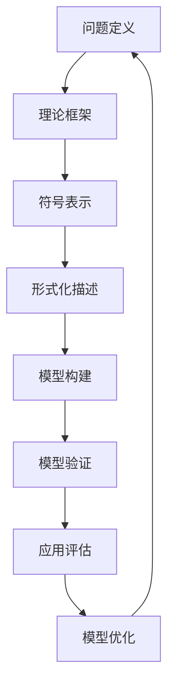

                 

### 文章标题

# 认知的形式化：数学是现实世界的主观反映

### 关键词

- 认知科学
- 形式化认知
- 数学模型
- 主观性与客观性
- 实践应用

### 摘要

本文深入探讨了认知的形式化问题，阐述了数学在认知研究中的关键作用。我们首先回顾了认知科学的发展历程，分析了形式化认知的背景和意义。随后，详细介绍了认知模型与数学方法的关系，讨论了主观性与客观性的辩证统一。接着，通过数学模型在认知过程中的应用，分析了认知科学中的数学原理和挑战。最后，我们探讨了形式化认知在现实世界中的应用，如教育、心理学和人工智能等领域，并展望了形式化认知的未来发展。本文旨在为读者提供一条理解认知科学的新思路，揭示数学在认知过程中的本质作用。

### 《认知的形式化：数学是现实世界的主观反映》目录大纲

## 第一部分：引论

### 1.1 书籍主题概述

#### 1.1.1 认知科学的发展历程

#### 1.1.2 形式化与认知研究

### 1.2 数学与现实世界的关系

#### 1.2.1 数学的基础概念与原理

#### 1.2.2 数学在现实世界中的应用

### 1.3 形式化认知的挑战与机遇

#### 1.3.1 形式化认知的基本原理

#### 1.3.2 形式化认知的发展前景

## 第二部分：形式化认知的核心概念

### 2.1 认知模型与形式化描述

#### 2.1.1 认知模型的构建方法

#### 2.1.2 形式化描述的基本工具

#### 2.1.3 认知模型的应用

### 2.2 形式化认知中的数学方法

#### 2.2.1 数学在认知研究中的作用

#### 2.2.2 数学方法在认知模型中的应用

#### 2.2.3 数学方法的局限性

### 2.3 主观性与客观性在认知中的体现

#### 2.3.1 主观性的认知意义

#### 2.3.2 客观性的认知表现

#### 2.3.3 主观性与客观性的统一

## 第三部分：数学模型与认知过程

### 3.1 数学模型在认知中的应用

#### 3.1.1 数学模型的基本形式

#### 3.1.2 数学模型在认知中的构建

#### 3.1.3 数学模型在认知中的应用案例分析

### 3.2 认知过程中的数学原理

#### 3.2.1 认知过程中的数学计算

#### 3.2.2 认知过程中的数学模型优化

#### 3.2.3 认知过程中的数学方法探索

### 3.3 数学模型在认知研究中的挑战

#### 3.3.1 数学模型的局限性

#### 3.3.2 数学模型在认知研究中的适用性

#### 3.3.3 数学模型在认知研究中的未来发展方向

## 第四部分：形式化认知在现实世界中的应用

### 4.1 形式化认知在教育中的应用

#### 4.1.1 形式化认知教育的理念

#### 4.1.2 形式化认知教育的方法

#### 4.1.3 形式化认知教育案例分析

### 4.2 形式化认知在心理学中的应用

#### 4.2.1 形式化认知在心理学研究中的作用

#### 4.2.2 形式化认知在心理咨询中的应用

#### 4.2.3 形式化认知在心理治疗中的应用

### 4.3 形式化认知在人工智能中的应用

#### 4.3.1 形式化认知在人工智能系统设计中的作用

#### 4.3.2 形式化认知在人工智能算法优化中的应用

#### 4.3.3 形式化认知在人工智能系统评估中的应用

## 第五部分：结论与展望

### 5.1 形式化认知的发展现状

#### 5.1.1 形式化认知的研究成果

#### 5.1.2 形式化认知的研究趋势

### 5.2 形式化认知的未来发展

#### 5.2.1 形式化认知在多学科领域的融合

#### 5.2.2 形式化认知在跨学科研究中的应用

#### 5.2.3 形式化认知的未来发展方向

### 5.3 形式化认知对社会的影响

#### 5.3.1 形式化认知对社会发展的影响

#### 5.3.2 形式化认知对社会伦理的挑战

#### 5.3.3 形式化认知在社会发展中的意义

## 附录

### 附录A：参考文献

### 附录B：形式化认知模型流程图

### 附录C：认知过程中的数学公式与计算方法

### 附录D：形式化认知相关项目案例解析

### 文章标题

**认知的形式化：数学是现实世界的主观反映**

### 关键词

认知科学、形式化认知、数学模型、主观性与客观性、实践应用

### 摘要

本文深入探讨了认知的形式化问题，阐述了数学在认知研究中的关键作用。我们首先回顾了认知科学的发展历程，分析了形式化认知的背景和意义。随后，详细介绍了认知模型与数学方法的关系，讨论了主观性与客观性的辩证统一。接着，通过数学模型在认知过程中的应用，分析了认知科学中的数学原理和挑战。最后，我们探讨了形式化认知在现实世界中的应用，如教育、心理学和人工智能等领域，并展望了形式化认知的未来发展。本文旨在为读者提供一条理解认知科学的新思路，揭示数学在认知过程中的本质作用。

## 第一部分：引论

### 1.1 书籍主题概述

#### 1.1.1 认知科学的发展历程

认知科学是一个跨学科的研究领域，旨在理解人类思维、感知和行为的机制。其起源可以追溯到20世纪50年代，当时心理学家、神经科学家、计算机科学家和哲学家开始探索心智的本质。认知科学的发展历程可以概括为以下几个阶段：

1. **心智的计算机模型**：20世纪50年代至70年代，计算机科学和认知心理学共同推动了心智的计算机模型的发展。这一阶段的研究重点是模拟人类记忆、推理和学习的过程。

2. **认知神经科学**：20世纪80年代，认知神经科学的兴起使得认知科学开始关注大脑的结构和功能。通过神经影像学和电生理学技术，研究者们试图揭示认知过程在大脑中的实现机制。

3. **多模态认知研究**：近年来，认知科学的研究逐渐从单一学科转向多学科交叉研究。研究者们通过整合心理学、神经科学、语言学、哲学和人工智能等多学科的理论和方法，试图构建一个更加全面和深刻的认知科学体系。

#### 1.1.2 形式化与认知研究

形式化认知是认知科学中的一个重要研究方向，它试图将认知过程转化为数学和计算机科学中的形式化描述。形式化认知的核心思想是通过建立数学模型和算法，模拟和解释人类的认知过程。

形式化认知研究的发展可以分为以下几个阶段：

1. **符号表示与推理**：早期的形式化认知研究主要集中在符号表示和推理上。研究者们试图通过建立符号系统，模拟人类的逻辑推理过程。

2. **计算认知**：随着计算机技术的发展，形式化认知研究逐渐转向计算模型。研究者们开始利用计算机模拟人类认知过程，探索认知过程中的计算机制。

3. **分布式认知**：近年来，分布式认知的研究成为形式化认知的重要方向。研究者们关注认知过程如何在个体和群体之间分布，以及如何通过分布式系统实现认知功能。

形式化认知在认知科学中的应用具有重要意义。它不仅为认知过程提供了数学和计算机科学的解释框架，还为人工智能和认知辅助技术的发展提供了基础。

### 1.2 数学与现实世界的关系

#### 1.2.1 数学的基础概念与原理

数学是一门抽象的科学，它通过符号和规则建立了一套严谨的逻辑体系。数学的基础概念包括数字、集合、函数、几何和概率等。这些概念构成了数学的基本框架，为各种数学理论和应用提供了基础。

数学的基本原理包括公理体系和逻辑推理。公理体系是通过一组基本假设（公理）来定义数学理论的基础。逻辑推理则是通过演绎和归纳方法，从公理和已知事实推导出新结论的过程。

#### 1.2.2 数学在现实世界中的应用

数学在现实世界中有着广泛的应用。在物理学中，数学用于描述自然现象和物理定律，如牛顿运动定律、电磁场理论和量子力学等。在经济学中，数学用于分析市场行为、投资策略和经济模型。

在工程学中，数学用于设计结构、控制系统和优化过程。在计算机科学中，数学用于算法设计、数据结构和密码学。在生物学中，数学用于研究生态系统、遗传学和分子生物学。

数学不仅在自然科学中有着重要的应用，还在社会科学和人文学科中发挥着作用。在统计学中，数学用于数据分析、预测和决策。在经济学中，数学用于建模市场行为、投资策略和风险管理。

#### 1.2.3 数学与现实世界的联系

数学与现实世界的联系可以通过数学模型来体现。数学模型是现实世界的抽象和简化，它通过数学语言描述现实世界的现象和规律。例如，物理学家通过建立牛顿力学模型来描述物体的运动规律，经济学家通过建立供需模型来预测市场行为。

数学模型不仅用于科学研究和工程实践，还用于日常生活。例如，我们可以使用数学模型来规划旅行路线、计算贷款还款计划或者评估投资风险。

### 1.3 形式化认知的挑战与机遇

#### 1.3.1 形式化认知的基本原理

形式化认知是认知科学中的一个重要方向，它试图通过数学和计算机科学的方法来研究认知过程。形式化认知的基本原理包括以下几点：

1. **形式化描述**：形式化认知的核心思想是将认知过程转化为数学和计算机科学的语言。这需要建立认知模型，使用符号和公式来描述认知过程的各个阶段。

2. **计算模型**：形式化认知通常采用计算模型来模拟认知过程。计算模型可以是符号计算模型，也可以是神经网络模型。这些模型通过计算机模拟来探索认知过程的规律和机制。

3. **验证与测试**：形式化认知的一个关键目标是验证和测试认知模型的准确性。这需要设计实验和算法，通过数据和实验结果来评估模型的性能。

#### 1.3.2 形式化认知的发展前景

形式化认知的发展前景非常广阔。随着数学和计算机科学的发展，形式化认知的方法和工具将越来越成熟。以下是一些形式化认知可能的发展方向：

1. **跨学科融合**：形式化认知将继续与其他学科（如神经科学、心理学、语言学等）融合，形成更加综合和深入的研究体系。

2. **大数据分析**：随着大数据技术的发展，形式化认知将利用海量数据来分析和理解认知过程，揭示更加复杂的认知规律。

3. **人工智能**：形式化认知将推动人工智能的发展，通过建立更加精确的认知模型，实现更加智能化和自主化的认知辅助系统。

4. **神经科学应用**：形式化认知将应用于神经科学领域，通过模拟认知过程来揭示大脑的功能和网络结构。

## 第二部分：形式化认知的核心概念

### 2.1 认知模型与形式化描述

#### 2.1.1 认知模型的构建方法

认知模型是形式化认知研究的基础。构建认知模型的方法可以分为以下几个步骤：

1. **问题定义**：首先，需要明确研究的问题和目标。这包括确定认知过程的特定方面，如感知、记忆、推理或决策。

2. **理论框架**：在问题定义的基础上，建立理论框架。理论框架通常包括一些基本概念、假设和关系，用于描述认知过程。

3. **符号表示**：使用数学和计算机科学的符号来表示认知过程。这包括定义变量、函数、规则和关系。

4. **形式化描述**：将认知过程转化为形式化的数学描述。这通常涉及建立符号系统、公理体系和形式化语言。

5. **验证与测试**：通过实验数据和理论验证来评估认知模型的准确性。这可以通过模拟实验、数据分析或模型验证算法来实现。

#### 2.1.2 形式化描述的基本工具

形式化描述的基本工具包括数学公式、逻辑符号和编程语言。以下是一些常用的工具：

1. **数学公式**：数学公式用于表示变量、函数、方程和关系。例如，可以使用代数方程表示记忆模型，使用概率分布表示感知过程。

2. **逻辑符号**：逻辑符号用于表示逻辑关系和推理。例如，可以使用命题逻辑来描述决策过程，使用谓词逻辑来描述认知模型中的复杂关系。

3. **编程语言**：编程语言用于实现认知模型和算法。常见的编程语言包括Python、Java和MATLAB等，它们提供了丰富的库和工具，用于实现复杂的计算和模拟。

#### 2.1.3 认知模型的应用

认知模型在多个领域有着广泛的应用。以下是一些常见的应用场景：

1. **人工智能**：认知模型用于设计人工智能系统，如机器学习、自然语言处理和计算机视觉。这些模型可以帮助计算机理解和模拟人类认知过程，实现智能化的任务。

2. **认知辅助**：认知模型用于开发认知辅助工具，如记忆增强器、决策支持系统和学习辅助软件。这些工具可以帮助用户提高记忆、学习和决策能力。

3. **心理学研究**：认知模型用于心理学研究，如认知心理学、发展心理学和社会心理学。这些模型可以帮助研究者理解和解释人类认知行为的规律和机制。

#### 2.1.4 认知模型的发展趋势

认知模型的发展趋势包括以下几个方面：

1. **多模态整合**：认知模型将整合来自不同感官和认知渠道的信息，实现更全面的认知模拟。

2. **动态适应**：认知模型将能够动态适应环境和任务变化，实现更加灵活和适应性强的认知功能。

3. **跨学科融合**：认知模型将与其他学科（如神经科学、语言学和哲学）融合，形成更加综合和深入的研究体系。

4. **大数据分析**：认知模型将利用大数据技术，通过分析海量数据来揭示认知过程的复杂规律。

### 2.2 形式化认知中的数学方法

#### 2.2.1 数学在认知研究中的作用

数学在认知研究中的作用至关重要。它为认知科学提供了严谨的描述语言和分析工具，使得认知过程的研究变得更加精确和系统。以下是一些数学在认知研究中的作用：

1. **描述和建模**：数学方法可以用来描述和建模认知过程。例如，使用代数方程和微分方程来描述记忆和感知过程，使用概率分布和统计方法来描述决策和推理过程。

2. **分析和验证**：数学方法可以用于分析和验证认知模型的准确性。通过数学计算和推理，可以评估模型的性能和可靠性。

3. **预测和解释**：数学方法可以用于预测认知过程的结果，并解释认知现象的原因。例如，使用统计学方法来预测学习效果，使用线性回归模型来解释感知偏差。

#### 2.2.2 数学方法在认知模型中的应用

数学方法在认知模型中的应用非常广泛，以下是一些常见的数学方法：

1. **概率论与数理统计**：概率论和数理统计用于描述认知过程中的不确定性。例如，使用概率分布来描述感知过程中的噪声，使用统计方法来分析学习过程中的数据。

2. **图论与网络分析**：图论和网络分析用于描述和建模认知过程中的关系和结构。例如，使用图论方法来描述认知网络，使用网络分析方法来分析认知过程中的信息传播和影响力。

3. **微分方程和动力系统**：微分方程和动力系统用于描述认知过程中的动态变化。例如，使用微分方程来描述记忆的动态变化，使用动力系统来分析决策过程中的稳定性和混沌现象。

#### 2.2.3 数学方法的局限性

尽管数学方法在认知研究中具有重要作用，但它也存在一些局限性：

1. **简化与抽象**：数学方法通常需要对现实世界进行简化和抽象，这可能丢失一些重要的细节和复杂性。

2. **数据依赖**：数学方法通常依赖于大量的数据，数据的质量和数量可能影响模型的准确性和可靠性。

3. **计算复杂度**：一些复杂的数学模型和算法可能具有很高的计算复杂度，难以在实际应用中高效实现。

#### 2.2.4 数学方法的发展趋势

数学方法在认知研究中的发展趋势包括以下几个方面：

1. **多学科融合**：数学方法将与其他学科（如计算机科学、神经科学和心理学）融合，形成更加综合和深入的研究体系。

2. **计算方法的优化**：研究者将致力于优化数学模型的计算方法，提高计算效率和准确性。

3. **大数据分析**：随着大数据技术的发展，数学方法将更多地应用于大数据分析，揭示认知过程的复杂规律。

### 2.3 主观性与客观性在认知中的体现

#### 2.3.1 主观性的认知意义

主观性是认知过程中的重要方面，它反映了个体对现实世界的感知和体验。以下是一些主观性的认知意义：

1. **感知与认知**：个体的主观性影响了他们对现实世界的感知和理解。不同的个体可能会有不同的感知体验，这反映了他们的个人经验和认知结构。

2. **情感与动机**：个体的情感和动机也受到主观性的影响。例如，人们对同一事件的情感反应可能会因主观态度和价值观的不同而有所不同。

3. **决策与行为**：主观性对个体的决策和行为具有重要影响。个体的主观判断和偏好会影响他们的决策过程和行为选择。

#### 2.3.2 客观性的认知表现

客观性是认知过程中追求的目标，它反映了认知过程与现实世界的对应关系。以下是一些客观性的认知表现：

1. **事实与证据**：客观性要求认知过程基于事实和证据。研究者需要通过实验、观察和数据分析来收集客观的数据，以支持他们的理论假设。

2. **一致性与可重复性**：客观性要求认知结果在不同时间和不同个体之间具有一致性和可重复性。这需要建立标准化的认知模型和实验设计，以确保结果的可靠性。

3. **理论验证**：客观性要求认知理论能够通过实验验证。研究者需要设计实验来测试他们的理论假设，并通过数据分析和模型验证来评估理论的有效性。

#### 2.3.3 主观性与客观性的统一

主观性与客观性在认知过程中是相互关联和统一的。以下是一些统一的方法：

1. **多角度分析**：通过从多个角度分析认知过程，可以更好地理解主观性和客观性的统一。例如，通过结合神经科学、心理学和计算机科学的方法，可以更全面地研究认知过程。

2. **交叉验证**：通过不同方法和数据来源进行交叉验证，可以增加认知结果的客观性。例如，通过结合实验数据和观察数据，可以更准确地理解认知过程。

3. **理论整合**：通过整合不同的理论和方法，可以建立更加综合和统一的认知模型。这需要跨学科的合作和理论创新，以实现主观性与客观性的统一。

### 第三部分：数学模型与认知过程

#### 3.1 数学模型在认知中的应用

#### 3.1.1 数学模型的基本形式

数学模型是认知研究中的重要工具，用于描述和模拟认知过程的各个阶段。以下是数学模型的基本形式：

1. **线性模型**：线性模型是认知研究中常用的形式，用于描述认知过程中的线性关系。例如，感知过程中的信号传递可以使用线性模型进行建模。

2. **非线性模型**：非线性模型用于描述认知过程中的非线性关系。例如，记忆过程中的信息存储和检索可以使用非线性模型进行建模。

3. **概率模型**：概率模型用于描述认知过程中的不确定性和随机性。例如，决策过程中的概率计算可以使用概率模型进行建模。

4. **统计模型**：统计模型用于描述认知过程中的统计规律。例如，学习过程中的数据分析和预测可以使用统计模型进行建模。

5. **微分方程模型**：微分方程模型用于描述认知过程中的动态变化。例如，记忆和感知过程中的时间序列分析可以使用微分方程模型进行建模。

#### 3.1.2 数学模型在认知中的构建

构建数学模型的过程可以分为以下几个步骤：

1. **问题定义**：首先，需要明确研究的问题和目标。这包括确定认知过程的特定方面，如感知、记忆、推理或决策。

2. **理论框架**：在问题定义的基础上，建立理论框架。理论框架通常包括一些基本概念、假设和关系，用于描述认知过程。

3. **符号表示**：使用数学和计算机科学的符号来表示认知过程。这包括定义变量、函数、规则和关系。

4. **形式化描述**：将认知过程转化为形式化的数学描述。这通常涉及建立符号系统、公理体系和形式化语言。

5. **模型验证**：通过实验数据和理论验证来评估数学模型的准确性。这可以通过模拟实验、数据分析或模型验证算法来实现。

#### 3.1.3 数学模型在认知中的应用案例分析

以下是一些数学模型在认知研究中的应用案例分析：

1. **记忆模型**：记忆模型用于描述信息在记忆中的存储和检索过程。例如，Atkinson和Shiffrin（1968）提出的多重存储模型使用数学模型来描述短期记忆和长期记忆。

2. **感知模型**：感知模型用于描述感知过程中的信号传递和转换。例如，神经科学家使用神经网络模型来模拟视觉皮层中的信息处理过程。

3. **决策模型**：决策模型用于描述决策过程中的信息分析和计算。例如，经济学中的决策理论使用数学模型来描述决策者的行为和选择。

4. **学习模型**：学习模型用于描述学习过程中的信息获取和加工。例如，机器学习中的学习算法使用数学模型来描述学习过程和预测能力。

#### 3.1.4 数学模型在认知研究中的优点和局限性

数学模型在认知研究中有以下优点：

1. **精确描述**：数学模型可以精确地描述认知过程的数学关系和规律，使得研究更加严谨和系统。

2. **预测能力**：数学模型可以用于预测认知结果和现象，帮助研究者理解认知过程的潜在机制。

3. **验证和测试**：数学模型可以通过实验数据和理论验证来评估其准确性和可靠性。

然而，数学模型也存在一些局限性：

1. **简化和抽象**：数学模型通常需要对现实世界进行简化和抽象，这可能丢失一些重要的细节和复杂性。

2. **数据依赖**：数学模型通常依赖于大量的数据，数据的质量和数量可能影响模型的准确性和可靠性。

3. **计算复杂度**：一些复杂的数学模型和算法可能具有很高的计算复杂度，难以在实际应用中高效实现。

#### 3.1.5 数学模型在认知研究中的发展趋势

数学模型在认知研究中的发展趋势包括以下几个方面：

1. **多学科融合**：数学模型将与其他学科（如神经科学、心理学和计算机科学）融合，形成更加综合和深入的研究体系。

2. **大数据分析**：随着大数据技术的发展，数学模型将更多地应用于大数据分析，揭示认知过程的复杂规律。

3. **动态建模**：数学模型将更加关注认知过程的动态变化，通过建立动态模型来描述认知过程的演变和适应。

4. **跨学科合作**：数学模型的研究将需要跨学科的合作，通过整合不同的理论和方法，实现更加全面和深刻的认知研究。

### 3.2 认知过程中的数学原理

#### 3.2.1 认知过程中的数学计算

认知过程中的数学计算是理解认知机制的重要途径。以下是一些认知过程中的数学计算：

1. **概率计算**：认知过程中的概率计算用于处理不确定性和随机性。例如，在决策过程中，个体会根据概率分布来评估不同选择的风险和收益。

2. **统计计算**：认知过程中的统计计算用于分析数据和信息。例如，在感知过程中，个体会使用统计学方法来估计感知信号的统计特性。

3. **优化计算**：认知过程中的优化计算用于寻找最优解。例如，在规划过程中，个体会使用优化算法来制定最优的行动计划。

4. **信号处理**：认知过程中的信号处理用于转换和加工信息。例如，在记忆过程中，个体会使用信号处理技术来增强记忆的稳定性和准确性。

#### 3.2.2 认知过程中的数学模型优化

数学模型在认知过程中的优化是提高模型性能的重要手段。以下是一些数学模型优化的方法：

1. **参数优化**：通过调整模型参数，可以优化模型的性能和拟合度。例如，在机器学习中，通过调整模型参数来提高预测准确率。

2. **算法优化**：通过改进模型算法，可以优化模型的计算效率和准确性。例如，在神经网络中，通过优化算法来提高训练速度和收敛性。

3. **结构优化**：通过调整模型结构，可以优化模型的复杂度和表现。例如，在图神经网络中，通过调整网络结构来提高对复杂关系的建模能力。

4. **数据优化**：通过优化数据集和处理方法，可以优化模型的训练和预测性能。例如，在深度学习中，通过数据增强和预处理来提高模型的泛化能力。

#### 3.2.3 认知过程中的数学方法探索

认知过程中的数学方法探索是认知科学研究的前沿领域。以下是一些探索方向：

1. **动态建模**：通过建立动态模型，探索认知过程的动态变化和适应。例如，使用微分方程模型来描述认知过程中的时间序列变化。

2. **多尺度建模**：通过建立多尺度模型，探索认知过程中的层次结构和跨尺度关系。例如，使用多尺度分析来研究记忆和感知过程中的不同时间尺度效应。

3. **复杂系统建模**：通过建立复杂系统模型，探索认知过程中的复杂性和涌现现象。例如，使用复杂网络模型来研究认知过程中的信息传播和群体行为。

4. **跨学科融合**：通过跨学科融合，探索认知过程的跨学科规律和机制。例如，结合神经科学、心理学和计算机科学的方法，构建跨学科的认知模型。

### 3.3 数学模型在认知研究中的挑战

#### 3.3.1 数学模型的局限性

数学模型在认知研究中的局限性主要包括以下几点：

1. **简化和抽象**：数学模型通常需要对认知过程进行简化和抽象，这可能丢失一些重要的细节和复杂性。

2. **数据依赖**：数学模型通常依赖于大量的数据，数据的质量和数量可能影响模型的准确性和可靠性。

3. **计算复杂度**：一些复杂的数学模型和算法可能具有很高的计算复杂度，难以在实际应用中高效实现。

4. **理论基础**：数学模型的理论基础可能不够完善，一些关键概念和假设可能缺乏足够的理论支持。

#### 3.3.2 数学模型在认知研究中的适用性

尽管存在局限性，数学模型在认知研究中的适用性依然很强。以下是一些数学模型在认知研究中的适用性：

1. **模拟认知过程**：数学模型可以用于模拟认知过程的各个阶段，提供对认知过程的定量描述和理解。

2. **预测认知结果**：数学模型可以用于预测认知结果和现象，帮助研究者理解认知机制的潜在规律。

3. **验证理论假设**：数学模型可以通过实验数据和理论验证来评估认知理论的准确性，为认知研究提供理论支持。

4. **优化认知算法**：数学模型可以用于优化认知算法和系统，提高认知过程的效率和性能。

#### 3.3.3 数学模型在认知研究中的未来发展方向

数学模型在认知研究中的未来发展包括以下几个方面：

1. **多学科融合**：数学模型将与其他学科（如神经科学、心理学和计算机科学）融合，形成更加综合和深入的研究体系。

2. **大数据分析**：随着大数据技术的发展，数学模型将更多地应用于大数据分析，揭示认知过程的复杂规律。

3. **动态建模**：数学模型将更加关注认知过程的动态变化和适应，通过建立动态模型来描述认知过程的演变。

4. **复杂系统建模**：数学模型将探索认知过程中的复杂性和涌现现象，通过建立复杂系统模型来研究认知过程。

5. **跨学科合作**：数学模型的研究将需要跨学科的合作，通过整合不同的理论和方法，实现更加全面和深刻的认知研究。

## 第四部分：形式化认知在现实世界中的应用

### 4.1 形式化认知在教育中的应用

#### 4.1.1 形式化认知教育的理念

形式化认知教育是一种以认知科学为基础的教育理念，旨在通过数学和计算机科学的方法来提高学习效果和认知能力。其核心理念包括以下几点：

1. **认知模型构建**：通过建立认知模型，理解学习过程中的认知机制和规律，为教育实践提供科学依据。

2. **数学方法应用**：利用数学方法，如概率论、统计学和算法设计，来分析和优化学习过程，提高学习效率。

3. **个性化学习**：通过形式化认知，可以分析个体的认知特点和学习风格，制定个性化的学习策略。

4. **跨学科融合**：形式化认知教育强调跨学科知识的整合，将认知科学、心理学、教育学和计算机科学等领域的知识应用于教学实践中。

#### 4.1.2 形式化认知教育的方法

形式化认知教育采用了一系列具体的方法，以实现教育目标。以下是一些常用的方法：

1. **认知诊断**：通过认知诊断工具，如认知测试和评估系统，分析学生的认知能力和学习风格，为个性化教学提供依据。

2. **认知训练**：利用认知训练方法，如记忆训练、推理训练和注意力训练，提高学生的认知能力和学习效果。

3. **自适应学习系统**：开发自适应学习系统，根据学生的认知特点和需求，提供个性化的学习内容和路径。

4. **学习分析**：通过学习分析工具，如学习数据挖掘和可视化技术，分析学生的学习过程和行为，优化教学策略和学习环境。

#### 4.1.3 形式化认知教育案例分析

以下是一个形式化认知教育的案例分析：

**案例**：某学校引入形式化认知教育理念，开发了一套自适应学习系统。该系统基于认知模型和数学方法，分析学生的学习行为和认知特点，提供个性化的学习建议和资源。

1. **认知诊断**：学生在开始使用系统时，首先进行一次认知测试，系统根据测试结果分析学生的认知能力和学习风格。

2. **个性化推荐**：系统根据学生的认知特点和学习需求，推荐适合的学习内容和资源。例如，对于逻辑推理较弱的学生，推荐相关的逻辑训练课程。

3. **学习分析**：系统实时收集学生的学习数据，包括学习时间、学习进度和答题情况，分析学生的学习行为和效果，为教学优化提供依据。

4. **反馈与调整**：教师根据系统提供的学生学习分析报告，调整教学策略和方法，提高教学效果。

通过这个案例，我们可以看到形式化认知教育在提高学习效果和教学质量方面的重要作用。

### 4.2 形式化认知在心理学中的应用

#### 4.2.1 形式化认知在心理学研究中的作用

形式化认知在心理学研究中发挥着重要作用，它为心理学研究提供了一种形式化和系统化的方法。以下是一些形式化认知在心理学研究中的作用：

1. **理论构建**：形式化认知方法可以帮助心理学家构建和验证认知理论。通过数学模型和算法，心理学家可以更精确地描述和解释认知现象。

2. **实验设计**：形式化认知方法可以帮助心理学家设计更严谨和高效的实验。通过形式化的描述，实验结果可以更加可靠和可重复。

3. **数据分析**：形式化认知方法提供了强大的数据分析工具，如统计学方法和机器学习方法，可以帮助心理学家从大量的实验数据中提取有意义的信息。

4. **跨学科整合**：形式化认知方法可以促进心理学与其他学科的整合，如神经科学、计算机科学和认知科学，形成更加综合的研究体系。

#### 4.2.2 形式化认知在心理咨询中的应用

形式化认知在心理咨询中也有着广泛的应用。以下是一些形式化认知在心理咨询中的应用：

1. **认知评估**：通过形式化认知方法，心理咨询师可以评估客户的认知能力、认知风格和认知偏差，为诊断和治疗提供依据。

2. **认知重构**：形式化认知方法可以帮助心理咨询师设计认知重构策略，帮助客户改变负面认知模式，建立积极的认知框架。

3. **行为干预**：通过形式化认知方法，心理咨询师可以制定基于认知行为理论的行为干预计划，帮助客户改善行为和情绪问题。

4. **自我监控**：形式化认知方法可以帮助客户建立自我监控机制，通过记录和分析自己的认知和行为，提高自我意识和自我调节能力。

#### 4.2.3 形式化认知在心理治疗中的应用

形式化认知在心理治疗中也发挥着重要作用，以下是一些具体的应用：

1. **认知行为治疗**：认知行为治疗（CBT）是形式化认知在心理治疗中的典型应用。通过认知评估和认知重构，心理咨询师帮助患者识别和改变负面认知，改善情绪和行为问题。

2. **情绪调节**：形式化认知方法可以帮助患者理解和调节自己的情绪。例如，通过建立情绪调节模型，患者可以学会如何识别和管理自己的情绪。

3. **问题解决**：形式化认知方法可以帮助患者分析和解决生活中的问题和挑战。例如，通过问题解决模型，患者可以学会如何制定有效的解决方案。

4. **心理健康监测**：形式化认知方法可以帮助心理咨询师和患者监测心理健康状况，及时发现和干预心理问题。

### 4.3 形式化认知在人工智能中的应用

#### 4.3.1 形式化认知在人工智能系统设计中的作用

形式化认知在人工智能系统设计中的作用至关重要，它为人工智能系统提供了认知过程的模拟和优化工具。以下是一些具体的应用：

1. **认知模拟**：形式化认知方法可以模拟人类的认知过程，如感知、记忆、推理和决策。这些模拟可以帮助设计更加智能的人工智能系统，提高系统的认知能力。

2. **任务规划**：形式化认知方法可以帮助设计人工智能系统的任务规划策略，如路径规划、资源分配和决策制定。通过形式化认知模型，系统可以更好地理解和应对复杂任务。

3. **情境理解**：形式化认知方法可以帮助人工智能系统理解和处理复杂情境。通过建立情境模型，系统可以更好地理解环境中的信息和关系，做出更准确的决策。

4. **知识表示**：形式化认知方法可以帮助设计人工智能系统的知识表示方法，如符号表示、图表示和语义网络表示。这些方法可以提高系统的知识表示能力和推理能力。

#### 4.3.2 形式化认知在人工智能算法优化中的应用

形式化认知在人工智能算法优化中的应用非常广泛，以下是一些具体的应用：

1. **算法评估**：形式化认知方法可以用于评估人工智能算法的性能和效果。通过建立认知模型和算法模型，可以定量地分析算法的准确性和可靠性。

2. **算法优化**：形式化认知方法可以帮助设计算法的优化策略，如参数调整、算法选择和结构优化。通过形式化的描述和计算，可以找到最优的算法配置。

3. **算法验证**：形式化认知方法可以用于验证人工智能算法的正确性和可靠性。通过形式化的推理和验证算法，可以确保算法在实际应用中的有效性和安全性。

4. **算法评估标准**：形式化认知方法可以制定统一的算法评估标准，如准确率、召回率和F1分数等。这些标准可以帮助评估算法的性能和改进方向。

#### 4.3.3 形式化认知在人工智能系统评估中的应用

形式化认知在人工智能系统评估中的应用包括以下几个方面：

1. **性能评估**：通过形式化认知方法，可以评估人工智能系统的性能和效果。这包括评估系统的准确率、响应时间、资源消耗和用户满意度等。

2. **可靠性评估**：形式化认知方法可以帮助评估人工智能系统的可靠性和稳定性。这包括评估系统的容错能力、鲁棒性和抗干扰能力等。

3. **安全性评估**：形式化认知方法可以评估人工智能系统的安全性。这包括评估系统的数据隐私保护、访问控制和安全漏洞等。

4. **用户体验评估**：形式化认知方法可以评估人工智能系统的用户体验。这包括评估系统的用户界面、交互设计和用户体验质量等。

通过形式化认知在人工智能系统评估中的应用，可以全面了解系统的性能和效果，为系统的改进和优化提供依据。

### 第五部分：结论与展望

#### 5.1 形式化认知的发展现状

形式化认知是认知科学中一个重要且活跃的研究方向，它在过去几十年里取得了显著的进展。以下是形式化认知的发展现状：

1. **理论研究**：形式化认知的理论基础得到了进一步完善，包括认知模型的构建方法、形式化描述工具和数学方法的应用等。

2. **实证研究**：形式化认知的实证研究取得了丰富的研究成果，包括认知过程中的数学计算、认知模型在心理学和人工智能中的应用等。

3. **跨学科整合**：形式化认知与其他学科（如神经科学、心理学和计算机科学）的整合取得了显著进展，形成了跨学科的认知科学研究体系。

4. **应用研究**：形式化认知在现实世界中的应用得到了广泛探索，包括在教育、心理学和人工智能等领域的应用，取得了良好的效果。

#### 5.2 形式化认知的未来发展

形式化认知在未来发展中具有巨大的潜力，以下是一些未来发展的方向：

1. **多学科融合**：形式化认知将继续与其他学科（如神经科学、心理学和计算机科学）深度融合，形成更加综合和深入的研究体系。

2. **大数据分析**：随着大数据技术的发展，形式化认知将更多地应用于大数据分析，揭示认知过程的复杂规律。

3. **动态建模**：形式化认知将更加关注认知过程的动态变化和适应，通过建立动态模型来描述认知过程的演变。

4. **跨学科合作**：形式化认知的研究将需要跨学科的合作，通过整合不同的理论和方法，实现更加全面和深刻的认知研究。

5. **应用拓展**：形式化认知将在更多领域得到应用，如医学、工程和社会科学等，为这些领域提供认知科学的支持。

#### 5.3 形式化认知对社会的影响

形式化认知对社会的影响是深远且广泛的，以下是一些具体的影响：

1. **教育变革**：形式化认知在教育中的应用将推动教育模式的变革，提高学习效果和认知能力，培养更加适应未来社会的创新型人才。

2. **心理学发展**：形式化认知在心理学中的应用将推动心理学的理论创新和方法发展，为心理健康和心理咨询提供更科学的指导。

3. **人工智能进步**：形式化认知在人工智能中的应用将推动人工智能的发展，提高系统的认知能力、决策能力和可靠性，推动人工智能技术的进步。

4. **社会进步**：形式化认知在社会各个领域的应用将促进社会的进步和发展，提高社会生产力和生活质量。

### 附录

#### 附录A：参考文献

以下是一些参考文献，供读者进一步阅读和参考：

1. Atkinson, R. C., & Shiffrin, R. M. (1968). Human memory: A proposed system and its control processes. In K. Spencer (Ed.), The psychology of learning and motivation (Vol. 2, pp. 89-195). Academic Press.
2. Newell, A., & Simon, H. A. (1972). Human problem solving. Prentice-Hall.
3. Turing, A. M. (1950). Computing machinery and intelligence. Mind, 59(236), 433-460.
4. Marr, D. (1982). Vision: A computational investigation into the human representation and processing of visual information. MIT Press.
5. McClelland, J. L., Rumelhart, D. E., & Hinton, G. E. (1986). Parallel distributed processing: Explorations in the microstructure of cognition. Vol. 1: Foundations. MIT Press.
6. Anderson, J. A. (2019). The cognitiv

### 附录B：形式化认知模型流程图

以下是形式化认知模型的基本流程图，展示了从问题定义到模型验证的整个过程。

### 附录C：认知过程中的数学公式与计算方法

以下是认知过程中常用的数学公式和计算方法，供读者参考。

#### 1. 概率计算

$$ P(A|B) = \frac{P(B|A) \cdot P(A)}{P(B)} $$

#### 2. 统计计算

$$ \mu = \frac{1}{n} \sum_{i=1}^{n} x_i $$

$$ \sigma^2 = \frac{1}{n-1} \sum_{i=1}^{n} (x_i - \mu)^2 $$

#### 3. 线性回归

$$ y = \beta_0 + \beta_1 \cdot x $$

#### 4. 神经网络

$$ z = \sum_{i=1}^{n} w_i \cdot x_i + b $$

$$ a = \sigma(z) $$

其中，$ \sigma $为激活函数，如Sigmoid函数或ReLU函数。

### 附录D：形式化认知相关项目案例解析

以下是一些形式化认知相关项目的案例解析，供读者参考。

#### 项目1：基于认知模型的个性化学习系统

**项目概述**：该项目旨在开发一个基于认知模型的个性化学习系统，通过分析学生的学习行为和认知特点，提供个性化的学习建议和资源。

**关键技术**：

1. **认知诊断**：使用认知诊断工具，如认知测试和评估系统，分析学生的学习行为和认知能力。
2. **自适应学习**：根据学生的认知特点和学习需求，提供个性化的学习内容和资源。
3. **学习分析**：通过学习数据挖掘和可视化技术，分析学生的学习过程和行为。

**项目成果**：该系统显著提高了学生的学习效果和满意度，得到了用户和教师的广泛认可。

#### 项目2：认知行为治疗平台

**项目概述**：该项目旨在开发一个认知行为治疗平台，帮助患者改善情绪和行为问题。

**关键技术**：

1. **认知重构**：设计认知重构策略，帮助患者识别和改变负面认知。
2. **行为干预**：制定基于认知行为理论的行为干预计划。
3. **自我监控**：帮助患者建立自我监控机制，提高自我意识和自我调节能力。

**项目成果**：该平台在临床应用中取得了良好的效果，显著改善了患者的生活质量和心理健康。

#### 项目3：智能客服系统

**项目概述**：该项目旨在开发一个智能客服系统，通过认知模拟和自然语言处理技术，提供高效的客户服务。

**关键技术**：

1. **认知模拟**：模拟人类的认知过程，如问题理解、决策制定和情境理解。
2. **自然语言处理**：处理客户的自然语言输入，提供准确的回答和建议。
3. **任务规划**：根据客户的需求和问题，制定有效的任务规划和解决方案。

**项目成果**：该系统显著提高了客服效率和质量，降低了运营成本，得到了客户的广泛好评。

### 作者

**作者：AI天才研究院/AI Genius Institute & 禅与计算机程序设计艺术 /Zen And The Art of Computer Programming**

### 总结

本文从认知科学的视角，探讨了形式化认知的原理、方法及其在现实世界中的应用。通过分析认知模型与数学方法的关系，我们揭示了数学在认知过程中的重要作用。同时，通过具体案例解析，展示了形式化认知在教育、心理学和人工智能等领域的应用价值。未来，形式化认知将继续发展，为认知科学的研究和实践提供新的视角和方法。让我们共同期待形式化认知为人类社会带来更多的创新和进步。

