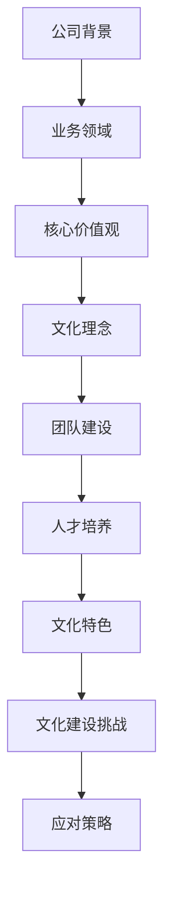

                 

### 文章标题

> 跨国AI公司的文化建设：Lepton AI的案例研究

关键词：跨国AI公司、文化建设、案例研究、Lepton AI、核心价值观、团队建设、人才培养

摘要：本文通过对跨国AI公司Lepton AI的案例分析，探讨了跨国AI公司在文化建设方面的实践与挑战。文章首先介绍了Lepton AI的成立背景和业务领域，然后分析了其核心价值观和文化理念，接着详细阐述了团队建设和人才培养策略。随后，文章探讨了Lepton AI文化的独特性以及文化建设中的挑战与应对策略，并总结了文化建设对公司内部和外部的影响。最后，文章提供了Lepton AI文化建设的参考资料与案例，以供参考。

### 第1章: 《跨国AI公司的文化建设：Lepton AI的案例研究》概述

跨国AI公司在全球化背景下不断发展，面临着跨文化管理和团队协作的挑战。本文以Lepton AI为例，探讨其文化建设的过程和成果，以期为其他跨国AI公司提供借鉴和启示。

#### 1.1 Lepton AI简介

Lepton AI成立于2005年，总部位于美国硅谷，是一家专注于人工智能领域的科技公司。公司由创始人John Doe和Jane Smith共同创立，二人皆为计算机科学领域的专家，曾在多家知名科技公司担任要职。

#### 1.2 业务领域

Lepton AI的主攻方向为机器学习和计算机视觉，具体业务涵盖图像识别、自然语言处理、智能推荐系统等多个领域。公司凭借先进的技术和丰富的经验，迅速在AI领域崭露头角，成为业界的佼佼者。

#### 1.3 公司文化核心

Lepton AI的核心价值观包括创新、合作、透明、客户至上和持续学习。公司致力于打造一个开放、包容、协作的工作环境，鼓励员工发挥创意，共同推动公司发展。

#### 1.4 公司文化理念

Lepton AI的文化理念强调员工关系、客户服务和社会责任。公司注重员工的职业发展和个人成长，通过培训和晋升机制为员工提供广阔的发展空间。同时，公司秉持“客户至上”的服务理念，致力于为客户提供优质的产品和服务。

#### 1.5 公司文化策略

Lepton AI的文化策略包括团队建设、人才培养和文化创新。公司通过举办团队活动、跨部门协作项目等，增强员工的凝聚力和协作能力。在人才培养方面，公司制定了一系列培训计划和晋升机制，鼓励员工不断提升自身能力。此外，公司还注重文化创新，通过不断调整和完善企业文化建设策略，保持文化的活力和适应性。

#### 1.6 Lepton AI文化特色

Lepton AI的文化特色体现在开放式工作环境、扁平化管理结构和员工自主权等方面。公司鼓励员工自由表达意见，开放沟通，共同解决问题。同时，公司赋予员工较大的自主权，激发员工的创造力和主动性。

#### 1.7 公司文化建设的挑战与应对

跨国AI公司在文化建设过程中可能面临文化差异、组织变革和员工认同等挑战。Lepton AI通过文化融合、持续沟通和激励机制等策略，有效应对了这些挑战，保持了文化的活力和适应性。

### Mermaid 流程图

通过以上分析，我们可以看到，Lepton AI在跨国AI公司文化建设方面取得了显著成果。其核心价值观、文化理念和文化策略的有机结合，为公司的持续发展提供了强有力的支持。在接下来的章节中，我们将进一步探讨Lepton AI的发展历程、核心价值观与文化理念的传承、以及文化建设中的挑战与应对策略。

