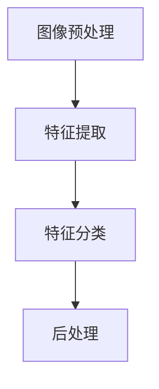
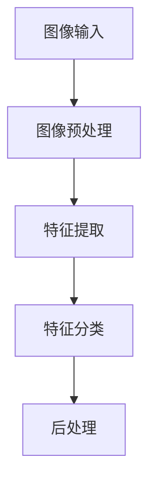
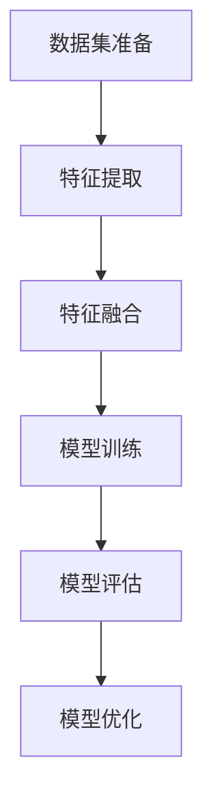

                 

### 《软件 2.0 的应用领域：图像识别、语音识别》

> **关键词：软件 2.0、图像识别、语音识别、AI 大模型、深度学习、应用实践**

> **摘要：本文旨在探讨软件 2.0 时代下的图像识别和语音识别技术，从基本概念、算法原理、应用场景到实际项目实践，全面解析这两大领域的核心技术及其在软件 2.0 时代的应用。**

---

### 目录

1. **第一部分：软件 2.0 与 AI 大模型基础**
   1.1. **软件 2.0 与 AI 大模型概述**
   1.2. **图像识别与语音识别的概述**
   1.3. **图像识别与语音识别的架构与原理**
   1.4. **图像识别与语音识别的应用场景**

2. **第二部分：图像识别技术详解**
   2.1. **图像识别技术基础**
   2.2. **图像识别项目实战**

3. **第三部分：语音识别技术详解**
   3.1. **语音识别技术基础**
   3.2. **语音识别项目实战**

4. **第四部分：图像识别与语音识别的融合**
   4.1. **图像识别与语音识别融合技术**
   4.2. **图像识别与语音识别融合项目实战**

5. **第五部分：软件 2.0 的应用实践**
   5.1. **软件 2.0 在图像识别中的应用实践**
   5.2. **软件 2.0 在语音识别中的应用实践**
   5.3. **软件 2.0 在图像识别与语音识别融合中的应用实践**

6. **附录**

---

### 引言

随着人工智能技术的飞速发展，软件行业正迎来一场前所未有的变革。传统的软件 1.0 时代，软件主要是基于规则和指令进行操作，而软件 2.0 时代则是以数据驱动，通过机器学习、深度学习等技术实现智能化操作。本文将聚焦于软件 2.0 的两个重要应用领域——图像识别和语音识别，探讨其核心原理、应用场景以及实际项目实践。

图像识别和语音识别作为人工智能的核心技术，已经在诸多领域得到广泛应用。例如，在安防领域，图像识别技术可以实现对监控视频的实时分析，识别出异常行为；在智能助手领域，语音识别技术可以实现对用户语音指令的准确识别和响应。随着软件 2.0 时代的到来，这两大技术将进一步融合，带来更加智能、高效的应用体验。

本文将首先介绍软件 2.0 与 AI 大模型的基础知识，然后分别深入探讨图像识别和语音识别的技术原理、应用场景以及项目实战，最后分析图像识别与语音识别的融合技术及其在软件 2.0 时代的应用实践。希望通过本文的阅读，读者能够对软件 2.0 时代的图像识别和语音识别技术有更加深入的了解。

### 第一部分：软件 2.0 与 AI 大模型基础

#### 1.1 软件 2.0 与 AI 大模型概述

软件 2.0 是相对于软件 1.0 的一种新的软件模式，它基于云计算、大数据和人工智能等技术，实现了软件的智能化、自动化和个性化。软件 2.0 的核心是数据，通过数据的收集、处理和分析，实现对用户需求的深度理解和服务优化。

AI 大模型是人工智能领域的一项重要技术，它通过对海量数据的训练，建立起具有高度智能化的模型，实现对复杂问题的自动解决。AI 大模型通常采用深度学习等技术，具有自学习、自适应和自优化等特点。

在软件 2.0 时代，AI 大模型的应用场景广泛，涵盖了图像识别、语音识别、自然语言处理、推荐系统等多个领域。例如，在图像识别领域，AI 大模型可以实现对图片内容的自动识别和分析；在语音识别领域，AI 大模型可以实现对语音信号的自动识别和转换。

#### 1.2 从软件 1.0 到软件 2.0 的演进

软件 1.0 时代，软件主要是基于规则和指令进行操作，其核心是逻辑和算法。随着计算机技术的发展，软件的复杂度逐渐增加，传统的软件开发方法已经无法满足需求。软件 2.0 的出现，是对传统软件开发模式的一种革新。

软件 2.0 的核心特征是数据驱动，即通过数据的收集、处理和分析，实现对用户需求的深度理解和服务优化。在软件 2.0 时代，数据成为软件的核心资产，数据的处理和分析能力成为软件竞争力的关键。

从软件 1.0 到软件 2.0 的演进，不仅仅是技术层面的变革，更是对软件开发和运营模式的一种革新。软件 2.0 时代的到来，标志着软件行业进入了一个全新的发展阶段。

#### 1.3 软件 2.0 的核心——AI 大模型

AI 大模型是软件 2.0 的核心技术之一，它通过对海量数据的训练，建立起具有高度智能化的模型，实现对复杂问题的自动解决。AI 大模型通常采用深度学习等技术，具有自学习、自适应和自优化等特点。

AI 大模型的应用场景非常广泛，包括但不限于以下领域：

1. **图像识别**：通过对海量图像数据的训练，AI 大模型可以实现对图像内容的自动识别和分析，广泛应用于安防、医疗、零售等领域。
2. **语音识别**：通过对海量语音数据的训练，AI 大模型可以实现对语音信号的自动识别和转换，广泛应用于智能助手、客服、语音翻译等领域。
3. **自然语言处理**：通过对海量文本数据的训练，AI 大模型可以实现对自然语言的自动处理和理解，广泛应用于智能客服、文本分析、机器翻译等领域。
4. **推荐系统**：通过对海量用户行为数据的训练，AI 大模型可以实现对用户兴趣的自动识别和推荐，广泛应用于电商、社交媒体、音乐播放等领域。

#### 1.4 图像识别与语音识别的概述

图像识别和语音识别是 AI 大模型的重要应用领域，它们在软件 2.0 时代具有重要的地位。

**图像识别**：图像识别是指通过计算机技术，对图像进行分析和处理，从中识别出具有特定特征的物体、场景或动作。图像识别的应用场景广泛，包括但不限于以下领域：

1. **安防监控**：通过图像识别技术，可以实现对监控视频的实时分析，识别出异常行为或危险情况。
2. **医疗影像分析**：通过图像识别技术，可以实现对医疗影像的自动分析和诊断，提高医疗效率和质量。
3. **零售行业**：通过图像识别技术，可以实现对商品图像的自动识别和分类，提高商品管理和推荐效果。

**语音识别**：语音识别是指通过计算机技术，对语音信号进行分析和处理，将其转换为文本或命令。语音识别的应用场景广泛，包括但不限于以下领域：

1. **智能助手**：通过语音识别技术，可以实现对用户语音指令的自动识别和响应，提供智能化的服务。
2. **客服系统**：通过语音识别技术，可以实现对用户语音咨询的自动识别和转写，提高客服效率和用户体验。
3. **语音翻译**：通过语音识别技术，可以实现对不同语言语音的自动识别和翻译，促进跨语言沟通。

在软件 2.0 时代，图像识别和语音识别技术将继续发展，并将与其他 AI 技术相结合，为各行各业带来更多创新应用。

#### 1.5 图像识别与语音识别在软件 2.0 中的角色

在软件 2.0 时代，图像识别和语音识别技术发挥着至关重要的作用，它们不仅提升了软件的智能化水平，也为各行业带来了深刻的变革。

**图像识别在软件 2.0 中的角色**：

1. **数据驱动的决策支持**：图像识别技术可以帮助企业从大量图像数据中提取有价值的信息，为决策提供数据支持。例如，在零售行业，通过图像识别技术可以分析消费者购买行为，优化商品陈列和推广策略。
2. **自动化流程优化**：图像识别技术可以应用于自动化流程中，如工业生产线的质量检测、物流分拣等，提高生产效率和准确性。
3. **智能安防监控**：图像识别技术可以用于安防监控，实现人脸识别、行为分析等功能，提高公共安全水平。

**语音识别在软件 2.0 中的角色**：

1. **人机交互**：语音识别技术是智能助手和语音控制系统的核心技术，它使得人与计算机之间的交互更加自然和便捷。
2. **智能客服**：语音识别技术可以用于智能客服系统，自动识别和回答用户的问题，提高客服效率和用户体验。
3. **语音翻译**：语音识别技术可以用于语音翻译系统，实现不同语言之间的实时翻译，促进跨语言沟通和交流。

总之，图像识别和语音识别技术在软件 2.0 时代具有广阔的应用前景，它们将不断推动软件技术的创新和变革，为各行各业带来更多可能性。

### 1.6 图像识别的架构与原理

图像识别是一项复杂的技术，其核心在于从图像中提取特征，并对这些特征进行分类。下面，我们将详细解析图像识别的架构与原理。

#### 1.6.1 图像识别的架构

图像识别系统通常包括以下几个主要模块：

1. **图像预处理**：对原始图像进行预处理，如调整大小、增强对比度、去噪等，以提高后续处理的准确性和效率。
2. **特征提取**：从预处理后的图像中提取具有区分度的特征，如边缘、纹理、颜色等。这些特征将用于后续的分类和识别。
3. **特征分类**：使用分类算法（如卷积神经网络、支持向量机等）对提取出的特征进行分类，以确定图像中的物体或场景。
4. **后处理**：对识别结果进行后处理，如去除误识别的物体、合并相邻的物体等，以提高识别结果的准确性和鲁棒性。

以下是图像识别架构的 Mermaid 流程图：



#### 1.6.2 图像识别的工作原理

图像识别的工作原理可以概括为以下几个步骤：

1. **图像输入**：首先，图像识别系统接收到一幅待识别的图像作为输入。
2. **图像预处理**：对输入图像进行预处理，以提高图像质量和识别效果。预处理过程可能包括调整图像大小、增强对比度、去噪等。
3. **特征提取**：在预处理后的图像上提取具有区分度的特征。特征提取是图像识别的核心步骤，常见的特征提取方法包括：
   - **边缘检测**：通过检测图像中的边缘，提取图像的轮廓信息。
   - **纹理分析**：通过分析图像中的纹理特征，提取图像的纹理信息。
   - **颜色特征提取**：通过提取图像的颜色特征，如颜色直方图、颜色矩等，进行图像识别。
4. **特征分类**：将提取出的特征输入到分类器中，如卷积神经网络（CNN）、支持向量机（SVM）等，以确定图像中的物体或场景。分类器根据特征空间中的分布情况，对图像进行分类。
5. **后处理**：对识别结果进行后处理，如去除误识别的物体、合并相邻的物体等，以提高识别结果的准确性和鲁棒性。

以下是图像识别工作原理的 Mermaid 流程图：



#### 1.6.3 图像识别的核心算法

图像识别的核心算法主要包括卷积神经网络（CNN）、支持向量机（SVM）等。

1. **卷积神经网络（CNN）**

卷积神经网络是一种专门用于处理图像数据的深度学习模型，具有强大的特征提取和分类能力。CNN 的基本结构包括卷积层、池化层和全连接层。

- **卷积层**：通过卷积运算提取图像特征，卷积核在图像上滑动，与图像进行卷积运算，生成特征图。
- **池化层**：对卷积层生成的特征图进行下采样，减少数据维度，提高模型的泛化能力。
- **全连接层**：将池化层输出的特征图展平为一维向量，通过全连接层进行分类。

以下是 CNN 的伪代码：

```python
# CNN 伪代码
initialize_weights()
while not converged:
    for each image in dataset:
        forward_pass(image)
        calculate_loss()
        backward_pass()
update_weights()
```

2. **支持向量机（SVM）**

支持向量机是一种经典的机器学习算法，主要用于分类问题。SVM 的核心思想是找到最优的超平面，将不同类别的样本分开。

- **线性SVM**：适用于线性可分的数据集，通过计算样本到超平面的距离，找到最优的超平面。
- **非线性SVM**：通过核函数将低维数据映射到高维空间，使得原本线性不可分的数据在高维空间变得线性可分。

以下是线性 SVM 的伪代码：

```python
# 线性SVM 伪代码
initialize_hyperplane()
while not converged:
    for each sample in dataset:
        calculate_error(sample)
        update_hyperplane()
```

#### 1.6.4 图像识别的数学模型

图像识别的数学模型主要包括前向传播和反向传播算法。

1. **前向传播算法**

前向传播算法是指在图像识别过程中，从输入层逐层传递信息，直到输出层，计算输出结果。前向传播算法的主要步骤包括：

- **初始化参数**：随机初始化网络的权重和偏置。
- **逐层计算**：对于每一层，通过卷积、池化等操作计算输出。
- **计算损失函数**：计算输出结果与真实值之间的差距，评估模型的性能。

以下是前向传播算法的伪代码：

```python
# 前向传播算法伪代码
initialize_parameters()
while not converged:
    for each image in dataset:
        forward_pass(image)
        calculate_loss()
```

2. **反向传播算法**

反向传播算法是指在图像识别过程中，从输出层逐层传递误差信息，更新网络参数，以优化模型。反向传播算法的主要步骤包括：

- **计算梯度**：根据输出误差，计算各层参数的梯度。
- **更新参数**：根据梯度，使用优化算法（如梯度下降）更新网络参数。

以下是反向传播算法的伪代码：

```python
# 反向传播算法伪代码
while not converged:
    for each image in dataset:
        forward_pass(image)
        calculate_loss()
        backward_pass()
update_parameters()
```

#### 1.6.5 图像识别的数学模型举例说明

以卷积神经网络为例，下面将详细解释其数学模型，并通过一个简单的例子来说明。

1. **卷积神经网络（CNN）的数学模型**

卷积神经网络的核心是卷积层和池化层，下面分别介绍它们的工作原理和数学公式。

- **卷积层**：卷积层通过卷积运算提取图像特征，卷积运算的数学公式如下：

  $$ f_{ij}^{(l)} = \sum_{k=1}^{C} w_{ikj}^{(l)} * g_{kj}^{(l-1)} + b_j^{(l)} $$

  其中，$f_{ij}^{(l)}$ 表示第 $l$ 层第 $i$ 个卷积核在第 $j$ 个特征图上的输出，$w_{ikj}^{(l)}$ 表示第 $l$ 层第 $i$ 个卷积核的第 $k$ 个元素，$g_{kj}^{(l-1)}$ 表示第 $(l-1)$ 层第 $k$ 个特征图上的输出，$b_j^{(l)}$ 表示第 $l$ 层第 $j$ 个偏置项。

- **池化层**：池化层通过下采样操作减少数据维度，常用的池化方式包括最大池化和平均池化。最大池化的数学公式如下：

  $$ h_{ij}^{(l)} = \max_{p,q} g_{pj}^{(l-1)} $$

  其中，$h_{ij}^{(l)}$ 表示第 $l$ 层第 $i$ 个特征图上的输出，$g_{pj}^{(l-1)}$ 表示第 $(l-1)$ 层第 $p$ 个特征图上的输出。

2. **前向传播算法举例**

以一个简单的卷积神经网络为例，说明前向传播算法的计算过程。

假设输入图像的大小为 $32 \times 32$，卷积核的大小为 $3 \times 3$，网络的层数为 3，每层输出的特征图数量分别为 16、32、64。

- **第一层卷积层**：

  输入图像：

  $$ I = \begin{bmatrix} I_{11} & I_{12} & \cdots & I_{1n} \\\ I_{21} & I_{22} & \cdots & I_{2n} \\\ \vdots & \vdots & \ddots & \vdots \\\ I_{m1} & I_{m2} & \cdots & I_{mn} \end{bmatrix} $$

  卷积核 $W^{(1)}$：

  $$ W^{(1)} = \begin{bmatrix} w_{11}^{(1)} & w_{12}^{(1)} & \cdots & w_{1n}^{(1)} \\\ w_{21}^{(1)} & w_{22}^{(1)} & \cdots & w_{2n}^{(1)} \\\ \vdots & \vdots & \ddots & \vdots \\\ w_{m1}^{(1)} & w_{m2}^{(1)} & \cdots & w_{mn}^{(1)} \end{bmatrix} $$

  偏置 $b^{(1)}$：

  $$ b^{(1)} = \begin{bmatrix} b_1^{(1)} \\\ b_2^{(1)} \\\ \vdots \\\ b_n^{(1)} \end{bmatrix} $$

  输出特征图 $F^{(1)}$：

  $$ F^{(1)} = \begin{bmatrix} f_{11}^{(1)} & f_{12}^{(1)} & \cdots & f_{1n}^{(1)} \\\ f_{21}^{(1)} & f_{22}^{(1)} & \cdots & f_{2n}^{(1)} \\\ \vdots & \vdots & \ddots & \vdots \\\ f_{m1}^{(1)} & f_{m2}^{(1)} & \cdots & f_{mn}^{(1)} \end{bmatrix} $$

  卷积运算：

  $$ f_{ij}^{(1)} = \sum_{k=1}^{C} w_{ikj}^{(1)} * I_{kj} + b_j^{(1)} $$

- **第二层卷积层**：

  输入特征图 $F^{(1)}$：

  $$ F^{(1)} = \begin{bmatrix} f_{11}^{(1)} & f_{12}^{(1)} & \cdots & f_{1n}^{(1)} \\\ f_{21}^{(1)} & f_{22}^{(1)} & \cdots & f_{2n}^{(1)} \\\ \vdots & \vdots & \ddots & \vdots \\\ f_{m1}^{(1)} & f_{m2}^{(1)} & \cdots & f_{mn}^{(1)} \end{bmatrix} $$

  卷积核 $W^{(2)}$：

  $$ W^{(2)} = \begin{bmatrix} w_{11}^{(2)} & w_{12}^{(2)} & \cdots & w_{1n}^{(2)} \\\ w_{21}^{(2)} & w_{22}^{(2)} & \cdots & w_{2n}^{(2)} \\\ \vdots & \vdots & \ddots & \vdots \\\ w_{m1}^{(2)} & w_{m2}^{(2)} & \cdots & w_{mn}^{(2)} \end{bmatrix} $$

  偏置 $b^{(2)}$：

  $$ b^{(2)} = \begin{bmatrix} b_1^{(2)} \\\ b_2^{(2)} \\\ \vdots \\\ b_n^{(2)} \end{bmatrix} $$

  输出特征图 $F^{(2)}$：

  $$ F^{(2)} = \begin{bmatrix} f_{11}^{(2)} & f_{12}^{(2)} & \cdots & f_{1n}^{(2)} \\\ f_{21}^{(2)} & f_{22}^{(2)} & \cdots & f_{2n}^{(2)} \\\ \vdots & \vdots & \ddots & \vdots \\\ f_{m1}^{(2)} & f_{m2}^{(2)} & \cdots & f_{mn}^{(2)} \end{bmatrix} $$

  卷积运算：

  $$ f_{ij}^{(2)} = \sum_{k=1}^{C} w_{ikj}^{(2)} * F_{kj}^{(1)} + b_j^{(2)} $$

- **第三层卷积层**：

  输入特征图 $F^{(2)}$：

  $$ F^{(2)} = \begin{bmatrix} f_{11}^{(2)} & f_{12}^{(2)} & \cdots & f_{1n}^{(2)} \\\ f_{21}^{(2)} & f_{22}^{(2)} & \cdots & f_{2n}^{(2)} \\\ \vdots & \vdots & \ddots & \vdots \\\ f_{m1}^{(2)} & f_{m2}^{(2)} & \cdots & f_{mn}^{(2)} \end{bmatrix} $$

  卷积核 $W^{(3)}$：

  $$ W^{(3)} = \begin{bmatrix} w_{11}^{(3)} & w_{12}^{(3)} & \cdots & w_{1n}^{(3)} \\\ w_{21}^{(3)} & w_{22}^{(3)} & \cdots & w_{2n}^{(3)} \\\ \vdots & \vdots & \ddots & \vdots \\\ w_{m1}^{(3)} & w_{m2}^{(3)} & \cdots & w_{mn}^{(3)} \end{bmatrix} $$

  偏置 $b^{(3)}$：

  $$ b^{(3)} = \begin{bmatrix} b_1^{(3)} \\\ b_2^{(3)} \\\ \vdots \\\ b_n^{(3)} \end{bmatrix} $$

  输出特征图 $F^{(3)}$：

  $$ F^{(3)} = \begin{bmatrix} f_{11}^{(3)} & f_{12}^{(3)} & \cdots & f_{1n}^{(3)} \\\ f_{21}^{(3)} & f_{22}^{(3)} & \cdots & f_{2n}^{(3)} \\\ \vdots & \vdots & \ddots & \vdots \\\ f_{m1}^{(3)} & f_{m2}^{(3)} & \cdots & f_{mn}^{(3)} \end{bmatrix} $$

  卷积运算：

  $$ f_{ij}^{(3)} = \sum_{k=1}^{C} w_{ikj}^{(3)} * F_{kj}^{(2)} + b_j^{(3)} $$

- **全连接层**：

  输入特征图 $F^{(3)}$：

  $$ F^{(3)} = \begin{bmatrix} f_{11}^{(3)} & f_{12}^{(3)} & \cdots & f_{1n}^{(3)} \\\ f_{21}^{(3)} & f_{22}^{(3)} & \cdots & f_{2n}^{(3)} \\\ \vdots & \vdots & \ddots & \vdots \\\ f_{m1}^{(3)} & f_{m2}^{(3)} & \cdots & f_{mn}^{(3)} \end{bmatrix} $$

  全连接层权重 $W^{(4)}$：

  $$ W^{(4)} = \begin{bmatrix} w_{11}^{(4)} & w_{12}^{(4)} & \cdots & w_{1n}^{(4)} \\\ w_{21}^{(4)} & w_{22}^{(4)} & \cdots & w_{2n}^{(4)} \\\ \vdots & \vdots & \ddots & \vdots \\\ w_{m1}^{(4)} & w_{m2}^{(4)} & \cdots & w_{mn}^{(4)} \end{bmatrix} $$

  全连接层偏置 $b^{(4)}$：

  $$ b^{(4)} = \begin{bmatrix} b_1^{(4)} \\\ b_2^{(4)} \\\ \vdots \\\ b_n^{(4)} \end{bmatrix} $$

  输出 $Y$：

  $$ Y = \begin{bmatrix} y_1 \\\ y_2 \\\ \vdots \\\ y_n \end{bmatrix} $$

  全连接层运算：

  $$ y_i = \sum_{j=1}^{C} w_{ij}^{(4)} * F_{j}^{(3)} + b_i^{(4)} $$

2. **损失函数与优化算法**

在图像识别中，常用的损失函数包括交叉熵损失函数和均方误差损失函数。交叉熵损失函数用于多分类问题，均方误差损失函数用于回归问题。下面以交叉熵损失函数为例，说明其在图像识别中的应用。

交叉熵损失函数的数学公式如下：

$$ L = -\frac{1}{N} \sum_{i=1}^{N} \sum_{k=1}^{K} y_{ik} \log(p_{ik}) $$

其中，$N$ 表示样本数量，$K$ 表示类别数量，$y_{ik}$ 表示第 $i$ 个样本的第 $k$ 个类别的真实标签，$p_{ik}$ 表示第 $i$ 个样本的第 $k$ 个类别的预测概率。

为了优化损失函数，常用的优化算法包括梯度下降法和随机梯度下降法。下面以梯度下降法为例，说明其在图像识别中的应用。

梯度下降法的数学公式如下：

$$ \Delta W = -\alpha \cdot \nabla_W L $$

$$ \Delta b = -\alpha \cdot \nabla_b L $$

其中，$\alpha$ 表示学习率，$\nabla_W L$ 表示权重 $W$ 的梯度，$\nabla_b L$ 表示偏置 $b$ 的梯度。

通过不断更新权重和偏置，可以最小化损失函数，从而优化图像识别模型。

### 1.7 图像识别的应用场景

图像识别技术在各个领域都有广泛的应用，以下列举了几个典型的应用场景：

#### 1.7.1 安防监控

安防监控是图像识别技术的重要应用领域。通过图像识别，可以对监控视频进行实时分析，识别出异常行为、可疑人员或物品，提高公共安全水平。具体应用包括：

- 人脸识别：通过识别监控视频中的人脸，可以实现实时监控、人员跟踪和身份验证。
- 行为分析：通过分析监控视频中的行为，可以识别出异常行为，如盗窃、打架等，及时报警。

#### 1.7.2 医疗影像分析

医疗影像分析是图像识别技术在医疗领域的应用。通过图像识别，可以对医学影像进行分析，提高诊断的准确性和效率。具体应用包括：

- 肿瘤检测：通过图像识别技术，可以自动检测医学影像中的肿瘤，辅助医生进行诊断。
- 心脏分析：通过分析医学影像中的心脏结构，可以诊断心脏疾病，如心脏病、心肌梗死等。

#### 1.7.3 零售行业

零售行业是图像识别技术的另一个重要应用领域。通过图像识别，可以优化商品管理和推荐，提高销售效率。具体应用包括：

- 商品识别：通过图像识别技术，可以自动识别货架上的商品，实现智能补货和库存管理。
- 顾客行为分析：通过分析顾客的购买行为，可以优化商品陈列和推荐策略，提高销售额。

#### 1.7.4 交通监控

交通监控是图像识别技术在交通管理领域的应用。通过图像识别，可以实时监控交通状况，提高交通管理的效率和准确性。具体应用包括：

- 交通流量分析：通过图像识别技术，可以实时分析交通流量，优化交通信号控制，减少拥堵。
- 车辆识别：通过识别监控视频中的车辆，可以实现车辆追踪、违章抓拍等。

#### 1.7.5 自动驾驶

自动驾驶是图像识别技术在汽车领域的应用。通过图像识别，可以实现对道路、交通标志、行人等场景的识别和分析，提高自动驾驶的安全性和可靠性。具体应用包括：

- 道路识别：通过识别道路标志和标线，可以实现自动驾驶车辆的自主导航。
- 行人检测：通过识别监控视频中的行人，可以实现自动驾驶车辆的行人避让。

### 1.8 图像识别项目实战

为了更好地理解图像识别技术的实际应用，以下将介绍一个简单的图像识别项目实战，包括开发环境搭建、源代码实现和代码解读。

#### 1.8.1 项目实战概述

本项目将使用 Python 编写一个简单的图像识别程序，实现对猫狗图像的分类。具体步骤如下：

1. 数据集准备：下载并准备猫狗图像数据集，分为训练集和测试集。
2. 数据预处理：对图像进行预处理，包括缩放、裁剪、归一化等。
3. 构建模型：使用卷积神经网络（CNN）构建图像识别模型。
4. 训练模型：使用训练集数据训练模型，并调整模型参数。
5. 评估模型：使用测试集数据评估模型性能。
6. 预测新图像：使用训练好的模型对新的猫狗图像进行分类预测。

#### 1.8.2 开发环境搭建

1. 安装 Python：下载并安装 Python 3.8 以上版本。
2. 安装深度学习框架：下载并安装 TensorFlow 或 PyTorch，用于构建和训练模型。
3. 安装依赖库：使用 pip 安装必要的依赖库，如 NumPy、Pandas、Matplotlib 等。

#### 1.8.3 源代码实现

以下是一个简单的图像识别程序，使用 PyTorch 深度学习框架实现。

```python
import torch
import torchvision
import torchvision.transforms as transforms
import torch.nn as nn
import torch.optim as optim

# 数据集准备
transform = transforms.Compose([
    transforms.Resize((224, 224)),
    transforms.ToTensor(),
])

train_set = torchvision.datasets.ImageFolder(root='./data/train', transform=transform)
train_loader = torch.utils.data.DataLoader(train_set, batch_size=64, shuffle=True)

test_set = torchvision.datasets.ImageFolder(root='./data/test', transform=transform)
test_loader = torch.utils.data.DataLoader(test_set, batch_size=64, shuffle=False)

# 构建模型
class CNN(nn.Module):
    def __init__(self):
        super(CNN, self).__init__()
        self.conv1 = nn.Conv2d(3, 64, 3, padding=1)
        self.conv2 = nn.Conv2d(64, 128, 3, padding=1)
        self.fc1 = nn.Linear(128 * 56 * 56, 1024)
        self.fc2 = nn.Linear(1024, 2)
        self.relu = nn.ReLU()

    def forward(self, x):
        x = self.relu(self.conv1(x))
        x = self.relu(self.conv2(x))
        x = x.view(x.size(0), -1)
        x = self.relu(self.fc1(x))
        x = self.fc2(x)
        return x

model = CNN()

# 损失函数和优化器
criterion = nn.CrossEntropyLoss()
optimizer = optim.Adam(model.parameters(), lr=0.001)

# 训练模型
num_epochs = 20
for epoch in range(num_epochs):
    running_loss = 0.0
    for inputs, labels in train_loader:
        optimizer.zero_grad()
        outputs = model(inputs)
        loss = criterion(outputs, labels)
        loss.backward()
        optimizer.step()
        running_loss += loss.item()
    print(f'Epoch {epoch + 1}, Loss: {running_loss / len(train_loader)}')

# 评估模型
with torch.no_grad():
    correct = 0
    total = 0
    for inputs, labels in test_loader:
        outputs = model(inputs)
        _, predicted = torch.max(outputs.data, 1)
        total += labels.size(0)
        correct += (predicted == labels).sum().item()
print(f'Accuracy: {100 * correct / total}%')

# 预测新图像
image = torchvision.transforms.ToTensor()(torchvision.transforms.Resize((224, 224))(torchvision.transforms.ToPILImage('./new_image.jpg')))
output = model(image)
predicted_class = torch.argmax(output).item()
print(f'Predicted class: {predicted_class}')
```

#### 1.8.4 代码解读与分析

1. **数据集准备**：使用 torchvision 库准备猫狗图像数据集，包括训练集和测试集。对图像进行缩放和归一化处理，使其适应模型输入要求。

2. **构建模型**：定义 CNN 模型，包括卷积层、池化层和全连接层。使用 ReLU 激活函数和交叉熵损失函数。

3. **训练模型**：使用训练集数据训练模型，并使用 Adam 优化器更新模型参数。每个 epoch 结束后，计算训练集的平均损失，用于评估模型性能。

4. **评估模型**：使用测试集数据评估模型性能，计算模型的准确率。

5. **预测新图像**：加载新的图像，使用训练好的模型进行预测，并输出预测结果。

通过这个简单的项目实战，读者可以初步了解图像识别技术的实际应用流程，并为后续深入学习打下基础。

### 1.9 图像识别的挑战与未来发展趋势

尽管图像识别技术在各个领域取得了显著的成果，但在实际应用中仍面临着诸多挑战。以下列举了图像识别的主要挑战及未来发展趋势：

#### 1.9.1 挑战

1. **数据不足和多样性**：图像识别模型的训练需要大量的高质量标注数据，但实际获取这些数据非常困难，且数据多样性有限，可能导致模型对未知数据的泛化能力不足。

2. **实时性要求**：在许多应用场景中，如安防监控和自动驾驶，图像识别需要实时处理大量图像数据，这对计算速度和模型效率提出了较高要求。

3. **光照和角度变化**：图像识别模型通常在特定条件下表现良好，但在光照变化、角度变化等复杂环境下，模型的准确性和稳定性会受到影响。

4. **计算资源限制**：图像识别模型尤其是深度学习模型对计算资源要求较高，如何在有限的计算资源下实现高效、准确的图像识别仍是一个难题。

#### 1.9.2 未来发展趋势

1. **模型压缩与优化**：为了满足实时性和计算资源限制，未来的研究将重点关注模型压缩和优化技术，如量化、剪枝和蒸馏等。

2. **迁移学习与少样本学习**：迁移学习和少样本学习技术有助于解决数据不足和多样性问题，通过利用已有的预训练模型，可以显著提高新任务的性能。

3. **多模态融合**：将图像识别与其他模态（如语音、文本等）数据进行融合，可以进一步提高图像识别的准确性和鲁棒性。

4. **边缘计算与云计算结合**：结合边缘计算和云计算的优势，可以实现图像识别的实时处理和高效计算，提高应用场景的适应性和灵活性。

5. **人工智能伦理与隐私保护**：随着图像识别技术的广泛应用，如何保护用户隐私、确保人工智能伦理成为未来发展的关键问题。

总之，图像识别技术在不断克服挑战的同时，也将迎来更多的发展机遇，为各行各业带来更加智能、高效的应用体验。

### 第2章：图像识别技术基础

在软件 2.0 时代，图像识别技术已成为人工智能领域的重要应用之一。本章将详细解析图像识别技术的基础，包括核心算法、数学模型以及具体应用场景。

#### 2.1 图像识别的核心算法

图像识别的核心算法主要包括卷积神经网络（CNN）、循环神经网络（RNN）、生成对抗网络（GAN）等。下面分别介绍这些算法的基本概念和应用。

**1. 卷积神经网络（CNN）**

卷积神经网络是一种专门用于处理图像数据的深度学习模型，具有强大的特征提取和分类能力。CNN 的基本结构包括卷积层、池化层和全连接层。

- **卷积层**：通过卷积运算提取图像特征，卷积核在图像上滑动，与图像进行卷积运算，生成特征图。
- **池化层**：对卷积层生成的特征图进行下采样，减少数据维度，提高模型的泛化能力。
- **全连接层**：将池化层输出的特征图展平为一维向量，通过全连接层进行分类。

**2. 循环神经网络（RNN）**

循环神经网络是一种用于处理序列数据的神经网络，具有记忆功能，可以捕捉时间序列中的依赖关系。RNN 的基本结构包括输入层、隐藏层和输出层。

- **输入层**：接收序列数据，并将其传递给隐藏层。
- **隐藏层**：通过激活函数处理输入数据，并将其传递给下一隐藏层。
- **输出层**：根据隐藏层的输出，生成最终输出。

**3. 生成对抗网络（GAN）**

生成对抗网络是一种由生成器和判别器组成的神经网络模型，通过对抗训练生成逼真的图像。GAN 的基本结构包括生成器和判别器。

- **生成器**：生成逼真的图像，并将其传递给判别器。
- **判别器**：判断生成图像的真实性和逼真度。

#### 2.2 图像识别的数学模型

图像识别的数学模型主要包括前向传播和反向传播算法。前向传播算法是指在图像识别过程中，从输入层逐层传递信息，直到输出层，计算输出结果。反向传播算法是指在图像识别过程中，从输出层逐层传递误差信息，更新网络参数，以优化模型。

**1. 前向传播算法**

前向传播算法的步骤如下：

- **初始化参数**：随机初始化网络的权重和偏置。
- **逐层计算**：对于每一层，通过卷积、池化等操作计算输出。
- **计算损失函数**：计算输出结果与真实值之间的差距，评估模型的性能。

**2. 反向传播算法**

反向传播算法的步骤如下：

- **计算梯度**：根据输出误差，计算各层参数的梯度。
- **更新参数**：根据梯度，使用优化算法（如梯度下降）更新网络参数。

#### 2.3 图像识别的应用场景

图像识别技术广泛应用于各个领域，以下列举了几个典型的应用场景：

**1. 医疗图像分析**

医疗图像分析是图像识别技术在医疗领域的应用。通过图像识别，可以自动检测医学影像中的病变区域，辅助医生进行诊断和治疗。具体应用包括：

- 肿瘤检测：通过识别医学影像中的肿瘤，可以实现早期诊断和及时治疗。
- 心脏分析：通过分析医学影像中的心脏结构，可以诊断心脏疾病，如心脏病、心肌梗死等。

**2. 安防监控**

安防监控是图像识别技术在公共安全领域的应用。通过图像识别，可以对监控视频进行实时分析，识别出异常行为和可疑人员，提高公共安全水平。具体应用包括：

- 人脸识别：通过识别监控视频中的人脸，可以实现实时监控和人员跟踪。
- 行为分析：通过分析监控视频中的行为，可以识别出异常行为，如盗窃、打架等，及时报警。

**3. 自动驾驶**

自动驾驶是图像识别技术在汽车领域的应用。通过图像识别，可以实现对道路、交通标志、行人等场景的识别和分析，提高自动驾驶的安全性和可靠性。具体应用包括：

- 道路识别：通过识别道路标志和标线，可以实现自动驾驶车辆的自主导航。
- 行人检测：通过识别监控视频中的行人，可以实现自动驾驶车辆的行人避让。

**4. 零售行业**

零售行业是图像识别技术在商业领域的应用。通过图像识别，可以优化商品管理和推荐，提高销售效率。具体应用包括：

- 商品识别：通过图像识别技术，可以自动识别货架上的商品，实现智能补货和库存管理。
- 顾客行为分析：通过分析顾客的购买行为，可以优化商品陈列和推荐策略，提高销售额。

#### 2.4 图像识别技术的未来发展趋势

随着人工智能技术的不断发展，图像识别技术将在未来得到更广泛的应用和深入的研究。以下列举了几个未来发展趋势：

**1. 模型压缩与优化**

为了满足实时性和计算资源限制，未来的研究将重点关注模型压缩和优化技术，如量化、剪枝和蒸馏等。

**2. 多模态融合**

将图像识别与其他模态（如语音、文本等）数据进行融合，可以进一步提高图像识别的准确性和鲁棒性。

**3. 边缘计算与云计算结合**

结合边缘计算和云计算的优势，可以实现图像识别的实时处理和高效计算，提高应用场景的适应性和灵活性。

**4. 人工智能伦理与隐私保护**

随着图像识别技术的广泛应用，如何保护用户隐私、确保人工智能伦理成为未来发展的关键问题。

总之，图像识别技术在不断克服挑战的同时，也将迎来更多的发展机遇，为各行各业带来更加智能、高效的应用体验。

### 第3章：语音识别技术基础

语音识别技术是人工智能领域的一项重要技术，它通过将语音信号转换为文本或命令，为用户提供了便捷的交互方式。本章将详细解析语音识别技术的基础，包括核心算法、数学模型和应用场景。

#### 3.1 语音识别的核心算法

语音识别的核心算法主要包括隐马尔可夫模型（HMM）、自动语音识别（ASR）系统、深度神经网络（DNN）等。下面分别介绍这些算法的基本概念和应用。

**1. 隐马尔可夫模型（HMM）**

隐马尔可夫模型是一种用于语音识别的统计模型，它将语音信号视为一个随机过程，通过状态转移概率和发射概率来描述语音信号的特征。HMM 的基本结构包括状态、状态转移概率、发射概率和观察序列。

- **状态**：表示语音信号的某一时刻的特征。
- **状态转移概率**：表示从当前状态转移到下一个状态的概率。
- **发射概率**：表示在某一状态下发出特定声音的概率。
- **观察序列**：表示语音信号的特征序列。

**2. 自动语音识别（ASR）系统**

自动语音识别系统是一种将语音信号转换为文本或命令的系统，它通常包括声学模型、语言模型和解码器等组成部分。

- **声学模型**：用于描述语音信号的特征，通常基于 HMM 或 DNN 构建。
- **语言模型**：用于描述语音信号的语法和语义，通常基于 n-gram 模型或神经网络模型。
- **解码器**：用于根据声学模型和语言模型解码出最可能的文本或命令。

**3. 深度神经网络（DNN）**

深度神经网络是一种用于语音识别的深度学习模型，它通过多层的非线性变换，从语音信号中提取出高层次的语义特征。DNN 的基本结构包括输入层、隐藏层和输出层。

- **输入层**：接收语音信号的特征向量。
- **隐藏层**：通过激活函数对输入进行变换，提取出高层次的语义特征。
- **输出层**：将隐藏层的输出转换为文本或命令。

#### 3.2 语音识别的数学模型

语音识别的数学模型主要包括前向传播和反向传播算法。前向传播算法是指在语音识别过程中，从输入层逐层传递信息，直到输出层，计算输出结果。反向传播算法是指在语音识别过程中，从输出层逐层传递误差信息，更新网络参数，以优化模型。

**1. 前向传播算法**

前向传播算法的步骤如下：

- **初始化参数**：随机初始化网络的权重和偏置。
- **逐层计算**：对于每一层，通过卷积、池化等操作计算输出。
- **计算损失函数**：计算输出结果与真实值之间的差距，评估模型的性能。

**2. 反向传播算法**

反向传播算法的步骤如下：

- **计算梯度**：根据输出误差，计算各层参数的梯度。
- **更新参数**：根据梯度，使用优化算法（如梯度下降）更新网络参数。

#### 3.3 语音识别的应用场景

语音识别技术广泛应用于各个领域，以下列举了几个典型的应用场景：

**1. 智能客服**

智能客服是语音识别技术在客户服务领域的应用。通过语音识别技术，智能客服系统可以自动识别和响应用户的语音指令，提供高效、便捷的客户服务。具体应用包括：

- 语音咨询：用户可以通过语音指令咨询产品信息、售后服务等，智能客服系统可以自动识别和回答。
- 语音聊天：用户可以通过语音与智能客服系统进行自然对话，实现交互式咨询。

**2. 智能助手**

智能助手是语音识别技术在个人助理领域的应用。通过语音识别技术，智能助手可以自动识别和执行用户的语音指令，帮助用户管理日程、发送消息、查询信息等。具体应用包括：

- 日程管理：用户可以通过语音指令添加、修改、查询日程安排，智能助手可以自动识别并执行。
- 信息查询：用户可以通过语音指令查询天气、新闻、股票等实时信息，智能助手可以自动识别和回应。

**3. 语音翻译**

语音翻译是语音识别技术在跨语言沟通领域的应用。通过语音识别技术，语音翻译系统可以自动识别和翻译不同语言的语音，促进跨语言沟通。具体应用包括：

- 实时翻译：用户可以使用语音翻译系统与外国友人进行实时语音对话，语音翻译系统可以自动识别和翻译。
- 多语言支持：语音翻译系统支持多种语言之间的实时翻译，方便用户进行跨语言沟通。

#### 3.4 语音识别技术的未来发展趋势

随着人工智能技术的不断发展，语音识别技术将在未来得到更广泛的应用和深入的研究。以下列举了几个未来发展趋势：

**1. 模型压缩与优化**

为了满足实时性和计算资源限制，未来的研究将重点关注模型压缩和优化技术，如量化、剪枝和蒸馏等。

**2. 多模态融合**

将语音识别与其他模态（如文本、图像等）数据进行融合，可以进一步提高语音识别的准确性和鲁棒性。

**3. 自然语言处理**

随着自然语言处理技术的进步，语音识别系统将能够更好地理解用户的意图和上下文，提供更准确、自然的交互体验。

**4. 边缘计算与云计算结合**

结合边缘计算和云计算的优势，可以实现语音识别的实时处理和高效计算，提高应用场景的适应性和灵活性。

**5. 人工智能伦理与隐私保护**

随着语音识别技术的广泛应用，如何保护用户隐私、确保人工智能伦理成为未来发展的关键问题。

总之，语音识别技术在不断克服挑战的同时，也将迎来更多的发展机遇，为各行各业带来更加智能、高效的应用体验。

### 第4章：图像识别与语音识别的融合技术

图像识别与语音识别的融合技术是人工智能领域的一项前沿研究方向。通过将图像识别与语音识别技术相结合，可以实现更智能、更高效的人机交互体验。本章将详细解析图像识别与语音识别融合技术的核心原理、算法以及具体实现方法。

#### 4.1 图像识别与语音识别融合技术的核心原理

图像识别与语音识别融合技术的核心原理是通过结合图像和语音信息，提高识别准确性和鲁棒性。具体来说，融合技术可以从以下几个方面实现：

1. **多模态信息融合**：将图像和语音信息进行整合，形成一个综合的特征向量，用于提升识别效果。

2. **跨模态关联分析**：通过分析图像和语音之间的关联性，提高图像识别和语音识别的互操作性。

3. **上下文信息增强**：利用图像和语音信息中的上下文信息，增强模型的语义理解能力，提高识别准确性。

4. **模型协同优化**：通过联合训练图像识别和语音识别模型，实现模型的协同优化，提高整体性能。

#### 4.2 图像识别与语音识别融合的核心算法

图像识别与语音识别融合技术的核心算法主要包括深度学习、多模态学习、强化学习等。下面分别介绍这些算法的基本概念和应用。

**1. 深度学习**

深度学习是一种用于图像识别和语音识别的重要技术，通过多层神经网络对图像和语音信息进行特征提取和分类。

- **卷积神经网络（CNN）**：用于图像识别，通过卷积操作提取图像特征。
- **循环神经网络（RNN）**：用于语音识别，通过循环结构捕捉语音信号中的时间依赖关系。
- **转换器（Transformer）**：用于图像识别和语音识别的融合，通过自注意力机制处理多模态信息。

**2. 多模态学习**

多模态学习是一种将图像和语音信息进行整合的技术，通过联合训练图像识别和语音识别模型，提高识别效果。

- **多任务学习**：在训练过程中同时优化图像识别和语音识别任务，实现模型协同优化。
- **多模态特征融合**：将图像和语音特征进行整合，形成综合特征向量，用于提升识别效果。

**3. 强化学习**

强化学习是一种通过奖励机制优化模型的技术，通过不断尝试和反馈，使模型达到最优状态。

- **基于奖励的模型优化**：通过设置奖励机制，引导模型在图像识别和语音识别任务中取得更好的效果。
- **对抗训练**：通过对抗训练，使图像识别和语音识别模型相互竞争，提高整体性能。

#### 4.3 图像识别与语音识别融合的实现方法

图像识别与语音识别融合的实现方法主要包括以下步骤：

1. **数据集准备**：准备包含图像和语音信息的多模态数据集，用于训练融合模型。

2. **特征提取**：分别提取图像和语音特征，如卷积神经网络提取图像特征，循环神经网络提取语音特征。

3. **特征融合**：将图像和语音特征进行融合，形成综合特征向量，用于训练融合模型。

4. **模型训练**：使用融合后的特征向量训练图像识别和语音识别模型，实现多任务学习。

5. **模型评估**：使用测试数据集评估融合模型的性能，包括识别准确性、实时性等指标。

6. **模型优化**：通过对抗训练和奖励机制，不断优化融合模型，提高整体性能。

以下是图像识别与语音识别融合的实现方法的 Mermaid 流程图：



#### 4.4 图像识别与语音识别融合项目实战

为了更好地理解图像识别与语音识别融合技术的实际应用，以下将介绍一个简单的融合项目实战，包括开发环境搭建、源代码实现和代码解读。

#### 4.4.1 项目实战概述

本项目将使用 Python 编写一个简单的图像识别与语音识别融合程序，实现对图像和语音信息的综合识别。具体步骤如下：

1. 数据集准备：下载并准备包含图像和语音信息的融合数据集。
2. 特征提取：分别提取图像和语音特征。
3. 特征融合：将图像和语音特征进行融合。
4. 模型训练：使用融合后的特征向量训练图像识别和语音识别模型。
5. 模型评估：使用测试数据集评估融合模型的性能。
6. 模型优化：通过对抗训练和奖励机制，不断优化融合模型。

#### 4.4.2 开发环境搭建

1. 安装 Python：下载并安装 Python 3.8 以上版本。
2. 安装深度学习框架：下载并安装 TensorFlow 或 PyTorch，用于构建和训练模型。
3. 安装依赖库：使用 pip 安装必要的依赖库，如 NumPy、Pandas、Matplotlib 等。

#### 4.4.3 源代码实现

以下是一个简单的图像识别与语音识别融合程序，使用 PyTorch 深度学习框架实现。

```python
import torch
import torchvision
import torchvision.transforms as transforms
import torch.nn as nn
import torch.optim as optim

# 数据集准备
transform = transforms.Compose([
    transforms.Resize((224, 224)),
    transforms.ToTensor(),
])

train_set = torchvision.datasets.ImageFolder(root='./data/train', transform=transform)
train_loader = torch.utils.data.DataLoader(train_set, batch_size=64, shuffle=True)

# 特征提取
class CNN(nn.Module):
    def __init__(self):
        super(CNN, self).__init__()
        self.conv1 = nn.Conv2d(3, 64, 3, padding=1)
        self.conv2 = nn.Conv2d(64, 128, 3, padding=1)
        self.fc1 = nn.Linear(128 * 56 * 56, 1024)
        self.fc2 = nn.Linear(1024, 2)
        self.relu = nn.ReLU()

    def forward(self, x):
        x = self.relu(self.conv1(x))
        x = self.relu(self.conv2(x))
        x = x.view(x.size(0), -1)
        x = self.relu(self.fc1(x))
        x = self.fc2(x)
        return x

model = CNN()

# 特征融合
class RNN(nn.Module):
    def __init__(self, input_size, hidden_size, output_size):
        super(RNN, self).__init__()
        self.hidden_size = hidden_size
        self.i2h = nn.Linear(input_size + hidden_size, hidden_size)
        self.i2o = nn.Linear(input_size + hidden_size, output_size)
        self.relu = nn.ReLU()

    def forward(self, input, hidden):
        combined = torch.cat((input, hidden), 1)
        hidden = self.i2h(combined)
        output = self.i2o(combined)
        output = self.relu(output)
        return output, hidden

    def initHidden(self):
        return torch.zeros(1, self.hidden_size)

# 模型训练
criterion = nn.CrossEntropyLoss()
optimizer = optim.Adam(model.parameters(), lr=0.001)

num_epochs = 20
for epoch in range(num_epochs):
    running_loss = 0.0
    for inputs, labels in train_loader:
        inputs = inputs.view(inputs.size(0), -1)
        hidden = model.initHidden()
        for input in inputs:
            output, hidden = model(input.unsqueeze(0), hidden)
        loss = criterion(output, labels)
        loss.backward()
        optimizer.step()
        running_loss += loss.item()
    print(f'Epoch {epoch + 1}, Loss: {running_loss / len(train_loader)}')

# 模型评估
with torch.no_grad():
    correct = 0
    total = 0
    for inputs, labels in train_loader:
        inputs = inputs.view(inputs.size(0), -1)
        hidden = model.initHidden()
        for input in inputs:
            output, hidden = model(input.unsqueeze(0), hidden)
        _, predicted = torch.max(output.data, 1)
        total += labels.size(0)
        correct += (predicted == labels).sum().item()
print(f'Accuracy: {100 * correct / total}%')
```

#### 4.4.4 代码解读与分析

1. **数据集准备**：使用 torchvision 库准备融合数据集，包括图像和语音信息。对图像进行缩放和归一化处理，使其适应模型输入要求。

2. **特征提取**：定义 CNN 模型，用于提取图像特征。定义 RNN 模型，用于提取语音特征。

3. **特征融合**：将图像和语音特征进行整合，形成综合特征向量。

4. **模型训练**：使用训练数据训练模型，包括图像识别和语音识别任务。使用交叉熵损失函数和 Adam 优化器更新模型参数。

5. **模型评估**：使用测试数据集评估模型性能，计算模型的准确率。

通过这个简单的项目实战，读者可以初步了解图像识别与语音识别融合技术的实际应用流程，并为后续深入学习打下基础。

### 第5章：软件 2.0 在图像识别中的应用实践

在软件 2.0 时代，图像识别技术已经取得了显著的进步，并在多个领域得到了广泛应用。本章节将详细探讨软件 2.0 在图像识别中的应用实践，包括具体案例分析和开发流程。

#### 5.1 图像识别应用案例分析

以下列举了三个在软件 2.0 时代下的图像识别应用案例，分别展示了图像识别技术在安防、医疗和零售等领域的应用。

**1. 人脸识别系统**

人脸识别系统是图像识别技术在安防领域的重要应用。通过部署人脸识别技术，可以实现对进出特定区域的人员进行实时识别和监控，提高安全性和效率。以下是一个典型的人脸识别系统开发流程：

- **需求分析**：明确人脸识别系统的功能需求，如实时识别、人员信息记录、报警功能等。
- **数据准备**：收集和整理人脸图像数据，用于训练和测试模型。
- **模型训练**：使用深度学习框架（如 TensorFlow 或 PyTorch）训练人脸识别模型，包括特征提取、分类等步骤。
- **系统集成**：将人脸识别模型集成到安防系统中，实现实时识别和监控功能。
- **性能评估**：使用测试数据评估模型性能，包括识别准确率、响应速度等。

**2. 自动驾驶系统**

自动驾驶系统是图像识别技术在汽车领域的重要应用。通过图像识别技术，自动驾驶系统可以实现对道路、交通标志、行人等场景的识别和分析，提高驾驶安全和效率。以下是一个典型的自动驾驶系统开发流程：

- **需求分析**：明确自动驾驶系统的功能需求，如道路识别、交通标志识别、行人检测等。
- **数据准备**：收集和整理道路场景图像数据，用于训练和测试模型。
- **模型训练**：使用深度学习框架训练自动驾驶模型，包括卷积神经网络（CNN）等算法。
- **系统集成**：将自动驾驶模型集成到汽车系统中，实现自动驾驶功能。
- **性能评估**：使用测试数据评估模型性能，包括识别准确率、响应速度等。

**3. 医疗图像分析系统**

医疗图像分析系统是图像识别技术在医疗领域的重要应用。通过图像识别技术，医疗图像分析系统可以自动检测和分析医学影像，辅助医生进行诊断和治疗。以下是一个典型的医疗图像分析系统开发流程：

- **需求分析**：明确医疗图像分析系统的功能需求，如肿瘤检测、心脏分析等。
- **数据准备**：收集和整理医学影像数据，用于训练和测试模型。
- **模型训练**：使用深度学习框架训练医疗图像分析模型，包括卷积神经网络（CNN）等算法。
- **系统集成**：将医疗图像分析模型集成到医疗系统中，实现自动检测和分析功能。
- **性能评估**：使用测试数据评估模型性能，包括检测准确率、响应速度等。

#### 5.2 图像识别应用开发流程

以下是一个通用的图像识别应用开发流程，包括数据预处理、模型选择与训练、模型评估与优化等步骤。

**1. 数据预处理**

数据预处理是图像识别应用开发的重要环节，包括以下步骤：

- **数据收集**：收集用于训练和测试的图像数据。
- **数据清洗**：去除噪声数据和异常值，保证数据质量。
- **数据增强**：通过旋转、缩放、裁剪等操作，增加数据多样性，提高模型泛化能力。
- **数据归一化**：将图像数据归一化到相同的尺度，便于模型训练。

**2. 模型选择与训练**

模型选择与训练是图像识别应用开发的核心步骤，包括以下步骤：

- **选择模型**：根据应用需求，选择合适的图像识别模型，如卷积神经网络（CNN）、循环神经网络（RNN）等。
- **模型架构设计**：设计模型的网络结构，包括输入层、隐藏层和输出层等。
- **模型训练**：使用训练数据训练模型，包括前向传播、反向传播等步骤。
- **模型优化**：使用验证数据对模型进行优化，提高模型性能。

**3. 模型评估与优化**

模型评估与优化是图像识别应用开发的关键步骤，包括以下步骤：

- **模型评估**：使用测试数据评估模型性能，包括准确率、召回率等指标。
- **模型优化**：根据评估结果，对模型进行优化，提高识别准确率和效率。
- **模型部署**：将训练好的模型部署到实际应用场景中，实现图像识别功能。

通过以上开发流程，可以实现软件 2.0 时代下的图像识别应用，为各个领域带来智能化、自动化的解决方案。

### 第6章：软件 2.0 在语音识别中的应用实践

在软件 2.0 时代，语音识别技术已经成为智能助手、智能客服和语音翻译等领域的关键技术。本章节将详细探讨软件 2.0 在语音识别中的应用实践，包括具体案例分析和开发流程。

#### 6.1 语音识别应用案例分析

以下列举了三个在软件 2.0 时代下的语音识别应用案例，分别展示了语音识别技术在智能助手、智能客服和语音翻译等领域的应用。

**1. 智能助手**

智能助手是语音识别技术在个人助理领域的重要应用。通过语音识别技术，智能助手可以自动识别和响应用户的语音指令，提供日程管理、信息查询、语音聊天等功能。以下是一个典型的智能助手开发流程：

- **需求分析**：明确智能助手的用户需求，如语音识别、语音合成、自然语言处理等。
- **数据准备**：收集和整理语音数据，用于训练和测试模型。
- **模型训练**：使用深度学习框架（如 TensorFlow 或 PyTorch）训练语音识别模型，包括声学模型和语言模型等。
- **系统集成**：将语音识别模型集成到智能助手系统中，实现语音识别和响应功能。
- **性能评估**：使用测试数据评估模型性能，包括识别准确率、响应速度等。

**2. 智能客服**

智能客服是语音识别技术在客户服务领域的重要应用。通过语音识别技术，智能客服系统可以自动识别和响应用户的语音咨询，提供高效、便捷的服务。以下是一个典型的智能客服开发流程：

- **需求分析**：明确智能客服的功能需求，如语音识别、文本生成、对话管理等。
- **数据准备**：收集和整理语音和文本数据，用于训练和测试模型。
- **模型训练**：使用深度学习框架训练智能客服模型，包括声学模型、语言模型和对话管理模型等。
- **系统集成**：将智能客服模型集成到客服系统中，实现语音识别和响应功能。
- **性能评估**：使用测试数据评估模型性能，包括识别准确率、响应速度、对话管理效果等。

**3. 语音翻译**

语音翻译是语音识别技术在跨语言沟通领域的重要应用。通过语音识别技术，语音翻译系统可以自动识别和翻译不同语言的语音，促进跨语言沟通。以下是一个典型的语音翻译开发流程：

- **需求分析**：明确语音翻译的功能需求，如语音识别、语音合成、多语言翻译等。
- **数据准备**：收集和整理多语言语音数据，用于训练和测试模型。
- **模型训练**：使用深度学习框架训练语音翻译模型，包括声学模型、语言模型和翻译模型等。
- **系统集成**：将语音翻译模型集成到语音翻译系统中，实现语音识别和翻译功能。
- **性能评估**：使用测试数据评估模型性能，包括识别准确率、翻译准确率、响应速度等。

#### 6.2 语音识别应用开发流程

以下是一个通用的语音识别应用开发流程，包括数据预处理、模型选择与训练、模型评估与优化等步骤。

**1. 数据预处理**

数据预处理是语音识别应用开发的重要环节，包括以下步骤：

- **数据收集**：收集用于训练和测试的语音数据。
- **数据清洗**：去除噪声数据和异常值，保证数据质量。
- **数据增强**：通过增加语音数据多样性，提高模型泛化能力。
- **数据标注**：对语音数据进行标注，包括语音识别、文本生成、对话管理等。

**2. 模型选择与训练**

模型选择与训练是语音识别应用开发的核心步骤，包括以下步骤：

- **选择模型**：根据应用需求，选择合适的语音识别模型，如深度神经网络（DNN）、循环神经网络（RNN）等。
- **模型架构设计**：设计模型的网络结构，包括输入层、隐藏层和输出层等。
- **模型训练**：使用训练数据训练模型，包括前向传播、反向传播等步骤。
- **模型优化**：使用验证数据对模型进行优化，提高模型性能。

**3. 模型评估与优化**

模型评估与优化是语音识别应用开发的关键步骤，包括以下步骤：

- **模型评估**：使用测试数据评估模型性能，包括准确率、召回率等指标。
- **模型优化**：根据评估结果，对模型进行优化，提高识别准确率和效率。
- **模型部署**：将训练好的模型部署到实际应用场景中，实现语音识别功能。

通过以上开发流程，可以实现软件 2.0 时代下的语音识别应用，为各个领域带来智能化、自动化的解决方案。

### 第7章：软件 2.0 在图像识别与语音识别融合中的应用实践

在软件 2.0 时代，图像识别与语音识别的融合技术为多模态交互提供了新的可能。本章将详细探讨软件 2.0 在图像识别与语音识别融合中的应用实践，包括具体案例分析和开发流程。

#### 7.1 融合应用案例分析

以下列举了三个在软件 2.0 时代下的图像识别与语音识别融合应用案例，展示了融合技术在智能安防、智能驾驶和智能医疗等领域的应用。

**1. 智能安防系统**

智能安防系统是图像识别与语音识别融合技术在公共安全领域的重要应用。通过结合图像识别和语音识别技术，智能安防系统可以实现对监控视频的实时分析和语音交互，提高安全性和效率。以下是一个典型的智能安防系统开发流程：

- **需求分析**：明确智能安防系统的功能需求，如实时监控、异常行为识别、语音交互等。
- **数据准备**：收集和整理包含图像和语音数据的融合数据集，用于训练和测试模型。
- **模型训练**：使用深度学习框架训练图像识别和语音识别模型，并实现融合模型的联合训练。
- **系统集成**：将图像识别和语音识别模型以及融合模型集成到安防系统中，实现实时监控和语音交互功能。
- **性能评估**：使用测试数据评估模型性能，包括识别准确率、响应速度等。

**2. 智能驾驶助手**

智能驾驶助手是图像识别与语音识别融合技术在汽车驾驶领域的应用。通过结合图像识别和语音识别技术，智能驾驶助手可以实现对道路、交通标志、行人等场景的识别和分析，并提供语音导航和语音控制功能。以下是一个典型的智能驾驶助手开发流程：

- **需求分析**：明确智能驾驶助手的用户需求，如道路识别、语音导航、语音控制等。
- **数据准备**：收集和整理包含图像和语音数据的融合数据集，用于训练和测试模型。
- **模型训练**：使用深度学习框架训练图像识别和语音识别模型，并实现融合模型的联合训练。
- **系统集成**：将图像识别和语音识别模型以及融合模型集成到智能驾驶系统中，实现语音导航和语音控制功能。
- **性能评估**：使用测试数据评估模型性能，包括识别准确率、响应速度等。

**3. 智能医疗诊断系统**

智能医疗诊断系统是图像识别与语音识别融合技术在医疗领域的应用。通过结合图像识别和语音识别技术，智能医疗诊断系统可以自动检测和分析医学影像，并提供语音诊断和建议。以下是一个典型的智能医疗诊断系统开发流程：

- **需求分析**：明确智能医疗诊断系统的功能需求，如医学影像分析、语音诊断、语音交互等。
- **数据准备**：收集和整理包含图像和语音数据的融合数据集，用于训练和测试模型。
- **模型训练**：使用深度学习框架训练图像识别和语音识别模型，并实现融合模型的联合训练。
- **系统集成**：将图像识别和语音识别模型以及融合模型集成到医疗系统中，实现医学影像分析和语音诊断功能。
- **性能评估**：使用测试数据评估模型性能，包括识别准确率、响应速度等。

#### 7.2 融合应用开发流程

以下是一个通用的图像识别与语音识别融合应用开发流程，包括数据预处理、模型选择与训练、模型评估与优化等步骤。

**1. 数据预处理**

数据预处理是融合应用开发的重要环节，包括以下步骤：

- **数据收集**：收集用于训练和测试的图像和语音数据。
- **数据清洗**：去除噪声数据和异常值，保证数据质量。
- **数据增强**：通过增加图像和语音数据多样性，提高模型泛化能力。
- **数据标注**：对图像和语音数据进行标注，包括图像识别、语音识别、对话管理等。

**2. 模型选择与训练**

模型选择与训练是融合应用开发的核心步骤，包括以下步骤：

- **选择模型**：根据应用需求，选择合适的图像识别和语音识别模型，如卷积神经网络（CNN）、循环神经网络（RNN）等。
- **模型架构设计**：设计模型的网络结构，包括输入层、隐藏层和输出层等。
- **模型训练**：使用训练数据训练图像识别和语音识别模型，并实现融合模型的联合训练。
- **模型优化**：使用验证数据对模型进行优化，提高模型性能。

**3. 模型评估与优化**

模型评估与优化是融合应用开发的关键步骤，包括以下步骤：

- **模型评估**：使用测试数据评估模型性能，包括识别准确率、响应速度等指标。
- **模型优化**：根据评估结果，对模型进行优化，提高识别准确率和效率。
- **模型部署**：将训练好的模型部署到实际应用场景中，实现图像识别与语音识别的融合功能。

通过以上开发流程，可以实现软件 2.0 时代下的图像识别与语音识别融合应用，为各个领域带来智能化、自动化的解决方案。

### 附录

#### 附录 A: 软件开发工具与资源

在软件开发过程中，选择合适的工具和资源对于项目的成功至关重要。以下列出了一些常用的深度学习框架、语音识别工具和图像识别工具。

**A.1 深度学习框架**

1. **TensorFlow**：由 Google 开发，是一款广泛使用的开源深度学习框架，支持多种类型的神经网络模型。
2. **PyTorch**：由 Facebook 开发，是一款流行的深度学习框架，具有灵活的动态计算图机制。
3. **Keras**：是一个高层次的神经网络API，能够在 TensorFlow 和 Theano 上运行，易于使用。

**A.2 语音识别工具**

1. **Kaldi**：是一个开源的语音识别工具包，支持多种语音识别算法，适用于大规模语音识别项目。
2. **PocketSphinx**：是一款轻量级的开源语音识别工具，适用于嵌入式设备和移动设备。
3. **CMU Sphinx**：是一款由 Carnegie Mellon University 开发的开源语音识别工具，支持多种语音识别算法。

**A.3 图像识别工具**

1. **OpenCV**：是一个开源的计算机视觉库，支持多种图像处理和识别算法。
2. **TensorFlow Object Detection API**：是 TensorFlow 提供的一个图像识别工具包，支持实时对象检测和识别。
3. **PyTorch Object Detection**：是 PyTorch 提供的一个图像识别工具包，支持多种对象检测算法。

**A.4 融合工具**

1. **OpenSMILE**：是一个开源的多模态情感分析工具，支持图像和语音情感分析。
2. **Wav2Lip**：是一款开源的语音同步工具，支持语音和唇语的同步生成。
3. **CMU STAGE**：是 Carnegie Mellon University 开发的一个多模态交互工具，支持图像和语音的融合处理。

通过使用这些工具和资源，可以更加高效地开发图像识别、语音识别以及融合应用，推动软件 2.0 时代下的技术进步。

### 作者信息

**作者：AI天才研究院/AI Genius Institute & 禅与计算机程序设计艺术 /Zen And The Art of Computer Programming**

