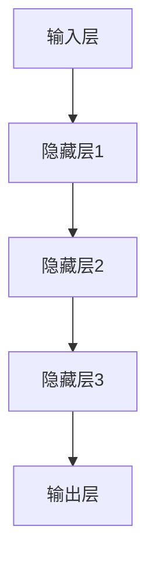
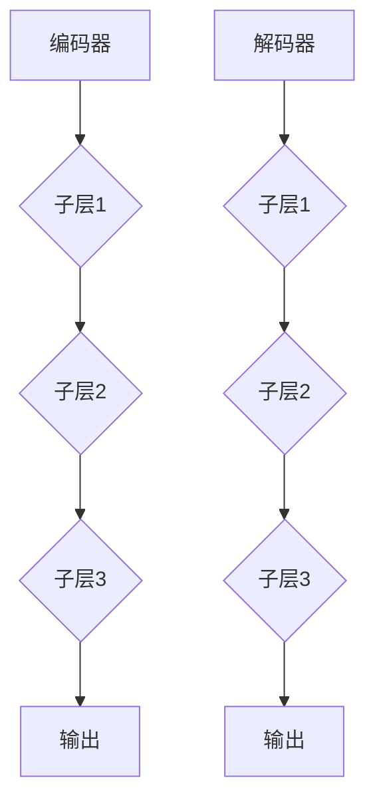

                 

### 文章标题

> **关键词**：软件2.0、AI大模型、数据驱动、深度学习、自然语言处理、应用案例

> **摘要**：
本文将深入探讨软件2.0时代的核心驱动力——AI大模型，分析其定义、特点、技术基础以及在企业中的应用。通过详细的项目实战案例分析，我们将展示AI大模型在智能客服、智能医疗诊断和智能供应链优化等领域的实际应用，并探讨其与金融、制造、零售等行业的融合。此外，本文还将讨论AI大模型的安全与伦理问题，以及未来发展的趋势。通过本文的阅读，读者将全面了解AI大模型在软件2.0时代的地位和影响，掌握其在各行业中的实际应用和未来发展。

### 第一部分：软件2.0时代的AI大模型基础

在软件2.0时代，AI大模型成为了技术创新的核心驱动力。这一部分将首先概述软件2.0与AI大模型的关系，然后介绍AI大模型的基本概念和特点，接着分析主流AI大模型的类型，并探讨AI大模型在企业中的应用前景。

#### 第1章：软件2.0与AI大模型概述

##### 1.1 软件2.0时代的到来

**1.1.1 从软件1.0到软件2.0的演进**

软件1.0时代，即传统软件时代，主要以功能为导向，强调的是软件的功能性、稳定性和可维护性。然而，随着互联网、大数据和人工智能等技术的快速发展，软件1.0逐渐暴露出其局限性。软件1.0通常采用的是中心化的架构，数据处理能力和智能化水平有限，难以应对日益复杂的应用需求。

软件2.0时代的到来，标志着软件从功能驱动向数据驱动的转变。软件2.0强调的是以用户数据为核心，通过数据的收集、处理和分析，实现软件智能化、个性化和协同化。这一时代的软件更加注重用户体验和业务价值，能够根据用户行为和需求动态调整自身功能。

**1.1.2 大模型在软件2.0中的核心地位**

在软件2.0时代，AI大模型扮演着至关重要的角色。AI大模型具有强大的数据处理和分析能力，能够从海量数据中提取有价值的信息，辅助企业进行决策和优化。大模型不仅能够实现自动化和智能化，还能通过深度学习和自我优化，不断提高自身性能和准确性。

**1.1.3 企业级应用开发的新范式**

软件2.0时代，企业级应用开发迎来了新的范式。传统的软件开发过程通常分为需求分析、设计、编码、测试和部署等阶段，而软件2.0时代的开发更加灵活、迭代和快速。企业级应用开发需要充分利用AI大模型的能力，实现数据驱动的开发模式。这种模式强调快速原型开发、持续集成和持续交付，使得软件产品能够快速响应市场需求和用户反馈。

##### 1.2 AI大模型的定义与特点

**1.2.1 AI大模型的定义**

AI大模型是指通过深度学习和大数据技术训练的、具备强大数据处理和分析能力的模型。这些模型通常具有数亿甚至数万亿个参数，能够处理海量数据，提取复杂的特征，并生成高质量的预测和决策。

**1.2.2 AI大模型的核心特点**

- **高精度**：AI大模型通过大规模数据训练，能够达到很高的预测准确性和决策质量。
- **可扩展性**：大模型的设计通常考虑了可扩展性，能够轻松处理大规模数据和高并发请求。
- **自适应能力**：AI大模型具备自适应能力，能够根据新数据和环境变化进行调整和优化。
- **泛化能力**：大模型通过广泛的数据训练，能够泛化到不同领域和应用场景，具有较高的迁移能力。

**1.2.3 AI大模型与传统AI的区别**

传统AI技术通常采用小规模、功能单一的模型，而AI大模型则具有以下几个显著区别：

- **规模**：AI大模型具有数亿甚至数万亿个参数，远超传统AI模型。
- **能力**：AI大模型不仅能够进行预测和分类，还能够进行生成、翻译、问答等多种复杂任务。
- **数据量**：AI大模型需要大量数据进行训练，传统AI模型则通常采用小规模数据。
- **计算资源**：AI大模型训练需要高性能计算资源，传统AI模型则对计算资源要求较低。

##### 1.3 主流AI大模型简介

**1.3.1 GPT系列模型**

GPT（Generative Pre-trained Transformer）系列模型是AI大模型领域的代表性工作。GPT模型由OpenAI提出，具有强大的自然语言生成和理解能力。GPT-3是目前最先进的GPT模型，具有1750亿个参数，能够生成高质量的文章、代码和对话。

**1.3.2 BERT及其变体**

BERT（Bidirectional Encoder Representations from Transformers）是由Google提出的一种预训练语言模型，具有双向编码的特点。BERT及其变体如RoBERTa、ALBERT等，在自然语言处理任务中取得了显著的性能提升。

**1.3.3 其他知名大模型介绍**

除了GPT和BERT，还有其他一些知名的大模型，如：

- **T5（Text-to-Text Transfer Transformer）**：T5模型将所有NLP任务转换为文本到文本的转换任务，具有高度的可扩展性和通用性。
- **XLNet**：XLNet模型采用自回归的方式，在BERT的基础上进一步提高了预训练效果。
- **Transformers**：Transformers模型是自然语言处理领域的基础架构，其原理被广泛应用于各种大模型。

##### 1.4 AI大模型在企业中的应用前景

**1.4.1 AI大模型的潜在应用领域**

AI大模型在企业中的应用前景非常广阔，包括但不限于以下几个领域：

- **智能客服**：利用AI大模型实现智能客服机器人，提高客户服务质量和效率。
- **智能医疗**：通过AI大模型进行疾病诊断、药物研发和健康管理，提高医疗服务水平。
- **智能供应链**：利用AI大模型优化供应链管理，提高生产效率和降低成本。
- **金融风控**：通过AI大模型进行风险识别、信用评估和投资决策，提高金融行业的风险管理能力。

**1.4.2 企业采用AI大模型的优势**

企业采用AI大模型具有以下几个明显优势：

- **提升决策能力**：AI大模型能够从海量数据中提取有价值的信息，辅助企业进行精准决策。
- **提高运营效率**：AI大模型能够自动化处理重复性工作，提高工作效率和降低运营成本。
- **增强竞争力**：通过AI大模型的应用，企业能够提供更加个性化和智能化的产品和服务，增强市场竞争力。

**1.4.3 AI大模型应用的挑战与机遇**

尽管AI大模型在企业中具有广泛的应用前景，但其应用也面临一定的挑战和机遇：

- **数据隐私和安全**：AI大模型训练需要大量数据，如何保护用户隐私和数据安全成为一大挑战。
- **模型透明性与可解释性**：大模型的决策过程往往难以解释，如何提高模型的透明性和可解释性是亟待解决的问题。
- **计算资源与成本**：大模型训练需要高性能计算资源，如何优化计算资源利用和降低成本是关键问题。
- **技术更新与人才需求**：AI大模型技术更新迅速，企业需要不断更新技术栈和培养相关人才。

#### 第2章：AI大模型技术基础

在了解了AI大模型的基本概念和应用前景后，接下来我们将深入探讨AI大模型的技术基础，包括深度学习与神经网络基础、自然语言处理技术概览以及大规模预训练模型原理。

##### 2.1 深度学习与神经网络基础

**2.1.1 神经网络的基本结构**

神经网络（Neural Network）是深度学习（Deep Learning）的核心组成部分。神经网络由一系列相互连接的节点（或称为神经元）组成，这些节点通过权重（weights）和偏置（biases）进行连接。每个节点接收输入信号，通过激活函数（activation function）处理后输出信号，从而实现数据的传递和计算。

一个简单的神经网络通常包括以下几个部分：

- **输入层**：接收外部输入数据。
- **隐藏层**：对输入数据进行处理和特征提取。
- **输出层**：生成预测结果或决策。

神经网络的架构可以通过以下Mermaid流程图来表示：



**2.1.2 常见的深度学习架构**

深度学习架构多种多样，常见的包括卷积神经网络（CNN）、循环神经网络（RNN）和Transformer等。

- **卷积神经网络（CNN）**：CNN主要用于图像和视频处理，通过卷积操作提取图像特征，实现图像分类、物体检测等任务。
- **循环神经网络（RNN）**：RNN适用于序列数据，如时间序列、文本等，通过循环结构保留历史信息，实现语言建模、机器翻译等任务。
- **Transformer**：Transformer模型由Google提出，是自然语言处理领域的重要突破。Transformer采用自注意力机制（self-attention），能够高效地处理长距离依赖问题，成为预训练语言模型的核心架构。

**2.1.3 深度学习优化算法**

深度学习优化算法是训练深度模型的关键。常见的优化算法包括梯度下降（Gradient Descent）、Adam（Adaptive Moment Estimation）等。

- **梯度下降**：梯度下降是一种最基本的优化算法，通过计算损失函数的梯度并沿着梯度方向更新模型参数，以最小化损失函数。
- **Adam**：Adam算法结合了Adam和Momentum方法，能够自适应地调整学习率，提高优化效果。

以下是梯度下降算法的伪代码实现：

```python
# 初始化模型参数
params = initialize_params()

# 设置学习率
learning_rate = 0.01

# 设置迭代次数
num_iterations = 1000

# 梯度下降迭代
for i in range(num_iterations):
    # 计算梯度
    gradients = compute_gradients(params)
    
    # 更新参数
    params = params - learning_rate * gradients
```

##### 2.2 自然语言处理技术概览

**2.2.1 词嵌入技术**

词嵌入（Word Embedding）是将单词转换为向量表示的技术，是自然语言处理的基础。常见的词嵌入方法包括Word2Vec、GloVe等。

- **Word2Vec**：Word2Vec算法通过训练神经网络，将单词映射到高维向量空间，实现单词之间的语义相似性。
- **GloVe**：GloVe算法通过计算单词之间的共现关系，生成单词的向量表示，具有较好的语义表示能力。

**2.2.2 序列模型与注意力机制**

序列模型（Sequence Model）是处理序列数据（如文本、时间序列等）的有效方法。常见的序列模型包括循环神经网络（RNN）和长短期记忆网络（LSTM）。

- **RNN**：RNN通过循环结构处理序列数据，保留历史信息，实现语言建模、序列分类等任务。
- **LSTM**：LSTM是RNN的一种改进，通过引入门控机制，有效解决RNN的梯度消失问题，适用于长序列数据的建模。

注意力机制（Attention Mechanism）是处理长文本数据的重要技术。注意力机制能够自适应地调整不同位置的信息权重，提高模型的性能。

**2.2.3 转换器架构详解**

转换器架构（Transformer Architecture）是自然语言处理领域的重要突破，其核心思想是使用自注意力机制（self-attention）处理序列数据。Transformer架构包括编码器（Encoder）和解码器（Decoder）两部分，能够实现高效的语言建模、机器翻译等任务。

以下是Transformer编码器和解码器的基本结构：



##### 2.3 大规模预训练模型原理

**2.3.1 预训练的概念与意义**

预训练（Pre-training）是指在大规模数据集上对模型进行初步训练，以获得基本的特征提取和表征能力。预训练的意义在于：

- **提高模型性能**：预训练使模型在大规模数据上学习到丰富的特征表示，提高模型在下游任务上的性能。
- **降低训练成本**：预训练模型可以用于迁移学习，通过微调（fine-tuning）适应特定任务，降低训练成本和时间。
- **通用性提升**：预训练模型能够泛化到不同领域和应用场景，提高模型的通用性。

**2.3.2 自监督学习方法**

自监督学习（Self-supervised Learning）是一种在未标注数据上进行预训练的方法。自监督学习通过构建辅助任务，使得模型在无标注数据上获得丰富的特征表示。

常见的自监督学习方法包括：

- **Masked Language Model（MLM）**：MLM通过遮蔽输入文本的部分单词，预测遮蔽的单词，实现文本表示的预训练。
- ** masked Tokens**： masked Tokens通过随机遮蔽输入文本的一部分单词或子词，学习单词和子词的表征。
- ** masked Positions**： masked Positions通过随机交换输入文本中的单词位置，学习单词顺序和序列表示。

**2.3.3 迁移学习与微调技术**

迁移学习（Transfer Learning）是指将预训练模型的知识迁移到新的任务上，通过微调（fine-tuning）适应特定任务。

迁移学习的步骤包括：

1. **预训练**：在大规模数据集上对模型进行预训练，学习到通用特征表示。
2. **微调**：在特定任务的数据集上对模型进行微调，调整模型参数，以适应特定任务。
3. **评估与优化**：评估微调后模型在特定任务上的性能，并进行优化调整。

迁移学习与微调技术使得AI大模型能够高效地应用于不同领域和应用场景，具有重要的实际意义。

### 第二部分：AI大模型应用实战

在了解了AI大模型的技术基础后，接下来我们将通过具体的应用实战，展示AI大模型在实际项目中的训练与部署过程。

#### 第3章：AI大模型应用实战

本章将通过三个实际项目案例，展示AI大模型在智能客服、智能医疗诊断和智能供应链优化等领域的应用实战。每个案例将详细描述项目的背景、目标、模型设计、实现过程以及评估和优化方法。

##### 3.1 案例一：智能客服系统

**3.1.1 案例背景与目标**

智能客服系统是一种利用AI技术实现自动化客户服务的技术系统。该系统旨在为企业提供高效、智能的客服支持，提高客户满意度和服务质量。

案例背景：某大型电商企业希望通过智能客服系统，自动化处理用户咨询、投诉和售后等问题，减轻人工客服的工作负担，提高客户响应速度。

目标：设计并实现一个基于AI大模型的智能客服系统，能够准确理解用户提问，生成高质量的回答，并实时更新知识库。

**3.1.2 模型设计与实现**

1. **模型选择**：选择基于Transformer架构的BERT模型，作为文本分类和问答任务的预训练基础。
2. **数据集准备**：收集并整理电商企业的客服对话数据，包括用户提问和客服回答，以及相关的标签信息。
3. **数据预处理**：对数据进行清洗、去重和分词处理，将文本转换为序列编码。
4. **模型训练**：在预训练数据集上对BERT模型进行预训练，学习到电商领域的通用特征表示。
5. **微调**：在用户提问和客服回答的数据集上对BERT模型进行微调，优化模型参数，提高问答任务的性能。
6. **模型评估**：在测试数据集上评估模型性能，包括准确率、召回率等指标。

**3.1.3 案例评估与优化**

1. **性能评估**：在测试集上评估模型的性能，包括分类准确率、问答匹配准确率等。
2. **效果优化**：通过调整超参数、增加数据量、改进模型架构等方法，提高模型性能和效果。
3. **实际应用**：将优化后的模型部署到生产环境，实现智能客服系统的自动化运行。

**3.1.4 案例总结**

通过该案例，我们展示了AI大模型在智能客服系统中的应用，实现了自动化客户服务，提高了客服效率和客户满意度。未来，可以通过持续优化和更新模型，进一步提高智能客服系统的性能和效果。

##### 3.2 案例二：智能医疗诊断系统

**3.2.1 案例背景与目标**

智能医疗诊断系统是一种利用AI技术辅助医生进行疾病诊断的医疗系统。该系统旨在提高疾病诊断的准确性和效率，减轻医生的工作负担。

案例背景：某医疗企业希望通过智能医疗诊断系统，自动化分析医学影像数据，辅助医生进行疾病诊断，提高诊断准确率。

目标：设计并实现一个基于AI大模型的智能医疗诊断系统，能够自动识别医学影像中的病变区域，提供诊断建议。

**3.2.2 模型设计与实现**

1. **模型选择**：选择基于卷积神经网络（CNN）的ResNet模型，作为医学影像分类和病变检测的基础。
2. **数据集准备**：收集并整理医学影像数据，包括正常影像和病变影像，以及对应的标签信息。
3. **数据预处理**：对医学影像数据进行归一化、裁剪和增强处理，将图像转换为适合模型训练的格式。
4. **模型训练**：在预训练数据集上对ResNet模型进行预训练，学习到医学影像的通用特征表示。
5. **微调**：在医学影像数据集上对ResNet模型进行微调，优化模型参数，提高病变检测任务的性能。
6. **模型评估**：在测试数据集上评估模型性能，包括准确率、召回率等指标。

**3.2.3 案例评估与优化**

1. **性能评估**：在测试集上评估模型的性能，包括病变检测准确率、F1值等指标。
2. **效果优化**：通过调整超参数、增加数据量、改进模型架构等方法，提高模型性能和效果。
3. **实际应用**：将优化后的模型部署到生产环境，实现智能医疗诊断系统的自动化运行。

**3.2.4 案例总结**

通过该案例，我们展示了AI大模型在智能医疗诊断系统中的应用，实现了医学影像的自动化分析，提高了疾病诊断的准确性和效率。未来，可以通过持续优化和更新模型，进一步提高智能医疗诊断系统的性能和效果。

##### 3.3 案例三：智能供应链优化系统

**3.3.1 案例背景与目标**

智能供应链优化系统是一种利用AI技术优化供应链管理的系统。该系统旨在提高供应链的效率、降低成本，并实现精准的供应链预测和优化。

案例背景：某制造企业希望通过智能供应链优化系统，自动化分析供应链数据，优化库存管理、物流配送和供应链预测。

目标：设计并实现一个基于AI大模型的智能供应链优化系统，能够实时分析供应链数据，提供优化建议。

**3.3.2 模型设计与实现**

1. **模型选择**：选择基于Transformer架构的GPT模型，作为供应链数据分析的基础。
2. **数据集准备**：收集并整理供应链相关数据，包括库存数据、物流数据、市场数据等，以及对应的标签信息。
3. **数据预处理**：对供应链数据进行清洗、去重和特征提取处理，将数据转换为适合模型训练的格式。
4. **模型训练**：在预训练数据集上对GPT模型进行预训练，学习到供应链领域的通用特征表示。
5. **微调**：在供应链数据集上对GPT模型进行微调，优化模型参数，提高供应链优化任务的性能。
6. **模型评估**：在测试数据集上评估模型性能，包括准确率、召回率等指标。

**3.3.3 案例评估与优化**

1. **性能评估**：在测试集上评估模型的性能，包括供应链预测准确率、优化建议有效性等指标。
2. **效果优化**：通过调整超参数、增加数据量、改进模型架构等方法，提高模型性能和效果。
3. **实际应用**：将优化后的模型部署到生产环境，实现智能供应链优化系统的自动化运行。

**3.3.4 案例总结**

通过该案例，我们展示了AI大模型在智能供应链优化系统中的应用，实现了供应链数据的自动化分析，提高了供应链管理的效率。未来，可以通过持续优化和更新模型，进一步提高智能供应链优化系统的性能和效果。

### 第三部分：AI大模型与行业融合

在了解了AI大模型的应用实战后，接下来我们将探讨AI大模型与金融、制造、零售等行业的融合，分析其应用现状、案例以及面临的挑战和机遇。

#### 第4章：AI大模型与行业融合

##### 4.1 金融行业

**4.1.1 金融行业的AI应用现状**

金融行业一直是AI技术的重要应用领域，AI大模型在金融领域的应用日益广泛。目前，金融行业的AI应用主要包括以下几个方面：

- **智能风控**：AI大模型用于信用评估、欺诈检测、风险预测等，提高金融风险管理的精准度和效率。
- **量化交易**：AI大模型通过分析历史交易数据和市场动态，实现自动化交易策略，提高交易收益。
- **智能投顾**：AI大模型基于用户风险偏好和资产配置需求，提供个性化的投资建议和组合管理。
- **智能客服**：AI大模型用于金融客户服务，实现自动化问答、智能推荐等功能，提高客户体验。

**4.1.2 金融行业AI大模型的应用案例**

- **案例一：智能信用评估系统**：某金融机构采用基于AI大模型的智能信用评估系统，通过分析用户的个人信息、交易记录和社交网络数据，实现信用评分的自动化和精准化。
- **案例二：智能投顾平台**：某金融机构推出智能投顾平台，基于AI大模型进行用户画像分析和资产配置建议，实现个性化投资管理。

**4.1.3 金融行业AI大模型的挑战与机遇**

金融行业AI大模型的应用面临着一些挑战和机遇：

- **数据隐私和安全**：金融数据敏感性高，如何保护用户隐私和安全成为关键问题。
- **模型透明性与可解释性**：金融决策需要透明和可解释，如何提高AI大模型的透明性和可解释性是亟待解决的问题。
- **计算资源与成本**：大模型训练和推理需要大量计算资源，如何优化计算资源利用和降低成本是关键。
- **合规与监管**：金融行业受监管严格，如何确保AI大模型符合相关法规和监管要求是重要挑战。

##### 4.2 制造业

**4.2.1 制造业的AI应用现状**

制造业是AI技术的另一个重要应用领域，AI大模型在制造业的应用主要包括以下几个方面：

- **智能质检**：AI大模型通过图像识别和分类技术，实现产品缺陷检测和分类，提高生产质量。
- **设备预测维护**：AI大模型通过分析设备运行数据，实现设备故障预测和预防性维护，提高设备运行效率。
- **生产优化**：AI大模型通过数据分析，实现生产流程优化、库存管理优化和物流优化，提高生产效率和降低成本。
- **供应链管理**：AI大模型通过数据分析，实现供应链预测和优化，提高供应链管理的效率和响应速度。

**4.2.2 制造业AI大模型的应用案例**

- **案例一：智能质检系统**：某制造企业采用基于AI大模型的智能质检系统，通过图像识别技术实现产品缺陷检测，提高了生产质量和效率。
- **案例二：设备预测维护系统**：某制造企业采用基于AI大模型的设备预测维护系统，通过数据分析实现设备故障预测和预防性维护，提高了设备运行效率和降低了维护成本。

**4.2.3 制造业AI大模型的挑战与机遇**

制造业AI大模型的应用面临着一些挑战和机遇：

- **数据质量和可靠性**：制造业数据质量对AI大模型的性能至关重要，如何保证数据质量和可靠性是关键。
- **模型部署与集成**：如何将AI大模型集成到现有生产系统中，实现高效部署和运行，是制造业面临的挑战。
- **计算资源与成本**：大模型训练和推理需要大量计算资源，如何优化计算资源利用和降低成本是制造业需要关注的问题。
- **人才培养与知识转移**：制造业需要培养具备AI技术的专业人才，并将AI知识转移到生产实践中，是制造业面临的机遇。

##### 4.3 零售业

**4.3.1 零售业的AI应用现状**

零售业是AI技术的重要应用领域，AI大模型在零售业的应用主要包括以下几个方面：

- **智能推荐系统**：AI大模型通过用户行为和偏好分析，实现个性化商品推荐，提高用户购物体验。
- **库存管理**：AI大模型通过数据分析，实现库存预测和优化，提高库存周转率和降低库存成本。
- **供应链优化**：AI大模型通过数据分析，实现供应链预测和优化，提高供应链管理的效率和响应速度。
- **智能客服**：AI大模型用于零售客户服务，实现自动化问答和智能推荐，提高客户满意度。

**4.3.2 零售业AI大模型的应用案例**

- **案例一：智能推荐系统**：某零售企业采用基于AI大模型的智能推荐系统，通过用户行为和偏好分析，实现个性化商品推荐，提高了用户购物体验和转化率。
- **案例二：智能库存管理系统**：某零售企业采用基于AI大模型的智能库存管理系统，通过数据分析实现库存预测和优化，提高了库存周转率和降低了库存成本。

**4.3.3 零售业AI大模型的挑战与机遇**

零售业AI大模型的应用面临着一些挑战和机遇：

- **数据隐私和安全**：零售数据敏感性高，如何保护用户隐私和安全成为关键问题。
- **模型透明性与可解释性**：零售决策需要透明和可解释，如何提高AI大模型的透明性和可解释性是亟待解决的问题。
- **计算资源与成本**：大模型训练和推理需要大量计算资源，如何优化计算资源利用和降低成本是零售业需要关注的问题。
- **供应链整合与协同**：零售业供应链涉及多个环节，如何实现AI大模型在供应链各环节的整合和协同，是零售业面临的挑战。

### 第四部分：AI大模型安全与伦理

随着AI大模型在各个行业的广泛应用，其安全与伦理问题也日益受到关注。本部分将探讨AI大模型面临的安全挑战、伦理问题以及相关的监管措施。

#### 第5章：AI大模型安全与伦理

##### 5.1 AI大模型安全挑战

AI大模型的安全挑战主要体现在以下几个方面：

**5.1.1 模型偏见与歧视**

AI大模型在训练过程中可能会受到训练数据偏差的影响，导致模型在特定群体上产生偏见和歧视。例如，在招聘或贷款审批等应用场景中，如果训练数据中存在性别、种族或年龄等偏见，AI大模型可能会在这些群体上产生不公平的决策。这种偏见可能会加剧社会不平等，引发伦理和法律问题。

**5.1.2 模型透明性与可解释性**

AI大模型的决策过程通常较为复杂，其内部结构和参数众多，导致模型难以解释。这种不可解释性使得模型在应用过程中可能出现意外行为，甚至产生错误决策。对于关键决策领域，如医疗诊断和司法判决等，模型的透明性和可解释性至关重要。

**5.1.3 模型对抗攻击与防御**

对抗攻击（Adversarial Attack）是指通过微小的扰动，使AI大模型产生错误决策或异常行为的一种攻击方式。对抗攻击能够有效破坏AI大模型的稳定性和可靠性，对关键应用场景构成严重威胁。因此，如何防御对抗攻击成为AI安全研究的重要课题。

##### 5.2 AI大模型伦理问题

AI大模型在应用过程中可能引发一系列伦理问题，主要包括以下几个方面：

**5.2.1 数据隐私保护**

AI大模型训练需要大量数据，这些数据可能包含用户的敏感信息。如何保护用户隐私，防止数据泄露和滥用，成为AI伦理的重要问题。在数据收集、处理和使用过程中，需要遵循隐私保护原则，确保用户隐私不被侵犯。

**5.2.2 模型公平性与道德准则**

AI大模型在应用过程中需要遵循公平性和道德准则，避免对特定群体产生不公平的待遇。在招聘、贷款审批、医疗诊断等应用场景中，模型需要确保对所有用户的公平待遇，遵循相关法律法规和道德规范。

**5.2.3 AI大模型伦理监管**

随着AI大模型在各个领域的广泛应用，伦理监管成为亟待解决的问题。监管机构需要制定相关法规和标准，确保AI大模型的应用符合伦理要求，保护公众利益。同时，企业也需要建立内部伦理规范，加强对AI大模型的应用管理。

##### 5.3 AI大模型伦理监管

AI大模型的伦理监管主要包括以下几个方面：

**5.3.1 法规与政策**

政府机构和国际组织需要制定相关法规和政策，明确AI大模型的应用范围、标准和监管要求。法规和政策的制定需要平衡技术创新和伦理监管，确保AI大模型的应用符合社会利益。

**5.3.2 标准与认证**

建立AI大模型的标准和认证体系，确保模型的设计、开发和应用过程符合伦理要求。标准和认证体系需要涵盖模型透明性、公平性、可解释性等方面，为企业和用户提供指导。

**5.3.3 教育与培训**

加强对AI大模型伦理问题的教育和培训，提高公众对AI技术的认识和理解。教育和培训应包括伦理原则、法律法规、道德准则等方面，帮助企业和用户正确、合规地应用AI大模型。

**5.3.4 社会监督与反馈**

建立健全社会监督和反馈机制，鼓励公众参与AI大模型的应用监督，发现和解决潜在问题。社会监督和反馈有助于发现AI大模型应用中的伦理问题，推动AI技术的健康发展。

### 第五部分：未来展望与趋势

随着AI技术的快速发展，AI大模型在各个领域的应用日益深入，未来将继续推动人工智能领域的创新和变革。本部分将探讨AI大模型的技术发展趋势、应用场景以及跨行业融合的可能性。

#### 第6章：未来展望与趋势

##### 6.1 AI大模型技术发展趋势

**6.1.1 新一代AI大模型的架构**

未来，AI大模型将朝着更高效、更灵活的架构发展。新型架构将结合深度学习、图神经网络和强化学习等技术，实现更强大的特征提取和决策能力。例如，图神经网络（Graph Neural Networks, GNN）在处理复杂数据结构（如知识图谱）方面具有优势，可以与AI大模型结合，提升模型的表征能力。

**6.1.2 AI大模型训练效率的提升**

为了应对大规模数据和复杂模型的需求，AI大模型训练效率的提升将成为重要趋势。未来，模型压缩、分布式训练和增量学习等技术将得到广泛应用，降低模型训练的时间和计算资源需求。特别是模型压缩技术，如剪枝（Pruning）、量化（Quantization）和低秩分解（Low-rank Decomposition），将有助于提高模型训练的效率。

**6.1.3 AI大模型与其他技术的融合**

AI大模型与其他技术的融合将推动人工智能领域的创新。例如，AI大模型与增强学习（Reinforcement Learning）的结合，可以实现更智能的决策和优化；与虚拟现实（Virtual Reality）和增强现实（Augmented Reality）技术的结合，可以带来更丰富的交互体验。此外，AI大模型与边缘计算（Edge Computing）的结合，可以实现实时、高效的智能应用。

##### 6.2 AI大模型应用的未来场景

**6.2.1 智能化社会的构建**

未来，AI大模型将广泛应用于社会生活的各个方面，推动智能化社会的构建。从智能家居、智能交通到智能医疗、智能教育，AI大模型将实现更加便捷、高效和个性化的服务。例如，基于AI大模型的智能医疗系统将实现个性化疾病诊断和治疗方案，提高医疗服务的质量和效率。

**6.2.2 AI大模型在各个领域的深入应用**

AI大模型将在各个领域实现深入应用，推动产业升级和创新发展。在金融领域，AI大模型将实现更精准的风险管理和投资决策；在制造业，AI大模型将实现智能化生产管理和设备预测维护；在零售业，AI大模型将实现个性化推荐和精准营销。

**6.2.3 AI大模型在跨行业领域的创新**

跨行业融合是未来AI大模型应用的重要方向。通过跨行业的数据共享和技术合作，AI大模型将实现更多创新应用。例如，在智慧城市建设中，AI大模型可以整合交通、环境、医疗等多领域的数据，实现城市资源的优化配置；在农业领域，AI大模型可以结合遥感技术和物联网设备，实现智能化的作物管理和病虫害防治。

##### 6.3 AI大模型在跨行业领域的创新

**6.3.1 跨行业数据共享与融合**

未来，AI大模型的应用将依赖于跨行业的数据共享与融合。通过建立统一的数据标准和共享平台，不同行业的数据可以实现互通互联，为AI大模型提供更丰富的训练数据和更广泛的特征信息。例如，在智慧农业中，AI大模型可以通过整合气象数据、土壤数据、作物生长数据等多源数据，实现更精准的作物管理和病虫害预测。

**6.3.2 跨行业技术合作与创新**

跨行业的技术合作与创新是推动AI大模型应用的重要动力。通过不同行业的专家共同探讨和合作，可以发掘出更多AI大模型在跨行业领域的应用场景和解决方案。例如，在智能城市建设中，AI大模型可以整合交通、环境、医疗等多领域的专家知识，实现更智能的城市管理和公共服务。

**6.3.3 跨行业应用模式的探索**

跨行业应用模式的探索是未来AI大模型应用的重要方向。通过不同行业的业务场景和需求，AI大模型可以探索出更多创新的应用模式。例如，在智慧医疗中，AI大模型可以结合智能诊断、智能药物研发和智能健康管理，实现全方位的医疗服务；在智能制造中，AI大模型可以结合生产计划、设备维护和供应链管理，实现智能化的生产运营。

### 附录

#### 附录A：AI大模型开发工具与资源

**A.1 主流深度学习框架对比**

在AI大模型开发中，选择合适的深度学习框架是关键。以下是对几种主流深度学习框架的简要对比：

**A.1.1 TensorFlow**

- **优势**：TensorFlow是由Google开源的深度学习框架，具有强大的计算图功能，支持分布式训练和部署。TensorFlow提供了丰富的API，易于实现复杂模型。
- **劣势**：TensorFlow的代码复杂度较高，学习曲线较陡峭。
- **适用场景**：适用于大规模深度学习模型的训练和部署。

**A.1.2 PyTorch**

- **优势**：PyTorch是Facebook开源的深度学习框架，具有动态计算图，易于调试和理解。PyTorch的API简洁直观，适合快速原型开发和研究。
- **劣势**：PyTorch在分布式训练和部署方面不如TensorFlow成熟。
- **适用场景**：适用于快速原型开发和研究项目。

**A.1.3 JAX**

- **优势**：JAX是由Google开源的自动微分库，支持自动微分和数值计算优化。JAX具有良好的扩展性，可以与TensorFlow和PyTorch集成。
- **劣势**：JAX的社区和生态系统相对较小。
- **适用场景**：适用于高性能计算和深度学习优化。

**A.1.4 其他框架简介**

- **MXNet**：Apache MXNet是由Apache Software Foundation开源的深度学习框架，具有高性能和灵活的模型定义方式。
- **Caffe**：Caffe是由Berkeley Vision and Learning Center（BVLC）开源的深度学习框架，适用于图像识别和视觉应用。
- **Keras**：Keras是Python深度学习库，提供了简洁的API，可以与TensorFlow、Theano等深度学习框架集成。

#### 附录B：AI大模型经典论文与资源推荐

**B.1 经典论文精选**

- **GPT系列**：Generative Pre-trained Transformers (GPT) 系列论文，包括 GPT、GPT-2、GPT-3，是自然语言处理领域的代表性工作。
- **BERT**：BERT: Pre-training of Deep Bidirectional Transformers for Language Understanding，提出了双向Transformer预训练模型，是自然语言处理领域的突破性工作。
- **T5**：T5: Exploring the Limits of Transfer Learning with a Universal Transformer，提出了将所有NLP任务转换为文本到文本转换任务的方法。
- **XLNet**：XLNet: Generalized Autoregressive Pretraining for Language Understanding，采用了自回归方式，在BERT基础上进一步提高了预训练效果。

**B.2 资源推荐**

- **开源代码与数据集**：Google AI、OpenAI、Hugging Face等组织提供了丰富的AI大模型开源代码和数据集，方便研究者进行研究和实践。
- **在线教程与课程**：Coursera、edX、Udacity等在线教育平台提供了丰富的深度学习和自然语言处理课程，适合初学者和进阶者学习。
- **学术会议与期刊**：ACL（Association for Computational Linguistics）、NeurIPS（Neural Information Processing Systems）等学术会议和期刊是AI领域的重要学术交流平台，读者可以关注相关论文和进展。

