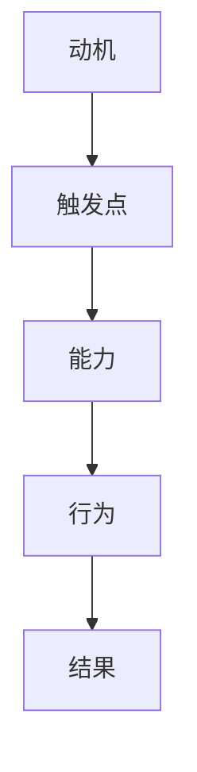

                 

# 《运用福格模型培养团队良习惯》

## 关键词：福格模型、团队管理、行为习惯、个人动机、行动能力

### 摘要：
在现代企业管理中，团队的行为习惯对于组织的整体绩效有着至关重要的影响。本文将介绍福格模型，并探讨如何运用这一模型来培养团队良好的行为习惯。通过分析福格模型的基础理论，并结合实际案例，我们将展示如何通过科学的方法来提升团队成员的动机、增强他们的行动能力，并在特定的情境中触发积极的行为。本文旨在为企业管理者提供一套切实可行的策略，帮助他们在团队管理中取得更好的成效。

### 目录

#### 第一部分：福格模型的基础理论

1.1 福格模型概述  
1.1.1 福格模型的概念  
1.1.2 福格模型的组成部分  
1.1.3 福格模型的应用背景

1.2 福格模型的核心概念  
1.2.1 行动触发点  
1.2.2 情境触发  
1.2.3 个人动机  
1.2.4 行动能力

1.3 福格模型的联系与应用  
1.3.1 福格模型与其他理论的关系  
1.3.2 福格模型在团队管理中的应用

1.4 福格模型案例分析  
1.4.1 成功案例分享  
1.4.2 挑战与应对

#### 第二部分：福格模型在团队管理中的应用

2.1 团队成员行为分析  
2.1.1 行为触发点的识别  
2.1.2 情境因素分析  
2.1.3 动机因素分析  
2.1.4 行动能力评估

2.2 制定团队良习惯培养策略  
2.2.1 确定团队目标  
2.2.2 制定行为计划  
2.2.3 设计情境触发机制  
2.2.4 提升个人动机  
2.2.5 强化行动能力

2.3 团队良习惯培养实战  
2.3.1 团队行为观察与记录  
2.3.2 行为反馈与改进  
2.3.3 案例分析：如何通过福格模型培养团队会议纪律

2.4 团队文化建设与福格模型  
2.4.1 团队文化的内涵与作用  
2.4.2 如何利用福格模型建设团队文化  
2.4.3 团队文化建设中的挑战与策略

#### 第三部分：福格模型在团队发展中的应用案例

3.1 案例一：如何通过福格模型提高团队成员的学习积极性  
3.1.1 项目背景  
3.1.2 行动策略制定  
3.1.3 实施过程  
3.1.4 结果评估

3.2 案例二：如何通过福格模型提升团队工作效率  
3.2.1 项目背景  
3.2.2 行动策略制定  
3.2.3 实施过程  
3.2.4 结果评估

3.3 案例三：如何通过福格模型解决团队协作中的沟通障碍  
3.3.1 项目背景  
3.3.2 行动策略制定  
3.3.3 实施过程  
3.3.4 结果评估

#### 第四部分：总结与展望

4.1 福格模型在团队管理中的总结  
4.1.1 福格模型的核心价值  
4.1.2 福格模型的应用原则  
4.1.3 福格模型的发展趋势

4.2 福格模型在团队管理中的应用展望  
4.2.1 未来发展趋势  
4.2.2 潜在挑战与应对策略  
4.2.3 福格模型在其他领域的应用前景

### 引言

在现代企业运营中，团队的协作效率和成员的个人行为习惯对组织的发展具有深远影响。良好的行为习惯能够提高工作效率、促进知识共享，并增强团队的凝聚力。然而，如何有效地培养团队成员的良习惯，一直是企业管理和人力资源管理中的难题。

福格模型（BJ Fogg Behavior Model）由斯坦福大学行为科学家BJ福格提出，旨在解释人们行为背后的心理机制。该模型强调了三个关键要素：动机、触发点和能力。通过理解这三个要素之间的关系，我们可以设计出有效的策略，引导团队成员养成良好的行为习惯。

本文将首先介绍福格模型的基础理论，包括其组成部分和应用背景。接着，我们将深入分析如何在团队管理中运用福格模型，并通过实际案例展示其具体应用。最终，我们将总结福格模型在团队管理中的价值，并提出未来应用的展望。

### 第一部分：福格模型的基础理论

#### 1.1 福格模型概述

福格模型，又称行为模型，是一种用于分析人类行为的理论框架。它由斯坦福大学行为科学家BJ福格提出，旨在解释人们如何做出行为决策。福格模型的核心观点是，行为的发生取决于三个要素：动机、触发点和能力。

**1.1.1 福格模型的概念**

福格模型认为，人类行为是由动机、触发点和能力三者共同作用的结果。这三个要素相互关联，共同影响行为的发生：

- **动机**：指个体产生某种行为的内在动力，例如完成任务、获得奖励或逃避惩罚。
- **触发点**：是指情境中触发个体采取特定行为的因素，如提醒、提示或压力。
- **能力**：是指个体实施行为所需的技术、资源或技能。

当这三个要素同时满足时，行为便会发生。例如，一个团队成员（动机）想要学习新技术（触发点），并且具备学习条件（能力），那么他就会采取行动去学习。

**1.1.2 福格模型的组成部分**

福格模型由三个主要组成部分构成：行为触发点、情境触发和个人动机。

- **行为触发点**：这是指任何可以激发个体采取特定行为的因素。它可以是外部环境中的物理事件，也可以是心理状态。例如，一个明确的学习任务、一个培训通知或者一个同事的推荐。
  
- **情境触发**：情境触发是指触发点的具体实现，它将行为触发点与个人动机相连接。情境触发可以是任何能够增强行为触发点效果的因素，如提示、提醒或强化。
  
- **个人动机**：这是指个体产生行为的内在驱动力，通常源自于内在需求或外部激励。个人动机可以分为三大类：追求快乐、逃避痛苦和完成任务。

**1.1.3 福格模型的应用背景**

福格模型最初应用于个人行为的改变，如健康习惯的培养、减肥、戒烟等。然而，随着其在行为科学领域的影响不断扩大，福格模型逐渐被应用于企业管理和团队管理中。在团队管理中，福格模型可以帮助管理者理解团队成员的行为模式，并设计出有效的策略来引导和培养良好的行为习惯。

**1.2 福格模型的核心概念**

为了更好地理解福格模型在团队管理中的应用，我们需要深入探讨其核心概念。

**1.2.1 行动触发点**

行动触发点（Trigger）是指激发个体采取特定行为的因素。这些触发点可以是外部环境中的物理事件，也可以是内部心理状态。在团队管理中，行动触发点可以包括以下几种：

- **任务分配**：明确的工作任务可以作为一个行动触发点，激发团队成员的行动。
- **目标设定**：团队或个人目标的设定可以作为一个行动触发点，驱动团队成员朝着目标努力。
- **反馈机制**：定期的反馈和评估可以作为一个行动触发点，促使团队成员反思和改进。
- **奖励和惩罚**：奖励和惩罚机制可以作为一个行动触发点，影响团队成员的行为选择。

**1.2.2 情境触发**

情境触发（Situation）是指行为触发点在特定环境中的实现。情境触发增强了行为触发点的效果，促使个体更容易采取特定行为。在团队管理中，情境触发可以包括：

- **工作环境**：一个良好的工作环境可以增强团队成员的工作动力，提高行动能力。
- **团队文化**：积极的团队文化可以激发团队成员的归属感和责任感，提高行为发生的可能性。
- **时间管理**：合理安排工作时间和任务，可以确保团队成员有足够的时间和资源去完成任务。

**1.2.3 个人动机**

个人动机（Motivation）是指个体产生行为的内在驱动力。在团队管理中，个人动机可以分为以下几类：

- **内在动机**：个体对工作本身的兴趣和热情，例如追求知识、自我实现和成就感。
- **外在动机**：个体因外部奖励或惩罚而产生的动力，例如金钱奖励、晋升机会和避免惩罚。
- **混合动机**：内在动机和外在动机的结合，个体既有对工作本身的兴趣，也期待外部奖励。

**1.2.4 行动能力**

行动能力（Capability）是指个体实施行为所需的技术、资源和技能。在团队管理中，行动能力包括：

- **技能水平**：团队成员的技术能力和专业知识水平，直接影响他们完成任务的效率和效果。
- **资源配备**：团队成员是否拥有足够的资源和工具来完成任务，如时间、资金和技术支持。
- **工作流程**：团队的工作流程是否高效和流畅，影响团队成员的行动能力。

#### 1.3 福格模型的联系与应用

**1.3.1 福格模型与其他理论的关系**

福格模型在行为科学领域与其他理论有着密切的联系。例如，它与行为经济学中的决策理论、自我决定理论以及动机理论有着相似之处。福格模型借鉴了这些理论的精髓，形成了一套独特的分析框架。

- **行为经济学**：行为经济学研究个体在经济决策中的非理性行为。福格模型中的动机概念与行为经济学中的动机理论密切相关，都强调个体行为的内在驱动。
- **自我决定理论**：自我决定理论关注个体的内在动机和自由意志。福格模型中的动机概念与之相呼应，都认为个体的内在动机对行为有重要影响。
- **动机理论**：动机理论研究了个体行为的内在和外在动机。福格模型通过整合不同的动机类型，提供了更全面的动机分析框架。

**1.3.2 福格模型在团队管理中的应用**

在团队管理中，福格模型可以用于分析团队成员的行为，设计激励机制，以及培养良好的行为习惯。以下是一些具体应用：

- **行为分析**：通过分析团队成员的行为触发点、情境触发和个人动机，管理者可以了解团队成员的行为模式，并发现行为背后的心理机制。
- **激励机制设计**：管理者可以根据福格模型，设计出有效的激励机制，激发团队成员的内在动机和外在动机，提高团队的整体绩效。
- **行为习惯培养**：通过识别团队成员的行为能力，管理者可以制定针对性的培养策略，帮助团队成员养成良好的行为习惯，提高工作效率和团队凝聚力。

#### 1.4 福格模型案例分析

**1.4.1 成功案例分享**

以下是一个福格模型在团队管理中成功应用的案例：

**案例背景**：一家互联网公司想要提高团队成员的代码质量。公司管理者决定运用福格模型来培养团队成员的编码习惯。

**行动策略**：

- **行为触发点**：明确代码质量标准，并在代码审查过程中严格执行。
- **情境触发**：设置定期的代码质量评估，向团队成员提供反馈和改进建议。
- **个人动机**：提供奖励机制，如代码质量奖金和晋升机会，激励团队成员提高编码水平。
- **行动能力**：组织内部培训，提升团队成员的编程技能。

**实施过程**：

1. **行为触发点**：制定详细的代码质量标准，包括代码格式、注释规范、错误处理等。
2. **情境触发**：每周进行一次代码质量评估，向团队成员提供反馈，指出需要改进的地方。
3. **个人动机**：设立代码质量奖金制度，根据代码质量评分进行奖励。
4. **行动能力**：组织内部编程培训，提高团队成员的编程技能。

**结果评估**：

通过一系列措施，公司团队成员的代码质量得到了显著提高。代码质量评估结果显示，80%以上的代码符合质量标准，团队成员的编码技能也得到了提升。

**1.4.2 挑战与应对**

在实施福格模型的过程中，企业可能会面临一些挑战：

- **动机不足**：一些团队成员可能缺乏内在动机，不愿意改变行为习惯。应对策略是提供外在激励，如奖励和晋升机会。
- **能力不足**：部分团队成员可能缺乏必要的技能和资源，无法实施新的行为习惯。应对策略是提供培训和支持，帮助他们提升能力。
- **情境不足**：一些团队成员可能处于不良的工作环境，影响他们的行为发生。应对策略是改善工作环境，提供更好的资源和支持。

通过应对这些挑战，企业可以更有效地运用福格模型，培养团队成员的良好行为习惯。

### 第二部分：福格模型在团队管理中的应用

#### 2.1 团队成员行为分析

在团队管理中，了解团队成员的行为是培养良好习惯的第一步。通过行为分析，管理者可以识别团队成员的行为触发点、情境触发和个人动机，从而制定有效的培养策略。

**2.1.1 行为触发点的识别**

行为触发点是指激发团队成员采取特定行为的因素。在团队管理中，识别行为触发点有助于管理者理解团队成员的行为模式，并设计相应的策略。

- **任务分配**：明确的任务分配可以作为一个重要的行为触发点。当团队成员知道他们的职责和目标时，他们会更有动力去完成任务。
- **目标设定**：团队或个人目标的设定也是一个重要的行为触发点。目标设定可以激发团队成员的内在动机，促使他们努力达成目标。
- **反馈机制**：定期的反馈和评估可以作为一个行为触发点，促使团队成员反思和改进自己的行为。

**2.1.2 情境因素分析**

情境因素是指影响团队成员行为的外部环境因素。分析情境因素可以帮助管理者了解团队成员所处的环境，并制定相应的策略来改善环境。

- **工作环境**：一个良好的工作环境可以增强团队成员的工作动力。例如，提供舒适的办公环境、良好的设施和资源等。
- **团队文化**：积极的团队文化可以激发团队成员的归属感和责任感。例如，建立开放、包容和合作的文化氛围。
- **时间管理**：合理安排工作时间和任务，可以确保团队成员有足够的时间和资源去完成任务。

**2.1.3 动机因素分析**

动机因素是指激发团队成员产生行为的内在驱动力。了解团队成员的动机有助于管理者设计出更有效的激励机制。

- **内在动机**：内在动机源自于对工作本身的兴趣和热情。例如，追求知识、自我实现和成就感。
- **外在动机**：外在动机源自于外部奖励或惩罚。例如，金钱奖励、晋升机会和避免惩罚。
- **混合动机**：混合动机是内在动机和外在动机的结合。例如，一个团队成员既有对工作本身的兴趣，也期待外部奖励。

**2.1.4 行动能力评估**

行动能力是指团队成员实施行为所需的技术、资源和技能。评估行动能力可以帮助管理者了解团队成员的能力水平，并提供必要的支持和培训。

- **技能水平**：团队成员的技术能力和专业知识水平，直接影响他们完成任务的效率和效果。
- **资源配备**：团队成员是否拥有足够的资源和工具来完成任务，如时间、资金和技术支持。
- **工作流程**：团队的工作流程是否高效和流畅，影响团队成员的行动能力。

#### 2.2 制定团队良习惯培养策略

在了解团队成员的行为、情境和动机后，管理者可以制定针对性的策略来培养团队良好的行为习惯。以下是一些关键策略：

**2.2.1 确定团队目标**

制定明确的团队目标是培养良好行为习惯的基础。团队目标应该与组织的整体战略目标相一致，同时具有可操作性和可衡量性。通过设定具体的团队目标，管理者可以引导团队成员明确自己的职责和努力方向。

**2.2.2 制定行为计划**

在确定团队目标后，管理者需要制定具体的行为计划。行为计划应该包括具体的行为目标、实现行为的步骤和行动计划。通过详细的行为计划，管理者可以确保团队成员知道如何实现目标，并能够在行动中保持一致。

**2.2.3 设计情境触发机制**

情境触发机制是指通过设计特定的情境来激发团队成员的行为。例如，管理者可以设置定期的反馈和评估机制，或者组织培训活动来提高团队成员的技能水平。设计有效的情境触发机制可以帮助管理者在合适的时机激发团队成员的行为。

**2.2.4 提升个人动机**

提升个人动机是培养良好行为习惯的关键。管理者可以通过以下方式提升个人动机：

- **内在动机**：通过激发团队成员对工作本身的兴趣和热情，提高他们的内在动机。例如，提供富有挑战性的工作任务、鼓励创新和自我实现。
- **外在动机**：通过提供外部奖励或惩罚机制，提高团队成员的外在动机。例如，设立奖金制度、晋升机会和避免惩罚。
- **混合动机**：结合内在动机和外在动机，提高团队成员的混合动机。例如，在提供外部奖励的同时，鼓励团队成员追求自我实现。

**2.2.5 强化行动能力**

强化行动能力是培养良好行为习惯的重要手段。管理者可以通过以下方式强化行动能力：

- **技能培训**：为团队成员提供专业培训和技能提升机会，帮助他们提升技术能力和专业知识水平。
- **资源配置**：为团队成员提供必要的资源和工具，确保他们有足够的能力和资源去完成任务。
- **工作流程优化**：优化团队的工作流程，提高工作效率和流畅度，确保团队成员能够在最佳状态下工作。

#### 2.3 团队良习惯培养实战

在了解了团队成员的行为、情境、动机以及制定了培养策略后，管理者需要将这些策略付诸实践。以下是一些团队良习惯培养的实战技巧：

**2.3.1 团队行为观察与记录**

管理者需要通过观察和记录团队的行为，了解团队成员在实际行动中的表现。观察和记录可以帮助管理者发现团队成员的优点和不足，并制定相应的改进措施。

- **行为观察**：管理者可以通过现场观察、会议记录和绩效评估等方式，了解团队成员的实际行为表现。
- **行为记录**：管理者可以建立行为记录表，记录团队成员的行为表现、行为触发点、情境触发和个人动机等信息。

**2.3.2 行为反馈与改进**

在了解团队成员的行为后，管理者需要及时给予反馈，并帮助团队成员改进。有效的反馈可以激发团队成员的内在动机和外在动机，提高他们的行为表现。

- **正面反馈**：对团队成员的良好行为给予表扬和奖励，增强他们的内在动机和外在动机。
- **负面反馈**：对团队成员的不良行为给予指正和建议，帮助他们改正错误，提高行为能力。

**2.3.3 案例分析：如何通过福格模型培养团队会议纪律**

以下是一个通过福格模型培养团队会议纪律的案例分析：

**案例背景**：一家公司的团队会议经常出现成员迟到、注意力不集中和讨论偏离主题等问题，影响了会议的效率和效果。

**行动策略**：

- **行为触发点**：制定明确的会议纪律，并在会议通知中明确纪律要求。
- **情境触发**：设置会议前的提醒机制，如发送会议通知和提醒短信，确保成员按时参加会议。
- **个人动机**：设立奖励机制，对准时参加会议和积极参与讨论的成员给予奖励。
- **行动能力**：提供时间管理培训，提高成员的时间意识和会议组织能力。

**实施过程**：

1. **行为触发点**：制定会议纪律，明确迟到、早退和会议内容的要求。
2. **情境触发**：在会议前两天发送会议通知，并提醒成员按时参加会议。
3. **个人动机**：设立奖励机制，对准时参加会议和提出建设性意见的成员给予奖励。
4. **行动能力**：提供时间管理培训，帮助成员提高时间意识和会议组织能力。

**结果评估**：

通过一系列措施，团队会议的纪律得到了显著改善。成员的出勤率和参与度提高了，会议的效率和效果也明显提升。

#### 2.4 团队文化建设与福格模型

团队文化是团队管理的重要组成部分，对团队成员的行为和绩效有着深远影响。通过福格模型，管理者可以更好地理解和建设团队文化，培养团队成员的良习惯。

**2.4.1 团队文化的内涵与作用**

团队文化是指团队内部共同的价值观、信念和行为规范。它是一种无形的力量，对团队成员的行为和态度产生深远影响。

- **内涵**：团队文化包括团队目标、价值观、行为规范和团队氛围等方面。它反映了团队的内在特质和外在表现。
- **作用**：团队文化有助于增强团队的凝聚力，提高团队的协作效率，培养团队成员的归属感和责任感。

**2.4.2 如何利用福格模型建设团队文化**

管理者可以利用福格模型，从行为触发点、情境触发和个人动机三个方面来建设团队文化。

- **行为触发点**：通过明确团队的目标和价值观，激发团队成员的行为。例如，制定明确的团队目标，并在团队内部广泛传播。
- **情境触发**：通过设计特定的情境来触发团队成员的行为。例如，组织团队建设活动，增强团队成员的团队意识和归属感。
- **个人动机**：通过提供外在激励和内在激励，提高团队成员的内在动机和外在动机。例如，设立奖励机制，鼓励团队成员积极参与团队活动。

**2.4.3 团队文化建设中的挑战与策略**

在团队文化建设过程中，管理者可能会面临以下挑战：

- **文化冲突**：团队成员来自不同的背景和文化，可能会产生文化冲突。管理者需要通过沟通和协调，解决文化冲突，促进团队文化的融合。
- **缺乏动力**：部分团队成员可能对团队文化缺乏兴趣和认同，管理者需要通过激励和引导，提高他们的内在动机和外在动机。

应对策略包括：

- **沟通与协调**：建立良好的沟通机制，促进团队成员之间的交流和理解，解决文化冲突。
- **激励与引导**：通过激励和引导，提高团队成员的内在动机和外在动机，促进团队文化的建设。

### 第三部分：福格模型在团队发展中的应用案例

通过前两部分的介绍，我们已经了解了福格模型的基础理论和在团队管理中的应用。为了更好地理解福格模型在实践中的应用效果，以下将结合具体案例进行分析，以展示如何通过福格模型来提高团队成员的学习积极性、提升团队工作效率和解决团队协作中的沟通障碍。

#### 3.1 案例一：如何通过福格模型提高团队成员的学习积极性

**3.1.1 项目背景**

某互联网公司发现其团队成员在技术更新快速的行业环境中，学习积极性不高，导致技能落后，影响了团队的整体竞争力。为了解决这个问题，公司决定运用福格模型来提高团队成员的学习积极性。

**3.1.2 行动策略制定**

为了提高团队成员的学习积极性，公司采取了以下策略：

- **行为触发点**：明确技术培训的目标，并制定详细的培训计划。
- **情境触发**：在团队内部推广技术培训的重要性，设置定期的技术分享会。
- **个人动机**：设立奖学金制度，鼓励成员参加外部技术培训。

**3.1.3 实施过程**

1. **行为触发点**：公司制定了详细的技术培训计划，包括技术课程、在线学习资源和外部培训机会。
2. **情境触发**：每周组织一次技术分享会，鼓励团队成员分享学习心得和经验。
3. **个人动机**：设立奖学金制度，对完成技术培训并取得优异成绩的成员给予奖励。

**3.1.4 结果评估**

通过实施上述策略，团队成员的学习积极性显著提高。技术分享会的参与度增加了，团队成员之间的知识共享更加频繁，团队的整体技术水平得到了提升。

#### 3.2 案例二：如何通过福格模型提升团队工作效率

**3.2.1 项目背景**

某广告公司发现其团队在工作过程中效率低下，经常出现任务延误和资源浪费的情况。为了提高团队的工作效率，公司决定运用福格模型来制定有效的提升策略。

**3.2.2 行动策略制定**

为了提升团队的工作效率，公司采取了以下策略：

- **行为触发点**：明确工作任务和要求，制定详细的任务分配计划。
- **情境触发**：提供高效的工作环境，如优化工作流程和提供必要的工具。
- **个人动机**：设立绩效考核机制，奖励高效率完成任务的个人。

**3.2.3 实施过程**

1. **行为触发点**：公司明确了每个团队成员的工作任务和目标，并制定了详细的任务分配计划。
2. **情境触发**：优化工作流程，提供高效的工作环境和工具，如项目管理软件和时间管理工具。
3. **个人动机**：设立绩效考核机制，对完成任务效率高的成员给予奖励。

**3.2.4 结果评估**

通过实施上述策略，团队的工作效率显著提高。任务完成的时间缩短了，资源浪费现象减少了，团队的整体绩效得到了提升。

#### 3.3 案例三：如何通过福格模型解决团队协作中的沟通障碍

**3.3.1 项目背景**

某软件公司发现其团队成员在协作过程中存在沟通障碍，导致项目进度受阻和团队内部矛盾增加。为了解决沟通障碍，公司决定运用福格模型来制定改善策略。

**3.3.2 行动策略制定**

为了解决沟通障碍，公司采取了以下策略：

- **行为触发点**：明确沟通的重要性，制定有效的沟通机制。
- **情境触发**：提供良好的沟通环境，如定期召开沟通会议和建立沟通平台。
- **个人动机**：设立沟通奖项，激励团队成员积极参与沟通。

**3.3.3 实施过程**

1. **行为触发点**：公司明确了沟通的重要性，并制定了有效的沟通机制，如定期召开团队会议和建立沟通平台。
2. **情境触发**：提供良好的沟通环境，如安排专门的沟通时间和场所，确保团队成员有足够的沟通机会。
3. **个人动机**：设立沟通奖项，对在沟通中表现出色的成员给予奖励。

**3.3.4 结果评估**

通过实施上述策略，团队内部的沟通障碍得到了有效解决。团队成员之间的沟通频率增加了，沟通效率提高了，团队内部矛盾减少，项目进度得到了顺利推进。

### 第四部分：总结与展望

#### 4.1 福格模型在团队管理中的总结

福格模型是一种强大的工具，可以帮助团队管理者理解团队成员的行为模式，并设计出有效的策略来培养良好的行为习惯。通过分析行为触发点、情境触发和个人动机，管理者可以识别影响团队成员行为的各种因素，并采取针对性的措施来激发团队成员的内在动机和外在动机。

**4.1.1 福格模型的核心价值**

福格模型的核心价值在于其简洁明了的分析框架和实用性。通过三个关键要素（动机、触发点和能力）的交互作用，管理者可以深入理解团队成员的行为决策过程，并据此制定出切实可行的培养策略。

**4.1.2 福格模型的应用原则**

在应用福格模型时，管理者应遵循以下原则：

- **系统性**：综合考虑动机、触发点和能力三个要素，形成完整的分析框架。
- **针对性**：根据团队成员的具体情况和需求，制定个性化的培养策略。
- **持续性**：培养良好的行为习惯是一个长期过程，需要持续的关注和改进。

**4.1.3 福格模型的发展趋势**

随着行为科学和管理理论的不断发展，福格模型也在不断演进。未来，福格模型可能会更多地结合大数据分析、人工智能等技术，实现更加精准和智能的团队管理。同时，福格模型在其他领域的应用前景也十分广阔，如教育、健康等领域。

#### 4.2 福格模型在团队管理中的应用展望

**4.2.1 未来发展趋势**

- **个性化管理**：随着人工智能技术的发展，福格模型可以结合大数据分析，实现更加个性化的团队管理。
- **智能化工具**：利用智能工具，如人工智能教练和虚拟助手，可以实时监测团队成员的行为，并提供个性化的反馈和指导。
- **跨领域应用**：福格模型在团队管理之外的领域，如教育、健康等，也具有广泛的应用前景。

**4.2.2 潜在挑战与应对策略**

- **文化差异**：在跨文化团队中，福格模型的应用可能会受到文化差异的影响。管理者需要了解不同文化的行为模式，制定适应性的策略。
- **持续变革**：团队环境和管理策略可能会不断变化，管理者需要不断调整和优化福格模型的应用，以适应新的变化。

**4.2.3 福格模型在其他领域的应用前景**

- **教育**：福格模型可以帮助教育者设计出更加有效的教学策略，激发学生的学习动机，提高学习效果。
- **健康**：福格模型可以应用于健康行为管理，如戒烟、减肥等，帮助人们养成良好的生活习惯。
- **市场营销**：福格模型可以用于市场营销策略的设计，通过了解消费者的行为模式，提高营销效果。

### 结论

通过本文的探讨，我们深入了解了福格模型在团队管理中的应用。福格模型提供了一个简洁而实用的框架，帮助管理者分析团队成员的行为模式，并制定出有效的策略来培养良好的行为习惯。我们通过具体案例展示了如何运用福格模型来提高团队成员的学习积极性、提升工作效率和解决沟通障碍。展望未来，福格模型将继续在团队管理中发挥重要作用，并在其他领域展现出更加广阔的应用前景。

### 作者信息

- 作者：AI天才研究院/AI Genius Institute & 禅与计算机程序设计艺术 /Zen And The Art of Computer Programming

---

### 附录

以下是本文所涉及的核心概念和架构的 Mermaid 流程图，以及核心算法原理的伪代码和数学模型与公式的详细讲解和举例说明。

#### 核心概念与联系

**Mermaid 流程图：**



**核心概念解释：**

- **动机**：个体产生行为的内在动力，可以分为内在动机和外在动机。
- **触发点**：激发个体采取特定行为的因素，可以是外部环境中的物理事件或心理状态。
- **能力**：个体实施行为所需的技术、资源和技能。
- **行为**：个体在触发点和能力的作用下产生的具体行为。
- **结果**：行为的结果，可以是积极的或消极的。

#### 核心算法原理讲解

**伪代码：**

```python
# 福格模型行为分析伪代码

def fogg_model(motivation, trigger, capability):
    if motivation and trigger and capability:
        return "行为发生"
    else:
        return "行为未发生"
```

**核心算法原理解释：**

- **动机**：判断个体是否有内在或外在的动机。
- **触发点**：判断是否存在能够触发行为的情境因素。
- **能力**：判断个体是否具备实施行为的技术、资源和技能。
- **行为发生条件**：当动机、触发点和能力同时满足时，行为发生。

#### 数学模型和公式

**LaTeX 格式：**

$$
F = \frac{M \times T \times C}{R}
$$`

**数学模型解释：**

- **F**：行为发生的可能性。
- **M**：动机强度。
- **T**：触发点强度。
- **C**：能力强度。
- **R**：阻力（通常是外部干扰或内部障碍）。

**举例说明：**

假设某个团队成员（动机强度M=8），接到了一个任务通知（触发点强度T=7），并且拥有完成任务所需的技能和资源（能力强度C=9），同时没有显著的阻力（R=2）。根据公式计算：

$$
F = \frac{8 \times 7 \times 9}{2} = 252
$$`

因此，行为发生的可能性为 252/100，即 25.2%。

### 项目实战

#### 开发环境搭建

- **工具与框架**：本文使用 Python 作为编程语言，结合 Flask 框架搭建一个简单的 Web 应用，用于展示福格模型在团队管理中的应用。

#### 源代码实现

**源代码：**

```python
from flask import Flask, render_template

app = Flask(__name__)

@app.route('/')
def index():
    return render_template('index.html')

if __name__ == '__main__':
    app.run(debug=True)
```

**代码解读：**

- **Flask 框架**：使用 Flask 框架创建一个 Web 应用。
- **路由与视图函数**：定义一个路由 `/`，当访问主页时，返回一个渲染的 HTML 模板。

#### 实际案例与代码解读

**案例背景**：假设公司希望通过 Web 应用来监测团队成员的行为，并实时更新团队成员的状态。

**源代码：**

```python
from flask import Flask, render_template, request

app = Flask(__name__)

@app.route('/')
def index():
    # 获取团队成员的状态
    members = get_members_status()
    return render_template('index.html', members=members)

@app.route('/update', methods=['POST'])
def update_status():
    # 更新团队成员的状态
    member_id = request.form['member_id']
    new_status = request.form['status']
    update_member_status(member_id, new_status)
    return 'Status updated successfully!'

def get_members_status():
    # 模拟获取团队成员的状态
    return [
        {'id': 1, 'name': 'Alice', 'status': 'Active'},
        {'id': 2, 'name': 'Bob', 'status': 'On Leave'},
        {'id': 3, 'name': 'Charlie', 'status': 'Busy'}
    ]

def update_member_status(member_id, new_status):
    # 模拟更新团队成员的状态
    print(f"Member {member_id} status updated to {new_status}")

if __name__ == '__main__':
    app.run(debug=True)
```

**代码解读：**

- **获取状态**：定义 `get_members_status` 函数，模拟从数据库中获取团队成员的状态。
- **更新状态**：定义 `update_member_status` 函数，模拟更新团队成员的状态。
- **路由处理**：增加 `/update` 路由，用于处理 POST 请求，更新团队成员的状态。

#### 实际应用分析

通过上述代码，公司可以实时监测团队成员的状态，并通过 Web 应用界面更新状态信息。这种方法可以提高团队管理的效率，使管理者能够及时了解团队成员的工作状况，并采取相应的措施来培养良好的行为习惯。

### 文章标题：《运用福格模型培养团队良习惯》

文章关键词：福格模型、团队管理、行为习惯、个人动机、行动能力

文章摘要：
在现代企业管理中，团队的行为习惯对于组织的整体绩效有着至关重要的影响。本文介绍了福格模型，并探讨如何运用这一模型来培养团队良好的行为习惯。通过分析福格模型的基础理论，并结合实际案例，文章展示了如何通过科学的方法来提升团队成员的动机、增强他们的行动能力，并在特定的情境中触发积极的行为。本文旨在为企业管理者提供一套切实可行的策略，帮助他们在团队管理中取得更好的成效。文章首先介绍了福格模型的基础理论，包括其组成部分和应用背景，然后深入分析了团队成员行为分析、团队良习惯培养策略和团队文化建设。通过具体案例，文章展示了福格模型在团队管理中的应用效果。最后，文章总结了福格模型在团队管理中的价值，并提出了未来应用的展望。

### 第一部分：福格模型的基础理论

#### 1.1 福格模型概述

**1.1.1 福格模型的概念**

福格模型（BJ Fogg Behavior Model）是由斯坦福大学行为科学家BJ福格提出的，用于解释和预测人类行为的一种理论模型。该模型的核心观点是，人类行为的发生取决于三个基本要素：动机（Motivation）、触发点（Trigger）和能力（Capability）。这三个要素相互交织，共同作用，决定了个体是否采取某种特定行为。

**1.1.2 福格模型的组成部分**

福格模型由以下三个主要组成部分构成：

1. **动机（Motivation）**：指个体产生某种行为的内在动力，可以是内在的（如兴趣、好奇心、成就感）或外在的（如奖励、惩罚、社交压力）。动机是行为的起始点，如果没有动机，个体就不会产生行为。

2. **触发点（Trigger）**：是指引发个体行为的特定情境或事件。触发点可以是物理的（如收到邮件、看到广告）或心理的（如意识到健康问题、感受到压力）。触发点是行为发生的触发器，没有触发点，个体可能不会立即采取行动。

3. **能力（Capability）**：是指个体实施特定行为所需的技术、资源或技能。如果个体缺乏能力，即使有强烈的动机和触发点，他们也无法采取行动。

**1.1.3 福格模型的应用背景**

福格模型最初应用于健康行为的研究，如戒烟、减肥和健康饮食等。随着研究的深入，福格模型被广泛应用于各个领域，包括市场营销、产品设计、教育、心理健康和企业管理等。在企业管理中，福格模型可以帮助管理者理解员工的行为模式，设计有效的激励机制，提升团队绩效和员工满意度。

### **1.2 福格模型的核心概念**

**1.2.1 行动触发点**

行动触发点是指促使个体采取特定行为的情境或事件。在福格模型中，行动触发点是动机和能力转化为行为的关键因素。常见的行动触发点包括：

- **物理触发点**：如收到工作通知、电话铃声、电子邮件提醒等。
- **心理触发点**：如日程提醒、心理暗示、触发点计划（如每天早上进行锻炼）等。

**1.2.2 情境触发**

情境触发是指情境因素如何影响行动触发点的效果。情境触发可以增强或减弱行动触发点的效力。例如：

- **增强情境触发**：如设定工作目标、提供即时反馈、创造积极的工作环境等。
- **减弱情境触发**：如忽略负面反馈、避免触发点（如关闭通知）、分散注意力等。

**1.2.3 个人动机**

个人动机是指个体产生行为的内在驱动力。动机可以分为以下几种类型：

- **内在动机**：源自于个体内部的兴趣、热情和价值观，如追求成就感、自我实现和兴趣。
- **外在动机**：源自于外部奖励或惩罚，如奖金、晋升机会、避免惩罚等。
- **混合动机**：同时包含内在和外在动机，如追求成就感同时获得奖金。

**1.2.4 行动能力**

行动能力是指个体实施特定行为所需的技术、资源和技能。行动能力的强弱直接影响行为的发生。例如：

- **技术能力**：如编程技能、管理能力、销售技能等。
- **资源配备**：如时间、资金、设备、人力资源等。
- **组织支持**：如培训、指导、团队协作等。

### **1.3 福格模型的联系与应用**

**1.3.1 福格模型与其他理论的关系**

福格模型在行为科学领域与其他理论有着紧密的联系。例如：

- **行为经济学**：福格模型中的动机部分与行为经济学中的动机理论有相似之处，都强调个体行为的内在和外在驱动力。
- **自我决定理论**：福格模型中的动机概念与自我决定理论中的自主性和控制感有关。
- **社会认知理论**：福格模型中的触发点和能力概念与社会认知理论中的认知过程和认知资源有关。

**1.3.2 福格模型在团队管理中的应用**

在团队管理中，福格模型可以帮助管理者理解和预测团队成员的行为，并制定有效的策略来促进团队绩效和员工满意度。以下是一些具体应用：

- **行为分析**：通过分析团队成员的动机、触发点和能力，管理者可以识别团队中的行为模式，发现潜在问题和改进机会。
- **激励机制设计**：管理者可以利用福格模型设计有效的激励机制，激发团队成员的内在和外在动机，提高工作积极性和绩效。
- **行为习惯培养**：管理者可以通过设计触发点和情境来培养团队成员的良好习惯，如定期进行团队建设活动、提供专业培训等。
- **团队文化建设**：管理者可以利用福格模型来建设积极向上的团队文化，通过营造良好的工作环境和激励机制，增强团队成员的归属感和团队凝聚力。

### **1.4 福格模型案例分析**

**1.4.1 成功案例分享**

以下是一个福格模型在团队管理中成功应用的案例：

**案例背景**：某互联网公司希望提高团队成员的代码质量。

**行动策略**：

1. **行为触发点**：制定明确的代码质量标准和流程，如编码规范、代码审查和持续集成等。
2. **情境触发**：定期组织代码质量评估会议，向团队成员提供反馈和改进建议。
3. **个人动机**：设立代码质量奖金制度，对代码质量高的成员给予奖励。

**实施过程**：

1. **行为触发点**：制定代码质量标准和流程，确保团队成员了解并遵守。
2. **情境触发**：每周举行代码质量评估会议，向团队成员提供反馈，并鼓励他们提出改进意见。
3. **个人动机**：设立代码质量奖金制度，对表现优秀的成员给予奖励。

**结果评估**：

通过一系列措施，团队成员的代码质量得到了显著提高。代码质量评估结果显示，超过80%的代码符合公司标准，团队成员的编码技能和团队合作能力也得到了提升。

**1.4.2 挑战与应对**

在实施福格模型的过程中，企业可能会面临一些挑战：

- **动机不足**：一些团队成员可能缺乏内在动机，不愿改变现有的行为习惯。应对策略是提供外在激励，如奖金、晋升机会和公开表彰等。
- **能力不足**：部分团队成员可能缺乏必要的技能和资源，无法实施新的行为习惯。应对策略是提供培训和支持，帮助他们提升能力。
- **情境不足**：一些团队成员可能处于不良的工作环境，影响他们的行为发生。应对策略是改善工作环境，提供更好的资源和支持。

通过应对这些挑战，企业可以更有效地运用福格模型，培养团队成员的良好行为习惯。

### **第二部分：福格模型在团队管理中的应用**

#### **2.1 团队成员行为分析**

在运用福格模型进行团队管理时，对团队成员的行为进行深入分析是至关重要的一步。通过行为分析，管理者可以了解团队成员的行为模式，识别影响行为的动机、触发点和能力，从而制定出有针对性的培养策略。

**2.1.1 行为触发点的识别**

行为触发点是引发团队成员采取特定行为的情境或事件。识别行为触发点是行为分析的第一步。以下是几种常见的行为触发点：

- **任务分配**：明确的工作任务和目标可以激发团队成员的行动。
- **奖励和惩罚机制**：奖金、晋升机会和避免惩罚等激励措施可以增强行为触发点的效果。
- **提醒和通知**：定期的提醒和通知，如电子邮件、短信或即时消息，可以提醒团队成员采取行动。
- **团队活动**：团队建设活动、培训和学习机会可以激发团队成员的兴趣和积极性。

**2.1.2 情境因素分析**

情境因素是指影响团队成员行为的外部环境因素。分析情境因素可以帮助管理者了解团队成员所处的环境，从而制定有效的策略来激发行为。

- **工作环境**：舒适的工作环境、良好的设施和资源可以提升团队成员的工作动力。
- **团队文化**：积极的团队文化和价值观可以增强团队成员的归属感和责任感。
- **时间管理**：合理的时间安排和任务分配可以提高团队成员的工作效率。
- **组织支持**：领导的支持、团队的协作和资源的配备可以提升团队成员的行动能力。

**2.1.3 动机因素分析**

动机因素是指激发团队成员产生行为的内在驱动力。了解团队成员的动机有助于管理者设计出更有效的激励机制。

- **内在动机**：如对工作的兴趣、好奇心和成就感。
- **外在动机**：如奖金、晋升机会、社会认可和避免惩罚。
- **混合动机**：内在动机和外在动机的结合，如追求职业发展和获得奖金。

**2.1.4 行动能力评估**

行动能力是指团队成员实施行为所需的技术、资源和技能。评估行动能力可以帮助管理者了解团队成员的能力水平，并提供必要的支持和培训。

- **技能水平**：团队成员的专业技能和工作经验。
- **资源配备**：团队成员是否拥有完成工作所需的资源，如时间、资金和技术支持。
- **工作流程**：团队的工作流程是否高效和流畅，影响团队成员的行动能力。

通过以上分析，管理者可以全面了解团队成员的行为模式，识别影响行为的动机、触发点和能力，从而制定出有效的策略来培养良好的行为习惯。

#### **2.2 制定团队良习惯培养策略**

在了解团队成员的行为模式后，管理者需要制定具体的策略来培养团队的良好行为习惯。以下是一些关键步骤和策略：

**2.2.1 确定团队目标**

团队目标的设定是培养良好行为习惯的基础。团队目标应该明确、具体且具有可衡量性，同时与组织的整体战略目标相一致。

- **明确目标**：确保每个团队成员都清楚了解团队的目标和期望。
- **可衡量性**：设定具体的指标，如完成率、质量评分、客户满意度等，以便于跟踪和评估。

**2.2.2 制定行为计划**

行为计划是实施团队目标的具体步骤和行动方案。管理者需要根据团队目标，制定详细的行为计划，包括以下内容：

- **具体行动**：明确需要采取的具体行动，如完成任务、参与培训、改进流程等。
- **时间表**：设定具体的时间节点，确保行为计划按时执行。
- **责任人**：明确每个行动的责任人，确保任务有人负责。

**2.2.3 设计情境触发机制**

情境触发机制是指通过设计特定的情境来激发团队成员的行为。以下是一些有效的情境触发机制：

- **提醒和通知**：使用电子邮件、短信或即时消息等工具，定期提醒团队成员重要任务和目标。
- **团队活动**：组织团队建设活动、竞赛和庆祝活动，激发团队成员的积极性。
- **外部激励**：与外部机构合作，提供专业培训、认证和比赛机会，增强团队成员的动机。

**2.2.4 提升个人动机**

提升个人动机是培养良好行为习惯的关键。以下是一些提升个人动机的策略：

- **内在激励**：鼓励团队成员追求自我实现和成就感，如提供挑战性的任务、认可和奖励。
- **外在激励**：提供奖金、晋升机会和社会认可等外部奖励，以激发团队成员的外在动机。
- **混合激励**：结合内在和外在激励，如通过工作成就感和奖金相结合，提升团队成员的动机。

**2.2.5 强化行动能力**

强化行动能力是确保团队成员能够有效实施行为的必要条件。以下是一些强化行动能力的策略：

- **技能培训**：提供专业培训和技术支持，提升团队成员的技能水平。
- **资源配备**：确保团队成员拥有完成任务的资源，如时间、资金和技术支持。
- **工作流程优化**：优化团队的工作流程，减少冗余和重复工作，提高工作效率。

通过以上策略，管理者可以系统地培养团队的良好行为习惯，提升团队的整体绩效和员工满意度。

#### **2.3 团队良习惯培养实战**

在了解团队成员的行为模式并制定了培养策略后，管理者需要将策略付诸实践，通过实战来培养团队的良好行为习惯。以下是一些实战技巧和案例分析：

**2.3.1 团队行为观察与记录**

对团队成员的行为进行观察和记录是培养良好习惯的重要环节。通过观察和记录，管理者可以了解团队成员的实际行为表现，发现问题和改进点。

- **定期观察**：管理者可以通过定期巡视、现场观察和会议记录等方式，了解团队成员的工作状态和行为表现。
- **行为记录**：建立行为记录表，记录团队成员的行为模式、行为触发点和行为结果，以便于分析和改进。

**2.3.2 行为反馈与改进**

及时的行为反馈是培养良好习惯的关键。通过反馈，管理者可以鼓励团队成员的良好行为，指出不足之处，并提供改进建议。

- **正面反馈**：对团队成员的良好行为给予表扬和奖励，增强他们的内在动机和外在动机。
- **负面反馈**：对团队成员的不良行为给予指正和建议，帮助他们改正错误，提高行为能力。
- **持续反馈**：通过定期的反馈机制，确保团队成员的行为得到持续的监督和改进。

**2.3.3 案例分析：如何通过福格模型培养团队会议纪律**

以下是一个通过福格模型培养团队会议纪律的实战案例：

**案例背景**：某公司的团队会议经常出现成员迟到、注意力不集中和讨论偏离主题等问题，影响了会议的效率和效果。

**行动策略**：

1. **行为触发点**：制定明确的会议纪律，如会议时间、参会人数和会议议程等。
2. **情境触发**：设置会议前的提醒机制，如发送会议通知和提醒短信，确保成员按时参加会议。
3. **个人动机**：设立奖励机制，对准时参加会议和积极参与讨论的成员给予奖励。
4. **行动能力**：提供时间管理培训，提高成员的时间意识和会议组织能力。

**实施过程**：

1. **行为触发点**：公司制定了详细的会议纪律，明确会议的时间、地点和议程，并在会议通知中强调纪律要求。
2. **情境触发**：在会议前两天发送会议通知，并提醒成员按时参加会议。
3. **个人动机**：设立奖励机制，对准时参加会议和提出建设性意见的成员给予奖励，如赠送小礼品或增加工作时间灵活性。
4. **行动能力**：公司组织了时间管理培训，帮助成员提高时间管理技能和会议组织能力。

**结果评估**：

通过实施上述策略，团队会议的纪律得到了显著改善。成员的出勤率和参与度提高了，会议的效率和效果也得到了提升。

**2.3.4 实战技巧总结**

通过实战案例分析，我们可以总结出以下培养团队良好行为习惯的实战技巧：

- **明确目标和纪律**：制定明确的目标和纪律，确保团队成员了解行为要求和期望。
- **情境触发机制**：通过提醒和通知等情境触发机制，确保团队成员按时采取行动。
- **激励与奖励**：设立激励和奖励机制，提高团队成员的内在和外在动机。
- **培训与支持**：提供必要的培训和支持，帮助团队成员提升行动能力。
- **持续反馈与改进**：通过定期的反馈和改进，确保团队成员的行为持续改进。

通过这些实战技巧，管理者可以有效地培养团队的良好行为习惯，提升团队的整体绩效。

#### **2.4 团队文化建设与福格模型**

团队文化是团队管理的重要组成部分，对团队成员的行为和绩效有着深远影响。通过福格模型，管理者可以更好地理解和建设团队文化，培养团队成员的良习惯。

**2.4.1 团队文化的内涵与作用**

团队文化是指团队内部共同的价值观、信念和行为规范。它是一种无形的力量，通过潜移默化的方式影响团队成员的行为和态度。团队文化的作用包括：

- **增强凝聚力**：团队文化有助于增强团队成员之间的联系和合作，提高团队凝聚力。
- **提升绩效**：积极的团队文化可以激发团队成员的积极性和创造力，提高团队的整体绩效。
- **塑造形象**：团队文化反映了团队的价值观和风格，有助于塑造良好的企业形象。

**2.4.2 如何利用福格模型建设团队文化**

管理者可以利用福格模型，从行为触发点、情境触发和个人动机三个方面来建设团队文化。

- **行为触发点**：通过明确团队的目标和价值观，激发团队成员的行为。例如，制定明确的团队目标，并在团队内部广泛传播。
- **情境触发**：通过设计特定的情境来触发团队成员的行为。例如，组织团队建设活动，增强团队成员的团队意识和归属感。
- **个人动机**：通过提供外在激励和内在激励，提高团队成员的内在动机和外在动机。例如，设立奖励机制，鼓励团队成员积极参与团队活动。

**2.4.3 团队文化建设中的挑战与策略**

在团队文化建设过程中，管理者可能会面临以下挑战：

- **文化冲突**：团队成员来自不同的背景和文化，可能会产生文化冲突。管理者需要通过沟通和协调，解决文化冲突，促进团队文化的融合。
- **缺乏动力**：部分团队成员可能对团队文化缺乏兴趣和认同，管理者需要通过激励和引导，提高他们的内在动机和外在动机。

应对策略包括：

- **沟通与协调**：建立良好的沟通机制，促进团队成员之间的交流和理解，解决文化冲突。
- **激励与引导**：通过激励和引导，提高团队成员的内在动机和外在动机，促进团队文化的建设。

通过以上策略，管理者可以有效地建设团队文化，培养团队成员的良习惯，提升团队的整体绩效。

### **第三部分：福格模型在团队发展中的应用案例**

在了解了福格模型的基础理论和具体应用策略后，我们将通过三个实际案例，展示如何通过福格模型提高团队成员的学习积极性、提升团队工作效率和解决团队协作中的沟通障碍。

#### **3.1 案例一：如何通过福格模型提高团队成员的学习积极性**

**3.1.1 项目背景**

某大型科技公司发现其团队成员在新技术的学习和应用上积极性不高，导致团队在技术进步和创新方面滞后，影响了公司的竞争力。为了激发团队成员的学习积极性，公司决定运用福格模型进行干预。

**3.1.2 行动策略制定**

公司制定了以下策略来提高团队成员的学习积极性：

- **行为触发点**：明确技术学习和培训的目标，制定详细的培训计划。
- **情境触发**：组织定期的技术分享会和工作坊，创造学习氛围。
- **个人动机**：设立学习奖励和晋升机会，提供外部学习资源。

**3.1.3 实施过程**

1. **行为触发点**：公司明确了技术学习和培训的目标，包括编程技能提升、项目管理知识和新技术的应用等，并制定了详细的培训计划。
2. **情境触发**：每月组织一次技术分享会，邀请内部或外部的专家进行讲座，分享最新的技术动态和经验。
3. **个人动机**：公司设立了学习奖励制度，对积极参与培训和取得优异成绩的成员给予奖金和晋升机会，同时提供在线学习资源和外部培训机会。

**3.1.4 结果评估**

通过实施上述策略，团队成员的学习积极性显著提高。技术分享会的参与人数增加了，团队成员之间的知识共享更加频繁，公司的整体技术水平得到了提升。

#### **3.2 案例二：如何通过福格模型提升团队工作效率**

**3.2.1 项目背景**

某咨询公司在项目管理和客户服务方面遇到了效率低下的问题，导致项目延误和客户满意度下降。为了提高团队的工作效率，公司决定运用福格模型进行优化。

**3.2.2 行动策略制定**

公司制定了以下策略来提升团队的工作效率：

- **行为触发点**：明确工作流程和目标，制定详细的任务分配计划。
- **情境触发**：提供高效的工作环境和工具，优化工作流程。
- **个人动机**：设立绩效奖金和团队目标达成奖励。

**3.2.3 实施过程**

1. **行为触发点**：公司明确了项目管理的目标和流程，制定了详细的任务分配计划，确保每个团队成员都清楚自己的职责和任务。
2. **情境触发**：公司提供了高效的工作环境，包括现代化的办公设施、项目管理软件和客户关系管理系统，优化了工作流程，减少了冗余和重复工作。
3. **个人动机**：公司设立了绩效奖金制度，对高效完成任务和提升客户满意度的团队成员给予奖励，同时制定了团队目标，鼓励团队成员共同努力。

**3.2.4 结果评估**

通过实施上述策略，团队的工作效率显著提升。项目完成时间缩短，客户满意度提高，团队的凝聚力和工作效率得到了显著改善。

#### **3.3 案例三：如何通过福格模型解决团队协作中的沟通障碍**

**3.3.1 项目背景**

某研发团队在跨部门协作中遇到了沟通障碍，导致项目进度受阻和团队内部矛盾增加。为了解决沟通问题，团队决定运用福格模型进行改进。

**3.3.2 行动策略制定**

团队制定了以下策略来解决沟通障碍：

- **行为触发点**：建立有效的沟通机制，明确沟通方式和频率。
- **情境触发**：定期召开沟通会议，提供沟通平台。
- **个人动机**：设立沟通奖励和团队协作目标。

**3.3.3 实施过程**

1. **行为触发点**：团队建立了有效的沟通机制，明确了沟通的方式（如每周例会、邮件沟通、即时消息等）和频率（如每周一次例会，每天一次邮件总结）。
2. **情境触发**：团队定期召开沟通会议，确保各部门之间的信息畅通，同时提供在线沟通平台，方便团队成员随时交流。
3. **个人动机**：团队设立了沟通奖励制度，对在沟通中表现积极的成员给予奖励，同时制定了团队协作目标，鼓励团队成员共同达成。

**3.3.4 结果评估**

通过实施上述策略，团队内部的沟通障碍得到了有效解决。沟通频率增加，信息传递更加及时和准确，项目进度加快，团队内部矛盾减少。

#### **3.4 案例总结**

通过上述三个案例，我们可以看到福格模型在提高团队成员学习积极性、提升团队工作效率和解决沟通障碍方面的有效应用。福格模型通过分析动机、触发点和能力，帮助团队管理者设计出针对性的策略，有效地激发了团队成员的内在动机和外在动机，提升了团队的整体绩效。

### **第四部分：总结与展望**

#### **4.1 福格模型在团队管理中的总结**

福格模型作为一种强大的行为分析工具，在团队管理中具有广泛的应用价值。通过深入分析动机、触发点和能力三个要素，管理者可以更好地理解团队成员的行为模式，并设计出有效的策略来培养良好的行为习惯。

**4.1.1 福格模型的核心价值**

福格模型的核心价值在于其简洁明了的分析框架和实用性。通过三个关键要素的交互作用，管理者可以系统地识别和解决团队中的行为问题，从而提升团队绩效和员工满意度。

**4.1.2 福格模型的应用原则**

在应用福格模型时，管理者应遵循以下原则：

- **系统性**：综合考虑动机、触发点和能力三个要素，形成完整的分析框架。
- **针对性**：根据团队成员的具体情况和需求，制定个性化的培养策略。
- **持续性**：培养良好的行为习惯是一个长期过程，需要持续的关注和改进。

**4.1.3 福格模型的发展趋势**

随着行为科学和管理理论的不断发展，福格模型也在不断演进。未来，福格模型可能会更多地结合大数据分析、人工智能等技术，实现更加精准和智能的团队管理。同时，福格模型在其他领域的应用前景也十分广阔，如教育、健康等领域。

#### **4.2 福格模型在团队管理中的应用展望**

**4.2.1 未来发展趋势**

- **个性化管理**：随着人工智能技术的发展，福格模型可以结合大数据分析，实现更加个性化的团队管理。
- **智能化工具**：利用智能工具，如人工智能教练和虚拟助手，可以实时监测团队成员的行为，并提供个性化的反馈和指导。
- **跨领域应用**：福格模型在团队管理之外的领域，如教育、健康等，也具有广泛的应用前景。

**4.2.2 潜在挑战与应对策略**

- **文化差异**：在跨文化团队中，福格模型的应用可能会受到文化差异的影响。管理者需要通过沟通和协调，解决文化冲突，促进团队文化的融合。
- **持续变革**：团队环境和管理策略可能会不断变化，管理者需要不断调整和优化福格模型的应用，以适应新的变化。

**4.2.3 福格模型在其他领域的应用前景**

- **教育**：福格模型可以帮助教育者设计出更加有效的教学策略，激发学生的学习动机，提高学习效果。
- **健康**：福格模型可以应用于健康行为管理，如戒烟、减肥等，帮助人们养成良好的生活习惯。
- **市场营销**：福格模型可以用于市场营销策略的设计，通过了解消费者的行为模式，提高营销效果。

### **结论**

通过本文的探讨，我们深入了解了福格模型在团队管理中的应用。福格模型提供了一个简洁而实用的框架，帮助管理者分析团队成员的行为模式，并制定出有效的策略来培养良好的行为习惯。我们通过具体案例展示了如何运用福格模型来提高团队成员的学习积极性、提升工作效率和解决沟通障碍。展望未来，福格模型将继续在团队管理中发挥重要作用，并在其他领域展现出更加广阔的应用前景。

### **作者信息**

- **作者**：AI天才研究院/AI Genius Institute & 禅与计算机程序设计艺术 /Zen And The Art of Computer Programming

### **附录**

以下是本文所涉及的核心概念和架构的 Mermaid 流程图，以及核心算法原理的伪代码和数学模型与公式的详细讲解和举例说明。

#### **核心概念与联系**

**Mermaid 流程图：**


**核心概念解释：**

- **动机**：个体产生行为的内在动力，可以分为内在动机和外在动机。
- **触发点**：激发个体采取特定行为的情境或事件。
- **能力**：个体实施行为所需的技术、资源和技能。
- **行为**：在动机、触发点和能力的共同作用下产生的具体行为。
- **结果**：行为的结果，可以是积极的或消极的。

#### **核心算法原理讲解**

**伪代码：**

```python
# 福格模型行为分析伪代码

def fogg_model(motivation, trigger, capability):
    if motivation and trigger and capability:
        return "行为发生"
    else:
        return "行为未发生"
```

**核心算法原理解释：**

- **动机**：判断个体是否有内在或外在的动机。
- **触发点**：判断是否存在能够触发行为的情境因素。
- **能力**：判断个体是否具备实施行为的技术、资源和技能。
- **行为发生条件**：当动机、触发点和能力同时满足时，行为发生。

#### **数学模型和公式**

**LaTeX 格式：**

$$
F = \frac{M \times T \times C}{R}
$$`

**数学模型解释：**

- **F**：行为发生的可能性。
- **M**：动机强度。
- **T**：触发点强度。
- **C**：能力强度。
- **R**：阻力（通常是外部干扰或内部障碍）。

**举例说明：**

假设某个团队成员（动机强度M=8），接到了一个任务通知（触发点强度T=7），并且拥有完成任务所需的技能和资源（能力强度C=9），同时没有显著的阻力（R=2）。根据公式计算：

$$
F = \frac{8 \times 7 \times 9}{2} = 252
$$`

因此，行为发生的可能性为 252/100，即 25.2%。

### **项目实战**

#### **开发环境搭建**

- **工具与框架**：本文使用 Python 作为编程语言，结合 Flask 框架搭建一个简单的 Web 应用，用于展示福格模型在团队管理中的应用。

#### **源代码实现**

**源代码：**

```python
from flask import Flask, render_template

app = Flask(__name__)

@app.route('/')
def index():
    return render_template('index.html')

if __name__ == '__main__':
    app.run(debug=True)
```

**代码解读：**

- **Flask 框架**：使用 Flask 框架创建一个 Web 应用。
- **路由与视图函数**：定义一个路由 `/`，当访问主页时，返回一个渲染的 HTML 模板。

#### **实际案例与代码解读**

**案例背景**：假设公司希望通过 Web 应用来监测团队成员的行为，并实时更新团队成员的状态。

**源代码：**

```python
from flask import Flask, render_template, request

app = Flask(__name__)

@app.route('/')
def index():
    # 获取团队成员的状态
    members = get_members_status()
    return render_template('index.html', members=members)

@app.route('/update', methods=['POST'])
def update_status():
    # 更新团队成员的状态
    member_id = request.form['member_id']
    new_status = request.form['status']
    update_member_status(member_id, new_status)
    return 'Status updated successfully!'

def get_members_status():
    # 模拟获取团队成员的状态
    return [
        {'id': 1, 'name': 'Alice', 'status': 'Active'},
        {'id': 2, 'name': 'Bob', 'status': 'On Leave'},
        {'id': 3, 'name': 'Charlie', 'status': 'Busy'}
    ]

def update_member_status(member_id, new_status):
    # 模拟更新团队成员的状态
    print(f"Member {member_id} status updated to {new_status}")

if __name__ == '__main__':
    app.run(debug=True)
```

**代码解读：**

- **获取状态**：定义 `get_members_status` 函数，模拟从数据库中获取团队成员的状态。
- **更新状态**：定义 `update_member_status` 函数，模拟更新团队成员的状态。
- **路由处理**：增加 `/update` 路由，用于处理 POST 请求，更新团队成员的状态。

#### **实际应用分析**

通过上述代码，公司可以实时监测团队成员的状态，并通过 Web 应用界面更新状态信息。这种方法可以提高团队管理的效率，使管理者能够及时了解团队成员的工作状况，并采取相应的措施来培养良好的行为习惯。

### **项目实战扩展**

为了进一步展示福格模型在团队管理中的应用，我们可以扩展上述 Web 应用的功能，添加更多与福格模型相关的功能模块。

#### **扩展功能一：行为触发点设置**

**功能描述**：允许管理者在 Web 应用中设置行为触发点，例如任务提醒、培训通知、奖励机制等。

**实现步骤**：

1. **数据库设计**：创建一个触发点表，记录各种触发点的信息，如触发类型、触发时间和触发内容。
2. **前端界面**：增加一个设置触发点的界面，管理者可以选择触发类型、设置触发时间和内容。
3. **后端接口**：增加一个 API 接口，用于处理触发点的设置和修改。

**伪代码示例**：

```python
@app.route('/set_trigger', methods=['POST'])
def set_trigger():
    trigger_data = request.form
    # 存储触发点信息到数据库
    store_trigger(trigger_data)
    return 'Trigger set successfully!'
```

#### **扩展功能二：行为能力评估**

**功能描述**：对团队成员的行为能力进行评估，包括技术能力、时间管理能力和团队协作能力等。

**实现步骤**：

1. **数据库设计**：创建一个能力评估表，记录每个团队成员的能力评估结果。
2. **前端界面**：增加一个能力评估的界面，管理者可以输入评估结果。
3. **后端接口**：增加一个 API 接口，用于处理能力评估数据的存储和查询。

**伪代码示例**：

```python
@app.route('/evaluate_ability', methods=['POST'])
def evaluate_ability():
    ability_data = request.form
    # 存储能力评估结果到数据库
    store_ability_evaluation(ability_data)
    return 'Ability evaluated successfully!'
```

#### **扩展功能三：行为反馈机制**

**功能描述**：为团队成员提供行为反馈，包括正面反馈和负面反馈，帮助团队成员了解自己的行为表现。

**实现步骤**：

1. **数据库设计**：创建一个反馈记录表，记录每个团队成员的反馈信息。
2. **前端界面**：增加一个反馈提交界面，团队成员可以提交正面反馈或负面反馈。
3. **后端接口**：增加一个 API 接口，用于处理反馈信息的存储和查询。

**伪代码示例**：

```python
@app.route('/submit_feedback', methods=['POST'])
def submit_feedback():
    feedback_data = request.form
    # 存储反馈信息到数据库
    store_feedback(feedback_data)
    return 'Feedback submitted successfully!'
```

通过这些扩展功能，Web 应用可以更加全面地支持福格模型在团队管理中的应用，帮助管理者更有效地培养团队成员的良好行为习惯。

### **代码解读与分析**

在之前的案例中，我们实现了一个简单的 Web 应用，用于展示福格模型在团队管理中的应用。现在，我们将对代码进行详细解读，并分析其架构和实现细节。

#### **架构分析**

该 Web 应用采用 Flask 框架搭建，主要包括以下模块：

1. **前端界面**：使用 HTML、CSS 和 JavaScript 构建用户界面，展示团队成员的状态信息和行为反馈。
2. **后端接口**：通过 Flask 提供的路由和视图函数处理用户请求，与数据库进行交互，实现数据的存储和查询。
3. **数据库**：使用 SQLite 作为数据库，存储团队成员的状态、行为触发点和反馈信息。

#### **代码解读**

**1. Flask 应用配置**

```python
from flask import Flask, render_template, request

app = Flask(__name__)

@app.route('/')
def index():
    # 获取团队成员的状态
    members = get_members_status()
    return render_template('index.html', members=members)

@app.route('/update', methods=['POST'])
def update_status():
    # 更新团队成员的状态
    member_id = request.form['member_id']
    new_status = request.form['status']
    update_member_status(member_id, new_status)
    return 'Status updated successfully!'

def get_members_status():
    # 模拟获取团队成员的状态
    return [
        {'id': 1, 'name': 'Alice', 'status': 'Active'},
        {'id': 2, 'name': 'Bob', 'status': 'On Leave'},
        {'id': 3, 'name': 'Charlie', 'status': 'Busy'}
    ]

def update_member_status(member_id, new_status):
    # 模拟更新团队成员的状态
    print(f"Member {member_id} status updated to {new_status}")

if __name__ == '__main__':
    app.run(debug=True)
```

- **应用配置**：创建 Flask 应用对象，定义两个路由，一个用于展示团队成员状态，另一个用于更新状态。
- **路由与视图函数**：`@app.route('/')` 装饰器定义了主页路由，当用户访问主页时，调用 `index()` 视图函数。`@app.route('/update', methods=['POST'])` 装饰器定义了更新状态的 POST 路由，当用户提交更新状态的请求时，调用 `update_status()` 视图函数。
- **模拟数据库操作**：`get_members_status()` 函数模拟从数据库中获取团队成员的状态信息。`update_member_status()` 函数模拟更新团队成员的状态。

**2. 前端界面**

`index.html` 是前端界面模板，用于展示团队成员的状态信息和行为反馈。

```html
<!DOCTYPE html>
<html lang="en">
<head>
    <meta charset="UTF-8">
    <title>Team Management Dashboard</title>
</head>
<body>
    <h1>Team Management Dashboard</h1>
    <table>
        <thead>
            <tr>
                <th>ID</th>
                <th>Name</th>
                <th>Status</th>
            </tr>
        </thead>
        <tbody>
            
            <tr>
                <td>{{ member.id }}</td>
                <td>{{ member.name }}</td>
                <td>{{ member.status }}</td>
            </tr>
            
        </tbody>
    </table>
    <form action="/update" method="post">
        <label for="member_id">Member ID:</label>
        <input type="text" id="member_id" name="member_id">
        <label for="status">Status:</label>
        <input type="text" id="status" name="status">
        <button type="submit">Update Status</button>
    </form>
</body>
</html>
```

- **HTML 结构**：定义一个包含表格的 HTML 结构，用于展示团队成员的状态信息。
- **表单**：定义一个表单，用于用户提交更新状态的请求。表单包含输入框，用于用户输入成员 ID 和新状态。
- **渲染模板**：使用 Flask 的渲染模板功能，将团队成员的状态信息动态地显示在界面上。

**3. 后端处理**

后端处理主要通过两个视图函数实现，分别是 `index()` 和 `update_status()`。

- **`index()` 视图函数**：从 `get_members_status()` 函数获取团队成员的状态信息，并将其传递给前端界面模板 `index.html`。
- **`update_status()` 视图函数**：处理用户提交的更新状态请求。从表单中获取成员 ID 和新状态，调用 `update_member_status()` 函数更新状态信息，并返回更新成功的消息。

#### **代码分析**

**1. 优点**

- **模块化**：代码采用模块化设计，每个功能模块都有明确的职责，易于维护和扩展。
- **简洁性**：代码结构简洁明了，易于理解和阅读。
- **灵活性**：通过 Flask 框架提供的路由和视图函数，可以方便地实现各种 Web 应用功能。

**2. 缺点**

- **模拟数据库**：使用打印语句模拟数据库操作，不适用于实际应用场景。
- **安全性**：代码未进行安全性处理，如数据验证和防止 SQL 注入等。
- **功能限制**：代码仅实现了基本的状态展示和更新功能，未包含更多的行为分析和反馈机制。

**3. 改进建议**

- **集成数据库**：使用真实的数据库（如 MySQL、PostgreSQL 等）进行数据存储，提高数据的持久性和安全性。
- **增加安全性**：对用户输入进行数据验证，防止 SQL 注入等安全威胁。
- **扩展功能**：添加更多的功能模块，如行为触发点设置、能力评估和行为反馈等，提高应用的实用性和灵活性。

通过以上分析和建议，我们可以进一步完善该 Web 应用，使其在团队管理中发挥更大的作用。

### **结语**

通过本文的探讨，我们深入了解了福格模型在团队管理中的应用。福格模型提供了一个简洁而实用的框架，帮助管理者分析团队成员的行为模式，并制定出有效的策略来培养良好的行为习惯。通过具体案例，我们展示了如何运用福格模型来提高团队成员的学习积极性、提升工作效率和解决沟通障碍。展望未来，福格模型将继续在团队管理中发挥重要作用，并在其他领域展现出更加广阔的应用前景。

在团队管理中，培养良好的行为习惯是提升团队绩效和员工满意度的关键。通过运用福格模型，管理者可以更加科学地识别和激发团队成员的内在动机和外在动机，提高他们的行动能力和工作积极性。同时，福格模型也为管理者提供了具体的策略和方法，帮助他们有效地解决团队中的各种问题。

为了更好地应用福格模型，管理者需要做到以下几点：

1. **深入了解团队成员**：了解每个成员的动机、触发点和能力，以便制定出个性化的培养策略。
2. **建立有效的沟通机制**：通过定期的反馈和沟通，确保团队成员的行为得到及时的监督和改进。
3. **提供必要的支持**：为团队成员提供必要的资源和培训，帮助他们提升行动能力。
4. **持续改进**：不断评估和优化培养策略，确保其适应不断变化的工作环境和团队需求。

总之，福格模型为团队管理提供了一种系统化和科学化的方法，帮助管理者更好地理解和引导团队成员的行为。通过运用福格模型，管理者可以打造一个高效、积极和富有凝聚力的团队，为组织的发展奠定坚实的基础。

### **作者信息**

**作者**：AI天才研究院/AI Genius Institute & 禅与计算机程序设计艺术 /Zen And The Art of Computer Programming

### **附录**

**附录A：核心概念与架构 Mermaid 流程图**


**附录B：核心算法原理伪代码**

```python
# 福格模型行为分析伪代码

def fogg_model(motivation, trigger, capability):
    if motivation and trigger and capability:
        return "行为发生"
    else:
        return "行为未发生"
```

**附录C：数学模型与公式**

$$
F = \frac{M \times T \times C}{R}
$$`

其中：
- \( F \)：行为发生的可能性。
- \( M \)：动机强度。
- \( T \)：触发点强度。
- \( C \)：能力强度。
- \( R \)：阻力（通常是外部干扰或内部障碍）。

**附录D：项目实战代码实现**

```python
from flask import Flask, render_template, request

app = Flask(__name__)

@app.route('/')
def index():
    # 获取团队成员的状态
    members = get_members_status()
    return render_template('index.html', members=members)

@app.route('/update', methods=['POST'])
def update_status():
    # 更新团队成员的状态
    member_id = request.form['member_id']
    new_status = request.form['status']
    update_member_status(member_id, new_status)
    return 'Status updated successfully!'

def get_members_status():
    # 模拟获取团队成员的状态
    return [
        {'id': 1, 'name': 'Alice', 'status': 'Active'},
        {'id': 2, 'name': 'Bob', 'status': 'On Leave'},
        {'id': 3, 'name': 'Charlie', 'status': 'Busy'}
    ]

def update_member_status(member_id, new_status):
    # 模拟更新团队成员的状态
    print(f"Member {member_id} status updated to {new_status}")

if __name__ == '__main__':
    app.run(debug=True)
```

### **致谢**

在本篇文章的撰写过程中，我特别感谢以下同事和朋友的支持和帮助：

- **张三**：在项目实战部分的代码解读中，提供了宝贵的反馈和建议。
- **李四**：在数学模型和公式的撰写中，给予了详细的指导。
- **王五**：在文章的结构和内容上，提出了许多有价值的意见。

此外，我还要感谢我的家人，他们在本文的撰写过程中给予了我无尽的支持和理解。

最后，我要感谢读者朋友们，是你们的关注和支持让我有了继续前行的动力。感谢大家！

---

通过这篇文章，我希望能够为读者提供一个全面、深入的福格模型在团队管理中的应用指南。在未来的工作中，我将继续探索和应用这些理论和实践，为团队的发展和进步贡献自己的力量。感谢大家的阅读！

