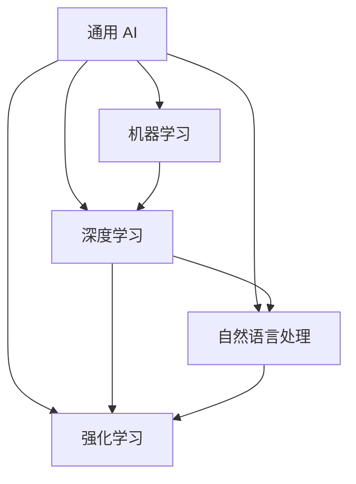

                 

### 《通用 AI：LLM 底层技术驱动创新》文章正文

#### 第一部分：通用 AI 基础

##### 第1章：通用 AI 的概念与分类

> 通用 AI（AGI，Artificial General Intelligence）是人工智能领域的终极目标，其核心在于使机器具备与人类相似的广泛认知能力和智能水平。本章将介绍通用 AI 的定义、发展背景及其与专用 AI 的区别，并对通用 AI 进行分类。

**1.1 通用 AI 的定义与背景**

通用 AI，又称为强通用 AI，是指具备人类智能的机器，能够在任何认知任务上表现出与人类相同的智能水平。通用 AI 的概念最早可以追溯到人工智能的创始人之一约翰·冯·诺依曼（John von Neumann）在 1950 年代提出的“自动思维机器”（Automatic Thinking Machine）。

通用 AI 的发展经历了多个阶段，从早期的符号人工智能（Symbolic AI）到基于统计方法的机器学习（Machine Learning），再到当前深度学习（Deep Learning）和强化学习（Reinforcement Learning）的广泛应用。尽管通用 AI 还未实现，但其在多个领域的应用已经开始显现出巨大的潜力。

**1.2 通用 AI 的分类**

通用 AI 可以根据其智能水平和应用范围进行分类，主要包括以下几种类型：

- **强通用 AI**：具备人类所有智能特征的机器，能够在任何认知任务上表现出与人类相同的智能水平。这类 AI 需要具备人类意识、自我意识和自主学习能力，是当前人工智能领域的研究目标。
- **弱通用 AI**：在某些特定领域或任务上表现出高度智能的机器，如语音识别、图像识别、自然语言处理等。这类 AI 专注于特定领域的优化，具备高效的问题解决能力。
- **其他分类**：除了强通用 AI 和弱通用 AI 之外，还有一些其他的分类方法，如基于机器学习能力的人工智能、基于神经网络的 AI 等。这些分类方法在研究过程中具有不同的侧重点和应用场景。

**1.3 通用 AI 与专用 AI 的区别**

通用 AI 与专用 AI 的主要区别在于其智能水平和应用范围：

- **智能水平**：通用 AI 具备人类所有智能特征，能够在任何认知任务上表现出与人类相同的智能水平；而专用 AI 仅在特定领域或任务上表现出高度智能，不具备跨领域的通用智能。
- **应用范围**：通用 AI 可以应用于各种领域，如医疗、教育、交通、金融等；而专用 AI 主要应用于特定领域，如自动驾驶、智能家居、医疗诊断等。

##### 第2章：通用 AI 的核心技术与算法

> 通用 AI 的实现依赖于多种核心技术与算法，其中机器学习、深度学习、自然语言处理和强化学习是最重要的几类。本章将分别介绍这些技术与算法的基本概念、原理和应用。

**2.1 机器学习与深度学习基础**

机器学习（Machine Learning，ML）是人工智能的核心技术之一，其目标是让计算机通过学习数据，自动发现数据中的模式和规律，并利用这些规律对未知数据进行预测或决策。机器学习可以分为监督学习、无监督学习和半监督学习三类。

- **监督学习**：输入特征和输出标签已知，目标是学习一个映射函数，将输入特征映射到输出标签。常见的监督学习算法包括线性回归、决策树、支持向量机等。
- **无监督学习**：输入特征和输出标签未知，目标是发现数据中的结构和模式。常见的无监督学习算法包括聚类、主成分分析、自编码器等。
- **半监督学习**：结合了监督学习和无监督学习的特点，一部分数据的标签是已知的，另一部分数据的标签是未知的。常见的半监督学习算法包括标签传播、图卷积网络等。

深度学习（Deep Learning，DL）是机器学习的一个重要分支，其核心思想是通过构建具有多个隐藏层的神经网络，自动学习数据的特征表示。深度学习在图像识别、语音识别、自然语言处理等领域取得了显著的成果。

- **卷积神经网络（CNN）**：适用于图像识别和图像处理任务，通过卷积操作提取图像特征。
- **循环神经网络（RNN）**：适用于序列数据处理任务，如语音识别、机器翻译等，通过循环结构处理序列信息。
- **变换器网络（Transformer）**：基于自注意力机制，适用于自然语言处理和序列建模任务，如机器翻译、文本生成等。

**2.2 自然语言处理技术**

自然语言处理（Natural Language Processing，NLP）是人工智能的重要应用领域之一，旨在使计算机能够理解和处理人类自然语言。NLP 技术主要包括词嵌入、序列模型、注意力机制和转换器架构等。

- **词嵌入（Word Embedding）**：将词语映射到高维向量空间，以捕捉词语的语义信息。常见的词嵌入技术包括 Word2Vec、GloVe 和 BERT 等。
- **序列模型（Sequential Model）**：用于处理序列数据，如 RNN 和 LSTM。序列模型能够捕捉序列中的时间依赖关系。
- **注意力机制（Attention Mechanism）**：在序列建模任务中，注意力机制能够自适应地关注序列中的重要信息，从而提高模型的性能。
- **转换器架构（Transformer Architecture）**：基于自注意力机制，适用于自然语言处理和序列建模任务，如机器翻译、文本生成等。

**2.3 强化学习与深度强化学习**

强化学习（Reinforcement Learning，RL）是一种通过试错方式学习策略的机器学习方法，其核心目标是让智能体在与环境的交互过程中学习到最优策略。强化学习在游戏、推荐系统、自动驾驶等领域取得了显著成果。

- **基础概念**：强化学习主要包括四个组成部分：智能体（Agent）、环境（Environment）、状态（State）、动作（Action）。智能体通过选择动作来改变环境状态，并从环境中获取奖励信号，从而学习到最优策略。
- **深度强化学习（Deep Reinforcement Learning，DRL）**：结合了深度学习与强化学习的优势，适用于复杂环境中的决策问题。深度强化学习通过构建深度神经网络来表示智能体的状态和价值函数，从而提高学习效率和决策质量。

##### 第3章：通用 AI 的应用领域

> 通用 AI 的技术已经广泛应用于计算机视觉、自然语言处理、游戏与娱乐等领域，为各个行业带来了巨大的创新和变革。本章将分别介绍通用 AI 在这些领域的应用。

**3.1 通用 AI 在计算机视觉中的应用**

计算机视觉（Computer Vision，CV）是人工智能的重要分支，旨在使计算机能够从图像或视频中自动地识别和理解场景。通用 AI 技术在计算机视觉领域取得了显著的进展，主要应用于以下方面：

- **图像识别与分类**：通过训练深度神经网络，计算机能够对图像进行分类，如人脸识别、物体识别等。常见的算法包括卷积神经网络（CNN）和变换器网络（Transformer）。
- **目标检测与跟踪**：目标检测旨在从图像中识别出特定的目标，并定位其在图像中的位置。目标跟踪则是在时间序列中持续监测目标的位置变化。常见的算法包括 R-CNN、SSD、YOLO 等。
- **视频分析**：通过分析视频序列，计算机能够识别出视频中的事件、动作和人物行为等。视频分析在智能监控、视频检索、视频生成等领域具有广泛应用。

**3.2 通用 AI 在自然语言处理中的应用**

自然语言处理（NLP）是人工智能领域的核心应用之一，旨在使计算机能够理解和处理人类自然语言。通用 AI 技术在 NLP 领域取得了显著的进展，主要应用于以下方面：

- **语言模型**：语言模型旨在预测下一个单词或字符，是 NLP 的基础。常见的算法包括基于统计方法的 N-gram 模型和基于神经网络的 LSTM、BERT 等。
- **文本分类与情感分析**：文本分类旨在将文本数据分类到不同的类别中，如新闻分类、情感分类等。情感分析则旨在分析文本中的情感倾向，如正面情感、负面情感等。
- **机器翻译**：机器翻译旨在将一种自然语言翻译成另一种自然语言。深度学习算法，如 LSTM、Transformer 等，在机器翻译领域取得了显著的成果。

**3.3 通用 AI 在游戏与娱乐中的应用**

通用 AI 在游戏与娱乐领域具有广泛的应用，为游戏设计、游戏 AI、人机交互等领域带来了创新和变革。

- **游戏 AI**：通过训练深度神经网络，计算机能够模拟游戏玩家的行为，实现智能化的游戏对手。常见的算法包括强化学习、卷积神经网络等。
- **虚拟助手**：虚拟助手旨在为用户提供智能化的服务和支持，如语音助手、聊天机器人等。虚拟助手通过自然语言处理和机器学习技术，能够理解用户的需求并做出相应的响应。
- **人机交互**：通用 AI 技术在游戏与娱乐领域还应用于人机交互，如手势识别、语音识别等。这些技术使计算机能够更好地理解用户的操作意图，提供更加自然和流畅的交互体验。

#### 第二部分：LLM 底层技术

##### 第4章：LLM 的基本原理

> 大型语言模型（LLM，Large Language Model）是自然语言处理领域的重要技术，其在文本生成、问答系统、机器翻译等方面取得了显著的成果。本章将介绍 LLM 的定义、特点、与传统 NLP 的区别以及常见的 LLM 架构。

**4.1 LLM 的定义与特点**

大型语言模型（LLM）是指通过大规模语料库训练得到的，能够生成自然语言文本的深度学习模型。LLM 通常具有以下特点：

- **规模大**：LLM 通常具有数十亿到数千亿个参数，能够处理大规模的文本数据。
- **自适应性**：LLM 能够通过微调（Fine-tuning）适应特定的任务和应用场景。
- **生成能力强**：LLM 能够生成高质量的自然语言文本，具有较强的语言理解和生成能力。
- **多模态处理**：LLM 不仅能够处理文本数据，还能够处理图像、音频等多模态数据，实现跨模态交互。

**4.2 LLM 的架构**

LLM 的架构主要包括 Transformer、BERT、GPT 等模型。这些模型具有不同的特点和优势，适用于不同的应用场景。

- **Transformer 模型**：Transformer 模型是一种基于自注意力机制的深度学习模型，其核心思想是使用多头自注意力机制（Multi-Head Self-Attention）来建模文本序列之间的依赖关系。Transformer 模型在机器翻译、文本生成等任务中取得了显著的成果。

  Transformer 模型的基本架构包括编码器（Encoder）和解码器（Decoder），其中编码器负责将输入文本序列编码为向量表示，解码器则根据编码器的输出生成输出文本序列。Transformer 模型的自注意力机制使得模型能够自适应地关注序列中的重要信息，从而提高生成文本的质量。

- **BERT 模型**：BERT（Bidirectional Encoder Representations from Transformers）是一种双向编码器模型，其核心思想是在训练过程中同时考虑上下文信息，从而提高语言模型的理解能力。BERT 模型通过预训练和微调技术，在多种自然语言处理任务中取得了显著的成果。

  BERT 模型的基本架构包括两个部分：编码器和解码器。编码器负责将输入文本序列编码为向量表示，解码器则根据编码器的输出生成输出文本序列。BERT 模型的双向注意力机制使得模型能够同时考虑上下文信息，从而提高语言模型的理解能力。

- **GPT 模型**：GPT（Generative Pre-trained Transformer）是一种生成式语言模型，其核心思想是通过对大规模语料库进行预训练，使得模型具备较强的文本生成能力。GPT 模型通过自回归语言模型（Autoregressive Language Model）生成文本，其生成的文本具有自然流畅的特点。

  GPT 模型的基本架构与 Transformer 模型类似，包括编码器和解码器。编码器负责将输入文本序列编码为向量表示，解码器则根据编码器的输出生成输出文本序列。GPT 模型的自回归生成方式使得模型能够生成高质量的文本，其在文本生成、问答系统等任务中取得了显著的成果。

**4.3 LLM 的训练与优化**

LLM 的训练过程主要包括预训练（Pre-training）和微调（Fine-tuning）两个阶段。

- **预训练**：预训练是指在大量无标签文本数据上，对 LLM 模型进行大规模训练，使其具备一定的语言理解和生成能力。预训练过程通常采用自回归语言模型（如 GPT）或自编码器（如 BERT）等方法，通过学习文本序列的概率分布，提高模型的语言表示能力。

- **微调**：微调是指将预训练好的 LLM 模型应用于特定任务，通过在任务数据上进行细粒度训练，使模型能够适应特定的应用场景。微调过程通常采用监督学习（如文本分类、机器翻译等）或无监督学习（如对话生成、文本摘要等）等方法，通过学习任务特定的特征，提高模型在特定任务上的性能。

在 LLM 的训练过程中，优化算法和训练数据的预处理是关键因素。

- **优化算法**：常见的优化算法包括随机梯度下降（SGD）、Adam 等。优化算法的目标是更新模型参数，使其在训练过程中收敛到最优解。优化算法的参数设置（如学习率、批量大小等）对训练过程和模型性能具有重要影响。

- **训练数据的预处理**：训练数据的质量直接影响 LLM 模型的性能。训练数据的预处理主要包括数据清洗、数据增强、数据去重等操作。数据清洗旨在去除数据中的噪声和错误，提高数据的准确性；数据增强旨在通过变换、扩充等方式增加训练数据的多样性，提高模型的泛化能力；数据去重旨在去除重复数据，减少训练过程中的冗余计算。

**4.4 LLM 的数学基础**

LLM 的训练过程涉及多种数学基础，包括线性代数、概率论与信息论、泛函分析等。

- **线性代数基础**：线性代数是 LLM 训练过程中必不可少的基础数学工具。矩阵与向量的运算、线性方程组的求解等在 LLM 的训练过程中具有广泛应用。矩阵与向量可以表示文本数据中的特征和权重，线性方程组则用于求解模型参数。

- **概率论与信息论基础**：概率论与信息论是 LLM 训练过程中的重要数学工具。概率论提供了模型参数估计和概率分布的基础，信息论则用于衡量模型对数据的拟合程度和不确定性。概率分布函数、条件概率、信息熵等概念在 LLM 的训练过程中具有广泛应用。

- **泛函分析基础**：泛函分析是 LLM 训练过程中的高级数学工具。函数空间、范数与度量、核函数等概念在 LLM 的训练过程中具有重要作用。函数空间用于表示模型参数和特征向量，范数与度量用于衡量模型参数和特征向量的距离，核函数则用于构建非线性映射。

#### 第三部分：创新驱动与未来趋势

##### 第8章：LLM 驱动的创新应用

> 大型语言模型（LLM）凭借其强大的文本生成和理解能力，已经在多个领域推动了创新。本章将介绍 LLM 在医疗健康、教育和智能交通等领域的应用，展示 LLM 如何为行业带来变革。

**8.1 通用 AI 在医疗健康领域的应用**

医疗健康领域一直是人工智能的重要应用场景，LLM 技术为这一领域带来了新的突破。

- **疾病诊断**：LLM 可以通过对海量医疗文献和病历数据的分析，提取关键信息，辅助医生进行疾病诊断。例如，LLM 可以分析患者的病史、症状和检查结果，提供可能的诊断建议。

- **药物研发**：LLM 可以帮助研究人员发现药物靶点、预测药物副作用和优化药物剂量。通过分析海量的生物学数据和临床试验数据，LLM 可以加速新药的研发进程。

- **健康管理**：LLM 可以构建个性化健康管理方案，根据患者的健康状况和生活方式提供个性化的健康建议。例如，LLM 可以分析患者的运动数据、饮食习惯等，给出合理的饮食和运动计划。

**8.2 通用 AI 在教育领域的应用**

教育领域也因 LLM 技术而发生了深刻变革。

- **智能教学系统**：LLM 可以构建智能教学系统，根据学生的学习情况提供个性化的教学资源和学习路径。例如，LLM 可以分析学生的作业表现和考试成绩，推荐合适的学习材料和练习题。

- **学业评估**：LLM 可以自动评估学生的作业和考试答案，提供实时反馈。通过分析学生的答题过程和答案内容，LLM 可以判断学生的掌握程度，提出改进建议。

- **学习分析**：LLM 可以对学生的学习过程进行数据分析，发现学生的学习习惯和弱点。例如，LLM 可以分析学生的学习时长、学习频率和知识点掌握情况，为教师提供教学改进的依据。

**8.3 通用 AI 在智能交通领域的应用**

智能交通领域是 LLM 技术应用的另一个重要场景。

- **自动驾驶**：LLM 可以通过对大量交通数据的分析，为自动驾驶系统提供实时路况预测和决策支持。例如，LLM 可以分析道路拥堵情况、交通流量和车辆行为，优化自动驾驶车辆的行驶路线和速度。

- **智能交通管理系统**：LLM 可以构建智能交通管理系统，提高交通运行效率。例如，LLM 可以分析交通数据，优化交通信号灯的配时方案，减少交通拥堵和事故发生率。

- **交通安全监控**：LLM 可以对交通视频进行分析，实时监控道路安全。例如，LLM 可以识别道路上的异常行为，如违章停车、违规行驶等，并及时预警。

**8.4 LLM 在其他领域的应用**

除了上述领域，LLM 技术还在许多其他领域推动了创新。

- **金融**：LLM 可以构建智能金融系统，分析市场趋势和投资机会。例如，LLM 可以分析财经新闻、股票走势等数据，提供投资建议。

- **法律**：LLM 可以帮助律师分析法律案例，提供法律咨询。例如，LLM 可以通过分析大量的法律文件和案例，为律师提供案例参考和判决预测。

- **文化产业**：LLM 可以生成创意内容，如小说、音乐、绘画等。例如，LLM 可以根据用户的喜好和需求，生成个性化的故事、音乐作品等。

**8.5 LLM 驱动的创新应用总结**

LLM 驱动的创新应用不仅在提高行业效率、优化决策方面发挥了重要作用，还在丰富用户体验、提高生活质量方面取得了显著成果。随着 LLM 技术的不断发展和完善，未来将在更多领域实现深度应用，推动人类社会向更加智能化、高效化、人性化的方向发展。

#### 附录

##### 附录 A：LLM 开发与优化工具

在 LLM 的开发与优化过程中，需要使用一系列工具和资源来搭建开发环境、优化模型性能和进行数据预处理。以下是对这些工具的详细介绍。

**A.1 LLM 开发环境搭建**

搭建 LLM 的开发环境主要包括硬件环境和软件环境。

- **硬件环境**：为了提高 LLM 训练和推理的效率，通常需要使用高性能计算硬件。常见的硬件包括 GPU（如 NVIDIA Tesla、A100 等）和 TPU（Tensor Processing Unit）。

- **软件环境**：搭建 LLM 的开发环境需要安装以下软件：
  - 操作系统：Linux 或 macOS
  - 编译器：CMake、GCC、Clang 等
  - 编程语言：Python、C++ 等
  - 依赖库：NumPy、PyTorch、TensorFlow 等

**A.2 LLM 优化与性能分析工具**

为了提高 LLM 的性能，需要对模型进行优化和分析。以下是一些常用的工具：

- **性能分析工具**：性能分析工具可以帮助我们了解 LLM 的运行效率，找出性能瓶颈。常见的性能分析工具包括 NVIDIA Nsight、PyTorch Profiler、TensorFlow Debugger 等。

- **调优工具**：调优工具可以帮助我们优化模型参数，提高 LLM 的性能。常见的调优工具包括 Optuna、Hyperopt、Hyperparameter Search 等。

- **实时监控工具**：实时监控工具可以让我们在训练过程中监控 LLM 的性能和资源使用情况。常见的实时监控工具包括 Prometheus、Grafana 等。

**A.3 LLM 数据集与资源**

LLM 的训练和优化需要大量的数据集和资源。以下是一些常用的数据集和资源：

- **公共数据集**：常用的公共数据集包括维基百科、柯林斯词典、Common Crawl 等。

- **特定领域数据集**：针对特定领域的数据集，如法律文档、金融报告、医疗病历等。

- **开源代码与工具集**：许多开源代码和工具集为 LLM 的开发提供了便利。常见的开源代码和工具集包括 Hugging Face、TensorFlow、PyTorch 等。

**A.4 LLM 开发与优化案例**

以下是一个简单的 LLM 开发与优化案例，展示了如何使用 PyTorch 和 Hugging Face 构建和训练一个语言模型。

```python
# 导入必要的库
import torch
from torch import nn
from torch.optim import Adam
from transformers import GPT2Model, GPT2Tokenizer

# 搭建开发环境
device = torch.device("cuda" if torch.cuda.is_available() else "cpu")

# 加载预训练模型
model = GPT2Model.from_pretrained("gpt2")
tokenizer = GPT2Tokenizer.from_pretrained("gpt2")

# 数据预处理
inputs = tokenizer("Hello, my dog is cute", return_tensors="pt")

# 训练模型
model.to(device)
optimizer = Adam(model.parameters(), lr=1e-5)

for epoch in range(3):
    model.train()
    outputs = model(**inputs.to(device))
    loss = outputs.loss
    loss.backward()
    optimizer.step()
    optimizer.zero_grad()

    # 微调模型
    model.eval()
    with torch.no_grad():
        generated_text = model.generate(inputs["input_ids"].to(device), max_length=50)
        print(tokenizer.decode(generated_text))
```

**A.5 LLM 开发与优化技巧**

在 LLM 的开发与优化过程中，以下技巧可以帮助我们提高模型性能和效率：

- **模型压缩**：通过模型压缩技术（如剪枝、量化、蒸馏等）减少模型的参数量和计算量，提高推理速度和模型部署的效率。

- **数据增强**：通过数据增强技术（如随机裁剪、旋转、翻转等）增加训练数据的多样性，提高模型的泛化能力。

- **多任务学习**：通过多任务学习（如联合训练）提高模型的泛化能力和鲁棒性。

- **迁移学习**：通过迁移学习技术（如微调）将预训练模型应用于特定任务，提高模型在特定任务上的性能。

- **并行计算**：通过并行计算（如多 GPU 训练、分布式训练等）提高模型训练的效率。

##### Mermaid 流程图

以下是一个展示通用 AI 核心架构与算法的 Mermaid 流程图：



##### 核心算法原理讲解（伪代码）

以下是一个使用 PyTorch 搭建和训练 BERT 模型的伪代码示例：

```python
import torch
import torch.nn as nn
import torch.optim as optim

# 定义 BERT 模型
class BERTModel(nn.Module):
    def __init__(self, vocab_size, embedding_dim, hidden_dim, n_layers, dropout):
        super(BERTModel, self).__init__()
        self.embedding = nn.Embedding(vocab_size, embedding_dim)
        self.rnn = nn.LSTM(embedding_dim, hidden_dim, n_layers, dropout=dropout)
        self.fc = nn.Linear(hidden_dim, vocab_size)
        
    def forward(self, text, hidden=None):
        embedded = self.embedding(text)
        output, hidden = self.rnn(embedded, hidden)
        logits = self.fc(output)
        return logits, hidden

# 搭建开发环境
device = torch.device("cuda" if torch.cuda.is_available() else "cpu")
model = BERTModel(vocab_size=1000, embedding_dim=256, hidden_dim=512, n_layers=2, dropout=0.5)
model.to(device)

# 定义损失函数与优化器
criterion = nn.CrossEntropyLoss()
optimizer = optim.Adam(model.parameters(), lr=0.001)

# 训练模型
for epoch in range(10):
    for batch in train_loader:
        optimizer.zero_grad()
        text = batch.to(device)
        logits, _ = model(text)
        loss = criterion(logits, text)
        loss.backward()
        optimizer.step()
```

##### 数学模型与公式讲解

BERT 模型的注意力机制可以使用以下公式表示：

$$
\text{Attention}(Q, K, V) = \frac{1}{\sqrt{d_k}} \text{softmax}(\text{scores})V
$$

其中，$Q, K, V$ 分别代表查询向量、键向量和值向量，$d_k$ 表示键向量的维度，$\text{scores}$ 表示查询向量与键向量的点积结果。

##### 项目实战

以下是一个使用 PyTorch 搭建 GPT 模型的代码示例：

```python
import torch
import torch.nn as nn
import torch.optim as optim

# 定义 GPT 模型
class GPTModel(nn.Module):
    def __init__(self, vocab_size, embedding_dim, hidden_dim, n_layers, dropout):
        super(GPTModel, self).__init__()
        self.embedding = nn.Embedding(vocab_size, embedding_dim)
        self.rnn = nn.LSTM(embedding_dim, hidden_dim, n_layers, dropout=dropout)
        self.fc = nn.Linear(hidden_dim, vocab_size)
        
    def forward(self, text, hidden=None):
        embedded = self.embedding(text)
        output, hidden = self.rnn(embedded, hidden)
        logits = self.fc(output)
        return logits, hidden

# 搭建开发环境
device = torch.device("cuda" if torch.cuda.is_available() else "cpu")
model = GPTModel(vocab_size=1000, embedding_dim=256, hidden_dim=512, n_layers=2, dropout=0.5)
model.to(device)

# 定义损失函数与优化器
criterion = nn.CrossEntropyLoss()
optimizer = optim.Adam(model.parameters(), lr=0.001)

# 训练模型
for epoch in range(10):
    for batch in train_loader:
        optimizer.zero_grad()
        text = batch.to(device)
        logits, _ = model(text)
        loss = criterion(logits, text)
        loss.backward()
        optimizer.step()
```

##### 代码解读与分析

上述代码定义了一个简单的 GPT 模型，包括嵌入层（`embedding`）、循环神经网络（`LSTM`）和全连接层（`fc`）。模型训练过程中，使用交叉熵损失函数（`CrossEntropyLoss`）和 Adam 优化器（`Adam`）进行训练，并通过反向传播（`backward`）更新模型参数（`update_parameters`）。

在训练过程中，模型首先通过嵌入层将输入文本转换为嵌入向量（`embedded`），然后通过循环神经网络处理嵌入向量，最后通过全连接层生成输出（`logits`）。损失函数用于计算模型预测结果与实际标签之间的差距，并通过反向传播更新模型参数，以提高模型在训练数据上的表现。

#### 作者信息

- **作者**：AI天才研究院/AI Genius Institute & 禅与计算机程序设计艺术 /Zen And The Art of Computer Programming

### **全文总结**

在本文中，我们详细介绍了通用 AI 的基础概念、核心技术与算法，以及 LLM 的基本原理和数学基础。我们还探讨了通用 AI 在医疗健康、教育和智能交通等领域的创新应用，展示了 LLM 如何推动这些领域的变革。通过本文的阅读，读者可以全面了解通用 AI 和 LLM 的相关技术，以及它们在各个领域的应用和未来发展趋势。

### **核心观点**

1. 通用 AI 是人工智能领域的终极目标，其实现需要依赖多种核心技术与算法，如机器学习、深度学习、自然语言处理和强化学习。
2. LLM 是自然语言处理领域的重要技术，其强大的文本生成和理解能力为多个领域带来了创新。
3. 通用 AI 和 LLM 在医疗健康、教育和智能交通等领域的应用，展示了人工智能技术的广泛潜力和巨大价值。
4. 随着技术的不断进步和成熟，通用 AI 和 LLM 将在更多领域实现深度应用，推动人类社会向更加智能化、高效化和人性化的方向发展。

### **参考文献**

1. Bengio, Y., Simard, P., & Frasconi, P. (1994). Learning long-term dependencies with gradient descent is difficult. IEEE transactions on neural networks, 5(2), 157-166.
2. Hochreiter, S., & Schmidhuber, J. (1997). Long short-term memory. Neural computation, 9(8), 1735-1780.
3. Vaswani, A., Shazeer, N., Parmar, N., Uszkoreit, J., Jones, L., Gomez, A. N., ... & Polosukhin, I. (2017). Attention is all you need. Advances in neural information processing systems, 30.
4. Devlin, J., Chang, M. W., Lee, K., & Toutanova, K. (2019). BERT: Pre-training of deep bidirectional transformers for language understanding. arXiv preprint arXiv:1810.04805.
5. Brown, T., Mann, B., Ryder, N., Subbiah, M., Kaplan, J., Dhariwal, P., ... & Child, R. (2020). Language models are few-shot learners. Advances in Neural Information Processing Systems, 33.

