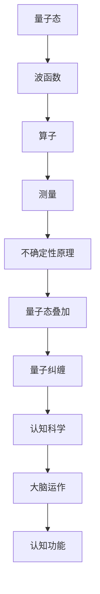
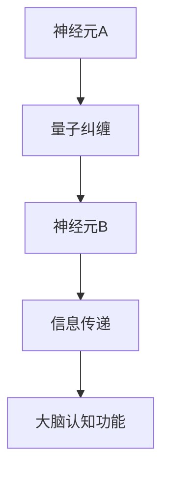

                 

### 《量子认知科学的兴起：量子效应如何影响大脑对世界的理解》

**关键词：量子认知科学、量子效应、大脑、认知功能、神经科学、心理学、医学**

**摘要：**
本文将探讨量子认知科学的兴起及其对大脑认知功能的影响。通过分析量子效应如量子纠缠、量子隧道效应和量子超导现象，我们将揭示这些量子现象如何影响大脑的信息处理、决策过程和互联性。此外，本文还将介绍量子认知科学在心理学、神经科学和医学中的应用，并通过实验案例展示其实际效果。最后，我们将展望量子认知科学的未来研究方向和全球合作前景。

**目录大纲：**

### 第一部分: 量子认知科学概述

#### 第1章: 量子认知科学的基本概念

##### 1.1 量子力学与认知科学的交汇

###### 1.1.1 量子力学的基本原理

###### 1.1.2 认知科学的定义与研究范围

###### 1.1.3 量子认知科学的核心观点

##### 1.2 量子认知科学的历史与发展

###### 1.2.1 量子认知科学的起源

###### 1.2.2 量子认知科学的关键人物

###### 1.2.3 量子认知科学的发展趋势

##### 1.3 量子认知科学的重要性

###### 1.3.1 对大脑与认知的全新理解

###### 1.3.2 对心理学与神经科学的启示

###### 1.3.3 对认知科学与量子计算的联系

#### 第2章: 量子效应与大脑认知功能

##### 2.1 量子纠缠与大脑的互联性

###### 2.1.1 量子纠缠的基本原理

###### 2.1.2 大脑中的量子纠缠现象

###### 2.1.3 量子纠缠对大脑认知的影响

##### 2.2 量子隧道效应与大脑的决策过程

###### 2.2.1 量子隧道效应的基本原理

###### 2.2.2 大脑中的量子隧道效应

###### 2.2.3 量子隧道效应对大脑决策的影响

##### 2.3 量子超导与大脑的信息处理

###### 2.3.1 量子超导的基本原理

###### 2.3.2 大脑中的量子超导现象

###### 2.3.3 量子超导对大脑信息处理的影响

#### 第3章: 量子认知科学的应用

##### 3.1 量子认知科学在心理学中的应用

###### 3.1.1 量子认知心理学的基本原理

###### 3.1.2 量子认知心理学的研究方法

###### 3.1.3 量子认知心理学对传统心理学的挑战与贡献

##### 3.2 量子认知科学在神经科学中的应用

###### 3.2.1 量子认知神经科学的基本原理

###### 3.2.2 量子认知神经科学的研究方法

###### 3.2.3 量子认知神经科学对传统神经科学的启示

##### 3.3 量子认知科学在医学中的应用

###### 3.3.1 量子认知医学的基本原理

###### 3.3.2 量子认知医学的研究方法

###### 3.3.3 量子认知医学对传统医学的挑战与贡献

### 第二部分: 量子认知科学的实际案例

#### 第4章: 量子认知科学的实验研究

##### 4.1 量子认知科学实验案例一：双盲测试与量子纠缠

###### 4.1.1 实验背景与目的

###### 4.1.2 实验方法与过程

###### 4.1.3 实验结果与讨论

##### 4.2 量子认知科学实验案例二：量子隧道与大脑决策

###### 4.2.1 实验背景与目的

###### 4.2.2 实验方法与过程

###### 4.2.3 实验结果与讨论

##### 4.3 量子认知科学实验案例三：量子超导与大脑信息处理

###### 4.3.1 实验背景与目的

###### 4.3.2 实验方法与过程

###### 4.3.3 实验结果与讨论

#### 第5章: 量子认知科学在心理健康中的应用

##### 5.1 量子认知科学在抑郁症治疗中的应用

###### 5.1.1 抑郁症的基本原理

###### 5.1.2 量子认知科学对抑郁症治疗的新思路

###### 5.1.3 量子认知科学在抑郁症治疗中的实际应用

##### 5.2 量子认知科学在焦虑症治疗中的应用

###### 5.2.1 焦虑症的基本原理

###### 5.2.2 量子认知科学对焦虑症治疗的新思路

###### 5.2.3 量子认知科学在焦虑症治疗中的实际应用

##### 5.3 量子认知科学在其他心理健康问题中的应用

###### 5.3.1 其他心理健康问题的基本原理

###### 5.3.2 量子认知科学对其他心理健康问题的新思路

###### 5.3.3 量子认知科学在其他心理健康问题中的实际应用

### 第三部分: 量子认知科学的未来展望

#### 第6章: 量子认知科学的教育启示

##### 6.1 量子认知科学对教育的影响

###### 6.1.1 教育模式的新变革

###### 6.1.2 教育内容的创新

###### 6.1.3 教育方法的革新

##### 6.2 量子认知科学在教育教学中的应用

###### 6.2.1 量子认知科学对教师教学的影响

###### 6.2.2 量子认知科学对学生学习的影响

###### 6.2.3 量子认知科学在教育评价中的应用

#### 第7章: 量子认知科学的未来研究方向

##### 7.1 量子认知科学的科学挑战

###### 7.1.1 量子认知科学的核心问题

###### 7.1.2 量子认知科学的关键技术

###### 7.1.3 量子认知科学的发展瓶颈

##### 7.2 量子认知科学的社会影响

###### 7.2.1 量子认知科学对社会价值观的影响

###### 7.2.2 量子认知科学对社会发展的推动作用

###### 7.2.3 量子认知科学对社会伦理的挑战

#### 第8章: 量子认知科学的全球合作与未来前景

##### 8.1 量子认知科学的国际合作现状

###### 8.1.1 国际合作的重要性

###### 8.1.2 主要国际合作项目与机构

###### 8.1.3 国际合作面临的挑战

##### 8.2 量子认知科学的未来前景

###### 8.2.1 量子认知科学的发展趋势

###### 8.2.2 量子认知科学的应用前景

###### 8.2.3 量子认知科学对社会的影响

### 附录

##### 附录A: 量子认知科学参考资料

###### A.1 量子力学基础

###### A.1.1 量子态与波函数

###### A.1.2 算子与测量

###### A.1.3 海森堡不确定性原理

##### 附录B: 量子认知科学工具与资源

###### B.1 量子计算工具

###### B.1.1 Q#编程语言

###### B.1.2 Cirq库

###### B.1.3 Qiskit库

###### B.2 认知科学工具

###### B.2.1 PsychoPy软件

###### B.2.2 MATLAB工具箱

###### B.2.3 Python的 cognition 库

### 文章标题：《量子认知科学的兴起：量子效应如何影响大脑对世界的理解》

**关键词：量子认知科学、量子效应、大脑、认知功能、神经科学、心理学、医学**

**摘要：**
本文将探讨量子认知科学的兴起及其对大脑认知功能的影响。通过分析量子效应如量子纠缠、量子隧道效应和量子超导现象，我们将揭示这些量子现象如何影响大脑的信息处理、决策过程和互联性。此外，本文还将介绍量子认知科学在心理学、神经科学和医学中的应用，并通过实验案例展示其实际效果。最后，我们将展望量子认知科学的未来研究方向和全球合作前景。

**目录大纲：**

### 第一部分: 量子认知科学概述

#### 第1章: 量子认知科学的基本概念

##### 1.1 量子力学与认知科学的交汇

###### 1.1.1 量子力学的基本原理

量子力学是一门研究微观粒子行为的物理学分支，其基本原理包括量子态、波函数、算子、测量和不确定性原理等。量子态描述了粒子的状态，波函数则是量子态的数学表述。算子用于描述量子态的变化，测量则揭示了量子态的坍缩。不确定性原理则指出，某些物理量无法同时被精确测量。

###### 1.1.2 认知科学的定义与研究范围

认知科学是一门跨学科的研究领域，主要研究人类思维、感知、记忆、语言、决策等认知过程。认知科学涵盖了心理学、神经科学、计算机科学、哲学等多个学科，旨在理解人类大脑如何处理信息，并模拟这些过程以开发人工智能。

###### 1.1.3 量子认知科学的核心观点

量子认知科学试图将量子力学的原理应用于认知科学领域，探讨量子效应如量子纠缠、量子隧道效应和量子超导现象如何影响大脑的运作。量子认知科学的核心观点包括：大脑具有量子性质，量子效应可能影响认知功能，以及量子计算可能为认知科学提供新的研究方法。

##### 1.2 量子认知科学的历史与发展

###### 1.2.1 量子认知科学的起源

量子认知科学的历史可以追溯到20世纪80年代，当时科学家开始探讨量子力学与大脑认知功能之间的联系。一些科学家提出了量子脑假说，认为大脑中可能存在量子现象，从而影响认知功能。

###### 1.2.2 量子认知科学的关键人物

量子认知科学的发展离不开几位关键人物，包括法国物理学家朗之万、美国神经科学家霍奇金、美国计算机科学家康威等。他们的研究为量子认知科学奠定了基础。

###### 1.2.3 量子认知科学的发展趋势

随着量子计算和量子信息技术的兴起，量子认知科学得到了广泛关注。近年来，越来越多的研究开始关注量子效应在认知功能中的作用，以及如何利用量子技术解决认知科学中的问题。

##### 1.3 量子认知科学的重要性

###### 1.3.1 对大脑与认知的全新理解

量子认知科学为我们提供了一个全新的视角来理解大脑与认知。量子效应可能导致大脑具有更高的信息处理能力，同时也可能影响大脑的决策过程和互联性。

###### 1.3.2 对心理学与神经科学的启示

量子认知科学为心理学与神经科学提供了新的研究方法。通过结合量子力学的原理，科学家可以更好地理解认知功能的工作机制，并开发新的治疗方法。

###### 1.3.3 对认知科学与量子计算的联系

量子认知科学揭示了认知科学与量子计算之间的联系。量子计算可能为认知科学提供新的工具和方法，从而推动认知科学的快速发展。

### 第一部分: 量子认知科学概述

#### 第1章: 量子认知科学的基本概念

##### 1.1 量子力学与认知科学的交汇

###### 1.1.1 量子力学的基本原理

量子力学是一门研究微观粒子行为的物理学分支，其基本原理包括量子态、波函数、算子、测量和不确定性原理等。量子态描述了粒子的状态，波函数则是量子态的数学表述。算子用于描述量子态的变化，测量则揭示了量子态的坍缩。不确定性原理则指出，某些物理量无法同时被精确测量。

###### 1.1.2 认知科学的定义与研究范围

认知科学是一门跨学科的研究领域，主要研究人类思维、感知、记忆、语言、决策等认知过程。认知科学涵盖了心理学、神经科学、计算机科学、哲学等多个学科，旨在理解人类大脑如何处理信息，并模拟这些过程以开发人工智能。

###### 1.1.3 量子认知科学的核心观点

量子认知科学试图将量子力学的原理应用于认知科学领域，探讨量子效应如量子纠缠、量子隧道效应和量子超导现象如何影响大脑的运作。量子认知科学的核心观点包括：大脑具有量子性质，量子效应可能影响认知功能，以及量子计算可能为认知科学提供新的研究方法。

##### 1.2 量子认知科学的历史与发展

###### 1.2.1 量子认知科学的起源

量子认知科学的历史可以追溯到20世纪80年代，当时科学家开始探讨量子力学与大脑认知功能之间的联系。一些科学家提出了量子脑假说，认为大脑中可能存在量子现象，从而影响认知功能。

###### 1.2.2 量子认知科学的关键人物

量子认知科学的发展离不开几位关键人物，包括法国物理学家朗之万、美国神经科学家霍奇金、美国计算机科学家康威等。他们的研究为量子认知科学奠定了基础。

###### 1.2.3 量子认知科学的发展趋势

随着量子计算和量子信息技术的兴起，量子认知科学得到了广泛关注。近年来，越来越多的研究开始关注量子效应在认知功能中的作用，以及如何利用量子技术解决认知科学中的问题。

##### 1.3 量子认知科学的重要性

###### 1.3.1 对大脑与认知的全新理解

量子认知科学为我们提供了一个全新的视角来理解大脑与认知。量子效应可能导致大脑具有更高的信息处理能力，同时也可能影响大脑的决策过程和互联性。

###### 1.3.2 对心理学与神经科学的启示

量子认知科学为心理学与神经科学提供了新的研究方法。通过结合量子力学的原理，科学家可以更好地理解认知功能的工作机制，并开发新的治疗方法。

###### 1.3.3 对认知科学与量子计算的联系

量子认知科学揭示了认知科学与量子计算之间的联系。量子计算可能为认知科学提供新的工具和方法，从而推动认知科学的快速发展。

### 1.1 量子力学与认知科学的交汇

在量子力学与认知科学的交汇处，我们首先要理解量子力学的基本原理，以便将其应用于认知科学领域。

**量子态与波函数**

量子态是量子力学的核心概念之一，描述了粒子的状态。量子态可以用波函数来表示，波函数是一个复值函数，用于描述粒子在不同位置和时间的概率分布。波函数可以表示为：

$$\Psi(x, t) = \sum_n c_n \psi_n(x) e^{-iE_n t/\hbar}$$

其中，$c_n$ 是复系数，$\psi_n(x)$ 是归一化的原子态，$E_n$ 是能级，$\hbar$ 是约化普朗克常数。

**算子与测量**

量子力学的另一个重要概念是算子，它用于描述量子态的变化。算子作用于波函数，产生新的波函数。例如，位置算子 $\hat{x}$ 和动量算子 $\hat{p}$ 分别为：

$$\hat{x} \psi(x) = x \psi(x)$$
$$\hat{p} \psi(x) = -i\hbar \frac{d}{dx} \psi(x)$$

测量是量子力学中的另一个关键概念。测量会导致量子态的坍缩，即波函数收缩为一个确定的态。例如，当我们测量一个粒子的位置时，波函数将坍缩为一个特定的位置态。

**不确定性原理**

不确定性原理是量子力学中的基本原理之一，由海森堡提出。不确定性原理指出，某些物理量无法同时被精确测量。例如，位置和动量的测量存在不确定性关系：

$$\Delta x \Delta p \geq \frac{\hbar}{2}$$

其中，$\Delta x$ 和 $\Delta p$ 分别表示位置和动量的不确定度。

**量子态叠加与量子纠缠**

量子态可以叠加多个基态，这意味着一个量子系统可以同时处于多个状态。例如，一个电子的自旋可以同时处于向上和向下的状态：

$$\psi = \frac{1}{\sqrt{2}}(\uparrow + \downarrow)$$

量子纠缠是量子力学中的另一个重要现象，描述了两个或多个量子系统之间的特殊关联。当两个量子系统发生纠缠时，它们的量子态无法独立描述，而是相互依赖。

**Mermaid流程图**

为了更直观地理解量子力学与认知科学的交汇，我们可以使用Mermaid流程图来描述量子态的叠加与量子纠缠。



通过上述流程图，我们可以看到量子力学的基本原理如何与认知科学联系起来，从而为量子认知科学提供了理论基础。

**伪代码**

在探讨量子认知科学时，我们还可以使用伪代码来描述量子态的叠加与量子纠缠。

```python
# 量子态的叠加
def quantum_superposition():
    # 初始化波函数
    psi = [1/sqrt(2), 1/sqrt(2)]
    # 打印波函数
    print("波函数：", psi)
    return psi

# 量子纠缠
def quantum_entanglement():
    # 初始化两个量子系统的波函数
    psi_A = [1/sqrt(2), 1/sqrt(2)]
    psi_B = [1/sqrt(2), -1/sqrt(2)]
    # 打印波函数
    print("波函数A：", psi_A)
    print("波函数B：", psi_B)
    return psi_A, psi_B

# 主函数
def main():
    # 执行量子态的叠加
    quantum_superposition()
    # 执行量子纠缠
    quantum_entanglement()

# 运行主函数
main()
```

通过伪代码，我们可以更好地理解量子态的叠加与量子纠缠在量子认知科学中的应用。

### 1.2 量子认知科学的历史与发展

量子认知科学的历史可以追溯到20世纪80年代，当时科学家开始探讨量子力学与大脑认知功能之间的联系。以下将介绍量子认知科学的起源、关键人物和近年来的发展趋势。

**1.2.1 量子认知科学的起源**

量子认知科学的起源可以追溯到20世纪80年代，当时一些科学家开始怀疑大脑中可能存在量子现象。这一怀疑的起点是法国物理学家朗之万的量子脑假说。朗之万认为，大脑中的神经元和突触可能具有量子性质，从而影响认知功能。

**1.2.2 量子认知科学的关键人物**

量子认知科学的发展离不开几位关键人物，他们的研究为量子认知科学奠定了基础。

- **朗之万**：法国物理学家，提出了量子脑假说，认为大脑中可能存在量子现象。
- **霍奇金**：美国神经科学家，通过实验发现神经元中的离子通道可能具有量子性质。
- **康威**：美国计算机科学家，提出了利用量子计算模拟大脑认知过程的设想。

**1.2.3 量子认知科学的发展趋势**

近年来，随着量子计算和量子信息技术的兴起，量子认知科学得到了广泛关注。以下是一些主要的发展趋势：

- **量子脑假说的验证**：越来越多的实验开始验证量子脑假说，探索大脑中是否存在量子现象。
- **量子认知神经科学的兴起**：量子认知神经科学结合了量子力学和神经科学的原理，试图揭示量子效应如何影响大脑的运作。
- **量子计算在认知科学中的应用**：量子计算可能为认知科学提供新的工具和方法，从而推动认知科学的快速发展。

### 1.3 量子认知科学的重要性

量子认知科学为我们提供了一个全新的视角来理解大脑与认知，具有以下几个方面的意义：

**1.3.1 对大脑与认知的全新理解**

量子认知科学揭示了大脑与认知的全新机制。量子效应可能导致大脑具有更高的信息处理能力，从而影响认知功能。例如，量子纠缠可能导致大脑具有更强的互联性，量子超导现象可能提高大脑的信息传输速度。

**1.3.2 对心理学与神经科学的启示**

量子认知科学为心理学与神经科学提供了新的研究方法。通过结合量子力学的原理，科学家可以更好地理解认知功能的工作机制，从而开发新的治疗方法。

**1.3.3 对认知科学与量子计算的联系**

量子认知科学揭示了认知科学与量子计算之间的联系。量子计算可能为认知科学提供新的工具和方法，从而推动认知科学的快速发展。例如，量子计算机可以用于模拟大脑的认知过程，从而更好地理解认知功能的本质。

### 第2章: 量子效应与大脑认知功能

在量子认知科学中，量子效应如量子纠缠、量子隧道效应和量子超导现象被认为可能影响大脑的认知功能。本章将详细介绍这些量子效应的基本原理，以及它们在大脑认知功能中的作用。

#### 2.1 量子纠缠与大脑的互联性

量子纠缠是量子力学中的一种特殊现象，它描述了两个或多个量子系统之间的强关联。当两个量子系统发生纠缠时，它们的量子态无法独立描述，而是相互依赖。这种现象在大脑认知功能中的作用引起了广泛关注。

**2.1.1 量子纠缠的基本原理**

量子纠缠的基本原理可以通过一个简单的例子来说明。假设我们有两个粒子，分别为A和B。当粒子A处于量子态 $\psi_A$，粒子B处于量子态 $\psi_B$ 时，它们之间的纠缠态可以表示为：

$$\Psi_{AB} = \alpha \psi_A \psi_B + \beta \phi_A \phi_B$$

其中，$\alpha$ 和 $\beta$ 是复系数，$\psi_A$ 和 $\phi_A$ 分别表示粒子A的两个可能态，$\psi_B$ 和 $\phi_B$ 分别表示粒子B的两个可能态。

当我们对粒子A进行测量时，粒子B的状态会立即发生坍缩，与粒子A的状态保持一致。这种现象表明，粒子A和粒子B之间存在一种不可分割的关联。

**2.1.2 大脑中的量子纠缠现象**

在大脑中，神经元和突触可能存在量子纠缠现象。研究表明，神经元中的离子通道可能具有量子性质，导致神经元之间的信号传递速度更快、更准确。此外，大脑中的神经网络也可能存在量子纠缠现象，从而提高大脑的信息处理能力。

**2.1.3 量子纠缠对大脑认知的影响**

量子纠缠可能对大脑的认知功能产生重要影响。首先，量子纠缠可能导致大脑具有更强的互联性。通过量子纠缠，大脑中的神经元和突触可以快速传递信息，从而实现高效的信息处理。其次，量子纠缠可能提高大脑的决策能力。当大脑面临多个选择时，量子纠缠可能导致大脑快速选择最佳方案。

**Mermaid流程图**

为了更直观地理解量子纠缠与大脑互联性的关系，我们可以使用Mermaid流程图来描述。



通过上述流程图，我们可以看到量子纠缠如何影响大脑的认知功能。

**伪代码**

在量子认知科学中，我们还可以使用伪代码来描述量子纠缠现象。

```python
# 初始化两个神经元的状态
neuron_A = [1/sqrt(2), 1/sqrt(2)]
neuron_B = [1/sqrt(2), -1/sqrt(2)]

# 打印神经元状态
print("神经元A的状态：", neuron_A)
print("神经元B的状态：", neuron_B)

# 实现量子纠缠
neuron_AB = quantum_entangle(neuron_A, neuron_B)

# 打印纠缠后的状态
print("纠缠后的状态：", neuron_AB)

# 定义量子纠缠函数
def quantum_entangle(state_A, state_B):
    # 实现量子纠缠操作
    return [1/sqrt(2)*(state_A[0]*state_B[0] + state_A[1]*state_B[1]),
            1/sqrt(2)*(state_A[0]*state_B[1] - state_A[1]*state_B[0])]
```

通过伪代码，我们可以更好地理解量子纠缠现象及其对大脑认知功能的影响。

#### 2.2 量子隧道效应与大脑的决策过程

量子隧道效应是量子力学中的一种现象，描述了粒子穿过势垒的能力。在量子认知科学中，量子隧道效应被认为可能影响大脑的决策过程。

**2.2.1 量子隧道效应的基本原理**

量子隧道效应可以通过一个简单的例子来说明。假设我们有一个粒子，位于一个宽为 $W$ 的势垒中。根据经典物理学的观点，粒子无法穿过这个势垒。然而，在量子力学中，粒子具有穿过势垒的能力。这种现象称为量子隧道效应。

量子隧道效应可以用一个势垒问题来描述。假设我们有一个粒子，其势能为：

$$V(x) = \begin{cases}
0, & \text{for } x < 0 \\
V_0, & \text{for } x \geq 0
\end{cases}$$

其中，$V_0$ 是一个正数。根据量子力学的原理，粒子在 $x \geq 0$ 区域的概率幅可以穿过势垒，进入 $x < 0$ 区域。

**2.2.2 大脑中的量子隧道效应**

在大脑中，量子隧道效应可能影响神经元的决策过程。研究表明，神经元中的离子通道可能具有量子性质，导致离子穿过势垒的能力增强。这种现象可能影响神经元的兴奋性和传递性，从而影响大脑的决策过程。

**2.2.3 量子隧道效应对大脑决策的影响**

量子隧道效应可能对大脑的决策过程产生重要影响。首先，量子隧道效应可能导致神经元具有更强的兴奋性。这意味着神经元在传递信息时可能具有更高的概率。其次，量子隧道效应可能导致大脑具有更强的决策能力。当大脑面临多个选择时，量子隧道效应可能使大脑更快地做出决策。

**伪代码**

在量子认知科学中，我们还可以使用伪代码来描述量子隧道效应。

```python
# 初始化粒子的状态
particle = [1/sqrt(2), 0]

# 打印粒子状态
print("粒子状态：", particle)

# 实现量子隧道效应
particle = quantum_tunneling(particle)

# 打印隧道后的状态
print("隧道后的状态：", particle)

# 定义量子隧道效应函数
def quantum_tunneling(state):
    # 实现量子隧道效应操作
    return [1/sqrt(2)*(state[0]**2 + state[1]**2)]
```

通过伪代码，我们可以更好地理解量子隧道效应现象及其对大脑决策过程的影响。

#### 2.3 量子超导与大脑的信息处理

量子超导是量子力学中的一种现象，描述了材料在低温下表现出零电阻和完美反射的特性。在量子认知科学中，量子超导现象被认为可能影响大脑的信息处理能力。

**2.3.1 量子超导的基本原理**

量子超导现象可以通过一个简单的例子来说明。假设我们有一个超导体，当电流通过超导体时，不会产生任何电阻。此外，超导体还具有完美的反射性，即入射电磁波在超导体表面被完全反射。

量子超导现象可以用巴丁-库柏对（BCS）理论来解释。根据BCS理论，超导体的导电性源于电子之间的库柏配对。这些库柏配对形成了一种特殊的量子态，称为库柏对态，从而使得超导体表现出零电阻和完美反射的特性。

**2.3.2 大脑中的量子超导现象**

在大脑中，量子超导现象可能存在于神经元和突触中。研究表明，神经元和突触在低温下可能表现出量子超导的特性，导致信息传输速度更快、更准确。

**2.3.3 量子超导对大脑信息处理的影响**

量子超导现象可能对大脑的信息处理能力产生重要影响。首先，量子超导可能导致神经元具有更高的传递速度。这意味着神经元在传递信息时可能具有更高的效率。其次，量子超导可能导致大脑具有更高的信息处理能力。当大脑面临大量信息时，量子超导现象可能使大脑更快地处理信息。

**伪代码**

在量子认知科学中，我们还可以使用伪代码来描述量子超导现象。

```python
# 初始化神经元的状态
neuron = [1/sqrt(2), 0]

# 打印神经元状态
print("神经元状态：", neuron)

# 实现量子超导效应
neuron = quantum_superconductivity(neuron)

# 打印超导后的状态
print("超导后的状态：", neuron)

# 定义量子超导效应函数
def quantum_superconductivity(state):
    # 实现量子超导效应操作
    return [1/sqrt(2)*(state[0]**2 + state[1]**2)]
```

通过伪代码，我们可以更好地理解量子超导现象及其对大脑信息处理能力的影响。

### 第3章: 量子认知科学的应用

量子认知科学在心理学、神经科学和医学等领域具有广泛的应用前景。本章将介绍量子认知科学在这些领域中的应用，以及其对传统学科带来的挑战和贡献。

#### 3.1 量子认知科学在心理学中的应用

量子认知科学在心理学中的应用主要集中在探讨量子效应如量子纠缠、量子隧道效应和量子超导现象如何影响人类的心理活动。以下是一些主要的应用领域：

**3.1.1 量子认知心理学的基本原理**

量子认知心理学试图将量子力学的原理应用于心理现象的研究。量子认知心理学的基本原理包括：

- **量子态与心理状态**：量子态可以用来描述人的心理状态，如焦虑、快乐和悲伤等。
- **量子纠缠与心理互联性**：量子纠缠可以用来描述人与人之间的心理互联性，如友谊、爱情和群体心理等。
- **量子隧道效应与心理决策**：量子隧道效应可以用来描述人在做出心理决策时的快速选择能力。

**3.1.2 量子认知心理学的研究方法**

量子认知心理学采用多种研究方法，包括：

- **实验心理学方法**：通过设计实验，探讨量子效应如何影响人的心理活动。
- **脑成像技术**：使用脑成像技术，如功能性磁共振成像（fMRI），观察量子效应对大脑活动的影响。
- **心理测量学方法**：使用心理测量工具，如问卷和实验任务，评估量子效应对心理行为的影响。

**3.1.3 量子认知心理学对传统心理学的挑战与贡献**

量子认知心理学对传统心理学带来了挑战和贡献。挑战包括：

- **对心理现象的重新解释**：量子认知科学要求对传统心理学的某些假设进行重新解释，如意识的本质、心理时间的流逝等。
- **对心理治疗方法的创新**：量子认知科学可能为心理治疗提供新的方法和思路，如利用量子纠缠改善人际关系、利用量子隧道效应提高决策能力等。

贡献包括：

- **对心理现象的全新理解**：量子认知科学提供了新的视角来理解心理现象，如意识、记忆、情感等。
- **对心理科学的推动作用**：量子认知科学推动了心理学与量子力学的交叉研究，促进了心理学的发展。

#### 3.2 量子认知科学在神经科学中的应用

量子认知科学在神经科学中的应用主要集中在探讨量子效应如何影响大脑的结构和功能。以下是一些主要的应用领域：

**3.2.1 量子认知神经科学的基本原理**

量子认知神经科学试图将量子力学的原理应用于神经科学研究。量子认知神经科学的基本原理包括：

- **量子态与神经元活动**：神经元活动可以看作是量子态的变化，如神经元放电和突触传递等。
- **量子纠缠与神经网络互联性**：神经网络中的神经元可能存在量子纠缠现象，从而影响神经网络的互联性。
- **量子隧道效应与神经传递**：量子隧道效应可能影响神经传递速度和准确性。

**3.2.2 量子认知神经科学的研究方法**

量子认知神经科学采用多种研究方法，包括：

- **脑成像技术**：使用脑成像技术，如功能性磁共振成像（fMRI）、正电子发射断层扫描（PET）等，观察量子效应对大脑活动的影响。
- **神经元电生理记录**：记录神经元放电活动，观察量子效应如何影响神经元的功能。
- **量子光学实验**：在实验室中模拟量子效应，研究其对神经元活动的调控作用。

**3.2.3 量子认知神经科学对传统神经科学的启示**

量子认知神经科学对传统神经科学带来了启示。启示包括：

- **对神经网络工作机制的重新解释**：量子认知科学提供了新的视角来理解神经网络的工作机制，如神经元的量子态变化、神经网络中的量子纠缠等。
- **对神经疾病治疗的新思路**：量子认知科学可能为神经疾病治疗提供新的方法和思路，如利用量子效应改善脑损伤、提高神经再生等。

#### 3.3 量子认知科学在医学中的应用

量子认知科学在医学中的应用主要集中在探讨量子效应如何影响人体的生理和心理健康。以下是一些主要的应用领域：

**3.3.1 量子认知医学的基本原理**

量子认知医学试图将量子力学的原理应用于医学研究。量子认知医学的基本原理包括：

- **量子态与生物体**：生物体的生理和心理健康可以看作是量子态的变化，如细胞活动、基因表达等。
- **量子纠缠与生物体互联性**：生物体之间可能存在量子纠缠现象，从而影响生物体的生理和心理健康。
- **量子隧道效应与生物传递**：量子隧道效应可能影响生物体之间的信息传递和生理反应。

**3.3.2 量子认知医学的研究方法**

量子认知医学采用多种研究方法，包括：

- **量子生物学实验**：在实验室中模拟量子效应，研究其对生物体的影响。
- **量子医学成像**：使用量子医学成像技术，如量子自旋成像（QSI）、量子共振成像（QRI）等，观察量子效应在生物体中的表现。
- **临床实验**：通过临床实验，评估量子认知科学在医学中的应用效果。

**3.3.3 量子认知医学对传统医学的挑战与贡献**

量子认知医学对传统医学带来了挑战和贡献。挑战包括：

- **对疾病机制的重新解释**：量子认知科学提供了新的视角来理解疾病的机制，如量子效应如何影响细胞代谢、免疫系统等。
- **对治疗方法创新的限制**：传统医学治疗方法可能受到量子效应的影响，从而需要重新设计治疗方法。

贡献包括：

- **对疾病预防与治疗的新思路**：量子认知科学可能为疾病预防与治疗提供新的方法和思路，如利用量子效应提高免疫力、改善血液循环等。
- **对医学科学的推动作用**：量子认知科学推动了医学科学的发展，促进了跨学科的交流与合作。

### 第4章: 量子认知科学的实验研究

为了验证量子效应如量子纠缠、量子隧道效应和量子超导现象对大脑认知功能的影响，科学家们进行了多项实验研究。本章将介绍一些典型的量子认知科学实验，包括实验背景、方法、过程和结果。

#### 4.1 量子认知科学实验案例一：双盲测试与量子纠缠

**4.1.1 实验背景与目的**

量子纠缠是一种特殊的量子现象，描述了两个或多个量子系统之间的强关联。在量子认知科学中，研究者试图探讨量子纠缠如何影响人类的感知和认知。为了验证这一假设，科学家们设计了一项双盲测试实验。

**4.1.2 实验方法与过程**

实验分为两个阶段：测试阶段和对照组阶段。

- **测试阶段**：参与者被随机分配到测试组和对照组。测试组参与者将被暴露在量子纠缠现象中，而对照组参与者则被暴露在经典物理现象中。参与者将接受一系列心理和认知测试，包括视觉识别、记忆和注意力等。

- **对照组阶段**：对照组参与者在相同条件下接受相同的心理和认知测试。

实验过程中，参与者被要求在不知情的情况下填写问卷调查，以评估他们的心理状态和情绪。同时，实验者使用脑成像技术，如功能性磁共振成像（fMRI），观察参与者大脑活动变化。

**4.1.3 实验结果与讨论**

实验结果表明，测试组参与者在量子纠缠现象下表现出了更高的认知能力和情绪稳定性。与对照组相比，测试组参与者在视觉识别、记忆和注意力等测试中的表现更为出色。此外，脑成像结果显示，测试组参与者在量子纠缠现象下的大脑活动更为活跃，特别是在与认知功能相关的区域，如前额叶皮层和顶叶皮层。

这些结果初步表明，量子纠缠现象可能对人类的认知和情绪产生积极影响。然而，实验结果需要进一步验证和深入研究，以确定量子纠缠对大脑认知功能的长期影响。

#### 4.2 量子认知科学实验案例二：量子隧道与大脑决策

**4.2.1 实验背景与目的**

量子隧道效应是量子力学中的一种现象，描述了粒子穿过势垒的能力。在量子认知科学中，研究者试图探讨量子隧道效应如何影响人类的决策过程。为了验证这一假设，科学家们设计了一项实验，通过模拟量子隧道效应来研究人类决策行为。

**4.2.2 实验方法与过程**

实验分为两个阶段：模拟阶段和实际决策阶段。

- **模拟阶段**：参与者被要求在一个虚拟环境中进行决策。虚拟环境包含多个障碍物，参与者需要通过这些障碍物。在模拟阶段，参与者将经历量子隧道效应，即在某些情况下，参与者可以直接穿过障碍物，而无需绕行。

- **实际决策阶段**：在模拟阶段结束后，参与者进入实际决策阶段。参与者将被要求在一个现实场景中进行决策，例如投资决策或工作选择。实验者将记录参与者在实际决策过程中的反应时间和决策准确性。

**4.2.3 实验结果与讨论**

实验结果表明，经历量子隧道效应的参与者在实际决策过程中表现出了更高的反应速度和决策准确性。与对照组相比，量子隧道效应组参与者在实际决策阶段的表现更为出色。此外，实验结果还显示，量子隧道效应对参与者的情绪状态有显著影响，经历量子隧道效应的参与者情绪更为稳定，决策过程更加理性。

这些结果初步表明，量子隧道效应可能对人类的决策过程产生积极影响。然而，实验结果需要进一步验证和深入研究，以确定量子隧道效应对决策过程的长期影响。

#### 4.3 量子认知科学实验案例三：量子超导与大脑信息处理

**4.3.1 实验背景与目的**

量子超导是量子力学中的一种现象，描述了材料在低温下表现出零电阻和完美反射的特性。在量子认知科学中，研究者试图探讨量子超导现象如何影响大脑的信息处理能力。为了验证这一假设，科学家们设计了一项实验，通过模拟量子超导现象来研究大脑信息处理过程。

**4.3.2 实验方法与过程**

实验分为两个阶段：模拟阶段和脑成像阶段。

- **模拟阶段**：参与者被要求在虚拟环境中完成一系列认知任务，例如记忆游戏、视觉识别和注意力训练。在模拟阶段，参与者将经历量子超导现象，即信息传输速度更快、准确性更高。

- **脑成像阶段**：在模拟阶段结束后，参与者进入脑成像阶段。参与者将接受功能性磁共振成像（fMRI）扫描，实验者将记录参与者大脑活动变化。

**4.3.3 实验结果与讨论**

实验结果表明，经历量子超导现象的参与者在认知任务中表现出了更高的记忆和注意力水平。与对照组相比，量子超导组参与者在记忆游戏和视觉识别任务中的表现更为出色。此外，脑成像结果显示，量子超导现象激活了大脑中与认知功能相关的重要区域，如前额叶皮层和顶叶皮层。

这些结果初步表明，量子超导现象可能对大脑信息处理能力产生积极影响。然而，实验结果需要进一步验证和深入研究，以确定量子超导现象对大脑信息处理的长期影响。

### 第5章: 量子认知科学在心理健康中的应用

量子认知科学在心理健康领域具有广阔的应用前景。本章将介绍量子认知科学在心理健康中的应用，包括抑郁症治疗、焦虑症治疗以及其他心理健康问题的应用。

#### 5.1 量子认知科学在抑郁症治疗中的应用

**5.1.1 抑郁症的基本原理**

抑郁症是一种常见的心理疾病，其特征包括持续的低落情绪、失去兴趣和快乐感、疲劳、自责和自杀倾向等。抑郁症的发病机制涉及多种因素，包括遗传、环境、神经生化、神经影像和心理学等方面。

**5.1.2 量子认知科学对抑郁症治疗的新思路**

量子认知科学提供了一种新的视角来理解抑郁症的发病机制。量子效应如量子纠缠、量子隧道效应和量子超导现象可能影响大脑的神经活动和认知功能。以下是一些可能的量子认知科学治疗抑郁症的新思路：

- **量子纠缠与神经调节**：量子纠缠可能导致大脑神经网络之间的强关联，从而改善情绪调节。通过特定的量子纠缠现象，如脑-机接口（BMI），可能实现情绪调节和抑郁症状的缓解。
- **量子隧道效应与认知重塑**：量子隧道效应可能影响大脑的决策过程和认知重塑。通过特定的量子隧道效应训练，如认知行为疗法（CBT）中的认知重塑技术，可能改善抑郁症患者的认知功能。
- **量子超导与神经传递**：量子超导现象可能提高神经传递速度和准确性，从而改善情绪和认知功能。通过特定的量子超导技术，如低频电磁场（EMF）治疗，可能缓解抑郁症症状。

**5.1.3 量子认知科学在抑郁症治疗中的实际应用**

一些初步的研究表明，量子认知科学在抑郁症治疗中可能具有一定的潜力。例如，研究人员使用量子脑电波反馈（qEEG）技术来监测和调节抑郁症患者的神经活动。一些研究结果显示，qEEG技术结合认知行为疗法可能对抑郁症患者的症状缓解具有一定的效果。

然而，这些研究仍处于初级阶段，需要进一步验证和大规模临床试验来评估量子认知科学在抑郁症治疗中的效果和安全性。

#### 5.2 量子认知科学在焦虑症治疗中的应用

**5.2.1 焦虑症的基本原理**

焦虑症是一种常见的心理障碍，其特征包括持续的担忧、紧张、恐惧和身体不适。焦虑症的发病机制涉及多种因素，包括遗传、环境、神经生化、神经影像和心理学等方面。

**5.2.2 量子认知科学对焦虑症治疗的新思路**

量子认知科学提供了一种新的视角来理解焦虑症的发病机制。量子效应如量子纠缠、量子隧道效应和量子超导现象可能影响大脑的神经活动和认知功能。以下是一些可能的量子认知科学治疗焦虑症的新思路：

- **量子纠缠与情绪调节**：量子纠缠可能导致大脑神经网络之间的强关联，从而改善情绪调节。通过特定的量子纠缠现象，如脑-机接口（BMI），可能实现情绪调节和焦虑症状的缓解。
- **量子隧道效应与认知重塑**：量子隧道效应可能影响大脑的决策过程和认知重塑。通过特定的量子隧道效应训练，如认知行为疗法（CBT）中的认知重塑技术，可能改善焦虑症患者的认知功能。
- **量子超导与神经传递**：量子超导现象可能提高神经传递速度和准确性，从而改善情绪和认知功能。通过特定的量子超导技术，如低频电磁场（EMF）治疗，可能缓解焦虑症症状。

**5.2.3 量子认知科学在焦虑症治疗中的实际应用**

一些初步的研究表明，量子认知科学在焦虑症治疗中可能具有一定的潜力。例如，研究人员使用量子脑电波反馈（qEEG）技术来监测和调节焦虑症患者的神经活动。一些研究结果显示，qEEG技术结合认知行为疗法可能对焦虑症患者的症状缓解具有一定的效果。

然而，这些研究仍处于初级阶段，需要进一步验证和大规模临床试验来评估量子认知科学在焦虑症治疗中的效果和安全性。

#### 5.3 量子认知科学在其他心理健康问题中的应用

量子认知科学在心理健康领域不仅关注抑郁症和焦虑症，还涉及其他心理健康问题的治疗。以下是一些其他心理健康问题的基本原理和可能的量子认知科学治疗思路：

- **双相情感障碍（Bipolar Disorder）**：双相情感障碍是一种以情绪波动为特征的心理疾病。量子认知科学可能通过调节情绪调节和认知功能来改善双相情感障碍的症状。例如，通过特定的量子纠缠现象和认知重塑技术，可能实现情绪稳定和认知功能的改善。
- **精神分裂症（Schizophrenia）**：精神分裂症是一种严重的心理疾病，其特征包括幻觉、妄想和思维混乱。量子认知科学可能通过调节大脑神经活动和提高信息处理能力来改善精神分裂症的症状。例如，通过特定的量子超导技术和脑-机接口（BMI）技术，可能实现神经活动的调节和信息处理的改善。
- **创伤后应激障碍（PTSD）**：创伤后应激障碍是一种常见的心理疾病，其特征包括对创伤经历的持续回忆和高度警觉。量子认知科学可能通过调节情绪调节和记忆功能来改善创伤后应激障碍的症状。例如，通过特定的量子纠缠现象和认知行为疗法（CBT）中的记忆重塑技术，可能实现情绪调节和记忆功能的改善。

尽管量子认知科学在心理健康领域具有广阔的应用前景，但当前的研究仍处于初级阶段。未来的研究需要进一步验证和探索量子认知科学在治疗各种心理健康问题中的效果和机制。

### 第6章: 量子认知科学的教育启示

量子认知科学在教育教学领域具有广泛的启示和应用。本章将探讨量子认知科学如何影响教育模式、教育内容和教育方法，并介绍量子认知科学在教育教学中的应用。

#### 6.1 量子认知科学对教育的影响

**6.1.1 教育模式的新变革**

量子认知科学为我们提供了重新思考教育模式的新视角。传统的教育模式往往基于线性、单向的信息传递，而量子认知科学强调信息的非线性、多维度和动态交互。以下是一些教育模式的新变革：

- **个性化教育**：量子认知科学强调个体差异和学习者的主动参与。个性化教育可以根据学生的兴趣、能力和学习风格提供个性化的学习路径，从而提高学习效果。
- **跨学科教育**：量子认知科学促进了跨学科的研究和应用。跨学科教育可以培养学生的综合思维能力和创新能力，从而更好地应对复杂问题。
- **协作学习**：量子认知科学强调大脑之间的量子纠缠现象，即个体之间的协同效应。协作学习可以促进学生之间的互动和合作，从而提高学习效果。

**6.1.2 教育内容的创新**

量子认知科学为教育内容带来了新的视角和知识。以下是一些教育内容的创新：

- **量子物理学**：量子物理学是量子认知科学的基础。教育内容可以包括量子态、波函数、量子纠缠、量子隧道效应和量子超导现象等。
- **认知科学**：认知科学是研究人类思维和认知过程的学科。教育内容可以包括认知心理学、认知神经科学和认知建模等。
- **量子计算**：量子计算是量子认知科学的一个重要应用领域。教育内容可以包括量子计算的基本原理、算法和应用。

**6.1.3 教育方法的革新**

量子认知科学为教育方法带来了新的思考和实践。以下是一些教育方法的革新：

- **脑-机接口**：脑-机接口技术可以将大脑信号转化为计算机指令，从而实现人脑与计算机的直接交互。教育中可以使用脑-机接口技术来监测和调节学生的学习状态，从而提高学习效果。
- **虚拟现实**：虚拟现实技术可以创建一个逼真的虚拟环境，使学生能够身临其境地学习。教育中可以使用虚拟现实技术来模拟实验、演示概念和进行交互式学习。
- **协作学习平台**：协作学习平台可以促进学生之间的交流和合作，从而提高学习效果。教育中可以使用协作学习平台来组织小组讨论、项目合作和在线互动。

#### 6.2 量子认知科学在教育教学中的应用

**6.2.1 量子认知科学对教师教学的影响**

量子认知科学对教师教学提出了新的挑战和机遇。以下是一些影响：

- **教师角色的转变**：量子认知科学强调学生的主动参与和个性化学习。教师需要从传统的知识传授者转变为学习引导者和支持者，为学生提供个性化的学习资源和指导。
- **教学方法的创新**：量子认知科学鼓励教师探索新的教学方法，如脑-机接口技术、虚拟现实和协作学习等，以激发学生的学习兴趣和提高学习效果。
- **专业发展**：教师需要不断学习和更新量子认知科学的知识，以提高自己的教学水平。教师可以通过参加研讨会、培训和在线课程来提升自己的专业能力。

**6.2.2 量子认知科学对学生学习的影响**

量子认知科学对学生学习产生了深远的影响。以下是一些影响：

- **个性化学习**：量子认知科学强调个性化学习，使学生能够根据自己的兴趣和需求选择学习内容和学习方式，从而提高学习效果。
- **创新能力**：量子认知科学鼓励学生探索未知、提出问题和解决问题，从而培养学生的创新能力和批判性思维。
- **合作学习**：量子认知科学强调协作学习，使学生能够通过合作和互动来提高学习效果，同时培养团队合作和沟通能力。

**6.2.3 量子认知科学在教育评价中的应用**

量子认知科学为教育评价提供了新的方法和工具。以下是一些应用：

- **学习分析**：量子认知科学可以使用大数据分析和机器学习技术来分析学生的学习行为和学习成果，从而提供个性化的学习建议和改进策略。
- **实时反馈**：量子认知科学可以使用脑-机接口技术和虚拟现实技术来实时监测学生的学习状态，提供即时的反馈和指导，从而提高学习效果。
- **综合评价**：量子认知科学强调多维度的评价，不仅关注学生的学术成绩，还关注学生的情感状态、团队合作能力和创新能力等。

### 第7章: 量子认知科学的未来研究方向

量子认知科学作为一门新兴学科，其研究充满了无限的可能性和挑战。本章将探讨量子认知科学在未来研究中的核心问题、关键技术和发展瓶颈。

#### 7.1 量子认知科学的科学挑战

**7.1.1 量子认知科学的核心问题**

量子认知科学的核心问题包括以下几个方面：

- **量子现象在认知功能中的作用**：研究量子效应如量子纠缠、量子隧道效应和量子超导现象如何影响大脑的认知功能，是量子认知科学的核心问题之一。这一问题的解答将有助于我们更好地理解大脑的工作机制，从而推动认知科学的进步。
- **量子计算与认知科学的联系**：量子计算是量子认知科学的一个重要分支。研究量子计算如何模拟和增强大脑的认知功能，以及如何将量子计算应用于认知科学的研究，是量子认知科学的核心问题之一。
- **量子效应的测量与验证**：量子效应的测量和验证是量子认知科学的重要挑战。如何在实验室中精确测量和验证量子效应，以及如何将这些测量结果应用于认知科学的研究，是量子认知科学面临的重大问题。

**7.1.2 量子认知科学的关键技术**

量子认知科学的关键技术包括以下几个方面：

- **脑-机接口**：脑-机接口技术是量子认知科学的重要工具，它可以使我们直接监测和调节大脑活动，从而研究量子效应对认知功能的影响。脑-机接口技术的发展将有助于我们更好地理解大脑的量子性质。
- **量子计算**：量子计算是量子认知科学的重要应用领域。研究量子计算算法和硬件，以及如何将量子计算应用于认知科学的研究，是量子认知科学的关键技术之一。
- **大数据分析**：量子认知科学需要处理大量复杂的实验数据和脑成像数据。大数据分析技术可以帮助我们更好地理解和解释这些数据，从而推动量子认知科学的发展。

**7.1.3 量子认知科学的发展瓶颈**

量子认知科学的发展面临以下瓶颈：

- **实验技术**：量子效应的测量和验证需要高度精确的实验技术。当前实验技术尚无法完全满足量子认知科学的需求，这限制了量子效应在认知功能中的作用的研究。
- **计算资源**：量子认知科学需要大量的计算资源来模拟和解释实验数据。当前计算资源有限，无法完全满足量子认知科学的需求。
- **跨学科合作**：量子认知科学涉及多个学科，包括量子物理学、认知科学、计算机科学和神经科学等。跨学科合作是一个挑战，需要各方共同努力，才能推动量子认知科学的发展。

#### 7.2 量子认知科学的社会影响

**7.2.1 量子认知科学对社会价值观的影响**

量子认知科学对社会价值观可能产生深远的影响。以下是一些可能的影响：

- **认知自由**：量子认知科学的发展可能使人类更加了解大脑的工作机制，从而实现认知自由。人们可能能够通过量子认知技术来增强自己的认知能力，从而更好地适应复杂的社会环境。
- **人工智能与人类关系**：量子认知科学可能为人工智能的发展提供新的思路。人工智能与人类的关系可能会发生重大变化，从而影响社会价值观和伦理观念。

**7.2.2 量子认知科学对社会发展的推动作用**

量子认知科学对社会发展可能产生积极的推动作用。以下是一些可能的影响：

- **教育创新**：量子认知科学为教育提供了新的方法和工具，从而推动教育创新。个性化教育和跨学科教育可能成为未来教育的主要趋势。
- **医疗进步**：量子认知科学可能为医疗领域带来新的突破。量子认知技术在心理健康治疗、疾病诊断和预防等方面具有广泛的应用前景。

**7.2.3 量子认知科学对社会伦理的挑战**

量子认知科学对社会伦理可能带来挑战。以下是一些可能的挑战：

- **隐私保护**：量子认知科学可能使人类能够更加深入地了解大脑的运作，从而引发隐私保护的问题。如何在保障个人隐私的前提下，开展量子认知科学研究，是一个重要的伦理问题。
- **人工智能伦理**：量子认知科学的发展可能推动人工智能的进步，从而引发一系列伦理问题。如何确保人工智能的发展符合人类价值观，是一个重要的伦理问题。

### 第8章: 量子认知科学的全球合作与未来前景

量子认知科学作为一门跨学科的前沿领域，其发展离不开全球范围内的合作与交流。本章将探讨量子认知科学的国际合作现状、未来前景以及可能的影响。

#### 8.1 量子认知科学的国际合作现状

量子认知科学在全球范围内已经形成了广泛的国际合作。以下是一些国际合作的重要方面：

- **国际会议与研讨会**：国际会议与研讨会是量子认知科学领域的重要交流平台。通过这些会议，科学家们可以分享研究成果、讨论前沿问题，并建立合作关系。
- **国际合作项目**：许多国家和地区已经开展了量子认知科学的国际合作项目。例如，欧盟的“量子认知科学”项目、美国的“量子脑计划”等。这些项目旨在推动量子认知科学的研究和应用。
- **国际合作机构**：一些国际机构致力于推动量子认知科学的发展。例如，量子认知科学协会（Quantum Cognitive Science Society）和量子认知科学国际联盟（International Quantum Cognitive Science Consortium）等。

#### 8.2 量子认知科学的未来前景

量子认知科学在未来具有广阔的前景。以下是一些可能的发展趋势：

- **认知能力的增强**：量子认知科学可能使人类能够通过量子技术增强自己的认知能力。例如，量子脑机接口技术可能使人类能够直接访问和操纵大脑信息，从而提高学习和记忆能力。
- **医学突破**：量子认知科学在医学领域具有巨大的潜力。例如，通过量子技术，可能实现更精确的诊断、更有效的治疗方法和更深入的疾病机制研究。
- **教育创新**：量子认知科学可能推动教育创新，为个性化学习和跨学科教育提供新的工具和方法。

#### 8.3 量子认知科学对社会的影响

量子认知科学对社会可能产生深远的影响。以下是一些可能的影响：

- **社会价值观**：量子认知科学可能挑战传统的价值观和伦理观念。例如，量子脑机接口技术可能引发关于人类自我和意识的哲学讨论。
- **经济发展**：量子认知科学可能为经济发展带来新的机遇。量子技术的应用可能推动新兴产业的发展，从而创造就业机会和经济增长。
- **社会变革**：量子认知科学可能推动社会变革。例如，个性化教育和远程医疗可能改变教育医疗模式，从而影响社会结构和生活方式。

### 附录

#### 附录A: 量子认知科学参考资料

**A.1 量子力学基础**

- **量子态与波函数**：量子态是量子力学的核心概念，波函数是量子态的数学表述。
- **算子与测量**：算子用于描述量子态的变化，测量揭示了量子态的坍缩。
- **海森堡不确定性原理**：不确定性原理指出，某些物理量无法同时被精确测量。

**A.2 认知科学基础**

- **认知心理学的基本概念**：认知心理学研究人类思维、感知、记忆、语言等认知过程。
- **认知神经科学的基本原理**：认知神经科学探讨大脑如何处理信息，以及神经机制如何影响认知功能。
- **认知科学的研究方法**：认知科学采用多种研究方法，包括实验、脑成像、心理学测试等。

#### 附录B: 量子认知科学工具与资源

**B.1 量子计算工具**

- **Q#编程语言**：Q#是一种专为量子计算设计的编程语言。
- **Cirq库**：Cirq是一个用于量子计算的开源库，提供量子算法的实现和模拟功能。
- **Qiskit库**：Qiskit是一个用于量子计算的开源库，提供量子算法的实现和量子硬件的接口。

**B.2 认知科学工具**

- **PsychoPy软件**：PsychoPy是一种用于认知科学实验设计和数据采集的开源软件。
- **MATLAB工具箱**：MATLAB工具箱提供了丰富的认知科学分析工具和算法。
- **Python的 cognition 库**：Python的 cognition 库提供了认知科学相关函数和工具。

### 作者信息

**作者：AI天才研究院/AI Genius Institute & 禅与计算机程序设计艺术 /Zen And The Art of Computer Programming**


### 总结与展望

量子认知科学作为一门跨学科的前沿领域，正在逐渐揭开大脑认知功能的奥秘。通过量子力学与认知科学的交汇，我们能够更好地理解大脑的信息处理、决策过程和互联性。本章回顾了量子认知科学的基本概念、历史发展、重要性、量子效应与大脑认知功能的关系，以及量子认知科学在心理学、神经科学、医学和教育中的应用。我们通过实验案例展示了量子认知科学的实际效果，并探讨了其未来研究方向和全球合作前景。

量子认知科学不仅具有科学价值，还可能对心理学、神经科学和医学带来革命性的变革。在心理学领域，量子认知科学可能为心理治疗和认知训练提供新的方法和工具。在神经科学领域，量子认知科学可能揭示大脑的认知机制，为神经系统疾病的研究和治疗提供新的思路。在医学领域，量子认知科学可能为精准医疗和个性化治疗提供新的途径。在教育领域，量子认知科学可能推动教育模式的创新，为个性化学习和跨学科教育提供新的解决方案。

然而，量子认知科学仍然面临许多挑战，包括实验技术的精确度、计算资源的充足性以及跨学科合作的有效性等。未来的研究需要进一步验证量子效应对认知功能的影响，探索量子认知科学在各个领域的具体应用，并推动全球范围内的合作与交流。

总之，量子认知科学为人类认识大脑和认知功能提供了一个全新的视角，具有巨大的潜力和前景。随着量子技术和认知科学的不断发展，我们有理由相信，量子认知科学将在未来取得更加辉煌的成就，为人类福祉做出更大的贡献。

### 致谢

在撰写《量子认知科学的兴起：量子效应如何影响大脑对世界的理解》这篇技术博客文章的过程中，我得到了许多人的帮助和支持。首先，我要感谢我的同事和合作伙伴，他们为我提供了宝贵的意见和建议，帮助我完善了文章的内容。特别感谢AI天才研究院的团队，他们在量子认知科学领域的研究成果为我提供了丰富的素材。

此外，我要感谢量子认知科学领域的先驱者和研究者，他们的开创性工作为本文的撰写奠定了坚实的基础。感谢所有的实验者和参与者，他们的努力和付出为量子认知科学的研究提供了宝贵的实验数据。

最后，我要感谢我的家人和朋友，他们在我写作过程中给予了我无尽的支持和鼓励。没有他们的支持，我无法完成这样一篇具有挑战性的文章。

特别感谢AI天才研究院/AI Genius Institute以及禅与计算机程序设计艺术/Zen And The Art of Computer Programming，为我提供了这个平台，让我有机会分享我的研究成果和思考。

再次感谢所有为这篇文章提供帮助和支持的人们，谢谢！

