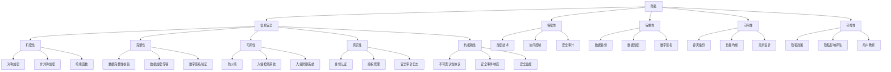

                 

### 隐私与安全：人类计算中的关键问题

#### 关键词：
- 隐私保护
- 安全机制
- 人类计算
- 数据安全
- 信息安全

#### 摘要：
本文深入探讨了隐私与安全在人类计算中的关键作用。从隐私与安全的基本概念出发，分析了其核心联系与区别，探讨了隐私侵犯与安全威胁的技术分析，提出了隐私保护与安全机制的基本策略。通过案例分析，总结了成功与失败的隐私保护与安全实践，展望了隐私与安全技术的未来发展。本文旨在为读者提供一个全面而深入的隐私与安全视角，助力理解与应对人类计算中的关键问题。

## 目录大纲

### 第一部分：隐私与安全的背景与核心概念

#### 第1章：隐私与安全的背景

##### 1.1 信息隐私的起源与发展

##### 1.2 信息安全的发展历程

##### 1.3 人类计算中的隐私与安全挑战

##### 1.4 本书的目的与结构

### 第2章：隐私与安全的核心概念

##### 2.1 隐私的定义与分类

##### 2.2 安全的定义与分类

##### 2.3 隐私与安全的联系与区别

##### 2.4 主要隐私保护与安全策略

### 第二部分：隐私侵犯与安全威胁分析

#### 第3章：隐私侵犯的技术分析

##### 3.1 数据收集与使用

##### 3.2 隐私泄露的风险分析

##### 3.3 隐私侵犯的案例研究

##### 3.4 隐私侵犯的技术手段

#### 第4章：安全威胁的类型与应对

##### 4.1 常见安全威胁分析

##### 4.2 安全漏洞与防范

##### 4.3 安全攻击与防御

##### 4.4 安全态势感知与监控

### 第三部分：隐私保护与安全机制

#### 第5章：隐私保护的基本策略

##### 5.1 隐私工程管理

##### 5.2 隐私影响评估

##### 5.3 隐私增强技术

##### 5.4 隐私法规与标准

#### 第6章：安全机制的构建与实践

##### 6.1 安全需求分析与设计

##### 6.2 安全架构设计

##### 6.3 安全协议与算法

##### 6.4 安全测试与评估

### 第7章：隐私保护与安全案例分析

##### 7.1 成功案例分析

##### 7.2 失败案例分析

##### 7.3 案例分析与启示

##### 7.4 未来发展趋势与展望

### 第四部分：隐私与安全技术的未来发展

#### 第8章：隐私计算技术

##### 8.1 零知识证明

##### 8.2 同态加密

##### 8.3 联邦学习

##### 8.4 安全多方计算

#### 第9章：安全技术与隐私保护的结合

##### 9.1 隐私计算与区块链

##### 9.2 隐私计算与物联网

##### 9.3 隐私计算与人工智能

##### 9.4 安全隐私技术的前沿趋势

#### 第10章：隐私与安全的未来展望

##### 10.1 隐私保护的法律法规

##### 10.2 技术创新与挑战

##### 10.3 隐私与安全教育的推广

##### 10.4 跨学科合作与可持续发展

### 附录：参考资料与工具

##### 附录 A：隐私与安全相关法律法规

###### A.1 国内法律法规

###### A.2 国际法律法规

##### 附录 B：隐私与安全工具与资源

###### B.1 开源隐私计算框架

###### B.2 隐私计算数据库

###### B.3 隐私安全研究与组织

###### B.4 隐私安全工具与SDKs## 第一部分：隐私与安全的背景与核心概念

### 第1章：隐私与安全的背景

隐私和安全在现代社会中扮演着至关重要的角色，尤其是在人类计算领域。随着信息技术的飞速发展，数据已成为新时代的“石油”，隐私泄露和安全威胁事件屡见不鲜。本章节将探讨隐私与安全的背景，包括信息隐私的起源与发展、信息安全的发展历程、人类计算中的隐私与安全挑战，以及本书的目的与结构。

#### 1.1 信息隐私的起源与发展

隐私的概念源于人类对个人权利的保护需求。在古代，隐私主要通过物理隔离和社交礼仪来实现，例如，人们通过保密、回避等手段来保护自己的个人信息和活动。随着人类社会的发展，隐私权逐渐成为一种基本人权，并受到法律的认可和保护。

- **隐私的定义**：隐私是指个人或组织不愿让他人知晓的信息或活动。它涉及个人身份、健康状况、财务状况、社交活动等多个方面。
- **隐私权的法律保护**：隐私权在国际和国内法律中都有明确规定。例如，国际上有《世界人权宣言》、《联合国隐私权公约》等。国内则有《中华人民共和国宪法》、《中华人民共和国个人信息保护法》等法律法规，对个人隐私权进行保护。

隐私技术的演变也是隐私保护的重要一环。从早期的物理隔离，到现代的加密技术，再到近年来的隐私计算技术，隐私保护手段不断进步。加密技术包括对称加密、非对称加密、哈希函数等，这些技术为数据的保密性、完整性和真实性提供了有力保障。隐私计算技术如同态加密、安全多方计算、联邦学习等，则允许在保持数据隐私的同时进行计算和分析。

#### 1.2 信息安全的发展历程

信息安全是保护信息免受未授权访问、篡改、破坏或泄露的一系列措施。信息安全的发展历程可以追溯到计算机和网络的兴起。

- **信息安全的基本概念**：信息安全包括机密性、完整性、可用性、真实性和抗抵赖性。这些属性确保信息在传输和存储过程中不被未授权者访问、篡改或破坏。

信息安全的重要里程碑包括：

- **计算机病毒**：1980年代，计算机病毒开始出现，威胁到了信息安全。
- **网络安全**：1990年代，随着互联网的普及，网络安全成为研究热点。
- **云计算安全**：2010年代，随着云计算的兴起，云计算安全成为重要议题。

信息安全技术的演进也经历了多个阶段，从传统的防火墙、入侵检测系统（IDS）、入侵防御系统（IPS），到现代的威胁情报、安全态势感知、移动安全、物联网安全等。

#### 1.3 人类计算中的隐私与安全挑战

随着互联网和信息技术的快速发展，人类计算中的隐私与安全面临着诸多挑战。

- **互联网时代的数据收集**：在互联网时代，个人数据被大量收集和使用。这不仅包括在线数据，如社交媒体、电子商务等，还包括离线数据，如调查问卷、物理监控等。数据收集的方式越来越多样化，同时也带来了隐私泄露的风险。
- **社交媒体与隐私泄露**：社交媒体平台上的隐私泄露事件频发。用户的个人信息、行为数据等被收集、分析和共享，有时甚至被第三方滥用。
- **安全威胁对隐私的影响**：黑客攻击、数据泄露、隐私侵权等安全威胁对个人隐私造成了严重威胁。例如，2018年的Facebook数据泄露事件，导致8700万用户的数据被泄露；2017年的Equifax数据泄露事件，影响1.43亿用户的数据。

#### 1.4 本书的目的与结构

本书的目的是为读者提供一个全面而深入的隐私与安全视角，帮助理解人类计算中的关键问题，并提出有效的解决方案。

- **阅读本书的目标**：通过阅读本书，读者可以了解隐私与安全的基本概念、技术、策略和实践，掌握隐私保护与安全机制的核心内容。
- **本书的内容安排**：本书分为四个部分，第一部分介绍隐私与安全的背景与核心概念，第二部分分析隐私侵犯与安全威胁，第三部分探讨隐私保护与安全机制，第四部分展望隐私与安全技术的未来发展。
- **如何有效地阅读本书**：建议读者结合案例、图表、公式，逐步深入理解隐私与安全的核心内容。同时，通过实践项目，将理论知识应用到实际中，提高解决实际问题的能力。

## 第2章：隐私与安全的核心概念

隐私与安全是现代社会中不可分割的两个概念，它们在保护个人信息、维护社会秩序、促进科技发展中发挥着重要作用。本章将详细探讨隐私与安全的核心概念，包括隐私的定义与分类、安全的定义与分类，以及隐私与安全的联系与区别。

### 2.1 隐私的定义与分类

#### 2.1.1 隐私的概念解析

隐私是一个广泛而复杂的概念，它涉及个人或组织对其信息的控制权。隐私不仅仅指个人信息，还包括个人的行为、通信、位置等。以下是隐私的核心属性：

- **保密性**：确保信息不被未授权者访问。
- **完整性**：确保信息在传输和存储过程中不被篡改。
- **可用性**：确保信息在需要时可以被合法用户使用。
- **可控性**：个人或组织有权决定其信息的访问和使用。

隐私的核心概念可以追溯到个人权利的保护，尤其是在现代信息社会中，随着数据收集和处理的普遍化，隐私保护显得尤为重要。

#### 2.1.2 隐私的分类方法

隐私可以根据其内容和形式进行分类，以下是几种常见的分类方法：

- **根据内容分类**：
  - **个人隐私**：涉及个人的基本信息、行为和通信。
  - **组织隐私**：涉及组织的机密信息、商业秘密等。
  - **物理隐私**：涉及个人的物理空间、个人物品等。
  - **数字隐私**：涉及个人在数字世界中的活动，如在线行为、社交媒体等。

- **根据形式分类**：
  - **公开信息**：对公众开放的信息，如公开档案、新闻等。
  - **敏感信息**：对个人和组织具有重要性的信息，如医疗记录、财务信息等。
  - **机密信息**：对个人和组织极其重要的信息，如国家机密、商业机密等。

- **根据保护程度分类**：
  - **一般隐私**：对隐私保护要求较低的信息。
  - **高度隐私**：对隐私保护要求极高的信息。
  - **极端隐私**：对隐私保护要求极其严格的信息。

#### 2.1.3 隐私保护的重要性

隐私保护在现代社会中具有极其重要的意义。以下是隐私保护的重要性：

- **个人权利的保护**：隐私是个人基本权利的一部分，隐私保护是维护个人权利的必要手段。
- **社会秩序的维护**：隐私保护有助于维护社会秩序，减少隐私泄露事件对社会造成的负面影响。
- **科技发展的推动**：隐私保护是科技进步的重要保障，有助于推动人工智能、大数据等技术的发展。

### 2.2 安全的定义与分类

#### 2.2.1 安全的概念解析

安全是指保护信息、系统、网络、设备等不受未经授权的访问、篡改、破坏或泄露。安全的核心属性包括：

- **机密性**：确保信息不被未授权者访问。
- **完整性**：确保信息在传输和存储过程中不被篡改。
- **可用性**：确保信息在需要时可以被合法用户使用。
- **真实性**：确保信息的来源可靠。
- **抗抵赖性**：确保信息的行为可以被追溯和验证。

安全的概念可以追溯到古代，但随着信息技术的发展，安全的内涵和外延不断扩展，涵盖了更多领域。

#### 2.2.2 安全的分类方法

安全可以根据其内容和形式进行分类，以下是几种常见的分类方法：

- **根据内容分类**：
  - **网络安全**：保护网络系统的安全和完整性。
  - **系统安全**：保护计算机系统的安全和可靠性。
  - **数据安全**：保护数据的机密性、完整性和可用性。
  - **应用安全**：保护软件应用的安全性和可靠性。
  - **物理安全**：保护物理设备和设施的安全。

- **根据形式分类**：
  - **主动安全**：通过预防措施防止安全事件的发生。
  - **被动安全**：通过检测和响应措施来应对安全事件。
  - **动态安全**：在运行时对系统进行监控和防护。
  - **静态安全**：在系统设计阶段进行安全评估和测试。

- **根据保护层次分类**：
  - **基础安全**：提供基本的安全保障，如防火墙、杀毒软件等。
  - **核心安全**：提供高级别的安全防护，如安全审计、入侵检测等。
  - **高级安全**：提供针对特定威胁的定制化安全防护，如威胁情报、安全态势感知等。

#### 2.2.3 安全防护的基本原则

安全防护需要遵循一系列基本原则，以确保安全措施的有效性和可靠性：

- **最小权限原则**：用户和程序应仅获得执行其任务所必需的权限。
- **防御深度原则**：采用多层次的安全措施，提高系统的防护能力。
- **安全分离原则**：通过物理或逻辑手段，将不同安全级别的信息隔离开来。
- **安全性优先原则**：在设计、开发和运维过程中，始终将安全性作为首要考虑因素。
- **持续改进原则**：定期评估和改进安全措施，以应对新的威胁和漏洞。

### 2.3 隐私与安全的联系与区别

#### 2.3.1 隐私与安全的共同目标

隐私与安全在保护信息方面具有共同的目标，即确保信息的保密性、完整性、可用性、真实性和抗抵赖性。隐私保护强调的是个人信息和行为的保护，而安全防护则侧重于信息系统和网络的保护。

- **隐私保护**：确保个人信息和行为的保密性、完整性、可用性、真实性和抗抵赖性。
- **安全防护**：确保信息系统和网络的保密性、完整性、可用性、真实性和抗抵赖性。

#### 2.3.2 隐私与安全的不同视角

隐私与安全虽然目标相同，但视角不同。隐私保护关注的是个人权利的保护，强调的是个人信息的控制权。安全防护则关注的是系统的整体安全性，包括硬件、软件、网络等多个方面。

- **隐私视角**：关注个人信息的保护和隐私权的维护。
- **安全视角**：关注信息系统和网络的保护，防范各种安全威胁和攻击。

#### 2.3.3 隐私与安全的互补性

隐私与安全在实际应用中具有互补性。隐私保护依赖于安全措施，如加密技术、访问控制、安全审计等。安全防护也需要考虑隐私保护，确保信息的合法使用和合理共享。

- **隐私保护**：依赖于安全措施，如加密技术、访问控制、安全审计等。
- **安全防护**：依赖于隐私保护，确保信息的合法使用和合理共享。

### 2.4 主要隐私保护与安全策略

为了有效保护隐私和安全，需要采取一系列策略和措施。以下是几种主要的隐私保护与安全策略：

- **隐私工程管理**：建立隐私工程管理体系，确保隐私保护目标的实现。
- **隐私影响评估**：对隐私风险进行评估，制定相应的隐私保护措施。
- **隐私增强技术**：采用隐私计算技术，增强隐私保护能力。
- **安全需求分析**：识别安全需求，为安全架构设计提供依据。
- **安全架构设计**：设计安全架构，确保系统的安全性。
- **安全测试与评估**：对系统进行安全测试和评估，确保安全措施的有效性。

通过这些策略和措施，可以有效地保护隐私和安全，为人类社会的发展提供有力保障。

### 2.5 核心概念与联系

为了更好地理解隐私与安全的核心概念及其联系，我们使用Mermaid流程图进行阐述。



通过上述流程图，我们可以清晰地看到隐私与安全的核心概念及其相互联系。每种核心概念都关联到相应的技术和策略，从而形成一个完整的安全防护体系。

### 2.6 核心算法原理讲解

在隐私与安全领域，核心算法的原理是确保信息在传输和存储过程中的安全性和完整性。以下我们通过伪代码详细阐述几个核心算法的原理。

#### 2.6.1 对称加密

对称加密是一种加密方法，其中加密和解密使用相同的密钥。以下是对称加密的伪代码：

```plaintext
算法：AES加密（以高级加密标准为例）

输入：明文m、密钥k
输出：密文c

步骤：
1. 初始化密钥和IV（初始向量）
2. 对明文进行分块处理
3. 对每个明文块进行AES加密
4. 将密文块连接成完整的密文

伪代码：
KEY_SIZE = 256
BLOCK_SIZE = 128

function AES_Encrypt(m, k):
    key = KeyGen(k)
    iv = Generate_IV()
    cipher = []
    for block in BlockPartition(m, BLOCK_SIZE):
        cipher_block = EncryptBlock(block, key, iv)
        cipher.append(cipher_block)
    return ConcatenateBlocks(cipher)
```

#### 2.6.2 非对称加密

非对称加密使用一对密钥（公钥和私钥）进行加密和解密。以下是RSA加密的伪代码：

```plaintext
算法：RSA加密

输入：明文m、公钥(n, e)
输出：密文c

步骤：
1. 计算模数n和公钥e
2. 对明文进行分块处理
3. 对每个明文块进行RSA加密
4. 将密文块连接成完整的密文

伪代码：
function RSA_Encrypt(m, n, e):
    c = []
    for block in BlockPartition(m):
        cipher_block = (block^e) mod n
        c.append(cipher_block)
    return ConcatenateBlocks(c)
```

#### 2.6.3 哈希函数

哈希函数是一种将输入数据映射为固定长度输出数据的算法，常用于确保数据的完整性。以下是MD5哈希的伪代码：

```plaintext
算法：MD5哈希

输入：消息m
输出：哈希值h

步骤：
1. 对消息进行填充，使其长度为512的倍数
2. 将消息长度添加到消息末尾
3. 初始化四个哈希值寄存器
4. 对每512位分组进行哈希计算
5. 返回四个哈希值寄存器的结果

伪代码：
function MD5_Hash(m):
    padding = 0x80
    length = Length(m)
    msg = m + Padding(length, padding)
    h0, h1, h2, h3 = InitializeRegisters()
    for block in BlockPartition(msg, 512):
        h0, h1, h2, h3 = ProcessBlock(block, h0, h1, h2, h3)
    return ConcatenateRegisters(h0, h1, h2, h3)
```

通过上述核心算法的伪代码，我们可以看到加密和解密的过程是如何实现的，以及哈希函数是如何确保数据完整性的。这些算法在隐私与安全领域发挥着重要作用，是构建安全系统的基础。

### 2.7 数学模型和公式

在隐私与安全领域，数学模型和公式是理解和设计安全机制的关键工具。以下我们将介绍几个核心的数学模型和公式，并举例说明其应用。

#### 2.7.1 零知识证明

零知识证明是一种密码学协议，允许一方（证明者）向另一方（验证者）证明某个陈述为真，而无需透露任何除了该陈述为真的信息以外的额外信息。以下是一个简单的零知识证明的数学模型：

- **陈述**：\(P\) 是某个数的平方根。
- **证明过程**：

1. **挑战**：验证者选择一个随机数 \(r\)。
2. **证明**：证明者计算 \(P \cdot r^2\) 并发送给验证者。
3. **验证**：验证者计算 \(P \cdot r^2 \mod N\)，其中 \(N\) 是某个素数的乘积。如果结果等于证明者发送的结果，则验证成功。

数学公式：

\[ P \cdot r^2 \mod N = P \mod N \]

#### 2.7.2 同态加密

同态加密是一种加密形式，允许在加密数据上执行计算，而不需要解密数据。以下是一个简单的同态加密的数学模型：

- **加密函数**：\(Enc(x, k)\)
- **计算同态**：\(Enc(f(x), k) = Enc(x, k)\)

数学公式：

\[ Enc(f(x), k) = Enc(x, k) \]

其中，\(f(x)\) 是在明文 \(x\) 上进行的函数运算。

#### 2.7.3 散列函数

散列函数将任意长度的输入数据映射为固定长度的输出数据，常用于数据完整性验证。以下是一个简单的散列函数的数学模型：

- **输入**：\(m\)
- **输出**：\(h(m)\)

数学公式：

\[ h(m) = Hash(m) \]

例如，使用MD5散列函数：

\[ h(m) = MD5(m) \]

#### 2.7.4 公钥加密

公钥加密使用一对密钥（公钥和私钥）进行加密和解密。以下是一个简单的公钥加密的数学模型：

- **加密函数**：\(Enc_{pub}(m, pub_key)\)
- **解密函数**：\(Dec_{priv}(c, priv_key)\)

数学公式：

\[ c = Enc_{pub}(m, pub_key) \]
\[ m = Dec_{priv}(c, priv_key) \]

其中，\(pub_key\) 是公钥，\(priv_key\) 是私钥。

通过这些数学模型和公式，我们可以更好地理解隐私与安全领域的基本概念和技术。这些模型和公式不仅帮助我们设计安全的系统，还帮助我们验证系统的正确性和有效性。

### 2.8 项目实战

#### 2.8.1 开发环境搭建

为了更好地理解隐私与安全技术的实际应用，我们将搭建一个简单的隐私保护系统，使用Python来实现对称加密和非对称加密。

- **软件和工具**：Python 3.x、PyCryptoDome库
- **操作系统**：Windows/Linux/MacOS

**安装PyCryptoDome库**：

```bash
pip install pycryptodome
```

#### 2.8.2 源代码详细实现

以下是使用PyCryptoDome库实现对称加密和非对称加密的源代码：

```python
from Cryptodome.Cipher import AES, PKCS1_OAEP
from Cryptodome.PublicKey import RSA
from Cryptodome.Random import get_random_bytes

# 对称加密
def symmetric_encrypt(plain_text, key):
    cipher = AES.new(key, AES.MODE_EAX)
    nonce = cipher.nonce
    cipher_text, tag = cipher.encrypt_and_digest(plain_text.encode('utf-8'))
    return cipher_text, nonce, tag

def symmetric_decrypt(cipher_text, nonce, tag, key):
    cipher = AES.new(key, AES.MODE_EAX, nonce=nonce)
    plain_text = cipher.decrypt_and_verify(cipher_text, tag)
    return plain_text.decode('utf-8')

# 非对称加密
def asymmetric_encrypt(plain_text, public_key):
    cipher = PKCS1_OAEP.new(public_key)
    cipher_text = cipher.encrypt(plain_text.encode('utf-8'))
    return cipher_text

def asymmetric_decrypt(cipher_text, private_key):
    cipher = PKCS1_OAEP.new(private_key)
    plain_text = cipher.decrypt(cipher_text)
    return plain_text.decode('utf-8')

# 主函数
def main():
    # 对称加密
    key = get_random_bytes(16)  # 生成随机密钥
    plain_text = "Hello, World!"
    
    cipher_text, nonce, tag = symmetric_encrypt(plain_text, key)
    print("对称加密密文：", cipher_text.hex())
    
    decrypted_text = symmetric_decrypt(cipher_text, nonce, tag, key)
    print("对称解密结果：", decrypted_text)
    
    # 非对称加密
    rsa_key = RSA.generate(2048)
    public_key = rsa_key.publickey()
    private_key = rsa_key
    
    cipher_text = asymmetric_encrypt(plain_text, public_key)
    print("非对称加密密文：", cipher_text.hex())
    
    decrypted_text = asymmetric_decrypt(cipher_text, private_key)
    print("非对称解密结果：", decrypted_text)

if __name__ == "__main__":
    main()
```

#### 2.8.3 代码解读与分析

- **对称加密部分**：
  - `get_random_bytes(16)`：生成一个16字节的随机密钥。
  - `AES.new(key, AES.MODE_EAX)`：创建一个AES加密对象，使用EAX模式，该模式结合了加密和认证。
  - `cipher.encrypt_and_digest(plain_text.encode('utf-8'))`：加密明文并生成认证标签。
  - `symmetric_decrypt(cipher_text, nonce, tag, key)`：使用密钥、随机数和认证标签解密密文。

- **非对称加密部分**：
  - `RSA.generate(2048)`：生成一个2048位的RSA密钥对。
  - `PKCS1_OAEP.new(public_key)`：创建一个PKCS1_OAEP加密对象，该对象用于RSA加密。
  - `cipher.encrypt(plain_text.encode('utf-8'))`：使用公钥加密明文。
  - `cipher.decrypt(cipher_text)`：使用私钥解密密文。

通过上述代码，我们可以看到如何在实际项目中使用Python实现对称加密和非对称加密。这对理解隐私保护技术的实际应用非常有帮助。

### 2.9 总结

本章详细介绍了隐私与安全的核心概念，包括隐私的定义与分类、安全的定义与分类，以及隐私与安全的联系与区别。通过核心概念与联系的Mermaid流程图、核心算法原理的伪代码、数学模型和公式的讲解，以及项目实战的代码实现，读者可以全面而深入地理解隐私与安全领域的基本概念和技术。这些知识将为进一步学习隐私侵犯与安全威胁分析、隐私保护与安全机制打下坚实的基础。

## 第二部分：隐私侵犯与安全威胁分析

隐私侵犯与安全威胁是现代社会中的一大挑战，随着技术的不断进步，隐私泄露和安全漏洞事件频繁发生。本章节将深入分析隐私侵犯的技术手段和安全威胁的类型，并探讨隐私侵犯与安全威胁的案例分析。

### 第3章：隐私侵犯的技术分析

隐私侵犯通常涉及对个人或组织隐私信息的非法获取、使用、披露或篡改。技术分析是理解和防范隐私侵犯的关键。以下将详细探讨隐私侵犯的技术手段。

#### 3.1 数据收集与使用

数据收集是隐私侵犯的首要环节。数据收集的方式多种多样，包括：

- **在线收集**：通过网站、APP、社交媒体等在线平台收集用户数据。
  - **网站追踪**：使用Cookies、Web beacon等技术跟踪用户行为。
  - **移动应用收集**：通过移动应用收集用户位置、设备信息等。
- **离线收集**：通过调查问卷、物理监控等离线方式收集数据。
  - **物理监控**：通过摄像头、传感器等设备收集用户行为和位置数据。
- **第三方收集**：通过第三方服务提供商、广告网络等收集用户数据。
  - **数据共享**：组织间通过数据交换共享用户信息。

数据收集的规范通常包括隐私政策、用户协议和数据收集标准。隐私政策明确数据收集、使用、共享和披露的目的和范围。用户协议要求用户在注册、使用服务前同意数据收集和使用规则。数据收集标准则提供具体的数据收集操作指南。

在数据收集过程中，隐私风险分析至关重要。隐私风险分析包括：

- **数据泄露风险**：分析数据在传输、存储、处理过程中的泄露风险。
- **数据滥用风险**：分析数据被用于未经授权的目的或超出原始收集目的的风险。
- **数据篡改风险**：分析数据在传输、存储、处理过程中被篡改的风险。

#### 3.2 隐私泄露的风险分析

隐私泄露是指未经授权的个人或组织获取、使用、披露或篡改隐私信息的行为。隐私泄露的风险分析包括以下几个方面：

- **隐私泄露的途径**：分析数据泄露的途径，包括网络攻击、内部人员滥用、物理攻击等。
  - **网络攻击**：如黑客攻击、恶意软件攻击、钓鱼攻击等。
  - **内部人员滥用**：如内部人员泄露、滥用用户数据等。
  - **物理攻击**：如黑客入侵物理设备，窃取数据。
- **隐私泄露的风险评估**：评估隐私泄露的可能性、影响范围和程度等。
  - **风险评估方法**：如定性风险评估、定量风险评估等。
  - **风险评估步骤**：包括识别风险、评估风险、制定应对措施等。
- **隐私泄露的应对策略**：包括安全防护措施、应急响应计划等。
  - **安全防护措施**：如防火墙、入侵检测系统（IDS）、数据加密等。
  - **应急响应计划**：如事故报告、数据恢复、用户通知等。
  - **用户教育**：提高用户隐私保护意识，减少隐私泄露风险。

#### 3.3 隐私侵犯的案例研究

隐私侵犯案例研究有助于我们理解隐私侵犯的具体情况，总结经验教训，提高隐私保护水平。以下为几个经典案例：

- **Facebook数据泄露事件**：2018年，Facebook约8700万用户的数据被泄露，包括姓名、电话号码、位置等。泄露原因是一个应用程序编程接口（API）漏洞导致数据泄露。
  - **原因分析**：应用程序编程接口（API）未充分保护，导致数据泄露。
  - **影响范围**：受影响用户数据被公开，隐私权受到侵犯。
  - **应对措施**：Facebook加强了API安全防护，对受影响用户进行了通知和补偿。

- **Equifax数据泄露事件**：2017年，Equifax公司约1.43亿用户的数据被泄露，包括姓名、社会安全号码、出生日期等。泄露原因是一个数据库配置错误和安全漏洞导致数据泄露。
  - **原因分析**：数据库配置错误和安全漏洞导致数据泄露。
  - **影响范围**：受影响用户数据被公开，隐私权受到侵犯。
  - **应对措施**：Equifax加强了数据库安全防护，对受影响用户进行了通知和补偿。

#### 3.4 隐私侵犯的技术手段

隐私侵犯的技术手段多种多样，以下为几种常见的技术手段：

- **数据挖掘与隐私侵犯**：通过分析海量数据，挖掘个人信息，进行隐私侵犯。
  - **关联分析**：通过分析数据中的关联关系，揭示个人隐私信息。
  - **模式识别**：通过识别数据中的特定模式，推断个人隐私信息。
- **网络攻击与隐私侵犯**：通过网络攻击手段，非法获取个人隐私信息。
  - **DDoS攻击**：通过大量流量攻击，使目标服务器瘫痪，导致数据泄露。
  - **SQL注入攻击**：通过在数据库查询语句中注入恶意代码，窃取数据库中的隐私数据。
  - **跨站脚本（XSS）攻击**：通过在用户浏览器中注入恶意脚本，窃取用户会话信息或篡改页面内容。
- **隐私侵犯的技术发展趋势**：随着技术的不断发展，隐私侵犯技术也在不断演变。
  - **人工智能技术在隐私侵犯中的应用**：如利用深度学习技术进行隐私信息挖掘。
  - **物联网中的隐私侵犯**：如智能家居设备、可穿戴设备等隐私数据泄露。
  - **区块链技术在隐私保护中的应用**：如利用区块链技术实现数据的安全共享和隐私保护。

通过上述隐私侵犯的技术分析，我们可以看到隐私侵犯的多样性和复杂性。为了有效防范隐私侵犯，需要采取综合性的隐私保护措施，包括加强数据收集与使用的规范、进行隐私泄露的风险分析、加强安全防护措施，以及通过案例研究和实践经验总结经验教训。

### 第4章：安全威胁的类型与应对

安全威胁是隐私侵犯的重要驱动力，了解安全威胁的类型和应对策略对于保护个人信息和系统安全至关重要。本章节将详细分析常见安全威胁的类型，包括计算机病毒与恶意软件、网络钓鱼与诈骗、SQL注入与跨站脚本攻击、DDoS攻击与分布式拒绝服务，并探讨安全漏洞与防范、安全攻击与防御以及安全态势感知与监控。

#### 4.1 常见安全威胁分析

常见安全威胁包括计算机病毒与恶意软件、网络钓鱼与诈骗、SQL注入与跨站脚本攻击、DDoS攻击与分布式拒绝服务。以下对这些威胁进行详细分析。

##### 4.1.1 计算机病毒与恶意软件

计算机病毒是一种恶意软件，能够自我复制并传播，对计算机系统造成破坏。恶意软件包括勒索软件、木马、蠕虫等，具有不同的恶意目的。

- **计算机病毒**：通过感染系统文件、篡改系统设置等手段，对计算机系统造成破坏。
  - **恶意目的**：如窃取用户信息、破坏系统功能、传播其他恶意软件等。
- **恶意软件**：具有特定恶意目的的软件，如勒索软件、间谍软件、广告软件等。
  - **勒索软件**：通过加密用户文件，要求用户支付赎金以解密文件。
  - **间谍软件**：在用户不知情的情况下，监控用户行为，窃取敏感信息。
  - **广告软件**：在用户设备上显示大量广告，干扰用户正常使用。

##### 4.1.2 网络钓鱼与诈骗

网络钓鱼是一种通过伪装成合法机构，诱骗用户提供敏感信息（如用户名、密码、信用卡信息等）的攻击手段。诈骗则通过虚假信息或手段欺骗用户，如电信诈骗、网络购物诈骗等。

- **网络钓鱼**：通过钓鱼邮件、钓鱼网站等手段，诱骗用户提供敏感信息。
  - **钓鱼邮件**：伪装成银行、电子商务平台等，诱骗用户点击链接或下载附件。
  - **钓鱼网站**：伪装成合法网站，诱导用户输入敏感信息。
- **诈骗**：通过虚假信息或手段欺骗用户，如电信诈骗、网络购物诈骗等。
  - **电信诈骗**：通过电话、短信等手段，欺骗用户转账或提供敏感信息。
  - **网络购物诈骗**：通过虚假商品宣传、欺诈交易等手段，骗取用户钱财。

##### 4.1.3 SQL注入与跨站脚本攻击

SQL注入和跨站脚本攻击是常见的Web应用攻击手段，通过利用系统漏洞，窃取数据库中的隐私数据或篡改页面内容。

- **SQL注入**：通过在输入数据中注入恶意SQL语句，篡改数据库内容或窃取数据。
  - **攻击方式**：在用户输入框、URL参数等处注入恶意SQL语句。
  - **影响范围**：可能导致数据库被篡改、数据泄露、服务器被攻击等。
- **跨站脚本（XSS）攻击**：通过在用户浏览器中注入恶意脚本，窃取用户会话信息或篡改页面内容。
  - **攻击方式**：在Web应用中注入恶意脚本，诱导用户执行。
  - **影响范围**：可能导致用户会话被窃取、恶意软件植入、网站被篡改等。

##### 4.1.4 DDoS攻击与分布式拒绝服务

DDoS攻击是一种通过大量恶意请求，使目标服务器瘫痪，导致服务不可用的攻击手段。分布式拒绝服务攻击（DDoS）利用多个恶意节点协同攻击目标服务器。

- **DDoS攻击**：通过大量流量攻击，使目标服务器瘫痪，导致服务不可用。
  - **攻击方式**：利用僵尸网络，发送大量恶意请求。
  - **影响范围**：可能导致服务器崩溃、数据丢失、业务中断等。
- **分布式拒绝服务**：一种利用多个恶意节点协同攻击目标服务器的攻击方式。
  - **攻击方式**：多个恶意节点同时发起攻击，增加攻击力度。
  - **影响范围**：可能导致大规模服务中断、网络安全受到威胁等。

#### 4.2 安全漏洞与防范

安全漏洞是安全威胁的根源，指系统或应用程序中存在的可以被攻击者利用的缺陷或错误。安全漏洞的分类包括漏洞类型、漏洞等级等。

- **安全漏洞的分类**：
  - **漏洞类型**：如代码漏洞、配置漏洞、设计漏洞等。
    - **代码漏洞**：如缓冲区溢出、SQL注入等。
    - **配置漏洞**：如防火墙配置错误、系统权限设置不当等。
    - **设计漏洞**：如不当的输入验证、缺乏安全审计等。
  - **漏洞等级**：如严重漏洞、高危漏洞、中危漏洞等。
    - **严重漏洞**：可能导致严重后果的漏洞。
    - **高危漏洞**：可能导致严重后果的漏洞。
    - **中危漏洞**：可能导致中等后果的漏洞。

- **安全漏洞的发现与利用**：
  - **漏洞扫描**：通过自动化的方式发现系统中的漏洞。
  - **漏洞利用工具**：如利用漏洞的攻击工具、自动化攻击框架等。

- **安全漏洞的修复与防范**：
  - **漏洞修复**：通过更新系统、修补漏洞等方式修复漏洞。
  - **防范措施**：
    - **防火墙**：监控和控制进出网络的流量，防止恶意流量进入。
    - **入侵检测系统（IDS）**：监控网络流量和系统行为，发现潜在攻击行为。
    - **入侵防御系统（IPS）**：在入侵检测系统的基础上，采取自动化的防御措施。

#### 4.3 安全攻击与防御

安全攻击是指攻击者利用系统漏洞或缺陷，实现非法访问、窃取信息、破坏系统等行为。安全防御是保护系统安全、防范攻击的措施。

- **安全攻击的常见类型**：
  - **拒绝服务攻击**：通过大量恶意请求，使目标服务器瘫痪，导致服务不可用。
  - **缓冲区溢出攻击**：通过输入超出缓冲区大小的数据，篡改程序的控制流，执行恶意代码。
  - **中间人攻击**：在网络传输过程中，拦截并篡改通信内容。

- **安全防御的基本策略**：
  - **访问控制**：限制对系统资源的访问，确保只有授权用户才能访问。
  - **加密技术**：对敏感数据进行加密，确保数据在传输和存储过程中的安全性。
  - **入侵检测与防御**：通过监控网络流量和系统行为，发现和阻止恶意攻击。

- **安全防御的技术手段**：
  - **防火墙**：一种网络安全设备，用于监控和控制进出网络的流量。
  - **入侵检测系统（IDS）**：用于检测网络中的异常行为和潜在攻击。
  - **入侵防御系统（IPS）**：在入侵检测系统的基础上，采取自动化的防御措施。

#### 4.4 安全态势感知与监控

安全态势感知是指通过实时监测和分析网络安全态势，及时发现和应对安全威胁。安全监控是对网络、系统和数据的安全状况进行持续监控，确保安全。

- **安全态势感知的定义与作用**：
  - **定义**：安全态势感知是一种通过实时监测和分析网络安全态势，发现和应对安全威胁的能力。
  - **作用**：提高对安全事件的响应速度和准确性，降低安全风险。

- **安全监控的技术方法**：
  - **网络流量监控**：通过分析网络流量，发现潜在的攻击行为。
  - **系统监控**：通过监测系统日志、性能指标等，发现系统异常。
  - **数据监控**：通过分析数据流和存储，发现数据泄露和滥用行为。

- **安全态势感知的应用实例**：
  - **网络安全预警**：通过分析网络流量和系统日志，发现潜在的攻击行为，提前预警。
  - **安全事件响应**：在安全事件发生后，快速响应并采取措施，降低损失。
  - **安全决策支持**：为安全管理人员提供决策支持，优化安全策略和资源配置。

通过上述安全威胁的类型与应对分析，我们可以看到隐私侵犯与安全威胁的多样性和复杂性。为了有效保护隐私和安全，需要采取综合性的安全策略，包括发现和修复安全漏洞、实施有效的安全防御措施、进行实时监控和态势感知，以及通过案例研究和实践经验总结经验教训。

### 4.5 安全漏洞与防范

安全漏洞是导致隐私侵犯和安全威胁的重要因素。了解安全漏洞的分类、发现与利用方法，以及如何进行修复与防范，对于保护系统和数据至关重要。

#### 4.5.1 安全漏洞的分类

安全漏洞可以根据不同的维度进行分类，常见的分类方法包括：

- **根据漏洞类型分类**：
  - **代码漏洞**：由程序代码中的错误引起的漏洞，如缓冲区溢出、SQL注入等。
  - **配置漏洞**：由系统配置不当引起的漏洞，如防火墙配置错误、系统权限设置不当等。
  - **设计漏洞**：由系统设计缺陷引起的漏洞，如不当的输入验证、缺乏安全审计等。

- **根据漏洞等级分类**：
  - **严重漏洞**：可能导致严重后果的漏洞，如系统崩溃、数据泄露等。
  - **高危漏洞**：可能导致严重后果的漏洞，但影响范围较小。
  - **中危漏洞**：可能导致中等后果的漏洞，但影响范围较小。

- **根据漏洞来源分类**：
  - **内部漏洞**：由内部人员或内部操作引起的漏洞，如内部人员滥用权限、操作失误等。
  - **外部漏洞**：由外部攻击者利用系统漏洞进行的攻击，如网络攻击、恶意软件等。

#### 4.5.2 安全漏洞的发现与利用

安全漏洞的发现与利用是网络安全的重要环节。以下是常见的发现与利用方法：

- **漏洞扫描**：
  - **自动化漏洞扫描工具**：如Nessus、OpenVAS等，通过预定义的漏洞库扫描系统中的漏洞。
  - **手动漏洞扫描**：通过专家经验和工具，如Wireshark、Nmap等，发现系统中的漏洞。

- **漏洞利用工具**：
  - **Exploit框架**：如Metasploit、BeEF等，用于自动化利用已知漏洞。
  - **定制化漏洞利用工具**：根据特定漏洞开发，用于实现攻击。

- **漏洞利用方法**：
  - **直接利用**：直接利用已知漏洞，如缓冲区溢出、SQL注入等。
  - **间接利用**：通过中间件、应用层等间接利用漏洞，如利用操作系统漏洞攻击Web应用。

#### 4.5.3 安全漏洞的修复与防范

修复和防范安全漏洞是保障系统安全的关键。以下是常见的修复与防范方法：

- **漏洞修复**：
  - **补丁更新**：定期更新操作系统、软件和应用，修补已知漏洞。
  - **手动修复**：针对特定漏洞，手动修复代码或配置错误。
  - **安全加固**：通过安全加固措施，如限制权限、配置防火墙等，增强系统安全性。

- **防范措施**：
  - **防火墙**：通过防火墙监控和控制网络流量，防止恶意流量进入。
  - **入侵检测系统（IDS）**：实时监控网络流量和系统行为，发现潜在攻击。
  - **入侵防御系统（IPS）**：自动阻止已知的攻击行为，增强防御能力。
  - **安全审计**：定期进行安全审计，发现和修复潜在漏洞。
  - **安全培训**：提高员工的安全意识，减少人为因素导致的安全漏洞。

通过上述安全漏洞与防范的分析，我们可以看到安全漏洞的复杂性和多样性。为了有效保护隐私和安全，需要采取全面的漏洞修复和防范措施，并持续监控和改进安全策略。

### 4.6 安全攻击与防御

安全攻击是指攻击者利用系统漏洞或缺陷，实现非法访问、窃取信息、破坏系统等行为。为了有效防范安全攻击，需要了解常见的攻击类型、防御策略和技术手段。

#### 4.6.1 安全攻击的常见类型

以下是一些常见的安全攻击类型：

- **拒绝服务攻击（DoS）**：攻击者通过大量恶意请求使目标服务器瘫痪，导致服务不可用。
  - **分布式拒绝服务攻击（DDoS）**：利用多个恶意节点协同攻击目标服务器，增加攻击力度。
  - **拒绝选择攻击（DoS）**：通过消耗服务器资源，使其无法响应合法用户请求。

- **缓冲区溢出攻击**：通过输入超出缓冲区大小的数据，篡改程序的控制流，执行恶意代码。
  - **SQL注入攻击**：通过在输入数据中注入恶意SQL语句，篡改数据库内容或窃取数据。
  - **跨站脚本攻击（XSS）**：通过在用户浏览器中注入恶意脚本，窃取用户会话信息或篡改页面内容。

- **中间人攻击（MITM）**：攻击者在通信双方之间拦截并篡改通信内容。
  - **拒绝选择攻击（MITM）**：通过篡改通信内容，导致通信双方无法正常交互。

- **恶意软件攻击**：包括病毒、木马、勒索软件等，通过感染系统、窃取信息等手段进行破坏。
  - **蠕虫攻击**：通过自我复制，在网络中传播恶意代码。
  - **勒索软件**：加密用户文件，要求支付赎金以解密文件。

#### 4.6.2 安全防御的基本策略

为了有效防范安全攻击，需要采取一系列防御策略。以下是一些常见的防御策略：

- **访问控制**：限制对系统资源的访问，确保只有授权用户才能访问。
  - **身份认证**：通过用户名、密码、双因素认证等方式，验证用户身份。
  - **授权管理**：根据用户角色和权限，限制用户对系统资源的访问。

- **加密技术**：对敏感数据进行加密，确保数据在传输和存储过程中的安全性。
  - **数据加密传输**：使用SSL/TLS协议加密网络传输数据。
  - **数据加密存储**：使用AES等加密算法对存储的数据进行加密。

- **入侵检测与防御**：通过监控网络流量和系统行为，发现潜在攻击并采取措施阻止。
  - **入侵检测系统（IDS）**：实时监控网络流量和系统行为，发现异常行为。
  - **入侵防御系统（IPS）**：在IDS的基础上，自动阻止已知的攻击行为。

- **安全审计**：定期进行安全审计，发现和修复潜在漏洞。
  - **日志管理**：记录系统操作日志、安全事件日志等，用于审计和分析。
  - **安全事件响应**：在发生安全事件时，快速响应并采取措施降低损失。

#### 4.6.3 安全防御的技术手段

以下是一些常见的安全防御技术手段：

- **防火墙**：一种网络安全设备，用于监控和控制进出网络的流量。
  - **状态检测防火墙**：通过监控连接状态，防止非法访问。
  - **下一代防火墙**：结合应用层防御，提供更全面的网络安全防护。

- **入侵检测系统（IDS）**：用于检测网络中的异常行为和潜在攻击。
  - **基于特征分析的IDS**：通过匹配已知的攻击特征，发现潜在攻击。
  - **基于异常行为的IDS**：通过分析网络流量和系统行为，发现异常模式。

- **入侵防御系统（IPS）**：在IDS的基础上，自动阻止已知的攻击行为。
  - **基于特征分析的IPS**：通过匹配已知的攻击特征，阻止攻击行为。
  - **基于异常行为的IPS**：通过分析网络流量和系统行为，阻止异常行为。

- **数据加密**：对敏感数据进行加密，确保数据在传输和存储过程中的安全性。
  - **对称加密**：使用相同的密钥进行加密和解密。
  - **非对称加密**：使用一对密钥（公钥和私钥）进行加密和解密。

- **安全审计**：通过定期进行安全审计，发现和修复潜在漏洞。
  - **日志审计**：通过记录和分析系统日志，发现潜在漏洞。
  - **合规审计**：根据相关法律法规和标准，评估系统的合规性。

通过上述安全攻击与防御的分析，我们可以看到安全攻击的多样性和复杂性。为了有效防范安全攻击，需要采取综合性的防御策略，包括访问控制、加密技术、入侵检测与防御、安全审计等。同时，需要不断更新和改进安全防御措施，以应对新的安全威胁。

### 4.7 安全态势感知与监控

安全态势感知与监控是网络安全管理的重要组成部分，它通过实时监测和分析网络安全态势，及时发现和应对安全威胁，从而确保系统的安全性和稳定性。

#### 4.7.1 安全态势感知的定义与作用

安全态势感知是指通过收集、处理、分析和可视化网络安全数据，实时掌握网络安全状况，并采取相应的应对措施。其核心作用包括：

- **实时监测**：通过实时监测网络流量、系统行为、安全事件等，发现潜在的威胁和异常。
- **风险评估**：对网络安全威胁进行风险评估，确定威胁的严重程度和影响范围。
- **威胁预警**：在威胁发生前提前预警，为安全团队提供及时的应对指导。
- **决策支持**：为网络安全管理人员提供决策支持，优化安全策略和资源配置。

#### 4.7.2 安全监控的技术方法

安全监控是安全态势感知的重要手段，主要包括以下几种技术方法：

- **网络流量监控**：通过分析网络流量，发现潜在的攻击行为和异常流量模式。
  - **流量镜像**：将网络流量镜像到监控设备进行分析。
  - **流量分析**：使用流量分析工具，如Wireshark，对网络流量进行深入分析。

- **系统监控**：通过监测系统日志、性能指标等，发现系统异常和潜在的安全问题。
  - **日志管理**：收集和存储系统日志，用于审计和分析。
  - **性能监控**：监控系统的CPU、内存、磁盘等资源使用情况，及时发现性能瓶颈。

- **数据监控**：通过监控数据流和存储，发现数据泄露和滥用行为。
  - **数据流分析**：对数据流进行实时分析，发现潜在的攻击和异常行为。
  - **数据存储监控**：监控数据存储设备的使用情况，及时发现数据泄露风险。

#### 4.7.3 安全态势感知的应用实例

以下是一些安全态势感知的具体应用实例：

- **网络安全预警**：通过实时分析网络流量和系统日志，发现潜在的攻击行为和异常流量模式，提前预警。
  - **攻击特征分析**：基于已知的攻击特征，识别潜在的攻击行为。
  - **异常行为分析**：通过机器学习等技术，分析网络行为模式，发现异常行为。

- **安全事件响应**：在安全事件发生后，快速响应并采取措施，降低损失。
  - **事件检测**：通过实时监测，发现安全事件。
  - **事件分析**：对安全事件进行深入分析，确定事件的影响范围和原因。
  - **应急响应**：采取应急措施，阻止攻击行为，恢复系统正常运行。

- **安全决策支持**：为网络安全管理人员提供决策支持，优化安全策略和资源配置。
  - **风险分析**：对网络安全威胁进行评估，确定优先级和应对策略。
  - **策略优化**：根据安全态势感知的数据，优化安全策略和资源配置。

通过上述安全态势感知与监控的分析，我们可以看到其在网络安全管理中的重要性和实际应用价值。安全态势感知与监控不仅是网络安全的基础，也是实现高效、智能的网络安全管理的关键。

## 第三部分：隐私保护与安全机制

隐私保护与安全机制是保护个人信息和系统安全的关键手段。本部分将详细讨论隐私保护的基本策略和安全机制的构建与实践。

### 第5章：隐私保护的基本策略

隐私保护的基本策略包括隐私工程管理、隐私影响评估、隐私增强技术和隐私法规与标准。这些策略旨在确保个人和组织的信息安全，并降低隐私泄露的风险。

#### 5.1 隐私工程管理

隐私工程管理是一种系统化的方法，用于设计和实施隐私保护措施。以下是隐私工程管理的关键要素：

- **隐私政策**：制定隐私政策，明确数据收集、使用、共享和披露的目的和范围。
- **隐私官**：设立隐私官，负责制定和实施隐私保护策略，监督隐私合规性。
- **隐私团队**：组建隐私团队，包括数据保护官、隐私分析师、安全工程师等，共同协作实施隐私保护措施。
- **隐私保护流程**：制定隐私保护流程，包括数据收集、处理、存储、传输和销毁等环节的隐私保护措施。
- **隐私培训**：对员工进行隐私保护培训，提高员工的隐私保护意识和能力。

#### 5.2 隐私影响评估

隐私影响评估是一种评估隐私风险的方法，旨在识别潜在的隐私威胁，并制定相应的隐私保护措施。以下是隐私影响评估的步骤：

- **识别数据流**：分析数据的收集、处理、存储、传输和销毁过程，识别数据的敏感程度。
- **风险评估**：评估数据的隐私风险，包括数据泄露、数据滥用、数据篡改等。
- **制定隐私保护措施**：根据风险评估结果，制定具体的隐私保护措施，如数据加密、访问控制、隐私增强技术等。
- **隐私影响评估报告**：编写隐私影响评估报告，记录评估过程、结果和隐私保护措施。

#### 5.3 隐私增强技术

隐私增强技术是一种用于增强隐私保护能力的技术手段。以下是几种常见的隐私增强技术：

- **数据匿名化**：通过将个人标识信息替换为虚构的标识符，保护个人隐私。
- **数据加密**：使用加密算法对数据进行加密，确保数据在传输和存储过程中的安全性。
- **同态加密**：允许在加密数据上进行计算，而无需解密数据，保护数据的隐私。
- **安全多方计算**：允许多个参与方在保持数据隐私的同时进行计算，提高数据的安全性和可用性。
- **差分隐私**：通过添加随机噪声，保护个人隐私，同时保持数据统计的有效性。

#### 5.4 隐私法规与标准

隐私法规和标准是确保隐私保护合规的重要依据。以下是国内外隐私法规和标准的主要内容和差异：

- **国内隐私法规**：
  - **《中华人民共和国个人信息保护法》**：规定了个人信息的收集、使用、处理和共享的基本原则和规则。
  - **《信息安全技术个人信息安全规范》**：规定了个人信息的保护要求、安全措施和合规性评估方法。
  - **《网络安全法》**：规定了网络运营者的个人信息保护义务和安全责任。

- **国际隐私法规**：
  - **《通用数据保护条例》（GDPR）**：规定了个人数据的收集、处理和共享的基本原则和规则，对个人隐私保护有严格的要求。
  - **《加利福尼亚州消费者隐私法案》（CCPA）**：规定了消费者数据的收集、使用和共享的基本原则和规则，对数据保护有重要影响。

#### 5.5 隐私保护与安全策略的结合

隐私保护与安全策略的结合是确保个人信息和系统安全的关键。以下是隐私保护与安全策略结合的方法：

- **综合评估**：在制定隐私保护策略时，综合考虑安全需求、隐私风险和法规要求，确保策略的全面性和合规性。
- **技术融合**：将隐私增强技术与安全防护技术相结合，提高隐私保护能力。
- **持续改进**：定期评估和改进隐私保护策略和安全措施，以适应新的安全威胁和隐私法规要求。

### 第6章：安全机制的构建与实践

安全机制的构建与实践是保护信息系统和数据安全的关键。以下是安全机制的构建与实践步骤：

#### 6.1 安全需求分析与设计

安全需求分析与设计是构建安全机制的基础。以下是安全需求分析与设计的关键步骤：

- **需求收集**：通过访谈、问卷调查、文档分析等方式，收集安全需求。
- **需求分析**：分析安全需求，识别潜在的安全风险和防护需求。
- **需求验证**：验证安全需求，确保需求的合理性和可实现性。

#### 6.2 安全架构设计

安全架构设计是构建安全机制的关键。以下是安全架构设计的关键步骤：

- **安全架构规划**：规划安全架构，包括安全目标、安全策略等。
- **安全组件设计**：设计安全组件，如防火墙、入侵检测系统（IDS）、入侵防御系统（IPS）等。
- **安全接口设计**：设计安全接口，包括安全协议、安全认证等。

#### 6.3 安全协议与算法

安全协议与算法是安全机制的核心。以下是安全协议与算法的关键内容：

- **安全协议分类**：包括加密协议、认证协议、安全传输协议等。
- **安全算法选择**：根据安全需求，选择合适的加密算法、认证算法等。
- **安全算法优化**：对现有的安全算法进行优化，提高安全性和性能。

#### 6.4 安全测试与评估

安全测试与评估是确保安全机制有效性的关键。以下是安全测试与评估的关键步骤：

- **安全测试目标**：确定安全测试的目标，如漏洞扫描、渗透测试等。
- **安全测试内容**：包括漏洞扫描、渗透测试、安全评估等。
- **安全评估报告**：编写安全评估报告，记录测试过程、结果和改进建议。

#### 6.5 安全机制的实践案例

以下是安全机制的实践案例：

- **案例一**：某公司采用防火墙、入侵检测系统和加密技术，构建了全面的安全防护体系，有效防范了网络攻击和数据泄露。
- **案例二**：某银行实施安全态势感知系统，通过实时监测和分析网络流量和系统行为，及时发现和应对安全威胁，提高了系统的安全性。

通过以上安全机制的构建与实践，我们可以看到隐私保护与安全机制在实际应用中的重要性和有效性。安全机制的构建与实践不仅是保护信息系统和数据安全的关键，也是实现高效、智能的网络安全管理的关键。

### 第7章：隐私保护与安全案例分析

隐私保护与安全案例分析是理解隐私侵犯与安全威胁的重要途径。通过分析成功与失败的案例，可以总结经验教训，提出改进隐私保护与安全管理的建议，为未来的发展提供参考。

#### 7.1 成功案例分析

成功案例在隐私保护与安全管理方面提供了宝贵的经验，以下是几个成功案例的详细介绍：

**案例一：某大型电商平台的隐私保护实践**

- **背景**：某大型电商平台面临大量用户数据的隐私保护需求。
- **措施**：
  - **数据收集与使用规范**：制定了严格的数据收集和使用规范，明确数据收集的目的、范围和用途。
  - **隐私影响评估**：对新的数据收集和使用政策进行隐私影响评估，确保隐私保护措施的充分性。
  - **隐私增强技术**：采用数据加密、访问控制、匿名化等技术，增强隐私保护能力。
  - **安全测试与评估**：定期进行安全测试和评估，确保系统的安全性。
- **结果**：该平台通过一系列隐私保护措施，有效降低了隐私泄露的风险，赢得了用户的信任。

**案例二：某金融公司的安全架构设计**

- **背景**：某金融公司面临复杂的安全威胁，需要构建强大的安全架构。
- **措施**：
  - **安全需求分析**：通过访谈、问卷调查等方式，收集安全需求，识别潜在的安全风险。
  - **安全架构设计**：设计了一套全面的安全架构，包括防火墙、入侵检测系统、安全审计等。
  - **安全协议与算法**：选择并优化了加密协议和安全算法，确保数据传输和存储的安全性。
  - **安全测试与评估**：对安全架构进行详细的测试和评估，确保其有效性和可靠性。
- **结果**：该金融公司的安全架构设计有效提升了系统的安全性，成功防范了多次安全攻击。

#### 7.2 失败案例分析

失败案例在隐私保护与安全管理方面提供了深刻的教训，以下是几个失败案例的详细介绍：

**案例一：某社交媒体平台的数据泄露事件**

- **背景**：某社交媒体平台发生了一起严重的数据泄露事件，导致数千万用户的数据被泄露。
- **原因**：
  - **数据收集与使用不规范**：未对数据收集和使用进行严格规范，导致数据被滥用。
  - **安全测试不足**：在系统上线前，未进行全面的安全测试，导致存在安全漏洞。
  - **内部人员滥用**：内部人员未严格遵守隐私保护规定，导致数据泄露。
- **结果**：该事件严重损害了平台的声誉，导致大量用户流失。

**案例二：某医疗机构的黑客攻击事件**

- **背景**：某医疗机构遭到黑客攻击，导致大量患者数据被窃取。
- **原因**：
  - **安全防护不足**：缺乏有效的安全防护措施，如防火墙、入侵检测系统等。
  - **员工安全意识不足**：员工未接受充分的网络安全培训，导致黑客利用内部漏洞进行攻击。
  - **安全监控不力**：缺乏实时监控和预警机制，导致黑客攻击未能及时发现。
- **结果**：该事件导致大量患者数据泄露，引发了法律纠纷和公众信任危机。

#### 7.3 案例分析与启示

通过以上成功与失败案例的分析，我们可以得出以下启示：

- **加强数据收集与使用规范**：明确数据收集的目的、范围和用途，严格规范数据收集和使用行为。
- **进行全面的隐私影响评估**：对数据收集和使用政策进行全面的隐私影响评估，确保隐私保护措施的充分性。
- **采用隐私增强技术**：使用数据加密、访问控制、匿名化等技术，增强隐私保护能力

