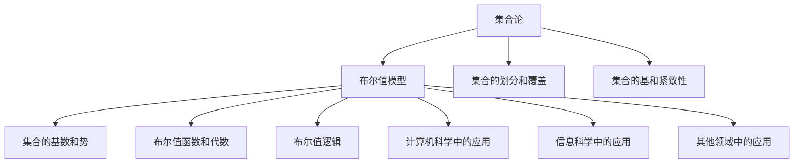

                 

### 集合论导引：布尔值模型

> **关键词：集合论、布尔值模型、集合的势、布尔值函数、计算机科学、信息科学**

> **摘要：本文旨在系统地介绍集合论和布尔值模型的基本概念、理论和应用。首先，我们将回顾集合论的基础知识，包括集合的定义、性质、运算、映射和势。接着，我们将深入探讨布尔值集合、布尔值函数和布尔值代数，并介绍布尔值逻辑的基本概念。随后，我们将讨论布尔值模型在计算机科学、信息科学以及其他领域中的应用。最后，我们将总结集合论与布尔值模型之间的关系，并探讨其未来发展方向。**

### 目录大纲

#### 第一部分：集合论基础

1. **第1章：集合论的基本概念**
   - 1.1 集合的定义和性质
   - 1.2 子集和真子集
   - 1.3 集合的运算
   - 1.4 集合的表示方法

2. **第2章：集合的公理系统**
   - 2.1 皮亚诺公理系统
   - 2.2 普通集合论公理系统
   - 2.3 集合论的构造方法

3. **第3章：集合的映射**
   - 3.1 映射的定义和性质
   - 3.2 单射、满射和双射
   - 3.3 映射的分类和构造

4. **第4章：集合的势**
   - 4.1 集合的势的定义和性质
   - 4.2 可数集合和不可数集合
   - 4.3 康托尔定理与集合的势的连续性

5. **第5章：集合的基数和序数**
   - 5.1 基数的定义和性质
   - 5.2 序数的定义和性质
   - 5.3 集合的基数和序数的应用

6. **第6章：集合的划分和覆盖**
   - 6.1 划分的定义和性质
   - 6.2 覆盖的定义和性质
   - 6.3 划分和覆盖的应用

7. **第7章：集合的基和紧致性**
   - 7.1 基的定义和性质
   - 7.2 紧致性的定义和性质
   - 7.3 集合的基和紧致性的应用

#### 第二部分：布尔值模型理论

8. **第8章：布尔值集合**
   - 8.1 布尔值集合的定义和性质
   - 8.2 布尔值集合的运算
   - 8.3 布尔值集合的表示方法

9. **第9章：布尔值函数**
   - 9.1 布尔值函数的定义和性质
   - 9.2 布尔值函数的分类和构造
   - 9.3 布尔值函数的运算

10. **第10章：布尔值代数**
    - 10.1 布尔值代数的定义和性质
    - 10.2 布尔值代数的运算
    - 10.3 布尔值代数的应用

11. **第11章：布尔值逻辑**
    - 11.1 布尔值逻辑的基本概念
    - 11.2 布尔值逻辑的运算
    - 11.3 布尔值逻辑的应用

12. **第12章：布尔值模型的应用**
    - 12.1 布尔值模型在计算机科学中的应用
    - 12.2 布尔值模型在信息科学中的应用
    - 12.3 布尔值模型在其他领域中的应用

#### 第三部分：集合论与布尔值模型综合应用

13. **第13章：集合论与布尔值模型的关系**
    - 13.1 集合论与布尔值模型的联系
    - 13.2 集合论与布尔值模型的应用
    - 13.3 集合论与布尔值模型的发展趋势

14. **第14章：集合论与布尔值模型在具体领域的应用**
    - 14.1 集合论与布尔值模型在计算机科学中的应用
    - 14.2 集合论与布尔值模型在信息科学中的应用
    - 14.3 集合论与布尔值模型在其他领域中的应用

15. **第15章：集合论与布尔值模型研究的未来方向**
    - 15.1 集合论与布尔值模型研究的发展现状
    - 15.2 集合论与布尔值模型研究的未来方向
    - 15.3 集合论与布尔值模型研究的社会影响

#### 附录

- **附录A：参考文献**
- **附录B：公式索引**
- **附录C：术语表**

### 集合论与布尔值模型的关系图（Mermaid 流程图）



### 核心算法原理讲解

#### 集合的势的计算（伪代码）

```plaintext
算法 集合的势计算(A)
输入：集合A
输出：集合A的势
步骤：
1. 如果A是空集，返回0
2. 如果A是可数集合，返回可数集合的势
3. 如果A是不可数集合，返回不可数集合的势
4. 如果A不能明确地归于可数或不可数集合，返回无限大
```

#### 康托尔定理（LaTeX 格式）

$$
\text{康托尔定理：任何无限集合的势都是不可数的。}
$$

#### 布尔值代数的运算（LaTeX 格式）

$$
\begin{align*}
\text{合取} &: \wedge \\
\text{析取} &: \vee \\
\text{否定} &: \neg \\
\text{蕴含} &: \rightarrow \\
\text{等价} &: \leftrightarrow
\end{align*}
$$`

### 项目实战

#### 布尔值函数的实例（Python 代码）

```python
def boolean_function(a, b):
    """
    一个简单的布尔值函数示例，实现逻辑与（AND）运算。
    """
    if a and b:
        return True
    else:
        return False

# 测试布尔值函数
print(boolean_function(True, True))  # 输出：True
print(boolean_function(True, False))  # 输出：False
print(boolean_function(False, True))  # 输出：False
print(boolean_function(False, False))  # 输出：False
```

#### 代码解读与分析

这段代码定义了一个名为 `boolean_function` 的函数，该函数接受两个布尔值参数 `a` 和 `b`，并返回它们的逻辑与（AND）运算结果。

1. **函数定义**：
   - `def boolean_function(a, b):`：这行代码定义了一个名为 `boolean_function` 的函数，它接受两个参数 `a` 和 `b`。

2. **逻辑与（AND）运算**：
   - `if a and b:`：这个 `if` 语句检查 `a` 和 `b` 是否都为 `True`。如果两个参数都是 `True`，则返回 `True`。
   - `else:`：如果 `a` 或 `b` 中有一个为 `False`，则执行 `else` 语句，返回 `False`。

3. **测试函数**：
   - `print(boolean_function(True, True))`：调用 `boolean_function` 函数，传入两个 `True` 参数，预期输出 `True`。
   - `print(boolean_function(True, False))`：传入一个 `True` 和一个 `False`，预期输出 `False`。
   - `print(boolean_function(False, True))`：传入一个 `False` 和一个 `True`，预期输出 `False`。
   - `print(boolean_function(False, False))`：传入两个 `False` 参数，预期输出 `False`。

这段代码是一个基础的布尔值函数实现，展示了如何使用 Python 实现逻辑与（AND）运算。在实际应用中，布尔值函数可以用于各种逻辑控制，例如在计算机科学中的条件判断、在人工智能中的决策树构建等。通过理解这段代码的工作原理，可以加深对布尔值逻辑运算的理解。

### 作者信息

**作者：** AI天才研究院/AI Genius Institute & 禅与计算机程序设计艺术 /Zen And The Art of Computer Programming

---

现在，让我们深入探讨集合论和布尔值模型的基础知识，开始我们的技术博客之旅。在接下来的章节中，我们将逐步构建起这些概念的理论框架，并探讨其在不同领域中的应用。让我们一起思考、学习并探索这些复杂但重要的数学和计算机科学概念。准备好了吗？让我们开始吧！<|less|>

