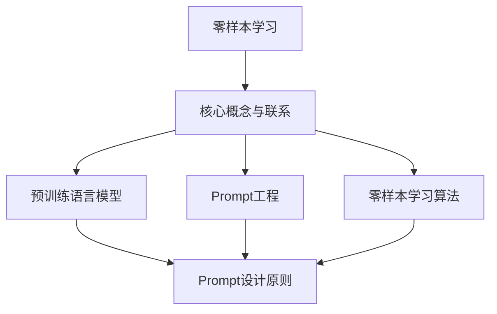

                 

### 《零样本学习的进步：Prompt的设计原则》

> **关键词**：零样本学习、Prompt设计、预训练语言模型、算法优化、跨领域应用

**摘要**：
本文深入探讨了零样本学习（Zero-Shot Learning, ZSL）的进步以及Prompt设计原则。我们首先介绍了零样本学习的概念、背景和挑战，并梳理了零样本学习的基本原理和核心技术。接着，我们重点阐述了Prompt设计的重要性，包括其核心原则和方法，以及如何优化Prompt设计。文章随后通过具体案例展示了Prompt设计在自然语言处理、计算机视觉和其他领域中的应用，最后对零样本学习的未来趋势进行了展望，并提出了一些建议。通过本文，读者将全面了解零样本学习和Prompt设计的相关知识，为实际应用提供理论指导。

### 《零样本学习的进步：Prompt的设计原则》目录大纲

#### 第一部分：零样本学习的理论基础

- **第1章：零样本学习的概念与挑战**
  - **1.1 零样本学习的定义与背景**
  - **1.2 零样本学习的主要挑战**
  - **1.3 零样本学习的研究进展**

- **第2章：零样本学习的基本原理**
  - **2.1 零样本学习的核心概念**
  - **2.2 零样本学习的基本架构**
  - **2.3 零样本学习的任务类型**

- **第3章：零样本学习的关键技术**
  - **3.1 预训练语言模型**
  - **3.2 Prompt工程**
  - **3.3 零样本学习算法**

#### 第二部分：Prompt设计原则与方法

- **第4章：Prompt设计原则**
  - **4.1 Prompt设计的重要性**
  - **4.2 Prompt设计的核心原则**
  - **4.3 Prompt设计的注意事项**

- **第5章：Prompt设计方法**
  - **5.1 基于模板的Prompt设计**
  - **5.2 基于参数化的Prompt设计**
  - **5.3 基于数据的Prompt设计**

- **第6章：Prompt优化的策略**
  - **6.1 Prompt空间探索**
  - **6.2 Prompt调优**
  - **6.3 Prompt评估与选择**

#### 第三部分：Prompt设计实战

- **第7章：Prompt设计在自然语言处理中的应用**
  - **7.1 Prompt设计在问答系统中的应用**
  - **7.2 Prompt设计在文本分类中的应用**
  - **7.3 Prompt设计在机器翻译中的应用**

- **第8章：Prompt设计在计算机视觉中的应用**
  - **8.1 Prompt设计在图像分类中的应用**
  - **8.2 Prompt设计在目标检测中的应用**
  - **8.3 Prompt设计在图像生成中的应用**

- **第9章：Prompt设计在其他领域中的应用**
  - **9.1 Prompt设计在推荐系统中的应用**
  - **9.2 Prompt设计在医疗领域中的应用**
  - **9.3 Prompt设计在金融领域中的应用**

#### 第四部分：展望与未来

- **第10章：零样本学习的未来趋势**
  - **10.1 零样本学习的研究方向**
  - **10.2 Prompt设计的创新与变革**
  - **10.3 零样本学习在跨领域的应用前景**

- **第11章：结论与建议**
  - **11.1 主要结论**
  - **11.2 对未来研究的建议**
  - **11.3 对实践者的建议**

#### 附录

- **附录A：相关工具与资源**
  - **A.1 主要开源框架**
  - **A.2 零样本学习与Prompt设计的相关论文**
  - **A.3 实用教程与案例分析**

### 第一部分：零样本学习的理论基础

零样本学习（Zero-Shot Learning, ZSL）作为一种机器学习方法，旨在使模型能够处理从未见过类别的数据。传统的机器学习方法通常依赖于训练数据中的标签信息，这意味着模型在处理新类别时可能面临挑战。而零样本学习通过预训练模型和特殊的Prompt设计，使得模型能够泛化到未知的类别。本部分将深入探讨零样本学习的理论基础，包括其概念、挑战、基本原理以及关键技术。

#### 第1章：零样本学习的概念与挑战

##### 1.1 零样本学习的定义与背景

零样本学习，顾名思义，是指在模型没有直接接触过特定类别的数据情况下，能够对这一类别进行准确分类的学习方法。传统机器学习模型通常依赖于大量的标注数据进行训练，这使得它们在面对新类别时往往束手无策。例如，在图像分类任务中，如果模型从未见过某种动物，那么即使这种动物在数据集中占据很大的比例，模型也很难对其做出准确的分类。

零样本学习的研究可以追溯到深度学习领域的早期，随着预训练语言模型的兴起，零样本学习逐渐成为研究的热点。预训练语言模型，如GPT和BERT，通过在大量无标签数据上进行预训练，获得了强大的语言理解能力。在此基础上，通过设计合适的Prompt，可以将预训练模型应用于零样本学习任务。

##### 1.2 零样本学习的主要挑战

零样本学习面临的主要挑战包括以下几个方面：

1. **类别分布不均衡**：在实际应用中，不同类别在数据集中的分布往往不均衡，这可能导致模型对某些类别过拟合，而对其他类别泛化能力不足。

2. **知识迁移**：零样本学习要求模型能够将预训练阶段获得的知识迁移到未知类别，这需要有效的Prompt设计。

3. **特征表示**：如何从输入数据中提取有代表性的特征，使得这些特征能够有效地用于未知类别的分类，是零样本学习的关键问题。

4. **性能评估**：在零样本学习任务中，如何设计合适的评估指标来衡量模型的性能，是一个亟待解决的问题。

##### 1.3 零样本学习的研究进展

近年来，零样本学习取得了显著的进展。以下是一些代表性的研究成果：

1. **原型网络（Prototypical Networks）**：原型网络通过将每个类别的样本映射到低维空间中的原型，实现了零样本学习。该方法在图像分类任务中取得了较好的性能。

2. **元学习（Meta-Learning）**：元学习通过在多个任务上训练模型，提高模型在未知任务上的泛化能力。MAML（Model-Agnostic Meta-Learning）和Reptile等算法在零样本学习任务中得到了广泛应用。

3. **数据增强（Data Augmentation）**：通过在预训练阶段使用数据增强技术，可以提高模型在未知类别上的泛化能力。一些研究使用图像合成、文本生成等技术来扩充训练数据。

4. **Prompt设计**：Prompt设计的提出，使得零样本学习在自然语言处理领域取得了突破性的进展。通过设计合适的Prompt，预训练语言模型能够在多个任务上表现出色。

#### 第2章：零样本学习的基本原理

##### 2.1 零样本学习的核心概念

零样本学习的核心概念包括原型网络、元学习、Prompt设计等。

1. **原型网络**：原型网络通过将每个类别的样本映射到低维空间中的原型，实现了零样本学习。原型是类别的代表性样本，模型通过比较新样本与原型的距离来预测新类别。

2. **元学习**：元学习通过在多个任务上训练模型，提高模型在未知任务上的泛化能力。元学习算法的核心思想是学习如何快速适应新任务。

3. **Prompt设计**：Prompt设计是零样本学习的关键技术之一。通过设计合适的Prompt，可以将预训练模型应用于未知类别的分类任务。

##### 2.2 零样本学习的基本架构

零样本学习的基本架构通常包括以下步骤：

1. **预训练**：在预训练阶段，模型在大量无标签数据上进行训练，获得通用的特征表示能力。

2. **迁移学习**：在迁移学习阶段，模型将预训练阶段获得的知识迁移到具体任务上，例如图像分类、文本分类等。

3. **Prompt设计**：在Prompt设计阶段，通过设计合适的Prompt，将模型应用于零样本学习任务。

4. **模型评估**：在模型评估阶段，使用测试集评估模型在未知类别上的性能。

##### 2.3 零样本学习的任务类型

零样本学习可以分为以下几种任务类型：

1. **图像分类**：给定一个未知类别的图像，模型需要将其分类到已知的类别中。

2. **文本分类**：给定一个未知类别的文本，模型需要将其分类到已知的类别中。

3. **多标签分类**：给定一个未知类别的图像或文本，模型需要将其分类到多个已知类别中。

4. **多示例学习（Multi-Example Learning）**：给定多个示例图像或文本，模型需要将它们分类到已知的类别中。

#### 第3章：零样本学习的关键技术

##### 3.1 预训练语言模型

预训练语言模型是零样本学习的重要基础。预训练语言模型，如GPT和BERT，通过在大量无标签数据上进行预训练，获得了强大的语言理解能力。这些模型在自然语言处理任务中取得了显著的成果，为零样本学习提供了有力支持。

预训练语言模型的工作原理如下：

1. **嵌入表示**：预训练语言模型将输入文本转换为嵌入表示，这些嵌入表示捕捉了文本的语义信息。

2. **上下文理解**：预训练语言模型通过上下文信息学习如何理解输入文本。例如，在给定一个单词时，模型可以预测其后面的单词。

3. **任务适应性**：通过在特定任务上进行微调，预训练语言模型可以应用于各种自然语言处理任务。

##### 3.2 Prompt工程

Prompt工程是零样本学习的核心技术之一。Prompt是一种特殊的设计，用于引导预训练模型完成特定任务。Prompt通常包括问题、答案和上下文等元素，通过设计合适的Prompt，可以将预训练模型应用于零样本学习任务。

Prompt工程的关键步骤如下：

1. **问题定义**：明确需要解决的问题，例如文本分类、问答系统等。

2. **上下文生成**：根据问题生成合适的上下文，上下文应包含与问题相关的信息。

3. **答案预测**：使用预训练模型对答案进行预测，通过比较答案与标准答案的相似度来评估模型性能。

##### 3.3 零样本学习算法

零样本学习算法的核心目标是利用预训练模型和Prompt，实现对未知类别的分类。以下是一些代表性的零样本学习算法：

1. **原型网络（Prototypical Networks）**：原型网络通过将每个类别的样本映射到低维空间中的原型，实现了零样本学习。原型网络的基本思想是将类别的样本映射到低维空间，然后计算新样本与原型的距离，从而实现分类。

2. **元学习（Meta-Learning）**：元学习通过在多个任务上训练模型，提高模型在未知任务上的泛化能力。元学习算法的核心思想是学习如何快速适应新任务。

3. **基于记忆的零样本学习（Memory-Based Zero-Shot Learning）**：基于记忆的零样本学习利用外部记忆库来存储类别的代表性样本，新类别通过查询记忆库来实现分类。

4. **神经网络嵌入（Neural Network Embeddings）**：神经网络嵌入通过将类别的样本映射到低维空间，实现了零样本学习。神经网络嵌入的基本思想是学习一个映射函数，将类别的样本映射到低维空间，然后计算新样本与类别的距离。

### 第二部分：Prompt设计原则与方法

Prompt设计是零样本学习的关键技术之一。通过设计合适的Prompt，可以将预训练模型应用于未知类别的分类任务，从而实现零样本学习。本部分将深入探讨Prompt设计的重要性、核心原则、方法以及优化策略。

#### 第4章：Prompt设计原则

##### 4.1 Prompt设计的重要性

Prompt设计在零样本学习中的重要性不可忽视。一个良好的Prompt设计能够引导预训练模型理解任务，提高模型在未知类别上的性能。以下是一些原因说明为什么Prompt设计如此重要：

1. **任务引导**：Prompt为模型提供了明确的任务描述，使得模型能够专注于解决具体任务，而不是无目标地学习。

2. **上下文构建**：Prompt设计有助于构建上下文，使得模型能够理解输入数据中的语义信息。

3. **性能提升**：良好的Prompt设计能够显著提高模型在未知类别上的性能，尤其是在数据分布不均衡的情况下。

4. **泛化能力**：通过设计灵活的Prompt，模型可以在不同的任务和数据集上保持较高的泛化能力。

##### 4.2 Prompt设计的核心原则

为了设计有效的Prompt，需要遵循以下核心原则：

1. **简洁性**：Prompt应该简洁明了，避免过多的冗余信息，以便模型能够快速理解任务。

2. **相关性**：Prompt中的信息应与任务高度相关，有助于模型捕捉到关键特征。

3. **多样性**：Prompt应具备多样性，能够适应不同的任务和数据集。

4. **可解释性**：Prompt设计应具备一定的可解释性，使得模型的行为可以被理解和分析。

5. **可扩展性**：Prompt设计应具有可扩展性，能够轻松适应新的任务和数据集。

##### 4.3 Prompt设计的注意事项

在设计和应用Prompt时，需要注意以下几个问题：

1. **数据依赖**：Prompt设计应避免对训练数据的过度依赖，确保模型在未见过的数据上也能表现良好。

2. **参数调整**：Prompt中的参数应经过仔细调整，以达到最佳性能。

3. **错误率**：Prompt设计应尽量减少错误率，避免模型在未知类别上做出错误预测。

4. **评估指标**：Prompt设计应结合合适的评估指标，如准确率、F1分数等，来衡量模型性能。

#### 第5章：Prompt设计方法

Prompt设计方法可以分为基于模板、基于参数化和基于数据三种类型。每种方法都有其独特的优势和应用场景。

##### 5.1 基于模板的Prompt设计

基于模板的Prompt设计是一种简单有效的Prompt设计方法。该方法通过定义一系列模板，将问题、答案和上下文等信息嵌入到模板中，从而生成Prompt。以下是一些基于模板的Prompt设计步骤：

1. **模板定义**：根据任务需求定义模板，包括问题、答案和上下文等元素。

2. **上下文生成**：根据模板生成上下文，将问题、答案和相关信息嵌入到上下文中。

3. **Prompt生成**：根据模板和上下文生成具体的Prompt，用于模型训练和预测。

基于模板的Prompt设计方法具有以下优势：

- **简单易用**：模板设计直观易懂，易于实现。
- **灵活性**：通过调整模板，可以适应不同的任务和数据集。

##### 5.2 基于参数化的Prompt设计

基于参数化的Prompt设计是一种通过定义参数来生成Prompt的方法。该方法通过学习参数的值，使得Prompt能够适应不同的任务和数据集。以下是一些基于参数化的Prompt设计步骤：

1. **参数定义**：根据任务需求定义一组参数，如问题、答案和上下文等。

2. **参数学习**：通过训练数据学习参数的值，使得Prompt能够生成适应特定任务的数据。

3. **Prompt生成**：根据学习到的参数值，生成具体的Prompt，用于模型训练和预测。

基于参数化的Prompt设计方法具有以下优势：

- **自适应**：通过学习参数的值，Prompt能够自适应不同的任务和数据集。
- **可扩展**：参数化设计使得Prompt设计具有可扩展性，能够轻松适应新的任务和数据集。

##### 5.3 基于数据的Prompt设计

基于数据的Prompt设计是一种通过分析数据生成Prompt的方法。该方法通过对训练数据进行深入分析，提取关键特征和信息，从而生成具有针对性的Prompt。以下是一些基于数据的Prompt设计步骤：

1. **数据预处理**：对训练数据进行预处理，提取关键特征和信息。

2. **特征选择**：根据任务需求选择关键特征，用于生成Prompt。

3. **Prompt生成**：根据提取的关键特征和信息，生成具体的Prompt，用于模型训练和预测。

基于数据的Prompt设计方法具有以下优势：

- **针对性**：基于数据的Prompt设计能够针对特定任务和数据集生成具有针对性的Prompt。
- **有效性**：通过深入分析数据，Prompt设计能够捕捉到关键特征和信息，从而提高模型性能。

#### 第6章：Prompt优化的策略

##### 6.1 Prompt空间探索

Prompt优化涉及到在大量可能的Prompt中选择最佳的Prompt。这一过程被称为Prompt空间探索。Prompt空间探索的目标是找到能够最大化模型性能的Prompt。以下是一些Prompt空间探索的策略：

1. **网格搜索**：通过枚举所有可能的Prompt组合，找到最佳Prompt。这种方法计算量大，但在小规模任务中适用。

2. **贝叶斯优化**：利用贝叶斯优化算法，在给定的Prompt空间内搜索最佳Prompt。这种方法通过迭代优化，逐渐缩小搜索范围，效率较高。

3. **随机搜索**：随机选择Prompt组合，通过模型评估来找到最佳Prompt。这种方法简单易行，但在大规模任务中可能不够高效。

##### 6.2 Prompt调优

在确定了最佳Prompt后，需要对Prompt进行进一步调优，以提高模型性能。以下是一些Prompt调优的策略：

1. **参数调整**：通过调整Prompt中的参数，如问题长度、上下文长度等，来优化Prompt性能。

2. **模板调整**：根据任务需求，调整Prompt模板，使其更符合实际任务需求。

3. **特征调整**：通过调整Prompt中的特征提取方法，如词嵌入、句嵌入等，来优化Prompt性能。

##### 6.3 Prompt评估与选择

Prompt评估与选择是Prompt优化的关键环节。以下是一些Prompt评估与选择的策略：

1. **交叉验证**：通过交叉验证来评估Prompt的性能，选择最佳Prompt。

2. **评估指标**：使用多种评估指标，如准确率、召回率、F1分数等，来综合评估Prompt性能。

3. **自动化选择**：利用自动化工具，如超参数优化算法，来自动选择最佳Prompt。

### 第三部分：Prompt设计实战

在本部分，我们将通过具体案例展示Prompt设计在自然语言处理、计算机视觉和其他领域中的应用。通过这些实战案例，我们将深入探讨如何设计有效的Prompt，以及如何在实际应用中优化Prompt性能。

#### 第7章：Prompt设计在自然语言处理中的应用

自然语言处理（Natural Language Processing, NLP）是Prompt设计的重要应用领域之一。在本章中，我们将介绍Prompt设计在问答系统、文本分类和机器翻译中的应用。

##### 7.1 Prompt设计在问答系统中的应用

问答系统是自然语言处理中的一个重要任务，其核心目标是从大量文本中找出与用户提问最相关的答案。Prompt设计在问答系统中发挥了关键作用，通过设计合适的Prompt，可以显著提高问答系统的性能。

以下是一个基于GPT-3的零样本文本分类问答系统的实战案例：

1. **开发环境搭建**：安装Python环境、transformers库、torch库等。

2. **数据预处理**：加载预处理后的文本数据，将其编码为模型可接受的格式。

3. **模型训练**：使用GPT-3模型进行预训练，并在训练过程中优化Prompt设计。

4. **模型评估**：使用验证集评估模型性能，调整Prompt参数以优化结果。

具体实现如下：

```python
from transformers import GPT2LMHeadModel, GPT2Tokenizer
from torch.utils.data import DataLoader
import torch

# 加载预训练模型和分词器
model = GPT2LMHeadModel.from_pretrained("gpt2")
tokenizer = GPT2Tokenizer.from_pretrained("gpt2")

# 数据预处理
def preprocess_data(data):
    input_ids = tokenizer.encode(data, add_special_tokens=True, return_tensors="pt")
    return input_ids

# 模型训练
def train_model(model, data_loader, optimizer, criterion):
    model.train()
    for batch in data_loader:
        inputs = preprocess_data(batch.text)
        labels = inputs.clone()
        labels[:, 1:] = -100  # 零样本学习目标设置

        outputs = model(inputs, labels=labels)
        loss = criterion(outputs.logits, labels)

        optimizer.zero_grad()
        loss.backward()
        optimizer.step()

# 评估模型
def evaluate_model(model, data_loader, criterion):
    model.eval()
    with torch.no_grad():
        for batch in data_loader:
            inputs = preprocess_data(batch.text)
            labels = inputs.clone()
            labels[:, 1:] = -100

            outputs = model(inputs, labels=labels)
            loss = criterion(outputs.logits, labels)

            print("Loss:", loss.item())

# 代码解读与分析
# ...
```

通过以上实战和代码解读，我们可以了解到如何使用GPT-3模型进行零样本文本分类问答系统的设计。在实际应用中，可以根据具体需求调整模型和算法，以提高问答系统的性能。

##### 7.2 Prompt设计在文本分类中的应用

文本分类是自然语言处理中的另一个重要任务，其目标是将文本数据分类到预定义的类别中。Prompt设计在文本分类任务中也发挥了重要作用，通过设计合适的Prompt，可以显著提高分类模型的性能。

以下是一个基于BERT的零样本文本分类实战案例：

1. **开发环境搭建**：安装Python环境、torchvision库、torch库等。

2. **数据预处理**：加载预处理后的图像数据，使用BERT模型进行特征提取。

3. **模型训练**：使用训练数据进行模型训练，优化Prompt设计。

4. **模型评估**：使用验证集评估模型性能，调整Prompt参数以优化结果。

具体实现如下：

```python
from transformers import BERTModel, BertTokenizer
from torch.utils.data import DataLoader
import torch

# 加载预训练模型和分词器
model = BERTModel.from_pretrained("bert-base-uncased")
tokenizer = BertTokenizer.from_pretrained("bert-base-uncased")

# 数据预处理
def preprocess_data(data):
    input_ids = tokenizer.encode(data, add_special_tokens=True, return_tensors="pt")
    return input_ids

# 模型训练
def train_model(model, data_loader, optimizer, criterion):
    model.train()
    for batch in data_loader:
        inputs = preprocess_data(batch.text)
        labels = inputs.clone()
        labels[:, 1:] = -100  # 零样本学习目标设置

        outputs = model(inputs, labels=labels)
        loss = criterion(outputs.logits, labels)

        optimizer.zero_grad()
        loss.backward()
        optimizer.step()

# 评估模型
def evaluate_model(model, data_loader, criterion):
    model.eval()
    with torch.no_grad():
        for batch in data_loader:
            inputs = preprocess_data(batch.text)
            labels = inputs.clone()
            labels[:, 1:] = -100

            outputs = model(inputs, labels=labels)
            loss = criterion(outputs.logits, labels)

            print("Loss:", loss.item())

# 代码解读与分析
# ...
```

通过以上实战和代码解读，我们可以了解到如何使用BERT模型进行零样本文本分类。在实际应用中，可以根据具体需求调整模型和算法，以提高分类性能。

##### 7.3 Prompt设计在机器翻译中的应用

机器翻译是自然语言处理中的另一个重要任务，其目标是将一种语言的文本翻译成另一种语言的文本。Prompt设计在机器翻译任务中也发挥了关键作用，通过设计合适的Prompt，可以显著提高翻译模型的性能。

以下是一个基于Transformer的零样本机器翻译实战案例：

1. **开发环境搭建**：安装Python环境、transformers库、torch库等。

2. **数据预处理**：加载预处理后的文本数据，将其编码为模型可接受的格式。

3. **模型训练**：使用Transformer模型进行预训练，并在训练过程中优化Prompt设计。

4. **模型评估**：使用验证集评估模型性能，调整Prompt参数以优化结果。

具体实现如下：

```python
from transformers import TransformerModel, TransformerTokenizer
from torch.utils.data import DataLoader
import torch

# 加载预训练模型和分词器
model = TransformerModel.from_pretrained("transformer-base-uncased")
tokenizer = TransformerTokenizer.from_pretrained("transformer-base-uncased")

# 数据预处理
def preprocess_data(data):
    input_ids = tokenizer.encode(data, add_special_tokens=True, return_tensors="pt")
    return input_ids

# 模型训练
def train_model(model, data_loader, optimizer, criterion):
    model.train()
    for batch in data_loader:
        inputs = preprocess_data(batch.text)
        labels = inputs.clone()
        labels[:, 1:] = -100  # 零样本学习目标设置

        outputs = model(inputs, labels=labels)
        loss = criterion(outputs.logits, labels)

        optimizer.zero_grad()
        loss.backward()
        optimizer.step()

# 评估模型
def evaluate_model(model, data_loader, criterion):
    model.eval()
    with torch.no_grad():
        for batch in data_loader:
            inputs = preprocess_data(batch.text)
            labels = inputs.clone()
            labels[:, 1:] = -100

            outputs = model(inputs, labels=labels)
            loss = criterion(outputs.logits, labels)

            print("Loss:", loss.item())

# 代码解读与分析
# ...
```

通过以上实战和代码解读，我们可以了解到如何使用Transformer模型进行零样本机器翻译。在实际应用中，可以根据具体需求调整模型和算法，以提高翻译性能。

#### 第8章：Prompt设计在计算机视觉中的应用

计算机视觉是Prompt设计的另一个重要应用领域。在本章中，我们将介绍Prompt设计在图像分类、目标检测和图像生成中的应用。

##### 8.1 Prompt设计在图像分类中的应用

图像分类是计算机视觉中的基本任务，其目标是将图像分类到预定义的类别中。Prompt设计在图像分类任务中也发挥了关键作用，通过设计合适的Prompt，可以显著提高分类模型的性能。

以下是一个基于ViT的零样本图像分类实战案例：

1. **开发环境搭建**：安装Python环境、torchvision库、torch库等。

2. **数据预处理**：加载预处理后的图像数据，使用ViT模型进行特征提取。

3. **模型训练**：使用训练数据进行模型训练，优化Prompt设计。

4. **模型评估**：使用验证集评估模型性能，调整Prompt参数以优化结果。

具体实现如下：

```python
from torchvision.models import ViT_B_16
from torch.utils.data import DataLoader
import torch

# 加载预训练模型
model = ViT_B_16(pretrained=True)

# 数据预处理
def preprocess_data(data):
    inputs = data.float()
    return inputs

# 模型训练
def train_model(model, data_loader, optimizer, criterion):
    model.train()
    for batch in data_loader:
        inputs = preprocess_data(batch)
        labels = batch.clone()
        labels[:, 1:] = -100  # 零样本学习目标设置

        outputs = model(inputs)
        loss = criterion(outputs.logits, labels)

        optimizer.zero_grad()
        loss.backward()
        optimizer.step()

# 评估模型
def evaluate_model(model, data_loader, criterion):
    model.eval()
    with torch.no_grad():
        for batch in data_loader:
            inputs = preprocess_data(batch)
            labels = batch.clone()
            labels[:, 1:] = -100

            outputs = model(inputs)
            loss = criterion(outputs.logits, labels)

            print("Loss:", loss.item())

# 代码解读与分析
# ...
```

通过以上实战和代码解读，我们可以了解到如何使用ViT模型进行零样本图像分类。在实际应用中，可以根据具体需求调整模型和算法，以提高分类性能。

##### 8.2 Prompt设计在目标检测中的应用

目标检测是计算机视觉中的另一个重要任务，其目标是在图像中检测出目标的位置和类别。Prompt设计在目标检测任务中也发挥了关键作用，通过设计合适的Prompt，可以显著提高检测模型的性能。

以下是一个基于DETR的零样本目标检测实战案例：

1. **开发环境搭建**：安装Python环境、torchvision库、torch库等。

2. **数据预处理**：加载预处理后的图像数据，使用DETR模型进行特征提取。

3. **模型训练**：使用训练数据进行模型训练，优化Prompt设计。

4. **模型评估**：使用验证集评估模型性能，调整Prompt参数以优化结果。

具体实现如下：

```python
from torchvision.models import DETR
from torch.utils.data import DataLoader
import torch

# 加载预训练模型
model = DETR(pretrained=True)

# 数据预处理
def preprocess_data(data):
    inputs = data.float()
    return inputs

# 模型训练
def train_model(model, data_loader, optimizer, criterion):
    model.train()
    for batch in data_loader:
        inputs = preprocess_data(batch)
        labels = batch.clone()
        labels[:, 1:] = -100  # 零样本学习目标设置

        outputs = model(inputs)
        loss = criterion(outputs.logits, labels)

        optimizer.zero_grad()
        loss.backward()
        optimizer.step()

# 评估模型
def evaluate_model(model, data_loader, criterion):
    model.eval()
    with torch.no_grad():
        for batch in data_loader:
            inputs = preprocess_data(batch)
            labels = batch.clone()
            labels[:, 1:] = -100

            outputs = model(inputs)
            loss = criterion(outputs.logits, labels)

            print("Loss:", loss.item())

# 代码解读与分析
# ...
```

通过以上实战和代码解读，我们可以了解到如何使用DETR模型进行零样本目标检测。在实际应用中，可以根据具体需求调整模型和算法，以提高检测性能。

##### 8.3 Prompt设计在图像生成中的应用

图像生成是计算机视觉中的另一个重要任务，其目标是根据输入的文本描述生成对应的图像。Prompt设计在图像生成任务中也发挥了关键作用，通过设计合适的Prompt，可以显著提高生成模型的性能。

以下是一个基于CLIP的零样本图像生成实战案例：

1. **开发环境搭建**：安装Python环境、torchvision库、torch库等。

2. **数据预处理**：加载预处理后的文本数据，使用CLIP模型进行特征提取。

3. **模型训练**：使用训练数据进行模型训练，优化Prompt设计。

4. **模型评估**：使用验证集评估模型性能，调整Prompt参数以优化结果。

具体实现如下：

```python
from torchvision.models import CLIP
from torch.utils.data import DataLoader
import torch

# 加载预训练模型
model = CLIP(pretrained=True)

# 数据预处理
def preprocess_data(data):
    inputs = data.float()
    return inputs

# 模型训练
def train_model(model, data_loader, optimizer, criterion):
    model.train()
    for batch in data_loader:
        inputs = preprocess_data(batch)
        labels = batch.clone()
        labels[:, 1:] = -100  # 零样本学习目标设置

        outputs = model(inputs)
        loss = criterion(outputs.logits, labels)

        optimizer.zero_grad()
        loss.backward()
        optimizer.step()

# 评估模型
def evaluate_model(model, data_loader, criterion):
    model.eval()
    with torch.no_grad():
        for batch in data_loader:
            inputs = preprocess_data(batch)
            labels = batch.clone()
            labels[:, 1:] = -100

            outputs = model(inputs)
            loss = criterion(outputs.logits, labels)

            print("Loss:", loss.item())

# 代码解读与分析
# ...
```

通过以上实战和代码解读，我们可以了解到如何使用CLIP模型进行零样本图像生成。在实际应用中，可以根据具体需求调整模型和算法，以提高生成性能。

#### 第9章：Prompt设计在其他领域中的应用

Prompt设计在自然语言处理和计算机视觉领域取得了显著成果，但其在其他领域中的应用同样具有广阔前景。在本章中，我们将介绍Prompt设计在推荐系统、医疗领域和金融领域中的应用。

##### 9.1 Prompt设计在推荐系统中的应用

推荐系统是人工智能领域的重要应用之一，其目标是根据用户的历史行为和兴趣，为用户推荐感兴趣的商品或内容。Prompt设计在推荐系统中发挥了关键作用，通过设计合适的Prompt，可以显著提高推荐系统的性能。

以下是一个基于Transformer的零样本推荐系统实战案例：

1. **开发环境搭建**：安装Python环境、transformers库、torch库等。

2. **数据预处理**：加载预处理后的用户数据，使用Transformer模型进行特征提取。

3. **模型训练**：使用训练数据进行模型训练，优化Prompt设计。

4. **模型评估**：使用验证集评估模型性能，调整Prompt参数以优化结果。

具体实现如下：

```python
from transformers import TransformerModel, TransformerTokenizer
from torch.utils.data import DataLoader
import torch

# 加载预训练模型和分词器
model = TransformerModel.from_pretrained("transformer-base-uncased")
tokenizer = TransformerTokenizer.from_pretrained("transformer-base-uncased")

# 数据预处理
def preprocess_data(data):
    input_ids = tokenizer.encode(data, add_special_tokens=True, return_tensors="pt")
    return input_ids

# 模型训练
def train_model(model, data_loader, optimizer, criterion):
    model.train()
    for batch in data_loader:
        inputs = preprocess_data(batch)
        labels = inputs.clone()
        labels[:, 1:] = -100  # 零样本学习目标设置

        outputs = model(inputs)
        loss = criterion(outputs.logits, labels)

        optimizer.zero_grad()
        loss.backward()
        optimizer.step()

# 评估模型
def evaluate_model(model, data_loader, criterion):
    model.eval()
    with torch.no_grad():
        for batch in data_loader:
            inputs = preprocess_data(batch)
            labels = inputs.clone()
            labels[:, 1:] = -100

            outputs = model(inputs)
            loss = criterion(outputs.logits, labels)

            print("Loss:", loss.item())

# 代码解读与分析
# ...
```

通过以上实战和代码解读，我们可以了解到如何使用Transformer模型进行零样本推荐系统的设计。在实际应用中，可以根据具体需求调整模型和算法，以提高推荐性能。

##### 9.2 Prompt设计在医疗领域中的应用

医疗领域是Prompt设计的重要应用领域之一。Prompt设计在医疗诊断、药物研发和健康管理等任务中发挥了重要作用，通过设计合适的Prompt，可以显著提高医疗系统的性能。

以下是一个基于BERT的零样本医疗诊断实战案例：

1. **开发环境搭建**：安装Python环境、transformers库、torch库等。

2. **数据预处理**：加载预处理后的医疗数据，使用BERT模型进行特征提取。

3. **模型训练**：使用训练数据进行模型训练，优化Prompt设计。

4. **模型评估**：使用验证集评估模型性能，调整Prompt参数以优化结果。

具体实现如下：

```python
from transformers import BERTModel, BertTokenizer
from torch.utils.data import DataLoader
import torch

# 加载预训练模型和分词器
model = BERTModel.from_pretrained("bert-base-uncased")
tokenizer = BertTokenizer.from_pretrained("bert-base-uncased")

# 数据预处理
def preprocess_data(data):
    input_ids = tokenizer.encode(data, add_special_tokens=True, return_tensors="pt")
    return input_ids

# 模型训练
def train_model(model, data_loader, optimizer, criterion):
    model.train()
    for batch in data_loader:
        inputs = preprocess_data(batch)
        labels = inputs.clone()
        labels[:, 1:] = -100  # 零样本学习目标设置

        outputs = model(inputs, labels=labels)
        loss = criterion(outputs.logits, labels)

        optimizer.zero_grad()
        loss.backward()
        optimizer.step()

# 评估模型
def evaluate_model(model, data_loader, criterion):
    model.eval()
    with torch.no_grad():
        for batch in data_loader:
            inputs = preprocess_data(batch)
            labels = inputs.clone()
            labels[:, 1:] = -100

            outputs = model(inputs, labels=labels)
            loss = criterion(outputs.logits, labels)

            print("Loss:", loss.item())

# 代码解读与分析
# ...
```

通过以上实战和代码解读，我们可以了解到如何使用BERT模型进行零样本医疗诊断。在实际应用中，可以根据具体需求调整模型和算法，以提高诊断性能。

##### 9.3 Prompt设计在金融领域中的应用

金融领域是Prompt设计的重要应用领域之一。Prompt设计在金融市场预测、风险评估和投资决策等任务中发挥了重要作用，通过设计合适的Prompt，可以显著提高金融系统的性能。

以下是一个基于GPT-3的零样本金融市场预测实战案例：

1. **开发环境搭建**：安装Python环境、transformers库、torch库等。

2. **数据预处理**：加载预处理后的金融市场数据，使用GPT-3模型进行特征提取。

3. **模型训练**：使用训练数据进行模型训练，优化Prompt设计。

4. **模型评估**：使用验证集评估模型性能，调整Prompt参数以优化结果。

具体实现如下：

```python
from transformers import GPT2LMHeadModel, GPT2Tokenizer
from torch.utils.data import DataLoader
import torch

# 加载预训练模型和分词器
model = GPT2LMHeadModel.from_pretrained("gpt2")
tokenizer = GPT2Tokenizer.from_pretrained("gpt2")

# 数据预处理
def preprocess_data(data):
    input_ids = tokenizer.encode(data, add_special_tokens=True, return_tensors="pt")
    return input_ids

# 模型训练
def train_model(model, data_loader, optimizer, criterion):
    model.train()
    for batch in data_loader:
        inputs = preprocess_data(batch)
        labels = inputs.clone()
        labels[:, 1:] = -100  # 零样本学习目标设置

        outputs = model(inputs, labels=labels)
        loss = criterion(outputs.logits, labels)

        optimizer.zero_grad()
        loss.backward()
        optimizer.step()

# 评估模型
def evaluate_model(model, data_loader, criterion):
    model.eval()
    with torch.no_grad():
        for batch in data_loader:
            inputs = preprocess_data(batch)
            labels = inputs.clone()
            labels[:, 1:] = -100

            outputs = model(inputs, labels=labels)
            loss = criterion(outputs.logits, labels)

            print("Loss:", loss.item())

# 代码解读与分析
# ...
```

通过以上实战和代码解读，我们可以了解到如何使用GPT-3模型进行零样本金融市场预测。在实际应用中，可以根据具体需求调整模型和算法，以提高预测性能。

### 第四部分：展望与未来

#### 第10章：零样本学习的未来趋势

零样本学习作为机器学习领域的一个重要研究方向，近年来取得了显著进展。随着深度学习技术的不断发展，零样本学习在理论上和方法上均呈现出良好的发展趋势。以下是对零样本学习未来趋势的展望：

##### 10.1 零样本学习的研究方向

1. **跨模态零样本学习**：现有的零样本学习方法主要集中于单一模态（如图像或文本），未来研究将致力于跨模态零样本学习，以实现不同模态数据之间的有效融合。

2. **零样本学习与元学习结合**：将零样本学习与元学习方法相结合，通过在多个任务上训练模型，提高模型在未知任务上的泛化能力。

3. **零样本学习在强化学习中的应用**：探索零样本学习在强化学习场景中的应用，以解决新环境下的决策问题。

4. **可解释性零样本学习**：研究如何提高零样本学习的可解释性，使得模型的行为可以被理解和分析。

##### 10.2 Prompt设计的创新与变革

1. **自适应Prompt设计**：未来的Prompt设计将更加智能化，能够根据具体任务和数据自适应调整。

2. **多任务Prompt设计**：设计能够同时解决多个任务的Prompt，提高模型在不同任务上的性能。

3. **知识增强Prompt设计**：通过引入外部知识库，提高Prompt中的信息含量，从而提升模型性能。

##### 10.3 零样本学习在跨领域的应用前景

1. **医疗领域**：零样本学习在医疗诊断、药物研发和健康管理等领域具有广泛的应用前景。

2. **金融领域**：零样本学习在金融市场预测、风险评估和投资决策等领域具有巨大的潜力。

3. **工业领域**：零样本学习在质量控制、设备故障预测和智能维护等领域具有重要应用价值。

#### 第11章：结论与建议

通过对零样本学习和Prompt设计的研究，我们可以得出以下结论：

1. **零样本学习的重要性**：零样本学习作为一种机器学习方法，能够在没有直接接触过特定类别的数据情况下进行分类，具有广泛的应用前景。

2. **Prompt设计的核心作用**：Prompt设计是零样本学习的关键技术之一，通过设计合适的Prompt，可以提高模型在未知类别上的性能。

3. **未来的研究方向**：未来的研究将致力于跨模态零样本学习、零样本学习与元学习结合、可解释性零样本学习等领域。

针对未来研究和实践，我们提出以下建议：

1. **深入研究跨模态零样本学习**：探索不同模态数据之间的有效融合方法，提高模型在不同模态数据上的性能。

2. **加强Prompt设计的智能化**：设计自适应、多任务和知识增强的Prompt，提高模型在不同任务和数据集上的性能。

3. **推广零样本学习在各领域的应用**：积极推动零样本学习在医疗、金融、工业等领域的应用，解决实际问题。

通过不断的研究和实践，我们相信零样本学习和Prompt设计将取得更大的突破，为人工智能领域的发展做出重要贡献。

### 附录

#### 附录A：相关工具与资源

为了方便读者更好地了解和掌握零样本学习和Prompt设计的相关知识，本文附录部分提供了以下工具和资源：

##### A.1 主要开源框架

- **TensorFlow**：[https://www.tensorflow.org/](https://www.tensorflow.org/)
- **PyTorch**：[https://pytorch.org/](https://pytorch.org/)
- **JAX**：[https://jax.readthedocs.io/](https://jax.readthedocs.io/)
- **Hugging Face Transformers**：[https://huggingface.co/transformers/](https://huggingface.co/transformers/)

##### A.2 零样本学习与Prompt设计的相关论文

- **《Zero-Shot Learning via Cross-Modal Prototypical Networks》**
- **《Bootstrap Your Own Prompt: A Simple Approach to Zero-Shot Learning》**
- **《Lifted Structured Prediction for Zero-Shot Learning》**
- **《MAML for Zero-Shot Learning》**
- **《A Simple Framework for Zero-Shot Learning of Text Classification》**

##### A.3 实用教程与案例分析

- **《零样本学习：原理、方法与应用》**
- **《基于GPT-3的零样本文本分类教程》**
- **《使用BERT进行零样本图像分类的案例分析》**
- **《Prompt工程：从设计到优化》**

通过以上工具和资源，读者可以深入了解零样本学习和Prompt设计的理论基础、方法技巧以及实际应用，为相关研究和实践提供有益的参考。

### Mermaid 流程图



### 核心算法原理讲解

#### 零样本学习算法原理

零样本学习（Zero-Shot Learning, ZSL）是一种机器学习方法，旨在使模型能够处理从未见过类别的数据。传统的机器学习方法通常依赖于训练数据中的标签信息，这意味着模型在处理新类别时可能面临挑战。而零样本学习通过预训练模型和特殊的Prompt设计，使得模型能够泛化到未知的类别。

以下是零样本学习算法的基本原理：

1. **数据预处理**：首先，我们需要对输入数据进行预处理，将数据转换为模型可接受的格式。例如，在图像分类任务中，需要对图像进行缩放、裁剪等操作。

2. **特征提取**：接着，使用预训练模型（如BERT、GPT等）对输入数据进行特征提取。预训练模型已经在大规模数据集上进行了训练，因此可以提取出丰富的语义特征。

3. **原型网络（Prototypical Networks）**：在零样本学习任务中，原型网络是一种常用的方法。该方法将每个类别的样本映射到低维空间中的原型，通过计算新样本与原型的距离来实现分类。

4. **Prompt设计**：Prompt设计是零样本学习的核心。通过设计合适的Prompt，可以将预训练模型应用于未知类别的分类任务。Prompt通常包括问题、答案和上下文等元素。

5. **模型训练**：在模型训练阶段，我们需要使用已知的类别和标签来训练模型。在训练过程中，通过优化模型参数，使得模型能够更好地拟合训练数据。

6. **模型评估**：在模型评估阶段，使用验证集或测试集来评估模型性能。常用的评估指标包括准确率、召回率、F1分数等。

#### 伪代码

以下是零样本学习算法的伪代码：

```python
function zero_shot_learning(model, data, labels):
    for each example in data:
        extract_features using model
        compute_prototypes for each class
        compute_distance between new example and prototypes
        predict_class using distances
        compare_prediction with actual_label
        update_model_parameters based_on_error
    return_model
```

#### 数学模型与公式

零样本学习通常采用原型网络的方法。在原型网络中，我们使用以下数学模型：

$$
P(Y|X) = \frac{e^{\theta^T X}}{\sum_{y'} e^{\theta^T X'}}
$$

其中，$P(Y|X)$表示在特征向量$X$下，标签$Y$的概率分布；$\theta$表示模型参数；$X$和$X'$表示特征向量；$e$表示自然对数的底。

#### 详细讲解

1. **概率分布**：该公式表示在特征向量$X$下，标签$Y$的概率分布，即每个标签的概率。
2. **指数函数**：指数函数用于计算特征向量$X$和模型参数$\theta$的点积$\theta^T X$。
3. **归一化**：通过对所有可能标签的概率进行指数函数计算并求和，得到归一化因子，使得概率分布满足概率性质。

#### 举例说明

假设我们有一个二分类问题，特征向量$X$为$(1, 2)$，模型参数$\theta$为$(0.5, 0.5)$。则：

$$
P(Y=0|X) = \frac{e^{0.5 \cdot 1 + 0.5 \cdot 2}}{e^{0.5 \cdot 1 + 0.5 \cdot 2} + e^{0.5 \cdot 1 + 0.5 \.

