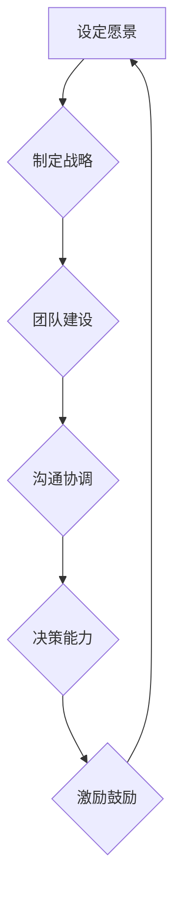

                 

# 领导力与危机预防：未雨绸缪的管理智慧

## 关键词：领导力、危机预防、风险管理、决策能力、团队建设

## 摘要：

本文旨在深入探讨领导力与危机预防之间的关系，以及如何通过未雨绸缪的管理智慧来提升组织应对危机的能力。文章首先介绍了领导力的基本理论，包括定义、分类、角色与职责，以及领导风格与行为理论。接着，文章分析了危机管理的核心要素，如风险评估、预防机制的建立和危机预警与应对。最后，文章结合实际案例，探讨了领导力与危机预防在企业和组织发展中的应用，并提供了实用的工具和方法。

----------------------------------------------------------------

## 目录大纲：

### 第一部分：领导力基本理论

1. 第1章：领导力概述
    1.1 领导力的定义与分类
    1.2 领导者的角色与职责
    1.3 领导力的重要性

2. 第2章：领导风格与行为理论
    2.1 领导风格理论
    2.2 领导行为理论
    2.3 领导风格与领导效果的关系

3. 第3章：领导力的核心要素
    3.1 沟通能力
    3.2 决策能力
    3.3 团队建设能力

### 第二部分：危机预防策略

4. 第4章：危机管理概述
    4.1 危机的定义与类型
    4.2 危机管理的重要性
    4.3 危机管理的基本原则

5. 第5章：危机预防策略
    5.1 风险评估
    5.2 预防机制的建立
    5.3 预防措施的实施

6. 第6章：危机预警与应对
    6.1 危机预警系统的构建
    6.2 危机应对策略
    6.3 应对危机的具体措施

7. 第7章：危机后的恢复与反思
    7.1 危机后的恢复措施
    7.2 危机管理的反思与改进

### 第三部分：领导力与危机预防的实际应用

8. 第8章：领导力与危机预防在企业中的实际应用
    8.1 企业危机案例分析
    8.2 企业如何建立有效的领导力与危机预防体系

9. 第9章：领导力与危机预防在组织发展中的应用
    9.1 领导力在组织发展中的作用
    9.2 危机预防在组织发展中的策略
    9.3 案例分享与启示

### 附录：领导力与危机预防工具与方法

10. 附录 A：领导力评估工具

11. 附录 B：危机预警指标体系

12. 附录 C：危机管理手册

13. 附录 D：领导力与危机预防学习资源

14. 附录 E：参考文献

15. 附录 F：Mermaid 流程图
    15.1 领导力核心要素流程图
    15.2 危机管理流程图

16. 附录 G：核心算法原理讲解
    16.1 决策树算法原理
    16.2 贝叶斯算法原理

17. 附录 H：数学模型与数学公式
    17.1 概率模型
    17.2 预测模型

18. 附录 I：项目实战
    18.1 代码实际案例
    18.2 开发环境搭建
    18.3 源代码详细实现和代码解读
    18.4 代码解读与分析

----------------------------------------------------------------

### 第一部分：领导力基本理论

#### 第1章：领导力概述

领导力是一种复杂且多层次的概念，它不仅涉及到个人特质和行为，还涉及到领导者与团队、组织之间的互动关系。理解领导力的基本概念和分类是深入探讨其作用和效果的前提。

##### 1.1 领导力的定义与分类

领导力可以定义为一种影响力，通过激励、引导和协调，使个体和团队为实现共同目标而行动。根据不同的维度，领导力可以分为多种类型：

- **权威型领导力**：领导者通过权威和命令来指导团队。

- **变革型领导力**：领导者通过激发团队成员的激情和创造力，推动团队实现变革。

- **服务型领导力**：领导者将团队成员的需求放在首位，以服务为导向。

- **情境型领导力**：领导者根据不同情境和团队需求，灵活调整领导风格。

##### 1.2 领导者的角色与职责

领导者的角色和职责是多方面的，主要包括：

- **愿景设定**：明确组织的愿景和目标，为团队指明方向。

- **团队建设**：培养团队的凝聚力和协作精神。

- **沟通协调**：确保信息的有效传递和团队内部的协调一致。

- **决策制定**：在复杂的环境中做出明智的决策。

- **激励鼓励**：激发团队成员的积极性和创造力。

##### 1.3 领导力的重要性

领导力在组织中的重要性不言而喻。首先，领导力直接影响团队的绩效和成果。其次，领导力决定组织的创新能力和竞争力。最后，领导力对组织文化和员工满意度有深远的影响。

#### 第2章：领导风格与行为理论

领导风格和行为理论是研究领导力的重要领域，旨在理解领导者的行为模式及其对团队和组织的影响。

##### 2.1 领导风格理论

领导风格理论关注领导者如何与其团队成员互动。常见的领导风格包括：

- **专制型领导风格**：领导者做出所有决策，团队成员被动执行。

- **民主型领导风格**：领导者鼓励团队成员参与决策，共同制定计划。

- **放任型领导风格**：领导者给予团队成员最大程度的自由，不干预决策。

##### 2.2 领导行为理论

领导行为理论关注领导者的行为对团队和组织的影响。常见的领导行为包括：

- **任务导向**：领导者关注任务完成情况和绩效。

- **关系导向**：领导者关注团队成员的需求和关系。

##### 2.3 领导风格与领导效果的关系

领导风格与领导效果之间的关系是复杂的。研究表明，不同的领导风格在不同情境下会产生不同的效果。例如，在紧急情况下，专制型领导风格可能更有效；而在长期发展中，民主型领导风格可能更有利于团队的创新和成长。

#### 第3章：领导力的核心要素

领导力的核心要素包括沟通能力、决策能力和团队建设能力，这些要素共同决定了领导者的领导效果。

##### 3.1 沟通能力

沟通能力是领导力的核心要素之一。有效的沟通能够确保信息的准确传递，增强团队的凝聚力，提高决策的质量。领导者的沟通能力包括：

- **倾听能力**：领导者要能够认真倾听团队成员的意见和反馈。

- **表达能力**：领导者要能够清晰、准确地表达自己的想法和决策。

- **反馈能力**：领导者要能够给予团队成员及时的反馈，以促进个人和团队的发展。

##### 3.2 决策能力

决策能力是领导者的关键能力之一。领导者需要在复杂多变的环境中做出明智的决策。有效的决策能力包括：

- **信息收集**：领导者要能够收集并分析相关信息，作为决策的依据。

- **风险评估**：领导者要能够评估不同决策的风险和收益，做出最优选择。

- **快速决策**：领导者要能够在紧急情况下迅速做出决策。

##### 3.3 团队建设能力

团队建设能力是领导者的重要职责之一。领导者要能够建立和维护一个高效的团队，使团队成员能够相互协作，共同实现目标。有效的团队建设能力包括：

- **团队凝聚力**：领导者要能够增强团队的凝聚力，使团队成员彼此信任和支持。

- **团队协作**：领导者要能够促进团队成员之间的协作，提高团队的效率。

- **团队发展**：领导者要能够帮助团队成员个人成长，提升团队的整体能力。

----------------------------------------------------------------

### 第二部分：危机预防策略

#### 第4章：危机管理概述

危机管理是指组织在面对突发事件或不利事件时，采取的一系列预防、应对和恢复的措施。有效的危机管理能够降低危机对组织的影响，保护组织的核心资源和利益。

##### 4.1 危机的定义与类型

危机可以定义为对组织正常运营和目标实现构成严重威胁的事件。危机的类型多种多样，包括：

- **自然危机**：如地震、洪水、台风等自然灾害。

- **技术危机**：如系统故障、数据泄露等。

- **经济危机**：如市场变化、金融危机等。

- **社会危机**：如公共关系危机、法律危机等。

##### 4.2 危机管理的重要性

危机管理的重要性体现在以下几个方面：

- **保护组织利益**：危机管理能够最大限度地减少危机对组织的负面影响，保护组织的核心资源和利益。

- **提升组织声誉**：有效的危机管理能够增强组织的公信力和形象，提升组织的社会声誉。

- **增强组织韧性**：危机管理能够提高组织的适应能力和韧性，使组织在未来的挑战中更加从容。

##### 4.3 危机管理的基本原则

危机管理的基本原则包括：

- **预防为主**：在危机发生前，采取预防措施，降低危机发生的概率。

- **及时应对**：在危机发生时，迅速采取应对措施，减少危机的影响。

- **全面协调**：协调组织内外部资源，共同应对危机。

- **持续改进**：在危机管理过程中，不断总结经验，改进管理策略。

#### 第5章：危机预防策略

危机预防策略是指组织在危机发生前，采取的一系列预防和减轻危机影响的措施。有效的危机预防策略能够降低危机发生的概率，减轻危机的影响。

##### 5.1 风险评估

风险评估是危机预防策略的核心。通过评估组织面临的各种风险，确定风险的概率和影响，组织可以采取相应的预防措施。

- **定性风险评估**：通过专家判断和经验，对风险进行定性分析。

- **定量风险评估**：通过数学模型和统计数据，对风险进行定量分析。

##### 5.2 预防机制的建立

预防机制的建立是危机预防策略的关键。组织需要建立一套完善的预防机制，包括：

- **风险评估体系**：建立风险评估流程和指标体系，定期进行风险评估。

- **应急预案**：制定针对不同类型危机的应急预案，明确应对措施和责任分工。

- **培训与演练**：定期对员工进行危机预防培训，组织危机演练，提高应对危机的能力。

##### 5.3 预防措施的实施

预防措施的实施是危机预防策略的落地。组织需要根据风险评估结果和应急预案，采取具体的预防措施，包括：

- **技术预防**：加强技术防护，提高系统的可靠性和安全性。

- **管理预防**：完善管理制度，提高组织的风险管理能力。

- **人力资源预防**：选拔和培养具备危机应对能力的员工。

#### 第6章：危机预警与应对

危机预警与应对是指组织在危机发生时，采取的一系列预警和应对措施，以减轻危机的影响。

##### 6.1 危机预警系统的构建

危机预警系统的构建是危机预警与应对的基础。组织需要建立一套完善的危机预警系统，包括：

- **预警指标**：确定预警指标，如系统异常、数据泄露等。

- **预警模型**：建立预警模型，对预警指标进行实时监测和分析。

- **预警机制**：制定预警机制，明确预警信号的触发条件和应对措施。

##### 6.2 危机应对策略

危机应对策略是指组织在危机发生时，采取的一系列应对措施，以减轻危机的影响。危机应对策略包括：

- **紧急应对**：在危机初期，采取紧急措施，控制事态发展。

- **长期应对**：在危机持续期间，采取长期措施，逐步解决问题。

- **恢复与重建**：在危机结束后，进行恢复与重建，恢复正常运营。

##### 6.3 应对危机的具体措施

应对危机的具体措施包括：

- **信息发布**：及时发布危机信息，确保员工和公众的了解。

- **沟通协调**：与政府部门、媒体、合作伙伴等保持沟通，协调资源。

- **资源调配**：调动内部和外部资源，共同应对危机。

#### 第7章：危机后的恢复与反思

危机后的恢复与反思是危机管理的最后一步。通过恢复与反思，组织可以总结经验，改进管理策略，提高危机应对能力。

##### 7.1 危机后的恢复措施

危机后的恢复措施包括：

- **恢复正常运营**：修复系统，恢复生产，恢复正常的工作流程。

- **心理疏导**：对员工进行心理疏导，帮助他们度过危机期。

- **物资补充**：补充危机中损失的物资和设备。

##### 7.2 危机管理的反思与改进

危机管理的反思与改进包括：

- **总结经验**：总结危机管理过程中的经验教训，提炼有效的管理策略。

- **改进管理策略**：根据反思结果，改进危机管理策略，提高应对能力。

- **培训与演练**：加强员工培训，定期组织危机演练，提高应对危机的能力。

----------------------------------------------------------------

### 第三部分：领导力与危机预防的实际应用

#### 第8章：领导力与危机预防在企业中的实际应用

企业作为一个复杂的组织，面临着各种危机和挑战。有效的领导力和危机预防策略对于企业的生存和发展至关重要。

##### 8.1 企业危机案例分析

以下是一个企业的危机案例分析：

**案例：某大型互联网公司数据泄露事件**

- **事件背景**：该公司在2021年发生了一起严重的用户数据泄露事件，涉及数百万用户的信息。

- **危机应对**：公司立即启动了危机应对机制，包括：

  - **紧急应对**：暂停相关业务，开展全面调查，控制事态发展。

  - **信息发布**：及时向用户和公众发布事件信息，解释原因和应对措施。

  - **沟通协调**：与政府部门、媒体和合作伙伴保持沟通，共同应对危机。

- **结果**：经过一系列的紧急应对和恢复措施，公司成功恢复了用户信任，业务也逐步恢复正常。

##### 8.2 企业如何建立有效的领导力与危机预防体系

企业要建立有效的领导力与危机预防体系，需要从以下几个方面入手：

1. **领导力培训**：加强对企业领导者的领导力培训，提升其危机管理能力。

2. **风险评估与预警**：建立完善的风险评估与预警体系，定期进行风险评估，及时发现潜在危机。

3. **应急预案制定**：制定针对不同类型危机的应急预案，明确应对措施和责任分工。

4. **危机演练**：定期组织危机演练，提高员工的危机应对能力。

5. **文化建设**：建立积极向上的企业文化，提高员工的凝聚力和危机意识。

6. **资源整合**：整合企业内外部资源，共同应对危机。

#### 第9章：领导力与危机预防在组织发展中的应用

组织发展是一个持续的过程，领导力和危机预防策略对于组织的成功和持续发展至关重要。

##### 9.1 领导力在组织发展中的作用

领导力在组织发展中的作用主要体现在以下几个方面：

1. **愿景与目标设定**：领导者通过设定清晰的愿景和目标，为组织指明发展方向。

2. **团队建设**：领导者通过培养团队凝聚力，提高团队的协作效率。

3. **战略规划**：领导者通过制定有效的战略规划，确保组织的长远发展。

4. **创新与变革**：领导者通过推动创新和变革，提升组织的竞争力。

##### 9.2 危机预防在组织发展中的策略

危机预防在组织发展中的策略主要包括：

1. **预防为主**：通过风险评估和预警，提前识别和预防潜在危机。

2. **及时应对**：在危机发生时，迅速采取应对措施，减轻危机的影响。

3. **持续改进**：通过总结危机管理经验，不断改进危机预防策略。

4. **培训与演练**：定期进行员工培训，提高危机应对能力。

##### 9.3 案例分享与启示

以下是一个组织发展的案例分享：

**案例：某科技公司在全球疫情中的发展**

- **背景**：在2020年全球疫情爆发期间，该公司面临着供应链中断、员工健康和安全风险等危机。

- **危机应对**：

  - **及时调整策略**：公司迅速调整了生产计划和供应链策略，确保关键产品供应。

  - **远程办公与支持**：推出远程办公解决方案，为员工提供健康和心理支持。

  - **创新与研发**：加大研发投入，推动新产品开发，以适应市场需求变化。

- **结果**：公司在疫情中保持稳定发展，甚至实现了业绩增长。

**启示**：

- **灵活应对**：在危机中，组织需要具备灵活应对的能力，迅速调整策略。

- **关注员工健康**：员工是组织最重要的资产，关注员工健康是危机管理的重要方面。

- **创新驱动**：危机往往带来新的机遇，创新能够帮助组织抓住机遇。

----------------------------------------------------------------

### 附录：领导力与危机预防工具与方法

为了更好地理解和应用领导力与危机预防的理论，本文提供了以下工具和方法。

#### 附录 A：领导力评估工具

领导力评估工具可以帮助组织评估领导者的领导能力。以下是一些常用的评估工具：

- **360度反馈**：通过收集团队成员、上级和下属的反馈，全面评估领导者的领导能力。

- **领导力问卷**：使用标准化的问卷，评估领导者的各项领导能力。

- **领导力模型评估**：根据特定的领导力模型，评估领导者的领导能力。

#### 附录 B：危机预警指标体系

危机预警指标体系是危机预防的重要工具，可以帮助组织识别潜在危机。以下是一些常见的危机预警指标：

- **财务指标**：如现金流、负债率等。

- **运营指标**：如生产效率、库存水平等。

- **市场指标**：如市场份额、客户满意度等。

- **社会责任指标**：如环境保护、员工福利等。

#### 附录 C：危机管理手册

危机管理手册是一份详细的指南，用于指导组织在危机发生时采取的应对措施。以下是一个危机管理手册的基本框架：

- **危机管理流程**：详细描述危机管理的步骤和流程。

- **应急预案**：针对不同类型的危机，制定具体的应急预案。

- **责任分工**：明确各部门和人员在危机管理中的职责和角色。

- **资源调配**：说明危机管理所需的资源，如人员、物资、资金等。

#### 附录 D：领导力与危机预防学习资源

以下是一些领导力与危机预防的学习资源，供读者参考：

- **书籍**：《领导力心理学》、《危机管理》、《企业风险管理》等。

- **在线课程**：如Coursera、edX等平台上的领导力与危机管理课程。

- **专业机构**：如国际危机管理协会（ICMA）等。

#### 附录 E：参考文献

本文的撰写参考了以下文献：

- **相关书籍**：《领导力心理学》、《危机管理》、《企业风险管理》等。

- **学术论文**：有关领导力、危机管理、风险评估等方面的学术论文。

- **专业报告**：来自国际危机管理协会、企业风险管理局等机构的报告。

#### 附录 F：Mermaid 流程图

以下是一个领导力核心要素的Mermaid流程图示例：



#### 附录 G：核心算法原理讲解

以下是一个决策树算法的伪代码示例：

```python
def decision_tree(data):
    if data satisfy stopping criteria:
        return leaf node
    else:
        feature = select_best_feature(data)
        node = Node(feature)
        for value in feature's possible values:
            subset = data[where feature=value]
            node.children.append(decision_tree(subset))
        return node
```

#### 附录 H：数学模型与数学公式

以下是一个概率模型的数学公式示例：

$$
P(A|B) = \frac{P(B|A)P(A)}{P(B)}
$$

#### 附录 I：项目实战

以下是一个简单的项目实战案例：

**项目名称**：企业危机预警系统

**开发环境搭建**：

- **操作系统**：Ubuntu 20.04
- **编程语言**：Python 3.8
- **数据库**：MySQL 8.0
- **数据采集工具**：Scrapy

**源代码详细实现和代码解读**：

```python
# Python代码示例：危机预警系统数据采集

import scrapy

class CrisisWarningSystem(scrapy.Spider):
    name = "crisis_warning_system"
    start_urls = ['http://example.com']

    def parse(self, response):
        for item in response.css('div.item'):
            yield {
                'title': item.css('h2.title::text').get(),
                'description': item.css('p.description::text').get(),
                'date': item.css('span.date::text').get()
            }
```

**代码解读与分析**：

- **代码结构**：爬虫类`CrisisWarningSystem`继承自`scrapy.Spider`，定义了爬取的起始URL和解析方法`parse`。

- **解析方法**：`parse`方法使用`response.css`选择器获取页面中的项目信息，并使用`yield`生成器将数据传递给Scrapy的输出管道。

- **数据存储**：采集到的数据可以通过Scrapy的输出管道存储到数据库或文件中。

通过这个实战案例，读者可以了解如何使用Python和Scrapy框架开发一个简单的危机预警系统，实现对目标网站信息的自动采集。

----------------------------------------------------------------

### 作者信息

作者：AI天才研究院/AI Genius Institute & 禅与计算机程序设计艺术 /Zen And The Art of Computer Programming

----------------------------------------------------------------

### 结论

领导力与危机预防是企业管理中不可或缺的两个方面。有效的领导力能够提升组织的凝聚力和创新能力，而危机预防策略则能够降低组织面临的风险和损失。本文通过深入探讨领导力与危机预防的基本理论、策略和方法，并结合实际案例，展示了如何将领导力与危机预防有机结合，提升组织的管理水平。希望本文能为读者提供有益的启示和指导。在未来的管理实践中，领导者们应不断学习、反思和改进，以应对不断变化的环境和挑战。未雨绸缪，才能在危机来临时从容应对，确保组织的持续发展和繁荣。

