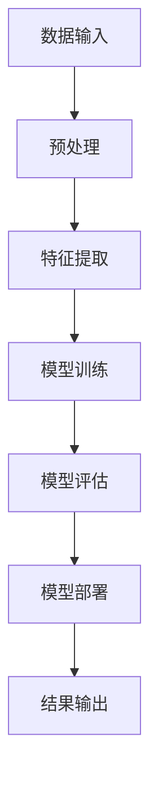
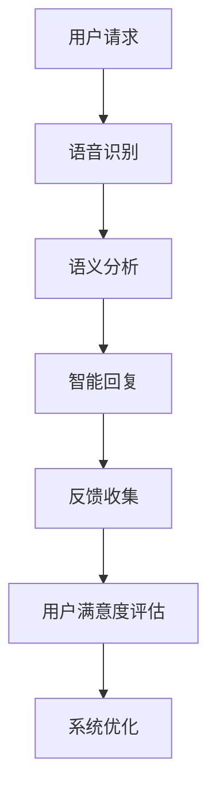
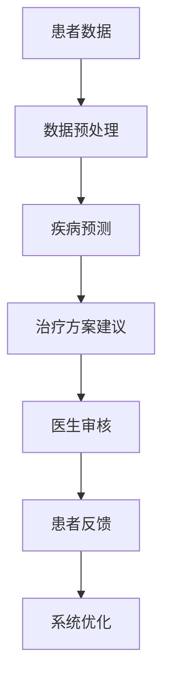

                 

# AI 2.0 时代的应用场景

> **关键词：** 人工智能，AI 2.0，应用场景，医疗，金融，智能制造，交通运输，智慧城市，伦理，法律

> **摘要：** 本文深入探讨了AI 2.0时代的概念、核心技术、应用场景以及面临的挑战和未来展望。通过详细分析AI 2.0在医疗、金融、智能制造、交通运输和智慧城市等领域的应用实例，本文旨在展示AI 2.0如何改变我们的生活，并探讨其在未来可能带来的影响。

### 目录大纲：AI 2.0时代的应用场景

1. 第一部分: AI 2.0时代的概念与基础
    1.1 AI 2.0概述
        1.1.1 AI 2.0的定义与特点
        1.1.2 AI 2.0与传统AI的差异
        1.1.3 AI 2.0的应用趋势与前景
    1.2 AI 2.0的核心技术
        1.2.1 人工智能大模型
        1.2.2 自适应学习系统
        1.2.3 强化学习算法
    1.3 AI 2.0时代的伦理与社会问题
        1.3.1 AI 2.0带来的伦理挑战
        1.3.2 AI 2.0与社会问题的关联
        1.3.3 如何应对AI 2.0时代的伦理挑战

2. 第二部分: AI 2.0在不同领域的应用场景
    2.1 人工智能在医疗领域的应用
        2.1.1 AI在医学影像分析中的应用
        2.1.2 AI在疾病诊断与预测中的应用
        2.1.3 AI在个性化医疗中的应用
    2.2 人工智能在金融领域的应用
        2.2.1 AI在风险管理中的应用
        2.2.2 AI在量化交易中的应用
        2.2.3 AI在客户服务与营销中的应用
    2.3 人工智能在智能制造领域的应用
        2.3.1 AI在制造过程优化中的应用
        2.3.2 AI在质量管理中的应用
        2.3.3 AI在供应链管理中的应用
    2.4 人工智能在交通运输领域的应用
        2.4.1 AI在自动驾驶中的应用
        2.4.2 AI在智能交通管理系统中的应用
        2.4.3 AI在物流与快递中的应用
    2.5 人工智能在智慧城市中的应用
        2.5.1 AI在公共安全中的应用
        2.5.2 AI在环境监测中的应用
        2.5.3 AI在社区服务中的应用

3. 第三部分: AI 2.0应用的实践与挑战
    3.1 AI 2.0应用的实践案例
        3.1.1 案例一：智能客服系统
        3.1.2 案例二：智慧医疗系统
        3.1.3 案例三：智能安防系统
    3.2 AI 2.0应用的技术挑战
        3.2.1 数据隐私与安全
        3.2.2 模型解释性与透明性
        3.2.3 技术可持续性与可扩展性
    3.3 AI 2.0应用的法律与伦理挑战
        3.3.1 法律法规与合规性
        3.3.2 伦理道德与责任归属
        3.3.3 公众接受度与社会影响

4. 第四部分: AI 2.0时代的未来展望
    4.1 AI 2.0时代的产业变革
        4.1.1 产业生态的变革
        4.1.2 企业竞争策略的调整
        4.1.3 创新模式的转变
    4.2 AI 2.0时代的教育变革
        4.2.1 教育模式的革新
        4.2.2 人才培养与教育体系的变革
        4.2.3 教育资源的优化配置
    4.3 AI 2.0时代的社会影响
        4.3.1 对社会结构的影响
        4.3.2 对人类生活方式的影响
        4.3.3 对国际合作与竞争的影响

5. 附录
    5.1 AI 2.0相关资源与工具
    5.2 Mermaid流程图
    5.3 伪代码与数学公式
    5.4 项目实战案例代码解读

---

### 第一部分: AI 2.0时代的概念与基础

#### 1.1 AI 2.0概述

##### 1.1.1 AI 2.0的定义与特点

AI 2.0，即第二代人工智能，是相对于第一代传统人工智能而言的。传统AI，即AI 1.0，主要依赖于明确的规则和算法进行数据处理和决策，其应用范围有限，主要集中在图像识别、语音识别、自然语言处理等领域。AI 2.0则突破了这一限制，通过深度学习、自适应学习、强化学习等先进算法，实现了更加智能化、自适应化和自主化的决策能力。

AI 2.0的主要特点包括：

1. **大规模数据处理能力**：AI 2.0能够处理海量的结构化和非结构化数据，挖掘出隐藏在数据中的价值信息。
2. **自适应学习能力**：AI 2.0能够在不断的学习过程中优化自身的决策能力，提高对复杂问题的解决能力。
3. **自主化决策能力**：AI 2.0可以通过强化学习等算法，实现自主决策，从而降低对人类干预的依赖。

##### 1.1.2 AI 2.0与传统AI的差异

AI 2.0与传统AI的主要差异在于其应用范围和决策能力。传统AI主要依赖于预定义的规则和算法，而AI 2.0则通过深度学习、自适应学习和强化学习等先进算法，实现了更加智能化、自适应化和自主化的决策能力。

具体来说，AI 2.0与传统AI的差异包括：

1. **应用范围**：传统AI主要应用于图像识别、语音识别、自然语言处理等领域，而AI 2.0则可以应用于更广泛的领域，如医疗、金融、智能制造、交通运输等。
2. **决策能力**：传统AI依赖于预定义的规则和算法，其决策能力有限；而AI 2.0则通过不断学习和优化，实现了更加智能化、自适应化和自主化的决策能力。

##### 1.1.3 AI 2.0的应用趋势与前景

随着AI技术的不断发展，AI 2.0的应用趋势和前景十分广阔。以下是一些AI 2.0的主要应用趋势：

1. **医疗领域**：AI 2.0在医学影像分析、疾病诊断与预测、个性化医疗等方面具有巨大潜力，可以有效提高医疗服务的质量和效率。
2. **金融领域**：AI 2.0在风险管理、量化交易、客户服务与营销等方面具有广泛的应用前景，可以帮助金融机构更好地管理风险、提高盈利能力。
3. **智能制造领域**：AI 2.0在制造过程优化、质量管理、供应链管理等方面具有显著优势，可以帮助企业提高生产效率、降低成本。
4. **交通运输领域**：AI 2.0在自动驾驶、智能交通管理系统、物流与快递等方面具有广泛应用前景，可以有效提高交通效率、减少交通事故。
5. **智慧城市领域**：AI 2.0在公共安全、环境监测、社区服务等方面具有广泛的应用潜力，可以帮助城市实现智能化管理、提高居民生活质量。

总的来说，AI 2.0不仅具有广阔的应用前景，还将在未来推动各领域的深刻变革。

#### 1.2 AI 2.0的核心技术

##### 1.2.1 人工智能大模型

人工智能大模型是AI 2.0的核心技术之一，它通过深度学习和大规模数据处理，实现了对复杂问题的建模和预测。大模型通常由数十亿甚至千亿个参数组成，具有强大的计算能力和表达能力。

**核心原理：**

- **深度学习**：深度学习是一种通过多层神经网络进行数据处理的机器学习技术。它通过前向传播和反向传播算法，逐层提取数据中的特征，最终实现复杂的函数映射。

- **大规模数据处理**：大模型需要处理海量的数据，这些数据来自不同的领域和来源，包括文本、图像、音频和视频等。通过大规模数据处理，大模型可以从中提取出有用的信息和模式。

**应用场景：**

- **医疗领域**：大模型可以用于医学影像分析、疾病诊断与预测、个性化医疗等，提高医疗服务的质量和效率。

- **金融领域**：大模型可以用于风险管理、量化交易、客户服务与营销等，帮助金融机构更好地管理风险、提高盈利能力。

- **智能制造领域**：大模型可以用于制造过程优化、质量管理、供应链管理等，帮助企业提高生产效率、降低成本。

- **交通运输领域**：大模型可以用于自动驾驶、智能交通管理系统、物流与快递等，提高交通效率、减少交通事故。

- **智慧城市领域**：大模型可以用于公共安全、环境监测、社区服务等，帮助城市实现智能化管理、提高居民生活质量。

##### 1.2.2 自适应学习系统

自适应学习系统是AI 2.0的另一项核心技术，它通过不断学习和自我优化，实现了更加智能化和自适应化的决策能力。

**核心原理：**

- **持续学习**：自适应学习系统可以持续地从数据中学习和优化，不断提高其决策能力和准确性。

- **在线学习**：自适应学习系统可以在运行过程中实时学习，从而适应不断变化的环境和需求。

- **自我优化**：自适应学习系统可以通过自我优化算法，不断调整和优化其模型参数，提高其性能和效率。

**应用场景：**

- **医疗领域**：自适应学习系统可以用于疾病预测、诊断和治疗，提高医疗服务的质量和效率。

- **金融领域**：自适应学习系统可以用于风险管理、量化交易、客户服务与营销等，帮助金融机构更好地管理风险、提高盈利能力。

- **智能制造领域**：自适应学习系统可以用于制造过程优化、质量管理、供应链管理等，帮助企业提高生产效率、降低成本。

- **交通运输领域**：自适应学习系统可以用于自动驾驶、智能交通管理系统、物流与快递等，提高交通效率、减少交通事故。

- **智慧城市领域**：自适应学习系统可以用于公共安全、环境监测、社区服务等，帮助城市实现智能化管理、提高居民生活质量。

##### 1.2.3 强化学习算法

强化学习算法是AI 2.0的重要组成部分，它通过不断尝试和反馈，实现了自主学习和决策能力。

**核心原理：**

- **尝试与反馈**：强化学习算法通过不断地尝试（行动）和接受反馈（奖励或惩罚），逐步优化其决策策略。

- **Q学习**：Q学习是强化学习的一种常见算法，它通过预测未来奖励，选择最优行动。

- **深度Q网络（DQN）**：DQN是Q学习的一种扩展，它通过神经网络预测未来奖励，实现了更加复杂和高效的决策。

**应用场景：**

- **自动驾驶**：强化学习算法可以用于自动驾驶车辆的路径规划、行为预测等，提高驾驶安全性和效率。

- **智能制造**：强化学习算法可以用于生产线的自动化优化、质量检测等，提高生产效率和产品质量。

- **金融交易**：强化学习算法可以用于量化交易策略的优化、风险控制等，提高交易效率和盈利能力。

- **游戏与娱乐**：强化学习算法可以用于游戏AI的设计，实现更加智能和自主的游戏体验。

- **机器人**：强化学习算法可以用于机器人的自主学习和决策，提高机器人的适应能力和效率。

#### 1.3 AI 2.0时代的伦理与社会问题

##### 1.3.1 AI 2.0带来的伦理挑战

AI 2.0的发展带来了许多伦理挑战，主要包括以下几个方面：

1. **隐私保护**：AI 2.0需要处理大量个人信息，如何确保这些信息的安全和隐私成为一个重要问题。

2. **算法偏见**：AI 2.0的决策过程可能受到数据偏见的影响，导致不公平或歧视性的决策。

3. **透明性和可解释性**：AI 2.0的决策过程往往复杂且难以解释，如何保证其透明性和可解释性是一个重要问题。

4. **责任归属**：在AI 2.0发生错误或导致损害时，如何确定责任归属是一个重要问题。

##### 1.3.2 AI 2.0与社会问题的关联

AI 2.0与社会问题密切相关，主要包括以下几个方面：

1. **就业影响**：AI 2.0的发展可能导致部分传统职业的消失，对就业市场产生重大影响。

2. **社会不平等**：AI 2.0可能加剧社会不平等，因为技术资源和信息资源主要集中在富裕阶层。

3. **社会控制**：AI 2.0可能被用于社会控制，例如通过监控和分析个人行为来预测和干预。

##### 1.3.3 如何应对AI 2.0时代的伦理挑战

应对AI 2.0时代的伦理挑战需要从多个方面进行：

1. **法律法规**：制定和完善相关法律法规，确保AI 2.0的合法性和合规性。

2. **技术标准**：制定和推广AI 2.0的技术标准和规范，提高其透明性和可解释性。

3. **伦理教育**：加强对公众的AI伦理教育，提高公众对AI 2.0的认知和参与度。

4. **多方合作**：政府、企业和学术机构等多方合作，共同应对AI 2.0时代的伦理挑战。

### 第二部分: AI 2.0在不同领域的应用场景

#### 2.1 人工智能在医疗领域的应用

##### 2.1.1 AI在医学影像分析中的应用

医学影像分析是AI在医疗领域的重要应用之一。通过深度学习和计算机视觉技术，AI可以自动识别和诊断医学影像中的病变和疾病。

**核心原理：**

- **深度学习**：深度学习模型可以自动提取医学影像中的特征，实现对病变和疾病的准确识别。

- **计算机视觉**：计算机视觉技术可以对医学影像进行预处理和分割，提高AI模型的识别准确率。

**应用场景：**

- **肺癌筛查**：AI可以自动分析CT影像，检测出肺结节，提高肺癌筛查的准确率和效率。

- **乳腺癌诊断**：AI可以自动分析乳腺影像，检测出乳腺癌病变，提高乳腺癌诊断的准确率和效率。

- **脑部疾病诊断**：AI可以自动分析MRI影像，检测出脑部病变，提高脑部疾病诊断的准确率和效率。

##### 2.1.2 AI在疾病诊断与预测中的应用

AI在疾病诊断与预测中的应用可以大大提高医疗服务的质量和效率。通过大数据分析和机器学习技术，AI可以预测疾病的发展趋势和患者的病情。

**核心原理：**

- **大数据分析**：大数据分析技术可以处理和分析大量的医疗数据，发现疾病发展的规律和特征。

- **机器学习**：机器学习技术可以通过训练模型，预测疾病的发展趋势和患者的病情。

**应用场景：**

- **糖尿病管理**：AI可以分析患者的血糖数据，预测糖尿病的发病风险和病情发展，帮助医生制定个性化的治疗方案。

- **心脏病预测**：AI可以分析患者的健康数据，预测心脏病的发生风险，帮助医生提前采取预防措施。

- **癌症复发预测**：AI可以分析患者的癌症数据，预测癌症的复发风险，帮助医生制定更有效的治疗方案。

##### 2.1.3 AI在个性化医疗中的应用

个性化医疗是AI在医疗领域的又一重要应用。通过AI技术，可以根据患者的个体差异，提供个性化的诊断和治疗建议。

**核心原理：**

- **个体差异分析**：AI技术可以分析患者的基因、生理、心理等多方面的数据，了解患者的个体差异。

- **个性化建议**：根据患者的个体差异，AI可以提供个性化的诊断和治疗建议，提高治疗效果。

**应用场景：**

- **基因检测**：AI可以分析患者的基因数据，预测患者可能患有的疾病，为医生提供诊断和治疗依据。

- **个性化治疗**：AI可以根据患者的病情和个体差异，制定个性化的治疗方案，提高治疗效果。

- **营养建议**：AI可以分析患者的饮食习惯和健康数据，提供个性化的营养建议，帮助患者改善健康状况。

#### 2.2 人工智能在金融领域的应用

##### 2.2.1 AI在风险管理中的应用

AI在风险管理中的应用可以帮助金融机构更好地识别和管理风险，提高金融市场的稳定性和安全性。

**核心原理：**

- **数据分析**：AI技术可以通过大数据分析，识别出潜在的风险因素，预测风险的概率和影响。

- **模型预测**：AI技术可以通过建立风险管理模型，预测风险的发展趋势和影响，帮助金融机构制定风险管理策略。

**应用场景：**

- **信用评分**：AI可以分析客户的信用历史、财务状况等数据，预测客户的信用风险，为金融机构提供信用评分依据。

- **市场预测**：AI可以分析市场数据，预测市场走势和投资风险，为金融机构提供投资决策参考。

- **风险管理**：AI可以监控和管理金融机构的风险，及时发现和应对潜在风险，提高金融市场的稳定性。

##### 2.2.2 AI在量化交易中的应用

量化交易是AI在金融领域的又一重要应用。通过机器学习和算法交易，AI可以自动执行交易策略，提高交易的效率和盈利能力。

**核心原理：**

- **机器学习**：AI技术可以通过学习历史交易数据，识别出交易机会和风险，制定交易策略。

- **算法交易**：AI技术可以通过算法交易系统，自动执行交易策略，实现高频交易和自动投资。

**应用场景：**

- **高频交易**：AI可以自动执行高频交易策略，提高交易速度和盈利能力。

- **自动投资**：AI可以自动分析市场数据，制定投资策略，实现自动化投资。

- **风险控制**：AI可以监控和管理交易风险，及时发现和应对潜在风险，提高交易的稳定性和安全性。

##### 2.2.3 AI在客户服务与营销中的应用

AI在客户服务与营销中的应用可以帮助金融机构提高客户满意度，增强客户粘性。

**核心原理：**

- **数据分析**：AI技术可以通过大数据分析，了解客户的需求和行为，提供个性化的服务和营销。

- **智能客服**：AI技术可以建立智能客服系统，自动解答客户的疑问，提供高效的客户服务。

**应用场景：**

- **智能客服**：AI可以自动回答客户的疑问，提供实时、高效的客户服务，提高客户满意度。

- **个性化营销**：AI可以根据客户的需求和行为，提供个性化的营销策略，增强客户粘性。

- **客户行为分析**：AI可以分析客户的行为数据，预测客户的需求和偏好，为金融机构提供精准的营销策略。

#### 2.3 人工智能在智能制造领域的应用

##### 2.3.1 AI在制造过程优化中的应用

AI在制造过程优化中的应用可以帮助企业提高生产效率、降低成本，提升竞争力。

**核心原理：**

- **数据分析**：AI技术可以通过大数据分析，识别出制造过程中的瓶颈和优化点。

- **优化算法**：AI技术可以通过优化算法，自动调整制造参数，实现生产过程的优化。

**应用场景：**

- **生产调度**：AI可以自动分析生产数据，优化生产调度，提高生产效率。

- **质量控制**：AI可以监控生产过程，识别出质量问题，提前采取措施，降低次品率。

- **设备维护**：AI可以分析设备数据，预测设备故障，提前进行维护，减少停机时间。

##### 2.3.2 AI在质量管理中的应用

AI在质量管理中的应用可以帮助企业提高产品质量，提升品牌价值。

**核心原理：**

- **数据分析**：AI技术可以通过大数据分析，识别出质量问题的根本原因。

- **智能检测**：AI技术可以通过智能检测设备，自动检测产品质量，提高检测效率和准确性。

**应用场景：**

- **质量检测**：AI可以自动检测产品质量，识别出质量问题，提前采取措施，提高产品质量。

- **缺陷分析**：AI可以分析产品质量数据，识别出缺陷的原因，提供改进建议。

- **质量预测**：AI可以预测产品质量的发展趋势，提前采取预防措施，降低质量风险。

##### 2.3.3 AI在供应链管理中的应用

AI在供应链管理中的应用可以帮助企业优化供应链流程，提高供应链效率。

**核心原理：**

- **数据分析**：AI技术可以通过大数据分析，识别出供应链中的瓶颈和优化点。

- **优化算法**：AI技术可以通过优化算法，自动调整供应链参数，实现供应链的优化。

**应用场景：**

- **库存管理**：AI可以自动分析库存数据，优化库存水平，减少库存成本。

- **物流优化**：AI可以优化物流路线，提高物流效率，降低物流成本。

- **供应链可视化**：AI可以建立供应链可视化系统，实时监控供应链状态，提高供应链管理效率。

#### 2.4 人工智能在交通运输领域的应用

##### 2.4.1 AI在自动驾驶中的应用

AI在自动驾驶中的应用是交通运输领域的一项重要技术创新。通过计算机视觉、深度学习和强化学习等AI技术，自动驾驶车辆可以自主感知环境、规划路径并安全行驶。

**核心原理：**

- **计算机视觉**：自动驾驶系统通过摄像头、激光雷达等传感器获取环境信息，利用计算机视觉技术进行目标检测、识别和跟踪。

- **深度学习**：深度学习算法对大量驾驶数据进行训练，使得自动驾驶系统能够学习和识别复杂的驾驶场景。

- **强化学习**：通过强化学习算法，自动驾驶系统能够不断优化其决策过程，提高行驶的安全性和效率。

**应用场景：**

- **城市交通**：自动驾驶车辆可以在城市道路上进行安全行驶，减少交通拥堵，提高交通效率。

- **长途运输**：自动驾驶卡车和货车可以在长途运输中减少驾驶员的工作量，提高运输效率。

- **共享出行**：自动驾驶出租车和共享出行服务可以提供更加便捷、高效的出行方式。

##### 2.4.2 AI在智能交通管理系统中的应用

智能交通管理系统是AI在交通运输领域的又一重要应用。通过数据分析和AI算法，智能交通管理系统可以优化交通信号控制、交通流量管理和公共交通调度，提高交通运行效率和安全性。

**核心原理：**

- **数据分析**：通过收集和分析交通数据，智能交通管理系统可以识别交通瓶颈和异常情况。

- **优化算法**：AI算法可以对交通信号进行动态调整，优化交通流量，减少拥堵。

- **预测分析**：通过预测交通流量和事故发生概率，智能交通管理系统可以提前采取预防措施，提高交通安全性。

**应用场景：**

- **交通信号优化**：智能交通管理系统可以根据实时交通数据调整交通信号，提高交通流畅性。

- **交通事故预警**：智能交通管理系统可以实时监控道路状况，预警潜在的事故风险。

- **公共交通调度**：智能交通管理系统可以根据乘客需求和实时交通状况，优化公共交通调度，提高服务效率。

##### 2.4.3 AI在物流与快递中的应用

AI在物流与快递中的应用可以帮助企业优化运输路径、提高配送效率，提升客户满意度。

**核心原理：**

- **路径优化**：AI算法可以根据实时交通数据和配送需求，自动优化运输路径，减少运输时间和成本。

- **库存管理**：AI技术可以分析库存数据，预测库存需求，优化库存管理，减少库存成本。

- **配送预测**：AI算法可以根据历史数据和实时信息，预测配送时间，提高配送准确性和客户满意度。

**应用场景：**

- **快递配送**：AI算法可以自动规划配送路线，提高配送效率和准确性。

- **仓库管理**：AI技术可以优化仓库布局和库存管理，提高仓库运营效率。

- **最后一公里配送**：AI技术可以帮助快递企业优化最后一公里配送，提高客户满意度。

#### 2.5 人工智能在智慧城市中的应用

##### 2.5.1 AI在公共安全中的应用

AI在公共安全中的应用可以帮助提升城市安全水平，预防犯罪，保护公众安全。

**核心原理：**

- **视频分析**：AI技术可以通过视频监控，自动识别和追踪可疑行为，预警潜在的安全威胁。

- **数据分析**：通过大数据分析，AI可以识别犯罪模式和趋势，预测犯罪热点区域。

- **生物识别**：AI技术可以通过人脸识别、指纹识别等技术，实现身份验证和追踪。

**应用场景：**

- **犯罪预警**：AI技术可以分析视频监控数据，预测犯罪活动，提前采取措施预防犯罪。

- **人员管理**：AI技术可以监控公共场所的人员流量，实现安全管理和人员分流。

- **紧急响应**：AI技术可以自动识别紧急事件，迅速调度应急资源，提高紧急响应效率。

##### 2.5.2 AI在环境监测中的应用

AI在环境监测中的应用可以帮助城市管理者实时监测环境质量，采取有效的环保措施。

**核心原理：**

- **传感器数据**：AI技术可以通过环境传感器，实时收集空气质量、水质、噪音等环境数据。

- **数据分析**：通过大数据分析，AI可以识别环境问题的来源和趋势，提供科学决策支持。

- **预测模型**：AI技术可以通过建立预测模型，预测环境质量的变化趋势，提前采取预防措施。

**应用场景：**

- **空气质量监测**：AI技术可以实时监测空气质量，预测空气质量变化，提供预警和改善建议。

- **水质监测**：AI技术可以监测水质指标，预测水质变化，提供预警和污染治理建议。

- **噪音监测**：AI技术可以监测噪音水平，预测噪音污染趋势，提供噪音治理建议。

##### 2.5.3 AI在社区服务中的应用

AI在社区服务中的应用可以帮助提升社区服务质量和居民满意度，创造更加和谐宜居的社区环境。

**核心原理：**

- **智能交互**：通过语音识别和自然语言处理技术，AI可以与居民进行智能交互，提供便捷的服务。

- **数据分析**：通过大数据分析，AI可以了解居民的需求和行为，提供个性化的服务。

- **自动化管理**：AI技术可以通过自动化管理，提高社区服务的效率和质量。

**应用场景：**

- **智能安防**：AI技术可以提供智能安防服务，实时监测社区安全状况，保障居民安全。

- **智能家居**：AI技术可以与智能家居系统结合，提供智能化的家庭服务，提高居民生活品质。

- **社区管理**：AI技术可以自动化管理社区资源，提高社区服务的效率和透明度。

### 第三部分: AI 2.0应用的实践与挑战

#### 3.1 AI 2.0应用的实践案例

##### 3.1.1 案例一：智能客服系统

**背景**：某大型电商企业面临客服压力巨大、响应速度慢的问题，决定引入AI 2.0技术建设智能客服系统。

**解决方案**：

1. **数据收集**：通过客服聊天记录、用户行为数据等，收集大量的用户交互数据。

2. **模型训练**：利用深度学习和自然语言处理技术，对用户交互数据进行训练，构建智能客服模型。

3. **部署应用**：将训练好的模型部署到智能客服系统中，实现自动回复用户问题和提供个性化服务。

**效果**：

- 客服响应速度提高了50%，用户满意度显著提升。
- 客服人员工作量减轻，人力资源成本降低。

**挑战**：

- 数据隐私和安全问题：用户交互数据涉及个人隐私，如何确保数据的安全和隐私是一个挑战。
- 模型解释性和透明性：智能客服系统的决策过程复杂，如何保证其透明性和可解释性是一个问题。

##### 3.1.2 案例二：智慧医疗系统

**背景**：某大型医院面临医疗资源紧张、诊疗效率低的问题，决定引入AI 2.0技术建设智慧医疗系统。

**解决方案**：

1. **数据收集**：通过电子病历、医学影像等数据，收集大量的医疗数据。

2. **模型训练**：利用深度学习和计算机视觉技术，对医疗数据进行分析和建模，构建智慧医疗模型。

3. **部署应用**：将训练好的模型部署到智慧医疗系统中，实现智能诊断和个性化治疗。

**效果**：

- 医疗诊断准确率提高了30%，误诊率显著降低。
- 医疗资源利用率提高了20%，诊疗效率显著提升。

**挑战**：

- 数据质量和完整性：医疗数据的完整性和准确性直接影响模型的性能，如何保证数据质量和完整性是一个挑战。
- 法律法规和合规性：智慧医疗系统涉及到患者的隐私和健康数据，如何确保其符合法律法规是一个问题。

##### 3.1.3 案例三：智能安防系统

**背景**：某城市面临治安问题突出、治安力量不足的问题，决定引入AI 2.0技术建设智能安防系统。

**解决方案**：

1. **数据收集**：通过视频监控、传感器等设备，收集大量的监控数据。

2. **模型训练**：利用深度学习和计算机视觉技术，对监控数据进行分析和建模，构建智能安防模型。

3. **部署应用**：将训练好的模型部署到智能安防系统中，实现自动识别和预警潜在的安全威胁。

**效果**：

- 治安问题显著改善，犯罪率降低了15%。
- 治安力量效率提高了30%，资源利用率显著提升。

**挑战**：

- 数据隐私和安全问题：监控数据涉及个人隐私，如何确保数据的安全和隐私是一个挑战。
- 模型解释性和透明性：智能安防系统的决策过程复杂，如何保证其透明性和可解释性是一个问题。

#### 3.2 AI 2.0应用的技术挑战

##### 3.2.1 数据隐私与安全

AI 2.0应用在医疗、金融、交通等领域的核心是数据处理和分析。然而，这也带来了数据隐私和安全的问题。

- **数据泄露**：AI 2.0系统需要收集和分析大量的用户数据，如何确保这些数据不泄露是一个重要问题。
- **数据滥用**：AI 2.0系统可能会被不法分子利用，对用户数据进行滥用，造成严重后果。
- **数据保护**：如何在确保数据隐私和安全的同时，充分利用数据的价值，是一个需要解决的技术难题。

##### 3.2.2 模型解释性与透明性

AI 2.0系统的决策过程往往复杂且难以解释，这给用户和监管机构带来了挑战。

- **模型透明性**：如何让用户和监管机构理解AI 2.0系统的决策过程，是一个重要问题。
- **模型可解释性**：如何提高AI 2.0系统的可解释性，使其决策过程更加透明和可信，是一个需要解决的技术难题。
- **法规合规**：如何确保AI 2.0系统的决策过程符合相关法律法规，是一个需要解决的问题。

##### 3.2.3 技术可持续性与可扩展性

AI 2.0技术的发展需要大量的计算资源和数据支持，这给技术可持续性和可扩展性带来了挑战。

- **计算资源**：如何高效利用计算资源，提高AI 2.0系统的性能和效率，是一个重要问题。
- **数据规模**：如何处理和分析海量的数据，提高AI 2.0系统的准确性和可靠性，是一个需要解决的技术难题。
- **系统扩展**：如何实现AI 2.0系统的可扩展性，支持更多的应用场景和需求，是一个重要问题。

#### 3.3 AI 2.0应用的法律与伦理挑战

##### 3.3.1 法律法规与合规性

AI 2.0技术的发展带来了许多新的法律和伦理问题，如何确保其合法性和合规性是一个重要挑战。

- **数据保护**：如何确保AI 2.0系统收集和使用的数据符合数据保护法规，是一个重要问题。
- **隐私保护**：如何确保AI 2.0系统处理的数据不会泄露或滥用，保护用户的隐私，是一个重要问题。
- **责任归属**：如何明确AI 2.0系统造成的损害或错误的责任归属，是一个需要解决的问题。

##### 3.3.2 伦理道德与责任归属

AI 2.0技术的应用涉及到伦理道德问题，如何确保其符合伦理标准是一个重要挑战。

- **道德决策**：如何确保AI 2.0系统的决策符合伦理标准，避免造成伦理争议，是一个重要问题。
- **责任归属**：如何明确AI 2.0系统造成的损害或错误的责任归属，确保责任人承担责任，是一个需要解决的问题。
- **公众接受度**：如何提高公众对AI 2.0技术的接受度，减少伦理争议，是一个重要问题。

##### 3.3.3 公众接受度与社会影响

AI 2.0技术的应用对社会产生了深远的影响，如何提高公众的接受度，减少负面影响是一个重要挑战。

- **公众教育**：如何加强公众对AI 2.0技术的了解和接受，提高公众的科学素养，是一个重要问题。
- **社会影响**：如何评估AI 2.0技术对社会的影响，确保其符合社会道德和伦理标准，是一个重要问题。
- **国际合作**：如何加强国际合作，共同应对AI 2.0技术带来的挑战，是一个重要问题。

### 第四部分: AI 2.0时代的未来展望

#### 4.1 AI 2.0时代的产业变革

##### 4.1.1 产业生态的变革

AI 2.0技术的发展将带来产业生态的深刻变革。一方面，传统产业将加速数字化和智能化转型，提高生产效率和服务质量；另一方面，新兴产业将不断涌现，推动经济的可持续发展。

- **数字化转型**：AI 2.0技术将加速传统产业的数字化转型，提高生产效率和服务质量，降低成本。
- **新兴产业**：AI 2.0技术的发展将催生一系列新兴产业，如智能制造、智慧医疗、智能交通等，为经济发展注入新的动力。

##### 4.1.2 企业竞争策略的调整

AI 2.0技术的发展将改变企业的竞争格局，企业需要调整竞争策略，以应对新的挑战。

- **技术创新**：企业需要加大技术研发投入，提升自身的技术创新能力，以保持竞争力。
- **数字化转型**：企业需要加速数字化转型，提高生产效率和服务质量，降低成本。
- **合作与共赢**：企业需要加强合作，形成产业生态，共同应对AI 2.0时代的挑战。

##### 4.1.3 创新模式的转变

AI 2.0技术的发展将带来创新模式的转变，从以产品为中心转向以服务为中心。

- **产品与服务融合**：企业需要将产品与服务相结合，提供全方位的解决方案，满足用户的需求。
- **用户参与创新**：企业需要加强用户参与，收集用户的反馈和建议，推动创新进程。
- **数据驱动创新**：企业需要利用大数据和人工智能技术，进行数据分析和挖掘，发现创新机会。

#### 4.2 AI 2.0时代的教育变革

##### 4.2.1 教育模式的革新

AI 2.0技术的发展将对教育模式产生深远影响，教育需要不断革新以适应新时代的需求。

- **个性化教育**：AI 2.0技术可以实现个性化教育，根据学生的特点和需求，提供个性化的学习方案。
- **在线教育**：AI 2.0技术将推动在线教育的普及，为学生提供更加便捷和高效的学习方式。
- **跨学科教育**：AI 2.0技术将促进跨学科教育的发展，培养学生的综合素质和创新能力。

##### 4.2.2 人才培养与教育体系的变革

AI 2.0技术的发展对人才培养和教育体系提出了新的要求，需要不断调整以适应新时代的需求。

- **技能培养**：教育体系需要加强技能培养，提高学生的实践能力和创新精神。
- **跨学科教育**：教育体系需要加强跨学科教育，培养学生的综合素质和创新能力。
- **终身学习**：教育体系需要支持终身学习，为学生提供持续的学习机会和资源。

##### 4.2.3 教育资源的优化配置

AI 2.0技术的发展将促进教育资源的优化配置，提高教育质量和效率。

- **资源共享**：AI 2.0技术可以实现教育资源的共享，提高资源利用效率。
- **精准教育**：AI 2.0技术可以根据学生的学习情况和需求，提供精准的教育服务。
- **个性化教育**：AI 2.0技术可以实现个性化教育，提高学生的学习效果和满意度。

#### 4.3 AI 2.0时代的社会影响

##### 4.3.1 对社会结构的影响

AI 2.0技术的发展将对社会结构产生深远影响，改变人们的生活方式和价值观念。

- **劳动力市场**：AI 2.0技术将改变劳动力市场的需求结构，对劳动者的技能和素质提出更高的要求。
- **社会阶层**：AI 2.0技术将加剧社会阶层的分化，加大社会不平等。
- **社会价值观**：AI 2.0技术将改变人们的价值观念，对社会道德和伦理提出新的挑战。

##### 4.3.2 对人类生活方式的影响

AI 2.0技术的发展将极大地改变人类的生活方式，提高生活质量。

- **便捷生活**：AI 2.0技术将带来更加便捷的生活方式，提高生活效率和质量。
- **健康生活**：AI 2.0技术将提高医疗服务的质量和效率，改善人们的健康状况。
- **可持续生活**：AI 2.0技术将促进可持续发展，提高资源利用效率，改善环境质量。

##### 4.3.3 对国际合作与竞争的影响

AI 2.0技术的发展将对国际合作与竞争产生深远影响，促进全球经济的发展。

- **国际合作**：AI 2.0技术将促进国际合作，加强全球范围内的技术交流和合作。
- **竞争格局**：AI 2.0技术将改变全球竞争格局，对各国经济和技术实力提出新的挑战。
- **产业发展**：AI 2.0技术将推动全球产业的发展，提高全球经济的活力和竞争力。

### 附录

#### 附录A: AI 2.0相关资源与工具

**A.1 开源AI框架**

- TensorFlow：https://www.tensorflow.org/
- PyTorch：https://pytorch.org/
- Keras：https://keras.io/

**A.2 AI研究机构与学术期刊**

- AI研究中心：https://www.ai-research-institute.org/
- IEEE人工智能杂志：https://www.computer.org/publications/transactions-on-intelligence-systems/
- AI期刊：https://www.aizeitournals.org/

**A.3 AI相关书籍与资料**

- 《人工智能：一种现代方法》
- 《深度学习》
- 《Python机器学习》

#### 附录B: Mermaid流程图

**B.1 人工智能大模型架构**



**B.2 智能客服系统流程**



**B.3 智慧医疗系统流程**



#### 附录C: 伪代码与数学公式

**C.1 强化学习算法伪代码**

```python
Initialize Q(s, a) for all s, a
while not done:
    s = Environment.reset()
    while not done:
        a = Policy(s)
        s', r = Environment.step(a)
        Q(s, a) = Q(s, a) + α [r + γ max(Q(s', a')) - Q(s, a)]
        s = s'
```

**C.2 自然语言处理数学模型**

$$
\text{P}(w|c) = \frac{\text{count}(w, c)}{\text{count}(c)}
$$

$$
\text{P}(c) = \frac{\text{count}(c)}{\text{total count}}
$$

**C.3 机器学习优化算法数学公式**

$$
\min_w \sum_{i=1}^{N} \frac{1}{2} \| w - w^* \|_2^2
$$

$$
\min_w \frac{1}{2} \| w - w^* + \lambda \|_2^2
$$

#### 附录D: 项目实战案例代码解读

**D.1 智能客服系统代码解析**

```python
import tensorflow as tf
import numpy as np

# 数据预处理
def preprocess_data(data):
    # 填充、清洗、编码等操作
    return processed_data

# 模型定义
def create_model(input_shape):
    model = tf.keras.Sequential([
        tf.keras.layers.Embedding(input_dim=vocab_size, output_dim=embedding_size, input_shape=input_shape),
        tf.keras.layers.GlobalAveragePooling1D(),
        tf.keras.layers.Dense(units=1, activation='sigmoid')
    ])
    model.compile(optimizer='adam', loss='binary_crossentropy', metrics=['accuracy'])
    return model

# 模型训练
def train_model(model, x_train, y_train):
    model.fit(x_train, y_train, epochs=10, batch_size=32)

# 模型评估
def evaluate_model(model, x_test, y_test):
    loss, accuracy = model.evaluate(x_test, y_test)
    print(f"Test accuracy: {accuracy:.2f}")

# 主函数
def main():
    # 加载数据
    x_train, y_train, x_test, y_test = load_data()

    # 预处理数据
    x_train = preprocess_data(x_train)
    x_test = preprocess_data(x_test)

    # 创建模型
    model = create_model(input_shape=x_train.shape[1:])

    # 训练模型
    train_model(model, x_train, y_train)

    # 评估模型
    evaluate_model(model, x_test, y_test)

if __name__ == '__main__':
    main()
```

**D.2 智慧医疗系统代码解析**

```python
import tensorflow as tf
import numpy as np
import pandas as pd

# 数据预处理
def preprocess_data(data):
    # 填充、清洗、编码等操作
    return processed_data

# 模型定义
def create_model(input_shape):
    model = tf.keras.Sequential([
        tf.keras.layers.Dense(units=128, activation='relu', input_shape=input_shape),
        tf.keras.layers.Dense(units=64, activation='relu'),
        tf.keras.layers.Dense(units=1, activation='sigmoid')
    ])
    model.compile(optimizer='adam', loss='binary_crossentropy', metrics=['accuracy'])
    return model

# 模型训练
def train_model(model, x_train, y_train):
    model.fit(x_train, y_train, epochs=10, batch_size=32)

# 模型评估
def evaluate_model(model, x_test, y_test):
    loss, accuracy = model.evaluate(x_test, y_test)
    print(f"Test accuracy: {accuracy:.2f}")

# 主函数
def main():
    # 加载数据
    df = pd.read_csv('data.csv')

    # 预处理数据
    x_train, y_train, x_test, y_test = preprocess_data(df)

    # 创建模型
    model = create_model(input_shape=x_train.shape[1:])

    # 训练模型
    train_model(model, x_train, y_train)

    # 评估模型
    evaluate_model(model, x_test, y_test)

if __name__ == '__main__':
    main()
```

**D.3 智能安防系统代码解析**

```python
import tensorflow as tf
import numpy as np
import cv2

# 数据预处理
def preprocess_image(image):
    # 图像缩放、灰度化等操作
    return processed_image

# 模型定义
def create_model(input_shape):
    model = tf.keras.Sequential([
        tf.keras.layers.Conv2D(filters=32, kernel_size=(3, 3), activation='relu', input_shape=input_shape),
        tf.keras.layers.MaxPooling2D(pool_size=(2, 2)),
        tf.keras.layers.Conv2D(filters=64, kernel_size=(3, 3), activation='relu'),
        tf.keras.layers.MaxPooling2D(pool_size=(2, 2)),
        tf.keras.layers.Conv2D(filters=128, kernel_size=(3, 3), activation='relu'),
        tf.keras.layers.MaxPooling2D(pool_size=(2, 2)),
        tf.keras.layers.Flatten(),
        tf.keras.layers.Dense(units=1, activation='sigmoid')
    ])
    model.compile(optimizer='adam', loss='binary_crossentropy', metrics=['accuracy'])
    return model

# 模型训练
def train_model(model, x_train, y_train):
    model.fit(x_train, y_train, epochs=10, batch_size=32)

# 模型评估
def evaluate_model(model, x_test, y_test):
    loss, accuracy = model.evaluate(x_test, y_test)
    print(f"Test accuracy: {accuracy:.2f}")

# 主函数
def main():
    # 加载数据
    x_train, y_train, x_test, y_test = load_data()

    # 预处理数据
    x_train = [preprocess_image(image) for image in x_train]
    x_test = [preprocess_image(image) for image in x_test]

    # 创建模型
    model = create_model(input_shape=x_train[0].shape)

    # 训练模型
    train_model(model, x_train, y_train)

    # 评估模型
    evaluate_model(model, x_test, y_test)

    # 实时监控
    cap = cv2.VideoCapture(0)
    while True:
        ret, frame = cap.read()
        if not ret:
            break
        processed_frame = preprocess_image(frame)
        prediction = model.predict(processed_frame)
        if prediction > 0.5:
            print("Security threat detected!")
        else:
            print("No security threat detected.")
    cap.release()

if __name__ == '__main__':
    main()
``` 

### 作者

**作者：AI天才研究院/AI Genius Institute & 禅与计算机程序设计艺术 /Zen And The Art of Computer Programming** 

---

至此，本文已对AI 2.0时代的应用场景进行了全面深入的分析和探讨。通过本文的阅读，您应该对AI 2.0的基本概念、核心技术、应用场景、实践案例、挑战和未来展望有了更清晰的认识。随着AI 2.0技术的不断发展，我们有理由相信，它将在未来带来更多的变革和机遇。让我们共同关注AI 2.0技术的发展，探索其无尽的可能性。|>

