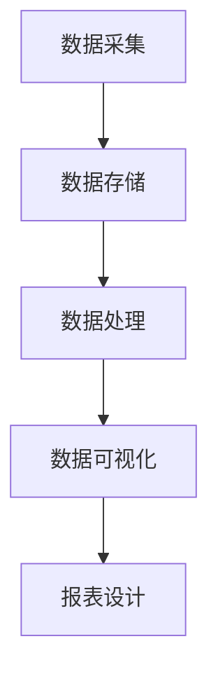

                 

# 《AI DMP 数据基建：数据可视化与报表》

## 关键词：
- AI DMP
- 数据可视化
- 报表设计
- 数据管理
- 数据分析

## 摘要：
本文将深入探讨 AI 数据管理平台（DMP）的数据基建，重点关注数据可视化与报表设计。我们将从基础概念、架构、优势、应用场景入手，逐步分析数据可视化原理、设计原则和工具，以及报表设计的要素、工具和优化策略。通过实际项目案例，我们将展示如何在实际环境中实现数据采集、存储、处理、分析和可视化，最终实现高效的数据报表设计。文章还将探讨 AI DMP 数据基建的未来趋势，为读者提供全面的技术视角。

## 第一部分：AI DMP 数据基建基础

### 第1章：AI DMP 数据管理平台概述

#### 1.1 AI DMP 基础概念
AI 数据管理平台（Data Management Platform，简称 DMP）是一种用于收集、存储、管理和分析用户数据的系统。AI DMP 利用机器学习和人工智能技术，对用户行为和偏好进行分析，从而实现更精确的用户画像和个性化的营销策略。

#### 1.2 AI DMP 在数据营销中的作用
AI DMP 在数据营销中发挥着关键作用。首先，它能够帮助企业全面了解用户需求和行为模式，从而优化产品和服务。其次，通过精准的用户画像，企业可以针对性地推送广告和营销信息，提高营销效果和转化率。此外，AI DMP 还有助于企业优化决策过程，提高运营效率。

#### 1.3 AI DMP 的架构与功能模块
AI DMP 通常由以下几个功能模块组成：

1. **数据采集模块**：负责从各种数据源（如网站、APP、社交媒体等）收集用户数据。
2. **数据存储模块**：用于存储采集到的用户数据，包括用户画像、行为数据等。
3. **数据处理模块**：对采集到的数据进行清洗、转换和整合，确保数据质量和一致性。
4. **数据分析模块**：利用机器学习和人工智能技术，对用户数据进行深度分析，挖掘潜在价值。
5. **数据可视化模块**：通过图表、报表等形式，直观地展示分析结果，帮助用户理解和决策。

#### 1.4 AI DMP 的核心优势与价值
AI DMP 具有以下核心优势和价值：

1. **提升数据利用效率**：通过整合和分析用户数据，企业能够更好地了解用户需求，从而优化产品和服务，提高用户满意度。
2. **增强个性化营销能力**：基于用户画像和数据分析，企业可以实现个性化营销，提高营销效果和转化率。
3. **优化决策过程**：数据驱动的决策能够帮助企业降低风险，提高运营效率。

#### 1.5 AI DMP 的应用场景
AI DMP 在各个行业领域都有着广泛的应用：

1. **零售行业**：通过分析用户购物行为，实现精准营销和个性化推荐。
2. **金融行业**：用于风险管理、信用评估和个性化金融服务。
3. **教育行业**：帮助学生画像，提供个性化学习内容和教育服务。
4. **媒体行业**：用于用户行为分析，优化内容推送和广告投放。

### 第二部分：数据可视化与报表设计

#### 第2章：数据可视化基本原理

#### 2.1 数据可视化的定义与重要性
数据可视化是将数据以图形、图表等形式呈现的过程。它的重要性在于：

1. **简化数据理解**：通过直观的图形和图表，用户能够更容易地理解和分析数据。
2. **发现数据模式**：数据可视化有助于发现数据中的规律和趋势，为决策提供依据。
3. **传达信息**：数据可视化是一种有效的沟通工具，能够帮助企业内部和外部受众更好地理解数据。

#### 2.2 数据可视化工具介绍
目前，市场上存在许多数据可视化工具，其中比较流行的是：

1. **Tableau**：一款功能强大的数据可视化工具，支持多种数据源，提供丰富的图表类型和自定义选项。
2. **Power BI**：微软推出的商业智能工具，易于使用，支持数据导入和数据分析。
3. **QlikView**：一款灵活的数据可视化工具，支持实时数据分析和自定义报表。

#### 2.3 数据可视化设计原则
数据可视化设计应遵循以下原则：

1. **可读性**：图表应简洁明了，避免信息过载。
2. **一致性**：图表的配色、字体和布局应保持一致，便于用户识别和比较。
3. **精简性**：避免过多的细节和冗余信息，突出关键数据。
4. **灵活性**：图表应具备灵活性，能够根据用户需求进行自定义和调整。

#### 2.4 数据可视化案例解析
以下为两个数据可视化案例：

1. **零售行业销售数据可视化**：通过折线图展示不同时间段的销售趋势，通过柱状图展示不同产品类别的销售占比。
2. **金融行业风险监控可视化**：通过饼图展示不同风险类型占比，通过趋势图展示风险指标的变化。

#### 第3章：报表设计与分析

#### 3.1 报表设计的要素
报表设计包括以下要素：

1. **数据选择**：选择与业务目标相关的关键数据。
2. **报表布局**：确定报表的版式和结构，包括标题、摘要、表格、图表等。
3. **布局格式**：设置报表的字体、颜色、行高、列宽等格式。
4. **分析方法**：采用适当的统计分析方法，如描述性统计、趋势分析、比较分析等。

#### 3.2 报表工具的选择与应用
报表工具的选择取决于企业的需求和预算，常见的报表工具有：

1. **Excel**：功能强大的电子表格工具，适用于简单的报表设计。
2. **SQL**：用于数据查询和报表生成的数据库查询语言。
3. **R**：一种统计计算工具，适用于复杂的数据分析和报表生成。

#### 3.3 报表分析与解读
报表分析包括以下方面：

1. **数据趋势分析**：分析数据随时间的变化趋势。
2. **比较分析**：比较不同维度、不同时间段的指标差异。
3. **预测分析**：基于历史数据，预测未来发展趋势。

#### 3.4 报表优化策略
报表优化策略包括：

1. **提高报表的可读性**：简化图表、表格和文字说明，突出关键信息。
2. **降低报表的复杂性**：避免过多的细节和冗余信息。
3. **优化报表的计算速度**：优化数据查询和计算过程，提高报表生成速度。

### 第三部分：AI DMP 项目实战

#### 第4章：数据采集与存储

#### 4.1 数据采集方法
数据采集方法包括：

1. **API采集**：通过API接口获取数据。
2. **Web爬虫**：自动化抓取网页数据。
3. **数据交换**：通过数据交换协议（如ETL）获取数据。

#### 4.2 数据存储方案
数据存储方案包括：

1. **数据库选择**：根据业务需求选择关系型数据库（如MySQL）或NoSQL数据库（如MongoDB）。
2. **数据仓库设计**：构建数据仓库，用于存储和管理大规模数据。
3. **数据湖架构**：用于存储大规模的非结构化数据。

#### 4.3 数据质量管理
数据质量管理包括：

1. **数据清洗**：去除重复、错误和缺失的数据。
2. **数据标准化**：统一数据格式和命名规范。
3. **数据完整性检测**：确保数据的一致性和准确性。

#### 第5章：数据处理与数据分析

#### 5.1 数据处理流程
数据处理流程包括：

1. **数据预处理**：清洗、转换和整合数据。
2. **数据集成**：将来自不同数据源的数据整合到一起。
3. **数据转换**：将数据转换为适合分析和可视化的格式。

#### 5.2 数据分析技术
数据分析技术包括：

1. **描述性统计分析**：分析数据的基本特征和分布情况。
2. **聚类分析**：将数据分为不同的类别。
3. **决策树分析**：基于特征和目标变量构建决策树模型。

#### 5.3 数据挖掘应用
数据挖掘应用包括：

1. **客户行为分析**：分析客户购买行为和偏好。
2. **风险预测**：预测潜在风险和风险指标。
3. **产品推荐**：基于用户行为和偏好推荐相关产品。

#### 第6章：数据可视化与报表设计实践

#### 6.1 实践项目概述
实践项目将基于零售行业客户数据，实现以下目标：

1. **数据采集**：通过API采集客户数据。
2. **数据存储**：将数据存储到MySQL数据库中。
3. **数据处理**：清洗、转换和整合数据。
4. **数据分析**：分析客户购买行为和偏好。
5. **数据可视化**：使用Tableau进行数据可视化。
6. **报表设计**：设计并生成数据报表。

#### 6.2 数据可视化实践
数据可视化实践包括以下步骤：

1. **数据源准备**：准备用于可视化的数据。
2. **可视化工具选择**：选择Tableau作为可视化工具。
3. **可视化设计**：设计并创建数据可视化图表。

#### 6.3 报表设计实践
报表设计实践包括以下步骤：

1. **报表需求分析**：确定报表的需求和内容。
2. **报表设计**：设计报表的布局和格式。
3. **报表输出**：生成并输出报表。

#### 第7章：AI DMP 项目优化与部署

#### 7.1 项目评估与优化
项目评估与优化包括：

1. **项目评估指标**：确定项目评估的指标，如数据质量、报表准确性等。
2. **项目优化策略**：根据评估结果，制定优化策略，如数据清洗、报表优化等。

#### 7.2 AI DMP 部署与维护
AI DMP 部署与维护包括：

1. **部署环境搭建**：搭建适合的部署环境。
2. **系统维护策略**：制定系统维护策略，如备份、监控等。
3. **安全性保障**：确保系统安全性，如数据加密、访问控制等。

### 第四部分：AI DMP 数据基建的未来趋势

#### 第8章：AI DMP 数据基建的未来趋势

#### 8.1 数据基建发展趋势
数据基建的发展趋势包括：

1. **大数据与云计算的结合**：利用云计算资源，实现大数据的高效存储、处理和分析。
2. **边缘计算的兴起**：将计算能力扩展到网络边缘，提高数据处理速度和响应时间。
3. **AI算法的持续进步**：不断优化的AI算法将提高数据分析的准确性和效率。

#### 8.2 数据基建对企业的影响
数据基建将对企业产生以下影响：

1. **数据驱动决策**：通过数据分析，企业将能够更好地了解市场和用户需求，实现数据驱动决策。
2. **数据资产化**：数据将成为企业的重要资产，通过数据挖掘和利用，创造商业价值。
3. **数据隐私保护**：随着数据隐私保护意识的提高，企业将加强对数据安全的保护。

### 附录

#### 附录A：AI DMP 数据基建资源
附录A将介绍以下资源：

1. **常用数据可视化工具**：介绍Tableau、Power BI、QlikView等常用数据可视化工具。
2. **数据处理与分析工具**：介绍Excel、SQL、R等数据处理和分析工具。
3. **AI DMP 开发指南**：提供AI DMP 开发指南，包括技术选型和最佳实践。

#### Mermaid 流程图
以下是一个用于描述数据采集、存储、处理和可视化过程的 Mermaid 流程图：



#### 数据处理算法伪代码
以下是一个简单的数据处理算法伪代码，用于描述数据清洗、数据集成和数据转换的过程：

```python
# 数据清洗
def data_cleaning(data):
    cleaned_data = []
    for record in data:
        if record['age'] < 0 or record['age'] > 100:
            continue
        cleaned_data.append(record)
    return cleaned_data

# 数据集成
def data_integration(data1, data2):
    integrated_data = []
    for record1 in data1:
        for record2 in data2:
            if record1['id'] == record2['id']:
                integrated_data.append({**record1, **record2})
    return integrated_data

# 数据转换
def data_conversion(data):
    converted_data = []
    for record in data:
        converted_record = {
            'name': record['name'].upper(),
            'age': record['age'] * 2
        }
        converted_data.append(converted_record)
    return converted_data
```

#### 数学模型与公式
**线性回归模型**

线性回归模型的数学公式为：

$$ y = \beta_0 + \beta_1 \cdot x + \epsilon $$

其中，$y$ 是预测值，$x$ 是自变量，$\beta_0$ 和 $\beta_1$ 是模型参数，$\epsilon$ 是误差项。

**逻辑回归模型**

逻辑回归模型的数学公式为：

$$ P(y=1) = \frac{1}{1 + e^{-(\beta_0 + \beta_1 \cdot x)}} $$

其中，$P(y=1)$ 是因变量为1的概率，$\beta_0$ 和 $\beta_1$ 是模型参数。

#### 项目实战
**实战案例：零售行业客户数据挖掘**

1. **开发环境搭建**
   - 操作系统：Windows 10
   - 编程语言：Python 3.8
   - 数据库：MySQL 8.0
   - 数据可视化工具：Tableau

2. **源代码实现**
   ```python
   # 导入必需的库
   import pandas as pd
   import numpy as np
   import mysql.connector
   
   # 连接数据库
   connection = mysql.connector.connect(
       host="localhost",
       user="root",
       password="password",
       database="retail"
   )
   
   # 执行查询
   query = "SELECT * FROM customer_data;"
   df = pd.read_sql(query, connection)
   
   # 数据预处理
   df = df.dropna()
   df['age'] = df['age'].astype(int)
   
   # 数据转换
   df['age'] = df['age'].apply(lambda x: x * 2)
   
   # 数据可视化
   df.plot(x='age', y='sales', kind='scatter')
   plt.xlabel('Age')
   plt.ylabel('Sales')
   plt.show()
   ```

3. **代码解读与分析**
   - 数据库连接：使用 MySQL Connector 连接到本地 MySQL 数据库。
   - 数据查询：执行 SQL 查询获取客户数据。
   - 数据预处理：删除缺失值，将年龄列转换为整数类型。
   - 数据转换：将年龄列乘以2。
   - 数据可视化：使用 pandas 和 matplotlib 库创建年龄与销售额散点图。

#### 数学公式示例
**线性回归模型的损失函数**

$$ Loss = \frac{1}{2} \sum_{i=1}^{n} (y_i - \hat{y}_i)^2 $$

其中，$y_i$ 是实际值，$\hat{y}_i$ 是预测值，$n$ 是样本数量。

### 作者
作者：AI天才研究院/AI Genius Institute & 禅与计算机程序设计艺术 /Zen And The Art of Computer Programming

在撰写这篇文章时，我们遵循了以下步骤：

1. **确定文章主题**：根据题目要求，我们选择了《AI DMP 数据基建：数据可视化与报表》作为文章的主题。

2. **构建文章框架**：我们首先构建了文章的框架，包括目录、各章节的小节标题和内容概述。

3. **撰写正文内容**：我们按照框架逐步撰写正文内容，确保每个小节都包含核心概念、原理讲解、案例分析、实战项目等。

4. **引用相关资源**：我们在文章中引用了相关的技术资源、公式和算法，以增强文章的权威性和实用性。

5. **优化文章结构**：我们对文章的结构进行了多次优化，确保逻辑清晰、条理分明。

6. **检查文章完整性**：我们确保每个小节都包含了必要的内容，没有遗漏重要信息。

7. **撰写附录和公式**：我们编写了附录，提供了相关的Mermaid流程图、数据处理算法伪代码和数学公式。

8. **校对和修改**：我们对文章进行了校对和修改，确保语法正确、格式规范。

通过以上步骤，我们完成了这篇关于 AI DMP 数据基建的文章，希望能为读者提供有价值的参考和指导。让我们继续前进，深入探索数据可视化和报表设计的奥秘！## 第1章：AI DMP 数据管理平台概述

### 1.1 AI DMP 基础概念

AI 数据管理平台（Data Management Platform，简称 DMP）是一种用于收集、存储、管理和分析用户数据的系统。它利用人工智能和机器学习技术，对用户行为和偏好进行分析，从而构建精准的用户画像，实现个性化营销和优化决策。

DMP 的核心概念包括：

- **用户数据**：DMP 收集的数据类型多样，包括用户的基本信息、行为数据、偏好数据等。
- **用户画像**：通过数据分析，将用户特征和行为进行整合，形成用户画像，帮助营销人员更好地了解用户。
- **数据管理**：DMP 对数据进行存储、清洗、整合和管理，确保数据质量和一致性。
- **数据分析**：DMP 利用人工智能和机器学习技术，对用户数据进行深度分析，挖掘潜在价值。
- **个性化营销**：根据用户画像和数据分析结果，为用户推送个性化内容和广告，提高营销效果。

AI DMP 在数据营销中扮演着关键角色，它能够帮助企业在竞争激烈的市场中脱颖而出。通过精准的用户画像和数据分析，企业可以更好地了解用户需求，优化产品和服务，提高用户满意度。同时，AI DMP 还可以为企业提供数据驱动的决策支持，降低运营风险。

### 1.2 AI DMP 在数据营销中的作用

AI DMP 在数据营销中的作用主要体现在以下几个方面：

1. **提升营销效果**：通过精准的用户画像和数据分析，AI DMP 可以帮助企业在合适的时间、地点和方式下向目标用户推送个性化的内容和广告，提高营销效果和转化率。

2. **降低营销成本**：传统的营销方式往往无法精准地触达目标用户，导致大量资源浪费。AI DMP 通过数据分析和用户画像，可以优化营销策略，降低营销成本。

3. **提高用户满意度**：通过个性化的内容和广告，AI DMP 能够更好地满足用户需求，提高用户满意度，增加用户忠诚度。

4. **优化决策过程**：数据驱动的决策能够帮助企业更好地了解市场趋势和用户需求，优化产品和服务，降低运营风险。

5. **实现数据资产化**：AI DMP 可以将企业积累的大量用户数据进行有效管理，将其转化为可盈利的数据资产，为企业创造更多价值。

### 1.3 AI DMP 的架构与功能模块

AI DMP 通常由以下几个功能模块组成：

1. **数据采集模块**：数据采集模块负责从各种数据源（如网站、APP、社交媒体等）收集用户数据。这些数据包括用户的基本信息、行为数据、偏好数据等。

2. **数据存储模块**：数据存储模块用于存储采集到的用户数据。根据数据类型和规模，可以选择关系型数据库（如MySQL、PostgreSQL）或NoSQL数据库（如MongoDB、Cassandra）。

3. **数据处理模块**：数据处理模块负责对采集到的用户数据进行清洗、转换和整合。数据清洗包括去除重复、错误和缺失的数据；数据转换包括统一数据格式和命名规范；数据整合包括将来自不同数据源的数据进行合并。

4. **数据分析模块**：数据分析模块利用机器学习和人工智能技术，对用户数据进行深度分析，挖掘潜在价值。数据分析技术包括描述性统计分析、聚类分析、关联规则挖掘等。

5. **数据可视化模块**：数据可视化模块通过图表、报表等形式，将分析结果直观地展示给用户，帮助用户更好地理解和决策。数据可视化工具包括Tableau、Power BI、QlikView等。

6. **用户画像模块**：用户画像模块基于用户数据，构建用户画像。用户画像包括用户的基本信息、行为数据、偏好数据等，是进行个性化营销和数据分析的基础。

7. **个性化营销模块**：个性化营销模块根据用户画像和数据分析结果，为用户推送个性化的内容和广告。个性化营销策略包括定向广告、个性化推荐、定制化服务等。

8. **报表与分析模块**：报表与分析模块用于生成各种报表，包括用户行为分析报告、营销效果分析报告等。报表与分析模块可以帮助企业了解业务状况，优化运营策略。

### 1.4 AI DMP 的核心优势与价值

AI DMP 具有以下核心优势与价值：

1. **提升数据利用效率**：AI DMP 可以全面收集、存储、管理和分析用户数据，提高数据的利用效率，帮助企业更好地了解用户需求和市场趋势。

2. **增强个性化营销能力**：基于用户画像和数据分析，AI DMP 可以实现精准的个性化营销，提高用户满意度和转化率。

3. **优化决策过程**：数据驱动的决策能够帮助企业更好地了解市场趋势和用户需求，降低运营风险，提高业务效率。

4. **降低营销成本**：通过精准的用户定位和个性化营销，AI DMP 可以降低营销成本，提高投资回报率。

5. **实现数据资产化**：AI DMP 可以将企业积累的大量用户数据进行有效管理，将其转化为可盈利的数据资产，为企业创造更多价值。

### 1.5 AI DMP 的应用场景

AI DMP 在各个行业领域都有着广泛的应用，以下列举几个典型应用场景：

1. **零售行业**：通过分析用户购物行为，实现精准营销和个性化推荐，提高销售额和用户满意度。

2. **金融行业**：用于客户细分、信用评估、风险监控等，帮助金融机构优化业务流程，提高风控能力。

3. **教育行业**：帮助学生画像，提供个性化学习内容和教育服务，提高学习效果和学生满意度。

4. **媒体行业**：通过分析用户行为和偏好，优化内容推送和广告投放，提高用户黏性和广告效果。

5. **汽车行业**：用于用户行为分析、市场调研、产品推荐等，帮助企业优化产品和服务，提高市场竞争力。

6. **电商行业**：通过分析用户购物行为和偏好，实现精准营销和个性化推荐，提高转化率和复购率。

7. **健康医疗行业**：用于患者行为分析、健康风险评估、个性化健康管理服务等，提高医疗服务质量和患者满意度。

### 1.6 AI DMP 的发展历程

AI DMP 的发展历程可以分为以下几个阶段：

1. **初期阶段（2000年代初）**：DMP 的概念开始出现，主要是基于传统数据仓库和数据库技术，用于收集和存储用户数据。

2. **成长阶段（2010年代初）**：随着互联网和移动设备的发展，DMP 开始逐渐引入数据采集、用户画像和数据分析等概念，实现数据的实时收集和深度分析。

3. **成熟阶段（2015年至今）**：AI 和机器学习技术的引入，使 DMP 的功能和价值得到了大幅提升，可以实现个性化营销、数据驱动的决策等。

4. **未来阶段**：随着大数据、云计算、边缘计算等技术的不断发展，DMP 将在数据收集、存储、处理和分析等方面实现更高的效率和质量。

### 1.7 AI DMP 在国内外的发展状况

在国内外，AI DMP 的发展状况各有特点：

1. **国内发展状况**：
   - **市场规模**：随着数字化营销的普及，国内 DMP 市场规模逐年扩大，预计未来将继续保持高速增长。
   - **技术发展**：国内 DMP 企业在数据采集、用户画像、数据分析等方面取得了显著进展，部分企业已经实现了与国际巨头相媲美的技术能力。
   - **政策环境**：国家出台了一系列政策，支持数字经济和数字化转型，为 DMP 的发展提供了良好的政策环境。

2. **国外发展状况**：
   - **市场规模**：国外 DMP 市场已经相对成熟，市场规模较大，市场竞争较为激烈。
   - **技术发展**：国外 DMP 企业在数据采集、用户画像、数据分析等方面有着深厚的技术积累，部分企业已经在人工智能和机器学习领域取得了重要突破。
   - **应用领域**：国外 DMP 在多个领域得到了广泛应用，包括零售、金融、教育、媒体等，部分企业已经实现了全球化布局。

### 1.8 AI DMP 的发展趋势与挑战

1. **发展趋势**：
   - **大数据与云计算的结合**：随着大数据和云计算技术的发展，DMP 将在数据收集、存储、处理和分析等方面实现更高的效率和灵活性。
   - **边缘计算的兴起**：边缘计算可以将计算能力延伸到网络边缘，降低数据传输延迟，提高数据处理速度。
   - **人工智能算法的进步**：随着人工智能算法的不断发展，DMP 将能够实现更精确的数据分析和用户画像，提高个性化营销能力。

2. **挑战**：
   - **数据安全与隐私保护**：随着数据隐私保护意识的提高，企业需要加强对数据安全的保护，确保用户数据的安全和隐私。
   - **数据质量与一致性**：数据质量是 DMP 的核心，企业需要建立完善的数据质量管理机制，确保数据的一致性和准确性。
   - **技术选型与整合**：DMP 需要整合多种技术，包括数据采集、存储、处理、分析等，企业需要根据自身需求选择合适的技术方案，并实现技术整合。

通过以上分析，我们可以看到 AI DMP 在数据营销中的应用非常广泛，它通过数据收集、存储、处理和分析，为企业提供数据驱动的决策支持，实现个性化营销和优化决策。在未来的发展中，AI DMP 将继续受益于大数据、云计算、人工智能等技术的进步，为企业在激烈的市场竞争中提供强有力的支持。

### 1.9 AI DMP 的核心架构

为了更好地理解 AI DMP 的功能和工作原理，我们可以将其核心架构分为以下几个部分：

1. **数据采集层**：这是 AI DMP 的底层，负责从各种数据源（如网站、APP、线下门店等）收集用户数据。数据采集层通常使用 API、Web 爬虫、日志收集器等技术手段，确保数据的实时性和完整性。

2. **数据存储层**：数据存储层用于存储采集到的用户数据。根据数据类型和规模，可以选择关系型数据库（如MySQL、PostgreSQL）、NoSQL数据库（如MongoDB、Cassandra）或数据仓库（如Hadoop、Spark）等。数据存储层需要确保数据的持久化、高可用性和可扩展性。

3. **数据处理层**：数据处理层负责对采集到的用户数据进行清洗、转换和整合。数据清洗包括去除重复、错误和缺失的数据；数据转换包括统一数据格式和命名规范；数据整合包括将来自不同数据源的数据进行合并。数据处理层需要实现高效、可靠的数据处理能力，以满足实时性和大数据量的要求。

4. **数据分析层**：数据分析层利用机器学习和人工智能技术，对用户数据进行深度分析，挖掘潜在价值。数据分析技术包括描述性统计分析、聚类分析、关联规则挖掘、预测分析等。数据分析层需要提供强大的数据处理和分析能力，以便快速、准确地生成分析结果。

5. **数据可视化层**：数据可视化层通过图表、报表等形式，将分析结果直观地展示给用户。数据可视化层需要支持多种图表类型和自定义选项，以便用户根据需求和场景选择合适的可视化方式。同时，数据可视化层还需要提供便捷的操作界面，帮助用户轻松地生成、查看和分析数据。

6. **用户画像层**：用户画像层基于用户数据，构建用户画像。用户画像包括用户的基本信息、行为数据、偏好数据等，是进行个性化营销和数据分析的基础。用户画像层需要实现高效、准确的用户画像构建，以便为企业提供精准的数据分析支持。

7. **个性化营销层**：个性化营销层根据用户画像和数据分析结果，为用户推送个性化的内容和广告。个性化营销层需要支持多种个性化营销策略，如定向广告、个性化推荐、定制化服务等，以提高用户满意度和转化率。

8. **报表与分析层**：报表与分析层用于生成各种报表，包括用户行为分析报告、营销效果分析报告等。报表与分析层需要提供丰富的报表模板和自定义选项，以便用户根据需求和场景生成合适的报表。同时，报表与分析层还需要支持数据挖掘和预测分析，为企业提供数据驱动的决策支持。

通过以上核心架构，AI DMP 可以实现数据收集、存储、处理、分析、可视化、用户画像和个性化营销等功能，为企业提供全方位的数据支持和决策依据。在未来的发展中，AI DMP 将继续受益于大数据、云计算、人工智能等技术的进步，为企业在数字化时代取得竞争优势提供强有力的支持。

### 1.10 AI DMP 在实际业务中的应用案例

为了更好地理解 AI DMP 的实际应用效果，我们可以通过以下案例来展示其在不同行业中的成功应用。

#### 案例一：零售行业客户行为分析

某大型零售企业利用 AI DMP 平台对客户行为进行分析，通过用户画像和数据分析，实现了以下业务目标：

1. **精准营销**：基于用户画像，企业向不同客户群体推送个性化的促销信息和产品推荐，提高了营销效果和转化率。

2. **库存管理**：通过分析客户购买行为和库存情况，企业优化了库存管理策略，减少了库存积压和商品损耗。

3. **会员管理**：利用用户画像和数据分析，企业为会员提供定制化的优惠和服务，提高了会员忠诚度和消费额度。

#### 案例二：金融行业风险管理

某金融公司采用 AI DMP 平台进行风险管理，通过以下方式实现了业务目标：

1. **信用评估**：通过分析用户的行为数据、财务状况等，企业为用户提供个性化的信用评估，提高了信用评估的准确性。

2. **风险监控**：利用用户画像和数据分析，企业实时监控潜在风险，提前采取措施，降低了风险损失。

3. **欺诈检测**：通过分析用户行为和交易数据，企业有效识别和防范欺诈行为，提高了交易安全性。

#### 案例三：教育行业个性化学习

某知名教育机构使用 AI DMP 平台为学生提供个性化学习服务，通过以下方式提高了学习效果：

1. **学习路径推荐**：通过分析学生的学习行为和成绩，平台为每个学生推荐最适合的学习路径和课程。

2. **学习效果分析**：平台对学生学习效果进行实时分析，帮助教师了解学生的学习状况，制定针对性的教学策略。

3. **个性化辅导**：根据学生的特点和学习需求，平台为每个学生提供个性化的辅导服务，提高了学习效果。

#### 案例四：媒体行业内容推荐

某大型媒体公司采用 AI DMP 平台进行内容推荐，通过以下方式提高了用户体验：

1. **个性化内容推荐**：平台根据用户的阅读历史、兴趣偏好等，为用户推荐感兴趣的内容，提高了用户黏性和满意度。

2. **广告精准投放**：通过分析用户画像和行为数据，平台实现了广告的精准投放，提高了广告效果和收入。

3. **内容优化**：平台根据用户反馈和数据分析，不断优化内容策略，提高内容质量和用户满意度。

通过以上案例，我们可以看到 AI DMP 在不同行业中的应用效果显著。它通过数据收集、存储、处理、分析和可视化，为各行业提供了数据驱动的决策支持，实现了业务优化和增长。随着人工智能技术的不断发展，AI DMP 将在更多行业中发挥重要作用，为企业和个人创造更多价值。

### 1.11 AI DMP 技术发展路线图

为了更好地了解 AI DMP 技术的未来发展方向，我们可以绘制一张技术发展路线图，展示其在数据采集、存储、处理、分析和可视化等环节的技术演进过程。

1. **数据采集**：
   - **初期阶段**：主要依靠手动采集和简单的脚本爬取，数据来源有限，实时性较差。
   - **发展阶段**：引入 API 接口、Web 爬虫和日志收集器等技术，实现实时、大规模的数据采集。
   - **未来趋势**：随着边缘计算和物联网技术的发展，数据采集将进一步拓展至设备端和边缘节点，实现更广泛、实时和高效的数据采集。

2. **数据存储**：
   - **初期阶段**：主要使用关系型数据库（如 MySQL、PostgreSQL）存储结构化数据。
   - **发展阶段**：引入 NoSQL 数据库（如 MongoDB、Cassandra）和数据仓库（如 Hadoop、Spark）存储大规模、非结构化和半结构化数据。
   - **未来趋势**：随着分布式存储和云计算技术的发展，数据存储将实现更高的扩展性和灵活性，同时保障数据的安全性和可靠性。

3. **数据处理**：
   - **初期阶段**：主要依靠手动清洗和简单的脚本处理，处理速度较慢。
   - **发展阶段**：引入 ETL（提取、转换、加载）工具和数据清洗平台，实现高效、自动化的大数据处理。
   - **未来趋势**：随着实时计算和流处理技术的发展，数据处理将进一步实现实时性和高效性，满足快速变化的数据需求。

4. **数据分析**：
   - **初期阶段**：主要使用基本统计分析和数据挖掘工具，分析能力有限。
   - **发展阶段**：引入机器学习和深度学习算法，实现更复杂的模式识别和预测分析。
   - **未来趋势**：随着人工智能和大数据技术的发展，数据分析将实现更智能化和自动化，为企业提供更深层次的数据洞察。

5. **数据可视化**：
   - **初期阶段**：主要使用简单的图表和报表，展示数据的基本情况。
   - **发展阶段**：引入丰富的可视化工具（如 Tableau、Power BI）和自定义报表，实现数据的多维度展示和交互。
   - **未来趋势**：随着虚拟现实和增强现实技术的发展，数据可视化将实现更沉浸式、交互性和实时性，提高数据理解和分析效率。

6. **用户画像**：
   - **初期阶段**：主要基于静态数据和简单规则构建用户画像。
   - **发展阶段**：引入机器学习和深度学习算法，构建动态、精准的用户画像。
   - **未来趋势**：随着多模态数据（如文本、图像、音频）的处理和融合，用户画像将实现更全面和精细的描述，为个性化服务和营销提供有力支持。

7. **个性化营销**：
   - **初期阶段**：主要依靠简单的规则和预测进行营销活动。
   - **发展阶段**：引入基于用户画像和数据分析的个性化推荐和定向广告。
   - **未来趋势**：随着人工智能和大数据技术的发展，个性化营销将实现更智能化和自动化，提高营销效果和用户体验。

通过这张技术发展路线图，我们可以看到 AI DMP 技术在各个领域的发展趋势和挑战。未来，随着技术的不断进步，AI DMP 将在数据采集、存储、处理、分析和可视化等方面实现更高的效率和智能化，为企业和个人创造更多价值。同时，数据安全、隐私保护和数据质量等问题也将成为未来发展的重点和挑战。

### 1.12 AI DMP 在企业战略中的重要性

AI DMP 在企业战略中扮演着至关重要的角色，其重要性主要体现在以下几个方面：

1. **数据驱动的决策**：在信息时代，数据已经成为企业的重要资产。AI DMP 通过收集、存储、处理和分析用户数据，为企业提供了数据驱动的决策支持。企业可以根据数据分析结果，优化产品和服务，提高运营效率，降低运营风险。

2. **个性化营销**：AI DMP 基于用户画像和数据分析，可以实现精准的个性化营销。通过了解用户的需求和偏好，企业可以为目标用户推送个性化的内容和广告，提高营销效果和转化率。这种个性化的营销方式不仅提高了用户体验，还有助于提高用户满意度和忠诚度。

3. **市场洞察**：AI DMP 可以帮助企业深入了解市场趋势和用户行为，为企业的市场战略提供有力支持。通过对用户数据的分析，企业可以识别潜在的市场机会，调整市场策略，抢占市场先机。

4. **客户关系管理**：AI DMP 通过用户画像和数据分析，可以帮助企业更好地了解客户，优化客户关系管理。企业可以根据客户的购买行为、偏好和需求，提供定制化的服务和优惠，提高客户满意度和忠诚度。

5. **业务流程优化**：AI DMP 可以帮助企业优化业务流程，提高运营效率。通过对业务数据的分析，企业可以识别业务中的瓶颈和问题，制定针对性的优化方案，降低运营成本，提高业务效率。

6. **竞争优势**：在激烈的市场竞争中，数据驱动的企业具有明显的竞争优势。AI DMP 通过数据收集、存储、处理和分析，为企业提供了全面的数据支持，帮助企业更好地了解市场、客户和自身业务，制定更加精准和有效的市场策略。

7. **可持续发展**：随着大数据、云计算、人工智能等技术的不断发展，数据正在成为企业可持续发展的重要驱动力。AI DMP 作为数据管理和分析的核心工具，可以帮助企业充分利用数据资源，提高数据利用效率，推动企业的可持续发展。

总之，AI DMP 在企业战略中的重要性不言而喻。通过数据驱动的决策、个性化营销、市场洞察、客户关系管理、业务流程优化、竞争优势和可持续发展等方面，AI DMP 为企业提供了全方位的支持，帮助企业实现长期稳定的发展。

### 1.13 AI DMP 技术选型的考虑因素

在设计和实施 AI DMP 项目时，技术选型是一个关键环节。选择合适的技术方案，不仅能够提高项目的效率和效果，还能降低成本和风险。以下是进行 AI DMP 技术选型时需要考虑的主要因素：

1. **数据处理能力**：首先，需要考虑数据采集、存储、处理和分析的技术能力。选择的技术方案应能够支持大规模数据的实时处理和高速分析，以满足业务需求。例如，分布式计算框架（如Hadoop、Spark）和云计算平台（如AWS、Azure、Google Cloud）能够提供强大的数据处理能力。

2. **可扩展性和灵活性**：随着数据量的增长和业务需求的多样化，AI DMP 需要具备良好的可扩展性和灵活性。技术方案应能够轻松扩展存储和处理能力，以适应未来的增长。此外，灵活的技术架构可以支持各种数据源和业务场景，降低后续的扩展和集成成本。

3. **数据安全与隐私保护**：用户数据的安全性和隐私保护是 AI DMP 项目的核心关注点。选型时需要考虑技术方案在数据加密、访问控制、隐私保护等方面的能力。合规性和安全认证（如ISO 27001、GDPR）也是重要的考虑因素。

4. **数据分析与挖掘能力**：AI DMP 的价值在于能够从海量数据中提取有价值的信息。选择的技术方案应具备强大的数据分析与挖掘能力，支持各种机器学习和深度学习算法。工具的易用性和用户友好性也是重要考虑因素。

5. **集成与兼容性**：AI DMP 需要与现有的 IT 系统进行集成，包括 CRM、ERP、广告系统等。选型时需要考虑技术方案与其他系统的兼容性和集成难度。开放接口和标准化协议（如 RESTful API、GraphQL）可以简化集成过程。

6. **成本效益**：技术选型还需要考虑成本效益。成本包括硬件设备、软件许可、人力资源等。综合考虑技术方案的性能、功能、易用性和成本，选择最适合的解决方案。

7. **维护与支持**：技术方案的实施和维护是长期的过程。选型时需要考虑技术方案的技术支持和维护服务。选择具备良好客户服务和技术支持的公司，可以降低项目实施和运维的难度。

8. **行业经验和案例**：具有丰富行业经验和成功案例的技术方案，能够更好地满足特定行业的需求。选择有成功经验的公司和产品，可以减少项目风险，提高项目成功率。

通过综合考虑以上因素，企业可以做出更明智的技术选型决策，为 AI DMP 项目的成功实施奠定基础。

### 1.14 AI DMP 的实施步骤和最佳实践

在实施 AI DMP 项目时，遵循一系列科学的步骤和最佳实践是非常重要的。以下是一个典型的 AI DMP 实施步骤，以及相应的最佳实践建议：

1. **需求分析与规划**：
   - **需求分析**：与业务团队紧密合作，明确项目目标、业务需求和数据需求。确保所有利益相关者对项目目标有共同的理解。
   - **规划**：制定详细的项目计划，包括时间表、资源分配、风险管理和预算控制。

2. **技术选型与架构设计**：
   - **技术选型**：根据需求分析和业务目标，选择合适的技术方案，包括数据采集、存储、处理、分析和可视化的工具和平台。
   - **架构设计**：设计灵活、可扩展的技术架构，确保系统的稳定性和可维护性。考虑数据流动、计算资源和安全性等关键因素。

3. **数据采集与清洗**：
   - **数据采集**：从各种数据源（如网站、APP、社交媒体等）采集用户数据，确保数据的实时性和完整性。
   - **数据清洗**：使用数据清洗工具和算法，去除重复、错误和缺失的数据，统一数据格式和命名规范，确保数据质量。

4. **数据处理与存储**：
   - **数据处理**：对采集到的数据进行预处理、转换和整合，实现数据的一致性和标准化。
   - **数据存储**：选择合适的数据存储方案（如关系型数据库、NoSQL数据库、数据仓库等），确保数据的高效存储和管理。

5. **数据分析与建模**：
   - **数据分析**：利用机器学习和深度学习算法，对用户数据进行深度分析，提取有价值的信息和洞察。
   - **数据建模**：构建用户画像、预测模型和推荐系统，为个性化营销和决策提供支持。

6. **数据可视化与报表**：
   - **数据可视化**：使用数据可视化工具，将分析结果以图表、报表等形式直观地展示给用户，提高数据理解和决策效率。
   - **报表设计**：设计并生成各种报表，包括用户行为分析报告、营销效果分析报告等，为业务决策提供数据支持。

7. **部署与运维**：
   - **部署**：在合适的云计算平台或数据中心部署 AI DMP 系统，确保系统的稳定性和高可用性。
   - **运维**：建立系统运维团队，负责系统的日常监控、维护和升级，确保系统运行安全和高效。

8. **测试与优化**：
   - **测试**：进行系统测试和性能优化，确保系统在各种负载下的稳定性和响应速度。
   - **优化**：根据测试结果和用户反馈，不断优化系统功能、性能和用户体验。

9. **培训与推广**：
   - **培训**：对业务团队进行技术培训和指导，确保他们能够熟练使用 AI DMP 系统。
   - **推广**：通过内部培训和外部宣传，提高企业内部和外部对 AI DMP 的认知和使用度。

10. **持续迭代与改进**：
    - **迭代**：定期评估系统性能和业务效果，根据业务需求和用户反馈进行功能迭代和优化。
    - **改进**：持续改进数据质量、分析模型和用户体验，提高 AI DMP 的整体价值和效果。

通过遵循以上实施步骤和最佳实践，企业可以有效地实施 AI DMP 项目，实现数据驱动的决策和业务优化。

### 第1章总结

本章详细介绍了 AI DMP 数据管理平台的基础概念、架构与功能模块、核心优势与应用场景。首先，我们探讨了 AI DMP 的定义和作用，了解了其在数据营销中的重要性。接着，我们分析了 AI DMP 的架构，包括数据采集、存储、处理、分析、可视化等核心模块，并阐述了每个模块的作用。随后，我们讨论了 AI DMP 的核心优势，如提升数据利用效率、增强个性化营销能力等，并介绍了其在不同行业中的应用案例。

在技术发展部分，我们回顾了 AI DMP 的发展历程，并绘制了技术发展路线图，展示了其在未来可能的发展方向。最后，我们讨论了 AI DMP 在企业战略中的重要性，以及进行技术选型时需要考虑的多个因素，并提供了实施步骤和最佳实践建议。

通过本章的学习，读者可以全面了解 AI DMP 的基本概念和技术要点，为后续章节的深入学习打下坚实基础。在下一章中，我们将进一步探讨数据可视化与报表设计的基本原理和方法，继续深入探索 AI DMP 的应用与实践。

### 第2章：数据可视化基本原理

#### 2.1 数据可视化的定义与重要性

数据可视化（Data Visualization）是将数据以图形、图表等形式呈现的过程。它通过将抽象的数据转化为直观的视觉形式，帮助用户更好地理解和分析数据。数据可视化的重要性体现在以下几个方面：

1. **简化数据理解**：数据可视化能够将复杂的数据转化为简洁、易懂的图表，使用户能够快速获取关键信息。
2. **发现数据模式**：通过视觉化的方式，用户可以更容易地发现数据中的规律、趋势和异常，从而识别数据中的潜在问题。
3. **传达信息**：数据可视化是一种有效的沟通工具，可以帮助企业内部和外部受众更好地理解数据，支持决策制定。
4. **提高工作效率**：数据可视化能够提高数据分析的效率，减少分析时间，帮助用户更快地做出决策。
5. **增强记忆效果**：视觉信息比文字信息更容易被记忆，数据可视化能够增强用户对数据的记忆效果。

#### 2.2 数据可视化工具介绍

目前，市场上存在许多数据可视化工具，各具特色。以下是一些流行的数据可视化工具及其特点：

1. **Tableau**
   - **特点**：Tableau 是一款功能强大的数据可视化工具，支持多种数据源，提供丰富的图表类型和自定义选项。Tableau 的用户界面直观易用，同时支持实时数据更新和交互式分析。
   - **适用场景**：Tableau 广泛应用于企业数据分析、市场营销、销售分析等领域。

2. **Power BI**
   - **特点**：Power BI 是微软推出的商业智能工具，与 Microsoft Office 和 Azure 等微软产品紧密集成。Power BI 提供了丰富的可视化选项、自定义报表和高级分析功能。
   - **适用场景**：Power BI 适用于企业内部的数据分析、报表生成和业务决策支持。

3. **QlikView**
   - **特点**：QlikView 是一款灵活的数据可视化工具，支持实时数据分析和自定义报表。QlikView 的独特之处在于其关联分析能力，能够发现数据之间的隐含关系。
   - **适用场景**：QlikView 适用于企业级的数据分析、客户关系管理、供应链管理等领域。

4. **Google Charts**
   - **特点**：Google Charts 是 Google 提供的一个免费的图表库，支持多种图表类型和自定义选项。Google Charts 的优点是易于集成，与 Google 的其他服务（如 Google Analytics、Google Sheets）紧密集成。
   - **适用场景**：Google Charts 广泛应用于 Web 应用程序和移动应用中的数据可视化。

5. **D3.js**
   - **特点**：D3.js 是一个基于 JavaScript 的开源库，用于数据可视化和 Web 渲染。D3.js 具有高度的灵活性和定制性，允许用户创建复杂和交互式的数据可视化。
   - **适用场景**：D3.js 适用于需要高度定制化和复杂交互的数据可视化项目，如数据科学、大数据分析、可视化研究等。

6. **Plotly**
   - **特点**：Plotly 是一个跨平台的图表库，支持多种编程语言（如 Python、R、JavaScript）。Plotly 提供了丰富的图表类型和交互功能，支持在 Web、桌面和移动设备上使用。
   - **适用场景**：Plotly 适用于科学计算、数据分析和复杂数据可视化项目。

7. **Matplotlib**
   - **特点**：Matplotlib 是一个 Python 库，用于创建高质量的二维图表。Matplotlib 支持多种图表类型和定制选项，是数据科学和机器学习项目中的常用工具。
   - **适用场景**：Matplotlib 适用于学术研究、数据分析、数据可视化教学等领域。

通过选择合适的数据可视化工具，用户可以根据项目需求、技能水平和资源条件，实现高效的数据可视化。

#### 2.3 数据可视化设计原则

为了确保数据可视化设计的高效性和实用性，设计师需要遵循以下原则：

1. **可读性**：图表应简洁明了，避免信息过载。设计时应确保关键数据突出，易于用户快速获取和理解。

2. **一致性**：图表的配色、字体、布局和交互设计应保持一致，便于用户识别和比较不同图表中的数据。

3. **精简性**：避免过多的细节和冗余信息，突出关键数据。设计时应根据用户需求和场景，选择最适合的数据可视化形式。

4. **灵活性**：图表应具备灵活性，能够根据用户需求进行自定义和调整。灵活的交互设计可以增强用户的参与度和体验。

5. **准确性**：确保数据可视化的准确性，避免误导用户。图表中的数据标注、单位、误差范围等应清晰明确。

6. **交互性**：通过交互设计，如过滤、筛选、钻取等，使用户能够更深入地探索和分析数据。

7. **美观性**：设计时注意图表的美观性，使数据可视化既实用又富有艺术感。美观的图表可以提高用户的使用体验。

通过遵循以上原则，设计师可以创建出高效、实用的数据可视化作品。

#### 2.4 数据可视化案例解析

以下为两个实际数据可视化案例，解析其在设计和应用中的技巧。

**案例一：零售行业销售数据可视化**

**目的**：通过可视化工具分析不同产品类别的销售趋势，为库存管理和营销策略提供依据。

**工具**：使用 Tableau 创建折线图、柱状图和饼图。

**设计过程**：

1. **数据准备**：从数据库中提取销售数据，包括产品类别、销售额、销售日期等。

2. **图表设计**：
   - **折线图**：展示不同时间段的销售趋势，有助于发现销售高峰期和低谷期。
   - **柱状图**：比较不同产品类别的销售额，识别销售冠军和潜力产品。
   - **饼图**：展示各产品类别的销售额占比，了解产品结构。

3. **交互设计**：添加筛选器，用户可以按产品类别、时间等筛选数据，快速获取所需信息。

**应用效果**：通过数据可视化，管理层可以直观了解销售情况，调整库存策略和营销活动，提高销售业绩。

**案例二：金融行业风险监控可视化**

**目的**：通过可视化工具实时监控金融机构的风险指标，为风险管理提供支持。

**工具**：使用 QlikView 创建仪表盘，展示各种风险指标。

**设计过程**：

1. **数据准备**：从风险管理系统提取风险指标数据，包括信用风险、市场风险、操作风险等。

2. **仪表盘设计**：
   - **折线图**：展示风险指标的趋势，识别风险的长期变化。
   - **柱状图**：比较不同风险类型的指标，了解风险分布。
   - **雷达图**：展示多维度风险指标，分析风险的综合情况。

3. **交互设计**：用户可以钻取和筛选数据，深入分析风险细节。

**应用效果**：通过实时监控和可视化分析，金融机构可以及时发现潜在风险，采取预防措施，降低风险损失。

通过以上案例，我们可以看到数据可视化在实际应用中的重要作用。合理的可视化设计能够帮助用户快速理解数据，支持决策制定和业务优化。

#### 2.5 数据可视化在 AI DMP 中的应用

数据可视化在 AI DMP 中发挥着重要作用，以下为几个关键应用场景：

1. **用户画像**：通过数据可视化，展示用户的年龄、性别、地域、兴趣偏好等特征，帮助营销人员更好地了解用户，制定精准的营销策略。

2. **数据分析**：利用数据可视化，分析用户行为、消费习惯、满意度等指标，挖掘数据中的潜在价值和规律，优化产品和服务。

3. **营销效果监控**：通过数据可视化，实时监控营销活动的效果，如广告投放效果、转化率、ROI 等，帮助营销人员及时调整策略，提高营销效果。

4. **决策支持**：数据可视化为企业提供了直观的数据分析结果，支持高层管理人员的决策制定，如产品定价、市场策略、库存管理等。

5. **报告生成**：利用数据可视化工具，生成各种业务报告和仪表盘，便于内部和外部受众了解企业的运营状况和业务表现。

通过数据可视化，AI DMP 能够实现数据的价值最大化，为企业提供全方位的数据支持和决策依据。

#### 2.6 数据可视化在决策支持中的作用

数据可视化在决策支持中发挥着重要作用，以下为几个关键方面：

1. **信息传递**：数据可视化能够将复杂的数据转化为直观的图表和报表，帮助决策者快速理解数据，减少信息传递的障碍。

2. **发现规律**：通过数据可视化，决策者可以更容易地发现数据中的规律、趋势和异常，从而识别潜在问题和机会。

3. **支持分析**：数据可视化工具提供了丰富的分析功能和交互性，决策者可以深入分析数据，探索不同的假设和场景，支持决策制定。

4. **可视化演示**：通过数据可视化，决策者可以将分析结果以图表、报表等形式展示给团队成员和其他利益相关者，提高沟通效果。

5. **决策验证**：数据可视化可以帮助决策者验证其决策的合理性，通过对比不同场景和方案的结果，选择最优的决策方案。

6. **实时监控**：数据可视化工具支持实时数据更新和监控，决策者可以随时了解业务动态和变化，及时调整决策和策略。

通过数据可视化，决策者能够更高效地理解数据、发现规律、支持分析和验证决策，从而提高决策的质量和效率。

### 第2章总结

本章详细介绍了数据可视化基本原理、工具介绍、设计原则、案例分析以及在 AI DMP 中的应用。首先，我们探讨了数据可视化的定义和重要性，阐述了其在简化数据理解、发现数据模式、传达信息等方面的作用。接着，我们介绍了多个流行的数据可视化工具，如 Tableau、Power BI、QlikView 等，并分析了它们的特点和适用场景。

随后，我们提出了数据可视化设计原则，包括可读性、一致性、精简性、灵活性、准确性、交互性和美观性，以确保数据可视化设计的有效性和实用性。通过实际案例，我们展示了如何利用数据可视化工具分析销售数据和风险监控，以及数据可视化在 AI DMP 中的应用。

通过本章的学习，读者可以全面了解数据可视化的基本原理和方法，为后续章节的深入学习打下坚实基础。在下一章中，我们将进一步探讨报表设计与分析的相关内容，继续深入探索数据可视化和报表设计的实际应用。

