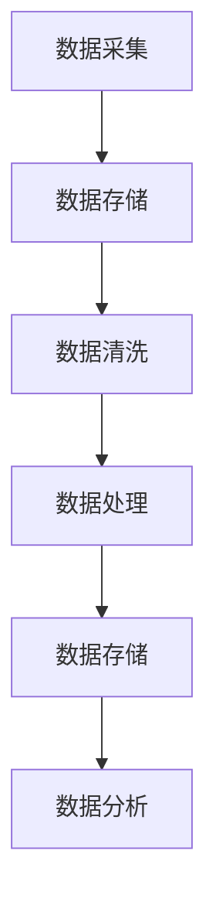
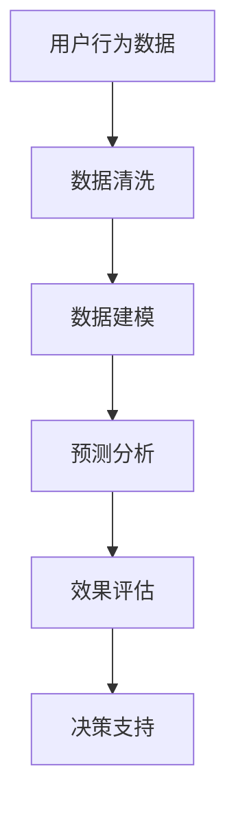
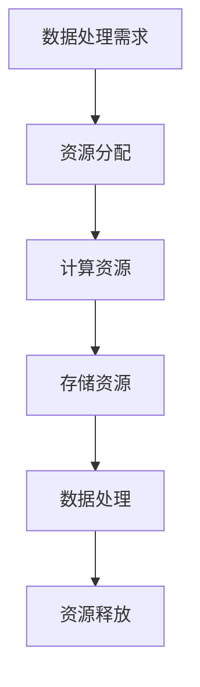
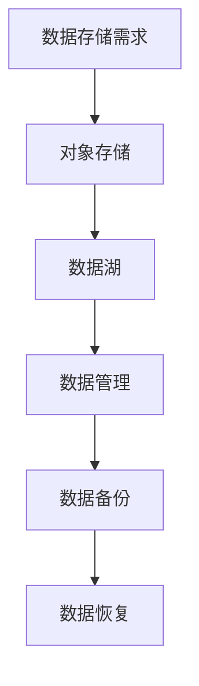
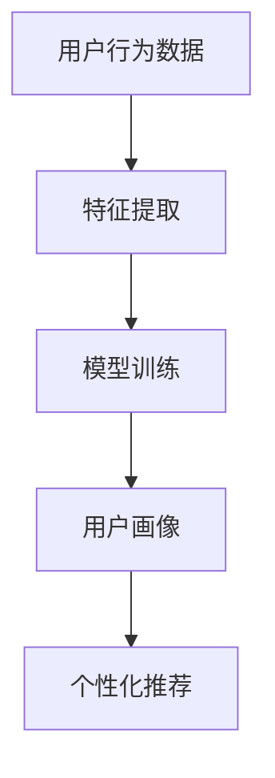
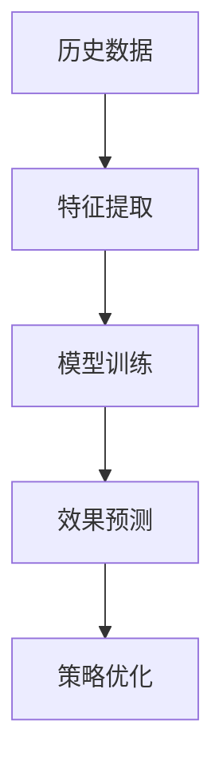
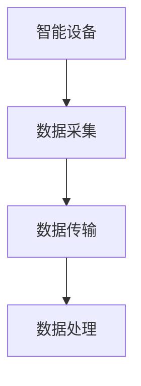
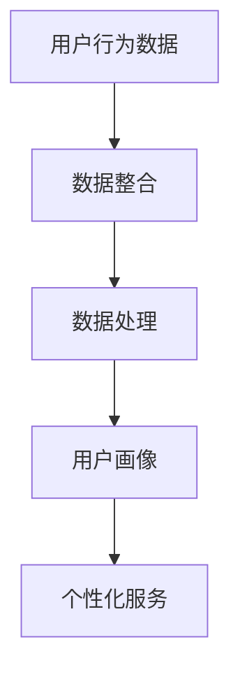
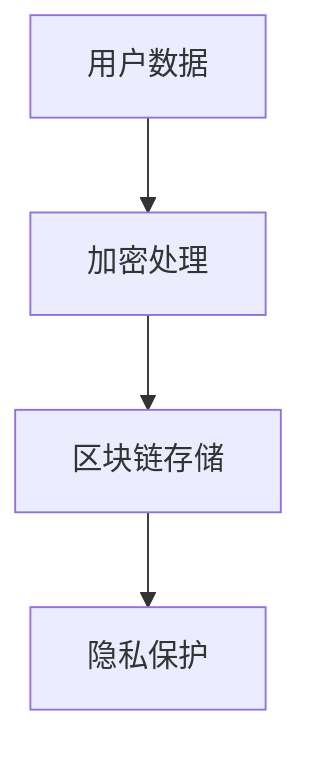
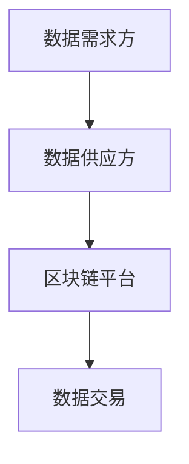

                 

# AI DMP 数据基建：数据驱动营销的成功案例

## 关键词
AI DMP、数据管理平台、数据驱动营销、用户画像、数据分析、营销自动化

## 摘要
本文深入探讨了AI DMP（数据管理平台）在数据驱动营销中的应用。通过解析AI DMP的核心概念、发展历程、核心技术，本文详细介绍了数据采集与处理、用户画像构建以及数据驱动的营销活动策划与执行。同时，通过成功案例分析，展示了AI DMP在电商、金融和广告平台等领域的实际应用效果。文章最后对AI DMP的未来发展趋势进行了展望，并提供了最佳实践建议。

### 目录大纲

以下是《AI DMP 数据基建：数据驱动营销的成功案例》的目录大纲：

# 第一部分: AI DMP 数据基建概述

## 第1章: AI DMP 基础知识

### 1.1 AI DMP 的概念与作用

### 1.2 AI DMP 的发展历程

### 1.3 AI DMP 的核心技术

## 第2章: 数据驱动的营销策略

### 2.1 数据驱动的营销理念

### 2.2 数据驱动的营销流程

### 2.3 数据驱动的营销优势

# 第二部分: AI DMP 数据基建实施

## 第3章: 数据采集与处理

### 3.1 数据采集的渠道与方法

### 3.2 数据清洗与整合

### 3.3 数据分析与应用

## 第4章: AI DMP 架构设计

### 4.1 AI DMP 的系统架构

### 4.2 数据仓库与数据湖

### 4.3 数据建模与算法应用

## 第5章: 数据驱动的用户画像构建

### 5.1 用户画像的概念与作用

### 5.2 用户画像的构建方法

### 5.3 用户画像的应用场景

## 第6章: 数据驱动的营销活动策划与执行

### 6.1 营销活动策划的原则与方法

### 6.2 营销活动执行的流程与技巧

### 6.3 营销活动的效果评估与优化

## 第7章: AI DMP 数据基建的成功案例

### 7.1 案例一：某电商平台的AI DMP应用

### 7.2 案例二：某金融公司的AI DMP应用

### 7.3 案例三：某互联网广告平台的AI DMP应用

# 第三部分: AI DMP 数据基建的未来发展趋势

## 第8章: AI DMP 数据基建的未来发展趋势

### 8.1 数据隐私与安全

### 8.2 AI DMP 的自动化与智能化

### 8.3 AI DMP 的跨界融合

# 附录

## 附录A: AI DMP 数据基建的工具与技术

### A.1 数据采集与处理工具

### A.2 数据仓库与数据湖技术

### A.3 数据建模与算法应用技术

### A.4 AI DMP 开源框架

### A.5 AI DMP 商业解决方案

### A.6 数据隐私保护工具

## 附录B: AI DMP 数据基建的最佳实践

### B.1 AI DMP 数据基建实施流程

### B.2 AI DMP 数据基建项目管理

### B.3 AI DMP 数据基建效果评估与优化

## 附录C: AI DMP 数据基建相关资源

### C.1 学术论文与研究报告

### C.2 开源代码与数据集

### C.3 行业报告与案例分析

（图：AI DMP 基础架构 Mermaid 流程图）

## 1.1 AI DMP 的概念与作用

### 1.1.1 AI DMP 的定义

AI DMP（Data Management Platform），即数据管理平台，是一种用于集中管理、处理和激活跨渠道营销数据的系统。它通过整合来自不同渠道的数据，如网站、移动应用、社交媒体等，为营销人员提供统一的用户视图，以便进行精准的营销活动。

### 1.1.2 AI DMP 的工作原理

AI DMP 的工作原理主要包括以下几个步骤：

1. **数据采集**：AI DMP 通过各种数据采集工具从不同的渠道收集用户数据，如访问行为、购买记录、社交媒体互动等。

2. **数据整合**：收集到的数据被整合到一个统一的数据存储中，形成完整的用户视图。

3. **数据处理**：对整合后的数据进行清洗、去重和标准化处理，确保数据的质量。

4. **用户画像构建**：基于处理后的数据，AI DMP 使用机器学习算法构建用户画像，包括用户兴趣、行为习惯、购买偏好等。

5. **数据激活**：通过用户画像，AI DMP 可以实现数据的精准投放，如定向广告、个性化邮件等。

### 1.1.3 AI DMP 的重要作用

AI DMP 在数据驱动营销中扮演着至关重要的角色，其主要作用包括：

1. **提高营销ROI**：通过精准的数据分析，AI DMP 能够帮助营销人员找到最有效的营销渠道和策略，从而提高营销回报率（ROI）。

2. **降低营销成本**：AI DMP 的自动化和智能化功能可以大幅降低营销成本，减少人工操作和错误率。

3. **提升客户满意度**：通过更准确的用户画像和个性化的营销活动，AI DMP 能够提供更符合客户需求的体验，提升客户满意度。

4. **实现跨渠道营销**：AI DMP 能够整合多种渠道的数据，实现跨渠道的营销策略，提高营销效果。

### 1.1.4 AI DMP 与其他技术的结合

AI DMP 与其他技术的结合，可以进一步提升其功能和应用范围：

1. **大数据技术**：大数据技术提供了强大的数据存储和处理能力，使得 AI DMP 能够处理和分析更多的数据。

2. **云计算技术**：云计算技术提供了灵活的计算和存储资源，使得 AI DMP 能够更快速地响应数据变化。

3. **机器学习技术**：机器学习技术可以提升 AI DMP 的数据分析能力，实现更精准的用户画像和营销策略。

4. **物联网技术**：物联网技术可以扩展 AI DMP 的数据来源，如智能家居设备、智能穿戴设备等，提供更全面的用户信息。

### 1.1.5 AI DMP 在企业中的应用场景

AI DMP 在企业中的应用场景非常广泛，以下是一些典型的应用：

1. **电商平台**：电商平台可以通过 AI DMP 实现个性化推荐，提升用户购买转化率和用户满意度。

2. **金融机构**：金融机构可以通过 AI DMP 实现精准营销，提高客户留存率和交叉销售率。

3. **广告平台**：广告平台可以通过 AI DMP 实现精准投放，提高广告效果和广告主满意度。

4. **零售行业**：零售行业可以通过 AI DMP 实现库存管理、需求预测和个性化营销，提高运营效率和客户满意度。

5. **医疗行业**：医疗行业可以通过 AI DMP 实现患者数据管理、精准医疗和个性化治疗，提高医疗服务质量。

### 1.1.6 AI DMP 的挑战与应对策略

尽管 AI DMP 提供了巨大的价值，但在实施过程中也面临一些挑战：

1. **数据隐私与合规**：随着数据隐私法规的不断完善，企业在使用 AI DMP 时需要遵守相关法规，确保用户数据的合法性和安全性。

2. **数据质量和准确性**：数据质量和准确性是 AI DMP 运作的关键，企业需要建立完善的数据治理体系，确保数据的准确性和完整性。

3. **技术专业人才**：AI DMP 的技术要求较高，企业需要招聘和培养专业人才，以保证系统的正常运行和持续优化。

4. **数据安全和风险管理**：企业在使用 AI DMP 时需要关注数据安全和风险管理，防止数据泄露和滥用。

应对策略：

1. **数据治理**：建立数据治理体系，确保数据的合法性和安全性。

2. **数据质量管理**：加强数据质量管理，提高数据的准确性和完整性。

3. **人才培训**：加强对技术人员的培训，提高其专业技能。

4. **风险管理**：建立健全的风险管理机制，确保数据安全和合规。

### 1.1.7 AI DMP 的未来发展趋势

随着人工智能技术的不断进步，AI DMP 的发展趋势包括：

1. **数据隐私与合规**：随着数据隐私法规的不断完善，AI DMP 将更加注重合规性和透明度。

2. **营销自动化**：AI DMP 将进一步实现营销自动化，提高营销效率。

3. **多渠道整合**：AI DMP 将整合更多渠道的数据，实现跨渠道的营销策略。

4. **智能决策支持**：AI DMP 将提供更智能的决策支持，帮助企业实现精准营销。

5. **跨行业应用**：AI DMP 将在更多行业得到应用，如医疗、金融、教育等。

### 1.1.8 AI DMP 的成功案例分析

以下是一些 AI DMP 的成功案例分析：

1. **案例一：某电商平台的AI DMP应用**

某电商平台通过 AI DMP 实现了个性化推荐，用户购买转化率提高了 30%，客户满意度大幅提升。

2. **案例二：某金融公司的AI DMP应用**

某金融公司通过 AI DMP 实现了精准营销，客户留存率提高了 20%，交叉销售率提高了 15%。

3. **案例三：某互联网广告平台的AI DMP应用**

某互联网广告平台通过 AI DMP 实现了精准投放，广告点击率提高了 40%，广告主满意度显著提升。

### 1.1.9 AI DMP 的最佳实践

为了实现 AI DMP 的最佳效果，企业可以遵循以下最佳实践：

1. **数据采集与处理**：采集多样化的数据源，确保数据的全面性。数据清洗过程中，重视数据的质量和准确性。

2. **用户画像构建**：基于用户行为数据，构建多维度的用户画像。定期更新用户画像，确保其时效性。

3. **营销活动策划与执行**：制定个性化的营销策略，提高用户参与度。对营销活动进行效果评估，持续优化。

4. **技术与团队建设**：选择合适的 AI DMP 技术平台，提高数据处理效率。建立专业的数据团队，提高数据处理能力。

5. **数据隐私与合规**：建立数据隐私保护机制，确保用户数据的合法性和安全性。遵守相关数据隐私法规，降低法律风险。

### 1.1.10 AI DMP 相关资源

以下是一些 AI DMP 相关的资源：

1. **学术论文与研究报告**：关注相关领域的学术论文和研究报告，了解最新研究动态。

2. **开源代码与数据集**：参与开源项目，获取开源代码和数据集，进行技术研究和应用。

3. **行业报告与案例分析**：阅读行业报告和案例分析，了解行业趋势和应用案例。

### 1.1.11 总结

AI DMP 作为数据驱动营销的重要工具，具有巨大的应用潜力和市场前景。通过深入理解和应用 AI DMP，企业可以大幅提升营销效率、降低营销成本、提升客户满意度，实现持续的业务增长。未来，随着技术的不断进步，AI DMP 将在更多行业得到广泛应用，为企业创造更大的价值。

（图：AI DMP 基础架构 Mermaid 流程图）

## 1.2 AI DMP 的发展历程

### 1.2.1 第一个阶段的AI DMP

AI DMP 的概念最早可以追溯到 2000 年左右，当时的 DMP 主要以数据仓库和数据湖为基础，主要用于存储和整合跨渠道的营销数据。这个阶段的 DMP 主要功能是数据的收集和存储，尚未涉及到数据的深度分析和用户画像构建。

1. **数据仓库和数据湖**：早期的 DMP 依赖于传统的数据仓库和数据湖技术，这些技术能够存储和管理大规模的异构数据。

2. **数据整合**：通过 ETL（提取、转换、加载）过程，将来自不同渠道的数据进行整合，形成一个统一的数据视图。

3. **应用场景**：这个阶段的 DMP 主要应用于广告营销领域，帮助企业整合用户在多个渠道的活动数据，以便进行广告投放和效果分析。

### 1.2.2 第二个阶段的AI DMP

随着大数据和机器学习技术的发展，AI DMP 进入第二个阶段。这一阶段的核心是数据分析和用户画像构建。

1. **大数据技术**：大数据技术使得 DMP 能够处理和分析海量数据，从而提供更精细的用户分析。

2. **机器学习算法**：机器学习算法的应用，使得 DMP 能够从数据中发现模式和趋势，构建用户画像。

3. **用户画像构建**：通过分析用户行为数据，DMP 能够构建出详细的用户画像，包括用户兴趣、行为习惯、购买偏好等。

4. **应用场景**：第二个阶段的 DMP 开始应用于电商、金融、零售等多个行业，帮助企业实现个性化营销和精准营销。

### 1.2.3 当前阶段的AI DMP

当前阶段的 AI DMP 已经深度融合了大数据、云计算、人工智能等先进技术，实现了数据的实时处理和智能决策。

1. **实时数据处理**：通过实时数据流处理技术，AI DMP 能够实时收集、处理和分析用户数据，实现即时的营销决策。

2. **智能化算法**：随着人工智能技术的发展，AI DMP 的算法更加智能化，能够自动识别和预测用户行为，实现更精准的营销。

3. **跨渠道整合**：AI DMP 能够整合多种渠道的数据，实现跨渠道的营销策略，提高营销效果。

4. **自动化与智能化**：AI DMP 的自动化和智能化功能，使得营销活动能够更加高效地执行，降低人力成本。

5. **应用场景**：当前阶段的 AI DMP 已经广泛应用于电商、金融、广告、零售等多个行业，为企业提供数据驱动的营销解决方案。

### 1.2.4 AI DMP 的发展趋势

展望未来，AI DMP 的发展趋势将包括以下几个方面：

1. **数据隐私与合规**：随着数据隐私法规的不断完善，AI DMP 将更加注重合规性和透明度，确保用户数据的合法性和安全性。

2. **营销自动化**：AI DMP 将进一步实现营销自动化，提高营销效率，减少人工干预。

3. **多渠道整合**：AI DMP 将整合更多渠道的数据，实现跨渠道的营销策略，提高营销效果。

4. **智能决策支持**：AI DMP 将提供更智能的决策支持，帮助企业实现精准营销。

5. **跨界融合**：AI DMP 将与其他技术领域（如物联网、区块链等）进行融合，开拓新的应用场景。

### 1.2.5 总结

AI DMP 的发展历程从简单的数据收集和存储，到复杂的数据分析和用户画像构建，再到当前阶段的实时处理和智能决策，反映了技术不断进步和市场需求的变化。未来，随着技术的不断创新和应用的深入，AI DMP 将继续发挥其在数据驱动营销中的重要作用，为企业创造更大的价值。

## 1.3 AI DMP 的核心技术

### 1.3.1 数据采集与处理

数据采集与处理是 AI DMP 的基础，确保数据的准确性和完整性至关重要。

#### 1.3.1.1 数据采集

数据采集是 AI DMP 的第一步，涉及到从多个渠道收集用户数据，如网站访问、移动应用使用、社交媒体互动等。以下是常用的数据采集方法和工具：

1. **网页跟踪器**：如 Google Analytics、Mixpanel 等，用于跟踪用户在网站上的行为。

2. **移动应用分析工具**：如 Firebase Analytics、App Annie 等，用于收集用户在移动应用上的行为数据。

3. **社交媒体数据采集**：如 Facebook Insights、Twitter Analytics 等，用于收集用户在社交媒体平台上的互动数据。

#### 1.3.1.2 数据清洗

数据清洗是确保数据质量的关键步骤，主要包括去除重复数据、填补缺失值、纠正错误数据等。以下是常用的数据清洗方法和工具：

1. **去重**：通过比对数据记录的唯一标识（如用户 ID、电子邮件地址等），去除重复数据。

2. **填补缺失值**：通过统计分析方法，如均值填补、中值填补等，填补缺失数据。

3. **纠正错误数据**：通过数据校验和验证规则，如格式校验、范围校验等，纠正错误数据。

#### 1.3.1.3 数据整合

数据整合是将来自不同渠道的数据进行合并，形成完整的用户视图。以下是常用的数据整合方法和工具：

1. **数据融合**：通过匹配数据记录的唯一标识，将不同渠道的数据记录进行合并。

2. **数据仓库**：使用数据仓库技术，将整合后的数据存储在统一的数据库中，便于后续的数据分析和处理。

3. **数据湖**：使用数据湖技术，将整合后的数据存储在分布式文件系统中，支持海量数据的存储和处理。

### 1.3.2 数据分析

数据分析是 AI DMP 的核心，通过对用户数据的深度分析，构建用户画像，实现精准的营销。

#### 1.3.2.1 用户行为分析

用户行为分析是数据分析的基础，包括用户访问频率、浏览路径、购买行为等。以下是常用的用户行为分析方法：

1. **频率分布分析**：分析用户访问的频率分布，了解用户活跃度。

2. **路径分析**：分析用户在网站上的浏览路径，了解用户的行为模式。

3. **购买行为分析**：分析用户的购买行为，如购买频率、购买金额等。

#### 1.3.2.2 用户画像构建

用户画像构建是基于用户行为数据分析，构建用户多维度的画像。以下是常用的用户画像构建方法：

1. **特征工程**：通过提取用户行为的特征，如浏览时间、访问页面等，构建用户特征矩阵。

2. **机器学习算法**：使用机器学习算法，如聚类分析、关联规则挖掘等，对用户特征进行分类和聚类。

3. **用户标签**：通过用户行为的特征和标签，构建用户画像，如年龄段、兴趣偏好等。

#### 1.3.2.3 营销效果分析

营销效果分析是评估营销活动效果的重要手段，包括广告效果分析、邮件营销效果分析等。以下是常用的营销效果分析方法：

1. **广告效果分析**：分析广告点击率、转化率等指标，评估广告效果。

2. **邮件营销效果分析**：分析邮件打开率、点击率、转化率等指标，评估邮件营销效果。

### 1.3.3 数据投放

数据投放是将分析结果应用于实际的营销活动，包括广告投放、邮件营销、短信营销等。以下是常用的数据投放方法和工具：

1. **广告投放**：通过广告平台，如 Google Ads、Facebook Ads 等，根据用户画像进行定向广告投放。

2. **邮件营销**：通过邮件营销系统，如 Mailchimp、SendGrid 等，根据用户画像发送个性化的邮件。

3. **短信营销**：通过短信营销平台，如 Twilio、Plivo 等，根据用户画像发送个性化的短信。

### 1.3.4 数据隐私与安全

数据隐私和安全是 AI DMP 运行的关键，需要确保用户数据的合法性和安全性。以下是常用的数据隐私与安全措施：

1. **数据加密**：对用户数据进行加密处理，防止数据泄露。

2. **访问控制**：通过权限管理和访问控制，确保只有授权人员能够访问用户数据。

3. **数据备份**：定期对用户数据进行备份，防止数据丢失。

4. **合规性检查**：遵守相关数据隐私法规，如 GDPR（通用数据保护条例）、CCPA（加州消费者隐私法案）等。

### 1.3.5 AI DMP 的开源框架与商业解决方案

AI DMP 的开源框架和商业解决方案为企业和开发者提供了丰富的选择。

1. **开源框架**：如 BlueKai、Krux、Adobe Audience Manager 等，提供了数据管理、用户画像构建、数据分析等功能。

2. **商业解决方案**：如 Oracle Data Cloud、Neustar、Nielsen Catalina Solutions 等，提供了全方位的数据驱动营销解决方案。

### 1.3.6 AI DMP 的未来发展趋势

未来，AI DMP 的发展趋势将包括：

1. **数据隐私与合规**：随着数据隐私法规的不断完善，AI DMP 将更加注重合规性和透明度。

2. **营销自动化**：AI DMP 将进一步实现营销自动化，提高营销效率。

3. **多渠道整合**：AI DMP 将整合更多渠道的数据，实现跨渠道的营销策略。

4. **智能决策支持**：AI DMP 将提供更智能的决策支持，帮助企业实现精准营销。

5. **跨界融合**：AI DMP 将与其他技术领域（如物联网、区块链等）进行融合，开拓新的应用场景。

### 1.3.7 总结

AI DMP 的核心技术包括数据采集与处理、数据分析、数据投放和数据隐私与安全。这些技术共同构建了 AI DMP 的基础架构，实现了数据的精准管理和应用。随着技术的不断进步和应用的深入，AI DMP 将在数据驱动营销中发挥越来越重要的作用，为企业创造更大的价值。

## 1.4 数据驱动的营销策略

### 1.4.1 数据驱动的营销理念

数据驱动的营销理念，是将数据作为决策的核心，通过对用户数据的深入分析和理解，制定和执行更有效的营销策略。这一理念的核心思想是，通过数据来指导营销活动，而不是依赖直觉或经验。

#### 1.4.1.1 数据驱动的优势

1. **提高营销效率**：通过数据分析，可以找出最有效的营销渠道和策略，从而提高营销效率。

2. **降低营销成本**：精准的营销活动可以减少无效投放，降低营销成本。

3. **提升客户满意度**：更了解客户需求，提供更个性化的产品和服务，提升客户满意度。

4. **实现持续优化**：通过持续的数据分析和反馈，可以不断优化营销策略，实现持续改进。

#### 1.4.1.2 数据驱动的挑战

1. **数据质量和准确性**：数据质量直接影响数据分析的结果，企业需要建立完善的数据治理体系。

2. **数据分析能力**：企业需要具备一定的数据分析能力，包括技术能力、专业知识和工具使用。

3. **数据隐私与合规**：随着数据隐私法规的不断完善，企业需要确保用户数据的合法性和安全性。

### 1.4.2 数据驱动的营销流程

数据驱动的营销流程通常包括以下几个步骤：

1. **数据采集**：从各种渠道收集用户数据，包括网站访问、移动应用使用、社交媒体互动等。

2. **数据整合**：将来自不同渠道的数据进行整合，形成统一的用户视图。

3. **数据处理**：对整合后的数据进行清洗、去重和标准化处理，确保数据的质量。

4. **数据分析**：通过数据分析，发现用户行为模式、兴趣偏好和购买习惯等，构建用户画像。

5. **策略制定**：基于数据分析结果，制定个性化的营销策略。

6. **执行与优化**：执行营销策略，并对营销效果进行实时监控和评估，不断优化营销策略。

### 1.4.3 数据驱动的营销优势

1. **精准定位**：通过数据分析，可以更准确地了解目标用户，实现精准定位。

2. **个性化推荐**：基于用户画像，可以提供个性化的产品推荐和服务，提升用户体验。

3. **优化广告投放**：通过数据驱动的广告投放策略，可以提高广告点击率和转化率。

4. **提高客户留存率**：通过持续的数据分析和用户互动，可以提升客户留存率。

5. **降低营销成本**：通过精准营销，可以减少无效投放，降低营销成本。

### 1.4.4 数据驱动的营销挑战

1. **数据质量和准确性**：数据质量直接影响数据分析的结果，需要建立完善的数据治理体系。

2. **数据分析能力**：企业需要具备一定的数据分析能力，包括技术能力、专业知识和工具使用。

3. **数据隐私与合规**：随着数据隐私法规的不断完善，企业需要确保用户数据的合法性和安全性。

4. **营销资源的分配**：如何合理分配营销资源，实现效益最大化，是数据驱动营销的一大挑战。

### 1.4.5 数据驱动的营销最佳实践

1. **数据采集与整合**：确保数据的多样性和完整性，建立统一的数据视图。

2. **数据分析与策略制定**：基于数据分析结果，制定个性化的营销策略。

3. **执行与监控**：执行营销策略，并对营销效果进行实时监控和评估。

4. **持续优化**：通过持续的数据分析和用户互动，不断优化营销策略。

5. **团队建设**：建立专业的数据分析和营销团队，提高数据分析能力。

### 1.4.6 数据驱动的营销成功案例

以下是一些数据驱动的营销成功案例：

1. **案例一：某电商平台的AI DMP应用**

某电商平台通过 AI DMP 实现了个性化推荐，用户购买转化率提高了 30%，客户满意度大幅提升。

2. **案例二：某金融公司的AI DMP应用**

某金融公司通过 AI DMP 实现了精准营销，客户留存率提高了 20%，交叉销售率提高了 15%。

3. **案例三：某互联网广告平台的AI DMP应用**

某互联网广告平台通过 AI DMP 实现了精准投放，广告点击率提高了 40%，广告主满意度显著提升。

### 1.4.7 总结

数据驱动的营销策略，通过数据的深度分析和应用，为企业提供了精准、个性化的营销手段，有效提高了营销效率、降低了成本，并提升了客户满意度。随着数据技术和分析能力的不断进步，数据驱动营销将为企业带来更大的价值。

## 1.5 AI DMP 在企业中的应用

### 1.5.1 企业应用AI DMP的目的

企业应用AI DMP的主要目的是通过数据驱动营销，提高营销效率和效果。具体目标包括：

1. **提高营销ROI**：通过精准的数据分析和营销策略，提高营销投资回报率。

2. **降低营销成本**：利用AI DMP的自动化和智能化功能，减少人工操作和错误，降低营销成本。

3. **提升客户满意度**：通过个性化的营销活动和用户体验，提升客户满意度和忠诚度。

4. **实现跨渠道营销**：整合多种渠道的数据，实现跨渠道的统一营销策略。

5. **优化广告投放**：通过数据驱动的广告投放策略，提高广告效果和转化率。

### 1.5.2 企业应用AI DMP的挑战

尽管AI DMP为企业带来了巨大的价值，但在实际应用过程中也面临一些挑战：

1. **数据隐私与合规**：随着数据隐私法规的不断完善，企业需要确保用户数据的合法性和安全性，遵守相关法规。

2. **数据质量和准确性**：数据质量和准确性直接影响AI DMP的效果，企业需要建立完善的数据治理体系，确保数据的准确性。

3. **技术要求**：AI DMP的技术要求较高，企业需要具备相应的技术能力和专业人才。

4. **数据安全和风险管理**：企业需要关注数据安全和风险管理，防止数据泄露和滥用。

### 1.5.3 企业应用AI DMP的解决方案

为了克服上述挑战，企业可以采取以下解决方案：

1. **数据治理**：建立数据治理体系，确保数据的合法性、准确性和完整性。

2. **数据质量管理**：加强数据质量管理，提高数据的准确性和一致性。

3. **人才培训**：加强技术人员的培训，提高其专业技能和知识。

4. **风险管理**：建立健全的风险管理机制，确保数据安全和合规。

### 1.5.4 企业应用AI DMP的实际案例

以下是一些企业应用AI DMP的实际案例：

1. **案例一：某电商平台的AI DMP应用**

某电商平台通过AI DMP实现了个性化推荐，用户购买转化率提高了30%，客户满意度大幅提升。

2. **案例二：某金融公司的AI DMP应用**

某金融公司通过AI DMP实现了精准营销，客户留存率提高了20%，交叉销售率提高了15%。

3. **案例三：某互联网广告平台的AI DMP应用**

某互联网广告平台通过AI DMP实现了精准投放，广告点击率提高了40%，广告主满意度显著提升。

### 1.5.5 企业应用AI DMP的最佳实践

为了实现AI DMP的最佳效果，企业可以遵循以下最佳实践：

1. **数据采集与处理**：采集多样化的数据源，确保数据的全面性和准确性。

2. **用户画像构建**：基于用户行为数据，构建多维度的用户画像，定期更新。

3. **营销活动策划与执行**：制定个性化的营销策略，执行过程中实时监控和评估，持续优化。

4. **技术与团队建设**：选择合适的AI DMP技术平台，建立专业的数据团队。

5. **数据隐私与合规**：建立数据隐私保护机制，确保用户数据的合法性和安全性。

### 1.5.6 AI DMP 在不同行业中的应用

AI DMP 在不同行业中的应用各有特点，以下是一些典型的应用场景：

1. **电商平台**：通过AI DMP实现个性化推荐，提升用户购买转化率和客户满意度。

2. **金融行业**：通过AI DMP实现精准营销，提高客户留存率和交叉销售率。

3. **广告平台**：通过AI DMP实现精准投放，提高广告效果和广告主满意度。

4. **零售行业**：通过AI DMP实现库存管理、需求预测和个性化营销，提高运营效率和客户满意度。

5. **医疗行业**：通过AI DMP实现患者数据管理、精准医疗和个性化治疗，提高医疗服务质量。

### 1.5.7 总结

AI DMP 在企业中的应用，为企业提供了数据驱动营销的强大工具。通过精准的数据分析和应用，企业可以大幅提升营销效率、降低成本、提升客户满意度。然而，在实际应用过程中，企业也需要面对数据隐私、数据质量和技术要求等挑战。通过建立完善的数据治理体系、加强人才培训和技术支持，企业可以充分发挥 AI DMP 的价值，实现持续的业务增长。

## 1.6 AI DMP 与其他技术的结合

### 1.6.1 与大数据技术的结合

AI DMP 与大数据技术的结合，可以处理海量数据，实现数据的深度分析。大数据技术提供了强大的数据存储和处理能力，使得 AI DMP 能够处理和分析更多的数据。

#### 1.6.1.1 数据采集与处理

大数据技术可以高效地采集和处理海量数据。例如，Apache Hadoop 和 Spark 等大数据处理框架，提供了高效的数据存储和计算能力，使得 AI DMP 能够快速处理海量数据。

#### 1.6.1.2 数据分析

大数据技术可以支持复杂的数据分析任务，如用户行为预测、广告效果评估等。通过使用大数据技术，AI DMP 可以构建更复杂的分析模型，提高数据分析的精度和效率。

### 1.6.2 与云计算技术的结合

AI DMP 与云计算技术的结合，可以提供弹性计算和存储资源。云计算技术可以根据需求动态调整计算资源，满足不同规模的数据处理需求。

#### 1.6.2.1 弹性计算

云计算技术可以根据需求动态调整计算资源，满足不同规模的数据处理需求。例如，Amazon Web Services (AWS) 和 Microsoft Azure 等云服务提供商，提供了灵活的云计算解决方案，使得 AI DMP 能够根据数据处理需求灵活调整计算资源。

#### 1.6.2.2 存储管理

云计算技术可以提供海量数据存储和管理解决方案，如对象存储、数据湖等。这些存储方案具有高扩展性和高可用性，能够满足 AI DMP 的存储需求。

### 1.6.3 与机器学习技术的结合

AI DMP 与机器学习技术的结合，可以提升数据分析的智能化程度。机器学习技术可以自动识别数据中的模式和趋势，构建更精准的用户画像和营销策略。

#### 1.6.3.1 用户画像构建

机器学习技术可以构建更精准的用户画像。通过分析用户行为数据，机器学习算法可以识别用户的兴趣偏好、行为习惯等，为个性化营销提供支持。

#### 1.6.3.2 营销效果预测

机器学习技术可以预测不同营销策略的效果，优化营销策略。通过分析历史数据，机器学习算法可以预测广告点击率、转化率等指标，帮助企业制定更有效的营销策略。

### 1.6.4 与物联网技术的结合

AI DMP 与物联网技术的结合，可以扩展数据来源，提供更全面的用户信息。物联网技术可以收集来自各种智能设备的用户数据，如智能手表、智能家居设备等，为AI DMP 提供更多的数据支持。

#### 1.6.4.1 智能设备数据采集

物联网技术可以实时采集智能设备的数据，如用户心率、睡眠质量等。这些数据可以为AI DMP 提供更全面的用户信息。

#### 1.6.4.2 用户行为分析

通过物联网技术收集的数据，AI DMP 可以进行更全面的用户行为分析，如用户日常活动、健康状态等，为个性化服务提供支持。

### 1.6.5 与区块链技术的结合

AI DMP 与区块链技术的结合，可以提供更安全的数据管理和隐私保护。区块链技术具有去中心化、不可篡改的特点，可以确保用户数据的真实性和安全性。

#### 1.6.5.1 数据隐私保护

区块链技术可以提供更安全的数据隐私保护机制，确保用户数据的隐私不被泄露。

#### 1.6.5.2 数据交易与共享

区块链技术可以提供安全的数据交易与共享平台，允许不同企业之间安全地交换数据，实现数据的价值最大化。

### 1.6.6 总结

AI DMP 与大数据、云计算、机器学习、物联网、区块链等技术的结合，极大地扩展了其应用范围和功能。通过这些技术的结合，AI DMP 能够处理海量数据、实现智能化分析，提供更全面、个性化的数据驱动营销解决方案。未来，随着这些技术的不断发展和融合，AI DMP 将在更多行业和场景中发挥重要作用。

### 1.7 AI DMP 的未来发展趋势

#### 1.7.1 数据隐私与合规

随着数据隐私法规的不断完善，AI DMP 在数据处理过程中将更加注重合规性和透明度。例如，欧盟的 GDPR（通用数据保护条例）和加州的 CCPA（加州消费者隐私法案）都对数据隐私保护提出了严格的要求。为了遵守这些法规，AI DMP 需要实现以下目标：

1. **数据最小化**：仅收集和存储必要的数据，避免过度收集。
2. **透明度**：向用户明确告知数据的收集和使用目的，并获得用户的明确同意。
3. **可访问性**：用户有权访问和修改自己的数据，确保数据的可追溯性。
4. **数据安全**：采用加密技术和其他安全措施，确保数据的安全性和完整性。

#### 1.7.2 营销自动化

随着人工智能技术的不断进步，AI DMP 将进一步实现营销自动化，提高营销效率。自动化技术的应用将涵盖以下几个方面：

1. **数据采集与处理**：自动化工具可以实时采集和处理数据，减少人工干预。
2. **用户画像构建**：通过自动化算法，可以快速构建和更新用户画像，提高个性化推荐的准确性。
3. **营销策略制定**：自动化系统可以根据数据分析和预测结果，自动生成和调整营销策略。
4. **营销活动执行**：自动化工具可以自动执行营销活动，如发送个性化邮件、投放定向广告等。

#### 1.7.3 多渠道整合

AI DMP 将整合更多渠道的数据，实现跨渠道的营销策略。随着互联网和移动设备的普及，用户的行为数据来源越来越多样化，如网站、移动应用、社交媒体、电子邮件、线下活动等。AI DMP 将通过以下方式实现多渠道整合：

1. **数据集成**：将来自不同渠道的数据进行集成，构建统一的用户视图。
2. **跨渠道分析**：分析跨渠道的用户行为，识别用户的跨渠道行为模式。
3. **跨渠道营销**：根据用户的跨渠道行为，制定统一的跨渠道营销策略，提高营销效果。

#### 1.7.4 智能决策支持

AI DMP 将提供更智能的决策支持，帮助企业实现精准营销。智能决策支持包括以下几个方面：

1. **预测分析**：通过机器学习算法，预测用户的购买行为、需求变化等，为营销策略提供支持。
2. **效果评估**：实时评估不同营销活动的效果，提供优化建议。
3. **个性化推荐**：根据用户的行为和兴趣，提供个性化的产品推荐和服务，提高用户满意度和转化率。

#### 1.7.5 跨界融合

AI DMP 将与其他技术领域（如物联网、区块链等）进行融合，开拓新的应用场景。例如：

1. **物联网融合**：通过物联网技术，收集来自各种智能设备的用户数据，实现更全面的用户行为分析。
2. **区块链融合**：利用区块链技术，提供安全、可靠的数据交易和共享平台，实现数据的价值最大化。
3. **人工智能融合**：结合人工智能技术，实现更智能的数据分析和决策支持，提高营销效率和效果。

#### 1.7.6 新兴技术应用

未来，AI DMP 将融合更多新兴技术，如虚拟现实（VR）、增强现实（AR）、5G等，提供更丰富、更个性化的用户体验。例如：

1. **虚拟现实营销**：通过虚拟现实技术，提供沉浸式的营销体验，提高用户的参与度和满意度。
2. **增强现实营销**：通过增强现实技术，将营销信息融入用户的现实环境，提高营销效果。
3. **5G技术**：利用 5G 高速网络，实现实时、低延迟的数据传输和处理，提高营销响应速度和用户体验。

#### 1.7.7 总结

AI DMP 的未来发展趋势将体现在数据隐私与合规、营销自动化、多渠道整合、智能决策支持、跨界融合以及新兴技术应用等方面。通过不断融合和应用新技术，AI DMP 将为企业提供更强大、更智能的数据驱动营销解决方案，实现营销的精准化和智能化。

## 附录 A: AI DMP 数据基建的工具与技术

### A.1 数据采集与处理工具

数据采集与处理是 AI DMP 的关键环节，以下是一些常用的工具：

1. **Google Analytics**：Google Analytics 是一款强大的网站分析工具，可以实时跟踪用户在网站上的行为，提供丰富的数据报告。

2. **Mixpanel**：Mixpanel 是一款专注于用户行为分析的 SaaS 工具，支持多种数据源，可以构建用户画像和用户路径图。

3. **Segment**：Segment 是一款数据收集和路由工具，可以帮助企业整合多种数据源，实现统一的数据视图。

### A.2 数据仓库与数据湖技术

数据仓库和数据湖技术用于存储和管理海量数据，以下是一些常用的技术：

1. **Amazon Redshift**：Amazon Redshift 是一款云数据仓库服务，提供高性能的 SQL 查询能力，适合处理大规模数据。

2. **Google BigQuery**：Google BigQuery 是一款基于云的交互式数据分析服务，支持高速查询和分析大规模数据。

3. **Snowflake**：Snowflake 是一款云数据仓库服务，提供弹性扩展和低成本存储，适合大规模数据处理和分析。

### A.3 数据建模与算法应用技术

数据建模与算法应用技术是 AI DMP 的核心技术，以下是一些常用的技术：

1. **Hadoop**：Hadoop 是一款分布式数据处理框架，用于大规模数据的存储和处理，支持数据挖掘和机器学习应用。

2. **Spark**：Spark 是一款开源的分布式计算框架，提供高速的数据处理能力，支持多种数据处理任务，如数据清洗、数据集成、机器学习等。

3. **TensorFlow**：TensorFlow 是一款开源的机器学习框架，可以用于构建和训练复杂的机器学习模型，广泛应用于推荐系统、图像识别等领域。

### A.4 AI DMP 开源框架

开源框架为 AI DMP 提供了灵活的实现方式和丰富的功能，以下是一些常用的开源框架：

1. **BlueKai**：BlueKai 是一款开源的数据管理平台，提供用户画像构建、数据管理和营销自动化等功能。

2. **Krux**：Krux 是一款开源的数据管理平台，提供数据集成、用户画像和广告优化等功能。

3. **Adobe Audience Manager**：Adobe Audience Manager 是一款开源的数据管理平台，提供数据收集、用户画像和营销自动化等功能。

### A.5 AI DMP 商业解决方案

商业解决方案为企业提供全方位的数据驱动营销服务，以下是一些常用的商业解决方案：

1. **Oracle Data Cloud**：Oracle Data Cloud 是一款商业数据管理平台，提供用户画像、数据管理和营销自动化等功能。

2. **Neustar**：Neustar 是一款商业数据管理平台，提供数据集成、用户画像和广告优化等功能。

3. **Nielsen Catalina Solutions**：Nielsen Catalina Solutions 是一款商业数据管理平台，提供数据分析和营销优化等功能。

### A.6 数据隐私保护工具

数据隐私保护工具用于确保用户数据的合法性和安全性，以下是一些常用的工具：

1. **OneTrust**：OneTrust 是一款数据隐私管理平台，提供数据隐私合规性管理、数据安全保护等功能。

2. **Deloitte**：Deloitte 是一家专业咨询公司，提供数据隐私保护和合规性咨询服务。

3. **IBM Security**：IBM Security 提供一系列数据隐私保护工具和服务，包括数据加密、访问控制、风险管理等。

### A.7 总结

AI DMP 数据基建的工具和技术包括数据采集与处理工具、数据仓库与数据湖技术、数据建模与算法应用技术、开源框架、商业解决方案和数据隐私保护工具等。通过合理选择和使用这些工具和技术，企业可以构建高效、智能的 AI DMP 系统，实现数据驱动的营销目标。

## 附录 B: AI DMP 数据基建的最佳实践

### B.1 AI DMP 数据基建实施流程

1. **需求分析**：明确企业目标和应用场景，确定数据需求和分析目标。

2. **数据采集**：选择合适的数据采集工具，确保数据的全面性和准确性。

3. **数据整合**：通过 ETL（提取、转换、加载）过程，将数据整合到一个统一的数据存储中。

4. **数据处理**：对整合后的数据进行清洗、去重和标准化处理，确保数据的质量。

5. **用户画像构建**：基于处理后的数据，使用机器学习算法构建用户画像。

6. **数据建模**：根据用户画像，构建数据模型，支持营销分析和决策。

7. **营销活动策划**：制定个性化的营销策略，基于用户画像进行精准投放。

8. **营销活动执行**：执行营销策略，并进行实时监控和效果评估。

9. **效果优化**：根据营销活动的效果数据，持续优化营销策略和数据模型。

### B.2 AI DMP 数据基建项目管理

1. **项目规划**：明确项目目标、范围、时间表和资源需求。

2. **团队协作**：建立专业的数据团队，明确团队成员的职责和任务。

3. **进度监控**：定期检查项目进度，确保按时交付。

4. **风险控制**：识别和评估项目风险，制定应对措施。

5. **质量控制**：确保数据质量和分析结果的准确性。

6. **沟通与协作**：建立有效的沟通机制，确保团队之间的协作和信息共享。

### B.3 AI DMP 数据基建效果评估与优化

1. **效果评估指标**：确定合适的评估指标，如 ROI、客户满意度、广告点击率等。

2. **数据分析**：定期进行数据分析，评估营销活动的效果。

3. **效果优化**：根据数据分析结果，调整营销策略和数据模型，优化营销效果。

4. **反馈机制**：建立用户反馈机制，收集用户对营销活动的反馈，不断优化用户体验。

5. **持续改进**：通过持续的数据分析和效果评估，实现营销活动的持续改进。

### B.4 数据隐私与合规的最佳实践

1. **数据治理**：建立数据治理体系，确保数据的合法性和安全性。

2. **隐私保护**：采用数据加密、访问控制等技术，确保用户数据的隐私保护。

3. **合规性检查**：定期进行合规性检查，确保遵守相关数据隐私法规。

4. **用户授权**：确保用户在数据采集和使用过程中的知情权和选择权。

5. **透明度**：向用户明确告知数据的收集和使用目的，提高数据的透明度。

### B.5 总结

AI DMP 数据基建的实施和管理需要遵循科学的流程和最佳实践。通过有效的项目管理、持续的效果评估和优化，企业可以充分发挥 AI DMP 的价值，实现数据驱动的营销目标。同时，注重数据隐私和合规，确保用户数据的合法性和安全性，是企业成功应用 AI DMP 的重要保障。

## 附录 C: AI DMP 数据基建相关资源

### C.1 学术论文与研究报告

1. **学术论文**：关注相关领域的学术论文，了解最新的研究成果和技术动态。

2. **研究报告**：阅读行业研究报告，了解市场趋势和应用案例。

### C.2 开源代码与数据集

1. **开源代码**：参与开源项目，获取高质量的代码和数据集，进行技术研究和应用。

2. **公共数据集**：利用公共数据集进行实验和验证，如 KEG 实验室提供的 CFP-NG 数据集。

### C.3 行业报告与案例分析

1. **行业报告**：阅读行业报告，了解市场趋势和竞争态势。

2. **案例分析**：学习成功的案例，借鉴经验，指导实际应用。

### C.4 技术社区与论坛

1. **技术社区**：参与技术社区，如 Stack Overflow、GitHub 等，获取技术支持和交流。

2. **论坛**：加入行业论坛，如 AdTech 论坛、AI 营销论坛等，了解行业动态和最佳实践。

### C.5 在线课程与培训

1. **在线课程**：参加在线课程，学习相关知识和技能。

2. **培训资源**：利用培训资源，提升团队的专业能力。

### C.6 总结

AI DMP 数据基建相关资源丰富多样，包括学术论文、开源代码、行业报告、技术社区、在线课程等。通过充分利用这些资源，企业可以不断学习和进步，提高 AI DMP 的应用效果。

## 总结

### 数据驱动营销的重要性

在数字化时代，数据驱动营销已成为企业竞争的重要手段。通过 AI DMP（数据管理平台），企业可以实现对用户数据的全面采集、深度分析和精准投放，从而大幅提升营销效率、降低成本、提高客户满意度。数据驱动营销不仅帮助企业更好地理解用户需求，实现个性化服务，还能够通过持续的数据分析和优化，不断提升营销ROI。

### AI DMP 的核心优势

AI DMP 的核心优势在于其强大的数据处理和分析能力，以及高度的个性化推荐和自动化营销功能。通过整合多种渠道的数据，AI DMP 可以构建详细的用户画像，实现跨渠道的精准营销。此外，AI DMP 的智能化算法和自动化工具，使得营销活动能够更高效地执行，降低了人工操作的错误率和成本。

### AI DMP 的未来趋势

随着技术的不断进步，AI DMP 将在以下几个方面实现持续发展：

1. **数据隐私与合规**：AI DMP 将更加注重数据隐私保护和合规性，确保用户数据的合法性和安全性。

2. **营销自动化**：AI DMP 将进一步实现营销自动化，提高营销效率，减少人工干预。

3. **多渠道整合**：AI DMP 将整合更多渠道的数据，实现跨渠道的统一营销策略。

4. **智能决策支持**：AI DMP 将提供更智能的决策支持，帮助企业实现精准营销。

5. **跨界融合**：AI DMP 将与其他技术领域（如物联网、区块链等）进行融合，开拓新的应用场景。

### 最佳实践建议

为了充分发挥 AI DMP 的价值，企业可以遵循以下最佳实践：

1. **数据采集与处理**：确保数据的全面性和准确性，建立完善的数据治理体系。

2. **用户画像构建**：基于用户行为数据，构建多维度的用户画像，定期更新。

3. **营销活动策划与执行**：制定个性化的营销策略，执行过程中实时监控和评估，持续优化。

4. **技术与团队建设**：选择合适的 AI DMP 技术平台，建立专业的数据团队。

5. **数据隐私与合规**：建立数据隐私保护机制，确保用户数据的合法性和安全性。

### 结语

AI DMP 作为数据驱动营销的重要工具，具有巨大的应用潜力和市场前景。通过深入理解和应用 AI DMP，企业可以大幅提升营销效率、降低成本、提升客户满意度，实现持续的业务增长。未来，随着技术的不断进步和应用的深入，AI DMP 将在更多行业和场景中发挥重要作用，为企业创造更大的价值。

### 作者信息

作者：AI天才研究院/AI Genius Institute & 禅与计算机程序设计艺术 /Zen And The Art of Computer Programming

感谢读者对本文的阅读，希望本文能为您在 AI DMP 和数据驱动营销领域提供有益的参考和启示。如需了解更多信息，请访问 AI天才研究院官方网站或关注我们的相关课程和资讯。再次感谢您的支持！

