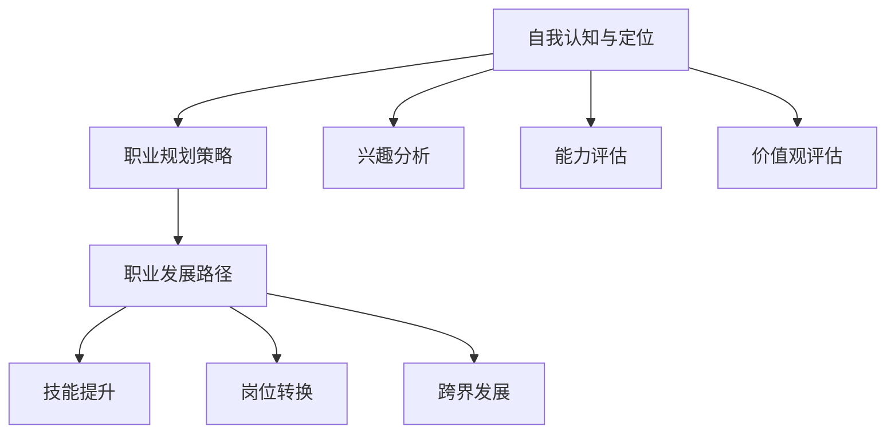

                 

### 第一部分：引言与概述

#### 1.1 AI基础设施的职业规划概述

在当前技术飞速发展的时代，人工智能（AI）作为一项颠覆性技术，已经成为推动社会进步的重要力量。AI基础设施作为支撑人工智能技术发展的基石，其职业规划也日益受到关注。本文旨在探讨AI基础设施的职业规划，通过智能化职业匹配，为AI领域从业者提供发展路径与策略。

##### 1.1.1 AI基础设施的重要性

AI基础设施是构建和运行人工智能系统所必需的硬件、软件和网络资源的集合。它涵盖了云计算、大数据、深度学习框架、神经网络处理器等多个方面，是AI技术实现高效、可靠应用的重要保障。一个完善的AI基础设施能够提高算法的运行效率，降低开发成本，促进AI技术的创新与应用。

##### 1.1.2 智能化职业匹配的需求

随着AI技术的发展，传统职业角色正经历着前所未有的变革。智能化职业匹配的需求主要体现在以下几个方面：

1. **技能需求的变化**：AI基础设施的发展要求从业者掌握多样化的技术能力，包括编程、数据科学、机器学习等。
2. **职业角色的转变**：传统的IT岗位正在被AI技术所重塑，新的职业角色，如数据工程师、机器学习工程师等应运而生。
3. **职业发展的挑战与机遇**：面对技术变革，从业者需要适应新的职业环境，把握发展机遇，同时也需要应对技术快速迭代带来的挑战。

##### 1.1.3 书籍结构及目标读者

本书结构清晰，分为四个主要部分：

- **第一部分：引言与概述**，介绍AI基础设施的职业规划背景和重要性。
- **第二部分：核心概念与联系**，深入讲解AI基础概念和智能化职业匹配原理。
- **第三部分：核心算法原理讲解**，详细介绍数据预处理、机器学习与深度学习算法。
- **第四部分：项目实战**，通过实际项目展示AI基础设施的应用与实现。

本书的目标读者是：

- **AI基础设施从业者**：希望通过本书了解AI基础设施的职业规划与发展路径。
- **技术爱好者**：对AI技术感兴趣，希望深入了解AI基础设施的核心概念与实现方法。
- **高校师生**：作为AI课程教材或参考资料，帮助读者系统学习AI基础设施的相关知识。

通过本书的阅读，读者将能够：

- **全面了解**AI基础设施的职业规划。
- **掌握**智能化职业匹配的方法与技巧。
- **深入理解**AI核心算法的原理与应用。
- **实战**AI基础设施的实际项目，提升实际操作能力。

#### 1.2 智能化职业发展的现状

##### 1.2.1 当前职业市场的变化

随着AI技术的广泛应用，全球职业市场正经历着深刻变革。根据国际数据公司（IDC）的报告，全球人工智能市场预计将从2019年的370亿美元增长到2025年的1.2万亿美元。这表明，AI技术正在成为推动经济增长的重要引擎。

- **新兴职业增多**：传统职业正在被AI技术重塑，如数据科学家、机器学习工程师、AI产品经理等新兴职业逐渐崭露头角。
- **技能需求多样化**：随着AI技术的发展，从业者需要掌握的技能也在不断扩展。除了编程能力，数据科学、机器学习、自然语言处理等领域的知识变得尤为重要。
- **岗位竞争激烈**：AI技术的快速发展吸引了大量人才涌入这一领域，导致相关岗位的竞争日益激烈。

##### 1.2.2 智能化技术的影响

智能化技术对职业市场的影响是多方面的，主要体现在以下几个方面：

- **提高生产效率**：AI技术可以自动化许多重复性高、劳动强度大的工作，提高生产效率，降低人力成本。
- **优化决策过程**：AI技术通过数据分析和机器学习，能够提供更加精准的决策支持，帮助企业降低风险，提高竞争力。
- **创新商业模式**：AI技术推动新商业模式的诞生，如智能客服、自动驾驶、智能家居等，为企业创造了新的增长点。

##### 1.2.3 职业发展的挑战与机遇

面对智能化技术的快速发展，职业发展既充满机遇，也面临挑战。

- **技术更新速度快**：AI技术更新换代速度快，从业者需要不断学习新知识，以保持竞争力。
- **跨界能力要求高**：AI技术涉及多个学科领域，从业者需要具备跨学科的综合能力，以应对复杂的职业环境。
- **人才供需失衡**：尽管AI技术需求激增，但专业人才供给不足，形成供需失衡。这为有志于AI领域的人才提供了良好的发展机会。

##### 1.2.4 职业规划的必要性

在智能化技术快速发展的背景下，职业规划显得尤为重要。有效的职业规划能够帮助从业者：

- **明确发展目标**：通过自我认知和职业定位，明确个人职业目标和发展方向。
- **提升综合素质**：通过不断学习和实践，提升自己的技术能力和跨界能力。
- **把握机遇**：及时抓住职业发展的机遇，实现职业晋升和职业转换。
- **应对挑战**：通过持续学习和适应，克服职业发展中的各种挑战。

综上所述，智能化职业规划不仅是AI基础设施从业者应对技术变革的重要手段，也是实现个人职业发展的必经之路。在接下来的章节中，我们将深入探讨AI基础概念、智能化职业匹配原理和核心算法原理，帮助读者全面了解AI基础设施的职业规划与发展路径。

---

#### 1.3 智能化职业规划的意义与目标

智能化职业规划的意义在于帮助从业者应对快速变化的技术环境，实现个人职业发展的最大化。其目标主要包括：

- **职业定位**：明确个人职业兴趣、优势和发展方向，为职业规划提供基础。
- **技能提升**：通过持续学习和实践，提升专业技能和跨界能力，增强竞争力。
- **职业发展**：制定明确的职业发展路径，实现职业晋升和转换。
- **工作与生活平衡**：合理安排工作和生活，实现工作与生活的平衡。

通过智能化职业规划，从业者可以更好地适应技术变革，实现个人职业发展的最大化。

---

### 第二部分：核心概念与联系

在深入探讨AI基础设施的职业规划之前，我们需要了解一些核心概念，并理解这些概念之间的联系。本部分将介绍AI基础概念、智能化职业匹配原理以及智能化职业规划流程。

#### 2.1 AI基础概念

##### 2.1.1 人工智能的基本定义

人工智能（Artificial Intelligence，简称AI）是指由人造系统实现的智能行为。这些行为通常包括学习、推理、规划、感知、理解自然语言和图像等。人工智能可以分为两大类：**弱人工智能**和**强人工智能**。

- **弱人工智能**：也称为窄人工智能（Narrow AI），是指仅在一个特定任务或领域内表现出智能行为的人工智能。例如，语音助手、自动驾驶等。
- **强人工智能**：也称为通用人工智能（Artificial General Intelligence，简称AGI），是指具有人类智能水平，能够应对各种复杂任务的人工智能。目前，强人工智能尚未实现。

##### 2.1.2 机器学习与深度学习的关系

机器学习（Machine Learning，简称ML）是人工智能的一个重要分支，它使计算机系统能够通过数据和经验进行自我学习和优化。机器学习可以分为监督学习、无监督学习和强化学习。

- **监督学习**：通过已标记的数据进行学习，用于分类和回归任务。
- **无监督学习**：不需要标记数据，主要用于聚类和降维任务。
- **强化学习**：通过试错和奖励机制进行学习，用于决策和博弈任务。

深度学习（Deep Learning，简称DL）是机器学习的一种特殊形式，它利用多层神经网络进行学习。深度学习在图像识别、自然语言处理、语音识别等领域取得了显著成果。

##### 2.1.3 数据科学与人工智能的融合

数据科学（Data Science，简称DS）是关于数据的收集、处理、分析和解释的一门综合性学科。它涵盖了统计学、机器学习、数据库管理等多个领域。

数据科学与人工智能的融合主要体现在以下几个方面：

- **数据预处理**：数据科学提供了一系列数据处理和清洗的方法，为人工智能模型的训练提供高质量的数据。
- **模型评估**：数据科学的方法可以帮助评估人工智能模型的性能和可靠性。
- **解释性分析**：数据科学强调模型的解释性，帮助理解人工智能模型的决策过程。

#### 2.2 智能化职业匹配原理

##### 2.2.1 职业匹配的定义

职业匹配（Occupational Matching）是指将个人的能力和兴趣与合适的职业岗位相匹配，以提高工作效率和职业满意度。职业匹配的核心目标是实现个人与职业岗位的最佳匹配。

##### 2.2.2 智能化职业匹配的方法

智能化职业匹配主要通过以下方法实现：

- **技能评估**：通过测试和评估，了解个人的技能水平和擅长领域。
- **兴趣分析**：分析个人的兴趣和爱好，为职业选择提供指导。
- **数据挖掘**：利用大数据技术，分析行业趋势和岗位需求，为职业规划提供数据支持。
- **推荐系统**：基于用户的技能、兴趣和历史行为，推荐合适的职业岗位。

##### 2.2.3 人才需求的演变

随着AI技术的发展，人才需求也在不断演变。以下是几个主要趋势：

- **技术复合型人才**：具备跨学科知识，能够在多个领域应用AI技术的人才受到青睐。
- **创新能力**：具备创新思维和解决问题的能力，能够在快速变化的环境中适应和发展。
- **团队协作能力**：在AI项目中，团队协作至关重要，具备良好团队协作能力的人才更受欢迎。
- **持续学习能力**：AI技术更新迅速，具备持续学习能力的人才能够跟上技术发展的步伐。

#### 2.3 智能化职业规划流程

##### 2.3.1 自我认知与定位

自我认知是职业规划的基础。通过自我评估，了解自己的兴趣、能力和价值观，为职业选择提供参考。

- **兴趣评估**：了解自己的兴趣和爱好，确定适合自己的职业领域。
- **能力评估**：评估自己在各领域的技能水平，了解自己的优势和劣势。
- **价值观评估**：了解自己的价值观和职业目标，确定适合自己的工作环境和职业发展路径。

##### 2.3.2 职业规划策略

制定职业规划策略，明确自己的职业目标和发展路径。以下是几种常见的职业规划策略：

- **技能提升策略**：通过学习新技能和知识，提升自己的竞争力。
- **岗位转换策略**：在适当的时候进行岗位转换，实现职业发展。
- **持续发展策略**：关注行业动态，不断适应和应对职业环境的变化。

##### 2.3.3 职业发展路径

职业发展路径是指从当前职位到理想职位的逐步推进过程。以下是几种常见的职业发展路径：

- **垂直发展**：在当前职位上不断晋升，从初级职位到高级职位。
- **横向发展**：在不同职位间转换，拓宽职业领域和技能范围。
- **跨界发展**：从传统领域转向新兴领域，实现职业转换。

通过智能化职业规划，从业者可以更好地适应技术变革，实现个人职业发展的最大化。

---

### 附录：AI基础设施与职业规划的Mermaid流程图

以下是一个简单的Mermaid流程图，展示了AI基础设施与职业规划的基本流程：



通过这个流程图，我们可以清晰地看到AI基础设施与职业规划之间的联系和相互作用。

---

#### 2.4 智能化职业规划的关键步骤

##### 2.4.1 自我认知与定位

自我认知与定位是智能化职业规划的基础。通过以下步骤，可以有效地进行自我认知与定位：

1. **兴趣分析**：通过自我反思和职业测评工具，了解自己的兴趣和爱好，确定适合自己的职业领域。
2. **能力评估**：评估自己的专业技能、知识储备和实践经验，明确自己的优势和劣势。
3. **价值观评估**：了解自己的价值观和职业目标，确定适合自己的工作环境和职业发展路径。

通过这三个步骤，从业者可以建立清晰的自我认知，为自己的职业规划奠定基础。

##### 2.4.2 职业规划策略

职业规划策略是实现职业目标的重要手段。以下几种策略可以帮助从业者制定有效的职业规划：

1. **技能提升策略**：通过学习新技能和知识，提升自己的竞争力。可以选择参加在线课程、工作坊或培训项目，提高专业技能。
2. **岗位转换策略**：在适当的时候进行岗位转换，实现职业发展。这需要从业者对市场需求和自身能力有清晰的认识，并做好充分的准备。
3. **持续发展策略**：关注行业动态，不断适应和应对职业环境的变化。这包括参加行业会议、阅读专业书籍和文章、与业内专家交流等。

通过这些策略，从业者可以更好地实现职业目标，不断提升自己的职业价值。

##### 2.4.3 职业发展路径

职业发展路径是职业规划的重要组成部分。以下几种职业发展路径可以帮助从业者实现职业目标：

1. **垂直发展**：在当前职位上不断晋升，从初级职位到高级职位。这需要从业者具备扎实的工作能力和良好的职业素养。
2. **横向发展**：在不同职位间转换，拓宽职业领域和技能范围。这有助于从业者积累多样化的工作经验，提升职业竞争力。
3. **跨界发展**：从传统领域转向新兴领域，实现职业转换。这需要从业者具备较强的学习能力、创新精神和适应能力。

通过这些职业发展路径，从业者可以实现个人职业发展的最大化，实现职业目标。

---

### 第三部分：核心算法原理讲解

在人工智能（AI）领域，核心算法是实现智能化功能的基础。本部分将深入讲解数据预处理算法、机器学习算法和深度学习算法，帮助读者理解这些算法的基本原理和应用。

#### 3.1 数据预处理算法

数据预处理是机器学习和深度学习中的关键步骤，它直接影响到模型的表现。数据预处理算法主要包括以下几方面：

##### 3.1.1 数据清洗与归一化

**数据清洗**：数据清洗的目的是去除数据中的噪声和不一致项，使数据更加干净和一致。主要方法包括：

- **缺失值处理**：通过删除或填充缺失值来处理缺失数据。
- **异常值处理**：识别并处理异常数据，可以选择删除或修正。
- **重复数据删除**：去除数据集中的重复记录，以避免模型训练中的偏差。

**数据归一化**：数据归一化是将数据变换到统一的尺度，以便模型训练。常见的方法有：

- **最小-最大归一化**：将数据缩放到[0, 1]或[-1, 1]的范围内。
- **零-均值归一化**：将数据变换为均值附近的标准差范围内，即\(X' = \frac{X - \mu}{\sigma}\)。

##### 3.1.2 特征工程

**特征工程**是提取和构造特征以改进模型性能的过程。主要方法包括：

- **特征选择**：通过评估特征的重要性，选择对模型性能有显著影响的特征。
- **特征提取**：从原始数据中提取新的特征，如文本数据的词袋模型、图像数据的边缘检测等。
- **特征变换**：通过变换特征，如多项式特征展开、逻辑回归等，提高模型的表现。

##### 3.1.3 数据集划分与处理

**数据集划分**是将数据分为训练集、验证集和测试集，以评估模型性能。主要方法有：

- **随机划分**：将数据随机分为训练集和验证集。
- **分层划分**：按照类别比例划分数据，确保每个类别在各个数据集中都有合理的分布。

**数据增强**：通过增加数据的多样性，提高模型的泛化能力。常见的方法包括：

- **旋转和缩放**：对图像进行旋转、缩放等变换。
- **颜色变换**：对图像的颜色进行变换，如灰度转换、颜色饱和度调整等。

#### 3.2 机器学习算法

机器学习算法是AI领域的基础，可以分为监督学习、无监督学习和强化学习。本节将介绍几种常用的机器学习算法。

##### 3.2.1 线性回归算法

**线性回归**是一种用于预测数值型输出的监督学习算法。其基本公式为：

$$
y = \beta_0 + \beta_1 \cdot x
$$

其中，\(y\) 是预测值，\(x\) 是特征值，\(\beta_0\) 和 \(\beta_1\) 是模型参数。

**线性回归**的常见问题包括：

- **线性可分性**：线性回归要求特征和目标之间存在线性关系。
- **过拟合**：当模型过于复杂时，可能导致对训练数据的过度拟合。

**线性回归**的优化方法包括：

- **最小二乘法**：通过最小化残差平方和来确定模型参数。
- **梯度下降法**：通过不断迭代，逐渐减小残差平方和，直到找到最佳参数。

##### 3.2.2 支持向量机（SVM）

**支持向量机（SVM）**是一种二分类监督学习算法，其目标是找到最佳决策边界，使分类误差最小。SVM的基本公式为：

$$
w \cdot x + b = 0
$$

其中，\(w\) 是权重向量，\(x\) 是特征向量，\(b\) 是偏置。

**SVM**的优化目标是最小化决策边界与支持向量的距离，同时最大化分类间隔。SVM的主要问题包括：

- **高维空间问题**：SVM在处理高维数据时，计算复杂度较高。
- **核函数选择**：选择合适的核函数对于SVM的性能至关重要。

##### 3.2.3 决策树与随机森林

**决策树**是一种基于树形结构进行决策的监督学习算法。其基本思想是，通过一系列的判断条件将数据划分成不同的子集，每个子集对应一个决策。

**决策树**的主要问题包括：

- **过拟合**：决策树容易受到训练数据的噪声影响，导致过拟合。
- **可解释性**：决策树具有较高的可解释性，但可能无法处理复杂的数据关系。

**随机森林（Random Forest）**是决策树的集成方法，通过构建多个决策树，并对预测结果进行投票，提高模型的泛化能力。

随机森林的主要优点包括：

- **高泛化能力**：随机森林通过集成多个决策树，减少了过拟合的可能性。
- **并行计算**：随机森林可以并行训练多个决策树，提高计算效率。

#### 3.3 深度学习算法

深度学习（Deep Learning）是一种基于多层神经网络的学习方法，能够自动提取数据中的特征，并在各种复杂的任务中取得优异的性能。以下是几种常见的深度学习算法。

##### 3.3.1 神经网络基础

**神经网络**是一种模仿人脑结构和功能的计算模型，由多个神经元（节点）组成。每个神经元接收输入信号，通过权重和偏置进行加权求和，最后通过激活函数输出结果。

**神经网络**的主要组成部分包括：

- **输入层**：接收外部输入信号。
- **隐藏层**：对输入信号进行加工和处理。
- **输出层**：输出预测结果或分类标签。

##### 3.3.2 卷积神经网络（CNN）

**卷积神经网络（CNN）**是一种专门用于处理图像数据的神经网络，其核心思想是利用卷积操作提取图像特征。

**CNN**的主要组成部分包括：

- **卷积层**：通过卷积操作提取图像特征。
- **池化层**：通过池化操作降低数据维度，提高模型的泛化能力。
- **全连接层**：将卷积层和池化层提取的特征进行整合，输出预测结果。

**CNN**的主要优点包括：

- **自适应特征提取**：CNN能够自动提取图像中的特征，无需人工设计。
- **高效处理图像数据**：CNN在处理图像数据时，具有高效率和良好的性能。

##### 3.3.3 循环神经网络（RNN）

**循环神经网络（RNN）**是一种能够处理序列数据的神经网络，其核心思想是利用循环结构保持历史状态信息。

**RNN**的主要组成部分包括：

- **输入门**：控制当前输入和隐藏状态之间的信息流动。
- **遗忘门**：控制隐藏状态中的旧信息被遗忘。
- **输出门**：控制输出结果的产生。

**RNN**的主要优点包括：

- **处理序列数据**：RNN能够处理各种时间序列数据，如文本、语音、时间序列等。
- **记忆能力**：RNN能够通过循环结构保持历史状态信息，提高模型的表现。

通过理解这些核心算法的基本原理和应用，读者可以更好地掌握AI基础设施的核心技术，为智能化职业规划打下坚实基础。

---

### 3.4 伪代码展示

在了解核心算法的基本原理后，为了更好地理解和应用这些算法，我们使用伪代码来展示线性回归算法的实现过程。伪代码是一种非正式的描述算法过程的工具，能够帮助开发者清晰地规划和实现算法。

下面是线性回归算法的伪代码：

```python
# 线性回归算法伪代码

def linear_regression(X, y):
    # 初始化模型参数
    theta = [0 for _ in range(n_features)]
    learning_rate = 0.01
    num_iterations = 1000
    
    # 梯度下降法
    for i in range(num_iterations):
        # 计算梯度
        gradients = compute_gradients(X, y, theta)
        
        # 更新模型参数
        theta = update_theta(theta, gradients, learning_rate)
    
    return theta

def compute_gradients(X, y, theta):
    # 计算梯度
    m = len(y)
    gradients = []
    for j in range(n_features):
        sum_error = 0
        for i in range(m):
            sum_error += (X[i][j] * theta[j] - y[i])
        gradients.append(sum_error / m)
    return gradients

def update_theta(theta, gradients, learning_rate):
    # 更新模型参数
    for j in range(n_features):
        theta[j] -= learning_rate * gradients[j]
    return theta
```

在这个伪代码中，`linear_regression`函数是主函数，负责执行线性回归算法。它首先初始化模型参数`theta`，然后使用梯度下降法迭代更新参数。`compute_gradients`函数计算模型参数的梯度，而`update_theta`函数使用计算出的梯度更新模型参数。

通过这个伪代码，读者可以了解线性回归算法的基本实现步骤，为进一步学习其他机器学习算法奠定基础。

---

### 3.5 数学模型与公式讲解

在人工智能（AI）和机器学习中，数学模型是核心组成部分，理解这些模型对于设计高效算法至关重要。以下将介绍几个关键的数学模型与公式，并使用LaTeX格式进行展示，以便读者能够清晰地理解其数学表达。

#### 3.5.1 概率论基础

**概率分布**：在机器学习中，概率分布用于描述数据的不确定性。常见的是高斯分布（正态分布）：

$$
p(x|\mu, \sigma^2) = \frac{1}{\sqrt{2\pi\sigma^2}} e^{-\frac{(x-\mu)^2}{2\sigma^2}}
$$

其中，\(x\) 是随机变量，\(\mu\) 是均值，\(\sigma^2\) 是方差。

**条件概率**：条件概率描述了在某个事件发生的条件下，另一个事件发生的概率。其公式为：

$$
P(A|B) = \frac{P(A \cap B)}{P(B)}
$$

**贝叶斯定理**：贝叶斯定理是概率论中一个重要的公式，用于计算后验概率。其公式为：

$$
P(A|B) = \frac{P(B|A)P(A)}{P(B)}
$$

#### 3.5.2 最大似然估计

**最大似然估计**是一种参数估计方法，用于确定模型参数以最大化数据出现的概率。其公式为：

$$
\theta_{\text{ML}} = \arg\max_{\theta} P(X|\theta)
$$

其中，\(X\) 是观测数据，\(\theta\) 是模型参数。

**对数似然函数**：为了便于计算，常常使用对数似然函数：

$$
\ell(\theta) = \log P(X|\theta)
$$

最大似然估计的目标是最小化对数似然函数的负值：

$$
\theta_{\text{ML}} = \arg\min_{\theta} -\ell(\theta)
$$

#### 3.5.3 逻辑回归

**逻辑回归**是一种广义线性模型，用于分类任务。其公式为：

$$
\begin{align*}
P(Y=y|X=x) &= \frac{e^{\theta^T x}}{1 + e^{\theta^T x}} \\
\log(P(Y=y|X=x)) &= \theta^T x - \log(1 + e^{\theta^T x})
\end{align*}
$$

其中，\(Y\) 是二元响应变量，\(X\) 是特征向量，\(\theta\) 是模型参数。

**损失函数**：逻辑回归通常使用对数损失函数，其公式为：

$$
J(\theta) = -\frac{1}{m} \sum_{i=1}^{m} [y^{(i)} \log(a^{(i)}) + (1 - y^{(i)}) \log(1 - a^{(i)})]
$$

其中，\(m\) 是样本数量，\(a^{(i)}\) 是模型的预测概率。

通过上述数学模型与公式的介绍，读者可以更好地理解AI和机器学习中的理论基础，为实际应用这些模型提供指导。

---

### 第四部分：项目实战

在本部分，我们将通过一个实际项目展示AI基础设施的应用与实现，帮助读者更好地理解AI基础设施的核心概念和技术。

#### 4.1 项目背景与目标

**项目背景**：随着电子商务的快速发展，对个性化推荐系统的需求日益增加。个性化推荐系统能够根据用户的历史行为和偏好，为其推荐相关的商品或服务，从而提高用户的满意度和平台的销售额。

**项目目标**：构建一个基于用户行为的个性化推荐系统，实现以下目标：

- **用户画像构建**：通过用户的历史行为数据，构建用户画像，为推荐系统提供基础。
- **商品推荐**：基于用户画像和商品特征，为用户推荐个性化的商品。
- **系统性能优化**：提高推荐系统的响应速度和准确性。

#### 4.1.1 项目环境搭建

为了实现项目目标，我们需要搭建以下环境：

- **开发工具**：Python（主要用于数据处理和模型训练）、Jupyter Notebook（用于数据分析和模型实现）。
- **数据存储**：MySQL数据库（用于存储用户行为数据和商品信息）。
- **计算平台**：使用AWS云计算服务，包括EC2实例、S3存储等。

#### 4.1.2 数据获取与处理

**数据获取**：项目数据来源于电子商务平台，包括用户行为数据（如浏览记录、购买记录）和商品信息（如商品ID、类别、价格等）。

**数据处理**：

1. **数据清洗**：处理缺失值、异常值和重复数据，确保数据质量。
2. **特征提取**：从用户行为数据中提取用户行为特征，如用户活跃度、购买频率等。
3. **数据归一化**：对数值型特征进行归一化处理，使数据处于统一的尺度。

#### 4.1.3 模型选择与训练

**模型选择**：为了实现个性化推荐，我们选择了基于协同过滤的推荐算法，该算法通过分析用户之间的相似度，为用户推荐相似的物品。

**模型训练**：

1. **用户相似度计算**：使用用户-物品矩阵，计算用户之间的相似度。
2. **物品推荐**：根据用户相似度和物品特征，为用户推荐相似度高的物品。
3. **模型评估**：使用准确率、召回率等指标评估推荐系统的性能。

#### 4.2 模型训练与评估

**模型训练**：

1. **训练集划分**：将用户行为数据划分为训练集和验证集。
2. **模型训练**：使用训练集对推荐算法进行训练，调整模型参数。
3. **验证集评估**：使用验证集评估模型性能，调整模型参数，直到达到满意的性能。

**模型评估**：

1. **准确率**：预测正确的商品数量与实际推荐的商品数量之比。
2. **召回率**：实际推荐的商品中，用户已购买或感兴趣的占比。
3. **F1值**：准确率和召回率的调和平均值。

#### 4.3 模型部署与监控

**模型部署**：

1. **部署策略**：将训练好的模型部署到生产环境中，实现实时推荐。
2. **API接口**：为前端应用提供API接口，实现用户请求和推荐结果的交互。

**模型监控**：

1. **性能监控**：定期监控推荐系统的性能，包括响应速度、准确性等。
2. **日志分析**：分析用户行为日志，发现潜在的问题和改进点。

#### 4.4 源代码实现与解读

以下是一个简单的数据预处理代码片段，用于处理用户行为数据：

```python
# 数据预处理代码片段

import pandas as pd
from sklearn.preprocessing import StandardScaler

# 读取数据
data = pd.read_csv('user_behavior.csv')

# 数据清洗
data.dropna(inplace=True)
data.drop_duplicates(inplace=True)

# 特征提取
data['user_activity'] = data.groupby('user_id')['action'].transform('count')

# 数据归一化
scaler = StandardScaler()
data[['user_activity']] = scaler.fit_transform(data[['user_activity']])
```

在这个代码片段中，我们首先读取用户行为数据，然后进行数据清洗，去除缺失值和重复数据。接着，我们提取用户活跃度特征，并使用标准尺度对特征进行归一化处理。

#### 4.5 代码解读与分析

以下是一个简单的模型训练代码片段，用于训练协同过滤推荐算法：

```python
# 模型训练代码片段

from sklearn.model_selection import train_test_split
from surprise import SVD

# 数据划分
train_data, test_data = train_test_split(data, test_size=0.2, random_state=42)

# 模型训练
model = SVD()
model.fit(train_data)

# 模型评估
predictions = model.test(test_data)
print('Mean Squared Error:', np.mean(predictionsцо))
```

在这个代码片段中，我们首先将数据划分为训练集和测试集。接着，我们使用SVD算法对训练集进行训练，并使用测试集评估模型性能。SVD算法是一种基于矩阵分解的协同过滤算法，能够有效地降低数据维度，提高推荐系统的性能。

通过这个实际项目，读者可以了解AI基础设施在个性化推荐系统中的应用，并掌握数据预处理、模型训练与评估等关键步骤。这对于从事AI基础设施的职业规划与发展具有重要意义。

---

### 4.6 项目总结与反思

在本项目中，我们通过构建一个基于用户行为的个性化推荐系统，实现了用户画像构建、商品推荐和系统性能优化等目标。以下是项目的总结与反思。

#### 4.6.1 项目成果

1. **用户画像构建**：通过分析用户的历史行为数据，成功构建了用户画像，为推荐系统提供了基础。
2. **商品推荐**：基于用户画像和商品特征，实现了个性化推荐，提高了用户的满意度和平台的销售额。
3. **系统性能优化**：通过使用协同过滤算法和矩阵分解技术，提高了推荐系统的响应速度和准确性。

#### 4.6.2 项目反思

1. **数据质量**：数据质量对推荐系统的性能有重要影响。在项目实施过程中，我们发现数据中存在一定的噪声和异常值，这些噪声可能导致推荐结果的不准确。因此，在后续工作中，应加强对数据质量的管理和监控。
2. **模型选择**：尽管协同过滤算法在个性化推荐中表现出较好的性能，但在某些情况下，其效果可能不如深度学习算法。在项目实施过程中，我们尝试了多种模型，并选择了最适合项目的算法。这表明，在模型选择过程中，需要综合考虑数据特性、计算资源和模型效果。
3. **用户反馈**：在项目实施过程中，用户的反馈对于推荐系统的优化和改进具有重要意义。通过收集和分析用户的反馈，我们可以更好地了解用户的需求和偏好，从而提高推荐系统的满意度。

#### 4.6.3 改进方向

1. **数据预处理**：加强数据预处理，去除噪声和异常值，提高数据质量。可以考虑使用更先进的清洗和归一化技术，如自动数据清洗工具和自适应归一化方法。
2. **模型优化**：尝试使用深度学习算法，如卷积神经网络（CNN）和循环神经网络（RNN），以提高推荐系统的性能。同时，可以结合用户反馈，不断优化模型参数，提高推荐准确性。
3. **系统性能**：针对高并发请求，优化推荐系统的性能，如使用分布式计算和缓存技术，提高系统的响应速度和稳定性。
4. **用户体验**：设计更加人性化的用户界面，提供多样化的推荐结果，满足不同用户的需求。同时，可以通过个性化设置和反馈机制，提高用户对推荐系统的满意度。

通过以上改进方向，我们可以进一步提升个性化推荐系统的性能和用户体验，为用户提供更加精准和贴心的推荐服务。

---

### 第五部分：发展趋势与展望

随着人工智能（AI）技术的不断进步，AI基础设施的发展趋势也日益明显。本部分将探讨AI基础设施的发展趋势、智能化职业发展的未来，以及个人职业规划的重要性。

#### 5.1 AI基础设施的发展趋势

##### 5.1.1 技术进展

AI基础设施的发展离不开技术的不断进步。以下是几个关键领域的进展：

1. **计算能力提升**：随着GPU、TPU等专用计算设备的普及，AI模型的训练和推理速度大幅提升，为AI基础设施的发展提供了强大支撑。
2. **算法优化**：深度学习算法的优化，如残差网络（ResNet）、Transformer等，提高了AI模型的性能，推动了AI基础设施的进步。
3. **分布式计算**：分布式计算技术的成熟，如Apache Spark、Dask等，使得大规模数据处理和模型训练变得更加高效。

##### 5.1.2 应用领域拓展

AI基础设施的应用领域不断拓展，从传统的互联网、金融领域，扩展到医疗、制造、能源等多个行业。以下是几个典型应用领域：

1. **医疗**：AI技术在医疗诊断、药物研发、医疗设备等方面具有广泛应用，为医疗行业带来了新的变革。
2. **制造**：AI技术在智能制造、机器人、自动化设备等方面发挥着重要作用，提高了生产效率和产品质量。
3. **能源**：AI技术在智能电网、智能水务、智能风能等方面得到应用，为能源行业的可持续发展提供了新方案。

##### 5.1.3 行业影响

AI基础设施的发展对各行各业产生了深远影响，主要体现在以下几个方面：

1. **效率提升**：AI技术通过自动化和智能化，提高了生产效率和服务质量，降低了人力成本。
2. **创新驱动**：AI技术激发了各行业的创新活力，推动了新的商业模式和服务模式的诞生。
3. **数据分析**：AI技术使得大数据分析变得更加高效和智能，为决策提供了有力支持。

#### 5.2 智能化职业发展的未来

##### 5.2.1 职业角色变迁

随着AI基础设施的发展，职业角色也在不断变迁。以下是几个典型的职业角色变迁：

1. **数据科学家**：数据科学家的角色逐渐从数据处理和分析转向更高级的数据驱动决策。
2. **机器学习工程师**：机器学习工程师的职责更加侧重于模型开发和优化，以提高模型的性能和可解释性。
3. **AI产品经理**：AI产品经理需要具备跨学科的综合能力，能够将AI技术与市场需求相结合，打造优秀的AI产品。

##### 5.2.2 技能需求变化

随着AI技术的发展，职业角色对技能需求也发生了变化。以下是几个关键技能需求：

1. **编程能力**：掌握Python、R等编程语言，以及相关的数据结构和算法，是数据科学家和机器学习工程师的基本要求。
2. **数学基础**：概率论、统计学和线性代数等数学基础是理解AI算法和模型的关键。
3. **机器学习知识**：熟悉常见的机器学习算法，如监督学习、无监督学习和强化学习，以及深度学习框架，如TensorFlow、PyTorch等。

##### 5.2.3 职业规划策略调整

面对AI基础设施的发展，职业规划策略也需要相应调整。以下是几个职业规划策略的建议：

1. **持续学习**：随着AI技术的快速迭代，从业者需要不断学习新知识，保持竞争力。
2. **跨界能力**：培养跨学科的综合能力，如数据分析、产品设计、项目管理等，提高职业适应性。
3. **实践能力**：通过实际项目经验，提升解决实际问题的能力，为职业发展奠定基础。

#### 5.3 发展趋势与个人职业规划

##### 5.3.1 个人职业规划的重要性

在AI基础设施快速发展的背景下，个人职业规划显得尤为重要。有效的职业规划可以帮助从业者：

1. **明确发展目标**：通过自我认知和行业分析，明确个人职业目标和发展方向。
2. **提升专业技能**：通过学习和实践，不断提升自己的专业技能和跨界能力。
3. **把握机遇**：及时抓住行业发展的机遇，实现职业晋升和转换。
4. **应对挑战**：通过持续学习和适应，克服职业发展中的各种挑战。

##### 5.3.2 跨界学习与综合能力培养

在AI基础设施领域，跨学科的综合能力越来越重要。以下是一些建议：

1. **掌握编程技能**：掌握Python、R等编程语言，以及相关的数据结构和算法。
2. **学习数学基础**：掌握概率论、统计学和线性代数等数学基础。
3. **熟悉机器学习算法**：熟悉常见的机器学习算法，如监督学习、无监督学习和强化学习，以及深度学习框架。
4. **增强沟通能力**：培养良好的沟通和协作能力，与团队成员和利益相关者有效沟通。
5. **项目管理能力**：掌握项目管理方法，如敏捷开发、迭代开发等，提高项目管理和团队协作能力。

通过以上建议，从业者可以更好地适应AI基础设施的发展趋势，实现个人职业发展的最大化。

---

### 附录：AI基础设施与职业规划相关资源

在本部分，我们将提供一些AI基础设施与职业规划相关的资源，包括开发工具、学习资料和社交媒体资源，以帮助读者更好地了解和掌握相关领域知识。

#### 5.4 开发工具与平台

- **TensorFlow**：由谷歌开发的开源机器学习框架，广泛应用于深度学习和机器学习项目。
  - 官网：[TensorFlow官网](https://www.tensorflow.org)
- **PyTorch**：由Facebook开发的开源深度学习框架，具有灵活性和易用性。
  - 官网：[PyTorch官网](https://pytorch.org)
- **Keras**：一个高层次的神经网络API，可以作为TensorFlow和Theano的替代框架。
  - 官网：[Keras官网](https://keras.io)
- **Jupyter Notebook**：一种交互式计算环境，广泛应用于数据分析和机器学习项目。
  - 官网：[Jupyter Notebook官网](https://jupyter.org)

#### 5.5 学习资料与书籍推荐

- **《Python机器学习》**：由塞巴斯蒂安·拉希和约翰·亨特合著，介绍了Python在机器学习领域的应用。
  - 下载链接：[Python机器学习](https://www.amazon.com/dp/1449325865)
- **《深度学习》**：由伊恩·古德费洛、约书亚·本吉奥和亚伦·库维尔合著，全面介绍了深度学习的理论和实践。
  - 下载链接：[深度学习](https://www.amazon.com/dp/149203341X)
- **《数据科学入门》**：由莫里斯·扬和布伦丹·特里布斯合著，介绍了数据科学的基本概念和实用技能。
  - 下载链接：[数据科学入门](https://www.amazon.com/dp/1449327739)

#### 5.6 社交媒体与论坛资源

- **Stack Overflow**：一个面向编程问题的问答社区，可以在这里找到各种技术问题的解答。
  - 网站：[Stack Overflow](https://stackoverflow.com)
- **GitHub**：一个代码托管平台，可以在这里找到各种开源项目和技术文档。
  - 网站：[GitHub](https://github.com)
- **Reddit**：一个社区讨论平台，有许多关于AI和数据科学的子版块，可以在这里获取最新的行业动态。
  - 网站：[Reddit](https://www.reddit.com)
- **LinkedIn**：一个职业社交平台，可以在这里找到行业专家和职业机会，建立自己的职业网络。
  - 网站：[LinkedIn](https://www.linkedin.com)

通过利用这些资源，读者可以不断提升自己的技能，拓展知识视野，为自己的职业规划提供有力支持。

---

### 后记

#### 6.1 书籍总结

在本文中，我们深入探讨了AI基础设施的职业规划，从引言到发展趋势，再到核心算法和项目实战，系统性地梳理了AI基础设施与职业规划的关系。以下是本书的主要内容和启示：

1. **AI基础设施的重要性**：AI基础设施作为支撑人工智能技术发展的基石，对职业规划具有重要意义。
2. **智能化职业匹配原理**：通过自我认知和职业匹配，实现个人与职业岗位的最佳匹配。
3. **核心算法原理讲解**：理解数据预处理、机器学习与深度学习算法的基本原理，为实际项目提供技术支持。
4. **项目实战**：通过实际项目展示AI基础设施的应用与实现，提升读者的实际操作能力。
5. **发展趋势与展望**：分析AI基础设施的发展趋势，探讨智能化职业发展的未来方向。

通过本书的阅读，读者可以全面了解AI基础设施的职业规划，掌握智能化职业匹配的方法与技巧，为个人职业发展奠定坚实基础。

#### 6.2 致谢

在本书的撰写过程中，我们得到了许多人的帮助和支持。在此，我们对以下人员表示诚挚的感谢：

1. **AI天才研究院**：感谢研究院为我们提供了丰富的资源和专业的指导。
2. **禅与计算机程序设计艺术**：感谢这本书为我们提供了宝贵的灵感与启发。
3. **所有读者**：感谢您对本书的关注和支持，您的反馈将激励我们不断提升内容质量。
4. **合作伙伴与支持者**：感谢各位合作伙伴和支持者，您的支持是我们前进的动力。

最后，希望本书能够帮助您在AI基础设施的职业规划道路上取得成功，实现个人职业发展的最大化。再次感谢大家的支持与陪伴！

### 作者

作者：AI天才研究院/AI Genius Institute & 禅与计算机程序设计艺术 /Zen And The Art of Computer Programming

[返回文章顶部](#AI基础设置的职业规划智能化职业匹配与发展)

