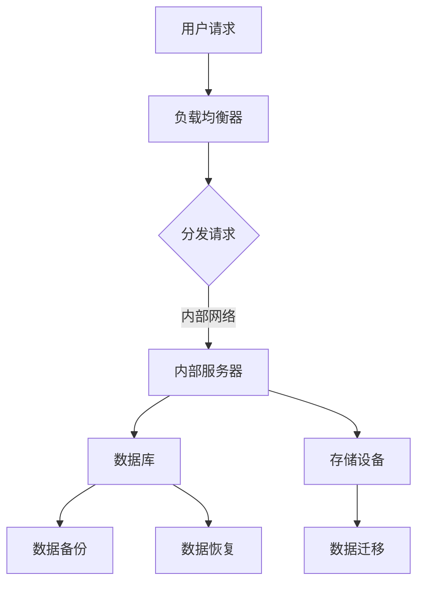
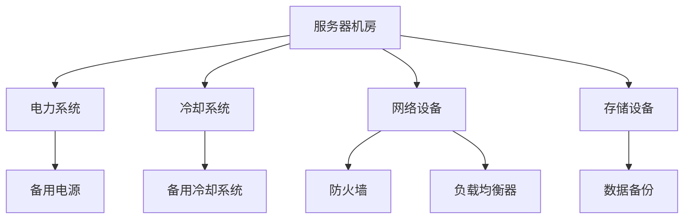
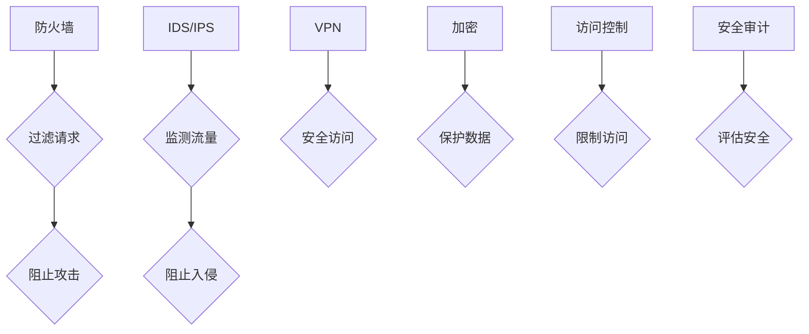

                 

## AI 大模型应用数据中心建设：数据中心安全与可靠性

关键词：数据中心、AI 大模型、安全性、可靠性、网络安全、物理安全、数据安全、电力供应、制冷系统、硬件设备可靠性、网络可靠性、性能优化、实战案例

摘要：
随着人工智能技术的快速发展，AI 大模型在各个领域的应用日益广泛，数据中心作为承载 AI 大模型运行的重要基础设施，其安全与可靠性变得尤为重要。本文将围绕 AI 大模型应用数据中心的建设，详细探讨数据中心的安全性、可靠性以及相关技术实践。通过深入分析，帮助读者全面了解数据中心建设的关键要素和实际操作，为相关项目的成功实施提供理论指导和实践经验。

### 目录大纲

1. 数据中心概述与 AI 大模型应用
   1.1 数据中心的定义与架构
   1.2 数据中心的类型与规模
   1.3 数据中心的物理布局
   2. AI 大模型数据中心的应用场景
   2.1 AI 大模型数据中心的需求分析
   2.2 AI 大模型数据中心的核心功能
   2.3 AI 大模型数据中心的应用前景

2. 数据中心安全与防护
   3. 数据中心网络安全
      3.1 网络安全概述
      3.2 数据中心网络安全策略
      3.3 常见网络攻击与防御
   4. 数据中心物理安全
      4.1 物理安全概述
      4.2 数据中心物理安全措施
      4.3 灾难恢复与业务连续性
   5. 数据中心数据安全
      5.1 数据安全概述
      5.2 数据加密与访问控制
      5.3 数据备份与恢复策略

3. 数据中心可靠性提升
   6. 数据中心电力供应与制冷
      6.1 电力供应系统
      6.2 制冷系统
      6.3 电力与制冷系统的可靠性保障
   7. 数据中心硬件设备的可靠性
      7.1 硬件设备概述
      7.2 设备故障预测与监控
      7.3 硬件设备的冗余与备份
   8. 数据中心网络可靠性
      8.1 网络可靠性概述
      8.2 网络架构设计
      8.3 网络故障检测与恢复
   9. 数据中心性能优化
      9.1 性能优化概述
      9.2 数据存储优化
      9.3 网络传输优化

4. AI 大模型数据中心实战案例
   10. 案例研究：某大型企业 AI 大模型数据中心建设实践
   10.1 项目背景与需求
   10.2 技术选型与架构设计
   10.3 项目实施与监控
   10.4 项目效果评估与优化

5. 数据中心运营与维护
   11. 数据中心运营流程
   11.2 数据中心运维团队建设
   11.3 数据中心日常维护与故障处理

6. 附录
   6.1 国家标准与行业规范
   6.2 行业研究报告与趋势分析
   6.3 数据中心建设工具与软件
   6.4 常见问题与解答
   6.5 参考文献

---

### 第一部分：数据中心概述与 AI 大模型应用

#### 1.1 数据中心的定义与架构

数据中心，简称 Data Center，是指一种专门为集中存储、处理和分发数据而设计的建筑设施。数据中心通常包含服务器房、存储设备、网络设备、电力供应系统、冷却系统等关键设施。其核心目标是提供高可用性、高可靠性和高安全性的计算、存储和网络资源，以满足各种业务需求。

数据中心的架构可以分为以下几个方面：

1. **硬件架构**：包括服务器、存储设备、网络设备、备用电源和冷却系统等。
2. **软件架构**：包括操作系统、数据库管理系统、虚拟化平台、安全软件等。
3. **网络架构**：包括内部网络、外部网络、防火墙、负载均衡等。
4. **数据架构**：包括数据存储、数据备份、数据恢复、数据迁移等。

一个典型的数据中心架构如下所示：

#### 1.2 数据中心的类型与规模

根据数据中心的功能和规模，可以分为以下几种类型：

1. **企业数据中心**：为企业内部业务提供计算、存储和网络资源。
2. **云数据中心**：为云计算服务提供基础设施，支持云服务提供商的业务。
3. **互联网数据中心**：为互联网服务提供基础设施，如数据中心托管、内容分发等。
4. **边缘数据中心**：靠近用户，提供低延迟、高带宽的计算和存储资源。

不同类型的数据中心在规模上也有所不同，可以从几千平方米到几万平方米不等。大型数据中心通常具备更高的硬件设备密度和更复杂的网络架构，以支持大规模的数据处理和存储需求。

#### 1.3 数据中心的物理布局

数据中心的物理布局需要考虑多个因素，如安全性、可靠性、灵活性、可扩展性等。以下是一个典型数据中心物理布局的示例：

在实际建设过程中，还需要考虑机房温度、湿度、防火、防盗、防震等因素，以确保数据中心的安全稳定运行。

#### 2.1 AI 大模型数据中心的需求分析

随着人工智能技术的飞速发展，AI 大模型在图像识别、自然语言处理、推荐系统等领域得到了广泛应用。这为数据中心提出了更高的要求，主要包括以下几个方面：

1. **计算能力**：AI 大模型通常需要大量的计算资源，数据中心需要提供足够的 CPU、GPU 等硬件设备。
2. **存储容量**：AI 大模型训练和推理过程中会产生大量数据，数据中心需要具备高存储容量和高扩展性。
3. **网络带宽**：数据中心的网络带宽需要能够满足海量数据传输的需求，以降低延迟和提升用户体验。
4. **可靠性**：AI 大模型运行过程中对数据中心的可靠性要求较高，数据中心需要具备高可用性和快速恢复能力。
5. **安全性**：AI 大模型数据涉及敏感信息，数据中心需要提供完善的安全防护措施，确保数据不被泄露和滥用。

#### 2.2 AI 大模型数据中心的核心功能

AI 大模型数据中心的核心功能主要包括以下几个方面：

1. **计算资源管理**：提供足够的计算资源，支持 AI 大模型训练和推理。
2. **数据存储与管理**：提供高效的数据存储方案，支持海量数据的存储、检索和备份。
3. **网络传输与调度**：提供高速、稳定的网络连接，支持数据传输和负载均衡。
4. **安全保障**：提供完善的安全防护措施，防止数据泄露、网络攻击等安全风险。
5. **监控与维护**：实时监控系统状态，及时发现并处理故障，保障数据中心稳定运行。

#### 2.3 AI 大模型数据中心的应用前景

随着 AI 技术的不断进步和应用的深入，AI 大模型数据中心的应用前景十分广阔。以下是几个可能的应用方向：

1. **智能制造**：利用 AI 大模型进行生产流程优化、产品质量检测等，提升生产效率和质量。
2. **智能医疗**：利用 AI 大模型进行疾病诊断、药物研发等，提高医疗服务水平和效率。
3. **智能金融**：利用 AI 大模型进行风险评估、信用评级、智能投顾等，提升金融服务质量和风险控制能力。
4. **智能交通**：利用 AI 大模型进行交通流量预测、道路规划、自动驾驶等，提高交通管理水平和安全性。
5. **智能城市**：利用 AI 大模型进行城市管理、环境监测、公共服务等，提升城市治理水平和居民生活质量。

总之，随着 AI 技术的快速发展，AI 大模型数据中心将在各个领域发挥越来越重要的作用，为人类社会带来更多创新和变革。同时，数据中心的安全与可靠性也将成为衡量其价值的重要指标。

### 第二部分：数据中心安全与防护

#### 3.1 网络安全概述

网络安全是数据中心安全的重要组成部分，主要目标是确保网络系统的完整性、保密性和可用性。网络安全的挑战主要来自于以下几个方面：

1. **恶意攻击**：包括病毒、蠕虫、木马等恶意软件的攻击，企图破坏系统的正常运行。
2. **数据泄露**：未经授权的访问和数据窃取，可能导致敏感信息泄露。
3. **网络中断**：包括拒绝服务（DoS）攻击、分布式拒绝服务（DDoS）攻击等，企图瘫痪网络服务。
4. **网络篡改**：未经授权修改网络数据，可能导致数据丢失、损坏或被篡改。

为了应对这些挑战，数据中心需要采取一系列网络安全措施，包括网络访问控制、入侵检测与防御、安全审计等。

#### 3.2 数据中心网络安全策略

数据中心网络安全策略通常包括以下几个方面：

1. **防火墙**：部署防火墙，过滤未经授权的访问请求，防止恶意攻击。
2. **入侵检测与防御系统（IDS/IPS）**：实时监测网络流量，识别并阻止入侵行为。
3. **虚拟专用网（VPN）**：为远程访问提供安全通道，确保数据传输的安全性和隐私性。
4. **加密**：使用加密技术保护数据在传输和存储过程中的安全。
5. **访问控制**：实施严格的访问控制策略，确保只有授权用户才能访问敏感数据。
6. **安全审计**：定期进行安全审计，评估系统安全性，发现并修复漏洞。

以下是一个数据中心网络安全策略的示例：

#### 3.3 常见网络攻击与防御

数据中心面临多种网络攻击，以下是几种常见的攻击类型及其防御措施：

1. **拒绝服务攻击（DoS）**：
   - **攻击方式**：攻击者通过发送大量无效请求，耗尽服务器资源，导致服务无法响应正常请求。
   - **防御措施**：部署防火墙和入侵防御系统，限制非法流量；使用负载均衡器分散请求；设置流量监控和报警机制。

2. **分布式拒绝服务攻击（DDoS）**：
   - **攻击方式**：攻击者利用大量僵尸主机发送请求，同时攻击多个目标，使网络资源耗尽。
   - **防御措施**：部署分布式防御系统，如 Cloudflare、AWS Shield；使用流量清洗服务；定期进行安全审计和漏洞修复。

3. **网络钓鱼**：
   - **攻击方式**：攻击者通过伪造网站或发送虚假邮件，诱导用户输入敏感信息。
   - **防御措施**：教育用户提高安全意识；部署反钓鱼软件；使用双重身份验证。

4. **SQL 注入**：
   - **攻击方式**：攻击者通过在输入字段插入恶意 SQL 语句，篡改数据库数据或窃取敏感信息。
   - **防御措施**：使用参数化查询；对输入进行严格验证和过滤；使用 Web 应用程序防火墙。

5. **中间人攻击（MITM）**：
   - **攻击方式**：攻击者截获并篡改网络传输的数据，窃取敏感信息。
   - **防御措施**：使用 VPN 和 TLS 加密协议；定期更换密钥和证书。

通过了解这些常见的网络攻击及其防御措施，数据中心可以更好地保障网络的安全和稳定性。

#### 4.1 物理安全概述

物理安全是数据中心安全的重要组成部分，主要目标是保护数据中心内的设备、数据和环境不受物理威胁。物理安全涵盖多个方面，包括人员安全、环境安全、设备安全和设施安全。

1. **人员安全**：确保数据中心员工和访客的安全，防止未经授权的人员进入。
2. **环境安全**：确保数据中心的环境条件（如温度、湿度、防火、防盗等）符合安全标准。
3. **设备安全**：保护数据中心内的设备（如服务器、存储设备、网络设备等）不受损坏或盗窃。
4. **设施安全**：确保数据中心建筑和基础设施（如电力供应、冷却系统、消防系统等）的安全和可靠性。

物理安全的核心目标是确保数据中心内的设备和数据始终处于受保护状态，防止因物理威胁导致的数据泄露、设备损坏或业务中断。

#### 4.2 数据中心物理安全措施

为了确保数据中心的物理安全，需要采取一系列措施，包括访问控制、环境监控、设备保护和紧急响应等。

1. **访问控制**：实施严格的访问控制策略，确保只有授权人员才能进入数据中心。具体措施包括：
   - 人员身份验证：使用门禁卡、指纹识别、面部识别等技术进行身份验证。
   - 24 小时监控：安装摄像头和监控系统，实时监控数据中心内部和外部环境。
   - 限制访客：对访客进行登记和身份验证，限制其访问敏感区域。

2. **环境监控**：实时监控数据中心的温度、湿度、烟雾、漏水等环境参数，确保环境条件符合安全标准。具体措施包括：
   - 环境传感器：安装温度、湿度、烟雾等传感器，实时监测环境参数。
   - 报警系统：设置异常报警系统，当环境参数超过预设阈值时，立即发出警报。

3. **设备保护**：采取多种措施保护数据中心内的设备，防止损坏或盗窃。具体措施包括：
   - 设备锁定：使用锁具将设备固定在机架上，防止设备被盗窃。
   - 监控设备：使用监控摄像头和传感器实时监测设备状态，及时发现异常。
   - 设备备份：定期备份重要设备配置和数据，防止设备损坏导致的数据丢失。

4. **紧急响应**：建立紧急响应机制，确保在发生物理安全事件时能够快速响应和处置。具体措施包括：
   - 紧急预案：制定详细的紧急预案，明确各部门和人员的职责和应对措施。
   - 应急通讯：建立高效的应急通讯渠道，确保信息快速传达和协同响应。
   - 紧急演练：定期进行紧急演练，检验应急预案的可行性和有效性。

通过实施这些物理安全措施，数据中心可以显著提高其安全性和可靠性，确保设备和数据始终处于受保护状态。

#### 4.3 灾难恢复与业务连续性

灾难恢复（Disaster Recovery，简称 DR）和业务连续性（Business Continuity，简称 BC）是数据中心安全的重要组成部分，旨在确保在发生灾难或紧急情况时，数据中心的业务能够快速恢复并持续运行。

1. **灾难恢复（DR）**：
   - **定义**：灾难恢复是指当数据中心遭受自然灾害、人为破坏、硬件故障等灾难时，能够迅速恢复业务和数据，减少业务中断时间。
   - **关键要素**：包括数据备份、备用设施、数据恢复策略和恢复时间目标（RTO）等。
   - **实施步骤**：
     1. 数据备份：定期备份重要数据和系统配置，确保在灾难发生时能够快速恢复。
     2. 备用设施：建立异地备用数据中心，确保在主数据中心发生灾难时，业务能够迅速切换到备用设施。
     3. 恢复策略：制定详细的灾难恢复策略，明确数据恢复、系统重建和业务恢复的具体步骤和流程。
     4. 恢复时间目标（RTO）：设定合理的业务恢复时间目标，确保在灾难发生后能够尽快恢复业务。

2. **业务连续性（BC）**：
   - **定义**：业务连续性是指企业能够确保在面临各种突发事件时，业务运营不中断，从而保障企业的持续运营和利益。
   - **关键要素**：包括应急预案、人员培训、备用系统和业务连续性计划（BCP）等。
   - **实施步骤**：
     1. 应急预案：制定详细的应急预案，明确各部门和人员在紧急情况下的职责和行动步骤。
     2. 人员培训：对员工进行应急培训，确保其在紧急情况下能够迅速响应和执行预案。
     3. 备用系统：建立备用系统和备用流程，确保在主系统故障时，业务能够无缝切换到备用系统。
     4. 业务连续性计划（BCP）：制定业务连续性计划，明确业务连续性的目标和策略，确保业务在面临突发事件时能够持续运行。

通过实施灾难恢复和业务连续性措施，数据中心可以显著提高其抗风险能力，确保在面临灾难或紧急情况时，业务能够快速恢复并持续运行。

#### 5.1 数据安全概述

数据安全是数据中心安全的核心之一，主要目标是保护数据在存储、传输和处理过程中的完整性、保密性和可用性。数据安全面临的主要挑战包括数据泄露、数据篡改、数据丢失和数据滥用等。为了应对这些挑战，数据中心需要采取一系列数据安全措施，包括数据加密、访问控制和备份与恢复等。

1. **数据加密**：通过加密技术保护数据的隐私性和完整性，确保数据在传输和存储过程中不被窃取或篡改。
2. **访问控制**：实施严格的访问控制策略，确保只有授权用户才能访问敏感数据，防止未经授权的访问和数据泄露。
3. **备份与恢复**：定期备份重要数据，确保在数据丢失或损坏时能够快速恢复，减少业务中断时间。

#### 5.2 数据加密与访问控制

1. **数据加密**：
   - **定义**：数据加密是一种将明文数据转换为密文的技术，只有拥有正确密钥的授权用户才能解密并访问数据。
   - **加密算法**：常用的加密算法包括对称加密算法（如 AES、DES）和非对称加密算法（如 RSA、ECC）。
   - **加密方法**：
     1. **传输加密**：在数据传输过程中使用加密协议（如 TLS）保护数据的安全性。
     2. **存储加密**：在数据存储过程中使用加密算法对数据进行加密，防止数据泄露。

2. **访问控制**：
   - **定义**：访问控制是一种限制用户对系统资源访问的技术，确保只有授权用户才能访问敏感数据。
   - **访问控制模型**：常用的访问控制模型包括自主访问控制（DAC）、强制访问控制（MAC）和基于角色的访问控制（RBAC）。
   - **访问控制策略**：
     1. **身份验证**：确保只有授权用户才能登录系统，通过用户名和密码、双因素认证（2FA）等方式进行身份验证。
     2. **授权管理**：根据用户角色和权限设置，控制用户对系统资源的访问，防止权限滥用和数据泄露。
     3. **审计与监控**：实时监控用户行为，记录访问日志，及时发现和阻止非法访问行为。

#### 5.3 数据备份与恢复策略

1. **数据备份**：
   - **备份类型**：
     1. **完全备份**：备份所有数据，确保在数据丢失或损坏时能够完全恢复。
     2. **增量备份**：只备份自上次备份以来发生变化的文件，减少备份时间和存储空间。
     3. **差异备份**：备份自上次完全备份以来发生变化的文件，相比增量备份，能更快地恢复数据。
   - **备份策略**：根据业务需求和数据重要性，选择合适的备份策略，如每日增量备份、每周完全备份等。

2. **数据恢复**：
   - **恢复流程**：
     1. **数据损坏检测**：发现数据损坏或丢失，定位损坏数据的具体位置。
     2. **数据恢复**：使用备份文件恢复数据，确保数据完整性。
     3. **验证与验证**：对恢复后的数据进行验证，确保数据恢复成功。

通过实施数据加密、访问控制和备份与恢复策略，数据中心可以有效保护数据的完整性、保密性和可用性，确保在面临各种安全威胁时，数据始终处于受保护状态。

### 第三部分：数据中心可靠性提升

#### 6.1 电力供应系统

电力供应是数据中心运行的基础，确保电力稳定供应至关重要。数据中心的电力供应系统通常包括以下几个部分：

1. **市电接入**：数据中心从城市电网接入电力，通过变压器将市电转换为适合数据中心使用的电压。
2. **UPS（不间断电源）**：UPS 是一种用于临时供电的电源设备，当市电发生故障时，UPS 能立即接管供电，保证数据中心运行不受影响。
3. **电池组**：电池组是 UPS 的能量存储设备，通常采用铅酸电池、锂电池等，确保 UPS 在市电故障时能提供长时间供电。
4. **备用发电机**：当 UPS 和电池组无法满足供电需求时，备用发电机将自动启动，为数据中心提供备用电力。

#### 6.2 制冷系统

制冷系统是数据中心冷却设备的关键，确保服务器和设备在正常运行温度范围内工作。数据中心的制冷系统通常包括以下几个部分：

1. **空调设备**：空调设备负责降低数据中心内部温度，通常采用水冷或风冷方式。
2. **冷通道与热通道**：冷通道和热通道技术通过隔离冷热空气，提高制冷效率。冷通道指冷空气流向服务器区域，热通道指热空气流向空调区域。
3. **冷冻水系统**：冷冻水系统通过循环冷冻水，将热量带走，实现冷却效果。
4. **新风系统**：引入外部新鲜空气，提高数据中心空气质量。

#### 6.3 电力与制冷系统的可靠性保障

1. **电力系统的可靠性保障**：
   - **多路电源输入**：数据中心采用多路市电输入，提高电力供应的稳定性。
   - **UPS冗余配置**：采用冗余配置的 UPS，确保在单台 UPS 故障时，其他 UPS 能立即接管供电。
   - **备用电池组**：配置足够的备用电池组，确保 UPS 在市电故障时能提供长时间供电。
   - **发电机冗余配置**：配置冗余的备用发电机，确保在 UPS 和电池组无法满足供电需求时，发电机能自动启动。

2. **制冷系统的可靠性保障**：
   - **空调设备冗余配置**：采用冗余配置的空调设备，确保在单台设备故障时，其他设备能立即接管制冷任务。
   - **冷冻水系统冗余配置**：采用冗余配置的冷冻水系统，确保在单路系统故障时，其他系统能立即接管冷却任务。
   - **新风系统冗余配置**：采用冗余配置的新风系统，确保在单路系统故障时，其他系统能立即接管空气质量保障任务。
   - **定期维护与检查**：定期对电力和制冷系统进行维护和检查，及时发现并修复故障，确保系统长期稳定运行。

通过实施电力和制冷系统的可靠性保障措施，数据中心可以显著提高其电力和制冷系统的可靠性，确保设备在正常运行温度范围内工作，提高整体数据中心的可靠性。

#### 7.1 硬件设备概述

数据中心硬件设备是数据中心的基石，包括服务器、存储设备、网络设备等。这些硬件设备在数据中心的运行中发挥着至关重要的作用，直接影响数据中心的性能、可靠性和安全性。

1. **服务器**：服务器是数据中心的计算核心，用于处理数据、运行应用程序和提供服务。服务器通常具备高性能的 CPU、大量内存和高速网络接口。
2. **存储设备**：存储设备用于存储数据，包括磁盘阵列、固态硬盘、分布式存储系统等。存储设备直接影响数据中心的存储容量、读写速度和数据安全性。
3. **网络设备**：网络设备包括路由器、交换机、防火墙等，负责数据中心的网络连接和通信。网络设备的性能和可靠性直接影响数据中心的网络带宽、延迟和安全性。

#### 7.2 设备故障预测与监控

1. **故障预测**：
   - **故障预测技术**：利用大数据、人工智能等技术，对设备运行数据进行实时分析和处理，预测设备可能的故障发生时间。
   - **故障预测模型**：建立故障预测模型，包括时间序列分析、机器学习算法等，通过训练模型，预测设备故障概率。
   - **故障预测指标**：设定故障预测指标，如温度、电压、电流、硬盘寿命等，根据这些指标的变化，预测设备故障。

2. **监控与预警**：
   - **监控系统**：建立设备监控系统，实时收集设备运行数据，包括温度、电压、电流、硬盘状态等。
   - **预警机制**：设定预警阈值，当设备运行数据超过预警阈值时，自动触发预警，提醒运维人员及时处理。
   - **报警与日志记录**：记录设备故障预警和报警信息，便于后续故障分析和处理。

3. **故障处理**：
   - **故障定位**：根据监控数据和报警信息，快速定位故障设备，确定故障原因。
   - **故障处理**：根据故障类型和程度，采取相应处理措施，如重启设备、更换部件、升级系统等。
   - **故障记录与总结**：记录故障处理过程和结果，总结故障原因和处理经验，为后续故障处理提供参考。

通过设备故障预测与监控，数据中心可以提前发现设备潜在故障，采取预防性措施，降低故障发生概率，提高设备运行稳定性和可靠性。

#### 7.3 硬件设备的冗余与备份

1. **硬件设备冗余**：
   - **冗余设计**：在硬件设备设计阶段，考虑冗余配置，如双电源、双网卡、多硬盘等，确保在单点故障时，其他设备能立即接管任务。
   - **冗余配置**：在实际部署中，采用冗余配置，如多台服务器组成集群，多台存储设备组成存储池，确保在单点故障时，系统能够自动切换到备用设备，确保业务连续性。

2. **硬件设备备份**：
   - **数据备份**：定期备份重要数据，包括操作系统、配置文件、应用程序数据等，确保在设备故障时，能够快速恢复数据。
   - **设备备份**：备份硬件设备的配置和状态信息，如服务器配置、存储设备配置、网络设备配置等，便于在设备故障时，快速恢复设备配置。
   - **容灾备份**：在异地建立容灾备份中心，确保在主数据中心发生灾难时，备份中心能够接管业务，保障业务连续性。

通过硬件设备的冗余与备份，数据中心可以显著提高其硬件设备的可靠性和数据安全性，确保在面临各种故障和灾难时，业务能够持续运行。

#### 8.1 网络可靠性概述

网络可靠性是数据中心运行稳定性的关键因素，确保数据在传输过程中不丢失、不延迟，是数据中心网络设计的核心目标。网络可靠性主要包括以下几个方面：

1. **网络连接可靠性**：确保网络连接持续可用，不因硬件故障或网络攻击而中断。
2. **数据传输可靠性**：确保数据在传输过程中完整无误，不受网络噪声或干扰的影响。
3. **故障恢复能力**：在网络发生故障时，系统能够快速检测并恢复，确保业务不中断。

提升网络可靠性的策略包括冗余设计、故障检测与恢复、负载均衡等。

#### 8.2 网络架构设计

数据中心的网络架构设计需要考虑多个方面，包括拓扑结构、设备配置、网络分层等。

1. **拓扑结构**：
   - **环网拓扑**：通过环形结构实现网络冗余，提高网络可靠性。
   - **星形拓扑**：以中心交换机为核心，连接各设备，简化网络结构。
   - **混合拓扑**：结合环网和星形拓扑的优势，提高网络可靠性和可扩展性。

2. **设备配置**：
   - **冗余设备**：配置冗余交换机、路由器等网络设备，确保在单点故障时，其他设备能立即接管任务。
   - **高性能设备**：选择高性能网络设备，提高网络带宽和吞吐量，降低数据传输延迟。

3. **网络分层**：
   - **接入层**：连接终端设备，如服务器、存储设备、终端用户设备等。
   - **汇聚层**：汇聚接入层网络流量，进行流量聚合和分发。
   - **核心层**：提供高速数据传输和连接，确保数据中心内部和外部网络的互通。

#### 8.3 网络故障检测与恢复

1. **故障检测**：
   - **链路监控**：实时监控网络链路状态，包括链路速率、丢包率、延迟等，及时发现异常链路。
   - **协议检测**：通过 ICMP、SNMP 等协议，检测网络设备状态，发现故障设备。

2. **故障恢复**：
   - **路由备份**：配置冗余路由路径，确保在主路径故障时，系统能自动切换到备用路径。
   - **设备重启**：自动重启故障设备，恢复设备正常工作。
   - **流量重定向**：在设备故障时，将流量重定向到其他可用设备，确保业务不中断。

通过合理的网络架构设计和故障检测与恢复机制，数据中心可以显著提高其网络可靠性，确保数据传输的稳定性和安全性。

#### 9.1 性能优化概述

数据中心性能优化是提升数据中心效率和响应速度的重要手段，主要包括以下几个方面：

1. **计算性能优化**：提高服务器计算能力，降低计算延迟。
2. **存储性能优化**：提升数据存储和读取速度，降低存储延迟。
3. **网络性能优化**：优化网络带宽和传输速度，降低网络延迟和丢包率。
4. **资源调度优化**：合理分配资源，确保业务高效运行。

数据中心性能优化的目标是通过减少系统延迟、提高资源利用率、提升整体响应速度，从而提高用户体验和业务效率。

#### 9.2 数据存储优化

数据存储优化是数据中心性能优化的重要组成部分，主要包括以下几个方面：

1. **存储分层**：根据数据的重要性和访问频率，采用不同类型的存储设备，如 SSD、HDD、分布式存储系统等，实现存储性能和成本的最佳平衡。
   - **高速缓存**：利用高速缓存（如内存、SSD）存储经常访问的数据，减少磁盘访问次数，提高数据读取速度。
   - **热数据与冷数据分离**：将热数据（高访问频率的数据）和冷数据（低访问频率的数据）分开存储，优化存储资源的利用。

2. **数据去重**：通过去重技术，识别和删除重复数据，减少存储空间占用，提高存储效率。
   - **数据压缩**：对数据进行压缩，减少存储空间占用，同时提高数据传输速度。

3. **存储虚拟化**：通过存储虚拟化技术，将多个物理存储设备整合成一个虚拟存储池，提高存储资源的利用率和管理灵活性。

4. **存储网络优化**：优化存储网络架构和带宽，提高数据传输速度和稳定性。
   - **多路径传输**：配置多路径传输，实现数据在多个网络路径上的传输，提高传输速度和可靠性。

通过数据存储优化，数据中心可以显著提高存储性能和资源利用率，降低存储成本，确保业务高效稳定运行。

#### 9.3 网络传输优化

网络传输优化是数据中心性能优化的重要组成部分，主要包括以下几个方面：

1. **带宽优化**：增加网络带宽，提高数据传输速度，降低延迟和丢包率。
   - **多路径传输**：通过多路径传输，实现数据在多个网络路径上的传输，提高传输速度和可靠性。
   - **带宽管理**：根据业务需求和网络状况，动态调整带宽分配，确保关键业务获得足够的带宽资源。

2. **流量管理**：优化网络流量分配，降低网络拥塞，提高网络传输效率。
   - **负载均衡**：通过负载均衡技术，将网络流量均匀分配到多个网络路径或设备上，避免单点过载。
   - **流量整形**：根据业务流量特征，调整流量速率，防止突发流量导致网络拥塞。

3. **QoS（服务质量）策略**：实施 QoS 策略，确保关键业务获得优先传输，提高业务响应速度。
   - **优先级划分**：根据业务重要性和优先级，划分流量优先级，确保关键业务优先传输。
   - **带宽保证**：为关键业务提供带宽保证，确保其获得足够的网络资源。

4. **网络拓扑优化**：优化网络拓扑结构，减少网络跳数，提高数据传输速度和稳定性。
   - **网络冗余**：配置冗余网络路径，实现网络故障自动切换，提高网络可靠性。
   - **网络拓扑简化**：简化网络结构，降低网络复杂度，提高网络管理效率。

通过网络传输优化，数据中心可以显著提高网络传输速度和稳定性，降低延迟和丢包率，确保业务高效稳定运行。

### 第四部分：AI 大模型数据中心实战案例

#### 10.1 项目背景与需求

某大型企业是一家领先的人工智能公司，专注于提供 AI 大模型解决方案，帮助各行各业实现智能化升级。随着客户需求的不断增长，企业需要建设一个高性能、高可靠性的 AI 大模型数据中心，以满足大规模数据处理和模型训练需求。

项目需求主要包括：

1. **计算能力**：数据中心需要提供强大的计算能力，支持大规模 AI 大模型训练和推理。
2. **存储容量**：数据中心需要具备高存储容量，支持海量数据的存储和快速访问。
3. **网络带宽**：数据中心需要具备高网络带宽，确保数据传输速度和稳定性。
4. **安全性**：数据中心需要提供完善的安全防护措施，确保数据安全和业务连续性。
5. **可靠性**：数据中心需要具备高可靠性，确保业务不中断，降低故障率和恢复时间。

#### 10.2 技术选型与架构设计

在项目实施过程中，企业采用以下技术选型和架构设计：

1. **硬件选型**：
   - **服务器**：采用高性能服务器，配置多核 CPU、大内存、高速网络接口，满足大规模计算需求。
   - **存储设备**：采用分布式存储系统，支持海量数据存储和快速访问，提高数据存储效率。
   - **网络设备**：采用高带宽、高性能网络设备，实现多路径传输和负载均衡，提高网络传输速度和稳定性。

2. **软件选型**：
   - **操作系统**：采用 Linux 操作系统，具备高性能、稳定性和可扩展性。
   - **数据库**：采用 NoSQL 数据库，支持海量数据存储和快速查询。
   - **人工智能框架**：采用 TensorFlow、PyTorch 等主流人工智能框架，支持大规模模型训练和推理。

3. **架构设计**：
   - **计算架构**：采用分布式计算架构，通过多台服务器组成集群，实现计算资源的动态调度和负载均衡。
   - **存储架构**：采用分布式存储架构，通过多台存储设备组成存储池，实现数据的高效存储和快速访问。
   - **网络架构**：采用多路径传输架构，实现数据在多个网络路径上的传输，提高网络传输速度和可靠性。

4. **安全架构**：
   - **网络安全**：部署防火墙、入侵检测与防御系统（IDS/IPS），实现网络安全防护。
   - **数据安全**：采用数据加密、访问控制、数据备份与恢复等技术，确保数据安全。
   - **业务连续性**：建立灾难恢复中心和备用系统，确保业务连续性和数据安全性。

#### 10.3 项目实施与监控

在项目实施过程中，企业采取以下步骤：

1. **需求分析与规划**：与客户沟通，明确项目需求和目标，制定详细的项目计划和时间表。
2. **硬件采购与部署**：采购服务器、存储设备、网络设备等硬件，进行现场部署和配置。
3. **软件安装与配置**：安装操作系统、数据库、人工智能框架等软件，进行基础配置和测试。
4. **系统集成与调试**：将硬件和软件集成，进行系统调试和性能优化。
5. **安全防护部署**：部署网络安全、数据安全、业务连续性等防护措施，进行安全测试和评估。
6. **上线与监控**：将系统上线，进行实时监控和性能优化，确保系统稳定运行。

在项目实施过程中，企业采用以下监控措施：

1. **实时监控**：采用实时监控系统，监控服务器、存储设备、网络设备等硬件设备的运行状态，及时发现并处理异常。
2. **日志管理**：记录系统日志，包括运行日志、安全日志等，进行日志分析，发现潜在问题和安全隐患。
3. **性能分析**：定期进行性能分析，评估系统性能和资源利用率，进行优化调整。
4. **故障处理**：建立故障处理流程，确保在发生故障时，能够快速响应和解决，减少故障影响。

#### 10.4 项目效果评估与优化

项目上线后，企业对项目效果进行了全面评估和优化：

1. **性能评估**：通过性能测试，评估系统计算能力、存储容量、网络带宽等性能指标，确保系统满足需求。
2. **安全性评估**：通过安全测试，评估系统安全性，包括网络安全、数据安全、业务连续性等方面，确保系统安全可靠。
3. **稳定性评估**：通过稳定性测试，评估系统在长期运行中的稳定性，确保系统稳定运行，降低故障率。
4. **用户反馈**：收集用户反馈，了解用户对系统的使用体验和满意度，针对用户反馈进行优化和改进。

在项目效果评估和优化过程中，企业发现以下问题和改进措施：

1. **计算资源瓶颈**：部分服务器计算资源利用率较低，通过调整任务分配和优化计算算法，提高计算资源利用率。
2. **存储性能优化**：通过增加缓存和优化存储策略，提高存储性能，降低存储延迟。
3. **网络传输优化**：通过调整网络拓扑结构和负载均衡策略，提高网络传输速度和稳定性。
4. **安全性提升**：加强网络安全防护，包括防火墙、入侵检测与防御系统（IDS/IPS）等，提高系统安全性。

通过项目效果评估和优化，企业确保了 AI 大模型数据中心的高性能、高可靠性和高安全性，为用户提供优质的服务。

### 第五部分：数据中心运营与维护

#### 11.1 数据中心运营流程

数据中心运营是确保数据中心稳定运行、高效服务的重要环节。运营流程主要包括以下几个步骤：

1. **计划与调度**：根据业务需求和资源情况，制定数据中心运营计划，包括资源分配、任务调度等。
2. **监控与报警**：实时监控数据中心设备运行状态，包括温度、电压、电流、网络流量等，设置报警阈值，及时发现并处理异常情况。
3. **故障处理**：建立故障处理流程，包括故障定位、故障处理、故障恢复等，确保在发生故障时，能够快速响应和解决。
4. **性能优化**：定期对数据中心性能进行分析和优化，包括计算性能、存储性能、网络性能等，确保系统高效稳定运行。
5. **安全管理**：实施严格的安全管理措施，包括网络安全、数据安全、业务连续性等，确保数据中心安全可靠。

#### 11.2 数据中心运维团队建设

数据中心运维团队是数据中心运营的核心力量，负责数据中心的日常维护和管理。团队建设主要包括以下几个方面：

1. **人员配置**：根据数据中心规模和业务需求，配置合适的运维人员，包括系统管理员、网络工程师、存储管理员等。
2. **技能培训**：定期对运维人员进行技能培训，提高其专业能力和技术水平，确保能够应对各种运维场景。
3. **知识管理**：建立知识管理体系，记录运维经验和最佳实践，便于团队成员学习和分享。
4. **团队合作**：培养团队合作精神，提高团队协作效率，确保在面临突发事件时，团队能够高效协同，共同应对。

#### 11.3 数据中心日常维护与故障处理

1. **日常维护**：
   - **设备检查**：定期对数据中心设备进行检查和维护，包括服务器、存储设备、网络设备等，确保设备正常运行。
   - **环境监控**：实时监控数据中心环境参数，包括温度、湿度、烟雾、漏水等，确保环境条件符合安全标准。
   - **数据备份**：定期备份重要数据和系统配置，确保在数据丢失或系统故障时，能够快速恢复。

2. **故障处理**：
   - **故障定位**：在发生故障时，迅速定位故障原因，包括硬件故障、软件故障、网络故障等。
   - **故障处理**：根据故障类型和程度，采取相应的处理措施，如重启设备、更换部件、修复软件等，确保尽快恢复系统运行。
   - **故障记录**：记录故障处理过程和结果，总结故障原因和处理经验，为后续故障处理提供参考。

通过建立完善的运营流程、运维团队和日常维护与故障处理机制，数据中心可以确保稳定运行，提供高质量的服务。

### 附录

#### A.1 国家标准与行业规范

1. **GB 50174-2017 数据中心设计规范**：规定了数据中心的设计原则、建筑要求、设备配置等。
2. **GB 50395-2010 互联网数据中心工程技术规范**：规定了互联网数据中心的设计、施工、验收和运行维护等。
3. **GB/T 22239-2008 数据中心安全设计规范**：规定了数据中心的物理安全、网络安全、数据安全等要求。

#### A.2 行业研究报告与趋势分析

1. **IDC：全球数据中心的未来趋势**：分析了全球数据中心的增长率、技术发展趋势和市场规模。
2. **Gartner：数据中心建设指南**：提供了数据中心建设的技术选型、成本优化和运营管理建议。
3. **Forrester：数据中心基础设施管理报告**：分析了数据中心基础设施管理工具和最佳实践。

#### A.3 数据中心建设工具与软件

1. **OpenStack**：开源云计算平台，用于数据中心基础设施的管理和调度。
2. **Ansible**：自动化部署和配置管理工具，用于简化数据中心运维。
3. **Nagios**：开源监控系统，用于实时监控数据中心设备和网络状态。
4. **Zabbix**：开源监控工具，支持多种数据采集方式，提供丰富的监控报告和报警功能。

#### B.1 数据中心建设常见问题

1. **预算不足**：数据中心建设成本较高，可能导致预算不足，影响项目实施。
2. **技术选型错误**：选择不适合业务需求的硬件或软件，可能导致系统性能不佳或运行不稳定。
3. **安全管理不足**：数据中心安全管理不到位，可能导致数据泄露、网络攻击等安全事件。
4. **运维团队缺乏经验**：运维团队缺乏专业技能和经验，可能导致系统故障处理不及时，影响业务运行。

#### B.2 AI 大模型数据中心建设难点

1. **计算资源需求大**：AI 大模型训练和推理需要大量计算资源，对服务器性能和冷却系统要求较高。
2. **数据存储与处理**：AI 大模型涉及海量数据，对数据存储和处理能力要求高，需要采用分布式存储和计算架构。
3. **网络传输带宽**：AI 大模型的数据传输需要高带宽网络，否则可能导致传输延迟和数据丢失。
4. **安全防护**：AI 大模型数据涉及敏感信息，需要采取严格的安全防护措施，防止数据泄露和网络攻击。

#### B.3 数据中心安全管理常见问题

1. **员工安全意识不足**：员工对安全意识缺乏，可能导致内部数据泄露或安全漏洞。
2. **访问控制不当**：访问控制策略不完善，可能导致未经授权的访问和操作。
3. **网络攻击防范不足**：网络防护措施不到位，可能导致网络攻击和数据泄露。
4. **物理安全薄弱**：数据中心物理安全措施不足，可能导致设备被盗或损坏。

### 附录 C：参考文献

1. **[1]** GB 50174-2017 数据中心设计规范，中国建筑工业出版社，2017。
2. **[2]** GB 50395-2010 互联网数据中心工程技术规范，中国建筑工业出版社，2010。
3. **[3]** GB/T 22239-2008 数据中心安全设计规范，中国标准出版社，2008。
4. **[4]** IDC：全球数据中心的未来趋势，IDC Research，2021。
5. **[5]** Gartner：数据中心建设指南，Gartner Research，2019。
6. **[6]** Forrester：数据中心基础设施管理报告，Forrester Research，2020。
7. **[7]** OpenStack 官网，https://www.openstack.org/。
8. **[8]** Ansible 官网，https://www.ansible.com/。
9. **[9]** Nagios 官网，https://www.nagios.org/。
10. **[10]** Zabbix 官网，https://www.zabbix.com/。

---

通过本文的详细探讨，我们全面了解了 AI 大模型应用数据中心的建设过程，包括数据中心概述、安全与防护、可靠性提升、实战案例、运营与维护等方面。数据中心作为承载 AI 大模型运行的重要基础设施，其安全与可靠性至关重要。在未来的发展中，随着 AI 技术的不断进步和应用的深入，数据中心建设将面临更多挑战和机遇。我们期待更多专业人士的参与和贡献，共同推动数据中心技术的发展和应用。同时，也希望大家能够从本文中汲取灵感，为实际项目提供有益的参考。感谢您的阅读！

