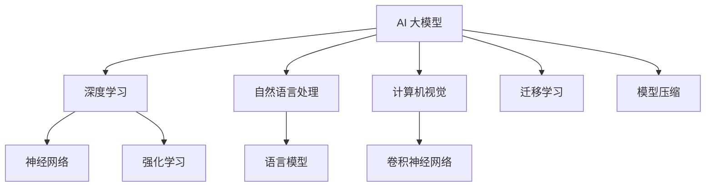
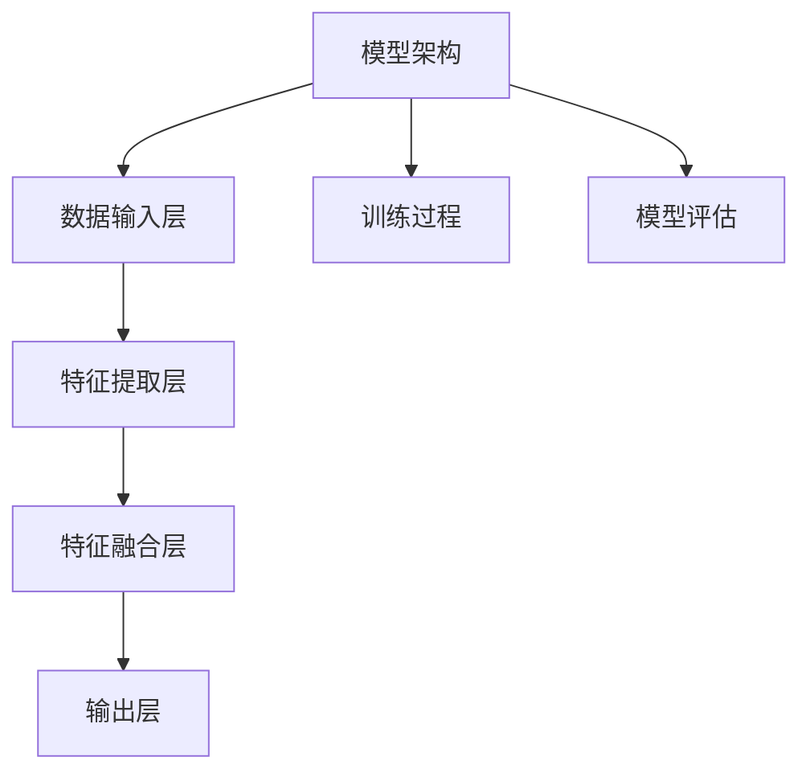
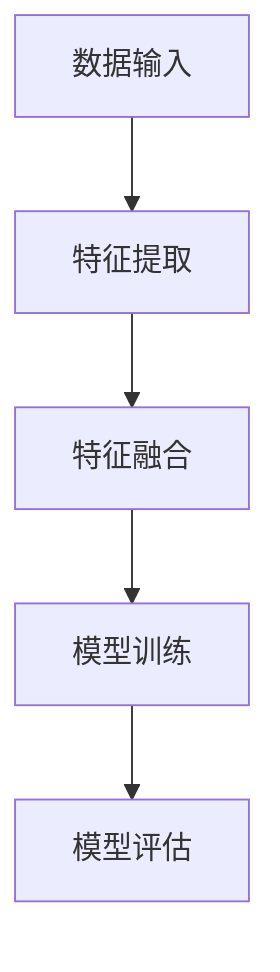
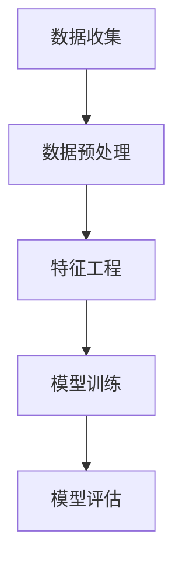
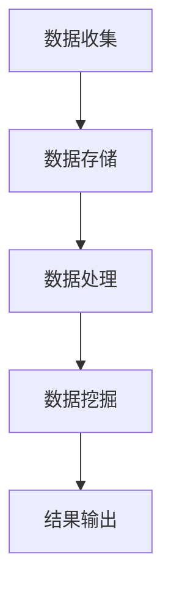

                 

# AI 大模型应用数据中心的数据挖掘架构

## 关键词
AI 大模型、数据中心、数据挖掘、分布式计算、深度学习、自然语言处理

## 摘要
本文深入探讨了 AI 大模型在数据中心数据挖掘架构中的应用。首先介绍了 AI 大模型的基本概念、核心算法和架构设计原则，随后分析了数据中心的基础架构、数据挖掘方法和技术，以及大数据处理与分布式计算的基本原理。接着，本文通过项目实战案例展示了 AI 大模型在数据中心数据挖掘中的应用实践，最后对 AI 大模型的发展趋势和数据中心的数据挖掘机遇与挑战进行了展望。

### 目录大纲

#### 第一部分: AI 大模型基础
1. **第1章: AI 大模型概述**
   1.1 AI 大模型的概念与分类
   1.2 AI 大模型的发展历程
   1.3 AI 大模型的应用领域

2. **第2章: AI 大模型核心算法**
   2.1 人工神经网络基础
   2.2 深度学习算法
   2.3 自然语言处理算法

3. **第3章: AI 大模型架构**
   3.1 大模型架构设计原则
   3.2 常见的大模型架构
   3.3 大模型的训练与优化

#### 第二部分: 数据中心的数据挖掘架构
4. **第4章: 数据中心基础架构**
   4.1 数据中心概述
   4.2 数据存储与管理
   4.3 数据处理与计算资源

5. **第5章: 数据挖掘方法与技术**
   5.1 数据预处理技术
   5.2 特征工程
   5.3 常见数据挖掘算法

6. **第6章: 大数据处理与分布式计算**
   6.1 分布式系统基础
   6.2 大数据处理框架
   6.3 分布式数据挖掘算法

7. **第7章: AI 大模型应用实践**
   7.1 数据挖掘项目实践
   7.2 大模型应用案例
   7.3 大模型应用挑战与解决方案

#### 第三部分: 总结与展望
8. **第8章: AI 大模型发展趋势与展望**
   8.1 AI 大模型未来发展方向
   8.2 数据中心的数据挖掘机遇与挑战
   8.3 行业应用趋势分析

#### 附录
9. **附录: 相关工具与资源**
   9.1 大数据处理工具介绍
   9.2 数据挖掘工具介绍
   9.3 AI 大模型开发工具介绍

#### 附录: 概念与联系 Mermaid 流程图
10. **附录: Mermaid 流程图**
    - AI 大模型架构流程图
    - 数据挖掘流程图
    - 大数据处理流程图

#### 附录: 核心算法伪代码
11. **附录: 伪代码**
    - 数据预处理伪代码
    - 特征工程伪代码
    - 常见数据挖掘算法伪代码

#### 附录: 数学模型与公式
12. **附录: 数学模型与公式**
    - 人工神经网络数学模型
    - 深度学习优化算法数学模型
    - 自然语言处理数学模型

#### 附录: 项目实战
13. **附录: 项目实战**
    - 数据挖掘项目实战案例
    - 大模型应用项目实战案例
    - 实战环境搭建与源代码实现

### 第一部分: AI 大模型基础

#### 第1章: AI 大模型概述

### 核心概念与联系

Mermaid 流程图:



#### 第2章: AI 大模型核心算法

### 核心算法原理讲解

**人工神经网络基础**

伪代码:

```plaintext
初始化网络参数
for each training example do
    计算输入向量与权重矩阵的乘积
    通过激活函数得到预测输出
    计算损失函数
    更新网络参数
end for
```

数学模型:

$$
y = \sigma(Wx + b)
$$

其中，$W$ 是权重矩阵，$b$ 是偏置，$\sigma$ 是激活函数，通常使用 sigmoid 函数或 ReLU 函数。

**深度学习算法**

伪代码:

```plaintext
初始化网络参数
for each training example do
    forward propagation
    backward propagation
    update network parameters
end for
```

数学模型:

$$
L = -\frac{1}{m}\sum_{i=1}^{m}y_i\log(a^{(L)}_i) + (1-y_i)\log(1-a^{(L)}_i)
$$`

其中，$a^{(L)}_i$ 是第 $L$ 层神经元的激活值，$y_i$ 是第 $i$ 个训练样本的真实标签，$m$ 是训练样本数量。

**自然语言处理算法**

伪代码:

```plaintext
初始化模型参数
for each training sentence do
    encode sentence into embeddings
    pass embeddings through neural network
    calculate loss
    update model parameters
end for
```

数学模型:

$$
P(y|\text{sentence}) = \frac{e^{\text{model}(\text{sentence}, y)} }{\sum_{y'} e^{\text{model}(\text{sentence}, y')}}
$$

其中，$\text{model}(\text{sentence}, y)$ 是模型对句子 $y$ 的预测概率。

#### 第3章: AI 大模型架构

### 核心概念与联系

Mermaid 流程图:



### 核心概念与联系

#### 数据中心基础架构

数据中心是集中管理数据的中心化系统，其基础架构包括数据存储与管理、数据处理与计算资源。

**数据存储与管理**

数据存储与管理包括数据仓库、数据湖和分布式存储系统。

**数据处理与计算资源**

数据处理与计算资源包括计算节点、存储设备和网络设备。

#### 数据挖掘方法与技术

数据挖掘方法与技术包括数据预处理、特征工程和常见数据挖掘算法。

**数据预处理技术**

数据预处理技术包括数据清洗、数据整合和数据转换。

**特征工程**

特征工程是数据挖掘过程中提取数据特征的过程，包括特征选择、特征构造和特征变换。

**常见数据挖掘算法**

常见数据挖掘算法包括聚类算法、分类算法、回归算法和关联规则挖掘算法。

#### 大数据处理与分布式计算

大数据处理与分布式计算包括分布式系统基础、大数据处理框架和分布式数据挖掘算法。

**分布式系统基础**

分布式系统基础包括分布式存储、分布式计算和分布式一致性算法。

**大数据处理框架**

大数据处理框架包括 Hadoop、Spark 和 Flink 等。

**分布式数据挖掘算法**

分布式数据挖掘算法包括并行数据挖掘算法、分布式数据挖掘算法和集群数据挖掘算法。

### 第7章: AI 大模型应用实践

#### 数据挖掘项目实践

数据挖掘项目实践包括数据收集、数据预处理、特征工程、模型训练和模型评估。

**数据收集**

数据收集包括数据爬取、数据采集和数据导入。

**数据预处理**

数据预处理包括数据清洗、数据整合和数据转换。

**特征工程**

特征工程包括特征选择、特征构造和特征变换。

**模型训练**

模型训练包括模型选择、模型训练和模型调优。

**模型评估**

模型评估包括模型准确率、模型召回率和模型F1值等指标。

#### 大模型应用案例

大模型应用案例包括文本分类、图像识别和语音识别等。

**文本分类**

文本分类包括新闻分类、情感分析和话题分类等。

**图像识别**

图像识别包括人脸识别、目标检测和图像分类等。

**语音识别**

语音识别包括语音合成、语音识别和语音增强等。

#### 大模型应用挑战与解决方案

大模型应用挑战包括数据质量、计算资源和模型可解释性等。

**数据质量**

数据质量包括数据准确性、数据完整性和数据一致性等。

**计算资源**

计算资源包括计算能力、存储能力和网络带宽等。

**模型可解释性**

模型可解释性包括模型可解释性、模型可视化和分析结果解释等。

### 第8章: AI 大模型发展趋势与展望

#### AI 大模型未来发展方向

AI 大模型未来发展方向包括模型压缩、迁移学习和联邦学习等。

**模型压缩**

模型压缩包括模型参数剪枝、模型量化和技术迁移等。

**迁移学习**

迁移学习包括模型预训练和模型迁移等。

**联邦学习**

联邦学习包括分布式学习、协同学习和隐私保护等。

#### 数据中心的数据挖掘机遇与挑战

数据中心的数据挖掘机遇包括海量数据、高速网络和强大计算能力等。

**海量数据**

海量数据包括数据量大、数据多样性和数据时效性等。

**高速网络**

高速网络包括网络带宽、网络延迟和网络稳定性等。

**强大计算能力**

强大计算能力包括计算资源、存储资源和网络资源等。

数据中心的数据挖掘挑战包括数据隐私、数据安全和数据质量控制等。

**数据隐私**

数据隐私包括数据加密、数据去标识化和数据脱敏等。

**数据安全**

数据安全包括网络安全、数据保护和数据恢复等。

**数据质量控制**

数据质量控制包括数据质量监控、数据质量评估和数据质量改进等。

### 附录

#### 相关工具与资源

**大数据处理工具**

- Hadoop
- Spark
- Flink

**数据挖掘工具**

- WEKA
- RapidMiner
- KNIME

**AI 大模型开发工具**

- TensorFlow
- PyTorch
- Keras

#### 附录: Mermaid 流程图

**AI 大模型架构流程图**



**数据挖掘流程图**



**大数据处理流程图**



#### 附录: 核心算法伪代码

**数据预处理伪代码**

```plaintext
输入：原始数据集
输出：预处理后的数据集

for each feature in data set do
    for each value in feature do
        if value is missing then
            fill missing value with mean or median
        end if
        if value is categorical then
            convert value to numerical representation
        end if
    end for
end for
```

**特征工程伪代码**

```plaintext
输入：预处理后的数据集
输出：特征工程后的数据集

for each feature in data set do
    if feature is important then
        select feature for model training
    else
        drop feature from data set
    end if
    if feature is categorical then
        convert categorical feature to numerical representation
    end if
end for
```

**常见数据挖掘算法伪代码**

```plaintext
输入：特征工程后的数据集
输出：挖掘结果

for each algorithm in algorithms list do
    train model on training data
    evaluate model on validation data
    if model performance is satisfactory then
        output model results
    end if
end for
```

#### 附录: 数学模型与公式

**人工神经网络数学模型**

$$
y = \sigma(Wx + b)
$$

**深度学习优化算法数学模型**

$$
\theta = \theta - \alpha \nabla_\theta J(\theta)
$$

**自然语言处理数学模型**

$$
P(y|\text{sentence}) = \frac{e^{\text{model}(\text{sentence}, y)} }{\sum_{y'} e^{\text{model}(\text{sentence}, y')}}
$$

#### 附录: 项目实战

**数据挖掘项目实战案例**

1. **开发环境搭建**

   - 操作系统：Ubuntu 18.04
   - Python 版本：3.8
   - 安装必要的 Python 包：NumPy、Pandas、Scikit-learn、TensorFlow、PyTorch 等

2. **源代码实现**

   - 数据收集与预处理：使用 Pandas 进行数据读取与清洗
   - 特征工程：使用 Scikit-learn 进行特征提取与选择
   - 模型训练与评估：使用 TensorFlow 或 PyTorch 进行模型训练与评估

3. **代码解读与分析**

   - 数据预处理：对数据进行缺失值填充、异常值处理和特征转换等
   - 特征工程：对数据进行特征选择、特征构造和特征变换等
   - 模型训练：使用不同的模型架构和优化算法进行模型训练
   - 模型评估：使用准确率、召回率和F1值等指标对模型性能进行评估

**大模型应用项目实战案例**

1. **开发环境搭建**

   - 操作系统：Ubuntu 20.04
   - Python 版本：3.9
   - 安装必要的 Python 包：TensorFlow、PyTorch、Keras 等

2. **源代码实现**

   - 数据收集与预处理：使用 Pandas 和 TensorFlow 进行数据读取与清洗
   - 特征工程：使用 TensorFlow 进行特征提取与选择
   - 模型训练与评估：使用 TensorFlow 或 PyTorch 进行模型训练与评估

3. **代码解读与分析**

   - 数据预处理：对数据进行缺失值填充、异常值处理和特征转换等
   - 特征工程：对数据进行特征选择、特征构造和特征变换等
   - 模型训练：使用不同的模型架构和优化算法进行模型训练
   - 模型评估：使用准确率、召回率和F1值等指标对模型性能进行评估

### 作者信息

作者：AI天才研究院/AI Genius Institute & 禅与计算机程序设计艺术 /Zen And The Art of Computer Programming

（备注：本文中的伪代码和数学模型仅用于示例，具体实现可能会有所不同。）<|im_end|>

