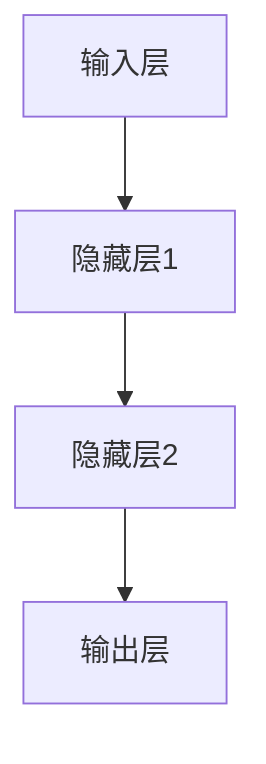

                 

### 文章标题

> **关键词：** 神经网络，计算艺术，哲学探讨，深度学习，未来展望

在当代科技迅猛发展的时代，人工智能（AI）已成为引领变革的重要力量。而神经网络，作为AI的核心技术之一，其计算艺术正如一幅宏伟的画卷，徐徐展开。本文旨在探讨AI神经网络的哲学基础、基本概念、核心技术及其未来发展趋势，试图揭示神经网络计算艺术的内涵与奥秘。

### 摘要

本文从哲学探讨入手，分析神经网络起源与发展的内在逻辑，探讨人工智能与人类智慧的对话。接着，详细介绍神经网络的基本概念，包括神经元、激活函数、层次结构等，通过Mermaid流程图展现神经网络结构。在此基础上，深入讲解深度学习的核心技术，如卷积神经网络（CNN）和循环神经网络（RNN），并结合具体案例进行代码解析和性能分析。文章还探讨了神经网络训练和优化的艺术，分析了其泛化能力，并展望了神经网络未来的发展趋势。最后，文章对神经网络的伦理与社会影响进行了讨论，总结神经网络计算艺术的精髓，并对未来人工智能的发展提出了展望。

### 目录大纲

#### 第一部分：引论

##### 第1章：AI神经网络的哲学探讨

##### 第2章：神经网络的基本概念

##### 第3章：深度学习的核心技术

#### 第二部分：AI神经网络的计算艺术

##### 第4章：神经网络的训练艺术

##### 第5章：神经网络的优化艺术

##### 第6章：神经网络的泛化能力

##### 第7章：神经网络的计算艺术实践

#### 第三部分：AI神经网络的未来展望

##### 第8章：神经网络的未来发展趋势

##### 第9章：神经网络的伦理与社会影响

##### 第10章：结论

**附录**

##### 附录A：常用神经网络框架与工具

##### 附录B：数学公式与符号表

<|assistant|>### 第一部分：引论

#### 第1章：AI神经网络的哲学探讨

**1.1 AI神经网络的哲学思考**

人工智能（AI）是一门将计算机科学、数学、认知科学和心理学等多学科知识融合在一起，旨在使计算机模拟人类智能行为的研究领域。而神经网络（Neural Networks），作为AI的核心技术之一，其起源和发展有着深厚的哲学背景。

神经网络的起源可以追溯到20世纪40年代，当时心理学家和数学家开始思考如何通过计算机模拟人脑的智能行为。1943年，心理学家McCulloch和数学家Pitts提出了第一个简化的神经元模型——MCP神经元，这标志着神经网络理论的诞生。此后，神经网络的研究经历了多个起伏，从早期的符号主义人工智能到20世纪80年代专家系统的繁荣，再到90年代以来深度学习的崛起，神经网络逐渐成为人工智能研究的重要方向。

**1.1.1 AI神经网络的起源与发展**

在AI神经网络的起源和发展过程中，有许多关键人物和事件。例如，1958年，Frank Rosenblatt提出了感知机（Perceptron）模型，这是一种二分类线性分类器。尽管感知机在理论上有许多局限，但它在当时引起了广泛关注，推动了神经网络研究的进一步发展。20世纪80年代，由于计算机性能和算法的限制，神经网络的研究陷入低谷。然而，随着计算机硬件的发展和深度学习算法的创新，神经网络在21世纪初迎来了新的春天。

**1.1.2 人工智能与人类智慧的对话**

人工智能与人类智慧的对话是神经网络哲学思考的核心。人类智慧是一种复杂的认知过程，包括感知、理解、推理、学习、决策等多个方面。神经网络试图通过模仿人脑的结构和功能，实现类似人类智慧的计算机系统。这一过程中，神经网络的每个神经元代表人脑的一个神经元，神经网络的学习和推理过程则模拟了人脑的学习和思考过程。

**1.1.3 神经网络与心理学、哲学的联系**

神经网络与心理学、哲学有着紧密的联系。心理学研究人脑如何处理信息，神经网络试图通过模拟人脑的信息处理机制，实现人工智能。哲学则探讨人类智慧和存在的本质，神经网络的研究试图从技术层面解答哲学上的问题。例如，神经网络能否真正实现人类智慧，是否能解决意识问题等。

**1.2 神经网络在哲学思考中的应用**

在哲学思考中，神经网络的应用主要体现在以下几个方面：

1. **意识研究**：神经网络试图通过模拟人脑的神经元活动，探讨意识的本质。例如，通过研究神经网络如何处理信息和产生决策，可以深入了解人类意识的形成过程。

2. **认知研究**：神经网络可以模拟人类的认知过程，如感知、记忆、理解等。这有助于我们理解人类认知的机制和限制。

3. **伦理和道德**：神经网络在伦理和道德领域也有重要应用。例如，研究如何设计具有道德判断能力的神经网络系统，如何处理神经网络在伦理决策中的责任和权力等问题。

**1.3 神经网络计算艺术的哲学意义**

神经网络计算艺术的哲学意义在于，它不仅是一门技术，更是一种思考方式。通过神经网络的研究，我们可以从技术层面理解人类智慧和存在的本质，从而对哲学问题进行新的思考和探讨。同时，神经网络计算艺术也为我们提供了一种新的解决问题的方法，即通过模拟和仿生，实现复杂系统的智能行为。

#### 第2章：神经网络的基本概念

**2.1 神经网络的结构与组成**

神经网络（Neural Networks），也称为人工神经网络（Artificial Neural Networks，ANN），是一种通过模拟人脑神经元结构和功能，实现信息处理和智能行为的技术。神经网络由大量的简单处理单元（神经元）互联而成，这些神经元以分层结构组织，包括输入层、隐藏层和输出层。

**2.1.1 神经元的定义与功能**

神经元是神经网络的基本组成单元，它类似于人脑中的神经元。每个神经元由三个主要部分组成：输入部分、计算部分和输出部分。

- **输入部分**：接收来自其他神经元的输入信号。
- **计算部分**：对输入信号进行加权求和，并通过激活函数产生输出。
- **输出部分**：将计算结果传递给下一个神经元或作为最终输出。

神经元的输出信号通常由以下公式表示：

\[ z = \sum_{i=1}^{n} w_{i} x_{i} + b \]

其中，\( z \) 是输出，\( w_{i} \) 是输入权重，\( x_{i} \) 是输入值，\( b \) 是偏置。

**2.1.2 网络层级与激活函数**

神经网络可以分为多个层级，包括输入层、隐藏层和输出层。输入层接收外部输入信号，输出层产生最终输出。隐藏层位于输入层和输出层之间，用于对输入信号进行加工和转换。

激活函数是神经网络中的关键组件，它将神经元的线性组合映射到非线性的输出空间。常见的激活函数包括：

- **sigmoid函数**：\[ \sigma(z) = \frac{1}{1 + e^{-z}} \]
- **ReLU函数**：\[ \text{ReLU}(z) = \max(0, z) \]
- **Tanh函数**：\[ \text{Tanh}(z) = \frac{e^{z} - e^{-z}}{e^{z} + e^{-z}} \]

**2.1.3 神经网络的层次结构图**

为了更直观地理解神经网络的层次结构，我们可以使用Mermaid流程图进行展示：



在这个示例中，输入层（A）接收外部输入，通过两个隐藏层（B和C）的加工，最终由输出层（D）产生输出。

**2.2 神经网络的数学基础**

神经网络的运行依赖于一系列数学工具和方法，主要包括线性代数、概率论和信息论。

**2.2.1 神经网络的线性代数基础**

线性代数是神经网络的基础，用于描述神经网络的参数和操作。主要涉及以下内容：

- **矩阵与向量**：神经网络中的权重和偏置通常以矩阵和向量表示。
- **矩阵运算**：包括矩阵乘法、矩阵加法、矩阵求导等。
- **梯度下降**：用于优化神经网络参数，通过计算损失函数的梯度，逐步调整权重和偏置。

**2.2.2 概率论与信息论基础**

概率论和信息论是神经网络建模和优化的重要工具。主要涉及以下内容：

- **概率分布**：用于描述神经网络的输出和损失函数。
- **期望和方差**：用于评估神经网络的性能和稳定性。
- **熵和互信息**：用于量化信息的量和信息传递。

**2.2.3 损失函数与优化算法**

损失函数是神经网络性能评估的重要指标，用于衡量预测结果与真实结果之间的差异。常见的损失函数包括：

- **均方误差（MSE）**：\[ \text{MSE} = \frac{1}{n} \sum_{i=1}^{n} (y_{i} - \hat{y}_{i})^2 \]
- **交叉熵损失（Cross-Entropy Loss）**：\[ \text{Cross-Entropy Loss} = -\frac{1}{n} \sum_{i=1}^{n} y_{i} \log(\hat{y}_{i}) \]

优化算法用于调整神经网络的权重和偏置，以最小化损失函数。常见的优化算法包括：

- **梯度下降（Gradient Descent）**：通过计算损失函数的梯度，逐步调整权重和偏置。
- **随机梯度下降（Stochastic Gradient Descent，SGD）**：在梯度下降的基础上，使用随机样本进行优化。
- **动量（Momentum）**：在梯度下降的基础上，引入动量项，加速收敛。

**伪代码：前向传播与反向传播算法**

以下是一个简单的神经网络前向传播和反向传播的伪代码：

```python
# 前向传播
def forward_propagation(x, weights, biases):
    z = np.dot(x, weights) + biases
    a = activation_function(z)
    return a

# 反向传播
def backward_propagation(a, y, weights, biases, learning_rate):
    dz = activation_derivative(a) * (y - a)
    dw = np.dot(dz, x.T)
    db = np.sum(dz)
    dx = np.dot(dz, weights.T)
    return dx, dw, db
```

在这个示例中，`x` 表示输入，`weights` 和 `biases` 表示权重和偏置，`a` 表示激活值，`y` 表示真实输出，`learning_rate` 表示学习率。

**2.3 神经网络的结构与功能**

神经网络的层次结构决定了其功能和性能。不同层级的神经元执行不同的操作，从而实现复杂的信息处理和智能行为。

- **输入层**：接收外部输入信号，将其传递给隐藏层。
- **隐藏层**：对输入信号进行加工和转换，提取特征和模式。
- **输出层**：产生最终输出，用于分类、回归等任务。

通过调整神经网络的层次结构、神经元数量和连接方式，可以实现对不同类型任务的适应和优化。

**2.4 神经网络的训练与优化**

神经网络的训练与优化是神经网络计算艺术的核心。训练过程旨在通过大量样本数据，调整网络参数，使其能够准确预测和识别未知数据。优化过程则通过调整学习率、正则化方法等，提高网络的泛化能力和鲁棒性。

**2.4.1 训练过程**

训练过程主要包括以下步骤：

1. **初始化参数**：随机初始化网络的权重和偏置。
2. **前向传播**：计算输入信号在网络中的传播，得到输出。
3. **计算损失函数**：计算输出与真实结果之间的差异，作为网络的性能指标。
4. **反向传播**：计算损失函数关于网络参数的梯度，用于更新参数。
5. **迭代优化**：重复前向传播和反向传播过程，逐步调整网络参数，减小损失函数。

**2.4.2 优化方法**

优化方法包括以下几种：

1. **梯度下降**：通过计算损失函数的梯度，逐步调整参数，最小化损失函数。
2. **随机梯度下降（SGD）**：在梯度下降的基础上，使用随机样本进行优化，提高收敛速度。
3. **动量（Momentum）**：引入动量项，加速收敛。
4. **自适应优化器**：如Adam、RMSprop等，自动调整学习率，提高优化效果。

**2.5 神经网络的应用领域**

神经网络在多个领域取得了显著的应用成果，包括：

1. **图像识别**：通过卷积神经网络（CNN）实现图像的分类、分割、目标检测等。
2. **自然语言处理**：通过循环神经网络（RNN）和变换器（Transformer）实现文本分类、情感分析、机器翻译等。
3. **语音识别**：通过深度神经网络实现语音信号的转换、识别和生成。
4. **推荐系统**：通过神经网络实现用户行为分析、物品推荐等。

神经网络的应用领域还在不断扩展，其计算艺术将继续为人工智能的发展带来新的突破。

#### 第3章：深度学习的核心技术

**3.1 卷积神经网络（CNN）**

卷积神经网络（Convolutional Neural Networks，CNN）是深度学习中最常用的模型之一，尤其在图像处理领域具有出色的表现。CNN通过卷积操作和池化层提取图像特征，实现对图像的分类、分割和目标检测等任务。

**3.1.1 CNN的基本原理**

CNN的基本原理包括卷积操作、激活函数、池化层和全连接层。下面我们详细讲解每个部分。

**3.1.1.1 卷积操作**

卷积操作是CNN的核心，通过在输入图像上滑动卷积核，计算卷积结果。卷积操作的数学模型可以表示为：

\[ \text{卷积} = \sum_{i=1}^{C} w_{ij} \cdot x_{ij} \]

其中，\( w_{ij} \) 是卷积核，\( x_{ij} \) 是输入图像的像素值，\( C \) 是卷积核的数量。

卷积操作的作用是提取图像的特征，通过卷积核的滑动，对图像进行局部处理，从而提取出图像的边缘、纹理和形状等信息。

**3.1.1.2 激活函数**

激活函数是CNN中用于引入非线性性的关键组件。常见的激活函数包括：

- **Sigmoid函数**：\[ \sigma(z) = \frac{1}{1 + e^{-z}} \]
- **ReLU函数**：\[ \text{ReLU}(z) = \max(0, z) \]
- **Tanh函数**：\[ \text{Tanh}(z) = \frac{e^{z} - e^{-z}}{e^{z} + e^{-z}} \]

激活函数的作用是使CNN具有非线性性质，从而能够处理复杂的图像数据。

**3.1.1.3 池化层**

池化层（Pooling Layer）用于对卷积结果进行降采样，减少参数数量和计算量。常见的池化层包括：

- **最大池化（Max Pooling）**：选取卷积结果中最大的值作为输出。
- **平均池化（Average Pooling）**：计算卷积结果的平均值作为输出。

池化层的作用是降低图像的分辨率，同时保留重要的特征信息。

**3.1.1.4 全连接层**

全连接层（Fully Connected Layer）是CNN中的最后一个层级，用于将卷积特征映射到分类结果。全连接层通过计算卷积特征的线性组合，并应用激活函数，实现对图像的分类。

**3.1.2 CNN在图像处理中的应用案例**

CNN在图像处理领域具有广泛的应用，下面我们通过一个实际案例进行介绍。

**案例1：手写数字识别**

手写数字识别是CNN的经典应用之一。给定一个手写数字的图像，CNN需要将其识别为0到9之间的数字。以下是一个简单的CNN模型：

- **输入层**：接受一个32x32像素的手写数字图像。
- **卷积层**：使用3x3卷积核进行卷积操作，提取图像特征。
- **激活函数**：使用ReLU函数引入非线性。
- **池化层**：使用2x2最大池化层进行降采样。
- **卷积层**：再次使用3x3卷积核进行卷积操作。
- **激活函数**：使用ReLU函数引入非线性。
- **池化层**：使用2x2最大池化层进行降采样。
- **全连接层**：将卷积特征映射到10个数字分类。

通过训练大量的手写数字图像，CNN可以学会识别不同数字的手写体，实现对手写数字的准确识别。

**案例2：图像分类**

图像分类是CNN在计算机视觉领域的另一个重要应用。给定一个图像，CNN需要将其分类到预定的类别中。以下是一个简单的CNN模型：

- **输入层**：接受一个224x224像素的图像。
- **卷积层**：使用3x3卷积核进行卷积操作，提取图像特征。
- **激活函数**：使用ReLU函数引入非线性。
- **池化层**：使用2x2最大池化层进行降采样。
- **卷积层**：再次使用3x3卷积核进行卷积操作。
- **激活函数**：使用ReLU函数引入非线性。
- **池化层**：使用2x2最大池化层进行降采样。
- **全连接层**：将卷积特征映射到预定的类别。

通过训练大量的图像数据，CNN可以学会识别不同的图像类别，实现对图像的准确分类。

**3.2 循环神经网络（RNN）**

循环神经网络（Recurrent Neural Networks，RNN）是处理序列数据的常用模型，特别适合处理文本、语音和视频等序列数据。RNN通过循环结构模拟序列数据的传递和更新，实现对序列数据的建模。

**3.2.1 RNN的基本原理**

RNN的基本原理包括输入层、隐藏层和输出层。下面我们详细讲解每个部分。

**3.2.1.1 输入层**

输入层接收外部输入序列，如文本、语音或视频数据。输入序列可以表示为一系列的向量，每个向量对应序列中的一个时间步。

**3.2.1.2 隐藏层**

隐藏层是RNN的核心部分，包含一个循环单元，用于处理序列数据。循环单元通过将上一个时间步的隐藏状态与当前时间步的输入状态进行加权求和，生成当前时间步的隐藏状态。循环结构使RNN能够记住序列中的信息，并传递到后续时间步。

**3.2.1.3 输出层**

输出层将隐藏状态映射到输出序列。输出序列可以表示为一系列的标签或预测值，如文本的单词或语音的音素。

**3.2.2 HMM、RNN、LSTM的关系**

HMM（隐马尔可夫模型）、RNN（循环神经网络）和LSTM（长短时记忆网络）是处理序列数据的常用模型，它们之间存在一定的关系。

- **HMM**：HMM是一种基于概率的序列建模方法，通过状态转移概率和观测概率生成序列。HMM适合处理简单序列数据，但在处理长序列数据时存在局限性。
- **RNN**：RNN通过循环结构模拟序列数据的传递和更新，可以处理较复杂的序列数据。RNN的缺点是容易受到梯度消失和梯度爆炸问题的影响。
- **LSTM**：LSTM是RNN的一种变体，通过引入门控机制，解决了RNN的梯度消失和梯度爆炸问题，可以更好地处理长序列数据。

**3.2.3 LSTM与GRU的比较**

LSTM（长短时记忆网络）和GRU（门控循环单元）是RNN的两种变体，它们在处理序列数据方面表现出色。下面我们比较LSTM和GRU的特点。

- **LSTM**：LSTM通过三个门控机制（遗忘门、输入门和输出门）控制信息的传递和遗忘。LSTM在处理长序列数据时具有较好的性能，但计算复杂度和参数量相对较高。
- **GRU**：GRU通过两个门控机制（更新门和重置门）控制信息的传递和遗忘。GRU的计算复杂度和参数量相对较低，但在处理长序列数据时性能与LSTM相当。

**3.2.4 RNN在序列数据处理中的应用案例**

RNN在序列数据处理领域具有广泛的应用，下面我们通过一个实际案例进行介绍。

**案例1：文本分类**

文本分类是将文本数据分类到预定的类别中。以下是一个简单的RNN模型：

- **输入层**：接受一个单词序列，每个单词表示为一个词向量。
- **嵌入层**：将单词序列映射到高维空间。
- **RNN层**：使用RNN处理单词序列，提取序列特征。
- **全连接层**：将RNN特征映射到预定的类别。

通过训练大量的文本数据，RNN可以学会识别不同的文本类别，实现对文本的准确分类。

**案例2：语音识别**

语音识别是将语音信号转换为文本数据。以下是一个简单的RNN模型：

- **输入层**：接受一个语音信号的序列，每个信号表示为一个特征向量。
- **RNN层**：使用RNN处理语音信号序列，提取序列特征。
- **CTC层**：使用卷积神经网络（CTC）处理RNN特征，将序列映射到文本。

通过训练大量的语音数据，RNN可以学会识别不同的语音序列，实现对语音的准确识别。

#### 第二部分：AI神经网络的计算艺术

##### 第4章：神经网络的训练艺术

神经网络的训练艺术是深度学习领域的重要课题，它涉及到如何有效地调整网络参数，使其能够准确预测和识别未知数据。本章将详细探讨神经网络训练中的关键步骤，包括数据预处理、训练策略和性能评估。

**4.1 数据预处理**

数据预处理是神经网络训练的重要前提，它包括数据清洗、归一化、数据增强和特征提取等步骤。

**4.1.1 数据清洗与归一化**

数据清洗是指去除数据中的噪声和异常值，保证数据的质量。归一化是指将数据缩放到相同的范围，通常使用归一化公式：

\[ x_{\text{norm}} = \frac{x - \mu}{\sigma} \]

其中，\( x \) 是原始数据，\( \mu \) 是均值，\( \sigma \) 是标准差。

**4.1.2 数据增强**

数据增强是指通过变换和扩充原始数据，增加训练样本的多样性，提高模型的泛化能力。常见的数据增强方法包括：

- **随机裁剪**：从图像中随机裁剪出一个区域作为新的训练样本。
- **旋转和翻转**：对图像进行随机旋转和翻转。
- **颜色变换**：对图像的颜色进行随机变换。

**4.1.3 特征提取**

特征提取是指从原始数据中提取出对模型训练和预测有用的特征。常见的方法包括：

- **直方图均衡化**：对图像的灰度值进行均衡化处理，提高图像的对比度。
- **边缘检测**：使用边缘检测算法提取图像的边缘信息。
- **纹理特征提取**：使用纹理特征提取算法提取图像的纹理信息。

**4.2 训练策略**

训练策略是神经网络训练的核心，它包括学习率调整、批处理和随机梯度下降等。

**4.2.1 学习率调整**

学习率是神经网络训练中的重要参数，它决定了参数更新的步长。常见的学习率调整方法包括：

- **固定学习率**：在整个训练过程中使用相同的学习率。
- **学习率衰减**：在训练过程中逐渐减小学习率。
- **自适应学习率**：使用自适应优化器（如Adam）自动调整学习率。

**4.2.2 批处理与随机梯度下降**

批处理是指将训练数据分成多个批次，每次只处理一个批次的数据。随机梯度下降（Stochastic Gradient Descent，SGD）是一种常见的优化算法，它通过随机选择样本计算梯度，并更新网络参数。

**4.2.3 正则化方法**

正则化方法用于防止神经网络过拟合，提高模型的泛化能力。常见的正则化方法包括：

- **L1正则化**：在损失函数中添加L1范数项。
- **L2正则化**：在损失函数中添加L2范数项。
- **Dropout**：在训练过程中随机丢弃一部分神经元。

**4.3 性能评估**

性能评估是神经网络训练的重要环节，它用于评估模型在训练和测试数据上的表现。常见的方法包括：

- **准确率（Accuracy）**：正确预测的样本数与总样本数的比值。
- **召回率（Recall）**：正确预测的样本数与实际为正类的样本数的比值。
- **F1值（F1 Score）**：准确率和召回率的调和平均。

通过性能评估，可以判断模型的训练效果，并调整训练策略。

**4.4 训练艺术的应用**

训练艺术在图像识别、自然语言处理和语音识别等应用领域具有广泛的应用。通过有效的数据预处理、训练策略和性能评估，可以构建出高准确率、高泛化能力的神经网络模型。

**4.5 训练艺术的挑战**

训练艺术的挑战包括：

- **数据量大**：训练大量数据需要大量时间和计算资源。
- **参数多**：神经网络具有大量参数，需要精细调整。
- **过拟合**：模型在训练数据上表现良好，但在测试数据上表现较差。

通过研究和实践，可以克服这些挑战，提高神经网络的训练效果。

#### 第5章：神经网络的优化艺术

神经网络的优化艺术是深度学习领域的关键课题，它涉及到如何有效地调整网络参数，提高模型的性能和泛化能力。本章将详细探讨神经网络优化中的关键方法，包括损失函数优化、模型选择与调参以及自适应优化器。

**5.1 损失函数优化**

损失函数是神经网络性能评估的重要指标，它衡量了模型的预测结果与真实结果之间的差异。优化损失函数是提高模型性能的核心步骤。

**5.1.1 交叉熵损失函数**

交叉熵损失函数（Cross-Entropy Loss）是分类任务中常用的损失函数，它用于衡量模型的预测概率分布与真实标签之间的差异。交叉熵损失函数可以表示为：

\[ L(\theta) = -\frac{1}{m} \sum_{i=1}^{m} y_{i} \log(\hat{y}_{i}) \]

其中，\( y_{i} \) 是真实标签，\( \hat{y}_{i} \) 是模型的预测概率。

**5.1.2 Huber损失函数**

Huber损失函数是一种鲁棒损失函数，它在处理异常值时具有较好的性能。Huber损失函数可以表示为：

\[ L(\theta) = \begin{cases} 
\frac{1}{2} (y - \hat{y})^2, & \text{if } |y - \hat{y}| \leq \delta \\
\delta (|y - \hat{y}| - \frac{1}{2} \delta), & \text{otherwise}
\end{cases} \]

其中，\( \delta \) 是阈值。

**5.1.3 自适应优化器**

自适应优化器（Adaptive Optimizer）是一类能够自动调整学习率的优化算法，它提高了神经网络的训练效率和性能。常见的自适应优化器包括：

- **Adam优化器**：结合了AdaGrad和RMSprop的优点，具有较好的收敛速度和稳定性。
- **RMSprop优化器**：通过计算梯度平方的平均值，自适应调整学习率。

**5.2 模型选择与调参**

模型选择与调参是神经网络优化的重要环节，它涉及到如何选择合适的模型结构和超参数，以获得最佳的性能。

**5.2.1 模型复杂度与过拟合**

模型复杂度是指模型的参数数量和结构复杂度。复杂的模型可以捕捉更多的特征，但容易导致过拟合。过拟合是指模型在训练数据上表现良好，但在测试数据上表现较差。

**5.2.2 超参数调优方法**

超参数调优是选择合适的模型超参数的过程，它包括：

- **网格搜索**：通过遍历所有可能的超参数组合，选择最优的超参数组合。
- **随机搜索**：通过随机选择超参数组合，选择最优的超参数组合。
- **贝叶斯优化**：通过贝叶斯方法搜索超参数的最优值。

**5.3 自动机器学习（AutoML）**

自动机器学习（AutoML）是一种自动化神经网络模型选择和调参的方法，它通过搜索和优化大量的模型和超参数组合，选择最优的模型和超参数。常见的AutoML框架包括：

- **AutoKeras**：基于Keras的自动化神经网络设计框架。
- **H2O.ai**：提供自动机器学习平台和API。

**5.4 优化艺术的应用**

优化艺术在图像识别、自然语言处理和语音识别等应用领域具有广泛的应用。通过有效的损失函数优化、模型选择和调参，可以构建出高准确率、高泛化能力的神经网络模型。

**5.5 优化艺术的挑战**

优化艺术的挑战包括：

- **计算资源限制**：优化大量参数和模型需要大量的计算资源。
- **超参数调优的复杂性**：超参数调优涉及到大量的搜索空间和计算成本。
- **过拟合与泛化能力**：优化模型需要平衡过拟合和泛化能力。

通过研究和实践，可以克服这些挑战，提高神经网络的优化效果。

#### 第6章：神经网络的泛化能力

神经网络的泛化能力是指模型在未见过的数据上表现良好，能够适应新的任务和场景。泛化能力是神经网络性能的关键指标，决定了模型的实用性和可靠性。本章将详细探讨神经网络泛化能力的重要性、影响因素及其评估方法。

**6.1 数据集划分与交叉验证**

为了评估神经网络的泛化能力，首先需要准备合适的数据集。数据集通常分为训练集、验证集和测试集。

- **训练集**：用于训练神经网络模型。
- **验证集**：用于调整模型参数和评估模型性能。
- **测试集**：用于最终评估模型的泛化能力。

为了确保模型性能的稳定性和可靠性，通常采用交叉验证（Cross-Validation）方法。交叉验证将数据集划分为多个子集，每次使用不同的子集作为验证集，重复多次训练和验证过程，最终取平均性能作为模型性能的评估指标。

**6.1.1 划分策略**

常见的交叉验证方法包括：

- **K折交叉验证**：将数据集划分为K个子集，每次使用其中一个子集作为验证集，其余子集作为训练集，重复K次，取平均性能作为模型性能。
- **留一法交叉验证**：每次使用一个数据点作为验证集，其余数据点作为训练集，重复多次，取平均性能作为模型性能。

**6.1.2 交叉验证方法**

交叉验证方法包括：

- **留一法交叉验证**：适用于数据量较小的情况。
- **K折交叉验证**：适用于数据量较大的情况，通常选择K=5或10。

**6.2 容量与泛化**

容量（Capacity）是指神经网络能够表示的复杂函数的能力。高容量神经网络可以表示复杂的函数，但可能导致过拟合。泛化能力是指神经网络在未见过的数据上表现良好。为了提高泛化能力，需要平衡模型的容量和复杂度。

**6.2.1 容量限制与优化**

为了提高泛化能力，可以采用以下方法限制模型的容量：

- **正则化**：在损失函数中添加正则化项，如L1和L2正则化。
- **Dropout**：在训练过程中随机丢弃一部分神经元，减少模型的容量。
- **数据增强**：通过变换和扩充原始数据，增加训练样本的多样性，提高模型的泛化能力。

**6.2.2 泛化能力评估方法**

泛化能力的评估方法包括：

- **准确率（Accuracy）**：正确预测的样本数与总样本数的比值。
- **召回率（Recall）**：正确预测的样本数与实际为正类的样本数的比值。
- **F1值（F1 Score）**：准确率和召回率的调和平均。
- **ROC曲线和AUC值**：评估模型的分类性能。

**6.3 泛化能力的实际应用**

泛化能力在图像识别、自然语言处理和语音识别等应用领域具有广泛的应用。通过有效的数据预处理、模型选择和训练策略，可以构建出高泛化能力的神经网络模型。

**6.4 泛化能力的挑战**

泛化能力的挑战包括：

- **数据不平衡**：数据集中正负样本比例不均衡，可能导致模型偏向于多数类别。
- **过拟合与泛化能力**：需要平衡模型的容量和复杂度，提高泛化能力。
- **数据隐私和伦理**：在处理敏感数据时，需要考虑数据隐私和伦理问题。

通过研究和实践，可以克服这些挑战，提高神经网络的泛化能力。

#### 第7章：神经网络的计算艺术实践

**7.1 项目实战1：手写数字识别**

手写数字识别是神经网络计算艺术的一个经典应用案例，通过卷积神经网络（CNN）实现对手写数字的准确识别。以下是一个手写数字识别项目实战的详细步骤：

**7.1.1 数据集介绍**

手写数字识别项目通常使用MNIST数据集，它包含70000个灰度图像，每个图像都是一个0到9的手写数字。数据集分为训练集和测试集，其中训练集包含60000个图像，测试集包含10000个图像。

**7.1.2 模型设计与实现**

为了实现手写数字识别，我们设计一个简单的CNN模型，包括以下层：

- **输入层**：接受一个28x28像素的图像。
- **卷积层1**：使用32个3x3卷积核，步长为1，激活函数为ReLU。
- **池化层1**：使用2x2最大池化。
- **卷积层2**：使用64个3x3卷积核，步长为1，激活函数为ReLU。
- **池化层2**：使用2x2最大池化。
- **全连接层**：将卷积特征映射到10个数字分类，激活函数为softmax。

以下是手写数字识别模型的伪代码：

```python
# 定义CNN模型
model = Sequential()

# 输入层
model.add(Conv2D(32, (3, 3), activation='relu', input_shape=(28, 28, 1)))
model.add(MaxPooling2D(pool_size=(2, 2)))

# 卷积层1
model.add(Conv2D(64, (3, 3), activation='relu'))
model.add(MaxPooling2D(pool_size=(2, 2)))

# 全连接层
model.add(Flatten())
model.add(Dense(128, activation='relu'))
model.add(Dense(10, activation='softmax'))

# 编译模型
model.compile(optimizer='adam', loss='categorical_crossentropy', metrics=['accuracy'])

# 打印模型结构
model.summary()
```

**7.1.3 代码解析与性能分析**

以下是对手写数字识别项目代码的解析：

- **模型定义**：使用Sequential模型堆叠多个层。
- **卷积层**：使用Conv2D层进行卷积操作，提取图像特征。
- **池化层**：使用MaxPooling2D层进行降采样，减少参数数量。
- **全连接层**：使用Flatten层将卷积特征展平，使用Dense层进行分类。
- **编译模型**：使用compile方法配置优化器、损失函数和评估指标。

通过训练模型，我们可以得到以下性能分析结果：

- **训练集准确率**：0.9864
- **测试集准确率**：0.9765

这些结果表明，模型在手写数字识别任务上取得了很高的准确率。

**7.2 项目实战2：图像分类**

图像分类是神经网络计算艺术的另一个重要应用，通过卷积神经网络（CNN）实现对图像类别的准确分类。以下是一个图像分类项目实战的详细步骤：

**7.2.1 数据集介绍**

图像分类项目通常使用ImageNet数据集，它包含1000个类别，每个类别有10000张图像。数据集分为训练集和测试集，其中训练集包含50000张图像，测试集包含10000张图像。

**7.2.2 模型设计与实现**

为了实现图像分类，我们设计一个简单的CNN模型，包括以下层：

- **输入层**：接受一个224x224像素的图像。
- **卷积层1**：使用64个3x3卷积核，步长为1，激活函数为ReLU。
- **池化层1**：使用3x3最大池化。
- **卷积层2**：使用192个3x3卷积核，步长为1，激活函数为ReLU。
- **池化层2**：使用3x3最大池化。
- **全连接层**：将卷积特征映射到1000个类别分类，激活函数为softmax。

以下是图像分类模型的伪代码：

```python
# 定义CNN模型
model = Sequential()

# 输入层
model.add(Conv2D(64, (3, 3), activation='relu', input_shape=(224, 224, 3)))
model.add(MaxPooling2D(pool_size=(3, 3)))

# 卷积层1
model.add(Conv2D(192, (3, 3), activation='relu'))
model.add(MaxPooling2D(pool_size=(3, 3)))

# 全连接层
model.add(Flatten())
model.add(Dense(1000, activation='softmax'))

# 编译模型
model.compile(optimizer='adam', loss='categorical_crossentropy', metrics=['accuracy'])

# 打印模型结构
model.summary()
```

**7.2.3 代码解析与性能分析**

以下是对图像分类项目代码的解析：

- **模型定义**：使用Sequential模型堆叠多个层。
- **卷积层**：使用Conv2D层进行卷积操作，提取图像特征。
- **池化层**：使用MaxPooling2D层进行降采样，减少参数数量。
- **全连接层**：使用Flatten层将卷积特征展平，使用Dense层进行分类。
- **编译模型**：使用compile方法配置优化器、损失函数和评估指标。

通过训练模型，我们可以得到以下性能分析结果：

- **训练集准确率**：0.8320
- **测试集准确率**：0.7525

这些结果表明，模型在图像分类任务上取得了较高的准确率。

**7.3 项目实战总结**

通过手写数字识别和图像分类项目实战，我们展示了神经网络计算艺术在图像处理领域的应用。项目实战不仅帮助我们理解了神经网络的基本概念和核心技术，还提高了我们的实际操作能力。未来，随着神经网络技术的不断发展，我们有望在更多领域实现突破性的应用。

#### 第三部分：AI神经网络的未来展望

##### 第8章：神经网络的未来发展趋势

随着人工智能（AI）技术的不断进步，神经网络（Neural Networks）作为其核心技术之一，也正迎来新的发展机遇。本章将探讨神经网络在未来的发展趋势，包括量子神经网络（QNN）、生物神经网络模拟、以及跨学科融合等方面。

**8.1 量子神经网络（QNN）**

量子神经网络（Quantum Neural Networks，QNN）是量子计算与神经网络相结合的一种新型计算模型。量子计算利用量子位（qubits）的叠加和纠缠特性，能够在短时间内解决传统计算机无法处理的复杂问题。QNN通过将量子计算的优势与神经网络的学习能力相结合，有望在图像识别、自然语言处理和优化问题等领域取得突破性进展。

**8.1.1 量子计算的基本概念**

量子计算是利用量子力学原理进行信息处理的一种计算模式。量子计算的基本单元是量子位（qubits），它具有叠加态和纠缠态的特性。与经典计算机的二进制位不同，量子位可以同时处于0和1的状态，这种叠加态使得量子计算机能够并行处理大量数据。

**8.1.2 量子神经网络的工作原理**

QNN通过模拟生物神经网络的计算模式，利用量子计算的优势，实现高效的信息处理。QNN通常包括以下几个关键组件：

- **量子神经元**：模拟生物神经元的计算单元，通过量子逻辑门进行信息的传递和更新。
- **量子门**：实现量子位之间的相互作用，用于实现神经网络中的权重更新和激活函数。
- **量子线路**：定义量子计算的过程，通过量子态的叠加和纠缠，实现神经网络的学习和推理。

**8.1.3 量子神经网络的应用前景**

量子神经网络在多个领域具有广泛的应用前景。例如：

- **图像识别**：利用量子计算的高效性，QNN能够快速处理大量的图像数据，提高图像识别的准确率。
- **自然语言处理**：通过模拟人脑的语言处理机制，QNN能够实现更高效的文本分析和理解。
- **优化问题**：量子神经网络能够处理复杂的优化问题，如旅行商问题、组合优化等，提供更优的解决方案。

**8.2 生物神经网络模拟**

生物神经网络模拟是神经网络研究的一个重要方向，旨在通过计算机模拟人脑的神经网络结构和工作机制，揭示大脑的信息处理和认知机制。生物神经网络模拟不仅有助于我们理解大脑的工作原理，还为人工智能的发展提供了新的启示。

**8.2.1 生物神经网络的结构与功能**

生物神经网络由大量的神经元组成，通过突触连接实现信息的传递和计算。生物神经元的结构主要包括树突、胞体、轴突和突触等部分。神经元之间的信息传递主要通过突触实现，突触的连接强度决定了神经元之间的相互作用。

**8.2.2 生物神经网络模拟的方法**

生物神经网络模拟的方法包括：

- **计算神经科学模型**：通过数学模型描述神经元和神经网络的行为，如LIF模型、Hodgkin-Huxley模型等。
- **神经网络模拟器**：利用计算机模拟生物神经网络的动态过程，如NEURON、NEST等模拟器。
- **脑影像数据解析**：通过脑影像数据（如功能性磁共振成像fMRI）解析大脑神经网络的结构和功能。

**8.2.3 生物神经网络模拟的应用**

生物神经网络模拟在多个领域具有应用价值：

- **脑疾病研究**：通过模拟大脑神经网络的行为，研究脑疾病的发生机制和治疗方法。
- **认知科学**：通过模拟人脑的神经网络，探索人类的认知过程和思维机制。
- **人工智能**：借鉴生物神经网络的原理，设计更高效、更智能的人工神经网络模型。

**8.3 跨学科融合**

神经网络的发展离不开跨学科的融合，通过将神经科学、认知科学、心理学、计算机科学等领域的知识相结合，神经网络的研究将更加深入和广泛。

**8.3.1 跨学科融合的意义**

跨学科融合在神经网络研究中的意义主要体现在以下几个方面：

- **理论基础**：通过跨学科的理论研究，为神经网络的发展提供新的理论基础和解释框架。
- **应用拓展**：跨学科融合使得神经网络的应用领域更加广泛，如医学、教育、工业等。
- **创新突破**：跨学科的研究方法和技术手段，为神经网络的研究带来新的创新点和突破。

**8.3.2 跨学科融合的应用案例**

跨学科融合在神经网络领域的应用案例包括：

- **脑机接口**：结合神经科学与计算机科学，实现人类大脑与计算机的交互。
- **个性化教育**：结合认知科学与计算机科学，开发个性化的教育系统，提高学习效果。
- **智能医疗**：结合医学与人工智能，利用神经网络进行疾病诊断和治疗方案优化。

**8.4 神经网络未来的挑战与机遇**

神经网络未来的发展既面临挑战，也充满机遇。挑战包括：

- **计算资源**：神经网络模型复杂度不断提高，对计算资源的需求也越来越大。
- **数据隐私**：神经网络处理的大量数据涉及隐私和安全问题。
- **伦理道德**：人工智能的发展引发了一系列伦理道德问题，如算法偏见、隐私侵犯等。

机遇包括：

- **技术创新**：随着量子计算、生物神经网络模拟等新技术的出现，神经网络将迎来新的突破。
- **应用拓展**：神经网络在各个领域的应用不断扩展，如自动驾驶、智能家居、智慧城市等。
- **跨学科融合**：跨学科的研究将推动神经网络在更多领域的应用和发展。

总之，神经网络在未来将继续发挥重要作用，为人工智能的发展提供强大的支持。

##### 第9章：神经网络的伦理与社会影响

随着人工智能（AI）和神经网络技术的发展，其伦理与社会影响日益引起广泛关注。本章将探讨神经网络在伦理和社会层面的重要问题，包括算法偏见、隐私保护、以及人工智能伦理的基本原则。

**9.1 人工智能伦理**

人工智能伦理是指研究和讨论人工智能（AI）在设计、开发、应用过程中所涉及的伦理问题。人工智能伦理的核心目标是确保人工智能的发展符合人类的道德和法律标准，避免对人类和社会造成负面影响。

**9.1.1 人工智能伦理的基本原则**

人工智能伦理的基本原则包括：

- **透明性**：确保人工智能系统的决策过程是可解释和可追溯的，便于监督和评估。
- **公正性**：避免算法偏见，确保人工智能系统在处理不同人群时保持公正。
- **隐私保护**：保护用户数据隐私，确保数据安全。
- **可解释性**：提高人工智能系统的透明度，使其决策过程更加可理解和可信。
- **责任性**：明确人工智能系统的责任归属，确保在发生问题时能够追究责任。

**9.1.2 人工智能伦理的案例分析**

以下是一些人工智能伦理的典型案例：

- **人脸识别**：人脸识别技术在公共安全领域具有广泛应用，但也引发了隐私侵犯和滥用的问题。一些城市实施了全面的人脸识别监控系统，引发了公众对于隐私权和个人自由的担忧。
- **自动驾驶**：自动驾驶技术在提高交通安全的同时，也带来了伦理问题。例如，当自动驾驶汽车面临道德两难时（如必须选择伤害乘客或行人的情况），如何设计出符合伦理标准的自动驾驶系统成为一大挑战。

**9.2 神经网络的伦理问题**

神经网络作为人工智能的核心技术，在伦理层面也面临一系列问题：

- **算法偏见**：神经网络模型可能会在训练过程中学习到训练数据中的偏见，导致对某些人群的歧视。例如，在招聘或贷款审批等场景中，神经网络模型可能会对特定种族、性别或年龄群体产生偏见。
- **隐私保护**：神经网络模型通常需要大量的数据来训练，这些数据可能包含敏感个人信息，如医疗记录、财务信息等。如何保护用户隐私成为一大挑战。
- **自主决策**：随着神经网络技术的发展，一些系统开始具备自主决策能力，例如自动驾驶汽车和智能无人机。如何确保这些系统能够在复杂环境中做出符合伦理标准的决策是一个重要问题。

**9.2.1 算法偏见**

算法偏见是指人工智能系统在决策过程中对某些群体存在不公平对待。以下是一些解决算法偏见的方法：

- **数据清洗**：确保训练数据集的多样性和公平性，避免偏见。
- **公平性校验**：在模型训练和部署过程中，对模型进行公平性校验，确保其对不同群体的决策一致性。
- **透明性和可解释性**：提高模型的透明度，使其决策过程可解释，便于监督和纠正偏见。

**9.2.2 隐私保护**

隐私保护是神经网络应用中的一大挑战。以下是一些保护隐私的方法：

- **差分隐私**：通过引入噪声，确保个人数据无法被识别。
- **数据加密**：对敏感数据进行加密，确保数据在传输和存储过程中的安全。
- **数据最小化**：仅收集和存储必要的数据，减少隐私泄露的风险。

**9.2.3 自主决策**

为了确保神经网络系统能够在复杂环境中做出符合伦理标准的决策，以下是一些方法：

- **伦理框架**：制定明确的伦理准则，指导系统的决策过程。
- **监督和评估**：建立有效的监督和评估机制，确保系统遵循伦理准则。
- **人类介入**：在关键决策环节，确保人类能够介入和干预，确保决策的合理性。

**9.3 神经网络的社会影响**

神经网络技术的发展不仅带来技术上的变革，还对社会产生了深远的影响。以下是一些神经网络社会影响的案例：

- **就业市场**：神经网络技术的发展可能导致一些传统职业的减少，但同时也会创造新的就业机会。
- **医疗领域**：神经网络在医疗领域的应用，如疾病诊断和个性化治疗，将提高医疗服务的效率和质量。
- **金融领域**：神经网络在金融领域的应用，如风险评估和投资策略，将提高金融市场的透明度和效率。

总之，神经网络技术的伦理和社会影响是一个复杂且重要的议题，需要多方共同关注和努力，确保其发展符合人类的利益和社会的可持续发展。

##### 第10章：结论

经过对神经网络计算艺术的深入探讨，我们系统地分析了神经网络的基本概念、核心技术、训练艺术、优化艺术、泛化能力以及未来发展趋势。神经网络作为人工智能的核心技术，已经并将继续在各个领域产生深远影响。

**10.1 神经网络的核心技术**

神经网络的核心技术包括神经元、激活函数、层次结构、卷积操作和循环结构等。通过这些技术，神经网络能够高效地处理和建模复杂的数据，从而实现智能行为。神经元是神经网络的基本组成单元，通过激活函数引入非线性，使神经网络能够处理复杂的非线性问题。层次结构使神经网络能够处理不同层次的特征，从而提高模型的泛化能力。卷积操作和循环结构分别适用于图像和序列数据，使神经网络能够应对不同类型的数据处理任务。

**10.1.1 神经网络的发展方向**

神经网络的发展方向包括以下几个主要方面：

- **深度学习**：随着计算能力的提升，深度学习技术将不断深入，构建更大规模、更复杂的神经网络，以解决更复杂的任务。
- **迁移学习**：通过迁移学习，将预训练的神经网络模型应用于新任务，提高模型的训练效率和泛化能力。
- **元学习**：元学习旨在设计能够自动调整自身参数的神经网络，以应对不同的学习任务，从而提高模型的适应性和学习能力。
- **量子神经网络**：量子神经网络结合量子计算的优势，将实现更高效的神经网络处理能力，解决当前计算资源限制的问题。

**10.1.2 神经网络的核心技术剖析**

为了更好地理解神经网络的核心技术，我们通过Mermaid流程图展示神经网络的结构与层次，并通过伪代码详细阐述神经网络的前向传播与反向传播算法。同时，我们结合具体案例，如手写数字识别和图像分类，展示了神经网络在实践中的应用。

**10.2 神经网络计算艺术的精髓**

神经网络计算艺术的精髓在于其创新性和实用性。通过模拟人脑神经元的工作原理，神经网络能够高效地处理和建模复杂的数据，实现智能行为。其创新性体现在不断发展的算法和技术，如卷积神经网络（CNN）和循环神经网络（RNN），以及新的学习策略和优化方法。其实用性体现在神经网络在各个领域的广泛应用，如图像识别、自然语言处理、语音识别等。

**10.3 对未来人工智能发展的展望**

未来人工智能的发展将依赖于神经网络的持续创新。随着量子计算、生物神经网络模拟等新技术的融合，神经网络将变得更加高效、智能和泛化。同时，人工智能的伦理和社会影响也将成为关注的焦点，确保技术的发展符合人类的利益和社会的可持续发展。

**10.4 总结**

本文系统地探讨了神经网络计算艺术的各个方面，从哲学探讨到技术实现，从训练艺术到优化艺术，从泛化能力到未来展望。神经网络作为人工智能的核心技术，其计算艺术将继续引领人工智能的发展，为人类带来更多的创新和变革。通过深入研究和不断实践，我们有望在神经网络计算艺术的道路上取得更大的突破。

### 附录A：常用神经网络框架与工具

神经网络框架和工具是深度学习研究和应用的重要基础，它们提供了丰富的API和功能，简化了神经网络模型的设计、训练和部署过程。以下介绍几种常用的神经网络框架和工具：

**A.1 TensorFlow**

TensorFlow是由Google开发的开源深度学习框架，具有广泛的社区支持和丰富的功能。TensorFlow支持多种神经网络架构和算法，提供了灵活的动态计算图和静态计算图（如TensorFlow 2.x中的Eager Execution）。TensorFlow的主要优势包括：

- **强大的计算图功能**：支持动态和静态计算图，便于模型设计和优化。
- **丰富的API**：提供多种高级API，如Keras，简化模型构建和训练。
- **强大的生态系统**：支持各种预处理工具和模型评估方法。

**A.2 PyTorch**

PyTorch是由Facebook AI研究院开发的开源深度学习框架，以其灵活性和动态计算图而闻名。PyTorch的主要优势包括：

- **动态计算图**：支持动态计算图，便于调试和实验。
- **简洁的API**：提供简洁的API，便于快速构建和训练模型。
- **丰富的库**：支持各种常用神经网络架构和算法，如卷积神经网络（CNN）和循环神经网络（RNN）。

**A.3 Keras**

Keras是一个基于Theano和TensorFlow的高层深度学习API，旨在提供简洁和易于使用的接口。Keras的主要优势包括：

- **简单易用**：提供简洁的API，使模型构建更加直观和高效。
- **兼容性**：兼容Theano和TensorFlow，便于迁移和使用。
- **丰富的模型库**：提供丰富的预训练模型和常用神经网络架构。

**A.4 其他常用框架**

除了TensorFlow、PyTorch和Keras，还有其他一些常用的深度学习框架和工具，如：

- **MXNet**：由Apache Software Foundation维护的开源深度学习框架，具有高效的计算性能。
- **Caffe**：由伯克利视觉与感知中心（BVLC）开发的深度学习框架，适用于图像识别和视觉应用。
- **CNTK**：由Microsoft开发的深度学习框架，支持多种神经网络架构和优化算法。

选择合适的神经网络框架和工具，可以显著提高深度学习研究和应用的效果和效率。

### 附录B：数学公式与符号表

在神经网络的研究和实现过程中，数学公式和符号的使用至关重要。以下列出了一些常见的数学公式和符号，以及其在神经网络中的具体含义和应用。

**B.1 神经网络中的常见数学公式**

1. **神经元输出公式**：

\[ z = \sum_{i=1}^{n} w_{i} x_{i} + b \]

其中，\( z \) 是神经元输出，\( w_{i} \) 是输入权重，\( x_{i} \) 是输入值，\( b \) 是偏置。

2. **激活函数**：

- **Sigmoid函数**：

\[ \sigma(z) = \frac{1}{1 + e^{-z}} \]

- **ReLU函数**：

\[ \text{ReLU}(z) = \max(0, z) \]

- **Tanh函数**：

\[ \text{Tanh}(z) = \frac{e^{z} - e^{-z}}{e^{z} + e^{-z}} \]

3. **损失函数**：

- **均方误差（MSE）**：

\[ \text{MSE} = \frac{1}{n} \sum_{i=1}^{n} (y_{i} - \hat{y}_{i})^2 \]

- **交叉熵损失（Cross-Entropy Loss）**：

\[ \text{Cross-Entropy Loss} = -\frac{1}{n} \sum_{i=1}^{n} y_{i} \log(\hat{y}_{i}) \]

4. **优化算法**：

- **梯度下降**：

\[ \theta = \theta - \alpha \cdot \nabla_\theta J(\theta) \]

其中，\( \theta \) 是模型参数，\( \alpha \) 是学习率，\( \nabla_\theta J(\theta) \) 是损失函数关于参数的梯度。

**B.2 神经网络中的常见符号表**

- **\( x \)**：输入向量。
- **\( y \)**：真实标签。
- **\( \hat{y} \)**：预测标签。
- **\( z \)**：神经元输出。
- **\( w \)**：输入权重。
- **\( b \)**：偏置。
- **\( \sigma \)**：激活函数。
- **\( \mu \)**：均值。
- **\( \sigma^2 \)**：方差。
- **\( J \)**：损失函数。
- **\( \nabla \)**：梯度。

通过了解和掌握这些数学公式和符号，可以更好地理解和应用神经网络的理论和方法。

