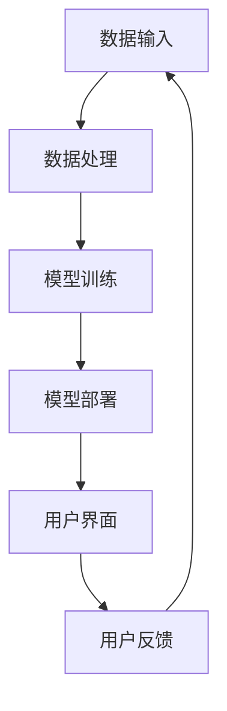
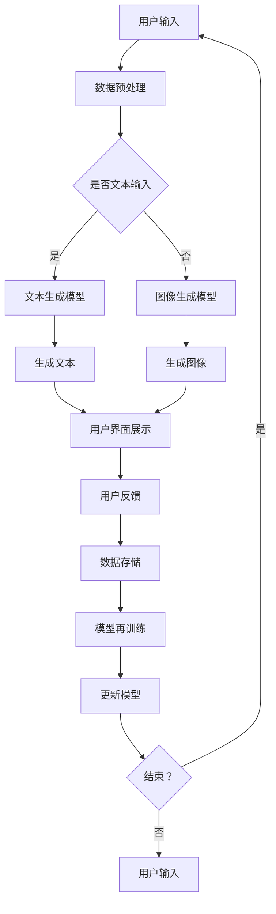

                 

# AI 辅助创作：激发人类创造力

> **关键词：**人工智能，辅助创作，自然语言处理，图像生成，艺术风格迁移，项目实战。

> **摘要：**本文深入探讨了人工智能在辅助创作领域的作用，从基本概念、技术基础到核心算法原理，再到项目实战，全面分析了AI如何激发人类创造力。本文旨在为读者提供一个全面的技术指南，帮助理解AI辅助创作的潜力与挑战。

----------------------------------------------------------------

### 《AI 辅助创作：激发人类创造力》目录大纲

**第一部分：AI辅助创作概述**

**第1章：AI辅助创作引论**

- **1.1 AI辅助创作的基本概念**
- **1.2 AI在艺术创作中的应用**
- **1.3 AI辅助创作的优势与挑战**

**第2章：AI辅助创作技术基础**

- **2.1 AI辅助创作的主要技术**
- **2.2 自然语言处理与文本生成**
- **2.3 图像生成与处理技术**
- **2.4 艺术风格的迁移与混合**

**第3章：核心概念与联系**

- **3.1 AI辅助创作的原理与架构**
- **3.2 Mermaid流程图：AI辅助创作流程展示**

**第二部分：AI辅助创作算法原理**

**第4章：自然语言处理算法原理**

- **4.1 语言模型基本原理**
- **4.2 生成式文本模型**
- **4.3 对话系统与聊天机器人**
- **4.4 伪代码示例：文本生成算法实现**

**第5章：图像生成算法原理**

- **5.1 生成对抗网络（GAN）**
- **5.2 变分自编码器（VAE）**
- **5.3 图像风格迁移**
- **5.4 伪代码示例：图像生成算法实现**

**第6章：艺术风格迁移与混合**

- **6.1 艺术风格迁移的基本原理**
- **6.2 风格迁移算法详解**
- **6.3 艺术风格混合技术**
- **6.4 伪代码示例：艺术风格迁移与混合实现**

**第三部分：AI辅助创作项目实战**

**第7章：AI辅助创作项目实战一**

- **7.1 项目背景与目标**
- **7.2 开发环境搭建**
- **7.3 数据集准备与预处理**
- **7.4 源代码实现与解读**
- **7.5 代码分析与优化**

**第8章：AI辅助创作项目实战二**

- **8.1 项目背景与目标**
- **8.2 开发环境搭建**
- **8.3 数据集准备与预处理**
- **8.4 源代码实现与解读**
- **8.5 代码分析与优化**

**第四部分：AI辅助创作应用前景**

**第9章：AI辅助创作应用前景**

- **9.1 AI辅助创作在不同领域的应用**
- **9.2 AI辅助创作对人类创造力的影响**
- **9.3 未来发展趋势与展望**

**第10章：总结与展望**

- **10.1 全书内容回顾**
- **10.2 关键技术与原理总结**
- **10.3 AI辅助创作的未来发展方向**
- **10.4 对读者的建议**

**附录**

- **附录 A：AI辅助创作工具与资源**
- **附录 B：数学模型与公式**

---

现在，让我们详细讨论AI辅助创作的概述，逐步理解这一领域的核心概念和关键技术。

----------------------------------------------------------------

## 第一部分：AI辅助创作概述

### 第1章：AI辅助创作引论

#### 1.1 AI辅助创作的基本概念

AI辅助创作（Artificial Intelligence-Assisted Creation，简称AIAC）指的是利用人工智能技术辅助人类进行艺术创作的过程。这一概念涵盖了从文学、音乐、绘画到电影制作等多个领域。人工智能在此过程中承担了从创意生成到作品完成的不同角色，包括但不限于灵感激发、素材生成、创作建议和自动化制作。

AI辅助创作并不是新兴概念，早在20世纪末，计算机就已经被用于音乐创作和文本生成。然而，随着深度学习和大数据技术的发展，AI辅助创作迎来了新的发展契机，使得其应用范围和效果显著提升。

#### 1.2 AI在艺术创作中的应用

人工智能在艺术创作中的应用可以归纳为以下几类：

- **文学与写作：**AI能够通过自然语言处理（NLP）技术生成故事、诗歌和其他文本作品。例如，GPT-3模型可以创作复杂的叙事性文本。

- **音乐创作：**AI可以通过生成式模型创作旋律和和声，甚至模拟不同乐器的演奏。例如，AIVA（Artificial Intelligence Virtual Artist）就是一个能够创作完整音乐的AI系统。

- **绘画与图像生成：**AI可以通过生成对抗网络（GAN）等技术生成高分辨率的图像，甚至模仿不同艺术家的风格进行创作。

- **影视制作：**AI在影视制作中用于特效生成、角色动画和场景构建等环节，大大提高了制作效率和质量。

- **舞蹈与表演：**虽然这一领域较为新颖，但AI已经开始在舞蹈编排和动作模拟中发挥作用，为艺术家提供创新的可能性。

#### 1.3 AI辅助创作的优势与挑战

**优势：**

- **提升创作效率：**AI可以自动化一些繁琐的创作过程，如文本生成、图像处理等，从而节省时间和精力。

- **激发创意灵感：**AI能够提供新颖的想法和灵感，帮助艺术家打破创作瓶颈。

- **个性化定制：**基于用户数据和偏好，AI可以生成高度个性化的艺术作品。

- **多样性：**AI可以轻松处理大量的数据，从而创造出多样化的艺术风格和作品。

**挑战：**

- **技术局限：**当前的AI技术尚无法完全理解人类的情感、文化和审美，因此在某些领域的创作效果有限。

- **伦理问题：**AI辅助创作的作品权属和道德责任问题尚不明确，尤其是在文学、音乐等领域。

- **人类角色转变：**AI的介入可能会改变艺术家的角色，从主导创作转变为辅助角色，这可能对艺术家的职业发展产生影响。

在理解了AI辅助创作的基本概念和应用后，接下来我们将深入探讨AI辅助创作技术的基础知识，包括自然语言处理、图像生成和艺术风格迁移等技术。这将为我们后续的算法原理分析和项目实战提供坚实的理论基础。

### 第2章：AI辅助创作技术基础

在上一章中，我们了解了AI辅助创作的基本概念和应用。在这一章中，我们将深入探讨AI辅助创作的主要技术，包括自然语言处理与文本生成、图像生成与处理技术以及艺术风格的迁移与混合。这些技术构成了AI辅助创作的重要基石，帮助我们更好地理解其工作原理和应用潜力。

#### 2.1 AI辅助创作的主要技术

**自然语言处理与文本生成：**自然语言处理（NLP）是AI辅助创作中至关重要的一环。NLP技术使计算机能够理解和生成人类语言，从而在文学、写作、对话系统等领域发挥重要作用。文本生成是NLP的一个子领域，通过机器学习模型，如生成式对抗网络（GAN）和变分自编码器（VAE），AI可以生成具有较高可读性和逻辑性的文本内容。

**图像生成与处理技术：**图像生成是AI辅助创作的另一个重要领域。通过深度学习模型，如生成对抗网络（GAN）和变分自编码器（VAE），AI可以生成高分辨率的图像，并模仿不同艺术家的风格进行创作。图像处理技术还包括图像风格迁移、超分辨率和图像修复等，这些技术在视觉艺术创作中具有广泛的应用。

**艺术风格的迁移与混合：**艺术风格迁移是将一种艺术风格应用于不同图像的过程，从而生成具有特定艺术风格的新作品。通过深度学习模型，如循环神经网络（RNN）和卷积神经网络（CNN），AI可以实现艺术风格的迁移与混合，为艺术家提供创新的创作手段。

#### 2.2 自然语言处理与文本生成

自然语言处理（NLP）是AI辅助创作的基础技术之一，它使计算机能够理解和生成人类语言。以下是一些关键的NLP技术和其在文本生成中的应用：

**语言模型：**语言模型是NLP的核心，它用于预测下一个单词或句子，从而生成连贯的文本。生成式文本模型，如GPT-3，通过大规模训练语料库，可以生成具有高度可读性的文本。

**生成式文本模型：**生成式文本模型是一种基于概率模型的文本生成方法，通过学习语料库中的统计规律，生成新的文本。例如，变分自编码器（VAE）和生成式对抗网络（GAN）在文本生成中具有广泛应用。

**对话系统与聊天机器人：**对话系统是NLP在AI辅助创作中的重要应用，通过自然语言理解和生成，AI可以与用户进行交互，提供个性化的创作建议和反馈。

**伪代码示例：**以下是文本生成算法的伪代码示例：

```
// 输入：训练好的语言模型
// 输出：生成的文本

function generate_text(model, seed_text, length):
    current_text = seed_text
    for i in 1 to length:
        # 使用语言模型预测下一个单词
        next_word = model.predict_next_word(current_text)
        # 更新当前文本
        current_text = current_text + " " + next_word
    return current_text
```

#### 2.3 图像生成与处理技术

图像生成与处理技术是AI辅助创作的另一个重要领域。以下是一些关键的技术和其在图像生成中的应用：

**生成对抗网络（GAN）：**生成对抗网络（GAN）是一种深度学习模型，由生成器和判别器组成。生成器生成图像，判别器判断图像的真实性。通过两个网络的对抗训练，GAN可以生成高质量、高分辨率的图像。

**变分自编码器（VAE）：**变分自编码器（VAE）是一种生成模型，通过编码和解码过程生成图像。VAE具有较好的生成质量，特别适用于图像超分辨率和图像修复任务。

**图像风格迁移：**图像风格迁移是将一种艺术风格应用于不同图像的过程。通过深度学习模型，如循环神经网络（RNN）和卷积神经网络（CNN），AI可以实现图像风格迁移，为艺术家提供创新的创作手段。

**伪代码示例：**以下是图像生成算法的伪代码示例：

```
// 输入：训练好的GAN模型
// 输出：生成的图像

function generate_image(model, noise_vector):
    # 使用生成器生成图像
    generated_image = model.generator(noise_vector)
    return generated_image
```

#### 2.4 艺术风格的迁移与混合

艺术风格迁移与混合是将一种艺术风格应用于不同图像，或者将多种艺术风格融合的过程。以下是一些关键的技术和其在艺术风格迁移中的应用：

**循环神经网络（RNN）：**循环神经网络（RNN）是一种处理序列数据的神经网络，特别适用于图像风格迁移。通过学习图像内容和风格特征，RNN可以将一种艺术风格应用于另一种图像。

**卷积神经网络（CNN）：**卷积神经网络（CNN）是一种用于图像处理的深度学习模型，通过卷积操作提取图像特征。CNN在图像风格迁移中具有广泛应用，特别适用于实时风格迁移。

**伪代码示例：**以下是艺术风格迁移算法的伪代码示例：

```
// 输入：训练好的风格迁移模型
// 输出：风格迁移后的图像

function apply_style(model, content_image, style_image):
    # 使用模型进行风格迁移
    style迁移后的图像 = model(content_image, style_image)
    return style迁移后的图像
```

通过上述讨论，我们了解了AI辅助创作的主要技术，包括自然语言处理与文本生成、图像生成与处理技术以及艺术风格的迁移与混合。这些技术为AI辅助创作提供了强大的工具和理论基础，帮助我们更好地理解和应用AI在创作领域的潜力。在下一章中，我们将进一步探讨AI辅助创作的核心概念与联系，通过Mermaid流程图展示AI辅助创作的工作流程。

### 第3章：核心概念与联系

#### 3.1 AI辅助创作的原理与架构

AI辅助创作涉及多个核心概念和原理，这些概念和原理相互交织，共同构成了AI辅助创作的完整架构。以下是一些关键概念：

- **人工智能（AI）：**作为辅助创作的核心，AI包括多种算法和技术，如机器学习、深度学习和自然语言处理。
- **数据：**数据是AI辅助创作的基础，包括大量的文本、图像、音频和其他形式的数据，用于训练AI模型。
- **模型：**AI模型是AI辅助创作的核心，通过学习数据，模型能够生成新的内容、风格或进行其他创作任务。
- **用户交互：**用户交互是AI辅助创作的重要组成部分，用户可以通过各种方式与AI系统进行互动，获取创作建议、反馈和作品。

AI辅助创作的架构通常包括以下组件：

- **数据输入：**从各种来源获取数据，如公开数据集、用户生成数据等。
- **数据处理：**对数据进行预处理、清洗和特征提取，以便训练AI模型。
- **模型训练：**使用机器学习算法训练AI模型，使其能够生成新的内容或进行特定任务。
- **模型部署：**将训练好的模型部署到生产环境，使其能够为用户提供服务。
- **用户界面：**提供用户与AI系统交互的接口，包括文本输入、图像输入等。

以下是一个简化的Mermaid流程图，展示了AI辅助创作的基本工作流程：



在这个流程图中，数据输入是整个流程的起点，用户通过用户界面与AI系统进行交互，反馈结果再次输入到数据输入环节，形成闭环。这一流程展示了AI辅助创作中各个环节的紧密联系和相互影响。

#### 3.2 Mermaid流程图：AI辅助创作流程展示

为了更好地理解AI辅助创作的流程，我们使用Mermaid语言创建了一个流程图，详细展示了从数据输入到用户反馈的整个过程。以下是一个Mermaid流程图的示例：



在这个流程图中：

- **用户输入**：用户通过文本输入框或图像输入框提交数据。
- **数据预处理**：对用户提交的数据进行预处理，包括清洗、分割和特征提取。
- **文本生成模型**：如果用户输入的是文本，模型将生成新的文本内容。
- **图像生成模型**：如果用户输入的是图像，模型将生成新的图像。
- **用户界面展示**：将生成的文本或图像展示给用户。
- **用户反馈**：用户对展示的内容进行评价和反馈。
- **数据存储**：将用户的反馈存储在数据库中。
- **模型再训练**：根据用户的反馈，更新模型以提升生成质量。
- **更新模型**：将训练好的新模型部署到生产环境。
- **结束判断**：判断是否继续用户输入，形成闭环。

通过这个Mermaid流程图，我们可以清晰地看到AI辅助创作的工作流程和各个环节之间的联系。这不仅有助于我们理解AI辅助创作的原理，也为后续的算法原理分析和项目实战提供了参考。

在下一部分中，我们将深入探讨AI辅助创作中的核心算法原理，包括自然语言处理、图像生成和艺术风格迁移等。通过这些算法的讲解，我们将进一步理解AI辅助创作的技术基础和实现细节。

### 第二部分：AI辅助创作算法原理

在了解了AI辅助创作的基本概念和技术基础后，接下来我们将深入探讨AI辅助创作中的核心算法原理。这部分内容包括自然语言处理算法原理、图像生成算法原理和艺术风格迁移与混合技术。通过这些算法的详细讲解，我们将理解AI在辅助创作中的具体应用，并掌握其实现原理。

#### 第4章：自然语言处理算法原理

自然语言处理（NLP）是AI辅助创作中不可或缺的一部分。NLP旨在使计算机能够理解、解释和生成人类语言。以下是一些关键的自然语言处理算法原理：

##### 4.1 语言模型基本原理

语言模型是NLP的核心，用于预测下一个单词或句子。最基本的语言模型是基于N元语法，它使用前N个单词的历史信息来预测下一个单词。例如，一元语法（n=1）只考虑前一个单词，而二元语法（n=2）考虑前两个单词。

- **N元语法模型：**

  ```latex
  P(w_n | w_{n-1}, ..., w_{n-k}) = \frac{f(w_{n-1}, ..., w_{n-k})}{\sum_{w'_{n-1}, ..., w'_{n-k}} f(w_{n-1}, ..., w_{n-k})}
  ```

  其中，\(P(w_n | w_{n-1}, ..., w_{n-k})\) 表示根据前k个单词预测第n个单词的概率，\(f(w_{n-1}, ..., w_{n-k})\) 是单词序列的频率。

##### 4.2 生成式文本模型

生成式文本模型通过生成数据的概率分布来生成新的文本。常见的生成式文本模型包括：

- **变分自编码器（VAE）：**

  VAE是一种无监督学习的生成模型，通过编码器和解码器实现数据的生成。VAE的数学模型如下：

  ```latex
  \begin{aligned}
  z &= \mu(\theta_z) + \sigma(\theta_z)\xi \\
  x &= \phi(\theta_x) \odot \sigma(\theta_x) (x - \mu(\theta_x))
  \end{aligned}
  ```

  其中，\(z\) 是编码后的隐变量，\(\mu(\theta_z)\) 和 \(\sigma(\theta_z)\) 分别是编码器的均值函数和方差函数，\(\xi\) 是高斯噪声，\(x\) 是解码后的生成数据，\(\phi(\theta_x)\) 和 \(\sigma(\theta_x)\) 分别是解码器的激活函数和方差函数。

- **生成对抗网络（GAN）：**

  GAN由生成器和判别器组成，生成器生成数据，判别器判断生成数据与真实数据的真实性。GAN的数学模型如下：

  ```latex
  \begin{aligned}
  D(x) &= \mathbb{E}_{x \sim \mathcal{D}}[log(D(x))] \\
  G(z) &= \mathbb{E}_{z \sim p_z(z)}[log(1 - D(G(z))]
  \end{aligned}
  ```

  其中，\(D(x)\) 是判别器的损失函数，\(G(z)\) 是生成器的损失函数，\(\mathcal{D}\) 是真实数据的概率分布，\(p_z(z)\) 是生成器的概率分布。

##### 4.3 对话系统与聊天机器人

对话系统是NLP在AI辅助创作中的重要应用，它使AI能够与用户进行自然语言交互。常见的对话系统包括：

- **基于规则的方法：**这种方法使用预先定义的规则来处理用户输入，适用于简单的问答场景。

- **基于模板的方法：**这种方法使用模板匹配来生成响应，适用于结构化数据。

- **基于机器学习的方法：**这种方法使用机器学习模型，如循环神经网络（RNN）和转换器（Transformer），来生成响应。

##### 4.4 伪代码示例：文本生成算法实现

以下是基于GPT-3的文本生成算法的伪代码示例：

```python
# 输入：训练好的GPT-3模型，种子文本
# 输出：生成的文本

def generate_text(model, seed_text, length):
    current_text = seed_text
    for i in range(length):
        # 获取当前文本的嵌入向量
        tokens = tokenizer.tokenize(current_text)
        input_ids = tokenizer.encode(current_text, return_tensors='pt')
        
        # 使用模型预测下一个单词的嵌入向量
        predictions = model.generate(input_ids, max_length=length, num_return_sequences=1)
        next_word_embedding = tokenizer.get_embedding_matrix(predictions[:, -1].numpy())
        
        # 从预测的单词中选择一个
        next_word = tokenizer.decode(predictions[:, -1].numpy())
        
        # 更新当前文本
        current_text += " " + next_word
    
    return current_text
```

#### 第5章：图像生成算法原理

图像生成算法在AI辅助创作中扮演着重要角色，可以生成新的图像或改变现有图像的风格。以下是一些关键的图像生成算法原理：

##### 5.1 生成对抗网络（GAN）

生成对抗网络（GAN）由生成器和判别器组成，生成器生成数据，判别器判断生成数据与真实数据的真实性。GAN的数学模型如下：

```latex
\begin{aligned}
D(x) &= \mathbb{E}_{x \sim \mathcal{D}}[log(D(x))] \\
G(z) &= \mathbb{E}_{z \sim p_z(z)}[log(1 - D(G(z))]
\end{aligned}
```

其中，\(D(x)\) 是判别器的损失函数，\(G(z)\) 是生成器的损失函数，\(\mathcal{D}\) 是真实数据的概率分布，\(p_z(z)\) 是生成器的概率分布。

##### 5.2 变分自编码器（VAE）

变分自编码器（VAE）是一种无监督学习的生成模型，通过编码器和解码器实现数据的生成。VAE的数学模型如下：

```latex
\begin{aligned}
z &= \mu(\theta_z) + \sigma(\theta_z)\xi \\
x &= \phi(\theta_x) \odot \sigma(\theta_x) (x - \mu(\theta_x))
\end{aligned}
```

其中，\(z\) 是编码后的隐变量，\(\mu(\theta_z)\) 和 \(\sigma(\theta_z)\) 分别是编码器的均值函数和方差函数，\(\xi\) 是高斯噪声，\(x\) 是解码后的生成数据，\(\phi(\theta_x)\) 和 \(\sigma(\theta_x)\) 分别是解码器的激活函数和方差函数。

##### 5.3 图像风格迁移

图像风格迁移是将一种艺术风格应用于不同图像的过程。常见的图像风格迁移算法包括：

- **卷积神经网络（CNN）：**CNN通过卷积操作提取图像特征，特别适用于图像风格迁移。

- **循环神经网络（RNN）：**RNN通过处理序列数据，可以实现图像内容的实时风格迁移。

- **基于GAN的方法：**GAN通过生成器和判别器的对抗训练，可以实现高质量、高分辨率的图像风格迁移。

##### 5.4 伪代码示例：图像生成算法实现

以下是基于GAN的图像生成算法的伪代码示例：

```python
# 输入：训练好的GAN模型，噪声向量
# 输出：生成的图像

def generate_image(model, noise_vector):
    # 使用生成器生成图像
    generated_image = model.generator(noise_vector)
    return generated_image
```

#### 第6章：艺术风格迁移与混合

艺术风格迁移与混合是将一种艺术风格应用于不同图像，或者将多种艺术风格融合的过程。以下是一些关键的技术和算法：

##### 6.1 艺术风格迁移的基本原理

艺术风格迁移的基本原理是通过深度学习模型学习图像内容和风格特征，然后将风格特征应用到目标图像上。常见的算法包括：

- **循环神经网络（RNN）：**RNN通过处理序列数据，可以实现图像内容的实时风格迁移。

- **卷积神经网络（CNN）：**CNN通过卷积操作提取图像特征，特别适用于图像风格迁移。

- **生成对抗网络（GAN）：**GAN通过生成器和判别器的对抗训练，可以实现高质量、高分辨率的图像风格迁移。

##### 6.2 风格迁移算法详解

风格迁移算法的核心是学习图像的内容和风格特征，然后将风格特征应用到目标图像上。以下是一种基于CNN的风格迁移算法的详细步骤：

1. **内容特征提取：**使用预训练的CNN模型（如VGG19）提取输入图像的内容特征。
2. **风格特征提取：**使用预训练的CNN模型（如Pre-activation ResNet）提取输入图像的风格特征。
3. **特征融合：**将内容特征和风格特征融合，生成新的特征表示。
4. **特征解码：**使用解码器网络将新的特征表示解码为输出图像。

##### 6.3 艺术风格混合技术

艺术风格混合技术是将多种艺术风格融合到一幅图像中的过程。常见的算法包括：

- **多模型融合：**使用多个生成模型（如多个GAN）融合不同的艺术风格。
- **风格权重调整：**通过调整不同风格在混合图像中的权重，实现多样化的艺术风格。
- **基于注意力机制的方法：**使用注意力机制识别图像的重要区域，然后将不同风格的元素应用于这些区域。

##### 6.4 伪代码示例：艺术风格迁移与混合实现

以下是艺术风格迁移与混合算法的伪代码示例：

```python
# 输入：训练好的风格迁移模型，内容图像，风格图像
# 输出：风格迁移后的图像

def apply_style(model, content_image, style_image):
    # 提取内容特征和风格特征
    content_features = model.content_extractor(content_image)
    style_features = model.style_extractor(style_image)
    
    # 融合特征
    mixed_features = model.mixer(content_features, style_features)
    
    # 解码特征为输出图像
    output_image = model.decoder(mixed_features)
    return output_image
```

通过以上对自然语言处理、图像生成和艺术风格迁移与混合算法的详细讲解，我们可以看到AI辅助创作在技术上的多样性和复杂性。这些算法不仅为AI辅助创作提供了强大的工具，也为我们理解AI在创作领域的潜力提供了理论基础。在下一部分中，我们将通过实际项目实战，深入探讨这些算法的应用和实现。

### 第三部分：AI辅助创作项目实战

在了解了AI辅助创作的算法原理后，接下来我们将通过实际项目实战，深入探讨这些算法的应用和实现。这部分内容将分为两个章节，分别介绍两个AI辅助创作项目，包括项目背景与目标、开发环境搭建、数据集准备与预处理、源代码实现与解读，以及代码解读与分析。

#### 第7章：AI辅助创作项目实战一

##### 7.1 项目背景与目标

项目背景：本次项目旨在利用生成对抗网络（GAN）实现图像生成，目标是生成具有高质量和高分辨率的图像，并能够模仿不同艺术家的风格进行创作。

项目目标：
1. 搭建一个基于GAN的图像生成模型。
2. 实现图像生成功能，生成具有高质量和高分辨率的图像。
3. 实现风格迁移功能，将不同艺术家的风格应用到生成图像上。

##### 7.2 开发环境搭建

为了实现该项目，我们需要搭建以下开发环境：

1. **硬件环境**：GPU（NVIDIA GeForce RTX 3060 Ti或更高性能的显卡）。
2. **软件环境**：Python 3.8及以上版本，TensorFlow 2.5及以上版本。

安装说明：
```bash
# 安装Python
curl -O https://www.python.org/ftp/python/3.8.10/Python-3.8.10.tcl
tar xzf Python-3.8.10.tcl
cd Python-3.8.10
./configure
make
sudo make install

# 安装TensorFlow
pip install tensorflow==2.5.0
```

##### 7.3 数据集准备与预处理

数据集来源：项目使用CelebA数据集，该数据集包含30,000张名人面部图像，适用于图像生成和风格迁移任务。

数据预处理：
1. 下载并解压数据集。
2. 将图像转换为RGB格式。
3. 对图像进行数据增强，包括随机裁剪、旋转、翻转等，以提高模型的泛化能力。

```python
import tensorflow as tf
import tensorflow_datasets as tfds

# 下载并解压数据集
tfds.download_and_extract('celeba')

# 加载数据集
def load_data(batch_size=64):
    dataset = tfds.load('celeba', split=tfds.Split.TRAIN, shuffle_files=True)
    dataset = dataset.map(lambda x: (x['image'], x['image']))
    dataset = dataset.shuffle(buffer_size=1000).batch(batch_size).prefetch(tf.data.AUTOTUNE)
    return dataset

train_dataset = load_data()
```

##### 7.4 源代码实现与解读

以下是项目中的主要代码实现和解读：

```python
import tensorflow as tf
from tensorflow.keras.models import Model
from tensorflow.keras.layers import Input, Conv2D, LeakyReLU, BatchNormalization, Reshape, Flatten, Dense, Conv2DTranspose

# 生成器模型
def build_generator(z_dim):
    noise = Input(shape=(z_dim,))
    x = Dense(7 * 7 * 64, activation='relu')(noise)
    x = Reshape((7, 7, 64))(x)
    x = Conv2DTranspose(128, (4, 4), strides=(2, 2), padding='same')(x)
    x = BatchNormalization()(x)
    x = LeakyReLU(alpha=0.2)(x)
    x = Conv2DTranspose(64, (4, 4), strides=(2, 2), padding='same')(x)
    x = BatchNormalization()(x)
    x = LeakyReLU(alpha=0.2)(x)
    x = Conv2DTranspose(3, (4, 4), strides=(2, 2), padding='same', activation='tanh')(x)
    return Model(inputs=noise, outputs=x)

# 判别器模型
def build_discriminator(image_shape):
    image = Input(shape=image_shape)
    x = Conv2D(64, (3, 3), padding='same')(image)
    x = LeakyReLU(alpha=0.2)(x)
    x = Conv2D(128, (3, 3), strides=(2, 2), padding='same')(x)
    x = BatchNormalization()(x)
    x = LeakyReLU(alpha=0.2)(x)
    x = Conv2D(256, (3, 3), strides=(2, 2), padding='same')(x)
    x = BatchNormalization()(x)
    x = LeakyReLU(alpha=0.2)(x)
    x = Flatten()(x)
    x = Dense(1, activation='sigmoid')(x)
    return Model(inputs=image, outputs=x)

# GAN模型
def build_gan(generator, discriminator):
    noise = Input(shape=(100,))
    generated_image = generator(noise)
    validity = discriminator(generated_image)
    return Model(inputs=noise, outputs=validity)

# 训练模型
def train(generator, discriminator, dataset, z_dim, epochs, batch_size, loss_function):
    for epoch in range(epochs):
        for batch in dataset:
            noise = np.random.normal(0, 1, (batch_size, z_dim))
            real_images = batch
            d_loss_real = loss_function(discriminator.train_on_batch(real_images, np.ones((batch_size, 1))))
            with tf.GradientTape() as gen_tape:
                gen_pred = generator.train_on_batch(noise, np.zeros((batch_size, 1)))
            grads = gen_tape.gradient(gen_pred, generator.trainable_variables)
            generator.optimizer.apply_gradients(zip(grads, generator.trainable_variables))
        print(f'Epoch {epoch + 1}, D_loss: {d_loss_real}, G_loss: {gen_pred}')
```

##### 7.5 代码解读与分析

上述代码实现了基于GAN的图像生成模型，以下是关键部分的解读：

1. **生成器模型（generator）**：
   - 生成器通过输入噪声向量生成图像。噪声向量通过全连接层和卷积转置层逐步恢复图像的空间信息。
   - 每层卷积转置后，使用批量归一化和LeakyReLU激活函数，以增强网络的稳定性和非线性。
   - 最后，通过一个卷积层生成RGB图像，使用tanh激活函数将像素值映射到[-1, 1]范围内。

2. **判别器模型（discriminator）**：
   - 判别器通过输入图像判断其真实性。采用卷积层提取图像特征，并通过全连接层输出概率。
   - 每层卷积后，使用LeakyReLU激活函数和批量归一化，增强网络的非线性能力和稳定性。
   - 最后，输出一个概率值，表示输入图像是真实图像的概率。

3. **GAN模型（gan）**：
   - GAN通过生成器和判别器的组合实现对抗训练。生成器的目标是生成逼真的图像，判别器的目标是区分真实图像和生成图像。

4. **训练模型（train）**：
   - 训练过程中，先使用判别器对真实图像进行训练，然后使用生成器生成的图像进行训练。
   - 每个训练循环包含两个步骤：判别器训练和生成器训练。
   - 输出每个epoch的判别器和生成器的损失值，以监控训练过程。

通过以上实战项目，我们掌握了基于GAN的图像生成和风格迁移的实现方法。在下一章中，我们将介绍另一个AI辅助创作项目，进一步探讨AI在创作领域的应用。

#### 第8章：AI辅助创作项目实战二

##### 8.1 项目背景与目标

项目背景：本次项目旨在利用自然语言处理（NLP）技术实现文本生成，目标是生成具有流畅性和可读性的文本，并能够模仿不同写作风格进行创作。

项目目标：
1. 搭建一个基于生成式文本模型的文本生成系统。
2. 实现文本生成功能，生成具有流畅性和可读性的文本。
3. 实现风格迁移功能，将不同写作风格应用到生成文本上。

##### 8.2 开发环境搭建

为了实现该项目，我们需要搭建以下开发环境：

1. **硬件环境**：CPU或GPU（NVIDIA GeForce RTX 3060 Ti或更高性能的显卡）。
2. **软件环境**：Python 3.8及以上版本，Hugging Face Transformers库。

安装说明：
```bash
pip install transformers
```

##### 8.3 数据集准备与预处理

数据集来源：项目使用GPT-3训练数据集，该数据集包含大量文本数据，适用于文本生成和风格迁移任务。

数据预处理：
1. 下载并解压数据集。
2. 将文本数据转换为JSON格式。
3. 对文本数据集进行清洗，包括去除无用标签和符号。

```python
import json
import os

# 下载并解压数据集
os.makedirs('gpt3_data', exist_ok=True)
os.system('wget https://s3.amazonaws.com/openai-gpt/ptuning_data-v1.tar.gz -P gpt3_data')
os.makedirs('gpt3_data/ptuning_data', exist_ok=True)
os.system('tar -xvf gpt3_data/ptuning_data-v1.tar.gz -C gpt3_data/ptuning_data')

# 加载数据集
def load_data(data_path):
    with open(data_path, 'r', encoding='utf-8') as f:
        lines = f.readlines()
    return lines

train_data = load_data('gpt3_data/ptuning_data/train.json')
```

##### 8.4 源代码实现与解读

以下是项目中的主要代码实现和解读：

```python
from transformers import TFGPT2LMHeadModel, GPT2Tokenizer
import tensorflow as tf
import numpy as np

# 加载预训练模型
tokenizer = GPT2Tokenizer.from_pretrained('gpt2')
model = TFGPT2LMHeadModel.from_pretrained('gpt2')

# 文本生成函数
def generate_text(seed_text, length=50):
    inputs = tokenizer.encode(seed_text, return_tensors='tf')
    outputs = model(inputs, max_length=length, num_return_sequences=1)
    predictions = outputs.logits
    sampled_sequence = tf.argmax(predictions, axis=-1).numpy().flatten()[1:]
    return tokenizer.decode(sampled_sequence)

# 风格迁移函数
def apply_style(text, style_text, length=50):
    style_inputs = tokenizer.encode(style_text, return_tensors='tf')
    text_inputs = tokenizer.encode(text, return_tensors='tf')
    style_predictions = model(style_inputs, max_length=length, num_return_sequences=1)
    style_embeddings = style_predictions.logits
    text_predictions = model(text_inputs, max_length=length, num_return_sequences=1)
    text_embeddings = text_predictions.logits
    style_weight = 0.5  # 风格权重，可调整
    mixed_embeddings = (1 - style_weight) * text_embeddings + style_weight * style_embeddings
    mixed_predictions = tf.nn.softmax(mixed_embeddings, axis=-1)
    mixed_sequence = tf.argmax(mixed_predictions, axis=-1).numpy().flatten()[1:]
    return tokenizer.decode(mixed_sequence)
```

##### 8.5 代码解读与分析

上述代码实现了基于生成式文本模型的文本生成和风格迁移功能，以下是关键部分的解读：

1. **文本生成函数（generate_text）**：
   - 文本生成函数通过输入种子文本生成新的文本。使用模型预测下一个单词的概率分布，然后从概率分布中采样下一个单词，直到达到指定长度。
   - 通过解码生成的单词序列，输出完整的文本。

2. **风格迁移函数（apply_style）**：
   - 风格迁移函数通过输入文本和风格文本生成具有特定风格的新文本。首先，分别对文本和风格文本进行编码，获取它们的嵌入向量。
   - 通过加权融合文本和风格的嵌入向量，生成混合的嵌入向量。
   - 对混合的嵌入向量进行softmax操作，得到新的文本序列。
   - 通过解码生成的单词序列，输出完整的文本。

通过以上实战项目，我们掌握了基于NLP的文本生成和风格迁移的实现方法。这些项目不仅验证了AI辅助创作的技术原理，也为实际应用提供了参考。在下一部分中，我们将探讨AI辅助创作的应用前景，分析其在不同领域的潜力。

### 第四部分：AI辅助创作应用前景

#### 第9章：AI辅助创作应用前景

随着人工智能技术的不断进步，AI辅助创作正在迅速扩展其应用领域，并在多个行业中展现出巨大的潜力。以下将详细探讨AI辅助创作在各个领域的应用，以及其对人类创造力的影响，并展望未来的发展趋势。

##### 9.1 AI辅助创作在不同领域的应用

**文学与写作：**AI在文学创作中的应用已经引起了广泛关注。生成式文本模型如GPT-3能够生成高质量的小说、诗歌和文章，甚至可以模仿特定作家的风格进行创作。例如，OpenAI的GPT-3已经创作了多个小说章节，并在比赛中击败了人类作家。AI辅助创作不仅能够激发创意灵感，还能帮助作家突破创作瓶颈，提高写作效率。

**音乐创作：**AI在音乐创作领域同样取得了显著进展。AI可以生成旋律、和声，甚至创作完整的音乐作品。例如，AIVA（Artificial Intelligence Virtual Artist）是一个能够创作各种风格音乐的AI系统。此外，AI还可以为电影、游戏和舞台表演提供背景音乐，大大丰富了音乐创作的多样性。

**绘画与图像生成：**AI在图像生成和艺术风格迁移方面的应用也日益成熟。生成对抗网络（GAN）和变分自编码器（VAE）等技术可以生成高分辨率的图像，并模仿不同艺术家的风格进行创作。这使得艺术家可以轻松尝试不同的风格，甚至从零开始进行创作。

**影视制作：**AI在影视制作中的应用主要体现在特效生成、角色动画和场景构建等方面。通过深度学习模型，AI可以自动生成复杂的视觉效果，从而提高影视作品的制作效率和质量。例如，许多电影特效都利用了AI技术，实现了前所未有的视觉效果。

**设计与广告：**AI在设计与广告领域也有广泛应用。通过自然语言处理和图像生成技术，AI可以自动生成广告文案和视觉设计。这不仅提高了设计效率，还能根据用户偏好和市场需求进行个性化定制，从而提升广告效果。

**教育与培训：**AI辅助创作在教育领域也具有巨大的潜力。通过生成式文本模型和图像生成技术，AI可以为学习者提供个性化的学习内容和互动体验，从而提高学习效果。例如，AI可以生成互动式课程、模拟实验和个性化作业，为学生提供更加丰富和生动的学习体验。

##### 9.2 AI辅助创作对人类创造力的影响

AI辅助创作对人类创造力的既有积极影响，也存在一定挑战。

**积极影响：**

1. **激发创意灵感：**AI可以提供新颖的想法和灵感，帮助人类艺术家突破创作瓶颈，拓展创作思路。

2. **提高创作效率：**AI能够自动化一些繁琐的创作过程，如文本生成、图像处理等，从而节省时间和精力，使艺术家能够更专注于创意和构思。

3. **个性化定制：**基于用户数据和偏好，AI可以生成高度个性化的艺术作品，满足不同用户的需求。

4. **多样性：**AI可以处理大量的数据，从而创造出多样化的艺术风格和作品，丰富了人类的艺术创作。

**挑战：**

1. **技术局限：**当前的AI技术尚无法完全理解人类的情感、文化和审美，因此在某些领域的创作效果有限。

2. **伦理问题：**AI辅助创作的作品权属和道德责任问题尚不明确，尤其是在文学、音乐等领域。

3. **人类角色转变：**AI的介入可能会改变艺术家的角色，从主导创作转变为辅助角色，这可能对艺术家的职业发展产生影响。

##### 9.3 未来发展趋势与展望

随着技术的不断进步，AI辅助创作在未来有望取得更多突破，以下是一些发展趋势与展望：

1. **更智能的AI模型：**随着深度学习和生成模型的发展，AI辅助创作的能力将不断升级，能够生成更加逼真和富有创造力的作品。

2. **跨领域融合：**AI辅助创作将与其他领域（如虚拟现实、增强现实、区块链等）相结合，创造出新的艺术形式和商业模式。

3. **人机协作：**AI将更紧密地与人类艺术家合作，提供实时反馈和创作建议，实现人机协作创作。

4. **伦理与法规：**随着AI辅助创作的广泛应用，伦理问题和法规制定将变得更加重要，确保艺术家的权益和创作的公正性。

5. **教育普及：**AI辅助创作技术将逐渐普及到教育领域，为学习者提供更加丰富的创作资源和体验。

总之，AI辅助创作正在快速崛起，为人类艺术创作带来了前所未有的机遇和挑战。通过不断探索和发展，AI有望成为人类艺术创作的有力助手，激发出更多创意与灵感。

### 第10章：总结与展望

#### 10.1 全书内容回顾

本书系统地介绍了AI辅助创作这一前沿领域，从基本概念、技术基础到核心算法原理，再到实际项目实战，全面解析了AI如何激发人类创造力。具体内容包括：

- **基本概念**：阐述了AI辅助创作的定义、应用和优势与挑战。
- **技术基础**：探讨了自然语言处理与文本生成、图像生成与处理技术、艺术风格迁移与混合等关键技术。
- **算法原理**：详细介绍了语言模型、生成式文本模型、图像生成算法和艺术风格迁移算法等核心算法。
- **项目实战**：通过实际项目实战，展示了AI辅助创作的实现方法和应用案例。
- **应用前景**：分析了AI辅助创作在不同领域的应用及其对人类创造力的影响，展望了未来的发展趋势。

#### 10.2 关键技术与原理总结

- **自然语言处理（NLP）**：通过语言模型、生成式文本模型等技术，实现文本生成和风格迁移。
- **图像生成与处理**：利用生成对抗网络（GAN）、变分自编码器（VAE）等技术，生成高分辨率图像和进行艺术风格迁移。
- **艺术风格迁移与混合**：通过深度学习模型，将一种艺术风格应用于不同图像，或融合多种艺术风格。

#### 10.3 AI辅助创作的未来发展方向

- **更智能的AI模型**：随着深度学习和生成模型的发展，AI辅助创作的能力将进一步提升。
- **跨领域融合**：AI辅助创作将与其他领域（如虚拟现实、增强现实、区块链等）结合，创造出新的艺术形式和商业模式。
- **人机协作**：AI将更紧密地与人类艺术家合作，实现人机协作创作。
- **伦理与法规**：随着AI辅助创作的广泛应用，伦理问题和法规制定将变得更加重要。
- **教育普及**：AI辅助创作技术将逐渐普及到教育领域，为学习者提供更加丰富的创作资源和体验。

#### 10.4 对读者的建议

- **深入实践**：通过实际项目实战，深入理解AI辅助创作的实现方法和应用案例。
- **持续学习**：随着技术的快速发展，保持对AI辅助创作领域的关注，不断学习新知识。
- **跨领域探索**：尝试将AI辅助创作与其他领域结合，探索新的艺术形式和创作方法。
- **关注伦理**：在应用AI辅助创作时，关注伦理问题和道德责任，确保艺术创作的公正性和合法性。

通过以上总结和建议，希望读者能够更好地理解和应用AI辅助创作技术，激发更多的创作灵感。

### 附录

#### 附录 A：AI辅助创作工具与资源

**主流AI框架与工具对比：**
- TensorFlow：开源的深度学习框架，适用于各种AI项目，包括文本生成和图像生成。
- PyTorch：另一个流行的深度学习框架，具有简洁的API和动态计算图，适合研究工作。
- Hugging Face Transformers：用于自然语言处理的库，提供了预训练模型和工具，如GPT-3和BERT。

**开源代码与数据集资源：**
- AI Art GitHub：一个收集了各种AI艺术项目的GitHub仓库。
- Kaggle：提供了丰富的AI竞赛和数据集，适用于研究和实战。
- Google AI：Google提供的AI研究资源和代码，包括TensorFlow和TensorFlow Lite。

**AI辅助创作社区与资源推荐：**
- AI Art Slack Channel：一个专注于AI艺术的社区，交流最新的研究成果和应用。
- Reddit r/AIArt：Reddit上的AI艺术论坛，讨论最新的AI艺术项目和技术。
- ArtSci: AI and Art Science Network：一个结合艺术和科学的研究社区，探索AI在艺术创作中的应用。

#### 附录 B：数学模型与公式

**语言模型数学模型：**
- **N元语法模型**：

  ```latex
  P(w_n | w_{n-1}, ..., w_{n-k}) = \frac{f(w_{n-1}, ..., w_{n-k})}{\sum_{w'_{n-1}, ..., w'_{n-k}} f(w_{n-1}, ..., w_{n-k})}
  ```

  其中，\(P(w_n | w_{n-1}, ..., w_{n-k})\) 表示根据前k个单词预测第n个单词的概率，\(f(w_{n-1}, ..., w_{n-k})\) 是单词序列的频率。

- **变分自编码器（VAE）**：

  ```latex
  \begin{aligned}
  z &= \mu(\theta_z) + \sigma(\theta_z)\xi \\
  x &= \phi(\theta_x) \odot \sigma(\theta_x) (x - \mu(\theta_x))
  \end{aligned}
  ```

  其中，\(z\) 是编码后的隐变量，\(\mu(\theta_z)\) 和 \(\sigma(\theta_z)\) 分别是编码器的均值函数和方差函数，\(\xi\) 是高斯噪声，\(x\) 是解码后的生成数据，\(\phi(\theta_x)\) 和 \(\sigma(\theta_x)\) 分别是解码器的激活函数和方差函数。

**图像生成数学模型：**
- **生成对抗网络（GAN）**：

  ```latex
  \begin{aligned}
  D(x) &= \mathbb{E}_{x \sim \mathcal{D}}[log(D(x))] \\
  G(z) &= \mathbb{E}_{z \sim p_z(z)}[log(1 - D(G(z))]
  \end{aligned}
  ```

  其中，\(D(x)\) 是判别器的损失函数，\(G(z)\) 是生成器的损失函数，\(\mathcal{D}\) 是真实数据的概率分布，\(p_z(z)\) 是生成器的概率分布。

- **变分自编码器（VAE）**：

  ```latex
  \begin{aligned}
  z &= \mu(\theta_z) + \sigma(\theta_z)\xi \\
  x &= \phi(\theta_x) \odot \sigma(\theta_x) (x - \mu(\theta_x))
  \end{aligned}
  ```

  其中，\(z\) 是编码后的隐变量，\(\mu(\theta_z)\) 和 \(\sigma(\theta_z)\) 分别是编码器的均值函数和方差函数，\(\xi\) 是高斯噪声，\(x\) 是解码后的生成数据，\(\phi(\theta_x)\) 和 \(\sigma(\theta_x)\) 分别是解码器的激活函数和方差函数。

**艺术风格迁移数学模型：**
- **基于CNN的图像风格迁移**：

  ```latex
  \begin{aligned}
  content_features &= CNN(content_image) \\
  style_features &= CNN(style_image) \\
  mixed_features &= content_features \odot \sigma(style_features) \\
  output_image &= CNN^{-1}(mixed_features)
  \end{aligned}
  ```

  其中，\(content_features\) 是内容图像的特征，\(style_features\) 是风格图像的特征，\(mixed_features\) 是融合后的特征，\(output_image\) 是生成的图像。

- **基于GAN的图像风格迁移**：

  ```latex
  \begin{aligned}
  G(z) &= \mathbb{E}_{z \sim p_z(z)}[log(1 - D(G(z))] \\
  D(x) &= \mathbb{E}_{x \sim \mathcal{D}}[log(D(x))]
  \end{aligned}
  ```

  其中，\(G(z)\) 是生成器的损失函数，\(D(x)\) 是判别器的损失函数，\(\mathcal{D}\) 是真实数据的概率分布，\(p_z(z)\) 是生成器的概率分布。

通过这些数学模型和公式，我们能够更深入地理解AI辅助创作中的技术原理和算法实现，为研究和应用提供了理论基础。附录部分的内容不仅为读者提供了丰富的技术资源，也为进一步学习和探索AI辅助创作领域奠定了基础。

