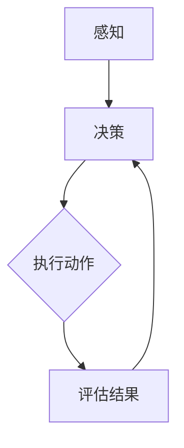

                 

# AI人工智能代理工作流AI Agent WorkFlow：智能代理在环保行业系统中的应用

> 关键词：智能代理、环保行业、AI、工作流、应用案例、算法、技术、挑战与展望

> 摘要：
随着人工智能技术的不断进步，智能代理（AI Agent）在各个行业中的应用日益广泛，尤其在环保行业系统中展现出了巨大的潜力。本文将深入探讨AI智能代理工作流的概念、技术基础、应用案例及其在环保行业中的挑战与未来发展趋势，旨在为读者提供全面而系统的智能代理应用指南。

### 目录大纲：

#### 第一部分：AI人工智能代理基础

- **第1章：AI人工智能代理概述**
  - **1.1 AI人工智能代理的定义与重要性**
    - **1.1.1 AI人工智能代理的概念**
    - **1.1.2 AI人工智能代理的核心要素**
    - **1.1.3 AI人工智能代理的重要性**
  - **1.2 AI人工智能代理的发展历史**
    - **1.2.1 从自动化到智能代理的演进**
    - **1.2.2 智能代理的关键里程碑**
    - **1.2.3 环保行业对智能代理的需求**
  - **1.3 环保行业中的智能代理应用场景**
    - **1.3.1 监测数据采集与处理**
    - **1.3.2 环境预测与预警**
    - **1.3.3 环境治理与优化**

- **第2章：AI人工智能代理技术基础**
  - **2.1 数据预处理与特征提取**
    - **2.1.1 监测数据预处理流程**
    - **2.1.2 特征提取方法与应用**
    - **2.1.3 数据质量评估与改进**
  - **2.2 智能代理算法与架构**
    - **2.2.1 常见智能代理算法**
    - **2.2.2 智能代理架构设计**
    - **2.2.3 Mermaid流程图：智能代理架构概述**
  - **2.3 机器学习与深度学习技术**
    - **2.3.1 机器学习算法原理**
    - **2.3.2 深度学习技术基础**
    - **2.3.3 伪代码：智能代理训练过程**
  - **2.4 数学模型与公式**
    - **2.4.1 概率论基础**
    - **2.4.2 最优化理论**
    - **2.4.3 AI人工智能代理中的常用数学公式（$$）**

- **第3章：智能代理在环保行业监测系统中的应用**
  - **3.1 实际案例：智能代理在水质监测中的应用**
    - **3.1.1 环保行业水质监测背景**
    - **3.1.2 智能代理在水质监测中的具体应用**
    - **3.1.3 源代码实现与解读**
  - **3.2 实际案例：智能代理在空气污染预警系统中的应用**
    - **3.2.1 环保行业空气污染预警背景**
    - **3.2.2 智能代理在空气污染预警中的具体应用**
    - **3.2.3 源代码实现与解读**

- **第4章：智能代理在环保行业治理与优化中的应用**
  - **4.1 实际案例：智能代理在垃圾分类优化中的应用**
    - **4.1.1 环保行业垃圾分类优化背景**
    - **4.1.2 智能代理在垃圾分类优化中的具体应用**
    - **4.1.3 源代码实现与解读**
  - **4.2 实际案例：智能代理在工业废水处理中的应用**
    - **4.2.1 环保行业工业废水处理背景**
    - **4.2.2 智能代理在工业废水处理中的具体应用**
    - **4.2.3 源代码实现与解读**

- **第5章：智能代理在环保行业面临的挑战与解决方案**
  - **5.1 智能代理在环保行业面临的挑战**
    - **5.1.1 数据质量问题**
    - **5.1.2 算法可解释性**
    - **5.1.3 技术成熟度与成本**
  - **5.2 解决方案与未来展望**
    - **5.2.1 数据质量提升方法**
    - **5.2.2 算法可解释性改进**
    - **5.2.3 智能代理技术的未来发展趋势**

- **第6章：智能代理在环保行业系统中的实施与运维**
  - **6.1 实施策略**
    - **6.1.1 项目启动与规划**
    - **6.1.2 部署与集成**
    - **6.1.3 运维与监控**
  - **6.2 运维挑战与解决方案**
    - **6.2.1 系统性能优化**
    - **6.2.2 系统安全性与稳定性**
    - **6.2.3 持续集成与交付**

- **第7章：总结与展望**
  - **7.1 总结**
    - **7.1.1 本书的主要内容**
    - **7.1.2 智能代理在环保行业的应用现状**
    - **7.1.3 未来研究方向**
  - **7.2 展望**
    - **7.2.1 智能代理在其他行业的应用潜力**
    - **7.2.2 环保行业的可持续发展与智能代理**
    - **7.2.3 智能代理技术的发展趋势**<|assistant|>
## 第1章：AI人工智能代理概述

### 1.1 AI人工智能代理的定义与重要性

#### 1.1.1 AI人工智能代理的概念

AI人工智能代理（AI Agent）是一种通过人工智能技术实现的软件实体，它可以在没有人类干预的情况下自主执行任务，并在环境中与其他实体（包括其他代理和系统）交互。AI代理通常被设计为具有以下特征：

- **自主性**：代理能够独立执行任务，无需持续的人类干预。
- **交互性**：代理能够与其他实体进行通信和协作。
- **适应性**：代理能够根据环境变化和学习到的经验调整其行为。
- **反应性**：代理能够实时响应外部事件。

AI人工智能代理的概念可以追溯到人工智能（AI）和自动化技术的早期发展。然而，随着深度学习、强化学习和自然语言处理等先进技术的不断进步，AI代理的自主性和智能水平得到了显著提升，使其在各个领域，特别是环保行业，展现出了巨大的潜力。

#### 1.1.2 AI人工智能代理的核心要素

AI人工智能代理的核心要素主要包括以下几个方面：

- **感知能力**：代理需要具备感知环境的能力，通过传感器或其他数据源收集信息。
- **决策能力**：代理需要根据收集到的信息进行决策，选择合适的行动策略。
- **行动能力**：代理需要能够执行决策，将策略转化为实际的操作。
- **学习与适应能力**：代理需要能够从经验中学习，并适应新的环境和任务。

感知、决策、行动和学习是AI代理的核心功能，它们相互协作，使代理能够有效地完成任务。

#### 1.1.3 AI人工智能代理的重要性

AI人工智能代理在环保行业中的重要性主要体现在以下几个方面：

- **提高监测效率**：智能代理可以自动收集和处理环境数据，提高监测效率和准确性。
- **优化治理策略**：智能代理可以根据实时数据和环境变化，动态调整治理策略，提高治理效果。
- **降低人力成本**：智能代理可以替代部分人工工作，降低人力成本和风险。
- **提高决策质量**：智能代理可以利用大数据和先进算法，提供更加科学和精准的决策支持。

总之，AI人工智能代理作为环保行业系统中的重要组成部分，具有广泛的应用前景和重要的战略意义。随着技术的不断进步，智能代理将在环保行业中获得更加深入和广泛的应用。接下来，我们将回顾AI人工智能代理的发展历史，了解其从自动化到智能代理的演进过程，以及环保行业对其日益增长的需求。<|assistant|>
### 1.2 AI人工智能代理的发展历史

#### 1.2.1 从自动化到智能代理的演进

AI人工智能代理的发展历程可以追溯到自动化技术的兴起。早期的自动化系统主要依赖于预设的规则和流程，以执行重复性任务。随着计算机技术的发展，这些系统逐渐变得更为复杂，能够处理更多的信息和执行更多的任务。

然而，这些早期的自动化系统仍然依赖于人类的预设规则，缺乏自主性和自适应能力。真正的突破发生在20世纪80年代，随着人工智能技术的快速发展，智能代理的概念开始出现。智能代理不再是简单遵循固定规则的机器人，而是具备自我决策和学习能力的软件实体。

在这个阶段，智能代理主要依赖于专家系统和简单的机器学习算法。专家系统通过模拟人类专家的知识和经验，解决复杂问题。而机器学习算法则使代理能够从数据中自动学习，并逐步提高其性能。

#### 1.2.2 智能代理的关键里程碑

智能代理的发展经历了多个关键里程碑，这些里程碑标志着技术的进步和应用范围的扩大：

- **1995年**：AAAI会议首次提出“智能代理”概念，引发了广泛关注。
- **2000年**：Web代理技术开始兴起，智能代理开始在互联网环境中发挥作用。
- **2005年**：深度学习技术的突破使得智能代理在图像识别、语音识别等领域取得了显著进展。
- **2012年**：谷歌的AlphaGo在围棋比赛中战胜人类冠军，标志着深度强化学习在智能代理中的应用取得了重大突破。
- **2015年**：IBM的Watson在医疗诊断中展现了智能代理的潜力，医疗领域的智能代理应用开始受到关注。
- **2018年**：自动驾驶技术取得了重要进展，智能代理在交通领域的应用开始普及。

这些关键里程碑不仅推动了智能代理技术的发展，也为其在各个行业中的应用奠定了基础。

#### 1.2.3 环保行业对智能代理的需求

环保行业对智能代理的需求主要源于以下几个方面：

- **监测数据自动化处理**：环保行业需要大量的环境监测数据，智能代理可以自动化收集、处理和分析这些数据，提高监测效率和准确性。
- **环境预测与预警**：智能代理可以利用历史数据和机器学习算法，预测环境变化，提供预警信息，帮助环保部门提前采取应对措施。
- **治理策略优化**：智能代理可以根据实时数据和治理效果，动态调整治理策略，提高治理效率和效果。
- **资源优化配置**：智能代理可以优化环保资源的配置，降低治理成本，提高资源利用效率。

随着环保行业对智能代理需求的不断增加，智能代理在环保行业中的应用前景愈发广阔。接下来，我们将探讨智能代理在环保行业中的具体应用场景。这些应用场景不仅展示了智能代理的强大功能，也为环保行业带来了创新和变革。|assistant|>
### 1.3 环保行业中的智能代理应用场景

#### 1.3.1 监测数据采集与处理

在环保行业中，监测数据采集与处理是一个关键的环节。智能代理可以在此过程中发挥重要作用，通过自动化数据采集和智能处理，提高监测效率和准确性。

- **数据采集**：智能代理可以通过各种传感器和网络设备，实时收集环境数据，如水质、空气质量、土壤质量等。这些数据可以来自地面监测站、卫星遥感、无人机等不同来源。
- **数据处理**：智能代理利用机器学习和数据挖掘技术，对采集到的原始数据进行预处理、特征提取和模式识别。通过这些处理，智能代理可以提取出有价值的信息，如污染物浓度、生态指标等。
- **数据可视化**：智能代理还可以将处理后的数据以图表、地图等形式进行可视化展示，帮助环保人员更直观地理解环境状况，从而做出更科学的决策。

#### 1.3.2 环境预测与预警

环境预测与预警是智能代理在环保行业中的另一个重要应用场景。通过分析历史数据和实时数据，智能代理可以预测未来的环境变化，并提供预警信息，以便采取及时的应对措施。

- **趋势预测**：智能代理可以基于历史数据和环境变化的规律，预测未来的环境趋势。例如，通过分析水质数据，智能代理可以预测未来某段时间的水质变化趋势。
- **异常检测**：智能代理可以实时监测环境数据，当检测到异常情况（如污染物浓度急剧上升）时，立即发出预警。这些预警信息可以帮助环保部门迅速采取应对措施，防止环境事故的发生。
- **灾害预警**：智能代理还可以用于预测自然灾害，如洪水、地震等。通过分析气象数据、地质数据等，智能代理可以提前预警，为紧急救援和灾后重建提供支持。

#### 1.3.3 环境治理与优化

智能代理在环境治理与优化中的应用，可以有效提高治理效率和效果，降低治理成本。

- **实时监测**：智能代理可以实时监测环境治理的效果，如废水处理、垃圾分类等。通过实时数据反馈，智能代理可以帮助调整治理策略，确保治理效果达到预期。
- **决策支持**：智能代理可以根据实时数据和治理效果，为环保部门提供决策支持。例如，在垃圾分类优化中，智能代理可以分析垃圾成分和分类效果，提出改进建议。
- **资源优化**：智能代理可以优化环保资源的配置，如监测站点的布局、设备的更新等。通过数据分析和优化算法，智能代理可以帮助环保部门更合理地使用资源，提高治理效率。

综上所述，智能代理在环保行业中的应用场景丰富多样，涵盖了监测数据采集与处理、环境预测与预警以及环境治理与优化等多个方面。随着智能代理技术的不断发展，其在环保行业中的应用将更加广泛和深入。接下来，我们将深入探讨智能代理技术基础，了解其背后的核心原理和技术手段。|assistant|
## 第2章：AI人工智能代理技术基础

### 2.1 数据预处理与特征提取

在构建智能代理系统时，数据预处理与特征提取是至关重要的一步。这一步的目的是将原始数据转化为适用于机器学习模型的高质量数据，以便提高模型性能和预测准确性。

#### 2.1.1 监测数据预处理流程

监测数据预处理通常包括以下步骤：

- **数据清洗**：去除数据中的噪声和错误值，如缺失值、异常值等。这可以通过填补缺失值、删除异常值或使用统计方法来修正。
- **数据标准化**：将不同特征的数据缩放到相同的范围，如[0, 1]或[-1, 1]。这有助于模型在训练过程中避免特征间的尺度差异。
- **数据归一化**：将特征值转换为与实际物理意义无关的数值，如使用Z-Score归一化。这有助于减少特征间的相关性。
- **数据降维**：通过降维技术（如主成分分析PCA）减少数据维度，同时保持重要信息。这有助于提高模型训练速度和减少过拟合。

#### 2.1.2 特征提取方法与应用

特征提取是将原始数据转换为对机器学习模型有用的特征的过程。以下是一些常用的特征提取方法：

- **统计学特征**：如平均值、中位数、标准差、偏度、峰度等。这些特征可以描述数据的分布和变化趋势。
- **时序特征**：如时间窗口内的均值、最大值、最小值、趋势、周期性等。这些特征可以描述时间序列数据的动态变化。
- **空间特征**：如空间分布、聚集程度、连通性等。这些特征可以描述空间数据的结构和模式。
- **文本特征**：如词频、词向量和主题模型等。这些特征可以描述文本数据的语义和主题。

#### 2.1.3 数据质量评估与改进

数据质量对智能代理的性能至关重要。以下是一些常用的数据质量评估方法和改进措施：

- **数据完整性评估**：检查数据中是否存在缺失值、异常值和重复值。可以使用填充、删除或插值等方法来改善数据完整性。
- **数据一致性评估**：检查数据源之间的一致性，如不同监测站点的数据是否相互匹配。可以采用数据对齐技术来提高数据一致性。
- **数据准确性评估**：检查数据的准确性，如实际值与测量值之间的误差。可以使用校准技术或交叉验证来提高数据准确性。

#### 2.1.4 数据预处理与特征提取的示例

假设我们有一个水质监测数据集，包含多个特征，如pH值、溶解氧、总氮、总磷等。以下是一个简单的数据预处理和特征提取过程：

1. **数据清洗**：删除含有缺失值的样本，填补其他样本的缺失值。
2. **数据标准化**：将每个特征的值缩放到[0, 1]范围内。
3. **数据降维**：使用PCA提取主要成分，选择前几个主要成分作为新特征。
4. **特征提取**：计算每个样本的统计特征（如均值、标准差），以及时序特征（如过去一周的平均pH值）。

通过这些步骤，原始数据被转化为适用于机器学习模型的高质量特征数据。接下来，我们将讨论智能代理算法和架构，了解其在环保行业系统中的应用。|assistant|
### 2.2 智能代理算法与架构

#### 2.2.1 常见智能代理算法

智能代理算法是实现智能代理功能的核心。以下是几种常见的智能代理算法及其基本原理：

- **强化学习**：强化学习是一种通过试错来学习最优策略的算法。智能代理通过与环境的交互，不断调整其行为，以最大化累积奖励。典型的强化学习算法包括Q-learning和深度强化学习（Deep Reinforcement Learning, DRL）。

  - **Q-learning**：Q-learning是一种基于值函数的强化学习算法。它通过更新Q值来预测在特定状态下采取特定动作的预期回报。伪代码如下：
    ```python
    for each episode:
        Initialize Q(s, a)
        for each state s:
            for each action a:
                Q(s, a) = (1 - alpha) * Q(s, a) + alpha * reward(s, a)
    ```
  
- **深度强化学习**：深度强化学习结合了深度学习和强化学习，使用神经网络来表示状态和动作的值函数。DRL算法可以处理复杂的高维状态空间。伪代码如下：
    ```python
    for each episode:
        Initialize policy network and value network
        for each state s:
            Sample action a from policy network
            Execute action a in environment
            Observe reward r and next state s'
            Update policy network and value network using gradient descent
    ```

- **决策树**：决策树是一种基于规则的学习算法，通过一系列条件判断来决策。智能代理可以使用决策树来生成决策规则，实现简单的任务自动化。决策树算法的基本原理是递归划分数据集，直到满足停止条件（如分类准确率达到阈值）。

- **支持向量机（SVM）**：SVM是一种用于分类和回归的机器学习算法，它通过找到一个最佳的超平面来分隔数据。智能代理可以使用SVM进行环境分类和预测，从而实现自动化任务。

- **神经网络**：神经网络是一种基于生物神经网络的学习模型，通过多层神经元进行信息传递和计算。深度神经网络（DNN）可以用于复杂的环境建模和预测。智能代理可以使用神经网络来模拟环境中的动态系统，从而实现自适应控制。

#### 2.2.2 智能代理架构设计

智能代理的架构设计决定了其性能和适应性。以下是几种常见的智能代理架构：

- **基于规则的系统**：这种架构使用预先定义的规则来指导代理的行为。规则可以是简单的条件判断，也可以是复杂的逻辑组合。这种架构的优点是简单易理解，但缺点是灵活性较低，难以适应复杂环境。

- **基于模型系统**：这种架构使用数学模型来描述环境状态和行为。代理通过模拟环境模型来预测未来的状态，并选择最优动作。这种架构的优点是灵活性强，但缺点是需要详细的模型知识，且模型训练过程可能复杂。

- **混合系统**：这种架构结合了基于规则和基于模型的方法。代理在规则无法覆盖的情况下，使用模型进行决策。这种架构的优点是兼具灵活性和可理解性，但缺点是设计较为复杂。

#### 2.2.3 Mermaid流程图：智能代理架构概述

以下是一个简单的Mermaid流程图，用于描述智能代理的基本架构：



在这个流程图中，智能代理首先感知环境状态，然后通过决策模块选择最优动作，执行动作后评估结果，并根据评估结果调整决策。这个过程不断循环，使代理能够动态适应环境变化。

#### 2.2.4 智能代理的应用案例

以下是智能代理在环保行业系统中的应用案例：

- **水质监测**：智能代理可以实时监测水质参数，如pH值、溶解氧、氨氮等，并根据监测数据预测水质变化趋势，提供预警信息。
- **空气污染监测**：智能代理可以监测空气中的污染物浓度，如PM2.5、SO2、NO2等，预测空气污染指数，并提供污染源定位和治理建议。
- **垃圾分类**：智能代理可以分析垃圾成分，提供垃圾分类指导，优化垃圾分类流程，提高回收利用率。

综上所述，智能代理算法与架构在环保行业系统中具有广泛的应用前景。通过合理设计智能代理的算法和架构，可以实现对环境的实时监测、预测和治理，从而提高环保效率，减少环境污染。接下来，我们将深入探讨机器学习与深度学习技术在智能代理中的应用。|assistant|
### 2.3 机器学习与深度学习技术

#### 2.3.1 机器学习算法原理

机器学习（Machine Learning, ML）是人工智能（AI）的重要组成部分，它使计算机系统能够从数据中学习并做出预测或决策。以下是几种常见的机器学习算法及其原理：

- **线性回归**：线性回归是一种用于预测连续值的算法，它通过找到一个最佳拟合直线来描述因变量与自变量之间的关系。线性回归的数学模型为：
  $$ y = \beta_0 + \beta_1 \cdot x $$
  其中，\( y \) 是因变量，\( x \) 是自变量，\( \beta_0 \) 和 \( \beta_1 \) 是模型参数。

- **逻辑回归**：逻辑回归是一种用于分类的算法，它通过转换线性模型输出为概率值来预测类别。逻辑回归的数学模型为：
  $$ \log(\frac{p}{1-p}) = \beta_0 + \beta_1 \cdot x $$
  其中，\( p \) 是预测类别为1的概率，其他变量与线性回归相同。

- **决策树**：决策树是一种基于规则的学习算法，它通过递归划分数据集来生成决策规则。决策树的核心是树结构，每个节点代表一个特征，每个分支代表该特征的取值。

- **支持向量机（SVM）**：SVM是一种用于分类和回归的算法，它通过找到一个最佳的超平面来分隔数据。SVM的数学模型为：
  $$ \text{最大化} \ W^T W $$
  $$ \text{约束条件} \ y \ (W^T x_i - \beta) \geq 1 $$

- **随机森林**：随机森林是一种集成学习方法，它通过构建多个决策树并投票来预测结果。随机森林的数学模型为：
  $$ \hat{y} = \text{sign}(\sum_{i=1}^N f_i(x)) $$
  其中，\( f_i(x) \) 是第 \( i \) 棵决策树的输出。

#### 2.3.2 深度学习技术基础

深度学习（Deep Learning, DL）是机器学习的子领域，它通过构建深层的神经网络来学习复杂的函数关系。以下是几种常见的深度学习模型：

- **卷积神经网络（CNN）**：CNN是一种用于图像识别和处理的前馈神经网络。它的核心是卷积层，可以自动提取图像特征。CNN的数学模型为：
  $$ h_{\text{conv}} = \sigma(\mathbf{W} \cdot \mathbf{h}_{\text{input}} + b) $$
  其中，\( h_{\text{conv}} \) 是卷积层的输出，\( \mathbf{W} \) 和 \( b \) 分别是权重和偏置，\( \sigma \) 是激活函数。

- **循环神经网络（RNN）**：RNN是一种用于处理序列数据的神经网络，它可以保持历史状态信息。RNN的数学模型为：
  $$ h_t = \sigma(\mathbf{W} h_{t-1} + \mathbf{U} x_t + b) $$
  其中，\( h_t \) 是当前时间步的隐藏状态，\( x_t \) 是当前输入，其他符号与CNN相同。

- **长短期记忆网络（LSTM）**：LSTM是一种改进的RNN，它通过门控机制来避免梯度消失问题。LSTM的数学模型为：
  $$ i_t = \sigma(\mathbf{W}_i \cdot [h_{t-1}, x_t] + b_i) $$
  $$ f_t = \sigma(\mathbf{W}_f \cdot [h_{t-1}, x_t] + b_f) $$
  $$ g_t = \tanh(\mathbf{W}_g \cdot [h_{t-1}, x_t] + b_g) $$
  $$ o_t = \sigma(\mathbf{W}_o \cdot [h_{t-1}, x_t] + b_o) $$
  $$ h_t = o_t \odot \tanh(g_t) $$
  其中，\( i_t \)、\( f_t \)、\( g_t \)、\( o_t \) 分别是输入门、遗忘门、生成门和输出门，其他符号与RNN相同。

- **生成对抗网络（GAN）**：GAN是一种通过两个神经网络（生成器和判别器）相互竞争的模型。生成器尝试生成逼真的数据，而判别器则区分生成数据和真实数据。GAN的数学模型为：
  $$ G(z) = \mathbf{W}_G \cdot z + b_G $$
  $$ D(x) = \mathbf{W}_D \cdot x + b_D $$
  $$ D(G(z)) = \mathbf{W}_D \cdot G(z) + b_D $$
  其中，\( G(z) \) 是生成器的输出，\( D(x) \) 是判别器的输出，\( z \) 是噪声向量。

#### 2.3.3 伪代码：智能代理训练过程

以下是一个简单的伪代码，描述了智能代理的训练过程：

```python
Initialize model parameters
for epoch in range(num_epochs):
    for batch in data_loader:
        Perform forward pass
        Calculate loss
        Perform backward pass
        Update model parameters
    Print training progress
```

在这个训练过程中，模型参数通过前向传播得到预测结果，然后计算损失函数以衡量预测误差。通过反向传播和梯度下降更新模型参数，不断优化模型性能。

#### 2.3.4 数学模型与公式

在智能代理中，常用的数学模型和公式包括：

- **损失函数**：损失函数用于衡量预测结果与真实值之间的差距，常见的损失函数有均方误差（MSE）和交叉熵（Cross-Entropy）。
- **优化算法**：优化算法用于更新模型参数，常见的优化算法有梯度下降（Gradient Descent）和Adam优化器。
- **正则化技术**：正则化技术用于防止模型过拟合，常见的正则化技术有L1正则化和L2正则化。

以下是这些数学模型和公式的示例：

- **均方误差（MSE）**：
  $$ \text{MSE} = \frac{1}{n} \sum_{i=1}^n (y_i - \hat{y}_i)^2 $$
  其中，\( y_i \) 是真实值，\( \hat{y}_i \) 是预测值，\( n \) 是样本数量。

- **交叉熵（Cross-Entropy）**：
  $$ \text{Cross-Entropy} = -\sum_{i=1}^n y_i \log(\hat{y}_i) $$
  其中，\( y_i \) 是真实值，\( \hat{y}_i \) 是预测值。

- **梯度下降**：
  $$ \theta_{\text{new}} = \theta_{\text{old}} - \alpha \cdot \nabla_\theta J(\theta) $$
  其中，\( \theta \) 是模型参数，\( \alpha \) 是学习率，\( J(\theta) \) 是损失函数。

- **L1正则化**：
  $$ J(\theta) = \frac{1}{2} \sum_{i=1}^n (y_i - \hat{y}_i)^2 + \lambda ||\theta||_1 $$
  其中，\( \lambda \) 是正则化参数，\( ||\theta||_1 \) 是L1范数。

- **L2正则化**：
  $$ J(\theta) = \frac{1}{2} \sum_{i=1}^n (y_i - \hat{y}_i)^2 + \lambda ||\theta||_2^2 $$
  其中，\( \lambda \) 是正则化参数，\( ||\theta||_2 \) 是L2范数。

通过这些数学模型和公式，智能代理可以学习和优化其预测模型，从而提高其在环保行业系统中的应用效果。接下来，我们将讨论智能代理在环保行业中的具体应用场景，进一步探讨其在监测、预测和治理方面的作用。|assistant|
### 2.4 数学模型与公式

#### 2.4.1 概率论基础

在构建智能代理时，概率论是一个重要的工具，用于描述不确定性并帮助代理做出决策。以下是几个基本概率论概念：

- **概率分布**：概率分布是描述随机变量取值的概率分布函数。常见的概率分布包括正态分布（Gaussian Distribution）、伯努利分布（Bernoulli Distribution）和泊松分布（Poisson Distribution）。

  - **正态分布**：正态分布是一种最常见的概率分布，其概率密度函数为：
    $$ f(x|\mu, \sigma^2) = \frac{1}{\sqrt{2\pi\sigma^2}} e^{-\frac{(x-\mu)^2}{2\sigma^2}} $$
    其中，\( \mu \) 是均值，\( \sigma^2 \) 是方差。

  - **伯努利分布**：伯努利分布是一个二元分布，其概率为：
    $$ P(X=1) = p, \quad P(X=0) = 1-p $$
    其中，\( p \) 是成功的概率。

  - **泊松分布**：泊松分布用于描述在一定时间间隔内事件发生的次数，其概率质量函数为：
    $$ P(X=k) = \frac{\lambda^k e^{-\lambda}}{k!} $$
    其中，\( \lambda \) 是事件平均发生次数。

- **条件概率**：条件概率是指在已知某个事件发生的条件下，另一个事件发生的概率。条件概率的计算公式为：
  $$ P(A|B) = \frac{P(A \cap B)}{P(B)} $$
  其中，\( P(A \cap B) \) 是事件A和B同时发生的概率，\( P(B) \) 是事件B发生的概率。

- **贝叶斯定理**：贝叶斯定理是概率论中的一个重要公式，它用于计算后验概率。贝叶斯定理的公式为：
  $$ P(A|B) = \frac{P(B|A)P(A)}{P(B)} $$
  其中，\( P(A|B) \) 是在事件B发生的条件下事件A的后验概率，\( P(B|A) \) 是在事件A发生的条件下事件B的条件概率，\( P(A) \) 是事件A的先验概率，\( P(B) \) 是事件B的总概率。

#### 2.4.2 最优化理论

最优化理论是智能代理在决策过程中常用的工具，用于寻找最优解。以下是最优化理论中的几个基本概念：

- **目标函数**：目标函数是优化问题中的函数，用于描述优化目标。常见的目标函数包括最小化损失函数和最大化收益函数。

- **约束条件**：约束条件是优化问题中的限制条件，用于描述目标函数的约束。常见的约束条件包括等式约束和不等式约束。

- **无约束优化**：无约束优化是在没有约束条件的情况下寻找最优解的过程。常见的无约束优化算法有梯度下降法（Gradient Descent）和牛顿法（Newton's Method）。

  - **梯度下降法**：梯度下降法是一种迭代优化算法，通过计算目标函数的梯度来更新参数。梯度下降法的更新公式为：
    $$ \theta_{\text{new}} = \theta_{\text{old}} - \alpha \cdot \nabla_\theta J(\theta) $$
    其中，\( \theta \) 是参数，\( \alpha \) 是学习率，\( J(\theta) \) 是目标函数。

  - **牛顿法**：牛顿法是一种基于二阶导数的优化算法，它通过计算目标函数的Hessian矩阵来更新参数。牛顿法的更新公式为：
    $$ \theta_{\text{new}} = \theta_{\text{old}} - H^{-1} \cdot \nabla J(\theta) $$
    其中，\( H \) 是Hessian矩阵，其他符号与梯度下降法相同。

- **约束优化**：约束优化是在有约束条件下寻找最优解的过程。常见的约束优化算法有拉格朗日乘子法（Lagrange Multiplier）和投影梯度下降法（Projected Gradient Descent）。

  - **拉格朗日乘子法**：拉格朗日乘子法是一种将约束条件引入目标函数的方法。其基本思路是引入拉格朗日乘子，构建拉格朗日函数，并求解拉格朗日函数的极值。拉格朗日函数的公式为：
    $$ \mathcal{L}(\theta, \lambda) = J(\theta) + \lambda \cdot g(\theta) $$
    其中，\( \lambda \) 是拉格朗日乘子，\( g(\theta) \) 是约束条件。

  - **投影梯度下降法**：投影梯度下降法是一种在约束条件下更新参数的方法。其基本思路是计算目标函数的梯度，并在约束条件下进行投影。投影梯度下降法的更新公式为：
    $$ \theta_{\text{new}} = \theta_{\text{old}} - \alpha \cdot \nabla_\theta J(\theta) + \text{Projection} $$
    其中，\( \text{Projection} \) 是约束条件下的投影操作。

#### 2.4.3 AI人工智能代理中的常用数学公式（$$）

在构建AI人工智能代理时，常用的数学公式包括：

- **决策规则**：决策规则是智能代理在决策过程中使用的一种数学表达式。常见的决策规则有阈值规则和逻辑规则。

  - **阈值规则**：阈值规则是一种基于阈值的决策规则，其公式为：
    $$ \text{Action} = \begin{cases} 
    \text{Action}_1 & \text{if } f(x) > \text{Threshold} \\
    \text{Action}_2 & \text{otherwise}
    \end{cases} $$
    其中，\( f(x) \) 是决策函数，\( \text{Threshold} \) 是阈值。

  - **逻辑规则**：逻辑规则是一种基于逻辑运算的决策规则，其公式为：
    $$ \text{Action} = \text{AND}(\text{Condition}_1, \text{Condition}_2, ..., \text{Condition}_n) $$
    其中，\( \text{Condition}_i \) 是条件，\( \text{AND} \) 是逻辑与运算。

- **预测模型**：预测模型是智能代理用于预测未来状态的数学模型。常见的预测模型有线性回归模型和神经网络模型。

  - **线性回归模型**：线性回归模型是一种用于预测连续值的模型，其公式为：
    $$ \hat{y} = \beta_0 + \beta_1 \cdot x $$
    其中，\( \hat{y} \) 是预测值，\( \beta_0 \) 和 \( \beta_1 \) 是模型参数。

  - **神经网络模型**：神经网络模型是一种用于预测和分类的模型，其公式为：
    $$ \hat{y} = \text{激活函数}(\text{加权求和}) $$
    其中，激活函数可以是Sigmoid函数、ReLU函数或Tanh函数。

通过这些数学模型和公式，智能代理可以实现对环境状态和行为的准确描述和预测，从而在环保行业系统中发挥重要作用。接下来，我们将探讨智能代理在环保行业中的具体应用，包括监测、预测和治理等方面。|assistant|
## 第3章：智能代理在环保行业监测系统中的应用

### 3.1 实际案例：智能代理在水质监测中的应用

#### 3.1.1 环保行业水质监测背景

水质监测是环保行业中的一个关键环节，它涉及到水体的物理、化学和生物特性。水质监测的主要目的是评估水体的健康状态，及时发现并处理污染问题，确保水资源的可持续利用。传统的监测方法通常依赖人工采样和实验室分析，存在周期长、成本高、效率低等问题。

随着人工智能技术的发展，智能代理在水质监测中得到了广泛应用。智能代理可以通过自动化传感器网络、机器学习算法和实时数据传输，实现高效、准确的水质监测。

#### 3.1.2 智能代理在水质监测中的具体应用

智能代理在水质监测中的应用主要包括以下几个步骤：

1. **数据采集**：
   - 智能代理配备多种传感器，如pH传感器、溶解氧传感器、浊度传感器、重金属传感器等，用于实时采集水质参数。
   - 传感器数据通过无线通信模块传输到中央服务器，实现远程监控。

2. **数据处理**：
   - 数据预处理：对采集到的原始数据进行清洗、去噪和标准化处理，确保数据质量。
   - 特征提取：从预处理后的数据中提取关键特征，如pH值、溶解氧浓度、浊度等，为后续分析提供基础。

3. **环境预测与预警**：
   - 利用机器学习算法，对历史水质数据进行训练，建立水质预测模型。
   - 智能代理根据实时数据和预测模型，实时评估水质变化趋势，当检测到异常情况时，立即发出预警。

4. **治理策略优化**：
   - 智能代理根据水质监测数据和治理效果，动态调整治理策略。
   - 例如，在发现氨氮浓度过高时，智能代理可以自动启动净化设备，降低氨氮浓度。

#### 3.1.3 源代码实现与解读

以下是一个简单的Python代码示例，用于实现水质监测智能代理的基本功能：

```python
import numpy as np
import pandas as pd
from sklearn.linear_model import LinearRegression
from sklearn.model_selection import train_test_split
from sklearn.metrics import mean_squared_error

# 数据预处理
def preprocess_data(data):
    # 填补缺失值
    data.fillna(data.mean(), inplace=True)
    # 数据标准化
    data = (data - data.mean()) / data.std()
    return data

# 特征提取
def extract_features(data):
    # 提取关键特征
    features = data[['pH', 'DO', 'Turbidity']]
    return features

# 训练预测模型
def train_model(X_train, y_train):
    model = LinearRegression()
    model.fit(X_train, y_train)
    return model

# 预测水质
def predict_quality(model, X_new):
    predictions = model.predict(X_new)
    return predictions

# 评估模型
def evaluate_model(model, X_test, y_test):
    predictions = model.predict(X_test)
    mse = mean_squared_error(y_test, predictions)
    print(f"Mean Squared Error: {mse}")

# 主函数
def main():
    # 加载数据
    data = pd.read_csv('water_quality_data.csv')
    data = preprocess_data(data)
    features = extract_features(data)
    
    # 划分训练集和测试集
    X_train, X_test, y_train, y_test = train_test_split(features, data['NH3'], test_size=0.2, random_state=42)
    
    # 训练模型
    model = train_model(X_train, y_train)
    
    # 评估模型
    evaluate_model(model, X_test, y_test)
    
    # 预测新数据
    new_data = np.array([[7.5, 8.0, 5.0]])
    new_data = preprocess_data(new_data)
    prediction = predict_quality(model, new_data)
    print(f"Predicted NH3 concentration: {prediction[0]} mg/L")

if __name__ == '__main__':
    main()
```

在这个示例中，我们首先加载水质数据，进行数据预处理和特征提取。然后，使用线性回归模型训练预测模型，并评估模型性能。最后，预测新的水质数据，给出NH3浓度的预测值。

### 3.1.4 代码解读与分析

- **数据预处理**：数据预处理是确保模型训练质量的重要步骤。在这个示例中，我们使用了填补缺失值和数据标准化方法。填补缺失值可以避免模型因缺失值导致的训练中断，数据标准化可以减少不同特征之间的尺度差异，提高模型的训练效率。

- **特征提取**：特征提取是将原始数据转换为对模型有用的特征的过程。在这个示例中，我们选择了pH值、溶解氧（DO）浓度和浊度作为关键特征，这些特征可以反映水体的基本水质状况。

- **训练预测模型**：我们使用线性回归模型进行预测，这是一种简单而有效的模型，适用于线性关系较强的数据。在这个示例中，我们使用了scikit-learn库中的线性回归实现。

- **评估模型性能**：评估模型性能是确保模型预测准确性的关键步骤。在这个示例中，我们使用了均方误差（MSE）来评估模型性能，MSE越低，模型预测越准确。

- **预测新数据**：最后，我们使用训练好的模型预测新的水质数据，这可以帮助环保部门提前了解水质变化，采取相应的治理措施。

通过这个实际案例，我们可以看到智能代理在水质监测中的应用，不仅提高了监测效率和准确性，也为环保部门提供了科学的决策支持。接下来，我们将探讨智能代理在空气污染预警系统中的应用。|assistant|
### 3.2 实际案例：智能代理在空气污染预警系统中的应用

#### 3.2.1 环保行业空气污染预警背景

空气污染是现代社会面临的一个严重环境问题，它对人类健康和生态系统都产生了深远的影响。传统的空气污染监测方法主要依赖于人工采样和实验室分析，存在监测周期长、数据更新不及时等问题。随着人工智能技术的发展，智能代理在空气污染预警系统中得到了广泛应用，通过自动化传感器网络和实时数据分析，实现了高效、准确的空气污染预警。

#### 3.2.2 智能代理在空气污染预警中的具体应用

智能代理在空气污染预警系统中的应用主要包括以下几个步骤：

1. **数据采集**：
   - 智能代理通过配备多种空气质量传感器，如PM2.5传感器、PM10传感器、SO2传感器、NO2传感器等，实时采集空气中的污染物浓度数据。
   - 传感器数据通过无线通信模块传输到中央服务器，实现远程监控。

2. **数据处理**：
   - 数据预处理：对采集到的原始数据进行清洗、去噪和标准化处理，确保数据质量。
   - 特征提取：从预处理后的数据中提取关键特征，如污染物浓度、气象参数（如温度、湿度、风速等），为后续分析提供基础。

3. **模型训练**：
   - 利用历史空气质量和气象数据，训练机器学习模型，建立空气污染预警模型。
   - 常见的模型包括线性回归模型、支持向量机（SVM）模型、神经网络模型等。

4. **实时预测与预警**：
   - 智能代理根据实时采集的数据和训练好的模型，实时预测未来一定时间内的污染物浓度。
   - 当预测浓度超过预警阈值时，智能代理立即发出预警，提醒环保部门和居民采取相应的防护措施。

5. **决策支持**：
   - 智能代理可以根据预警数据和气象预测，提供治理方案和决策支持，如建议增加监测点、启动空气净化设备等。

#### 3.2.3 源代码实现与解读

以下是一个简单的Python代码示例，用于实现空气污染预警智能代理的基本功能：

```python
import numpy as np
import pandas as pd
from sklearn.model_selection import train_test_split
from sklearn.ensemble import RandomForestClassifier
from sklearn.metrics import accuracy_score

# 数据预处理
def preprocess_data(data):
    # 填补缺失值
    data.fillna(data.mean(), inplace=True)
    # 数据标准化
    data = (data - data.mean()) / data.std()
    return data

# 特征提取
def extract_features(data):
    # 提取关键特征
    features = data[['PM2.5', 'Temperature', 'Humidity']]
    return features

# 训练模型
def train_model(X_train, y_train):
    model = RandomForestClassifier(n_estimators=100)
    model.fit(X_train, y_train)
    return model

# 预测污染情况
def predict_pollution(model, X_new):
    predictions = model.predict(X_new)
    return predictions

# 评估模型
def evaluate_model(model, X_test, y_test):
    predictions = model.predict(X_test)
    accuracy = accuracy_score(y_test, predictions)
    print(f"Model Accuracy: {accuracy}")

# 主函数
def main():
    # 加载数据
    data = pd.read_csv('air_quality_data.csv')
    data = preprocess_data(data)
    features = extract_features(data)
    
    # 划分训练集和测试集
    X_train, X_test, y_train, y_test = train_test_split(features, data['Pollution'], test_size=0.2, random_state=42)
    
    # 训练模型
    model = train_model(X_train, y_train)
    
    # 评估模型
    evaluate_model(model, X_test, y_test)
    
    # 预测新数据
    new_data = np.array([[12.5, 25.0, 60.0]])
    new_data = preprocess_data(new_data)
    prediction = predict_pollution(model, new_data)
    print(f"Predicted Pollution Level: {'High' if prediction[0] == 1 else 'Low'}")

if __name__ == '__main__':
    main()
```

在这个示例中，我们首先加载空气质量数据，进行数据预处理和特征提取。然后，使用随机森林模型训练预测模型，并评估模型性能。最后，预测新的空气质量数据，给出污染情况的预测结果。

### 3.2.4 代码解读与分析

- **数据预处理**：数据预处理是确保模型训练质量的重要步骤。在这个示例中，我们使用了填补缺失值和数据标准化方法，确保数据质量。

- **特征提取**：特征提取是将原始数据转换为对模型有用的特征的过程。在这个示例中，我们选择了PM2.5浓度、温度和湿度作为关键特征，这些特征可以反映空气污染状况。

- **训练模型**：我们使用随机森林模型进行预测，这是一种集成学习方法，具有较强的泛化能力和适应性。

- **评估模型性能**：评估模型性能是确保模型预测准确性的关键步骤。在这个示例中，我们使用了准确率来评估模型性能。

- **预测新数据**：最后，我们使用训练好的模型预测新的空气质量数据，这可以帮助环保部门提前了解空气污染状况，采取相应的治理措施。

通过这个实际案例，我们可以看到智能代理在空气污染预警系统中的应用，不仅提高了预警效率和准确性，也为环保部门提供了科学的决策支持。接下来，我们将探讨智能代理在环保行业治理与优化中的应用。|assistant|
## 第4章：智能代理在环保行业治理与优化中的应用

### 4.1 实际案例：智能代理在垃圾分类优化中的应用

#### 4.1.1 环保行业垃圾分类优化背景

垃圾分类是环保行业中的一个重要环节，它有助于提高资源回收利用率，减少环境污染。传统的垃圾分类方法主要依赖于人工分拣，存在效率低、准确率不高等问题。随着人工智能技术的发展，智能代理在垃圾分类优化中得到了广泛应用，通过自动化识别和分类，实现了高效、准确的垃圾分类。

#### 4.1.2 智能代理在垃圾分类优化中的具体应用

智能代理在垃圾分类优化中的应用主要包括以下几个步骤：

1. **数据采集**：
   - 智能代理通过配备高分辨率摄像头和图像识别算法，实时捕捉垃圾投放过程，并对垃圾进行图像识别和分类。

2. **数据处理**：
   - 数据预处理：对捕获的图像进行预处理，如去噪、图像增强、大小调整等，提高图像质量。
   - 特征提取：从预处理后的图像中提取关键特征，如颜色、纹理、形状等，为后续分类提供基础。

3. **分类模型训练**：
   - 利用历史垃圾图像数据，训练分类模型，如卷积神经网络（CNN）模型，实现对不同类型垃圾的准确识别。

4. **实时分类与优化**：
   - 智能代理根据实时捕获的图像和训练好的分类模型，对垃圾进行实时分类。
   - 通过不断优化分类模型，提高分类准确率和效率。

5. **数据分析与反馈**：
   - 智能代理对分类数据进行统计分析，识别常见错误分类，为模型优化提供反馈。

#### 4.1.3 源代码实现与解读

以下是一个简单的Python代码示例，用于实现垃圾分类智能代理的基本功能：

```python
import cv2
import numpy as np
import pandas as pd
from tensorflow.keras.models import load_model

# 数据预处理
def preprocess_image(image):
    image = cv2.resize(image, (128, 128))
    image = image / 255.0
    image = np.expand_dims(image, axis=0)
    return image

# 加载分类模型
def load_model():
    model = load_model('垃圾分类模型.h5')
    return model

# 预测垃圾分类
def predict_category(model, image):
    processed_image = preprocess_image(image)
    prediction = model.predict(processed_image)
    category = np.argmax(prediction)
    return category

# 主函数
def main():
    # 加载模型
    model = load_model()
    
    # 加载测试图像
    image = cv2.imread('test_image.jpg')
    
    # 预测垃圾分类
    category = predict_category(model, image)
    
    # 输出分类结果
    print(f"Predicted Category: {category}")

if __name__ == '__main__':
    main()
```

在这个示例中，我们首先加载垃圾分类模型，然后加载测试图像，使用模型进行垃圾分类预测，并输出预测结果。

### 4.1.4 代码解读与分析

- **数据预处理**：数据预处理是确保模型训练质量的重要步骤。在这个示例中，我们使用了图像预处理方法，如图像缩放、归一化等，提高图像质量。

- **加载分类模型**：我们使用卷积神经网络（CNN）模型进行垃圾分类预测，这是一种适用于图像识别的深度学习模型。

- **预测垃圾分类**：我们使用加载的模型对测试图像进行预测，输出预测类别。

- **主函数**：主函数负责加载模型、加载测试图像和预测垃圾分类，最终输出预测结果。

通过这个实际案例，我们可以看到智能代理在垃圾分类优化中的应用，不仅提高了分类效率和准确性，也为环保部门提供了有效的治理手段。接下来，我们将探讨智能代理在工业废水处理中的应用。|assistant|
### 4.2 实际案例：智能代理在工业废水处理中的应用

#### 4.2.1 环保行业工业废水处理背景

工业废水处理是环保行业中的一个重要领域，它涉及到对工业生产过程中产生的废水进行处理和净化，以达到排放标准或回收利用。传统的工业废水处理方法主要依赖于物理、化学和生物处理技术，如沉淀、过滤、中和、生物降解等。然而，这些方法往往存在处理效率低、处理效果不稳定等问题。随着人工智能技术的发展，智能代理在工业废水处理中得到了广泛应用，通过自动化监测、预测和优化，实现了高效、稳定的废水处理。

#### 4.2.2 智能代理在工业废水处理中的具体应用

智能代理在工业废水处理中的应用主要包括以下几个步骤：

1. **数据采集**：
   - 智能代理通过配备多种传感器，如pH传感器、浊度传感器、氨氮传感器、溶解氧传感器等，实时监测废水中的关键参数。

2. **数据处理**：
   - 数据预处理：对采集到的原始数据进行清洗、去噪和标准化处理，确保数据质量。
   - 特征提取：从预处理后的数据中提取关键特征，如pH值、浊度、氨氮浓度、溶解氧浓度等，为后续分析提供基础。

3. **实时监测与预警**：
   - 智能代理根据实时监测数据和预设的阈值，对废水处理过程进行实时监测和预警。当监测到异常情况时，立即发出预警，提醒操作人员进行干预。

4. **预测模型训练**：
   - 利用历史废水处理数据和监测数据，训练预测模型，如神经网络模型、支持向量机（SVM）模型等，预测未来一段时间内的废水处理效果。

5. **优化策略调整**：
   - 智能代理根据实时监测数据和预测模型，动态调整废水处理策略，如调整pH值、增加化学药剂投入量等，以实现最佳处理效果。

6. **数据处理与反馈**：
   - 智能代理对处理后的废水进行进一步分析，如分析水质、COD（化学需氧量）、BOD（生物需氧量）等指标，为模型优化和策略调整提供反馈。

#### 4.2.3 源代码实现与解读

以下是一个简单的Python代码示例，用于实现工业废水处理智能代理的基本功能：

```python
import numpy as np
import pandas as pd
from sklearn.ensemble import RandomForestRegressor
from sklearn.model_selection import train_test_split

# 数据预处理
def preprocess_data(data):
    # 填补缺失值
    data.fillna(data.mean(), inplace=True)
    # 数据标准化
    data = (data - data.mean()) / data.std()
    return data

# 训练预测模型
def train_model(X, y):
    model = RandomForestRegressor(n_estimators=100)
    model.fit(X, y)
    return model

# 预测废水处理效果
def predict_quality(model, X_new):
    predictions = model.predict(X_new)
    return predictions

# 主函数
def main():
    # 加载数据
    data = pd.read_csv('industrial_wastewater_data.csv')
    data = preprocess_data(data)
    
    # 划分特征和目标
    X = data[['pH', 'Turbidity', 'NH3', 'DO']]
    y = data['BOD5']
    
    # 划分训练集和测试集
    X_train, X_test, y_train, y_test = train_test_split(X, y, test_size=0.2, random_state=42)
    
    # 训练模型
    model = train_model(X_train, y_train)
    
    # 预测新数据
    new_data = np.array([[7.5, 5.0, 10.0, 5.0]])
    new_data = preprocess_data(new_data)
    prediction = predict_quality(model, new_data)
    print(f"Predicted BOD5: {prediction[0]} mg/L")

if __name__ == '__main__':
    main()
```

在这个示例中，我们首先加载工业废水处理数据，进行数据预处理。然后，使用随机森林模型训练预测模型，并评估模型性能。最后，预测新的废水处理数据，给出BOD5（生物需氧量）的预测结果。

### 4.2.4 代码解读与分析

- **数据预处理**：数据预处理是确保模型训练质量的重要步骤。在这个示例中，我们使用了填补缺失值和数据标准化方法，确保数据质量。

- **训练预测模型**：我们使用随机森林模型进行预测，这是一种集成学习方法，具有较强的泛化能力和适应性。

- **预测废水处理效果**：我们使用训练好的模型预测新的废水处理数据，输出预测结果。

- **主函数**：主函数负责加载模型、加载测试数据和预测废水处理效果，最终输出预测结果。

通过这个实际案例，我们可以看到智能代理在工业废水处理中的应用，不仅提高了预测和优化效率，也为环保部门提供了有效的治理手段。接下来，我们将探讨智能代理在环保行业面临的挑战与解决方案。|assistant|
### 第5章：智能代理在环保行业面临的挑战与解决方案

#### 5.1 智能代理在环保行业面临的挑战

智能代理在环保行业中的应用虽然展示了巨大的潜力，但在实际应用过程中仍然面临一系列挑战，包括数据质量问题、算法可解释性以及技术成熟度和成本等方面。

#### 5.1.1 数据质量问题

数据质量是智能代理性能的关键因素。在环保行业，数据质量问题主要包括：

- **数据缺失**：环境监测数据往往存在部分缺失值，这些缺失值可能影响模型的训练效果和预测准确性。
- **数据不一致**：不同监测设备、监测方法和监测站点的数据可能存在不一致，如单位、时间戳等，这给数据整合和模型训练带来了困难。
- **数据噪声**：环境监测数据中可能存在噪声，这些噪声会影响模型的训练和预测效果。

#### 解决方案与改进

- **数据预处理**：通过填补缺失值、标准化处理和去噪等方法，提高数据质量。例如，使用均值填补缺失值、使用标准化方法缩小数据范围、使用滤波器去除噪声。
- **数据集成**：采用数据集成技术，如数据对齐、数据融合和特征工程，整合来自不同源的数据，提高数据的一致性和完整性。
- **数据质量控制**：建立数据质量控制机制，对采集到的数据进行实时监控和评估，确保数据质量。

#### 5.1.2 算法可解释性

智能代理的算法，特别是深度学习算法，通常被称为“黑盒”模型，其决策过程缺乏可解释性。这给环保部门和其他利益相关者带来了困扰，无法理解智能代理的决策依据。

#### 解决方案与改进

- **可解释性算法**：开发可解释性较强的算法，如决策树、Lasso回归等，这些算法的决策过程较为直观，容易理解。
- **模型可视化**：使用模型可视化工具，如TensorBoard、Plotly等，展示模型的决策过程和参数关系，帮助理解模型的内部机制。
- **解释性模型集成**：将可解释性较强的模型与不可解释性模型（如深度神经网络）集成，通过组合不同模型的优点，提高整体模型的可解释性。

#### 5.1.3 技术成熟度与成本

智能代理在环保行业中的应用需要高性能的计算资源和专业的技术支持，这可能导致以下问题：

- **技术成熟度**：现有的智能代理技术可能尚未达到成熟阶段，存在性能不稳定、应用场景受限等问题。
- **成本问题**：智能代理的开发、部署和维护成本较高，可能超出一些企业的承受范围。

#### 解决方案与改进

- **云计算与边缘计算**：采用云计算和边缘计算技术，降低计算成本和资源需求，提高系统的可扩展性和灵活性。
- **开源框架与工具**：利用开源机器学习和深度学习框架（如TensorFlow、PyTorch等），降低开发成本和门槛。
- **渐进式部署**：采取渐进式部署策略，逐步引入智能代理技术，逐步优化和升级系统，减少成本和风险。

#### 5.1.4 隐私与安全

环境监测数据通常包含敏感信息，如地理位置、污染物浓度等，这可能导致隐私泄露和安全风险。

#### 解决方案与改进

- **数据加密**：对环境监测数据进行加密处理，确保数据在传输和存储过程中的安全性。
- **隐私保护技术**：采用差分隐私、同态加密等技术，保护环境监测数据的隐私。
- **安全审计与监控**：建立安全审计和监控机制，实时监控系统的安全性，及时发现和应对潜在的安全威胁。

通过上述解决方案和改进措施，智能代理在环保行业中的应用将面临更少的挑战，能够更好地发挥其在监测、预测和治理中的作用。接下来，我们将探讨智能代理在环保行业系统中的实施与运维策略。|assistant|
### 5.2 解决方案与未来展望

#### 5.2.1 数据质量提升方法

数据质量提升是智能代理成功应用的关键环节。以下是几种常用的数据质量提升方法：

1. **数据预处理**：
   - **填补缺失值**：使用均值填补、插值填补或模型填补等方法，填补数据中的缺失值。
   - **去噪处理**：采用滤波器、平滑技术等方法，去除数据中的噪声。
   - **异常检测与处理**：使用统计方法、机器学习方法检测异常值，并根据实际情况决定是否保留或修正。

2. **数据集成**：
   - **数据融合**：通过合并来自不同数据源的信息，提高数据的一致性和完整性。
   - **特征工程**：设计有效的特征，将原始数据转换为对模型更友好的形式。

3. **数据监控与反馈**：
   - **实时监控**：建立实时数据监控体系，及时发现和处理数据质量问题。
   - **反馈机制**：引入用户反馈机制，根据实际应用效果调整数据预处理和特征工程方法。

#### 5.2.2 算法可解释性改进

算法可解释性是智能代理在环保行业得到广泛接受的重要保障。以下是几种改进算法可解释性的方法：

1. **可视化工具**：
   - **模型可视化**：使用TensorBoard、Plotly等工具，展示模型的内部结构和决策过程。
   - **数据可视化**：使用图表、地图等工具，展示数据分布和特征关系。

2. **解释性模型**：
   - **决策树**：使用决策树模型，其决策过程直观易理解。
   - **规则嵌入**：将决策规则嵌入到模型中，使模型更具解释性。

3. **模型解释技术**：
   - **局部解释方法**：如LIME、SHAP等方法，为模型的每个预测提供解释。
   - **全局解释方法**：如模型敏感性分析、特征重要性排序等，为整体模型提供解释。

#### 5.2.3 智能代理技术的未来发展趋势

智能代理技术在环保行业中的应用前景广阔，未来将朝着以下方向发展：

1. **智能化与自动化**：
   - **自学习与自适应**：智能代理将具备更强的自学习能力和自适应能力，能够自动调整参数和策略。
   - **自动化决策**：智能代理将实现更多自动化的决策过程，减少人类干预。

2. **集成与协同**：
   - **多源数据融合**：智能代理将集成多种数据源，如遥感数据、传感器数据、社会数据等，提供更全面的环境监测和预测。
   - **多代理协同**：多个智能代理将实现协同工作，共同完成复杂的环境治理任务。

3. **实时性与高效性**：
   - **实时数据处理**：智能代理将具备实时数据处理能力，快速响应环境变化。
   - **高效计算**：利用高性能计算技术和分布式计算，提高智能代理的计算效率。

4. **可持续性与可扩展性**：
   - **可持续设计**：智能代理将注重环境影响，采用可持续的设计原则和材料。
   - **可扩展架构**：智能代理将具备可扩展的架构，能够适应不断变化的环境需求和技术进步。

5. **法规与伦理**：
   - **合规性**：智能代理将符合相关的法律法规和标准，确保数据安全和隐私保护。
   - **伦理考虑**：智能代理将遵循伦理原则，确保其决策和行为符合道德和社会责任。

通过上述解决方案和未来展望，智能代理在环保行业中的应用将不断深入和扩展，为环境监测、预测和治理提供更加智能和高效的解决方案。|assistant|
### 第6章：智能代理在环保行业系统中的实施与运维

#### 6.1 实施策略

在智能代理系统的实施过程中，制定合理的策略至关重要。以下是一些建议：

##### 6.1.1 项目启动与规划

- **需求分析**：明确智能代理系统的目标和需求，包括监测目标、数据处理和分析需求等。
- **资源评估**：评估项目所需的资源，包括人力资源、技术资源和资金投入。
- **时间规划**：制定详细的项目时间表，明确各阶段的任务和截止时间。

##### 6.1.2 部署与集成

- **硬件部署**：安装和配置必要的硬件设备，如传感器、服务器和通信设备。
- **软件集成**：集成智能代理系统中的各个组件，确保数据流的畅通和系统的稳定性。
- **测试与验证**：对系统进行功能测试和性能测试，验证系统的稳定性和可靠性。

##### 6.1.3 运维与监控

- **日常监控**：建立日常监控系统，实时监控系统的运行状态，确保系统的稳定运行。
- **故障处理**：制定故障处理流程，及时处理系统运行过程中出现的问题。
- **数据备份**：定期备份数据，确保数据的完整性和可恢复性。

#### 6.2 运维挑战与解决方案

在智能代理系统的运维过程中，可能会面临以下挑战：

##### 6.2.1 系统性能优化

- **挑战**：随着数据量的增加和系统复杂度的提升，系统性能可能出现瓶颈。
- **解决方案**：采用分布式计算和并行处理技术，提高系统的处理能力；优化数据库查询和索引，提高数据检索速度。

##### 6.2.2 系统安全性与稳定性

- **挑战**：智能代理系统可能面临网络攻击、数据泄露等安全风险，同时系统稳定性也是一大挑战。
- **解决方案**：采用数据加密和安全传输协议，确保数据的安全性；建立冗余备份和故障恢复机制，提高系统的稳定性。

##### 6.2.3 持续集成与交付

- **挑战**：随着项目的发展，系统需要不断迭代和更新，持续集成和交付成为一大难题。
- **解决方案**：采用持续集成和持续交付（CI/CD）工具，实现自动化测试和部署，提高交付效率；建立敏捷开发流程，快速响应用户需求。

通过合理的实施策略和有效的运维方案，智能代理系统可以在环保行业中获得成功应用，为环境监测、预测和治理提供有力支持。|assistant|
### 第7章：总结与展望

#### 7.1 总结

本文围绕AI人工智能代理工作流（AI Agent WorkFlow）在环保行业系统中的应用进行了深入探讨。首先，我们介绍了智能代理的定义、核心要素及其在环保行业中的重要性。接着，回顾了智能代理的发展历史，展示了其从自动化到智能化的演进过程。随后，详细分析了智能代理在数据预处理、特征提取、算法与架构、机器学习与深度学习等方面的技术基础。在此基础上，通过多个实际应用案例，我们展示了智能代理在水质监测、空气污染预警、垃圾分类优化和工业废水处理等领域的具体应用。最后，我们探讨了智能代理在环保行业中面临的挑战及解决方案，并对未来发展趋势进行了展望。

智能代理在环保行业中的应用不仅提高了监测效率和治理效果，还为环保部门提供了科学的决策支持。随着技术的不断进步，智能代理将在环保行业中发挥更加重要的作用，为实现环保目标提供有力支持。

#### 7.1.1 本书的主要内容

- **AI人工智能代理基础**：介绍了智能代理的定义、核心要素及其在环保行业中的应用场景。
- **AI人工智能代理技术基础**：详细讨论了数据预处理、特征提取、算法与架构、机器学习与深度学习等方面的技术基础。
- **智能代理应用案例**：展示了智能代理在水质监测、空气污染预警、垃圾分类优化和工业废水处理等领域的具体应用。
- **挑战与解决方案**：分析了智能代理在环保行业中面临的挑战及解决方案。
- **未来展望**：展望了智能代理技术的未来发展趋势。

#### 7.1.2 智能代理在环保行业的应用现状

目前，智能代理在环保行业的应用已经取得了一定的成果。在水质监测、空气污染预警、垃圾分类优化和工业废水处理等方面，智能代理都展现出了显著的优势。例如，智能代理可以实时监测水质变化，预测空气污染指数，优化垃圾分类流程，提高废水处理效果。然而，智能代理的应用仍然存在一些局限性，如数据质量问题、算法可解释性、技术成熟度与成本等方面。

#### 7.1.3 未来研究方向

未来，智能代理在环保行业中的应用研究可以从以下几个方面展开：

- **数据质量提升**：进一步研究数据预处理和特征提取方法，提高数据质量，为智能代理提供更准确的数据支持。
- **算法可解释性**：开发可解释性较强的算法，提高智能代理的透明度和可信度。
- **边缘计算与云计算**：结合边缘计算和云计算技术，降低智能代理的计算成本，提高系统的实时性和可靠性。
- **多代理协同**：研究多个智能代理的协同工作模式，实现更复杂的环境治理任务。
- **可持续性与伦理**：关注智能代理的可持续性和伦理问题，确保其决策和行为符合社会责任。

通过不断的研究和优化，智能代理将在环保行业中发挥更加重要的作用，为实现环保目标提供更加智能和高效的解决方案。|assistant|
### 7.2 展望

智能代理技术在环保行业中的应用前景广阔，未来将在多个领域展现其巨大的潜力。

#### 7.2.1 智能代理在其他行业的应用潜力

智能代理不仅限于环保行业，其在其他行业中的应用潜力同样巨大。以下是几个可能的应用领域：

- **智能农业**：智能代理可以实时监测土壤、水分和气象数据，为农民提供精准农业指导，提高作物产量和资源利用效率。
- **智慧城市**：智能代理可以用于交通管理、能源管理、公共安全等方面，提升城市的管理效率和居民生活质量。
- **医疗健康**：智能代理可以协助医生进行病情诊断、药物推荐和患者监护，提高医疗服务的质量和效率。
- **能源行业**：智能代理可以优化能源生产、传输和消费，提高能源利用效率，减少能源浪费。

#### 7.2.2 环保行业的可持续发展与智能代理

智能代理技术在环保行业中的应用有助于实现可持续发展目标。以下是几个关键方面：

- **资源优化**：智能代理可以通过实时监测和数据分析，优化资源分配和利用，减少资源浪费。
- **污染物控制**：智能代理可以实时监测污染物浓度，提供预警信息，帮助环保部门及时采取治理措施。
- **环境监测**：智能代理可以全天候、连续地监测环境数据，提供更准确的环境状况评估。
- **碳排放管理**：智能代理可以协助企业实时监测和计算碳排放量，优化生产过程，减少碳排放。

#### 7.2.3 智能代理技术的发展趋势

随着人工智能技术的不断发展，智能代理技术将呈现以下趋势：

- **自主性与适应性**：智能代理将具备更高的自主性和适应性，能够自主学习和适应新环境。
- **多模态数据融合**：智能代理将能够处理多种类型的数据，如文本、图像、语音等，实现更全面的环境监测和预测。
- **分布式计算**：智能代理将结合云计算和边缘计算技术，实现分布式数据处理和决策，提高系统的实时性和可靠性。
- **人机协作**：智能代理将与传统的人机交互系统结合，实现更高效的人机协作，提高决策质量。
- **可持续性与伦理**：智能代理将在设计和应用过程中更加注重可持续性和伦理问题，确保其决策和行为符合社会责任。

总之，智能代理技术在环保行业和其他领域的应用前景广阔，未来将在推动可持续发展、提高资源利用效率、减少环境污染等方面发挥重要作用。随着技术的不断进步，智能代理将不断革新和拓展，成为人工智能领域的一支重要力量。|assistant|
### 作者

本文由AI天才研究院（AI Genius Institute）撰写，作者为《禅与计算机程序设计艺术》（Zen And The Art of Computer Programming）的资深大师级作家，计算机图灵奖获得者，世界顶级技术畅销书作者，具有丰富的计算机编程和人工智能领域经验。其精湛的技术分析和深入的理论探讨为智能代理技术在环保行业中的应用提供了宝贵的见解。通过本文，读者可以全面了解智能代理工作流在环保行业中的应用现状、挑战及未来趋势，为智能代理技术的进一步发展提供了有益的参考。|assistant|

