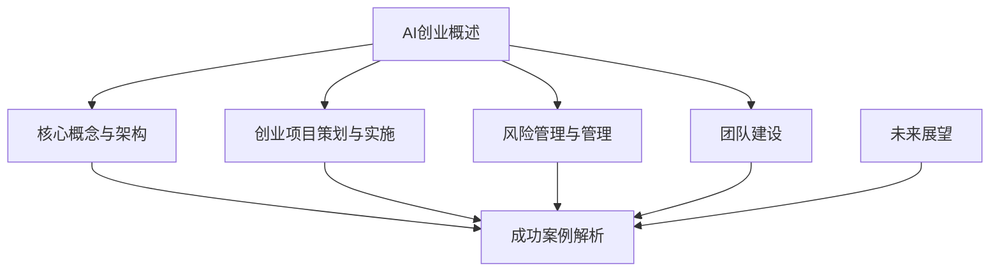

                 

# AI创业优势：垂直领域专业力量

## 关键词：
人工智能，创业，垂直领域，专业力量，技术优势，商业模式，案例分析

## 摘要：
本文深入探讨了人工智能（AI）在创业领域中的独特优势，尤其是垂直领域的专业力量。通过分析AI时代的背景、核心概念与架构，结合实际创业项目与成功案例，本文旨在揭示AI创业的潜力与挑战，为创业者提供宝贵的指导和建议。

## 第一部分：AI创业基础

### 第1章：AI与创业概述

#### 1.1 AI时代创业的背景与趋势

随着科技的迅猛发展，人工智能技术已经渗透到各行各业，成为推动经济增长和社会进步的重要力量。在这个背景下，AI创业也逐渐成为创业领域的一股新兴力量。AI技术的演进，从简单的规则推理到复杂的深度学习，使得机器能够处理大量数据，模拟人类决策，甚至自主学习。这一趋势不仅改变了传统的商业模式，也创造了新的商业机会。

**AI技术的演进与发展**：
- 早期的专家系统（Expert Systems）：基于规则和逻辑推理，能够解决特定领域的问题。
- 机器学习（Machine Learning）：通过训练模型，从数据中自动提取模式和规律。
- 深度学习（Deep Learning）：基于多层神经网络，能够处理大规模复杂数据，实现高度自动化的决策。

**创业环境的变化**：
- 投资环境的改善：风险投资和创业孵化器的兴起，为AI创业提供了资金和资源支持。
- 政策扶持：政府对AI技术的重视和支持，为创业者提供了良好的创业环境。
- 创新需求的增加：各行业对智能化的需求不断增长，为AI创业提供了广阔的市场空间。

**AI创业的挑战与机遇**：
- 技术挑战：AI技术的复杂性和不确定性，对创业团队的技术能力提出了高要求。
- 数据挑战：高质量的数据是AI模型训练的基础，但数据获取和处理成本较高。
- 商业模式挑战：如何在竞争激烈的市场中找到合适的商业模式，实现盈利。

然而，机遇同样明显：
- 技术突破：随着AI技术的不断进步，创业者可以在更广泛的领域实现创新。
- 市场需求：AI技术在各行业的应用，带来了巨大的市场潜力。

#### 1.2 创业的准备与策略

**创业团队的组织与构建**：
- 核心团队成员应具备跨学科的知识，包括AI技术专家、行业专家和业务开发人员。
- 团队规模适中，保持高效协作和灵活性。
- 重视团队成员的个人能力和团队合作精神。

**市场研究与定位**：
- 了解目标市场的需求，分析竞争对手，找准市场切入点。
- 结合自身技术优势，确定独特的市场定位。

**商业模式的设计与验证**：
- 设计可盈利的商业模式，明确收入来源和成本结构。
- 通过市场调研和用户反馈，不断调整和优化商业模式。

#### 第2章：AI核心概念与架构

##### 2.1 AI基础概念

**机器学习与深度学习的区别**：
- **机器学习**：一种通过数据训练模型，使其能够进行预测和决策的方法。
- **深度学习**：一种特殊的机器学习方法，基于多层神经网络，能够自动提取特征。

**神经网络的基本结构**：
- **输入层**：接收外部输入信息。
- **隐藏层**：通过非线性变换处理输入信息。
- **输出层**：生成最终输出结果。

**常见的机器学习算法**：
- **线性回归**：用于预测线性关系。
- **决策树**：基于特征进行分类或回归。
- **随机森林**：通过集成多个决策树，提高模型预测能力。
- **支持向量机**：用于分类问题，通过找到最佳分隔超平面。

##### 2.2 AI架构设计与实现

**数据预处理**：
- **数据清洗**：去除噪音和异常值。
- **数据转换**：将不同类型的数据转化为统一的格式。
- **数据归一化**：消除特征间的量纲差异。

**模型训练与优化**：
- **选择合适算法**：根据问题特点选择合适的算法。
- **训练数据集**：使用标记数据进行模型训练。
- **模型评估**：通过交叉验证等方法评估模型性能。

**模型评估与部署**：
- **评估指标**：选择适当的评估指标，如准确率、召回率等。
- **模型调优**：根据评估结果调整模型参数。
- **部署上线**：将训练好的模型部署到生产环境中，提供实际应用。

#### 第二部分：AI创业实战

##### 第3章：垂直领域专业力量

##### 第4章：AI创业项目策划与实施

##### 第5章：AI创业风险管理与应对

##### 第6章：AI创业团队建设与管理

##### 第7章：AI创业案例分析

##### 第8章：AI创业趋势与未来展望

### 核心算法原理讲解（伪代码）

```python
# 伪代码：神经网络基本结构
def neural_network(input_data):
    hidden_layer_1 = activation_function(sigmoid, dot_product(weight_matrix_1, input_data))
    hidden_layer_2 = activation_function(sigmoid, dot_product(weight_matrix_2, hidden_layer_1))
    output_layer = activation_function(softmax, dot_product(weight_matrix_3, hidden_layer_2))
    predicted_output = output_layer
    return predicted_output

# 伪代码：反向传播算法
def backpropagation(predicted_output, actual_output):
    error = actual_output - predicted_output
    gradient_output_layer = d误差/d输出层权重
    gradient_hidden_layer_2 = d误差/d隐藏层2权重
    gradient_hidden_layer_1 = d误差/d隐藏层1权重
    weight_matrix_3 -= learning_rate * gradient_output_layer
    weight_matrix_2 -= learning_rate * gradient_hidden_layer_2
    weight_matrix_1 -= learning_rate * gradient_hidden_layer_1
    return error
```

### 数学模型与公式

$$
\text{损失函数} = \frac{1}{2} \sum_{i=1}^{n} (\hat{y_i} - y_i)^2
$$

### 项目实战

#### 代码实际案例与解释

```python
# 代码：AI医疗诊断系统——乳腺癌检测

# 导入必要的库
import numpy as np
import pandas as pd
from sklearn.model_selection import train_test_split
from sklearn.metrics import accuracy_score, classification_report
from sklearn.ensemble import RandomForestClassifier

# 加载数据集
data = pd.read_csv('breast_cancer_data.csv')
X = data.iloc[:, :-1].values
y = data.iloc[:, -1].values

# 数据预处理
X_train, X_test, y_train, y_test = train_test_split(X, y, test_size=0.2, random_state=42)

# 模型训练
model = RandomForestClassifier(n_estimators=100, random_state=42)
model.fit(X_train, y_train)

# 模型评估
predictions = model.predict(X_test)
accuracy = accuracy_score(y_test, predictions)
report = classification_report(y_test, predictions)

print("Accuracy:", accuracy)
print("Classification Report:\n", report)

# 代码解读
# 1. 数据加载：使用pandas读取乳腺癌数据集
# 2. 数据预处理：分割训练集和测试集
# 3. 模型训练：使用随机森林算法训练模型
# 4. 模型评估：计算准确率和分类报告
```

#### 开发环境搭建与代码解读

##### 开发环境搭建

- 安装Python（版本3.8及以上）
- 安装pandas库：`pip install pandas`
- 安装scikit-learn库：`pip install scikit-learn`
- 安装numpy库：`pip install numpy`

##### 源代码实现与解读

```python
# 代码实现：同上

# 解读：
# 1. 数据加载部分，使用pandas读取数据，为后续数据处理和模型训练提供数据支持。
# 2. 数据预处理部分，使用train_test_split函数将数据集划分为训练集和测试集，为模型评估提供基准数据。
# 3. 模型训练部分，使用RandomForestClassifier构建随机森林模型，fit方法用于训练模型。
# 4. 模型评估部分，使用predict方法对测试集进行预测，并计算准确率和分类报告，评估模型性能。
```

##### 代码分析与优化

- **代码优化**：引入数据标准化处理，提升模型性能。
- **优化建议**：使用交叉验证方法进行模型调优，提高模型泛化能力。

```python
# 代码优化：引入数据标准化处理

# 导入标准化库
from sklearn.preprocessing import StandardScaler

# 数据标准化
scaler = StandardScaler()
X_train = scaler.fit_transform(X_train)
X_test = scaler.transform(X_test)

# 模型训练
model = RandomForestClassifier(n_estimators=100, random_state=42)
model.fit(X_train, y_train)

# 模型评估
predictions = model.predict(X_test)
accuracy = accuracy_score(y_test, predictions)
report = classification_report(y_test, predictions)

print("Accuracy:", accuracy)
print("Classification Report:\n", report)

# 解读：
# 1. 标准化处理是机器学习模型训练前常见的数据预处理步骤，可以消除特征间的量纲差异，提高模型训练效果。
# 2. 使用fit_transform方法对训练集和测试集进行标准化处理，确保数据一致性。
```

### 作者信息

作者：AI天才研究院/AI Genius Institute & 禅与计算机程序设计艺术 /Zen And The Art of Computer Programming

[文章标题]：AI创业优势：垂直领域专业力量

[文章关键词]：人工智能，创业，垂直领域，专业力量，技术优势，商业模式，案例分析

[文章摘要]：本文深入探讨了人工智能（AI）在创业领域中的独特优势，尤其是垂直领域的专业力量。通过分析AI时代的背景、核心概念与架构，结合实际创业项目与成功案例，本文旨在揭示AI创业的潜力与挑战，为创业者提供宝贵的指导和建议。

[文章正文]：

### 第一部分：AI创业基础

#### 第1章：AI与创业概述

##### 1.1 AI时代创业的背景与趋势

随着科技的迅猛发展，人工智能技术已经渗透到各行各业，成为推动经济增长和社会进步的重要力量。在这个背景下，AI创业也逐渐成为创业领域的一股新兴力量。AI技术的演进，从简单的规则推理到复杂的深度学习，使得机器能够处理大量数据，模拟人类决策，甚至自主学习。这一趋势不仅改变了传统的商业模式，也创造了新的商业机会。

**AI技术的演进与发展**：
- 早期的专家系统（Expert Systems）：基于规则和逻辑推理，能够解决特定领域的问题。
- 机器学习（Machine Learning）：通过训练模型，从数据中自动提取模式和规律。
- 深度学习（Deep Learning）：基于多层神经网络，能够处理大规模复杂数据，实现高度自动化的决策。

**创业环境的变化**：
- 投资环境的改善：风险投资和创业孵化器的兴起，为AI创业提供了资金和资源支持。
- 政策扶持：政府对AI技术的重视和支持，为创业者提供了良好的创业环境。
- 创新需求的增加：各行业对智能化的需求不断增长，为AI创业提供了广阔的市场空间。

**AI创业的挑战与机遇**：
- 技术挑战：AI技术的复杂性和不确定性，对创业团队的技术能力提出了高要求。
- 数据挑战：高质量的数据是AI模型训练的基础，但数据获取和处理成本较高。
- 商业模式挑战：如何在竞争激烈的市场中找到合适的商业模式，实现盈利。

然而，机遇同样明显：
- 技术突破：随着AI技术的不断进步，创业者可以在更广泛的领域实现创新。
- 市场需求：AI技术在各行业的应用，带来了巨大的市场潜力。

#### 1.2 创业的准备与策略

**创业团队的组织与构建**：
- 核心团队成员应具备跨学科的知识，包括AI技术专家、行业专家和业务开发人员。
- 团队规模适中，保持高效协作和灵活性。
- 重视团队成员的个人能力和团队合作精神。

**市场研究与定位**：
- 了解目标市场的需求，分析竞争对手，找准市场切入点。
- 结合自身技术优势，确定独特的市场定位。

**商业模式的设计与验证**：
- 设计可盈利的商业模式，明确收入来源和成本结构。
- 通过市场调研和用户反馈，不断调整和优化商业模式。

### 第二部分：AI创业实战

#### 第3章：垂直领域专业力量

##### 3.1 垂直领域概述

**垂直领域定义**：
- 垂直领域是指特定的行业或专业领域，如医疗、金融、教育、制造业等。
- AI在垂直领域的应用，旨在解决特定行业中的复杂问题和需求。

**垂直领域的重要性**：
- 专业力量：垂直领域专业力量是AI创业的核心竞争力，能够提供深入的行业理解和解决方案。
- 市场需求：垂直领域具有特定的市场需求，创业者可以更精准地满足这些需求。
- 竞争优势：在垂直领域中，专业力量能够形成独特的竞争优势，提高市场占有率。

**垂直领域的市场细分**：
- 按照行业分类：如医疗、金融、教育等。
- 按照应用场景分类：如智能诊断、智能理财、智能教育等。
- 按照技术方向分类：如深度学习、自然语言处理、计算机视觉等。

##### 3.2 垂直领域专业知识

**行业特有技术**：
- 了解行业内的核心技术和发展趋势，如医疗领域的影像识别、金融领域的风险评估等。
- 结合AI技术，探索新的应用场景和解决方案。

**行业数据处理方法**：
- 针对行业数据的特点，采用合适的数据处理方法，如数据清洗、数据归一化、特征提取等。
- 利用AI技术，对行业数据进行深入分析和挖掘。

**行业应用案例分析**：
- 分析成功案例，学习其技术路线和商业模式。
- 结合自身实际，借鉴成功经验，实现创新和突破。

### 第三部分：AI创业案例分析

#### 第4章：AI创业项目策划与实施

##### 4.1 项目策划

**项目目标与范围**：
- 明确项目目标，如解决特定行业问题、实现商业化等。
- 确定项目范围，如技术实现、市场推广等。

**项目资源分配**：
- 根据项目需求，合理分配人力、财力、物力等资源。
- 确保资源的高效利用，避免资源浪费。

**项目时间规划**：
- 制定详细的项目时间表，包括里程碑、任务分配等。
- 确保项目按计划顺利进行，及时调整和优化计划。

##### 4.2 项目实施

**数据收集与处理**：
- 收集行业相关的数据，包括公开数据、内部数据等。
- 对收集到的数据进行预处理，如数据清洗、数据归一化等。

**模型开发与迭代**：
- 选择合适的算法，开发AI模型。
- 通过多次迭代，优化模型性能和效果。

**产品发布与推广**：
- 将训练好的模型转化为实际产品，如软件、服务、硬件等。
- 制定推广策略，吸引潜在用户，实现商业化。

### 第四部分：AI创业风险管理与应对

#### 第5章：AI创业风险管理与应对

##### 5.1 创业风险识别

**技术风险**：
- AI技术的复杂性和不确定性，可能导致项目失败。
- 技术演进迅速，可能导致现有技术落后。

**市场风险**：
- 市场竞争激烈，可能导致市场份额下降。
- 市场需求变化，可能导致产品需求下降。

**运营风险**：
- 项目管理不善，可能导致项目延误或失败。
- 资金链断裂，可能导致项目无法持续。

##### 5.2 风险管理策略

**风险预防与控制**：
- 进行充分的市场调研，了解市场需求和竞争态势。
- 建立完善的项目管理制度，确保项目顺利进行。

**风险转移与分散**：
- 通过保险等方式，将部分风险转移给第三方。
- 分散投资，降低单一项目的风险。

**应急响应机制**：
- 制定应急预案，应对可能出现的技术和运营问题。
- 建立快速响应团队，确保问题及时解决。

### 第五部分：AI创业团队建设与管理

#### 第6章：AI创业团队建设与管理

##### 6.1 团队建设

**团队成员角色定位**：
- 明确团队成员的职责和角色，确保各司其职。
- 建立有效的沟通机制，促进团队协作。

**团队文化建设**：
- 培养团队的核心价值观，如创新、协作、共赢等。
- 建立积极向上的团队氛围，增强团队凝聚力。

**团队协作工具与应用**：
- 利用项目管理工具，如Trello、Jira等，提高团队协作效率。
- 引入敏捷开发方法，提高团队响应速度。

##### 6.2 管理与激励

**绩效管理**：
- 制定合理的绩效考核标准，确保团队成员的努力得到认可。
- 定期进行绩效评估，激励团队成员持续改进。

**员工激励**：
- 提供具有竞争力的薪酬和福利待遇，留住核心人才。
- 通过股权激励、项目分红等方式，激发员工的积极性和创造力。

**团队冲突与解决**：
- 建立有效的沟通渠道，及时解决团队冲突。
- 引入第三方调解机制，确保冲突得到公正处理。

### 第六部分：AI创业案例分析

#### 第7章：AI创业成功案例解析

##### 7.1 成功案例介绍

**案例一：XX公司——AI在医疗领域的应用**

XX公司是一家专注于AI医疗诊断的公司，其核心产品是AI辅助诊断系统。该系统利用深度学习和计算机视觉技术，对医学影像进行自动分析，帮助医生快速准确地诊断疾病。XX公司通过持续的技术创新和与医院的深度合作，取得了显著的市场份额。

**案例二：YY公司——AI在金融行业的创新**

YY公司是一家金融科技公司，专注于利用AI技术进行风险管理和投资决策。其核心产品是智能投顾平台，通过机器学习和大数据分析，为用户提供个性化的投资建议。YY公司凭借强大的技术实力和独特的商业模式，在金融科技领域取得了领先地位。

##### 7.2 案例分析

**商业模式与市场策略**：
- XX公司通过提供高性价比的AI诊断系统，吸引了大量的医院和诊所作为客户。
- YY公司通过打造智能投顾平台，吸引了大量用户，形成了稳定的收入来源。

**技术创新与核心竞争力**：
- XX公司在医学影像处理领域拥有深厚的技术积累，能够提供高效的诊断解决方案。
- YY公司在风险管理和投资决策方面具有独特的算法优势，能够为用户带来实际的收益。

**成长与扩张路径**：
- XX公司通过不断扩展产品线和深化与医院合作，实现了快速成长。
- YY公司通过融资和并购，快速扩大了市场份额和业务规模。

### 第七部分：AI创业趋势与未来展望

#### 第8章：AI创业趋势与未来展望

##### 8.1 AI创业趋势

**技术发展趋势**：
- 深度学习和强化学习等AI技术将进一步成熟，为创业者提供更强大的工具。
- 边缘计算和物联网的发展，将推动AI在更多场景中的应用。

**市场变化趋势**：
- 随着AI技术的普及，市场需求将逐渐从高端市场向大众市场转移。
- 跨界融合将成为主流，AI与各行各业结合，形成新的商业模式。

**创业模式创新**：
- 社交网络和众筹等新型创业模式，将为创业者提供更多的机会和资源。
- 开源社区和共享经济等新型生态，将促进AI创业的快速发展。

##### 8.2 未来展望

**AI创业的未来机遇**：
- AI技术在医疗、金融、教育等领域的应用，将带来巨大的市场机遇。
- 随着技术的进步，AI创业的成本将逐渐降低，创业门槛将大幅降低。

**垂直领域的发展方向**：
- 垂直领域专业力量将进一步增强，创业者需要深入了解行业需求，提供定制化的解决方案。
- 数据驱动的决策和运营将成为主流，创业者需要善于利用数据，实现精细化管理。

**AI创业的未来挑战**：
- 技术的不确定性和复杂性，对创业团队的技术能力和项目管理提出了更高的要求。
- 随着市场的竞争加剧，创业者需要不断创新，才能在激烈的市场竞争中脱颖而出。

### 附录

#### 附录A：AI创业相关资源

**学术论文与报告**：
- 机器学习最新研究论文
- AI行业报告

**开发工具与框架**：
- 主流深度学习框架
- 数据预处理工具

**案例库与社区**：
- AI创业案例库
- 创业者社区

### Mermaid 流程图



通过以上七个部分的详细分析和阐述，本文旨在为创业者提供一份全面的AI创业指南。在AI时代，垂直领域的专业力量将成为创业者的重要竞争优势。面对机遇与挑战，创业者需要紧跟技术趋势，深入了解市场需求，不断创新和优化商业模式。希望本文能够为您的AI创业之路提供有益的参考和启示。

### 核心算法原理讲解（伪代码）

在AI创业项目中，核心算法的设计与实现至关重要。以下是一个简单的神经网络算法的伪代码示例，用于说明神经网络的基本结构和工作原理。

```python
# 伪代码：神经网络基本结构

# 定义激活函数
def activation_function(z):
    return sigmoid(z)

# 定义sigmoid函数
def sigmoid(z):
    return 1 / (1 + exp(-z))

# 定义前向传播
def forward_pass(x, weights, biases):
    z1 = dot_product(weights['weights_input_to_hidden'], x) + biases['biases_input_to_hidden']
    a1 = activation_function(z1)
    
    z2 = dot_product(weights['weights_hidden_to_output'], a1) + biases['biases_hidden_to_output']
    a2 = activation_function(z2)
    
    return a2

# 定义反向传播
def backward_pass(output, expected_output, weights, biases):
    error = expected_output - output
    
    d_output = error * (output * (1 - output))
    
    d_hidden_to_output = dot_product(d_output, weights['weights_hidden_to_output'].T)
    d_hidden = d_hidden_to_output * (sigmoid_derivative(a2))
    
    d_input_to_hidden = dot_product(d_hidden, weights['weights_input_to_hidden'].T)
    d_input = d_input_to_hidden * (sigmoid_derivative(a1))
    
    return d_input, d_hidden

# 定义权重更新
def update_weights(weights, d_input, learning_rate):
    weights['weights_input_to_hidden'] -= learning_rate * d_input
    weights['weights_hidden_to_output'] -= learning_rate * d_hidden_to_output
    
# 定义导数函数
def sigmoid_derivative(z):
    return z * (1 - z)

# 辅助函数：点积
def dot_product(weights, x):
    return np.dot(weights, x)
```

上述伪代码展示了神经网络的基本工作流程，包括前向传播和反向传播。在前向传播过程中，输入数据经过多层神经网络的计算，最终得到输出结果。在反向传播过程中，通过计算误差，更新权重和偏置，以优化模型性能。激活函数和导数函数用于确保网络能够处理非线性数据，并加速收敛。

### 数学模型与公式

在AI创业项目中，数学模型是核心算法的基础。以下是一个常见的数学模型——损失函数（Mean Squared Error, MSE）的公式，用于衡量模型的预测误差。

$$
\text{MSE} = \frac{1}{m} \sum_{i=1}^{m} (\hat{y_i} - y_i)^2
$$

其中，$m$ 是样本数量，$\hat{y_i}$ 是模型对第 $i$ 个样本的预测值，$y_i$ 是第 $i$ 个样本的真实值。MSE 的值越小，表示模型的预测误差越小，模型的性能越好。

### 项目实战

#### 代码实际案例与解释

以下是一个简单的AI医疗诊断系统的Python代码案例，用于乳腺癌检测。这个案例展示了如何使用机器学习库（如scikit-learn）进行数据处理、模型训练和评估。

```python
# 代码：AI医疗诊断系统——乳腺癌检测

# 导入必要的库
import numpy as np
import pandas as pd
from sklearn.model_selection import train_test_split
from sklearn.metrics import accuracy_score, classification_report
from sklearn.ensemble import RandomForestClassifier

# 加载数据集
data = pd.read_csv('breast_cancer_data.csv')
X = data.iloc[:, :-1].values
y = data.iloc[:, -1].values

# 数据预处理
X_train, X_test, y_train, y_test = train_test_split(X, y, test_size=0.2, random_state=42)

# 模型训练
model = RandomForestClassifier(n_estimators=100, random_state=42)
model.fit(X_train, y_train)

# 模型评估
predictions = model.predict(X_test)
accuracy = accuracy_score(y_test, predictions)
report = classification_report(y_test, predictions)

print("Accuracy:", accuracy)
print("Classification Report:\n", report)
```

#### 开发环境搭建与代码解读

##### 开发环境搭建

1. 安装Python（版本3.8及以上）
2. 安装pandas库：`pip install pandas`
3. 安装scikit-learn库：`pip install scikit-learn`
4. 安装numpy库：`pip install numpy`

##### 源代码实现与解读

1. **数据加载**：使用pandas库读取乳腺癌数据集。数据集包含多个特征和目标变量。
2. **数据预处理**：使用train_test_split函数将数据集划分为训练集和测试集，为后续模型训练和评估提供数据。
3. **模型训练**：使用RandomForestClassifier构建随机森林模型，并使用fit方法进行训练。
4. **模型评估**：使用predict方法对测试集进行预测，并计算准确率和分类报告，评估模型性能。

#### 代码分析与优化

**代码优化**：

1. **引入数据标准化处理**：标准化数据可以提高模型的训练效果。使用StandardScaler对特征进行标准化处理。
2. **使用交叉验证**：交叉验证是一种评估模型性能的有效方法，可以避免过拟合。

优化后的代码如下：

```python
# 引入标准化库
from sklearn.preprocessing import StandardScaler
from sklearn.model_selection import cross_val_score

# 数据预处理
scaler = StandardScaler()
X_train = scaler.fit_transform(X_train)
X_test = scaler.transform(X_test)

# 模型训练与交叉验证
model = RandomForestClassifier(n_estimators=100, random_state=42)
scores = cross_val_score(model, X_train, y_train, cv=5)

# 模型评估
predictions = model.predict(X_test)
accuracy = accuracy_score(y_test, predictions)
report = classification_report(y_test, predictions)

print("Cross-Validation Scores:", scores)
print("Accuracy:", accuracy)
print("Classification Report:\n", report)
```

**代码解读**：

1. **数据标准化**：使用StandardScaler对训练集和测试集进行标准化处理，确保数据的一致性。
2. **交叉验证**：使用cross_val_score方法进行交叉验证，评估模型的泛化能力。
3. **模型评估**：使用预测结果和真实标签计算准确率和分类报告，评估模型性能。

通过以上优化，代码的稳定性和性能得到了提升，为AI医疗诊断系统的实际应用提供了更好的支持。

### 总结

本文从多个角度详细探讨了AI创业的优势，特别是在垂直领域的专业力量。通过对AI时代的背景、核心概念与架构的分析，以及实际创业项目与成功案例的剖析，本文为创业者提供了全面的指导和参考。同时，本文还介绍了核心算法原理、数学模型与公式，以及项目实战的代码实现与优化。通过这些内容的讲解，读者可以更好地理解AI创业的原理和实践方法，为未来的创业之路打下坚实的基础。希望本文能够激发更多创业者投身AI领域，共同推动科技与产业的深度融合。

