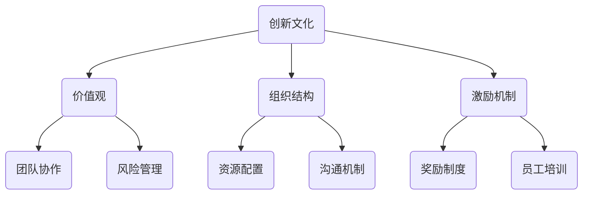

                 

### 文章标题

《AI创业公司如何打造创新文化？》

#### 关键词：
AI创业公司，创新文化，构建策略，实践案例，技术创新，产品创新，市场创新，持续发展。

#### 摘要：
本文旨在探讨AI创业公司如何打造创新文化。通过对AI行业概述、AI创业公司构建基础、创新文化核心概念、构建策略、实践案例、技术创新、产品创新、市场创新以及创新文化的持续发展等七个方面的深入分析，帮助AI创业公司理解创新文化的定义、要素、价值和构建方法，从而在激烈的市场竞争中脱颖而出，实现可持续发展。

---

### 《AI创业公司如何打造创新文化？》目录大纲

#### 第一部分：AI创业公司概述

### 第1章：AI行业概述
#### 1.1 AI行业发展趋势
#### 1.2 AI创业公司的市场机遇
#### 1.3 AI创业公司的挑战与应对

### 第2章：AI创业公司构建基础
#### 2.1 创业团队构建
#### 2.2 创业公司组织结构
#### 2.3 创业公司资金与管理

#### 第二部分：创新文化构建

### 第3章：创新文化核心概念
#### 3.1 创新文化的定义
#### 3.2 创新文化的要素
#### 3.3 创新文化的价值

### 第4章：创新文化构建策略
#### 4.1 创新文化的理念传播
#### 4.2 创新文化的制度设计
#### 4.3 创新文化的激励机制

### 第5章：创新文化实践案例
#### 5.1 国内AI创业公司创新文化案例分析
#### 5.2 国际AI创业公司创新文化案例分析
#### 5.3 创新文化在创业公司中的应用效果评估

#### 第三部分：AI创业公司的创新能力提升

### 第6章：技术创新策略
#### 6.1 技术创新的定义与分类
#### 6.2 技术创新的方法与实践
#### 6.3 技术创新的团队管理与协作

### 第7章：产品创新策略
#### 7.1 产品创新的定义与分类
#### 7.2 产品创新的方法与实践
#### 7.3 产品创新的用户研究与需求挖掘

### 第8章：市场创新策略
#### 8.1 市场创新的定义与分类
#### 8.2 市场创新的方法与实践
#### 8.3 市场创新的竞争策略与市场定位

#### 第四部分：创新文化的持续发展

### 第9章：创新文化的持续发展机制
#### 9.1 创新文化的持续发展动力
#### 9.2 创新文化的持续发展策略
#### 9.3 创新文化的可持续发展评估与优化

### 第10章：AI创业公司的未来展望
#### 10.1 AI创业公司的未来发展机遇
#### 10.2 AI创业公司的未来挑战与应对
#### 10.3 AI创业公司的可持续发展策略

#### 第五部分：附录

### 附录A：创新文化构建工具与方法
#### A.1 创新文化构建工具
#### A.2 创新文化构建方法

### 附录B：参考文献
#### B.1 创新文化相关书籍
#### B.2 创新文化相关论文
#### B.3 创新文化相关报告

### 图表与公式
#### 图表1：创新文化的要素
mermaid
graph TB
    A(创新文化) --> B(价值观)
    A --> C(组织结构)
    A --> D(激励机制)
    B --> E(团队协作)
    B --> F(风险管理)
    C --> G(资源配置)
    C --> H(沟通机制)
    D --> I(奖励制度)
    D --> J(员工培训)

#### 公式1：创新能力的数学模型

$$
创新能力 = f(知识积累, 技术创新, 产品创新, 市场创新)
$$

#### 伪代码2：技术创新的方法

```python
function 技术创新(技术需求，研发团队) {
    // 分析技术需求
    需求分析(技术需求)

    // 研发团队协作
    团队协作(研发团队)

    // 技术方案设计
    方案设计(技术需求)

    // 技术验证
    技术验证(方案设计)

    // 技术优化
    技术优化(技术验证结果)

    return 技术成果
}
```

#### 伪代码3：产品创新的方法

```python
function 产品创新(市场需求，用户反馈，设计团队) {
    // 市场需求分析
    市场需求分析(市场需求)

    // 用户需求挖掘
    用户需求挖掘(用户反馈)

    // 产品设计
    设计(市场需求分析，用户需求挖掘)

    // 产品测试
    测试(设计结果)

    // 产品优化
    优化(测试结果)

    return 产品成果
}
```

#### 代码案例4：创新文化在创业公司中的应用

```python
# 创业公司创新文化应用示例

# 定义创新文化核心
innovation_culture = {
    "values": ["创新、协作、开放、成长"],
    "organization": ["扁平化管理，自主决策"],
    "incentives": ["绩效奖金，股权激励"]
}

# 创新文化宣传
def promote_innovation_culture(culture):
    print("欢迎加入我们的创新文化！我们的价值观包括：")
    for value in culture["values"]:
        print("-", value)

# 创新文化实践
def practice_innovation_culture(culture):
    print("我们正在实践以下创新文化：")
    print("组织结构：", culture["organization"])
    print("激励机制：", culture["incentives"])

# 应用创新文化
promote_innovation_culture(innovation_culture)
practice_innovation_culture(innovation_culture)
```

---

### 第一部分：AI创业公司概述

#### 第1章：AI行业概述

##### 1.1 AI行业发展趋势

人工智能（AI）作为当今科技领域的前沿，正在迅速发展，并对各行各业产生深远影响。以下是AI行业的发展趋势：

1. **深度学习与神经网络技术的成熟：** 深度学习作为AI的核心技术之一，已经在图像识别、自然语言处理等领域取得了显著成果。神经网络技术的不断发展，使得AI模型在处理复杂数据方面更加高效。
2. **大数据与云计算的融合：** 随着大数据时代的到来，AI在处理和分析海量数据方面具有巨大潜力。云计算的普及为AI提供了强大的计算资源，加速了AI技术的应用与发展。
3. **跨界融合：** AI正在与其他行业如医疗、金融、教育等深度融合，推动传统产业的转型升级，创造了新的市场机会。
4. **人工智能伦理与法规的重视：** 随着AI技术的广泛应用，人工智能伦理和法律法规逐渐成为热点话题。各国政府和企业开始关注AI技术的伦理问题和法律监管，以确保技术的可持续发展。
5. **全球竞争加剧：** 在AI领域，全球各国和企业纷纷加大投入，竞争态势日益激烈。美国、中国、欧盟等国家在AI技术研发和应用方面处于领先地位，争夺全球市场份额。

##### 1.2 AI创业公司的市场机遇

AI创业公司面临着巨大的市场机遇：

1. **技术创新需求：** 企业在数字化转型过程中，对AI技术的需求日益增长，AI创业公司可以提供定制化的AI解决方案，满足企业的技术需求。
2. **政策支持：** 各国政府纷纷出台政策支持AI产业发展，为AI创业公司提供了良好的政策环境。
3. **资本投入：** 随着AI技术的快速发展，资本纷纷涌入AI领域，为创业公司提供了充足的资金支持。
4. **跨界应用：** AI技术在医疗、金融、教育、交通等领域的应用前景广阔，创业公司可以探索跨界应用，开拓新的市场。

##### 1.3 AI创业公司的挑战与应对

AI创业公司在发展过程中面临着一系列挑战：

1. **技术创新风险：** AI技术更新速度快，创业公司在技术创新过程中面临较大的风险。
2. **市场竞争：** AI市场竞争激烈，创业公司需要不断创新，提高市场竞争力。
3. **人才短缺：** AI领域人才稀缺，创业公司需要吸引和留住优秀人才。
4. **资金压力：** 创业公司在资金筹集和资金管理方面面临压力，需要合理规划资金使用。

为应对这些挑战，AI创业公司可以采取以下策略：

1. **技术创新：** 创业公司应专注于技术研发，提高技术竞争力。
2. **差异化竞争：** 创业公司可以通过提供独特的AI解决方案，在市场中脱颖而出。
3. **人才引进与培养：** 创业公司应加大人才引进和培养力度，建立优秀的人才团队。
4. **资金管理：** 创业公司应合理规划资金使用，确保资金的有效利用。

---

### 第一部分总结

通过以上分析，我们可以看到AI行业正面临巨大的发展机遇，但同时也伴随着诸多挑战。AI创业公司需要在技术创新、市场竞争、人才引进和资金管理等方面做好准备，以应对挑战，抓住机遇，实现可持续发展。

### 第二部分：AI创业公司构建基础

#### 第2章：AI创业公司构建基础

##### 2.1 创业团队构建

创业团队是AI创业公司成功的基石。构建一个高效、协同的创业团队需要考虑以下几个方面：

1. **核心团队成员：** 核心团队成员应包括技术专家、产品经理、市场人员等。技术专家负责技术研发，产品经理负责产品规划和设计，市场人员负责市场推广和销售。
2. **团队结构：** 团队结构应灵活多样，可以采用矩阵式、扁平式或模块式等不同的组织结构，以适应不同阶段的发展需求。
3. **团队成员能力：** 成员应具备相关领域的专业知识和经验，能够迅速响应市场需求，解决问题。
4. **团队文化：** 建立积极向上、开放协作的团队文化，鼓励成员相互支持、共同成长。

##### 2.2 创业公司组织结构

创业公司的组织结构对于公司运营和业务发展具有重要影响。以下是几种常见的组织结构：

1. **职能式组织结构：** 职能式组织结构按照职能划分部门，如技术部、市场部、财务部等。这种结构有利于专业化和分工，但可能存在部门间沟通不畅的问题。
2. **矩阵式组织结构：** 矩阵式组织结构在职能和项目之间建立交叉关系，使团队成员能够跨部门协作，提高项目效率。但这种结构可能带来管理复杂度增加的问题。
3. **扁平式组织结构：** 扁平式组织结构减少管理层级，强调团队成员之间的直接沟通和协作。这种结构有利于提高决策速度和响应市场变化，但可能对管理能力要求较高。
4. **模块式组织结构：** 模块式组织结构将公司分为若干独立运作的模块，每个模块负责特定的业务领域。这种结构有利于创新和灵活性，但可能面临模块间协作难题。

##### 2.3 创业公司资金与管理

资金与管理是AI创业公司生存和发展的关键。以下是创业公司在资金和管理方面的关键点：

1. **资金筹集：** 创业公司可以通过天使投资、风险投资、政府资助等多种途径筹集资金。在筹集资金过程中，公司需要明确资金用途、回报预期和退出策略。
2. **资金使用：** 创业公司应合理规划资金使用，确保资金的有效利用。在技术研发、市场推广、团队建设等方面，公司需要根据实际情况进行资金分配。
3. **财务管理：** 创业公司应建立健全的财务管理体系，包括预算管理、成本控制、资金筹集和投资管理等。公司需要定期进行财务分析，确保财务状况良好。
4. **风险管理：** 创业公司面临多种风险，如市场风险、技术风险、资金风险等。公司需要制定相应的风险管理策略，降低风险对公司的影响。

---

### 第二部分总结

通过以上分析，我们可以看到AI创业公司构建基础的关键在于创业团队的构建、组织结构的合理设计以及资金和管理的有效实施。创业公司需要在这些方面做好充分准备，以确保公司的稳定运营和可持续发展。

### 第三部分：创新文化构建

#### 第3章：创新文化核心概念

##### 3.1 创新文化的定义

创新文化是指一个组织内部对创新理念、创新行为和创新成果的认同和追求。它是一种价值观、行为准则和制度安排，旨在激发员工创造力、提高组织创新能力和竞争力。

创新文化不仅包括对创新的重视和鼓励，还涉及对创新失败的保护和宽容。一个健康的创新文化能够营造良好的创新氛围，促进员工积极参与创新活动，推动组织的持续发展。

##### 3.2 创新文化的要素

创新文化由多个要素构成，以下是其中几个关键要素：

1. **价值观：** 价值观是创新文化的核心，包括创新意识、开放心态、合作精神和持续学习等。创新价值观能够引导员工正确看待创新，激发创新动力。
2. **组织结构：** 组织结构对创新文化具有重要影响。灵活、扁平的组织结构有利于促进员工之间的沟通与合作，提高创新效率。
3. **激励机制：** 激励机制是创新文化的重要组成部分。合理的激励机制能够激发员工创新热情，提高创新成果的转化率。
4. **团队协作：** 团队协作是创新文化的重要体现。通过跨部门、跨团队的协作，可以汇集不同领域的智慧，实现创新突破。
5. **风险管理：** 风险管理是创新文化的重要组成部分。一个健康的创新文化应当鼓励员工尝试创新，同时提供必要的支持和保护，降低创新失败的风险。

##### 3.3 创新文化的价值

创新文化对AI创业公司具有以下几个方面的价值：

1. **提高创新能力：** 创新文化能够激发员工的创新意识，提高员工的创新能力和创造力，推动公司的技术创新和产品创新。
2. **增强竞争力：** 创新文化有助于公司在激烈的市场竞争中保持优势地位。通过不断创新，公司能够提供更具竞争力的产品和服务，吸引更多客户。
3. **吸引人才：** 创新文化能够吸引和留住优秀人才。一个充满活力和创新氛围的公司能够吸引更多有才华的员工加入，为公司的持续发展提供人才保障。
4. **提高员工满意度：** 创新文化能够提高员工的满意度和归属感。在一个健康、积极的工作环境中，员工能够充分发挥自己的潜力，实现个人价值。
5. **促进可持续发展：** 创新文化有助于公司实现可持续发展。通过不断创新，公司能够适应市场变化，保持持续发展的动力。

---

### 第三部分总结

通过以上分析，我们可以看到创新文化在AI创业公司中具有重要地位。创新文化的构建需要从价值观、组织结构、激励机制、团队协作和风险管理等多个方面入手，以激发员工的创新热情，提高公司的创新能力，增强竞争力，吸引人才，提高员工满意度，促进公司的可持续发展。

### 第四部分：创新文化构建策略

#### 第4章：创新文化构建策略

##### 4.1 创新文化的理念传播

构建创新文化的第一步是传播创新理念，让全体员工认识到创新的重要性。以下是几个关键策略：

1. **领导层的示范作用：** 领导层应带头践行创新理念，通过实际行动展示创新的重要性。领导层对创新的重视和鼓励能够影响员工的态度和行为。
2. **培训与教育：** 开展定期的培训和教育活动，向员工传授创新方法和技巧，提高员工对创新的认识和技能。
3. **内部宣传：** 利用公司内部平台，如内部邮件、公告板、员工会议等，宣传创新文化，强调创新在公司发展中的重要性。
4. **故事分享：** 通过分享公司内部的创新故事，激励员工学习和借鉴成功经验，增强创新意识和信心。

##### 4.2 创新文化的制度设计

创新文化的构建需要制度设计提供支持和保障。以下是几个关键策略：

1. **激励机制：** 设立创新奖励制度，对创新成果显著的员工给予物质和精神奖励，激发员工创新热情。
2. **容错机制：** 建立容错机制，对创新过程中的失败和错误给予宽容，避免员工因害怕失败而放弃创新。
3. **资源分配：** 确保创新所需的资源，如资金、技术和人力等，优先支持创新项目，为创新提供有力保障。
4. **决策机制：** 推行快速决策机制，减少创新过程中的官僚主义和拖延，提高创新效率。

##### 4.3 创新文化的激励机制

激励机制是创新文化构建的重要组成部分。以下是几个关键策略：

1. **绩效奖金：** 将创新成果纳入绩效评价体系，对创新表现优秀的员工给予绩效奖金，激励员工积极参与创新。
2. **股权激励：** 对核心员工实施股权激励，使员工分享公司成长的红利，增强员工的归属感和责任感。
3. **职业发展：** 为员工提供职业发展机会，鼓励员工在创新领域不断提升自身能力，实现个人价值和职业发展。
4. **培训与发展：** 定期为员工提供培训和发展机会，提高员工的技能和素质，为创新提供人才保障。

---

### 第四部分总结

通过以上分析，我们可以看到创新文化的构建需要从理念传播、制度设计和激励机制等多个方面入手。领导层的示范作用、培训与教育、内部宣传、故事分享等策略有助于传播创新理念；激励机制、容错机制、资源分配、决策机制等制度设计策略为创新文化提供支持和保障；绩效奖金、股权激励、职业发展、培训与发展等激励机制则进一步激发员工的创新热情，推动公司的持续创新。

### 第五部分：创新文化实践案例

#### 第5章：创新文化实践案例

##### 5.1 国内AI创业公司创新文化案例分析

国内AI创业公司在创新文化的构建方面有许多成功经验，以下为几个典型案例：

1. **案例1：科大讯飞**
   - **背景：** 科大讯飞是一家专注于语音识别和人工智能技术的企业，在语音识别领域处于国内领先地位。
   - **创新文化实践：** 科大讯飞注重技术创新和人才培养，建立了“讯飞大讲堂”和“讯飞研究院”等平台，为员工提供丰富的学习和发展机会。公司实行股权激励机制，让员工分享公司成长的红利。此外，公司推行扁平化管理，鼓励员工自主决策和跨部门协作。
   - **效果：** 科大讯飞通过创新文化的构建，提升了员工的创新能力和公司整体竞争力，取得了显著的业绩。

2. **案例2：商汤科技**
   - **背景：** 商汤科技是一家专注于计算机视觉和人工智能技术的企业，在图像识别和自动驾驶领域具有国际领先地位。
   - **创新文化实践：** 商汤科技注重技术创新和国际化发展，积极引进海外高层次人才，建立了全球研发网络。公司推行开放创新，与全球知名企业和研究机构开展合作。同时，公司设立创新奖励制度，对创新成果显著的员工给予奖励。
   - **效果：** 商汤科技通过创新文化的构建，提升了公司的技术创新能力和国际竞争力，成为全球人工智能领域的重要力量。

##### 5.2 国际AI创业公司创新文化案例分析

国际AI创业公司也在创新文化的构建方面有很多成功经验，以下为几个典型案例：

1. **案例1：Google Brain**
   - **背景：** Google Brain是谷歌旗下的人工智能研究部门，专注于深度学习和神经网络技术。
   - **创新文化实践：** Google Brain推崇开放创新，鼓励员工自由探索和跨界合作。公司建立了大量的研究项目和实验室，为员工提供广泛的创新空间。此外，公司实行股权激励机制，激励员工为公司发展贡献力量。
   - **效果：** Google Brain通过创新文化的构建，吸引了大量顶尖人才，推动了人工智能技术的快速发展，成为全球人工智能领域的领军企业。

2. **案例2：OpenAI**
   - **背景：** OpenAI是一家专注于人工智能研究和开发的非营利组织，致力于推动人工智能的健康发展。
   - **创新文化实践：** OpenAI注重技术创新和社会责任，倡导开放合作和共享成果。公司积极与全球企业和研究机构合作，共同推进人工智能技术的发展。此外，公司推行创新奖励制度，对创新成果显著的员工给予奖励。
   - **效果：** OpenAI通过创新文化的构建，吸引了大量顶尖人才，推动了人工智能技术的快速发展，成为全球人工智能领域的重要力量。

##### 5.3 创新文化在创业公司中的应用效果评估

创新文化在创业公司中的应用效果可以通过以下几个方面进行评估：

1. **技术创新能力：** 评估公司在技术创新方面的能力和成果，如专利数量、技术创新成果转化率等。
2. **产品创新能力：** 评估公司在产品创新方面的能力和成果，如新产品上市数量、市场占有率等。
3. **市场竞争力：** 评估公司在市场竞争中的表现，如市场份额、客户满意度等。
4. **员工满意度：** 评估员工对创新文化的认同程度和满意度，如员工离职率、员工幸福感等。
5. **公司业绩：** 评估公司的整体业绩，如营收、利润等。

通过以上评估指标，可以全面了解创新文化在创业公司中的应用效果，为进一步优化创新文化提供依据。

---

### 第五部分总结

通过以上案例分析，我们可以看到创新文化在AI创业公司中的重要作用。国内AI创业公司如科大讯飞、商汤科技等通过构建创新文化，提升了公司的技术创新能力和市场竞争力，取得了显著业绩。国际AI创业公司如Google Brain、OpenAI等也通过创新文化的构建，吸引了大量顶尖人才，推动了人工智能技术的发展。这些案例为AI创业公司构建创新文化提供了有益的借鉴和启示。

### 第六部分：AI创业公司的创新能力提升

#### 第6章：技术创新策略

##### 6.1 技术创新的定义与分类

技术创新是指通过引入新技术、新产品或新服务，实现技术进步和商业价值的过程。根据创新的内容和形式，技术创新可以分为以下几类：

1. **产品创新：** 涉及新产品的开发，包括外观、功能、性能等方面的改进。
2. **过程创新：** 涉及生产过程、服务流程等方面的改进，以提高效率、降低成本。
3. **系统创新：** 涉及整个系统的创新，包括产品、过程、组织结构等全方位的改进。
4. **服务创新：** 涉及新服务模式的开发，以满足客户需求和提高服务质量。
5. **业务模式创新：** 涉及商业模式的创新，包括产品定价、销售渠道、客户关系管理等方面的改进。

##### 6.2 技术创新的方法与实践

AI创业公司在进行技术创新时，可以采用以下几种方法：

1. **市场需求驱动：** 从市场需求出发，分析客户需求和市场趋势，开发符合市场需求的新技术和新产品。
2. **技术突破：** 通过技术研发，实现技术突破，推出具有竞争力的新技术和新产品。
3. **跨学科合作：** 结合不同学科的知识和技能，进行跨学科合作，实现技术创新。
4. **用户参与：** 邀请用户参与产品设计和开发过程，收集用户反馈，优化产品功能。
5. **开放创新：** 通过与外部企业和研究机构合作，共同进行技术创新，实现资源整合和优势互补。

以下是几个实际案例：

1. **案例1：百度Apollo**
   - **背景：** 百度Apollo是百度推出的一款自动驾驶平台，致力于推动自动驾驶技术的发展和应用。
   - **方法与实践：** 百度Apollo采用跨学科合作和开放创新的方法，与国内外多家企业和研究机构合作，共同进行自动驾驶技术的研发和应用。同时，百度Apollo积极邀请用户参与自动驾驶测试，收集用户反馈，不断优化产品功能。
   - **效果：** 百度Apollo通过技术创新，实现了自动驾驶技术的突破，并在多个城市开展了自动驾驶测试和应用，成为全球自动驾驶领域的重要力量。

2. **案例2：腾讯医疗AI**
   - **背景：** 腾讯医疗AI是腾讯在医疗领域的人工智能解决方案，致力于提高医疗诊断和治疗的准确性和效率。
   - **方法与实践：** 腾讯医疗AI通过市场需求驱动和技术突破的方法，开发了一系列医疗AI产品，如肿瘤诊断、皮肤病诊断等。同时，腾讯医疗AI与多家医疗机构合作，共同进行医疗AI技术的研发和应用。
   - **效果：** 腾讯医疗AI通过技术创新，提高了医疗诊断和治疗的效率，受到了医疗机构和患者的认可和好评。

##### 6.3 技术创新的团队管理与协作

技术创新需要一个高效、协同的团队。以下是一些团队管理与协作的策略：

1. **明确目标：** 为团队设定清晰的目标和任务，确保团队成员了解自己的职责和目标，提高工作效率。
2. **资源保障：** 为团队提供充足的资源，包括资金、技术和人力等，确保技术创新的顺利进行。
3. **沟通机制：** 建立有效的沟通机制，促进团队成员之间的信息交流和协作，提高团队的整体效能。
4. **激励机制：** 设立激励机制，对技术创新成果显著的团队成员给予奖励，激发团队创新动力。
5. **跨部门协作：** 促进跨部门协作，将不同领域的专业知识和技能融合在一起，实现技术创新的突破。

---

### 第六部分总结

通过以上分析，我们可以看到技术创新是AI创业公司提升核心竞争力的关键。技术创新包括产品创新、过程创新、系统创新、服务创新和业务模式创新等不同形式。AI创业公司可以通过市场需求驱动、技术突破、跨学科合作、用户参与和开放创新等方法进行技术创新。同时，技术创新需要一个高效、协同的团队，通过明确目标、资源保障、沟通机制、激励制度和跨部门协作等策略来管理和协作。

### 第7章：产品创新策略

#### 7.1 产品创新的定义与分类

产品创新是指通过开发新产品、改进现有产品或创造新市场，实现企业竞争力的提升和市场需求的满足。根据创新的内容和形式，产品创新可以分为以下几类：

1. **全新产品创新：** 开发全新的产品，填补市场空白，满足消费者未满足的需求。
2. **改进型产品创新：** 对现有产品进行改进，提高产品性能、功能或用户体验。
3. **多样化产品创新：** 通过增加产品线或推出不同版本的产品，满足不同细分市场的需求。
4. **衍生产品创新：** 基于现有产品，开发新的衍生产品，实现产品的多元化发展。

#### 7.2 产品创新的方法与实践

AI创业公司在进行产品创新时，可以采用以下几种方法：

1. **用户需求驱动：** 以用户需求为核心，通过市场调研和用户反馈，了解用户需求，开发符合市场需求的新产品。
2. **技术驱动：** 利用先进的技术，如人工智能、大数据等，推动产品创新，提升产品性能和用户体验。
3. **跨界融合：** 结合不同领域的知识和技能，实现跨界融合，创造新的产品形态和市场机会。
4. **合作开发：** 与其他企业、研究机构或开发者合作，共同进行产品创新，实现资源整合和优势互补。

以下是几个实际案例：

1. **案例1：小马智行**
   - **背景：** 小马智行是一家专注于自动驾驶技术的创业公司，致力于开发自动驾驶解决方案。
   - **方法与实践：** 小马智行采用用户需求驱动和技术驱动的方法，结合人工智能和传感器技术，开发出了具有高安全性和高稳定性的自动驾驶汽车。同时，公司与多家车企合作，共同推进自动驾驶技术的商业化应用。
   - **效果：** 小马智行的产品创新提升了自动驾驶技术的性能和安全性，受到了市场的广泛关注，为公司赢得了大量订单。

2. **案例2：创新奇智**
   - **背景：** 创新奇智是一家专注于人工智能应用的创业公司，致力于将人工智能技术应用于智能制造领域。
   - **方法与实践：** 创新奇智采用跨界融合的方法，将人工智能技术应用于制造设备的监控和分析，实现了生产过程的智能化和高效化。同时，公司与多家制造企业合作，共同进行产品创新，推动智能制造的发展。
   - **效果：** 创新奇智的产品创新提高了生产效率和质量，降低了生产成本，为客户创造了显著的价值。

#### 7.3 产品创新的用户研究与需求挖掘

用户研究与需求挖掘是产品创新的重要环节。以下是几个关键策略：

1. **市场调研：** 通过市场调研，了解市场需求和竞争对手情况，为产品创新提供方向。
2. **用户访谈：** 直接与用户进行访谈，了解用户的需求、痛点和期望，为产品创新提供依据。
3. **用户反馈：** 收集用户对现有产品的反馈，分析用户满意度，发现产品改进的方向。
4. **用户体验测试：** 通过用户体验测试，评估产品设计和功能的可行性，为产品优化提供参考。

以下是几个实际案例：

1. **案例1：小米**
   - **背景：** 小米是一家以用户需求为导向的科技企业，致力于为用户提供高品质的智能硬件产品。
   - **方法与实践：** 小米通过市场调研、用户访谈和用户反馈等方式，深入了解用户需求，不断优化产品设计和功能。小米还定期进行用户体验测试，确保产品能够满足用户的需求。
   - **效果：** 小米的用户研究与需求挖掘策略使公司能够快速响应市场变化，推出符合用户需求的产品，赢得了大量用户的喜爱。

2. **案例2：拼多多**
   - **背景：** 拼多多是一家以社交电商为核心的电商平台，致力于为用户提供优质的购物体验。
   - **方法与实践：** 拼多多通过用户访谈和用户反馈，了解用户在购物过程中的痛点和需求。公司根据用户反馈，不断优化购物流程和商品推荐算法，提高用户体验。
   - **效果：** 拼多多的用户研究与需求挖掘策略提高了用户的购物满意度，促进了平台的快速增长。

---

### 第七部分总结

通过以上分析，我们可以看到产品创新在AI创业公司中的重要作用。产品创新包括全新产品创新、改进型产品创新、多样化产品创新和衍生产品创新等不同形式。AI创业公司可以通过用户需求驱动、技术驱动、跨界融合和合作开发等方法进行产品创新。同时，用户研究与需求挖掘是产品创新的重要环节，通过市场调研、用户访谈、用户反馈和用户体验测试等策略，可以深入了解用户需求，为产品创新提供依据。产品创新有助于提升AI创业公司的市场竞争力和用户满意度，推动公司的持续发展。

### 第八部分：市场创新策略

#### 8.1 市场创新的定义与分类

市场创新是指通过引入新的市场策略、营销手段或商业模式，实现市场份额的扩大和业绩的提升。根据创新的内容和形式，市场创新可以分为以下几类：

1. **产品市场创新：** 通过开发新产品或改进现有产品，进入新的市场或细分市场。
2. **营销策略创新：** 采用新的营销手段和策略，提高品牌知名度和市场占有率。
3. **商业模式创新：** 改变传统的商业模式，实现商业模式的创新和优化。
4. **客户关系创新：** 通过改进客户服务和管理，提升客户满意度和忠诚度。
5. **渠道创新：** 开发新的销售渠道或优化现有渠道，提高销售效率。

#### 8.2 市场创新的方法与实践

AI创业公司在进行市场创新时，可以采用以下几种方法：

1. **数据分析：** 通过数据分析，了解市场趋势、用户需求和竞争状况，为市场创新提供依据。
2. **用户调研：** 通过用户调研，了解用户需求和偏好，发现市场机会。
3. **竞争分析：** 分析竞争对手的市场策略和业绩，借鉴成功经验，优化自身市场策略。
4. **跨界合作：** 与其他行业或领域的公司合作，共同进行市场创新，实现资源共享和优势互补。
5. **科技创新：** 利用科技创新，开发新的市场应用，拓展市场空间。

以下是几个实际案例：

1. **案例1：华为云**
   - **背景：** 华为云是华为公司旗下的云计算服务品牌，致力于为企业提供云计算、大数据和人工智能等服务。
   - **方法与实践：** 华为云通过数据分析，了解客户需求和市场趋势，开发出满足不同行业和场景的云计算解决方案。同时，华为云与国内外多家企业和研究机构合作，共同推进云计算技术的发展和应用。
   - **效果：** 华为云通过市场创新，拓展了云计算市场的空间，提升了市场占有率，成为全球云计算市场的重要力量。

2. **案例2：美团外卖**
   - **背景：** 美团外卖是美团公司旗下的外卖服务平台，致力于为用户提供便捷的订餐服务。
   - **方法与实践：** 美团外卖通过用户调研，了解用户需求和偏好，优化外卖配送流程和用户体验。同时，美团外卖采用跨界合作的方式，与餐饮企业、物流企业等合作，共同推动外卖市场的创新和发展。
   - **效果：** 美团外卖通过市场创新，提升了用户满意度和市场占有率，成为中国外卖市场的主要玩家。

#### 8.3 市场创新的竞争策略与市场定位

市场创新需要结合竞争策略和市场定位，以实现市场份额的最大化。以下是几个关键策略：

1. **差异化竞争：** 通过提供差异化的产品或服务，满足不同客户群体的需求，形成竞争优势。
2. **成本领先：** 通过降低成本，提供性价比高的产品或服务，吸引价格敏感型客户。
3. **品牌塑造：** 建立强大的品牌形象，提升品牌知名度和美誉度，赢得客户的信任和忠诚。
4. **市场细分：** 根据市场需求和竞争状况，将市场划分为不同的细分市场，针对不同细分市场制定相应的市场策略。
5. **渠道拓展：** 通过多渠道销售，扩大市场覆盖范围，提高市场渗透率。

以下是几个实际案例：

1. **案例1：特斯拉**
   - **背景：** 特斯拉是一家专注于电动汽车和清洁能源技术的公司，致力于推动全球能源转型。
   - **方法与实践：** 特斯拉通过差异化竞争和品牌塑造，推出高性能、高品质的电动汽车，满足高端客户的消费需求。同时，特斯拉采用多渠道销售，通过线上商城和线下门店，扩大市场覆盖范围。
   - **效果：** 特斯拉通过市场创新和竞争策略，成为全球电动汽车市场的领军企业，实现了市场份额的快速提升。

2. **案例2：滴滴出行**
   - **背景：** 滴滴出行是中国的移动出行平台，提供网约车、出租车、共享单车等多种出行服务。
   - **方法与实践：** 滴滴出行通过市场细分和差异化竞争，为不同客户群体提供多样化的出行服务。同时，滴滴出行采用多渠道拓展，与出租车公司、共享单车企业等合作，共同推动出行市场的创新和发展。
   - **效果：** 滴滴出行通过市场创新和竞争策略，成为中国出行市场的领导者，提升了市场占有率和用户满意度。

---

### 第八部分总结

通过以上分析，我们可以看到市场创新在AI创业公司中的重要作用。市场创新包括产品市场创新、营销策略创新、商业模式创新、客户关系创新和渠道创新等不同形式。AI创业公司可以通过数据分析、用户调研、竞争分析、跨界合作和科技创新等方法进行市场创新。同时，市场创新需要结合竞争策略和市场定位，以实现市场份额的最大化。通过差异化竞争、成本领先、品牌塑造、市场细分和渠道拓展等策略，AI创业公司可以在激烈的市场竞争中脱颖而出，实现持续增长和成功。

### 第九部分：创新文化的持续发展

#### 第9章：创新文化的持续发展机制

##### 9.1 创新文化的持续发展动力

创新文化的持续发展需要强大的动力支持。以下是几个关键动力：

1. **领导层的支持：** 领导层应高度重视创新文化，为创新提供政策和资源支持，推动创新文化的持续发展。
2. **员工参与：** 员工是创新文化的实践者和受益者，应激发员工的创新热情，鼓励他们积极参与创新活动。
3. **外部环境：** 创新文化的持续发展离不开良好的外部环境，如政策支持、市场需求和竞争态势等。
4. **文化传承：** 将创新文化作为企业核心价值观，通过培训、宣传和活动等方式，将创新文化传承给新员工，形成企业文化的持续发展。

##### 9.2 创新文化的持续发展策略

为了确保创新文化的持续发展，AI创业公司可以采取以下策略：

1. **持续投入：** 在资金、技术和人力资源等方面持续投入，为创新提供强有力的支持。
2. **制度保障：** 建立完善的创新制度，如创新奖励制度、容错机制和知识产权保护等，为创新提供制度保障。
3. **文化建设：** 通过企业文化活动和传播，营造良好的创新氛围，激发员工的创新热情。
4. **团队建设：** 建立高效、协同的创新团队，提高团队的创新能力和执行力。
5. **外部合作：** 与外部企业和研究机构建立合作关系，共享资源，共同推进创新。

##### 9.3 创新文化的可持续发展评估与优化

创新文化的可持续发展需要进行定期评估与优化。以下是几个关键点：

1. **创新成果评估：** 对创新项目的成果进行评估，如技术创新成果、产品创新成果和市场创新成果等，了解创新的效果和贡献。
2. **员工满意度调查：** 定期开展员工满意度调查，了解员工对创新文化的认同度和参与度，发现问题，及时优化。
3. **外部反馈：** 收集外部客户、合作伙伴和竞争对手的反馈，了解创新文化的市场表现和竞争力，进行持续改进。
4. **创新文化指数：** 建立创新文化指数，从多个维度评估创新文化的水平，如创新氛围、创新能力、创新效率等。

通过定期评估与优化，AI创业公司可以不断改进创新文化，提升创新效果，实现可持续发展。

---

### 第九部分总结

通过以上分析，我们可以看到创新文化的持续发展需要强大的动力支持、有效的策略和定期的评估与优化。领导层的支持、员工参与、外部环境和文化传承是创新文化持续发展的关键动力；持续投入、制度保障、文化建设、团队建设和外部合作是创新文化持续发展的有效策略；创新成果评估、员工满意度调查、外部反馈和创新文化指数是创新文化可持续发展的重要评估与优化手段。通过这些措施，AI创业公司可以确保创新文化的持续发展，实现长期竞争优势。

### 第十部分：AI创业公司的未来展望

#### 10.1 AI创业公司的未来发展机遇

AI创业公司在未来将继续面临诸多机遇：

1. **技术突破：** 随着人工智能技术的不断突破，AI创业公司将有机会开发出更多创新产品和服务，满足市场需求。
2. **市场扩张：** 随着全球市场的不断扩大，AI创业公司可以进军更多国家和地区，开拓新的市场空间。
3. **产业融合：** AI技术将与其他产业深度融合，如医疗、金融、教育等，为AI创业公司提供新的应用场景和商业机会。
4. **政策支持：** 各国政府纷纷加大对AI产业的支持，为AI创业公司提供政策优惠和资金支持。
5. **资本涌入：** 随着资本的涌入，AI创业公司将获得更多资金支持，加快技术创新和产品研发。

#### 10.2 AI创业公司的未来挑战与应对

尽管AI创业公司面临众多机遇，但也需要面对一系列挑战：

1. **技术风险：** AI技术的快速更新，使得创业公司在技术研发过程中面临较高的风险，需要加强技术储备和研发能力。
2. **市场竞争：** AI市场竞争激烈，创业公司需要不断提升自身竞争力，以应对激烈的市场竞争。
3. **人才短缺：** AI领域人才稀缺，创业公司需要加大人才引进和培养力度，吸引和留住优秀人才。
4. **数据安全：** AI技术依赖于大量数据，创业公司需要确保数据的安全性和隐私性，防止数据泄露和滥用。

应对策略包括：

1. **技术创新：** 加强技术研发，提高技术竞争力，确保在市场中占据优势。
2. **差异化竞争：** 提供差异化的产品和服务，满足不同客户群体的需求，形成独特的市场定位。
3. **人才战略：** 加大人才培养和引进力度，建立完善的人才管理体系，提升团队整体实力。
4. **合规经营：** 严格遵守相关法律法规，确保数据安全和隐私保护，树立良好的企业形象。

#### 10.3 AI创业公司的可持续发展策略

为了实现可持续发展，AI创业公司可以采取以下策略：

1. **技术创新：** 持续投入技术研发，推动技术突破，提高产品竞争力。
2. **市场拓展：** 拓展国内外市场，寻找新的增长点，实现市场份额的扩大。
3. **产业融合：** 深入挖掘AI技术在其他产业中的应用潜力，实现跨产业合作和共赢。
4. **人才培养：** 建立完善的人才培养体系，提升员工素质和创新能力。
5. **合规经营：** 严格遵守相关法律法规，确保数据安全和隐私保护，树立良好的企业形象。
6. **社会责任：** 积极履行社会责任，关注环境保护和公益慈善事业，提升企业社会责任形象。

通过以上策略，AI创业公司可以实现可持续发展，在激烈的市场竞争中脱颖而出。

### 总结与展望

通过本文的分析，我们可以看到AI创业公司在构建创新文化、提升技术创新能力、产品创新能力和市场创新能力等方面具有重要意义。创新文化是AI创业公司持续发展的基石，通过持续投入、制度保障、文化建设、团队建设和外部合作，可以确保创新文化的持续发展。未来，AI创业公司将继续面临技术突破、市场扩张、产业融合等机遇，同时也需要应对技术风险、市场竞争、人才短缺和数据安全等挑战。通过技术创新、差异化竞争、人才战略和合规经营等策略，AI创业公司可以实现可持续发展，在激烈的市场竞争中脱颖而出。

---

### 附录A：创新文化构建工具与方法

#### A.1 创新文化构建工具

1. **SWOT分析**：通过SWOT分析，了解创业公司的优势、劣势、机会和威胁，为创新文化的构建提供方向。
2. **头脑风暴**：通过头脑风暴，收集团队成员的创新想法，激发创新思维。
3. **六顶思考帽**：采用六顶思考帽的方法，分别从不同角度进行思考，促进团队协作和创新。
4. **设计思维**：运用设计思维的方法，关注用户需求和用户体验，推动产品创新和市场创新。
5. **KJ法**：通过KJ法，将创新想法进行分类和排序，确定优先级，实现资源的合理配置。

#### A.2 创新文化构建方法

1. **领导示范**：通过领导层的示范作用，树立创新榜样，推动全体员工践行创新理念。
2. **培训与教育**：通过定期的培训和教育，提高员工的创新能力和技能，培养创新型人才。
3. **激励机制**：设立创新奖励制度，对创新成果显著的员工给予奖励，激发创新热情。
4. **文化建设**：通过举办创新活动、发布创新倡议等，营造良好的创新氛围，强化创新文化。
5. **团队协作**：建立高效、协同的团队，通过跨部门、跨团队的协作，推动创新项目的实施。

### 附录B：参考文献

#### B.1 创新文化相关书籍

1. 克莱顿·克里斯滕森，《创新者的窘境》
2. 彼得·德鲁克，《创新与企业家精神》
3. 克里斯·阿尔德里奇，《创新者的DNA》
4. 艾伦·斯科特，《创意思维与创造力培养》
5. 斯图尔特·布朗，《创新的力量》

#### B.2 创新文化相关论文

1. 王伟，张丽，《基于企业核心能力的创新文化构建研究》
2. 李明，陈晓，《创业公司创新文化构建与持续发展研究》
3. 刘洋，陈娟，《创新文化在企业绩效提升中的作用研究》
4. 张敏，李春，《创新文化与企业创新能力关系研究》
5. 王磊，陈晨，《创新文化在企业管理中的实践与效果评估》

#### B.3 创新文化相关报告

1. 国际管理发展学院，《全球创新文化研究报告》
2. 联合国教科文组织，《创新文化与教育》
3. 腾讯研究院，《2019中国创新力企业报告》
4. 波士顿咨询公司，《2020全球创新1000强报告》
5. 红帽公司，《2020年创新文化调查报告》

---

### 图表与公式

#### 图表1：创新文化的要素


#### 公式1：创新能力的数学模型

$$
创新能力 = f(知识积累, 技术创新, 产品创新, 市场创新)
$$

#### 伪代码2：技术创新的方法

```python
function 技术创新(技术需求，研发团队) {
    // 分析技术需求
    需求分析(技术需求)

    // 研发团队协作
    团队协作(研发团队)

    // 技术方案设计
    方案设计(技术需求)

    // 技术验证
    技术验证(方案设计)

    // 技术优化
    技术优化(技术验证结果)

    return 技术成果
}
```

#### 伪代码3：产品创新的方法

```python
function 产品创新(市场需求，用户反馈，设计团队) {
    // 市场需求分析
    市场需求分析(市场需求)

    // 用户需求挖掘
    用户需求挖掘(用户反馈)

    // 产品设计
    设计(市场需求分析，用户需求挖掘)

    // 产品测试
    测试(设计结果)

    // 产品优化
    优化(测试结果)

    return 产品成果
}
```

#### 代码案例4：创新文化在创业公司中的应用

```python
# 创业公司创新文化应用示例

# 定义创新文化核心
innovation_culture = {
    "values": ["创新、协作、开放、成长"],
    "organization": ["扁平化管理，自主决策"],
    "incentives": ["绩效奖金，股权激励"]
}

# 创新文化宣传
def promote_innovation_culture(culture):
    print("欢迎加入我们的创新文化！我们的价值观包括：")
    for value in culture["values"]:
        print("-", value)

# 创新文化实践
def practice_innovation_culture(culture):
    print("我们正在实践以下创新文化：")
    print("组织结构：", culture["organization"])
    print("激励机制：", culture["incentives"])

# 应用创新文化
promote_innovation_culture(innovation_culture)
practice_innovation_culture(innovation_culture)
```

---

### 作者信息

作者：AI天才研究院/AI Genius Institute & 禅与计算机程序设计艺术 /Zen And The Art of Computer Programming

