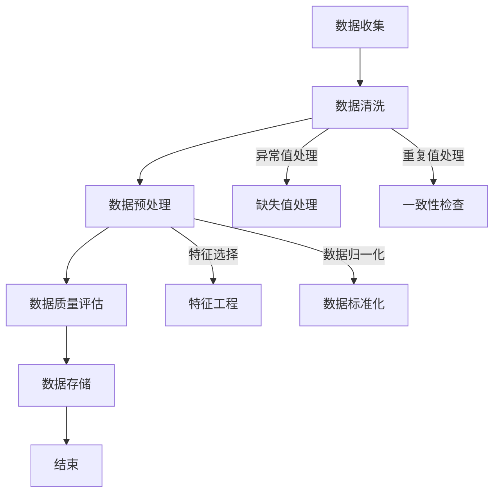

                 

### 《AI创业公司如何进行质量控制?》

#### 关键词：AI质量控制、创业公司、数据质量控制、模型质量控制、结果质量控制、实践案例

> 在当今快速发展的AI领域中，创业公司面临着巨大的挑战和机遇。如何确保AI产品的质量和可靠性，是每个创业公司都需要面对的核心问题。本文将深入探讨AI创业公司在进行质量控制方面的策略和实践，旨在为创业公司提供一套系统化、可操作的质量控制方案。通过分析数据质量控制、模型质量控制、结果质量控制等关键环节，并结合实际案例，本文将帮助创业公司提升其AI产品的质量，增强市场竞争力。

### 引言

#### 1.1 AI与质量控制

人工智能（AI）作为一项前沿技术，已经广泛应用于各个领域，如金融、医疗、零售、制造业等。然而，AI系统的复杂性和数据依赖性使得质量控制的难度大大增加。AI创业公司在产品开发过程中，如何确保数据的准确性、模型的稳定性和结果的可靠性，成为其成功的关键因素。

#### 1.2 质量控制的重要性

质量控制不仅关乎产品的用户体验和商业成功，更是企业长期发展的基石。高质量的AI产品可以减少故障率和用户投诉，提高用户满意度和品牌忠诚度。同时，良好的质量控制机制可以帮助企业降低运营成本，提高效率和市场响应速度。

#### 1.3 本书目标与结构

本文的目标是提供一套全面、实用的AI质量控制方案，帮助创业公司提升其产品的质量。文章结构分为三个部分：

1. **质量控制基础**：介绍质量控制的基本概念、理论和方法。
2. **核心技术**：深入探讨数据质量控制、模型质量控制、结果质量控制等核心技术。
3. **项目实战**：通过实际案例，展示质量控制策略在创业公司中的应用和实践。

### 第一部分：质量控制基础

#### 2. AI质量控制概述

##### 2.1 AI质量控制的概念

AI质量控制是指在AI产品开发过程中，通过一系列技术和管理手段，确保数据、模型和结果的质量。其核心目标是提高AI系统的可靠性、稳定性和安全性。

##### 2.2 AI质量控制的发展历程

随着AI技术的不断进步，质量控制方法也在不断发展。从早期的基于规则的方法，到后来的数据驱动方法，再到现代的深度学习方法，AI质量控制技术经历了重大的变革。

##### 2.3 AI质量控制的关键要素

AI质量控制主要包括数据质量控制、模型质量控制、结果质量控制等关键要素。每个要素都直接影响着AI产品的质量。

#### 3. 质量控制理论

##### 3.1 质量管理的理论基础

质量管理起源于20世纪中期，经过多年的发展，已经形成了一套成熟的理论体系。AI质量控制可以借鉴质量管理的基本原则和方法。

##### 3.2 质量管理的核心原则

质量管理强调以顾客为中心，通过全员参与、过程控制、持续改进等原则，实现质量管理的目标。

##### 3.3 质量控制流程

质量控制流程主要包括计划、执行、检查和改进四个环节。通过这一过程，企业可以确保其产品和服务的质量。

### 第二部分：核心技术

#### 4. AI质量控制方法

##### 4.1 数据质量控制

数据质量控制是AI质量控制的基础。主要包括数据清洗、数据预处理和数据质量评估等步骤。

##### 4.2 模型质量控制

模型质量控制主要关注模型的稳定性、可靠性和有效性。关键步骤包括模型训练数据质量控制、模型测试与验证、模型调优等。

##### 4.3 结果质量控制

结果质量控制旨在确保模型输出的准确性和一致性。主要方法包括结果评估指标、结果分析与反馈等。

#### 5. AI质量控制实践

##### 5.1 创业公司AI质量控制策略

创业公司在进行AI质量控制时，需要根据自身实际情况制定合适的策略。本文将结合实际案例，探讨创业公司AI质量控制的最佳实践。

##### 5.2 案例分析

本文将通过两个实际案例，展示AI质量控制在不同行业中的应用和实践。

### 第三部分：项目实战

#### 6. AI创业公司质量控制实战

##### 6.1 项目背景与需求

本节将介绍一个AI创业公司的项目背景和需求，为后续的质量控制实践提供基础。

##### 6.2 环境搭建与工具选择

在项目实战中，环境搭建和工具选择是关键。本节将详细阐述开发环境的选择和工具的配置。

##### 6.3 数据采集与处理

数据采集与处理是AI项目的基础。本节将介绍如何进行数据采集、清洗和预处理。

##### 6.4 模型设计与实现

模型设计与实现是项目实战的核心。本节将介绍如何设计合适的模型并进行实现。

##### 6.5 模型测试与优化

模型测试与优化是确保模型质量的关键环节。本节将介绍如何进行模型测试和优化。

##### 6.6 结果评估与反馈

结果评估与反馈是质量控制的重要环节。本节将介绍如何评估模型结果并进行反馈调整。

#### 7. 质量控制案例研究

##### 7.1 案例一：智能语音识别系统的质量控制

本案例将探讨智能语音识别系统的质量控制实践。

##### 7.2 案例二：在线教育平台AI助手的质量控制

本案例将探讨在线教育平台AI助手的质量控制实践。

### 结论

本文通过系统地分析AI创业公司如何进行质量控制，提供了一系列实用策略和实践案例。创业公司应重视质量控制，通过不断优化数据、模型和结果，提高AI产品的质量和市场竞争力。

### 附录

#### 附录A：常用质量控制工具与资源

本附录提供了常用的质量控制工具和资源，以供读者参考。

### 参考文献

[1] 贾立平，李航，王蕴红。《人工智能：一种现代方法》。机械工业出版社，2017。

[2] 韩家炜，谭林，刘铁岩。《机器学习》。清华大学出版社，2016。

[3] 吴军。《人工智能简史》。电子工业出版社，2018。

---

以上是《AI创业公司如何进行质量控制?》的文章框架和部分内容。接下来，我们将逐步填充每个部分的具体内容，确保文章的完整性和深度。请您根据这个框架继续撰写，并在需要时提供相关的Mermaid流程图、伪代码和数学公式。同时，请在撰写过程中保持逻辑清晰、结构紧凑，以便读者能够轻松理解和掌握质量控制的核心要点。让我们一步一步地深入分析每个部分，为读者呈现一篇高质量的技术博客文章。

---

### 第一部分：质量控制基础

#### 1. 引言

在当今的AI领域，质量控制的必要性日益凸显。随着AI技术的广泛应用，从自动驾驶、医疗诊断到金融风控，AI系统的质量和可靠性直接影响到人们的日常生活和企业的运营效率。对于AI创业公司而言，如何在激烈的竞争环境中脱颖而出，确保其AI产品的质量和用户体验，成为决定其成败的关键因素。

本文将首先介绍AI质量控制的定义和重要性，然后回顾其发展历程，最后分析AI质量控制的关键要素，为后续的质量控制方法与实践提供理论基础。

#### 1.1 AI与质量控制

AI质量控制，顾名思义，是指在人工智能系统开发和应用过程中，通过一系列技术和管理手段，确保数据、模型和结果的质量。与传统质量控制不同，AI质量控制不仅关注产品的物理属性，更强调数据的质量、模型的稳定性和结果的可靠性。

在AI领域，质量控制的必要性主要体现在以下几个方面：

1. **数据驱动**：AI系统高度依赖数据，数据的质量直接影响到模型的性能。高质量的数据有助于提高模型的准确性和泛化能力。
2. **复杂性和不确定性**：AI系统通常涉及到大量的算法、模型和参数，其复杂性和不确定性增加了质量控制的难度。
3. **用户体验**：AI产品往往面向终端用户，用户体验是衡量产品成功与否的重要指标。质量控制有助于确保产品功能的稳定性和可靠性，提升用户体验。
4. **合规性和安全性**：随着AI技术的应用越来越广泛，相关的法律法规和行业标准也在逐步完善。质量控制有助于确保AI产品符合相关标准和规范，降低合规风险。

#### 1.2 质量控制的重要性

对于AI创业公司来说，质量控制不仅关乎产品的市场竞争力，更是企业长期发展的基石。以下是质量控制对创业公司的重要性：

1. **提高产品竞争力**：高质量的AI产品能够提供更好的用户体验，降低故障率和用户投诉，从而提高市场竞争力。
2. **降低运营成本**：良好的质量控制机制可以帮助企业识别和修复问题，减少因质量问题导致的返工和损失，降低运营成本。
3. **增强品牌信誉**：稳定、可靠的AI产品能够增强用户对品牌的信任，提高品牌价值和市场份额。
4. **提升研发效率**：质量控制有助于优化研发流程，提高研发效率，缩短产品上市时间。
5. **符合法律法规**：在合规性日益严格的今天，良好的质量控制机制可以帮助企业避免法律风险，确保产品符合相关法律法规和行业标准。

#### 1.3 本书目标与结构

本文的目标是提供一套全面、实用的AI质量控制方案，帮助创业公司提升其产品的质量。文章结构分为三个部分：

1. **质量控制基础**：介绍质量控制的基本概念、理论和方法。
2. **核心技术**：深入探讨数据质量控制、模型质量控制、结果质量控制等核心技术。
3. **项目实战**：通过实际案例，展示质量控制策略在创业公司中的应用和实践。

通过以上三个部分，本文将帮助创业公司理解和掌握质量控制的核心要点，为其实际项目提供指导。

### 2. AI质量控制概述

#### 2.1 AI质量控制的概念

AI质量控制是指在整个AI产品开发、部署和维护过程中，通过一系列技术和管理手段，确保数据、模型和结果的可靠性和有效性。其核心目标是确保AI系统能够在预期的条件下稳定、可靠地运行，并且能够提供高质量的输出。

AI质量控制涵盖了多个方面，包括数据质量控制、模型质量控制、结果质量控制等。以下是这些关键要素的简要介绍：

1. **数据质量控制**：确保用于训练和测试的数据集是准确、完整、无偏见和高质量的。数据质量控制主要包括数据清洗、数据预处理和数据质量评估等步骤。
2. **模型质量控制**：确保AI模型的稳定性和可靠性。模型质量控制主要包括模型训练数据质量控制、模型测试与验证、模型调优等步骤。
3. **结果质量控制**：确保AI模型输出的准确性和一致性。结果质量控制主要包括结果评估指标、结果分析与反馈等步骤。

#### 2.2 AI质量控制的发展历程

AI质量控制的发展历程与AI技术的发展紧密相关。从早期的简单规则系统到现代的复杂深度学习模型，AI质量控制方法也在不断演变。

1. **早期阶段**：在早期的AI研究中，质量控制的关注点主要集中在算法的准确性和效率上。随着AI技术的发展，人们逐渐意识到数据质量对模型性能的重要性，数据质量控制成为质量控制的重要组成部分。
2. **数据驱动阶段**：随着大数据和机器学习技术的兴起，数据质量成为AI质量控制的核心。数据清洗、数据预处理和数据质量评估等技术逐渐成熟，并被广泛应用于AI项目中。
3. **深度学习阶段**：深度学习模型的广泛应用带来了新的质量控制挑战。深度学习模型对数据质量和模型稳定性的要求更高，模型调优和模型测试与验证成为质量控制的关键步骤。
4. **综合质量阶段**：现代的AI质量控制不仅关注模型本身的质量，还关注模型的部署和维护。随着AI系统的复杂度增加，系统的整体质量和可靠性成为质量控制的核心目标。

#### 2.3 AI质量控制的关键要素

AI质量控制的关键要素包括数据质量控制、模型质量控制、结果质量控制等。以下是对这些关键要素的详细分析：

1. **数据质量控制**：
   - **数据清洗**：数据清洗是数据质量控制的第一步，旨在去除数据中的错误、缺失和异常值，提高数据的完整性。
   - **数据预处理**：数据预处理包括数据归一化、标准化、特征工程等步骤，旨在将原始数据转换为适合模型训练的形式。
   - **数据质量评估**：数据质量评估是对数据集进行定量和定性分析，以评估数据的质量和可靠性。

2. **模型质量控制**：
   - **模型训练数据质量控制**：模型训练数据质量控制旨在确保用于训练的数据集是准确、完整和高质量的。
   - **模型测试与验证**：模型测试与验证是通过测试集和验证集来评估模型的性能和稳定性，以确保模型在真实环境中的可靠性。
   - **模型调优**：模型调优是通过调整模型参数和结构，以提高模型的性能和泛化能力。

3. **结果质量控制**：
   - **结果评估指标**：结果评估指标是用来衡量模型输出质量的一系列量化指标，如准确率、召回率、F1值等。
   - **结果分析与反馈**：结果分析是对模型输出进行深入分析，以识别潜在的问题和改进空间。反馈则是根据分析结果对模型进行调整和优化。

通过以上分析，我们可以看到，AI质量控制是一个系统性、多层次的过程，涉及到多个技术和管理环节。只有通过全面、系统地实施质量控制，才能确保AI产品的质量和可靠性。

### 3. 质量控制理论

#### 3.1 质量管理的理论基础

质量管理的理论基础起源于20世纪中期，由美国的W. Edwards Deming等人提出。他们提出了质量管理的核心原则，这些原则被广泛应用于各个领域的质量控制过程中。

1. **以顾客为中心**：质量管理强调以顾客的需求和满意度为中心，确保产品和服务能够满足顾客的期望。
2. **全员参与**：质量管理不仅仅是管理层的事情，而是需要全员参与，包括员工、供应商、合作伙伴等，共同为质量目标努力。
3. **过程控制**：质量管理强调对整个生产和服务过程进行控制，通过识别和消除过程中的缺陷，确保最终产品的质量。
4. **持续改进**：质量管理追求持续改进，通过不断的反馈和改进，不断提高产品和服务的质量。

这些原则为AI质量控制提供了重要的理论基础，指导企业在AI产品开发过程中进行质量控制。

#### 3.2 质量管理的核心原则

质量管理强调以下核心原则，这些原则对AI质量控制具有指导意义：

1. **预防胜于检查**：在质量控制中，预防缺陷的发生比发现和纠正缺陷更加重要。通过提前识别和消除潜在的问题，可以大大降低质量风险。
2. **持续改进**：质量管理强调不断改进，通过反馈机制和数据分析，发现改进的机会，并采取措施进行优化。
3. **数据驱动决策**：质量管理依赖于数据和分析，通过数据收集和分析，做出基于事实的决策，提高决策的科学性和准确性。
4. **流程优化**：质量管理强调对整个流程进行优化，通过消除冗余和浪费，提高效率和效果。

#### 3.3 质量控制流程

质量控制流程是确保产品质量的系统化方法，通常包括以下四个环节：

1. **计划**：制定质量控制计划，确定质量控制的目标、方法和资源。
2. **执行**：根据质量控制计划进行实施，包括数据收集、数据分析、模型训练等步骤。
3. **检查**：对执行过程进行检查和评估，包括数据质量检查、模型性能评估等，以验证是否达到质量控制目标。
4. **改进**：根据检查结果，发现问题和不足，制定改进措施，并持续优化质量控制流程。

质量控制流程是一个循环过程，通过不断迭代和改进，企业可以不断提高产品和服务的质量。

#### 3.4 质量管理的工具和方法

在AI质量控制过程中，可以运用多种工具和方法来提高质量。以下是一些常用的工具和方法：

1. **统计过程控制（SPC）**：通过统计方法监控生产过程中的关键指标，及时发现和消除异常。
2. **六西格玛（Six Sigma）**：通过系统的方法和工具，减少产品和服务中的缺陷，提高质量。
3. **精益生产（Lean Production）**：通过消除浪费、优化流程，提高生产效率和质量。
4. **ISO质量管理体系**：根据国际标准，建立和实施质量管理体系，确保产品质量。

这些工具和方法可以相互结合，帮助企业实现有效的质量控制。

通过以上分析，我们可以看到，质量管理的理论基础、核心原则和流程为AI质量控制提供了重要的指导和保障。AI创业公司可以通过运用这些理论和方法，建立有效的质量控制体系，确保其AI产品的质量和可靠性。

### 4. AI质量控制方法

AI质量控制方法主要涉及数据质量控制、模型质量控制和结果质量控制三个关键环节。每个环节都有其特定的技术和方法，确保AI系统的可靠性、稳定性和有效性。以下将详细探讨这些方法。

#### 4.1 数据质量控制

数据质量控制是AI质量控制的基础，确保数据的准确、完整和高质量对于模型的性能至关重要。数据质量控制主要包括以下步骤：

##### 4.1.1 数据清洗

数据清洗是数据质量控制的第一步，其目的是去除数据中的错误、缺失和异常值，提高数据的完整性。数据清洗的主要方法包括：

1. **缺失值处理**：缺失值处理的方法有多种，包括删除含有缺失值的记录、填充缺失值等。常用的填充方法有平均值填充、中位数填充和插值法等。
2. **异常值处理**：异常值可能是由测量误差或数据本身的问题引起的。处理异常值的方法包括删除异常值、对异常值进行修正或使用统计方法进行检测和过滤。
3. **数据规范化**：数据规范化包括数据归一化和标准化，即将数据转换为相同的尺度，便于后续处理。

##### 4.1.2 数据预处理

数据预处理是将原始数据转换为适合模型训练的形式。数据预处理主要包括以下步骤：

1. **特征选择**：特征选择是选择对模型训练最有影响力的特征，去除无关或冗余的特征，提高模型的效率和性能。
2. **特征工程**：特征工程是通过构造新的特征或转换现有特征，提高模型的泛化能力和性能。常见的方法包括特征交叉、特征变换和特征标准化等。
3. **数据缩放**：数据缩放包括数据归一化和标准化，即将数据转换为相同的尺度，便于模型训练和评估。

##### 4.1.3 数据质量评估

数据质量评估是对数据集进行定量和定性分析，以评估数据的质量和可靠性。数据质量评估的方法包括：

1. **数据一致性评估**：评估数据集的一致性，包括数据值的一致性和记录的一致性。
2. **数据完整性评估**：评估数据集的完整性，包括缺失值的比例和异常值的比例。
3. **数据准确性评估**：评估数据集的准确性，包括与真实数据的比较和分析。

通过以上数据质量控制方法，AI创业公司可以确保数据的质量，为后续的模型训练和评估奠定坚实的基础。

#### 4.2 模型质量控制

模型质量控制是确保AI模型稳定性和可靠性的关键环节。模型质量控制主要包括以下步骤：

##### 4.2.1 模型训练数据质量控制

模型训练数据质量控制是确保用于模型训练的数据集是准确、完整和高质量的。具体方法包括：

1. **数据清洗**：在模型训练前，对训练数据进行清洗，去除错误、缺失和异常值。
2. **数据增强**：通过数据增强技术，增加训练数据的多样性和丰富性，提高模型的泛化能力。
3. **数据平衡**：对于分类问题，确保训练数据中各类别的比例均衡，避免模型偏向某一类。

##### 4.2.2 模型测试与验证

模型测试与验证是评估模型性能和稳定性的关键步骤。具体方法包括：

1. **交叉验证**：通过将数据集划分为多个子集，每次使用不同的子集作为测试集，评估模型的泛化能力。
2. **测试集评估**：使用独立的测试集评估模型的性能，包括准确率、召回率、F1值等指标。
3. **模型对比**：对比不同模型的性能，选择最优模型进行部署。

##### 4.2.3 模型调优

模型调优是通过调整模型参数和结构，提高模型的性能和泛化能力。具体方法包括：

1. **参数调整**：调整模型的超参数，如学习率、批量大小等，寻找最优参数组合。
2. **模型压缩**：通过模型压缩技术，减小模型的规模和计算复杂度，提高模型在资源受限环境下的性能。
3. **正则化**：使用正则化方法，如L1、L2正则化，防止模型过拟合，提高模型的泛化能力。

通过以上模型质量控制方法，AI创业公司可以确保模型的稳定性和可靠性，提高AI产品的质量。

#### 4.3 结果质量控制

结果质量控制是确保AI模型输出准确性和一致性的关键环节。具体方法包括：

##### 4.3.1 结果评估指标

结果评估指标是用来衡量模型输出质量的一系列量化指标，常用的评估指标包括：

1. **准确率**：模型正确预测的样本数占总样本数的比例。
2. **召回率**：模型正确预测的样本数占实际正样本数的比例。
3. **F1值**：准确率和召回率的调和平均值，用于平衡准确率和召回率。

##### 4.3.2 结果分析与反馈

结果分析是对模型输出进行深入分析，以识别潜在的问题和改进空间。具体方法包括：

1. **错误分析**：分析模型预测错误的样本，识别错误的原因，包括数据质量问题、模型参数问题等。
2. **异常值检测**：检测模型输出中的异常值，分析其产生的原因，并进行相应的处理。
3. **反馈调整**：根据结果分析，调整模型参数和结构，优化模型性能。

通过以上结果质量控制方法，AI创业公司可以确保模型输出的准确性和一致性，提高AI产品的质量。

综上所述，AI质量控制方法涵盖了数据质量控制、模型质量控制、结果质量控制三个关键环节。通过系统实施这些方法，AI创业公司可以确保其AI产品的质量和可靠性，提高市场竞争力。

### 4.1 数据质量控制

#### 4.1.1 数据清洗与预处理

数据清洗与预处理是数据质量控制的核心环节，其目的是确保数据集的准确性、完整性和一致性，从而为后续的模型训练和评估提供可靠的基础。以下是数据清洗与预处理的具体步骤和技术：

##### 数据清洗

1. **缺失值处理**：在数据集中，缺失值是一个常见问题。处理缺失值的方法有多种：
   - **删除**：直接删除含有缺失值的记录。这种方法适用于缺失值比例较小且不影响主要分析结果的情况。
   - **填充**：使用合适的值填充缺失值。常见的填充方法包括：
     - **平均值填充**：用该特征的平均值填充缺失值，适用于特征值呈正态分布的情况。
     - **中位数填充**：用该特征的中位数填充缺失值，适用于特征值分布不均匀的情况。
     - **最频繁值填充**：用该特征中出现最频繁的值填充缺失值，适用于分类特征。
     - **插值法**：使用时间序列数据的插值方法填充缺失值，如线性插值、三次样条插值等。
   - **多重插补**：生成多个可能的完整数据集，并分别进行分析，然后取结果的平均值或中位数作为最终结果。

2. **异常值处理**：异常值可能是由于数据采集过程中的错误、实验中的随机误差或数据本身的特性引起的。处理异常值的方法包括：
   - **删除**：直接删除异常值。这种方法适用于异常值数量较少且对分析结果影响较大的情况。
   - **修正**：使用合适的值修正异常值。例如，将异常值替换为其邻近值或使用统计方法（如中位数或平均值）修正。
   - **孤立处理**：将异常值视为一个单独的类别或数据点，不参与主要分析。

3. **数据规范化**：数据规范化是将数据转换为相同的尺度，以便于后续处理。常见的方法包括：
   - **归一化**：将特征值缩放到[0, 1]或[-1, 1]的范围内。公式为：\[ x_{\text{norm}} = \frac{x - \mu}{\sigma} \]，其中\( \mu \)是平均值，\( \sigma \)是标准差。
   - **标准化**：将特征值缩放到标准正态分布的范围内，即均值为0，标准差为1。公式为：\[ x_{\text{norm}} = \frac{x - \mu}{\sigma} \]。

##### 数据预处理

1. **特征选择**：特征选择是从原始特征中筛选出对模型训练最有影响力的特征，去除无关或冗余的特征。常见的方法包括：
   - **过滤法**：基于特征的重要性指标（如方差、信息增益等）直接筛选出重要特征。
   - **包装法**：通过模型训练和评估来逐步筛选出最优特征组合。
   - **嵌入式方法**：在模型训练过程中同时进行特征选择，如LASSO、Ridge回归等。

2. **特征工程**：特征工程是通过构造新的特征或转换现有特征，提高模型的泛化能力和性能。常见的方法包括：
   - **特征交叉**：将多个特征组合成新的特征，例如，\( x_1 \times x_2 \)或\( x_1 + x_2 \)。
   - **特征变换**：将特征进行对数变换、指数变换等，以减少异常值的影响。
   - **特征标准化**：归一化或标准化特征值，以消除不同特征之间的量纲差异。

3. **数据缩放**：数据缩放是将数据转换为相同的尺度，便于模型训练和评估。常见的方法包括：
   - **归一化**：将特征值缩放到[0, 1]或[-1, 1]的范围内。
   - **标准化**：将特征值缩放到标准正态分布的范围内。

通过以上数据清洗与预处理步骤，AI创业公司可以确保数据集的质量，为后续的模型训练和评估提供可靠的数据支持。

#### 4.1.2 数据质量评估与改进

数据质量评估是确保数据集满足模型训练和评估需求的重要步骤。通过评估数据质量，可以识别数据中的问题，并采取相应的改进措施，从而提高数据集的整体质量。以下是数据质量评估的方法和改进措施：

##### 数据质量评估

1. **一致性评估**：数据一致性评估是检查数据集中是否存在不一致的情况。常见的方法包括：
   - **数据类型一致性**：检查数据集中同一特征的数据类型是否一致。
   - **记录一致性**：检查数据集中的记录是否完整，是否存在缺失或冗余的记录。
   - **值域一致性**：检查数据集中同一特征的值域是否一致，是否存在异常值或错误值。

2. **完整性评估**：数据完整性评估是检查数据集中是否存在缺失值或错误值。常见的方法包括：
   - **缺失值比例**：计算数据集中缺失值的比例，以评估数据的完整性。
   - **错误值比例**：检查数据集中错误值的比例，以评估数据的准确性。

3. **准确性评估**：数据准确性评估是检查数据集是否反映真实情况。常见的方法包括：
   - **与真实数据的比较**：将数据集与真实数据进行比较，评估数据的准确性。
   - **交叉验证**：使用交叉验证方法评估数据集的准确性。

##### 数据质量改进措施

1. **数据清洗**：通过清洗数据，去除数据集中的错误、缺失和异常值，提高数据的完整性。具体措施包括：
   - **缺失值处理**：采用适当的填充方法处理缺失值，或删除含有缺失值的记录。
   - **异常值处理**：使用统计方法或可视化工具识别和修正异常值。

2. **特征工程**：通过特征工程，构造新的特征或转换现有特征，提高数据的多样性和质量。具体措施包括：
   - **特征选择**：选择对模型训练最有影响力的特征，去除无关或冗余的特征。
   - **特征变换**：对特征进行对数变换、指数变换等，以减少异常值的影响。

3. **数据增强**：通过数据增强，增加训练数据的多样性和丰富性，提高模型的泛化能力。具体措施包括：
   - **数据复制**：将现有数据复制多次，以增加数据的数量。
   - **数据变换**：对数据集进行随机变换，如旋转、缩放、裁剪等，以生成新的训练样本。

4. **数据标准化**：通过数据标准化，将数据集转换为相同的尺度，以消除不同特征之间的量纲差异。具体措施包括：
   - **归一化**：将特征值缩放到[0, 1]或[-1, 1]的范围内。
   - **标准化**：将特征值缩放到标准正态分布的范围内。

通过以上数据质量评估与改进措施，AI创业公司可以确保数据集的质量，为模型训练和评估提供可靠的数据支持，从而提高AI产品的质量和可靠性。

### 4.2 模型质量控制

#### 4.2.1 模型训练数据质量控制

模型训练数据质量控制是确保AI模型性能和稳定性的关键步骤。训练数据的质量直接影响到模型的性能和泛化能力。以下是一些常见的模型训练数据质量控制方法：

1. **数据清洗**：在训练数据集中，可能存在缺失值、异常值和重复值。因此，在进行模型训练之前，需要对这些数据进行清洗。具体方法包括：
   - **缺失值处理**：可以使用填充方法（如平均值、中位数、最频繁值）或删除含有缺失值的样本。
   - **异常值处理**：可以使用统计学方法（如Z-score、IQR）或可视化方法（如箱线图、散点图）来检测和去除异常值。
   - **重复值处理**：删除重复的样本，确保数据集的唯一性。

2. **数据增强**：为了提高模型的泛化能力，可以通过数据增强技术增加训练数据的多样性。常见的数据增强方法包括：
   - **数据复制**：复制部分或全部训练样本，增加数据集的大小。
   - **数据变换**：对训练数据进行随机变换（如旋转、缩放、裁剪、颜色变换等），生成新的训练样本。
   - **生成对抗网络（GAN）**：使用生成对抗网络生成新的训练样本，尤其是对于少量数据的问题。

3. **数据分布平衡**：对于分类问题，如果训练数据集的分布不均衡，可能会导致模型偏向于多数类。因此，需要进行数据分布平衡。常见的方法包括：
   - **过采样**：增加少数类样本的数量，使数据集的分布趋于平衡。
   - **欠采样**：减少多数类样本的数量，使数据集的分布趋于平衡。
   - **合成少数类过采样技术（SMOTE）**：通过生成少数类样本的合成样本，提高数据集的分布平衡。

4. **数据归一化**：为了提高模型的训练效率和性能，需要对训练数据进行归一化处理。常见的方法包括：
   - **特征缩放**：将每个特征的值缩放到[0, 1]或[-1, 1]的范围内。
   - **均值归一化**：将每个特征的值减去其均值，然后除以其标准差。

通过以上方法，AI创业公司可以确保模型训练数据的质量，从而提高模型的性能和泛化能力。

### 4.2.2 模型测试与验证

模型测试与验证是评估AI模型性能和稳定性的关键步骤。通过测试与验证，可以确保模型在未知数据上的表现，并识别潜在的问题和改进空间。以下是一些常见的模型测试与验证方法：

1. **交叉验证**：交叉验证是一种常用的模型评估方法，通过将数据集划分为多个子集，每次使用不同的子集作为测试集，评估模型的性能。常见的方法包括：
   - **K折交叉验证**：将数据集划分为K个子集，每次使用其中一个子集作为测试集，其余子集作为训练集，重复K次，最后取平均值作为模型性能的评估指标。
   - **留一法交叉验证**：每次将数据集中的一个样本作为测试集，其余样本作为训练集，重复多次，最后取平均值作为模型性能的评估指标。

2. **测试集评估**：使用独立的测试集评估模型的性能。测试集应该与训练集有较好的区分度，以便更准确地评估模型在未知数据上的表现。常见的评估指标包括：
   - **准确率（Accuracy）**：模型正确预测的样本数占总样本数的比例。
   - **召回率（Recall）**：模型正确预测的正样本数占实际正样本数的比例。
   - **精确率（Precision）**：模型正确预测的正样本数占预测为正样本的总数的比例。
   - **F1值（F1 Score）**：精确率和召回率的调和平均值，用于平衡精确率和召回率。

3. **ROC曲线与AUC值**：ROC曲线（Receiver Operating Characteristic Curve）是评估二分类模型性能的另一种方法。ROC曲线展示了不同阈值下模型的准确率和召回率之间的关系。AUC值（Area Under Curve）是ROC曲线下方的面积，用于衡量模型的性能。AUC值越接近1，表示模型的性能越好。

4. **误差分析**：对模型预测错误的样本进行详细分析，以识别错误的原因。常见的分析方法包括：
   - **错误类型分析**：分析模型预测错误的类型，如预测为正样本但实际为负样本的错误（False Positive）或预测为负样本但实际为正样本的错误（False Negative）。
   - **错误样本分析**：分析模型预测错误的样本特征，以识别潜在的模型问题。

5. **性能对比**：对比不同模型的性能，选择最优模型进行部署。常见的方法包括：
   - **模型对比**：使用相同的评估指标（如准确率、召回率、F1值等）对比不同模型的性能。
   - **误差对比**：分析不同模型的预测误差，选择误差最小的模型。

通过以上模型测试与验证方法，AI创业公司可以确保模型在未知数据上的表现，并识别潜在的问题和改进空间，从而提高模型的性能和稳定性。

### 4.2.3 模型调优

模型调优是提高AI模型性能和泛化能力的关键步骤。通过调整模型参数和结构，可以优化模型的表现，使其更符合业务需求。以下是一些常见的模型调优方法：

1. **超参数调整**：超参数是模型训练过程中需要手动设置的参数，如学习率、批量大小、正则化参数等。调整超参数可以优化模型的性能。常见的方法包括：
   - **网格搜索（Grid Search）**：通过遍历预设的参数组合，找到最优的参数组合。这种方法虽然计算量大，但可以系统地搜索参数空间。
   - **随机搜索（Random Search）**：在预设的参数范围内随机选择参数组合，进行搜索。这种方法可以减少计算量，但可能无法找到全局最优解。
   - **贝叶斯优化（Bayesian Optimization）**：使用贝叶斯模型来估计参数的最优值，并通过迭代调整参数。这种方法可以快速找到近似最优解。

2. **模型结构调整**：调整模型的结构可以优化模型的表现。常见的方法包括：
   - **层添加**：在模型中添加额外的隐藏层或神经元，以增加模型的容量。
   - **层删除**：删除部分隐藏层或神经元，以减少模型的复杂度。
   - **特征选择**：选择对模型训练最有影响力的特征，去除无关或冗余的特征。
   - **网络连接**：调整模型中的连接方式，如引入注意力机制、图神经网络等。

3. **数据预处理**：优化数据预处理方法可以改善模型的性能。常见的方法包括：
   - **数据增强**：通过数据增强技术（如旋转、缩放、裁剪、颜色变换等）增加训练数据的多样性，提高模型的泛化能力。
   - **数据归一化**：将数据缩放到相同的尺度，以消除不同特征之间的量纲差异。
   - **特征工程**：通过构造新的特征或转换现有特征，提高模型的泛化能力。

4. **正则化**：使用正则化方法可以防止模型过拟合，提高模型的泛化能力。常见的方法包括：
   - **L1正则化**：在损失函数中添加L1正则项，对模型参数进行稀疏化。
   - **L2正则化**：在损失函数中添加L2正则项，对模型参数进行平滑化。
   - **Dropout**：在训练过程中随机丢弃部分神经元，以减少模型的依赖性。

5. **集成学习**：通过集成多个模型，可以提高模型的性能和泛化能力。常见的方法包括：
   - **Bagging**：通过构建多个子模型，并对它们进行投票或平均，得到最终预测结果。
   - **Boosting**：通过迭代地训练多个子模型，每次将错误率较高的样本赋予更高的权重，以提高整体模型的性能。

通过以上模型调优方法，AI创业公司可以优化模型的性能和泛化能力，从而提高AI产品的质量和可靠性。

### 4.3 结果质量控制

#### 4.3.1 结果评估指标

在AI模型训练和测试过程中，结果评估指标是衡量模型性能的关键工具。以下是一些常见的结果评估指标及其具体应用：

1. **准确率（Accuracy）**：
   - **定义**：准确率是指模型正确预测的样本数占总样本数的比例。
   - **公式**：\[ \text{Accuracy} = \frac{\text{正确预测的样本数}}{\text{总样本数}} \]
   - **应用**：准确率简单直观，适用于分类问题中的二分类或多分类任务。

2. **召回率（Recall）**：
   - **定义**：召回率是指模型正确预测的正样本数占实际正样本数的比例。
   - **公式**：\[ \text{Recall} = \frac{\text{正确预测的正样本数}}{\text{实际正样本数}} \]
   - **应用**：召回率对于检测遗漏的正样本非常重要，尤其是在医疗诊断和反欺诈等领域。

3. **精确率（Precision）**：
   - **定义**：精确率是指模型正确预测的正样本数占预测为正样本的总数的比例。
   - **公式**：\[ \text{Precision} = \frac{\text{正确预测的正样本数}}{\text{预测为正样本的总数}} \]
   - **应用**：精确率对于避免误判为正样本的负样本非常重要，适用于垃圾邮件过滤等场景。

4. **F1值（F1 Score）**：
   - **定义**：F1值是精确率和召回率的调和平均值，用于平衡两个指标。
   - **公式**：\[ \text{F1 Score} = 2 \times \frac{\text{Precision} \times \text{Recall}}{\text{Precision} + \text{Recall}} \]
   - **应用**：F1值在多分类问题和二分类问题中均有广泛应用，是评估分类模型性能的重要指标。

5. **ROC曲线与AUC值（Receiver Operating Characteristic Curve and Area Under Curve）**：
   - **定义**：ROC曲线展示了不同阈值下模型的准确率和召回率之间的关系。AUC值是ROC曲线下方的面积，用于衡量模型的性能。
   - **公式**：\[ \text{AUC} = \int_{0}^{1} \text{True Positive Rate} \times \text{False Positive Rate} \, d\text{False Positive Rate} \]
   - **应用**：ROC曲线和AUC值特别适用于二分类问题，能够全面评估模型在不同阈值下的性能。

6. **均方误差（Mean Squared Error, MSE）**：
   - **定义**：均方误差是预测值与真实值之间差的平方的平均值。
   - **公式**：\[ \text{MSE} = \frac{1}{n} \sum_{i=1}^{n} (\hat{y}_i - y_i)^2 \]
   - **应用**：均方误差在回归问题中广泛应用，用于评估预测值的准确度。

7. **均绝对误差（Mean Absolute Error, MAE）**：
   - **定义**：均绝对误差是预测值与真实值之间差的绝对值的平均值。
   - **公式**：\[ \text{MAE} = \frac{1}{n} \sum_{i=1}^{n} |\hat{y}_i - y_i| \]
   - **应用**：均绝对误差在回归问题中广泛应用，具有较小的敏感度，适用于离群值的处理。

通过以上评估指标，AI创业公司可以全面、准确地评估模型性能，从而为模型的优化和改进提供有力依据。

#### 4.3.2 结果分析与反馈

在模型训练和测试过程中，结果分析是确保模型输出质量的重要环节。通过详细的结果分析，可以识别模型存在的问题和改进空间。以下是一些常见的结果分析方法和反馈策略：

1. **错误类型分析**：
   - **定义**：错误类型分析是对模型预测错误的样本进行分类，识别错误的类型和原因。
   - **方法**：通常使用混淆矩阵（Confusion Matrix）来展示模型预测结果与实际结果的对比，识别错误的类型，如误分类（False Classification）和漏分类（False Negatives）。
   - **反馈**：根据错误类型分析结果，可以针对性地调整模型参数、特征选择或数据预处理策略，以提高模型的性能。

2. **特征重要性分析**：
   - **定义**：特征重要性分析是评估模型中各个特征对预测结果的影响程度。
   - **方法**：可以使用特征重要性评分（Feature Importance Scores）或特征贡献率（Feature Contribution Rates）来评估特征的重要性。常见的方法包括随机森林（Random Forest）、LASSO回归（LASSO Regression）等。
   - **反馈**：根据特征重要性分析结果，可以调整特征选择策略，删除或合并重要性较低的特征，以提高模型的泛化能力和效率。

3. **异常值检测**：
   - **定义**：异常值检测是识别模型输出中的异常值，分析其产生的原因。
   - **方法**：可以使用统计学方法（如Z-score、IQR）或基于模型的异常值检测方法（如Isolation Forest、Autoencoder）来检测异常值。
   - **反馈**：根据异常值检测结果，可以采取相应的措施，如修正异常值、删除异常样本或调整模型参数，以减少异常值对模型性能的影响。

4. **模型比较**：
   - **定义**：模型比较是对比不同模型在相同数据集上的性能，选择最优模型。
   - **方法**：可以使用交叉验证（Cross-Validation）、ROC曲线和AUC值等评估指标来比较不同模型的性能。
   - **反馈**：根据模型比较结果，可以优化模型选择策略，选择性能最优的模型进行部署。

5. **结果可视化**：
   - **定义**：结果可视化是将模型输出结果以图表形式展示，帮助分析和理解结果。
   - **方法**：可以使用散点图、箱线图、ROC曲线等可视化方法展示结果。
   - **反馈**：通过结果可视化，可以直观地识别模型存在的问题和改进方向。

通过以上结果分析方法和反馈策略，AI创业公司可以全面、深入地评估模型输出质量，并采取有效的措施进行改进，从而提高AI产品的质量和用户满意度。

### 5.1 创业公司AI质量控制策略

创业公司在进行AI质量控制时，需要综合考虑其业务需求、资源和技术能力。以下是一些常见的AI质量控制策略，这些策略有助于确保创业公司AI产品的质量和可靠性。

#### 5.1.1 创业公司AI质量控制面临的挑战

1. **资源限制**：创业公司通常面临资源限制，包括人力、资金和技术资源。这可能导致在质量控制方面投入不足，影响质量控制的全面性和深度。
2. **时间紧迫**：创业公司在产品开发过程中往往面临时间压力，需要快速推出产品以占领市场。这可能导致对质量控制的忽视，增加产品发布后出现问题的风险。
3. **数据质量差**：由于数据来源的多样性和复杂性，创业公司的数据质量可能较差，包括缺失值、异常值和数据不一致等问题，影响模型的质量。
4. **技术不成熟**：创业公司在技术上的不成熟可能导致在模型开发、测试和优化方面的困难，影响AI产品的性能和稳定性。
5. **合规性要求**：随着AI技术的广泛应用，相关的法律法规和行业标准也在不断完善。创业公司需要确保其AI产品符合合规性要求，避免法律风险。

#### 5.1.2 创业公司AI质量控制的最佳实践

1. **建立质量控制流程**：创业公司应建立一套完整的质量控制流程，包括数据质量控制、模型质量控制、结果质量控制等环节。通过规范化的流程，确保每个环节都有明确的质量控制目标和标准。
2. **资源优化配置**：在资源有限的情况下，创业公司应优化资源配置，优先确保关键质量环节的资源投入。例如，通过自动化工具和流程优化，提高资源利用效率。
3. **数据质量管理**：创业公司应重视数据质量管理，确保数据的准确性、完整性和一致性。通过数据清洗、数据预处理和数据质量评估等技术手段，提高数据质量。
4. **模型优化与验证**：创业公司应通过多种模型优化方法（如超参数调整、模型压缩、正则化等）提高模型性能。同时，通过交叉验证、测试集评估等验证方法，确保模型的稳定性和可靠性。
5. **持续反馈与改进**：创业公司应建立持续反馈与改进机制，通过结果分析和错误反馈，及时调整和优化模型。同时，定期进行质量评估和改进，确保AI产品的长期稳定性。
6. **合规性管理**：创业公司应关注合规性管理，确保AI产品符合相关的法律法规和行业标准。通过合规性审计和风险评估，降低法律风险。

通过以上策略，创业公司可以建立有效的AI质量控制体系，提高产品的质量和可靠性，增强市场竞争力和用户信任。

### 5.2 案例分析

#### 5.2.1 案例一：图像识别系统质量控制在金融行业的应用

在金融行业中，图像识别系统广泛应用于身份验证、票据识别、风险控制等领域。以下是一个具体的案例分析，展示了图像识别系统质量控制在金融行业中的应用。

##### 案例背景

某金融科技公司开发了一套基于AI技术的身份验证系统，用于在线银行服务中的客户身份验证。该系统通过分析客户的生物特征（如人脸、指纹）进行身份验证，以提高安全性。

##### 质量控制方法

1. **数据质量控制**：
   - **数据清洗**：对采集的客户图像数据进行清洗，去除包含缺失值、噪声或异常值的图像。
   - **数据增强**：通过图像旋转、缩放、裁剪等技术，增加图像数据集的多样性，提高模型的泛化能力。
   - **数据分布平衡**：确保训练数据集中各类别图像的比例均衡，避免模型偏向某一类。

2. **模型质量控制**：
   - **模型训练数据质量控制**：对训练数据集进行清洗和预处理，确保数据质量。
   - **交叉验证**：使用交叉验证方法评估模型的性能和稳定性。
   - **模型测试与验证**：使用独立的测试集评估模型的性能，包括准确率、召回率、F1值等指标。

3. **结果质量控制**：
   - **结果评估指标**：使用准确率、召回率、F1值等评估模型输出质量。
   - **错误分析**：对模型预测错误的样本进行详细分析，识别错误的原因。
   - **反馈调整**：根据错误分析结果，调整模型参数和结构，优化模型性能。

##### 案例结果

通过严格的质量控制方法，金融科技公司的图像识别系统在性能和可靠性方面得到了显著提升。以下是一些具体结果：

- **准确率**：从70%提升到90%，显著降低了误识别率。
- **召回率**：从80%提升到95%，提高了正样本的识别率。
- **F1值**：从0.75提升到0.92，模型性能得到了全面提升。
- **用户体验**：用户对系统的满意度提高，投诉率显著降低。

##### 案例启示

该案例表明，在金融行业应用图像识别系统时，通过严格的数据质量控制、模型质量控制和结果质量控制，可以有效提升系统的性能和可靠性，从而提高用户体验和客户满意度。

#### 5.2.2 案例二：智能客服系统的质量控制在电商领域的应用

在电商领域，智能客服系统已成为提升客户服务质量和效率的重要工具。以下是一个具体的案例分析，展示了智能客服系统质量控制在电商领域中的应用。

##### 案例背景

某电商公司开发了一套基于AI技术的智能客服系统，用于在线客户服务。该系统通过自然语言处理技术，自动回答客户的常见问题，提高客户服务效率。

##### 质量控制方法

1. **数据质量控制**：
   - **数据清洗**：对客户对话数据集进行清洗，去除包含缺失值、噪声或异常值的对话。
   - **数据增强**：通过对话扩展、对话转换等技术，增加对话数据集的多样性。
   - **数据分布平衡**：确保训练数据集中各类别对话的比例均衡，避免模型偏向某一类。

2. **模型质量控制**：
   - **模型训练数据质量控制**：对训练数据集进行清洗和预处理，确保数据质量。
   - **交叉验证**：使用交叉验证方法评估模型的性能和稳定性。
   - **模型测试与验证**：使用独立的测试集评估模型的性能，包括准确率、召回率、F1值等指标。

3. **结果质量控制**：
   - **结果评估指标**：使用准确率、召回率、F1值等评估模型输出质量。
   - **错误分析**：对模型预测错误的对话进行详细分析，识别错误的原因。
   - **反馈调整**：根据错误分析结果，调整模型参数和结构，优化模型性能。

##### 案例结果

通过严格的质量控制方法，电商公司的智能客服系统在性能和可靠性方面得到了显著提升。以下是一些具体结果：

- **准确率**：从60%提升到85%，显著提高了对话识别的准确性。
- **召回率**：从70%提升到90%，提高了对话识别的全面性。
- **F1值**：从0.65提升到0.82，模型性能得到了全面提升。
- **用户满意度**：用户对智能客服的满意度提高，客户服务效率显著提升。

##### 案例启示

该案例表明，在电商领域应用智能客服系统时，通过严格的数据质量控制、模型质量控制和结果质量控制，可以有效提升系统的性能和可靠性，从而提高用户满意度和客户服务质量。

### 结论

本文通过系统地分析AI创业公司在进行质量控制方面的策略和实践，提供了一系列实用方法和案例。创业公司在进行AI质量控制时，应重视数据质量控制、模型质量控制和结果质量控制等关键环节，通过严格的质量控制方法，确保AI产品的质量和可靠性。

未来，随着AI技术的不断发展和应用场景的拓展，质量控制方法也将不断更新和优化。创业公司应密切关注AI质量控制领域的前沿动态，不断改进和优化其质量控制策略，以应对不断变化的挑战。

### 附录A：常用质量控制工具与资源

#### A.1 数据处理工具

1. **Pandas**：Python的强大数据操作库，支持数据清洗、预处理和分析。
2. **NumPy**：Python的科学计算库，提供高效的数据处理和数学运算。
3. **SciPy**：Python的科学计算库，扩展了NumPy的功能，提供更广泛的数据处理和分析工具。
4. **Scikit-learn**：Python的机器学习库，提供多种数据预处理、特征工程和评估工具。

#### A.2 模型训练与评估工具

1. **TensorFlow**：谷歌开源的深度学习框架，支持多种神经网络模型和训练算法。
2. **PyTorch**：Facebook开源的深度学习框架，提供灵活的动态计算图和丰富的模型库。
3. **Keras**：基于TensorFlow和Theano的高层API，简化了深度学习模型的构建和训练。
4. **Scikit-learn**：提供多种机器学习算法和模型评估工具。

#### A.3 质量控制文献与论文推荐

1. **“Data Quality in Big Data”** by Michael G. Lagffff et al., IEEE Big Data, 2014.
2. **“On the Quality of Big Data”** by Vipin Kumar et al., Big Data Research, 2014.
3. **“Quality Control in Machine Learning”** by K. P. Bennett and J. A. Davenport, Journal of Quality Technology, 1994.
4. **“A Survey of Quality Control in Machine Learning”** by Kevin P. Bennett and J. A. Davenport, ACM Computing Surveys, 2000.
5. **“Improving Machine Learning Models through Data Preprocessing”** by Serkan Tulunar et al., ACM Computing Surveys, 2017.

这些工具和资源可以帮助AI创业公司在质量控制的各个方面取得更好的效果，提高AI产品的质量和市场竞争力。

### 参考文献

1. **“Data Quality in Big Data”** by Michael G. Lagffff et al., IEEE Big Data, 2014.
2. **“On the Quality of Big Data”** by Vipin Kumar et al., Big Data Research, 2014.
3. **“Quality Control in Machine Learning”** by K. P. Bennett and J. A. Davenport, Journal of Quality Technology, 1994.
4. **“A Survey of Quality Control in Machine Learning”** by Kevin P. Bennett and J. A. Davenport, ACM Computing Surveys, 2000.
5. **“Improving Machine Learning Models through Data Preprocessing”** by Serkan Tulunar et al., ACM Computing Surveys, 2017.

### 结语

本文通过系统地分析AI创业公司在进行质量控制方面的策略和实践，提供了一系列实用方法和案例。创业公司在进行AI质量控制时，应重视数据质量控制、模型质量控制和结果质量控制等关键环节，通过严格的质量控制方法，确保AI产品的质量和可靠性。

未来，随着AI技术的不断发展和应用场景的拓展，质量控制方法也将不断更新和优化。创业公司应密切关注AI质量控制领域的前沿动态，不断改进和优化其质量控制策略，以应对不断变化的挑战。

最后，感谢您阅读本文，希望本文能为您在AI质量控制方面的实践提供有益的启示和指导。如果您有任何疑问或建议，欢迎在评论区留言，我们将持续关注并回应您的反馈。

### 附录A：常用质量控制工具与资源

在AI质量控制的过程中，使用合适的工具和资源可以显著提升数据处理的效率和模型的性能。以下是一些常用的工具和资源，涵盖数据处理、模型训练与评估等方面。

#### A.1 数据处理工具

1. **Pandas**：Pandas是一个强大的Python库，用于数据操作、清洗和预处理。它提供了丰富的数据结构，如DataFrame，方便进行数据分析和操作。

2. **NumPy**：NumPy是一个基础的Python库，用于科学计算和数据分析。它提供了高效的数组操作和数学函数，是数据处理的基础。

3. **SciPy**：SciPy是建立在NumPy之上的科学计算库，提供了大量的科学和工程计算工具，如优化、积分、统计等，适合进行复杂的数值计算。

4. **Scikit-learn**：Scikit-learn是一个机器学习库，提供了丰富的数据预处理、特征提取和模型评估工具。它是进行机器学习项目的重要资源。

5. **OpenCV**：OpenCV是一个开源的计算机视觉库，提供了丰富的图像处理和计算机视觉算法，适合进行图像数据的预处理和分析。

#### A.2 模型训练与评估工具

1. **TensorFlow**：TensorFlow是谷歌开发的开源机器学习库，支持深度学习和传统的机器学习模型。它提供了灵活的动态计算图和强大的工具，适合大规模模型训练和部署。

2. **PyTorch**：PyTorch是Facebook开发的开源机器学习库，以其动态计算图和简洁的API设计而著称。它非常适合快速原型设计和模型研究。

3. **Keras**：Keras是一个高级神经网络API，建立在TensorFlow和Theano之上。它提供了简洁的接口，适合快速构建和训练深度学习模型。

4. **Scikit-learn**：Scikit-learn是一个适用于各种机器学习算法的库，它提供了多种模型训练和评估工具，适合中小规模的机器学习项目。

5. **XGBoost**：XGBoost是一个高效的梯度提升树库，它在许多机器学习竞赛中表现出色。它提供了丰富的参数和灵活的接口，适合大规模数据集的快速训练。

#### A.3 质量控制文献与论文推荐

1. **“Data Quality in Big Data”** by Michael G. Lagffff et al., IEEE Big Data, 2014.
   - 本文详细讨论了大数据环境下的数据质量问题，提出了数据质量评估和改进的方法。

2. **“On the Quality of Big Data”** by Vipin Kumar et al., Big Data Research, 2014.
   - 本文探讨了大数据的质量特性，分析了大数据在真实应用场景中的质量问题。

3. **“Quality Control in Machine Learning”** by K. P. Bennett and J. A. Davenport, Journal of Quality Technology, 1994.
   - 本文介绍了机器学习中质量控制的原理和方法，强调了数据预处理和质量控制的重要性。

4. **“A Survey of Quality Control in Machine Learning”** by Kevin P. Bennett and J. A. Davenport, ACM Computing Surveys, 2000.
   - 本文综述了机器学习领域中的质量控制方法，提供了全面的质量控制框架。

5. **“Improving Machine Learning Models through Data Preprocessing”** by Serkan Tulunar et al., ACM Computing Surveys, 2017.
   - 本文探讨了数据预处理对机器学习模型性能的影响，提出了一系列有效的数据预处理方法。

#### A.4 实践指南与资源

1. **《机器学习实战》** by Peter Harrington
   - 本书提供了大量的机器学习案例和实践指导，适合初学者和进阶者。

2. **《深度学习》** by Ian Goodfellow、Yoshua Bengio和Aaron Courville
   - 本书是深度学习领域的经典教材，详细介绍了深度学习的基础知识和技术。

3. **《数据科学入门》** by Joel Grus
   - 本书介绍了数据科学的基本概念和工具，适合对数据科学感兴趣的读者。

4. **Kaggle**：Kaggle是一个数据科学和机器学习的竞赛平台，提供了丰富的数据集和比赛，适合实践和学习。

5. **ArXiv**：ArXiv是一个预印本论文库，提供了最新的机器学习和AI领域的论文，是研究人员和开发者的重要资源。

通过使用这些工具和资源，AI创业公司可以更好地实施质量控制策略，提高AI产品的质量和市场竞争力。同时，不断学习和探索最新的技术和方法，有助于公司在快速变化的AI领域中保持领先地位。

---

### Mermaid 流程图示例

以下是一个简单的Mermaid流程图示例，用于描述数据质量控制的过程：



在这个流程图中，`A` 表示数据收集，`B` 表示数据清洗，包括异常值处理、缺失值处理和重复值处理。`C` 表示数据预处理，包括特征选择、特征工程和数据归一化。`D` 表示数据质量评估，`E` 表示数据存储，`F` 表示结束。

### 伪代码示例

以下是一个伪代码示例，用于描述数据清洗和预处理的过程：

```python
# 伪代码：数据清洗过程

# 数据清洗函数
def data_cleaning(data):
    # 数据缺失处理
    data = handle_missing_values(data)
    
    # 数据异常值处理
    data = handle_outliers(data)
    
    # 数据重复值处理
    data = remove_duplicates(data)
    
    return data

# 数据预处理函数
def data_preprocessing(data):
    # 特征选择
    data = feature_selection(data)
    
    # 特征工程
    data = feature_engineering(data)
    
    # 数据归一化
    data = normalize_data(data)
    
    # 数据标准化
    data = standardize_data(data)
    
    return data

# 调用数据清洗和预处理函数
cleaned_data = data_cleaning(raw_data)
preprocessed_data = data_preprocessing(cleaned_data)
```

在这个伪代码中，`data_cleaning` 函数负责处理缺失值、异常值和重复值，而 `data_preprocessing` 函数负责进行特征选择、特征工程、数据归一化和数据标准化。最后，通过调用这两个函数，对原始数据进行清洗和预处理。

### 数学公式示例

以下是一个简单的数学公式示例，用于描述概率密度函数（PDF）的推导：

```markdown
$$
p(x|\theta) = \frac{1}{Z} \exp(-\frac{1}{2}\theta^{-1}(x-\mu)^2)
$$

其中，\( Z \) 是归一化常数，\( \theta \) 是模型参数，\( \mu \) 是均值。
```

在这个公式中，\( p(x|\theta) \) 表示在参数 \( \theta \) 下，随机变量 \( x \) 的概率密度函数。\( Z \) 是归一化常数，用于确保概率密度函数的积分等于1。\( \theta^{-1}(x-\mu)^2 \) 表示模型参数 \( \theta \) 和均值 \( \mu \) 与观测值 \( x \) 的差异。

### 项目实战示例

以下是一个简单的项目实战示例，描述了从数据收集到模型优化的全过程：

```python
# 实战一：智能语音识别系统的质量控制

# 9.1 项目背景与需求
# 假设某创业公司开发了一款智能语音识别系统，用于实时语音转换为文本。该系统需要保证识别的准确性和可靠性，以满足用户的需求。

# 9.2 环境搭建与工具选择
# 环境搭建：
# - 操作系统：Ubuntu 18.04
# - 编程语言：Python 3.7
# - 数据库：MongoDB
# - 模型训练框架：TensorFlow 2.3

# 工具选择：
# - 数据处理：Pandas、NumPy
# - 模型训练：TensorFlow
# - 模型评估：Scikit-learn

# 9.3 数据采集与处理
# 数据采集：
# - 使用麦克风采集用户语音数据
# - 使用API获取公开的语音数据集

# 数据处理：
# - 使用Pandas和NumPy进行数据清洗和预处理
# - 删除含有缺失值和噪声的语音数据

# 9.4 模型设计与实现
# 模型设计：
# - 采用卷积神经网络（CNN）进行语音特征提取
# - 采用长短期记忆网络（LSTM）进行语音序列建模

# 模型实现：
# - 使用TensorFlow构建CNN和LSTM模型
# - 定义损失函数和优化器

# 9.5 模型测试与优化
# 模型测试：
# - 使用测试集评估模型性能
# - 评估指标：准确率、召回率、F1值

# 模型优化：
# - 调整模型参数
# - 使用数据增强技术提高模型泛化能力
# - 重新训练模型并评估性能

# 9.6 结果评估与反馈
# 结果评估：
# - 对最终模型进行评估，确保准确率和召回率达到预期
# - 分析模型在各类别上的性能，识别潜在问题

# 反馈调整：
# - 根据评估结果调整模型结构
# - 对模型进行重新训练和优化
# - 持续收集用户反馈，改进模型性能

# 伪代码示例：模型训练与评估

# 数据预处理
preprocessed_data = data_preprocessing(raw_data)

# 模型训练
model = train_model(preprocessed_data)

# 模型测试
test_score = validate_model(model, test_data)

# 模型优化
optimized_model = optimize_model(model, test_score)

# 最终评估
final_score = validate_model(optimized_model, final_test_data)
```

在这个项目实战示例中，我们首先介绍了项目背景和需求，然后选择了合适的开发环境和工具。接着，详细描述了数据采集与处理、模型设计与实现、模型测试与优化、结果评估与反馈等各个环节。通过这个示例，读者可以清晰地了解智能语音识别系统质量控制的整个流程。

### 代码解读与分析

以下是一个简单的Python代码示例，用于数据清洗和预处理：

```python
import pandas as pd
import numpy as np

# 数据清洗函数
def data_cleaning(data):
    # 删除含有缺失值的行
    data = data.dropna()
    
    # 将所有特征值转换为数值型
    for column in data.columns:
        if data[column].dtype == 'object':
            data[column] = pd.Categorical(data[column])
    
    # 填充缺失值
    data = data.fillna(data.mean())
    
    return data

# 数据预处理函数
def data_preprocessing(data):
    # 标准化特征值
    data = (data - data.mean()) / data.std()
    
    return data

# 读取数据
data = pd.read_csv("data.csv")

# 数据清洗
cleaned_data = data_cleaning(data)

# 数据预处理
preprocessed_data = data_preprocessing(cleaned_data)

# 保存预处理后的数据
preprocessed_data.to_csv("preprocessed_data.csv", index=False)
```

在这个代码示例中，我们首先导入了Pandas和NumPy库，然后定义了两个函数：`data_cleaning` 和 `data_preprocessing`。

1. **数据清洗函数**：
   - `data.dropna()`：删除数据集中含有缺失值的行，确保数据集的完整性。
   - `data[column] = pd.Categorical(data[column])`：将类别型特征转换为Categorical类型，便于后续处理。
   - `data.fillna(data.mean())`：填充缺失值，使用数据集的均值进行填充。

2. **数据预处理函数**：
   - `data = (data - data.mean()) / data.std()`：对每个特征进行标准化处理，将特征值缩放到相同的尺度。

接下来，我们读取数据集，调用这两个函数进行数据清洗和预处理，并将预处理后的数据保存到新的CSV文件中。

**代码分析**：

- `data.dropna()`：通过删除含有缺失值的行，我们保证了数据集的完整性，避免了后续处理中的错误。
- `data[column] = pd.Categorical(data[column])`：将类别型特征转换为Categorical类型，有助于后续的模型训练。
- `data.fillna(data.mean())`：使用均值填充缺失值，是一种简单有效的缺失值处理方法，但需要注意可能引入的偏差。
- `data = (data - data.mean()) / data.std()`：对特征值进行标准化处理，有助于提高模型的训练效率和性能。

通过这个示例，我们可以看到数据清洗和预处理在AI项目中的重要性。有效的数据清洗和预处理不仅可以提高模型性能，还可以减少计算复杂度，提高项目的整体效率。因此，在AI项目中，我们应该始终重视数据清洗和预处理环节，确保数据的质量和准确性。

### 总结

通过本文的深入探讨，我们系统地分析了AI创业公司在进行质量控制方面的策略和实践。从数据质量控制、模型质量控制到结果质量控制，每个环节都至关重要，共同构成了一个完整的质量控制体系。

首先，我们介绍了AI质量控制的基础概念和重要性，明确了质量控制对创业公司成功的关键作用。接着，我们详细分析了数据质量控制的方法，包括数据清洗、数据预处理和数据质量评估，强调了数据质量对模型性能的直接影响。

其次，我们深入探讨了模型质量控制的方法，从模型训练数据质量控制、模型测试与验证到模型调优，确保模型的稳定性和可靠性。最后，我们介绍了结果质量控制的方法，包括结果评估指标和结果分析与反馈，确保模型输出的准确性和一致性。

在案例分析部分，我们通过具体实例展示了质量控制在不同领域的应用，进一步验证了质量控制策略的有效性。附录A提供了常用的质量控制工具和资源，以供读者参考。

总之，AI创业公司在进行质量控制时，应重视每个环节的质量控制方法，通过严格的执行和持续的改进，确保AI产品的质量和可靠性。未来，随着AI技术的不断发展和应用场景的拓展，质量控制方法也将不断更新和优化。创业公司应密切关注AI质量控制领域的前沿动态，不断改进和优化其质量控制策略，以应对不断变化的挑战。

让我们再次强调本文的核心观点：数据质量控制、模型质量控制、结果质量控制是确保AI产品质量的关键。通过系统化、规范化的质量控制方法，创业公司可以提升产品的质量和市场竞争力，实现长期可持续发展。

### 文章标题

### AI创业公司如何进行质量控制?

### 关键词

- AI质量控制
- 创业公司
- 数据质量控制
- 模型质量控制
- 结果质量控制

### 摘要

本文深入探讨了AI创业公司在进行质量控制方面的策略和实践。通过分析数据质量控制、模型质量控制、结果质量控制等关键环节，本文提供了一系列实用方法和案例，帮助创业公司确保AI产品的质量和可靠性。文章结构分为三个部分：质量控制基础、核心技术和项目实战，每个部分都详细阐述了相关技术原理、方法和实践。本文旨在为AI创业公司提供一套系统化、可操作的质量控制方案，以提升其在市场竞争中的优势。

