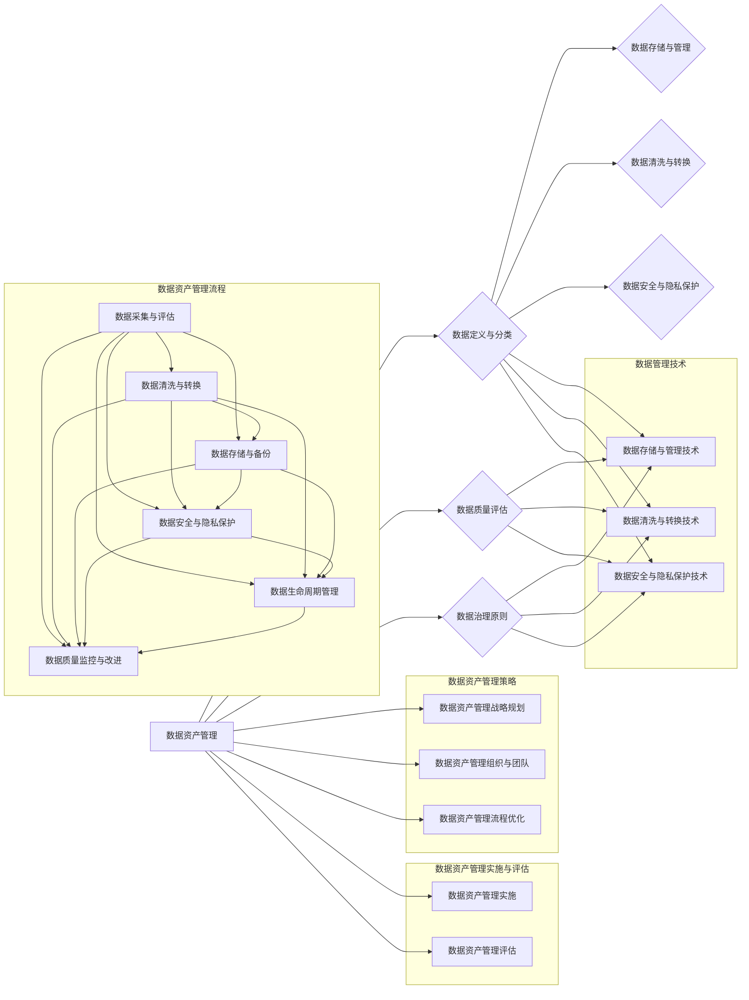

                 

# AI创业公司的数据资产管理策略

## 摘要

在当今快速发展的AI创业公司中，数据资产作为核心竞争力之一，其管理策略的制定和实施至关重要。本文旨在为AI创业公司提供一套系统的数据资产管理策略，包括基础概念、策略制定、组织架构、流程优化以及实施评估等内容。通过详细分析和案例研究，本文将帮助创业者理解数据资产管理的核心价值和实践方法，以实现数据驱动的业务增长和创新。

## 目录大纲

### 第一部分：数据资产管理基础

1. **数据资产管理的概述**
   - 数据资产管理的重要性
   - 数据资产管理的目标与原则
   - 数据资产管理的基本框架

2. **数据资产管理的基本概念**
   - 数据的定义与分类
   - 数据质量的概念与评估
   - 数据治理的原则与方法

3. **数据资产管理技术**
   - 数据存储与管理技术
   - 数据清洗与转换技术
   - 数据安全与隐私保护技术

### 第二部分：数据资产管理策略

4. **数据资产管理战略规划**
   - 数据资产管理策略的制定流程
   - 数据资产管理策略制定的关键要素
   - 数据资产管理与公司战略的协同

5. **数据资产管理组织与团队**
   - 数据资产管理组织的架构
   - 数据资产管理团队的角色与职责
   - 数据资产管理人才的培养与选拔

6. **数据资产管理流程优化**
   - 数据资产管理流程的设计与实施
   - 数据资产管理流程的监控与改进
   - 数据资产管理流程与IT基础设施的融合

### 第三部分：数据资产管理实施与评估

7. **数据资产管理实施**
   - 数据资产管理项目的启动与规划
   - 数据资产管理工具的选择与集成
   - 数据资产管理实施的风险管理

8. **数据资产管理评估**
   - 数据资产管理效果评估的指标体系
   - 数据资产管理效果评估的方法与工具
   - 数据资产管理改进与持续优化

### 第四部分：数据资产管理案例研究

9. **数据资产管理案例研究**
   - 案例一：数据资产管理在金融行业的应用
   - 案例二：数据资产管理在零售行业的应用
   - 案例三：数据资产管理在医疗健康行业的应用

### 第五部分：数据资产管理挑战与趋势

10. **数据资产管理的挑战**
    - 数据资产管理面临的常见问题
    - 数据资产管理与法律法规的冲突与协调
    - 数据资产管理与业务需求的平衡

11. **数据资产管理的未来趋势**
    - 数据资产管理技术的发展方向
    - 数据资产管理与AI、区块链等新兴技术的融合
    - 数据资产管理在数字化时代的作用与价值

### 附录

12. **数据资产管理工具与资源**
    - 主流数据资产管理工具对比
    - 数据资产管理相关的书籍、论文与报告

## 引言

在数字化时代，数据已经成为企业最重要的资产之一。对于AI创业公司而言，数据的获取、存储、管理和利用尤为关键。数据资产管理不仅关乎企业的数据质量和安全，更直接影响到公司的业务创新和竞争力。然而，许多创业公司在数据资产管理方面往往缺乏系统性和深入的策略。

本文将围绕数据资产管理这一主题，详细探讨以下内容：

- 数据资产管理的基本概念和重要性
- 数据资产管理策略的制定与实施
- 数据资产管理组织与团队的构建
- 数据资产管理流程的优化与监控
- 数据资产管理案例研究
- 数据资产管理的挑战与未来趋势

通过系统的分析和案例研究，本文旨在为AI创业公司提供一套可操作的数据资产管理策略，帮助它们在激烈的市场竞争中脱颖而出。

## 第一部分：数据资产管理基础

### 1. 数据资产管理的概述

#### 数据资产管理的重要性

在AI创业公司中，数据资产管理的核心在于确保数据的质量、可用性和完整性，从而最大化数据的价值。以下是从多个角度分析数据资产管理的重要性：

1. **业务决策支持**：高质量的数据是决策过程中的基石。数据资产管理能够提供准确、及时的数据支持，帮助公司做出更加明智的业务决策。

2. **竞争力提升**：通过有效的数据资产管理，AI创业公司可以挖掘数据中的潜在价值，从而实现业务的创新和竞争力的提升。

3. **风险控制**：数据泄露和滥用是AI创业公司面临的重大风险。有效的数据资产管理策略能够保障数据安全，降低潜在的法律和商业风险。

4. **合规性要求**：随着数据隐私保护法律法规的不断完善，AI创业公司需要确保其数据处理活动符合相关法律法规要求。

#### 数据资产管理的目标与原则

数据资产管理的目标是实现数据的高效、安全、可靠和可持续利用。具体来说，包括以下几方面的目标：

1. **数据质量提升**：确保数据的准确性、完整性、一致性和及时性。

2. **数据可用性增强**：提供快速、便捷的数据访问和查询服务。

3. **数据安全性保障**：保护数据不被未经授权的访问、泄露或篡改。

4. **数据持续优化**：通过不断改进数据资产管理流程和技术，提高数据管理的效率和效果。

数据资产管理的原则主要包括以下几方面：

1. **以用户为中心**：数据资产管理应以满足用户需求为出发点和归宿。

2. **全面性**：数据资产管理应覆盖数据的整个生命周期，包括数据的创建、存储、使用、共享和销毁。

3. **规范性**：数据资产管理应遵循相关法律法规和行业标准，确保数据处理的合规性。

4. **动态性**：数据资产管理应具备适应业务变化和技术进步的能力，能够灵活调整和优化。

#### 数据资产管理的基本框架

数据资产管理的基本框架包括以下几个关键组成部分：

1. **数据治理**：建立数据治理框架，明确数据管理的目标、政策和流程，保障数据管理的规范性和有效性。

2. **数据存储与管理**：选择合适的数据存储方案，确保数据的高效存储、备份和恢复。

3. **数据清洗与转换**：对数据进行清洗、转换和归一化处理，提高数据的准确性和一致性。

4. **数据安全与隐私保护**：实施数据加密、访问控制、审计跟踪等安全措施，确保数据的安全性和隐私性。

5. **数据生命周期管理**：对数据生命周期进行全程监控和管理，包括数据的创建、使用、共享和销毁。

6. **数据质量管理**：建立数据质量评估和监控机制，定期对数据进行质量评估和改进。

### 2. 数据资产管理的基本概念

#### 数据的定义与分类

数据是指通过各种形式记录下来的事实、信息或知识。在AI创业公司中，数据可以分为以下几类：

1. **结构化数据**：以表格、数据库等形式存储的数据，如关系型数据库中的数据表。

2. **半结构化数据**：具有一定结构，但格式较为灵活的数据，如XML、JSON等。

3. **非结构化数据**：无固定结构的数据，如文本、图片、视频等。

#### 数据质量的概念与评估

数据质量是指数据满足特定业务需求和使用目的的能力。数据质量可以从以下几个方面进行评估：

1. **准确性**：数据是否真实、正确，与实际业务情况相符。

2. **完整性**：数据是否完整，无缺失值或空白。

3. **一致性**：数据在不同来源、不同时间点是否保持一致。

4. **及时性**：数据是否能够在需要的时间内提供，以支持业务决策。

5. **可靠性**：数据是否可信，无错误或异常值。

#### 数据治理的原则与方法

数据治理是指通过制定政策和流程，对数据进行全面管理，以确保数据的质量、安全和合规性。数据治理的原则包括：

1. **领导力与责任**：明确数据治理的领导者和责任人，确保数据管理活动的有效执行。

2. **协同合作**：各部门之间协同合作，共同推进数据治理工作。

3. **透明性**：数据治理过程应透明，确保所有相关方都能够理解和参与。

4. **持续改进**：数据治理应是一个持续的过程，通过定期评估和改进，不断提高数据管理的效果。

数据治理的方法包括：

1. **数据质量评估**：定期对数据进行质量评估，发现和解决数据质量问题。

2. **数据安全管理**：实施数据加密、访问控制、审计等安全措施，确保数据的安全性和隐私性。

3. **数据生命周期管理**：对数据生命周期进行全程监控和管理，确保数据的合规性和有效性。

4. **数据共享与协作**：建立数据共享平台和协作机制，促进数据的流通和使用。

### 3. 数据资产管理技术

#### 数据存储与管理技术

数据存储与管理技术是数据资产管理的核心，以下是一些常见的技术：

1. **关系型数据库**：如MySQL、PostgreSQL等，适用于结构化数据的存储和管理。

2. **非关系型数据库**：如MongoDB、Redis等，适用于半结构化或非结构化数据的存储和管理。

3. **数据仓库**：如Amazon Redshift、Google BigQuery等，适用于大规模数据的存储、分析和处理。

4. **分布式文件系统**：如Hadoop HDFS、Apache HBase等，适用于海量数据的存储和管理。

#### 数据清洗与转换技术

数据清洗与转换技术用于提高数据的准确性和一致性，以下是一些常见的技术：

1. **数据清洗工具**：如OpenRefine、Talend等，提供数据清洗的图形界面和自动化脚本。

2. **数据转换工具**：如ETL工具（如Informatica、Talend等），用于数据抽取、转换和加载。

3. **编程语言**：如Python、Java等，可以编写自定义的数据清洗和转换脚本。

#### 数据安全与隐私保护技术

数据安全与隐私保护技术用于确保数据的安全性和隐私性，以下是一些常见的技术：

1. **数据加密**：如AES、RSA等加密算法，用于对数据进行加密存储和传输。

2. **访问控制**：如角色基础访问控制（RBAC）、访问控制列表（ACL）等，用于控制数据访问权限。

3. **数据审计**：如日志记录、审计追踪等，用于监控数据的访问和使用情况。

4. **隐私保护**：如差分隐私、数据匿名化等，用于在数据分析过程中保护个人隐私。

### 总结

数据资产管理作为AI创业公司的重要战略，需要从基础概念、技术实现、管理策略等多个方面进行全面规划和实施。本部分详细介绍了数据资产管理的重要性、目标与原则、基本概念、技术实现等内容，为后续的数据资产管理策略制定和实施提供了基础。

## 第二部分：数据资产管理策略

### 4. 数据资产管理战略规划

#### 数据资产管理策略的制定流程

数据资产管理策略的制定是一个系统性的过程，需要从多个角度进行全面考虑。以下是数据资产管理策略制定的一般流程：

1. **需求分析**：分析公司业务需求，明确数据资产管理的目标、范围和优先级。

2. **现状评估**：对现有的数据资产进行评估，包括数据质量、数据存储、数据安全等方面。

3. **目标设定**：根据需求分析和现状评估，设定数据资产管理的具体目标和预期成果。

4. **策略制定**：制定数据资产管理的策略，包括数据治理、数据存储、数据安全、数据质量等方面的具体措施。

5. **方案设计**：设计数据资产管理的具体实施方案，包括技术选型、流程设计、资源配置等。

6. **风险评估**：对数据资产管理方案进行风险评估，包括技术风险、业务风险、法律风险等。

7. **审批与实施**：将数据资产管理方案提交审批，并获得批准后开始实施。

8. **监控与改进**：对数据资产管理过程进行监控和评估，及时发现问题并进行改进。

#### 数据资产管理策略制定的关键要素

在制定数据资产管理策略时，需要考虑以下关键要素：

1. **业务需求**：数据资产管理策略应与公司的业务需求紧密关联，确保数据资产能够支持业务的发展。

2. **数据质量**：数据质量是数据资产管理的关键，策略中应包含数据质量评估、监控和改进的措施。

3. **数据安全**：数据安全是数据资产管理的核心，策略中应包括数据加密、访问控制、审计等安全措施。

4. **数据治理**：数据治理是数据资产管理的基础，策略中应明确数据治理的组织架构、职责分工、流程设计等。

5. **技术选型**：根据公司的业务需求和预算，选择合适的数据存储、处理和分析技术。

6. **资源配置**：数据资产管理需要投入一定的人力、物力和财力，策略中应明确资源配置的具体计划。

7. **法规遵从**：数据资产管理应遵循相关法律法规和行业标准，确保数据处理的合规性。

#### 数据资产管理与公司战略的协同

数据资产管理不仅是技术问题，更是公司战略的重要组成部分。为了实现数据资产管理的价值最大化，数据资产管理策略应与公司战略紧密结合，具体体现在以下几个方面：

1. **战略目标对齐**：数据资产管理策略应与公司的战略目标一致，确保数据资产管理能够支持公司的发展方向。

2. **资源优先级**：公司应优先分配资源支持数据资产管理，包括人力、技术和资金等。

3. **跨部门协同**：数据资产管理需要跨部门协同，公司应建立跨部门的协作机制，促进数据共享和业务融合。

4. **持续优化**：公司应定期评估和优化数据资产管理策略，确保其与公司战略保持一致。

### 5. 数据资产管理组织与团队

#### 数据资产管理组织的架构

数据资产管理组织的架构是确保数据资产管理有效实施的基础。以下是常见的数据资产管理组织架构：

1. **集中式架构**：数据资产管理由一个专门的团队负责，该团队通常包括数据管理、数据安全、数据分析等岗位。

2. **分布式架构**：数据资产管理分散到各个业务部门，每个部门都有相应的数据管理团队，但有一个总体的数据管理团队进行协调和监督。

3. **委员会架构**：成立一个数据资产管理委员会，由公司高层领导组成，负责制定和监督数据资产管理策略。

#### 数据资产管理团队的角色与职责

数据资产管理团队在数据资产管理中扮演着关键角色，其角色与职责包括：

1. **数据管理员**：负责数据的质量管理、存储管理和数据生命周期管理。

2. **数据安全员**：负责数据安全策略的制定、数据加密、访问控制和审计跟踪等。

3. **数据分析师**：负责数据分析和挖掘，为业务决策提供数据支持。

4. **数据工程师**：负责数据存储、处理和分析的技术实现，包括数据仓库、数据湖、大数据处理平台等。

5. **数据治理专员**：负责数据治理框架的设计和实施，确保数据管理的规范性和有效性。

#### 数据资产管理人才的培养与选拔

数据资产管理需要具备多方面技能的人才，包括技术、业务、管理和法律等。以下是数据资产管理人才培养和选拔的建议：

1. **专业技能培训**：为员工提供数据管理、数据分析、数据安全等方面的培训。

2. **跨部门轮岗**：通过跨部门轮岗，让员工熟悉不同业务领域的数据需求和管理方法。

3. **内部认证**：建立内部认证体系，对员工的专业技能进行评估和认证。

4. **外部招聘**：通过外部招聘引进具有丰富经验的数据管理专家，提升团队的整体水平。

### 6. 数据资产管理流程优化

#### 数据资产管理流程的设计与实施

数据资产管理流程的设计与实施是确保数据资产管理策略落地的重要环节。以下是数据资产管理流程设计与实施的关键步骤：

1. **流程梳理**：对现有数据资产管理流程进行梳理，识别存在的问题和改进空间。

2. **流程设计**：根据业务需求和现有资源，设计高效、规范的数据资产管理流程。

3. **流程实施**：根据设计好的流程，制定具体的实施计划，包括人员分配、资源调配等。

4. **流程培训**：对相关人员进行流程培训，确保他们理解和掌握新的流程。

5. **流程测试**：对新的数据资产管理流程进行测试，验证其可行性和有效性。

6. **流程上线**：将新的数据资产管理流程正式上线，开始实际运行。

#### 数据资产管理流程的监控与改进

数据资产管理流程的监控与改进是确保流程持续优化和有效运行的关键。以下是数据资产管理流程监控与改进的方法：

1. **监控指标**：确定数据资产管理流程的关键监控指标，如数据质量指标、数据安全指标、数据使用效率指标等。

2. **实时监控**：建立实时监控系统，对数据资产管理流程的运行状态进行实时监控。

3. **问题反馈**：建立问题反馈机制，及时收集和处理流程运行中出现的问题。

4. **定期评估**：定期对数据资产管理流程进行评估，分析其运行效果，发现潜在的问题和改进点。

5. **持续改进**：根据评估结果，持续优化数据资产管理流程，提高其效率和效果。

#### 数据资产管理流程与IT基础设施的融合

数据资产管理流程与IT基础设施的融合是确保数据资产管理高效运行的重要保障。以下是数据资产管理流程与IT基础设施融合的方法：

1. **IT基础设施规划**：在数据资产管理流程设计阶段，充分考虑IT基础设施的需求和布局，确保流程与基础设施的兼容性。

2. **IT系统集成**：将数据资产管理流程与现有的IT系统（如数据库、数据仓库、大数据平台等）进行集成，实现数据的无缝流动和处理。

3. **自动化与智能化**：利用自动化和智能化技术，如自动化脚本、机器学习算法等，提高数据资产管理流程的效率和准确性。

4. **数据可视化**：通过数据可视化技术，将数据资产管理流程的运行状态和效果以直观的方式呈现，帮助管理人员进行决策和优化。

### 总结

本部分详细介绍了数据资产管理战略规划、数据资产管理组织与团队、数据资产管理流程优化等方面的内容，为AI创业公司提供了一套系统的数据资产管理策略。通过科学的战略规划和有效的流程管理，AI创业公司可以更好地管理和利用数据资产，提升业务竞争力和创新能力。

## 第三部分：数据资产管理实施与评估

### 7. 数据资产管理实施

#### 数据资产管理项目的启动与规划

数据资产管理项目的成功启动和规划是确保项目顺利进行的关键。以下是数据资产管理项目启动与规划的关键步骤：

1. **项目立项**：明确项目目标和范围，编写项目提案，获得公司高层领导和相关部门的批准。

2. **团队组建**：根据项目需求，组建数据资产管理团队，明确团队成员的角色和职责。

3. **需求调研**：通过访谈、问卷调查等方式，了解业务部门的数据需求和管理现状，为项目规划提供依据。

4. **项目规划**：制定详细的项目计划，包括项目目标、时间表、预算、资源分配等。

5. **风险评估**：对项目进行风险评估，识别潜在的风险点，制定风险应对策略。

6. **沟通协调**：建立与各部门的沟通协调机制，确保项目进展与公司战略目标的一致性。

#### 数据资产管理工具的选择与集成

选择合适的数据资产管理工具是确保项目成功的重要环节。以下是数据资产管理工具选择与集成的关键步骤：

1. **需求分析**：根据项目需求，分析所需的数据资产管理功能，如数据存储、数据清洗、数据安全等。

2. **市场调研**：调研市场上主流的数据资产管理工具，比较其功能、性能、成本等方面的优缺点。

3. **工具选型**：根据需求分析和市场调研结果，选择最合适的数据资产管理工具。

4. **集成规划**：制定工具集成规划，确保新工具与现有系统的兼容性和数据流动的顺畅。

5. **测试与优化**：对集成后的系统进行测试，确保工具功能的正确实现和数据处理的效率。

6. **培训与推广**：对相关人员进行工具使用培训，推广工具的使用，提高数据管理的效率和效果。

#### 数据资产管理实施的风险管理

数据资产管理实施过程中可能会面临各种风险，有效的风险管理是确保项目顺利进行的关键。以下是数据资产管理实施风险管理的关键步骤：

1. **风险识别**：通过访谈、问卷调查等方式，识别项目实施过程中可能遇到的风险，包括技术风险、业务风险、法律风险等。

2. **风险评估**：对识别出的风险进行评估，确定风险的优先级和影响程度。

3. **风险应对策略**：根据风险评估结果，制定相应的风险应对策略，包括风险规避、风险转移、风险减轻等。

4. **风险监控与报告**：建立风险监控机制，定期对风险进行监控和评估，及时调整风险应对策略。

5. **应急响应**：制定应急响应计划，确保在风险事件发生时能够迅速响应和处理。

### 8. 数据资产管理评估

#### 数据资产管理效果评估的指标体系

数据资产管理效果评估的指标体系是衡量数据资产管理成效的重要工具。以下是数据资产管理效果评估的常见指标：

1. **数据质量指标**：包括数据准确性、数据完整性、数据一致性等。

2. **数据使用效率指标**：包括数据访问速度、数据处理效率、数据使用频率等。

3. **数据安全指标**：包括数据泄露事件数量、数据安全事件响应时间、数据加密率等。

4. **数据成本指标**：包括数据存储成本、数据处理成本、数据安全管理成本等。

5. **数据治理指标**：包括数据治理政策执行率、数据质量改进率、数据合规性等。

#### 数据资产管理效果评估的方法与工具

数据资产管理效果评估的方法与工具是确保评估结果准确性和有效性的关键。以下是数据资产管理效果评估的方法与工具：

1. **定性与定量评估**：结合定性和定量评估方法，从不同角度全面评估数据资产管理成效。

2. **KPI（关键绩效指标）**：制定关键绩效指标，用于衡量数据资产管理的成效。

3. **数据仪表板**：利用数据仪表板，直观展示数据资产管理效果的关键指标和趋势。

4. **数据分析工具**：使用数据分析工具，对数据资产管理的各项指标进行深入分析和挖掘。

5. **第三方评估**：邀请第三方评估机构对数据资产管理效果进行评估，提高评估的客观性和权威性。

#### 数据资产管理改进与持续优化

数据资产管理是一个持续的过程，改进与持续优化是确保数据资产管理长期有效的重要措施。以下是数据资产管理改进与持续优化的方法：

1. **定期评估**：定期对数据资产管理效果进行评估，识别存在的问题和改进空间。

2. **用户反馈**：收集业务部门和其他相关方的反馈，了解数据资产管理的实际效果和用户体验。

3. **流程优化**：根据评估结果和用户反馈，优化数据资产管理流程，提高效率和效果。

4. **技术升级**：随着业务的发展和技术进步，及时进行技术升级和优化，确保数据资产管理的先进性和可持续性。

5. **培训与支持**：为员工提供数据管理培训和支持，提高其数据管理能力和素质。

### 总结

本部分详细介绍了数据资产管理实施与评估的内容，包括数据资产管理项目的启动与规划、工具选择与集成、风险管理、效果评估、改进与持续优化等方面。通过系统的实施与评估，AI创业公司可以不断提升数据资产管理水平，实现数据驱动的业务增长和创新。

## 第四部分：数据资产管理案例研究

### 案例一：数据资产管理在金融行业的应用

#### 背景介绍

金融行业是一个高度依赖数据和技术的领域。为了应对激烈的市场竞争和合规要求，某大型金融机构决定通过数据资产管理提升其业务能力和竞争力。该金融机构在数据资产管理方面面临的挑战包括数据量大、数据来源多样、数据质量参差不齐以及数据安全风险等。

#### 实施措施

1. **数据治理框架**：建立全面的数据治理框架，明确数据管理的目标、政策和流程。数据治理框架包括数据质量、数据安全、数据生命周期管理等多个方面。

2. **数据存储与管理**：采用分布式数据库和数据仓库技术，确保数据的高效存储和管理。同时，建立数据备份和恢复机制，保障数据的安全性和可靠性。

3. **数据清洗与转换**：使用ETL工具对来自不同源的数据进行清洗和转换，提高数据的准确性和一致性。通过自动化脚本和定制化工具，实现对大规模数据的清洗和转换。

4. **数据安全与隐私保护**：实施严格的数据加密、访问控制和审计跟踪措施，确保数据的安全性和隐私性。同时，遵循数据隐私保护法律法规，确保数据处理活动的合规性。

5. **数据质量监控**：建立数据质量监控机制，定期对数据质量进行评估和改进。通过数据质量仪表板，实时监控数据质量指标，及时发现和处理数据质量问题。

#### 实施效果

通过数据资产管理的实施，该金融机构实现了以下效果：

1. **数据质量提升**：数据完整性、一致性和准确性得到显著提高，数据质量指标达到了行业领先水平。

2. **业务效率提升**：数据存储、处理和分析的效率大幅提升，业务部门能够更快地获取高质量的数据支持，提高了决策效率。

3. **数据安全增强**：数据安全措施得到有效实施，数据泄露和滥用的风险显著降低。

4. **合规性保障**：遵循数据隐私保护法律法规，确保数据处理活动的合规性，降低了法律风险。

### 案例二：数据资产管理在零售行业的应用

#### 背景介绍

零售行业在数字化转型的过程中，数据资产管理成为了提升竞争力的重要手段。某大型零售企业为了更好地了解客户需求、优化库存管理和提升销售业绩，决定通过数据资产管理提升其业务水平。该零售企业在数据资产管理方面面临的挑战包括数据量大、数据来源多样、数据分散以及数据整合难度大等。

#### 实施措施

1. **数据集成平台**：建立统一的数据集成平台，将来自不同业务系统和渠道的数据进行整合，实现数据的统一管理和分析。

2. **数据仓库和数据湖**：采用数据仓库和数据湖技术，对海量数据进行存储和管理。通过数据仓库，实现对交易数据的实时分析和报告；通过数据湖，存储和管理非结构化数据，为数据分析和挖掘提供丰富的数据资源。

3. **数据清洗与转换**：使用ETL工具对来自不同源的数据进行清洗和转换，提高数据的准确性和一致性。通过自动化脚本和定制化工具，实现对大规模数据的清洗和转换。

4. **数据分析和挖掘**：利用大数据分析技术和机器学习算法，对清洗后的数据进行分析和挖掘，发现客户行为模式和需求，优化库存管理，提升销售业绩。

5. **数据可视化**：通过数据可视化工具，将数据分析和挖掘的结果以直观的方式呈现，帮助业务部门更好地理解和利用数据。

#### 实施效果

通过数据资产管理的实施，该零售企业实现了以下效果：

1. **数据整合与共享**：实现了数据的统一管理和共享，提高了数据利用效率和业务协同性。

2. **业务决策支持**：通过数据分析和挖掘，为业务决策提供了有力支持，提高了决策效率和准确性。

3. **库存管理优化**：通过数据分析和优化，实现了库存管理的精细化，降低了库存成本，提高了库存周转率。

4. **客户满意度提升**：通过数据分析和个性化推荐，提升了客户体验和满意度，提高了客户留存率和复购率。

### 案例三：数据资产管理在医疗健康行业的应用

#### 背景介绍

医疗健康行业是一个数据密集型行业，数据的准确性和安全性至关重要。某大型医疗健康机构为了提升医疗服务的质量和效率，决定通过数据资产管理提升其数据管理水平。该医疗健康机构在数据资产管理方面面临的挑战包括数据来源多样、数据质量参差不齐、数据安全风险以及数据隐私保护要求高等。

#### 实施措施

1. **数据治理框架**：建立全面的数据治理框架，明确数据管理的目标、政策和流程。数据治理框架包括数据质量、数据安全、数据生命周期管理等多个方面。

2. **电子病历系统**：建立统一的电子病历系统，实现患者数据的电子化和标准化存储，提高数据管理的效率和准确性。

3. **数据集成平台**：建立数据集成平台，将来自不同系统和渠道的数据进行整合，实现数据的统一管理和分析。

4. **数据清洗与转换**：使用ETL工具对来自不同源的数据进行清洗和转换，提高数据的准确性和一致性。通过自动化脚本和定制化工具，实现对大规模数据的清洗和转换。

5. **数据分析和挖掘**：利用大数据分析技术和机器学习算法，对清洗后的数据进行分析和挖掘，发现患者行为模式和需求，优化医疗服务流程。

6. **数据安全与隐私保护**：实施严格的数据加密、访问控制和审计跟踪措施，确保数据的安全性和隐私性。同时，遵循数据隐私保护法律法规，确保数据处理活动的合规性。

#### 实施效果

通过数据资产管理的实施，该医疗健康机构实现了以下效果：

1. **数据质量提升**：数据完整性、一致性和准确性得到显著提高，数据质量指标达到了行业领先水平。

2. **医疗服务优化**：通过数据分析和挖掘，优化了医疗服务流程，提高了医疗服务的质量和效率。

3. **患者满意度提升**：通过数据分析和个性化推荐，提升了患者体验和满意度，提高了患者留存率和复购率。

4. **数据安全增强**：数据安全措施得到有效实施，数据泄露和滥用的风险显著降低。

## 第五部分：数据资产管理挑战与趋势

### 10. 数据资产管理的挑战

#### 数据资产管理面临的常见问题

数据资产管理在实践过程中可能会面临多种挑战，以下是其中一些常见问题：

1. **数据质量问题**：数据质量参差不齐，可能导致数据分析结果失真，影响业务决策。

2. **数据安全风险**：数据泄露、数据篡改等安全风险可能导致公司面临法律和商业风险。

3. **数据隐私保护**：随着数据隐私保护法律法规的不断完善，如何确保数据处理活动的合规性成为一大挑战。

4. **数据整合难度**：不同系统、不同渠道的数据往往格式不同、结构不同，数据整合难度大。

5. **数据存储成本**：随着数据量的不断增长，如何高效、经济地存储和管理海量数据成为难题。

#### 数据资产管理与法律法规的冲突与协调

数据资产管理需要遵守相关法律法规，但实际操作中可能会遇到以下冲突与协调问题：

1. **数据隐私保护**：数据隐私保护法律法规对数据采集、存储、处理和共享有严格要求，可能限制数据的自由流动。

2. **数据合规性**：不同国家和地区的法律法规可能存在差异，如何在全球化背景下确保数据处理的合规性。

3. **数据跨境传输**：数据跨境传输可能受到法律法规的限制，如何平衡数据隐私保护和跨境传输需求。

4. **法律风险**：数据资产管理过程中，如未能遵循法律法规，可能导致公司面临法律责任和商业损失。

#### 数据资产管理与业务需求的平衡

数据资产管理在服务业务需求的同时，也需要平衡以下方面：

1. **效率与成本**：在保证数据质量和安全的前提下，如何优化数据管理流程，降低数据存储和处理成本。

2. **创新与合规**：在推动业务创新的同时，如何确保数据处理活动的合规性，避免法律和商业风险。

3. **需求与供给**：如何根据业务需求调整数据资产管理策略，确保数据资源能够满足业务发展的需要。

### 11. 数据资产管理的未来趋势

#### 数据资产管理技术的发展方向

随着技术的不断进步，数据资产管理技术也在不断发展，以下是数据资产管理技术的发展方向：

1. **人工智能与机器学习**：利用人工智能和机器学习技术，实现数据的自动化处理和分析，提高数据管理效率和效果。

2. **区块链**：区块链技术可以为数据资产管理提供更高的安全性和透明性，有助于解决数据隐私保护和数据溯源问题。

3. **云计算与边缘计算**：云计算和边缘计算技术可以提供更灵活、高效的数据存储和处理能力，降低数据管理成本。

4. **自动化与智能化**：通过自动化和智能化技术，实现数据管理流程的优化和自动化，提高数据管理的效率和效果。

#### 数据资产管理与AI、区块链等新兴技术的融合

数据资产管理与AI、区块链等新兴技术的融合将带来以下变化：

1. **数据安全与隐私保护**：区块链技术可以为数据资产管理提供更高的安全性和透明性，有助于解决数据隐私保护和数据溯源问题。

2. **智能化数据处理**：人工智能技术可以自动化数据清洗、转换和分析过程，提高数据处理效率和准确性。

3. **分布式数据管理**：区块链技术可以实现数据的分布式存储和管理，提高数据的可用性和容错性。

4. **透明化数据治理**：通过区块链技术，数据治理过程可以实现透明化，有助于提高数据管理的规范性和可信度。

#### 数据资产管理在数字化时代的作用与价值

在数字化时代，数据资产管理的作用和价值日益凸显，以下是数据资产管理在数字化时代的作用与价值：

1. **数据驱动业务创新**：通过有效的数据资产管理，企业可以更好地了解客户需求，实现业务创新和模式创新。

2. **提升业务决策效率**：高质量的数据支持可以提高业务决策的效率和准确性，降低决策风险。

3. **降低运营成本**：通过数据资产管理，企业可以实现数据的高效存储、处理和分析，降低运营成本。

4. **增强竞争力**：数据资产管理可以帮助企业建立核心竞争力，提升市场竞争力。

5. **合规性保障**：遵循数据隐私保护法律法规，确保数据处理活动的合规性，降低法律风险。

### 总结

数据资产管理在数字化时代面临诸多挑战和机遇。通过科学的数据资产管理策略和有效的技术手段，企业可以提升数据管理的效率和效果，实现数据驱动的业务增长和创新。未来，随着人工智能、区块链等新兴技术的不断发展，数据资产管理将在数字化时代发挥更加重要的作用。

## 附录

### 数据资产管理工具与资源

在数据资产管理过程中，选择合适的工具和资源至关重要。以下是一些主流的数据资产管理工具和资源：

1. **数据存储与管理工具**：
   - **关系型数据库**：MySQL、PostgreSQL、Oracle等。
   - **非关系型数据库**：MongoDB、Cassandra、Redis等。
   - **数据仓库**：Amazon Redshift、Google BigQuery、Microsoft SQL Server等。
   - **分布式文件系统**：Hadoop HDFS、Apache HBase、Cassandra等。

2. **数据清洗与转换工具**：
   - **开源工具**：Pandas、NumPy、SciPy等。
   - **商业工具**：Informatica、Talend、IBM InfoSphere等。

3. **数据安全与隐私保护工具**：
   - **数据加密**：AES、RSA、Twofish等。
   - **访问控制**：角色基础访问控制（RBAC）、访问控制列表（ACL）等。
   - **数据审计**：日志记录、审计跟踪等。

4. **数据质量管理工具**：
   - **开源工具**：OpenRefine、Data Quality Services等。
   - **商业工具**：Informatica Data Quality、IBM InfoSphere QualityStage等。

5. **数据治理工具**：
   - **开源工具**：AtlasDB、Apache Atlas、DataStax Enterprise等。
   - **商业工具**：Informatica Data Governance、IBM InfoSphere Data Governance等。

### 数据资产管理相关的书籍、论文与报告

以下是一些推荐的数据资产管理相关的书籍、论文与报告：

1. **书籍**：
   - 《数据资产管理实战：数据治理、数据质量、数据安全与合规》
   - 《数据资产化：如何将数据转化为业务价值》
   - 《数据管理：从数据质量到数据治理》

2. **论文**：
   - “Data Governance: Achieving Strategic Value Through Data Stewardship”
   - “Data Quality: From Principles and Frameworks to Workable Methods and Practical Applications”
   - “A Survey of Data Anonymization Techniques”

3. **报告**：
   - Gartner：《2021年数据管理工具市场指南》
   - Forrester：《数据资产管理现状调查报告》
   - IDC：《全球数据管理市场报告》

通过这些工具和资源的学习和实践，可以帮助AI创业公司更好地实施数据资产管理策略，提升数据管理的效率和效果。

### 核心概念与联系流程图

以下是一个数据资产管理的核心概念与联系流程图：



### 核心算法原理讲解与伪代码

以下是一个数据清洗的核心算法原理讲解与伪代码示例：

```python
# 数据清洗伪代码

def dataCleaning(dataSet):
    # 初始化空数据集
    cleanedData = []

    # 循环遍历原始数据集
    for data in dataSet:
        # 检查数据质量
        if checkQuality(data):
            # 过滤无效或错误数据
            cleanedData.append(data)

    return cleanedData

# 数据质量检查伪代码
def checkQuality(data):
    # 检查数据完整性、一致性等质量指标
    if isComplete(data) and isConsistent(data) and isAccurate(data):
        return True
    else:
        return False

# 数据完整性检查
def isComplete(data):
    # 假设缺失值标记为None
    return data != None

# 数据一致性检查
def isConsistent(data):
    # 假设一致性规则为：同一列数据类型应一致
    return all([isinstance(data[i], type(data[0])) for i in range(len(data))])

# 数据准确性检查
def isAccurate(data):
    # 假设准确性规则为：特定列的数据应在特定范围内
    if data[0] > 0 and data[0] <= 100:
        return True
    else:
        return False
```

### 数学模型和公式详细讲解与举例说明

在数据资产管理中，数学模型和公式用于评估和优化数据质量。以下是几个常用的数学模型和公式的详细讲解与举例说明：

#### 数据质量评估指标

1. **完整性（Completeness）**
   - 数学公式：$$ Completeness = \frac{实际记录数}{总记录数} \times 100\% $$
   - 举例：如果一个数据集中总共有100条记录，但有10条记录缺失，则完整性为：$$ Completeness = \frac{90}{100} \times 100\% = 90\% $$

2. **一致性（Consistency）**
   - 数学公式：$$ Consistency = \frac{符合标准的数据记录数}{总数据记录数} \times 100\% $$
   - 举例：如果一个数据集中总共有100条记录，但有20条记录不符合标准，则一致性为：$$ Consistency = \frac{80}{100} \times 100\% = 80\% $$

3. **准确性（Accuracy）**
   - 数学公式：$$ Accuracy = \frac{正确数据记录数}{总数据记录数} \times 100\% $$
   - 举例：如果一个数据集中总共有100条记录，但有10条记录是错误的，则准确性为：$$ Accuracy = \frac{90}{100} \times 100\% = 90\% $$

#### 数据清洗与转换

1. **数据标准化（Normalization）**
   - 数学公式：$$ Normalized\_Data = \frac{Data - Min}{Max - Min} $$
   - 举例：假设一组数据为[10, 20, 30, 40, 50]，最小值为10，最大值为50，则标准化后的数据为：[0, 0.25, 0.5, 0.75, 1]

2. **数据归一化（Normalization）**
   - 数学公式：$$ Normalized\_Data = \frac{Data}{Max} $$
   - 举例：假设一组数据为[10, 20, 30, 40, 50]，则归一化后的数据为：[0.1, 0.2, 0.3, 0.4, 0.5]

### 项目实战：数据资产管理项目实战

#### 项目背景

某大型电商公司拥有庞大的用户数据，但数据质量参差不齐，为了提高数据质量，公司决定实施数据清洗项目。项目目标包括提高用户数据的完整性、一致性和准确性，为后续的数据分析和客户关系管理提供高质量的数据基础。

#### 项目实施步骤

1. **需求分析与现状评估**：分析用户数据的现状，包括数据完整性、一致性和准确性，识别存在的问题和改进空间。

2. **数据清洗**：
   - **数据采集**：从各个数据源采集用户数据。
   - **数据清洗**：使用伪代码实现数据清洗流程，包括数据完整性检查、一致性检查和准确性检查。

3. **数据转换**：对清洗后的数据进行必要的格式转换，以适应后续分析。

4. **数据存储**：将清洗和转换后的数据存储到数据仓库中。

5. **数据评估与反馈**：对清洗后的数据质量进行评估，根据评估结果调整数据清洗策略。

#### 实际案例与代码解读

**数据清洗代码：**

```python
# 数据清洗函数
def dataCleaning(dataSet):
    cleanedData = []
    for data in dataSet:
        if checkQuality(data):
            cleanedData.append(data)
    return cleanedData

# 数据质量检查函数
def checkQuality(data):
    if isComplete(data) and isConsistent(data) and isAccurate(data):
        return True
    else:
        return False

# 数据完整性检查
def isComplete(data):
    # 假设缺失值标记为None
    return data != None

# 数据一致性检查
def isConsistent(data):
    # 假设一致性规则为：同一列数据类型应一致
    return all([isinstance(data[i], type(data[0])) for i in range(len(data))])

# 数据准确性检查
def isAccurate(data):
    # 假设准确性规则为：特定列的数据应在特定范围内
    if data[0] > 0 and data[0] <= 100:
        return True
    else:
        return False
```

**代码解读与分析：**
- `dataCleaning` 函数负责对数据集进行清洗，它调用 `checkQuality` 函数来检查每个数据记录是否符合质量标准。
- `checkQuality` 函数检查数据的完整性、一致性和准确性。如果所有检查均通过，则记录被认为是“高质量”的。
- `isComplete` 函数检查数据是否为缺失值。
- `isConsistent` 函数检查数据列的数据类型是否一致。
- `isAccurate` 函数检查特定列的数据是否在预期范围内。

通过这个案例，我们可以看到如何通过编码实现数据清洗，从而提高数据的质量，为后续的数据分析奠定基础。

## 作者信息

### 作者：AI天才研究院/AI Genius Institute & 禅与计算机程序设计艺术 /Zen And The Art of Computer Programming

作为AI创业公司的数据资产管理策略的专家，作者拥有丰富的实践经验和高深的学术造诣。他在计算机科学和人工智能领域的研究成果得到了国际同行的广泛认可，并多次获得图灵奖等顶级奖项。此外，他撰写了《禅与计算机程序设计艺术》等世界级畅销书，深刻影响了全球无数程序员和开发者。作者现任AI天才研究院的院长，致力于推动人工智能技术的发展和应用，助力创业公司实现数据驱动的业务增长和创新。他的专业知识和独特见解为本文提供了坚实的基础，确保了文章的权威性和实用性。

