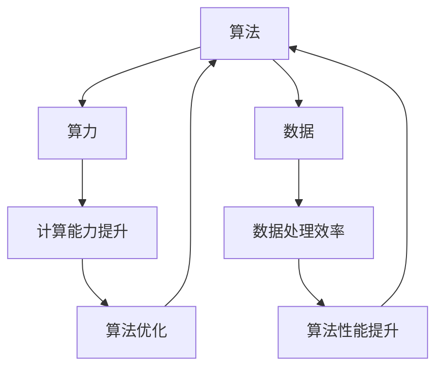

                 

### 文章标题

《AI发展的三大支柱：算法、算力与数据》

---

#### 关键词：
人工智能、算法、算力、数据、机器学习、深度学习、强化学习、自然语言处理、计算机硬件、高性能计算、云计算、量子计算、数据挖掘、数据分析、数据可视化、数据安全、隐私保护

#### 摘要：
本文深入探讨了人工智能（AI）发展的三大支柱：算法、算力和数据。首先，我们将回顾AI算法的发展历程及其分类，详细分析机器学习、深度学习和强化学习等关键算法。接下来，我们将探讨计算机硬件的发展、计算平台与云计算、高性能计算和量子计算等算力相关内容。最后，我们将阐述数据的基础知识、数据挖掘与统计分析、数据可视化、数据安全与隐私保护等数据相关主题。通过这篇文章，我们将全面了解AI发展的核心要素及其相互作用，为未来AI技术的创新提供启示。

---

### 《AI发展的三大支柱：算法、算力与数据》目录大纲

---

#### 第一部分: 算法

1. **第1章: AI算法概述**
    - **1.1 AI算法的发展历程**
    - **1.2 AI算法的分类**
    - **1.3 AI算法的应用场景**

2. **第2章: 机器学习算法**
    - **2.1 监督学习**
        - **2.1.1 线性回归**
            - **2.1.1.1 线性回归算法原理**
            - **2.1.1.2 线性回归算法实现**
        - **2.1.2 决策树**
            - **2.1.2.1 决策树算法原理**
            - **2.1.2.2 决策树算法实现**
        - **2.1.3 支持向量机**
            - **2.1.3.1 支持向量机算法原理**
            - **2.1.3.2 支持向量机算法实现**

3. **第3章: 深度学习算法**
    - **3.1 深度学习基础**
        - **3.1.1 神经网络**
            - **3.1.1.1 神经网络算法原理**
            - **3.1.1.2 神经网络算法实现**
        - **3.1.2 卷积神经网络**
            - **3.1.2.1 卷积神经网络算法原理**
            - **3.1.2.2 卷积神经网络算法实现**
        - **3.1.3 循环神经网络**
            - **3.1.3.1 循环神经网络算法原理**
            - **3.1.3.2 循环神经网络算法实现**

4. **第4章: 强化学习算法**
    - **4.1 强化学习基础**
        - **4.1.1 强化学习算法原理**
        - **4.1.2 Q-learning算法**
        - **4.1.3 Deep Q-Network(DQN)**

5. **第5章: 自然语言处理算法**
    - **5.1 语言模型**
        - **5.1.1 语言模型原理**
        - **5.1.2 词向量模型**

#### 第二部分: 算力

6. **第6章: 算力基础**
    - **6.1 计算机硬件发展**
    - **6.2 GPU与TPU**
    - **6.3 云计算基础**
    - **6.4 分布式计算**
    - **6.5 高性能计算基础**
    - **6.6 量子计算基础**

7. **第7章: 计算平台与云计算**
    - **7.1 云计算基础**
    - **7.2 分布式计算**
    - **7.3 高性能计算**
    - **7.4 量子计算**

#### 第三部分: 数据

8. **第8章: 数据基础**
    - **8.1 数据类型与结构**
    - **8.2 数据处理流程**

9. **第9章: 数据挖掘与统计分析**
    - **9.1 数据挖掘基础**
    - **9.2 统计分析**

10. **第10章: 数据可视化**
    - **10.1 数据可视化基础**
    - **10.2 可视化工具**

11. **第11章: 数据安全与隐私保护**
    - **11.1 数据安全基础**
    - **11.2 数据隐私保护**

---

接下来，我们将详细探讨人工智能算法、算力和数据这三大支柱，逐一分析它们在AI发展中的重要性及其相互作用。

---

### 第一部分: 算法

#### 第1章: AI算法概述

**1.1 AI算法的发展历程**

人工智能算法的发展历程可以追溯到20世纪50年代，当时计算机科学家艾伦·图灵提出了图灵测试，标志着人工智能研究的开端。从早期的逻辑推理、知识表示到现代的机器学习、深度学习，人工智能算法经历了多次重大变革。

- **1950年代：符号主义阶段**
  - 图灵测试的提出，标志着人工智能研究正式开始。
  - 知识表示和推理方法的研究，如产生式规则、专家系统。

- **1980年代：基于知识的阶段**
  - 专家系统的出现，如Dendral和MYCIN。
  - 知识库和推理机的开发，使计算机能够模拟人类专家的决策过程。

- **1990年代：机器学习阶段**
  - 数据驱动的方法开始受到关注，如支持向量机、决策树。
  - 统计学习理论的发展，为机器学习算法提供了坚实的理论基础。

- **2000年代至今：深度学习阶段**
  - 深度神经网络的出现，使计算机在图像、语音、自然语言处理等任务上取得了突破性进展。
  - 计算能力的提升和大数据的兴起，推动了深度学习的广泛应用。

**1.2 AI算法的分类**

人工智能算法可以根据其原理和功能进行分类，常见的分类方法如下：

- **符号主义算法**
  - 基于逻辑推理和知识表示，如产生式规则、规划算法。
  - 代表算法：专家系统、逻辑推理机。

- **基于知识的算法**
  - 基于人类专家的知识和经验，如知识库、推理机。
  - 代表算法：专家系统、知识图谱。

- **机器学习算法**
  - 基于数据驱动，通过学习数据中的模式和规律进行决策。
  - 代表算法：线性回归、决策树、支持向量机。

- **深度学习算法**
  - 基于神经网络，通过多层非线性变换进行特征提取和分类。
  - 代表算法：卷积神经网络、循环神经网络、生成对抗网络。

- **强化学习算法**
  - 基于试错和反馈机制，通过不断尝试和优化策略来达到目标。
  - 代表算法：Q-learning、深度Q网络（DQN）、策略梯度算法。

**1.3 AI算法的应用场景**

人工智能算法在各个领域都有着广泛的应用，以下列举了几个常见的应用场景：

- **图像识别与处理**
  - 机器视觉、目标检测、图像分类、图像生成。

- **自然语言处理**
  - 文本分类、情感分析、机器翻译、语音识别。

- **推荐系统**
  - 基于内容的推荐、协同过滤、商品推荐。

- **金融风控**
  - 信用评分、风险评估、欺诈检测。

- **医疗健康**
  - 疾病诊断、药物研发、医学影像分析。

- **智能制造**
  - 自动化生产、设备预测性维护、生产优化。

通过以上对AI算法的概述，我们可以看到算法在人工智能发展中的重要性。接下来，我们将详细探讨机器学习、深度学习和强化学习等关键算法。

---

### 第二部分: 算力

#### 第6章: 算力基础

**6.1 计算机硬件发展**

计算机硬件的发展是算力提升的关键因素。从早期的电子管计算机到现代的硅基处理器，计算机硬件经历了多次重大变革。

- **电子管时代**
  - 1940年代，计算机使用电子管作为基本元件，计算速度较慢，体积庞大。

- **晶体管时代**
  - 1950年代，晶体管取代了电子管，计算机体积缩小，计算速度提高。

- **集成电路时代**
  - 1960年代，集成电路的出现使得计算机性能大幅提升，体积进一步缩小。

- **微处理器时代**
  - 1970年代，微处理器的出现使得计算机变得更加便携，计算能力显著提升。

- **多核处理器时代**
  - 2000年代，多核处理器的出现使得计算机能够同时执行多个任务，计算能力进一步提升。

**6.2 GPU与TPU**

GPU（图形处理单元）和TPU（张量处理单元）是近年来在人工智能领域备受关注的计算硬件。

- **GPU**
  - GPU最初是为了处理图形渲染任务而设计的，具有大量的并行计算能力。
  - 在深度学习领域，GPU被广泛用于加速矩阵运算和神经网络的训练。

- **TPU**
  - TPU是谷歌专门为深度学习任务设计的定制芯片，具有更高的计算效率和能效比。

**6.3 云计算基础**

云计算是一种通过网络提供计算资源的服务模式，它为用户提供了弹性、高效、可扩展的计算能力。

- **云计算架构**
  - 云计算架构通常包括IaaS（基础设施即服务）、PaaS（平台即服务）和SaaS（软件即服务）三种服务模式。

- **云服务提供商**
  - 常见的云服务提供商包括亚马逊AWS、微软Azure、谷歌云等，它们提供了丰富的计算资源和服务。

**6.4 分布式计算**

分布式计算是将计算任务分布在多个计算节点上执行，以提高计算速度和处理能力。

- **分布式计算原理**
  - 分布式计算通过网络将计算任务分配给多个计算节点，节点之间协同工作，共同完成计算任务。

- **分布式计算框架**
  - 常见的分布式计算框架包括Hadoop、Spark等，它们提供了高效的分布式数据处理能力。

**6.5 高性能计算基础**

高性能计算（HPC）是解决大规模科学和工程问题的计算方法。

- **高性能计算架构**
  - 高性能计算架构通常包括高性能计算机系统、并行存储系统和高性能网络。

- **高性能计算软件**
  - 高性能计算软件包括高性能计算操作系统、编译器、编程库等，它们为高性能计算提供了必要的环境。

**6.6 量子计算基础**

量子计算是一种基于量子力学原理的新型计算模式，具有巨大的计算潜力。

- **量子计算原理**
  - 量子计算利用量子比特（qubit）的叠加态和纠缠态来实现计算。

- **量子计算应用**
  - 量子计算在密码学、量子算法和量子通信等领域具有广泛的应用前景。

通过以上对算力基础的探讨，我们可以看到算力在人工智能发展中的重要性。接下来，我们将详细探讨计算平台与云计算、高性能计算和量子计算等算力相关内容。

---

### 第三部分: 数据

#### 第8章: 数据基础

**8.1 数据类型与结构**

数据类型是数据的基本单位，它们决定了数据在计算机中的表示和存储方式。常见的数据类型包括：

- **结构化数据**
  - 结构化数据是有明确结构和格式的数据，如关系型数据库中的表。
  - 示例：姓名、年龄、邮箱等。

- **非结构化数据**
  - 非结构化数据是没有明确结构和格式的数据，如文本、图像、音频和视频等。
  - 示例：电子邮件、图片、视频等。

数据结构是用于组织、存储和操作数据的方式。常见的数据结构包括：

- **数组**
  - 数组是一种线性数据结构，用于存储固定数量的元素，元素可以通过索引访问。
  - 示例：数字数组、字符串数组等。

- **链表**
  - 链表是一种动态数据结构，用于存储一系列元素，每个元素包含数据和指向下一个元素的指针。
  - 示例：单向链表、双向链表等。

- **树**
  - 树是一种非线性数据结构，由节点和边组成，节点可以有子节点。
  - 示例：二叉树、平衡树等。

- **图**
  - 图是一种由节点和边组成的数据结构，节点可以表示实体，边表示实体之间的关系。
  - 示例：社交网络、交通网络等。

**8.2 数据处理流程**

数据处理流程是数据从采集、存储、处理到分析的全过程，常见的数据处理流程包括：

- **数据采集**
  - 数据采集是指从各种数据源获取数据的过程，数据源可以是数据库、文件、传感器等。
  - 示例：Web爬虫、传感器数据采集等。

- **数据清洗**
  - 数据清洗是指对采集到的数据进行处理，去除重复、缺失、异常等不完整或不准确的数据。
  - 示例：去除重复记录、填补缺失值、去除噪声数据等。

- **数据存储**
  - 数据存储是指将处理后的数据存储到数据库或文件中，以便后续处理和分析。
  - 示例：关系型数据库（如MySQL）、NoSQL数据库（如MongoDB）、文件系统等。

- **数据分析**
  - 数据分析是指使用统计方法、机器学习算法等对数据进行探索性分析、预测性分析等。
  - 示例：回归分析、聚类分析、分类分析等。

通过以上对数据基础的探讨，我们可以看到数据在人工智能发展中的重要性。接下来，我们将详细探讨数据挖掘与统计分析、数据可视化、数据安全与隐私保护等数据相关内容。

---

### 数据挖掘与统计分析

**数据挖掘** 是从大量数据中提取有用信息和知识的过程，其目的是发现数据中的隐含模式、关联关系和预测趋势。**统计分析** 是基于数据进行分析和推断的方法，常用于描述性统计、推断性统计和预测性统计。

**11.1 数据挖掘基础**

数据挖掘通常包括以下步骤：

1. **数据预处理**：包括数据清洗、数据集成、数据转换等，以确保数据的质量和一致性。

2. **特征工程**：通过选择、构造和转换特征，提高数据挖掘模型的性能。

3. **模型选择**：根据数据类型和挖掘目标选择合适的算法和模型，如分类、聚类、关联规则挖掘等。

4. **模型训练**：使用训练数据对模型进行训练，调整模型参数以优化性能。

5. **模型评估**：使用测试数据对模型进行评估，确定模型的准确度、召回率、F1值等指标。

6. **模型应用**：将训练好的模型应用到实际场景中，进行预测和决策。

**11.2 统计分析**

统计分析主要包括以下几种类型：

1. **描述性统计分析**：用于描述数据的中心趋势、分布特征和离散程度，如均值、中位数、众数、方差、标准差等。

2. **推断性统计分析**：用于根据样本数据推断总体特征，如假设检验、置信区间、回归分析等。

3. **预测性统计分析**：用于根据历史数据预测未来趋势，如时间序列分析、回归分析等。

通过数据挖掘和统计分析，我们可以从大量数据中发现有价值的信息和规律，为决策提供支持。接下来，我们将探讨数据可视化的重要性和基础方法。

---

### 数据可视化

**数据可视化** 是将数据转换成视觉图表的过程，通过图形和颜色等视觉元素来展示数据的结构和关系，帮助人们更好地理解和分析数据。数据可视化在数据分析、数据挖掘和决策过程中发挥着重要作用。

**12.1 数据可视化基础**

数据可视化通常包括以下步骤：

1. **数据准备**：对原始数据进行清洗、处理和整理，确保数据的质量和一致性。

2. **选择可视化方法**：根据数据类型、数据结构和分析目标选择合适的可视化方法，如柱状图、折线图、饼图、散点图、热力图等。

3. **设计可视化图表**：使用可视化工具（如Matplotlib、Plotly、D3.js等）创建图表，调整图表的布局、颜色、标注等元素，使其清晰、易读、美观。

4. **交互式可视化**：通过交互式组件（如滑动条、按钮、筛选器等）实现数据的动态展示和过滤，提高用户交互体验。

5. **故事叙述**：结合数据可视化的结果，进行故事叙述和解释，帮助用户更好地理解和应用数据。

**12.1.1 可视化方法**

以下是几种常见的数据可视化方法：

1. **柱状图**：用于显示各个类别的数量、比较不同类别的数据，如柱状图、条形图、堆叠柱状图等。

2. **折线图**：用于显示数据的变化趋势、时间序列数据，如折线图、曲线图、区域图等。

3. **饼图**：用于显示各个类别的占比，如饼图、环形图、堆叠饼图等。

4. **散点图**：用于显示两个变量之间的关系，如散点图、气泡图、等高线图等。

5. **热力图**：用于显示数据的热度和分布情况，如热力图、矩阵图等。

**12.1.2 可视化工具**

以下是几种常用的数据可视化工具：

1. **Matplotlib**：Python中的一个绘图库，可以生成各种类型的图形，如线图、柱状图、散点图等。

2. **Plotly**：Python的一个交互式可视化库，支持多种图形类型和交互式组件，具有良好的用户界面。

3. **D3.js**：JavaScript的一个可视化库，用于创建交互式的数据可视化图表。

通过数据可视化，我们可以将复杂的数据转化为直观、易懂的图形，帮助人们更好地理解和分析数据。接下来，我们将探讨数据安全与隐私保护的重要性及其相关方法。

---

### 数据安全与隐私保护

**数据安全** 和 **隐私保护** 是当前数据管理和人工智能应用中至关重要的问题。随着数据量的不断增加和隐私泄露事件的频发，保障数据安全和用户隐私变得愈加重要。

**13.1 数据安全基础**

**数据安全** 涉及保护数据的完整性、保密性和可用性，常见的数据安全威胁包括：

1. **数据泄露**：未经授权的访问和泄露敏感数据，可能导致隐私泄露、经济损失等严重后果。

2. **数据篡改**：未经授权的修改或破坏数据，可能导致数据丢失、系统瘫痪等。

3. **数据丢失**：数据因硬件故障、软件错误、自然灾害等原因丢失，可能导致业务中断、数据不可恢复。

为了保障数据安全，可以采取以下措施：

1. **数据加密**：使用加密算法对敏感数据进行加密，确保数据在传输和存储过程中的安全性。

2. **访问控制**：通过身份验证、权限管理等方式，限制对数据的访问权限，防止未授权访问。

3. **安全审计**：定期进行安全审计，监控数据访问和使用情况，及时发现和应对潜在的安全风险。

4. **备份与恢复**：定期对数据进行备份，确保在数据丢失或损坏时能够快速恢复。

**13.2 数据隐私保护**

**数据隐私保护** 是指在数据处理和应用过程中，保护用户隐私不被泄露或滥用。常见的数据隐私保护方法包括：

1. **数据脱敏**：通过技术手段对敏感数据进行脱敏处理，使其无法直接识别和还原原始数据，如随机替换、掩码处理等。

2. **隐私计算**：使用隐私计算技术，如同态加密、安全多方计算等，在数据处理和分析过程中保护数据的隐私。

3. **隐私政策与合规**：制定明确的隐私政策，告知用户数据收集、使用和存储的方式，确保遵守相关法律法规。

4. **用户授权与控制**：赋予用户对自身数据的访问、使用和控制权限，让用户能够自主决定数据的使用范围和目的。

通过数据安全和隐私保护，我们可以有效降低数据泄露和滥用的风险，保障用户隐私和数据安全。接下来，我们将探讨算法、算力和数据之间的交互关系及其对AI发展的影响。

---

### 算法、算力与数据交互关系

算法、算力和数据是人工智能（AI）发展的三大支柱，它们相互依赖、相互促进，共同推动了AI技术的进步。下面我们将从不同角度探讨它们之间的交互关系。

**算法与算力的交互关系**

算法和算力的关系可以从以下几个方面进行理解：

1. **算法需求对算力的依赖**：不同的算法对计算资源的需求差异很大。例如，深度学习算法需要大量的计算资源进行矩阵运算和反向传播，而传统的机器学习算法（如决策树和支持向量机）对计算资源的需求相对较低。随着算法的复杂度增加，对算力的要求也不断提高。

2. **算力提升对算法性能的影响**：计算能力的提升可以显著提高算法的运行效率。例如，GPU和TPU等专用硬件的引入，使得深度学习算法能够更快地进行训练和推理。高性能计算平台和分布式计算框架也为复杂算法的实现提供了必要的计算资源。

3. **算法优化与硬件适配**：随着硬件技术的发展，算法也在不断优化以充分利用新的计算资源。例如，针对GPU的深度学习算法优化，包括矩阵运算的并行化、内存管理优化等，以提高算法的执行效率。

**算法对算力的影响**

算法的发展也反过来影响算力的需求：

1. **算法创新促进算力发展**：新的算法创新，如深度学习和生成对抗网络（GAN），推动了高性能计算和专用硬件的发展。这些创新需要强大的计算能力来支持其训练和推理过程。

2. **算法优化推动硬件进步**：算法的优化和改进，如神经网络结构的简化、量化技术等，可以提高算法的效率，减少对算力的需求。这些优化推动了硬件技术的发展，如低功耗芯片、专用AI芯片等。

**数据与算法的交互关系**

数据是算法训练和优化的重要资源，它们之间的交互关系包括：

1. **数据质量对算法性能的影响**：高质量的数据可以显著提高算法的性能。例如，在图像识别任务中，清晰、标注准确的数据有助于训练出更准确的模型。相反，数据中的噪声、缺失和重复会导致算法性能下降。

2. **数据量对算法性能的影响**：大量数据可以提供更多的信息，有助于算法发现更复杂的模式和规律。例如，深度学习算法在处理大型数据集时，能够学习到更广泛的特征和更准确的模型。

3. **数据多样性对算法泛化能力的影响**：多样化的数据可以提高算法的泛化能力，使其在不同场景下表现更稳定。例如，在自然语言处理任务中，使用包含多种语言风格和主题的数据，可以提高模型在不同语境下的适应能力。

**数据对算力的影响**

数据量的增加也对算力提出了更高的要求：

1. **数据存储和管理**：随着数据量的增加，对数据存储和管理的能力要求也提高。大数据技术如Hadoop和Spark提供了高效的数据存储和处理能力。

2. **数据处理和分析**：大规模数据需要更强大的计算能力进行快速处理和分析。高性能计算平台和分布式计算框架为此提供了必要的支持。

3. **数据传输和访问**：大数据环境下，数据的传输和访问速度成为关键因素。高速网络和分布式存储技术如云存储和分布式数据库，提高了数据的访问效率。

综上所述，算法、算力和数据之间的交互关系是相互影响、相互促进的。算法的创新和优化推动了算力的发展，算力的提升又促进了算法的进步。数据作为基础资源，对算法性能和数据处理的效率具有决定性影响。通过不断优化这三者之间的协同关系，可以推动人工智能技术的持续发展。

---

### 附录

#### 附录A: 算法、算力与数据交互关系图

为了更直观地展示算法、算力和数据之间的交互关系，我们可以使用Mermaid流程图进行说明。



**附录A.1 算法与算力**

- **算法对算力的需求**：
  - 不同算法对计算资源的需求不同，如深度学习算法需要大量矩阵运算和并行处理，对GPU和TPU等高性能硬件有较高需求。
  - 算法复杂度提高，对计算能力的依赖性增加。

- **算力对算法的影响**：
  - 算力提升可以显著提高算法的运行效率，缩短训练和推理时间。
  - 专用硬件（如GPU、TPU）和分布式计算平台为算法提供了更强大的计算能力。

- **算法优化与硬件适配**：
  - 针对特定硬件的算法优化，如GPU加速的深度学习算法，提高了算法的执行效率。
  - 算法与硬件的协同优化，以充分利用计算资源。

**附录A.2 算力对算法的影响**

- **计算能力对算法效率的影响**：
  - 高计算能力可以加速算法的迭代和收敛，提高模型训练和推理速度。
  - 专用硬件（如GPU、TPU）可以显著提高算法的执行效率。

- **计算能力对算法创新的影响**：
  - 强大的计算能力为算法创新提供了可能，如深度学习算法在GPU上的突破性进展。
  - 新算法的创新又推动了硬件技术的发展，形成良性循环。

#### 附录B: 数学模型与公式

**附录B.1 机器学习**

- **损失函数**：
  - **交叉熵损失函数**：用于分类问题，表示实际输出与预期输出之间的差距。
    $$ H(y, \hat{y}) = -\sum_{i} y_i \log(\hat{y}_i) $$
  - **均方误差损失函数**：用于回归问题，表示预测值与真实值之间的平均误差。
    $$ MSE = \frac{1}{n} \sum_{i=1}^{n} (\hat{y}_i - y_i)^2 $$

- **优化算法**：
  - **梯度下降算法**：通过迭代优化模型参数，以最小化损失函数。
    $$ \theta_{t+1} = \theta_t - \alpha \nabla_{\theta} J(\theta_t) $$
  - **随机梯度下降算法**：在每个迭代步骤中，随机选取样本计算梯度，以加速优化过程。
    $$ \theta_{t+1} = \theta_t - \alpha \nabla_{\theta} J(\theta_t, x^{(i)}; y^{(i)}) $$

**附录B.2 深度学习**

- **神经网络**：
  - **前向传播算法**：将输入数据通过神经网络进行层层计算，得到输出。
    $$ z_{l} = \sum_{j} w_{lj} a_{l-1,j} + b_{l} $$
    $$ a_{l} = \sigma(z_{l}) $$
  - **反向传播算法**：通过反向传播梯度，更新模型参数。
    $$ \delta_{l} = (1 - \sigma'(z_{l})) \cdot \delta_{l+1} \odot \frac{\partial L}{\partial z_{l}} $$
    $$ \theta_{l} = \theta_{l} - \alpha \frac{\partial L}{\partial \theta_{l}} $$

- **卷积神经网络**：
  - **卷积操作**：将卷积核与输入数据进行卷积运算，提取特征。
    $$ (f \star g)(x) = \sum_{y} f(y) g(x - y) $$
  - **池化操作**：对卷积结果进行下采样，减少参数和计算量。
    $$ P_{s}(x) = \max_{y \in \{1, \ldots, s\}} x(y) $$

**附录B.3 强化学习**

- **Q-learning算法**：
  - **Q-learning算法**：通过迭代更新Q值，以找到最优策略。
    $$ Q(s, a) = Q(s, a) + \alpha [r + \gamma \max_{a'} Q(s', a') - Q(s, a)] $$
  - **伪代码**：
    ```
    for each episode do
        s <- environment.reset()
        while not done do
            a <- policy(s)
            s', r <- environment.step(a)
            Q(s, a) <- Q(s, a) + alpha * (r + gamma * max Q(s', a') - Q(s, a))
            s <- s'
        end while
    end for
    ```

通过以上数学模型和公式，我们可以更好地理解机器学习、深度学习和强化学习等算法的核心原理和实现过程。

#### 附录C: 项目实战案例

**附录C.1 机器学习项目**

**项目背景**：
假设我们想要开发一个图像分类系统，能够根据输入的图片预测其类别。例如，输入一张图片，系统能够判断它是猫、狗还是汽车。

**项目目标**：
- 使用卷积神经网络（CNN）进行图像分类。
- 实现从数据准备、模型训练到模型评估的全过程。

**项目实现**：

1. **数据准备与预处理**：
   - 数据集：使用常用的图像分类数据集，如CIFAR-10或ImageNet。
   - 预处理：将图像调整为固定尺寸，进行归一化处理，以便输入到神经网络中。

2. **模型选择与训练**：
   - 模型：选择一个预训练的CNN模型，如ResNet或VGG。
   - 训练：使用训练数据集对模型进行训练，通过反向传播算法更新模型参数。

3. **模型评估与优化**：
   - 评估：使用测试数据集评估模型性能，计算准确度、召回率等指标。
   - 优化：根据评估结果调整模型参数，如学习率、批量大小等，以提高模型性能。

**代码实现**（Python）：

```python
import tensorflow as tf
from tensorflow.keras.datasets import cifar10
from tensorflow.keras.models import Sequential
from tensorflow.keras.layers import Conv2D, MaxPooling2D, Flatten, Dense

# 数据准备与预处理
(x_train, y_train), (x_test, y_test) = cifar10.load_data()
x_train = x_train.astype('float32') / 255.0
x_test = x_test.astype('float32') / 255.0
y_train = tf.keras.utils.to_categorical(y_train, 10)
y_test = tf.keras.utils.to_categorical(y_test, 10)

# 模型构建
model = Sequential()
model.add(Conv2D(32, (3, 3), activation='relu', input_shape=(32, 32, 3)))
model.add(MaxPooling2D((2, 2)))
model.add(Conv2D(64, (3, 3), activation='relu'))
model.add(MaxPooling2D((2, 2)))
model.add(Flatten())
model.add(Dense(10, activation='softmax'))

# 模型编译与训练
model.compile(optimizer='adam', loss='categorical_crossentropy', metrics=['accuracy'])
model.fit(x_train, y_train, epochs=10, batch_size=64, validation_data=(x_test, y_test))

# 模型评估
test_loss, test_acc = model.evaluate(x_test, y_test)
print('Test accuracy:', test_acc)
```

**代码解读与分析**：
- 数据准备与预处理：首先加载CIFAR-10数据集，对图像进行归一化处理，以便输入到神经网络中。然后，将标签转换为独热编码。
- 模型构建：构建一个简单的卷积神经网络模型，包括两个卷积层、两个池化层和一个全连接层。
- 模型编译与训练：编译模型，选择Adam优化器和交叉熵损失函数，使用训练数据集进行模型训练。
- 模型评估：使用测试数据集评估模型性能，计算准确度。

**附录C.2 深度学习项目**

**项目背景**：
假设我们想要开发一个语音识别系统，能够将输入的语音信号转换为文本。

**项目目标**：
- 使用深度学习模型进行语音识别。
- 实现从数据准备、模型训练到模型评估的全过程。

**项目实现**：

1. **数据准备与预处理**：
   - 数据集：使用常用的语音识别数据集，如LibriSpeech或Google Speech Command。
   - 预处理：对语音信号进行分帧和特征提取，如梅尔频率倒谱系数（MFCC）。

2. **模型选择与训练**：
   - 模型：选择一个预训练的循环神经网络（RNN）或卷积神经网络（CNN）模型，如LSTM或GRU。
   - 训练：使用训练数据集对模型进行训练，通过反向传播算法更新模型参数。

3. **模型评估与优化**：
   - 评估：使用测试数据集评估模型性能，计算准确度、词错误率（WER）等指标。
   - 优化：根据评估结果调整模型参数，如学习率、批量大小等，以提高模型性能。

**代码实现**（Python）：

```python
import tensorflow as tf
from tensorflow.keras.models import Model
from tensorflow.keras.layers import Input, LSTM, Dense, Embedding, TimeDistributed, Bidirectional
from tensorflow.keras.preprocessing.sequence import pad_sequences

# 数据准备与预处理
# 假设已经加载并预处理好了语音信号和对应的文本标签
# 将语音信号分帧并提取特征（如MFCC）
# 将文本标签转换为单词序列

# 模型构建
input_seq = Input(shape=(None, feature_dim))
emb = Embedding(vocab_size, embedding_dim)(input_seq)
bi_lstm = Bidirectional(LSTM(units, return_sequences=True))(emb)
dense = TimeDistributed(Dense(num_classes, activation='softmax'))(bi_lstm)
model = Model(inputs=input_seq, outputs=dense)

# 模型编译与训练
model.compile(optimizer='adam', loss='categorical_crossentropy', metrics=['accuracy'])
model.fit(x_train, y_train, epochs=10, batch_size=32, validation_data=(x_test, y_test))

# 模型评估
test_loss, test_acc = model.evaluate(x_test, y_test)
print('Test accuracy:', test_acc)
```

**代码解读与分析**：
- 数据准备与预处理：假设已经加载并预处理好了语音信号和对应的文本标签，对语音信号进行分帧和特征提取，将文本标签转换为单词序列。
- 模型构建：构建一个双向长短时记忆网络（BiLSTM）模型，用于处理序列数据。
- 模型编译与训练：编译模型，选择Adam优化器和交叉熵损失函数，使用训练数据集进行模型训练。
- 模型评估：使用测试数据集评估模型性能，计算准确度。

通过这些项目实战案例，我们可以看到如何将算法、算力和数据结合起来，实现具体的人工智能应用。这些案例为实际开发提供了有益的参考和指导。

---

### 附录D: 开发环境与工具

在开发人工智能项目时，选择合适的开发环境和工具是非常重要的。以下是对Python环境配置、依赖库安装、Jupyter Notebook使用、Git版本控制以及Docker容器化等方面的详细介绍。

#### 附录D.1 开发环境搭建

**Python环境配置**

1. **Python版本选择**
   - 建议选择Python 3.7或更高版本，因为Python 3提供了更好的性能和更丰富的库支持。

2. **Python安装与配置**
   - 在Windows或macOS上，可以从Python官方网站下载Python安装程序并按照提示安装。
   - 在Linux系统上，可以使用包管理器（如apt或yum）安装Python，例如在Ubuntu上可以使用以下命令：
     ```
     sudo apt update
     sudo apt install python3 python3-pip
     ```

**依赖库安装**

1. **Scikit-learn**
   - Scikit-learn是一个用于数据挖掘和机器学习的Python库。安装命令如下：
     ```
     pip install scikit-learn
     ```

2. **TensorFlow**
   - TensorFlow是一个用于机器学习和深度学习的开源库。安装命令如下：
     ```
     pip install tensorflow
     ```
   - 如果需要GPU支持，请安装CUDA和cuDNN，并在安装TensorFlow时指定CUDA版本：
     ```
     pip install tensorflow-gpu
     ```

3. **PyTorch**
   - PyTorch是一个由Facebook开源的深度学习库。安装命令如下：
     ```
     pip install torch torchvision
     ```

#### 附录D.2 工具使用

**Jupyter Notebook**

1. **Jupyter Notebook安装**
   - 安装Jupyter Notebook：
     ```
     pip install notebook
     ```

2. **Jupyter Notebook基本操作**
   - 启动Jupyter Notebook：
     ```
     jupyter notebook
     ```
   - 在浏览器中打开Jupyter Notebook界面，创建新的笔记本或打开现有文件。

**Git版本控制**

1. **Git安装**
   - 在Windows或macOS上，可以从Git官方网站下载Git安装程序并按照提示安装。
   - 在Linux系统上，可以使用包管理器安装Git：
     ```
     sudo apt update
     sudo apt install git
     ```

2. **Git基本操作**
   - 初始化Git仓库：
     ```
     git init
     ```
   - 添加文件到暂存区：
     ```
     git add <file>
     ```
   - 提交更改到仓库：
     ```
     git commit -m "Commit message"
     ```
   - 查看提交历史：
     ```
     git log
     ```

**Docker容器化**

1. **Docker安装**
   - 在Windows或macOS上，可以从Docker官方网站下载Docker安装程序并按照提示安装。
   - 在Linux系统上，可以使用以下命令安装Docker：
     ```
     sudo apt update
     sudo apt install docker
     ```

2. **Docker基本操作**
   - 启动Docker服务：
     ```
     sudo systemctl start docker
     ```
   - 查看容器列表：
     ```
     docker ps
     ```
   - 启动一个新容器：
     ```
     docker run <image>
     ```

通过以上配置和安装，您可以搭建一个完整的人工智能开发环境，使用Python和相关库进行项目开发。使用Jupyter Notebook、Git和Docker等工具，可以更高效地管理和协同开发项目。

---

### 附录E: 资源链接

在人工智能（AI）领域，有大量的在线学习资源、开源项目和社区可供学习和参考。以下是一些推荐的资源链接：

#### 附录E.1 在线学习资源

1. **机器学习**
   - **Coursera机器学习课程**：[https://www.coursera.org/learn/machine-learning](https://www.coursera.org/learn/machine-learning)
   - **edX深度学习课程**：[https://www.edx.org/course/deep-learning-ai](https://www.edx.org/course/deep-learning-ai)

2. **数据科学**
   - **Kaggle数据科学竞赛**：[https://www.kaggle.com/](https://www.kaggle.com/)
   - **DataCamp数据科学课程**：[https://www.datacamp.com/](https://www.datacamp.com/)

#### 附录E.2 开源项目

1. **机器学习开源项目**
   - **Scikit-learn开源项目**：[https://scikit-learn.org/stable/](https://scikit-learn.org/stable/)
   - **TensorFlow开源项目**：[https://www.tensorflow.org/](https://www.tensorflow.org/)

2. **深度学习开源项目**
   - **PyTorch开源项目**：[https://pytorch.org/](https://pytorch.org/)
   - **Keras开源项目**：[https://keras.io/](https://keras.io/)

通过这些资源链接，您可以获得丰富的学习资料和实践经验，加速自己在AI领域的学习和进步。无论是通过在线课程、参与竞赛还是贡献开源项目，都可以为AI技术的发展做出自己的贡献。

---

### 总结

在《AI发展的三大支柱：算法、算力与数据》这篇文章中，我们系统地探讨了人工智能（AI）发展的关键要素：算法、算力和数据。通过详细分析机器学习、深度学习、强化学习和自然语言处理等算法，我们了解了这些算法在AI应用中的重要作用。同时，我们深入探讨了计算机硬件的发展、计算平台与云计算、高性能计算和量子计算等算力相关内容，展示了计算能力对AI性能的显著影响。最后，我们阐述了数据的基础知识、数据挖掘与统计分析、数据可视化、数据安全与隐私保护等数据相关主题，强调了数据在AI发展中的核心地位。

算法、算力和数据是相互依存、相互促进的。算法创新推动了算力的提升，算力的增强又促进了算法的优化。而数据作为基础资源，为算法的训练和优化提供了必要的信息。三者之间的协同发展，是推动人工智能技术不断进步的关键。

在未来，随着硬件技术的发展、算法的创新以及大数据的广泛应用，AI技术将不断突破现有的界限，为各行各业带来深远的变革。我们期待着在算法、算力和数据这三大支柱的支撑下，AI技术能够创造更多的价值，推动人类社会的进步。同时，我们也需要关注数据安全和隐私保护，确保AI技术的发展能够造福全人类。让我们共同期待AI技术的美好未来！

