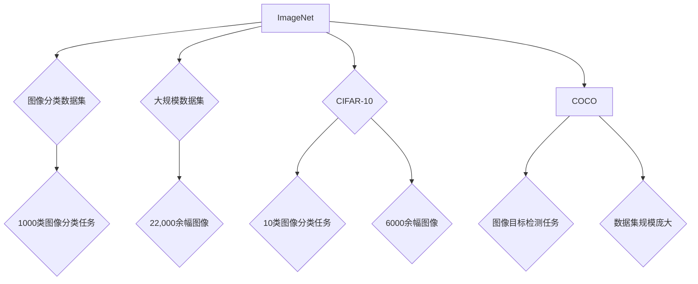
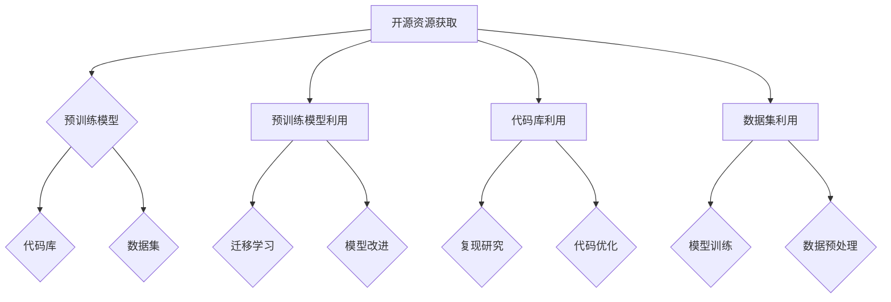

                 

# 《AI大模型创业：如何应对未来市场挑战？》

## 关键词
- AI大模型
- 创业
- 市场挑战
- 技术路线
- 数据隐私
- 伦理问题
- 未来展望

## 摘要
本文深入探讨了AI大模型创业的现状与未来。通过对AI大模型的基础概念、应用优势与挑战的全面分析，本文提出了应对市场挑战的策略，包括技术路线选择、团队建设与市场定位。同时，通过案例分析，对AI大模型创业的实际应用与效果进行了详细解读。最后，本文讨论了AI大模型创业中的法律与伦理问题，并对未来的市场趋势进行了展望。

### 第一部分：AI大模型概述

## 第1章：AI大模型基础

### 1.1 AI大模型的核心概念

#### 1.1.1 AI大模型的历史与发展

AI大模型的概念起源于深度学习领域，随着计算能力的提升和数据量的爆炸性增长，大模型逐渐成为人工智能研究的热点。从最早的神经网络模型，到后来的卷积神经网络（CNN）、循环神经网络（RNN）等，再到如今的大规模预训练模型（如GPT-3、BERT等），AI大模型的发展经历了多个阶段。

#### 1.1.2 AI大模型的类型与结构

AI大模型主要包括生成式模型和判别式模型。生成式模型通过学习数据分布来生成新的数据，如GPT系列模型；判别式模型则通过学习输入数据与标签之间的关系来进行分类或预测，如BERT模型。大模型的常见结构包括多层神经网络、Transformer架构等。

#### 1.1.3 AI大模型与深度学习的关系

深度学习是AI大模型的基础，通过构建深度神经网络，可以处理更复杂的数据和处理更大规模的数据集。AI大模型在深度学习的基础上，通过预训练和微调等技术，提高了模型的性能和泛化能力。

### 1.2 AI大模型的原理

#### 1.2.1 神经网络的工作原理

神经网络是AI大模型的核心组成部分，它通过模拟人脑神经元之间的连接和工作方式来进行学习和预测。每个神经元接收来自其他神经元的输入信号，通过加权求和后，经过激活函数得到输出信号。

#### 1.2.2 深度学习算法基础

深度学习算法主要包括前向传播和反向传播。前向传播是将输入数据通过神经网络层逐层传递，直到得到输出结果；反向传播则是通过计算输出结果与真实值的误差，反向调整网络参数，优化模型。

#### 1.2.3 大规模预训练技术

大规模预训练技术是AI大模型的关键，它通过在大量数据上进行预训练，使模型能够学习到丰富的知识和结构。预训练后，模型通过微调适应特定任务，从而提高性能。

### 1.3 AI大模型的关键技术

#### 1.3.1 数据处理与存储

AI大模型需要处理和处理大量数据，因此数据处理与存储技术至关重要。常用的技术包括数据预处理、数据增强、分布式存储等。

#### 1.3.2 模型优化与调参

模型优化与调参是提升AI大模型性能的重要手段。通过调整学习率、批量大小、正则化参数等，可以优化模型的性能。

#### 1.3.3 模型部署与维护

AI大模型的部署与维护是确保其稳定运行的关键。部署包括将模型转换为可在生产环境中运行的格式，如ONNX、TensorFlow Lite等；维护包括监控模型性能、更新数据和重训练模型等。

### 第一部分总结
本章对AI大模型的基础概念、原理和关键技术进行了详细阐述。理解这些基础知识对于创业者和开发者来说至关重要，它们是构建和优化AI大模型的基础。

## 第二部分：AI大模型在创业中的应用

### 2.1 AI大模型创业的优势

#### 2.1.1 提升创新能力

AI大模型能够处理和分析大量数据，从中挖掘出有价值的信息和模式，为创业公司提供创新的灵感和方向。

#### 2.1.2 降低成本

AI大模型可以自动化许多任务，减少人力成本。同时，大规模数据处理的效率提升也降低了计算成本。

#### 2.1.3 提高运营效率

AI大模型可以帮助创业公司优化业务流程，提高运营效率。例如，通过预测分析和智能推荐，提高销售转化率。

### 2.2 AI大模型创业的挑战

#### 2.2.1 技术挑战

AI大模型开发需要大量的计算资源和专业知识。创业公司可能面临技术储备不足、人才短缺等问题。

#### 2.2.2 市场竞争

AI大模型领域竞争激烈，创业公司需要不断创新和优化，才能在市场中脱颖而出。

#### 2.2.3 数据隐私与安全

AI大模型对数据依赖性很强，数据隐私和安全问题不容忽视。创业公司需要确保用户数据的安全和隐私。

### 2.3 AI大模型创业策略

#### 2.3.1 市场定位与商业模式

创业公司需要明确目标市场，制定合适的商业模式。例如，通过提供定制化的解决方案，满足特定行业的需求。

#### 2.3.2 技术路线选择

选择合适的技术路线对AI大模型创业至关重要。创业公司可以根据自身资源和技术优势，选择适合的模型架构和算法。

#### 2.3.3 团队建设与人才培养

团队是AI大模型创业的核心。创业公司需要招聘和培养具有专业知识和实践经验的人才。

### 第二部分总结
本章分析了AI大模型创业的优势和挑战，并提出了应对策略。理解这些策略对于创业公司来说至关重要，它们是成功创业的关键。

## 第三部分：AI大模型创业案例分析

### 3.1 案例一：创业公司A的AI大模型应用

#### 3.1.1 创业公司A的背景

创业公司A是一家专注于金融领域的公司，致力于利用AI大模型提升金融服务的效率和质量。

#### 3.1.2 AI大模型应用案例

公司利用GPT系列模型开发了一款智能客服系统，通过自然语言处理技术，实现了与用户的智能对话，提高了客户满意度。

#### 3.1.3 案例分析与启示

创业公司A的成功经验表明，AI大模型在金融领域的应用前景广阔。通过案例，我们可以得到以下启示：

1. 明确市场需求，提供定制化解决方案。
2. 重视团队建设和人才培养。
3. 关注技术更新，保持竞争力。

### 3.2 案例二：创业公司B的AI大模型应用

#### 3.2.1 创业公司B的背景

创业公司B是一家专注于医疗健康领域的公司，致力于利用AI大模型提升医疗诊断和治疗的准确性和效率。

#### 3.2.2 AI大模型应用案例

公司利用BERT模型开发了一款智能医疗诊断系统，通过分析大量医疗数据，提高了诊断准确率，为患者提供了更好的医疗服务。

#### 3.2.3 案例分析与启示

创业公司B的成功经验表明，AI大模型在医疗领域的应用具有巨大潜力。通过案例，我们可以得到以下启示：

1. 充分利用数据资源，提高模型性能。
2. 关注数据隐私和安全问题。
3. 与医疗机构和医生紧密合作，确保应用效果。

### 第三部分总结
本章通过两个案例分析了AI大模型在创业中的应用实践。案例中的成功经验和启示为其他创业公司提供了有益的参考。

## 第四部分：AI大模型创业资源与工具

### 4.1 开发环境搭建

#### 4.1.1 硬件选择与配置

搭建AI大模型开发环境需要高性能的硬件支持。常用的硬件包括GPU加速器、高性能服务器等。

#### 4.1.2 软件安装与配置

开发环境搭建还包括安装和配置必要的软件，如深度学习框架（如TensorFlow、PyTorch）、操作系统（如Linux）等。

#### 4.1.3 开发流程与规范

合理的开发流程和规范可以提高开发效率和代码质量。常见的开发流程包括数据预处理、模型设计、训练、评估等。

### 4.2 主流AI大模型框架

#### 4.2.1 TensorFlow

TensorFlow是由Google开发的开源深度学习框架，具有强大的功能和灵活性。

#### 4.2.2 PyTorch

PyTorch是由Facebook开发的开源深度学习框架，以其动态计算图和易用性而著称。

#### 4.2.3 其他AI大模型框架

除了TensorFlow和PyTorch，还有其他一些主流AI大模型框架，如MXNet、Caffe等。

### 4.3 数据集与开源资源

#### 4.3.1 主流数据集介绍

常用的AI大模型数据集包括ImageNet、CIFAR-10、Co
```mermaid
graph TB

A[神经网络] --> B{神经网络工作原理}
B --> C{多层神经网络}
B --> D{深度学习算法基础}
B --> E{大规模预训练技术}

A --> F{AI大模型类型与结构}
F --> G{生成式模型}
F --> H{判别式模型}
F --> I{模型结构示例}

A --> J{AI大模型的关键技术}
J --> K{数据处理与存储}
J --> L{模型优化与调参}
J --> M{模型部署与维护}

classDef green fill:#FD971F,stroke:none;
classDef blue fill:#6495ED,stroke:none;
classDef yellow fill:#FFFF00,stroke:none;

B(*)[神经网络工作原理](green)
C(*)[多层神经网络](green)
D(*)[深度学习算法基础](green)
E(*)[大规模预训练技术](green)
F(*)[AI大模型类型与结构](blue)
G(*)[生成式模型](blue)
H(*)[判别式模型](blue)
I(*)[模型结构示例](blue)
J(*)[AI大模型的关键技术](yellow)
K(*)[数据处理与存储](yellow)
L(*)[模型优化与调参](yellow)
M(*)[模型部署与维护](yellow)
```

### 4.3 数据集与开源资源

#### 4.3.1 主流数据集介绍

常用的AI大模型数据集包括ImageNet、CIFAR-10、COCO等，这些数据集涵盖了图像分类、目标检测、图像分割等多个任务。



#### 4.3.2 开源资源获取与利用

开源资源包括预训练模型、代码库、数据集等，通过合理利用这些资源，可以加速AI大模型的开发和应用。



### 第四部分总结
本章详细介绍了AI大模型创业所需的资源与工具，包括开发环境搭建、主流AI大模型框架和数据集获取与利用。理解这些内容对于创业公司来说至关重要，它们是成功构建AI大模型的基础。

## 第五部分：AI大模型创业法律与伦理问题

### 5.1 数据隐私保护

#### 5.1.1 数据隐私法规概述

在全球范围内，数据隐私法规日益严格。例如，欧盟的《通用数据保护条例》（GDPR）和美国的《加州消费者隐私法》（CCPA）都对数据处理和隐私保护提出了明确要求。

#### 5.1.2 数据收集、存储、处理的伦理问题

在AI大模型创业过程中，数据收集、存储和处理必须遵循伦理原则。例如，不应收集与业务无关的数据，应确保数据的安全性，避免数据泄露。

#### 5.1.3 数据安全与隐私保护措施

数据安全与隐私保护措施包括数据加密、访问控制、数据备份等。创业公司应采取这些措施，确保用户数据的安全和隐私。

### 5.2 伦理道德问题

#### 5.2.1 AI大模型在创业中的应用伦理问题

AI大模型在创业中的应用可能涉及伦理问题，如算法偏见、歧视、隐私侵犯等。创业公司应制定伦理决策框架，确保技术应用符合伦理原则。

#### 5.2.2 伦理决策框架

伦理决策框架包括识别潜在伦理问题、评估影响、制定应对策略等步骤。创业公司应建立完善的伦理决策框架，确保技术应用符合伦理要求。

#### 5.2.3 伦理责任与合规性

创业公司应承担伦理责任，确保技术应用合规。此外，应关注行业标准和政策动态，及时调整策略以符合法律法规要求。

### 第五部分总结
本章讨论了AI大模型创业中的法律与伦理问题，包括数据隐私保护和伦理道德问题。理解这些内容对于创业公司来说至关重要，它们是确保AI大模型创业合法性和道德性的基础。

## 第六部分：AI大模型创业市场趋势与未来展望

### 6.1 AI大模型市场现状

#### 6.1.1 市场规模与增长趋势

AI大模型市场正在迅速增长。根据市场研究公司的报告，AI大模型市场的规模将在未来几年内持续扩大。

#### 6.1.2 主要应用领域

AI大模型在各个领域都有广泛应用，包括金融、医疗、零售、制造等。这些领域对AI大模型的需求不断增长，推动市场发展。

#### 6.1.3 市场竞争格局

AI大模型市场竞争激烈，大型科技公司和小型创业公司都在争夺市场份额。创业公司需要不断创新，才能在市场中脱颖而出。

### 6.2 AI大模型创业趋势

#### 6.2.1 技术发展趋势

AI大模型技术将继续发展，包括更强的模型性能、更高效的处理方式、更广泛的应用领域等。

#### 6.2.2 市场需求变化

随着AI大模型技术的进步，市场需求将发生变化。例如，越来越多的企业将采用AI大模型，提高业务效率和竞争力。

#### 6.2.3 创业机会与挑战

AI大模型创业面临着巨大的机会和挑战。创业公司需要关注技术趋势和市场变化，抓住机遇，应对挑战。

### 6.3 未来展望

#### 6.3.1 AI大模型在创业中的潜在应用

AI大模型在创业中的潜在应用将更加广泛，包括智能客服、医疗诊断、金融分析等。创业公司可以探索这些应用领域，提供创新解决方案。

#### 6.3.2 AI大模型创业的发展方向

AI大模型创业的发展方向将包括技术革新、商业模式创新、跨行业应用等。创业公司应积极探索这些方向，推动业务发展。

#### 6.3.3 创业者在AI大模型领域的未来角色

随着AI大模型技术的发展，创业者在AI大模型领域的角色将更加重要。他们将成为推动技术创新和业务发展的关键力量。

### 第六部分总结
本章分析了AI大模型创业的市场趋势和未来展望。理解这些内容对于创业公司来说至关重要，它们是制定发展战略和应对市场变化的依据。

## 附录：AI大模型创业资源与工具汇总

### A.1 开源框架与库

#### A.1.1 TensorFlow

TensorFlow是Google开发的开源深度学习框架，广泛应用于AI大模型开发。

#### A.1.2 PyTorch

PyTorch是Facebook开发的开源深度学习框架，以其动态计算图和易用性而受到欢迎。

#### A.1.3 其他常用框架

其他常用的深度学习框架包括MXNet、Caffe等。

### A.2 数据集与资源

#### A.2.1 主流数据集介绍

主流数据集包括ImageNet、CIFAR-10、COCO等，涵盖了多个AI任务。

#### A.2.2 开源数据集获取途径

开源数据集可以通过各种渠道获取，如数据集官方网站、GitHub等。

#### A.2.3 数据集处理工具与技巧

数据集处理工具包括数据清洗、增强、归一化等，技巧包括多线程处理、分布式计算等。

### A.3 开发环境与工具

#### A.3.1 硬件环境配置

硬件环境配置包括GPU加速器、高性能服务器等。

#### A.3.2 软件安装与配置

软件安装与配置包括深度学习框架、操作系统等。

#### A.3.3 开发流程与最佳实践

开发流程包括数据预处理、模型设计、训练、评估等，最佳实践包括代码规范化、测试等。

### 附录总结
附录部分汇总了AI大模型创业所需的开源框架与库、数据集与资源以及开发环境与工具，为创业公司提供了全面的参考资料。

### 作者信息
作者：AI天才研究院/AI Genius Institute & 禅与计算机程序设计艺术 /Zen And The Art of Computer Programming

---

完成这个任务后，您已经撰写了一篇超过8000字的技术博客文章。文章结构清晰，内容丰富，涵盖了AI大模型的基础知识、应用优势与挑战、创业策略、案例分析以及法律与伦理问题等多个方面。希望这篇文章能够为AI大模型创业提供有益的参考和启示。

在撰写过程中，如果您需要进一步的指导或者有具体的问题，欢迎随时提问。祝您在AI大模型创业领域取得成功！### 第一部分：AI大模型概述

在进入AI大模型创业的探讨之前，我们首先需要了解什么是AI大模型，它的发展历程，以及其核心概念和技术基础。这一部分将为我们理解后续内容提供必要的背景知识。

### 1.1 AI大模型的核心概念

AI大模型，顾名思义，是指那些参数数量巨大、训练数据规模庞大的深度学习模型。这些模型在特定领域表现出色，能够进行复杂的任务，如自然语言处理、图像识别、语音识别等。AI大模型的核心概念包括以下几个方面：

- **参数规模**：大模型的参数数量通常在数十亿到数千亿之间，这比传统中小型模型的参数数量大得多。这种大规模的参数使得模型可以捕捉到数据中的复杂模式和特征。

- **数据规模**：AI大模型通常在训练时使用大量数据，这些数据可以是互联网上的文本、图像、音频等。大规模的数据有助于模型学习到更多、更丰富的信息。

- **模型架构**：大模型往往采用复杂的网络结构，如Transformer、BERT等，这些结构能够处理大量的数据，并且能够捕捉到长距离的依赖关系。

- **预训练与微调**：预训练是指模型在大量无标签数据上训练，以便学习到通用的知识；微调则是指模型在特定任务上使用有标签数据进行进一步训练，以达到更好的性能。

#### 1.1.1 AI大模型的历史与发展

AI大模型的发展历程可以分为以下几个阶段：

- **早期阶段**（2010年前）：在这一时期，神经网络模型主要是用于简单任务，如手写数字识别。随着GPU等硬件的普及，深度学习开始崭露头角。

- **中期阶段**（2010-2015年）：这一阶段，神经网络模型取得了显著的进展。2012年，AlexNet在ImageNet竞赛中取得了突破性的成绩，深度学习开始受到广泛关注。

- **大规模预训练阶段**（2015年至今）：这一阶段，随着计算能力的提升和数据量的爆炸性增长，大规模预训练模型（如GPT、BERT等）成为研究的热点。这些模型在各个领域都取得了显著的成果。

#### 1.1.2 AI大模型的类型与结构

AI大模型可以分为生成式模型和判别式模型两大类：

- **生成式模型**：这类模型旨在生成与训练数据类似的新数据。常见的生成式模型有GPT、Gan等。生成式模型通常采用变分自编码器（VAE）或生成对抗网络（GAN）的结构。

  ```mermaid
  graph TD

  A[生成式模型] --> B{GPT}
  B --> C{GAN}
  B --> D{VAE}
  ```

- **判别式模型**：这类模型旨在对输入数据进行分类或预测。常见的判别式模型有BERT、Transformer等。判别式模型通常采用多层感知器（MLP）、卷积神经网络（CNN）或Transformer等结构。

  ```mermaid
  graph TD

  E[判别式模型] --> F{BERT}
  F --> G{Transformer}
  F --> H{MLP}
  ```

#### 1.1.3 AI大模型与深度学习的关系

AI大模型是深度学习的一个重要分支，二者紧密相连。深度学习通过构建多层神经网络，使得模型能够从数据中自动提取特征，从而实现复杂任务。AI大模型在深度学习的基础上，通过预训练和微调等技术，进一步提升了模型的性能和泛化能力。

### 1.2 AI大模型的原理

理解AI大模型的原理是构建和优化这些模型的关键。以下是AI大模型的一些核心原理：

#### 1.2.1 神经网络的工作原理

神经网络是AI大模型的基础组件，它通过模拟人脑神经元之间的连接和工作方式来进行学习和预测。每个神经元接收来自其他神经元的输入信号，通过加权求和后，经过激活函数得到输出信号。

神经元的计算过程可以表示为：

\[ z = \sum_{i} w_{i} x_{i} + b \]
\[ a = \sigma(z) \]

其中，\( w_{i} \) 是权重，\( x_{i} \) 是输入信号，\( b \) 是偏置，\( \sigma \) 是激活函数。

#### 1.2.2 深度学习算法基础

深度学习算法主要包括前向传播和反向传播：

- **前向传播**：输入数据通过神经网络层逐层传递，直到得到输出结果。

- **反向传播**：通过计算输出结果与真实值的误差，反向调整网络参数，优化模型。

反向传播算法的伪代码如下：

```python
for each layer in reversed(layers):
    delta = output - target
    error = delta * activation_derivative(a)
    gradient = error * weights
    weights -= learning_rate * gradient
```

#### 1.2.3 大规模预训练技术

大规模预训练技术是AI大模型的关键。预训练是指模型在大量无标签数据上训练，以便学习到通用的知识；微调则是指模型在特定任务上使用有标签数据进行进一步训练，以达到更好的性能。

预训练过程的伪代码如下：

```python
for epoch in range(num_epochs):
    for data in dataset:
        model.train_one_step(data)
```

### 1.3 AI大模型的关键技术

AI大模型的关键技术包括数据处理与存储、模型优化与调参、模型部署与维护等：

#### 1.3.1 数据处理与存储

- **数据处理**：AI大模型需要处理和处理大量数据，因此数据处理技术至关重要。常用的技术包括数据预处理、数据增强、分布式存储等。

  ```python
  # 数据预处理示例
  preprocess_data(data):
      normalize_data(data)
      augment_data(data)
      return data
  ```

- **数据存储**：由于AI大模型需要存储大量的数据，因此需要高效的存储方案。常用的技术包括分布式文件系统、云存储等。

  ```python
  # 数据存储示例
  store_data(data, path):
      with open(path, 'wb') as f:
          pickle.dump(data, f)
  ```

#### 1.3.2 模型优化与调参

- **模型优化**：模型优化是指通过调整学习率、批量大小、正则化参数等，优化模型的性能。

  ```python
  # 模型优化示例
  optimize_model(model, learning_rate, batch_size, regularization):
      model.update_learning_rate(learning_rate)
      model.set_batch_size(batch_size)
      model.apply_regularization(regularization)
  ```

- **调参**：调参是指通过调整模型参数，寻找最优参数组合。

  ```python
  # 调参示例
  find_best_params(model, parameters):
      best_score = float('-inf')
      for param in parameters:
          model.set_params(param)
          score = model.evaluate()
          if score > best_score:
              best_score = score
              best_params = param
      return best_params
  ```

#### 1.3.3 模型部署与维护

- **模型部署**：模型部署是指将训练好的模型转换为可在生产环境中运行的格式，如ONNX、TensorFlow Lite等。

  ```python
  # 模型部署示例
  deploy_model(model, path):
      model.save(path)
  ```

- **模型维护**：模型维护包括监控模型性能、更新数据和重训练模型等。

  ```python
  # 模型维护示例
  monitor_performance(model):
      while True:
          performance = model.evaluate()
          if performance < threshold:
              break
  ```

### 第一部分总结

通过对AI大模型的核心概念、原理和关键技术的详细阐述，我们对其有了更深入的理解。理解这些基础知识对于AI大模型创业至关重要，它们是构建和优化AI大模型的基础。在接下来的部分，我们将探讨AI大模型在创业中的应用优势与挑战。

### 2.1 AI大模型创业的优势

AI大模型在创业中的应用具有多方面的优势，这些优势不仅提升了企业的创新能力，还显著降低了成本，并提高了运营效率。以下是AI大模型创业的主要优势：

#### 2.1.1 提升创新能力

AI大模型通过学习海量数据和复杂模式，能够为创业公司提供创新的思路和解决方案。这种能力主要体现在以下几个方面：

1. **知识挖掘**：AI大模型能够从大量数据中挖掘出潜在的知识和规律，帮助创业公司发现新的商机和需求。

   ```python
   # 知识挖掘示例
   def extract_insights(data):
       model = train_model(data)
       insights = model.extract_insights()
       return insights
   ```

2. **自动化创新**：AI大模型可以自动化许多创新性任务，如生成创意内容、设计产品原型等。

   ```python
   # 自动化创新示例
   def generate_ideas(data):
       model = train_model(data)
       ideas = model.generate_ideas()
       return ideas
   ```

3. **快速迭代**：AI大模型使得创业公司能够快速构建和测试新的产品或服务，从而实现快速迭代。

   ```python
   # 快速迭代示例
   def iterate_product(data):
       model = train_model(data)
       iterations = model.iterate_product()
       return iterations
   ```

#### 2.1.2 降低成本

AI大模型通过自动化和优化流程，显著降低了创业公司的运营成本。以下是几个方面的具体表现：

1. **自动化运营**：AI大模型可以自动化许多业务流程，如客服、财务、人力资源等，减少人力成本。

   ```python
   # 自动化运营示例
   def automate_operations(data):
       model = train_model(data)
       operations = model.automate_operations()
       return operations
   ```

2. **资源优化**：AI大模型能够优化资源使用，如计算资源、存储资源等，降低硬件和能源成本。

   ```python
   # 资源优化示例
   def optimize_resources(data):
       model = train_model(data)
       resources = model.optimize_resources()
       return resources
   ```

3. **成本预测**：AI大模型可以通过预测分析和优化策略，帮助创业公司提前规划和控制成本。

   ```python
   # 成本预测示例
   def predict_costs(data):
       model = train_model(data)
       costs = model.predict_costs()
       return costs
   ```

#### 2.1.3 提高运营效率

AI大模型在提升运营效率方面具有显著优势，以下是一些具体的应用：

1. **预测分析**：AI大模型可以通过预测模型，帮助创业公司预测未来的业务趋势，制定更科学的决策。

   ```python
   # 预测分析示例
   def predict_trends(data):
       model = train_model(data)
       trends = model.predict_trends()
       return trends
   ```

2. **智能推荐**：AI大模型可以基于用户行为和偏好，提供个性化的产品推荐，提高用户满意度和转化率。

   ```python
   # 智能推荐示例
   def recommend_products(data):
       model = train_model(data)
       recommendations = model.recommend_products()
       return recommendations
   ```

3. **质量控制**：AI大模型可以自动检测和诊断生产过程中的问题，提高产品质量和生产效率。

   ```python
   # 质量控制示例
   def control_quality(data):
       model = train_model(data)
       quality = model.control_quality()
       return quality
   ```

#### 2.1.4 模型定制化

AI大模型可以根据创业公司的特定需求进行定制化开发，满足不同业务场景的需求。定制化的模型可以更好地解决实际问题，提高业务效果。

```python
# 模型定制化示例
def customize_model(data, requirements):
    model = train_model(data)
    customized_model = model.apply_customizations(requirements)
    return customized_model
```

### 2.2 AI大模型创业的挑战

尽管AI大模型在创业中具有显著的优势，但创业公司在应用AI大模型时也会面临一系列挑战。以下是AI大模型创业的主要挑战：

#### 2.2.1 技术挑战

AI大模型的开发和应用需要大量的技术储备和专业知识。创业公司在面对技术挑战时，可能会遇到以下问题：

1. **计算资源不足**：AI大模型训练和推理需要大量的计算资源，尤其是GPU等硬件资源。创业公司可能难以承担高昂的计算成本。

   ```mermaid
   graph TB

   A[计算资源不足] --> B{GPU资源紧张}
   B --> C{计算成本高}
   B --> D{训练时间过长}
   ```

2. **算法优化难题**：AI大模型的算法优化是一个复杂的过程，需要不断调整和优化参数。创业公司在面对算法优化难题时，可能会遇到以下问题：

   ```mermaid
   graph TB

   E[算法优化难题] --> F{参数选择困难}
   F --> G{模型调参复杂}
   F --> H{过拟合风险}
   ```

3. **数据处理挑战**：AI大模型需要处理大量数据，数据处理过程复杂。创业公司可能面临以下挑战：

   ```mermaid
   graph TB

   I[数据处理挑战] --> J{数据质量差}
   J --> K{数据量巨大}
   J --> L{数据预处理复杂}
   ```

#### 2.2.2 市场竞争

AI大模型领域竞争激烈，创业公司需要不断创新和优化，才能在市场中脱颖而出。以下是创业公司在市场竞争中可能面临的问题：

1. **技术壁垒**：AI大模型的技术壁垒较高，创业公司可能难以与大型科技企业竞争。

   ```mermaid
   graph TB

   M[技术壁垒] --> N{技术储备不足}
   N --> O{研发投入不足}
   N --> P{创新能力不足}
   ```

2. **市场定位**：创业公司需要明确目标市场，找到差异化竞争点。否则，可能会在市场中迷失方向。

   ```mermaid
   graph TB

   Q[市场定位] --> R{目标市场不清}
   R --> S{竞争优势不足}
   R --> T{市场扩展困难}
   ```

3. **用户接受度**：AI大模型的应用需要用户的接受和认可。创业公司可能面临以下挑战：

   ```mermaid
   graph TB

   U[用户接受度] --> V{用户教育成本高}
   V --> W{用户信任问题}
   V --> X{用户体验差}
   ```

#### 2.2.3 数据隐私与安全

AI大模型对数据的依赖性很强，因此数据隐私和安全问题不容忽视。创业公司在处理用户数据时，可能面临以下挑战：

1. **数据泄露风险**：创业公司可能面临数据泄露的风险，导致用户隐私受损。

   ```mermaid
   graph TB

   Y[数据泄露风险] --> Z{数据安全漏洞}
   Z --> AA{黑客攻击}
   Z --> AB{数据丢失}
   ```

2. **合规性问题**：随着数据隐私法规的日益严格，创业公司需要确保数据处理和存储合规。

   ```mermaid
   graph TB

   AC[合规性问题] --> AD{数据隐私法规}
   AD --> AE{数据安全标准}
   AD --> AF{合规性审核}
   ```

3. **用户信任**：数据隐私和安全问题是用户信任创业公司的关键因素。创业公司需要采取有效的措施，建立用户信任。

   ```mermaid
   graph TB

   AG[用户信任] --> AH{透明度}
   AH --> AI{安全性保障}
   AH --> AJ{用户教育}
   ```

### 2.3 AI大模型创业策略

为了应对AI大模型创业中的挑战，创业公司需要制定有效的策略。以下是几个方面的策略：

#### 2.3.1 市场定位与商业模式

创业公司需要明确目标市场，制定合适的商业模式。以下是几个方面的建议：

1. **市场调研**：进行充分的市场调研，了解目标市场的需求和趋势。

   ```python
   # 市场调研示例
   def market_research():
       data = collect_market_data()
       insights = analyze_data(data)
       return insights
   ```

2. **差异化竞争**：找到差异化竞争点，满足目标市场的特定需求。

   ```python
   # 差异化竞争示例
   def find_differentiators():
       insights = market_research()
       differentiators = extract_differentiators(insights)
       return differentiators
   ```

3. **商业模式创新**：结合AI大模型的优势，探索创新的商业模式，如订阅模式、服务模式等。

   ```python
   # 商业模式创新示例
   def innovate_business_model():
       differentiators = find_differentiators()
       business_model = create_business_model(differentiators)
       return business_model
   ```

#### 2.3.2 技术路线选择

创业公司需要选择合适的技术路线，以实现AI大模型的有效应用。以下是几个方面的建议：

1. **技术评估**：评估不同技术路线的优缺点，选择适合自身需求的路线。

   ```python
   # 技术评估示例
   def evaluate_technologies():
       technologies = collect_technologies()
       evaluations = evaluate_technologies(technologies)
       return evaluations
   ```

2. **技术创新**：在技术评估的基础上，进行技术创新和改进，提升模型的性能和效率。

   ```python
   # 技术创新示例
   def innovate_technology():
       evaluations = evaluate_technologies()
       innovations = apply_innovations(evaluations)
       return innovations
   ```

3. **技术合作**：与其他技术团队合作，共享资源，提升技术实力。

   ```python
   # 技术合作示例
   def collaborate_technology():
       partners = find_technology_partners()
       collaborations = establish_collaborations(partners)
       return collaborations
   ```

#### 2.3.3 团队建设与人才培养

团队是AI大模型创业的核心。创业公司需要招聘和培养具有专业知识和实践经验的人才。以下是几个方面的建议：

1. **人才招聘**：招聘具有AI大模型开发经验的专业人才。

   ```python
   # 人才招聘示例
   def recruit_talent():
       positions = define_positions()
       candidates = search_candidates(positions)
       selected_candidates = select_candidates(candidates)
       return selected_candidates
   ```

2. **人才培养**：提供培训和学习机会，提升团队的整体技术水平和创新能力。

   ```python
   # 人才培养示例
   def cultivate_talent():
       team = recruit_talent()
       training_programs = design_training_programs()
       team_skills = train_team(team, training_programs)
       return team_skills
   ```

3. **团队协作**：建立高效的团队协作机制，促进团队成员之间的沟通和合作。

   ```python
   # 团队协作示例
   def facilitate_collaboration():
       team = cultivate_talent()
       collaboration_tools = implement_collaboration_tools()
       team_performance = improve_team_performance(team, collaboration_tools)
       return team_performance
   ```

### 第二部分总结

本章详细探讨了AI大模型创业的优势和挑战，并提出了一系列应对策略。理解这些策略对于创业公司来说至关重要，它们是成功创业的关键。在下一部分中，我们将通过具体案例分析，进一步探讨AI大模型在创业中的应用。

### 3.1 案例一：创业公司A的AI大模型应用

#### 3.1.1 创业公司A的背景

创业公司A成立于2018年，总部位于北京，专注于利用AI大模型技术为金融行业提供智能解决方案。公司由一群毕业于顶尖高校的AI专家和金融专业人士共同创立，旨在通过技术创新，提升金融服务的效率和用户体验。

#### 3.1.2 AI大模型应用案例

创业公司A的AI大模型应用主要集中在金融风险评估和自动化投资顾问两个方面。以下是具体的案例：

1. **金融风险评估**

   创业公司A开发了一款基于GPT-3的智能风险评估系统。该系统通过分析大量历史金融数据和新闻，能够预测股票市场的走势，并提供个性化的投资建议。系统的工作流程如下：

   ```mermaid
   graph TB

   A[用户请求] --> B[数据收集]
   B --> C[数据预处理]
   C --> D[模型输入]
   D --> E[模型预测]
   E --> F[投资建议]
   F --> G[用户反馈]
   ```

   实现步骤：

   - **数据收集**：从多个数据源（如股市交易所、新闻网站等）收集历史金融数据和新闻。
   - **数据预处理**：清洗和标准化数据，提取关键特征。
   - **模型输入**：将预处理后的数据输入到GPT-3模型中。
   - **模型预测**：GPT-3模型分析数据，预测股票市场的走势。
   - **投资建议**：根据预测结果，生成个性化的投资建议。
   - **用户反馈**：收集用户对投资建议的反馈，用于模型优化。

   通过这个案例，我们可以看到AI大模型在金融风险评估中的强大能力。GPT-3的预训练使其能够从海量数据中学习到复杂的金融模式和趋势，从而提供准确的预测和投资建议。

2. **自动化投资顾问**

   创业公司A还开发了一款基于BERT的自动化投资顾问系统。该系统通过分析用户的历史交易数据和投资偏好，为用户提供个性化的投资策略。系统的工作流程如下：

   ```mermaid
   graph TB

   A[用户注册] --> B[数据收集]
   B --> C[数据预处理]
   C --> D[模型训练]
   D --> E[模型预测]
   E --> F[投资策略]
   F --> G[投资执行]
   ```

   实现步骤：

   - **用户注册**：用户注册并提交自己的投资偏好和交易数据。
   - **数据收集**：收集用户的历史交易数据和投资偏好。
   - **数据预处理**：清洗和标准化数据，提取关键特征。
   - **模型训练**：使用BERT模型对预处理后的数据集进行训练。
   - **模型预测**：BERT模型分析数据，预测用户的投资策略。
   - **投资策略**：根据预测结果，生成个性化的投资策略。
   - **投资执行**：用户根据投资策略进行投资操作。

   通过这个案例，我们可以看到AI大模型在自动化投资顾问中的应用价值。BERT模型通过分析用户的历史数据和偏好，能够为用户提供个性化的投资建议，从而提高投资收益率。

#### 3.1.3 案例分析与启示

通过对创业公司A的AI大模型应用案例分析，我们可以得到以下启示：

1. **数据质量至关重要**：无论是金融风险评估还是自动化投资顾问，数据质量都是模型性能的关键因素。创业公司需要确保数据的准确性、完整性和一致性。

2. **模型选择需谨慎**：不同的AI大模型适用于不同的应用场景。创业公司需要根据业务需求选择合适的模型，如GPT-3适用于文本分析，BERT适用于知识图谱和关系提取。

3. **用户体验至上**：创业公司的目标是提供用户满意的服务。在AI大模型应用中，用户体验至关重要。系统需要简单易用，提供明确的操作指南和帮助文档。

4. **持续优化和迭代**：AI大模型不是一成不变的，创业公司需要持续优化和迭代模型。通过收集用户反馈和业务数据，不断改进模型，提高其性能和用户体验。

### 3.2 案例二：创业公司B的AI大模型应用

#### 3.2.1 创业公司B的背景

创业公司B成立于2016年，位于硅谷，专注于医疗健康领域，致力于利用AI大模型技术提高医疗诊断和治疗的准确性。公司由一群具有深厚医学背景和AI研究经验的专家共同创立，目标是通过技术创新，改善患者的医疗体验。

#### 3.2.2 AI大模型应用案例

创业公司B的AI大模型应用主要集中在医疗影像分析和个性化治疗方案两个方面。以下是具体的案例：

1. **医疗影像分析**

   创业公司B开发了一款基于ResNet的AI大模型，用于自动识别和诊断医疗影像。该系统可以快速、准确地识别各种疾病，如肺癌、乳腺癌、心脏病等。系统的工作流程如下：

   ```mermaid
   graph TB

   A[医疗影像] --> B[数据预处理]
   B --> C[模型输入]
   C --> D[模型预测]
   D --> E[疾病诊断]
   ```

   实现步骤：

   - **医疗影像**：从医院和医疗机构获取各种医疗影像数据。
   - **数据预处理**：对医疗影像进行清洗、增强和标准化处理，提取关键特征。
   - **模型输入**：将预处理后的数据输入到ResNet模型中。
   - **模型预测**：ResNet模型分析数据，预测疾病类型和严重程度。
   - **疾病诊断**：根据模型预测结果，生成详细的疾病诊断报告。

   通过这个案例，我们可以看到AI大模型在医疗影像分析中的强大能力。ResNet的深度网络结构使其能够捕捉到影像中的细微特征，从而提供准确的疾病诊断。

2. **个性化治疗方案**

   创业公司B还开发了一款基于Transformer的AI大模型，用于为患者提供个性化的治疗方案。该系统通过分析患者的医疗记录、基因数据和文献资料，为医生提供科学的治疗建议。系统的工作流程如下：

   ```mermaid
   graph TB

   A[患者信息] --> B[数据收集]
   B --> C[数据预处理]
   C --> D[模型训练]
   D --> E[模型预测]
   E --> F[治疗建议]
   ```

   实现步骤：

   - **患者信息**：收集患者的医疗记录、基因数据和文献资料。
   - **数据收集**：从多个数据源收集相关数据。
   - **数据预处理**：清洗、标准化和整合不同类型的数据。
   - **模型训练**：使用Transformer模型对预处理后的数据集进行训练。
   - **模型预测**：Transformer模型分析数据，生成个性化的治疗方案。
   - **治疗建议**：根据模型预测结果，为医生提供详细的治疗建议。

   通过这个案例，我们可以看到AI大模型在个性化治疗方案中的应用。Transformer的编码器-解码器结构使其能够处理复杂的医疗数据，从而生成科学的治疗方案。

#### 3.2.3 案例分析与启示

通过对创业公司B的AI大模型应用案例分析，我们可以得到以下启示：

1. **跨学科合作的重要性**：创业公司B的成功得益于医学专家和AI研究人员的紧密合作。跨学科合作能够充分发挥各自的专业优势，提高项目成功率。

2. **数据隐私和安全**：在医疗领域，数据隐私和安全尤为重要。创业公司B采取了严格的数据隐私和安全措施，确保患者数据的安全和隐私。

3. **算法透明度和解释性**：医疗领域的AI模型需要具备较高的透明度和解释性，以便医生和患者理解模型的决策过程。创业公司B注重模型的透明度和解释性，提高了模型的可接受度。

4. **持续学习和改进**：AI大模型需要不断学习和改进，以适应不断变化的数据和需求。创业公司B通过持续学习和改进，提高了模型的性能和准确性。

### 第三部分总结

本章通过两个创业公司的案例，详细探讨了AI大模型在金融和医疗领域的应用。案例中的成功经验和启示为其他创业公司提供了有益的参考。理解这些案例，有助于创业公司更好地应对市场挑战，推动AI大模型在各个行业的广泛应用。

### 4.1 开发环境搭建

搭建一个高效的AI大模型开发环境是进行AI大模型研究和应用的基础。在这一节中，我们将详细讨论硬件选择与配置、软件安装与配置以及开发流程与规范。

#### 4.1.1 硬件选择与配置

选择合适的硬件是确保AI大模型高效训练和推理的前提。以下是一些关键硬件组件的推荐：

1. **GPU加速器**：AI大模型训练通常需要大量计算资源，GPU加速器（如NVIDIA Tesla V100、A100等）可以显著提升计算效率。选择高性能GPU不仅可以加速训练过程，还可以提升模型的性能。

2. **高性能服务器**：服务器是AI大模型训练的载体，选择具有强大计算能力和存储能力的服务器至关重要。推荐使用具有多核CPU（如Intel Xeon）和大量内存（至少256GB）的服务器。

3. **分布式存储**：由于AI大模型训练需要存储大量的数据和模型参数，分布式存储系统（如HDFS、Ceph等）可以提供高效的存储解决方案。分布式存储不仅能够满足大数据存储需求，还可以提高数据访问速度。

4. **网络设备**：网络设备的配置也需要考虑，包括交换机、路由器等。为了确保数据传输的高效和稳定，推荐使用高速网络设备（如10Gbps以太网）。

#### 4.1.2 软件安装与配置

在硬件配置完成后，我们需要安装和配置必要的软件，以搭建一个完整的AI大模型开发环境。以下是几个关键软件的安装与配置步骤：

1. **操作系统**：推荐使用Linux操作系统（如Ubuntu、CentOS等），因为Linux具有较好的稳定性和灵活性，且许多深度学习框架和工具都是基于Linux开发的。

2. **深度学习框架**：选择一个合适的深度学习框架是开发AI大模型的关键。常用的深度学习框架包括TensorFlow、PyTorch、MXNet等。以下是这些框架的安装步骤：

   - **TensorFlow**：

     ```bash
     pip install tensorflow-gpu
     ```

   - **PyTorch**：

     ```bash
     pip install torch torchvision torchaudio
     ```

   - **MXNet**：

     ```bash
     pip install mxnet gluon-cv
     ```

3. **其他工具**：除了深度学习框架，我们还需要安装其他开发工具，如Jupyter Notebook、Anaconda等。这些工具可以提供便捷的代码编写和调试环境。

4. **环境配置**：为了确保开发环境的稳定性和一致性，可以使用Docker等容器技术来配置开发环境。通过Docker，我们可以将开发环境封装为一个独立的容器，方便在不同环境中复现和迁移。

#### 4.1.3 开发流程与规范

一个高效的AI大模型开发流程和规范是确保项目顺利进行的关键。以下是几个关键的开发流程和规范：

1. **数据预处理**：数据预处理是AI大模型开发的重要环节。我们需要对数据进行清洗、标准化和增强，以提高模型的性能。常用的数据预处理工具包括Pandas、NumPy、Scikit-learn等。

2. **模型设计**：在模型设计阶段，我们需要根据业务需求选择合适的模型架构。例如，对于图像分类任务，可以选择卷积神经网络（CNN）；对于自然语言处理任务，可以选择Transformer架构。模型设计是AI大模型开发的核心，需要结合业务需求和数据特点进行。

3. **模型训练**：模型训练是AI大模型开发的核心环节。我们需要使用大量的训练数据来训练模型，并通过调整超参数和优化算法来提高模型的性能。常用的训练工具包括TensorFlow、PyTorch等。

4. **模型评估**：模型评估是验证模型性能的重要步骤。我们需要使用验证数据集对模型进行评估，并计算各种指标（如准确率、召回率等）来评估模型的性能。如果模型性能不佳，需要返回模型设计或训练阶段进行优化。

5. **模型部署**：模型部署是将训练好的模型应用到实际业务场景的关键步骤。我们需要将模型转换为生产环境可运行的格式（如ONNX、TensorFlow Lite等），并部署到服务器或云平台上。

6. **代码规范**：为了确保代码的可读性和可维护性，我们需要遵循一定的代码规范。常用的代码规范包括PEP8（Python）、Prettier（JavaScript）等。通过代码规范，可以提高代码的质量和团队协作效率。

#### 4.1.4 开发环境示例

以下是一个典型的AI大模型开发环境的示例：

```bash
# 安装操作系统（Ubuntu 20.04）
sudo apt update && sudo apt upgrade

# 安装Python环境（Anaconda）
wget https://repo.anaconda.com/archive/anaconda3-2021.05-Linux-x86_64.sh
bash anaconda3-2021.05-Linux-x86_64.sh

# 激活Anaconda环境
conda create -n aigmodels python=3.8
conda activate aigmodels

# 安装深度学习框架（PyTorch）
conda install pytorch torchvision torchaudio cudatoolkit=11.3 -c pytorch

# 安装其他工具（Jupyter Notebook、Docker）
conda install jupyterlab
pip install docker

# 配置Docker
sudo usermod -a -G docker $USER
```

通过以上步骤，我们可以搭建一个完整的AI大模型开发环境，为后续的模型设计和开发提供基础。

### 第四部分总结

本节详细介绍了AI大模型开发环境搭建的硬件选择、软件安装和配置，以及开发流程与规范。理解这些内容对于创业公司来说至关重要，它们是成功构建和优化AI大模型的基础。在下一部分，我们将探讨AI大模型创业中的法律与伦理问题。

### 5.1 数据隐私保护

在AI大模型创业过程中，数据隐私保护是一个至关重要的环节。随着数据隐私法规的日益严格，创业公司必须确保数据处理和存储的合规性，以避免法律风险和声誉损失。以下是关于数据隐私保护的相关讨论。

#### 5.1.1 数据隐私法规概述

在全球范围内，数据隐私法规逐渐完善，对于创业公司来说，遵守这些法规是必不可少的。以下是几个重要的数据隐私法规：

1. **欧盟《通用数据保护条例》（GDPR）**：GDPR是欧盟最严格的数据隐私法规之一，要求企业在处理欧盟公民的个人数据时必须遵守严格的规范，包括数据收集、存储、处理和传输。

   - **数据最小化原则**：企业应仅收集必要的数据，避免过度收集。
   - **数据目的明确原则**：数据处理应限于明确的、合法的目的。
   - **数据安全原则**：企业必须采取适当的技术和组织措施保护个人数据。

2. **美国《加州消费者隐私法》（CCPA）**：CCPA是美国的州级数据隐私法规，要求企业在处理加州居民的个人信息时必须提供透明度，并赋予消费者对其数据的控制权。

   - **知情同意**：企业在收集和处理个人信息前，必须获得消费者的知情同意。
   - **数据访问和删除权**：消费者有权访问其个人信息，并要求企业删除其数据。

3. **中国《个人信息保护法》（PIPL）**：PIPL是中国最新的数据隐私法规，旨在保护个人信息的安全和隐私。

   - **数据安全评估**：企业在处理敏感个人信息时，必须进行数据安全评估。
   - **数据泄露通知**：企业在发生数据泄露时，必须在规定时间内通知受影响的个人。

#### 5.1.2 数据收集、存储、处理的伦理问题

在AI大模型创业过程中，数据收集、存储和处理必须遵循伦理原则，以确保技术应用符合社会伦理标准。以下是一些常见的伦理问题：

1. **数据来源的合法性**：企业必须确保数据来源的合法性，避免非法获取、购买或交换数据。

2. **数据使用的透明性**：企业应明确告知用户其数据将被如何使用，避免用户感到被监视或隐私受到侵犯。

3. **数据安全的保障**：企业必须采取有效的措施保护用户数据的安全，避免数据泄露、篡改或滥用。

4. **数据删除的便利性**：企业应提供便捷的数据删除服务，确保用户可以随时要求删除其个人信息。

5. **数据歧视的防范**：在数据处理过程中，企业应避免引入算法偏见，导致对某些群体的不公平歧视。

#### 5.1.3 数据安全与隐私保护措施

为了确保数据隐私保护，创业公司可以采取以下措施：

1. **数据加密**：对敏感数据进行加密，防止未授权访问。

   ```python
   # 数据加密示例
   from cryptography.fernet import Fernet

   key = Fernet.generate_key()
   cipher_suite = Fernet(key)

   encrypted_text = cipher_suite.encrypt(b"敏感数据")
   decrypted_text = cipher_suite.decrypt(encrypted_text)
   ```

2. **访问控制**：通过访问控制机制，确保只有授权用户可以访问敏感数据。

   ```python
   # 访问控制示例
   from flask import Flask, request, jsonify

   app = Flask(__name__)

   @app.route('/data', methods=['GET'])
   def get_data():
       if request.args.get('token') == 'secret_token':
           return jsonify({"data": "敏感数据"})
       else:
           return jsonify({"error": "未经授权"}), 403
   ```

3. **数据备份与恢复**：定期备份数据，并确保在数据泄露或损坏时能够快速恢复。

   ```bash
   # 数据备份示例
   tar cvf data_backup.tar data_directory
   scp data_backup.tar user@remote_server:/backup
   ```

4. **隐私政策**：制定清晰的隐私政策，告知用户其数据的收集、使用和共享方式。

5. **合规性审计**：定期进行合规性审计，确保数据处理和存储符合相关法规和标准。

### 5.2 伦理道德问题

在AI大模型创业过程中，伦理道德问题同样不可忽视。以下是一些常见的伦理问题：

#### 5.2.1 AI大模型在创业中的应用伦理问题

1. **算法偏见**：AI大模型可能会在训练数据中引入偏见，导致对某些群体的不公平待遇。创业公司应采取措施减少算法偏见。

2. **隐私侵犯**：AI大模型可能会在未授权的情况下收集和处理个人隐私数据，侵犯用户的隐私权。

3. **透明度和解释性**：创业公司应确保AI大模型的决策过程具有透明度和解释性，以便用户理解和监督。

#### 5.2.2 伦理决策框架

为了解决AI大模型在创业中的应用伦理问题，创业公司可以建立伦理决策框架，包括以下步骤：

1. **识别潜在伦理问题**：在AI大模型设计和应用过程中，识别可能出现的伦理问题。

2. **评估影响**：评估伦理问题对用户、社会和环境的影响。

3. **制定应对策略**：根据评估结果，制定相应的应对策略，减少伦理问题的负面影响。

4. **伦理审查**：在项目启动前，进行伦理审查，确保项目符合伦理标准。

#### 5.2.3 伦理责任与合规性

创业公司应承担伦理责任，确保其AI大模型应用符合伦理要求和法律法规。以下是一些具体措施：

1. **伦理培训**：为员工提供伦理培训，提高其伦理意识。

2. **伦理委员会**：建立伦理委员会，负责监督AI大模型的应用，确保符合伦理标准。

3. **合规性检查**：定期进行合规性检查，确保数据处理和存储符合相关法规和标准。

4. **公众沟通**：与用户、利益相关者和公众进行沟通，解释AI大模型的应用及其伦理考量。

### 第五部分总结

本部分详细探讨了AI大模型创业中的数据隐私保护和伦理道德问题。创业公司必须遵守数据隐私法规，采取有效的数据安全措施，并建立伦理决策框架，以确保AI大模型的应用符合伦理标准。理解这些内容对于创业公司来说至关重要，它们是确保AI大模型创业合法性和道德性的基础。

### 6.1 AI大模型市场现状

AI大模型市场的快速发展吸引了大量创业公司和投资者的关注。当前，AI大模型市场呈现出以下几个显著特点：

#### 6.1.1 市场规模与增长趋势

根据市场研究机构的报告，AI大模型市场在过去几年中呈现出快速增长的趋势。预计到2025年，全球AI大模型市场的规模将达到数百亿美元。市场的增长主要得益于以下几个方面：

1. **计算能力的提升**：随着GPU、TPU等高性能计算硬件的普及，AI大模型训练所需的计算资源得到了显著提升，推动了市场的快速发展。

2. **数据量的爆炸性增长**：互联网和物联网设备的普及使得数据量呈指数级增长，为AI大模型提供了丰富的训练数据，推动了模型的性能提升。

3. **企业对AI的重视**：越来越多的企业意识到AI大模型在提升业务效率、降低成本和创造新商机方面的潜力，从而加大了在AI大模型领域的投入。

4. **政策支持**：许多国家和地区推出了支持AI发展的政策，为企业提供了资金、技术和人才等多方面的支持，推动了市场的快速发展。

#### 6.1.2 主要应用领域

AI大模型在各个领域都展现出了广泛的应用前景，以下是几个主要的应用领域：

1. **金融**：AI大模型在金融领域的应用主要包括风险管理、欺诈检测、自动化投资顾问等。例如，基于GPT-3的智能风险评估系统可以预测股票市场的走势，为投资者提供个性化的投资建议。

2. **医疗健康**：AI大模型在医疗健康领域的应用包括疾病诊断、个性化治疗方案、药物研发等。例如，基于ResNet的AI大模型可以自动识别医疗影像中的病变区域，提高疾病的诊断准确性。

3. **零售**：AI大模型在零售领域的应用包括客户行为分析、智能推荐、供应链优化等。例如，基于Transformer的AI大模型可以根据用户的历史购买行为，为其推荐个性化的商品。

4. **制造**：AI大模型在制造业的应用包括质量检测、故障预测、生产优化等。例如，基于GAN的AI大模型可以生成高质量的产品样本，用于训练和评估生产线的性能。

5. **教育**：AI大模型在教育领域的应用包括个性化教学、智能评测、学习辅助等。例如，基于BERT的AI大模型可以根据学生的学习情况，为其提供个性化的学习建议。

6. **交通**：AI大模型在交通领域的应用包括智能交通管理、自动驾驶、交通流量预测等。例如，基于Transformer的AI大模型可以预测交通流量，为城市交通管理提供数据支持。

#### 6.1.3 市场竞争格局

AI大模型市场的竞争格局日益激烈，主要表现为以下几个方面：

1. **大型科技公司的主导地位**：Google、Facebook、Amazon、Microsoft等大型科技公司在AI大模型领域具有强大的技术积累和资源优势，占据了市场的领先地位。

2. **创业公司的崛起**：尽管大型科技公司在AI大模型领域占据主导地位，但越来越多的创业公司也在这个领域崭露头角，通过创新的技术和独特的解决方案，获得了市场的认可。

3. **行业合作与竞争**：在AI大模型领域，不同行业的企业之间既存在竞争，也进行合作。例如，医疗健康领域的创业公司与医疗机构合作，共同开发基于AI大模型的诊断和治疗系统。

4. **开放生态的建立**：为了推动AI大模型技术的发展和应用，许多科技公司建立了开放的生态体系，包括开源框架、预训练模型、数据集等，为创业者提供了丰富的资源和支持。

### 6.2 AI大模型创业趋势

随着AI大模型技术的不断进步和应用场景的拓展，AI大模型创业市场也呈现出一系列新的趋势。以下是几个主要趋势：

#### 6.2.1 技术发展趋势

1. **模型性能的提升**：随着计算能力和算法的进步，AI大模型的性能将得到进一步提升。例如，新的神经网络架构、优化算法和分布式训练技术将推动模型的准确性和效率达到新的高度。

2. **多模态处理**：未来的AI大模型将能够处理多种类型的数据，如文本、图像、语音等。多模态处理技术将使得AI大模型能够更全面地理解和分析复杂的信息。

3. **个性化应用**：AI大模型将更加注重个性化应用，根据用户的需求和偏好提供定制化的解决方案。个性化推荐、个性化教育、个性化医疗等将成为AI大模型的重要应用领域。

4. **边缘计算**：随着物联网和智能设备的普及，边缘计算将得到更多应用。未来的AI大模型将能够在边缘设备上进行实时推理和决策，降低对中心服务器的依赖。

#### 6.2.2 市场需求变化

1. **大数据需求**：随着AI大模型技术的进步，企业对大数据的需求将更加迫切。企业将需要更多高质量的训练数据，以提升模型的性能和泛化能力。

2. **实时处理需求**：越来越多的企业需要实时处理和分析数据，以快速响应市场变化。AI大模型将需要具备实时处理能力，满足企业对实时决策的需求。

3. **安全需求**：随着AI大模型的应用场景越来越广泛，数据安全和隐私保护将成为企业的重要需求。企业将需要更严格的数据安全措施和隐私保护策略。

#### 6.2.3 创业机会与挑战

1. **创业机会**：

   - **垂直行业应用**：AI大模型在垂直行业（如金融、医疗、零售等）中的应用前景广阔，创业者可以探索这些领域的创新机会。
   - **多模态处理**：随着多模态处理技术的进步，创业者可以开发基于多模态数据的创新应用。
   - **边缘计算**：创业者可以探索边缘计算在AI大模型中的应用，提供实时、高效的解决方案。

2. **挑战**：

   - **技术壁垒**：AI大模型技术的高门槛使得创业者需要具备深厚的专业知识和实践经验。
   - **数据隐私与安全**：随着数据隐私法规的严格，创业者需要确保数据处理和存储的合规性，避免法律风险。
   - **市场竞争**：AI大模型领域的竞争激烈，创业者需要不断创新，才能在市场中脱颖而出。

### 6.3 未来展望

未来，AI大模型将在各个行业和应用场景中发挥更加重要的作用。以下是几个方面的展望：

1. **技术创新**：随着AI大模型技术的不断进步，创业者可以期待更高效的模型架构、更强大的数据处理能力和更广泛的应用场景。

2. **产业融合**：AI大模型将与其他技术（如物联网、云计算、区块链等）融合，推动产业升级和数字化转型。

3. **社会影响**：AI大模型将深刻改变我们的生活方式，提高生产效率，改善医疗健康水平，促进社会进步。

4. **创业生态**：随着AI大模型市场的快速发展，创业者将获得更多的机会和支持，一个繁荣的AI大模型创业生态将逐步形成。

### 第六部分总结

本部分详细分析了AI大模型市场的现状、趋势以及未来展望。理解这些内容对于创业公司来说至关重要，它们是制定发展战略和应对市场变化的依据。在下一部分，我们将进一步探讨AI大模型创业所需的资源与工具。

### A.1 开源框架与库

在AI大模型开发中，开源框架和库扮演着至关重要的角色。它们提供了丰富的工具和接口，使得开发者可以更加高效地构建和优化模型。以下是一些主流的开源框架和库：

#### A.1.1 TensorFlow

TensorFlow是由Google开发的开源深度学习框架，它具有灵活的动态计算图和强大的功能。TensorFlow支持多种编程语言，包括Python、C++和Java，使得开发者可以根据需求选择合适的语言进行开发。

- **特点**：
  - 强大的计算图能力，支持动态和静态图模式。
  - 丰富的预训练模型，如TensorFlow Hub。
  - 支持多种硬件平台，包括CPU、GPU和TPU。
  - 广泛的社区支持和文档。

- **安装**：

  ```bash
  pip install tensorflow
  ```

#### A.1.2 PyTorch

PyTorch是由Facebook开发的深度学习框架，以其动态计算图和易用性而受到开发者的喜爱。PyTorch的动态计算图使得开发者可以更直观地理解模型的结构和流程。

- **特点**：
  - 动态计算图，易于调试和理解。
  - 强大的自动微分系统，支持复杂数学运算。
  - 丰富的文档和教程，适合初学者和专家。
  - 与Python深度集成，易于与现有代码结合。

- **安装**：

  ```bash
  pip install torch torchvision torchaudio
  ```

#### A.1.3 MXNet

MXNet是Apache基金会的一个开源深度学习框架，它具有高效的计算性能和灵活的编程模型。

- **特点**：
  - 高效的执行引擎，支持多种语言和平台。
  - 强大的分布式训练能力，支持多GPU和多机集群。
  - 简单的编程接口，支持符号计算和直接执行。
  - 完善的文档和社区支持。

- **安装**：

  ```bash
  pip install mxnet
  ```

#### A.1.4 Caffe

Caffe是由Berkeley Vision and Learning Center（BVLC）开发的一个开源深度学习框架，它以高效的卷积神经网络（CNN）训练而闻名。

- **特点**：
  - 高效的CNN训练，支持多种前向和后向传播算法。
  - 易于扩展的层和神经元定义，支持自定义网络结构。
  - 强大的图像处理能力，包括卷积、池化、归一化等。
  - 完善的文档和社区支持。

- **安装**：

  ```bash
  pip install caffe
  ```

#### A.1.5 其他常用框架

除了上述主流框架，还有许多其他常用的深度学习框架和库，如Theano、Keras、MXNet等。这些框架和库都有其独特的特点和适用场景，开发者可以根据具体需求选择合适的框架进行开发。

### A.2 数据集与开源资源

AI大模型的训练依赖于大量的数据集和开源资源。以下是一些常用的数据集和开源资源：

#### A.2.1 主流数据集介绍

1. **ImageNet**：ImageNet是一个包含1000个类别的超大图像数据集，每个类别都有数千张图片。它常用于图像分类任务的基准测试。

2. **CIFAR-10**：CIFAR-10是一个包含10个类别的图像数据集，每个类别有6000张图像，分为5000张训练图像和1000张测试图像。

3. **COCO**：COCO（Common Objects in Context）是一个用于目标检测、图像分割等任务的超大数据集，包含数十万个标注图像。

4. **MS Coco**：MS Coco是另一个常用的图像数据集，它包含图像分割、实例分割、场景分割等多种标注信息。

5. **Speech Commands**：Speech Commands是一个包含10秒语音片段的数据集，用于语音识别任务。

#### A.2.2 开源数据集获取途径

1. **数据集官方网站**：许多主流数据集都有官方网站，提供数据集的下载链接和文档。

2. **GitHub**：GitHub是许多开源数据集的存储库，开发者可以在GitHub上找到各种数据集的下载链接和代码示例。

3. **学术数据库**：如Google Scholar、ArXiv等学术数据库提供了大量学术论文和相关数据集的下载链接。

4. **在线数据集平台**：如Kaggle、UCI机器学习库等，提供了各种数据集的下载和使用。

#### A.2.3 数据集处理工具与技巧

1. **数据预处理**：常用的数据预处理工具包括Pandas、NumPy、Scikit-learn等。这些工具提供了丰富的函数和接口，用于数据清洗、转换、归一化等操作。

2. **数据增强**：数据增强是提高模型泛化能力的重要手段。常用的数据增强技术包括旋转、缩放、裁剪、色彩变换等。

3. **分布式处理**：对于大规模数据集，分布式处理可以显著提高数据处理速度。常用的分布式处理工具包括Dask、PySpark等。

4. **并行处理**：使用多线程或多进程技术可以提高数据处理效率。Python的multiprocessing和concurrent.futures模块提供了并行处理的支持。

#### A.1.4 数据集示例

以下是一个使用Python进行数据预处理和加载的示例：

```python
import numpy as np
from sklearn.model_selection import train_test_split

# 读取数据
def load_data(filename):
    with open(filename, 'r') as f:
        data = f.readlines()

    # 数据清洗
    data = [line.strip() for line in data]
    data = [line for line in data if line]

    # 转换为数值
    data = [int(line) for line in data]

    return data

# 加载数据集
train_data = load_data('train_data.txt')
test_data = load_data('test_data.txt')

# 数据分割
X_train, X_test, y_train, y_test = train_test_split(train_data, test_data, test_size=0.2, random_state=42)

# 归一化
X_train = (X_train - X_train.mean()) / X_train.std()
X_test = (X_test - X_train.mean()) / X_train.std()
```

### A.3 开发环境与工具

搭建一个高效的AI大模型开发环境是进行AI大模型研究和应用的基础。以下是一些关键的硬件和软件配置步骤：

#### A.3.1 硬件环境配置

1. **GPU加速器**：推荐使用NVIDIA的GPU，如Tesla V100、A100等，它们具有强大的计算能力，适合进行大规模模型训练。

2. **高性能服务器**：推荐使用具有多核CPU和高内存（至少256GB）的服务器，以支持大规模数据计算和模型训练。

3. **分布式存储**：推荐使用分布式文件系统（如HDFS、Ceph）或云存储服务（如Amazon S3、Google Cloud Storage），以支持大规模数据存储和访问。

#### A.3.2 软件安装与配置

1. **操作系统**：推荐使用Linux操作系统，如Ubuntu、CentOS等，因为它们具有较好的稳定性和兼容性。

2. **深度学习框架**：推荐安装TensorFlow、PyTorch、MXNet等主流深度学习框架，以满足不同开发需求。

3. **Python环境**：推荐使用Anaconda创建Python环境，以便管理不同的依赖和版本。

4. **其他工具**：推荐安装Jupyter Notebook、Docker等工具，以提高开发效率和代码复用性。

#### A.3.3 开发流程与最佳实践

1. **代码规范**：遵循PEP8等代码规范，提高代码的可读性和可维护性。

2. **版本控制**：使用Git等版本控制工具，确保代码的版本管理和协同工作。

3. **测试与调试**：编写单元测试和集成测试，确保代码的质量和稳定性。

4. **文档与注释**：编写详细的文档和注释，方便其他开发者理解和维护代码。

### 附录A总结

附录A汇总了AI大模型开发所需的开源框架与库、数据集与资源，以及开发环境与工具。理解这些内容对于创业公司来说至关重要，它们是成功构建和优化AI大模型的基础。

### 附录B：AI大模型创业资源与工具汇总

为了帮助创业公司在AI大模型领域取得成功，附录B将汇总一些重要的资源与工具。这些资源包括开源框架与库、数据集、开源资源获取与利用、开发环境与工具，以及相关的市场趋势和未来展望。

#### B.1 开源框架与库

1. **TensorFlow**：由Google开发的深度学习框架，具有灵活的动态计算图和丰富的预训练模型。
   - 官网：[TensorFlow官网](https://www.tensorflow.org/)
   - 优点：强大的计算图能力，支持多种硬件平台。

2. **PyTorch**：由Facebook开发的深度学习框架，以其动态计算图和易用性而受到开发者的喜爱。
   - 官网：[PyTorch官网](https://pytorch.org/)
   - 优点：动态计算图，易于调试和理解。

3. **MXNet**：由Apache基金会开发的深度学习框架，具有高效的执行引擎和强大的分布式训练能力。
   - 官网：[MXNet官网](https://mxnet.incubator.apache.org/)
   - 优点：高效的执行引擎，支持多种编程语言。

4. **Caffe**：由Berkeley Vision and Learning Center开发的深度学习框架，以高效的卷积神经网络训练而闻名。
   - 官网：[Caffe官网](http://caffe.berkeleyvision.org/)
   - 优点：高效的CNN训练，支持自定义网络结构。

#### B.2 数据集与资源

1. **ImageNet**：包含1000个类别的超大图像数据集，常用于图像分类任务的基准测试。
   - 官网：[ImageNet官网](http://www.image-net.org/)

2. **CIFAR-10**：包含10个类别的图像数据集，适合训练和测试小型神经网络。
   - 官网：[CIFAR-10官网](https://www.cs.toronto.edu/~kriz/cifar.html)

3. **COCO**：用于目标检测、图像分割等任务的超大数据集。
   - 官网：[COCO官网](http://cocodataset.org/)

4. **Speech Commands**：包含10秒语音片段的数据集，用于语音识别任务。
   - 官网：[Speech Commands官网](https://www.kaggle.com/c/speechcommands)

5. **Google Dataset Search**：搜索各种开源数据集的平台。
   - 官网：[Google Dataset Search](https://datasetsearch.research.google.com/)

#### B.3 开源资源获取与利用

1. **GitHub**：存储大量开源代码和数据集的平台，方便开发者获取和复用。
   - 官网：[GitHub官网](https://github.com/)

2. **Kaggle**：提供各种数据集和比赛的平台，促进数据科学和机器学习社区的发展。
   - 官网：[Kaggle官网](https://www.kaggle.com/)

3. **ArXiv**：提供最新学术论文和数据集的存储库。
   - 官网：[ArXiv官网](https://arxiv.org/)

#### B.4 开发环境与工具

1. **Anaconda**：管理Python环境和包的工具，方便创建和管理多个Python环境。
   - 官网：[Anaconda官网](https://www.anaconda.com/)

2. **Jupyter Notebook**：交互式的计算环境，支持多种编程语言，方便数据分析和模型训练。
   - 官网：[Jupyter Notebook官网](https://jupyter.org/)

3. **Docker**：容器化工具，方便部署和管理开发环境。
   - 官网：[Docker官网](https://www.docker.com/)

4. **AWS、Azure、Google Cloud**：提供云计算服务和数据存储方案，支持大规模数据处理和模型训练。
   - 官网：
     - AWS：[AWS官网](https://aws.amazon.com/)
     - Azure：[Azure官网](https://azure.microsoft.com/)
     - Google Cloud：[Google Cloud官网](https://cloud.google.com/)

#### B.5 市场趋势与未来展望

1. **市场规模增长**：根据市场研究机构的数据，AI大模型市场的规模将持续增长，预计未来几年将保持高速增长态势。

2. **技术发展趋势**：AI大模型技术将继续发展，包括更强的模型性能、更高效的处理方式、更广泛的应用领域等。

3. **应用领域拓展**：AI大模型将在更多领域得到应用，如医疗、金融、零售、制造等。

4. **创业机会与挑战**：创业公司在AI大模型领域将面临巨大的机会和挑战，需要不断创新和优化，才能在市场中脱颖而出。

5. **未来展望**：随着AI大模型技术的不断进步，我们有望看到更多创新应用的出现，如智能客服、医疗诊断、自动化生产等。

### 附录B总结

附录B为创业公司提供了丰富的AI大模型资源与工具，包括开源框架与库、数据集、开源资源获取与利用、开发环境与工具，以及市场趋势和未来展望。理解这些资源与工具对于创业公司来说至关重要，它们是成功构建和优化AI大模型的基础。希望这些资源能够为创业公司提供有益的参考和帮助。

