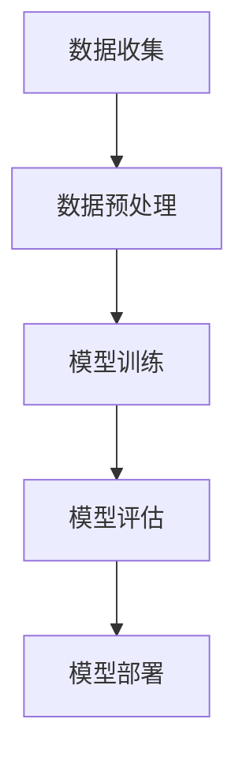

                 

### 《AI大模型创业：如何应对未来行业发展趋势？》

关键词：人工智能、大模型、创业、行业发展趋势、技术创新

摘要：
本文旨在探讨人工智能（AI）大模型在创业领域的应用及其对未来行业发展趋势的影响。通过分析AI大模型的基本概念、技术原理、价值与应用场景，以及创业者如何利用AI大模型抓住行业趋势和新兴行业机会，本文将提供一个系统化的创业策略框架。此外，文章还将深入探讨AI大模型创业过程中的准备、实施、风险与挑战，以及法律与伦理问题，并结合实际案例进行解析，为创业者提供具有实践指导意义的见解和策略。

### 目录大纲

#### 第一部分：AI大模型概述与战略

##### 第1章：AI大模型概述
- 1.1 AI大模型的基本概念与原理
- 1.2 AI大模型的价值与应用场景
- 1.3 创业者如何利用AI大模型

##### 第2章：未来行业发展趋势分析
- 2.1 人工智能在各个行业中的应用趋势
- 2.2 AI大模型在新兴行业的机会
- 2.3 创业者如何抓住AI大模型的机会

#### 第二部分：AI大模型创业实战

##### 第3章：AI大模型创业准备
- 3.1 市场调研与需求分析
- 3.2 AI大模型的构建
- 3.3 创业团队的组建与管理

##### 第4章：AI大模型项目的实施
- 4.1 项目规划与执行
- 4.2 产品的迭代与优化
- 4.3 市场推广与营销策略

##### 第5章：AI大模型创业的风险与挑战
- 5.1 技术风险与应对策略
- 5.2 市场风险与应对策略
- 5.3 资金风险与应对策略

##### 第6章：AI大模型创业的法律与伦理
- 6.1 法律法规与合规要求
- 6.2 伦理道德与责任意识

##### 第7章：AI大模型创业的案例分析
- **案例1**：成功案例介绍
- **案例2**：失败案例剖析
- **案例3**：跨界案例分享

##### 第8章：AI大模型创业的未来展望
- 8.1 AI大模型创业的发展趋势
- 8.2 创业者如何适应未来

#### 第三部分：附录

##### 附录A：AI大模型开发工具与资源
- **工具介绍**
- **资源链接**

##### 附录B：AI大模型创业常用术语解释

##### 附录C：AI大模型创业常见问题解答
- **问题解答**

---

我们现在正式进入文章的第一部分：AI大模型概述与战略。

#### 第一部分：AI大模型概述与战略

##### 第1章：AI大模型概述

在当前快速发展的技术浪潮中，人工智能（AI）大模型成为推动行业变革的重要引擎。本章将首先介绍AI大模型的基本概念与原理，包括其起源、核心技术以及与深度学习的关系。随后，我们将探讨AI大模型的价值与应用场景，帮助创业者了解其商业潜力和社会影响。

### 1.1 AI大模型的基本概念与原理

AI大模型指的是一类具有大规模参数、能够处理复杂任务的人工神经网络模型。这些模型通过训练学习大量的数据，能够自动提取特征、进行模式识别和预测，从而在众多领域中发挥重要作用。AI大模型的起源可以追溯到20世纪50年代，随着计算能力的提升和海量数据的积累，深度学习技术得到了快速发展。

**基本架构：**

一个典型的AI大模型包括以下几个关键组成部分：

1. **输入层**：接收外部数据，如文本、图像、声音等。
2. **隐藏层**：包含多个神经元层，负责特征提取和变换。
3. **输出层**：产生预测或决策，如分类、回归等。

**数据处理流程：**

- **数据收集**：从各种渠道获取大规模数据集。
- **数据预处理**：清洗、归一化、分批次处理等。
- **模型训练**：使用优化算法（如梯度下降）调整模型参数。
- **模型评估**：通过验证集和测试集评估模型性能。
- **模型部署**：将训练好的模型应用到实际场景中。

**Mermaid流程图**：

### 1.1.1 大模型的起源与发展

AI大模型的起源可以追溯到1986年，当时LeCun等人提出了卷积神经网络（CNN），开启了深度学习的新时代。随着硬件计算能力的提升和大数据时代的到来，深度学习技术得到了快速发展。特别是在2012年，AlexNet在ImageNet图像识别比赛中取得突破性成绩，引发了全球范围内的深度学习热潮。

近年来，AI大模型在各个领域取得了显著进展，如自然语言处理（NLP）、计算机视觉（CV）、语音识别（ASR）等。这些模型的规模和参数数量不断增长，从而提升了模型的表达能力和性能。

### 1.1.2 大模型的核心技术

AI大模型的核心技术主要包括以下几个方面：

- **深度学习**：深度学习是一种多层神经网络模型，通过逐层提取特征，实现对复杂数据的建模。常见的深度学习架构包括卷积神经网络（CNN）、循环神经网络（RNN）、Transformer等。

- **优化算法**：优化算法用于调整模型参数，以最小化损失函数。常见的优化算法包括梯度下降（GD）、随机梯度下降（SGD）、Adam等。

- **超参数调优**：超参数是影响模型性能的关键参数，如学习率、批量大小、正则化等。通过调优这些参数，可以提升模型的效果。

- **数据预处理**：数据预处理是深度学习模型训练前的重要步骤，包括数据清洗、归一化、数据增强等。

### 1.1.3 大模型与深度学习的关系

AI大模型是深度学习的一个重要分支，两者密不可分。深度学习为AI大模型提供了理论基础和算法框架，使得大模型能够处理更复杂的任务和数据。而AI大模型的成功也进一步验证了深度学习的有效性和实用性，推动了深度学习技术的不断发展和创新。

### 1.2 AI大模型的价值与应用场景

AI大模型在各个领域展现出了巨大的价值和应用潜力，以下是一些主要的应用场景：

- **自然语言处理（NLP）**：AI大模型在文本生成、情感分析、机器翻译、问答系统等方面取得了显著成果。例如，OpenAI的GPT系列模型在文本生成和语言理解方面表现优异。

- **计算机视觉（CV）**：AI大模型在图像分类、目标检测、图像生成、视频分析等方面有着广泛应用。如Google的Inception模型在图像分类任务上取得了优异成绩。

- **语音识别（ASR）**：AI大模型在语音识别、语音合成、语音翻译等方面发挥了重要作用。如Google的WaveNet模型在语音合成方面表现出色。

- **推荐系统**：AI大模型在推荐系统中的应用，通过分析用户行为和偏好，实现了个性化的推荐服务。

- **金融领域**：AI大模型在风险管理、欺诈检测、量化交易等方面具有广泛的应用前景。

### 1.2.1 人工智能产业的趋势

随着AI大模型的不断发展，人工智能产业正呈现出以下几个主要趋势：

- **规模化**：AI大模型需要大规模的数据集和计算资源，推动了云计算、大数据等技术的发展。

- **泛在化**：AI大模型的应用场景逐渐从单一领域拓展到多个领域，实现了技术的泛在化。

- **智能化**：AI大模型通过不断学习和优化，实现了更高水平的智能化，推动了智能制造、智能交通等领域的创新。

### 1.2.2 大模型在商业领域的应用

在商业领域，AI大模型为各行业提供了强大的工具，以下是一些典型应用案例：

- **零售行业**：通过AI大模型，可以实现商品推荐、库存管理和客户服务等方面的优化，提升零售业务的效率。

- **医疗行业**：AI大模型在疾病诊断、药物研发、医疗影像分析等方面发挥了重要作用，为医疗行业带来了新的发展机遇。

- **金融行业**：AI大模型在风险管理、客户服务、量化交易等方面具有广泛应用，提升了金融行业的智能化水平。

### 1.2.3 大模型对社会的影响

AI大模型对社会的影响是多方面的，包括：

- **经济发展**：AI大模型推动了人工智能产业的发展，促进了经济增长和产业升级。

- **生活方式**：AI大模型的应用改变了人们的生活方式，如智能家居、智能交通等。

- **社会伦理**：AI大模型引发了关于数据隐私、算法公正性、人工智能伦理等方面的讨论。

### 1.3 创业者如何利用AI大模型

创业者可以利用AI大模型进行以下几方面的探索：

- **产品创新**：利用AI大模型开发创新产品，满足市场需求。

- **业务优化**：利用AI大模型优化业务流程，提升企业竞争力。

- **市场拓展**：利用AI大模型拓展市场，实现业务的国际化。

### 1.3.1 创业者面临的挑战

在利用AI大模型进行创业时，创业者面临以下几个主要挑战：

- **技术门槛**：AI大模型开发需要较高的技术门槛，创业者需要具备相关的专业知识和技能。

- **数据获取**：AI大模型训练需要大量高质量的数据，创业者需要解决数据获取和处理的问题。

- **计算资源**：AI大模型训练需要大量的计算资源，创业者需要合理规划计算资源的利用。

### 1.3.2 如何评估AI大模型的价值

评估AI大模型的价值可以从以下几个方面进行：

- **性能指标**：通过评估模型的性能指标（如准确率、召回率、F1值等），衡量模型的效果。

- **应用场景**：分析模型在特定场景下的应用价值，评估其商业潜力。

- **市场反馈**：收集市场反馈，了解用户对模型的接受程度和满意度。

### 1.3.3 创业过程中的关键步骤

在利用AI大模型进行创业的过程中，以下几个关键步骤是必不可少的：

- **市场调研**：了解市场需求和竞争状况，为产品开发和业务拓展提供依据。

- **技术选型**：根据业务需求选择合适的AI大模型技术，进行技术储备和团队建设。

- **数据准备**：收集和预处理数据，确保数据的质量和可用性。

- **模型训练与优化**：训练和优化AI大模型，提升模型性能。

- **产品开发与测试**：开发产品原型，进行功能测试和性能评估。

- **市场推广与运营**：制定市场推广策略，进行产品发布和用户运营。

通过以上步骤，创业者可以充分利用AI大模型的优势，实现创业目标。下一章将深入探讨未来行业发展趋势，为创业者提供更多的市场机遇和战略指导。

---

以上是第一部分的内容，接下来我们将进入第二部分，分析未来行业发展趋势以及创业者如何抓住AI大模型的机会。敬请期待。

