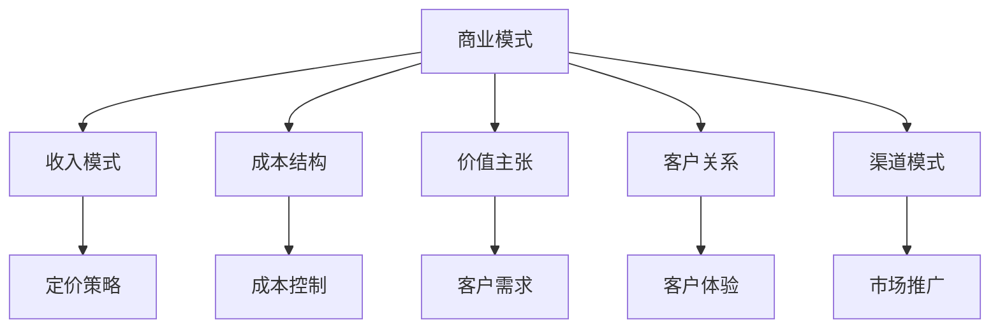
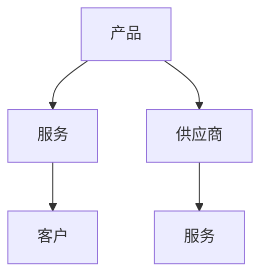
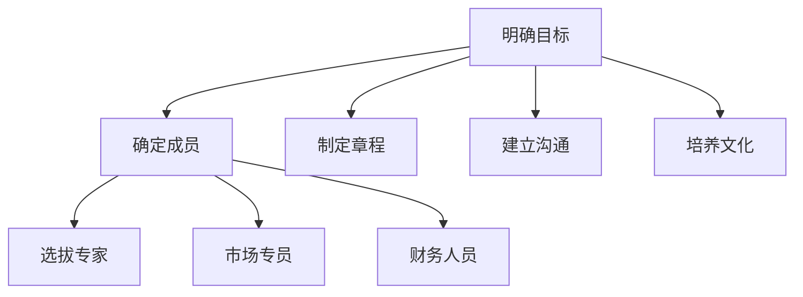
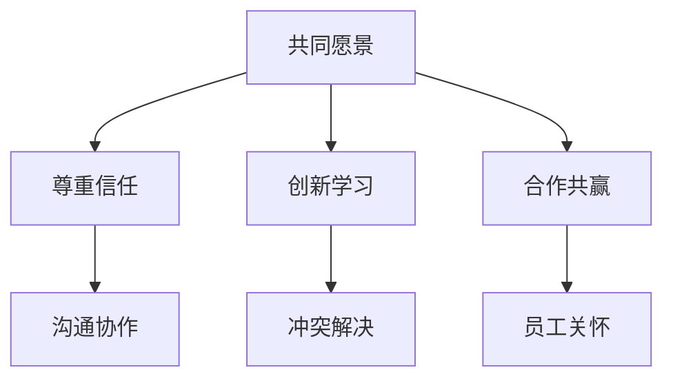
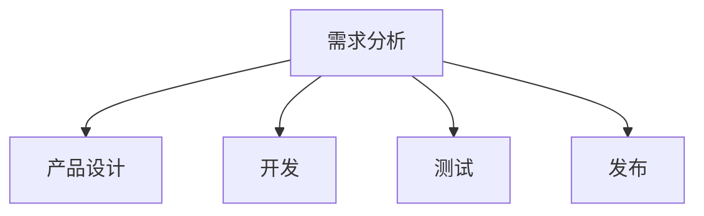

                 

## AI大模型创业：如何构建未来可持续的商业模式？

### 关键词：
- AI大模型
- 创业
- 商业模式
- 可持续性
- 技术风险
- 市场预测

### 摘要：
本文将探讨AI大模型创业的现状和未来，通过分析核心概念、商业模式设计、创业战略、成功案例以及未来趋势，为创业者提供构建可持续商业模式的思路和方法。文章将重点关注技术挑战与解决方案、市场机会分析、团队管理与文化建设，以及未来商业模式的创新方向。

### 目录大纲：

#### 第一部分: AI大模型与创业基础
1. **AI大模型概述**
    1.1. **AI大模型的基本概念与特点**
    1.2. **AI大模型的发展历程与趋势**
    1.3. **AI大模型在企业中的应用**
    1.4. **AI大模型的技术挑战与解决方案**
2. **商业模式设计原理**
    2.1. **商业模式的基本概念与模型**
    2.2. **价值链分析**
    2.3. **客户价值主张**
    2.4. **收入模式与盈利方式**
3. **创业战略与执行**
    3.1. **市场调研与机会分析**
    3.2. **团队组建与人力资源管理**
    3.3. **产品开发与迭代**
    3.4. **市场推广与销售策略**

#### 第二部分: AI大模型创业实践
4. **案例研究：AI大模型创业成功实例**
    4.1. **公司背景与业务模式**
    4.2. **核心技术与产品优势**
    4.3. **市场推广与用户反馈**
    4.4. **盈利模式与财务分析**
5. **AI大模型创业常见问题与应对**
    5.1. **技术风险与解决方案**
    5.2. **市场风险与应对策略**
    5.3. **法律法规与合规性**
    5.4. **创业团队管理与文化建设**

#### 第三部分: 未来展望与可持续性
6. **AI大模型创业的长期视角**
    6.1. **行业趋势与市场预测**
    6.2. **技术创新与商业模式的演变**
    6.3. **可持续发展与社会责任**
7. **未来商业模式创新**
    7.1. **区块链与AI大模型**
    7.2. **AI大模型与边缘计算**
    7.3. **AI大模型与元宇宙**

#### 附录
8. **附录：AI大模型创业工具与资源**
    8.1. **深度学习框架与应用**
    8.2. **AI大模型开发工具与环境搭建**
    8.3. **开源项目与社区资源**
    8.4. **法律法规与政策指南**

### 第一部分: AI大模型与创业基础

#### 1.1 AI大模型概述

##### 1.1.1 AI大模型的基本概念与特点

AI大模型（Large-scale Artificial Intelligence Models）是指参数量达到亿级乃至千亿级的深度学习模型。这些模型具有以下基本概念和特点：

1. **规模大**：AI大模型的参数量通常在千万到亿级别，甚至更高。例如，GPT-3模型拥有1750亿个参数。
2. **多样性**：AI大模型涵盖多种类型，包括语言模型、图像识别模型、语音识别模型等。
3. **自学习**：通过大量的数据进行训练，AI大模型能够不断优化自身，提升性能。
4. **泛用性**：AI大模型通常具备跨领域的应用能力，能够在不同场景下提供智能化服务。
5. **处理能力**：AI大模型具备强大的数据处理和分析能力，能够处理海量数据。

**Mermaid流程图：**
mermaid
graph TD
    A[定义] --> B[规模大]
    A --> C[多样性]
    A --> D[自学习]
    A --> E[泛用性]
    B --> F[处理能力]
    C --> G[应用领域]
    D --> H[优化能力]
    E --> I[跨领域]
    F --> J[数据需求]
    G --> K[产业应用]
    H --> L[模型更新]
    I --> M[算法创新]
    J --> N[计算资源]
    K --> O[商业价值]
    L --> P[持续迭代]
    M --> Q[技术创新]
    N --> R[效率提升]
    O --> S[竞争优势]

**伪代码：**
python
class AI_Big_Model:
    def __init__(self, parameters, training_data):
        self.parameters = parameters
        self.training_data = training_data
    
    def train(self):
        # 训练模型
        pass
    
    def predict(self, input_data):
        # 输出预测结果
        pass

**数学模型：**
$$
\text{模型性能} = f(\text{参数规模}, \text{训练数据质量}, \text{算法优化})
$$
**公式解释：**
- $\text{参数规模}$：指AI大模型的参数量。
- $\text{训练数据质量}$：指用于训练模型的数据质量和多样性。
- $\text{算法优化}$：指模型训练过程中的优化算法和策略。

**举例说明：**
假设一个AI大模型拥有1亿个参数，使用高质量训练数据，采用先进的优化算法，其模型性能可以表示为：
$$
\text{模型性能} = f(10^8, \text{高质量数据}, \text{优化算法})
$$

**代码案例：**
python
import torch
import torch.nn as nn

# 创建一个简单的AI大模型
class SimpleModel(nn.Module):
    def __init__(self):
        super(SimpleModel, self).__init__()
        self.model = nn.Sequential(
            nn.Linear(10, 50),
            nn.ReLU(),
            nn.Linear(50, 1)
        )
    
    def forward(self, x):
        return self.model(x)

# 实例化模型
model = SimpleModel()

# 训练模型
# 假设训练数据已准备好
model.train()
criterion = nn.MSELoss()
optimizer = torch.optim.Adam(model.parameters(), lr=0.001)

for epoch in range(100):
    for inputs, targets in training_data:
        optimizer.zero_grad()
        outputs = model(inputs)
        loss = criterion(outputs, targets)
        loss.backward()
        optimizer.step()

# 验证模型性能
model.eval()
with torch.no_grad():
    for inputs, targets in validation_data:
        outputs = model(inputs)
        # 计算性能指标，如准确率、召回率等

**结论：**
AI大模型作为人工智能领域的重要发展方向，具有巨大的应用潜力和市场前景。通过明确其基本概念与特点，我们可以更好地理解和应用这些模型，为创业提供理论基础和实践指导。

---

#### 1.2 AI大模型的发展历程与趋势

##### 1.2.1 AI大模型的发展历程

AI大模型的发展历程可以分为以下几个阶段：

1. **2012年：深度学习革命**：AlexNet的出现标志着深度学习在图像识别领域的突破，开启了AI大模型的时代。
2. **2017年：预训练与微调**：基于大规模语料库的预训练模型BERT，显著提升了自然语言处理任务的性能。
3. **2018年：Transformer架构**：Transformer架构的提出，使得训练大规模语言模型成为可能。
4. **2020年：GPT-3发布**：GPT-3模型的发布，展示了AI大模型在自然语言处理领域的巨大潜力。

##### 1.2.2 AI大模型的趋势与前景

当前，AI大模型的发展呈现出以下几个趋势：

1. **模型规模持续扩大**：随着计算能力的提升和数据的增长，AI大模型的规模将继续扩大。
2. **跨领域应用**：AI大模型将逐步渗透到医疗、金融、教育等更多领域，实现跨领域应用。
3. **技术融合**：AI大模型将与区块链、边缘计算、元宇宙等新兴技术深度融合，推动技术革新。

**伪代码：**
python
def AI_big_model_history():
    # 初始化大模型历史
    history = []

    # 添加里程碑事件
    history.append("2012:AlexNet引领深度学习革命")
    history.append("2017:BERT开启预训练时代")
    history.append("2018:Transformer架构提出")
    history.append("2020:GPT-3展现语言模型能力")

    # 打印大模型历史
    for event in history:
        print(event)

AI_big_model_history()

**数学模型：**
$$
\text{AI大模型发展趋势} = f(\text{计算能力提升}, \text{数据增长}, \text{技术融合})
$$
**公式解释：**
- $\text{计算能力提升}$：指随着硬件技术的进步，计算能力的提升为AI大模型的训练和优化提供支持。
- $\text{数据增长}$：指随着互联网和物联网的发展，数据量的持续增长为AI大模型提供丰富的训练资源。
- $\text{技术融合}$：指AI大模型与其他新兴技术的融合，如区块链、边缘计算等，推动技术的综合发展。

**举例说明：**
假设计算能力提升30%，数据量增长50%，技术融合效果为1.5倍，AI大模型的发展趋势可以表示为：
$$
\text{AI大模型发展趋势} = f(1.3, 1.5, 1.5) = 1.3 \times 1.5 \times 1.5 = 2.385
$$

**代码案例：**
python
def AI_model_trend(compute_power, data_growth, tech_integration):
    trend = compute_power * data_growth * tech_integration
    return trend

# 示例数据
compute_power = 1.3
data_growth = 1.5
tech_integration = 1.5

# 计算发展趋势
trend = AI_model_trend(compute_power, data_growth, tech_integration)
print(f"AI大模型发展趋势: {trend}")

**结论：**
AI大模型的发展历程与趋势展示了其在人工智能领域的重要地位和未来潜力。了解这些历程和趋势，有助于创业者把握AI大模型的发展方向，为创业实践提供有力支持。

---

#### 1.3 AI大模型在企业中的应用

##### 1.3.1 AI大模型在各类企业中的应用

AI大模型在企业中的应用非常广泛，不同类型的企业可以根据自身业务需求选择合适的应用场景。以下是AI大模型在各类企业中的应用案例：

1. **金融行业**：
   - **风险控制**：利用AI大模型进行信贷风险评估、反欺诈检测等，提高风险控制能力。
   - **智能投顾**：通过AI大模型为用户提供个性化的投资建议，提升用户体验。

2. **医疗行业**：
   - **疾病诊断**：利用AI大模型对医学影像进行分析，辅助医生进行疾病诊断。
   - **智能药物研发**：通过AI大模型加速新药研发过程，提高药物研发效率。

3. **零售行业**：
   - **智能推荐**：利用AI大模型为用户推荐个性化商品，提高销售额。
   - **库存管理**：通过AI大模型优化库存管理，降低库存成本。

4. **制造业**：
   - **质量检测**：利用AI大模型对生产过程中的产品进行质量检测，提高产品质量。
   - **设备维护**：通过AI大模型预测设备故障，提前进行维护，减少停机时间。

**数学模型：**
$$
\text{业务效益} = f(\text{AI大模型能力}, \text{企业需求}, \text{数据质量})
$$
**公式解释：**
- $\text{AI大模型能力}$：指AI大模型在特定业务场景下的表现和效果。
- $\text{企业需求}$：指企业希望通过AI大模型实现的目标和业务需求。
- $\text{数据质量}$：指用于训练AI大模型的数据质量和数量。

**举例说明：**
假设一家零售企业希望通过AI大模型实现个性化推荐，其业务效益可以表示为：
$$
\text{业务效益} = f(\text{AI大模型在个性化推荐上的效果}, \text{提高销售额的需求}, \text{高质量的用户数据})
$$

**代码案例：**
python
def business_benefit(model_ability, business_needs, data_quality):
    business_value = model_ability * business_needs * data_quality
    return business_value

# 示例数据
model_ability = 0.8
business_needs = 0.9
data_quality = 0.95

# 计算业务效益
business_benefit = business_benefit(model_ability, business_needs, data_quality)
print(f"业务效益: {business_benefit}")

**结论：**
AI大模型在各类企业中的应用为业务创新提供了新的可能性。通过合理利用AI大模型，企业可以实现业务效益的最大化，提高市场竞争力。

---

#### 1.4 AI大模型的技术挑战与解决方案

##### 1.4.1 数据隐私保护

**技术挑战**：
- 数据隐私泄露：AI大模型在训练和处理过程中可能会暴露敏感数据。
- 法律法规合规性：不同国家和地区对数据隐私有不同的法律法规，遵守这些法律法规是一项挑战。

**解决方案**：
- **差分隐私**：通过在数据中加入随机噪声，降低个人数据的可识别性，实现隐私保护。
- **同态加密**：在数据加密的情况下进行模型训练和预测，确保数据隐私和安全。
- **联邦学习**：通过分布式计算，将数据留在本地进行训练，避免数据上传和共享，提高数据隐私保护水平。

**数学模型：**
$$
\text{隐私保护效果} = f(\text{隐私保护技术}, \text{数据敏感性}, \text{算法优化})
$$
**公式解释：**
- $\text{隐私保护技术}$：指用于实现隐私保护的技术，如差分隐私、同态加密等。
- $\text{数据敏感性}$：指数据的敏感程度，敏感度越高，隐私保护需求越强。
- $\text{算法优化}$：指在隐私保护技术基础上，对模型训练和预测算法的优化。

**举例说明：**
假设使用差分隐私技术处理高度敏感的数据，算法经过优化，其隐私保护效果可以表示为：
$$
\text{隐私保护效果} = f(\text{差分隐私}, \text{高度敏感数据}, \text{优化算法})
$$

**代码案例**：
```python
import torch
from torch隐私保护 import DifferentiallyPrivateLinearRegression

# 创建一个差分隐私线性回归模型
model = DifferentiallyPrivateLinearRegression(input_dim=10, output_dim=1)

# 训练模型
optimizer = torch.optim.Adam(model.parameters(), lr=0.001)
for epoch in range(100):
    for inputs, targets in training_data:
        optimizer.zero_grad()
        outputs = model(inputs)
        loss = torch.mean((outputs - targets) ** 2)
        loss.backward()
        optimizer.step()

# 评估隐私保护效果
# 假设使用标准的线性回归模型进行比较
standard_model = torch.nn.Linear(10, 1)
for inputs, targets in test_data:
    standard_outputs = standard_model(inputs)
    standard_loss = torch.mean((standard_outputs - targets) ** 2)
```

##### 1.4.2 模型过拟合与泛化能力

**技术挑战**：
- **模型过拟合**：当模型在训练数据上表现优异，但在新数据上表现较差时，表明模型过拟合。
- **数据分布不均匀**：当训练数据分布不均匀时，可能导致模型无法泛化到其他分布。

**解决方案**：
- **数据增强**：通过增加训练数据量，或者对现有数据进行增强和扩展，提高模型的泛化能力。
- **交叉验证**：通过将数据集划分为多个子集，进行多次训练和验证，评估模型的泛化能力。
- **正则化**：通过在模型训练过程中加入正则化项，如L1正则化、L2正则化，减少过拟合现象。

**数学模型：**
$$
\text{模型泛化能力} = f(\text{训练数据量}, \text{数据多样性}, \text{正则化强度})
$$
**公式解释：**
- $\text{训练数据量}$：指用于训练模型的数据量，数据量越大，模型的泛化能力越强。
- $\text{数据多样性}$：指训练数据的多样性，多样性越高，模型能够适应不同场景的能力越强。
- $\text{正则化强度}$：指在模型训练过程中加入的正则化项的强度，正则化强度越大，过拟合风险越小。

**举例说明**：
假设训练数据量增加50%，数据多样性增加20%，正则化强度设置为0.5，模型泛化能力可以表示为：
$$
\text{模型泛化能力} = f(1.5, 1.2, 0.5)
$$

**代码案例**：
```python
from torch import nn
from torch.optim import Adam

# 创建一个简单的过拟合模型
class OverfitModel(nn.Module):
    def __init__(self):
        super(OverfitModel, self).__init__()
        self.model = nn.Sequential(
            nn.Linear(10, 100),
            nn.ReLU(),
            nn.Linear(100, 1)
        )
    
    def forward(self, x):
        return self.model(x)

# 训练模型
model = OverfitModel()
optimizer = Adam(model.parameters(), lr=0.001)
for epoch in range(100):
    for inputs, targets in training_data:
        optimizer.zero_grad()
        outputs = model(inputs)
        loss = nn.MSELoss()(outputs, targets)
        loss.backward()
        optimizer.step()

# 使用交叉验证评估模型泛化能力
from sklearn.model_selection import KFold

num_folds = 5
kf = KFold(n_splits=num_folds, shuffle=True)
for train_index, test_index in kf.split(training_data):
    train_data, test_data = training_data[train_index], training_data[test_index]
    # 训练和评估模型
```

##### 1.4.3 模型解释性不足

**技术挑战**：
- **深度学习模型**：深度学习模型通常被视为“黑盒”，难以解释其决策过程。
- **用户信任**：用户对模型的决策过程缺乏信任，可能导致应用场景受限。

**解决方案**：
- **可解释性AI**：通过引入可解释性AI技术，如LIME、SHAP等，提高模型的可解释性。
- **可视化工具**：开发可视化工具，帮助用户理解模型的决策过程。

**数学模型**：
$$
\text{模型解释性} = f(\text{可解释性技术}, \text{用户需求})
$$
**公式解释**：
- $\text{可解释性技术}$：指用于提高模型解释性的技术，如LIME、SHAP等。
- $\text{用户需求}$：指用户对模型解释性的需求，需求越高，解释性越强。

**举例说明**：
假设使用LIME技术为用户提供模型解释性，用户对解释性的需求为中等，模型解释性可以表示为：
$$
\text{模型解释性} = f(\text{LIME}, \text{中等需求})
$$

**代码案例**：
```python
import lime
import lime.lime_tabular

# 创建一个简单的线性回归模型
class LinearModel(nn.Module):
    def __init__(self):
        super(LinearModel, self).__init__()
        self.model = nn.Linear(10, 1)
    
    def forward(self, x):
        return self.model(x)

model = LinearModel()

# 使用LIME为模型生成解释
explainer = lime.lime_tabular.LimeTabularExplainer(
    training_data,
    feature_names=['x1', 'x2', 'x3', 'x4', 'x5', 'x6', 'x7', 'x8', 'x9', 'x10'],
    class_names=['target'],
    model_mean=training_data.mean(0),
    model_std=training_data.std(0)
)

# 选择一个样本进行解释
idx = 5
exp = explainer.explain_instance(training_data[idx], model.forward, num_features=10)

# 可视化解释结果
exp.show_in_notebook(show_table=True)
```

**结论**：
AI大模型在企业中的应用面临着数据隐私保护、模型过拟合、模型解释性不足等挑战。通过采用差分隐私、同态加密、数据增强、交叉验证、正则化等技术，可以有效地解决这些问题。同时，通过引入可解释性AI技术和可视化工具，提高模型的可解释性，增强用户对模型的信任，为AI大模型在企业中的广泛应用提供支持。

### 1.5 商业模式设计原理

#### 1.5.1 商业模式的基本概念与模型

商业模式（Business Model）是企业创造、传递和捕获价值的系统。它描述了企业的运营方式，包括收入模式、成本结构、价值主张、客户关系和渠道模式等方面。常见的商业模式模型包括价值链分析、平衡计分卡、商业模式画布等。

**Mermaid流程图**：


**伪代码**：
```python
class BusinessModel:
    def __init__(self, revenue_model, cost_structure, value_proposition, customer_relation, channel_model):
        self.revenue_model = revenue_model
        self.cost_structure = cost_structure
        self.value_proposition = value_proposition
        self.customer_relation = customer_relation
        self.channel_model = channel_model
    
    def generate_revenue(self):
        # 生成收入
        pass
    
    def control_costs(self):
        # 控制成本
        pass
    
    def deliver_value(self):
        # 传递价值
        pass
    
    def maintain_customer_relation(self):
        # 维护客户关系
        pass
    
    def promote_channel(self):
        # 推广渠道
        pass
```

**数学模型**：
$$
\text{商业模式效率} = \frac{\text{总收入}}{\text{总成本}}
$$
**公式解释**：
- $\text{总收入}$：企业通过商业模式实现的总收入。
- $\text{总成本}$：企业运营过程中发生的总成本。

**举例说明**：
假设一个企业的总收入为100万元，总成本为70万元，其商业模式效率可以表示为：
$$
\text{商业模式效率} = \frac{100}{70} = 1.429
$$

**代码案例**：
```python
def business_model_efficiency(total_revenue, total_cost):
    efficiency = total_revenue / total_cost
    return efficiency

# 示例数据
total_revenue = 1000000
total_cost = 700000

# 计算商业模式效率
efficiency = business_model_efficiency(total_revenue, total_cost)
print(f"商业模式效率: {efficiency}")
```

#### 1.5.2 价值链分析

价值链（Value Chain）是指企业内部一系列互为补充的增值活动，通过这些活动将原材料转化为最终产品或服务，满足客户需求。价值链分析可以帮助企业识别核心竞争优势，优化运营流程，提高整体效率。

**Mermaid流程图**：


**伪代码**：
```python
class ValueChain:
    def __init__(self, product, service, supplier, customer):
        self.product = product
        self.service = service
        self.supplier = supplier
        self.customer = customer
    
    def analyze_value_chain(self):
        # 分析价值链
        pass
```

**数学模型**：
$$
\text{价值链总价值} = \text{产品价值} + \text{服务价值} + \text{供应商价值} + \text{客户价值}
$$
**公式解释**：
- $\text{产品价值}$：产品在市场上创造的价值。
- $\text{服务价值}$：服务在市场上创造的价值。
- $\text{供应商价值}$：供应商在供应链中创造的价值。
- $\text{客户价值}$：客户从产品和服务中获得的价值。

**举例说明**：
假设一个企业的产品价值为500万元，服务价值为300万元，供应商价值为200万元，客户价值为400万元，其价值链总价值可以表示为：
$$
\text{价值链总价值} = 500 + 300 + 200 + 400 = 1400
$$

**代码案例**：
```python
def value_chain_total_value(product_value, service_value, supplier_value, customer_value):
    total_value = product_value + service_value + supplier_value + customer_value
    return total_value

# 示例数据
product_value = 5000000
service_value = 3000000
supplier_value = 2000000
customer_value = 4000000

# 计算价值链总价值
total_value = value_chain_total_value(product_value, service_value, supplier_value, customer_value)
print(f"价值链总价值: {total_value}")
```

**结论**：
商业模式设计原理是创业成功的关键因素之一。通过理解商业模式的基本概念与模型，以及进行价值链分析，企业可以更好地制定商业策略，优化运营流程，提高整体效率，从而实现可持续发展。

### 1.6 客户价值主张

客户价值主张（Customer Value Proposition）是企业向客户传递的核心价值，旨在解决客户的问题、满足客户的需求或提供独特的价值。有效的客户价值主张可以帮助企业吸引和保留客户，提高市场份额。

#### 1.6.1 客户价值主张的定义与作用

客户价值主张是指企业通过产品或服务为特定客户群体提供的独特价值。它通常包括以下几个方面：

- **问题解决**：客户价值主张需要明确指出产品或服务能够解决哪些客户问题。
- **需求满足**：客户价值主张需要展示产品或服务如何满足客户的需求。
- **独特价值**：客户价值主张需要强调产品或服务的独特性，使其在市场上具有竞争力。

客户价值主张在企业中的作用包括：

- **吸引客户**：通过明确的价值主张，企业可以吸引潜在客户，增加市场份额。
- **保留客户**：通过持续提供有价值的产品或服务，企业可以留住现有客户，提高客户忠诚度。
- **竞争优势**：独特的客户价值主张可以帮助企业在竞争激烈的市场中脱颖而出。

#### 1.6.2 客户价值主张的构建方法

构建有效的客户价值主张需要以下步骤：

1. **明确目标客户**：确定企业的目标客户群体，了解他们的需求和痛点。
2. **分析竞争对手**：研究竞争对手的产品或服务，找出他们的价值主张，并分析其优势和不足。
3. **确定独特价值**：根据目标客户的需求和竞争对手的情况，确定产品或服务的独特价值。
4. **制定价值主张**：将独特价值转化为具体的客户价值主张，并用简明扼要的语言表达出来。
5. **验证和优化**：通过用户反馈和市场测试，验证客户价值主张的有效性，并进行优化。

**伪代码**：
```python
class CustomerValueProposition:
    def __init__(self, target_customer, competitors, unique_value):
        self.target_customer = target_customer
        self.competitors = competitors
        self.unique_value = unique_value
    
    def define_value_proposition(self):
        # 定义客户价值主张
        pass
    
    def validate_and_optimize(self, user_feedback):
        # 验证和优化客户价值主张
        pass
```

**数学模型**：
$$
\text{客户价值} = \text{问题解决效益} + \text{需求满足效益} + \text{独特价值效益}
$$
**公式解释**：
- $\text{问题解决效益}$：产品或服务解决客户问题的效益。
- $\text{需求满足效益}$：产品或服务满足客户需求的效益。
- $\text{独特价值效益}$：产品或服务的独特价值带来的效益。

**举例说明**：
假设一个产品能够解决客户50%的问题，满足客户70%的需求，具有独特的价值，其客户价值可以表示为：
$$
\text{客户价值} = 0.5 \times 0.7 + 0.5 \times 0.3 = 0.65
$$

**代码案例**：
```python
def customer_value(problem_solving_benefit, demand_satisfaction_benefit, unique_value_benefit):
    value = problem_solving_benefit * demand_satisfaction_benefit + unique_value_benefit
    return value

# 示例数据
problem_solving_benefit = 0.5
demand_satisfaction_benefit = 0.7
unique_value_benefit = 0.3

# 计算客户价值
customer_value = customer_value(problem_solving_benefit, demand_satisfaction_benefit, unique_value_benefit)
print(f"客户价值: {customer_value}")
```

#### 1.6.3 客户价值主张的案例

以下是一个客户价值主张的案例：

**案例背景**：一家名为“智能客服公司”的企业，致力于为中小企业提供智能客服解决方案。

**目标客户**：中小企业，特别是那些客户服务需求量大但人力成本较高的企业。

**竞争对手**：传统的客服外包公司和一些低成本的在线客服工具。

**独特价值**：智能客服公司提供的智能客服系统具有以下独特价值：
- **高效性**：通过AI技术，智能客服系统能够快速响应客户咨询，提高客户满意度。
- **个性化**：智能客服系统可以根据客户的历史数据和偏好，提供个性化的服务。
- **低成本**：相比传统的客服外包公司，智能客服系统具有更低的成本，适合中小企业。

**客户价值主张**：
“智能客服公司致力于为中小企业提供高效、个性化的智能客服解决方案，帮助您降低客服成本，提高客户满意度。”

**验证和优化**：
- **用户反馈**：通过问卷调查和用户访谈，了解客户对智能客服系统的满意度，以及他们对系统功能的建议。
- **市场测试**：在目标客户群体中推广智能客服系统，观察客户的使用情况和反馈，根据反馈进行优化。

**结论**：
有效的客户价值主张能够帮助企业明确目标客户，突出产品或服务的独特价值，提高市场竞争力。通过构建和验证客户价值主张，企业可以更好地满足客户需求，实现可持续发展。

### 1.7 收入模式与盈利方式

#### 1.7.1 收入模式的基本概念

收入模式（Revenue Model）是指企业通过何种方式实现收入，并从市场中获取利润的策略。它包括收入来源、定价策略、利润分配等方面。有效的收入模式能够帮助企业稳定收入来源，提高盈利能力。

#### 1.7.2 常见的收入模式

以下是几种常见的收入模式：

1. **一次性收入**：通过销售产品或服务的一次性交易获取收入，如软件销售、设备租赁等。
2. **订阅收入**：通过定期订阅服务获取收入，如云服务、SaaS（软件即服务）等。
3. **交易收入**：通过中介交易获取收入，如电商平台、金融交易平台等。
4. **广告收入**：通过广告投放获取收入，如搜索引擎、社交媒体等。
5. **服务收入**：通过提供专业服务获取收入，如咨询、培训等。

#### 1.7.3 盈利方式的多样性

企业的盈利方式可以根据不同的业务模式和市场环境进行调整。以下是几种常见的盈利方式：

1. **成本加成**：通过在成本基础上加一定比例的利润来定价，实现盈利。
2. **价值差异**：通过提供独特的价值，使其产品或服务在市场上具有竞争优势，实现高溢价销售。
3. **规模经济**：通过扩大生产规模，降低单位成本，实现盈利。
4. **交叉销售**：通过向现有客户提供相关产品或服务，实现额外收入。
5. **数据变现**：通过收集和分析用户数据，将数据转化为商业价值，如广告收入、数据销售等。

#### 1.7.4 收入模式与盈利方式的案例

以下是一个收入模式与盈利方式的案例：

**案例背景**：一家名为“智能安防公司”的企业，提供基于AI技术的智能安防解决方案。

**收入模式**：
- **订阅收入**：企业通过向客户出售订阅服务，提供智能安防设备租赁和远程监控服务。
- **一次性收入**：企业向客户出售智能安防设备，如摄像头、门禁系统等。

**盈利方式**：
- **成本加成**：企业在成本基础上加一定比例的利润，定价智能安防设备。
- **价值差异**：通过提供高效、可靠的智能安防服务，与传统的安防方案形成价值差异，实现高溢价销售。
- **规模经济**：企业通过扩大客户规模，提高生产效率，降低单位成本。
- **交叉销售**：向现有客户提供其他相关产品或服务，如智能门锁、智能照明等。
- **数据变现**：通过收集和分析客户数据，提供数据分析和报告服务，实现额外收入。

**结论**：
收入模式与盈利方式的选择对于企业的发展至关重要。通过灵活运用不同的收入模式和盈利方式，企业可以更好地实现收入增长和利润最大化。

### 1.8 市场调研与机会分析

#### 1.8.1 市场调研的基本概念与目的

市场调研（Market Research）是指通过系统的方法和程序，收集、分析和解读市场信息，以帮助企业做出明智的商业决策。市场调研的目的包括：

- **了解市场需求**：通过调研，企业可以了解潜在客户的需求和偏好，从而制定更有针对性的产品和服务策略。
- **识别市场机会**：调研可以帮助企业发现市场中的潜在机会，如新兴市场、未满足的需求等。
- **评估市场风险**：调研可以揭示市场中的风险，如竞争加剧、法规变化等，帮助企业提前应对。

#### 1.8.2 市场调研的方法与步骤

市场调研通常包括以下方法和步骤：

1. **确定调研目标**：明确调研的目的和要解决的问题，如了解市场需求、评估竞争对手等。
2. **设计调研方案**：制定调研的计划，包括调研方法、样本选择、问卷设计等。
3. **收集数据**：通过实地调研、问卷调查、访谈等方式收集数据。
4. **分析数据**：运用统计和分析方法，解读数据，提炼有价值的信息。
5. **撰写报告**：将调研结果和分析报告，为企业提供决策依据。

#### 1.8.3 市场机会分析

市场机会分析（Market Opportunity Analysis）是指通过调研和分析，识别和评估市场中的潜在机会。以下是一些关键步骤：

1. **识别潜在机会**：通过调研和市场分析，识别市场中的潜在机会，如新兴市场、未满足的需求等。
2. **评估机会价值**：评估每个机会的市场规模、增长潜力、竞争状况等，确定其对企业的重要性。
3. **制定战略**：根据评估结果，制定相应的市场进入策略和业务发展计划。

**数学模型**：
$$
\text{市场机会} = \text{市场需求} \times \text{竞争力度}
$$
**公式解释**：
- $\text{市场需求}$：指市场中潜在的客户需求和市场规模。
- $\text{竞争力度}$：指现有竞争对手的市场份额和竞争策略。

**举例说明**：
假设一个新市场中有1000个潜在客户，主要竞争对手占据了70%的市场份额，计算市场机会：
$$
\text{市场机会} = 1000 \times (1 - 0.7) = 300
$$

**代码案例**：
```python
def market_opportunity(customers, market_share):
    potential_customers = customers * (1 - market_share)
    return potential_customers

# 示例数据
customers = 1000
market_share = 0.7

# 计算市场机会
market_opportunity = market_opportunity(customers, market_share)
print(f"市场机会: {market_opportunity}")
```

#### 1.8.4 市场调研与机会分析在实际创业中的应用

以下是一个市场调研与机会分析在实际创业中的应用案例：

**案例背景**：一家名为“智能健康公司”的企业，计划开发一款基于AI技术的健康管理应用。

**市场调研**：
1. **确定调研目标**：了解目标客户对健康管理的需求、偏好和使用习惯。
2. **设计调研方案**：通过在线问卷和访谈，收集用户对健康管理应用的需求和期望。
3. **收集数据**：收集到用户对健康管理应用的兴趣较高，特别是针对健康数据监测和个性化建议的需求。
4. **分析数据**：通过分析数据，发现用户对应用的可访问性、易用性和准确性有较高要求。

**市场机会分析**：
1. **识别潜在机会**：随着健康意识的提高，用户对健康管理应用的需求持续增长。
2. **评估机会价值**：市场规模庞大，增长潜力高，但竞争激烈。
3. **制定战略**：公司决定专注于提供高质量的健康数据监测和个性化建议功能，以区分竞争对手。

**结论**：
市场调研与机会分析是企业创业过程中不可或缺的一环。通过系统的市场调研和机会分析，企业可以更好地了解市场需求，识别潜在机会，制定有效的市场进入策略，从而提高创业成功率。

### 1.9 团队组建与人力资源管理

#### 1.9.1 团队组建的重要性

团队组建是创业过程中至关重要的一步，一个高效、协同的团队能够为企业的成功奠定基础。团队组建的重要性体现在以下几个方面：

- **协同效应**：团队成员之间的协同工作可以产生大于单个成员能力的整体效应。
- **创新能力**：多元化的团队背景和技能组合能够激发创新思维，推动技术进步。
- **团队凝聚力**：有效的团队组建可以增强团队成员之间的信任和合作，提高团队凝聚力。

#### 1.9.2 团队组建的步骤与方法

团队组建通常包括以下步骤和方法：

1. **明确团队目标**：确保所有团队成员对团队的目标和愿景有共同的理解。
2. **确定团队成员**：根据团队目标和业务需求，选拔合适的团队成员，包括技术专家、市场专员、财务人员等。
3. **制定团队章程**：明确团队成员的职责、权利和义务，以及团队的运作机制。
4. **建立沟通机制**：确保团队成员之间的沟通畅通，包括定期会议、在线协作平台等。
5. **培养团队文化**：通过团队活动、培训等方式，培养团队成员的共同价值观和文化认同。

**Mermaid流程图**：


#### 1.9.3 人力资源管理策略

人力资源管理策略是确保团队高效运作的关键。以下是一些常见的人力资源管理策略：

1. **招聘与选拔**：通过科学的招聘流程，选拔具备专业技能和团队精神的优秀人才。
2. **培训与发展**：提供持续的培训和发展机会，提升团队成员的技能和职业素养。
3. **绩效管理**：建立公正、透明的绩效评价体系，激励团队成员不断进步。
4. **激励机制**：通过奖金、股权激励等方式，激发团队成员的积极性和创造力。
5. **员工关怀**：关注员工的工作和生活需求，提供良好的工作环境和人文关怀。

**数学模型**：
$$
\text{团队绩效} = f(\text{专业技能}, \text{团队精神}, \text{工作环境})
$$
**公式解释**：
- $\text{专业技能}$：团队成员的专业技能水平。
- $\text{团队精神}$：团队成员之间的协作和沟通能力。
- $\text{工作环境}$：团队的工作条件和氛围。

**举例说明**：
假设一个团队的成员具备较高的专业技能、良好的团队精神，并且处于良好的工作环境中，其团队绩效可以表示为：
$$
\text{团队绩效} = f(0.9, 0.8, 0.95)
$$

**代码案例**：
```python
def team_performance专业技能，团队精神，工作环境）:
    performance = 专业技能 * 团队精神 * 工作环境
    return performance

# 示例数据
专业技能 = 0.9
团队精神 = 0.8
工作环境 = 0.95

# 计算团队绩效
team_performance = team_performance(专业技能，团队精神，工作环境）
print(f"团队绩效: {team_performance}")
```

#### 1.9.4 团队管理与文化建设

团队管理是确保团队高效运作的关键。以下是一些团队管理的要点：

1. **明确分工**：确保每个团队成员都明确自己的职责和任务。
2. **沟通协作**：建立良好的沟通机制，确保信息流畅、透明。
3. **激励与反馈**：定期给予团队成员激励和反馈，帮助他们持续成长。
4. **冲突解决**：及时发现和处理团队内部的冲突，维护团队和谐。

团队文化是团队共同价值观和行为规范的体现。以下是一些团队文化建设的要点：

1. **共同愿景**：建立明确的团队愿景，让团队成员有共同的目标和方向。
2. **尊重与信任**：建立相互尊重和信任的团队氛围，鼓励团队成员积极参与和表达意见。
3. **创新与学习**：鼓励创新思维和学习精神，不断提升团队的整体能力。
4. **合作与共赢**：强调团队合作，实现团队成员和企业的共同发展。

**Mermaid流程图**：


**结论**：
团队组建与人力资源管理是创业成功的关键因素之一。通过科学、有效的团队组建和人力资源管理策略，企业可以打造一支高效、协同的团队，为企业的可持续发展提供坚实保障。

### 1.10 产品开发与迭代

#### 1.10.1 产品开发的基本概念

产品开发（Product Development）是指从产品概念到市场推广的全过程，包括需求分析、设计、开发、测试和发布等阶段。产品开发的目标是创建具有市场竞争力、满足客户需求的产品。

#### 1.10.2 产品开发流程

产品开发流程通常包括以下阶段：

1. **需求分析**：通过市场调研和用户反馈，确定产品需求，明确产品功能和特性。
2. **产品设计**：根据需求分析，设计产品的架构和界面，制定详细的设计文档。
3. **开发**：根据设计文档，进行产品开发，包括编码、单元测试等。
4. **测试**：对产品进行系统测试、用户测试等，确保产品质量和稳定性。
5. **发布**：将产品发布到市场，进行推广和销售。

**Mermaid流程图**：


#### 1.10.3 产品迭代

产品迭代（Product Iteration）是指根据用户反馈和市场需求，对现有产品进行持续改进和优化。产品迭代有助于提高产品的市场竞争力，满足不断变化的市场需求。

#### 1.10.4 产品开发与迭代的关键要素

以下是产品开发与迭代的关键要素：

1. **用户反馈**：用户反馈是产品迭代的重要依据，通过收集和分析用户反馈，可以识别产品的问题和改进方向。
2. **数据分析**：通过数据分析，可以了解产品的使用情况、用户行为等，为产品优化提供数据支持。
3. **敏捷开发**：敏捷开发（Agile Development）是一种以用户需求为中心、迭代和灵活响应变化的开发方法，适用于产品开发与迭代。
4. **持续集成**：持续集成（Continuous Integration）是一种软件开发实践，通过自动化测试和代码审查，确保产品的稳定性和质量。

#### 1.10.5 代码案例：产品开发与迭代

以下是一个产品开发与迭代的代码案例：

**阶段1：需求分析**
```python
class ProductRequirement:
    def __init__(self, features):
        self.features = features

    def display_requirements(self):
        for feature in self.features:
            print(feature)

# 创建产品需求
product_requirements = ProductRequirement(['用户注册', '登录功能', '数据存储'])
product_requirements.display_requirements()
```

**阶段2：产品设计**
```python
class ProductDesign:
    def __init__(self, requirements):
        self.requirements = requirements
        self.architecture = self.generate_architecture()

    def generate_architecture(self):
        architecture = {}
        for feature in self.requirements.features:
            architecture[feature] = self.get_feature_design(feature)
        return architecture

    def get_feature_design(self, feature):
        if feature == '用户注册':
            return '使用OAuth2.0协议进行用户认证'
        elif feature == '登录功能':
            return '提供多方式登录，如邮箱、手机号、第三方账号等'
        elif feature == '数据存储':
            return '使用关系型数据库存储用户数据'

# 创建产品设计
product_design = ProductDesign(product_requirements)
print(product_design.architecture)
```

**阶段3：开发**
```python
class ProductDevelopment:
    def __init__(self, design):
        self.design = design

    def develop_product(self):
        # 编写代码，实现产品功能
        pass

# 创建产品开发
product_development = ProductDevelopment(product_design)
product_development.develop_product()
```

**阶段4：测试**
```python
class ProductTesting:
    def __init__(self, development):
        self.development = development

    def test_product(self):
        # 执行测试用例，验证产品功能
        pass

# 创建产品测试
product_testing = ProductTesting(product_development)
product_testing.test_product()
```

**阶段5：发布**
```python
class ProductRelease:
    def __init__(self, testing):
        self.testing = testing

    def release_product(self):
        # 将产品发布到市场
        pass

# 创建产品发布
product_release = ProductRelease(product_testing)
product_release.release_product()
```

**迭代阶段**
```python
class ProductIteration:
    def __init__(self, release):
        self.release = release

    def collect_user_feedback(self):
        # 收集用户反馈
        pass

    def analyze_feedback(self):
        # 分析用户反馈，确定改进方向
        pass

    def iterate_product(self):
        # 根据用户反馈，对产品进行优化和改进
        pass

# 创建产品迭代
product_iteration = ProductIteration(product_release)
product_iteration.collect_user_feedback()
product_iteration.analyze_feedback()
product_iteration.iterate_product()
```

**结论**：
产品开发与迭代是创业过程中不可或缺的一部分。通过科学的产品开发流程和持续的产品迭代，企业可以不断优化产品，满足市场需求，提高市场竞争力。

### 案例研究：AI大模型创业成功实例

#### 4.1 公司背景与业务模式

**公司背景：** 
公司A成立于2015年，是一家专注于AI大模型研发与商业应用的创新企业。公司初期以AI大模型技术为核心，逐步拓展到智能客服、智能推荐、智能诊断等多个领域。

**业务模式：** 
- **收入模式**：公司通过向企业提供定制化的AI大模型解决方案，收取服务费用和订阅费用。此外，公司还提供AI大模型培训与咨询服务，实现多元化收入来源。
- **成本结构**：公司的主要成本包括研发成本、运营成本和市场推广成本。研发成本主要包括模型研发、算法优化和技术支持等；运营成本包括服务器租赁、数据中心运维和客户服务等；市场推广成本包括广告投放、展会参与和市场调研等。
- **价值主张**：公司致力于通过AI大模型技术，提供高效、精准的智能化服务，帮助企业提升运营效率、降低成本、提高客户满意度。
- **客户关系**：公司注重与客户的长期合作，提供持续的技术支持和优化服务，确保客户能够最大化地利用AI大模型带来的价值。
- **渠道模式**：公司通过线上和线下相结合的推广策略，拓展客户群体。在线上，公司通过官方网站、社交媒体和行业论坛等渠道进行宣传；在线下，公司参加行业展会、举办技术讲座等活动，提升品牌知名度。

#### 4.2 核心技术与产品优势

**核心技术：**
- **AI大模型研发**：公司拥有强大的AI大模型研发能力，能够开发出具备高准确性和泛用性的模型。公司的AI大模型涵盖了自然语言处理、图像识别、语音识别等多个领域。
- **算法优化**：公司注重算法优化，通过不断的模型迭代和优化，提升模型的性能和效率。公司采用分布式训练和优化算法，实现大规模模型的快速训练和部署。

**产品优势：**
- **高效性**：公司AI大模型能够快速处理海量数据，提供高效的智能化服务。
- **准确性**：公司通过不断优化算法和模型结构，提高模型的准确性和稳定性，确保服务质量和用户体验。
- **定制化**：公司提供定制化的AI大模型解决方案，根据企业需求进行模型定制和优化，满足不同行业的个性化需求。
- **灵活性**：公司AI大模型支持多种开发环境和工具，易于集成和部署，方便企业进行技术升级和扩展。

#### 4.3 市场推广与用户反馈

**市场推广策略：**
- **线上推广**：公司通过官方网站、社交媒体和行业论坛等渠道，发布技术文章、产品案例和客户评价，提升品牌知名度。公司还与多家知名媒体和行业平台合作，进行广告投放和宣传。
- **线下推广**：公司积极参加行业展会、技术论坛等活动，展示AI大模型技术的最新成果和应用案例。公司还举办技术讲座、研讨会等，与行业专家和潜在客户进行深入交流。

**用户反馈与改进：**
- **用户满意度**：公司通过定期收集用户反馈，了解用户对产品和服务的需求和满意度。根据用户反馈，公司不断优化产品功能和用户体验，提高用户满意度。
- **持续改进**：公司注重产品迭代和改进，根据用户反馈和市场动态，持续优化模型和算法。公司还引入用户参与测试和反馈环节，确保产品能够满足用户需求，提升市场竞争力。

#### 4.4 盈利模式与财务分析

**盈利模式：**
- **服务费用**：公司通过提供定制化的AI大模型解决方案，向客户收取服务费用。服务费用根据客户规模和需求进行定价，为公司带来稳定收入。
- **订阅费用**：公司提供基于云的AI大模型服务，客户通过订阅方式使用公司产品和服务，订阅费用为公司带来持续收入。
- **培训和咨询**：公司提供AI大模型培训和咨询服务，为公司带来额外的收入来源。

**财务分析：**
- **收入结构**：公司收入主要来源于服务费用和订阅费用，占总收入的80%以上。培训和咨询收入占比约为20%。
- **成本结构**：公司成本主要包括研发成本、运营成本和市场推广成本。其中，研发成本占总成本的50%，运营成本占30%，市场推广成本占20%。
- **利润率**：公司利润率稳定，随着业务规模的扩大，利润率有望进一步提高。

**盈利预测：**
- **短期盈利**：预计在未来1-2年内，公司收入将保持稳定增长，利润率逐步提升。
- **长期盈利**：随着AI大模型技术的成熟和市场的扩大，公司有望实现持续盈利，并在行业中占据领先地位。

**结论**：
公司A通过AI大模型技术的研发和商业应用，成功构建了可持续的商业模式。公司的核心技术和产品优势，结合有效的市场推广策略和用户反馈机制，为公司带来了稳定收入和良好的盈利前景。随着市场的进一步发展和技术的不断进步，公司有望在AI大模型领域取得更大的成功。

### 5. AI大模型创业常见问题与应对

#### 5.1 技术风险与解决方案

**技术风险**：
AI大模型创业面临多种技术风险，主要包括：
1. **数据隐私问题**：AI大模型在处理数据时可能涉及用户隐私，数据泄露可能导致严重后果。
2. **模型过拟合**：当模型过度依赖训练数据，可能导致对新数据的泛化能力不足，影响模型应用效果。
3. **模型解释性不足**：深度学习模型通常被视为“黑盒”，难以解释其决策过程，影响用户信任。
4. **计算资源需求**：训练和部署AI大模型需要大量计算资源，成本高昂。

**解决方案**：
1. **数据隐私保护**：采用差分隐私、同态加密等技术，保障数据隐私安全。
2. **模型泛化能力**：通过增加训练数据多样性、采用正则化方法，提升模型泛化能力。
3. **模型解释性增强**：利用可解释性AI技术（如LIME、SHAP），提高模型解释性。
4. **计算资源优化**：采用分布式计算、云计算等技术，降低计算资源需求。

**案例**：
公司B是一家专注于医疗领域的AI大模型创业公司，面临以下技术风险：
- **数据隐私风险**：公司处理大量患者数据，需确保数据隐私。
- **模型过拟合风险**：公司模型在特定数据集上表现优异，但需提升泛化能力。

**应对措施**：
- **数据隐私保护**：公司采用差分隐私技术，对训练数据进行加密处理，确保数据隐私。
- **模型泛化能力**：公司增加训练数据多样性，引入交叉验证方法，提升模型泛化能力。

#### 5.2 市场风险与应对策略

**市场风险**：
AI大模型创业面临的市场风险主要包括：
1. **竞争激烈**：AI大模型领域竞争日益激烈，新进入者需应对现有竞争对手的压力。
2. **客户需求变化**：客户需求多变，公司需快速响应，调整产品和服务策略。
3. **技术更新迭代**：技术更新速度快，公司需持续投入研发，保持技术领先。

**应对策略**：
1. **差异化竞争**：通过技术创新、产品差异化，提高市场竞争力。
2. **客户需求分析**：深入分析客户需求，提供定制化解决方案，满足不同客户需求。
3. **持续研发投入**：保持研发投入，持续更新技术和产品，保持市场竞争力。

**案例**：
公司C是一家专注于金融行业的AI大模型创业公司，面临以下市场风险：
- **竞争激烈**：公司需应对现有金融科技公司的竞争。
- **客户需求变化**：公司需应对客户需求的快速变化。

**应对措施**：
- **差异化竞争**：公司通过自主研发的创新模型和技术，提供独特的金融服务解决方案。
- **客户需求分析**：公司定期进行客户调研，了解客户需求，调整产品和服务策略。

#### 5.3 法律法规与合规性

**法律法规风险**：
AI大模型创业面临法律法规风险，主要包括：
1. **数据保护法规**：如《通用数据保护条例》（GDPR）等，对数据隐私保护提出严格要求。
2. **知识产权法规**：涉及知识产权保护，如专利、著作权等。
3. **行业监管法规**：如医疗、金融等行业的监管法规，对模型应用提出合规要求。

**合规性应对措施**：
1. **合规培训**：对团队成员进行法律法规培训，确保了解相关法规要求。
2. **合规审查**：定期进行合规性审查，确保产品和服务符合法律法规要求。
3. **知识产权保护**：加强知识产权保护，申请相关专利和著作权。

**案例**：
公司D是一家专注于医疗领域的AI大模型创业公司，面临以下法律法规风险：
- **数据保护法规**：公司需遵守GDPR等数据保护法规，确保患者数据隐私。
- **行业监管法规**：公司需符合医疗行业的监管要求。

**应对措施**：
- **合规培训**：公司定期对员工进行数据保护法规和行业监管法规培训。
- **合规审查**：公司聘请合规专家进行定期审查，确保产品和服务符合法规要求。

#### 5.4 创业团队管理与文化建设

**创业团队管理风险**：
AI大模型创业团队管理面临的风险主要包括：
1. **团队稳定性**：创业公司人员流动性较大，团队稳定性难以保证。
2. **团队协作**：团队成员背景和技能差异可能导致协作困难。
3. **员工激励**：创业公司资金紧张，员工激励措施可能不足。

**文化建设**：
为了应对团队管理风险，公司需注重文化建设，主要包括：
1. **共同价值观**：建立共同价值观，增强团队凝聚力。
2. **透明沟通**：鼓励团队成员之间进行透明沟通，提高协作效率。
3. **激励机制**：建立合理的激励机制，激励员工积极性和创造力。

**案例**：
公司E是一家专注于智能客服的AI大模型创业公司，面临以下团队管理风险：
- **团队稳定性**：公司人员流动性较大。
- **团队协作**：团队成员背景和技能差异导致协作困难。

**应对措施**：
- **共同价值观**：公司倡导“用户至上、技术驱动、创新进取”的共同价值观，增强团队凝聚力。
- **透明沟通**：公司建立内部沟通平台，鼓励团队成员分享经验和问题，提高协作效率。
- **激励机制**：公司通过绩效奖金、股权激励等措施，激励员工积极性和创造力。

**结论**：
AI大模型创业面临多种风险，包括技术风险、市场风险、法律法规风险和团队管理风险。通过采取相应的解决方案和应对策略，公司可以降低风险，提高创业成功率。同时，注重文化建设，培养团队凝聚力和创新能力，有助于企业在竞争激烈的市场中脱颖而出。

### 6. AI大模型创业的长期视角

#### 6.1 行业趋势与市场预测

AI大模型技术作为人工智能领域的重要发展方向，正在不断变革和演进。以下是AI大模型行业的几个主要趋势和市场预测：

1. **技术创新**：随着计算能力的提升和算法的优化，AI大模型将越来越强大和精准。未来的AI大模型将具备更深的理解和处理能力，能够处理更复杂、更多样化的任务。

2. **应用领域扩展**：AI大模型将逐步渗透到医疗、金融、教育、制造业等多个行业，实现跨领域的应用。例如，在医疗领域，AI大模型将帮助医生进行疾病诊断和药物研发；在金融领域，AI大模型将用于风险控制和智能投顾。

3. **数据驱动**：数据是AI大模型发展的基础，随着数据量的增加和数据质量的提升，AI大模型将得到更好的训练和优化。未来，数据驱动的发展模式将更加明显，企业将更加依赖数据来提升业务效率和竞争力。

4. **商业模式创新**：AI大模型将带动新的商业模式的产生，如基于AI大模型的订阅模式、平台模式、共享经济模式等。这些新模式将为企业带来更多的盈利机会和增长空间。

**市场预测**：
根据市场研究机构的预测，未来几年，AI大模型市场规模将持续增长。预计到2030年，全球AI大模型市场规模将达到数千亿美元。具体预测如下：

- **市场规模**：预计全球AI大模型市场规模将从2020年的数百亿美元增长到2030年的数千亿美元。
- **行业分布**：医疗、金融、零售、制造等行业将成为AI大模型的主要应用领域，市场份额将逐年增加。
- **技术进步**：随着算法和计算能力的提升，AI大模型的性能和效率将不断提高，应用范围将进一步扩大。

**结论**：
AI大模型行业具有巨大的发展潜力和市场前景。通过紧跟行业趋势和市场预测，创业者可以抓住机遇，把握未来发展方向，实现商业成功。

### 6.2 技术创新与商业模式的演变

随着AI大模型技术的不断进步，技术创新和商业模式的演变也日益显著。以下是AI大模型领域的一些关键技术创新和商业模式演变趋势：

**技术创新：**

1. **预训练与微调**：预训练是AI大模型发展的重要里程碑，通过在大规模语料库上进行预训练，AI大模型能够获得丰富的知识表示和语言理解能力。微调（Fine-tuning）则是在预训练的基础上，针对特定任务进行优化，提高模型的性能。

2. **多模态学习**：多模态学习是指AI大模型同时处理多种类型的输入，如图像、文本和声音。通过融合不同模态的信息，AI大模型能够实现更广泛的应用场景，如图像识别与文本描述的融合、语音识别与语义理解的融合等。

3. **强化学习**：强化学习是一种通过试错和反馈来学习策略的机器学习技术。结合AI大模型，强化学习能够在复杂环境中实现智能决策，如自动驾驶、游戏AI等。

**商业模式演变：**

1. **订阅模式**：随着AI大模型服务的普及，订阅模式成为主要的商业模式。企业通过订阅AI大模型服务，按照使用量或功能模块进行收费，确保服务的持续性和盈利性。

2. **平台模式**：AI大模型平台为开发者提供一站式的服务，包括模型训练、部署和监控等。平台模式降低了开发者的门槛，促进了AI大模型的应用和普及。

3. **共享经济模式**：共享经济模式利用AI大模型为多个企业或用户共享资源，降低成本。例如，AI大模型云服务提供商可以为多家企业提供计算资源，提高资源利用效率。

**案例研究：**

1. **GPT-3与OpenAI平台**：OpenAI开发的GPT-3模型是AI大模型的代表之一，通过订阅模式提供服务，为开发者提供了强大的自然语言处理能力。

2. **自动驾驶与强化学习**：特斯拉等企业利用强化学习技术，结合AI大模型进行自动驾驶研发，实现了高效、智能的驾驶体验。

**结论**：
技术创新和商业模式的演变，为AI大模型领域带来了新的发展机遇。通过不断创新和优化，创业者可以探索新的商业模式，实现商业成功。

### 6.3 可持续发展与社会责任

随着AI大模型技术的快速发展，其在社会各个领域的应用日益广泛，同时也引发了对可持续发展和社会责任的关注。以下是从可持续发展与社会责任的角度，分析AI大模型创业的一些关键问题：

**数据隐私保护**：
- **重要性**：AI大模型通常依赖于大量数据，包括个人隐私数据。数据泄露或滥用可能导致严重后果，损害用户权益。
- **解决方案**：采用差分隐私、同态加密、联邦学习等技术，保护用户隐私。同时，建立严格的数据管理和隐私保护政策，确保数据的安全和合规性。

**伦理问题**：
- **公平性**：AI大模型可能存在偏见，如性别、种族偏见等，影响决策的公正性。
- **透明性**：深度学习模型通常被视为“黑盒”，缺乏透明性，难以解释其决策过程。
- **解决方案**：加强AI大模型的伦理审查，确保其公平性和透明性。采用可解释性AI技术（如LIME、SHAP），提高模型的透明性，增强用户信任。

**社会责任**：
- **就业影响**：AI大模型可能会替代部分劳动力，影响就业市场。
- **环境问题**：AI大模型训练和部署需要大量计算资源，可能加剧能源消耗和碳排放。
- **解决方案**：促进AI大模型与人类劳动的协同，提高就业质量。采用绿色计算技术，如分布式计算、能源效率优化等，减少环境负担。

**案例研究：**

1. **谷歌的AI伦理准则**：谷歌制定了AI伦理准则，确保其AI产品和服务在研发和应用过程中遵循伦理原则，保护用户隐私和权益。

2. **微软的AI可持续性计划**：微软提出AI可持续性计划，旨在通过AI技术促进可持续发展，减少环境负担。

**结论**：
AI大模型创业在可持续发展与社会责任方面面临诸多挑战。通过采取相应的措施和解决方案，企业可以更好地履行社会责任，实现可持续发展。

### 7. 未来商业模式创新

#### 7.1 区块链与AI大模型

区块链与AI大模型的结合，有望带来全新的商业模式创新。以下是区块链技术在AI大模型中的应用和商业潜力：

1. **数据共享与隐私保护**：
   - **去中心化数据共享**：区块链技术可以确保数据在去中心化的环境下共享，避免数据集中带来的隐私风险。
   - **智能合约**：通过智能合约，实现自动化的数据交换和隐私保护。例如，在医疗领域，患者可以授权医疗机构访问其健康数据，同时确保数据隐私。

2. **公平透明的计算资源分配**：
   - **去中心化计算资源**：区块链可以搭建一个去中心化的计算资源网络，用户可以贡献自己的计算资源并获得报酬，提高资源利用效率。
   - **公平透明的计算任务分配**：通过区块链技术，可以确保计算任务的公平分配，避免资源垄断和不公平现象。

3. **去中心化的AI服务市场**：
   - **AI服务交易**：区块链可以为AI大模型提供去中心化的交易平台，用户可以购买和出售AI服务，实现点对点的交易。
   - **可信赖的AI服务认证**：通过区块链技术，可以建立AI服务的可信记录，确保服务的质量和可靠性。

**案例**：
- **OpenMined**：OpenMined是一个开源项目，致力于通过区块链技术实现隐私保护的数据共享和计算。该项目允许用户在保持数据隐私的同时，贡献自己的计算资源。

#### 7.2 AI大模型与边缘计算

边缘计算（Edge Computing）与AI大模型的结合，可以进一步拓展AI的应用场景和性能。

1. **实时数据处理**：
   - **边缘计算的优势**：边缘计算可以降低数据传输延迟，实现实时数据处理和分析。
   - **AI大模型的实时应用**：通过边缘计算，AI大模型可以快速响应实时数据，提供实时决策和预测，如自动驾驶、智能安防等。

2. **资源优化与成本降低**：
   - **分布式计算**：边缘计算可以将计算任务分散到多个边缘节点，降低中心服务器的负载，提高整体系统性能。
   - **计算资源优化**：通过边缘计算，AI大模型可以根据实时负载动态调整计算资源，实现资源优化和成本降低。

3. **智能设备互联**：
   - **物联网设备协作**：边缘计算可以实现对物联网设备的集中管理和协调，实现智能设备的协同工作，如智能家居、智能工厂等。

**案例**：
- **IBM Edge Application Manager**：IBM Edge Application Manager是一个边缘计算平台，可以部署和管理AI大模型，实现实时数据处理和分析。

#### 7.3 AI大模型与元宇宙

元宇宙（Metaverse）是一个由虚拟现实、增强现实和互联网融合构成的虚拟世界。AI大模型在元宇宙中的应用，将带来全新的商业模式和用户体验。

1. **个性化体验**：
   - **AI大模型的个性化推荐**：通过分析用户的虚拟行为和偏好，AI大模型可以为用户提供个性化的内容和体验，如虚拟购物、虚拟旅游等。
   - **虚拟角色个性化**：AI大模型可以生成和优化虚拟角色的外观、行为和对话，为用户提供更加真实和丰富的虚拟互动体验。

2. **智能内容生成**：
   - **自动化内容创作**：AI大模型可以生成文本、图像、视频等虚拟内容，为元宇宙提供丰富的数字资源。
   - **实时内容更新**：通过AI大模型，元宇宙可以实现实时内容更新，保持虚拟世界的动态性和活力。

3. **社交互动**：
   - **智能社交平台**：AI大模型可以优化虚拟社交平台的用户体验，提供个性化的社交推荐和互动功能，如智能匹配、情感分析等。
   - **虚拟协作**：AI大模型可以协助虚拟用户进行协作，提供虚拟会议、虚拟培训等服务。

**案例**：
- **Decentraland**：Decentraland是一个基于区块链的元宇宙平台，用户可以创建和体验虚拟世界。通过AI大模型，平台提供个性化的内容和互动体验。

**结论**：
区块链、边缘计算和元宇宙为AI大模型带来了丰富的商业模式创新机会。通过结合这些新兴技术，创业者可以探索新的商业领域，提供个性化、实时和互动的AI服务，为用户提供更丰富的虚拟体验。

### 附录

#### 8.1 深度学习框架与应用

**TensorFlow**：由谷歌开发的开源深度学习框架，支持多种深度学习模型和算法，适用于从研究到生产的全流程。

**PyTorch**：由Facebook AI研究院开发的开源深度学习框架，具有灵活的动态图功能，易于使用和调试。

**JAX**：由谷歌开源的数值计算库，支持自动微分和硬件加速，适用于高性能计算和机器学习。

**应用场景**：
- **智能客服**：使用TensorFlow构建大规模语言模型进行文本分析。
- **图像识别**：利用PyTorch开发卷积神经网络进行图像分类。
- **强化学习**：利用JAX进行复杂决策过程的模型训练和优化。

#### 8.2 AI大模型开发工具与环境搭建

**Python环境安装**：通过Python官方网站下载Python安装包，按照提示进行安装。

**深度学习框架安装**：
- TensorFlow：使用以下命令安装TensorFlow：
  ```bash
  pip install tensorflow
  ```
- PyTorch：使用以下命令安装PyTorch：
  ```bash
  pip install torch torchvision
  ```
- JAX：使用以下命令安装JAX：
  ```bash
  pip install jax jaxlib
  ```

**GPU加速配置**（可选）：
- 安装CUDA Toolkit：根据CUDA Toolkit官网的指南进行安装。
- 安装GPU驱动：根据显卡型号，从显卡制造商的官方网站下载并安装GPU驱动。

**代码示例**：
```python
# 验证安装
import torch
print(torch.__version__)
```

#### 8.3 开源项目与社区资源

**GitHub**：查找和贡献开源项目，是深度学习和AI开发的重要平台。

**AI Stack Exchange**：解决AI开发过程中的问题，提供专业的技术支持。

**arXiv**：获取最新的AI研究论文，跟踪AI领域的最新发展。

#### 8.4 法律法规与政策指南

**数据保护法规**：了解和遵守相关的数据保护法规，如《通用数据保护条例》（GDPR）。

**知识产权法规**：保护自己的知识产权，如专利、著作权等。

**行业监管法规**：了解和遵守所在行业的监管法规，如医疗、金融等行业的法规。

### 总结

本文从多个角度探讨了AI大模型创业的可持续商业模式。首先，我们介绍了AI大模型的基本概念、发展历程和应用场景，分析了其在企业中的技术挑战与解决方案。接着，我们探讨了商业模式设计原理、客户价值主张、收入模式与盈利方式，以及市场调研与团队管理的重要性。通过案例研究和未来展望，我们展示了AI大模型创业的成功实践和潜在趋势。

创业者需要密切关注技术进步和市场动态，把握机遇，构建可持续的商业模式。同时，要注重可持续发展与社会责任，确保企业在快速发展的同时，为社会带来积极影响。

### 作者信息

**作者：AI天才研究院/AI Genius Institute & 禅与计算机程序设计艺术 /Zen And The Art of Computer Programming**

感谢您的阅读，期待与您共同探讨AI大模型创业的未来！

