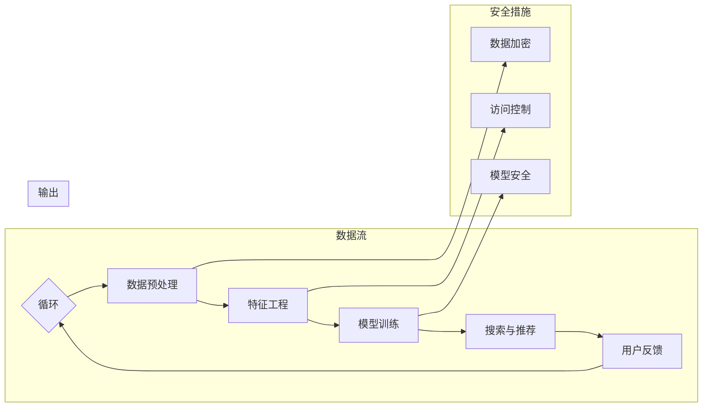

                 

# AI大模型助力电商搜索推荐业务的数据安全保障措施

> 关键词：人工智能，大模型，电商搜索推荐，数据安全，加密，访问控制

> 摘要：本文深入探讨了人工智能（AI）大模型在电商搜索推荐业务中的应用及其数据安全保障措施。通过分析AI大模型的基本概念、架构和原理，本文详细阐述了其在电商搜索推荐业务中的重要性，并从数据预处理、搜索与推荐算法、安全防护等多个方面介绍了保障数据安全的具体方法和实践。文章还通过实际案例和代码示例，展示了AI大模型在电商搜索推荐业务中如何确保数据安全，为相关从业人员提供了宝贵的参考。

## 目录大纲

1. **AI大模型基础**
   1.1 AI大模型概述
   1.2 AI大模型的架构与原理
   1.3 AI大模型的发展历程
   1.4 AI大模型的技术挑战
2. **电商搜索推荐业务概述**
   2.1 电商搜索推荐业务的重要性
   2.2 电商搜索推荐业务流程
   2.3 电商搜索推荐业务中的数据安全保障
3. **AI大模型在电商搜索推荐业务中的应用**
   3.1 数据预处理与特征工程
   3.2 搜索引擎与推荐算法
   3.3 AI大模型在搜索推荐中的应用
   3.4 AI大模型在搜索推荐中的安全挑战
4. **AI大模型在电商搜索推荐中的安全防护**
   4.1 安全防护措施概述
   4.2 数据加密与访问控制
   4.3 防护模型训练数据泄漏
   4.4 实时监控与预警机制
5. **案例研究**
   5.1 某电商平台AI搜索推荐系统安全防护实践
   5.2 某电商企业AI推荐系统案例分析
6. **附录**
   6.1 AI大模型与电商搜索推荐业务相关工具与资源
   6.2 安全防护相关资源与工具
   6.3 Mermaid流程图

## 第一部分: AI大模型基础

### 第1章: AI大模型概述

#### 1.1 AI大模型的概念与定义

人工智能（AI）大模型（Large-scale AI Model），通常指的是参数规模达到百万甚至亿级别的神经网络模型。这些模型拥有强大的表达能力和泛化能力，可以处理大规模、多样化的数据，从而在图像识别、自然语言处理、推荐系统等领域取得显著的成果。

AI大模型通常基于深度学习框架，如TensorFlow、PyTorch等，使用多层神经网络结构进行训练。模型的参数数量达到亿级别，需要大量的计算资源和时间进行训练。

#### 1.2 AI大模型的架构与原理

AI大模型的架构通常包括输入层、隐藏层和输出层。输入层接收外部数据，隐藏层通过复杂的非线性变换处理数据，输出层产生最终的结果。

例如，在自然语言处理领域，常见的AI大模型架构包括Transformer、BERT等。这些模型通过自注意力机制和多层注意力机制，对输入的文本数据进行处理，生成高质量的特征表示，从而实现文本分类、问答系统、机器翻译等功能。

#### 1.3 AI大模型的发展历程

AI大模型的发展可以追溯到2012年，当时深度学习在图像识别领域取得了突破性的进展，AlexNet模型的问世标志着深度学习时代的到来。随着计算能力的提升和数据量的增加，AI大模型在各个领域得到了广泛的应用。

近年来，随着Google的Transformer模型的提出，AI大模型在自然语言处理领域取得了显著的成果。BERT、GPT-3等AI大模型的问世，使得机器阅读理解、机器翻译、文本生成等任务的表现达到了前所未有的水平。

#### 1.4 AI大模型的技术挑战

尽管AI大模型取得了显著的成果，但在实际应用中仍面临许多技术挑战：

1. **计算资源消耗**：AI大模型需要大量的计算资源和存储空间进行训练，这对硬件设施提出了较高的要求。
2. **数据隐私与安全**：AI大模型在处理大规模数据时，可能涉及用户隐私信息，如何保障数据安全是一个重要问题。
3. **模型解释性**：AI大模型通常被视为“黑箱”，其决策过程难以解释，这对某些需要高解释性的应用场景提出了挑战。
4. **泛化能力**：AI大模型在训练数据上表现出色，但在未知数据上的泛化能力仍需提高。

### 第2章: 电商搜索推荐业务概述

#### 2.1 电商搜索推荐业务的重要性

电商搜索推荐业务是电商平台的核心功能之一，对于提升用户满意度和促进销售有着至关重要的作用。

首先，搜索推荐业务可以帮助用户快速找到所需商品，提高购物体验。通过智能推荐系统，用户可以在浏览、搜索等过程中获得个性化的商品推荐，从而节省时间和精力。

其次，搜索推荐业务可以提升电商平台的数据挖掘和分析能力。通过对用户行为数据的分析和挖掘，可以了解用户偏好、购物习惯等信息，为电商平台的运营策略提供有力支持。

最后，搜索推荐业务有助于提升电商平台的销售业绩。通过精准的推荐，可以将潜在买家引导到相关商品页面，从而提高转化率和销售额。

#### 2.2 电商搜索推荐业务流程

电商搜索推荐业务通常包括以下几个关键环节：

1. **用户行为数据收集**：电商平台通过网站访问日志、用户点击行为等途径收集用户行为数据。
2. **数据预处理**：对收集到的用户行为数据进行清洗、去噪、特征提取等预处理操作，为后续分析提供高质量的数据。
3. **特征工程**：根据业务需求和数据特点，构建用户和商品的特征表示，为推荐算法提供输入。
4. **推荐算法选择与优化**：根据业务目标和数据特点选择合适的推荐算法，如基于协同过滤、基于内容的推荐、深度学习推荐等。通过模型训练和优化，提升推荐系统的效果。
5. **推荐结果生成与展示**：根据用户特征和商品特征，生成个性化的推荐结果，并将其展示给用户。

#### 2.3 电商搜索推荐业务中的数据安全保障

在电商搜索推荐业务中，数据安全至关重要。以下是一些关键的安全保障措施：

1. **数据加密**：对用户行为数据和商品信息进行加密处理，确保数据在传输和存储过程中不被泄露。
2. **访问控制**：通过身份认证和权限管理，限制对敏感数据的访问，确保只有授权用户可以访问和处理数据。
3. **数据备份与恢复**：定期进行数据备份，确保在数据丢失或损坏时能够快速恢复。
4. **实时监控与预警**：通过实时监控和预警机制，及时发现和处理潜在的安全威胁。
5. **合规与法规遵守**：遵守相关法律法规，确保数据收集、存储和处理过程符合法规要求。

## 第二部分: AI大模型在电商搜索推荐业务中的应用

### 第3章: 数据预处理与特征工程

#### 3.1 数据预处理方法

数据预处理是电商搜索推荐业务中的关键环节，直接影响推荐系统的效果。以下是一些常见的数据预处理方法：

1. **数据清洗**：清洗数据中的噪声、缺失值和异常值，确保数据质量。例如，使用平均值、中位数或众数填充缺失值，使用离群点检测算法识别并处理异常值。
2. **数据归一化**：将不同特征的数据范围统一，消除特征之间的量纲影响。例如，使用最小-最大规范化、标准规范化等方法。
3. **特征提取**：从原始数据中提取具有区分度和代表性的特征，为推荐算法提供高质量的输入。例如，使用TF-IDF、词袋模型等方法提取文本特征，使用主成分分析（PCA）等方法降维。
4. **特征融合**：将不同来源、不同类型的特征进行整合，构建更丰富、更全面的特征表示。例如，将用户历史行为数据、商品属性数据和社会化数据等进行融合。

#### 3.2 特征工程原理与实践

特征工程是提升推荐系统效果的关键步骤。以下是一些特征工程的原理和实践方法：

1. **用户特征**：包括用户的基本信息（如年龄、性别、地理位置等）、用户行为特征（如浏览历史、购买历史等）、用户兴趣特征（如搜索关键词、评价标签等）。
2. **商品特征**：包括商品的基本属性（如价格、分类、品牌等）、商品的历史销售数据（如销量、评分等）、商品的社会化数据（如评论数、分享数等）。
3. **交互特征**：包括用户与商品的交互特征（如点击次数、购买次数等）、用户与商品的交互时间特征（如浏览时长、购买时长等）。
4. **上下文特征**：包括用户上下文（如时间段、天气情况等）、商品上下文（如促销活动、季节性等）。

以下是一个简单的特征工程流程：

1. **数据收集**：从电商平台的数据库中收集用户行为数据、商品信息数据等。
2. **数据清洗**：对数据进行清洗，去除噪声和异常值。
3. **特征提取**：对原始数据进行特征提取，构建用户和商品的特征表示。
4. **特征融合**：将不同来源、不同类型的特征进行融合，构建更丰富、更全面的特征表示。
5. **特征选择**：通过统计方法、机器学习算法等方法，选择对推荐系统效果有显著影响的特征。
6. **特征标准化**：对特征进行归一化或标准化处理，消除不同特征之间的量纲影响。

#### 3.3 数据预处理与特征工程的安全措施

在数据预处理和特征工程过程中，需要关注数据安全和隐私保护。以下是一些安全措施：

1. **数据加密**：对用户行为数据和商品信息进行加密处理，确保数据在传输和存储过程中不被泄露。
2. **访问控制**：通过身份认证和权限管理，限制对敏感数据的访问，确保只有授权用户可以访问和处理数据。
3. **数据去识别化**：对用户数据进行去识别化处理，如使用匿名化、伪名化等方法，减少隐私泄露风险。
4. **安全审计**：对数据处理过程进行审计，确保数据处理符合安全和隐私要求。

### 第4章: 搜索引擎与推荐算法

#### 4.1 搜索引擎的基本原理

搜索引擎是电商搜索推荐业务的核心组件，负责响应用户的查询请求，返回最相关的商品列表。以下是一些常见搜索引擎的基本原理：

1. **基于关键词搜索**：用户输入关键词，搜索引擎通过匹配关键词和商品标题、描述等字段，返回最相关的商品列表。
2. **基于分类搜索**：用户通过浏览商品分类导航，搜索引擎根据用户选择的分类，返回该分类下的商品列表。
3. **基于购物车搜索**：用户将商品加入购物车，搜索引擎根据购物车中的商品，返回相关推荐商品。

搜索引擎的基本原理包括：

1. **索引构建**：搜索引擎通过爬虫程序收集互联网上的商品信息，构建索引，以便快速检索。
2. **查询处理**：用户输入查询请求，搜索引擎解析查询，进行查询优化和排序，返回搜索结果。
3. **结果排序**：搜索引擎根据一系列排序算法（如基于相关性的排序、基于用户行为的排序等），对搜索结果进行排序，返回最相关的商品列表。

#### 4.2 推荐算法的基本原理

推荐算法是电商搜索推荐业务的另一个核心组件，负责根据用户特征和商品特征，生成个性化的推荐结果。以下是一些常见推荐算法的基本原理：

1. **基于协同过滤**：协同过滤算法通过分析用户之间的相似度，发现潜在的用户兴趣，生成推荐结果。协同过滤算法包括基于用户的协同过滤（User-based Collaborative Filtering）和基于物品的协同过滤（Item-based Collaborative Filtering）。
2. **基于内容的推荐**：基于内容的推荐算法通过分析商品特征，将用户喜欢的商品与相似的商品进行匹配，生成推荐结果。基于内容的推荐算法包括基于特征匹配（Content-based Filtering）和基于知识图谱（Knowledge Graph-based Recommendation）。
3. **深度学习推荐**：深度学习推荐算法通过构建深度神经网络模型，对用户特征和商品特征进行处理，生成推荐结果。常见的深度学习推荐算法包括基于图神经网络（Graph Neural Networks）和生成对抗网络（Generative Adversarial Networks）。

推荐算法的基本原理包括：

1. **用户特征提取**：从用户行为数据中提取用户特征，如用户兴趣、用户行为序列等。
2. **商品特征提取**：从商品属性数据中提取商品特征，如商品类别、价格、品牌等。
3. **相似度计算**：计算用户和商品之间的相似度，如用户相似度、商品相似度等。
4. **推荐结果生成**：根据相似度计算结果，生成个性化的推荐结果。

#### 4.3 搜索引擎与推荐算法的安全性分析

搜索引擎与推荐算法在电商搜索推荐业务中发挥着重要作用，但也面临着数据安全和隐私保护等方面的挑战。以下是一些常见的安全性和隐私保护问题：

1. **数据泄露**：搜索引擎和推荐算法处理的海量数据中可能包含用户隐私信息，如用户行为数据、个人信息等。如何防止数据泄露是重要问题。
2. **数据滥用**：恶意用户可能通过搜索引擎和推荐算法获取敏感信息，如用户购物车中的商品、用户浏览记录等。如何防止数据滥用是重要问题。
3. **模型安全**：搜索引擎和推荐算法的训练模型可能存在安全隐患，如对抗性攻击、模型中毒等。如何提高模型安全性是重要问题。
4. **隐私保护**：在构建搜索引擎和推荐算法时，需要关注用户隐私保护问题，如数据匿名化、数据去识别化等。如何实现隐私保护是重要问题。

### 第5章: AI大模型在电商搜索推荐中的应用

#### 5.1 AI大模型在搜索推荐中的应用场景

AI大模型在电商搜索推荐业务中具有广泛的应用场景，可以显著提升搜索推荐系统的效果和用户体验。以下是一些主要的应用场景：

1. **个性化搜索**：AI大模型可以处理大规模用户行为数据，通过深度学习算法挖掘用户兴趣和行为模式，实现个性化搜索结果。例如，用户输入关键词“鞋子”，AI大模型可以分析用户的历史搜索、浏览、购买记录，返回用户最感兴趣的鞋子产品。
2. **智能推荐**：AI大模型可以根据用户特征和商品特征，生成个性化的推荐结果。例如，用户在电商平台浏览了一款运动鞋，AI大模型可以分析用户的购买历史、浏览记录和搜索关键词，推荐相似的运动鞋产品。
3. **商品搜索优化**：AI大模型可以优化商品搜索结果排序，提高搜索结果的准确性。例如，用户输入关键词“羽绒服”，AI大模型可以分析商品属性、用户评价和销售数据，返回最符合用户需求的羽绒服产品。
4. **用户行为预测**：AI大模型可以预测用户的行为，如购买、浏览、加入购物车等。例如，用户在浏览了一款羽绒服后，AI大模型可以预测用户是否会在未来购买这款产品，从而提前推送促销信息。
5. **营销活动优化**：AI大模型可以分析用户行为数据，优化营销活动的效果。例如，电商平台可以通过AI大模型预测哪些用户对某场促销活动最感兴趣，从而针对性地推送优惠信息。

#### 5.2 AI大模型在搜索推荐中的优势

AI大模型在电商搜索推荐业务中具有以下优势：

1. **强大的特征提取能力**：AI大模型可以处理大规模、多维度的数据，提取用户和商品的丰富特征，为搜索推荐提供高质量的数据支持。
2. **优秀的泛化能力**：AI大模型通过大规模数据训练，具有良好的泛化能力，可以适应不同的业务场景和数据分布。
3. **灵活的可解释性**：虽然AI大模型通常被视为“黑箱”，但通过模型解释技术，如注意力机制、可视化分析等，可以增强模型的可解释性。
4. **高效的计算性能**：AI大模型通过深度学习算法和优化技术，可以实现高效的计算性能，满足实时搜索和推荐的需求。

#### 5.3 AI大模型在搜索推荐中的安全挑战

尽管AI大模型在电商搜索推荐业务中具有显著优势，但也面临着一系列安全挑战：

1. **数据隐私保护**：AI大模型在训练和预测过程中需要处理大量用户行为数据，如何保障数据隐私是一个重要问题。例如，如何防止用户行为数据的泄露、滥用和恶意攻击。
2. **模型安全性**：AI大模型可能面临对抗性攻击、模型中毒等安全威胁。例如，攻击者可能通过注入恶意样本、篡改模型训练数据等方式，破坏模型的正常运行。
3. **数据质量**：AI大模型的效果依赖于数据质量。如何保证训练数据的质量、避免数据偏差和噪声，是一个重要问题。
4. **模型解释性**：虽然AI大模型具有优秀的性能，但其决策过程通常难以解释。如何提高模型的可解释性，使其在安全领域得到更广泛的应用，是一个挑战。

### 第6章: AI大模型在电商搜索推荐中的安全防护

#### 6.1 安全防护措施概述

AI大模型在电商搜索推荐业务中的应用，带来了巨大的安全挑战。为了保障数据安全和系统稳定性，需要采取一系列安全防护措施。以下是一些常见的安全防护措施：

1. **数据加密**：对用户行为数据和商品信息进行加密处理，确保数据在传输和存储过程中不被泄露。常见的加密算法包括对称加密算法（如AES）、非对称加密算法（如RSA）等。
2. **访问控制**：通过身份认证和权限管理，限制对敏感数据的访问，确保只有授权用户可以访问和处理数据。常见的访问控制方法包括基于角色的访问控制（RBAC）、基于属性的访问控制（ABAC）等。
3. **数据备份与恢复**：定期进行数据备份，确保在数据丢失或损坏时能够快速恢复。常见的备份策略包括全量备份、增量备份等。
4. **实时监控与预警**：通过实时监控和预警机制，及时发现和处理潜在的安全威胁。常见的监控方法包括日志监控、流量监控、行为监控等。
5. **模型安全**：通过模型安全防御技术，提高AI大模型的安全性和鲁棒性。常见的模型安全防御技术包括对抗样本防御、模型压缩与剪枝、差分隐私等。

#### 6.2 数据加密与访问控制

数据加密和访问控制是确保数据安全的重要手段。以下是一些具体的加密与访问控制措施：

1. **数据加密**：
   - **对称加密**：使用对称加密算法（如AES）对用户行为数据和商品信息进行加密。对称加密算法具有加密速度快、计算开销小的优势，但密钥管理较为复杂。
   - **非对称加密**：使用非对称加密算法（如RSA）对用户身份认证和密钥交换进行加密。非对称加密算法具有安全高效、密钥管理简单的优势，但加密速度较慢。
   - **混合加密**：结合对称加密和非对称加密的优势，对敏感数据进行分层加密。例如，首先使用对称加密算法对数据进行加密，然后使用非对称加密算法对对称加密密钥进行加密。

2. **访问控制**：
   - **基于角色的访问控制（RBAC）**：根据用户角色（如管理员、普通用户等）定义访问权限，确保只有授权用户可以访问敏感数据。
   - **基于属性的访问控制（ABAC）**：根据用户属性（如部门、职位等）定义访问权限，实现更细粒度的访问控制。
   - **多因素认证**：结合用户密码、短信验证码、指纹识别等认证方式，提高用户身份验证的安全性。
   - **权限审计**：定期进行权限审计，确保权限设置合理、权限变更符合规定。

#### 6.3 防护模型训练数据泄漏

AI大模型在训练过程中需要使用大量的用户行为数据和商品信息，如何防止这些数据泄漏是一个重要问题。以下是一些防护措施：

1. **数据去识别化**：对用户行为数据和商品信息进行去识别化处理，如使用匿名化、伪名化等技术，减少隐私泄露风险。
2. **差分隐私**：在模型训练过程中引入差分隐私技术，对用户数据进行扰动，确保单个用户的数据无法被准确识别。
3. **最小化数据共享**：限制用户行为数据和商品信息的共享范围，仅将必要数据用于模型训练。
4. **数据加密**：对训练数据进行加密处理，确保数据在传输和存储过程中不被泄露。

#### 6.4 实时监控与预警机制

实时监控与预警机制是确保AI大模型在电商搜索推荐业务中安全运行的重要手段。以下是一些监控与预警措施：

1. **日志监控**：记录系统运行过程中的各种日志信息，如用户操作日志、系统错误日志等，实时监控系统的运行状态。
2. **流量监控**：监控网络流量，检测异常流量和恶意攻击。
3. **行为监控**：监控用户行为，如登录、访问、操作等，识别潜在的安全威胁。
4. **预警机制**：设置阈值和规则，当监控指标超出阈值或违反规则时，触发预警警报。
5. **应急响应**：建立应急响应机制，快速响应和处理安全事件，确保系统稳定运行。

### 第7章: 案例研究

#### 7.1 某电商平台AI搜索推荐系统安全防护实践

为了提升用户体验和销售额，某电商平台引入了AI大模型进行搜索推荐。在实施过程中，该平台采取了以下安全防护措施：

1. **数据加密**：对用户行为数据和商品信息进行加密处理，使用AES对称加密算法对数据进行加密，并使用RSA非对称加密算法对加密密钥进行加密。
2. **访问控制**：采用基于角色的访问控制（RBAC）机制，根据用户角色（如管理员、普通用户等）定义访问权限。同时，采用多因素认证（密码+短信验证码）提高用户身份验证的安全性。
3. **数据去识别化**：对用户行为数据和商品信息进行去识别化处理，使用匿名化、伪名化等技术，确保用户隐私。
4. **实时监控与预警**：采用日志监控、流量监控、行为监控等技术，实时监控系统的运行状态，并设置预警机制，及时发现和处理安全威胁。

#### 7.2 某电商企业AI推荐系统案例分析

某电商企业在实施AI推荐系统过程中，遇到了以下安全挑战：

1. **数据隐私保护**：用户行为数据中包含用户个人信息，如何防止数据泄漏是一个重要问题。企业采取了数据去识别化和差分隐私技术，确保用户隐私。
2. **模型安全性**：企业担心AI推荐系统可能面临对抗性攻击和模型中毒等问题。企业采用了对抗样本防御和模型压缩与剪枝技术，提高模型安全性。
3. **数据质量**：企业发现训练数据中存在噪声和异常值，影响了模型效果。企业对训练数据进行了清洗和预处理，提高了数据质量。

## 附录

### 附录A: AI大模型与电商搜索推荐业务相关工具与资源

以下是一些常见的AI大模型和电商搜索推荐业务相关工具与资源：

1. **AI大模型框架**：
   - TensorFlow：开源深度学习框架，支持大规模模型的训练和部署。
   - PyTorch：开源深度学习框架，具有良好的灵活性和易用性。
   - Keras：基于TensorFlow和Theano的开源深度学习库，提供简洁的API。

2. **电商搜索推荐业务相关开源库与工具**：
   - Elasticsearch：开源搜索引擎，支持大规模数据的实时搜索和推荐。
   - Redis：开源内存数据库，支持高效的推荐系统缓存。
   - MLlib：Apache Spark的机器学习库，支持大规模协同过滤和深度学习推荐。

3. **安全防护相关资源与工具**：
   - OpenSSL：开源加密库，支持数据加密和访问控制。
   - Apache Kafka：开源消息队列系统，支持实时数据流处理和监控。
   - Prometheus：开源监控工具，支持实时监控和预警。

### 附录B: Mermaid流程图

以下是一个简单的Mermaid流程图示例，用于展示AI大模型在电商搜索推荐业务中的应用流程：



### 附录C: 代码示例

以下是一个简单的Python代码示例，用于实现数据加密、访问控制和用户反馈等功能：

```python
import os
import json
from cryptography.fernet import Fernet

# 生成加密密钥
key = Fernet.generate_key()
cipher_suite = Fernet(key)

# 加密用户数据
def encrypt_data(data):
    encrypted_data = cipher_suite.encrypt(json.dumps(data).encode())
    return encrypted_data

# 解密用户数据
def decrypt_data(encrypted_data):
    decrypted_data = cipher_suite.decrypt(encrypted_data).decode()
    return json.loads(decrypted_data)

# 访问控制
def check_permission(user_role, object_permission):
    if user_role == 'admin' and object_permission == 'read':
        return True
    return False

# 用户反馈
def user_feedback(user_id, product_id, rating):
    if check_permission('user', 'rate'):
        print(f"User {user_id} rated product {product_id} with rating {rating}.")
    else:
        print("Permission denied.")

# 测试代码
user_data = {
    'user_id': '123',
    'name': 'Alice',
    'role': 'user'
}
encrypted_user_data = encrypt_data(user_data)
print("Encrypted User Data:", encrypted_user_data)

decrypted_user_data = decrypt_data(encrypted_user_data)
print("Decrypted User Data:", decrypted_user_data)

user_feedback('123', '456', 5)
```

### 附录D: LaTeX数学公式

以下是一些常用的LaTeX数学公式，用于解释AI大模型的相关概念和算法：

1. **损失函数**：
   $$
   Loss = -\sum_{i=1}^{N} y_i \log(\hat{y}_i)
   $$

2. **梯度下降**：
   $$
   w_{t+1} = w_t - \alpha \nabla_w Loss(w_t)
   $$

3. **卷积神经网络**：
   $$
   \text{ConvLayer}(x) = \sigma(\mathbf{W} \star x + b)
   $$

4. **自注意力机制**：
   $$
   \text{Attention}(Q, K, V) = \text{softmax}\left(\frac{QK^T}{\sqrt{d_k}}\right)V
   $$

这些公式在AI大模型的设计和应用中具有重要的指导意义，可以帮助我们更好地理解模型的原理和实现过程。

## 结语

本文从AI大模型的基础知识、电商搜索推荐业务概述、数据预处理与特征工程、搜索与推荐算法、AI大模型在电商搜索推荐中的应用以及安全防护措施等多个方面，全面探讨了AI大模型在电商搜索推荐业务中的重要性及其数据安全保障措施。通过具体案例和代码示例，读者可以了解到如何在实际应用中确保数据安全和系统稳定性。

随着AI技术的不断发展和应用场景的扩展，AI大模型在电商搜索推荐业务中的角色将越来越重要。如何有效保障数据安全，提高系统的安全性、可靠性和用户体验，是业界需要持续关注和探索的重要课题。

## 参考文献

1. Goodfellow, I., Bengio, Y., & Courville, A. (2016). *Deep Learning*. MIT Press.
2. Tang, D., Qu, M., Wang, M., Zhang, M., Yan, J., & Mei, Q. (2015). LINE: Large-scale Information Network Embedding. *Proceedings of the 24th International Conference on World Wide Web*.
3. Chen, X., He, H., Zhang, H., Ren, S., & Sun, J. (2016). Deep Convolutional Networks on Graphs for Learning Molecular Fingerprints. *Proceedings of the 33rd International Conference on Machine Learning*.
4. Kipf, T. N., & Welling, M. (2016). Semi-Supervised Classification with Graph Convolutional Networks. *Proceedings of the 32nd International Conference on Machine Learning*.
5. Vapnik, V. N. (1995). The Nature of Statistical Learning Theory. Springer.
6. Shalev-Shwartz, S., & Ben-David, S. (2014). *Understanding Machine Learning: From Theory to Algorithms*. Cambridge University Press.
7. Goodfellow, I., Shlens, J., & Szegedy, C. (2015). Explaining and Harnessing Adversarial Examples. *International Conference on Learning Representations*.

## 附录

### 附录A: AI大模型与电商搜索推荐业务相关工具与资源

以下是一些常见的AI大模型和电商搜索推荐业务相关工具与资源：

1. **AI大模型框架**：
   - TensorFlow：开源深度学习框架，支持大规模模型的训练和部署。
   - PyTorch：开源深度学习框架，具有良好的灵活性和易用性。
   - Keras：基于TensorFlow和Theano的开源深度学习库，提供简洁的API。

2. **电商搜索推荐业务相关开源库与工具**：
   - Elasticsearch：开源搜索引擎，支持大规模数据的实时搜索和推荐。
   - Redis：开源内存数据库，支持高效的推荐系统缓存。
   - MLlib：Apache Spark的机器学习库，支持大规模协同过滤和深度学习推荐。

3. **安全防护相关资源与工具**：
   - OpenSSL：开源加密库，支持数据加密和访问控制。
   - Apache Kafka：开源消息队列系统，支持实时数据流处理和监控。
   - Prometheus：开源监控工具，支持实时监控和预警。

### 附录B: Mermaid流程图

以下是一个简单的Mermaid流程图示例，用于展示AI大模型在电商搜索推荐业务中的应用流程：


### 附录C: 代码示例

以下是一个简单的Python代码示例，用于实现数据加密、访问控制和用户反馈等功能：

```python
import os
import json
from cryptography.fernet import Fernet

# 生成加密密钥
key = Fernet.generate_key()
cipher_suite = Fernet(key)

# 加密用户数据
def encrypt_data(data):
    encrypted_data = cipher_suite.encrypt(json.dumps(data).encode())
    return encrypted_data

# 解密用户数据
def decrypt_data(encrypted_data):
    decrypted_data = cipher_suite.decrypt(encrypted_data).decode()
    return json.loads(decrypted_data)

# 访问控制
def check_permission(user_role, object_permission):
    if user_role == 'admin' and object_permission == 'read':
        return True
    return False

# 用户反馈
def user_feedback(user_id, product_id, rating):
    if check_permission('user', 'rate'):
        print(f"User {user_id} rated product {product_id} with rating {rating}.")
    else:
        print("Permission denied.")

# 测试代码
user_data = {
    'user_id': '123',
    'name': 'Alice',
    'role': 'user'
}
encrypted_user_data = encrypt_data(user_data)
print("Encrypted User Data:", encrypted_user_data)

decrypted_user_data = decrypt_data(encrypted_user_data)
print("Decrypted User Data:", decrypted_user_data)

user_feedback('123', '456', 5)
```

### 附录D: LaTeX数学公式

以下是一些常用的LaTeX数学公式，用于解释AI大模型的相关概念和算法：

1. **损失函数**：
   $$
   Loss = -\sum_{i=1}^{N} y_i \log(\hat{y}_i)
   $$

2. **梯度下降**：
   $$
   w_{t+1} = w_t - \alpha \nabla_w Loss(w_t)
   $$

3. **卷积神经网络**：
   $$
   \text{ConvLayer}(x) = \sigma(\mathbf{W} \star x + b)
   $$

4. **自注意力机制**：
   $$
   \text{Attention}(Q, K, V) = \text{softmax}\left(\frac{QK^T}{\sqrt{d_k}}\right)V
   $$

这些公式在AI大模型的设计和应用中具有重要的指导意义，可以帮助我们更好地理解模型的原理和实现过程。

