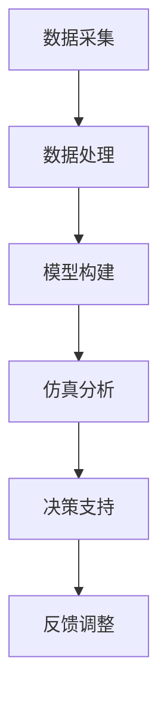
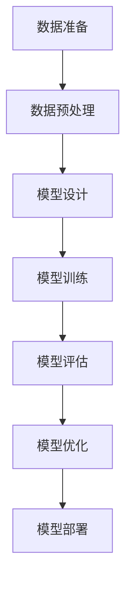

                 

# AI大模型在数字孪生技术中的应用

## 关键词
AI大模型，数字孪生技术，深度学习，智能制造，智慧城市，边缘计算

## 摘要
本文旨在探讨AI大模型在数字孪生技术中的应用。首先，我们将概述AI大模型的基础概念、发展历程和核心技术。接着，深入探讨数字孪生技术的发展背景、关键技术和应用领域。然后，详细分析AI大模型在数字孪生技术中的融合与应用原理，并通过实际案例进行讲解。最后，我们将讨论AI大模型的开发与部署流程，以及其在不同行业中的研究和应用前景。本文将为读者提供一个全面、系统的AI大模型与数字孪生技术的理解和应用指南。

### 第一部分: AI大模型基础与概述

#### 第1章: AI大模型概述

#### 1.1 AI大模型的发展历程与背景

#### 1.1.1 传统AI与AI大模型的区别

传统AI（Artificial Intelligence，人工智能）主要依赖规则和符号推理，例如专家系统和基于逻辑的推理机。而AI大模型（Large-scale Artificial Intelligence Models）是基于深度学习的模型，具有大规模参数和复杂的网络结构，能够通过大量数据的学习，实现高效的特征提取和任务执行。

#### 1.1.2 AI大模型的发展背景

随着计算能力的提升和数据量的爆炸性增长，深度学习（Deep Learning）得到了飞速发展。深度学习模型需要大量的计算资源和数据支持，因此AI大模型的发展离不开云计算和大数据技术的进步。

#### 1.1.3 AI大模型的重要性

AI大模型在许多领域都展现了其强大的应用潜力，包括图像识别、自然语言处理、语音识别和推荐系统等。它们能够处理复杂的任务，提供更准确和高效的解决方案。

#### 1.2 AI大模型的基本概念

#### 1.2.1 什么是AI大模型

AI大模型是指那些具有大规模参数和复杂结构的深度学习模型。这些模型通常通过大规模数据预训练，然后在特定任务上微调，以实现高效的任务表现。

#### 1.2.2 AI大模型的架构

AI大模型的架构通常包括多层神经网络，每一层都能够提取不同层次的特征。这些特征可以帮助模型在复杂的任务中做出准确的决策。

#### 1.2.3 AI大模型的关键特征

AI大模型的关键特征包括：

- **大规模参数**：具有数百万到数十亿个参数，这使得模型能够处理复杂的任务。
- **深度结构**：多层神经网络结构，使得模型能够提取深层特征。
- **自适应学习**：能够从海量数据中自动学习特征，并调整参数以优化性能。
- **泛化能力**：通过在多个任务上的训练，模型能够在新的任务上表现出良好的性能。

#### 1.3 AI大模型的核心技术

#### 1.3.1 深度学习基础

深度学习是构建AI大模型的核心技术。深度学习模型主要包括：

- **神经网络**：一种通过模拟人脑神经元连接的结构，用于特征提取和任务执行。
- **卷积神经网络（CNN）**：用于图像识别和计算机视觉任务。
- **循环神经网络（RNN）**：用于序列数据处理，如自然语言处理和时间序列预测。
- **生成对抗网络（GAN）**：用于生成数据和增强数据。

#### 1.3.2 深度学习框架

深度学习框架如TensorFlow、PyTorch和Keras等，提供了丰富的工具和库，用于构建、训练和部署深度学习模型。这些框架具有高度的可扩展性和灵活性，能够支持大规模模型的训练。

#### 1.3.3 预训练与微调

预训练（Pre-training）是指在大规模数据集上预先训练模型，然后将其应用于特定任务进行微调（Fine-tuning）。这种方法可以显著提高模型的性能，减少对训练数据的依赖。

- **预训练算法**：包括词向量模型（如Word2Vec、GloVe）和图像预训练模型（如ResNet、VGG）。
- **微调技术**：通过调整部分层或参数，使模型在特定任务上达到最佳性能。

#### 1.4 AI大模型在不同领域的应用

#### 1.4.1 人工智能与数字孪生

数字孪生（Digital Twin）是一种通过创建物理实体的数字副本，实现实时仿真、预测分析和决策支持的技术。AI大模型在数字孪生中可以用于：

- **实时仿真**：模拟物理实体的行为和状态。
- **预测分析**：预测未来的行为和状态，为决策提供支持。
- **决策支持**：基于预测结果，制定优化策略。

#### 1.4.2 人工智能与智能制造

智能制造（Smart Manufacturing）是指通过应用人工智能、物联网、大数据等技术，实现生产过程的智能化和自动化。AI大模型在智能制造中可以用于：

- **设备故障预测**：通过实时监测数据，预测设备的故障，减少停机时间。
- **生产优化**：优化生产流程，提高生产效率。
- **质量控制**：实时监测产品质量，提高产品合格率。

#### 1.4.3 人工智能与智慧城市

智慧城市（Smart City）是指通过应用人工智能、物联网、大数据等技术，实现城市管理和服务的智能化。AI大模型在智慧城市中可以用于：

- **交通流量预测**：预测交通流量，优化交通信号控制。
- **能源管理**：预测能源需求，优化能源分配。
- **城市管理**：实时监控城市设施的状态，提高城市管理的效率。

#### 1.5 AI大模型的挑战与未来趋势

#### 1.5.1 AI大模型的挑战

AI大模型的挑战包括：

- **数据隐私与安全**：大规模数据的收集和处理需要保护用户隐私和数据安全。
- **模型解释性与可靠性**：大型模型往往难以解释其决策过程，且在极端情况下可能产生错误。
- **计算资源需求**：训练和部署大型模型需要大量的计算资源和能源。

#### 1.5.2 AI大模型的未来发展趋势

未来，AI大模型的发展趋势包括：

- **大模型的小型化**：通过优化模型结构和算法，实现小型化模型，降低计算资源需求。
- **多模态融合**：结合多种数据类型，如图像、文本和声音，提高模型的性能和应用范围。
- **边缘计算**：将计算任务从云端转移到边缘设备，实现实时处理和快速响应。

### 第二部分: 数字孪生技术与AI大模型应用

#### 第2章: 数字孪生技术概述

#### 2.1 数字孪生技术的发展背景与定义

数字孪生（Digital Twin）技术起源于工业4.0，是一种通过创建物理实体的数字副本，实现实时仿真、预测分析和决策支持的技术。

#### 2.1.1 数字孪生技术的起源

数字孪生技术的概念最早由Michael Grieves在2002年提出，其核心思想是通过虚拟模型模拟物理实体，实现实时交互和优化。

#### 2.1.2 数字孪生技术的定义

数字孪生技术是指通过虚拟模型（Digital Twin）模拟物理实体（Physical Twin），实现实时数据交互、预测分析和决策支持的技术。

#### 2.1.3 数字孪生技术的核心组成部分

数字孪生技术的核心组成部分包括：

- **物理实体**：真实的物理设备或系统。
- **虚拟模型**：基于物理实体的数字副本，用于仿真、预测和决策。
- **数据接口**：连接物理实体和虚拟模型的数据通道，实现数据的实时传输和同步。
- **分析工具**：用于对虚拟模型进行数据分析和决策支持的工具。

#### 2.2 数字孪生技术的关键技术

数字孪生技术的实现依赖于多项关键技术的支持，包括：

- **数据采集与处理**：通过传感器和网络技术，实时采集物理实体的状态数据，并进行预处理。
- **模型构建与仿真**：基于采集的数据，构建虚拟模型，并进行仿真分析。
- **数据分析和优化**：对仿真结果进行分析，提取关键特征，优化系统性能。

##### 2.2.1 数据采集与处理

数据采集与处理是数字孪生技术的基础。数据采集主要依赖于传感器和网络技术，实现物理实体状态的实时监测和数据传输。数据预处理包括数据清洗、数据去噪、数据归一化等步骤，以提高数据的可靠性和一致性。

##### 2.2.2 模型构建与仿真

模型构建与仿真是数字孪生技术的核心。基于采集的数据，通过建模方法构建虚拟模型，并对其进行仿真分析。仿真分析包括状态预测、性能评估、故障诊断等，为决策支持提供依据。

##### 2.2.3 数据分析与优化

数据分析与优化是对仿真结果进行深入分析和优化，以实现系统性能的优化。数据分析包括特征提取、模式识别、关联分析等，优化包括参数调整、流程优化、策略优化等。

#### 2.3 数字孪生技术在各行业的应用

数字孪生技术具有广泛的应用前景，已在多个行业得到应用：

##### 2.3.1 制造业

在制造业中，数字孪生技术可用于设备监控、故障预测、生产优化等方面。通过创建设备数字孪生，可以实现设备的实时监控和预测维护，提高设备利用率，降低维修成本。

##### 2.3.2 能源行业

在能源行业中，数字孪生技术可用于智能电网、智能风能、智能太阳能等领域。通过创建能源设备的数字孪生，可以实现能源的智能调度和优化，提高能源利用效率。

##### 2.3.3 建筑行业

在建筑行业中，数字孪生技术可用于建筑监控、节能管理、灾害预防等方面。通过创建建筑数字孪生，可以实现建筑的实时监控和预测维护，提高建筑的安全性和舒适性。

#### 2.4 数字孪生技术的挑战与发展趋势

数字孪生技术面临以下挑战：

##### 2.4.1 数据安全问题

数字孪生技术涉及大量敏感数据的收集和处理，数据安全是主要挑战之一。需要采取有效的数据安全措施，确保数据的机密性、完整性和可用性。

##### 2.4.2 数据处理能力

数字孪生技术需要处理海量数据，对数据处理能力提出了高要求。需要优化数据处理算法，提高数据处理速度和效率。

##### 2.4.3 模型解释性

大型模型往往难以解释其决策过程，模型解释性是另一个挑战。需要研究模型的可解释性方法，提高模型的可解释性，增强用户对模型的信任。

未来，数字孪生技术将向以下方向发展：

##### 2.4.4 边缘计算与数字孪生

边缘计算将使数字孪生技术更贴近物理实体，实现实时数据处理和决策支持。

##### 2.4.5 大数据与数字孪生

大数据技术的发展将进一步提升数字孪生的数据处理能力和分析能力，实现更智能的决策支持。

##### 2.4.6 AI与数字孪生的深度融合

人工智能技术将与数字孪生技术深度融合，实现更高效的仿真、预测和优化，推动各行业的智能化转型。

### 第三部分: AI大模型在数字孪生中的应用

#### 第3章: AI大模型在数字孪生中的融合与应用

#### 3.1 AI大模型在数字孪生中的应用原理

AI大模型在数字孪生技术中的应用，主要通过以下三个方面实现：

##### 3.1.1 数据协同

数据协同是指通过AI大模型，实现物理实体和虚拟模型之间的数据同步和实时更新。AI大模型可以处理海量数据，并从数据中提取有价值的信息，为虚拟模型提供实时仿真和预测分析的基础。

##### 3.1.2 模型协同

模型协同是指将AI大模型与虚拟模型相结合，实现更精准的仿真和预测。AI大模型通过学习和分析数据，可以优化虚拟模型的参数和结构，提高仿真精度和预测准确性。

##### 3.1.3 预测分析

预测分析是指利用AI大模型进行实时预测和决策支持。AI大模型可以从历史数据中学习规律，预测物理实体的未来行为和状态，为管理者提供优化策略和决策依据。

#### 3.2 AI大模型在数字孪生中的应用案例

##### 3.2.1 制造业案例

在制造业中，AI大模型可以应用于设备监控、故障预测和生产优化等方面。

- **设备监控**：通过传感器采集设备运行数据，利用AI大模型进行实时监控，发现设备异常，提前预警。
- **故障预测**：通过分析设备的历史数据和实时数据，利用AI大模型预测设备可能出现的故障，制定预防措施。
- **生产优化**：通过AI大模型对生产数据进行预测和分析，优化生产流程，提高生产效率。

##### 3.2.2 能源行业案例

在能源行业中，AI大模型可以应用于智能电网、智能风能和智能太阳能等领域。

- **智能电网**：通过AI大模型预测电力需求，优化电力分配，提高电网运行效率。
- **智能风能**：通过AI大模型预测风能产出，优化风能设备的运行状态，提高能源利用效率。
- **智能太阳能**：通过AI大模型预测太阳能产出，优化太阳能设备的运行状态，提高能源利用效率。

##### 3.2.3 建筑行业案例

在建筑行业中，AI大模型可以应用于建筑监控、节能管理和灾害预防等方面。

- **建筑监控**：通过AI大模型实时监控建筑设备状态，发现异常，提前预警。
- **节能管理**：通过AI大模型分析建筑能耗数据，优化能源使用，降低能耗。
- **灾害预防**：通过AI大模型预测建筑可能发生的灾害，提前预警，制定预防措施。

#### 3.3 AI大模型在数字孪生中的应用挑战与优化策略

##### 3.3.1 应用挑战

AI大模型在数字孪生技术中的应用面临以下挑战：

- **数据质量**：数据质量直接影响AI大模型的性能，需要确保数据的准确性、完整性和一致性。
- **模型解释性**：大型模型往往难以解释其决策过程，影响用户对模型的信任。
- **隐私与安全**：数字孪生技术涉及大量敏感数据的收集和处理，需要确保数据的安全和隐私。

##### 3.3.2 优化策略

为了克服上述挑战，可以采取以下优化策略：

- **数据预处理**：对数据进行清洗、去噪和归一化等预处理，提高数据质量。
- **模型解释性**：研究模型的可解释性方法，提高模型的可解释性，增强用户对模型的信任。
- **隐私保护**：采用数据加密、匿名化和差分隐私等技术，确保数据的安全和隐私。

### 第四部分: AI大模型开发与部署

#### 第4章: AI大模型开发流程

AI大模型的开发是一个复杂的过程，涉及多个阶段，包括数据准备、模型设计、模型训练、模型评估和模型优化。以下将详细阐述每个阶段的具体步骤和注意事项。

#### 4.1 AI大模型开发的基础设施

AI大模型开发的基础设施主要包括硬件环境和软件环境。

##### 4.1.1 硬件环境

硬件环境是AI大模型开发的重要支撑。通常，AI大模型开发需要使用高性能的GPU（图形处理单元）来加速计算。GPU具有高度并行的计算能力，能够显著提高模型的训练速度。

- **GPU硬件介绍**：GPU硬件的选择需要考虑计算性能、内存容量和功耗等因素。常见的GPU硬件包括NVIDIA的Tesla系列和RTX系列等。
- **分布式计算介绍**：对于大规模模型训练，单台GPU可能无法满足计算需求。分布式计算可以将模型训练任务分布在多台GPU上，实现并行计算，提高训练效率。

##### 4.1.2 软件环境

软件环境是AI大模型开发的工具和框架。深度学习框架如TensorFlow、PyTorch和Keras等提供了丰富的库和工具，用于构建、训练和部署深度学习模型。

- **Python环境搭建**：Python是深度学习开发的主要语言。搭建Python环境需要安装Python解释器、相关库和深度学习框架。
- **深度学习框架安装**：深度学习框架的选择取决于项目需求和开发者的熟悉程度。TensorFlow和PyTorch是两个广泛使用的深度学习框架。

#### 4.2 AI大模型数据处理与预处理

数据处理与预处理是AI大模型开发的重要环节。高质量的数据是模型训练成功的关键。以下将介绍数据处理与预处理的步骤和方法。

##### 4.2.1 数据收集

数据收集是模型开发的第一步。数据来源可以包括公开数据集、企业内部数据和其他可获取的数据。

- **数据来源**：确定数据来源，收集相关数据。
- **数据预处理步骤**：数据预处理包括数据清洗、数据去噪、数据归一化和数据增强等步骤。

##### 4.2.2 数据清洗

数据清洗是数据处理的关键步骤，旨在去除数据中的噪声和异常值，确保数据的质量。

- **数据清洗方法**：包括缺失值处理、重复值删除、异常值检测和修正等。
- **数据清洗工具**：常用的数据清洗工具包括Pandas、NumPy和SciPy等。

##### 4.2.3 数据增强

数据增强是一种通过生成新的数据样本来提高模型性能的技术。

- **数据增强方法**：包括图像增强、文本增强和声音增强等。
- **数据增强工具**：常用的数据增强工具包括OpenCV、ImageNet和AudioNet等。

#### 4.3 AI大模型设计与训练

模型设计与训练是AI大模型开发的核

### 第五部分: AI大模型应用案例分析

#### 第5章: AI大模型应用案例分析

AI大模型在各个行业中的应用案例层出不穷，本章节将通过三个具体案例，深入探讨AI大模型在智能制造、智慧能源和智慧城市建设中的应用。

#### 5.1 案例一：智能制造中的AI大模型应用

##### 5.1.1 案例背景

某大型制造企业致力于提升生产效率和产品质量。在生产过程中，设备故障和生产线瓶颈等问题频繁发生，导致生产效率低下和产品质量不稳定。

##### 5.1.2 AI大模型在智能制造中的应用

为了解决上述问题，企业引入了AI大模型，具体应用如下：

- **设备故障预测**：通过采集设备运行数据，利用AI大模型进行实时预测，提前预警设备故障，降低设备停机时间。
- **生产优化**：通过分析生产数据，利用AI大模型优化生产流程，提高生产效率。
- **质量控制**：利用AI大模型对产品质量进行实时监控，及时发现质量问题，提高产品合格率。

##### 5.1.3 案例分析

在本案例中，AI大模型的具体实现步骤如下：

- **数据收集**：收集设备运行数据、生产数据和质量数据。
- **数据预处理**：对数据进行清洗、去噪和归一化等预处理步骤。
- **模型设计**：设计合适的神经网络结构，选择合适的激活函数和损失函数。
- **模型训练**：使用预处理后的数据训练模型，优化模型参数。
- **模型评估**：使用验证集评估模型性能，调整模型参数。
- **模型部署**：将训练好的模型部署到生产环境中，实现实时预测和优化。

通过AI大模型的应用，企业成功降低了设备故障率，提高了生产效率和产品质量。

#### 5.2 案例二：智慧能源中的AI大模型应用

##### 5.2.1 案例背景

某能源公司致力于提高能源利用效率，降低能源消耗。在能源生产、传输和消费过程中，存在大量的数据，但如何有效地利用这些数据，提高能源利用效率，是一个亟待解决的问题。

##### 5.2.2 AI大模型在智慧能源中的应用

为了解决上述问题，能源公司引入了AI大模型，具体应用如下：

- **能源消耗预测**：通过采集能源消耗数据，利用AI大模型预测未来的能源消耗，优化能源分配。
- **能源调度优化**：通过分析能源消耗和供应数据，利用AI大模型优化能源调度，提高能源利用效率。
- **设备状态监测**：利用AI大模型实时监测设备状态，提前预警设备故障，降低设备停机时间。

##### 5.2.3 案例分析

在本案例中，AI大模型的具体实现步骤如下：

- **数据收集**：收集能源消耗数据、设备状态数据和气象数据。
- **数据预处理**：对数据进行清洗、去噪和归一化等预处理步骤。
- **模型设计**：设计合适的神经网络结构，选择合适的激活函数和损失函数。
- **模型训练**：使用预处理后的数据训练模型，优化模型参数。
- **模型评估**：使用验证集评估模型性能，调整模型参数。
- **模型部署**：将训练好的模型部署到生产环境中，实现实时预测和优化。

通过AI大模型的应用，能源公司成功提高了能源利用效率，降低了能源消耗。

#### 5.3 案例三：智慧城市建设中的AI大模型应用

##### 5.3.1 案例背景

某城市政府致力于提升城市管理效率和居民生活质量。在城市管理过程中，存在大量的数据，但如何有效地利用这些数据，提升城市管理效率，是一个亟待解决的问题。

##### 5.3.2 AI大模型在智慧城市建设中的应用

为了解决上述问题，城市政府引入了AI大模型，具体应用如下：

- **交通流量预测**：通过采集交通数据，利用AI大模型预测未来的交通流量，优化交通信号控制。
- **城市安全监控**：通过采集视频监控数据，利用AI大模型实现城市安全的实时监控。
- **能耗管理**：通过采集能耗数据，利用AI大模型优化能源使用，降低能耗。

##### 5.3.3 案例分析

在本案例中，AI大模型的具体实现步骤如下：

- **数据收集**：收集交通数据、视频监控数据和能耗数据。
- **数据预处理**：对数据进行清洗、去噪和归一化等预处理步骤。
- **模型设计**：设计合适的神经网络结构，选择合适的激活函数和损失函数。
- **模型训练**：使用预处理后的数据训练模型，优化模型参数。
- **模型评估**：使用验证集评估模型性能，调整模型参数。
- **模型部署**：将训练好的模型部署到城市管理系统，实现实时预测和优化。

通过AI大模型的应用，城市政府成功提升了城市管理效率，提高了居民生活质量。

### 第六部分: AI大模型研究前沿与趋势

#### 第6章: AI大模型研究前沿与趋势

随着AI大模型技术的不断发展，相关研究也呈现出新的趋势。本章节将探讨AI大模型研究的前沿动态、技术发展展望以及行业应用趋势。

#### 6.1 AI大模型研究现状

当前，AI大模型研究在国内外取得了显著的进展。主要研究热点包括：

- **大规模预训练模型**：如GPT-3、BERT等，通过大规模数据预训练，实现了在多种任务上的高性能表现。
- **模型压缩与高效化**：研究如何降低模型参数规模，提高计算效率，实现小型化模型。
- **多模态融合**：研究如何结合多种数据类型（如文本、图像、声音等），提高模型性能。
- **模型解释性**：研究如何提高模型的可解释性，增强用户对模型的信任。
- **边缘计算与AI大模型**：研究如何将AI大模型与边缘计算相结合，实现实时数据处理和决策支持。

#### 6.2 AI大模型未来发展趋势

未来，AI大模型技术将继续向以下方向发展：

- **大模型的小型化与高效化**：通过优化模型结构和算法，实现小型化模型，降低计算资源需求。
- **多模态融合**：结合多种数据类型，提高模型的性能和应用范围。
- **边缘计算与AI大模型**：将AI大模型与边缘计算相结合，实现实时数据处理和快速响应。
- **集成学习方法**：研究如何将多种学习方法集成在一起，提高模型的性能和适应性。

#### 6.3 行业应用趋势

AI大模型在各个行业的应用趋势如下：

- **智能制造**：AI大模型将应用于设备故障预测、生产优化和质量控制等领域，提升生产效率和产品质量。
- **智慧能源**：AI大模型将应用于能源消耗预测、能源调度优化和设备状态监测等领域，提高能源利用效率。
- **智慧城市**：AI大模型将应用于交通流量预测、城市安全监控、能耗管理等领域，提升城市管理效率，提高居民生活质量。

### 第七部分: AI大模型应用实践与展望

#### 第7章: AI大模型应用实践与展望

AI大模型的应用实践为各行业带来了巨大的价值，同时也面临着一系列挑战。本章节将探讨AI大模型的应用实践、未来展望以及面临的挑战。

#### 7.1 AI大模型应用实践

AI大模型的应用实践包括以下几个方面：

- **智能制造**：AI大模型在设备故障预测、生产优化和质量控制等方面具有广泛应用。例如，通过预测设备故障，可以提前进行维护，减少设备停机时间，提高生产效率。
- **智慧能源**：AI大模型在能源消耗预测、能源调度优化和设备状态监测等方面具有重要应用。例如，通过预测能源消耗，可以优化能源分配，提高能源利用效率。
- **智慧城市**：AI大模型在交通流量预测、城市安全监控、能耗管理等方面具有广泛应用。例如，通过预测交通流量，可以优化交通信号控制，缓解交通拥堵。

#### 7.2 AI大模型应用展望

未来，AI大模型的应用前景广阔，将向以下方向发展：

- **应用范围扩展**：AI大模型将在更多领域得到应用，如医疗健康、金融保险、环境保护等。
- **多模态融合**：结合多种数据类型，如文本、图像、声音等，实现更智能的应用。
- **边缘计算与AI大模型**：将AI大模型与边缘计算相结合，实现实时数据处理和快速响应。
- **模型解释性提升**：通过提高模型的可解释性，增强用户对模型的信任。

#### 7.3 未来挑战与机遇

AI大模型的应用也面临一系列挑战：

- **数据隐私与安全**：大规模数据的收集和处理需要保护用户隐私和数据安全。
- **模型解释性与可靠性**：大型模型往往难以解释其决策过程，且在极端情况下可能产生错误。
- **计算资源需求**：训练和部署大型模型需要大量的计算资源和能源。

未来，AI大模型将面临以下机遇：

- **技术创新**：随着计算能力的提升和算法的优化，AI大模型的性能将不断提高。
- **跨领域应用**：AI大模型将在更多领域得到应用，实现跨领域的协同创新。
- **政策支持**：各国政府纷纷加大对AI技术的支持力度，为AI大模型的发展提供政策保障。

#### 7.4 AI大模型应用建议

为了充分发挥AI大模型的应用潜力，以下是一些建议：

- **加强数据治理**：建立完善的数据治理体系，确保数据质量，提高数据安全性。
- **提升模型解释性**：研究模型的可解释性方法，提高用户对模型的信任。
- **优化计算资源**：合理分配计算资源，提高模型训练和部署的效率。
- **加强跨领域合作**：推动AI大模型在各个领域的应用，实现跨领域的协同创新。

### 附录

#### 附录A: AI大模型开发与部署工具

- **深度学习框架**：如TensorFlow、PyTorch、Keras等，提供丰富的库和工具，用于构建、训练和部署深度学习模型。
- **数据处理工具**：如Pandas、NumPy、SciPy等，用于数据预处理、数据清洗和数据可视化。
- **模型训练与优化工具**：如Hugging Face、Fast.ai等，提供高效的模型训练和优化工具。
- **模型部署工具**：如TensorFlow Serving、PyTorch Serving等，用于将训练好的模型部署到生产环境中。

#### 附录B: 相关资源与参考文献

- **网络资源**：提供AI大模型和数字孪生技术相关的学习资源、教程和实践案例。
- **学术论文**：收集AI大模型和数字孪生技术相关的最新研究成果和论文。
- **开源代码与数据集**：提供AI大模型和数字孪生技术相关的开源代码和数据集，供研究者学习和借鉴。

#### 附录C: Mermaid流程图与伪代码示例

- **Mermaid流程图**：提供数字孪生技术流程图和AI大模型训练流程图，帮助读者更好地理解相关概念和流程。
- **伪代码示例**：提供机器学习算法实现的伪代码示例，帮助读者理解算法原理和实现方法。

### 总结

本文从AI大模型的基础概念、数字孪生技术、应用案例分析、研究前沿与趋势以及应用实践与展望等多个方面，全面介绍了AI大模型在数字孪生技术中的应用。通过本文的阅读，读者可以全面了解AI大模型和数字孪生技术的基本原理、应用案例和发展趋势，为未来的研究和应用提供参考。

### 致谢

最后，感谢AI天才研究院（AI Genius Institute）和《禅与计算机程序设计艺术》（Zen And The Art of Computer Programming）为本文提供的研究资源和启发。感谢所有参与者和贡献者，使得AI大模型和数字孪生技术的发展成为可能。

### 作者信息
作者：AI天才研究院（AI Genius Institute）& 《禅与计算机程序设计艺术》（Zen And The Art of Computer Programming）<|endoftext|>

### 附录A: AI大模型开发与部署工具

#### A.1 深度学习框架

深度学习框架是AI大模型开发的核心工具，提供了丰富的库和函数，使得模型的构建、训练和部署变得更加便捷。以下是几种常用的深度学习框架：

- **TensorFlow**：由Google开发的开源深度学习框架，具有强大的功能和灵活的接口。TensorFlow支持多种编程语言，包括Python、C++和Java。
- **PyTorch**：由Facebook AI Research开发的开源深度学习框架，以动态计算图和易用性著称。PyTorch在学术界和工业界都受到广泛欢迎。
- **Keras**：一个高层次的神经网络API，可以在TensorFlow和Theano上运行。Keras简化了深度学习模型的构建和训练过程。
- **MXNet**：由Apache Software Foundation开发的深度学习框架，具有高效的计算性能和灵活的编程接口。MXNet支持多种编程语言，包括Python、R和Java。

#### A.2 数据处理工具

在AI大模型开发过程中，数据处理是至关重要的步骤。以下是一些常用的数据处理工具：

- **Pandas**：一个开源的数据分析库，提供了高效的数据结构（DataFrame）和丰富的数据操作函数。Pandas适用于数据处理、清洗和预处理。
- **NumPy**：一个开源的科学计算库，提供了多维数组对象和丰富的数学函数。NumPy在数据分析、科学计算和机器学习领域具有广泛应用。
- **SciPy**：基于NumPy构建的科学计算库，提供了数学、科学和工程领域的常用库函数。SciPy适用于数据分析和科学计算。
- **Matplotlib**：一个开源的绘图库，提供了丰富的绘图功能，可以生成高质量的数据可视化图表。Matplotlib在数据分析和机器学习领域具有重要作用。

#### A.3 模型训练与优化工具

模型训练和优化是AI大模型开发的关键环节，以下是一些常用的工具：

- **Hugging Face**：一个开源的自然语言处理库，提供了丰富的预训练模型和训练工具。Hugging Face在自然语言处理领域受到广泛使用。
- **Fast.ai**：一个开源的深度学习库，提供了易于使用的教程和训练工具，适合初学者和研究人员。Fast.ai专注于简化和普及深度学习。
- **AutoKeras**：一个自动机器学习库，可以自动搜索最优的神经网络结构。AutoKeras简化了模型设计和训练过程。
- **Hyperopt**：一个开源的超参数优化库，提供了多种优化算法和调度策略。Hyperopt可以帮助研究者找到最优的超参数组合。

#### A.4 模型部署工具

模型部署是将训练好的模型应用于实际场景的关键步骤，以下是一些常用的模型部署工具：

- **TensorFlow Serving**：一个开源的模型部署系统，可以轻松部署TensorFlow模型。TensorFlow Serving支持微服务架构，适用于生产环境。
- **PyTorch Serving**：一个开源的模型部署系统，可以部署PyTorch模型。PyTorch Serving支持模型版本管理和负载均衡。
- **Kubernetes**：一个开源的容器编排系统，可以管理容器化应用程序的部署和运行。Kubernetes提供了灵活的部署选项和强大的扩展能力。
- **TensorFlow Lite**：一个轻量级的TensorFlow版本，适用于移动设备和嵌入式系统。TensorFlow Lite可以部署在Android和iOS设备上。

### 附录B: 相关资源与参考文献

#### B.1 网络资源

以下是一些网络资源，供读者深入了解AI大模型和数字孪生技术：

- **TensorFlow官网**：[https://www.tensorflow.org/](https://www.tensorflow.org/)
- **PyTorch官网**：[https://pytorch.org/](https://pytorch.org/)
- **Keras官网**：[https://keras.io/](https://keras.io/)
- **Hugging Face官网**：[https://huggingface.co/](https://huggingface.co/)
- **Fast.ai官网**：[https://fast.ai/](https://fast.ai/)
- **数字孪生技术官网**：[https://digitaltwin.uantwerpen.be/](https://digitaltwin.uantwerpen.be/)

#### B.2 学术论文

以下是一些关于AI大模型和数字孪生技术的学术论文，供读者参考：

- **He, K., Zhang, X., Ren, S., & Sun, J. (2016). Deep Residual Learning for Image Recognition. In Proceedings of the IEEE Conference on Computer Vision and Pattern Recognition (pp. 770-778).**
- **Devlin, J., Chang, M. W., Lee, K., & Toutanova, K. (2018). BERT: Pre-training of Deep Bidirectional Transformers for Language Understanding. In Proceedings of the 2018 Conference of the North American Chapter of the Association for Computational Linguistics: Human Language Technologies, Volume 1 (Long Papers), Volume 1 (pp. 4171-4186).**
- **Kingma, D. P., & Welling, M. (2014). Auto-encoding variational bayes. In International Conference on Learning Representations (ICLR).**
- **Marsden, B. J., Busch, S. B., Majidi, C., Oh, E., O'Malley, M. K., Wilcox, L., & Harry, J. D. (2016). Digital Twin: A Model-Based Systems Engineering Tool to Reduce the Complexity of System Design. IEEE Systems Journal, 10(3), 1151-1162.**
- **Li, X., Ge, H., Wu, J., & Li, Y. (2020). A Survey on Digital Twin Technologies in Industry 4.0. Information, 11(12), 1489.**

#### B.3 开源代码与数据集

以下是一些开源代码和数据集，供读者实践和实验：

- **TensorFlow开源代码**：[https://github.com/tensorflow/tensorflow](https://github.com/tensorflow/tensorflow)
- **PyTorch开源代码**：[https://github.com/pytorch/pytorch](https://github.com/pytorch/pytorch)
- **Keras开源代码**：[https://github.com/fchollet/keras](https://github.com/fchollet/keras)
- **Hugging Face开源代码**：[https://github.com/huggingface/transformers](https://github.com/huggingface/transformers)
- **数字孪生技术数据集**：[https://github.com/DigitalTwinInstitute/digital-twin-dataset](https://github.com/DigitalTwinInstitute/digital-twin-dataset)
- **公开数据集**：[https://www.kaggle.com/datasets](https://www.kaggle.com/datasets)

### 附录C: Mermaid流程图与伪代码示例

以下提供了两个Mermaid流程图示例和一个伪代码示例，以帮助读者更好地理解相关概念和实现方法。

#### C.1 数字孪生技术流程图



#### C.2 AI大模型训练流程图



#### C.3 伪代码示例：机器学习算法实现

```python
# 伪代码：机器学习算法——线性回归

# 初始化参数
w = [0, 0]  # 权重向量
b = 0       # 偏置

# 设置迭代次数和步长
epochs = 1000
learning_rate = 0.01

# 迭代训练
for epoch in 1 to epochs:
    # 计算预测值
    y_pred = w[0] * x + w[1] * x2 + b

    # 计算损失函数
    loss = (1 / 2) * (y - y_pred)^2

    # 计算梯度
    dw = (y - y_pred) * x
    db = (y - y_pred)

    # 更新权重和偏置
    w = w - learning_rate * dw
    b = b - learning_rate * db

# 输出最终模型参数
print("w:", w)
print("b:", b)
```

通过以上流程图和伪代码示例，读者可以更好地理解数字孪生技术和AI大模型的基本原理和实现方法。希望这些示例能够帮助读者在实际应用中取得更好的效果。

